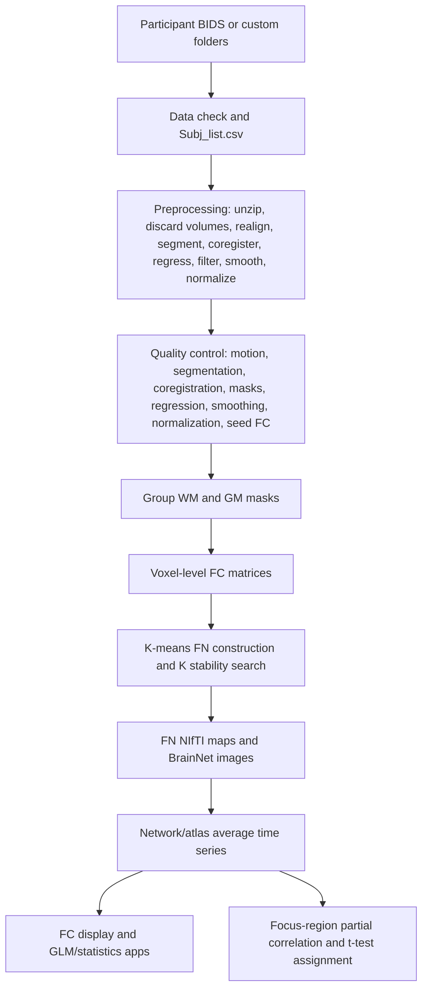

# Scientific Documentation Skeleton: WhiFuN Toolbox

Static review date: 2026-05-16. This report was generated from repository source files without executing MATLAB, SPM, FSL, AFNI, or App Designer GUIs. Function signatures and call graphs are source-static, not runtime-profiler traces.

## 1. Architectural Overview
- **High-level theory and purpose:** WhiFuN is a MATLAB toolbox for preprocessing BOLD fMRI, separating WM/GM tissue-informed signals, constructing WM and GM functional networks, extracting ROI/network average time series, computing FC matrices, visualizing network maps, and running FC association statistics.
- **Global external dependencies and required toolboxes:** MATLAB R2022a or later is recommended. Required MATLAB toolboxes from the README are Image Processing Toolbox, Signal Processing Toolbox, Statistics and Machine Learning Toolbox, and Bioinformatics Toolbox. Parallel Computing Toolbox is optional. The source also calls SPM12 extensively. Optional or alternate paths call FSL (`mcflirt`, `fsl_anat`, `epi_reg`, `applywarp`, `fslmaths`, `fast`, `bet`, `fsl_prepare_fieldmap`, `fugue`), AFNI (`align_epi_anat.py`, `3dcopy`), BrainNetViewer, SLover-like private visualization helpers, and `mexOMP` for K-SVD sparse coding.
- **System-level data flow diagram:**

## 2. Module-by-Module Deep Dive

### Coverage Map
- Source-bearing files reviewed: `232`.
- MATLAB/App/Shell callable records indexed: `983`.
- Non-source assets indexed separately: `131`.
- App Designer `.mlapp` files were opened as zip archives and their embedded `matlab/document.xml` code was parsed.
- BrainNetViewer, `parTicToc`, `uigetfile_n_dir`, and private SLover/MarsBaR-style helpers are bundled dependencies. They are indexed below, while first-party WhiFuN computational code receives the most detailed scientific interpretation.

### Module Name: `whifun.m`
- **Module Category:** Top-level WhiFuN entry point.
- **Theoretical Background:** No standalone mathematical model is implemented; this routine is a procedural wrapper, GUI helper, compatibility adapter, or file-format utility.
- **Key Features:**
  - WHIFUN White matter Functional Networks (WhiFuN) Toolbox Main Function. WHIFUN is the primary entry point for the GUI-based WhiFuN Toolbox, a comprehensive suite of tools for investigating brain functional connectivity in White Matter (WM) and Gray Matter (GM). It fully automates preprocessing steps to derive BOLD signals for WM and GM analysis. To start the GUI: >> whifun Requires: - MATLAB R2022a or later (recommended). - Image Processing Toolbox - Signal Processing Toolbox - Statistics and Machine Learning Toolbox - Bioinformatics Toolbox - SPM12 toolbox (must be downloaded and added to MAT
  - Internal calls detected: No internal WhiFuN calls detected.
  - External dependencies detected: BrainNet Viewer

#### Function: `whifun()`
- **Signature & Definition:** `function whifun(varargin)` (line 1)
- **Scientific Theory & Formulas:** Visualization modules use slice sampling, overlays, contours, colormaps, and surface or graph rendering without adding a separate inferential model. Data-management code preserves participant provenance, BIDS/custom path mapping, and reproducible bookkeeping.
- **Functional Purpose:** WHIFUN White matter Functional Networks (WhiFuN) Toolbox Main Function. WHIFUN is the primary entry point for the GUI-based WhiFuN Toolbox, a comprehensive suite of tools for investigating brain functional connectivity in White Matter (WM) and Gray Matter (GM). It fully automates preprocessing steps to derive BOLD signals for WM and GM analysis. To start the GUI: >> whifun Requires: - MATLAB R2022a or later (recommended). - Image Processing Toolbox - Signal Processing Toolbox - Statistics and Machine Learning Toolbox - Bioinformatics Toolbox - SPM12 toolbox (must be downloaded and added to MATLAB path). The function initializes the environment, displays a welcome message, provides links to d
- **Arguments:**
  - `varargin` (cell array of variable MATLAB arguments): Inferred from the signature, variable name, and source usage; precise validation occurs at MATLAB runtime.
- **Returns:**
  - No explicit return variable; outputs are files, figures, GUI state, console text, or modified structures.
- **Dependencies:**
  - Calls: No internal WhiFuN calls detected in this function body.
  - External: BrainNet Viewer
  - Called By: No internal caller detected by static scan; entry point, callback, script-local function, or externally invoked routine.
- **Edge Cases & Exceptions:** Defines defaults or branches for optional arguments or missing files.

### Module Name: `freq_per_band.mlapp`
- **Module Category:** App Designer GUI module.
- **Theoretical Background:** Band-pass filtering uses Butterworth IIR coefficients; forward-backward `filtfilt` cancels phase delay and squares the magnitude response. App Designer methods coordinate user interaction and inherit mathematical content from called WhiFuN routines.
- **Key Features:**
  - Properties that correspond to app components
  - Internal calls detected: No internal WhiFuN calls detected.
  - External dependencies detected: MATLAB App Designer

#### Function: `freq_per_band()`
- **Signature & Definition:** `classdef freq_per_band < matlab.apps.AppBase` (line 1)
- **Scientific Theory & Formulas:** Band-pass filtering uses Butterworth IIR coefficients; forward-backward `filtfilt` cancels phase delay and squares the magnitude response. App Designer methods coordinate user interaction and inherit mathematical content from called WhiFuN routines.
- **Functional Purpose:** Properties that correspond to app components
- **Arguments:**
  - No explicit input arguments.
- **Returns:**
  - `freq_per_band` (MATLAB App or class type): Class definition used to instantiate the module.
- **Dependencies:**
  - Calls: No internal WhiFuN calls detected in this function body.
  - External: MATLAB App Designer
  - Called By: `main.mlapp:1527/FrequenciesperbandButtonPushed`
- **Edge Cases & Exceptions:** No explicit defensive branch was detected; incompatible inputs will fail through MATLAB runtime behavior.

#### Function: `disable_fun()`
- **Signature & Definition:** `function disable_fun(app,num)` (line 47)
- **Scientific Theory & Formulas:** Band-pass filtering uses Butterworth IIR coefficients; forward-backward `filtfilt` cancels phase delay and squares the magnitude response. App Designer methods coordinate user interaction and inherit mathematical content from called WhiFuN routines.
- **Functional Purpose:** Properties that correspond to app components
- **Arguments:**
  - `app` (MATLAB App/UI object or callback handle): Inferred from the signature, variable name, and source usage; precise validation occurs at MATLAB runtime.
  - `num` (numeric scalar or numeric vector): Inferred from the signature, variable name, and source usage; precise validation occurs at MATLAB runtime.
- **Returns:**
  - No explicit return variable; outputs are files, figures, GUI state, console text, or modified structures.
- **Dependencies:**
  - Calls: No internal WhiFuN calls detected in this function body.
  - External: No major external dependency pattern detected beyond MATLAB base language.
  - Called By: No internal caller detected by static scan; entry point, callback, script-local function, or externally invoked routine.
- **Edge Cases & Exceptions:** No explicit defensive branch was detected; incompatible inputs will fail through MATLAB runtime behavior.

#### Function: `enable_fun()`
- **Signature & Definition:** `function enable_fun(app,num)` (line 87)
- **Scientific Theory & Formulas:** Band-pass filtering uses Butterworth IIR coefficients; forward-backward `filtfilt` cancels phase delay and squares the magnitude response. App Designer methods coordinate user interaction and inherit mathematical content from called WhiFuN routines.
- **Functional Purpose:** Properties that correspond to app components
- **Arguments:**
  - `app` (MATLAB App/UI object or callback handle): Inferred from the signature, variable name, and source usage; precise validation occurs at MATLAB runtime.
  - `num` (numeric scalar or numeric vector): Inferred from the signature, variable name, and source usage; precise validation occurs at MATLAB runtime.
- **Returns:**
  - No explicit return variable; outputs are files, figures, GUI state, console text, or modified structures.
- **Dependencies:**
  - Calls: No internal WhiFuN calls detected in this function body.
  - External: No major external dependency pattern detected beyond MATLAB base language.
  - Called By: No internal caller detected by static scan; entry point, callback, script-local function, or externally invoked routine.
- **Edge Cases & Exceptions:** No explicit defensive branch was detected; incompatible inputs will fail through MATLAB runtime behavior.

#### Function: `startupFcn()`
- **Signature & Definition:** `function startupFcn(app, caller, no_of_bands, band1_name, band1_lp, band1_hp, band2_name, band2_lp, band2_hp, band3_name, band3_lp, band3_hp, band4_name, band4_lp, band4_hp, band5_name, band5_lp, band5_hp, band6_name, band6_lp, band6_hp)` (line 135)
- **Scientific Theory & Formulas:** Band-pass filtering uses Butterworth IIR coefficients; forward-backward `filtfilt` cancels phase delay and squares the magnitude response. App Designer methods coordinate user interaction and inherit mathematical content from called WhiFuN routines.
- **Functional Purpose:** Properties that correspond to app components
- **Arguments:**
  - `app` (MATLAB App/UI object or callback handle): Inferred from the signature, variable name, and source usage; precise validation occurs at MATLAB runtime.
  - `caller` (MATLAB App/UI object or callback handle): Inferred from the signature, variable name, and source usage; precise validation occurs at MATLAB runtime.
  - `no_of_bands` (character vector, string scalar, or categorical option): Inferred from the signature, variable name, and source usage; precise validation occurs at MATLAB runtime.
  - `band1_name` (character vector, string scalar, or categorical option): Inferred from the signature, variable name, and source usage; precise validation occurs at MATLAB runtime.
  - `band1_lp` (numeric scalar or numeric vector): Inferred from the signature, variable name, and source usage; precise validation occurs at MATLAB runtime.
  - `band1_hp` (numeric scalar or numeric vector): Inferred from the signature, variable name, and source usage; precise validation occurs at MATLAB runtime.
  - `band2_name` (character vector, string scalar, or categorical option): Inferred from the signature, variable name, and source usage; precise validation occurs at MATLAB runtime.
  - `band2_lp` (numeric scalar or numeric vector): Inferred from the signature, variable name, and source usage; precise validation occurs at MATLAB runtime.
  - `band2_hp` (numeric scalar or numeric vector): Inferred from the signature, variable name, and source usage; precise validation occurs at MATLAB runtime.
  - `band3_name` (character vector, string scalar, or categorical option): Inferred from the signature, variable name, and source usage; precise validation occurs at MATLAB runtime.
  - `band3_lp` (numeric scalar or numeric vector): Inferred from the signature, variable name, and source usage; precise validation occurs at MATLAB runtime.
  - `band3_hp` (numeric scalar or numeric vector): Inferred from the signature, variable name, and source usage; precise validation occurs at MATLAB runtime.
  - `band4_name` (character vector, string scalar, or categorical option): Inferred from the signature, variable name, and source usage; precise validation occurs at MATLAB runtime.
  - `band4_lp` (numeric scalar or numeric vector): Inferred from the signature, variable name, and source usage; precise validation occurs at MATLAB runtime.
  - `band4_hp` (numeric scalar or numeric vector): Inferred from the signature, variable name, and source usage; precise validation occurs at MATLAB runtime.
  - `band5_name` (character vector, string scalar, or categorical option): Inferred from the signature, variable name, and source usage; precise validation occurs at MATLAB runtime.
  - `band5_lp` (numeric scalar or numeric vector): Inferred from the signature, variable name, and source usage; precise validation occurs at MATLAB runtime.
  - `band5_hp` (numeric scalar or numeric vector): Inferred from the signature, variable name, and source usage; precise validation occurs at MATLAB runtime.
  - `band6_name` (character vector, string scalar, or categorical option): Inferred from the signature, variable name, and source usage; precise validation occurs at MATLAB runtime.
  - `band6_lp` (numeric scalar or numeric vector): Inferred from the signature, variable name, and source usage; precise validation occurs at MATLAB runtime.
  - `band6_hp` (numeric scalar or numeric vector): Inferred from the signature, variable name, and source usage; precise validation occurs at MATLAB runtime.
- **Returns:**
  - No explicit return variable; outputs are files, figures, GUI state, console text, or modified structures.
- **Dependencies:**
  - Calls: No internal WhiFuN calls detected in this function body.
  - External: No major external dependency pattern detected beyond MATLAB base language.
  - Called By: No internal caller detected by static scan; entry point, callback, script-local function, or externally invoked routine.
- **Edge Cases & Exceptions:** No explicit defensive branch was detected; incompatible inputs will fail through MATLAB runtime behavior.

#### Function: `SubmitButtonPushed()`
- **Signature & Definition:** `function SubmitButtonPushed(app, event)` (line 214)
- **Scientific Theory & Formulas:** Band-pass filtering uses Butterworth IIR coefficients; forward-backward `filtfilt` cancels phase delay and squares the magnitude response. App Designer methods coordinate user interaction and inherit mathematical content from called WhiFuN routines.
- **Functional Purpose:** Properties that correspond to app components
- **Arguments:**
  - `app` (MATLAB App/UI object or callback handle): Inferred from the signature, variable name, and source usage; precise validation occurs at MATLAB runtime.
  - `event` (MATLAB App/UI object or callback handle): Inferred from the signature, variable name, and source usage; precise validation occurs at MATLAB runtime.
- **Returns:**
  - No explicit return variable; outputs are files, figures, GUI state, console text, or modified structures.
- **Dependencies:**
  - Calls: No internal WhiFuN calls detected in this function body.
  - External: No major external dependency pattern detected beyond MATLAB base language.
  - Called By: No internal caller detected by static scan; entry point, callback, script-local function, or externally invoked routine.
- **Edge Cases & Exceptions:** No explicit defensive branch was detected; incompatible inputs will fail through MATLAB runtime behavior.

#### Function: `createComponents()`
- **Signature & Definition:** `function createComponents(app)` (line 241)
- **Scientific Theory & Formulas:** Band-pass filtering uses Butterworth IIR coefficients; forward-backward `filtfilt` cancels phase delay and squares the magnitude response. Data-management code preserves participant provenance, BIDS/custom path mapping, and reproducible bookkeeping. App Designer methods coordinate user interaction and inherit mathematical content from called WhiFuN routines.
- **Functional Purpose:** Get the file path for locating images
- **Arguments:**
  - `app` (MATLAB App/UI object or callback handle): Inferred from the signature, variable name, and source usage; precise validation occurs at MATLAB runtime.
- **Returns:**
  - No explicit return variable; outputs are files, figures, GUI state, console text, or modified structures.
- **Dependencies:**
  - Calls: No internal WhiFuN calls detected in this function body.
  - External: No major external dependency pattern detected beyond MATLAB base language.
  - Called By: No internal caller detected by static scan; entry point, callback, script-local function, or externally invoked routine.
- **Edge Cases & Exceptions:** Handles NaN, Inf, or finite-value filtering.

#### Function: `freq_per_band()`
- **Signature & Definition:** `function app = freq_per_band(varargin)` (line 440)
- **Scientific Theory & Formulas:** Band-pass filtering uses Butterworth IIR coefficients; forward-backward `filtfilt` cancels phase delay and squares the magnitude response. Visualization modules use slice sampling, overlays, contours, colormaps, and surface or graph rendering without adding a separate inferential model. App Designer methods coordinate user interaction and inherit mathematical content from called WhiFuN routines.
- **Functional Purpose:** Create UIFigure and components
- **Arguments:**
  - `varargin` (cell array of variable MATLAB arguments): Inferred from the signature, variable name, and source usage; precise validation occurs at MATLAB runtime.
- **Returns:**
  - `app` (MATLAB App/UI object or callback handle): Output produced by the MATLAB implementation.
- **Dependencies:**
  - Calls: No internal WhiFuN calls detected in this function body.
  - External: No major external dependency pattern detected beyond MATLAB base language.
  - Called By: `main.mlapp:1527/FrequenciesperbandButtonPushed`
- **Edge Cases & Exceptions:** No explicit defensive branch was detected; incompatible inputs will fail through MATLAB runtime behavior.

#### Function: `delete()`
- **Signature & Definition:** `function delete(app)` (line 457)
- **Scientific Theory & Formulas:** Band-pass filtering uses Butterworth IIR coefficients; forward-backward `filtfilt` cancels phase delay and squares the magnitude response. Visualization modules use slice sampling, overlays, contours, colormaps, and surface or graph rendering without adding a separate inferential model. App Designer methods coordinate user interaction and inherit mathematical content from called WhiFuN routines.
- **Functional Purpose:** Delete UIFigure when app is deleted
- **Arguments:**
  - `app` (MATLAB App/UI object or callback handle): Inferred from the signature, variable name, and source usage; precise validation occurs at MATLAB runtime.
- **Returns:**
  - No explicit return variable; outputs are files, figures, GUI state, console text, or modified structures.
- **Dependencies:**
  - Calls: No internal WhiFuN calls detected in this function body.
  - External: No major external dependency pattern detected beyond MATLAB base language.
  - Called By: No internal caller detected by static scan; entry point, callback, script-local function, or externally invoked routine.
- **Edge Cases & Exceptions:** No explicit defensive branch was detected; incompatible inputs will fail through MATLAB runtime behavior.

### Module Name: `main.mlapp`
- **Module Category:** App Designer GUI module.
- **Theoretical Background:** App Designer methods coordinate user interaction and inherit mathematical content from called WhiFuN routines.
- **Key Features:**
  - Properties that correspond to app components
  - Internal calls detected: `BrainNet_MapCfg_WhifuN`, `dice_iou`, `freq_per_band`, `load_subjects`, `load_subjects_all`, `motion_threshold_select`, `my_writetable`, `PCA_regression_parameters`, `rerunpreproc`, `Sub_info`, `Subject_data_folder_details`, `uigetfile_n_dir`, `update_csv`, `whifun_addpath_and_create_preproc_folders`, `whifun_check_data`, `whifun_create_avg_ts`, `whifun_create_fields_preproc`, `whifun_create_file`, `whifun_create_FN_Kmeans`, `whifun_create_FN_Kmeans_WM_GM`, `whifun_create_group_mask`, `whifun_create_Subj_list_all_from_Subj_folder_details`, `whifun_dartel`, `whifun_dartel_normalize_smooth`, `whifun_delete`, `whifun_dir`, `whifun_display_FC`, `whifun_niftiread`, `whifun_plot_data_check_figures`, `whifun_preproc` plus 7 more
  - External dependencies detected: MATLAB App Designer, MATLAB NIfTI I/O, MATLAB table/file I/O, Parallel Computing Toolbox, SPM12, ANTs command-line suite, BrainNet Viewer, SLover/MarsBaR-style visualization helpers

#### Function: `main()`
- **Signature & Definition:** `classdef main < matlab.apps.AppBase` (line 1)
- **Scientific Theory & Formulas:** App Designer methods coordinate user interaction and inherit mathematical content from called WhiFuN routines.
- **Functional Purpose:** Properties that correspond to app components
- **Arguments:**
  - No explicit input arguments.
- **Returns:**
  - `main` (MATLAB App or class type): Class definition used to instantiate the module.
- **Dependencies:**
  - Calls: No internal WhiFuN calls detected in this function body.
  - External: MATLAB App Designer, ANTs command-line suite
  - Called By: No internal caller detected by static scan; entry point, callback, script-local function, or externally invoked routine.
- **Edge Cases & Exceptions:** Handles NaN, Inf, or finite-value filtering.

#### Function: `load_param()`
- **Signature & Definition:** `function load_param(app,load_folder,load_name)` (line 204)
- **Scientific Theory & Formulas:** App Designer methods coordinate user interaction and inherit mathematical content from called WhiFuN routines.
- **Functional Purpose:** Properties that correspond to app components
- **Arguments:**
  - `app` (MATLAB App/UI object or callback handle): Inferred from the signature, variable name, and source usage; precise validation occurs at MATLAB runtime.
  - `load_folder` (character vector or string scalar filesystem path): Inferred from the signature, variable name, and source usage; precise validation occurs at MATLAB runtime.
  - `load_name` (character vector, string scalar, or categorical option): Inferred from the signature, variable name, and source usage; precise validation occurs at MATLAB runtime.
- **Returns:**
  - No explicit return variable; outputs are files, figures, GUI state, console text, or modified structures.
- **Dependencies:**
  - Calls: `load_subjects`
  - External: MATLAB table/file I/O, ANTs command-line suite
  - Called By: No internal caller detected by static scan; entry point, callback, script-local function, or externally invoked routine.
- **Edge Cases & Exceptions:** Defines defaults or branches for optional arguments or missing files. Uses try/catch; failures are logged, displayed, or returned.

#### Function: `load_subjects_dropdown()`
- **Signature & Definition:** `function load_subjects_dropdown(app,Subj_list,select_by)` (line 314)
- **Scientific Theory & Formulas:** Data-management code preserves participant provenance, BIDS/custom path mapping, and reproducible bookkeeping. App Designer methods coordinate user interaction and inherit mathematical content from called WhiFuN routines.
- **Functional Purpose:** Properties that correspond to app components
- **Arguments:**
  - `app` (MATLAB App/UI object or callback handle): Inferred from the signature, variable name, and source usage; precise validation occurs at MATLAB runtime.
  - `Subj_list` (structure array containing participant metadata and paths): Inferred from the signature, variable name, and source usage; precise validation occurs at MATLAB runtime.
  - `select_by` (MATLAB value inferred from source usage): Inferred from the signature, variable name, and source usage; precise validation occurs at MATLAB runtime.
- **Returns:**
  - No explicit return variable; outputs are files, figures, GUI state, console text, or modified structures.
- **Dependencies:**
  - Calls: No internal WhiFuN calls detected in this function body.
  - External: ANTs command-line suite
  - Called By: No internal caller detected by static scan; entry point, callback, script-local function, or externally invoked routine.
- **Edge Cases & Exceptions:** Defines defaults or branches for optional arguments or missing files. Checks empty arrays, missing files, or empty user selections.

#### Function: `load_subjects_dropdown2()`
- **Signature & Definition:** `function load_subjects_dropdown2(app,Subj_list)` (line 335)
- **Scientific Theory & Formulas:** Data-management code preserves participant provenance, BIDS/custom path mapping, and reproducible bookkeeping. App Designer methods coordinate user interaction and inherit mathematical content from called WhiFuN routines.
- **Functional Purpose:** Properties that correspond to app components
- **Arguments:**
  - `app` (MATLAB App/UI object or callback handle): Inferred from the signature, variable name, and source usage; precise validation occurs at MATLAB runtime.
  - `Subj_list` (structure array containing participant metadata and paths): Inferred from the signature, variable name, and source usage; precise validation occurs at MATLAB runtime.
- **Returns:**
  - No explicit return variable; outputs are files, figures, GUI state, console text, or modified structures.
- **Dependencies:**
  - Calls: No internal WhiFuN calls detected in this function body.
  - External: ANTs command-line suite
  - Called By: No internal caller detected by static scan; entry point, callback, script-local function, or externally invoked routine.
- **Edge Cases & Exceptions:** Checks empty arrays, missing files, or empty user selections.

#### Function: `save_param()`
- **Signature & Definition:** `function save_param(app,save_name,save_folder)` (line 347)
- **Scientific Theory & Formulas:** App Designer methods coordinate user interaction and inherit mathematical content from called WhiFuN routines.
- **Functional Purpose:** Properties that correspond to app components
- **Arguments:**
  - `app` (MATLAB App/UI object or callback handle): Inferred from the signature, variable name, and source usage; precise validation occurs at MATLAB runtime.
  - `save_name` (character vector, string scalar, or categorical option): Inferred from the signature, variable name, and source usage; precise validation occurs at MATLAB runtime.
  - `save_folder` (character vector or string scalar filesystem path): Inferred from the signature, variable name, and source usage; precise validation occurs at MATLAB runtime.
- **Returns:**
  - No explicit return variable; outputs are files, figures, GUI state, console text, or modified structures.
- **Dependencies:**
  - Calls: `whifun_save_parameters`
  - External: No major external dependency pattern detected beyond MATLAB base language.
  - Called By: No internal caller detected by static scan; entry point, callback, script-local function, or externally invoked routine.
- **Edge Cases & Exceptions:** No explicit defensive branch was detected; incompatible inputs will fail through MATLAB runtime behavior.

#### Function: `get_symettry()`
- **Signature & Definition:** `function Dice_coef_LR = get_symettry(~,current_clustering_solution)` (line 386)
- **Scientific Theory & Formulas:** K-means minimizes $\sum_i \lVert x_i-\mu_{c_i}\rVert_d^2$; WhiFuN uses correlation-distance voxel-connectivity features for FN maps. Overlap and stability use Dice $D(A,B)=\frac{2|A\cap B|}{|A|+|B|}$ and IoU $J(A,B)=\frac{|A\cap B|}{|A\cup B|}$. Data-management code preserves participant provenance, BIDS/custom path mapping, and reproducible bookkeeping. App Designer methods coordinate user interaction and inherit mathematical content from called WhiFuN routines.
- **Functional Purpose:** separating the left and right sides of the clustering solutions, and flipping the right side, for whifun_direct comparison to the left
- **Arguments:**
  - `~` (unused placeholder): Inferred from the signature, variable name, and source usage; precise validation occurs at MATLAB runtime.
  - `current_clustering_solution` (numeric scalar, vector, matrix, or multidimensional array): Inferred from the signature, variable name, and source usage; precise validation occurs at MATLAB runtime.
- **Returns:**
  - `Dice_coef_LR` (MATLAB value inferred from source usage): Output produced by the MATLAB implementation.
- **Dependencies:**
  - Calls: No internal WhiFuN calls detected in this function body.
  - External: No major external dependency pattern detected beyond MATLAB base language.
  - Called By: No internal caller detected by static scan; entry point, callback, script-local function, or externally invoked routine.
- **Edge Cases & Exceptions:** No explicit defensive branch was detected; incompatible inputs will fail through MATLAB runtime behavior.

#### Function: `get_symettry_indi()`
- **Signature & Definition:** `function Dice_coef_LR = get_symettry_indi(~,current_clustering_solution)` (line 417)
- **Scientific Theory & Formulas:** K-means minimizes $\sum_i \lVert x_i-\mu_{c_i}\rVert_d^2$; WhiFuN uses correlation-distance voxel-connectivity features for FN maps. Overlap and stability use Dice $D(A,B)=\frac{2|A\cap B|}{|A|+|B|}$ and IoU $J(A,B)=\frac{|A\cap B|}{|A\cup B|}$. Data-management code preserves participant provenance, BIDS/custom path mapping, and reproducible bookkeeping. App Designer methods coordinate user interaction and inherit mathematical content from called WhiFuN routines.
- **Functional Purpose:** separating the left and right sides of the clustering solutions, and flipping the right side, for whifun_direct comparison to the left
- **Arguments:**
  - `~` (unused placeholder): Inferred from the signature, variable name, and source usage; precise validation occurs at MATLAB runtime.
  - `current_clustering_solution` (numeric scalar, vector, matrix, or multidimensional array): Inferred from the signature, variable name, and source usage; precise validation occurs at MATLAB runtime.
- **Returns:**
  - `Dice_coef_LR` (MATLAB value inferred from source usage): Output produced by the MATLAB implementation.
- **Dependencies:**
  - Calls: `dice_iou`
  - External: No major external dependency pattern detected beyond MATLAB base language.
  - Called By: No internal caller detected by static scan; entry point, callback, script-local function, or externally invoked routine.
- **Edge Cases & Exceptions:** No explicit defensive branch was detected; incompatible inputs will fail through MATLAB runtime behavior.

#### Function: `tooltip()`
- **Signature & Definition:** `function tooltip(app)` (line 437)
- **Scientific Theory & Formulas:** Data-management code preserves participant provenance, BIDS/custom path mapping, and reproducible bookkeeping. App Designer methods coordinate user interaction and inherit mathematical content from called WhiFuN routines.
- **Functional Purpose:** addpaths
- **Arguments:**
  - `app` (MATLAB App/UI object or callback handle): Inferred from the signature, variable name, and source usage; precise validation occurs at MATLAB runtime.
- **Returns:**
  - No explicit return variable; outputs are files, figures, GUI state, console text, or modified structures.
- **Dependencies:**
  - Calls: No internal WhiFuN calls detected in this function body.
  - External: ANTs command-line suite
  - Called By: No internal caller detected by static scan; entry point, callback, script-local function, or externally invoked routine.
- **Edge Cases & Exceptions:** Handles NaN, Inf, or finite-value filtering.

#### Function: `ParticipantDatafolderButtonPushed()`
- **Signature & Definition:** `function ParticipantDatafolderButtonPushed(app, event)` (line 550)
- **Scientific Theory & Formulas:** App Designer methods coordinate user interaction and inherit mathematical content from called WhiFuN routines.
- **Functional Purpose:** Properties that correspond to app components
- **Arguments:**
  - `app` (MATLAB App/UI object or callback handle): Inferred from the signature, variable name, and source usage; precise validation occurs at MATLAB runtime.
  - `event` (MATLAB App/UI object or callback handle): Inferred from the signature, variable name, and source usage; precise validation occurs at MATLAB runtime.
- **Returns:**
  - No explicit return variable; outputs are files, figures, GUI state, console text, or modified structures.
- **Dependencies:**
  - Calls: `whifun_dir`
  - External: No major external dependency pattern detected beyond MATLAB base language.
  - Called By: No internal caller detected by static scan; entry point, callback, script-local function, or externally invoked routine.
- **Edge Cases & Exceptions:** Uses try/catch; failures are logged, displayed, or returned.

#### Function: `OutputsfolderButtonPushed()`
- **Signature & Definition:** `function OutputsfolderButtonPushed(app, event)` (line 582)
- **Scientific Theory & Formulas:** App Designer methods coordinate user interaction and inherit mathematical content from called WhiFuN routines.
- **Functional Purpose:** Properties that correspond to app components
- **Arguments:**
  - `app` (MATLAB App/UI object or callback handle): Inferred from the signature, variable name, and source usage; precise validation occurs at MATLAB runtime.
  - `event` (MATLAB App/UI object or callback handle): Inferred from the signature, variable name, and source usage; precise validation occurs at MATLAB runtime.
- **Returns:**
  - No explicit return variable; outputs are files, figures, GUI state, console text, or modified structures.
- **Dependencies:**
  - Calls: No internal WhiFuN calls detected in this function body.
  - External: No major external dependency pattern detected beyond MATLAB base language.
  - Called By: No internal caller detected by static scan; entry point, callback, script-local function, or externally invoked routine.
- **Edge Cases & Exceptions:** Uses try/catch; failures are logged, displayed, or returned.

#### Function: `SaveParametersButtonPushed()`
- **Signature & Definition:** `function SaveParametersButtonPushed(app, event)` (line 593)
- **Scientific Theory & Formulas:** App Designer methods coordinate user interaction and inherit mathematical content from called WhiFuN routines.
- **Functional Purpose:** Properties that correspond to app components
- **Arguments:**
  - `app` (MATLAB App/UI object or callback handle): Inferred from the signature, variable name, and source usage; precise validation occurs at MATLAB runtime.
  - `event` (MATLAB App/UI object or callback handle): Inferred from the signature, variable name, and source usage; precise validation occurs at MATLAB runtime.
- **Returns:**
  - No explicit return variable; outputs are files, figures, GUI state, console text, or modified structures.
- **Dependencies:**
  - Calls: No internal WhiFuN calls detected in this function body.
  - External: No major external dependency pattern detected beyond MATLAB base language.
  - Called By: No internal caller detected by static scan; entry point, callback, script-local function, or externally invoked routine.
- **Edge Cases & Exceptions:** Uses try/catch; failures are logged, displayed, or returned.

#### Function: `LoadParametersButtonPushed()`
- **Signature & Definition:** `function LoadParametersButtonPushed(app, event)` (line 604)
- **Scientific Theory & Formulas:** App Designer methods coordinate user interaction and inherit mathematical content from called WhiFuN routines.
- **Functional Purpose:** Properties that correspond to app components
- **Arguments:**
  - `app` (MATLAB App/UI object or callback handle): Inferred from the signature, variable name, and source usage; precise validation occurs at MATLAB runtime.
  - `event` (MATLAB App/UI object or callback handle): Inferred from the signature, variable name, and source usage; precise validation occurs at MATLAB runtime.
- **Returns:**
  - No explicit return variable; outputs are files, figures, GUI state, console text, or modified structures.
- **Dependencies:**
  - Calls: No internal WhiFuN calls detected in this function body.
  - External: No major external dependency pattern detected beyond MATLAB base language.
  - Called By: No internal caller detected by static scan; entry point, callback, script-local function, or externally invoked routine.
- **Edge Cases & Exceptions:** Uses try/catch; failures are logged, displayed, or returned.

#### Function: `RunPreprocessingButtonPushed()`
- **Signature & Definition:** `function RunPreprocessingButtonPushed(app, event)` (line 616)
- **Scientific Theory & Formulas:** Data-management code preserves participant provenance, BIDS/custom path mapping, and reproducible bookkeeping. App Designer methods coordinate user interaction and inherit mathematical content from called WhiFuN routines.
- **Functional Purpose:** % This code written by Pratik Jain. % This code was written with the help of different preprocessing scripts given by % Dr. Xin Di, Dr. Rakibul Hafeez, Dr. Wang Pan, Donna Chen and Wonbum Sohn % Under guidance of Dr Andrew Micheal and Dr. Bharat Biswal. % Defining Important paths and Creating Output whifun_directories
- **Arguments:**
  - `app` (MATLAB App/UI object or callback handle): Inferred from the signature, variable name, and source usage; precise validation occurs at MATLAB runtime.
  - `event` (MATLAB App/UI object or callback handle): Inferred from the signature, variable name, and source usage; precise validation occurs at MATLAB runtime.
- **Returns:**
  - No explicit return variable; outputs are files, figures, GUI state, console text, or modified structures.
- **Dependencies:**
  - Calls: `load_subjects`, `load_subjects_all`, `update_csv`, `whifun_create_fields_preproc`, `whifun_dartel`, `whifun_dartel_normalize_smooth`, `whifun_delete`, `whifun_dir`, `whifun_preproc`, `whifun_qc`, `whifun_update_waitbar`, `write_error`
  - External: MATLAB App Designer, MATLAB table/file I/O, Parallel Computing Toolbox, SPM12, ANTs command-line suite, SLover/MarsBaR-style visualization helpers
  - Called By: No internal caller detected by static scan; entry point, callback, script-local function, or externally invoked routine.
- **Edge Cases & Exceptions:** Defines defaults or branches for optional arguments or missing files. Uses try/catch; failures are logged, displayed, or returned. Checks empty arrays, missing files, or empty user selections. Emits warnings for recoverable conditions. Raises MATLAB errors for invalid dimensions, missing files, invalid parameters, or failed commands. May pause for interactive user input, which affects batch reproducibility.

#### Function: `RunDataCheckButtonPushed()`
- **Signature & Definition:** `function RunDataCheckButtonPushed(app, event)` (line 1026)
- **Scientific Theory & Formulas:** App Designer methods coordinate user interaction and inherit mathematical content from called WhiFuN routines.
- **Functional Purpose:** Properties that correspond to app components
- **Arguments:**
  - `app` (MATLAB App/UI object or callback handle): Inferred from the signature, variable name, and source usage; precise validation occurs at MATLAB runtime.
  - `event` (MATLAB App/UI object or callback handle): Inferred from the signature, variable name, and source usage; precise validation occurs at MATLAB runtime.
- **Returns:**
  - No explicit return variable; outputs are files, figures, GUI state, console text, or modified structures.
- **Dependencies:**
  - Calls: `load_subjects`, `load_subjects_all`, `whifun_addpath_and_create_preproc_folders`, `whifun_check_data`, `whifun_create_Subj_list_all_from_Subj_folder_details`, `whifun_plot_data_check_figures`
  - External: MATLAB App Designer, ANTs command-line suite
  - Called By: No internal caller detected by static scan; entry point, callback, script-local function, or externally invoked routine.
- **Edge Cases & Exceptions:** Defines defaults or branches for optional arguments or missing files. Checks empty arrays, missing files, or empty user selections. May pause for interactive user input, which affects batch reproducibility.

#### Function: `BIDSCheckBoxValueChanged()`
- **Signature & Definition:** `function BIDSCheckBoxValueChanged(app, event)` (line 1091)
- **Scientific Theory & Formulas:** Data-management code preserves participant provenance, BIDS/custom path mapping, and reproducible bookkeeping. App Designer methods coordinate user interaction and inherit mathematical content from called WhiFuN routines.
- **Functional Purpose:** Properties that correspond to app components
- **Arguments:**
  - `app` (MATLAB App/UI object or callback handle): Inferred from the signature, variable name, and source usage; precise validation occurs at MATLAB runtime.
  - `event` (MATLAB App/UI object or callback handle): Inferred from the signature, variable name, and source usage; precise validation occurs at MATLAB runtime.
- **Returns:**
  - No explicit return variable; outputs are files, figures, GUI state, console text, or modified structures.
- **Dependencies:**
  - Calls: `Subject_data_folder_details`
  - External: MATLAB App Designer
  - Called By: No internal caller detected by static scan; entry point, callback, script-local function, or externally invoked routine.
- **Edge Cases & Exceptions:** May pause for interactive user input, which affects batch reproducibility.

#### Function: `NuisanceRegressionDropDownValueChanged()`
- **Signature & Definition:** `function NuisanceRegressionDropDownValueChanged(app, event)` (line 1127)
- **Scientific Theory & Formulas:** Linear models use $y=X\beta+\varepsilon$; residualized data are $\hat{\varepsilon}=y-X\hat{\beta}$, with temporal means often added back. App Designer methods coordinate user interaction and inherit mathematical content from called WhiFuN routines.
- **Functional Purpose:** Properties that correspond to app components
- **Arguments:**
  - `app` (MATLAB App/UI object or callback handle): Inferred from the signature, variable name, and source usage; precise validation occurs at MATLAB runtime.
  - `event` (MATLAB App/UI object or callback handle): Inferred from the signature, variable name, and source usage; precise validation occurs at MATLAB runtime.
- **Returns:**
  - No explicit return variable; outputs are files, figures, GUI state, console text, or modified structures.
- **Dependencies:**
  - Calls: `PCA_regression_parameters`
  - External: No major external dependency pattern detected beyond MATLAB base language.
  - Called By: No internal caller detected by static scan; entry point, callback, script-local function, or externally invoked routine.
- **Edge Cases & Exceptions:** No explicit defensive branch was detected; incompatible inputs will fail through MATLAB runtime behavior.

#### Function: `DisplayFNButtonPushed()`
- **Signature & Definition:** `function DisplayFNButtonPushed(app, event)` (line 1145)
- **Scientific Theory & Formulas:** Visualization modules use slice sampling, overlays, contours, colormaps, and surface or graph rendering without adding a separate inferential model. App Designer methods coordinate user interaction and inherit mathematical content from called WhiFuN routines.
- **Functional Purpose:** Properties that correspond to app components
- **Arguments:**
  - `app` (MATLAB App/UI object or callback handle): Inferred from the signature, variable name, and source usage; precise validation occurs at MATLAB runtime.
  - `event` (MATLAB App/UI object or callback handle): Inferred from the signature, variable name, and source usage; precise validation occurs at MATLAB runtime.
- **Returns:**
  - No explicit return variable; outputs are files, figures, GUI state, console text, or modified structures.
- **Dependencies:**
  - Calls: `BrainNet_MapCfg_WhifuN`
  - External: MATLAB NIfTI I/O, SPM12, BrainNet Viewer
  - Called By: No internal caller detected by static scan; entry point, callback, script-local function, or externally invoked routine.
- **Edge Cases & Exceptions:** Uses try/catch; failures are logged, displayed, or returned. Checks empty arrays, missing files, or empty user selections. May pause for interactive user input, which affects batch reproducibility.

#### Function: `DisplayFCButtonPushed()`
- **Signature & Definition:** `function DisplayFCButtonPushed(app, event)` (line 1192)
- **Scientific Theory & Formulas:** Visualization modules use slice sampling, overlays, contours, colormaps, and surface or graph rendering without adding a separate inferential model. App Designer methods coordinate user interaction and inherit mathematical content from called WhiFuN routines.
- **Functional Purpose:** Properties that correspond to app components
- **Arguments:**
  - `app` (MATLAB App/UI object or callback handle): Inferred from the signature, variable name, and source usage; precise validation occurs at MATLAB runtime.
  - `event` (MATLAB App/UI object or callback handle): Inferred from the signature, variable name, and source usage; precise validation occurs at MATLAB runtime.
- **Returns:**
  - No explicit return variable; outputs are files, figures, GUI state, console text, or modified structures.
- **Dependencies:**
  - Calls: `whifun_display_FC`
  - External: No major external dependency pattern detected beyond MATLAB base language.
  - Called By: No internal caller detected by static scan; entry point, callback, script-local function, or externally invoked routine.
- **Edge Cases & Exceptions:** Defines defaults or branches for optional arguments or missing files. Uses try/catch; failures are logged, displayed, or returned. Checks empty arrays, missing files, or empty user selections.

#### Function: `CreateGroupMasksButtonPushed()`
- **Signature & Definition:** `function CreateGroupMasksButtonPushed(app, event)` (line 1223)
- **Scientific Theory & Formulas:** App Designer methods coordinate user interaction and inherit mathematical content from called WhiFuN routines.
- **Functional Purpose:** Properties that correspond to app components
- **Arguments:**
  - `app` (MATLAB App/UI object or callback handle): Inferred from the signature, variable name, and source usage; precise validation occurs at MATLAB runtime.
  - `event` (MATLAB App/UI object or callback handle): Inferred from the signature, variable name, and source usage; precise validation occurs at MATLAB runtime.
- **Returns:**
  - No explicit return variable; outputs are files, figures, GUI state, console text, or modified structures.
- **Dependencies:**
  - Calls: `load_subjects`, `whifun_create_group_mask`
  - External: MATLAB App Designer, ANTs command-line suite
  - Called By: No internal caller detected by static scan; entry point, callback, script-local function, or externally invoked routine.
- **Edge Cases & Exceptions:** Checks empty arrays, missing files, or empty user selections.

#### Function: `WMGroupMaskButtonPushed()`
- **Signature & Definition:** `function WMGroupMaskButtonPushed(app, event)` (line 1254)
- **Scientific Theory & Formulas:** App Designer methods coordinate user interaction and inherit mathematical content from called WhiFuN routines.
- **Functional Purpose:** Properties that correspond to app components
- **Arguments:**
  - `app` (MATLAB App/UI object or callback handle): Inferred from the signature, variable name, and source usage; precise validation occurs at MATLAB runtime.
  - `event` (MATLAB App/UI object or callback handle): Inferred from the signature, variable name, and source usage; precise validation occurs at MATLAB runtime.
- **Returns:**
  - No explicit return variable; outputs are files, figures, GUI state, console text, or modified structures.
- **Dependencies:**
  - Calls: `whifun_niftiread`
  - External: MATLAB NIfTI I/O, ANTs command-line suite
  - Called By: No internal caller detected by static scan; entry point, callback, script-local function, or externally invoked routine.
- **Edge Cases & Exceptions:** Uses try/catch; failures are logged, displayed, or returned. Checks empty arrays, missing files, or empty user selections. Raises MATLAB errors for invalid dimensions, missing files, invalid parameters, or failed commands.

#### Function: `WMFNTabButtonDown()`
- **Signature & Definition:** `function WMFNTabButtonDown(app, event)` (line 1280)
- **Scientific Theory & Formulas:** App Designer methods coordinate user interaction and inherit mathematical content from called WhiFuN routines.
- **Functional Purpose:** Properties that correspond to app components
- **Arguments:**
  - `app` (MATLAB App/UI object or callback handle): Inferred from the signature, variable name, and source usage; precise validation occurs at MATLAB runtime.
  - `event` (MATLAB App/UI object or callback handle): Inferred from the signature, variable name, and source usage; precise validation occurs at MATLAB runtime.
- **Returns:**
  - No explicit return variable; outputs are files, figures, GUI state, console text, or modified structures.
- **Dependencies:**
  - Calls: `whifun_create_file`
  - External: ANTs command-line suite
  - Called By: No internal caller detected by static scan; entry point, callback, script-local function, or externally invoked routine.
- **Edge Cases & Exceptions:** Checks empty arrays, missing files, or empty user selections.

#### Function: `CreateWMFNButtonPushed()`
- **Signature & Definition:** `function CreateWMFNButtonPushed(app, event)` (line 1298)
- **Scientific Theory & Formulas:** K-means minimizes $\sum_i \lVert x_i-\mu_{c_i}\rVert_d^2$; WhiFuN uses correlation-distance voxel-connectivity features for FN maps. App Designer methods coordinate user interaction and inherit mathematical content from called WhiFuN routines.
- **Functional Purpose:** % Clustering WM Functional networks
- **Arguments:**
  - `app` (MATLAB App/UI object or callback handle): Inferred from the signature, variable name, and source usage; precise validation occurs at MATLAB runtime.
  - `event` (MATLAB App/UI object or callback handle): Inferred from the signature, variable name, and source usage; precise validation occurs at MATLAB runtime.
- **Returns:**
  - No explicit return variable; outputs are files, figures, GUI state, console text, or modified structures.
- **Dependencies:**
  - Calls: `load_subjects`, `whifun_create_FN_Kmeans`
  - External: MATLAB App Designer, ANTs command-line suite
  - Called By: No internal caller detected by static scan; entry point, callback, script-local function, or externally invoked routine.
- **Edge Cases & Exceptions:** Uses try/catch; failures are logged, displayed, or returned. Checks empty arrays, missing files, or empty user selections.

#### Function: `GMFNTabButtonDown()`
- **Signature & Definition:** `function GMFNTabButtonDown(app, event)` (line 1364)
- **Scientific Theory & Formulas:** App Designer methods coordinate user interaction and inherit mathematical content from called WhiFuN routines.
- **Functional Purpose:** Properties that correspond to app components
- **Arguments:**
  - `app` (MATLAB App/UI object or callback handle): Inferred from the signature, variable name, and source usage; precise validation occurs at MATLAB runtime.
  - `event` (MATLAB App/UI object or callback handle): Inferred from the signature, variable name, and source usage; precise validation occurs at MATLAB runtime.
- **Returns:**
  - No explicit return variable; outputs are files, figures, GUI state, console text, or modified structures.
- **Dependencies:**
  - Calls: `whifun_create_file`
  - External: ANTs command-line suite
  - Called By: No internal caller detected by static scan; entry point, callback, script-local function, or externally invoked routine.
- **Edge Cases & Exceptions:** Checks empty arrays, missing files, or empty user selections.

#### Function: `GMGroupMaskButtonPushed()`
- **Signature & Definition:** `function GMGroupMaskButtonPushed(app, event)` (line 1382)
- **Scientific Theory & Formulas:** App Designer methods coordinate user interaction and inherit mathematical content from called WhiFuN routines.
- **Functional Purpose:** Properties that correspond to app components
- **Arguments:**
  - `app` (MATLAB App/UI object or callback handle): Inferred from the signature, variable name, and source usage; precise validation occurs at MATLAB runtime.
  - `event` (MATLAB App/UI object or callback handle): Inferred from the signature, variable name, and source usage; precise validation occurs at MATLAB runtime.
- **Returns:**
  - No explicit return variable; outputs are files, figures, GUI state, console text, or modified structures.
- **Dependencies:**
  - Calls: `whifun_niftiread`
  - External: MATLAB NIfTI I/O, ANTs command-line suite
  - Called By: No internal caller detected by static scan; entry point, callback, script-local function, or externally invoked routine.
- **Edge Cases & Exceptions:** Uses try/catch; failures are logged, displayed, or returned. Checks empty arrays, missing files, or empty user selections. Raises MATLAB errors for invalid dimensions, missing files, invalid parameters, or failed commands.

#### Function: `CreateGMFNButtonPushed()`
- **Signature & Definition:** `function CreateGMFNButtonPushed(app, event)` (line 1408)
- **Scientific Theory & Formulas:** K-means minimizes $\sum_i \lVert x_i-\mu_{c_i}\rVert_d^2$; WhiFuN uses correlation-distance voxel-connectivity features for FN maps. App Designer methods coordinate user interaction and inherit mathematical content from called WhiFuN routines.
- **Functional Purpose:** % Clustering GM Functional networks
- **Arguments:**
  - `app` (MATLAB App/UI object or callback handle): Inferred from the signature, variable name, and source usage; precise validation occurs at MATLAB runtime.
  - `event` (MATLAB App/UI object or callback handle): Inferred from the signature, variable name, and source usage; precise validation occurs at MATLAB runtime.
- **Returns:**
  - No explicit return variable; outputs are files, figures, GUI state, console text, or modified structures.
- **Dependencies:**
  - Calls: `load_subjects`, `whifun_create_FN_Kmeans`
  - External: MATLAB App Designer, ANTs command-line suite
  - Called By: No internal caller detected by static scan; entry point, callback, script-local function, or externally invoked routine.
- **Edge Cases & Exceptions:** Checks empty arrays, missing files, or empty user selections. Raises MATLAB errors for invalid dimensions, missing files, invalid parameters, or failed commands.

#### Function: `StatisticsButtonPushed()`
- **Signature & Definition:** `function StatisticsButtonPushed(app, event)` (line 1457)
- **Scientific Theory & Formulas:** App Designer methods coordinate user interaction and inherit mathematical content from called WhiFuN routines.
- **Functional Purpose:** Properties that correspond to app components
- **Arguments:**
  - `app` (MATLAB App/UI object or callback handle): Inferred from the signature, variable name, and source usage; precise validation occurs at MATLAB runtime.
  - `event` (MATLAB App/UI object or callback handle): Inferred from the signature, variable name, and source usage; precise validation occurs at MATLAB runtime.
- **Returns:**
  - No explicit return variable; outputs are files, figures, GUI state, console text, or modified structures.
- **Dependencies:**
  - Calls: `load_subjects`, `whifun_statistics`
  - External: No major external dependency pattern detected beyond MATLAB base language.
  - Called By: No internal caller detected by static scan; entry point, callback, script-local function, or externally invoked routine.
- **Edge Cases & Exceptions:** Uses try/catch; failures are logged, displayed, or returned. Checks empty arrays, missing files, or empty user selections.

#### Function: `CompareFNButtonPushed()`
- **Signature & Definition:** `function CompareFNButtonPushed(app, event)` (line 1480)
- **Scientific Theory & Formulas:** App Designer methods coordinate user interaction and inherit mathematical content from called WhiFuN routines.
- **Functional Purpose:** Properties that correspond to app components
- **Arguments:**
  - `app` (MATLAB App/UI object or callback handle): Inferred from the signature, variable name, and source usage; precise validation occurs at MATLAB runtime.
  - `event` (MATLAB App/UI object or callback handle): Inferred from the signature, variable name, and source usage; precise validation occurs at MATLAB runtime.
- **Returns:**
  - No explicit return variable; outputs are files, figures, GUI state, console text, or modified structures.
- **Dependencies:**
  - Calls: `dice_iou`
  - External: No major external dependency pattern detected beyond MATLAB base language.
  - Called By: No internal caller detected by static scan; entry point, callback, script-local function, or externally invoked routine.
- **Edge Cases & Exceptions:** Uses try/catch; failures are logged, displayed, or returned. Checks empty arrays, missing files, or empty user selections.

#### Function: `FilterCheckBoxValueChanged()`
- **Signature & Definition:** `function FilterCheckBoxValueChanged(app, event)` (line 1515)
- **Scientific Theory & Formulas:** Band-pass filtering uses Butterworth IIR coefficients; forward-backward `filtfilt` cancels phase delay and squares the magnitude response. App Designer methods coordinate user interaction and inherit mathematical content from called WhiFuN routines.
- **Functional Purpose:** Properties that correspond to app components
- **Arguments:**
  - `app` (MATLAB App/UI object or callback handle): Inferred from the signature, variable name, and source usage; precise validation occurs at MATLAB runtime.
  - `event` (MATLAB App/UI object or callback handle): Inferred from the signature, variable name, and source usage; precise validation occurs at MATLAB runtime.
- **Returns:**
  - No explicit return variable; outputs are files, figures, GUI state, console text, or modified structures.
- **Dependencies:**
  - Calls: No internal WhiFuN calls detected in this function body.
  - External: No major external dependency pattern detected beyond MATLAB base language.
  - Called By: No internal caller detected by static scan; entry point, callback, script-local function, or externally invoked routine.
- **Edge Cases & Exceptions:** No explicit defensive branch was detected; incompatible inputs will fail through MATLAB runtime behavior.

#### Function: `FrequenciesperbandButtonPushed()`
- **Signature & Definition:** `function FrequenciesperbandButtonPushed(app, event)` (line 1527)
- **Scientific Theory & Formulas:** Band-pass filtering uses Butterworth IIR coefficients; forward-backward `filtfilt` cancels phase delay and squares the magnitude response. App Designer methods coordinate user interaction and inherit mathematical content from called WhiFuN routines.
- **Functional Purpose:** Properties that correspond to app components
- **Arguments:**
  - `app` (MATLAB App/UI object or callback handle): Inferred from the signature, variable name, and source usage; precise validation occurs at MATLAB runtime.
  - `event` (MATLAB App/UI object or callback handle): Inferred from the signature, variable name, and source usage; precise validation occurs at MATLAB runtime.
- **Returns:**
  - No explicit return variable; outputs are files, figures, GUI state, console text, or modified structures.
- **Dependencies:**
  - Calls: `freq_per_band`
  - External: No major external dependency pattern detected beyond MATLAB base language.
  - Called By: No internal caller detected by static scan; entry point, callback, script-local function, or externally invoked routine.
- **Edge Cases & Exceptions:** No explicit defensive branch was detected; incompatible inputs will fail through MATLAB runtime behavior.

#### Function: `ExtractROITImeseriesButtonPushed()`
- **Signature & Definition:** `function ExtractROITImeseriesButtonPushed(app, event)` (line 1538)
- **Scientific Theory & Formulas:** App Designer methods coordinate user interaction and inherit mathematical content from called WhiFuN routines.
- **Functional Purpose:** Properties that correspond to app components
- **Arguments:**
  - `app` (MATLAB App/UI object or callback handle): Inferred from the signature, variable name, and source usage; precise validation occurs at MATLAB runtime.
  - `event` (MATLAB App/UI object or callback handle): Inferred from the signature, variable name, and source usage; precise validation occurs at MATLAB runtime.
- **Returns:**
  - No explicit return variable; outputs are files, figures, GUI state, console text, or modified structures.
- **Dependencies:**
  - Calls: `load_subjects`, `load_subjects_all`, `update_csv`, `whifun_create_avg_ts`
  - External: MATLAB App Designer, ANTs command-line suite
  - Called By: No internal caller detected by static scan; entry point, callback, script-local function, or externally invoked routine.
- **Edge Cases & Exceptions:** Defines defaults or branches for optional arguments or missing files. Uses try/catch; failures are logged, displayed, or returned. Checks empty arrays, missing files, or empty user selections.

#### Function: `NetworksAtlasButtonPushed()`
- **Signature & Definition:** `function NetworksAtlasButtonPushed(app, event)` (line 1639)
- **Scientific Theory & Formulas:** App Designer methods coordinate user interaction and inherit mathematical content from called WhiFuN routines.
- **Functional Purpose:** Properties that correspond to app components
- **Arguments:**
  - `app` (MATLAB App/UI object or callback handle): Inferred from the signature, variable name, and source usage; precise validation occurs at MATLAB runtime.
  - `event` (MATLAB App/UI object or callback handle): Inferred from the signature, variable name, and source usage; precise validation occurs at MATLAB runtime.
- **Returns:**
  - No explicit return variable; outputs are files, figures, GUI state, console text, or modified structures.
- **Dependencies:**
  - Calls: No internal WhiFuN calls detected in this function body.
  - External: ANTs command-line suite
  - Called By: No internal caller detected by static scan; entry point, callback, script-local function, or externally invoked routine.
- **Edge Cases & Exceptions:** Uses try/catch; failures are logged, displayed, or returned.

#### Function: `SelectParticipantsButtonPushed()`
- **Signature & Definition:** `function SelectParticipantsButtonPushed(app, event)` (line 1656)
- **Scientific Theory & Formulas:** Data-management code preserves participant provenance, BIDS/custom path mapping, and reproducible bookkeeping. App Designer methods coordinate user interaction and inherit mathematical content from called WhiFuN routines.
- **Functional Purpose:** if ~isempty(app.DataPathTextArea.Value) data_path = app.DataPathTextArea.Value; output_folder = end
- **Arguments:**
  - `app` (MATLAB App/UI object or callback handle): Inferred from the signature, variable name, and source usage; precise validation occurs at MATLAB runtime.
  - `event` (MATLAB App/UI object or callback handle): Inferred from the signature, variable name, and source usage; precise validation occurs at MATLAB runtime.
- **Returns:**
  - No explicit return variable; outputs are files, figures, GUI state, console text, or modified structures.
- **Dependencies:**
  - Calls: `load_subjects`, `my_writetable`, `uigetfile_n_dir`, `whifun_delete`, `whifun_dir`
  - External: MATLAB table/file I/O, ANTs command-line suite
  - Called By: No internal caller detected by static scan; entry point, callback, script-local function, or externally invoked routine.
- **Edge Cases & Exceptions:** Defines defaults or branches for optional arguments or missing files. Checks empty arrays, missing files, or empty user selections. May pause for interactive user input, which affects batch reproducibility.

#### Function: `DataPathTextAreaValueChanged()`
- **Signature & Definition:** `function DataPathTextAreaValueChanged(app, event)` (line 1774)
- **Scientific Theory & Formulas:** Data-management code preserves participant provenance, BIDS/custom path mapping, and reproducible bookkeeping. App Designer methods coordinate user interaction and inherit mathematical content from called WhiFuN routines.
- **Functional Purpose:** Properties that correspond to app components
- **Arguments:**
  - `app` (MATLAB App/UI object or callback handle): Inferred from the signature, variable name, and source usage; precise validation occurs at MATLAB runtime.
  - `event` (MATLAB App/UI object or callback handle): Inferred from the signature, variable name, and source usage; precise validation occurs at MATLAB runtime.
- **Returns:**
  - No explicit return variable; outputs are files, figures, GUI state, console text, or modified structures.
- **Dependencies:**
  - Calls: `load_subjects_all`, `whifun_delete`, `whifun_dir`
  - External: ANTs command-line suite
  - Called By: No internal caller detected by static scan; entry point, callback, script-local function, or externally invoked routine.
- **Edge Cases & Exceptions:** Checks empty arrays, missing files, or empty user selections. May pause for interactive user input, which affects batch reproducibility.

#### Function: `QCcheckdoneCheckBoxValueChanged()`
- **Signature & Definition:** `function QCcheckdoneCheckBoxValueChanged(app, event)` (line 1831)
- **Scientific Theory & Formulas:** Visualization modules use slice sampling, overlays, contours, colormaps, and surface or graph rendering without adding a separate inferential model. App Designer methods coordinate user interaction and inherit mathematical content from called WhiFuN routines.
- **Functional Purpose:** Properties that correspond to app components
- **Arguments:**
  - `app` (MATLAB App/UI object or callback handle): Inferred from the signature, variable name, and source usage; precise validation occurs at MATLAB runtime.
  - `event` (MATLAB App/UI object or callback handle): Inferred from the signature, variable name, and source usage; precise validation occurs at MATLAB runtime.
- **Returns:**
  - No explicit return variable; outputs are files, figures, GUI state, console text, or modified structures.
- **Dependencies:**
  - Calls: `load_subjects`
  - External: ANTs command-line suite
  - Called By: No internal caller detected by static scan; entry point, callback, script-local function, or externally invoked routine.
- **Edge Cases & Exceptions:** Uses try/catch; failures are logged, displayed, or returned. Checks empty arrays, missing files, or empty user selections.

#### Function: `CheckFNSymettryButtonPushed()`
- **Signature & Definition:** `function CheckFNSymettryButtonPushed(app, event)` (line 1856)
- **Scientific Theory & Formulas:** Overlap and stability use Dice $D(A,B)=\frac{2|A\cap B|}{|A|+|B|}$ and IoU $J(A,B)=\frac{|A\cap B|}{|A\cup B|}$. App Designer methods coordinate user interaction and inherit mathematical content from called WhiFuN routines.
- **Functional Purpose:** Properties that correspond to app components
- **Arguments:**
  - `app` (MATLAB App/UI object or callback handle): Inferred from the signature, variable name, and source usage; precise validation occurs at MATLAB runtime.
  - `event` (MATLAB App/UI object or callback handle): Inferred from the signature, variable name, and source usage; precise validation occurs at MATLAB runtime.
- **Returns:**
  - No explicit return variable; outputs are files, figures, GUI state, console text, or modified structures.
- **Dependencies:**
  - Calls: No internal WhiFuN calls detected in this function body.
  - External: MATLAB NIfTI I/O, ANTs command-line suite
  - Called By: No internal caller detected by static scan; entry point, callback, script-local function, or externally invoked routine.
- **Edge Cases & Exceptions:** Uses try/catch; failures are logged, displayed, or returned. Checks empty arrays, missing files, or empty user selections.

#### Function: `manuallycoregisterparticipantsButtonPushed()`
- **Signature & Definition:** `function manuallycoregisterparticipantsButtonPushed(app, event)` (line 1895)
- **Scientific Theory & Formulas:** Registration uses affine coordinates $x_{world}=M[x\;1]$ and, for normalization, deformation fields; SPM coregistration uses normalized mutual information for multimodal alignment. App Designer methods coordinate user interaction and inherit mathematical content from called WhiFuN routines.
- **Functional Purpose:** Properties that correspond to app components
- **Arguments:**
  - `app` (MATLAB App/UI object or callback handle): Inferred from the signature, variable name, and source usage; precise validation occurs at MATLAB runtime.
  - `event` (MATLAB App/UI object or callback handle): Inferred from the signature, variable name, and source usage; precise validation occurs at MATLAB runtime.
- **Returns:**
  - No explicit return variable; outputs are files, figures, GUI state, console text, or modified structures.
- **Dependencies:**
  - Calls: `load_subjects_all`, `whifun_delete`, `whifun_dir`
  - External: SPM12, ANTs command-line suite
  - Called By: No internal caller detected by static scan; entry point, callback, script-local function, or externally invoked routine.
- **Edge Cases & Exceptions:** Checks empty arrays, missing files, or empty user selections. May pause for interactive user input, which affects batch reproducibility.

#### Function: `DetermineFramewiseDisplacementthresholdsButtonPushed()`
- **Signature & Definition:** `function DetermineFramewiseDisplacementthresholdsButtonPushed(app, event)` (line 2138)
- **Scientific Theory & Formulas:** App Designer methods coordinate user interaction and inherit mathematical content from called WhiFuN routines.
- **Functional Purpose:** Properties that correspond to app components
- **Arguments:**
  - `app` (MATLAB App/UI object or callback handle): Inferred from the signature, variable name, and source usage; precise validation occurs at MATLAB runtime.
  - `event` (MATLAB App/UI object or callback handle): Inferred from the signature, variable name, and source usage; precise validation occurs at MATLAB runtime.
- **Returns:**
  - No explicit return variable; outputs are files, figures, GUI state, console text, or modified structures.
- **Dependencies:**
  - Calls: `load_subjects_all`, `motion_threshold_select`
  - External: MATLAB App Designer, ANTs command-line suite
  - Called By: No internal caller detected by static scan; entry point, callback, script-local function, or externally invoked routine.
- **Edge Cases & Exceptions:** Checks empty arrays, missing files, or empty user selections.

#### Function: `DeletePreprocessingfilesfromaparticularstepButtonPushed()`
- **Signature & Definition:** `function DeletePreprocessingfilesfromaparticularstepButtonPushed(app, event)` (line 2169)
- **Scientific Theory & Formulas:** Data-management code preserves participant provenance, BIDS/custom path mapping, and reproducible bookkeeping. App Designer methods coordinate user interaction and inherit mathematical content from called WhiFuN routines.
- **Functional Purpose:** Properties that correspond to app components
- **Arguments:**
  - `app` (MATLAB App/UI object or callback handle): Inferred from the signature, variable name, and source usage; precise validation occurs at MATLAB runtime.
  - `event` (MATLAB App/UI object or callback handle): Inferred from the signature, variable name, and source usage; precise validation occurs at MATLAB runtime.
- **Returns:**
  - No explicit return variable; outputs are files, figures, GUI state, console text, or modified structures.
- **Dependencies:**
  - Calls: `load_subjects_all`, `rerunpreproc`
  - External: ANTs command-line suite
  - Called By: No internal caller detected by static scan; entry point, callback, script-local function, or externally invoked routine.
- **Edge Cases & Exceptions:** Handles NaN, Inf, or finite-value filtering. Checks empty arrays, missing files, or empty user selections.

#### Function: `ParticipantsInfoButtonPushed()`
- **Signature & Definition:** `function ParticipantsInfoButtonPushed(app, event)` (line 2189)
- **Scientific Theory & Formulas:** App Designer methods coordinate user interaction and inherit mathematical content from called WhiFuN routines.
- **Functional Purpose:** Properties that correspond to app components
- **Arguments:**
  - `app` (MATLAB App/UI object or callback handle): Inferred from the signature, variable name, and source usage; precise validation occurs at MATLAB runtime.
  - `event` (MATLAB App/UI object or callback handle): Inferred from the signature, variable name, and source usage; precise validation occurs at MATLAB runtime.
- **Returns:**
  - No explicit return variable; outputs are files, figures, GUI state, console text, or modified structures.
- **Dependencies:**
  - Calls: `Sub_info`
  - External: ANTs command-line suite
  - Called By: No internal caller detected by static scan; entry point, callback, script-local function, or externally invoked routine.
- **Edge Cases & Exceptions:** Defines defaults or branches for optional arguments or missing files. Handles NaN, Inf, or finite-value filtering. Checks empty arrays, missing files, or empty user selections.

#### Function: `AllfoldersareParticipantsCheckBoxValueChanged()`
- **Signature & Definition:** `function AllfoldersareParticipantsCheckBoxValueChanged(app, event)` (line 2216)
- **Scientific Theory & Formulas:** App Designer methods coordinate user interaction and inherit mathematical content from called WhiFuN routines.
- **Functional Purpose:** Properties that correspond to app components
- **Arguments:**
  - `app` (MATLAB App/UI object or callback handle): Inferred from the signature, variable name, and source usage; precise validation occurs at MATLAB runtime.
  - `event` (MATLAB App/UI object or callback handle): Inferred from the signature, variable name, and source usage; precise validation occurs at MATLAB runtime.
- **Returns:**
  - No explicit return variable; outputs are files, figures, GUI state, console text, or modified structures.
- **Dependencies:**
  - Calls: `load_subjects`, `my_writetable`, `uigetfile_n_dir`, `whifun_delete`, `whifun_dir`
  - External: MATLAB table/file I/O, ANTs command-line suite
  - Called By: No internal caller detected by static scan; entry point, callback, script-local function, or externally invoked routine.
- **Edge Cases & Exceptions:** Defines defaults or branches for optional arguments or missing files. Checks empty arrays, missing files, or empty user selections. May pause for interactive user input, which affects batch reproducibility.

#### Function: `ManuallyexcludeparticipantsCheckBoxValueChanged()`
- **Signature & Definition:** `function ManuallyexcludeparticipantsCheckBoxValueChanged(app, event)` (line 2323)
- **Scientific Theory & Formulas:** App Designer methods coordinate user interaction and inherit mathematical content from called WhiFuN routines.
- **Functional Purpose:** Properties that correspond to app components
- **Arguments:**
  - `app` (MATLAB App/UI object or callback handle): Inferred from the signature, variable name, and source usage; precise validation occurs at MATLAB runtime.
  - `event` (MATLAB App/UI object or callback handle): Inferred from the signature, variable name, and source usage; precise validation occurs at MATLAB runtime.
- **Returns:**
  - No explicit return variable; outputs are files, figures, GUI state, console text, or modified structures.
- **Dependencies:**
  - Calls: `load_subjects`, `load_subjects_all`, `uigetfile_n_dir`
  - External: MATLAB table/file I/O, ANTs command-line suite
  - Called By: No internal caller detected by static scan; entry point, callback, script-local function, or externally invoked routine.
- **Edge Cases & Exceptions:** Checks empty arrays, missing files, or empty user selections. May pause for interactive user input, which affects batch reproducibility.

#### Function: `DataPathTextArea_2ValueChanged()`
- **Signature & Definition:** `function DataPathTextArea_2ValueChanged(app, event)` (line 2389)
- **Scientific Theory & Formulas:** Data-management code preserves participant provenance, BIDS/custom path mapping, and reproducible bookkeeping. App Designer methods coordinate user interaction and inherit mathematical content from called WhiFuN routines.
- **Functional Purpose:** Properties that correspond to app components
- **Arguments:**
  - `app` (MATLAB App/UI object or callback handle): Inferred from the signature, variable name, and source usage; precise validation occurs at MATLAB runtime.
  - `event` (MATLAB App/UI object or callback handle): Inferred from the signature, variable name, and source usage; precise validation occurs at MATLAB runtime.
- **Returns:**
  - No explicit return variable; outputs are files, figures, GUI state, console text, or modified structures.
- **Dependencies:**
  - Calls: No internal WhiFuN calls detected in this function body.
  - External: No major external dependency pattern detected beyond MATLAB base language.
  - Called By: No internal caller detected by static scan; entry point, callback, script-local function, or externally invoked routine.
- **Edge Cases & Exceptions:** No explicit defensive branch was detected; incompatible inputs will fail through MATLAB runtime behavior.

#### Function: `OverwriteexistingfilesCheckBoxValueChanged()`
- **Signature & Definition:** `function OverwriteexistingfilesCheckBoxValueChanged(app, event)` (line 2403)
- **Scientific Theory & Formulas:** Data-management code preserves participant provenance, BIDS/custom path mapping, and reproducible bookkeeping. App Designer methods coordinate user interaction and inherit mathematical content from called WhiFuN routines.
- **Functional Purpose:** Properties that correspond to app components
- **Arguments:**
  - `app` (MATLAB App/UI object or callback handle): Inferred from the signature, variable name, and source usage; precise validation occurs at MATLAB runtime.
  - `event` (MATLAB App/UI object or callback handle): Inferred from the signature, variable name, and source usage; precise validation occurs at MATLAB runtime.
- **Returns:**
  - No explicit return variable; outputs are files, figures, GUI state, console text, or modified structures.
- **Dependencies:**
  - Calls: No internal WhiFuN calls detected in this function body.
  - External: No major external dependency pattern detected beyond MATLAB base language.
  - Called By: No internal caller detected by static scan; entry point, callback, script-local function, or externally invoked routine.
- **Edge Cases & Exceptions:** May pause for interactive user input, which affects batch reproducibility.

#### Function: `ParellelProcessingCheckBoxValueChanged()`
- **Signature & Definition:** `function ParellelProcessingCheckBoxValueChanged(app, event)` (line 2416)
- **Scientific Theory & Formulas:** App Designer methods coordinate user interaction and inherit mathematical content from called WhiFuN routines.
- **Functional Purpose:** Properties that correspond to app components
- **Arguments:**
  - `app` (MATLAB App/UI object or callback handle): Inferred from the signature, variable name, and source usage; precise validation occurs at MATLAB runtime.
  - `event` (MATLAB App/UI object or callback handle): Inferred from the signature, variable name, and source usage; precise validation occurs at MATLAB runtime.
- **Returns:**
  - No explicit return variable; outputs are files, figures, GUI state, console text, or modified structures.
- **Dependencies:**
  - Calls: No internal WhiFuN calls detected in this function body.
  - External: MATLAB App Designer
  - Called By: No internal caller detected by static scan; entry point, callback, script-local function, or externally invoked routine.
- **Edge Cases & Exceptions:** Uses try/catch; failures are logged, displayed, or returned.

#### Function: `QCviewerButtonPushed()`
- **Signature & Definition:** `function QCviewerButtonPushed(app, event)` (line 2449)
- **Scientific Theory & Formulas:** Visualization modules use slice sampling, overlays, contours, colormaps, and surface or graph rendering without adding a separate inferential model. App Designer methods coordinate user interaction and inherit mathematical content from called WhiFuN routines.
- **Functional Purpose:** Properties that correspond to app components
- **Arguments:**
  - `app` (MATLAB App/UI object or callback handle): Inferred from the signature, variable name, and source usage; precise validation occurs at MATLAB runtime.
  - `event` (MATLAB App/UI object or callback handle): Inferred from the signature, variable name, and source usage; precise validation occurs at MATLAB runtime.
- **Returns:**
  - No explicit return variable; outputs are files, figures, GUI state, console text, or modified structures.
- **Dependencies:**
  - Calls: `whifun_qcviewer`
  - External: No major external dependency pattern detected beyond MATLAB base language.
  - Called By: No internal caller detected by static scan; entry point, callback, script-local function, or externally invoked routine.
- **Edge Cases & Exceptions:** Uses try/catch; failures are logged, displayed, or returned. Checks empty arrays, missing files, or empty user selections.

#### Function: `frequencyspecificCheckBoxValueChanged()`
- **Signature & Definition:** `function frequencyspecificCheckBoxValueChanged(app, event)` (line 2466)
- **Scientific Theory & Formulas:** App Designer methods coordinate user interaction and inherit mathematical content from called WhiFuN routines.
- **Functional Purpose:** Properties that correspond to app components
- **Arguments:**
  - `app` (MATLAB App/UI object or callback handle): Inferred from the signature, variable name, and source usage; precise validation occurs at MATLAB runtime.
  - `event` (MATLAB App/UI object or callback handle): Inferred from the signature, variable name, and source usage; precise validation occurs at MATLAB runtime.
- **Returns:**
  - No explicit return variable; outputs are files, figures, GUI state, console text, or modified structures.
- **Dependencies:**
  - Calls: No internal WhiFuN calls detected in this function body.
  - External: No major external dependency pattern detected beyond MATLAB base language.
  - Called By: No internal caller detected by static scan; entry point, callback, script-local function, or externally invoked routine.
- **Edge Cases & Exceptions:** No explicit defensive branch was detected; incompatible inputs will fail through MATLAB runtime behavior.

#### Function: `CreateWMGMFNButtonPushed()`
- **Signature & Definition:** `function CreateWMGMFNButtonPushed(app, event)` (line 2486)
- **Scientific Theory & Formulas:** K-means minimizes $\sum_i \lVert x_i-\mu_{c_i}\rVert_d^2$; WhiFuN uses correlation-distance voxel-connectivity features for FN maps. App Designer methods coordinate user interaction and inherit mathematical content from called WhiFuN routines.
- **Functional Purpose:** % Clustering GM Functional networks
- **Arguments:**
  - `app` (MATLAB App/UI object or callback handle): Inferred from the signature, variable name, and source usage; precise validation occurs at MATLAB runtime.
  - `event` (MATLAB App/UI object or callback handle): Inferred from the signature, variable name, and source usage; precise validation occurs at MATLAB runtime.
- **Returns:**
  - No explicit return variable; outputs are files, figures, GUI state, console text, or modified structures.
- **Dependencies:**
  - Calls: `load_subjects`, `whifun_create_FN_Kmeans_WM_GM`
  - External: MATLAB App Designer, ANTs command-line suite
  - Called By: No internal caller detected by static scan; entry point, callback, script-local function, or externally invoked routine.
- **Edge Cases & Exceptions:** Checks empty arrays, missing files, or empty user selections. Raises MATLAB errors for invalid dimensions, missing files, invalid parameters, or failed commands.

#### Function: `CheckMaskButtonPushed()`
- **Signature & Definition:** `function CheckMaskButtonPushed(app, event)` (line 2534)
- **Scientific Theory & Formulas:** App Designer methods coordinate user interaction and inherit mathematical content from called WhiFuN routines.
- **Functional Purpose:** Properties that correspond to app components
- **Arguments:**
  - `app` (MATLAB App/UI object or callback handle): Inferred from the signature, variable name, and source usage; precise validation occurs at MATLAB runtime.
  - `event` (MATLAB App/UI object or callback handle): Inferred from the signature, variable name, and source usage; precise validation occurs at MATLAB runtime.
- **Returns:**
  - No explicit return variable; outputs are files, figures, GUI state, console text, or modified structures.
- **Dependencies:**
  - Calls: `whifun_view`
  - External: No major external dependency pattern detected beyond MATLAB base language.
  - Called By: No internal caller detected by static scan; entry point, callback, script-local function, or externally invoked routine.
- **Edge Cases & Exceptions:** Checks empty arrays, missing files, or empty user selections.

#### Function: `CheckMaskButton_2Pushed()`
- **Signature & Definition:** `function CheckMaskButton_2Pushed(app, event)` (line 2544)
- **Scientific Theory & Formulas:** App Designer methods coordinate user interaction and inherit mathematical content from called WhiFuN routines.
- **Functional Purpose:** Properties that correspond to app components
- **Arguments:**
  - `app` (MATLAB App/UI object or callback handle): Inferred from the signature, variable name, and source usage; precise validation occurs at MATLAB runtime.
  - `event` (MATLAB App/UI object or callback handle): Inferred from the signature, variable name, and source usage; precise validation occurs at MATLAB runtime.
- **Returns:**
  - No explicit return variable; outputs are files, figures, GUI state, console text, or modified structures.
- **Dependencies:**
  - Calls: `whifun_view`
  - External: No major external dependency pattern detected beyond MATLAB base language.
  - Called By: No internal caller detected by static scan; entry point, callback, script-local function, or externally invoked routine.
- **Edge Cases & Exceptions:** Checks empty arrays, missing files, or empty user selections.

#### Function: `CheckatlasButtonPushed()`
- **Signature & Definition:** `function CheckatlasButtonPushed(app, event)` (line 2554)
- **Scientific Theory & Formulas:** App Designer methods coordinate user interaction and inherit mathematical content from called WhiFuN routines.
- **Functional Purpose:** Properties that correspond to app components
- **Arguments:**
  - `app` (MATLAB App/UI object or callback handle): Inferred from the signature, variable name, and source usage; precise validation occurs at MATLAB runtime.
  - `event` (MATLAB App/UI object or callback handle): Inferred from the signature, variable name, and source usage; precise validation occurs at MATLAB runtime.
- **Returns:**
  - No explicit return variable; outputs are files, figures, GUI state, console text, or modified structures.
- **Dependencies:**
  - Calls: `whifun_view`
  - External: No major external dependency pattern detected beyond MATLAB base language.
  - Called By: No internal caller detected by static scan; entry point, callback, script-local function, or externally invoked routine.
- **Edge Cases & Exceptions:** Checks empty arrays, missing files, or empty user selections.

#### Function: `createComponents()`
- **Signature & Definition:** `function createComponents(app)` (line 2568)
- **Scientific Theory & Formulas:** Data-management code preserves participant provenance, BIDS/custom path mapping, and reproducible bookkeeping. App Designer methods coordinate user interaction and inherit mathematical content from called WhiFuN routines.
- **Functional Purpose:** Get the file path for locating images
- **Arguments:**
  - `app` (MATLAB App/UI object or callback handle): Inferred from the signature, variable name, and source usage; precise validation occurs at MATLAB runtime.
- **Returns:**
  - No explicit return variable; outputs are files, figures, GUI state, console text, or modified structures.
- **Dependencies:**
  - Calls: No internal WhiFuN calls detected in this function body.
  - External: ANTs command-line suite
  - Called By: No internal caller detected by static scan; entry point, callback, script-local function, or externally invoked routine.
- **Edge Cases & Exceptions:** Handles NaN, Inf, or finite-value filtering.

#### Function: `main()`
- **Signature & Definition:** `function app = main` (line 3395)
- **Scientific Theory & Formulas:** Visualization modules use slice sampling, overlays, contours, colormaps, and surface or graph rendering without adding a separate inferential model. App Designer methods coordinate user interaction and inherit mathematical content from called WhiFuN routines.
- **Functional Purpose:** Create UIFigure and components
- **Arguments:**
  - No explicit input arguments.
- **Returns:**
  - `app` (MATLAB App/UI object or callback handle): Output produced by the MATLAB implementation.
- **Dependencies:**
  - Calls: No internal WhiFuN calls detected in this function body.
  - External: No major external dependency pattern detected beyond MATLAB base language.
  - Called By: No internal caller detected by static scan; entry point, callback, script-local function, or externally invoked routine.
- **Edge Cases & Exceptions:** No explicit defensive branch was detected; incompatible inputs will fail through MATLAB runtime behavior.

#### Function: `delete()`
- **Signature & Definition:** `function delete(app)` (line 3412)
- **Scientific Theory & Formulas:** Visualization modules use slice sampling, overlays, contours, colormaps, and surface or graph rendering without adding a separate inferential model. App Designer methods coordinate user interaction and inherit mathematical content from called WhiFuN routines.
- **Functional Purpose:** Delete UIFigure when app is deleted
- **Arguments:**
  - `app` (MATLAB App/UI object or callback handle): Inferred from the signature, variable name, and source usage; precise validation occurs at MATLAB runtime.
- **Returns:**
  - No explicit return variable; outputs are files, figures, GUI state, console text, or modified structures.
- **Dependencies:**
  - Calls: No internal WhiFuN calls detected in this function body.
  - External: No major external dependency pattern detected beyond MATLAB base language.
  - Called By: No internal caller detected by static scan; entry point, callback, script-local function, or externally invoked routine.
- **Edge Cases & Exceptions:** No explicit defensive branch was detected; incompatible inputs will fail through MATLAB runtime behavior.

### Module Name: `motion_threshold_select.mlapp`
- **Module Category:** App Designer GUI module.
- **Theoretical Background:** Framewise displacement is commonly $FD_t=\sum_{i=1}^{3}|\Delta d_{i,t}|+R\sum_{i=1}^{3}|\Delta\theta_{i,t}|$, with $R=50\,\mathrm{mm}$. App Designer methods coordinate user interaction and inherit mathematical content from called WhiFuN routines.
- **Key Features:**
  - Properties that correspond to app components
  - Internal calls detected: `my_writetable`
  - External dependencies detected: MATLAB App Designer, MATLAB table/file I/O, ANTs command-line suite

#### Function: `motion_threshold_select()`
- **Signature & Definition:** `classdef motion_threshold_select < matlab.apps.AppBase` (line 1)
- **Scientific Theory & Formulas:** Framewise displacement is commonly $FD_t=\sum_{i=1}^{3}|\Delta d_{i,t}|+R\sum_{i=1}^{3}|\Delta\theta_{i,t}|$, with $R=50\,\mathrm{mm}$. App Designer methods coordinate user interaction and inherit mathematical content from called WhiFuN routines.
- **Functional Purpose:** Properties that correspond to app components
- **Arguments:**
  - No explicit input arguments.
- **Returns:**
  - `motion_threshold_select` (MATLAB App or class type): Class definition used to instantiate the module.
- **Dependencies:**
  - Calls: No internal WhiFuN calls detected in this function body.
  - External: MATLAB App Designer, ANTs command-line suite
  - Called By: `main.mlapp:2138/DetermineFramewiseDisplacementthresholdsButtonPushed`
- **Edge Cases & Exceptions:** No explicit defensive branch was detected; incompatible inputs will fail through MATLAB runtime behavior.

#### Function: `plot_motion_graphs()`
- **Signature & Definition:** `function plot_motion_graphs(app,max_fd_thres,mean_fd_thres,great20_fd_thres)` (line 36)
- **Scientific Theory & Formulas:** Framewise displacement is commonly $FD_t=\sum_{i=1}^{3}|\Delta d_{i,t}|+R\sum_{i=1}^{3}|\Delta\theta_{i,t}|$, with $R=50\,\mathrm{mm}$. Visualization modules use slice sampling, overlays, contours, colormaps, and surface or graph rendering without adding a separate inferential model. App Designer methods coordinate user interaction and inherit mathematical content from called WhiFuN routines.
- **Functional Purpose:** % Framewise Displacement
- **Arguments:**
  - `app` (MATLAB App/UI object or callback handle): Inferred from the signature, variable name, and source usage; precise validation occurs at MATLAB runtime.
  - `max_fd_thres` (numeric scalar or numeric vector): Inferred from the signature, variable name, and source usage; precise validation occurs at MATLAB runtime.
  - `mean_fd_thres` (numeric scalar or numeric vector): Inferred from the signature, variable name, and source usage; precise validation occurs at MATLAB runtime.
  - `great20_fd_thres` (numeric scalar or numeric vector): Inferred from the signature, variable name, and source usage; precise validation occurs at MATLAB runtime.
- **Returns:**
  - No explicit return variable; outputs are files, figures, GUI state, console text, or modified structures.
- **Dependencies:**
  - Calls: No internal WhiFuN calls detected in this function body.
  - External: ANTs command-line suite
  - Called By: No internal caller detected by static scan; entry point, callback, script-local function, or externally invoked routine.
- **Edge Cases & Exceptions:** Handles NaN, Inf, or finite-value filtering. Checks empty arrays, missing files, or empty user selections.

#### Function: `startupFcn()`
- **Signature & Definition:** `function startupFcn(app, caller, Subj_list, n_vol_dis, output_folder)` (line 156)
- **Scientific Theory & Formulas:** Framewise displacement is commonly $FD_t=\sum_{i=1}^{3}|\Delta d_{i,t}|+R\sum_{i=1}^{3}|\Delta\theta_{i,t}|$, with $R=50\,\mathrm{mm}$. App Designer methods coordinate user interaction and inherit mathematical content from called WhiFuN routines.
- **Functional Purpose:** Properties that correspond to app components
- **Arguments:**
  - `app` (MATLAB App/UI object or callback handle): Inferred from the signature, variable name, and source usage; precise validation occurs at MATLAB runtime.
  - `caller` (MATLAB App/UI object or callback handle): Inferred from the signature, variable name, and source usage; precise validation occurs at MATLAB runtime.
  - `Subj_list` (structure array containing participant metadata and paths): Inferred from the signature, variable name, and source usage; precise validation occurs at MATLAB runtime.
  - `n_vol_dis` (MATLAB value inferred from source usage): Inferred from the signature, variable name, and source usage; precise validation occurs at MATLAB runtime.
  - `output_folder` (character vector or string scalar filesystem path): Inferred from the signature, variable name, and source usage; precise validation occurs at MATLAB runtime.
- **Returns:**
  - No explicit return variable; outputs are files, figures, GUI state, console text, or modified structures.
- **Dependencies:**
  - Calls: No internal WhiFuN calls detected in this function body.
  - External: MATLAB table/file I/O, ANTs command-line suite
  - Called By: No internal caller detected by static scan; entry point, callback, script-local function, or externally invoked routine.
- **Edge Cases & Exceptions:** Checks empty arrays, missing files, or empty user selections. Emits warnings for recoverable conditions.

#### Function: `maxDropDownValueChanged()`
- **Signature & Definition:** `function maxDropDownValueChanged(app, event)` (line 209)
- **Scientific Theory & Formulas:** Framewise displacement is commonly $FD_t=\sum_{i=1}^{3}|\Delta d_{i,t}|+R\sum_{i=1}^{3}|\Delta\theta_{i,t}|$, with $R=50\,\mathrm{mm}$. App Designer methods coordinate user interaction and inherit mathematical content from called WhiFuN routines.
- **Functional Purpose:** Properties that correspond to app components
- **Arguments:**
  - `app` (MATLAB App/UI object or callback handle): Inferred from the signature, variable name, and source usage; precise validation occurs at MATLAB runtime.
  - `event` (MATLAB App/UI object or callback handle): Inferred from the signature, variable name, and source usage; precise validation occurs at MATLAB runtime.
- **Returns:**
  - No explicit return variable; outputs are files, figures, GUI state, console text, or modified structures.
- **Dependencies:**
  - Calls: No internal WhiFuN calls detected in this function body.
  - External: No major external dependency pattern detected beyond MATLAB base language.
  - Called By: No internal caller detected by static scan; entry point, callback, script-local function, or externally invoked routine.
- **Edge Cases & Exceptions:** No explicit defensive branch was detected; incompatible inputs will fail through MATLAB runtime behavior.

#### Function: `meanDropDownValueChanged()`
- **Signature & Definition:** `function meanDropDownValueChanged(app, event)` (line 217)
- **Scientific Theory & Formulas:** Framewise displacement is commonly $FD_t=\sum_{i=1}^{3}|\Delta d_{i,t}|+R\sum_{i=1}^{3}|\Delta\theta_{i,t}|$, with $R=50\,\mathrm{mm}$. App Designer methods coordinate user interaction and inherit mathematical content from called WhiFuN routines.
- **Functional Purpose:** Properties that correspond to app components
- **Arguments:**
  - `app` (MATLAB App/UI object or callback handle): Inferred from the signature, variable name, and source usage; precise validation occurs at MATLAB runtime.
  - `event` (MATLAB App/UI object or callback handle): Inferred from the signature, variable name, and source usage; precise validation occurs at MATLAB runtime.
- **Returns:**
  - No explicit return variable; outputs are files, figures, GUI state, console text, or modified structures.
- **Dependencies:**
  - Calls: No internal WhiFuN calls detected in this function body.
  - External: No major external dependency pattern detected beyond MATLAB base language.
  - Called By: No internal caller detected by static scan; entry point, callback, script-local function, or externally invoked routine.
- **Edge Cases & Exceptions:** No explicit defensive branch was detected; incompatible inputs will fail through MATLAB runtime behavior.

#### Function: `Greaterthan20DropDownValueChanged()`
- **Signature & Definition:** `function Greaterthan20DropDownValueChanged(app, event)` (line 225)
- **Scientific Theory & Formulas:** Framewise displacement is commonly $FD_t=\sum_{i=1}^{3}|\Delta d_{i,t}|+R\sum_{i=1}^{3}|\Delta\theta_{i,t}|$, with $R=50\,\mathrm{mm}$. App Designer methods coordinate user interaction and inherit mathematical content from called WhiFuN routines.
- **Functional Purpose:** Properties that correspond to app components
- **Arguments:**
  - `app` (MATLAB App/UI object or callback handle): Inferred from the signature, variable name, and source usage; precise validation occurs at MATLAB runtime.
  - `event` (MATLAB App/UI object or callback handle): Inferred from the signature, variable name, and source usage; precise validation occurs at MATLAB runtime.
- **Returns:**
  - No explicit return variable; outputs are files, figures, GUI state, console text, or modified structures.
- **Dependencies:**
  - Calls: No internal WhiFuN calls detected in this function body.
  - External: No major external dependency pattern detected beyond MATLAB base language.
  - Called By: No internal caller detected by static scan; entry point, callback, script-local function, or externally invoked routine.
- **Edge Cases & Exceptions:** No explicit defensive branch was detected; incompatible inputs will fail through MATLAB runtime behavior.

#### Function: `SelectThresholdsButtonPushed()`
- **Signature & Definition:** `function SelectThresholdsButtonPushed(app, event)` (line 233)
- **Scientific Theory & Formulas:** Framewise displacement is commonly $FD_t=\sum_{i=1}^{3}|\Delta d_{i,t}|+R\sum_{i=1}^{3}|\Delta\theta_{i,t}|$, with $R=50\,\mathrm{mm}$. App Designer methods coordinate user interaction and inherit mathematical content from called WhiFuN routines.
- **Functional Purpose:** Properties that correspond to app components
- **Arguments:**
  - `app` (MATLAB App/UI object or callback handle): Inferred from the signature, variable name, and source usage; precise validation occurs at MATLAB runtime.
  - `event` (MATLAB App/UI object or callback handle): Inferred from the signature, variable name, and source usage; precise validation occurs at MATLAB runtime.
- **Returns:**
  - No explicit return variable; outputs are files, figures, GUI state, console text, or modified structures.
- **Dependencies:**
  - Calls: `my_writetable`
  - External: MATLAB table/file I/O
  - Called By: No internal caller detected by static scan; entry point, callback, script-local function, or externally invoked routine.
- **Edge Cases & Exceptions:** No explicit defensive branch was detected; incompatible inputs will fail through MATLAB runtime behavior.

#### Function: `createComponents()`
- **Signature & Definition:** `function createComponents(app)` (line 255)
- **Scientific Theory & Formulas:** Framewise displacement is commonly $FD_t=\sum_{i=1}^{3}|\Delta d_{i,t}|+R\sum_{i=1}^{3}|\Delta\theta_{i,t}|$, with $R=50\,\mathrm{mm}$. Data-management code preserves participant provenance, BIDS/custom path mapping, and reproducible bookkeeping. App Designer methods coordinate user interaction and inherit mathematical content from called WhiFuN routines.
- **Functional Purpose:** Get the file path for locating images
- **Arguments:**
  - `app` (MATLAB App/UI object or callback handle): Inferred from the signature, variable name, and source usage; precise validation occurs at MATLAB runtime.
- **Returns:**
  - No explicit return variable; outputs are files, figures, GUI state, console text, or modified structures.
- **Dependencies:**
  - Calls: No internal WhiFuN calls detected in this function body.
  - External: ANTs command-line suite
  - Called By: No internal caller detected by static scan; entry point, callback, script-local function, or externally invoked routine.
- **Edge Cases & Exceptions:** No explicit defensive branch was detected; incompatible inputs will fail through MATLAB runtime behavior.

#### Function: `motion_threshold_select()`
- **Signature & Definition:** `function app = motion_threshold_select(varargin)` (line 405)
- **Scientific Theory & Formulas:** Framewise displacement is commonly $FD_t=\sum_{i=1}^{3}|\Delta d_{i,t}|+R\sum_{i=1}^{3}|\Delta\theta_{i,t}|$, with $R=50\,\mathrm{mm}$. Visualization modules use slice sampling, overlays, contours, colormaps, and surface or graph rendering without adding a separate inferential model. App Designer methods coordinate user interaction and inherit mathematical content from called WhiFuN routines.
- **Functional Purpose:** Create UIFigure and components
- **Arguments:**
  - `varargin` (cell array of variable MATLAB arguments): Inferred from the signature, variable name, and source usage; precise validation occurs at MATLAB runtime.
- **Returns:**
  - `app` (MATLAB App/UI object or callback handle): Output produced by the MATLAB implementation.
- **Dependencies:**
  - Calls: No internal WhiFuN calls detected in this function body.
  - External: No major external dependency pattern detected beyond MATLAB base language.
  - Called By: `main.mlapp:2138/DetermineFramewiseDisplacementthresholdsButtonPushed`
- **Edge Cases & Exceptions:** No explicit defensive branch was detected; incompatible inputs will fail through MATLAB runtime behavior.

#### Function: `delete()`
- **Signature & Definition:** `function delete(app)` (line 422)
- **Scientific Theory & Formulas:** Framewise displacement is commonly $FD_t=\sum_{i=1}^{3}|\Delta d_{i,t}|+R\sum_{i=1}^{3}|\Delta\theta_{i,t}|$, with $R=50\,\mathrm{mm}$. Visualization modules use slice sampling, overlays, contours, colormaps, and surface or graph rendering without adding a separate inferential model. App Designer methods coordinate user interaction and inherit mathematical content from called WhiFuN routines.
- **Functional Purpose:** Delete UIFigure when app is deleted
- **Arguments:**
  - `app` (MATLAB App/UI object or callback handle): Inferred from the signature, variable name, and source usage; precise validation occurs at MATLAB runtime.
- **Returns:**
  - No explicit return variable; outputs are files, figures, GUI state, console text, or modified structures.
- **Dependencies:**
  - Calls: No internal WhiFuN calls detected in this function body.
  - External: No major external dependency pattern detected beyond MATLAB base language.
  - Called By: No internal caller detected by static scan; entry point, callback, script-local function, or externally invoked routine.
- **Edge Cases & Exceptions:** No explicit defensive branch was detected; incompatible inputs will fail through MATLAB runtime behavior.

### Module Name: `PCA_regression_parameters.mlapp`
- **Module Category:** App Designer GUI module.
- **Theoretical Background:** Linear models use $y=X\beta+\varepsilon$; residualized data are $\hat{\varepsilon}=y-X\hat{\beta}$, with temporal means often added back. App Designer methods coordinate user interaction and inherit mathematical content from called WhiFuN routines.
- **Key Features:**
  - Properties that correspond to app components
  - Internal calls detected: No internal WhiFuN calls detected.
  - External dependencies detected: MATLAB App Designer

#### Function: `PCA_regression_parameters()`
- **Signature & Definition:** `classdef PCA_regression_parameters < matlab.apps.AppBase` (line 1)
- **Scientific Theory & Formulas:** Linear models use $y=X\beta+\varepsilon$; residualized data are $\hat{\varepsilon}=y-X\hat{\beta}$, with temporal means often added back. App Designer methods coordinate user interaction and inherit mathematical content from called WhiFuN routines.
- **Functional Purpose:** Properties that correspond to app components
- **Arguments:**
  - No explicit input arguments.
- **Returns:**
  - `PCA_regression_parameters` (MATLAB App or class type): Class definition used to instantiate the module.
- **Dependencies:**
  - Calls: No internal WhiFuN calls detected in this function body.
  - External: MATLAB App Designer
  - Called By: `main.mlapp:1127/NuisanceRegressionDropDownValueChanged`
- **Edge Cases & Exceptions:** No explicit defensive branch was detected; incompatible inputs will fail through MATLAB runtime behavior.

#### Function: `startupFcn()`
- **Signature & Definition:** `function startupFcn(app, caller, n_pca, position)` (line 21)
- **Scientific Theory & Formulas:** Linear models use $y=X\beta+\varepsilon$; residualized data are $\hat{\varepsilon}=y-X\hat{\beta}$, with temporal means often added back. App Designer methods coordinate user interaction and inherit mathematical content from called WhiFuN routines.
- **Functional Purpose:** Properties that correspond to app components
- **Arguments:**
  - `app` (MATLAB App/UI object or callback handle): Inferred from the signature, variable name, and source usage; precise validation occurs at MATLAB runtime.
  - `caller` (MATLAB App/UI object or callback handle): Inferred from the signature, variable name, and source usage; precise validation occurs at MATLAB runtime.
  - `n_pca` (numeric scalar or numeric vector): Inferred from the signature, variable name, and source usage; precise validation occurs at MATLAB runtime.
  - `position` (MATLAB value inferred from source usage): Inferred from the signature, variable name, and source usage; precise validation occurs at MATLAB runtime.
- **Returns:**
  - No explicit return variable; outputs are files, figures, GUI state, console text, or modified structures.
- **Dependencies:**
  - Calls: No internal WhiFuN calls detected in this function body.
  - External: No major external dependency pattern detected beyond MATLAB base language.
  - Called By: No internal caller detected by static scan; entry point, callback, script-local function, or externally invoked routine.
- **Edge Cases & Exceptions:** No explicit defensive branch was detected; incompatible inputs will fail through MATLAB runtime behavior.

#### Function: `submitButtonPushed()`
- **Signature & Definition:** `function submitButtonPushed(app, event)` (line 31)
- **Scientific Theory & Formulas:** Linear models use $y=X\beta+\varepsilon$; residualized data are $\hat{\varepsilon}=y-X\hat{\beta}$, with temporal means often added back. App Designer methods coordinate user interaction and inherit mathematical content from called WhiFuN routines.
- **Functional Purpose:** Properties that correspond to app components
- **Arguments:**
  - `app` (MATLAB App/UI object or callback handle): Inferred from the signature, variable name, and source usage; precise validation occurs at MATLAB runtime.
  - `event` (MATLAB App/UI object or callback handle): Inferred from the signature, variable name, and source usage; precise validation occurs at MATLAB runtime.
- **Returns:**
  - No explicit return variable; outputs are files, figures, GUI state, console text, or modified structures.
- **Dependencies:**
  - Calls: No internal WhiFuN calls detected in this function body.
  - External: No major external dependency pattern detected beyond MATLAB base language.
  - Called By: No internal caller detected by static scan; entry point, callback, script-local function, or externally invoked routine.
- **Edge Cases & Exceptions:** Handles NaN, Inf, or finite-value filtering.

#### Function: `createComponents()`
- **Signature & Definition:** `function createComponents(app)` (line 50)
- **Scientific Theory & Formulas:** Linear models use $y=X\beta+\varepsilon$; residualized data are $\hat{\varepsilon}=y-X\hat{\beta}$, with temporal means often added back. Data-management code preserves participant provenance, BIDS/custom path mapping, and reproducible bookkeeping. App Designer methods coordinate user interaction and inherit mathematical content from called WhiFuN routines.
- **Functional Purpose:** Get the file path for locating images
- **Arguments:**
  - `app` (MATLAB App/UI object or callback handle): Inferred from the signature, variable name, and source usage; precise validation occurs at MATLAB runtime.
- **Returns:**
  - No explicit return variable; outputs are files, figures, GUI state, console text, or modified structures.
- **Dependencies:**
  - Calls: No internal WhiFuN calls detected in this function body.
  - External: No major external dependency pattern detected beyond MATLAB base language.
  - Called By: No internal caller detected by static scan; entry point, callback, script-local function, or externally invoked routine.
- **Edge Cases & Exceptions:** No explicit defensive branch was detected; incompatible inputs will fail through MATLAB runtime behavior.

#### Function: `PCA_regression_parameters()`
- **Signature & Definition:** `function app = PCA_regression_parameters(varargin)` (line 90)
- **Scientific Theory & Formulas:** Linear models use $y=X\beta+\varepsilon$; residualized data are $\hat{\varepsilon}=y-X\hat{\beta}$, with temporal means often added back. Visualization modules use slice sampling, overlays, contours, colormaps, and surface or graph rendering without adding a separate inferential model. App Designer methods coordinate user interaction and inherit mathematical content from called WhiFuN routines.
- **Functional Purpose:** Create UIFigure and components
- **Arguments:**
  - `varargin` (cell array of variable MATLAB arguments): Inferred from the signature, variable name, and source usage; precise validation occurs at MATLAB runtime.
- **Returns:**
  - `app` (MATLAB App/UI object or callback handle): Output produced by the MATLAB implementation.
- **Dependencies:**
  - Calls: No internal WhiFuN calls detected in this function body.
  - External: No major external dependency pattern detected beyond MATLAB base language.
  - Called By: `main.mlapp:1127/NuisanceRegressionDropDownValueChanged`
- **Edge Cases & Exceptions:** No explicit defensive branch was detected; incompatible inputs will fail through MATLAB runtime behavior.

#### Function: `delete()`
- **Signature & Definition:** `function delete(app)` (line 107)
- **Scientific Theory & Formulas:** Linear models use $y=X\beta+\varepsilon$; residualized data are $\hat{\varepsilon}=y-X\hat{\beta}$, with temporal means often added back. Visualization modules use slice sampling, overlays, contours, colormaps, and surface or graph rendering without adding a separate inferential model. App Designer methods coordinate user interaction and inherit mathematical content from called WhiFuN routines.
- **Functional Purpose:** Delete UIFigure when app is deleted
- **Arguments:**
  - `app` (MATLAB App/UI object or callback handle): Inferred from the signature, variable name, and source usage; precise validation occurs at MATLAB runtime.
- **Returns:**
  - No explicit return variable; outputs are files, figures, GUI state, console text, or modified structures.
- **Dependencies:**
  - Calls: No internal WhiFuN calls detected in this function body.
  - External: No major external dependency pattern detected beyond MATLAB base language.
  - Called By: No internal caller detected by static scan; entry point, callback, script-local function, or externally invoked routine.
- **Edge Cases & Exceptions:** No explicit defensive branch was detected; incompatible inputs will fail through MATLAB runtime behavior.

### Module Name: `rerunpreproc.mlapp`
- **Module Category:** App Designer GUI module.
- **Theoretical Background:** App Designer methods coordinate user interaction and inherit mathematical content from called WhiFuN routines.
- **Key Features:**
  - Properties that correspond to app components
  - Internal calls detected: `uigetfile_n_dir`
  - External dependencies detected: MATLAB App Designer, ANTs command-line suite

#### Function: `rerunpreproc()`
- **Signature & Definition:** `classdef rerunpreproc < matlab.apps.AppBase` (line 1)
- **Scientific Theory & Formulas:** App Designer methods coordinate user interaction and inherit mathematical content from called WhiFuN routines.
- **Functional Purpose:** Properties that correspond to app components
- **Arguments:**
  - No explicit input arguments.
- **Returns:**
  - `rerunpreproc` (MATLAB App or class type): Class definition used to instantiate the module.
- **Dependencies:**
  - Calls: No internal WhiFuN calls detected in this function body.
  - External: MATLAB App Designer, ANTs command-line suite
  - Called By: `main.mlapp:2169/DeletePreprocessingfilesfromaparticularstepButtonPushed`
- **Edge Cases & Exceptions:** No explicit defensive branch was detected; incompatible inputs will fail through MATLAB runtime behavior.

#### Function: `load_subjects_dropdown()`
- **Signature & Definition:** `function load_subjects_dropdown(app,Subj_list)` (line 35)
- **Scientific Theory & Formulas:** Data-management code preserves participant provenance, BIDS/custom path mapping, and reproducible bookkeeping. App Designer methods coordinate user interaction and inherit mathematical content from called WhiFuN routines.
- **Functional Purpose:** Properties that correspond to app components
- **Arguments:**
  - `app` (MATLAB App/UI object or callback handle): Inferred from the signature, variable name, and source usage; precise validation occurs at MATLAB runtime.
  - `Subj_list` (structure array containing participant metadata and paths): Inferred from the signature, variable name, and source usage; precise validation occurs at MATLAB runtime.
- **Returns:**
  - No explicit return variable; outputs are files, figures, GUI state, console text, or modified structures.
- **Dependencies:**
  - Calls: No internal WhiFuN calls detected in this function body.
  - External: ANTs command-line suite
  - Called By: No internal caller detected by static scan; entry point, callback, script-local function, or externally invoked routine.
- **Edge Cases & Exceptions:** Checks empty arrays, missing files, or empty user selections.

#### Function: `startupFcn()`
- **Signature & Definition:** `function startupFcn(app, caller, Subj_list, n_vol_dis, output_folder)` (line 53)
- **Scientific Theory & Formulas:** App Designer methods coordinate user interaction and inherit mathematical content from called WhiFuN routines.
- **Functional Purpose:** Properties that correspond to app components
- **Arguments:**
  - `app` (MATLAB App/UI object or callback handle): Inferred from the signature, variable name, and source usage; precise validation occurs at MATLAB runtime.
  - `caller` (MATLAB App/UI object or callback handle): Inferred from the signature, variable name, and source usage; precise validation occurs at MATLAB runtime.
  - `Subj_list` (structure array containing participant metadata and paths): Inferred from the signature, variable name, and source usage; precise validation occurs at MATLAB runtime.
  - `n_vol_dis` (MATLAB value inferred from source usage): Inferred from the signature, variable name, and source usage; precise validation occurs at MATLAB runtime.
  - `output_folder` (character vector or string scalar filesystem path): Inferred from the signature, variable name, and source usage; precise validation occurs at MATLAB runtime.
- **Returns:**
  - No explicit return variable; outputs are files, figures, GUI state, console text, or modified structures.
- **Dependencies:**
  - Calls: No internal WhiFuN calls detected in this function body.
  - External: No major external dependency pattern detected beyond MATLAB base language.
  - Called By: No internal caller detected by static scan; entry point, callback, script-local function, or externally invoked routine.
- **Edge Cases & Exceptions:** No explicit defensive branch was detected; incompatible inputs will fail through MATLAB runtime behavior.

#### Function: `DeletePreprocessingfilesfromButtonGroupSelectionChanged()`
- **Signature & Definition:** `function DeletePreprocessingfilesfromButtonGroupSelectionChanged(app, event)` (line 66)
- **Scientific Theory & Formulas:** Data-management code preserves participant provenance, BIDS/custom path mapping, and reproducible bookkeeping. App Designer methods coordinate user interaction and inherit mathematical content from called WhiFuN routines.
- **Functional Purpose:** Properties that correspond to app components
- **Arguments:**
  - `app` (MATLAB App/UI object or callback handle): Inferred from the signature, variable name, and source usage; precise validation occurs at MATLAB runtime.
  - `event` (MATLAB App/UI object or callback handle): Inferred from the signature, variable name, and source usage; precise validation occurs at MATLAB runtime.
- **Returns:**
  - No explicit return variable; outputs are files, figures, GUI state, console text, or modified structures.
- **Dependencies:**
  - Calls: No internal WhiFuN calls detected in this function body.
  - External: No major external dependency pattern detected beyond MATLAB base language.
  - Called By: No internal caller detected by static scan; entry point, callback, script-local function, or externally invoked routine.
- **Edge Cases & Exceptions:** No explicit defensive branch was detected; incompatible inputs will fail through MATLAB runtime behavior.

#### Function: `DeletePreprocessingfilesButtonPushed()`
- **Signature & Definition:** `function DeletePreprocessingfilesButtonPushed(app, event)` (line 76)
- **Scientific Theory & Formulas:** Data-management code preserves participant provenance, BIDS/custom path mapping, and reproducible bookkeeping. App Designer methods coordinate user interaction and inherit mathematical content from called WhiFuN routines.
- **Functional Purpose:** Properties that correspond to app components
- **Arguments:**
  - `app` (MATLAB App/UI object or callback handle): Inferred from the signature, variable name, and source usage; precise validation occurs at MATLAB runtime.
  - `event` (MATLAB App/UI object or callback handle): Inferred from the signature, variable name, and source usage; precise validation occurs at MATLAB runtime.
- **Returns:**
  - No explicit return variable; outputs are files, figures, GUI state, console text, or modified structures.
- **Dependencies:**
  - Calls: No internal WhiFuN calls detected in this function body.
  - External: ANTs command-line suite
  - Called By: No internal caller detected by static scan; entry point, callback, script-local function, or externally invoked routine.
- **Edge Cases & Exceptions:** Checks empty arrays, missing files, or empty user selections. May pause for interactive user input, which affects batch reproducibility.

#### Function: `SelectParticipantsButtonPushed()`
- **Signature & Definition:** `function SelectParticipantsButtonPushed(app, event)` (line 358)
- **Scientific Theory & Formulas:** App Designer methods coordinate user interaction and inherit mathematical content from called WhiFuN routines.
- **Functional Purpose:** Properties that correspond to app components
- **Arguments:**
  - `app` (MATLAB App/UI object or callback handle): Inferred from the signature, variable name, and source usage; precise validation occurs at MATLAB runtime.
  - `event` (MATLAB App/UI object or callback handle): Inferred from the signature, variable name, and source usage; precise validation occurs at MATLAB runtime.
- **Returns:**
  - No explicit return variable; outputs are files, figures, GUI state, console text, or modified structures.
- **Dependencies:**
  - Calls: `uigetfile_n_dir`
  - External: ANTs command-line suite
  - Called By: No internal caller detected by static scan; entry point, callback, script-local function, or externally invoked routine.
- **Edge Cases & Exceptions:** Checks empty arrays, missing files, or empty user selections.

#### Function: `createComponents()`
- **Signature & Definition:** `function createComponents(app)` (line 403)
- **Scientific Theory & Formulas:** Data-management code preserves participant provenance, BIDS/custom path mapping, and reproducible bookkeeping. App Designer methods coordinate user interaction and inherit mathematical content from called WhiFuN routines.
- **Functional Purpose:** Get the file path for locating images
- **Arguments:**
  - `app` (MATLAB App/UI object or callback handle): Inferred from the signature, variable name, and source usage; precise validation occurs at MATLAB runtime.
- **Returns:**
  - No explicit return variable; outputs are files, figures, GUI state, console text, or modified structures.
- **Dependencies:**
  - Calls: No internal WhiFuN calls detected in this function body.
  - External: ANTs command-line suite
  - Called By: No internal caller detected by static scan; entry point, callback, script-local function, or externally invoked routine.
- **Edge Cases & Exceptions:** No explicit defensive branch was detected; incompatible inputs will fail through MATLAB runtime behavior.

#### Function: `rerunpreproc()`
- **Signature & Definition:** `function app = rerunpreproc(varargin)` (line 506)
- **Scientific Theory & Formulas:** Visualization modules use slice sampling, overlays, contours, colormaps, and surface or graph rendering without adding a separate inferential model. App Designer methods coordinate user interaction and inherit mathematical content from called WhiFuN routines.
- **Functional Purpose:** Create UIFigure and components
- **Arguments:**
  - `varargin` (cell array of variable MATLAB arguments): Inferred from the signature, variable name, and source usage; precise validation occurs at MATLAB runtime.
- **Returns:**
  - `app` (MATLAB App/UI object or callback handle): Output produced by the MATLAB implementation.
- **Dependencies:**
  - Calls: No internal WhiFuN calls detected in this function body.
  - External: No major external dependency pattern detected beyond MATLAB base language.
  - Called By: `main.mlapp:2169/DeletePreprocessingfilesfromaparticularstepButtonPushed`
- **Edge Cases & Exceptions:** No explicit defensive branch was detected; incompatible inputs will fail through MATLAB runtime behavior.

#### Function: `delete()`
- **Signature & Definition:** `function delete(app)` (line 523)
- **Scientific Theory & Formulas:** Visualization modules use slice sampling, overlays, contours, colormaps, and surface or graph rendering without adding a separate inferential model. App Designer methods coordinate user interaction and inherit mathematical content from called WhiFuN routines.
- **Functional Purpose:** Delete UIFigure when app is deleted
- **Arguments:**
  - `app` (MATLAB App/UI object or callback handle): Inferred from the signature, variable name, and source usage; precise validation occurs at MATLAB runtime.
- **Returns:**
  - No explicit return variable; outputs are files, figures, GUI state, console text, or modified structures.
- **Dependencies:**
  - Calls: No internal WhiFuN calls detected in this function body.
  - External: No major external dependency pattern detected beyond MATLAB base language.
  - Called By: No internal caller detected by static scan; entry point, callback, script-local function, or externally invoked routine.
- **Edge Cases & Exceptions:** No explicit defensive branch was detected; incompatible inputs will fail through MATLAB runtime behavior.

### Module Name: `Sub_info.mlapp`
- **Module Category:** App Designer GUI module.
- **Theoretical Background:** App Designer methods coordinate user interaction and inherit mathematical content from called WhiFuN routines.
- **Key Features:**
  - Properties that correspond to app components
  - Internal calls detected: `load_subjects`, `load_subjects_bad`, `my_writetable`
  - External dependencies detected: MATLAB App Designer, MATLAB table/file I/O, ANTs command-line suite

#### Function: `Sub_info()`
- **Signature & Definition:** `classdef Sub_info < matlab.apps.AppBase` (line 1)
- **Scientific Theory & Formulas:** App Designer methods coordinate user interaction and inherit mathematical content from called WhiFuN routines.
- **Functional Purpose:** Properties that correspond to app components
- **Arguments:**
  - No explicit input arguments.
- **Returns:**
  - `Sub_info` (MATLAB App or class type): Class definition used to instantiate the module.
- **Dependencies:**
  - Calls: No internal WhiFuN calls detected in this function body.
  - External: MATLAB App Designer, ANTs command-line suite
  - Called By: `main.mlapp:2189/ParticipantsInfoButtonPushed`
- **Edge Cases & Exceptions:** Handles NaN, Inf, or finite-value filtering.

#### Function: `load_subjects_all()`
- **Signature & Definition:** `function Subj_list_all = load_subjects_all(~,folder,name)` (line 27)
- **Scientific Theory & Formulas:** Data-management code preserves participant provenance, BIDS/custom path mapping, and reproducible bookkeeping. App Designer methods coordinate user interaction and inherit mathematical content from called WhiFuN routines.
- **Functional Purpose:** Properties that correspond to app components
- **Arguments:**
  - `~` (unused placeholder): Inferred from the signature, variable name, and source usage; precise validation occurs at MATLAB runtime.
  - `folder` (character vector or string scalar filesystem path): Inferred from the signature, variable name, and source usage; precise validation occurs at MATLAB runtime.
  - `name` (character vector, string scalar, or categorical option): Inferred from the signature, variable name, and source usage; precise validation occurs at MATLAB runtime.
- **Returns:**
  - `Subj_list_all` (structure array containing participant metadata and paths): Output produced by the MATLAB implementation.
- **Dependencies:**
  - Calls: No internal WhiFuN calls detected in this function body.
  - External: MATLAB table/file I/O
  - Called By: `main.mlapp:1026/RunDataCheckButtonPushed`, `main.mlapp:1538/ExtractROITImeseriesButtonPushed`, `main.mlapp:1774/DataPathTextAreaValueChanged`, `main.mlapp:1895/manuallycoregisterparticipantsButtonPushed`, `main.mlapp:2138/DetermineFramewiseDisplacementthresholdsButtonPushed`, `main.mlapp:2169/DeletePreprocessingfilesfromaparticularstepButtonPushed`, `main.mlapp:2323/ManuallyexcludeparticipantsCheckBoxValueChanged`, `main.mlapp:616/RunPreprocessingButtonPushed`, `whifun_functions/whifun_get_common_subjects.m:1/whifun_get_common_subjects`, `whifun_functions/whifun_preproc_all.m:1/whifun_preproc_all`, `whifun_functions/whifun_using_other_preproc.m:1/whifun_using_other_preproc`, `whifun_functions/whifun_using_other_preproc_segment_fsl.m:1/whifun_using_other_preproc_segment_fsl`
- **Edge Cases & Exceptions:** Uses try/catch; failures are logged, displayed, or returned.

#### Function: `remove_cols()`
- **Signature & Definition:** `function Subj_list_all = remove_cols(~,Subj_list_all)` (line 49)
- **Scientific Theory & Formulas:** App Designer methods coordinate user interaction and inherit mathematical content from called WhiFuN routines.
- **Functional Purpose:** Properties that correspond to app components
- **Arguments:**
  - `~` (unused placeholder): Inferred from the signature, variable name, and source usage; precise validation occurs at MATLAB runtime.
  - `Subj_list_all` (structure array containing participant metadata and paths): Inferred from the signature, variable name, and source usage; precise validation occurs at MATLAB runtime.
- **Returns:**
  - `Subj_list_all` (structure array containing participant metadata and paths): Output produced by the MATLAB implementation.
- **Dependencies:**
  - Calls: No internal WhiFuN calls detected in this function body.
  - External: MATLAB table/file I/O
  - Called By: No internal caller detected by static scan; entry point, callback, script-local function, or externally invoked routine.
- **Edge Cases & Exceptions:** Defines defaults or branches for optional arguments or missing files. Uses try/catch; failures are logged, displayed, or returned.

#### Function: `startupFcn()`
- **Signature & Definition:** `function startupFcn(app, caller, output_folder, preproc_code_path)` (line 104)
- **Scientific Theory & Formulas:** Data-management code preserves participant provenance, BIDS/custom path mapping, and reproducible bookkeeping. App Designer methods coordinate user interaction and inherit mathematical content from called WhiFuN routines.
- **Functional Purpose:** Properties that correspond to app components
- **Arguments:**
  - `app` (MATLAB App/UI object or callback handle): Inferred from the signature, variable name, and source usage; precise validation occurs at MATLAB runtime.
  - `caller` (MATLAB App/UI object or callback handle): Inferred from the signature, variable name, and source usage; precise validation occurs at MATLAB runtime.
  - `output_folder` (character vector or string scalar filesystem path): Inferred from the signature, variable name, and source usage; precise validation occurs at MATLAB runtime.
  - `preproc_code_path` (character vector or string scalar filesystem path): Inferred from the signature, variable name, and source usage; precise validation occurs at MATLAB runtime.
- **Returns:**
  - No explicit return variable; outputs are files, figures, GUI state, console text, or modified structures.
- **Dependencies:**
  - Calls: No internal WhiFuN calls detected in this function body.
  - External: ANTs command-line suite
  - Called By: No internal caller detected by static scan; entry point, callback, script-local function, or externally invoked routine.
- **Edge Cases & Exceptions:** No explicit defensive branch was detected; incompatible inputs will fail through MATLAB runtime behavior.

#### Function: `AllParticipantsButtonPushed()`
- **Signature & Definition:** `function AllParticipantsButtonPushed(app, event)` (line 129)
- **Scientific Theory & Formulas:** App Designer methods coordinate user interaction and inherit mathematical content from called WhiFuN routines.
- **Functional Purpose:** Properties that correspond to app components
- **Arguments:**
  - `app` (MATLAB App/UI object or callback handle): Inferred from the signature, variable name, and source usage; precise validation occurs at MATLAB runtime.
  - `event` (MATLAB App/UI object or callback handle): Inferred from the signature, variable name, and source usage; precise validation occurs at MATLAB runtime.
- **Returns:**
  - No explicit return variable; outputs are files, figures, GUI state, console text, or modified structures.
- **Dependencies:**
  - Calls: No internal WhiFuN calls detected in this function body.
  - External: ANTs command-line suite
  - Called By: No internal caller detected by static scan; entry point, callback, script-local function, or externally invoked routine.
- **Edge Cases & Exceptions:** No explicit defensive branch was detected; incompatible inputs will fail through MATLAB runtime behavior.

#### Function: `ParticipantsgoodtopreprocessButtonPushed()`
- **Signature & Definition:** `function ParticipantsgoodtopreprocessButtonPushed(app, event)` (line 142)
- **Scientific Theory & Formulas:** App Designer methods coordinate user interaction and inherit mathematical content from called WhiFuN routines.
- **Functional Purpose:** Properties that correspond to app components
- **Arguments:**
  - `app` (MATLAB App/UI object or callback handle): Inferred from the signature, variable name, and source usage; precise validation occurs at MATLAB runtime.
  - `event` (MATLAB App/UI object or callback handle): Inferred from the signature, variable name, and source usage; precise validation occurs at MATLAB runtime.
- **Returns:**
  - No explicit return variable; outputs are files, figures, GUI state, console text, or modified structures.
- **Dependencies:**
  - Calls: `load_subjects`
  - External: ANTs command-line suite
  - Called By: No internal caller detected by static scan; entry point, callback, script-local function, or externally invoked routine.
- **Edge Cases & Exceptions:** No explicit defensive branch was detected; incompatible inputs will fail through MATLAB runtime behavior.

#### Function: `savechangesButtonPushed()`
- **Signature & Definition:** `function savechangesButtonPushed(app, event)` (line 154)
- **Scientific Theory & Formulas:** App Designer methods coordinate user interaction and inherit mathematical content from called WhiFuN routines.
- **Functional Purpose:** Properties that correspond to app components
- **Arguments:**
  - `app` (MATLAB App/UI object or callback handle): Inferred from the signature, variable name, and source usage; precise validation occurs at MATLAB runtime.
  - `event` (MATLAB App/UI object or callback handle): Inferred from the signature, variable name, and source usage; precise validation occurs at MATLAB runtime.
- **Returns:**
  - No explicit return variable; outputs are files, figures, GUI state, console text, or modified structures.
- **Dependencies:**
  - Calls: `my_writetable`
  - External: MATLAB table/file I/O, ANTs command-line suite
  - Called By: No internal caller detected by static scan; entry point, callback, script-local function, or externally invoked routine.
- **Edge Cases & Exceptions:** No explicit defensive branch was detected; incompatible inputs will fail through MATLAB runtime behavior.

#### Function: `ParticipantsinerrormotionexmanualexButtonPushed()`
- **Signature & Definition:** `function ParticipantsinerrormotionexmanualexButtonPushed(app, event)` (line 161)
- **Scientific Theory & Formulas:** Framewise displacement is commonly $FD_t=\sum_{i=1}^{3}|\Delta d_{i,t}|+R\sum_{i=1}^{3}|\Delta\theta_{i,t}|$, with $R=50\,\mathrm{mm}$. App Designer methods coordinate user interaction and inherit mathematical content from called WhiFuN routines.
- **Functional Purpose:** Properties that correspond to app components
- **Arguments:**
  - `app` (MATLAB App/UI object or callback handle): Inferred from the signature, variable name, and source usage; precise validation occurs at MATLAB runtime.
  - `event` (MATLAB App/UI object or callback handle): Inferred from the signature, variable name, and source usage; precise validation occurs at MATLAB runtime.
- **Returns:**
  - No explicit return variable; outputs are files, figures, GUI state, console text, or modified structures.
- **Dependencies:**
  - Calls: `load_subjects_bad`
  - External: ANTs command-line suite
  - Called By: No internal caller detected by static scan; entry point, callback, script-local function, or externally invoked routine.
- **Edge Cases & Exceptions:** Checks empty arrays, missing files, or empty user selections.

#### Function: `createComponents()`
- **Signature & Definition:** `function createComponents(app)` (line 180)
- **Scientific Theory & Formulas:** Data-management code preserves participant provenance, BIDS/custom path mapping, and reproducible bookkeeping. App Designer methods coordinate user interaction and inherit mathematical content from called WhiFuN routines.
- **Functional Purpose:** Get the file path for locating images
- **Arguments:**
  - `app` (MATLAB App/UI object or callback handle): Inferred from the signature, variable name, and source usage; precise validation occurs at MATLAB runtime.
- **Returns:**
  - No explicit return variable; outputs are files, figures, GUI state, console text, or modified structures.
- **Dependencies:**
  - Calls: No internal WhiFuN calls detected in this function body.
  - External: ANTs command-line suite
  - Called By: No internal caller detected by static scan; entry point, callback, script-local function, or externally invoked routine.
- **Edge Cases & Exceptions:** Handles NaN, Inf, or finite-value filtering.

#### Function: `Sub_info()`
- **Signature & Definition:** `function app = Sub_info(varargin)` (line 261)
- **Scientific Theory & Formulas:** Visualization modules use slice sampling, overlays, contours, colormaps, and surface or graph rendering without adding a separate inferential model. App Designer methods coordinate user interaction and inherit mathematical content from called WhiFuN routines.
- **Functional Purpose:** Create UIFigure and components
- **Arguments:**
  - `varargin` (cell array of variable MATLAB arguments): Inferred from the signature, variable name, and source usage; precise validation occurs at MATLAB runtime.
- **Returns:**
  - `app` (MATLAB App/UI object or callback handle): Output produced by the MATLAB implementation.
- **Dependencies:**
  - Calls: No internal WhiFuN calls detected in this function body.
  - External: ANTs command-line suite
  - Called By: `main.mlapp:2189/ParticipantsInfoButtonPushed`
- **Edge Cases & Exceptions:** Handles NaN, Inf, or finite-value filtering.

#### Function: `delete()`
- **Signature & Definition:** `function delete(app)` (line 278)
- **Scientific Theory & Formulas:** Visualization modules use slice sampling, overlays, contours, colormaps, and surface or graph rendering without adding a separate inferential model. App Designer methods coordinate user interaction and inherit mathematical content from called WhiFuN routines.
- **Functional Purpose:** Delete UIFigure when app is deleted
- **Arguments:**
  - `app` (MATLAB App/UI object or callback handle): Inferred from the signature, variable name, and source usage; precise validation occurs at MATLAB runtime.
- **Returns:**
  - No explicit return variable; outputs are files, figures, GUI state, console text, or modified structures.
- **Dependencies:**
  - Calls: No internal WhiFuN calls detected in this function body.
  - External: ANTs command-line suite
  - Called By: No internal caller detected by static scan; entry point, callback, script-local function, or externally invoked routine.
- **Edge Cases & Exceptions:** Handles NaN, Inf, or finite-value filtering.

### Module Name: `Subject_data_folder_details.mlapp`
- **Module Category:** App Designer GUI module.
- **Theoretical Background:** App Designer methods coordinate user interaction and inherit mathematical content from called WhiFuN routines.
- **Key Features:**
  - Properties that correspond to app components
  - Internal calls detected: `complete_filepath`
  - External dependencies detected: MATLAB App Designer

#### Function: `Subject_data_folder_details()`
- **Signature & Definition:** `classdef Subject_data_folder_details < matlab.apps.AppBase` (line 1)
- **Scientific Theory & Formulas:** App Designer methods coordinate user interaction and inherit mathematical content from called WhiFuN routines.
- **Functional Purpose:** Properties that correspond to app components
- **Arguments:**
  - No explicit input arguments.
- **Returns:**
  - `Subject_data_folder_details` (MATLAB App or class type): Class definition used to instantiate the module.
- **Dependencies:**
  - Calls: No internal WhiFuN calls detected in this function body.
  - External: MATLAB App Designer
  - Called By: `main.mlapp:1091/BIDSCheckBoxValueChanged`
- **Edge Cases & Exceptions:** No explicit defensive branch was detected; incompatible inputs will fail through MATLAB runtime behavior.

#### Function: `change_field()`
- **Signature & Definition:** `function change_field(app)` (line 34)
- **Scientific Theory & Formulas:** App Designer methods coordinate user interaction and inherit mathematical content from called WhiFuN routines.
- **Functional Purpose:** Properties that correspond to app components
- **Arguments:**
  - `app` (MATLAB App/UI object or callback handle): Inferred from the signature, variable name, and source usage; precise validation occurs at MATLAB runtime.
- **Returns:**
  - No explicit return variable; outputs are files, figures, GUI state, console text, or modified structures.
- **Dependencies:**
  - Calls: No internal WhiFuN calls detected in this function body.
  - External: No major external dependency pattern detected beyond MATLAB base language.
  - Called By: No internal caller detected by static scan; entry point, callback, script-local function, or externally invoked routine.
- **Edge Cases & Exceptions:** No explicit defensive branch was detected; incompatible inputs will fail through MATLAB runtime behavior.

#### Function: `startupFcn()`
- **Signature & Definition:** `function startupFcn(app, caller, comm_sess_name, func_folder_name, anat_folder_name, func_data_name, anat_data_name)` (line 45)
- **Scientific Theory & Formulas:** App Designer methods coordinate user interaction and inherit mathematical content from called WhiFuN routines.
- **Functional Purpose:** Store main app object
- **Arguments:**
  - `app` (MATLAB App/UI object or callback handle): Inferred from the signature, variable name, and source usage; precise validation occurs at MATLAB runtime.
  - `caller` (MATLAB App/UI object or callback handle): Inferred from the signature, variable name, and source usage; precise validation occurs at MATLAB runtime.
  - `comm_sess_name` (numeric scalar or numeric vector): Inferred from the signature, variable name, and source usage; precise validation occurs at MATLAB runtime.
  - `func_folder_name` (character vector or string scalar filesystem path): Inferred from the signature, variable name, and source usage; precise validation occurs at MATLAB runtime.
  - `anat_folder_name` (character vector or string scalar filesystem path): Inferred from the signature, variable name, and source usage; precise validation occurs at MATLAB runtime.
  - `func_data_name` (numeric scalar, vector, matrix, or multidimensional array): Inferred from the signature, variable name, and source usage; precise validation occurs at MATLAB runtime.
  - `anat_data_name` (numeric scalar, vector, matrix, or multidimensional array): Inferred from the signature, variable name, and source usage; precise validation occurs at MATLAB runtime.
- **Returns:**
  - No explicit return variable; outputs are files, figures, GUI state, console text, or modified structures.
- **Dependencies:**
  - Calls: No internal WhiFuN calls detected in this function body.
  - External: No major external dependency pattern detected beyond MATLAB base language.
  - Called By: No internal caller detected by static scan; entry point, callback, script-local function, or externally invoked routine.
- **Edge Cases & Exceptions:** No explicit defensive branch was detected; incompatible inputs will fail through MATLAB runtime behavior.

#### Function: `SubmitButtonPushed()`
- **Signature & Definition:** `function SubmitButtonPushed(app, event)` (line 83)
- **Scientific Theory & Formulas:** App Designer methods coordinate user interaction and inherit mathematical content from called WhiFuN routines.
- **Functional Purpose:** Properties that correspond to app components
- **Arguments:**
  - `app` (MATLAB App/UI object or callback handle): Inferred from the signature, variable name, and source usage; precise validation occurs at MATLAB runtime.
  - `event` (MATLAB App/UI object or callback handle): Inferred from the signature, variable name, and source usage; precise validation occurs at MATLAB runtime.
- **Returns:**
  - No explicit return variable; outputs are files, figures, GUI state, console text, or modified structures.
- **Dependencies:**
  - Calls: `complete_filepath`
  - External: No major external dependency pattern detected beyond MATLAB base language.
  - Called By: No internal caller detected by static scan; entry point, callback, script-local function, or externally invoked routine.
- **Edge Cases & Exceptions:** Checks empty arrays, missing files, or empty user selections. May pause for interactive user input, which affects batch reproducibility.

#### Function: `IntermediatefoldersEditFieldValueChanged()`
- **Signature & Definition:** `function IntermediatefoldersEditFieldValueChanged(app, event)` (line 172)
- **Scientific Theory & Formulas:** App Designer methods coordinate user interaction and inherit mathematical content from called WhiFuN routines.
- **Functional Purpose:** Properties that correspond to app components
- **Arguments:**
  - `app` (MATLAB App/UI object or callback handle): Inferred from the signature, variable name, and source usage; precise validation occurs at MATLAB runtime.
  - `event` (MATLAB App/UI object or callback handle): Inferred from the signature, variable name, and source usage; precise validation occurs at MATLAB runtime.
- **Returns:**
  - No explicit return variable; outputs are files, figures, GUI state, console text, or modified structures.
- **Dependencies:**
  - Calls: No internal WhiFuN calls detected in this function body.
  - External: No major external dependency pattern detected beyond MATLAB base language.
  - Called By: No internal caller detected by static scan; entry point, callback, script-local function, or externally invoked routine.
- **Edge Cases & Exceptions:** No explicit defensive branch was detected; incompatible inputs will fail through MATLAB runtime behavior.

#### Function: `FunctionalFolderNameEditFieldValueChanged()`
- **Signature & Definition:** `function FunctionalFolderNameEditFieldValueChanged(app, event)` (line 177)
- **Scientific Theory & Formulas:** App Designer methods coordinate user interaction and inherit mathematical content from called WhiFuN routines.
- **Functional Purpose:** Properties that correspond to app components
- **Arguments:**
  - `app` (MATLAB App/UI object or callback handle): Inferred from the signature, variable name, and source usage; precise validation occurs at MATLAB runtime.
  - `event` (MATLAB App/UI object or callback handle): Inferred from the signature, variable name, and source usage; precise validation occurs at MATLAB runtime.
- **Returns:**
  - No explicit return variable; outputs are files, figures, GUI state, console text, or modified structures.
- **Dependencies:**
  - Calls: No internal WhiFuN calls detected in this function body.
  - External: No major external dependency pattern detected beyond MATLAB base language.
  - Called By: No internal caller detected by static scan; entry point, callback, script-local function, or externally invoked routine.
- **Edge Cases & Exceptions:** No explicit defensive branch was detected; incompatible inputs will fail through MATLAB runtime behavior.

#### Function: `AnatomicalFolderNameEditFieldValueChanged()`
- **Signature & Definition:** `function AnatomicalFolderNameEditFieldValueChanged(app, event)` (line 182)
- **Scientific Theory & Formulas:** App Designer methods coordinate user interaction and inherit mathematical content from called WhiFuN routines.
- **Functional Purpose:** Properties that correspond to app components
- **Arguments:**
  - `app` (MATLAB App/UI object or callback handle): Inferred from the signature, variable name, and source usage; precise validation occurs at MATLAB runtime.
  - `event` (MATLAB App/UI object or callback handle): Inferred from the signature, variable name, and source usage; precise validation occurs at MATLAB runtime.
- **Returns:**
  - No explicit return variable; outputs are files, figures, GUI state, console text, or modified structures.
- **Dependencies:**
  - Calls: No internal WhiFuN calls detected in this function body.
  - External: No major external dependency pattern detected beyond MATLAB base language.
  - Called By: No internal caller detected by static scan; entry point, callback, script-local function, or externally invoked routine.
- **Edge Cases & Exceptions:** No explicit defensive branch was detected; incompatible inputs will fail through MATLAB runtime behavior.

#### Function: `FunctionalImageNameEditFieldValueChanged()`
- **Signature & Definition:** `function FunctionalImageNameEditFieldValueChanged(app, event)` (line 187)
- **Scientific Theory & Formulas:** App Designer methods coordinate user interaction and inherit mathematical content from called WhiFuN routines.
- **Functional Purpose:** Properties that correspond to app components
- **Arguments:**
  - `app` (MATLAB App/UI object or callback handle): Inferred from the signature, variable name, and source usage; precise validation occurs at MATLAB runtime.
  - `event` (MATLAB App/UI object or callback handle): Inferred from the signature, variable name, and source usage; precise validation occurs at MATLAB runtime.
- **Returns:**
  - No explicit return variable; outputs are files, figures, GUI state, console text, or modified structures.
- **Dependencies:**
  - Calls: No internal WhiFuN calls detected in this function body.
  - External: No major external dependency pattern detected beyond MATLAB base language.
  - Called By: No internal caller detected by static scan; entry point, callback, script-local function, or externally invoked routine.
- **Edge Cases & Exceptions:** No explicit defensive branch was detected; incompatible inputs will fail through MATLAB runtime behavior.

#### Function: `AnatomicalImageNameEditFieldValueChanged()`
- **Signature & Definition:** `function AnatomicalImageNameEditFieldValueChanged(app, event)` (line 192)
- **Scientific Theory & Formulas:** App Designer methods coordinate user interaction and inherit mathematical content from called WhiFuN routines.
- **Functional Purpose:** Properties that correspond to app components
- **Arguments:**
  - `app` (MATLAB App/UI object or callback handle): Inferred from the signature, variable name, and source usage; precise validation occurs at MATLAB runtime.
  - `event` (MATLAB App/UI object or callback handle): Inferred from the signature, variable name, and source usage; precise validation occurs at MATLAB runtime.
- **Returns:**
  - No explicit return variable; outputs are files, figures, GUI state, console text, or modified structures.
- **Dependencies:**
  - Calls: No internal WhiFuN calls detected in this function body.
  - External: No major external dependency pattern detected beyond MATLAB base language.
  - Called By: No internal caller detected by static scan; entry point, callback, script-local function, or externally invoked routine.
- **Edge Cases & Exceptions:** No explicit defensive branch was detected; incompatible inputs will fail through MATLAB runtime behavior.

#### Function: `createComponents()`
- **Signature & Definition:** `function createComponents(app)` (line 201)
- **Scientific Theory & Formulas:** Data-management code preserves participant provenance, BIDS/custom path mapping, and reproducible bookkeeping. App Designer methods coordinate user interaction and inherit mathematical content from called WhiFuN routines.
- **Functional Purpose:** Get the file path for locating images
- **Arguments:**
  - `app` (MATLAB App/UI object or callback handle): Inferred from the signature, variable name, and source usage; precise validation occurs at MATLAB runtime.
- **Returns:**
  - No explicit return variable; outputs are files, figures, GUI state, console text, or modified structures.
- **Dependencies:**
  - Calls: No internal WhiFuN calls detected in this function body.
  - External: No major external dependency pattern detected beyond MATLAB base language.
  - Called By: No internal caller detected by static scan; entry point, callback, script-local function, or externally invoked routine.
- **Edge Cases & Exceptions:** No explicit defensive branch was detected; incompatible inputs will fail through MATLAB runtime behavior.

#### Function: `Subject_data_folder_details()`
- **Signature & Definition:** `function app = Subject_data_folder_details(varargin)` (line 337)
- **Scientific Theory & Formulas:** App Designer methods coordinate user interaction and inherit mathematical content from called WhiFuN routines.
- **Functional Purpose:** Properties that correspond to app components
- **Arguments:**
  - `varargin` (cell array of variable MATLAB arguments): Inferred from the signature, variable name, and source usage; precise validation occurs at MATLAB runtime.
- **Returns:**
  - `app` (MATLAB App/UI object or callback handle): Output produced by the MATLAB implementation.
- **Dependencies:**
  - Calls: No internal WhiFuN calls detected in this function body.
  - External: No major external dependency pattern detected beyond MATLAB base language.
  - Called By: `main.mlapp:1091/BIDSCheckBoxValueChanged`
- **Edge Cases & Exceptions:** Checks empty arrays, missing files, or empty user selections.

#### Function: `delete()`
- **Signature & Definition:** `function delete(app)` (line 366)
- **Scientific Theory & Formulas:** Visualization modules use slice sampling, overlays, contours, colormaps, and surface or graph rendering without adding a separate inferential model. App Designer methods coordinate user interaction and inherit mathematical content from called WhiFuN routines.
- **Functional Purpose:** Delete UIFigure when app is deleted
- **Arguments:**
  - `app` (MATLAB App/UI object or callback handle): Inferred from the signature, variable name, and source usage; precise validation occurs at MATLAB runtime.
- **Returns:**
  - No explicit return variable; outputs are files, figures, GUI state, console text, or modified structures.
- **Dependencies:**
  - Calls: No internal WhiFuN calls detected in this function body.
  - External: No major external dependency pattern detected beyond MATLAB base language.
  - Called By: No internal caller detected by static scan; entry point, callback, script-local function, or externally invoked routine.
- **Edge Cases & Exceptions:** No explicit defensive branch was detected; incompatible inputs will fail through MATLAB runtime behavior.

### Module Name: `whifun_display_FC.mlapp`
- **Module Category:** App Designer GUI module.
- **Theoretical Background:** Visualization modules use slice sampling, overlays, contours, colormaps, and surface or graph rendering without adding a separate inferential model. App Designer methods coordinate user interaction and inherit mathematical content from called WhiFuN routines.
- **Key Features:**
  - Properties that correspond to app components
  - Internal calls detected: `uigetfile_n_dir`
  - External dependencies detected: MATLAB App Designer, MATLAB table/file I/O, Statistics and Machine Learning Toolbox, Image Processing Toolbox, ANTs command-line suite, BrainNet Viewer

#### Function: `whifun_display_FC()`
- **Signature & Definition:** `classdef whifun_display_FC < matlab.apps.AppBase` (line 1)
- **Scientific Theory & Formulas:** Visualization modules use slice sampling, overlays, contours, colormaps, and surface or graph rendering without adding a separate inferential model. App Designer methods coordinate user interaction and inherit mathematical content from called WhiFuN routines.
- **Functional Purpose:** Properties that correspond to app components
- **Arguments:**
  - No explicit input arguments.
- **Returns:**
  - `whifun_display_FC` (MATLAB App or class type): Class definition used to instantiate the module.
- **Dependencies:**
  - Calls: No internal WhiFuN calls detected in this function body.
  - External: MATLAB App Designer, ANTs command-line suite
  - Called By: `main.mlapp:1192/DisplayFCButtonPushed`
- **Edge Cases & Exceptions:** No explicit defensive branch was detected; incompatible inputs will fail through MATLAB runtime behavior.

#### Function: `load_sub_dropdown()`
- **Signature & Definition:** `function load_sub_dropdown(app,Subj_list)` (line 88)
- **Scientific Theory & Formulas:** Visualization modules use slice sampling, overlays, contours, colormaps, and surface or graph rendering without adding a separate inferential model. App Designer methods coordinate user interaction and inherit mathematical content from called WhiFuN routines.
- **Functional Purpose:** Properties that correspond to app components
- **Arguments:**
  - `app` (MATLAB App/UI object or callback handle): Inferred from the signature, variable name, and source usage; precise validation occurs at MATLAB runtime.
  - `Subj_list` (structure array containing participant metadata and paths): Inferred from the signature, variable name, and source usage; precise validation occurs at MATLAB runtime.
- **Returns:**
  - No explicit return variable; outputs are files, figures, GUI state, console text, or modified structures.
- **Dependencies:**
  - Calls: No internal WhiFuN calls detected in this function body.
  - External: ANTs command-line suite
  - Called By: No internal caller detected by static scan; entry point, callback, script-local function, or externally invoked routine.
- **Edge Cases & Exceptions:** No explicit defensive branch was detected; incompatible inputs will fail through MATLAB runtime behavior.

#### Function: `initialise_freq_buttons()`
- **Signature & Definition:** `function initialise_freq_buttons(app,current_band)` (line 101)
- **Scientific Theory & Formulas:** Band-pass filtering uses Butterworth IIR coefficients; forward-backward `filtfilt` cancels phase delay and squares the magnitude response. Visualization modules use slice sampling, overlays, contours, colormaps, and surface or graph rendering without adding a separate inferential model. App Designer methods coordinate user interaction and inherit mathematical content from called WhiFuN routines.
- **Functional Purpose:** Properties that correspond to app components
- **Arguments:**
  - `app` (MATLAB App/UI object or callback handle): Inferred from the signature, variable name, and source usage; precise validation occurs at MATLAB runtime.
  - `current_band` (character vector, string scalar, or categorical option): Inferred from the signature, variable name, and source usage; precise validation occurs at MATLAB runtime.
- **Returns:**
  - No explicit return variable; outputs are files, figures, GUI state, console text, or modified structures.
- **Dependencies:**
  - Calls: No internal WhiFuN calls detected in this function body.
  - External: No major external dependency pattern detected beyond MATLAB base language.
  - Called By: No internal caller detected by static scan; entry point, callback, script-local function, or externally invoked routine.
- **Edge Cases & Exceptions:** No explicit defensive branch was detected; incompatible inputs will fail through MATLAB runtime behavior.

#### Function: `WMFC()`
- **Signature & Definition:** `function WMFC(app,final_result,Subj_list)` (line 195)
- **Scientific Theory & Formulas:** Visualization modules use slice sampling, overlays, contours, colormaps, and surface or graph rendering without adding a separate inferential model. App Designer methods coordinate user interaction and inherit mathematical content from called WhiFuN routines.
- **Functional Purpose:** Properties that correspond to app components
- **Arguments:**
  - `app` (MATLAB App/UI object or callback handle): Inferred from the signature, variable name, and source usage; precise validation occurs at MATLAB runtime.
  - `final_result` (MATLAB value inferred from source usage): Inferred from the signature, variable name, and source usage; precise validation occurs at MATLAB runtime.
  - `Subj_list` (structure array containing participant metadata and paths): Inferred from the signature, variable name, and source usage; precise validation occurs at MATLAB runtime.
- **Returns:**
  - No explicit return variable; outputs are files, figures, GUI state, console text, or modified structures.
- **Dependencies:**
  - Calls: No internal WhiFuN calls detected in this function body.
  - External: MATLAB App Designer, Statistics and Machine Learning Toolbox, Image Processing Toolbox, BrainNet Viewer
  - Called By: No internal caller detected by static scan; entry point, callback, script-local function, or externally invoked routine.
- **Edge Cases & Exceptions:** No explicit defensive branch was detected; incompatible inputs will fail through MATLAB runtime behavior.

#### Function: `WM_CC_FC()`
- **Signature & Definition:** `function WM_CC_FC(app,final_result,final_result_ccn,Subj_list)` (line 352)
- **Scientific Theory & Formulas:** Visualization modules use slice sampling, overlays, contours, colormaps, and surface or graph rendering without adding a separate inferential model. App Designer methods coordinate user interaction and inherit mathematical content from called WhiFuN routines.
- **Functional Purpose:** Properties that correspond to app components
- **Arguments:**
  - `app` (MATLAB App/UI object or callback handle): Inferred from the signature, variable name, and source usage; precise validation occurs at MATLAB runtime.
  - `final_result` (MATLAB value inferred from source usage): Inferred from the signature, variable name, and source usage; precise validation occurs at MATLAB runtime.
  - `final_result_ccn` (MATLAB value inferred from source usage): Inferred from the signature, variable name, and source usage; precise validation occurs at MATLAB runtime.
  - `Subj_list` (structure array containing participant metadata and paths): Inferred from the signature, variable name, and source usage; precise validation occurs at MATLAB runtime.
- **Returns:**
  - No explicit return variable; outputs are files, figures, GUI state, console text, or modified structures.
- **Dependencies:**
  - Calls: No internal WhiFuN calls detected in this function body.
  - External: MATLAB App Designer, Statistics and Machine Learning Toolbox, Image Processing Toolbox, BrainNet Viewer
  - Called By: No internal caller detected by static scan; entry point, callback, script-local function, or externally invoked routine.
- **Edge Cases & Exceptions:** No explicit defensive branch was detected; incompatible inputs will fail through MATLAB runtime behavior.

#### Function: `WM_GM_FC()`
- **Signature & Definition:** `function WM_GM_FC(app,final_result,final_result_gm,Subj_list_wm,Subj_list_gm)` (line 517)
- **Scientific Theory & Formulas:** Visualization modules use slice sampling, overlays, contours, colormaps, and surface or graph rendering without adding a separate inferential model. App Designer methods coordinate user interaction and inherit mathematical content from called WhiFuN routines.
- **Functional Purpose:** Properties that correspond to app components
- **Arguments:**
  - `app` (MATLAB App/UI object or callback handle): Inferred from the signature, variable name, and source usage; precise validation occurs at MATLAB runtime.
  - `final_result` (MATLAB value inferred from source usage): Inferred from the signature, variable name, and source usage; precise validation occurs at MATLAB runtime.
  - `final_result_gm` (MATLAB value inferred from source usage): Inferred from the signature, variable name, and source usage; precise validation occurs at MATLAB runtime.
  - `Subj_list_wm` (structure array containing participant metadata and paths): Inferred from the signature, variable name, and source usage; precise validation occurs at MATLAB runtime.
  - `Subj_list_gm` (structure array containing participant metadata and paths): Inferred from the signature, variable name, and source usage; precise validation occurs at MATLAB runtime.
- **Returns:**
  - No explicit return variable; outputs are files, figures, GUI state, console text, or modified structures.
- **Dependencies:**
  - Calls: No internal WhiFuN calls detected in this function body.
  - External: MATLAB App Designer, Statistics and Machine Learning Toolbox, Image Processing Toolbox, ANTs command-line suite, BrainNet Viewer
  - Called By: No internal caller detected by static scan; entry point, callback, script-local function, or externally invoked routine.
- **Edge Cases & Exceptions:** No explicit defensive branch was detected; incompatible inputs will fail through MATLAB runtime behavior.

#### Function: `Atlas_FC()`
- **Signature & Definition:** `function Atlas_FC(app,reg_ts,Subj_list)` (line 680)
- **Scientific Theory & Formulas:** Visualization modules use slice sampling, overlays, contours, colormaps, and surface or graph rendering without adding a separate inferential model. App Designer methods coordinate user interaction and inherit mathematical content from called WhiFuN routines.
- **Functional Purpose:** Properties that correspond to app components
- **Arguments:**
  - `app` (MATLAB App/UI object or callback handle): Inferred from the signature, variable name, and source usage; precise validation occurs at MATLAB runtime.
  - `reg_ts` (numeric time-series matrix, commonly T x R, V x T, or T x R x S): Inferred from the signature, variable name, and source usage; precise validation occurs at MATLAB runtime.
  - `Subj_list` (structure array containing participant metadata and paths): Inferred from the signature, variable name, and source usage; precise validation occurs at MATLAB runtime.
- **Returns:**
  - No explicit return variable; outputs are files, figures, GUI state, console text, or modified structures.
- **Dependencies:**
  - Calls: No internal WhiFuN calls detected in this function body.
  - External: MATLAB App Designer, Statistics and Machine Learning Toolbox
  - Called By: No internal caller detected by static scan; entry point, callback, script-local function, or externally invoked routine.
- **Edge Cases & Exceptions:** No explicit defensive branch was detected; incompatible inputs will fail through MATLAB runtime behavior.

#### Function: `substruc2string()`
- **Signature & Definition:** `function sub_string = substruc2string(~,Subj_list)` (line 794)
- **Scientific Theory & Formulas:** Visualization modules use slice sampling, overlays, contours, colormaps, and surface or graph rendering without adding a separate inferential model. App Designer methods coordinate user interaction and inherit mathematical content from called WhiFuN routines.
- **Functional Purpose:** Properties that correspond to app components
- **Arguments:**
  - `~` (unused placeholder): Inferred from the signature, variable name, and source usage; precise validation occurs at MATLAB runtime.
  - `Subj_list` (structure array containing participant metadata and paths): Inferred from the signature, variable name, and source usage; precise validation occurs at MATLAB runtime.
- **Returns:**
  - `sub_string` (numeric scalar or numeric vector): Output produced by the MATLAB implementation.
- **Dependencies:**
  - Calls: No internal WhiFuN calls detected in this function body.
  - External: No major external dependency pattern detected beyond MATLAB base language.
  - Called By: No internal caller detected by static scan; entry point, callback, script-local function, or externally invoked routine.
- **Edge Cases & Exceptions:** Checks empty arrays, missing files, or empty user selections.

#### Function: `subset_group()`
- **Signature & Definition:** `function subset_group(app)` (line 804)
- **Scientific Theory & Formulas:** Visualization modules use slice sampling, overlays, contours, colormaps, and surface or graph rendering without adding a separate inferential model. App Designer methods coordinate user interaction and inherit mathematical content from called WhiFuN routines.
- **Functional Purpose:** Properties that correspond to app components
- **Arguments:**
  - `app` (MATLAB App/UI object or callback handle): Inferred from the signature, variable name, and source usage; precise validation occurs at MATLAB runtime.
- **Returns:**
  - No explicit return variable; outputs are files, figures, GUI state, console text, or modified structures.
- **Dependencies:**
  - Calls: No internal WhiFuN calls detected in this function body.
  - External: ANTs command-line suite
  - Called By: No internal caller detected by static scan; entry point, callback, script-local function, or externally invoked routine.
- **Edge Cases & Exceptions:** Checks empty arrays, missing files, or empty user selections.

#### Function: `load_in_cell_wm()`
- **Signature & Definition:** `function out = load_in_cell_wm(~,path_,freq)` (line 830)
- **Scientific Theory & Formulas:** Visualization modules use slice sampling, overlays, contours, colormaps, and surface or graph rendering without adding a separate inferential model. Data-management code preserves participant provenance, BIDS/custom path mapping, and reproducible bookkeeping. App Designer methods coordinate user interaction and inherit mathematical content from called WhiFuN routines.
- **Functional Purpose:** Properties that correspond to app components
- **Arguments:**
  - `~` (unused placeholder): Inferred from the signature, variable name, and source usage; precise validation occurs at MATLAB runtime.
  - `path_` (character vector or string scalar filesystem path): Inferred from the signature, variable name, and source usage; precise validation occurs at MATLAB runtime.
  - `freq` (MATLAB value inferred from source usage): Inferred from the signature, variable name, and source usage; precise validation occurs at MATLAB runtime.
- **Returns:**
  - `out` (MATLAB value inferred from source usage): Output produced by the MATLAB implementation.
- **Dependencies:**
  - Calls: No internal WhiFuN calls detected in this function body.
  - External: MATLAB table/file I/O
  - Called By: No internal caller detected by static scan; entry point, callback, script-local function, or externally invoked routine.
- **Edge Cases & Exceptions:** Defines defaults or branches for optional arguments or missing files.

#### Function: `load_in_cell_cc()`
- **Signature & Definition:** `function out = load_in_cell_cc(~,path_,freq)` (line 859)
- **Scientific Theory & Formulas:** Visualization modules use slice sampling, overlays, contours, colormaps, and surface or graph rendering without adding a separate inferential model. Data-management code preserves participant provenance, BIDS/custom path mapping, and reproducible bookkeeping. App Designer methods coordinate user interaction and inherit mathematical content from called WhiFuN routines.
- **Functional Purpose:** Properties that correspond to app components
- **Arguments:**
  - `~` (unused placeholder): Inferred from the signature, variable name, and source usage; precise validation occurs at MATLAB runtime.
  - `path_` (character vector or string scalar filesystem path): Inferred from the signature, variable name, and source usage; precise validation occurs at MATLAB runtime.
  - `freq` (MATLAB value inferred from source usage): Inferred from the signature, variable name, and source usage; precise validation occurs at MATLAB runtime.
- **Returns:**
  - `out` (MATLAB value inferred from source usage): Output produced by the MATLAB implementation.
- **Dependencies:**
  - Calls: No internal WhiFuN calls detected in this function body.
  - External: MATLAB table/file I/O
  - Called By: No internal caller detected by static scan; entry point, callback, script-local function, or externally invoked routine.
- **Edge Cases & Exceptions:** Defines defaults or branches for optional arguments or missing files.

#### Function: `load_in_cell_atlas()`
- **Signature & Definition:** `function out = load_in_cell_atlas(~,path_,freq)` (line 887)
- **Scientific Theory & Formulas:** Visualization modules use slice sampling, overlays, contours, colormaps, and surface or graph rendering without adding a separate inferential model. Data-management code preserves participant provenance, BIDS/custom path mapping, and reproducible bookkeeping. App Designer methods coordinate user interaction and inherit mathematical content from called WhiFuN routines.
- **Functional Purpose:** Properties that correspond to app components
- **Arguments:**
  - `~` (unused placeholder): Inferred from the signature, variable name, and source usage; precise validation occurs at MATLAB runtime.
  - `path_` (character vector or string scalar filesystem path): Inferred from the signature, variable name, and source usage; precise validation occurs at MATLAB runtime.
  - `freq` (MATLAB value inferred from source usage): Inferred from the signature, variable name, and source usage; precise validation occurs at MATLAB runtime.
- **Returns:**
  - `out` (MATLAB value inferred from source usage): Output produced by the MATLAB implementation.
- **Dependencies:**
  - Calls: No internal WhiFuN calls detected in this function body.
  - External: MATLAB table/file I/O
  - Called By: No internal caller detected by static scan; entry point, callback, script-local function, or externally invoked routine.
- **Edge Cases & Exceptions:** Defines defaults or branches for optional arguments or missing files.

#### Function: `load_in_cell_gm()`
- **Signature & Definition:** `function out = load_in_cell_gm(~,path_,freq)` (line 916)
- **Scientific Theory & Formulas:** Visualization modules use slice sampling, overlays, contours, colormaps, and surface or graph rendering without adding a separate inferential model. Data-management code preserves participant provenance, BIDS/custom path mapping, and reproducible bookkeeping. App Designer methods coordinate user interaction and inherit mathematical content from called WhiFuN routines.
- **Functional Purpose:** Properties that correspond to app components
- **Arguments:**
  - `~` (unused placeholder): Inferred from the signature, variable name, and source usage; precise validation occurs at MATLAB runtime.
  - `path_` (character vector or string scalar filesystem path): Inferred from the signature, variable name, and source usage; precise validation occurs at MATLAB runtime.
  - `freq` (MATLAB value inferred from source usage): Inferred from the signature, variable name, and source usage; precise validation occurs at MATLAB runtime.
- **Returns:**
  - `out` (MATLAB value inferred from source usage): Output produced by the MATLAB implementation.
- **Dependencies:**
  - Calls: No internal WhiFuN calls detected in this function body.
  - External: MATLAB table/file I/O
  - Called By: No internal caller detected by static scan; entry point, callback, script-local function, or externally invoked routine.
- **Edge Cases & Exceptions:** Defines defaults or branches for optional arguments or missing files.

#### Function: `get_atlas_regts()`
- **Signature & Definition:** `function get_atlas_regts(app,Atlas_reg_files)` (line 945)
- **Scientific Theory & Formulas:** Visualization modules use slice sampling, overlays, contours, colormaps, and surface or graph rendering without adding a separate inferential model. Data-management code preserves participant provenance, BIDS/custom path mapping, and reproducible bookkeeping. App Designer methods coordinate user interaction and inherit mathematical content from called WhiFuN routines.
- **Functional Purpose:** Properties that correspond to app components
- **Arguments:**
  - `app` (MATLAB App/UI object or callback handle): Inferred from the signature, variable name, and source usage; precise validation occurs at MATLAB runtime.
  - `Atlas_reg_files` (character vector or string scalar filesystem path): Inferred from the signature, variable name, and source usage; precise validation occurs at MATLAB runtime.
- **Returns:**
  - No explicit return variable; outputs are files, figures, GUI state, console text, or modified structures.
- **Dependencies:**
  - Calls: No internal WhiFuN calls detected in this function body.
  - External: No major external dependency pattern detected beyond MATLAB base language.
  - Called By: No internal caller detected by static scan; entry point, callback, script-local function, or externally invoked routine.
- **Edge Cases & Exceptions:** Checks empty arrays, missing files, or empty user selections. Raises MATLAB errors for invalid dimensions, missing files, invalid parameters, or failed commands.

#### Function: `load_in_cell_freq()`
- **Signature & Definition:** `function out = load_in_cell_freq(~,path_)` (line 979)
- **Scientific Theory & Formulas:** Visualization modules use slice sampling, overlays, contours, colormaps, and surface or graph rendering without adding a separate inferential model. Data-management code preserves participant provenance, BIDS/custom path mapping, and reproducible bookkeeping. App Designer methods coordinate user interaction and inherit mathematical content from called WhiFuN routines.
- **Functional Purpose:** Properties that correspond to app components
- **Arguments:**
  - `~` (unused placeholder): Inferred from the signature, variable name, and source usage; precise validation occurs at MATLAB runtime.
  - `path_` (character vector or string scalar filesystem path): Inferred from the signature, variable name, and source usage; precise validation occurs at MATLAB runtime.
- **Returns:**
  - `out` (MATLAB value inferred from source usage): Output produced by the MATLAB implementation.
- **Dependencies:**
  - Calls: No internal WhiFuN calls detected in this function body.
  - External: MATLAB table/file I/O
  - Called By: No internal caller detected by static scan; entry point, callback, script-local function, or externally invoked routine.
- **Edge Cases & Exceptions:** No explicit defensive branch was detected; incompatible inputs will fail through MATLAB runtime behavior.

#### Function: `startupFcn()`
- **Signature & Definition:** `function startupFcn(app, caller, path, data_path)` (line 1004)
- **Scientific Theory & Formulas:** Visualization modules use slice sampling, overlays, contours, colormaps, and surface or graph rendering without adding a separate inferential model. Data-management code preserves participant provenance, BIDS/custom path mapping, and reproducible bookkeeping. App Designer methods coordinate user interaction and inherit mathematical content from called WhiFuN routines.
- **Functional Purpose:** Properties that correspond to app components
- **Arguments:**
  - `app` (MATLAB App/UI object or callback handle): Inferred from the signature, variable name, and source usage; precise validation occurs at MATLAB runtime.
  - `caller` (MATLAB App/UI object or callback handle): Inferred from the signature, variable name, and source usage; precise validation occurs at MATLAB runtime.
  - `path` (character vector or string scalar filesystem path): Inferred from the signature, variable name, and source usage; precise validation occurs at MATLAB runtime.
  - `data_path` (character vector or string scalar filesystem path): Inferred from the signature, variable name, and source usage; precise validation occurs at MATLAB runtime.
- **Returns:**
  - No explicit return variable; outputs are files, figures, GUI state, console text, or modified structures.
- **Dependencies:**
  - Calls: No internal WhiFuN calls detected in this function body.
  - External: ANTs command-line suite
  - Called By: No internal caller detected by static scan; entry point, callback, script-local function, or externally invoked routine.
- **Edge Cases & Exceptions:** No explicit defensive branch was detected; incompatible inputs will fail through MATLAB runtime behavior.

#### Function: `WMFCButton_2Pushed()`
- **Signature & Definition:** `function WMFCButton_2Pushed(app, event)` (line 1116)
- **Scientific Theory & Formulas:** Visualization modules use slice sampling, overlays, contours, colormaps, and surface or graph rendering without adding a separate inferential model. App Designer methods coordinate user interaction and inherit mathematical content from called WhiFuN routines.
- **Functional Purpose:** Properties that correspond to app components
- **Arguments:**
  - `app` (MATLAB App/UI object or callback handle): Inferred from the signature, variable name, and source usage; precise validation occurs at MATLAB runtime.
  - `event` (MATLAB App/UI object or callback handle): Inferred from the signature, variable name, and source usage; precise validation occurs at MATLAB runtime.
- **Returns:**
  - No explicit return variable; outputs are files, figures, GUI state, console text, or modified structures.
- **Dependencies:**
  - Calls: No internal WhiFuN calls detected in this function body.
  - External: No major external dependency pattern detected beyond MATLAB base language.
  - Called By: No internal caller detected by static scan; entry point, callback, script-local function, or externally invoked routine.
- **Edge Cases & Exceptions:** No explicit defensive branch was detected; incompatible inputs will fail through MATLAB runtime behavior.

#### Function: `WMCCFCButton_2Pushed()`
- **Signature & Definition:** `function WMCCFCButton_2Pushed(app, event)` (line 1127)
- **Scientific Theory & Formulas:** Visualization modules use slice sampling, overlays, contours, colormaps, and surface or graph rendering without adding a separate inferential model. App Designer methods coordinate user interaction and inherit mathematical content from called WhiFuN routines.
- **Functional Purpose:** Properties that correspond to app components
- **Arguments:**
  - `app` (MATLAB App/UI object or callback handle): Inferred from the signature, variable name, and source usage; precise validation occurs at MATLAB runtime.
  - `event` (MATLAB App/UI object or callback handle): Inferred from the signature, variable name, and source usage; precise validation occurs at MATLAB runtime.
- **Returns:**
  - No explicit return variable; outputs are files, figures, GUI state, console text, or modified structures.
- **Dependencies:**
  - Calls: No internal WhiFuN calls detected in this function body.
  - External: No major external dependency pattern detected beyond MATLAB base language.
  - Called By: No internal caller detected by static scan; entry point, callback, script-local function, or externally invoked routine.
- **Edge Cases & Exceptions:** No explicit defensive branch was detected; incompatible inputs will fail through MATLAB runtime behavior.

#### Function: `WMGMFCButton_2Pushed()`
- **Signature & Definition:** `function WMGMFCButton_2Pushed(app, event)` (line 1143)
- **Scientific Theory & Formulas:** Visualization modules use slice sampling, overlays, contours, colormaps, and surface or graph rendering without adding a separate inferential model. App Designer methods coordinate user interaction and inherit mathematical content from called WhiFuN routines.
- **Functional Purpose:** Properties that correspond to app components
- **Arguments:**
  - `app` (MATLAB App/UI object or callback handle): Inferred from the signature, variable name, and source usage; precise validation occurs at MATLAB runtime.
  - `event` (MATLAB App/UI object or callback handle): Inferred from the signature, variable name, and source usage; precise validation occurs at MATLAB runtime.
- **Returns:**
  - No explicit return variable; outputs are files, figures, GUI state, console text, or modified structures.
- **Dependencies:**
  - Calls: No internal WhiFuN calls detected in this function body.
  - External: No major external dependency pattern detected beyond MATLAB base language.
  - Called By: No internal caller detected by static scan; entry point, callback, script-local function, or externally invoked routine.
- **Edge Cases & Exceptions:** No explicit defensive branch was detected; incompatible inputs will fail through MATLAB runtime behavior.

#### Function: `AtlasFCButton_2Pushed()`
- **Signature & Definition:** `function AtlasFCButton_2Pushed(app, event)` (line 1160)
- **Scientific Theory & Formulas:** Visualization modules use slice sampling, overlays, contours, colormaps, and surface or graph rendering without adding a separate inferential model. App Designer methods coordinate user interaction and inherit mathematical content from called WhiFuN routines.
- **Functional Purpose:** Properties that correspond to app components
- **Arguments:**
  - `app` (MATLAB App/UI object or callback handle): Inferred from the signature, variable name, and source usage; precise validation occurs at MATLAB runtime.
  - `event` (MATLAB App/UI object or callback handle): Inferred from the signature, variable name, and source usage; precise validation occurs at MATLAB runtime.
- **Returns:**
  - No explicit return variable; outputs are files, figures, GUI state, console text, or modified structures.
- **Dependencies:**
  - Calls: No internal WhiFuN calls detected in this function body.
  - External: No major external dependency pattern detected beyond MATLAB base language.
  - Called By: No internal caller detected by static scan; entry point, callback, script-local function, or externally invoked routine.
- **Edge Cases & Exceptions:** No explicit defensive branch was detected; incompatible inputs will fail through MATLAB runtime behavior.

#### Function: `AtlasfileSelectDropDownValueChanged()`
- **Signature & Definition:** `function AtlasfileSelectDropDownValueChanged(app, event)` (line 1173)
- **Scientific Theory & Formulas:** Visualization modules use slice sampling, overlays, contours, colormaps, and surface or graph rendering without adding a separate inferential model. Data-management code preserves participant provenance, BIDS/custom path mapping, and reproducible bookkeeping. App Designer methods coordinate user interaction and inherit mathematical content from called WhiFuN routines.
- **Functional Purpose:** Properties that correspond to app components
- **Arguments:**
  - `app` (MATLAB App/UI object or callback handle): Inferred from the signature, variable name, and source usage; precise validation occurs at MATLAB runtime.
  - `event` (MATLAB App/UI object or callback handle): Inferred from the signature, variable name, and source usage; precise validation occurs at MATLAB runtime.
- **Returns:**
  - No explicit return variable; outputs are files, figures, GUI state, console text, or modified structures.
- **Dependencies:**
  - Calls: No internal WhiFuN calls detected in this function body.
  - External: No major external dependency pattern detected beyond MATLAB base language.
  - Called By: No internal caller detected by static scan; entry point, callback, script-local function, or externally invoked routine.
- **Edge Cases & Exceptions:** No explicit defensive branch was detected; incompatible inputs will fail through MATLAB runtime behavior.

#### Function: `GMfileSelectDropDownValueChanged()`
- **Signature & Definition:** `function GMfileSelectDropDownValueChanged(app, event)` (line 1178)
- **Scientific Theory & Formulas:** Visualization modules use slice sampling, overlays, contours, colormaps, and surface or graph rendering without adding a separate inferential model. Data-management code preserves participant provenance, BIDS/custom path mapping, and reproducible bookkeeping. App Designer methods coordinate user interaction and inherit mathematical content from called WhiFuN routines.
- **Functional Purpose:** Properties that correspond to app components
- **Arguments:**
  - `app` (MATLAB App/UI object or callback handle): Inferred from the signature, variable name, and source usage; precise validation occurs at MATLAB runtime.
  - `event` (MATLAB App/UI object or callback handle): Inferred from the signature, variable name, and source usage; precise validation occurs at MATLAB runtime.
- **Returns:**
  - No explicit return variable; outputs are files, figures, GUI state, console text, or modified structures.
- **Dependencies:**
  - Calls: No internal WhiFuN calls detected in this function body.
  - External: No major external dependency pattern detected beyond MATLAB base language.
  - Called By: No internal caller detected by static scan; entry point, callback, script-local function, or externally invoked routine.
- **Edge Cases & Exceptions:** No explicit defensive branch was detected; incompatible inputs will fail through MATLAB runtime behavior.

#### Function: `WMfileSelectDropDownValueChanged()`
- **Signature & Definition:** `function WMfileSelectDropDownValueChanged(app, event)` (line 1183)
- **Scientific Theory & Formulas:** Visualization modules use slice sampling, overlays, contours, colormaps, and surface or graph rendering without adding a separate inferential model. Data-management code preserves participant provenance, BIDS/custom path mapping, and reproducible bookkeeping. App Designer methods coordinate user interaction and inherit mathematical content from called WhiFuN routines.
- **Functional Purpose:** Properties that correspond to app components
- **Arguments:**
  - `app` (MATLAB App/UI object or callback handle): Inferred from the signature, variable name, and source usage; precise validation occurs at MATLAB runtime.
  - `event` (MATLAB App/UI object or callback handle): Inferred from the signature, variable name, and source usage; precise validation occurs at MATLAB runtime.
- **Returns:**
  - No explicit return variable; outputs are files, figures, GUI state, console text, or modified structures.
- **Dependencies:**
  - Calls: No internal WhiFuN calls detected in this function body.
  - External: No major external dependency pattern detected beyond MATLAB base language.
  - Called By: No internal caller detected by static scan; entry point, callback, script-local function, or externally invoked routine.
- **Edge Cases & Exceptions:** No explicit defensive branch was detected; incompatible inputs will fail through MATLAB runtime behavior.

#### Function: `AllfrequenciesTabButtonDown()`
- **Signature & Definition:** `function AllfrequenciesTabButtonDown(app, event)` (line 1198)
- **Scientific Theory & Formulas:** Visualization modules use slice sampling, overlays, contours, colormaps, and surface or graph rendering without adding a separate inferential model. App Designer methods coordinate user interaction and inherit mathematical content from called WhiFuN routines.
- **Functional Purpose:** Properties that correspond to app components
- **Arguments:**
  - `app` (MATLAB App/UI object or callback handle): Inferred from the signature, variable name, and source usage; precise validation occurs at MATLAB runtime.
  - `event` (MATLAB App/UI object or callback handle): Inferred from the signature, variable name, and source usage; precise validation occurs at MATLAB runtime.
- **Returns:**
  - No explicit return variable; outputs are files, figures, GUI state, console text, or modified structures.
- **Dependencies:**
  - Calls: No internal WhiFuN calls detected in this function body.
  - External: No major external dependency pattern detected beyond MATLAB base language.
  - Called By: No internal caller detected by static scan; entry point, callback, script-local function, or externally invoked routine.
- **Edge Cases & Exceptions:** No explicit defensive branch was detected; incompatible inputs will fail through MATLAB runtime behavior.

#### Function: `FrequencyBandsTabButtonDown()`
- **Signature & Definition:** `function FrequencyBandsTabButtonDown(app, event)` (line 1277)
- **Scientific Theory & Formulas:** Band-pass filtering uses Butterworth IIR coefficients; forward-backward `filtfilt` cancels phase delay and squares the magnitude response. Visualization modules use slice sampling, overlays, contours, colormaps, and surface or graph rendering without adding a separate inferential model. App Designer methods coordinate user interaction and inherit mathematical content from called WhiFuN routines.
- **Functional Purpose:** Properties that correspond to app components
- **Arguments:**
  - `app` (MATLAB App/UI object or callback handle): Inferred from the signature, variable name, and source usage; precise validation occurs at MATLAB runtime.
  - `event` (MATLAB App/UI object or callback handle): Inferred from the signature, variable name, and source usage; precise validation occurs at MATLAB runtime.
- **Returns:**
  - No explicit return variable; outputs are files, figures, GUI state, console text, or modified structures.
- **Dependencies:**
  - Calls: No internal WhiFuN calls detected in this function body.
  - External: MATLAB table/file I/O
  - Called By: No internal caller detected by static scan; entry point, callback, script-local function, or externally invoked routine.
- **Edge Cases & Exceptions:** Checks empty arrays, missing files, or empty user selections.

#### Function: `Band_selectDropDownValueChanged()`
- **Signature & Definition:** `function Band_selectDropDownValueChanged(app, event)` (line 1351)
- **Scientific Theory & Formulas:** Band-pass filtering uses Butterworth IIR coefficients; forward-backward `filtfilt` cancels phase delay and squares the magnitude response. Visualization modules use slice sampling, overlays, contours, colormaps, and surface or graph rendering without adding a separate inferential model. App Designer methods coordinate user interaction and inherit mathematical content from called WhiFuN routines.
- **Functional Purpose:** Properties that correspond to app components
- **Arguments:**
  - `app` (MATLAB App/UI object or callback handle): Inferred from the signature, variable name, and source usage; precise validation occurs at MATLAB runtime.
  - `event` (MATLAB App/UI object or callback handle): Inferred from the signature, variable name, and source usage; precise validation occurs at MATLAB runtime.
- **Returns:**
  - No explicit return variable; outputs are files, figures, GUI state, console text, or modified structures.
- **Dependencies:**
  - Calls: No internal WhiFuN calls detected in this function body.
  - External: No major external dependency pattern detected beyond MATLAB base language.
  - Called By: No internal caller detected by static scan; entry point, callback, script-local function, or externally invoked routine.
- **Edge Cases & Exceptions:** No explicit defensive branch was detected; incompatible inputs will fail through MATLAB runtime behavior.

#### Function: `WMFCButtonPushed()`
- **Signature & Definition:** `function WMFCButtonPushed(app, event)` (line 1385)
- **Scientific Theory & Formulas:** Visualization modules use slice sampling, overlays, contours, colormaps, and surface or graph rendering without adding a separate inferential model. App Designer methods coordinate user interaction and inherit mathematical content from called WhiFuN routines.
- **Functional Purpose:** Properties that correspond to app components
- **Arguments:**
  - `app` (MATLAB App/UI object or callback handle): Inferred from the signature, variable name, and source usage; precise validation occurs at MATLAB runtime.
  - `event` (MATLAB App/UI object or callback handle): Inferred from the signature, variable name, and source usage; precise validation occurs at MATLAB runtime.
- **Returns:**
  - No explicit return variable; outputs are files, figures, GUI state, console text, or modified structures.
- **Dependencies:**
  - Calls: No internal WhiFuN calls detected in this function body.
  - External: No major external dependency pattern detected beyond MATLAB base language.
  - Called By: No internal caller detected by static scan; entry point, callback, script-local function, or externally invoked routine.
- **Edge Cases & Exceptions:** No explicit defensive branch was detected; incompatible inputs will fail through MATLAB runtime behavior.

#### Function: `WMCCFCButtonPushed()`
- **Signature & Definition:** `function WMCCFCButtonPushed(app, event)` (line 1398)
- **Scientific Theory & Formulas:** Visualization modules use slice sampling, overlays, contours, colormaps, and surface or graph rendering without adding a separate inferential model. App Designer methods coordinate user interaction and inherit mathematical content from called WhiFuN routines.
- **Functional Purpose:** Properties that correspond to app components
- **Arguments:**
  - `app` (MATLAB App/UI object or callback handle): Inferred from the signature, variable name, and source usage; precise validation occurs at MATLAB runtime.
  - `event` (MATLAB App/UI object or callback handle): Inferred from the signature, variable name, and source usage; precise validation occurs at MATLAB runtime.
- **Returns:**
  - No explicit return variable; outputs are files, figures, GUI state, console text, or modified structures.
- **Dependencies:**
  - Calls: No internal WhiFuN calls detected in this function body.
  - External: No major external dependency pattern detected beyond MATLAB base language.
  - Called By: No internal caller detected by static scan; entry point, callback, script-local function, or externally invoked routine.
- **Edge Cases & Exceptions:** No explicit defensive branch was detected; incompatible inputs will fail through MATLAB runtime behavior.

#### Function: `WMGMFCButtonPushed()`
- **Signature & Definition:** `function WMGMFCButtonPushed(app, event)` (line 1429)
- **Scientific Theory & Formulas:** Visualization modules use slice sampling, overlays, contours, colormaps, and surface or graph rendering without adding a separate inferential model. App Designer methods coordinate user interaction and inherit mathematical content from called WhiFuN routines.
- **Functional Purpose:** Properties that correspond to app components
- **Arguments:**
  - `app` (MATLAB App/UI object or callback handle): Inferred from the signature, variable name, and source usage; precise validation occurs at MATLAB runtime.
  - `event` (MATLAB App/UI object or callback handle): Inferred from the signature, variable name, and source usage; precise validation occurs at MATLAB runtime.
- **Returns:**
  - No explicit return variable; outputs are files, figures, GUI state, console text, or modified structures.
- **Dependencies:**
  - Calls: No internal WhiFuN calls detected in this function body.
  - External: No major external dependency pattern detected beyond MATLAB base language.
  - Called By: No internal caller detected by static scan; entry point, callback, script-local function, or externally invoked routine.
- **Edge Cases & Exceptions:** No explicit defensive branch was detected; incompatible inputs will fail through MATLAB runtime behavior.

#### Function: `AtlasFCButtonPushed()`
- **Signature & Definition:** `function AtlasFCButtonPushed(app, event)` (line 1460)
- **Scientific Theory & Formulas:** Visualization modules use slice sampling, overlays, contours, colormaps, and surface or graph rendering without adding a separate inferential model. App Designer methods coordinate user interaction and inherit mathematical content from called WhiFuN routines.
- **Functional Purpose:** Properties that correspond to app components
- **Arguments:**
  - `app` (MATLAB App/UI object or callback handle): Inferred from the signature, variable name, and source usage; precise validation occurs at MATLAB runtime.
  - `event` (MATLAB App/UI object or callback handle): Inferred from the signature, variable name, and source usage; precise validation occurs at MATLAB runtime.
- **Returns:**
  - No explicit return variable; outputs are files, figures, GUI state, console text, or modified structures.
- **Dependencies:**
  - Calls: No internal WhiFuN calls detected in this function body.
  - External: No major external dependency pattern detected beyond MATLAB base language.
  - Called By: No internal caller detected by static scan; entry point, callback, script-local function, or externally invoked routine.
- **Edge Cases & Exceptions:** No explicit defensive branch was detected; incompatible inputs will fail through MATLAB runtime behavior.

#### Function: `DataTipsCheckBoxValueChanged()`
- **Signature & Definition:** `function DataTipsCheckBoxValueChanged(app, event)` (line 1474)
- **Scientific Theory & Formulas:** Visualization modules use slice sampling, overlays, contours, colormaps, and surface or graph rendering without adding a separate inferential model. App Designer methods coordinate user interaction and inherit mathematical content from called WhiFuN routines.
- **Functional Purpose:** Properties that correspond to app components
- **Arguments:**
  - `app` (MATLAB App/UI object or callback handle): Inferred from the signature, variable name, and source usage; precise validation occurs at MATLAB runtime.
  - `event` (MATLAB App/UI object or callback handle): Inferred from the signature, variable name, and source usage; precise validation occurs at MATLAB runtime.
- **Returns:**
  - No explicit return variable; outputs are files, figures, GUI state, console text, or modified structures.
- **Dependencies:**
  - Calls: No internal WhiFuN calls detected in this function body.
  - External: No major external dependency pattern detected beyond MATLAB base language.
  - Called By: No internal caller detected by static scan; entry point, callback, script-local function, or externally invoked routine.
- **Edge Cases & Exceptions:** No explicit defensive branch was detected; incompatible inputs will fail through MATLAB runtime behavior.

#### Function: `DivideingroupsCheckBoxValueChanged()`
- **Signature & Definition:** `function DivideingroupsCheckBoxValueChanged(app, event)` (line 1488)
- **Scientific Theory & Formulas:** Visualization modules use slice sampling, overlays, contours, colormaps, and surface or graph rendering without adding a separate inferential model. App Designer methods coordinate user interaction and inherit mathematical content from called WhiFuN routines.
- **Functional Purpose:** Properties that correspond to app components
- **Arguments:**
  - `app` (MATLAB App/UI object or callback handle): Inferred from the signature, variable name, and source usage; precise validation occurs at MATLAB runtime.
  - `event` (MATLAB App/UI object or callback handle): Inferred from the signature, variable name, and source usage; precise validation occurs at MATLAB runtime.
- **Returns:**
  - No explicit return variable; outputs are files, figures, GUI state, console text, or modified structures.
- **Dependencies:**
  - Calls: No internal WhiFuN calls detected in this function body.
  - External: ANTs command-line suite
  - Called By: No internal caller detected by static scan; entry point, callback, script-local function, or externally invoked routine.
- **Edge Cases & Exceptions:** No explicit defensive branch was detected; incompatible inputs will fail through MATLAB runtime behavior.

#### Function: `UploadCSVforParticipantGroupsButtonPushed()`
- **Signature & Definition:** `function UploadCSVforParticipantGroupsButtonPushed(app, event)` (line 1522)
- **Scientific Theory & Formulas:** Visualization modules use slice sampling, overlays, contours, colormaps, and surface or graph rendering without adding a separate inferential model. Data-management code preserves participant provenance, BIDS/custom path mapping, and reproducible bookkeeping. App Designer methods coordinate user interaction and inherit mathematical content from called WhiFuN routines.
- **Functional Purpose:** Properties that correspond to app components
- **Arguments:**
  - `app` (MATLAB App/UI object or callback handle): Inferred from the signature, variable name, and source usage; precise validation occurs at MATLAB runtime.
  - `event` (MATLAB App/UI object or callback handle): Inferred from the signature, variable name, and source usage; precise validation occurs at MATLAB runtime.
- **Returns:**
  - No explicit return variable; outputs are files, figures, GUI state, console text, or modified structures.
- **Dependencies:**
  - Calls: No internal WhiFuN calls detected in this function body.
  - External: ANTs command-line suite
  - Called By: No internal caller detected by static scan; entry point, callback, script-local function, or externally invoked routine.
- **Edge Cases & Exceptions:** Uses try/catch; failures are logged, displayed, or returned. Checks empty arrays, missing files, or empty user selections.

#### Function: `Group1ParticipantsSelectButtonPushed()`
- **Signature & Definition:** `function Group1ParticipantsSelectButtonPushed(app, event)` (line 1584)
- **Scientific Theory & Formulas:** Visualization modules use slice sampling, overlays, contours, colormaps, and surface or graph rendering without adding a separate inferential model. App Designer methods coordinate user interaction and inherit mathematical content from called WhiFuN routines.
- **Functional Purpose:** Properties that correspond to app components
- **Arguments:**
  - `app` (MATLAB App/UI object or callback handle): Inferred from the signature, variable name, and source usage; precise validation occurs at MATLAB runtime.
  - `event` (MATLAB App/UI object or callback handle): Inferred from the signature, variable name, and source usage; precise validation occurs at MATLAB runtime.
- **Returns:**
  - No explicit return variable; outputs are files, figures, GUI state, console text, or modified structures.
- **Dependencies:**
  - Calls: `uigetfile_n_dir`
  - External: ANTs command-line suite
  - Called By: No internal caller detected by static scan; entry point, callback, script-local function, or externally invoked routine.
- **Edge Cases & Exceptions:** Uses try/catch; failures are logged, displayed, or returned. Checks empty arrays, missing files, or empty user selections. May pause for interactive user input, which affects batch reproducibility.

#### Function: `Group2ParticipantsSelectButtonPushed()`
- **Signature & Definition:** `function Group2ParticipantsSelectButtonPushed(app, event)` (line 1624)
- **Scientific Theory & Formulas:** Visualization modules use slice sampling, overlays, contours, colormaps, and surface or graph rendering without adding a separate inferential model. App Designer methods coordinate user interaction and inherit mathematical content from called WhiFuN routines.
- **Functional Purpose:** Properties that correspond to app components
- **Arguments:**
  - `app` (MATLAB App/UI object or callback handle): Inferred from the signature, variable name, and source usage; precise validation occurs at MATLAB runtime.
  - `event` (MATLAB App/UI object or callback handle): Inferred from the signature, variable name, and source usage; precise validation occurs at MATLAB runtime.
- **Returns:**
  - No explicit return variable; outputs are files, figures, GUI state, console text, or modified structures.
- **Dependencies:**
  - Calls: `uigetfile_n_dir`
  - External: ANTs command-line suite
  - Called By: No internal caller detected by static scan; entry point, callback, script-local function, or externally invoked routine.
- **Edge Cases & Exceptions:** Uses try/catch; failures are logged, displayed, or returned. Checks empty arrays, missing files, or empty user selections. May pause for interactive user input, which affects batch reproducibility.

#### Function: `Group1NameEditFieldValueChanged()`
- **Signature & Definition:** `function Group1NameEditFieldValueChanged(app, event)` (line 1659)
- **Scientific Theory & Formulas:** Visualization modules use slice sampling, overlays, contours, colormaps, and surface or graph rendering without adding a separate inferential model. App Designer methods coordinate user interaction and inherit mathematical content from called WhiFuN routines.
- **Functional Purpose:** Properties that correspond to app components
- **Arguments:**
  - `app` (MATLAB App/UI object or callback handle): Inferred from the signature, variable name, and source usage; precise validation occurs at MATLAB runtime.
  - `event` (MATLAB App/UI object or callback handle): Inferred from the signature, variable name, and source usage; precise validation occurs at MATLAB runtime.
- **Returns:**
  - No explicit return variable; outputs are files, figures, GUI state, console text, or modified structures.
- **Dependencies:**
  - Calls: No internal WhiFuN calls detected in this function body.
  - External: ANTs command-line suite
  - Called By: No internal caller detected by static scan; entry point, callback, script-local function, or externally invoked routine.
- **Edge Cases & Exceptions:** No explicit defensive branch was detected; incompatible inputs will fail through MATLAB runtime behavior.

#### Function: `Group2NameEditFieldValueChanged()`
- **Signature & Definition:** `function Group2NameEditFieldValueChanged(app, event)` (line 1665)
- **Scientific Theory & Formulas:** Visualization modules use slice sampling, overlays, contours, colormaps, and surface or graph rendering without adding a separate inferential model. App Designer methods coordinate user interaction and inherit mathematical content from called WhiFuN routines.
- **Functional Purpose:** Properties that correspond to app components
- **Arguments:**
  - `app` (MATLAB App/UI object or callback handle): Inferred from the signature, variable name, and source usage; precise validation occurs at MATLAB runtime.
  - `event` (MATLAB App/UI object or callback handle): Inferred from the signature, variable name, and source usage; precise validation occurs at MATLAB runtime.
- **Returns:**
  - No explicit return variable; outputs are files, figures, GUI state, console text, or modified structures.
- **Dependencies:**
  - Calls: No internal WhiFuN calls detected in this function body.
  - External: ANTs command-line suite
  - Called By: No internal caller detected by static scan; entry point, callback, script-local function, or externally invoked routine.
- **Edge Cases & Exceptions:** No explicit defensive branch was detected; incompatible inputs will fail through MATLAB runtime behavior.

#### Function: `ParticipantlistDropDownClicked()`
- **Signature & Definition:** `function ParticipantlistDropDownClicked(app, event)` (line 1671)
- **Scientific Theory & Formulas:** Visualization modules use slice sampling, overlays, contours, colormaps, and surface or graph rendering without adding a separate inferential model. App Designer methods coordinate user interaction and inherit mathematical content from called WhiFuN routines.
- **Functional Purpose:** Properties that correspond to app components
- **Arguments:**
  - `app` (MATLAB App/UI object or callback handle): Inferred from the signature, variable name, and source usage; precise validation occurs at MATLAB runtime.
  - `event` (MATLAB App/UI object or callback handle): Inferred from the signature, variable name, and source usage; precise validation occurs at MATLAB runtime.
- **Returns:**
  - No explicit return variable; outputs are files, figures, GUI state, console text, or modified structures.
- **Dependencies:**
  - Calls: No internal WhiFuN calls detected in this function body.
  - External: No major external dependency pattern detected beyond MATLAB base language.
  - Called By: No internal caller detected by static scan; entry point, callback, script-local function, or externally invoked routine.
- **Edge Cases & Exceptions:** Handles NaN, Inf, or finite-value filtering. Checks empty arrays, missing files, or empty user selections.

#### Function: `SubjectlistDropDown_2Clicked()`
- **Signature & Definition:** `function SubjectlistDropDown_2Clicked(app, event)` (line 1711)
- **Scientific Theory & Formulas:** Visualization modules use slice sampling, overlays, contours, colormaps, and surface or graph rendering without adding a separate inferential model. App Designer methods coordinate user interaction and inherit mathematical content from called WhiFuN routines.
- **Functional Purpose:** Properties that correspond to app components
- **Arguments:**
  - `app` (MATLAB App/UI object or callback handle): Inferred from the signature, variable name, and source usage; precise validation occurs at MATLAB runtime.
  - `event` (MATLAB App/UI object or callback handle): Inferred from the signature, variable name, and source usage; precise validation occurs at MATLAB runtime.
- **Returns:**
  - No explicit return variable; outputs are files, figures, GUI state, console text, or modified structures.
- **Dependencies:**
  - Calls: No internal WhiFuN calls detected in this function body.
  - External: No major external dependency pattern detected beyond MATLAB base language.
  - Called By: No internal caller detected by static scan; entry point, callback, script-local function, or externally invoked routine.
- **Edge Cases & Exceptions:** Handles NaN, Inf, or finite-value filtering. Checks empty arrays, missing files, or empty user selections.

#### Function: `SubjectlistDropDown_3Clicked()`
- **Signature & Definition:** `function SubjectlistDropDown_3Clicked(app, event)` (line 1751)
- **Scientific Theory & Formulas:** Visualization modules use slice sampling, overlays, contours, colormaps, and surface or graph rendering without adding a separate inferential model. App Designer methods coordinate user interaction and inherit mathematical content from called WhiFuN routines.
- **Functional Purpose:** Properties that correspond to app components
- **Arguments:**
  - `app` (MATLAB App/UI object or callback handle): Inferred from the signature, variable name, and source usage; precise validation occurs at MATLAB runtime.
  - `event` (MATLAB App/UI object or callback handle): Inferred from the signature, variable name, and source usage; precise validation occurs at MATLAB runtime.
- **Returns:**
  - No explicit return variable; outputs are files, figures, GUI state, console text, or modified structures.
- **Dependencies:**
  - Calls: No internal WhiFuN calls detected in this function body.
  - External: No major external dependency pattern detected beyond MATLAB base language.
  - Called By: No internal caller detected by static scan; entry point, callback, script-local function, or externally invoked routine.
- **Edge Cases & Exceptions:** Handles NaN, Inf, or finite-value filtering. Checks empty arrays, missing files, or empty user selections.

#### Function: `SaveplotasimageButtonPushed()`
- **Signature & Definition:** `function SaveplotasimageButtonPushed(app, event)` (line 1791)
- **Scientific Theory & Formulas:** Visualization modules use slice sampling, overlays, contours, colormaps, and surface or graph rendering without adding a separate inferential model. App Designer methods coordinate user interaction and inherit mathematical content from called WhiFuN routines.
- **Functional Purpose:** Properties that correspond to app components
- **Arguments:**
  - `app` (MATLAB App/UI object or callback handle): Inferred from the signature, variable name, and source usage; precise validation occurs at MATLAB runtime.
  - `event` (MATLAB App/UI object or callback handle): Inferred from the signature, variable name, and source usage; precise validation occurs at MATLAB runtime.
- **Returns:**
  - No explicit return variable; outputs are files, figures, GUI state, console text, or modified structures.
- **Dependencies:**
  - Calls: No internal WhiFuN calls detected in this function body.
  - External: No major external dependency pattern detected beyond MATLAB base language.
  - Called By: No internal caller detected by static scan; entry point, callback, script-local function, or externally invoked routine.
- **Edge Cases & Exceptions:** Uses try/catch; failures are logged, displayed, or returned. Checks empty arrays, missing files, or empty user selections.

#### Function: `CCfileSelectDropDownValueChanged()`
- **Signature & Definition:** `function CCfileSelectDropDownValueChanged(app, event)` (line 1819)
- **Scientific Theory & Formulas:** Visualization modules use slice sampling, overlays, contours, colormaps, and surface or graph rendering without adding a separate inferential model. Data-management code preserves participant provenance, BIDS/custom path mapping, and reproducible bookkeeping. App Designer methods coordinate user interaction and inherit mathematical content from called WhiFuN routines.
- **Functional Purpose:** value = app.CCfileSelectDropDown.Value;
- **Arguments:**
  - `app` (MATLAB App/UI object or callback handle): Inferred from the signature, variable name, and source usage; precise validation occurs at MATLAB runtime.
  - `event` (MATLAB App/UI object or callback handle): Inferred from the signature, variable name, and source usage; precise validation occurs at MATLAB runtime.
- **Returns:**
  - No explicit return variable; outputs are files, figures, GUI state, console text, or modified structures.
- **Dependencies:**
  - Calls: No internal WhiFuN calls detected in this function body.
  - External: No major external dependency pattern detected beyond MATLAB base language.
  - Called By: No internal caller detected by static scan; entry point, callback, script-local function, or externally invoked routine.
- **Edge Cases & Exceptions:** No explicit defensive branch was detected; incompatible inputs will fail through MATLAB runtime behavior.

#### Function: `WMfileSelectDropDown_2ValueChanged()`
- **Signature & Definition:** `function WMfileSelectDropDown_2ValueChanged(app, event)` (line 1825)
- **Scientific Theory & Formulas:** Visualization modules use slice sampling, overlays, contours, colormaps, and surface or graph rendering without adding a separate inferential model. Data-management code preserves participant provenance, BIDS/custom path mapping, and reproducible bookkeeping. App Designer methods coordinate user interaction and inherit mathematical content from called WhiFuN routines.
- **Functional Purpose:** Properties that correspond to app components
- **Arguments:**
  - `app` (MATLAB App/UI object or callback handle): Inferred from the signature, variable name, and source usage; precise validation occurs at MATLAB runtime.
  - `event` (MATLAB App/UI object or callback handle): Inferred from the signature, variable name, and source usage; precise validation occurs at MATLAB runtime.
- **Returns:**
  - No explicit return variable; outputs are files, figures, GUI state, console text, or modified structures.
- **Dependencies:**
  - Calls: No internal WhiFuN calls detected in this function body.
  - External: No major external dependency pattern detected beyond MATLAB base language.
  - Called By: No internal caller detected by static scan; entry point, callback, script-local function, or externally invoked routine.
- **Edge Cases & Exceptions:** No explicit defensive branch was detected; incompatible inputs will fail through MATLAB runtime behavior.

#### Function: `CCfileSelectDropDown_2ValueChanged()`
- **Signature & Definition:** `function CCfileSelectDropDown_2ValueChanged(app, event)` (line 1840)
- **Scientific Theory & Formulas:** Visualization modules use slice sampling, overlays, contours, colormaps, and surface or graph rendering without adding a separate inferential model. Data-management code preserves participant provenance, BIDS/custom path mapping, and reproducible bookkeeping. App Designer methods coordinate user interaction and inherit mathematical content from called WhiFuN routines.
- **Functional Purpose:** Properties that correspond to app components
- **Arguments:**
  - `app` (MATLAB App/UI object or callback handle): Inferred from the signature, variable name, and source usage; precise validation occurs at MATLAB runtime.
  - `event` (MATLAB App/UI object or callback handle): Inferred from the signature, variable name, and source usage; precise validation occurs at MATLAB runtime.
- **Returns:**
  - No explicit return variable; outputs are files, figures, GUI state, console text, or modified structures.
- **Dependencies:**
  - Calls: No internal WhiFuN calls detected in this function body.
  - External: No major external dependency pattern detected beyond MATLAB base language.
  - Called By: No internal caller detected by static scan; entry point, callback, script-local function, or externally invoked routine.
- **Edge Cases & Exceptions:** No explicit defensive branch was detected; incompatible inputs will fail through MATLAB runtime behavior.

#### Function: `GMfileSelectDropDown_2ValueChanged()`
- **Signature & Definition:** `function GMfileSelectDropDown_2ValueChanged(app, event)` (line 1846)
- **Scientific Theory & Formulas:** Visualization modules use slice sampling, overlays, contours, colormaps, and surface or graph rendering without adding a separate inferential model. Data-management code preserves participant provenance, BIDS/custom path mapping, and reproducible bookkeeping. App Designer methods coordinate user interaction and inherit mathematical content from called WhiFuN routines.
- **Functional Purpose:** Properties that correspond to app components
- **Arguments:**
  - `app` (MATLAB App/UI object or callback handle): Inferred from the signature, variable name, and source usage; precise validation occurs at MATLAB runtime.
  - `event` (MATLAB App/UI object or callback handle): Inferred from the signature, variable name, and source usage; precise validation occurs at MATLAB runtime.
- **Returns:**
  - No explicit return variable; outputs are files, figures, GUI state, console text, or modified structures.
- **Dependencies:**
  - Calls: No internal WhiFuN calls detected in this function body.
  - External: No major external dependency pattern detected beyond MATLAB base language.
  - Called By: No internal caller detected by static scan; entry point, callback, script-local function, or externally invoked routine.
- **Edge Cases & Exceptions:** No explicit defensive branch was detected; incompatible inputs will fail through MATLAB runtime behavior.

#### Function: `AtlasfileSelectDropDown_2ValueChanged()`
- **Signature & Definition:** `function AtlasfileSelectDropDown_2ValueChanged(app, event)` (line 1862)
- **Scientific Theory & Formulas:** Visualization modules use slice sampling, overlays, contours, colormaps, and surface or graph rendering without adding a separate inferential model. Data-management code preserves participant provenance, BIDS/custom path mapping, and reproducible bookkeeping. App Designer methods coordinate user interaction and inherit mathematical content from called WhiFuN routines.
- **Functional Purpose:** Properties that correspond to app components
- **Arguments:**
  - `app` (MATLAB App/UI object or callback handle): Inferred from the signature, variable name, and source usage; precise validation occurs at MATLAB runtime.
  - `event` (MATLAB App/UI object or callback handle): Inferred from the signature, variable name, and source usage; precise validation occurs at MATLAB runtime.
- **Returns:**
  - No explicit return variable; outputs are files, figures, GUI state, console text, or modified structures.
- **Dependencies:**
  - Calls: No internal WhiFuN calls detected in this function body.
  - External: No major external dependency pattern detected beyond MATLAB base language.
  - Called By: No internal caller detected by static scan; entry point, callback, script-local function, or externally invoked routine.
- **Edge Cases & Exceptions:** No explicit defensive branch was detected; incompatible inputs will fail through MATLAB runtime behavior.

#### Function: `createComponents()`
- **Signature & Definition:** `function createComponents(app)` (line 1872)
- **Scientific Theory & Formulas:** Visualization modules use slice sampling, overlays, contours, colormaps, and surface or graph rendering without adding a separate inferential model. Data-management code preserves participant provenance, BIDS/custom path mapping, and reproducible bookkeeping. App Designer methods coordinate user interaction and inherit mathematical content from called WhiFuN routines.
- **Functional Purpose:** Get the file path for locating images
- **Arguments:**
  - `app` (MATLAB App/UI object or callback handle): Inferred from the signature, variable name, and source usage; precise validation occurs at MATLAB runtime.
- **Returns:**
  - No explicit return variable; outputs are files, figures, GUI state, console text, or modified structures.
- **Dependencies:**
  - Calls: No internal WhiFuN calls detected in this function body.
  - External: ANTs command-line suite
  - Called By: No internal caller detected by static scan; entry point, callback, script-local function, or externally invoked routine.
- **Edge Cases & Exceptions:** No explicit defensive branch was detected; incompatible inputs will fail through MATLAB runtime behavior.

#### Function: `whifun_display_FC()`
- **Signature & Definition:** `function app = whifun_display_FC(varargin)` (line 2291)
- **Scientific Theory & Formulas:** Visualization modules use slice sampling, overlays, contours, colormaps, and surface or graph rendering without adding a separate inferential model. App Designer methods coordinate user interaction and inherit mathematical content from called WhiFuN routines.
- **Functional Purpose:** Create UIFigure and components
- **Arguments:**
  - `varargin` (cell array of variable MATLAB arguments): Inferred from the signature, variable name, and source usage; precise validation occurs at MATLAB runtime.
- **Returns:**
  - `app` (MATLAB App/UI object or callback handle): Output produced by the MATLAB implementation.
- **Dependencies:**
  - Calls: No internal WhiFuN calls detected in this function body.
  - External: No major external dependency pattern detected beyond MATLAB base language.
  - Called By: `main.mlapp:1192/DisplayFCButtonPushed`
- **Edge Cases & Exceptions:** No explicit defensive branch was detected; incompatible inputs will fail through MATLAB runtime behavior.

#### Function: `delete()`
- **Signature & Definition:** `function delete(app)` (line 2308)
- **Scientific Theory & Formulas:** Visualization modules use slice sampling, overlays, contours, colormaps, and surface or graph rendering without adding a separate inferential model. App Designer methods coordinate user interaction and inherit mathematical content from called WhiFuN routines.
- **Functional Purpose:** Delete UIFigure when app is deleted
- **Arguments:**
  - `app` (MATLAB App/UI object or callback handle): Inferred from the signature, variable name, and source usage; precise validation occurs at MATLAB runtime.
- **Returns:**
  - No explicit return variable; outputs are files, figures, GUI state, console text, or modified structures.
- **Dependencies:**
  - Calls: No internal WhiFuN calls detected in this function body.
  - External: No major external dependency pattern detected beyond MATLAB base language.
  - Called By: No internal caller detected by static scan; entry point, callback, script-local function, or externally invoked routine.
- **Edge Cases & Exceptions:** No explicit defensive branch was detected; incompatible inputs will fail through MATLAB runtime behavior.

### Module Name: `whifun_qcviewer.mlapp`
- **Module Category:** App Designer GUI module.
- **Theoretical Background:** Visualization modules use slice sampling, overlays, contours, colormaps, and surface or graph rendering without adding a separate inferential model. App Designer methods coordinate user interaction and inherit mathematical content from called WhiFuN routines.
- **Key Features:**
  - Properties that correspond to app components
  - Internal calls detected: `findobj`, `my_writetable`
  - External dependencies detected: MATLAB App Designer, MATLAB table/file I/O, Image Processing Toolbox, ANTs command-line suite

#### Function: `whifun_qcviewer()`
- **Signature & Definition:** `classdef whifun_qcviewer < matlab.apps.AppBase` (line 1)
- **Scientific Theory & Formulas:** Visualization modules use slice sampling, overlays, contours, colormaps, and surface or graph rendering without adding a separate inferential model. App Designer methods coordinate user interaction and inherit mathematical content from called WhiFuN routines.
- **Functional Purpose:** Properties that correspond to app components
- **Arguments:**
  - No explicit input arguments.
- **Returns:**
  - `whifun_qcviewer` (MATLAB App or class type): Class definition used to instantiate the module.
- **Dependencies:**
  - Calls: No internal WhiFuN calls detected in this function body.
  - External: MATLAB App Designer, ANTs command-line suite
  - Called By: `main.mlapp:2449/QCviewerButtonPushed`
- **Edge Cases & Exceptions:** Handles NaN, Inf, or finite-value filtering.

#### Function: `updateActiveParticipant()`
- **Signature & Definition:** `function updateActiveParticipant(app)` (line 118)
- **Scientific Theory & Formulas:** Visualization modules use slice sampling, overlays, contours, colormaps, and surface or graph rendering without adding a separate inferential model. App Designer methods coordinate user interaction and inherit mathematical content from called WhiFuN routines.
- **Functional Purpose:** Properties that correspond to app components
- **Arguments:**
  - `app` (MATLAB App/UI object or callback handle): Inferred from the signature, variable name, and source usage; precise validation occurs at MATLAB runtime.
- **Returns:**
  - No explicit return variable; outputs are files, figures, GUI state, console text, or modified structures.
- **Dependencies:**
  - Calls: No internal WhiFuN calls detected in this function body.
  - External: No major external dependency pattern detected beyond MATLAB base language.
  - Called By: No internal caller detected by static scan; entry point, callback, script-local function, or externally invoked routine.
- **Edge Cases & Exceptions:** No explicit defensive branch was detected; incompatible inputs will fail through MATLAB runtime behavior.

#### Function: `UIinteraction()`
- **Signature & Definition:** `function UIinteraction(app, type)` (line 143)
- **Scientific Theory & Formulas:** Visualization modules use slice sampling, overlays, contours, colormaps, and surface or graph rendering without adding a separate inferential model. App Designer methods coordinate user interaction and inherit mathematical content from called WhiFuN routines.
- **Functional Purpose:** Properties that correspond to app components
- **Arguments:**
  - `app` (MATLAB App/UI object or callback handle): Inferred from the signature, variable name, and source usage; precise validation occurs at MATLAB runtime.
  - `type` (character vector, string scalar, or categorical option): Inferred from the signature, variable name, and source usage; precise validation occurs at MATLAB runtime.
- **Returns:**
  - No explicit return variable; outputs are files, figures, GUI state, console text, or modified structures.
- **Dependencies:**
  - Calls: No internal WhiFuN calls detected in this function body.
  - External: No major external dependency pattern detected beyond MATLAB base language.
  - Called By: No internal caller detected by static scan; entry point, callback, script-local function, or externally invoked routine.
- **Edge Cases & Exceptions:** No explicit defensive branch was detected; incompatible inputs will fail through MATLAB runtime behavior.

#### Function: `updateAcceptance()`
- **Signature & Definition:** `function updateAcceptance(app)` (line 194)
- **Scientific Theory & Formulas:** Visualization modules use slice sampling, overlays, contours, colormaps, and surface or graph rendering without adding a separate inferential model. App Designer methods coordinate user interaction and inherit mathematical content from called WhiFuN routines.
- **Functional Purpose:** Properties that correspond to app components
- **Arguments:**
  - `app` (MATLAB App/UI object or callback handle): Inferred from the signature, variable name, and source usage; precise validation occurs at MATLAB runtime.
- **Returns:**
  - No explicit return variable; outputs are files, figures, GUI state, console text, or modified structures.
- **Dependencies:**
  - Calls: No internal WhiFuN calls detected in this function body.
  - External: ANTs command-line suite
  - Called By: No internal caller detected by static scan; entry point, callback, script-local function, or externally invoked routine.
- **Edge Cases & Exceptions:** No explicit defensive branch was detected; incompatible inputs will fail through MATLAB runtime behavior.

#### Function: `updateImage()`
- **Signature & Definition:** `function updateImage(app, path)` (line 231)
- **Scientific Theory & Formulas:** Visualization modules use slice sampling, overlays, contours, colormaps, and surface or graph rendering without adding a separate inferential model. Data-management code preserves participant provenance, BIDS/custom path mapping, and reproducible bookkeeping. App Designer methods coordinate user interaction and inherit mathematical content from called WhiFuN routines.
- **Functional Purpose:** Properties that correspond to app components
- **Arguments:**
  - `app` (MATLAB App/UI object or callback handle): Inferred from the signature, variable name, and source usage; precise validation occurs at MATLAB runtime.
  - `path` (character vector or string scalar filesystem path): Inferred from the signature, variable name, and source usage; precise validation occurs at MATLAB runtime.
- **Returns:**
  - No explicit return variable; outputs are files, figures, GUI state, console text, or modified structures.
- **Dependencies:**
  - Calls: No internal WhiFuN calls detected in this function body.
  - External: Image Processing Toolbox
  - Called By: No internal caller detected by static scan; entry point, callback, script-local function, or externally invoked routine.
- **Edge Cases & Exceptions:** Handles NaN, Inf, or finite-value filtering. Emits warnings for recoverable conditions.

#### Function: `writeSpreadsheet()`
- **Signature & Definition:** `function writeSpreadsheet(app)` (line 295)
- **Scientific Theory & Formulas:** Visualization modules use slice sampling, overlays, contours, colormaps, and surface or graph rendering without adding a separate inferential model. App Designer methods coordinate user interaction and inherit mathematical content from called WhiFuN routines.
- **Functional Purpose:** Properties that correspond to app components
- **Arguments:**
  - `app` (MATLAB App/UI object or callback handle): Inferred from the signature, variable name, and source usage; precise validation occurs at MATLAB runtime.
- **Returns:**
  - No explicit return variable; outputs are files, figures, GUI state, console text, or modified structures.
- **Dependencies:**
  - Calls: `my_writetable`
  - External: MATLAB table/file I/O
  - Called By: No internal caller detected by static scan; entry point, callback, script-local function, or externally invoked routine.
- **Edge Cases & Exceptions:** No explicit defensive branch was detected; incompatible inputs will fail through MATLAB runtime behavior.

#### Function: `disableOnStart()`
- **Signature & Definition:** `function disableOnStart(app)` (line 301)
- **Scientific Theory & Formulas:** Visualization modules use slice sampling, overlays, contours, colormaps, and surface or graph rendering without adding a separate inferential model. App Designer methods coordinate user interaction and inherit mathematical content from called WhiFuN routines.
- **Functional Purpose:** Properties that correspond to app components
- **Arguments:**
  - `app` (MATLAB App/UI object or callback handle): Inferred from the signature, variable name, and source usage; precise validation occurs at MATLAB runtime.
- **Returns:**
  - No explicit return variable; outputs are files, figures, GUI state, console text, or modified structures.
- **Dependencies:**
  - Calls: No internal WhiFuN calls detected in this function body.
  - External: No major external dependency pattern detected beyond MATLAB base language.
  - Called By: No internal caller detected by static scan; entry point, callback, script-local function, or externally invoked routine.
- **Edge Cases & Exceptions:** No explicit defensive branch was detected; incompatible inputs will fail through MATLAB runtime behavior.

#### Function: `disableViews()`
- **Signature & Definition:** `function disableViews(app, checkPath)` (line 317)
- **Scientific Theory & Formulas:** Visualization modules use slice sampling, overlays, contours, colormaps, and surface or graph rendering without adding a separate inferential model. Data-management code preserves participant provenance, BIDS/custom path mapping, and reproducible bookkeeping. App Designer methods coordinate user interaction and inherit mathematical content from called WhiFuN routines.
- **Functional Purpose:** Properties that correspond to app components
- **Arguments:**
  - `app` (MATLAB App/UI object or callback handle): Inferred from the signature, variable name, and source usage; precise validation occurs at MATLAB runtime.
  - `checkPath` (character vector or string scalar filesystem path): Inferred from the signature, variable name, and source usage; precise validation occurs at MATLAB runtime.
- **Returns:**
  - No explicit return variable; outputs are files, figures, GUI state, console text, or modified structures.
- **Dependencies:**
  - Calls: No internal WhiFuN calls detected in this function body.
  - External: No major external dependency pattern detected beyond MATLAB base language.
  - Called By: No internal caller detected by static scan; entry point, callback, script-local function, or externally invoked routine.
- **Edge Cases & Exceptions:** Checks empty arrays, missing files, or empty user selections.

#### Function: `applyTheme()`
- **Signature & Definition:** `function applyTheme(app)` (line 348)
- **Scientific Theory & Formulas:** Visualization modules use slice sampling, overlays, contours, colormaps, and surface or graph rendering without adding a separate inferential model. App Designer methods coordinate user interaction and inherit mathematical content from called WhiFuN routines.
- **Functional Purpose:** Properties that correspond to app components
- **Arguments:**
  - `app` (MATLAB App/UI object or callback handle): Inferred from the signature, variable name, and source usage; precise validation occurs at MATLAB runtime.
- **Returns:**
  - No explicit return variable; outputs are files, figures, GUI state, console text, or modified structures.
- **Dependencies:**
  - Calls: No internal WhiFuN calls detected in this function body.
  - External: No major external dependency pattern detected beyond MATLAB base language.
  - Called By: No internal caller detected by static scan; entry point, callback, script-local function, or externally invoked routine.
- **Edge Cases & Exceptions:** No explicit defensive branch was detected; incompatible inputs will fail through MATLAB runtime behavior.

#### Function: `themeChildren()`
- **Signature & Definition:** `function themeChildren(app, kids, T)` (line 358)
- **Scientific Theory & Formulas:** Visualization modules use slice sampling, overlays, contours, colormaps, and surface or graph rendering without adding a separate inferential model. App Designer methods coordinate user interaction and inherit mathematical content from called WhiFuN routines.
- **Functional Purpose:** Properties that correspond to app components
- **Arguments:**
  - `app` (MATLAB App/UI object or callback handle): Inferred from the signature, variable name, and source usage; precise validation occurs at MATLAB runtime.
  - `kids` (MATLAB value inferred from source usage): Inferred from the signature, variable name, and source usage; precise validation occurs at MATLAB runtime.
  - `T` (numeric scalar or numeric vector): Inferred from the signature, variable name, and source usage; precise validation occurs at MATLAB runtime.
- **Returns:**
  - No explicit return variable; outputs are files, figures, GUI state, console text, or modified structures.
- **Dependencies:**
  - Calls: `findobj`
  - External: MATLAB App Designer
  - Called By: No internal caller detected by static scan; entry point, callback, script-local function, or externally invoked routine.
- **Edge Cases & Exceptions:** Uses try/catch; failures are logged, displayed, or returned. Checks empty arrays, missing files, or empty user selections.

#### Function: `setTheme()`
- **Signature & Definition:** `function setTheme(app, name)` (line 449)
- **Scientific Theory & Formulas:** Visualization modules use slice sampling, overlays, contours, colormaps, and surface or graph rendering without adding a separate inferential model. App Designer methods coordinate user interaction and inherit mathematical content from called WhiFuN routines.
- **Functional Purpose:** Properties that correspond to app components
- **Arguments:**
  - `app` (MATLAB App/UI object or callback handle): Inferred from the signature, variable name, and source usage; precise validation occurs at MATLAB runtime.
  - `name` (character vector, string scalar, or categorical option): Inferred from the signature, variable name, and source usage; precise validation occurs at MATLAB runtime.
- **Returns:**
  - No explicit return variable; outputs are files, figures, GUI state, console text, or modified structures.
- **Dependencies:**
  - Calls: No internal WhiFuN calls detected in this function body.
  - External: No major external dependency pattern detected beyond MATLAB base language.
  - Called By: No internal caller detected by static scan; entry point, callback, script-local function, or externally invoked routine.
- **Edge Cases & Exceptions:** No explicit defensive branch was detected; incompatible inputs will fail through MATLAB runtime behavior.

#### Function: `startupFcn()`
- **Signature & Definition:** `function startupFcn(app, output_folder)` (line 462)
- **Scientific Theory & Formulas:** Visualization modules use slice sampling, overlays, contours, colormaps, and surface or graph rendering without adding a separate inferential model. App Designer methods coordinate user interaction and inherit mathematical content from called WhiFuN routines.
- **Functional Purpose:** app.CallingApp = caller;
- **Arguments:**
  - `app` (MATLAB App/UI object or callback handle): Inferred from the signature, variable name, and source usage; precise validation occurs at MATLAB runtime.
  - `output_folder` (character vector or string scalar filesystem path): Inferred from the signature, variable name, and source usage; precise validation occurs at MATLAB runtime.
- **Returns:**
  - No explicit return variable; outputs are files, figures, GUI state, console text, or modified structures.
- **Dependencies:**
  - Calls: No internal WhiFuN calls detected in this function body.
  - External: MATLAB table/file I/O, ANTs command-line suite
  - Called By: No internal caller detected by static scan; entry point, callback, script-local function, or externally invoked routine.
- **Edge Cases & Exceptions:** No explicit defensive branch was detected; incompatible inputs will fail through MATLAB runtime behavior.

#### Function: `NextparticipantButtonPushed()`
- **Signature & Definition:** `function NextparticipantButtonPushed(app, event)` (line 514)
- **Scientific Theory & Formulas:** Visualization modules use slice sampling, overlays, contours, colormaps, and surface or graph rendering without adding a separate inferential model. App Designer methods coordinate user interaction and inherit mathematical content from called WhiFuN routines.
- **Functional Purpose:** Properties that correspond to app components
- **Arguments:**
  - `app` (MATLAB App/UI object or callback handle): Inferred from the signature, variable name, and source usage; precise validation occurs at MATLAB runtime.
  - `event` (MATLAB App/UI object or callback handle): Inferred from the signature, variable name, and source usage; precise validation occurs at MATLAB runtime.
- **Returns:**
  - No explicit return variable; outputs are files, figures, GUI state, console text, or modified structures.
- **Dependencies:**
  - Calls: No internal WhiFuN calls detected in this function body.
  - External: ANTs command-line suite
  - Called By: No internal caller detected by static scan; entry point, callback, script-local function, or externally invoked routine.
- **Edge Cases & Exceptions:** No explicit defensive branch was detected; incompatible inputs will fail through MATLAB runtime behavior.

#### Function: `PreviousparticipantButtonPushed()`
- **Signature & Definition:** `function PreviousparticipantButtonPushed(app, event)` (line 529)
- **Scientific Theory & Formulas:** Overlap and stability use Dice $D(A,B)=\frac{2|A\cap B|}{|A|+|B|}$ and IoU $J(A,B)=\frac{|A\cap B|}{|A\cup B|}$. Visualization modules use slice sampling, overlays, contours, colormaps, and surface or graph rendering without adding a separate inferential model. App Designer methods coordinate user interaction and inherit mathematical content from called WhiFuN routines.
- **Functional Purpose:** Properties that correspond to app components
- **Arguments:**
  - `app` (MATLAB App/UI object or callback handle): Inferred from the signature, variable name, and source usage; precise validation occurs at MATLAB runtime.
  - `event` (MATLAB App/UI object or callback handle): Inferred from the signature, variable name, and source usage; precise validation occurs at MATLAB runtime.
- **Returns:**
  - No explicit return variable; outputs are files, figures, GUI state, console text, or modified structures.
- **Dependencies:**
  - Calls: No internal WhiFuN calls detected in this function body.
  - External: ANTs command-line suite
  - Called By: No internal caller detected by static scan; entry point, callback, script-local function, or externally invoked routine.
- **Edge Cases & Exceptions:** No explicit defensive branch was detected; incompatible inputs will fail through MATLAB runtime behavior.

#### Function: `ParticipantDropDownValueChanged()`
- **Signature & Definition:** `function ParticipantDropDownValueChanged(app, event)` (line 544)
- **Scientific Theory & Formulas:** Visualization modules use slice sampling, overlays, contours, colormaps, and surface or graph rendering without adding a separate inferential model. App Designer methods coordinate user interaction and inherit mathematical content from called WhiFuN routines.
- **Functional Purpose:** Properties that correspond to app components
- **Arguments:**
  - `app` (MATLAB App/UI object or callback handle): Inferred from the signature, variable name, and source usage; precise validation occurs at MATLAB runtime.
  - `event` (MATLAB App/UI object or callback handle): Inferred from the signature, variable name, and source usage; precise validation occurs at MATLAB runtime.
- **Returns:**
  - No explicit return variable; outputs are files, figures, GUI state, console text, or modified structures.
- **Dependencies:**
  - Calls: No internal WhiFuN calls detected in this function body.
  - External: No major external dependency pattern detected beyond MATLAB base language.
  - Called By: No internal caller detected by static scan; entry point, callback, script-local function, or externally invoked routine.
- **Edge Cases & Exceptions:** No explicit defensive branch was detected; incompatible inputs will fail through MATLAB runtime behavior.

#### Function: `HeadMotionButtonPushed()`
- **Signature & Definition:** `function HeadMotionButtonPushed(app, event)` (line 549)
- **Scientific Theory & Formulas:** Framewise displacement is commonly $FD_t=\sum_{i=1}^{3}|\Delta d_{i,t}|+R\sum_{i=1}^{3}|\Delta\theta_{i,t}|$, with $R=50\,\mathrm{mm}$. Visualization modules use slice sampling, overlays, contours, colormaps, and surface or graph rendering without adding a separate inferential model. App Designer methods coordinate user interaction and inherit mathematical content from called WhiFuN routines.
- **Functional Purpose:** Properties that correspond to app components
- **Arguments:**
  - `app` (MATLAB App/UI object or callback handle): Inferred from the signature, variable name, and source usage; precise validation occurs at MATLAB runtime.
  - `event` (MATLAB App/UI object or callback handle): Inferred from the signature, variable name, and source usage; precise validation occurs at MATLAB runtime.
- **Returns:**
  - No explicit return variable; outputs are files, figures, GUI state, console text, or modified structures.
- **Dependencies:**
  - Calls: No internal WhiFuN calls detected in this function body.
  - External: No major external dependency pattern detected beyond MATLAB base language.
  - Called By: No internal caller detected by static scan; entry point, callback, script-local function, or externally invoked routine.
- **Edge Cases & Exceptions:** No explicit defensive branch was detected; incompatible inputs will fail through MATLAB runtime behavior.

#### Function: `SegmentationButtonPushed()`
- **Signature & Definition:** `function SegmentationButtonPushed(app, event)` (line 566)
- **Scientific Theory & Formulas:** Tissue masks use label or probability thresholding. Group consensus includes voxel $v$ when $S^{-1}\sum_s I_s(v)\ge\tau$. Visualization modules use slice sampling, overlays, contours, colormaps, and surface or graph rendering without adding a separate inferential model. App Designer methods coordinate user interaction and inherit mathematical content from called WhiFuN routines.
- **Functional Purpose:** Properties that correspond to app components
- **Arguments:**
  - `app` (MATLAB App/UI object or callback handle): Inferred from the signature, variable name, and source usage; precise validation occurs at MATLAB runtime.
  - `event` (MATLAB App/UI object or callback handle): Inferred from the signature, variable name, and source usage; precise validation occurs at MATLAB runtime.
- **Returns:**
  - No explicit return variable; outputs are files, figures, GUI state, console text, or modified structures.
- **Dependencies:**
  - Calls: No internal WhiFuN calls detected in this function body.
  - External: No major external dependency pattern detected beyond MATLAB base language.
  - Called By: No internal caller detected by static scan; entry point, callback, script-local function, or externally invoked routine.
- **Edge Cases & Exceptions:** No explicit defensive branch was detected; incompatible inputs will fail through MATLAB runtime behavior.

#### Function: `MNIorNATIVEsegmentationValueChanged()`
- **Signature & Definition:** `function MNIorNATIVEsegmentationValueChanged(app, event)` (line 593)
- **Scientific Theory & Formulas:** Registration uses affine coordinates $x_{world}=M[x\;1]$ and, for normalization, deformation fields; SPM coregistration uses normalized mutual information for multimodal alignment. Tissue masks use label or probability thresholding. Group consensus includes voxel $v$ when $S^{-1}\sum_s I_s(v)\ge\tau$. Visualization modules use slice sampling, overlays, contours, colormaps, and surface or graph rendering without adding a separate inferential model. App Designer methods coordinate user interaction and inherit mathematical content from called WhiFuN routines.
- **Functional Purpose:** Properties that correspond to app components
- **Arguments:**
  - `app` (MATLAB App/UI object or callback handle): Inferred from the signature, variable name, and source usage; precise validation occurs at MATLAB runtime.
  - `event` (MATLAB App/UI object or callback handle): Inferred from the signature, variable name, and source usage; precise validation occurs at MATLAB runtime.
- **Returns:**
  - No explicit return variable; outputs are files, figures, GUI state, console text, or modified structures.
- **Dependencies:**
  - Calls: No internal WhiFuN calls detected in this function body.
  - External: No major external dependency pattern detected beyond MATLAB base language.
  - Called By: No internal caller detected by static scan; entry point, callback, script-local function, or externally invoked routine.
- **Edge Cases & Exceptions:** No explicit defensive branch was detected; incompatible inputs will fail through MATLAB runtime behavior.

#### Function: `CoregisterationButtonPushed()`
- **Signature & Definition:** `function CoregisterationButtonPushed(app, event)` (line 598)
- **Scientific Theory & Formulas:** Registration uses affine coordinates $x_{world}=M[x\;1]$ and, for normalization, deformation fields; SPM coregistration uses normalized mutual information for multimodal alignment. Visualization modules use slice sampling, overlays, contours, colormaps, and surface or graph rendering without adding a separate inferential model. App Designer methods coordinate user interaction and inherit mathematical content from called WhiFuN routines.
- **Functional Purpose:** Properties that correspond to app components
- **Arguments:**
  - `app` (MATLAB App/UI object or callback handle): Inferred from the signature, variable name, and source usage; precise validation occurs at MATLAB runtime.
  - `event` (MATLAB App/UI object or callback handle): Inferred from the signature, variable name, and source usage; precise validation occurs at MATLAB runtime.
- **Returns:**
  - No explicit return variable; outputs are files, figures, GUI state, console text, or modified structures.
- **Dependencies:**
  - Calls: No internal WhiFuN calls detected in this function body.
  - External: No major external dependency pattern detected beyond MATLAB base language.
  - Called By: No internal caller detected by static scan; entry point, callback, script-local function, or externally invoked routine.
- **Edge Cases & Exceptions:** No explicit defensive branch was detected; incompatible inputs will fail through MATLAB runtime behavior.

#### Function: `CSFmaskButtonPushed()`
- **Signature & Definition:** `function CSFmaskButtonPushed(app, event)` (line 620)
- **Scientific Theory & Formulas:** Visualization modules use slice sampling, overlays, contours, colormaps, and surface or graph rendering without adding a separate inferential model. App Designer methods coordinate user interaction and inherit mathematical content from called WhiFuN routines.
- **Functional Purpose:** Properties that correspond to app components
- **Arguments:**
  - `app` (MATLAB App/UI object or callback handle): Inferred from the signature, variable name, and source usage; precise validation occurs at MATLAB runtime.
  - `event` (MATLAB App/UI object or callback handle): Inferred from the signature, variable name, and source usage; precise validation occurs at MATLAB runtime.
- **Returns:**
  - No explicit return variable; outputs are files, figures, GUI state, console text, or modified structures.
- **Dependencies:**
  - Calls: No internal WhiFuN calls detected in this function body.
  - External: No major external dependency pattern detected beyond MATLAB base language.
  - Called By: No internal caller detected by static scan; entry point, callback, script-local function, or externally invoked routine.
- **Edge Cases & Exceptions:** No explicit defensive branch was detected; incompatible inputs will fail through MATLAB runtime behavior.

#### Function: `SmoothingButtonPushed()`
- **Signature & Definition:** `function SmoothingButtonPushed(app, event)` (line 640)
- **Scientific Theory & Formulas:** Gaussian smoothing uses $G_\sigma(x)=\frac{1}{(2\pi\sigma^2)^{3/2}}e^{-\lVert x\rVert^2/(2\sigma^2)}$ and $\sigma=\mathrm{FWHM}/(2\sqrt{2\ln2})$. Visualization modules use slice sampling, overlays, contours, colormaps, and surface or graph rendering without adding a separate inferential model. App Designer methods coordinate user interaction and inherit mathematical content from called WhiFuN routines.
- **Functional Purpose:** Properties that correspond to app components
- **Arguments:**
  - `app` (MATLAB App/UI object or callback handle): Inferred from the signature, variable name, and source usage; precise validation occurs at MATLAB runtime.
  - `event` (MATLAB App/UI object or callback handle): Inferred from the signature, variable name, and source usage; precise validation occurs at MATLAB runtime.
- **Returns:**
  - No explicit return variable; outputs are files, figures, GUI state, console text, or modified structures.
- **Dependencies:**
  - Calls: No internal WhiFuN calls detected in this function body.
  - External: No major external dependency pattern detected beyond MATLAB base language.
  - Called By: No internal caller detected by static scan; entry point, callback, script-local function, or externally invoked routine.
- **Edge Cases & Exceptions:** No explicit defensive branch was detected; incompatible inputs will fail through MATLAB runtime behavior.

#### Function: `InitialCheckButtonPushed()`
- **Signature & Definition:** `function InitialCheckButtonPushed(app, event)` (line 659)
- **Scientific Theory & Formulas:** Visualization modules use slice sampling, overlays, contours, colormaps, and surface or graph rendering without adding a separate inferential model. App Designer methods coordinate user interaction and inherit mathematical content from called WhiFuN routines.
- **Functional Purpose:** Properties that correspond to app components
- **Arguments:**
  - `app` (MATLAB App/UI object or callback handle): Inferred from the signature, variable name, and source usage; precise validation occurs at MATLAB runtime.
  - `event` (MATLAB App/UI object or callback handle): Inferred from the signature, variable name, and source usage; precise validation occurs at MATLAB runtime.
- **Returns:**
  - No explicit return variable; outputs are files, figures, GUI state, console text, or modified structures.
- **Dependencies:**
  - Calls: No internal WhiFuN calls detected in this function body.
  - External: No major external dependency pattern detected beyond MATLAB base language.
  - Called By: No internal caller detected by static scan; entry point, callback, script-local function, or externally invoked routine.
- **Edge Cases & Exceptions:** No explicit defensive branch was detected; incompatible inputs will fail through MATLAB runtime behavior.

#### Function: `ANATorFUNCinitialcheckValueChanged()`
- **Signature & Definition:** `function ANATorFUNCinitialcheckValueChanged(app, event)` (line 685)
- **Scientific Theory & Formulas:** Visualization modules use slice sampling, overlays, contours, colormaps, and surface or graph rendering without adding a separate inferential model. App Designer methods coordinate user interaction and inherit mathematical content from called WhiFuN routines.
- **Functional Purpose:** Properties that correspond to app components
- **Arguments:**
  - `app` (MATLAB App/UI object or callback handle): Inferred from the signature, variable name, and source usage; precise validation occurs at MATLAB runtime.
  - `event` (MATLAB App/UI object or callback handle): Inferred from the signature, variable name, and source usage; precise validation occurs at MATLAB runtime.
- **Returns:**
  - No explicit return variable; outputs are files, figures, GUI state, console text, or modified structures.
- **Dependencies:**
  - Calls: No internal WhiFuN calls detected in this function body.
  - External: No major external dependency pattern detected beyond MATLAB base language.
  - Called By: No internal caller detected by static scan; entry point, callback, script-local function, or externally invoked routine.
- **Edge Cases & Exceptions:** No explicit defensive branch was detected; incompatible inputs will fail through MATLAB runtime behavior.

#### Function: `UIFigureKeyRelease()`
- **Signature & Definition:** `function UIFigureKeyRelease(app, event)` (line 690)
- **Scientific Theory & Formulas:** Visualization modules use slice sampling, overlays, contours, colormaps, and surface or graph rendering without adding a separate inferential model. App Designer methods coordinate user interaction and inherit mathematical content from called WhiFuN routines.
- **Functional Purpose:** Properties that correspond to app components
- **Arguments:**
  - `app` (MATLAB App/UI object or callback handle): Inferred from the signature, variable name, and source usage; precise validation occurs at MATLAB runtime.
  - `event` (MATLAB App/UI object or callback handle): Inferred from the signature, variable name, and source usage; precise validation occurs at MATLAB runtime.
- **Returns:**
  - No explicit return variable; outputs are files, figures, GUI state, console text, or modified structures.
- **Dependencies:**
  - Calls: No internal WhiFuN calls detected in this function body.
  - External: No major external dependency pattern detected beyond MATLAB base language.
  - Called By: No internal caller detected by static scan; entry point, callback, script-local function, or externally invoked routine.
- **Edge Cases & Exceptions:** No explicit defensive branch was detected; incompatible inputs will fail through MATLAB runtime behavior.

#### Function: `SeedbasedCorrButtonPushed()`
- **Signature & Definition:** `function SeedbasedCorrButtonPushed(app, event)` (line 701)
- **Scientific Theory & Formulas:** Visualization modules use slice sampling, overlays, contours, colormaps, and surface or graph rendering without adding a separate inferential model. App Designer methods coordinate user interaction and inherit mathematical content from called WhiFuN routines.
- **Functional Purpose:** Properties that correspond to app components
- **Arguments:**
  - `app` (MATLAB App/UI object or callback handle): Inferred from the signature, variable name, and source usage; precise validation occurs at MATLAB runtime.
  - `event` (MATLAB App/UI object or callback handle): Inferred from the signature, variable name, and source usage; precise validation occurs at MATLAB runtime.
- **Returns:**
  - No explicit return variable; outputs are files, figures, GUI state, console text, or modified structures.
- **Dependencies:**
  - Calls: No internal WhiFuN calls detected in this function body.
  - External: ANTs command-line suite
  - Called By: No internal caller detected by static scan; entry point, callback, script-local function, or externally invoked routine.
- **Edge Cases & Exceptions:** No explicit defensive branch was detected; incompatible inputs will fail through MATLAB runtime behavior.

#### Function: `NuisanceRegressionButtonPushed()`
- **Signature & Definition:** `function NuisanceRegressionButtonPushed(app, event)` (line 759)
- **Scientific Theory & Formulas:** Linear models use $y=X\beta+\varepsilon$; residualized data are $\hat{\varepsilon}=y-X\hat{\beta}$, with temporal means often added back. Visualization modules use slice sampling, overlays, contours, colormaps, and surface or graph rendering without adding a separate inferential model. App Designer methods coordinate user interaction and inherit mathematical content from called WhiFuN routines.
- **Functional Purpose:** Properties that correspond to app components
- **Arguments:**
  - `app` (MATLAB App/UI object or callback handle): Inferred from the signature, variable name, and source usage; precise validation occurs at MATLAB runtime.
  - `event` (MATLAB App/UI object or callback handle): Inferred from the signature, variable name, and source usage; precise validation occurs at MATLAB runtime.
- **Returns:**
  - No explicit return variable; outputs are files, figures, GUI state, console text, or modified structures.
- **Dependencies:**
  - Calls: No internal WhiFuN calls detected in this function body.
  - External: No major external dependency pattern detected beyond MATLAB base language.
  - Called By: No internal caller detected by static scan; entry point, callback, script-local function, or externally invoked routine.
- **Edge Cases & Exceptions:** No explicit defensive branch was detected; incompatible inputs will fail through MATLAB runtime behavior.

#### Function: `regressionDropdownValueChanged()`
- **Signature & Definition:** `function regressionDropdownValueChanged(app, event)` (line 790)
- **Scientific Theory & Formulas:** Linear models use $y=X\beta+\varepsilon$; residualized data are $\hat{\varepsilon}=y-X\hat{\beta}$, with temporal means often added back. Visualization modules use slice sampling, overlays, contours, colormaps, and surface or graph rendering without adding a separate inferential model. App Designer methods coordinate user interaction and inherit mathematical content from called WhiFuN routines.
- **Functional Purpose:** Properties that correspond to app components
- **Arguments:**
  - `app` (MATLAB App/UI object or callback handle): Inferred from the signature, variable name, and source usage; precise validation occurs at MATLAB runtime.
  - `event` (MATLAB App/UI object or callback handle): Inferred from the signature, variable name, and source usage; precise validation occurs at MATLAB runtime.
- **Returns:**
  - No explicit return variable; outputs are files, figures, GUI state, console text, or modified structures.
- **Dependencies:**
  - Calls: No internal WhiFuN calls detected in this function body.
  - External: No major external dependency pattern detected beyond MATLAB base language.
  - Called By: No internal caller detected by static scan; entry point, callback, script-local function, or externally invoked routine.
- **Edge Cases & Exceptions:** No explicit defensive branch was detected; incompatible inputs will fail through MATLAB runtime behavior.

#### Function: `FinalFunccheckButtonPushed()`
- **Signature & Definition:** `function FinalFunccheckButtonPushed(app, event)` (line 796)
- **Scientific Theory & Formulas:** Visualization modules use slice sampling, overlays, contours, colormaps, and surface or graph rendering without adding a separate inferential model. App Designer methods coordinate user interaction and inherit mathematical content from called WhiFuN routines.
- **Functional Purpose:** Properties that correspond to app components
- **Arguments:**
  - `app` (MATLAB App/UI object or callback handle): Inferred from the signature, variable name, and source usage; precise validation occurs at MATLAB runtime.
  - `event` (MATLAB App/UI object or callback handle): Inferred from the signature, variable name, and source usage; precise validation occurs at MATLAB runtime.
- **Returns:**
  - No explicit return variable; outputs are files, figures, GUI state, console text, or modified structures.
- **Dependencies:**
  - Calls: No internal WhiFuN calls detected in this function body.
  - External: No major external dependency pattern detected beyond MATLAB base language.
  - Called By: No internal caller detected by static scan; entry point, callback, script-local function, or externally invoked routine.
- **Edge Cases & Exceptions:** No explicit defensive branch was detected; incompatible inputs will fail through MATLAB runtime behavior.

#### Function: `updateAppLayout()`
- **Signature & Definition:** `function updateAppLayout(app, event)` (line 823)
- **Scientific Theory & Formulas:** Visualization modules use slice sampling, overlays, contours, colormaps, and surface or graph rendering without adding a separate inferential model. App Designer methods coordinate user interaction and inherit mathematical content from called WhiFuN routines.
- **Functional Purpose:** Properties that correspond to app components
- **Arguments:**
  - `app` (MATLAB App/UI object or callback handle): Inferred from the signature, variable name, and source usage; precise validation occurs at MATLAB runtime.
  - `event` (MATLAB App/UI object or callback handle): Inferred from the signature, variable name, and source usage; precise validation occurs at MATLAB runtime.
- **Returns:**
  - No explicit return variable; outputs are files, figures, GUI state, console text, or modified structures.
- **Dependencies:**
  - Calls: No internal WhiFuN calls detected in this function body.
  - External: No major external dependency pattern detected beyond MATLAB base language.
  - Called By: No internal caller detected by static scan; entry point, callback, script-local function, or externally invoked routine.
- **Edge Cases & Exceptions:** No explicit defensive branch was detected; incompatible inputs will fail through MATLAB runtime behavior.

#### Function: `AcceptButtonPushed()`
- **Signature & Definition:** `function AcceptButtonPushed(app, event)` (line 841)
- **Scientific Theory & Formulas:** Visualization modules use slice sampling, overlays, contours, colormaps, and surface or graph rendering without adding a separate inferential model. App Designer methods coordinate user interaction and inherit mathematical content from called WhiFuN routines.
- **Functional Purpose:** Properties that correspond to app components
- **Arguments:**
  - `app` (MATLAB App/UI object or callback handle): Inferred from the signature, variable name, and source usage; precise validation occurs at MATLAB runtime.
  - `event` (MATLAB App/UI object or callback handle): Inferred from the signature, variable name, and source usage; precise validation occurs at MATLAB runtime.
- **Returns:**
  - No explicit return variable; outputs are files, figures, GUI state, console text, or modified structures.
- **Dependencies:**
  - Calls: No internal WhiFuN calls detected in this function body.
  - External: No major external dependency pattern detected beyond MATLAB base language.
  - Called By: No internal caller detected by static scan; entry point, callback, script-local function, or externally invoked routine.
- **Edge Cases & Exceptions:** No explicit defensive branch was detected; incompatible inputs will fail through MATLAB runtime behavior.

#### Function: `OrientationButtonValueChanged()`
- **Signature & Definition:** `function OrientationButtonValueChanged(app, event)` (line 856)
- **Scientific Theory & Formulas:** Visualization modules use slice sampling, overlays, contours, colormaps, and surface or graph rendering without adding a separate inferential model. App Designer methods coordinate user interaction and inherit mathematical content from called WhiFuN routines.
- **Functional Purpose:** Properties that correspond to app components
- **Arguments:**
  - `app` (MATLAB App/UI object or callback handle): Inferred from the signature, variable name, and source usage; precise validation occurs at MATLAB runtime.
  - `event` (MATLAB App/UI object or callback handle): Inferred from the signature, variable name, and source usage; precise validation occurs at MATLAB runtime.
- **Returns:**
  - No explicit return variable; outputs are files, figures, GUI state, console text, or modified structures.
- **Dependencies:**
  - Calls: No internal WhiFuN calls detected in this function body.
  - External: No major external dependency pattern detected beyond MATLAB base language.
  - Called By: No internal caller detected by static scan; entry point, callback, script-local function, or externally invoked routine.
- **Edge Cases & Exceptions:** No explicit defensive branch was detected; incompatible inputs will fail through MATLAB runtime behavior.

#### Function: `RejectButtonPushed()`
- **Signature & Definition:** `function RejectButtonPushed(app, event)` (line 874)
- **Scientific Theory & Formulas:** Visualization modules use slice sampling, overlays, contours, colormaps, and surface or graph rendering without adding a separate inferential model. App Designer methods coordinate user interaction and inherit mathematical content from called WhiFuN routines.
- **Functional Purpose:** Properties that correspond to app components
- **Arguments:**
  - `app` (MATLAB App/UI object or callback handle): Inferred from the signature, variable name, and source usage; precise validation occurs at MATLAB runtime.
  - `event` (MATLAB App/UI object or callback handle): Inferred from the signature, variable name, and source usage; precise validation occurs at MATLAB runtime.
- **Returns:**
  - No explicit return variable; outputs are files, figures, GUI state, console text, or modified structures.
- **Dependencies:**
  - Calls: No internal WhiFuN calls detected in this function body.
  - External: No major external dependency pattern detected beyond MATLAB base language.
  - Called By: No internal caller detected by static scan; entry point, callback, script-local function, or externally invoked routine.
- **Edge Cases & Exceptions:** No explicit defensive branch was detected; incompatible inputs will fail through MATLAB runtime behavior.

#### Function: `nuisanceRegressionViewOptions()`
- **Signature & Definition:** `function nuisanceRegressionViewOptions(app, event)` (line 900)
- **Scientific Theory & Formulas:** Linear models use $y=X\beta+\varepsilon$; residualized data are $\hat{\varepsilon}=y-X\hat{\beta}$, with temporal means often added back. Visualization modules use slice sampling, overlays, contours, colormaps, and surface or graph rendering without adding a separate inferential model. App Designer methods coordinate user interaction and inherit mathematical content from called WhiFuN routines.
- **Functional Purpose:** Properties that correspond to app components
- **Arguments:**
  - `app` (MATLAB App/UI object or callback handle): Inferred from the signature, variable name, and source usage; precise validation occurs at MATLAB runtime.
  - `event` (MATLAB App/UI object or callback handle): Inferred from the signature, variable name, and source usage; precise validation occurs at MATLAB runtime.
- **Returns:**
  - No explicit return variable; outputs are files, figures, GUI state, console text, or modified structures.
- **Dependencies:**
  - Calls: No internal WhiFuN calls detected in this function body.
  - External: No major external dependency pattern detected beyond MATLAB base language.
  - Called By: No internal caller detected by static scan; entry point, callback, script-local function, or externally invoked routine.
- **Edge Cases & Exceptions:** No explicit defensive branch was detected; incompatible inputs will fail through MATLAB runtime behavior.

#### Function: `finalFuncViewOptions()`
- **Signature & Definition:** `function finalFuncViewOptions(app, event)` (line 925)
- **Scientific Theory & Formulas:** Visualization modules use slice sampling, overlays, contours, colormaps, and surface or graph rendering without adding a separate inferential model. App Designer methods coordinate user interaction and inherit mathematical content from called WhiFuN routines.
- **Functional Purpose:** Properties that correspond to app components
- **Arguments:**
  - `app` (MATLAB App/UI object or callback handle): Inferred from the signature, variable name, and source usage; precise validation occurs at MATLAB runtime.
  - `event` (MATLAB App/UI object or callback handle): Inferred from the signature, variable name, and source usage; precise validation occurs at MATLAB runtime.
- **Returns:**
  - No explicit return variable; outputs are files, figures, GUI state, console text, or modified structures.
- **Dependencies:**
  - Calls: No internal WhiFuN calls detected in this function body.
  - External: No major external dependency pattern detected beyond MATLAB base language.
  - Called By: No internal caller detected by static scan; entry point, callback, script-local function, or externally invoked routine.
- **Edge Cases & Exceptions:** No explicit defensive branch was detected; incompatible inputs will fail through MATLAB runtime behavior.

#### Function: `seedBasedViewOptions()`
- **Signature & Definition:** `function seedBasedViewOptions(app, event)` (line 943)
- **Scientific Theory & Formulas:** Visualization modules use slice sampling, overlays, contours, colormaps, and surface or graph rendering without adding a separate inferential model. App Designer methods coordinate user interaction and inherit mathematical content from called WhiFuN routines.
- **Functional Purpose:** Properties that correspond to app components
- **Arguments:**
  - `app` (MATLAB App/UI object or callback handle): Inferred from the signature, variable name, and source usage; precise validation occurs at MATLAB runtime.
  - `event` (MATLAB App/UI object or callback handle): Inferred from the signature, variable name, and source usage; precise validation occurs at MATLAB runtime.
- **Returns:**
  - No explicit return variable; outputs are files, figures, GUI state, console text, or modified structures.
- **Dependencies:**
  - Calls: No internal WhiFuN calls detected in this function body.
  - External: ANTs command-line suite
  - Called By: No internal caller detected by static scan; entry point, callback, script-local function, or externally invoked routine.
- **Edge Cases & Exceptions:** No explicit defensive branch was detected; incompatible inputs will fail through MATLAB runtime behavior.

#### Function: `DarkMenuSelected()`
- **Signature & Definition:** `function DarkMenuSelected(app, event)` (line 966)
- **Scientific Theory & Formulas:** Visualization modules use slice sampling, overlays, contours, colormaps, and surface or graph rendering without adding a separate inferential model. App Designer methods coordinate user interaction and inherit mathematical content from called WhiFuN routines.
- **Functional Purpose:** Properties that correspond to app components
- **Arguments:**
  - `app` (MATLAB App/UI object or callback handle): Inferred from the signature, variable name, and source usage; precise validation occurs at MATLAB runtime.
  - `event` (MATLAB App/UI object or callback handle): Inferred from the signature, variable name, and source usage; precise validation occurs at MATLAB runtime.
- **Returns:**
  - No explicit return variable; outputs are files, figures, GUI state, console text, or modified structures.
- **Dependencies:**
  - Calls: No internal WhiFuN calls detected in this function body.
  - External: No major external dependency pattern detected beyond MATLAB base language.
  - Called By: No internal caller detected by static scan; entry point, callback, script-local function, or externally invoked routine.
- **Edge Cases & Exceptions:** No explicit defensive branch was detected; incompatible inputs will fail through MATLAB runtime behavior.

#### Function: `LightMenuSelected()`
- **Signature & Definition:** `function LightMenuSelected(app, event)` (line 972)
- **Scientific Theory & Formulas:** Visualization modules use slice sampling, overlays, contours, colormaps, and surface or graph rendering without adding a separate inferential model. App Designer methods coordinate user interaction and inherit mathematical content from called WhiFuN routines.
- **Functional Purpose:** Properties that correspond to app components
- **Arguments:**
  - `app` (MATLAB App/UI object or callback handle): Inferred from the signature, variable name, and source usage; precise validation occurs at MATLAB runtime.
  - `event` (MATLAB App/UI object or callback handle): Inferred from the signature, variable name, and source usage; precise validation occurs at MATLAB runtime.
- **Returns:**
  - No explicit return variable; outputs are files, figures, GUI state, console text, or modified structures.
- **Dependencies:**
  - Calls: No internal WhiFuN calls detected in this function body.
  - External: No major external dependency pattern detected beyond MATLAB base language.
  - Called By: No internal caller detected by static scan; entry point, callback, script-local function, or externally invoked routine.
- **Edge Cases & Exceptions:** No explicit defensive branch was detected; incompatible inputs will fail through MATLAB runtime behavior.

#### Function: `TimesereriesplotsButtonPushed()`
- **Signature & Definition:** `function TimesereriesplotsButtonPushed(app, event)` (line 978)
- **Scientific Theory & Formulas:** Visualization modules use slice sampling, overlays, contours, colormaps, and surface or graph rendering without adding a separate inferential model. App Designer methods coordinate user interaction and inherit mathematical content from called WhiFuN routines.
- **Functional Purpose:** Properties that correspond to app components
- **Arguments:**
  - `app` (MATLAB App/UI object or callback handle): Inferred from the signature, variable name, and source usage; precise validation occurs at MATLAB runtime.
  - `event` (MATLAB App/UI object or callback handle): Inferred from the signature, variable name, and source usage; precise validation occurs at MATLAB runtime.
- **Returns:**
  - No explicit return variable; outputs are files, figures, GUI state, console text, or modified structures.
- **Dependencies:**
  - Calls: No internal WhiFuN calls detected in this function body.
  - External: No major external dependency pattern detected beyond MATLAB base language.
  - Called By: No internal caller detected by static scan; entry point, callback, script-local function, or externally invoked routine.
- **Edge Cases & Exceptions:** No explicit defensive branch was detected; incompatible inputs will fail through MATLAB runtime behavior.

#### Function: `createComponents()`
- **Signature & Definition:** `function createComponents(app)` (line 999)
- **Scientific Theory & Formulas:** Visualization modules use slice sampling, overlays, contours, colormaps, and surface or graph rendering without adding a separate inferential model. App Designer methods coordinate user interaction and inherit mathematical content from called WhiFuN routines.
- **Functional Purpose:** Create UIFigure and hide until all components are created
- **Arguments:**
  - `app` (MATLAB App/UI object or callback handle): Inferred from the signature, variable name, and source usage; precise validation occurs at MATLAB runtime.
- **Returns:**
  - No explicit return variable; outputs are files, figures, GUI state, console text, or modified structures.
- **Dependencies:**
  - Calls: No internal WhiFuN calls detected in this function body.
  - External: No major external dependency pattern detected beyond MATLAB base language.
  - Called By: No internal caller detected by static scan; entry point, callback, script-local function, or externally invoked routine.
- **Edge Cases & Exceptions:** Handles NaN, Inf, or finite-value filtering.

#### Function: `whifun_qcviewer()`
- **Signature & Definition:** `function app = whifun_qcviewer(varargin)` (line 1470)
- **Scientific Theory & Formulas:** Visualization modules use slice sampling, overlays, contours, colormaps, and surface or graph rendering without adding a separate inferential model. App Designer methods coordinate user interaction and inherit mathematical content from called WhiFuN routines.
- **Functional Purpose:** Create UIFigure and components
- **Arguments:**
  - `varargin` (cell array of variable MATLAB arguments): Inferred from the signature, variable name, and source usage; precise validation occurs at MATLAB runtime.
- **Returns:**
  - `app` (MATLAB App/UI object or callback handle): Output produced by the MATLAB implementation.
- **Dependencies:**
  - Calls: No internal WhiFuN calls detected in this function body.
  - External: No major external dependency pattern detected beyond MATLAB base language.
  - Called By: `main.mlapp:2449/QCviewerButtonPushed`
- **Edge Cases & Exceptions:** No explicit defensive branch was detected; incompatible inputs will fail through MATLAB runtime behavior.

#### Function: `delete()`
- **Signature & Definition:** `function delete(app)` (line 1487)
- **Scientific Theory & Formulas:** Visualization modules use slice sampling, overlays, contours, colormaps, and surface or graph rendering without adding a separate inferential model. App Designer methods coordinate user interaction and inherit mathematical content from called WhiFuN routines.
- **Functional Purpose:** Delete UIFigure when app is deleted
- **Arguments:**
  - `app` (MATLAB App/UI object or callback handle): Inferred from the signature, variable name, and source usage; precise validation occurs at MATLAB runtime.
- **Returns:**
  - No explicit return variable; outputs are files, figures, GUI state, console text, or modified structures.
- **Dependencies:**
  - Calls: No internal WhiFuN calls detected in this function body.
  - External: No major external dependency pattern detected beyond MATLAB base language.
  - Called By: No internal caller detected by static scan; entry point, callback, script-local function, or externally invoked routine.
- **Edge Cases & Exceptions:** No explicit defensive branch was detected; incompatible inputs will fail through MATLAB runtime behavior.

### Module Name: `whifun_statistics.mlapp`
- **Module Category:** App Designer GUI module.
- **Theoretical Background:** App Designer methods coordinate user interaction and inherit mathematical content from called WhiFuN routines.
- **Key Features:**
  - Properties that correspond to app components
  - Internal calls detected: `barplot_with_errorbars`, `corrvec`, `veccorr`
  - External dependencies detected: MATLAB App Designer, MATLAB table/file I/O, Statistics and Machine Learning Toolbox, Image Processing Toolbox, SPM12, ANTs command-line suite, BrainNet Viewer

#### Function: `whifun_statistics()`
- **Signature & Definition:** `classdef whifun_statistics < matlab.apps.AppBase` (line 1)
- **Scientific Theory & Formulas:** App Designer methods coordinate user interaction and inherit mathematical content from called WhiFuN routines.
- **Functional Purpose:** Properties that correspond to app components
- **Arguments:**
  - No explicit input arguments.
- **Returns:**
  - `whifun_statistics` (MATLAB App or class type): Class definition used to instantiate the module.
- **Dependencies:**
  - Calls: No internal WhiFuN calls detected in this function body.
  - External: MATLAB App Designer, SPM12, ANTs command-line suite
  - Called By: `main.mlapp:1457/StatisticsButtonPushed`
- **Edge Cases & Exceptions:** No explicit defensive branch was detected; incompatible inputs will fail through MATLAB runtime behavior.

#### Function: `substruc2string()`
- **Signature & Definition:** `function sub_string = substruc2string(~,Subj_list)` (line 112)
- **Scientific Theory & Formulas:** App Designer methods coordinate user interaction and inherit mathematical content from called WhiFuN routines.
- **Functional Purpose:** Properties that correspond to app components
- **Arguments:**
  - `~` (unused placeholder): Inferred from the signature, variable name, and source usage; precise validation occurs at MATLAB runtime.
  - `Subj_list` (structure array containing participant metadata and paths): Inferred from the signature, variable name, and source usage; precise validation occurs at MATLAB runtime.
- **Returns:**
  - `sub_string` (numeric scalar or numeric vector): Output produced by the MATLAB implementation.
- **Dependencies:**
  - Calls: No internal WhiFuN calls detected in this function body.
  - External: No major external dependency pattern detected beyond MATLAB base language.
  - Called By: No internal caller detected by static scan; entry point, callback, script-local function, or externally invoked routine.
- **Edge Cases & Exceptions:** Checks empty arrays, missing files, or empty user selections.

#### Function: `load_sub_dropdown1()`
- **Signature & Definition:** `function load_sub_dropdown1(app,Subj_names)` (line 122)
- **Scientific Theory & Formulas:** App Designer methods coordinate user interaction and inherit mathematical content from called WhiFuN routines.
- **Functional Purpose:** Properties that correspond to app components
- **Arguments:**
  - `app` (MATLAB App/UI object or callback handle): Inferred from the signature, variable name, and source usage; precise validation occurs at MATLAB runtime.
  - `Subj_names` (character vector, string scalar, or categorical option): Inferred from the signature, variable name, and source usage; precise validation occurs at MATLAB runtime.
- **Returns:**
  - No explicit return variable; outputs are files, figures, GUI state, console text, or modified structures.
- **Dependencies:**
  - Calls: No internal WhiFuN calls detected in this function body.
  - External: ANTs command-line suite
  - Called By: No internal caller detected by static scan; entry point, callback, script-local function, or externally invoked routine.
- **Edge Cases & Exceptions:** No explicit defensive branch was detected; incompatible inputs will fail through MATLAB runtime behavior.

#### Function: `WM_ttest()`
- **Signature & Definition:** `function WM_ttest(app,final_result,Subj_list)` (line 132)
- **Scientific Theory & Formulas:** App Designer methods coordinate user interaction and inherit mathematical content from called WhiFuN routines.
- **Functional Purpose:** Properties that correspond to app components
- **Arguments:**
  - `app` (MATLAB App/UI object or callback handle): Inferred from the signature, variable name, and source usage; precise validation occurs at MATLAB runtime.
  - `final_result` (MATLAB value inferred from source usage): Inferred from the signature, variable name, and source usage; precise validation occurs at MATLAB runtime.
  - `Subj_list` (structure array containing participant metadata and paths): Inferred from the signature, variable name, and source usage; precise validation occurs at MATLAB runtime.
- **Returns:**
  - No explicit return variable; outputs are files, figures, GUI state, console text, or modified structures.
- **Dependencies:**
  - Calls: `corrvec`
  - External: MATLAB App Designer, Statistics and Machine Learning Toolbox, Image Processing Toolbox, ANTs command-line suite, BrainNet Viewer
  - Called By: No internal caller detected by static scan; entry point, callback, script-local function, or externally invoked routine.
- **Edge Cases & Exceptions:** Handles NaN, Inf, or finite-value filtering. Checks empty arrays, missing files, or empty user selections.

#### Function: `WM_CC_ttest()`
- **Signature & Definition:** `function WM_CC_ttest(app,final_result,final_result_ccn,Subj_list)` (line 301)
- **Scientific Theory & Formulas:** App Designer methods coordinate user interaction and inherit mathematical content from called WhiFuN routines.
- **Functional Purpose:** Properties that correspond to app components
- **Arguments:**
  - `app` (MATLAB App/UI object or callback handle): Inferred from the signature, variable name, and source usage; precise validation occurs at MATLAB runtime.
  - `final_result` (MATLAB value inferred from source usage): Inferred from the signature, variable name, and source usage; precise validation occurs at MATLAB runtime.
  - `final_result_ccn` (MATLAB value inferred from source usage): Inferred from the signature, variable name, and source usage; precise validation occurs at MATLAB runtime.
  - `Subj_list` (structure array containing participant metadata and paths): Inferred from the signature, variable name, and source usage; precise validation occurs at MATLAB runtime.
- **Returns:**
  - No explicit return variable; outputs are files, figures, GUI state, console text, or modified structures.
- **Dependencies:**
  - Calls: No internal WhiFuN calls detected in this function body.
  - External: MATLAB App Designer, Statistics and Machine Learning Toolbox, Image Processing Toolbox, ANTs command-line suite, BrainNet Viewer
  - Called By: No internal caller detected by static scan; entry point, callback, script-local function, or externally invoked routine.
- **Edge Cases & Exceptions:** Handles NaN, Inf, or finite-value filtering. Checks empty arrays, missing files, or empty user selections.

#### Function: `WMGM_ttest()`
- **Signature & Definition:** `function WMGM_ttest(app,final_result,final_result_gm,Subj_list)` (line 460)
- **Scientific Theory & Formulas:** App Designer methods coordinate user interaction and inherit mathematical content from called WhiFuN routines.
- **Functional Purpose:** Properties that correspond to app components
- **Arguments:**
  - `app` (MATLAB App/UI object or callback handle): Inferred from the signature, variable name, and source usage; precise validation occurs at MATLAB runtime.
  - `final_result` (MATLAB value inferred from source usage): Inferred from the signature, variable name, and source usage; precise validation occurs at MATLAB runtime.
  - `final_result_gm` (MATLAB value inferred from source usage): Inferred from the signature, variable name, and source usage; precise validation occurs at MATLAB runtime.
  - `Subj_list` (structure array containing participant metadata and paths): Inferred from the signature, variable name, and source usage; precise validation occurs at MATLAB runtime.
- **Returns:**
  - No explicit return variable; outputs are files, figures, GUI state, console text, or modified structures.
- **Dependencies:**
  - Calls: No internal WhiFuN calls detected in this function body.
  - External: MATLAB App Designer, Statistics and Machine Learning Toolbox, Image Processing Toolbox, ANTs command-line suite, BrainNet Viewer
  - Called By: No internal caller detected by static scan; entry point, callback, script-local function, or externally invoked routine.
- **Edge Cases & Exceptions:** Uses try/catch; failures are logged, displayed, or returned. Handles NaN, Inf, or finite-value filtering. Checks empty arrays, missing files, or empty user selections.

#### Function: `Atlas_based_ttest()`
- **Signature & Definition:** `function Atlas_based_ttest(app,reg_ts,Subj_list)` (line 614)
- **Scientific Theory & Formulas:** App Designer methods coordinate user interaction and inherit mathematical content from called WhiFuN routines.
- **Functional Purpose:** Properties that correspond to app components
- **Arguments:**
  - `app` (MATLAB App/UI object or callback handle): Inferred from the signature, variable name, and source usage; precise validation occurs at MATLAB runtime.
  - `reg_ts` (numeric time-series matrix, commonly T x R, V x T, or T x R x S): Inferred from the signature, variable name, and source usage; precise validation occurs at MATLAB runtime.
  - `Subj_list` (structure array containing participant metadata and paths): Inferred from the signature, variable name, and source usage; precise validation occurs at MATLAB runtime.
- **Returns:**
  - No explicit return variable; outputs are files, figures, GUI state, console text, or modified structures.
- **Dependencies:**
  - Calls: `corrvec`
  - External: MATLAB App Designer, Statistics and Machine Learning Toolbox, ANTs command-line suite
  - Called By: No internal caller detected by static scan; entry point, callback, script-local function, or externally invoked routine.
- **Edge Cases & Exceptions:** Handles NaN, Inf, or finite-value filtering. Checks empty arrays, missing files, or empty user selections. Emits warnings for recoverable conditions.

#### Function: `initialise_freq_buttons()`
- **Signature & Definition:** `function initialise_freq_buttons(app,current_band)` (line 740)
- **Scientific Theory & Formulas:** Band-pass filtering uses Butterworth IIR coefficients; forward-backward `filtfilt` cancels phase delay and squares the magnitude response. App Designer methods coordinate user interaction and inherit mathematical content from called WhiFuN routines.
- **Functional Purpose:** Properties that correspond to app components
- **Arguments:**
  - `app` (MATLAB App/UI object or callback handle): Inferred from the signature, variable name, and source usage; precise validation occurs at MATLAB runtime.
  - `current_band` (character vector, string scalar, or categorical option): Inferred from the signature, variable name, and source usage; precise validation occurs at MATLAB runtime.
- **Returns:**
  - No explicit return variable; outputs are files, figures, GUI state, console text, or modified structures.
- **Dependencies:**
  - Calls: No internal WhiFuN calls detected in this function body.
  - External: No major external dependency pattern detected beyond MATLAB base language.
  - Called By: No internal caller detected by static scan; entry point, callback, script-local function, or externally invoked routine.
- **Edge Cases & Exceptions:** No explicit defensive branch was detected; incompatible inputs will fail through MATLAB runtime behavior.

#### Function: `select_slide()`
- **Signature & Definition:** `function select_slide(app,event)` (line 837)
- **Scientific Theory & Formulas:** App Designer methods coordinate user interaction and inherit mathematical content from called WhiFuN routines.
- **Functional Purpose:** disp([' tab position' num2str(app.Tabposition)]) disp([' Slide select' num2str(app.slide_select)])
- **Arguments:**
  - `app` (MATLAB App/UI object or callback handle): Inferred from the signature, variable name, and source usage; precise validation occurs at MATLAB runtime.
  - `event` (MATLAB App/UI object or callback handle): Inferred from the signature, variable name, and source usage; precise validation occurs at MATLAB runtime.
- **Returns:**
  - No explicit return variable; outputs are files, figures, GUI state, console text, or modified structures.
- **Dependencies:**
  - Calls: No internal WhiFuN calls detected in this function body.
  - External: No major external dependency pattern detected beyond MATLAB base language.
  - Called By: No internal caller detected by static scan; entry point, callback, script-local function, or externally invoked routine.
- **Edge Cases & Exceptions:** No explicit defensive branch was detected; incompatible inputs will fail through MATLAB runtime behavior.

#### Function: `my_colormap()`
- **Signature & Definition:** `function [my_col,pos_clim,neg_clim] = my_colormap(~,t)` (line 872)
- **Scientific Theory & Formulas:** App Designer methods coordinate user interaction and inherit mathematical content from called WhiFuN routines.
- **Functional Purpose:** Properties that correspond to app components
- **Arguments:**
  - `~` (unused placeholder): Inferred from the signature, variable name, and source usage; precise validation occurs at MATLAB runtime.
  - `t` (numeric scalar or numeric vector): Inferred from the signature, variable name, and source usage; precise validation occurs at MATLAB runtime.
- **Returns:**
  - `my_col` (MATLAB value inferred from source usage): Output produced by the MATLAB implementation.
  - `pos_clim` (MATLAB value inferred from source usage): Output produced by the MATLAB implementation.
  - `neg_clim` (MATLAB value inferred from source usage): Output produced by the MATLAB implementation.
- **Dependencies:**
  - Calls: No internal WhiFuN calls detected in this function body.
  - External: No major external dependency pattern detected beyond MATLAB base language.
  - Called By: No internal caller detected by static scan; entry point, callback, script-local function, or externally invoked routine.
- **Edge Cases & Exceptions:** Handles NaN, Inf, or finite-value filtering. Checks empty arrays, missing files, or empty user selections.

#### Function: `my_datatip_gm()`
- **Signature & Definition:** `function my_datatip_gm(app,s,p)` (line 947)
- **Scientific Theory & Formulas:** App Designer methods coordinate user interaction and inherit mathematical content from called WhiFuN routines.
- **Functional Purpose:** Properties that correspond to app components
- **Arguments:**
  - `app` (MATLAB App/UI object or callback handle): Inferred from the signature, variable name, and source usage; precise validation occurs at MATLAB runtime.
  - `s` (numeric scalar or numeric vector): Inferred from the signature, variable name, and source usage; precise validation occurs at MATLAB runtime.
  - `p` (MATLAB value inferred from source usage): Inferred from the signature, variable name, and source usage; precise validation occurs at MATLAB runtime.
- **Returns:**
  - No explicit return variable; outputs are files, figures, GUI state, console text, or modified structures.
- **Dependencies:**
  - Calls: No internal WhiFuN calls detected in this function body.
  - External: No major external dependency pattern detected beyond MATLAB base language.
  - Called By: No internal caller detected by static scan; entry point, callback, script-local function, or externally invoked routine.
- **Edge Cases & Exceptions:** No explicit defensive branch was detected; incompatible inputs will fail through MATLAB runtime behavior.

#### Function: `my_datatip_cc()`
- **Signature & Definition:** `function my_datatip_cc(app,s,p)` (line 956)
- **Scientific Theory & Formulas:** App Designer methods coordinate user interaction and inherit mathematical content from called WhiFuN routines.
- **Functional Purpose:** Properties that correspond to app components
- **Arguments:**
  - `app` (MATLAB App/UI object or callback handle): Inferred from the signature, variable name, and source usage; precise validation occurs at MATLAB runtime.
  - `s` (numeric scalar or numeric vector): Inferred from the signature, variable name, and source usage; precise validation occurs at MATLAB runtime.
  - `p` (MATLAB value inferred from source usage): Inferred from the signature, variable name, and source usage; precise validation occurs at MATLAB runtime.
- **Returns:**
  - No explicit return variable; outputs are files, figures, GUI state, console text, or modified structures.
- **Dependencies:**
  - Calls: No internal WhiFuN calls detected in this function body.
  - External: No major external dependency pattern detected beyond MATLAB base language.
  - Called By: No internal caller detected by static scan; entry point, callback, script-local function, or externally invoked routine.
- **Edge Cases & Exceptions:** No explicit defensive branch was detected; incompatible inputs will fail through MATLAB runtime behavior.

#### Function: `my_datatip_wm()`
- **Signature & Definition:** `function my_datatip_wm(app,s,p)` (line 965)
- **Scientific Theory & Formulas:** App Designer methods coordinate user interaction and inherit mathematical content from called WhiFuN routines.
- **Functional Purpose:** Properties that correspond to app components
- **Arguments:**
  - `app` (MATLAB App/UI object or callback handle): Inferred from the signature, variable name, and source usage; precise validation occurs at MATLAB runtime.
  - `s` (numeric scalar or numeric vector): Inferred from the signature, variable name, and source usage; precise validation occurs at MATLAB runtime.
  - `p` (MATLAB value inferred from source usage): Inferred from the signature, variable name, and source usage; precise validation occurs at MATLAB runtime.
- **Returns:**
  - No explicit return variable; outputs are files, figures, GUI state, console text, or modified structures.
- **Dependencies:**
  - Calls: No internal WhiFuN calls detected in this function body.
  - External: No major external dependency pattern detected beyond MATLAB base language.
  - Called By: No internal caller detected by static scan; entry point, callback, script-local function, or externally invoked routine.
- **Edge Cases & Exceptions:** No explicit defensive branch was detected; incompatible inputs will fail through MATLAB runtime behavior.

#### Function: `my_datatip_atlas()`
- **Signature & Definition:** `function my_datatip_atlas(app,s,p)` (line 974)
- **Scientific Theory & Formulas:** App Designer methods coordinate user interaction and inherit mathematical content from called WhiFuN routines.
- **Functional Purpose:** Properties that correspond to app components
- **Arguments:**
  - `app` (MATLAB App/UI object or callback handle): Inferred from the signature, variable name, and source usage; precise validation occurs at MATLAB runtime.
  - `s` (numeric scalar or numeric vector): Inferred from the signature, variable name, and source usage; precise validation occurs at MATLAB runtime.
  - `p` (MATLAB value inferred from source usage): Inferred from the signature, variable name, and source usage; precise validation occurs at MATLAB runtime.
- **Returns:**
  - No explicit return variable; outputs are files, figures, GUI state, console text, or modified structures.
- **Dependencies:**
  - Calls: No internal WhiFuN calls detected in this function body.
  - External: No major external dependency pattern detected beyond MATLAB base language.
  - Called By: No internal caller detected by static scan; entry point, callback, script-local function, or externally invoked routine.
- **Edge Cases & Exceptions:** Emits warnings for recoverable conditions.

#### Function: `plot_t()`
- **Signature & Definition:** `function [pos1,pos2,pos_clim,neg_clim,s,p] = plot_t(app,t,p,size_t)` (line 986)
- **Scientific Theory & Formulas:** Visualization modules use slice sampling, overlays, contours, colormaps, and surface or graph rendering without adding a separate inferential model. App Designer methods coordinate user interaction and inherit mathematical content from called WhiFuN routines.
- **Functional Purpose:** Properties that correspond to app components
- **Arguments:**
  - `app` (MATLAB App/UI object or callback handle): Inferred from the signature, variable name, and source usage; precise validation occurs at MATLAB runtime.
  - `t` (numeric scalar or numeric vector): Inferred from the signature, variable name, and source usage; precise validation occurs at MATLAB runtime.
  - `p` (MATLAB value inferred from source usage): Inferred from the signature, variable name, and source usage; precise validation occurs at MATLAB runtime.
  - `size_t` (MATLAB value inferred from source usage): Inferred from the signature, variable name, and source usage; precise validation occurs at MATLAB runtime.
- **Returns:**
  - `pos1` (MATLAB value inferred from source usage): Output produced by the MATLAB implementation.
  - `pos2` (MATLAB value inferred from source usage): Output produced by the MATLAB implementation.
  - `pos_clim` (MATLAB value inferred from source usage): Output produced by the MATLAB implementation.
  - `neg_clim` (MATLAB value inferred from source usage): Output produced by the MATLAB implementation.
  - `s` (numeric scalar or numeric vector): Output produced by the MATLAB implementation.
  - `p` (MATLAB value inferred from source usage): Output produced by the MATLAB implementation.
- **Dependencies:**
  - Calls: `veccorr`
  - External: Statistics and Machine Learning Toolbox
  - Called By: No internal caller detected by static scan; entry point, callback, script-local function, or externally invoked routine.
- **Edge Cases & Exceptions:** Handles NaN, Inf, or finite-value filtering. Emits warnings for recoverable conditions.

#### Function: `load_in_cell_wm()`
- **Signature & Definition:** `function out = load_in_cell_wm(~,path_)` (line 1062)
- **Scientific Theory & Formulas:** Data-management code preserves participant provenance, BIDS/custom path mapping, and reproducible bookkeeping. App Designer methods coordinate user interaction and inherit mathematical content from called WhiFuN routines.
- **Functional Purpose:** Properties that correspond to app components
- **Arguments:**
  - `~` (unused placeholder): Inferred from the signature, variable name, and source usage; precise validation occurs at MATLAB runtime.
  - `path_` (character vector or string scalar filesystem path): Inferred from the signature, variable name, and source usage; precise validation occurs at MATLAB runtime.
- **Returns:**
  - `out` (MATLAB value inferred from source usage): Output produced by the MATLAB implementation.
- **Dependencies:**
  - Calls: No internal WhiFuN calls detected in this function body.
  - External: MATLAB table/file I/O
  - Called By: No internal caller detected by static scan; entry point, callback, script-local function, or externally invoked routine.
- **Edge Cases & Exceptions:** No explicit defensive branch was detected; incompatible inputs will fail through MATLAB runtime behavior.

#### Function: `load_in_cell_cc()`
- **Signature & Definition:** `function out = load_in_cell_cc(~,path_)` (line 1077)
- **Scientific Theory & Formulas:** Data-management code preserves participant provenance, BIDS/custom path mapping, and reproducible bookkeeping. App Designer methods coordinate user interaction and inherit mathematical content from called WhiFuN routines.
- **Functional Purpose:** Properties that correspond to app components
- **Arguments:**
  - `~` (unused placeholder): Inferred from the signature, variable name, and source usage; precise validation occurs at MATLAB runtime.
  - `path_` (character vector or string scalar filesystem path): Inferred from the signature, variable name, and source usage; precise validation occurs at MATLAB runtime.
- **Returns:**
  - `out` (MATLAB value inferred from source usage): Output produced by the MATLAB implementation.
- **Dependencies:**
  - Calls: No internal WhiFuN calls detected in this function body.
  - External: MATLAB table/file I/O
  - Called By: No internal caller detected by static scan; entry point, callback, script-local function, or externally invoked routine.
- **Edge Cases & Exceptions:** No explicit defensive branch was detected; incompatible inputs will fail through MATLAB runtime behavior.

#### Function: `load_in_cell_atlas()`
- **Signature & Definition:** `function out = load_in_cell_atlas(~,path_)` (line 1092)
- **Scientific Theory & Formulas:** Data-management code preserves participant provenance, BIDS/custom path mapping, and reproducible bookkeeping. App Designer methods coordinate user interaction and inherit mathematical content from called WhiFuN routines.
- **Functional Purpose:** Properties that correspond to app components
- **Arguments:**
  - `~` (unused placeholder): Inferred from the signature, variable name, and source usage; precise validation occurs at MATLAB runtime.
  - `path_` (character vector or string scalar filesystem path): Inferred from the signature, variable name, and source usage; precise validation occurs at MATLAB runtime.
- **Returns:**
  - `out` (MATLAB value inferred from source usage): Output produced by the MATLAB implementation.
- **Dependencies:**
  - Calls: No internal WhiFuN calls detected in this function body.
  - External: MATLAB table/file I/O
  - Called By: No internal caller detected by static scan; entry point, callback, script-local function, or externally invoked routine.
- **Edge Cases & Exceptions:** No explicit defensive branch was detected; incompatible inputs will fail through MATLAB runtime behavior.

#### Function: `load_in_cell_gm()`
- **Signature & Definition:** `function out = load_in_cell_gm(~,path_)` (line 1107)
- **Scientific Theory & Formulas:** Data-management code preserves participant provenance, BIDS/custom path mapping, and reproducible bookkeeping. App Designer methods coordinate user interaction and inherit mathematical content from called WhiFuN routines.
- **Functional Purpose:** Properties that correspond to app components
- **Arguments:**
  - `~` (unused placeholder): Inferred from the signature, variable name, and source usage; precise validation occurs at MATLAB runtime.
  - `path_` (character vector or string scalar filesystem path): Inferred from the signature, variable name, and source usage; precise validation occurs at MATLAB runtime.
- **Returns:**
  - `out` (MATLAB value inferred from source usage): Output produced by the MATLAB implementation.
- **Dependencies:**
  - Calls: No internal WhiFuN calls detected in this function body.
  - External: MATLAB table/file I/O
  - Called By: No internal caller detected by static scan; entry point, callback, script-local function, or externally invoked routine.
- **Edge Cases & Exceptions:** No explicit defensive branch was detected; incompatible inputs will fail through MATLAB runtime behavior.

#### Function: `get_atlas_regts()`
- **Signature & Definition:** `function get_atlas_regts(app,Atlas_reg_files)` (line 1122)
- **Scientific Theory & Formulas:** Data-management code preserves participant provenance, BIDS/custom path mapping, and reproducible bookkeeping. App Designer methods coordinate user interaction and inherit mathematical content from called WhiFuN routines.
- **Functional Purpose:** Properties that correspond to app components
- **Arguments:**
  - `app` (MATLAB App/UI object or callback handle): Inferred from the signature, variable name, and source usage; precise validation occurs at MATLAB runtime.
  - `Atlas_reg_files` (character vector or string scalar filesystem path): Inferred from the signature, variable name, and source usage; precise validation occurs at MATLAB runtime.
- **Returns:**
  - No explicit return variable; outputs are files, figures, GUI state, console text, or modified structures.
- **Dependencies:**
  - Calls: No internal WhiFuN calls detected in this function body.
  - External: No major external dependency pattern detected beyond MATLAB base language.
  - Called By: No internal caller detected by static scan; entry point, callback, script-local function, or externally invoked routine.
- **Edge Cases & Exceptions:** Checks empty arrays, missing files, or empty user selections. Raises MATLAB errors for invalid dimensions, missing files, invalid parameters, or failed commands.

#### Function: `load_in_cell_freq()`
- **Signature & Definition:** `function out = load_in_cell_freq(~,path_)` (line 1156)
- **Scientific Theory & Formulas:** Data-management code preserves participant provenance, BIDS/custom path mapping, and reproducible bookkeeping. App Designer methods coordinate user interaction and inherit mathematical content from called WhiFuN routines.
- **Functional Purpose:** Properties that correspond to app components
- **Arguments:**
  - `~` (unused placeholder): Inferred from the signature, variable name, and source usage; precise validation occurs at MATLAB runtime.
  - `path_` (character vector or string scalar filesystem path): Inferred from the signature, variable name, and source usage; precise validation occurs at MATLAB runtime.
- **Returns:**
  - `out` (MATLAB value inferred from source usage): Output produced by the MATLAB implementation.
- **Dependencies:**
  - Calls: No internal WhiFuN calls detected in this function body.
  - External: MATLAB table/file I/O
  - Called By: No internal caller detected by static scan; entry point, callback, script-local function, or externally invoked routine.
- **Edge Cases & Exceptions:** No explicit defensive branch was detected; incompatible inputs will fail through MATLAB runtime behavior.

#### Function: `plots_for_pairs()`
- **Signature & Definition:** `function plots_for_pairs(app,net1,net2)` (line 1174)
- **Scientific Theory & Formulas:** Visualization modules use slice sampling, overlays, contours, colormaps, and surface or graph rendering without adding a separate inferential model. App Designer methods coordinate user interaction and inherit mathematical content from called WhiFuN routines.
- **Functional Purpose:** Properties that correspond to app components
- **Arguments:**
  - `app` (MATLAB App/UI object or callback handle): Inferred from the signature, variable name, and source usage; precise validation occurs at MATLAB runtime.
  - `net1` (MATLAB value inferred from source usage): Inferred from the signature, variable name, and source usage; precise validation occurs at MATLAB runtime.
  - `net2` (MATLAB value inferred from source usage): Inferred from the signature, variable name, and source usage; precise validation occurs at MATLAB runtime.
- **Returns:**
  - No explicit return variable; outputs are files, figures, GUI state, console text, or modified structures.
- **Dependencies:**
  - Calls: `barplot_with_errorbars`, `veccorr`
  - External: Image Processing Toolbox, ANTs command-line suite, BrainNet Viewer
  - Called By: No internal caller detected by static scan; entry point, callback, script-local function, or externally invoked routine.
- **Edge Cases & Exceptions:** Defines defaults or branches for optional arguments or missing files.

#### Function: `startupFcn()`
- **Signature & Definition:** `function startupFcn(app, caller, path, Subj_list, over_write)` (line 1316)
- **Scientific Theory & Formulas:** Data-management code preserves participant provenance, BIDS/custom path mapping, and reproducible bookkeeping. App Designer methods coordinate user interaction and inherit mathematical content from called WhiFuN routines.
- **Functional Purpose:** Properties that correspond to app components
- **Arguments:**
  - `app` (MATLAB App/UI object or callback handle): Inferred from the signature, variable name, and source usage; precise validation occurs at MATLAB runtime.
  - `caller` (MATLAB App/UI object or callback handle): Inferred from the signature, variable name, and source usage; precise validation occurs at MATLAB runtime.
  - `path` (character vector or string scalar filesystem path): Inferred from the signature, variable name, and source usage; precise validation occurs at MATLAB runtime.
  - `Subj_list` (structure array containing participant metadata and paths): Inferred from the signature, variable name, and source usage; precise validation occurs at MATLAB runtime.
  - `over_write` (logical or numeric flag): Inferred from the signature, variable name, and source usage; precise validation occurs at MATLAB runtime.
- **Returns:**
  - No explicit return variable; outputs are files, figures, GUI state, console text, or modified structures.
- **Dependencies:**
  - Calls: No internal WhiFuN calls detected in this function body.
  - External: MATLAB table/file I/O, SPM12
  - Called By: No internal caller detected by static scan; entry point, callback, script-local function, or externally invoked routine.
- **Edge Cases & Exceptions:** Checks empty arrays, missing files, or empty user selections.

#### Function: `WMFCButton_2Pushed()`
- **Signature & Definition:** `function WMFCButton_2Pushed(app, event)` (line 1358)
- **Scientific Theory & Formulas:** App Designer methods coordinate user interaction and inherit mathematical content from called WhiFuN routines.
- **Functional Purpose:** Properties that correspond to app components
- **Arguments:**
  - `app` (MATLAB App/UI object or callback handle): Inferred from the signature, variable name, and source usage; precise validation occurs at MATLAB runtime.
  - `event` (MATLAB App/UI object or callback handle): Inferred from the signature, variable name, and source usage; precise validation occurs at MATLAB runtime.
- **Returns:**
  - No explicit return variable; outputs are files, figures, GUI state, console text, or modified structures.
- **Dependencies:**
  - Calls: No internal WhiFuN calls detected in this function body.
  - External: No major external dependency pattern detected beyond MATLAB base language.
  - Called By: No internal caller detected by static scan; entry point, callback, script-local function, or externally invoked routine.
- **Edge Cases & Exceptions:** No explicit defensive branch was detected; incompatible inputs will fail through MATLAB runtime behavior.

#### Function: `WMCCFCButton_2Pushed()`
- **Signature & Definition:** `function WMCCFCButton_2Pushed(app, event)` (line 1370)
- **Scientific Theory & Formulas:** App Designer methods coordinate user interaction and inherit mathematical content from called WhiFuN routines.
- **Functional Purpose:** Properties that correspond to app components
- **Arguments:**
  - `app` (MATLAB App/UI object or callback handle): Inferred from the signature, variable name, and source usage; precise validation occurs at MATLAB runtime.
  - `event` (MATLAB App/UI object or callback handle): Inferred from the signature, variable name, and source usage; precise validation occurs at MATLAB runtime.
- **Returns:**
  - No explicit return variable; outputs are files, figures, GUI state, console text, or modified structures.
- **Dependencies:**
  - Calls: No internal WhiFuN calls detected in this function body.
  - External: No major external dependency pattern detected beyond MATLAB base language.
  - Called By: No internal caller detected by static scan; entry point, callback, script-local function, or externally invoked routine.
- **Edge Cases & Exceptions:** No explicit defensive branch was detected; incompatible inputs will fail through MATLAB runtime behavior.

#### Function: `WMGMFCButton_2Pushed()`
- **Signature & Definition:** `function WMGMFCButton_2Pushed(app, event)` (line 1387)
- **Scientific Theory & Formulas:** App Designer methods coordinate user interaction and inherit mathematical content from called WhiFuN routines.
- **Functional Purpose:** Properties that correspond to app components
- **Arguments:**
  - `app` (MATLAB App/UI object or callback handle): Inferred from the signature, variable name, and source usage; precise validation occurs at MATLAB runtime.
  - `event` (MATLAB App/UI object or callback handle): Inferred from the signature, variable name, and source usage; precise validation occurs at MATLAB runtime.
- **Returns:**
  - No explicit return variable; outputs are files, figures, GUI state, console text, or modified structures.
- **Dependencies:**
  - Calls: No internal WhiFuN calls detected in this function body.
  - External: No major external dependency pattern detected beyond MATLAB base language.
  - Called By: No internal caller detected by static scan; entry point, callback, script-local function, or externally invoked routine.
- **Edge Cases & Exceptions:** No explicit defensive branch was detected; incompatible inputs will fail through MATLAB runtime behavior.

#### Function: `AtlasFCButton_2Pushed()`
- **Signature & Definition:** `function AtlasFCButton_2Pushed(app, event)` (line 1403)
- **Scientific Theory & Formulas:** App Designer methods coordinate user interaction and inherit mathematical content from called WhiFuN routines.
- **Functional Purpose:** Properties that correspond to app components
- **Arguments:**
  - `app` (MATLAB App/UI object or callback handle): Inferred from the signature, variable name, and source usage; precise validation occurs at MATLAB runtime.
  - `event` (MATLAB App/UI object or callback handle): Inferred from the signature, variable name, and source usage; precise validation occurs at MATLAB runtime.
- **Returns:**
  - No explicit return variable; outputs are files, figures, GUI state, console text, or modified structures.
- **Dependencies:**
  - Calls: No internal WhiFuN calls detected in this function body.
  - External: No major external dependency pattern detected beyond MATLAB base language.
  - Called By: No internal caller detected by static scan; entry point, callback, script-local function, or externally invoked routine.
- **Edge Cases & Exceptions:** No explicit defensive branch was detected; incompatible inputs will fail through MATLAB runtime behavior.

#### Function: `AtlasfileSelectDropDownValueChanged()`
- **Signature & Definition:** `function AtlasfileSelectDropDownValueChanged(app, event)` (line 1414)
- **Scientific Theory & Formulas:** Data-management code preserves participant provenance, BIDS/custom path mapping, and reproducible bookkeeping. App Designer methods coordinate user interaction and inherit mathematical content from called WhiFuN routines.
- **Functional Purpose:** Properties that correspond to app components
- **Arguments:**
  - `app` (MATLAB App/UI object or callback handle): Inferred from the signature, variable name, and source usage; precise validation occurs at MATLAB runtime.
  - `event` (MATLAB App/UI object or callback handle): Inferred from the signature, variable name, and source usage; precise validation occurs at MATLAB runtime.
- **Returns:**
  - No explicit return variable; outputs are files, figures, GUI state, console text, or modified structures.
- **Dependencies:**
  - Calls: No internal WhiFuN calls detected in this function body.
  - External: No major external dependency pattern detected beyond MATLAB base language.
  - Called By: No internal caller detected by static scan; entry point, callback, script-local function, or externally invoked routine.
- **Edge Cases & Exceptions:** No explicit defensive branch was detected; incompatible inputs will fail through MATLAB runtime behavior.

#### Function: `GMfileSelectDropDownValueChanged()`
- **Signature & Definition:** `function GMfileSelectDropDownValueChanged(app, event)` (line 1422)
- **Scientific Theory & Formulas:** Data-management code preserves participant provenance, BIDS/custom path mapping, and reproducible bookkeeping. App Designer methods coordinate user interaction and inherit mathematical content from called WhiFuN routines.
- **Functional Purpose:** Properties that correspond to app components
- **Arguments:**
  - `app` (MATLAB App/UI object or callback handle): Inferred from the signature, variable name, and source usage; precise validation occurs at MATLAB runtime.
  - `event` (MATLAB App/UI object or callback handle): Inferred from the signature, variable name, and source usage; precise validation occurs at MATLAB runtime.
- **Returns:**
  - No explicit return variable; outputs are files, figures, GUI state, console text, or modified structures.
- **Dependencies:**
  - Calls: No internal WhiFuN calls detected in this function body.
  - External: No major external dependency pattern detected beyond MATLAB base language.
  - Called By: No internal caller detected by static scan; entry point, callback, script-local function, or externally invoked routine.
- **Edge Cases & Exceptions:** No explicit defensive branch was detected; incompatible inputs will fail through MATLAB runtime behavior.

#### Function: `WMfileSelectDropDownValueChanged()`
- **Signature & Definition:** `function WMfileSelectDropDownValueChanged(app, event)` (line 1427)
- **Scientific Theory & Formulas:** Data-management code preserves participant provenance, BIDS/custom path mapping, and reproducible bookkeeping. App Designer methods coordinate user interaction and inherit mathematical content from called WhiFuN routines.
- **Functional Purpose:** Properties that correspond to app components
- **Arguments:**
  - `app` (MATLAB App/UI object or callback handle): Inferred from the signature, variable name, and source usage; precise validation occurs at MATLAB runtime.
  - `event` (MATLAB App/UI object or callback handle): Inferred from the signature, variable name, and source usage; precise validation occurs at MATLAB runtime.
- **Returns:**
  - No explicit return variable; outputs are files, figures, GUI state, console text, or modified structures.
- **Dependencies:**
  - Calls: No internal WhiFuN calls detected in this function body.
  - External: No major external dependency pattern detected beyond MATLAB base language.
  - Called By: No internal caller detected by static scan; entry point, callback, script-local function, or externally invoked routine.
- **Edge Cases & Exceptions:** No explicit defensive branch was detected; incompatible inputs will fail through MATLAB runtime behavior.

#### Function: `DataTipsCheckBoxValueChanged()`
- **Signature & Definition:** `function DataTipsCheckBoxValueChanged(app, event)` (line 1432)
- **Scientific Theory & Formulas:** App Designer methods coordinate user interaction and inherit mathematical content from called WhiFuN routines.
- **Functional Purpose:** Properties that correspond to app components
- **Arguments:**
  - `app` (MATLAB App/UI object or callback handle): Inferred from the signature, variable name, and source usage; precise validation occurs at MATLAB runtime.
  - `event` (MATLAB App/UI object or callback handle): Inferred from the signature, variable name, and source usage; precise validation occurs at MATLAB runtime.
- **Returns:**
  - No explicit return variable; outputs are files, figures, GUI state, console text, or modified structures.
- **Dependencies:**
  - Calls: No internal WhiFuN calls detected in this function body.
  - External: No major external dependency pattern detected beyond MATLAB base language.
  - Called By: No internal caller detected by static scan; entry point, callback, script-local function, or externally invoked routine.
- **Edge Cases & Exceptions:** No explicit defensive branch was detected; incompatible inputs will fail through MATLAB runtime behavior.

#### Function: `CorrectionDropDownValueChanged()`
- **Signature & Definition:** `function CorrectionDropDownValueChanged(app, event)` (line 1467)
- **Scientific Theory & Formulas:** App Designer methods coordinate user interaction and inherit mathematical content from called WhiFuN routines.
- **Functional Purpose:** Properties that correspond to app components
- **Arguments:**
  - `app` (MATLAB App/UI object or callback handle): Inferred from the signature, variable name, and source usage; precise validation occurs at MATLAB runtime.
  - `event` (MATLAB App/UI object or callback handle): Inferred from the signature, variable name, and source usage; precise validation occurs at MATLAB runtime.
- **Returns:**
  - No explicit return variable; outputs are files, figures, GUI state, console text, or modified structures.
- **Dependencies:**
  - Calls: No internal WhiFuN calls detected in this function body.
  - External: No major external dependency pattern detected beyond MATLAB base language.
  - Called By: No internal caller detected by static scan; entry point, callback, script-local function, or externally invoked routine.
- **Edge Cases & Exceptions:** No explicit defensive branch was detected; incompatible inputs will fail through MATLAB runtime behavior.

#### Function: `AlphaEditFieldValueChanged()`
- **Signature & Definition:** `function AlphaEditFieldValueChanged(app, event)` (line 1478)
- **Scientific Theory & Formulas:** App Designer methods coordinate user interaction and inherit mathematical content from called WhiFuN routines.
- **Functional Purpose:** Properties that correspond to app components
- **Arguments:**
  - `app` (MATLAB App/UI object or callback handle): Inferred from the signature, variable name, and source usage; precise validation occurs at MATLAB runtime.
  - `event` (MATLAB App/UI object or callback handle): Inferred from the signature, variable name, and source usage; precise validation occurs at MATLAB runtime.
- **Returns:**
  - No explicit return variable; outputs are files, figures, GUI state, console text, or modified structures.
- **Dependencies:**
  - Calls: No internal WhiFuN calls detected in this function body.
  - External: ANTs command-line suite
  - Called By: No internal caller detected by static scan; entry point, callback, script-local function, or externally invoked routine.
- **Edge Cases & Exceptions:** No explicit defensive branch was detected; incompatible inputs will fail through MATLAB runtime behavior.

#### Function: `UploadCSVwithbehaviourmetadataforParticipantsButtonPushed()`
- **Signature & Definition:** `function UploadCSVwithbehaviourmetadataforParticipantsButtonPushed(app, event)` (line 1484)
- **Scientific Theory & Formulas:** Overlap and stability use Dice $D(A,B)=\frac{2|A\cap B|}{|A|+|B|}$ and IoU $J(A,B)=\frac{|A\cap B|}{|A\cup B|}$. Data-management code preserves participant provenance, BIDS/custom path mapping, and reproducible bookkeeping. App Designer methods coordinate user interaction and inherit mathematical content from called WhiFuN routines.
- **Functional Purpose:** Properties that correspond to app components
- **Arguments:**
  - `app` (MATLAB App/UI object or callback handle): Inferred from the signature, variable name, and source usage; precise validation occurs at MATLAB runtime.
  - `event` (MATLAB App/UI object or callback handle): Inferred from the signature, variable name, and source usage; precise validation occurs at MATLAB runtime.
- **Returns:**
  - No explicit return variable; outputs are files, figures, GUI state, console text, or modified structures.
- **Dependencies:**
  - Calls: No internal WhiFuN calls detected in this function body.
  - External: MATLAB App Designer, MATLAB table/file I/O, ANTs command-line suite
  - Called By: No internal caller detected by static scan; entry point, callback, script-local function, or externally invoked routine.
- **Edge Cases & Exceptions:** Uses try/catch; failures are logged, displayed, or returned.

#### Function: `FrequencyBandsTabButtonDown()`
- **Signature & Definition:** `function FrequencyBandsTabButtonDown(app, event)` (line 1656)
- **Scientific Theory & Formulas:** Band-pass filtering uses Butterworth IIR coefficients; forward-backward `filtfilt` cancels phase delay and squares the magnitude response. App Designer methods coordinate user interaction and inherit mathematical content from called WhiFuN routines.
- **Functional Purpose:** Properties that correspond to app components
- **Arguments:**
  - `app` (MATLAB App/UI object or callback handle): Inferred from the signature, variable name, and source usage; precise validation occurs at MATLAB runtime.
  - `event` (MATLAB App/UI object or callback handle): Inferred from the signature, variable name, and source usage; precise validation occurs at MATLAB runtime.
- **Returns:**
  - No explicit return variable; outputs are files, figures, GUI state, console text, or modified structures.
- **Dependencies:**
  - Calls: No internal WhiFuN calls detected in this function body.
  - External: MATLAB table/file I/O
  - Called By: No internal caller detected by static scan; entry point, callback, script-local function, or externally invoked routine.
- **Edge Cases & Exceptions:** Checks empty arrays, missing files, or empty user selections.

#### Function: `AllfrequenciesTabButtonDown()`
- **Signature & Definition:** `function AllfrequenciesTabButtonDown(app, event)` (line 1756)
- **Scientific Theory & Formulas:** App Designer methods coordinate user interaction and inherit mathematical content from called WhiFuN routines.
- **Functional Purpose:** Properties that correspond to app components
- **Arguments:**
  - `app` (MATLAB App/UI object or callback handle): Inferred from the signature, variable name, and source usage; precise validation occurs at MATLAB runtime.
  - `event` (MATLAB App/UI object or callback handle): Inferred from the signature, variable name, and source usage; precise validation occurs at MATLAB runtime.
- **Returns:**
  - No explicit return variable; outputs are files, figures, GUI state, console text, or modified structures.
- **Dependencies:**
  - Calls: No internal WhiFuN calls detected in this function body.
  - External: MATLAB App Designer
  - Called By: No internal caller detected by static scan; entry point, callback, script-local function, or externally invoked routine.
- **Edge Cases & Exceptions:** Checks empty arrays, missing files, or empty user selections.

#### Function: `Band_selectDropDownValueChanged()`
- **Signature & Definition:** `function Band_selectDropDownValueChanged(app, event)` (line 1849)
- **Scientific Theory & Formulas:** Band-pass filtering uses Butterworth IIR coefficients; forward-backward `filtfilt` cancels phase delay and squares the magnitude response. App Designer methods coordinate user interaction and inherit mathematical content from called WhiFuN routines.
- **Functional Purpose:** Properties that correspond to app components
- **Arguments:**
  - `app` (MATLAB App/UI object or callback handle): Inferred from the signature, variable name, and source usage; precise validation occurs at MATLAB runtime.
  - `event` (MATLAB App/UI object or callback handle): Inferred from the signature, variable name, and source usage; precise validation occurs at MATLAB runtime.
- **Returns:**
  - No explicit return variable; outputs are files, figures, GUI state, console text, or modified structures.
- **Dependencies:**
  - Calls: No internal WhiFuN calls detected in this function body.
  - External: No major external dependency pattern detected beyond MATLAB base language.
  - Called By: No internal caller detected by static scan; entry point, callback, script-local function, or externally invoked routine.
- **Edge Cases & Exceptions:** No explicit defensive branch was detected; incompatible inputs will fail through MATLAB runtime behavior.

#### Function: `WMFCButtonPushed()`
- **Signature & Definition:** `function WMFCButtonPushed(app, event)` (line 1883)
- **Scientific Theory & Formulas:** App Designer methods coordinate user interaction and inherit mathematical content from called WhiFuN routines.
- **Functional Purpose:** Properties that correspond to app components
- **Arguments:**
  - `app` (MATLAB App/UI object or callback handle): Inferred from the signature, variable name, and source usage; precise validation occurs at MATLAB runtime.
  - `event` (MATLAB App/UI object or callback handle): Inferred from the signature, variable name, and source usage; precise validation occurs at MATLAB runtime.
- **Returns:**
  - No explicit return variable; outputs are files, figures, GUI state, console text, or modified structures.
- **Dependencies:**
  - Calls: No internal WhiFuN calls detected in this function body.
  - External: No major external dependency pattern detected beyond MATLAB base language.
  - Called By: No internal caller detected by static scan; entry point, callback, script-local function, or externally invoked routine.
- **Edge Cases & Exceptions:** No explicit defensive branch was detected; incompatible inputs will fail through MATLAB runtime behavior.

#### Function: `WMCCFCButtonPushed()`
- **Signature & Definition:** `function WMCCFCButtonPushed(app, event)` (line 1899)
- **Scientific Theory & Formulas:** App Designer methods coordinate user interaction and inherit mathematical content from called WhiFuN routines.
- **Functional Purpose:** Properties that correspond to app components
- **Arguments:**
  - `app` (MATLAB App/UI object or callback handle): Inferred from the signature, variable name, and source usage; precise validation occurs at MATLAB runtime.
  - `event` (MATLAB App/UI object or callback handle): Inferred from the signature, variable name, and source usage; precise validation occurs at MATLAB runtime.
- **Returns:**
  - No explicit return variable; outputs are files, figures, GUI state, console text, or modified structures.
- **Dependencies:**
  - Calls: No internal WhiFuN calls detected in this function body.
  - External: No major external dependency pattern detected beyond MATLAB base language.
  - Called By: No internal caller detected by static scan; entry point, callback, script-local function, or externally invoked routine.
- **Edge Cases & Exceptions:** No explicit defensive branch was detected; incompatible inputs will fail through MATLAB runtime behavior.

#### Function: `WMGMFCButtonPushed()`
- **Signature & Definition:** `function WMGMFCButtonPushed(app, event)` (line 1930)
- **Scientific Theory & Formulas:** App Designer methods coordinate user interaction and inherit mathematical content from called WhiFuN routines.
- **Functional Purpose:** Properties that correspond to app components
- **Arguments:**
  - `app` (MATLAB App/UI object or callback handle): Inferred from the signature, variable name, and source usage; precise validation occurs at MATLAB runtime.
  - `event` (MATLAB App/UI object or callback handle): Inferred from the signature, variable name, and source usage; precise validation occurs at MATLAB runtime.
- **Returns:**
  - No explicit return variable; outputs are files, figures, GUI state, console text, or modified structures.
- **Dependencies:**
  - Calls: No internal WhiFuN calls detected in this function body.
  - External: No major external dependency pattern detected beyond MATLAB base language.
  - Called By: No internal caller detected by static scan; entry point, callback, script-local function, or externally invoked routine.
- **Edge Cases & Exceptions:** No explicit defensive branch was detected; incompatible inputs will fail through MATLAB runtime behavior.

#### Function: `AtlasFCButtonPushed()`
- **Signature & Definition:** `function AtlasFCButtonPushed(app, event)` (line 1959)
- **Scientific Theory & Formulas:** App Designer methods coordinate user interaction and inherit mathematical content from called WhiFuN routines.
- **Functional Purpose:** Properties that correspond to app components
- **Arguments:**
  - `app` (MATLAB App/UI object or callback handle): Inferred from the signature, variable name, and source usage; precise validation occurs at MATLAB runtime.
  - `event` (MATLAB App/UI object or callback handle): Inferred from the signature, variable name, and source usage; precise validation occurs at MATLAB runtime.
- **Returns:**
  - No explicit return variable; outputs are files, figures, GUI state, console text, or modified structures.
- **Dependencies:**
  - Calls: No internal WhiFuN calls detected in this function body.
  - External: No major external dependency pattern detected beyond MATLAB base language.
  - Called By: No internal caller detected by static scan; entry point, callback, script-local function, or externally invoked routine.
- **Edge Cases & Exceptions:** Checks empty arrays, missing files, or empty user selections.

#### Function: `CCfileSelectDropDownValueChanged()`
- **Signature & Definition:** `function CCfileSelectDropDownValueChanged(app, event)` (line 1975)
- **Scientific Theory & Formulas:** Data-management code preserves participant provenance, BIDS/custom path mapping, and reproducible bookkeeping. App Designer methods coordinate user interaction and inherit mathematical content from called WhiFuN routines.
- **Functional Purpose:** Properties that correspond to app components
- **Arguments:**
  - `app` (MATLAB App/UI object or callback handle): Inferred from the signature, variable name, and source usage; precise validation occurs at MATLAB runtime.
  - `event` (MATLAB App/UI object or callback handle): Inferred from the signature, variable name, and source usage; precise validation occurs at MATLAB runtime.
- **Returns:**
  - No explicit return variable; outputs are files, figures, GUI state, console text, or modified structures.
- **Dependencies:**
  - Calls: No internal WhiFuN calls detected in this function body.
  - External: No major external dependency pattern detected beyond MATLAB base language.
  - Called By: No internal caller detected by static scan; entry point, callback, script-local function, or externally invoked routine.
- **Edge Cases & Exceptions:** No explicit defensive branch was detected; incompatible inputs will fail through MATLAB runtime behavior.

#### Function: `CCfileSelectDropDown_2ValueChanged()`
- **Signature & Definition:** `function CCfileSelectDropDown_2ValueChanged(app, event)` (line 1980)
- **Scientific Theory & Formulas:** Data-management code preserves participant provenance, BIDS/custom path mapping, and reproducible bookkeeping. App Designer methods coordinate user interaction and inherit mathematical content from called WhiFuN routines.
- **Functional Purpose:** Properties that correspond to app components
- **Arguments:**
  - `app` (MATLAB App/UI object or callback handle): Inferred from the signature, variable name, and source usage; precise validation occurs at MATLAB runtime.
  - `event` (MATLAB App/UI object or callback handle): Inferred from the signature, variable name, and source usage; precise validation occurs at MATLAB runtime.
- **Returns:**
  - No explicit return variable; outputs are files, figures, GUI state, console text, or modified structures.
- **Dependencies:**
  - Calls: No internal WhiFuN calls detected in this function body.
  - External: No major external dependency pattern detected beyond MATLAB base language.
  - Called By: No internal caller detected by static scan; entry point, callback, script-local function, or externally invoked routine.
- **Edge Cases & Exceptions:** No explicit defensive branch was detected; incompatible inputs will fail through MATLAB runtime behavior.

#### Function: `WMfileSelectDropDown_2ValueChanged()`
- **Signature & Definition:** `function WMfileSelectDropDown_2ValueChanged(app, event)` (line 1985)
- **Scientific Theory & Formulas:** Data-management code preserves participant provenance, BIDS/custom path mapping, and reproducible bookkeeping. App Designer methods coordinate user interaction and inherit mathematical content from called WhiFuN routines.
- **Functional Purpose:** Properties that correspond to app components
- **Arguments:**
  - `app` (MATLAB App/UI object or callback handle): Inferred from the signature, variable name, and source usage; precise validation occurs at MATLAB runtime.
  - `event` (MATLAB App/UI object or callback handle): Inferred from the signature, variable name, and source usage; precise validation occurs at MATLAB runtime.
- **Returns:**
  - No explicit return variable; outputs are files, figures, GUI state, console text, or modified structures.
- **Dependencies:**
  - Calls: No internal WhiFuN calls detected in this function body.
  - External: No major external dependency pattern detected beyond MATLAB base language.
  - Called By: No internal caller detected by static scan; entry point, callback, script-local function, or externally invoked routine.
- **Edge Cases & Exceptions:** No explicit defensive branch was detected; incompatible inputs will fail through MATLAB runtime behavior.

#### Function: `GMfileSelectDropDown_2ValueChanged()`
- **Signature & Definition:** `function GMfileSelectDropDown_2ValueChanged(app, event)` (line 1990)
- **Scientific Theory & Formulas:** Data-management code preserves participant provenance, BIDS/custom path mapping, and reproducible bookkeeping. App Designer methods coordinate user interaction and inherit mathematical content from called WhiFuN routines.
- **Functional Purpose:** Properties that correspond to app components
- **Arguments:**
  - `app` (MATLAB App/UI object or callback handle): Inferred from the signature, variable name, and source usage; precise validation occurs at MATLAB runtime.
  - `event` (MATLAB App/UI object or callback handle): Inferred from the signature, variable name, and source usage; precise validation occurs at MATLAB runtime.
- **Returns:**
  - No explicit return variable; outputs are files, figures, GUI state, console text, or modified structures.
- **Dependencies:**
  - Calls: No internal WhiFuN calls detected in this function body.
  - External: No major external dependency pattern detected beyond MATLAB base language.
  - Called By: No internal caller detected by static scan; entry point, callback, script-local function, or externally invoked routine.
- **Edge Cases & Exceptions:** No explicit defensive branch was detected; incompatible inputs will fail through MATLAB runtime behavior.

#### Function: `AtlasfileSelectDropDown_2ValueChanged()`
- **Signature & Definition:** `function AtlasfileSelectDropDown_2ValueChanged(app, event)` (line 1995)
- **Scientific Theory & Formulas:** Data-management code preserves participant provenance, BIDS/custom path mapping, and reproducible bookkeeping. App Designer methods coordinate user interaction and inherit mathematical content from called WhiFuN routines.
- **Functional Purpose:** Properties that correspond to app components
- **Arguments:**
  - `app` (MATLAB App/UI object or callback handle): Inferred from the signature, variable name, and source usage; precise validation occurs at MATLAB runtime.
  - `event` (MATLAB App/UI object or callback handle): Inferred from the signature, variable name, and source usage; precise validation occurs at MATLAB runtime.
- **Returns:**
  - No explicit return variable; outputs are files, figures, GUI state, console text, or modified structures.
- **Dependencies:**
  - Calls: No internal WhiFuN calls detected in this function body.
  - External: No major external dependency pattern detected beyond MATLAB base language.
  - Called By: No internal caller detected by static scan; entry point, callback, script-local function, or externally invoked routine.
- **Edge Cases & Exceptions:** No explicit defensive branch was detected; incompatible inputs will fail through MATLAB runtime behavior.

#### Function: `PlotButtonPushed()`
- **Signature & Definition:** `function PlotButtonPushed(app, event)` (line 2003)
- **Scientific Theory & Formulas:** Visualization modules use slice sampling, overlays, contours, colormaps, and surface or graph rendering without adding a separate inferential model. App Designer methods coordinate user interaction and inherit mathematical content from called WhiFuN routines.
- **Functional Purpose:** Properties that correspond to app components
- **Arguments:**
  - `app` (MATLAB App/UI object or callback handle): Inferred from the signature, variable name, and source usage; precise validation occurs at MATLAB runtime.
  - `event` (MATLAB App/UI object or callback handle): Inferred from the signature, variable name, and source usage; precise validation occurs at MATLAB runtime.
- **Returns:**
  - No explicit return variable; outputs are files, figures, GUI state, console text, or modified structures.
- **Dependencies:**
  - Calls: No internal WhiFuN calls detected in this function body.
  - External: No major external dependency pattern detected beyond MATLAB base language.
  - Called By: No internal caller detected by static scan; entry point, callback, script-local function, or externally invoked routine.
- **Edge Cases & Exceptions:** No explicit defensive branch was detected; incompatible inputs will fail through MATLAB runtime behavior.

#### Function: `RegionsEditFieldValueChanged()`
- **Signature & Definition:** `function RegionsEditFieldValueChanged(app, event)` (line 2063)
- **Scientific Theory & Formulas:** App Designer methods coordinate user interaction and inherit mathematical content from called WhiFuN routines.
- **Functional Purpose:** Properties that correspond to app components
- **Arguments:**
  - `app` (MATLAB App/UI object or callback handle): Inferred from the signature, variable name, and source usage; precise validation occurs at MATLAB runtime.
  - `event` (MATLAB App/UI object or callback handle): Inferred from the signature, variable name, and source usage; precise validation occurs at MATLAB runtime.
- **Returns:**
  - No explicit return variable; outputs are files, figures, GUI state, console text, or modified structures.
- **Dependencies:**
  - Calls: No internal WhiFuN calls detected in this function body.
  - External: No major external dependency pattern detected beyond MATLAB base language.
  - Called By: No internal caller detected by static scan; entry point, callback, script-local function, or externally invoked routine.
- **Edge Cases & Exceptions:** No explicit defensive branch was detected; incompatible inputs will fail through MATLAB runtime behavior.

#### Function: `SaveplotasimageButtonPushed()`
- **Signature & Definition:** `function SaveplotasimageButtonPushed(app, event)` (line 2074)
- **Scientific Theory & Formulas:** Visualization modules use slice sampling, overlays, contours, colormaps, and surface or graph rendering without adding a separate inferential model. App Designer methods coordinate user interaction and inherit mathematical content from called WhiFuN routines.
- **Functional Purpose:** Properties that correspond to app components
- **Arguments:**
  - `app` (MATLAB App/UI object or callback handle): Inferred from the signature, variable name, and source usage; precise validation occurs at MATLAB runtime.
  - `event` (MATLAB App/UI object or callback handle): Inferred from the signature, variable name, and source usage; precise validation occurs at MATLAB runtime.
- **Returns:**
  - No explicit return variable; outputs are files, figures, GUI state, console text, or modified structures.
- **Dependencies:**
  - Calls: No internal WhiFuN calls detected in this function body.
  - External: No major external dependency pattern detected beyond MATLAB base language.
  - Called By: No internal caller detected by static scan; entry point, callback, script-local function, or externally invoked routine.
- **Edge Cases & Exceptions:** Uses try/catch; failures are logged, displayed, or returned. Checks empty arrays, missing files, or empty user selections.

#### Function: `VariablesDropDownValueChanged()`
- **Signature & Definition:** `function VariablesDropDownValueChanged(app, event)` (line 2132)
- **Scientific Theory & Formulas:** App Designer methods coordinate user interaction and inherit mathematical content from called WhiFuN routines.
- **Functional Purpose:** Properties that correspond to app components
- **Arguments:**
  - `app` (MATLAB App/UI object or callback handle): Inferred from the signature, variable name, and source usage; precise validation occurs at MATLAB runtime.
  - `event` (MATLAB App/UI object or callback handle): Inferred from the signature, variable name, and source usage; precise validation occurs at MATLAB runtime.
- **Returns:**
  - No explicit return variable; outputs are files, figures, GUI state, console text, or modified structures.
- **Dependencies:**
  - Calls: No internal WhiFuN calls detected in this function body.
  - External: No major external dependency pattern detected beyond MATLAB base language.
  - Called By: No internal caller detected by static scan; entry point, callback, script-local function, or externally invoked routine.
- **Edge Cases & Exceptions:** Checks empty arrays, missing files, or empty user selections.

#### Function: `plotDropDownValueChanged()`
- **Signature & Definition:** `function plotDropDownValueChanged(app, event)` (line 2187)
- **Scientific Theory & Formulas:** Visualization modules use slice sampling, overlays, contours, colormaps, and surface or graph rendering without adding a separate inferential model. App Designer methods coordinate user interaction and inherit mathematical content from called WhiFuN routines.
- **Functional Purpose:** Properties that correspond to app components
- **Arguments:**
  - `app` (MATLAB App/UI object or callback handle): Inferred from the signature, variable name, and source usage; precise validation occurs at MATLAB runtime.
  - `event` (MATLAB App/UI object or callback handle): Inferred from the signature, variable name, and source usage; precise validation occurs at MATLAB runtime.
- **Returns:**
  - No explicit return variable; outputs are files, figures, GUI state, console text, or modified structures.
- **Dependencies:**
  - Calls: No internal WhiFuN calls detected in this function body.
  - External: No major external dependency pattern detected beyond MATLAB base language.
  - Called By: No internal caller detected by static scan; entry point, callback, script-local function, or externally invoked routine.
- **Edge Cases & Exceptions:** No explicit defensive branch was detected; incompatible inputs will fail through MATLAB runtime behavior.

#### Function: `SaveplotsofallsignificantpairsButtonPushed()`
- **Signature & Definition:** `function SaveplotsofallsignificantpairsButtonPushed(app, event)` (line 2192)
- **Scientific Theory & Formulas:** Visualization modules use slice sampling, overlays, contours, colormaps, and surface or graph rendering without adding a separate inferential model. App Designer methods coordinate user interaction and inherit mathematical content from called WhiFuN routines.
- **Functional Purpose:** Properties that correspond to app components
- **Arguments:**
  - `app` (MATLAB App/UI object or callback handle): Inferred from the signature, variable name, and source usage; precise validation occurs at MATLAB runtime.
  - `event` (MATLAB App/UI object or callback handle): Inferred from the signature, variable name, and source usage; precise validation occurs at MATLAB runtime.
- **Returns:**
  - No explicit return variable; outputs are files, figures, GUI state, console text, or modified structures.
- **Dependencies:**
  - Calls: No internal WhiFuN calls detected in this function body.
  - External: No major external dependency pattern detected beyond MATLAB base language.
  - Called By: No internal caller detected by static scan; entry point, callback, script-local function, or externally invoked routine.
- **Edge Cases & Exceptions:** No explicit defensive branch was detected; incompatible inputs will fail through MATLAB runtime behavior.

#### Function: `createComponents()`
- **Signature & Definition:** `function createComponents(app)` (line 2251)
- **Scientific Theory & Formulas:** Data-management code preserves participant provenance, BIDS/custom path mapping, and reproducible bookkeeping. App Designer methods coordinate user interaction and inherit mathematical content from called WhiFuN routines.
- **Functional Purpose:** Get the file path for locating images
- **Arguments:**
  - `app` (MATLAB App/UI object or callback handle): Inferred from the signature, variable name, and source usage; precise validation occurs at MATLAB runtime.
- **Returns:**
  - No explicit return variable; outputs are files, figures, GUI state, console text, or modified structures.
- **Dependencies:**
  - Calls: No internal WhiFuN calls detected in this function body.
  - External: ANTs command-line suite
  - Called By: No internal caller detected by static scan; entry point, callback, script-local function, or externally invoked routine.
- **Edge Cases & Exceptions:** No explicit defensive branch was detected; incompatible inputs will fail through MATLAB runtime behavior.

#### Function: `whifun_statistics()`
- **Signature & Definition:** `function app = whifun_statistics(varargin)` (line 2701)
- **Scientific Theory & Formulas:** Visualization modules use slice sampling, overlays, contours, colormaps, and surface or graph rendering without adding a separate inferential model. App Designer methods coordinate user interaction and inherit mathematical content from called WhiFuN routines.
- **Functional Purpose:** Create UIFigure and components
- **Arguments:**
  - `varargin` (cell array of variable MATLAB arguments): Inferred from the signature, variable name, and source usage; precise validation occurs at MATLAB runtime.
- **Returns:**
  - `app` (MATLAB App/UI object or callback handle): Output produced by the MATLAB implementation.
- **Dependencies:**
  - Calls: No internal WhiFuN calls detected in this function body.
  - External: No major external dependency pattern detected beyond MATLAB base language.
  - Called By: `main.mlapp:1457/StatisticsButtonPushed`
- **Edge Cases & Exceptions:** No explicit defensive branch was detected; incompatible inputs will fail through MATLAB runtime behavior.

#### Function: `delete()`
- **Signature & Definition:** `function delete(app)` (line 2718)
- **Scientific Theory & Formulas:** Visualization modules use slice sampling, overlays, contours, colormaps, and surface or graph rendering without adding a separate inferential model. App Designer methods coordinate user interaction and inherit mathematical content from called WhiFuN routines.
- **Functional Purpose:** Delete UIFigure when app is deleted
- **Arguments:**
  - `app` (MATLAB App/UI object or callback handle): Inferred from the signature, variable name, and source usage; precise validation occurs at MATLAB runtime.
- **Returns:**
  - No explicit return variable; outputs are files, figures, GUI state, console text, or modified structures.
- **Dependencies:**
  - Calls: No internal WhiFuN calls detected in this function body.
  - External: No major external dependency pattern detected beyond MATLAB base language.
  - Called By: No internal caller detected by static scan; entry point, callback, script-local function, or externally invoked routine.
- **Edge Cases & Exceptions:** No explicit defensive branch was detected; incompatible inputs will fail through MATLAB runtime behavior.

### Module Name: `whifun_functions/barplot_with_errorbars.m`
- **Module Category:** WhiFuN first-party MATLAB function.
- **Theoretical Background:** Visualization modules use slice sampling, overlays, contours, colormaps, and surface or graph rendering without adding a separate inferential model.
- **Key Features:**
  - BARPLOT_WITH_ERRORBARS Generates a bar plot with user-specified error bars (Standard Deviation or Standard Error of the Mean) and optional data jitter. MEAN_ = BARPLOT_WITH_ERRORBARS(DATA, NAMES, S, NANFLAG, JIT) This function creates a bar graph showing the mean of the input data and overlays error bars. It can handle numeric matrices for grouped or ungrouped bars, or cell arrays where each cell contains data for a single bar. Individual data points can optionally be plotted with jitter. Input Arguments: DATA - The input data. Can be: 1. A numeric matrix (n x m or n x m x p): n=observations, 
  - Internal calls detected: No internal WhiFuN calls detected.
  - External dependencies detected: No major external dependency pattern detected beyond MATLAB base language.

#### Function: `barplot_with_errorbars()`
- **Signature & Definition:** `function mean_ = barplot_with_errorbars(data,names,s,nanflag,jit)` (line 1)
- **Scientific Theory & Formulas:** Visualization modules use slice sampling, overlays, contours, colormaps, and surface or graph rendering without adding a separate inferential model.
- **Functional Purpose:** BARPLOT_WITH_ERRORBARS Generates a bar plot with user-specified error bars (Standard Deviation or Standard Error of the Mean) and optional data jitter. MEAN_ = BARPLOT_WITH_ERRORBARS(DATA, NAMES, S, NANFLAG, JIT) This function creates a bar graph showing the mean of the input data and overlays error bars. It can handle numeric matrices for grouped or ungrouped bars, or cell arrays where each cell contains data for a single bar. Individual data points can optionally be plotted with jitter. Input Arguments: DATA - The input data. Can be: 1. A numeric matrix (n x m or n x m x p): n=observations, m/p=variables/groups. 2. A cell array (m x p): Each cell contains a vector of observations for a sin
- **Arguments:**
  - `data` (numeric scalar, vector, matrix, or multidimensional array): Inferred from the signature, variable name, and source usage; precise validation occurs at MATLAB runtime.
  - `names` (character vector, string scalar, or categorical option): Inferred from the signature, variable name, and source usage; precise validation occurs at MATLAB runtime.
  - `s` (numeric scalar or numeric vector): Inferred from the signature, variable name, and source usage; precise validation occurs at MATLAB runtime.
  - `nanflag` (logical or numeric flag): Inferred from the signature, variable name, and source usage; precise validation occurs at MATLAB runtime.
  - `jit` (MATLAB value inferred from source usage): Inferred from the signature, variable name, and source usage; precise validation occurs at MATLAB runtime.
- **Returns:**
  - `mean_` (MATLAB value inferred from source usage): Output produced by the MATLAB implementation.
- **Dependencies:**
  - Calls: No internal WhiFuN calls detected in this function body.
  - External: No major external dependency pattern detected beyond MATLAB base language.
  - Called By: `whifun_statistics.mlapp:1174/plots_for_pairs`
- **Edge Cases & Exceptions:** Defines defaults or branches for optional arguments or missing files.

#### Function: `get_mean_std()`
- **Signature & Definition:** `function [mean_,std_] = get_mean_std(data,nanflag,s)` (line 129)
- **Scientific Theory & Formulas:** Visualization modules use slice sampling, overlays, contours, colormaps, and surface or graph rendering without adding a separate inferential model.
- **Functional Purpose:** BARPLOT_WITH_ERRORBARS Generates a bar plot with user-specified error bars (Standard Deviation or Standard Error of the Mean) and optional data jitter. MEAN_ = BARPLOT_WITH_ERRORBARS(DATA, NAMES, S, NANFLAG, JIT) This function creates a bar graph showing the mean of the input data and overlays error bars. It can handle numeric matrices for grouped or ungrouped bars, or cell arrays where each cell contains data for a single bar. Individual data points can optionally be plotted with jitter. Input Arguments: DATA - The input data. Can be: 1. A numeric matrix (n x m or n x m x p): n=observations, 
- **Arguments:**
  - `data` (numeric scalar, vector, matrix, or multidimensional array): Inferred from the signature, variable name, and source usage; precise validation occurs at MATLAB runtime.
  - `nanflag` (logical or numeric flag): Inferred from the signature, variable name, and source usage; precise validation occurs at MATLAB runtime.
  - `s` (numeric scalar or numeric vector): Inferred from the signature, variable name, and source usage; precise validation occurs at MATLAB runtime.
- **Returns:**
  - `mean_` (MATLAB value inferred from source usage): Output produced by the MATLAB implementation.
  - `std_` (MATLAB value inferred from source usage): Output produced by the MATLAB implementation.
- **Dependencies:**
  - Calls: No internal WhiFuN calls detected in this function body.
  - External: No major external dependency pattern detected beyond MATLAB base language.
  - Called By: No internal caller detected by static scan; entry point, callback, script-local function, or externally invoked routine.
- **Edge Cases & Exceptions:** No explicit defensive branch was detected; incompatible inputs will fail through MATLAB runtime behavior.

### Module Name: `whifun_functions/complete_filepath.m`
- **Module Category:** WhiFuN first-party MATLAB function.
- **Theoretical Background:** Tissue masks use label or probability thresholding. Group consensus includes voxel $v$ when $S^{-1}\sum_s I_s(v)\ge\tau$. Data-management code preserves participant provenance, BIDS/custom path mapping, and reproducible bookkeeping.
- **Key Features:**
  - COMPLETE_FILEPATH Resolves a full file path from segments or wildcards. OUT_PATH = COMPLETE_FILEPATH(DIR, SUBDIR, FILENAME) joins the input segments using the system's file separator and attempts to resolve the final path. If wildcards are used, it returns the first match. INPUTS: varargin - Any number of string or character array segments representing a path (e.g., 'C:', 'Data', 'sub-*_T1w.nii'). OUTPUTS: out_path - A single string of the resolved path. Returns an empty string if the path cannot be found. NOTES: - If multiple files match a wildcard, the function currently returns the folder p
  - Internal calls detected: No internal WhiFuN calls detected.
  - External dependencies detected: No major external dependency pattern detected beyond MATLAB base language.

#### Function: `complete_filepath()`
- **Signature & Definition:** `function out_path = complete_filepath(varargin)` (line 1)
- **Scientific Theory & Formulas:** Tissue masks use label or probability thresholding. Group consensus includes voxel $v$ when $S^{-1}\sum_s I_s(v)\ge\tau$. Data-management code preserves participant provenance, BIDS/custom path mapping, and reproducible bookkeeping.
- **Functional Purpose:** COMPLETE_FILEPATH Resolves a full file path from segments or wildcards. OUT_PATH = COMPLETE_FILEPATH(DIR, SUBDIR, FILENAME) joins the input segments using the system's file separator and attempts to resolve the final path. If wildcards are used, it returns the first match. INPUTS: varargin - Any number of string or character array segments representing a path (e.g., 'C:', 'Data', 'sub-*_T1w.nii'). OUTPUTS: out_path - A single string of the resolved path. Returns an empty string if the path cannot be found. NOTES: - If multiple files match a wildcard, the function currently returns the folder path if multiple matches exist, or the full filename if only one match exists. - If the path is not f
- **Arguments:**
  - `varargin` (cell array of variable MATLAB arguments): Inferred from the signature, variable name, and source usage; precise validation occurs at MATLAB runtime.
- **Returns:**
  - `out_path` (character vector or string scalar filesystem path): Output produced by the MATLAB implementation.
- **Dependencies:**
  - Calls: No internal WhiFuN calls detected in this function body.
  - External: No major external dependency pattern detected beyond MATLAB base language.
  - Called By: `Subject_data_folder_details.mlapp:83/SubmitButtonPushed`, `whifun_functions/whifun_check_anat_file.m:1/whifun_check_anat_file`, `whifun_functions/whifun_check_func_file.m:1/whifun_check_func_file`, `whifun_functions/whifun_post_preproc_fmriprep.m:1/whifun_post_preproc_fmriprep`, `whifun_functions/whifun_skullstrip.m:1/whifun_skullstrip`
- **Edge Cases & Exceptions:** Uses try/catch; failures are logged, displayed, or returned. Emits warnings for recoverable conditions.

### Module Name: `whifun_functions/corrvec.m`
- **Module Category:** WhiFuN first-party MATLAB function.
- **Theoretical Background:** Pearson FC is $r_{ij}=\frac{\sum_t (x_i(t)-\bar{x}_i)(x_j(t)-\bar{x}_j)}{\sqrt{\sum_t (x_i(t)-\bar{x}_i)^2}\sqrt{\sum_t (x_j(t)-\bar{x}_j)^2}}$; upper-triangle vectorization has length $R(R-1)/2$. K-means minimizes $\sum_i \lVert x_i-\mu_{c_i}\rVert_d^2$; WhiFuN uses correlation-distance voxel-connectivity features for FN maps.
- **Key Features:**
  - CORRVEC Extracts the unique upper-triangular elements of a 2D or 3D correlation/adjacency matrix. CORR = CORRVEC(MAT, D) This function is primarily used to convert symmetric matrices (like correlation matrices or adjacency matrices) into a compact vector representation, which is often necessary before feeding data into clustering or multivariate statistical algorithms. Input Arguments: MAT - The input matrix (or matrices). - If 2D (N x N): A single symmetric matrix (e.g., a connectivity map). - If 3D (N x N x S): A stack of S symmetric matrices (e.g., dynamic FC windows, or multiple subjects).
  - Internal calls detected: No internal WhiFuN calls detected.
  - External dependencies detected: Statistics and Machine Learning Toolbox

#### Function: `corrvec()`
- **Signature & Definition:** `function Corr = corrvec(mat,d)` (line 1)
- **Scientific Theory & Formulas:** Pearson FC is $r_{ij}=\frac{\sum_t (x_i(t)-\bar{x}_i)(x_j(t)-\bar{x}_j)}{\sqrt{\sum_t (x_i(t)-\bar{x}_i)^2}\sqrt{\sum_t (x_j(t)-\bar{x}_j)^2}}$; upper-triangle vectorization has length $R(R-1)/2$. K-means minimizes $\sum_i \lVert x_i-\mu_{c_i}\rVert_d^2$; WhiFuN uses correlation-distance voxel-connectivity features for FN maps.
- **Functional Purpose:** CORRVEC Extracts the unique upper-triangular elements of a 2D or 3D correlation/adjacency matrix. CORR = CORRVEC(MAT, D) This function is primarily used to convert symmetric matrices (like correlation matrices or adjacency matrices) into a compact vector representation, which is often necessary before feeding data into clustering or multivariate statistical algorithms. Input Arguments: MAT - The input matrix (or matrices). - If 2D (N x N): A single symmetric matrix (e.g., a connectivity map). - If 3D (N x N x S): A stack of S symmetric matrices (e.g., dynamic FC windows, or multiple subjects). D - (Optional, default 0) Flag to determine whether to include the diagonal elements (the self-corr
- **Arguments:**
  - `mat` (numeric scalar, vector, matrix, or multidimensional array): Inferred from the signature, variable name, and source usage; precise validation occurs at MATLAB runtime.
  - `d` (numeric scalar or numeric vector): Inferred from the signature, variable name, and source usage; precise validation occurs at MATLAB runtime.
- **Returns:**
  - `Corr` (MATLAB value inferred from source usage): Output produced by the MATLAB implementation.
- **Dependencies:**
  - Calls: No internal WhiFuN calls detected in this function body.
  - External: Statistics and Machine Learning Toolbox
  - Called By: `whifun_functions/functional_connectivity.m:1/functional_connectivity`, `whifun_statistics.mlapp:132/WM_ttest`, `whifun_statistics.mlapp:614/Atlas_based_ttest`
- **Edge Cases & Exceptions:** Defines defaults or branches for optional arguments or missing files.

### Module Name: `whifun_functions/dice_iou.m`
- **Module Category:** WhiFuN first-party MATLAB function.
- **Theoretical Background:** K-means minimizes $\sum_i \lVert x_i-\mu_{c_i}\rVert_d^2$; WhiFuN uses correlation-distance voxel-connectivity features for FN maps. Overlap and stability use Dice $D(A,B)=\frac{2|A\cap B|}{|A|+|B|}$ and IoU $J(A,B)=\frac{|A\cap B|}{|A\cup B|}$. Data-management code preserves participant provenance, BIDS/custom path mapping, and reproducible bookkeeping.
- **Key Features:**
  - DICE_IOU Computes the Dice Similarity Coefficient and Intersection of Union (IoU) between two functional network (FN) atlas NIfTI files. It can optionally align the second network to the first and generate a visualization of the similarity matrix. [DICE, IOU, VOX_NUM_1, VOX_NUM_2] = DICE_IOU(KMEANS_NET_1_PATH, KMEANS_NET_2_PATH, ALIGN_NET, FIG_DICE) Input Arguments: KMEANS_NET_1_PATH - Full path to the first FN NIfTI file, or the N-dimensional array itself. KMEANS_NET_2_PATH - Full path to the second FN NIfTI file, or the N-dimensional array itself. ALIGN_NET - (Optional, default 0) Flag to al
  - Internal calls detected: `niftisave`, `whifun_convert_3d_to_4d_atlas`
  - External dependencies detected: MATLAB NIfTI I/O

#### Function: `dice_iou()`
- **Signature & Definition:** `function [dice,IOU,vox_num_1,vox_num_2] = dice_iou(kmeans_net_1_path,kmeans_net_2_path,align_net,fig_dice)` (line 1)
- **Scientific Theory & Formulas:** K-means minimizes $\sum_i \lVert x_i-\mu_{c_i}\rVert_d^2$; WhiFuN uses correlation-distance voxel-connectivity features for FN maps. Overlap and stability use Dice $D(A,B)=\frac{2|A\cap B|}{|A|+|B|}$ and IoU $J(A,B)=\frac{|A\cap B|}{|A\cup B|}$. Data-management code preserves participant provenance, BIDS/custom path mapping, and reproducible bookkeeping.
- **Functional Purpose:** DICE_IOU Computes the Dice Similarity Coefficient and Intersection of Union (IoU) between two functional network (FN) atlas NIfTI files. It can optionally align the second network to the first and generate a visualization of the similarity matrix. [DICE, IOU, VOX_NUM_1, VOX_NUM_2] = DICE_IOU(KMEANS_NET_1_PATH, KMEANS_NET_2_PATH, ALIGN_NET, FIG_DICE) Input Arguments: KMEANS_NET_1_PATH - Full path to the first FN NIfTI file, or the N-dimensional array itself. KMEANS_NET_2_PATH - Full path to the second FN NIfTI file, or the N-dimensional array itself. ALIGN_NET - (Optional, default 0) Flag to align net_2 to net_1: ALIGN_NET = 1: Relabels net_2 based on the maximum Dice match to net_1 and saves
- **Arguments:**
  - `kmeans_net_1_path` (character vector or string scalar filesystem path): Inferred from the signature, variable name, and source usage; precise validation occurs at MATLAB runtime.
  - `kmeans_net_2_path` (character vector or string scalar filesystem path): Inferred from the signature, variable name, and source usage; precise validation occurs at MATLAB runtime.
  - `align_net` (MATLAB value inferred from source usage): Inferred from the signature, variable name, and source usage; precise validation occurs at MATLAB runtime.
  - `fig_dice` (MATLAB value inferred from source usage): Inferred from the signature, variable name, and source usage; precise validation occurs at MATLAB runtime.
- **Returns:**
  - `dice` (MATLAB value inferred from source usage): Output produced by the MATLAB implementation.
  - `IOU` (MATLAB value inferred from source usage): Output produced by the MATLAB implementation.
  - `vox_num_1` (numeric scalar or numeric vector): Output produced by the MATLAB implementation.
  - `vox_num_2` (numeric scalar or numeric vector): Output produced by the MATLAB implementation.
- **Dependencies:**
  - Calls: `niftisave`, `whifun_convert_3d_to_4d_atlas`
  - External: MATLAB NIfTI I/O
  - Called By: `main.mlapp:1480/CompareFNButtonPushed`, `main.mlapp:417/get_symettry_indi`, `whifun_functions/get_symettry_indi.m:1/get_symettry_indi`, `whifun_functions/whifun_compute_stability.m:1/whifun_compute_stability`
- **Edge Cases & Exceptions:** Defines defaults or branches for optional arguments or missing files.

### Module Name: `whifun_functions/fc_imshow.m`
- **Module Category:** WhiFuN first-party MATLAB function.
- **Theoretical Background:** Pearson FC is $r_{ij}=\frac{\sum_t (x_i(t)-\bar{x}_i)(x_j(t)-\bar{x}_j)}{\sqrt{\sum_t (x_i(t)-\bar{x}_i)^2}\sqrt{\sum_t (x_j(t)-\bar{x}_j)^2}}$; upper-triangle vectorization has length $R(R-1)/2$. Overlap and stability use Dice $D(A,B)=\frac{2|A\cap B|}{|A|+|B|}$ and IoU $J(A,B)=\frac{|A\cap B|}{|A\cup B|}$. Visualization modules use slice sampling, overlays, contours, colormaps, and surface or graph rendering without adding a separate inferential model.
- **Key Features:**
  - FC_IMSHOW Displays a functional connectivity (FC) matrix with network boundaries and labels. FC_IMSHOW(MAP, SORT_IDX_VAL, NET_NAMES) This function visualizes a functional connectivity matrix, typically one that has been reordered based on network assignments, and overlays black lines to demarcate the boundaries between the identified networks. It also labels the axes with the network names or indices. Input Arguments: MAP - The functional connectivity matrix (N x N) to display. Should be symmetric and ideally sorted by network assignment. SORT_IDX_VAL - A vector (N x 1) containing the network 
  - Internal calls detected: No internal WhiFuN calls detected.
  - External dependencies detected: No major external dependency pattern detected beyond MATLAB base language.

#### Function: `fc_imshow()`
- **Signature & Definition:** `function fc_imshow(map,sort_idx_val,net_names)` (line 1)
- **Scientific Theory & Formulas:** Pearson FC is $r_{ij}=\frac{\sum_t (x_i(t)-\bar{x}_i)(x_j(t)-\bar{x}_j)}{\sqrt{\sum_t (x_i(t)-\bar{x}_i)^2}\sqrt{\sum_t (x_j(t)-\bar{x}_j)^2}}$; upper-triangle vectorization has length $R(R-1)/2$. Overlap and stability use Dice $D(A,B)=\frac{2|A\cap B|}{|A|+|B|}$ and IoU $J(A,B)=\frac{|A\cap B|}{|A\cup B|}$. Visualization modules use slice sampling, overlays, contours, colormaps, and surface or graph rendering without adding a separate inferential model.
- **Functional Purpose:** FC_IMSHOW Displays a functional connectivity (FC) matrix with network boundaries and labels. FC_IMSHOW(MAP, SORT_IDX_VAL, NET_NAMES) This function visualizes a functional connectivity matrix, typically one that has been reordered based on network assignments, and overlays black lines to demarcate the boundaries between the identified networks. It also labels the axes with the network names or indices. Input Arguments: MAP - The functional connectivity matrix (N x N) to display. Should be symmetric and ideally sorted by network assignment. SORT_IDX_VAL - A vector (N x 1) containing the network index for each ROI/voxel in the MAP matrix. The map is assumed to be sorted such that all elements b
- **Arguments:**
  - `map` (numeric scalar, vector, matrix, or multidimensional array): Inferred from the signature, variable name, and source usage; precise validation occurs at MATLAB runtime.
  - `sort_idx_val` (MATLAB value inferred from source usage): Inferred from the signature, variable name, and source usage; precise validation occurs at MATLAB runtime.
  - `net_names` (character vector, string scalar, or categorical option): Inferred from the signature, variable name, and source usage; precise validation occurs at MATLAB runtime.
- **Returns:**
  - No explicit return variable; outputs are files, figures, GUI state, console text, or modified structures.
- **Dependencies:**
  - Calls: No internal WhiFuN calls detected in this function body.
  - External: No major external dependency pattern detected beyond MATLAB base language.
  - Called By: No internal caller detected by static scan; entry point, callback, script-local function, or externally invoked routine.
- **Edge Cases & Exceptions:** Defines defaults or branches for optional arguments or missing files.

### Module Name: `whifun_functions/fd_calc.m`
- **Module Category:** WhiFuN first-party MATLAB function.
- **Theoretical Background:** Framewise displacement is commonly $FD_t=\sum_{i=1}^{3}|\Delta d_{i,t}|+R\sum_{i=1}^{3}|\Delta\theta_{i,t}|$, with $R=50\,\mathrm{mm}$. Spherical ROI selection uses $d=\sqrt{\sum_a(\Delta v_a s_a)^2}\le r$ and affine MNI-voxel transforms.
- **Key Features:**
  - FD_CALC Calculates the Framewise Displacement (FD) from a time series of rigid-body head motion parameters. FD = FD_CALC(Y) Framewise Displacement is a scalar quantity summarizing head motion from one time point to the next, typically derived from 6 rigid-body realignment parameters (3 translations and 3 rotations). Rotations are usually converted to displacements on a sphere of a given radius (e.g., 50 mm). Input Arguments: Y - Head motion parameters time series. Expected size: N_TimePoints x N_MotionParameters (where N_MotionParameters is 6, or 12 if including derivatives, but only the 6 pri
  - Internal calls detected: No internal WhiFuN calls detected.
  - External dependencies detected: No major external dependency pattern detected beyond MATLAB base language.

#### Function: `fd_calc()`
- **Signature & Definition:** `function fd = fd_calc(Y)` (line 1)
- **Scientific Theory & Formulas:** Framewise displacement is commonly $FD_t=\sum_{i=1}^{3}|\Delta d_{i,t}|+R\sum_{i=1}^{3}|\Delta\theta_{i,t}|$, with $R=50\,\mathrm{mm}$. Spherical ROI selection uses $d=\sqrt{\sum_a(\Delta v_a s_a)^2}\le r$ and affine MNI-voxel transforms.
- **Functional Purpose:** FD_CALC Calculates the Framewise Displacement (FD) from a time series of rigid-body head motion parameters. FD = FD_CALC(Y) Framewise Displacement is a scalar quantity summarizing head motion from one time point to the next, typically derived from 6 rigid-body realignment parameters (3 translations and 3 rotations). Rotations are usually converted to displacements on a sphere of a given radius (e.g., 50 mm). Input Arguments: Y - Head motion parameters time series. Expected size: N_TimePoints x N_MotionParameters (where N_MotionParameters is 6, or 12 if including derivatives, but only the 6 primary parameters are used for FD calculation, typically after rotational parameters have been convert
- **Arguments:**
  - `Y` (numeric scalar or numeric vector): Inferred from the signature, variable name, and source usage; precise validation occurs at MATLAB runtime.
- **Returns:**
  - `fd` (numeric scalar or numeric vector): Output produced by the MATLAB implementation.
- **Dependencies:**
  - Calls: No internal WhiFuN calls detected in this function body.
  - External: No major external dependency pattern detected beyond MATLAB base language.
  - Called By: No internal caller detected by static scan; entry point, callback, script-local function, or externally invoked routine.
- **Edge Cases & Exceptions:** No explicit defensive branch was detected; incompatible inputs will fail through MATLAB runtime behavior.

### Module Name: `whifun_functions/fdr_bh.m`
- **Module Category:** WhiFuN first-party MATLAB function.
- **Theoretical Background:** Framewise displacement is commonly $FD_t=\sum_{i=1}^{3}|\Delta d_{i,t}|+R\sum_{i=1}^{3}|\Delta\theta_{i,t}|$, with $R=50\,\mathrm{mm}$. Benjamini-Hochberg FDR retains sorted $p_{(i)}\le iq/m$; Bonferroni uses $\alpha/m$.
- **Key Features:**
  - fdr_bh() - Executes the Benjamini & Hochberg (1995) and the Benjamini & Yekutieli (2001) procedure for controlling the false discovery rate (FDR) of a family of hypothesis tests. FDR is the expected proportion of rejected hypotheses that are mistakenly rejected (i.e., the null hypothesis is actually true for those tests). FDR is a somewhat less conservative/more powerful method for correcting for multiple comparisons than procedures like Bonferroni correction that provide strong control of the family-wise error rate (i.e., the probability that one or more null hypotheses are mistakenly rejecte
  - Internal calls detected: No internal WhiFuN calls detected.
  - External dependencies detected: Statistics and Machine Learning Toolbox

#### Function: `fdr_bh()`
- **Signature & Definition:** `function [h, crit_p, adj_ci_cvrg, adj_p]=fdr_bh(pvals,q,method,report)` (line 131)
- **Scientific Theory & Formulas:** Framewise displacement is commonly $FD_t=\sum_{i=1}^{3}|\Delta d_{i,t}|+R\sum_{i=1}^{3}|\Delta\theta_{i,t}|$, with $R=50\,\mathrm{mm}$. Benjamini-Hochberg FDR retains sorted $p_{(i)}\le iq/m$; Bonferroni uses $\alpha/m$.
- **Functional Purpose:** fdr_bh() - Executes the Benjamini & Hochberg (1995) and the Benjamini & Yekutieli (2001) procedure for controlling the false discovery rate (FDR) of a family of hypothesis tests. FDR is the expected proportion of rejected hypotheses that are mistakenly rejected (i.e., the null hypothesis is actually true for those tests). FDR is a somewhat less conservative/more powerful method for correcting for multiple comparisons than procedures like Bonferroni correction that provide strong control of the family-wise error rate (i.e., the probability that one or more null hypotheses are mistakenly rejecte
- **Arguments:**
  - `pvals` (MATLAB value inferred from source usage): Inferred from the signature, variable name, and source usage; precise validation occurs at MATLAB runtime.
  - `q` (MATLAB value inferred from source usage): Inferred from the signature, variable name, and source usage; precise validation occurs at MATLAB runtime.
  - `method` (character vector, string scalar, or categorical option): Inferred from the signature, variable name, and source usage; precise validation occurs at MATLAB runtime.
  - `report` (MATLAB value inferred from source usage): Inferred from the signature, variable name, and source usage; precise validation occurs at MATLAB runtime.
- **Returns:**
  - `h` (MATLAB value inferred from source usage): Output produced by the MATLAB implementation.
  - `crit_p` (MATLAB value inferred from source usage): Output produced by the MATLAB implementation.
  - `adj_ci_cvrg` (MATLAB value inferred from source usage): Output produced by the MATLAB implementation.
  - `adj_p` (MATLAB value inferred from source usage): Output produced by the MATLAB implementation.
- **Dependencies:**
  - Calls: No internal WhiFuN calls detected in this function body.
  - External: No major external dependency pattern detected beyond MATLAB base language.
  - Called By: No internal caller detected by static scan; entry point, callback, script-local function, or externally invoked routine.
- **Edge Cases & Exceptions:** Defines defaults or branches for optional arguments or missing files. Checks empty arrays, missing files, or empty user selections. Raises MATLAB errors for invalid dimensions, missing files, invalid parameters, or failed commands.

### Module Name: `whifun_functions/fisherZ.m`
- **Module Category:** WhiFuN first-party MATLAB function.
- **Theoretical Background:** Fisher transformation uses $z=\operatorname{atanh}(r)=\frac{1}{2}\ln\frac{1+r}{1-r}$.
- **Key Features:**
  - FISHERZ Applies the Fisher's r-to-z transformation to correlation coefficients. Z = FISHERZ(R) The Fisher transformation (often called Fisher's Z-transformation) is used to transform the sampling distribution of the Pearson correlation coefficient (r) from a non-normal (skewed) distribution to a distribution that is approximately normal. This makes the transformed variable Z more suitable for statistical inference, such as calculating confidence intervals or performing hypothesis tests on correlation coefficients. The formula for the transformation is: $$Z = \frac{1}{2} \ln \left( \frac{1+r}{1
  - Internal calls detected: No internal WhiFuN calls detected.
  - External dependencies detected: No major external dependency pattern detected beyond MATLAB base language.

#### Function: `fisherZ()`
- **Signature & Definition:** `function Z = fisherZ(r)` (line 1)
- **Scientific Theory & Formulas:** Fisher transformation uses $z=\operatorname{atanh}(r)=\frac{1}{2}\ln\frac{1+r}{1-r}$.
- **Functional Purpose:** FISHERZ Applies the Fisher's r-to-z transformation to correlation coefficients. Z = FISHERZ(R) The Fisher transformation (often called Fisher's Z-transformation) is used to transform the sampling distribution of the Pearson correlation coefficient (r) from a non-normal (skewed) distribution to a distribution that is approximately normal. This makes the transformed variable Z more suitable for statistical inference, such as calculating confidence intervals or performing hypothesis tests on correlation coefficients. The formula for the transformation is: $$Z = \frac{1}{2} \ln \left( \frac{1+r}{1-r} \right)$$ Input Arguments: R - The Pearson correlation coefficient(s) (or any value between -1 a
- **Arguments:**
  - `r` (MATLAB value inferred from source usage): Inferred from the signature, variable name, and source usage; precise validation occurs at MATLAB runtime.
- **Returns:**
  - `Z` (numeric scalar or numeric vector): Output produced by the MATLAB implementation.
- **Dependencies:**
  - Calls: No internal WhiFuN calls detected in this function body.
  - External: No major external dependency pattern detected beyond MATLAB base language.
  - Called By: No internal caller detected by static scan; entry point, callback, script-local function, or externally invoked routine.
- **Edge Cases & Exceptions:** Handles NaN, Inf, or finite-value filtering.

### Module Name: `whifun_functions/functional_connectivity.m`
- **Module Category:** WhiFuN first-party MATLAB function.
- **Theoretical Background:** Pearson FC is $r_{ij}=\frac{\sum_t (x_i(t)-\bar{x}_i)(x_j(t)-\bar{x}_j)}{\sqrt{\sum_t (x_i(t)-\bar{x}_i)^2}\sqrt{\sum_t (x_j(t)-\bar{x}_j)^2}}$; upper-triangle vectorization has length $R(R-1)/2$. Fisher transformation uses $z=\operatorname{atanh}(r)=\frac{1}{2}\ln\frac{1+r}{1-r}$.
- **Key Features:**
  - FUNCTIONAL_CONNECTIVITY Calculates Functional Connectivity (FC) from averaged ROI time series. [VEC, NAN_SUB] = FUNCTIONAL_CONNECTIVITY(REG_TS, Z, WIN, STRIDE, NL) Computes static or dynamic functional connectivity matrices (Pearson correlation or Non-linear Xi correlation) and returns the unique upper-triangle elements as a vector. Input Arguments: REG_TS - Time series of the ROIs. Expected dimensions: T x ROI x Subj (Time points x Number of ROIs x Number of Subjects). Z - (Optional, default 0) Flag for Fisher Z-transformation: Z = 1: Apply Fisher Z-transformation to Pearson correlation resul
  - Internal calls detected: `corrvec`
  - External dependencies detected: Statistics and Machine Learning Toolbox, Parallel Computing Toolbox

#### Function: `functional_connectivity()`
- **Signature & Definition:** `function [vec,nan_sub] = functional_connectivity(reg_ts,Z,win,stride,nl)` (line 1)
- **Scientific Theory & Formulas:** Pearson FC is $r_{ij}=\frac{\sum_t (x_i(t)-\bar{x}_i)(x_j(t)-\bar{x}_j)}{\sqrt{\sum_t (x_i(t)-\bar{x}_i)^2}\sqrt{\sum_t (x_j(t)-\bar{x}_j)^2}}$; upper-triangle vectorization has length $R(R-1)/2$. Fisher transformation uses $z=\operatorname{atanh}(r)=\frac{1}{2}\ln\frac{1+r}{1-r}$.
- **Functional Purpose:** FUNCTIONAL_CONNECTIVITY Calculates Functional Connectivity (FC) from averaged ROI time series. [VEC, NAN_SUB] = FUNCTIONAL_CONNECTIVITY(REG_TS, Z, WIN, STRIDE, NL) Computes static or dynamic functional connectivity matrices (Pearson correlation or Non-linear Xi correlation) and returns the unique upper-triangle elements as a vector. Input Arguments: REG_TS - Time series of the ROIs. Expected dimensions: T x ROI x Subj (Time points x Number of ROIs x Number of Subjects). Z - (Optional, default 0) Flag for Fisher Z-transformation: Z = 1: Apply Fisher Z-transformation to Pearson correlation results. Z = 0: Do not apply transformation. WIN - (Optional, default T) Window size for Dynamic Function
- **Arguments:**
  - `reg_ts` (numeric time-series matrix, commonly T x R, V x T, or T x R x S): Inferred from the signature, variable name, and source usage; precise validation occurs at MATLAB runtime.
  - `Z` (numeric scalar or numeric vector): Inferred from the signature, variable name, and source usage; precise validation occurs at MATLAB runtime.
  - `win` (numeric scalar or numeric vector): Inferred from the signature, variable name, and source usage; precise validation occurs at MATLAB runtime.
  - `stride` (numeric scalar or numeric vector): Inferred from the signature, variable name, and source usage; precise validation occurs at MATLAB runtime.
  - `nl` (MATLAB value inferred from source usage): Inferred from the signature, variable name, and source usage; precise validation occurs at MATLAB runtime.
- **Returns:**
  - `vec` (numeric scalar, vector, matrix, or multidimensional array): Output produced by the MATLAB implementation.
  - `nan_sub` (MATLAB value inferred from source usage): Output produced by the MATLAB implementation.
- **Dependencies:**
  - Calls: `corrvec`
  - External: Statistics and Machine Learning Toolbox, Parallel Computing Toolbox
  - Called By: `whifun_functions/whifun_create_avg_ts.m:1/whifun_create_avg_ts`
- **Edge Cases & Exceptions:** Defines defaults or branches for optional arguments or missing files. Handles NaN, Inf, or finite-value filtering.

### Module Name: `whifun_functions/get_symettry.m`
- **Module Category:** WhiFuN first-party MATLAB function.
- **Theoretical Background:** K-means minimizes $\sum_i \lVert x_i-\mu_{c_i}\rVert_d^2$; WhiFuN uses correlation-distance voxel-connectivity features for FN maps. Overlap and stability use Dice $D(A,B)=\frac{2|A\cap B|}{|A|+|B|}$ and IoU $J(A,B)=\frac{|A\cap B|}{|A\cup B|}$. Spherical ROI selection uses $d=\sqrt{\sum_a(\Delta v_a s_a)^2}\le r$ and affine MNI-voxel transforms.
- **Key Features:**
  - GET_SYMETTRY Measures the spatial symmetry of a functional network clustering solution by comparing the clustering patterns in the Left and Right hemispheres. DICE_COEF_LR = GET_SYMETTRY(CURRENT_CLUSTERING_SOLUTION) This function quantifies the degree to which a functional network solution is mirror-symmetric across the mid-sagittal plane. It achieves this by: 1. Separating the clustering volume into Left (L) and Right (R) halves. 2. Flipping the Right half along the Left-Right axis (Dim 1) so it aligns with the Left half. 3. Masking both halves to only include voxels present in both. 4. Conve
  - Internal calls detected: No internal WhiFuN calls detected.
  - External dependencies detected: No major external dependency pattern detected beyond MATLAB base language.

#### Function: `get_symettry()`
- **Signature & Definition:** `function Dice_coef_LR = get_symettry(current_clustering_solution)` (line 1)
- **Scientific Theory & Formulas:** K-means minimizes $\sum_i \lVert x_i-\mu_{c_i}\rVert_d^2$; WhiFuN uses correlation-distance voxel-connectivity features for FN maps. Overlap and stability use Dice $D(A,B)=\frac{2|A\cap B|}{|A|+|B|}$ and IoU $J(A,B)=\frac{|A\cap B|}{|A\cup B|}$. Spherical ROI selection uses $d=\sqrt{\sum_a(\Delta v_a s_a)^2}\le r$ and affine MNI-voxel transforms.
- **Functional Purpose:** GET_SYMETTRY Measures the spatial symmetry of a functional network clustering solution by comparing the clustering patterns in the Left and Right hemispheres. DICE_COEF_LR = GET_SYMETTRY(CURRENT_CLUSTERING_SOLUTION) This function quantifies the degree to which a functional network solution is mirror-symmetric across the mid-sagittal plane. It achieves this by: 1. Separating the clustering volume into Left (L) and Right (R) halves. 2. Flipping the Right half along the Left-Right axis (Dim 1) so it aligns with the Left half. 3. Masking both halves to only include voxels present in both. 4. Converting the L and R clustering solutions into Adjacency Matrices (AMs) based on whether pairs of voxel
- **Arguments:**
  - `current_clustering_solution` (numeric scalar, vector, matrix, or multidimensional array): Inferred from the signature, variable name, and source usage; precise validation occurs at MATLAB runtime.
- **Returns:**
  - `Dice_coef_LR` (MATLAB value inferred from source usage): Output produced by the MATLAB implementation.
- **Dependencies:**
  - Calls: No internal WhiFuN calls detected in this function body.
  - External: No major external dependency pattern detected beyond MATLAB base language.
  - Called By: No internal caller detected by static scan; entry point, callback, script-local function, or externally invoked routine.
- **Edge Cases & Exceptions:** No explicit defensive branch was detected; incompatible inputs will fail through MATLAB runtime behavior.

### Module Name: `whifun_functions/get_symettry_indi.m`
- **Module Category:** WhiFuN first-party MATLAB function.
- **Theoretical Background:** K-means minimizes $\sum_i \lVert x_i-\mu_{c_i}\rVert_d^2$; WhiFuN uses correlation-distance voxel-connectivity features for FN maps. Overlap and stability use Dice $D(A,B)=\frac{2|A\cap B|}{|A|+|B|}$ and IoU $J(A,B)=\frac{|A\cap B|}{|A\cup B|}$. Spherical ROI selection uses $d=\sqrt{\sum_a(\Delta v_a s_a)^2}\le r$ and affine MNI-voxel transforms.
- **Key Features:**
  - GET_SYMETTRY_INDI Measures the spatial symmetry of a functional network clustering solution using the Dice similarity coefficient, leveraging an external `dice_iou` function. DICE_COEF_LR = GET_SYMETTRY_INDI(CURRENT_CLUSTERING_SOLUTION) This function quantifies the degree of mirror-symmetry for a single clustering solution across the mid-sagittal plane. It compares the network labels in the Left hemisphere with the mirrored network labels from the Right hemisphere using the Dice coefficient. Input Arguments: CURRENT_CLUSTERING_SOLUTION - A 3D NIfTI volume (X x Y x Z) where each non-zero voxel 
  - Internal calls detected: `dice_iou`
  - External dependencies detected: No major external dependency pattern detected beyond MATLAB base language.

#### Function: `get_symettry_indi()`
- **Signature & Definition:** `function Dice_coef_LR = get_symettry_indi(current_clustering_solution)` (line 1)
- **Scientific Theory & Formulas:** K-means minimizes $\sum_i \lVert x_i-\mu_{c_i}\rVert_d^2$; WhiFuN uses correlation-distance voxel-connectivity features for FN maps. Overlap and stability use Dice $D(A,B)=\frac{2|A\cap B|}{|A|+|B|}$ and IoU $J(A,B)=\frac{|A\cap B|}{|A\cup B|}$. Spherical ROI selection uses $d=\sqrt{\sum_a(\Delta v_a s_a)^2}\le r$ and affine MNI-voxel transforms.
- **Functional Purpose:** GET_SYMETTRY_INDI Measures the spatial symmetry of a functional network clustering solution using the Dice similarity coefficient, leveraging an external `dice_iou` function. DICE_COEF_LR = GET_SYMETTRY_INDI(CURRENT_CLUSTERING_SOLUTION) This function quantifies the degree of mirror-symmetry for a single clustering solution across the mid-sagittal plane. It compares the network labels in the Left hemisphere with the mirrored network labels from the Right hemisphere using the Dice coefficient. Input Arguments: CURRENT_CLUSTERING_SOLUTION - A 3D NIfTI volume (X x Y x Z) where each non-zero voxel contains a cluster/network label (K). Output Arguments: DICE_COEF_LR - The Dice similarity coefficie
- **Arguments:**
  - `current_clustering_solution` (numeric scalar, vector, matrix, or multidimensional array): Inferred from the signature, variable name, and source usage; precise validation occurs at MATLAB runtime.
- **Returns:**
  - `Dice_coef_LR` (MATLAB value inferred from source usage): Output produced by the MATLAB implementation.
- **Dependencies:**
  - Calls: `dice_iou`
  - External: No major external dependency pattern detected beyond MATLAB base language.
  - Called By: No internal caller detected by static scan; entry point, callback, script-local function, or externally invoked routine.
- **Edge Cases & Exceptions:** No explicit defensive branch was detected; incompatible inputs will fail through MATLAB runtime behavior.

### Module Name: `whifun_functions/hist_wss.m`
- **Module Category:** WhiFuN first-party MATLAB function.
- **Theoretical Background:** No standalone mathematical model is implemented; this routine is a procedural wrapper, GUI helper, compatibility adapter, or file-format utility.
- **Key Features:**
  - % Input corr_mat = Correlation matrix ses = No of sessions per subject d = 1 Normalization of histogram to pdf = 2 No normalization
  - Internal calls detected: No internal WhiFuN calls detected.
  - External dependencies detected: No major external dependency pattern detected beyond MATLAB base language.

#### Function: `hist_wss()`
- **Signature & Definition:** `function [Overlap_Area,min_cut_off]  = hist_wss(corr_mat,ses,d,min_cut_off)%Overlapp_Area %[max_bss,min_wss]` (line 1)
- **Scientific Theory & Formulas:** No standalone mathematical model is implemented; this routine is a procedural wrapper, GUI helper, compatibility adapter, or file-format utility.
- **Functional Purpose:** % Input corr_mat = Correlation matrix ses = No of sessions per subject d = 1 Normalization of histogram to pdf = 2 No normalization
- **Arguments:**
  - No explicit input arguments.
- **Returns:**
  - `Overlap_Area` (MATLAB value inferred from source usage): Output produced by the MATLAB implementation.
  - `min_cut_off` (MATLAB value inferred from source usage): Output produced by the MATLAB implementation.
- **Dependencies:**
  - Calls: No internal WhiFuN calls detected in this function body.
  - External: No major external dependency pattern detected beyond MATLAB base language.
  - Called By: No internal caller detected by static scan; entry point, callback, script-local function, or externally invoked routine.
- **Edge Cases & Exceptions:** Defines defaults or branches for optional arguments or missing files.

### Module Name: `whifun_functions/identification_rate.m`
- **Module Category:** WhiFuN first-party MATLAB function.
- **Theoretical Background:** Pearson FC is $r_{ij}=\frac{\sum_t (x_i(t)-\bar{x}_i)(x_j(t)-\bar{x}_j)}{\sqrt{\sum_t (x_i(t)-\bar{x}_i)^2}\sqrt{\sum_t (x_j(t)-\bar{x}_j)^2}}$; upper-triangle vectorization has length $R(R-1)/2$. Identifiability uses $I_{diff}=100(\overline{|r_{self}|}-\overline{|r_{other}|})$ and nearest-neighbor FC matching accuracy.
- **Key Features:**
  - % Inputs vec1 = FC vector for 1st session of all subjects vec2 = FC vector for 2nd session of all subjects
  - Internal calls detected: No internal WhiFuN calls detected.
  - External dependencies detected: Statistics and Machine Learning Toolbox

#### Function: `identification_rate()`
- **Signature & Definition:** `function [acco,confu_] = identification_rate(vec1,vec2)` (line 1)
- **Scientific Theory & Formulas:** Pearson FC is $r_{ij}=\frac{\sum_t (x_i(t)-\bar{x}_i)(x_j(t)-\bar{x}_j)}{\sqrt{\sum_t (x_i(t)-\bar{x}_i)^2}\sqrt{\sum_t (x_j(t)-\bar{x}_j)^2}}$; upper-triangle vectorization has length $R(R-1)/2$. Identifiability uses $I_{diff}=100(\overline{|r_{self}|}-\overline{|r_{other}|})$ and nearest-neighbor FC matching accuracy.
- **Functional Purpose:** % Inputs vec1 = FC vector for 1st session of all subjects vec2 = FC vector for 2nd session of all subjects
- **Arguments:**
  - `vec1` (numeric scalar, vector, matrix, or multidimensional array): Inferred from the signature, variable name, and source usage; precise validation occurs at MATLAB runtime.
  - `vec2` (numeric scalar, vector, matrix, or multidimensional array): Inferred from the signature, variable name, and source usage; precise validation occurs at MATLAB runtime.
- **Returns:**
  - `acco` (MATLAB value inferred from source usage): Output produced by the MATLAB implementation.
  - `confu_` (MATLAB value inferred from source usage): Output produced by the MATLAB implementation.
- **Dependencies:**
  - Calls: No internal WhiFuN calls detected in this function body.
  - External: Statistics and Machine Learning Toolbox
  - Called By: No internal caller detected by static scan; entry point, callback, script-local function, or externally invoked routine.
- **Edge Cases & Exceptions:** No explicit defensive branch was detected; incompatible inputs will fail through MATLAB runtime behavior.

### Module Name: `whifun_functions/idiff.m`
- **Module Category:** WhiFuN first-party MATLAB function.
- **Theoretical Background:** Pearson FC is $r_{ij}=\frac{\sum_t (x_i(t)-\bar{x}_i)(x_j(t)-\bar{x}_j)}{\sqrt{\sum_t (x_i(t)-\bar{x}_i)^2}\sqrt{\sum_t (x_j(t)-\bar{x}_j)^2}}$; upper-triangle vectorization has length $R(R-1)/2$. Identifiability uses $I_{diff}=100(\overline{|r_{self}|}-\overline{|r_{other}|})$ and nearest-neighbor FC matching accuracy. Visualization modules use slice sampling, overlays, contours, colormaps, and surface or graph rendering without adding a separate inferential model.
- **Key Features:**
  - % Input vec1 -> FC of all subjects first session vec2 -> FC of all subjects second session fig_op -> 1 -> plots the A matrix fig_op -> 0 -> does not plot the matrix pca_op -> 1 -> do pca pca _op -> 0 -> no pca
  - Internal calls detected: No internal WhiFuN calls detected.
  - External dependencies detected: Statistics and Machine Learning Toolbox

#### Function: `idiff()`
- **Signature & Definition:** `function [idiff_score,A,Iself,Iothers] = idiff(vec1,vec2,fig_op,pca_op)` (line 1)
- **Scientific Theory & Formulas:** Pearson FC is $r_{ij}=\frac{\sum_t (x_i(t)-\bar{x}_i)(x_j(t)-\bar{x}_j)}{\sqrt{\sum_t (x_i(t)-\bar{x}_i)^2}\sqrt{\sum_t (x_j(t)-\bar{x}_j)^2}}$; upper-triangle vectorization has length $R(R-1)/2$. Identifiability uses $I_{diff}=100(\overline{|r_{self}|}-\overline{|r_{other}|})$ and nearest-neighbor FC matching accuracy. Visualization modules use slice sampling, overlays, contours, colormaps, and surface or graph rendering without adding a separate inferential model.
- **Functional Purpose:** % Input vec1 -> FC of all subjects first session vec2 -> FC of all subjects second session fig_op -> 1 -> plots the A matrix fig_op -> 0 -> does not plot the matrix pca_op -> 1 -> do pca pca _op -> 0 -> no pca
- **Arguments:**
  - `vec1` (numeric scalar, vector, matrix, or multidimensional array): Inferred from the signature, variable name, and source usage; precise validation occurs at MATLAB runtime.
  - `vec2` (numeric scalar, vector, matrix, or multidimensional array): Inferred from the signature, variable name, and source usage; precise validation occurs at MATLAB runtime.
  - `fig_op` (MATLAB value inferred from source usage): Inferred from the signature, variable name, and source usage; precise validation occurs at MATLAB runtime.
  - `pca_op` (MATLAB value inferred from source usage): Inferred from the signature, variable name, and source usage; precise validation occurs at MATLAB runtime.
- **Returns:**
  - `idiff_score` (MATLAB value inferred from source usage): Output produced by the MATLAB implementation.
  - `A` (MATLAB value inferred from source usage): Output produced by the MATLAB implementation.
  - `Iself` (MATLAB value inferred from source usage): Output produced by the MATLAB implementation.
  - `Iothers` (MATLAB value inferred from source usage): Output produced by the MATLAB implementation.
- **Dependencies:**
  - Calls: No internal WhiFuN calls detected in this function body.
  - External: Statistics and Machine Learning Toolbox
  - Called By: No internal caller detected by static scan; entry point, callback, script-local function, or externally invoked routine.
- **Edge Cases & Exceptions:** Defines defaults or branches for optional arguments or missing files.

### Module Name: `whifun_functions/Idiff_fun.m`
- **Module Category:** WhiFuN first-party MATLAB function.
- **Theoretical Background:** Identifiability uses $I_{diff}=100(\overline{|r_{self}|}-\overline{|r_{other}|})$ and nearest-neighbor FC matching accuracy. Visualization modules use slice sampling, overlays, contours, colormaps, and surface or graph rendering without adding a separate inferential model.
- **Key Features:**
  - figure;imagesc(A);colorbar;axis image
  - Internal calls detected: No internal WhiFuN calls detected.
  - External dependencies detected: Statistics and Machine Learning Toolbox

#### Function: `Idiff_fun()`
- **Signature & Definition:** `function out = Idiff_fun(sub_spec,ses)` (line 1)
- **Scientific Theory & Formulas:** Identifiability uses $I_{diff}=100(\overline{|r_{self}|}-\overline{|r_{other}|})$ and nearest-neighbor FC matching accuracy. Visualization modules use slice sampling, overlays, contours, colormaps, and surface or graph rendering without adding a separate inferential model.
- **Functional Purpose:** figure;imagesc(A);colorbar;axis image
- **Arguments:**
  - `sub_spec` (MATLAB value inferred from source usage): Inferred from the signature, variable name, and source usage; precise validation occurs at MATLAB runtime.
  - `ses` (numeric scalar or numeric vector): Inferred from the signature, variable name, and source usage; precise validation occurs at MATLAB runtime.
- **Returns:**
  - `out` (MATLAB value inferred from source usage): Output produced by the MATLAB implementation.
- **Dependencies:**
  - Calls: No internal WhiFuN calls detected in this function body.
  - External: Statistics and Machine Learning Toolbox
  - Called By: No internal caller detected by static scan; entry point, callback, script-local function, or externally invoked routine.
- **Edge Cases & Exceptions:** No explicit defensive branch was detected; incompatible inputs will fail through MATLAB runtime behavior.

### Module Name: `whifun_functions/imfuse3d.m`
- **Module Category:** WhiFuN first-party MATLAB function.
- **Theoretical Background:** Visualization modules use slice sampling, overlays, contours, colormaps, and surface or graph rendering without adding a separate inferential model.
- **Key Features:**
  - IMFUSE3D Performs slice-wise image fusion for 3D volumes. OUT = IMFUSE3D(A, B) iterates through the third dimension of two volumes, A and B, and fuses each corresponding pair of 2D slices using the IMFUSE function. The resulting color composite is converted back to grayscale by taking the mean across color channels. INPUTS: A - A 3D numeric array (e.g., anatomical reference). B - A 3D numeric array of the same size as A (e.g., overlay). OUTPUTS: out - A 3D numeric array containing the fused intensity values. EXAMPLE: % Fuse a T1 anatomical with a T2 or functional volume fused_vol = imfuse3d(t1
  - Internal calls detected: No internal WhiFuN calls detected.
  - External dependencies detected: Image Processing Toolbox

#### Function: `imfuse3d()`
- **Signature & Definition:** `function out = imfuse3d(A,B)` (line 1)
- **Scientific Theory & Formulas:** Visualization modules use slice sampling, overlays, contours, colormaps, and surface or graph rendering without adding a separate inferential model.
- **Functional Purpose:** IMFUSE3D Performs slice-wise image fusion for 3D volumes. OUT = IMFUSE3D(A, B) iterates through the third dimension of two volumes, A and B, and fuses each corresponding pair of 2D slices using the IMFUSE function. The resulting color composite is converted back to grayscale by taking the mean across color channels. INPUTS: A - A 3D numeric array (e.g., anatomical reference). B - A 3D numeric array of the same size as A (e.g., overlay). OUTPUTS: out - A 3D numeric array containing the fused intensity values. EXAMPLE: % Fuse a T1 anatomical with a T2 or functional volume fused_vol = imfuse3d(t1_vol, t2_vol); whifun_figure_montage(fused_vol, 8, 8); NOTES: - This function requires the Image Pro
- **Arguments:**
  - `A` (MATLAB value inferred from source usage): Inferred from the signature, variable name, and source usage; precise validation occurs at MATLAB runtime.
  - `B` (MATLAB value inferred from source usage): Inferred from the signature, variable name, and source usage; precise validation occurs at MATLAB runtime.
- **Returns:**
  - `out` (MATLAB value inferred from source usage): Output produced by the MATLAB implementation.
- **Dependencies:**
  - Calls: No internal WhiFuN calls detected in this function body.
  - External: Image Processing Toolbox
  - Called By: No internal caller detected by static scan; entry point, callback, script-local function, or externally invoked routine.
- **Edge Cases & Exceptions:** No explicit defensive branch was detected; incompatible inputs will fail through MATLAB runtime behavior.

### Module Name: `whifun_functions/implay_AutoColorMap.m`
- **Module Category:** WhiFuN first-party MATLAB function.
- **Theoretical Background:** Visualization modules use slice sampling, overlays, contours, colormaps, and surface or graph rendering without adding a separate inferential model.
- **Key Features:**
  - IMPLAY_AUTOCOLORMAP Displays a 2D or 3D image/volume stack using `implay` and automatically sets the colormap and fixed display range (min/max values) for consistent visualization across frames. HANDLE = IMPLAY_AUTOCOLORMAP(IMAGE, TITLE, MINVAL, MAXVAL) This function is a wrapper for MATLAB's `implay` that overrides the default behavior of scaling the colormap based on the current frame, forcing it to use a user-specified or calculated min/max range across all frames. Input Arguments: IMAGE - The image data. Can be 2D (single image) or 3D/4D (stack of images/video frames). Standard input for `
  - Internal calls detected: No internal WhiFuN calls detected.
  - External dependencies detected: Image Processing Toolbox

#### Function: `implay_AutoColorMap()`
- **Signature & Definition:** `function handle = implay_AutoColorMap(image,title,minval,maxval)` (line 1)
- **Scientific Theory & Formulas:** Visualization modules use slice sampling, overlays, contours, colormaps, and surface or graph rendering without adding a separate inferential model.
- **Functional Purpose:** IMPLAY_AUTOCOLORMAP Displays a 2D or 3D image/volume stack using `implay` and automatically sets the colormap and fixed display range (min/max values) for consistent visualization across frames. HANDLE = IMPLAY_AUTOCOLORMAP(IMAGE, TITLE, MINVAL, MAXVAL) This function is a wrapper for MATLAB's `implay` that overrides the default behavior of scaling the colormap based on the current frame, forcing it to use a user-specified or calculated min/max range across all frames. Input Arguments: IMAGE - The image data. Can be 2D (single image) or 3D/4D (stack of images/video frames). Standard input for `implay`. TITLE - (Optional, default 'figure') A string to set the title of the `implay` window. MINV
- **Arguments:**
  - `image` (MATLAB value inferred from source usage): Inferred from the signature, variable name, and source usage; precise validation occurs at MATLAB runtime.
  - `title` (MATLAB value inferred from source usage): Inferred from the signature, variable name, and source usage; precise validation occurs at MATLAB runtime.
  - `minval` (MATLAB value inferred from source usage): Inferred from the signature, variable name, and source usage; precise validation occurs at MATLAB runtime.
  - `maxval` (MATLAB value inferred from source usage): Inferred from the signature, variable name, and source usage; precise validation occurs at MATLAB runtime.
- **Returns:**
  - `handle` (MATLAB value inferred from source usage): Output produced by the MATLAB implementation.
- **Dependencies:**
  - Calls: No internal WhiFuN calls detected in this function body.
  - External: Image Processing Toolbox
  - Called By: No internal caller detected by static scan; entry point, callback, script-local function, or externally invoked routine.
- **Edge Cases & Exceptions:** Defines defaults or branches for optional arguments or missing files.

### Module Name: `whifun_functions/load_subjects.m`
- **Module Category:** WhiFuN first-party MATLAB function.
- **Theoretical Background:** Framewise displacement is commonly $FD_t=\sum_{i=1}^{3}|\Delta d_{i,t}|+R\sum_{i=1}^{3}|\Delta\theta_{i,t}|$, with $R=50\,\mathrm{mm}$. Data-management code preserves participant provenance, BIDS/custom path mapping, and reproducible bookkeeping.
- **Key Features:**
  - LOAD_SUBJECTS Loads a list of subjects from a CSV file. [Subj_list, rm] = LOAD_SUBJECTS(folder, name) loads a CSV file named 'name' from the specified 'folder'. It returns a structure array 'Subj_list' containing the subject data and a logical array 'rm' indicating which rows were removed. The function automatically removes subjects marked with 'error', 'motion_ex', or 'manual_ex'. [Subj_list, rm] = LOAD_SUBJECTS(folder, name, first) allows for different behavior on the first run. If 'first' is true (1), the function initializes new 'error' and 'motion_ex' columns with zeros and only removes s
  - Internal calls detected: No internal WhiFuN calls detected.
  - External dependencies detected: MATLAB table/file I/O

#### Function: `load_subjects()`
- **Signature & Definition:** `function [Subj_list,rm] = load_subjects(folder,name,first)` (line 1)
- **Scientific Theory & Formulas:** Framewise displacement is commonly $FD_t=\sum_{i=1}^{3}|\Delta d_{i,t}|+R\sum_{i=1}^{3}|\Delta\theta_{i,t}|$, with $R=50\,\mathrm{mm}$. Data-management code preserves participant provenance, BIDS/custom path mapping, and reproducible bookkeeping.
- **Functional Purpose:** LOAD_SUBJECTS Loads a list of subjects from a CSV file. [Subj_list, rm] = LOAD_SUBJECTS(folder, name) loads a CSV file named 'name' from the specified 'folder'. It returns a structure array 'Subj_list' containing the subject data and a logical array 'rm' indicating which rows were removed. The function automatically removes subjects marked with 'error', 'motion_ex', or 'manual_ex'. [Subj_list, rm] = LOAD_SUBJECTS(folder, name, first) allows for different behavior on the first run. If 'first' is true (1), the function initializes new 'error' and 'motion_ex' columns with zeros and only removes subjects marked with 'manual_ex'. This is useful for initial data processing runs. Input Arguments: f
- **Arguments:**
  - `folder` (character vector or string scalar filesystem path): Inferred from the signature, variable name, and source usage; precise validation occurs at MATLAB runtime.
  - `name` (character vector, string scalar, or categorical option): Inferred from the signature, variable name, and source usage; precise validation occurs at MATLAB runtime.
  - `first` (MATLAB value inferred from source usage): Inferred from the signature, variable name, and source usage; precise validation occurs at MATLAB runtime.
- **Returns:**
  - `Subj_list` (structure array containing participant metadata and paths): Output produced by the MATLAB implementation.
  - `rm` (MATLAB value inferred from source usage): Output produced by the MATLAB implementation.
- **Dependencies:**
  - Calls: No internal WhiFuN calls detected in this function body.
  - External: MATLAB table/file I/O
  - Called By: `Sub_info.mlapp:142/ParticipantsgoodtopreprocessButtonPushed`, `main.mlapp:1026/RunDataCheckButtonPushed`, `main.mlapp:1223/CreateGroupMasksButtonPushed`, `main.mlapp:1298/CreateWMFNButtonPushed`, `main.mlapp:1408/CreateGMFNButtonPushed`, `main.mlapp:1457/StatisticsButtonPushed`, `main.mlapp:1538/ExtractROITImeseriesButtonPushed`, `main.mlapp:1656/SelectParticipantsButtonPushed`, `main.mlapp:1831/QCcheckdoneCheckBoxValueChanged`, `main.mlapp:204/load_param`, `main.mlapp:2216/AllfoldersareParticipantsCheckBoxValueChanged`, `main.mlapp:2323/ManuallyexcludeparticipantsCheckBoxValueChanged`, `main.mlapp:2486/CreateWMGMFNButtonPushed`, `main.mlapp:616/RunPreprocessingButtonPushed`, `whifun_functions/whifun_create_FN_Kmeans.m:1/whifun_create_FN_Kmeans`, `whifun_functions/whifun_create_FN_Kmeans_WM_GM.m:1/whifun_create_FN_Kmeans_WM_GM`, `whifun_functions/whifun_preproc_all.m:1/whifun_preproc_all`, `whifun_functions/whifun_using_other_preproc.m:1/whifun_using_other_preproc`
- **Edge Cases & Exceptions:** Defines defaults or branches for optional arguments or missing files. Uses try/catch; failures are logged, displayed, or returned. Handles NaN, Inf, or finite-value filtering. Emits warnings for recoverable conditions.

### Module Name: `whifun_functions/load_subjects_all.m`
- **Module Category:** WhiFuN first-party MATLAB function.
- **Theoretical Background:** Band-pass filtering uses Butterworth IIR coefficients; forward-backward `filtfilt` cancels phase delay and squares the magnitude response. Framewise displacement is commonly $FD_t=\sum_{i=1}^{3}|\Delta d_{i,t}|+R\sum_{i=1}^{3}|\Delta\theta_{i,t}|$, with $R=50\,\mathrm{mm}$. Data-management code preserves participant provenance, BIDS/custom path mapping, and reproducible bookkeeping.
- **Key Features:**
  - LOAD_SUBJECTS_ALL Loads all subjects from a CSV file, with options for new runs. Subj_list_all = LOAD_SUBJECTS_ALL(folder, name) loads all subjects from a CSV file without any filtering. The function reads the CSV file named 'name' from the specified 'folder' and returns the data as a structure array. Subj_list_all = LOAD_SUBJECTS_ALL(folder, name, new_run) allows you to initialize the file for a new data run. - If `new_run` is true (1), the function adds 'error' and 'motion_ex' columns and initializes them to zeros. This is useful for starting a new analysis where you need to track errors and
  - Internal calls detected: No internal WhiFuN calls detected.
  - External dependencies detected: MATLAB table/file I/O

#### Function: `load_subjects_all()`
- **Signature & Definition:** `function Subj_list_all = load_subjects_all(folder,name,new_run,overwrite)` (line 1)
- **Scientific Theory & Formulas:** Band-pass filtering uses Butterworth IIR coefficients; forward-backward `filtfilt` cancels phase delay and squares the magnitude response. Framewise displacement is commonly $FD_t=\sum_{i=1}^{3}|\Delta d_{i,t}|+R\sum_{i=1}^{3}|\Delta\theta_{i,t}|$, with $R=50\,\mathrm{mm}$. Data-management code preserves participant provenance, BIDS/custom path mapping, and reproducible bookkeeping.
- **Functional Purpose:** LOAD_SUBJECTS_ALL Loads all subjects from a CSV file, with options for new runs. Subj_list_all = LOAD_SUBJECTS_ALL(folder, name) loads all subjects from a CSV file without any filtering. The function reads the CSV file named 'name' from the specified 'folder' and returns the data as a structure array. Subj_list_all = LOAD_SUBJECTS_ALL(folder, name, new_run) allows you to initialize the file for a new data run. - If `new_run` is true (1), the function adds 'error' and 'motion_ex' columns and initializes them to zeros. This is useful for starting a new analysis where you need to track errors and exclusions. Subj_list_all = LOAD_SUBJECTS_ALL(folder, name, new_run, overwrite) provides an option 
- **Arguments:**
  - `folder` (character vector or string scalar filesystem path): Inferred from the signature, variable name, and source usage; precise validation occurs at MATLAB runtime.
  - `name` (character vector, string scalar, or categorical option): Inferred from the signature, variable name, and source usage; precise validation occurs at MATLAB runtime.
  - `new_run` (MATLAB value inferred from source usage): Inferred from the signature, variable name, and source usage; precise validation occurs at MATLAB runtime.
  - `overwrite` (logical or numeric flag): Inferred from the signature, variable name, and source usage; precise validation occurs at MATLAB runtime.
- **Returns:**
  - `Subj_list_all` (structure array containing participant metadata and paths): Output produced by the MATLAB implementation.
- **Dependencies:**
  - Calls: No internal WhiFuN calls detected in this function body.
  - External: MATLAB table/file I/O
  - Called By: `main.mlapp:1026/RunDataCheckButtonPushed`, `main.mlapp:1538/ExtractROITImeseriesButtonPushed`, `main.mlapp:1774/DataPathTextAreaValueChanged`, `main.mlapp:1895/manuallycoregisterparticipantsButtonPushed`, `main.mlapp:2138/DetermineFramewiseDisplacementthresholdsButtonPushed`, `main.mlapp:2169/DeletePreprocessingfilesfromaparticularstepButtonPushed`, `main.mlapp:2323/ManuallyexcludeparticipantsCheckBoxValueChanged`, `main.mlapp:616/RunPreprocessingButtonPushed`, `whifun_functions/whifun_get_common_subjects.m:1/whifun_get_common_subjects`, `whifun_functions/whifun_preproc_all.m:1/whifun_preproc_all`, `whifun_functions/whifun_using_other_preproc.m:1/whifun_using_other_preproc`, `whifun_functions/whifun_using_other_preproc_segment_fsl.m:1/whifun_using_other_preproc_segment_fsl`
- **Edge Cases & Exceptions:** Defines defaults or branches for optional arguments or missing files. Uses try/catch; failures are logged, displayed, or returned. Emits warnings for recoverable conditions.

### Module Name: `whifun_functions/load_subjects_bad.m`
- **Module Category:** WhiFuN first-party MATLAB function.
- **Theoretical Background:** Framewise displacement is commonly $FD_t=\sum_{i=1}^{3}|\Delta d_{i,t}|+R\sum_{i=1}^{3}|\Delta\theta_{i,t}|$, with $R=50\,\mathrm{mm}$. Data-management code preserves participant provenance, BIDS/custom path mapping, and reproducible bookkeeping.
- **Key Features:**
  - LOAD_SUBJECTS Loads a list of subjects from a CSV file. [Subj_list, rm] = LOAD_SUBJECTS(folder, name) loads a CSV file named 'name' from the specified 'folder'. It returns a structure array 'Subj_list' containing the subject data and a logical array 'rm' indicating which rows were removed. The function automatically removes subjects marked with 'error', 'motion_ex', or 'manual_ex'. [Subj_list, rm] = LOAD_SUBJECTS(folder, name, first) allows for different behavior on the first run. If 'first' is true (1), the function initializes new 'error' and 'motion_ex' columns with zeros and only removes s
  - Internal calls detected: No internal WhiFuN calls detected.
  - External dependencies detected: MATLAB table/file I/O

#### Function: `load_subjects_bad()`
- **Signature & Definition:** `function [Subj_list,rm] = load_subjects_bad(folder,name,first)` (line 1)
- **Scientific Theory & Formulas:** Framewise displacement is commonly $FD_t=\sum_{i=1}^{3}|\Delta d_{i,t}|+R\sum_{i=1}^{3}|\Delta\theta_{i,t}|$, with $R=50\,\mathrm{mm}$. Data-management code preserves participant provenance, BIDS/custom path mapping, and reproducible bookkeeping.
- **Functional Purpose:** LOAD_SUBJECTS Loads a list of subjects from a CSV file. [Subj_list, rm] = LOAD_SUBJECTS(folder, name) loads a CSV file named 'name' from the specified 'folder'. It returns a structure array 'Subj_list' containing the subject data and a logical array 'rm' indicating which rows were removed. The function automatically removes subjects marked with 'error', 'motion_ex', or 'manual_ex'. [Subj_list, rm] = LOAD_SUBJECTS(folder, name, first) allows for different behavior on the first run. If 'first' is true (1), the function initializes new 'error' and 'motion_ex' columns with zeros and only removes subjects marked with 'manual_ex'. This is useful for initial data processing runs. Input Arguments: f
- **Arguments:**
  - `folder` (character vector or string scalar filesystem path): Inferred from the signature, variable name, and source usage; precise validation occurs at MATLAB runtime.
  - `name` (character vector, string scalar, or categorical option): Inferred from the signature, variable name, and source usage; precise validation occurs at MATLAB runtime.
  - `first` (MATLAB value inferred from source usage): Inferred from the signature, variable name, and source usage; precise validation occurs at MATLAB runtime.
- **Returns:**
  - `Subj_list` (structure array containing participant metadata and paths): Output produced by the MATLAB implementation.
  - `rm` (MATLAB value inferred from source usage): Output produced by the MATLAB implementation.
- **Dependencies:**
  - Calls: No internal WhiFuN calls detected in this function body.
  - External: MATLAB table/file I/O
  - Called By: `Sub_info.mlapp:161/ParticipantsinerrormotionexmanualexButtonPushed`
- **Edge Cases & Exceptions:** Defines defaults or branches for optional arguments or missing files. Uses try/catch; failures are logged, displayed, or returned. Handles NaN, Inf, or finite-value filtering. Emits warnings for recoverable conditions.

### Module Name: `whifun_functions/mulmat.m`
- **Module Category:** WhiFuN first-party MATLAB function.
- **Theoretical Background:** Visualization modules use slice sampling, overlays, contours, colormaps, and surface or graph rendering without adding a separate inferential model.
- **Key Features:**
  - MULMAT Calculates the element-wise product across the 3rd dimension. MUL = MULMAT(MAT) computes the cumulative product of all 2D slices contained in the 3D matrix MAT. The result is a 2D matrix of the same height and width as the input slices. MUL = MULMAT(MAT, F) allows toggling the figure display. If F is 1 (default), a new figure window is opened. If F is 0, it plots in the current axes. INPUTS: mat - A 3D numeric array (Height x Width x Slices). f - Binary flag (0 or 1). Determines if a new figure is created. OUTPUTS: mul - The resulting 2D product matrix. MATHEMATICAL NOTE: For each voxel
  - Internal calls detected: No internal WhiFuN calls detected.
  - External dependencies detected: No major external dependency pattern detected beyond MATLAB base language.

#### Function: `mulmat()`
- **Signature & Definition:** `function mul=mulmat(mat,f)` (line 1)
- **Scientific Theory & Formulas:** Visualization modules use slice sampling, overlays, contours, colormaps, and surface or graph rendering without adding a separate inferential model.
- **Functional Purpose:** MULMAT Calculates the element-wise product across the 3rd dimension. MUL = MULMAT(MAT) computes the cumulative product of all 2D slices contained in the 3D matrix MAT. The result is a 2D matrix of the same height and width as the input slices. MUL = MULMAT(MAT, F) allows toggling the figure display. If F is 1 (default), a new figure window is opened. If F is 0, it plots in the current axes. INPUTS: mat - A 3D numeric array (Height x Width x Slices). f - Binary flag (0 or 1). Determines if a new figure is created. OUTPUTS: mul - The resulting 2D product matrix. MATHEMATICAL NOTE: For each voxel (i,j), the output is calculated as: $$P(i,j) = \prod_{k=1}^{n} A(i,j,k)$$ where n is the number of 
- **Arguments:**
  - `mat` (numeric scalar, vector, matrix, or multidimensional array): Inferred from the signature, variable name, and source usage; precise validation occurs at MATLAB runtime.
  - `f` (MATLAB value inferred from source usage): Inferred from the signature, variable name, and source usage; precise validation occurs at MATLAB runtime.
- **Returns:**
  - `mul` (MATLAB value inferred from source usage): Output produced by the MATLAB implementation.
- **Dependencies:**
  - Calls: No internal WhiFuN calls detected in this function body.
  - External: No major external dependency pattern detected beyond MATLAB base language.
  - Called By: No internal caller detected by static scan; entry point, callback, script-local function, or externally invoked routine.
- **Edge Cases & Exceptions:** Defines defaults or branches for optional arguments or missing files.

### Module Name: `whifun_functions/my_ksvd.m`
- **Module Category:** WhiFuN first-party MATLAB function.
- **Theoretical Background:** K-SVD models $Y\approx DX$ with sparse codes $\lVert x_i\rVert_0\le s_0$ and SVD-based atom updates. Visualization modules use slice sampling, overlays, contours, colormaps, and surface or graph rendering without adding a separate inferential model.
- **Key Features:**
  - figure;
  - Internal calls detected: No internal WhiFuN calls detected.
  - External dependencies detected: SPAMS mexOMP

#### Function: `my_ksvd()`
- **Signature & Definition:** `function [D,X,Cost] = my_ksvd(Y,iter,k0,s0)` (line 1)
- **Scientific Theory & Formulas:** K-SVD models $Y\approx DX$ with sparse codes $\lVert x_i\rVert_0\le s_0$ and SVD-based atom updates. Visualization modules use slice sampling, overlays, contours, colormaps, and surface or graph rendering without adding a separate inferential model.
- **Functional Purpose:** figure;
- **Arguments:**
  - `Y` (numeric scalar or numeric vector): Inferred from the signature, variable name, and source usage; precise validation occurs at MATLAB runtime.
  - `iter` (numeric scalar or numeric vector): Inferred from the signature, variable name, and source usage; precise validation occurs at MATLAB runtime.
  - `k0` (MATLAB value inferred from source usage): Inferred from the signature, variable name, and source usage; precise validation occurs at MATLAB runtime.
  - `s0` (MATLAB value inferred from source usage): Inferred from the signature, variable name, and source usage; precise validation occurs at MATLAB runtime.
- **Returns:**
  - `D` (numeric scalar or numeric vector): Output produced by the MATLAB implementation.
  - `X` (numeric scalar or numeric vector): Output produced by the MATLAB implementation.
  - `Cost` (MATLAB value inferred from source usage): Output produced by the MATLAB implementation.
- **Dependencies:**
  - Calls: No internal WhiFuN calls detected in this function body.
  - External: SPAMS mexOMP
  - Called By: No internal caller detected by static scan; entry point, callback, script-local function, or externally invoked routine.
- **Edge Cases & Exceptions:** Handles NaN, Inf, or finite-value filtering. Checks empty arrays, missing files, or empty user selections.

### Module Name: `whifun_functions/my_writetable.m`
- **Module Category:** WhiFuN first-party MATLAB function.
- **Theoretical Background:** Data-management code preserves participant provenance, BIDS/custom path mapping, and reproducible bookkeeping.
- **Key Features:**
  - MY_WRITETABLE Writes a WhiFuN Subj_list to a CSV, with robust error handling for common issues like open files. MY_WRITETABLE(SUBJ_LIST_ALL_TABLE, PATH) This function is a wrapper around MATLAB's built-in `writetable` that first attempts to remove common metadata fields (like those from a `dir` structure) from the table before writing. It also includes specific error handling for the case where the output file is currently open and locked by another application. Input Arguments: SUBJ_LIST_ALL_TABLE - The MATLAB table object to be written to disk. PATH - The full file path and name where the ta
  - Internal calls detected: No internal WhiFuN calls detected.
  - External dependencies detected: MATLAB table/file I/O

#### Function: `my_writetable()`
- **Signature & Definition:** `function my_writetable(Subj_list_all_table,path)` (line 1)
- **Scientific Theory & Formulas:** Data-management code preserves participant provenance, BIDS/custom path mapping, and reproducible bookkeeping.
- **Functional Purpose:** MY_WRITETABLE Writes a WhiFuN Subj_list to a CSV, with robust error handling for common issues like open files. MY_WRITETABLE(SUBJ_LIST_ALL_TABLE, PATH) This function is a wrapper around MATLAB's built-in `writetable` that first attempts to remove common metadata fields (like those from a `dir` structure) from the table before writing. It also includes specific error handling for the case where the output file is currently open and locked by another application. Input Arguments: SUBJ_LIST_ALL_TABLE - The MATLAB table object to be written to disk. PATH - The full file path and name where the table should be saved (e.g., 'C:\data\Subj_list.csv'). Error Handling: - Attempts to catch and handle 
- **Arguments:**
  - `Subj_list_all_table` (structure array containing participant metadata and paths): Inferred from the signature, variable name, and source usage; precise validation occurs at MATLAB runtime.
  - `path` (character vector or string scalar filesystem path): Inferred from the signature, variable name, and source usage; precise validation occurs at MATLAB runtime.
- **Returns:**
  - No explicit return variable; outputs are files, figures, GUI state, console text, or modified structures.
- **Dependencies:**
  - Calls: No internal WhiFuN calls detected in this function body.
  - External: MATLAB table/file I/O
  - Called By: `Sub_info.mlapp:154/savechangesButtonPushed`, `main.mlapp:1656/SelectParticipantsButtonPushed`, `main.mlapp:2216/AllfoldersareParticipantsCheckBoxValueChanged`, `motion_threshold_select.mlapp:233/SelectThresholdsButtonPushed`, `whifun_functions/update_csv.m:1/update_csv`, `whifun_functions/whifun_check_data.m:1/whifun_check_data`, `whifun_functions/whifun_create_Subj_list.m:1/whifun_create_Subj_list`, `whifun_functions/whifun_create_Subj_list_all_fields.m:1/whifun_create_Subj_list_all_fields`, `whifun_functions/whifun_using_other_preproc_segment_fsl.m:1/whifun_using_other_preproc_segment_fsl`, `whifun_functions/write_error_preproc.m:1/write_error_preproc`, `whifun_qcviewer.mlapp:295/writeSpreadsheet`
- **Edge Cases & Exceptions:** Uses try/catch; failures are logged, displayed, or returned. Raises MATLAB errors for invalid dimensions, missing files, invalid parameters, or failed commands. May pause for interactive user input, which affects batch reproducibility.

### Module Name: `whifun_functions/niftisave.m`
- **Module Category:** WhiFuN first-party MATLAB function.
- **Theoretical Background:** Data-management code preserves participant provenance, BIDS/custom path mapping, and reproducible bookkeeping.
- **Key Features:**
  - NIFTISAVE Saves a MATLAB array as a NIfTI-1 file, updating essential header information from a provided info structure. NIFTISAVE(NIFTIIMAGE, FILENAME, INFO, ADD_OFFSET, MULTI_SCALE) This is a utility wrapper for MATLAB's built-in `niftiwrite` function. It ensures that the NIfTI header information (INFO) is correctly updated to reflect the dimensions, datatype, and name of the image data being saved. Input Arguments: NIFTIIMAGE - The MATLAB array (2D, 3D, or 4D) containing the image data to be saved as a NIfTI file. FILENAME - The desired full path and filename (with extension, e.g., '.nii') f
  - Internal calls detected: No internal WhiFuN calls detected.
  - External dependencies detected: MATLAB NIfTI I/O

#### Function: `niftisave()`
- **Signature & Definition:** `function niftisave(niftiimage,filename,info,add_offset,multi_scale)` (line 1)
- **Scientific Theory & Formulas:** Overlap and stability use Dice $D(A,B)=\frac{2|A\cap B|}{|A|+|B|}$ and IoU $J(A,B)=\frac{|A\cap B|}{|A\cup B|}$. Data-management code preserves participant provenance, BIDS/custom path mapping, and reproducible bookkeeping.
- **Functional Purpose:** NIFTISAVE Saves a MATLAB array as a NIfTI-1 file, updating essential header information from a provided info structure. NIFTISAVE(NIFTIIMAGE, FILENAME, INFO, ADD_OFFSET, MULTI_SCALE) This is a utility wrapper for MATLAB's built-in `niftiwrite` function. It ensures that the NIfTI header information (INFO) is correctly updated to reflect the dimensions, datatype, and name of the image data being saved. Input Arguments: NIFTIIMAGE - The MATLAB array (2D, 3D, or 4D) containing the image data to be saved as a NIfTI file. FILENAME - The desired full path and filename (with extension, e.g., '.nii') for the output NIfTI file. INFO - A structure, typically obtained from a previous `niftiread` call, c
- **Arguments:**
  - `niftiimage` (numeric image/header data, commonly X x Y x Z or X x Y x Z x T): Inferred from the signature, variable name, and source usage; precise validation occurs at MATLAB runtime.
  - `filename` (character vector or string scalar filesystem path): Inferred from the signature, variable name, and source usage; precise validation occurs at MATLAB runtime.
  - `info` (MATLAB value inferred from source usage): Inferred from the signature, variable name, and source usage; precise validation occurs at MATLAB runtime.
  - `add_offset` (MATLAB value inferred from source usage): Inferred from the signature, variable name, and source usage; precise validation occurs at MATLAB runtime.
  - `multi_scale` (MATLAB value inferred from source usage): Inferred from the signature, variable name, and source usage; precise validation occurs at MATLAB runtime.
- **Returns:**
  - No explicit return variable; outputs are files, figures, GUI state, console text, or modified structures.
- **Dependencies:**
  - Calls: No internal WhiFuN calls detected in this function body.
  - External: MATLAB NIfTI I/O
  - Called By: `whifun_functions/dice_iou.m:1/dice_iou`, `whifun_functions/whifun_change_datatype.m:1/whifun_change_datatype`, `whifun_functions/whifun_convert_3d_to_4d_atlas.m:1/whifun_convert_3d_to_4d_atlas`, `whifun_functions/whifun_convert_ROIs_to_atlas.m:1/whifun_convert_ROIs_to_atlas`, `whifun_functions/whifun_create_avg_ts.m:1/whifun_create_avg_ts`, `whifun_functions/whifun_create_fn_from_parrcorr_and_ttest.m:1/whifun_create_fn_from_parrcorr_and_ttest`, `whifun_functions/whifun_create_focus_region_mask_idx.m:1/whifun_create_focus_region_mask_idx`, `whifun_functions/whifun_create_group_mask.m:1/whifun_create_group_mask`, `whifun_functions/whifun_discard_initial_volume_preproc.m:1/whifun_discard_initial_volume_preproc`, `whifun_functions/whifun_erode.m:1/whifun_erode`, `whifun_functions/whifun_filter_preproc.m:1/whifun_filter_preproc`, `whifun_functions/whifun_fsl_fast_seg.m:1/whifun_fsl_fast_seg`, `whifun_functions/whifun_get_FN_kmeans.m:1/whifun_get_FN_kmeans`, `whifun_functions/whifun_regress.m:1/whifun_regress`, `whifun_functions/whifun_regress_any.m:1/whifun_regress_any`, `whifun_functions/whifun_seed_corr.m:1/whifun_seed_corr`, `whifun_functions/whifun_seperate_left_right.m:1/whifun_seperate_left_right`, `whifun_functions/whifun_smooth_WM_GM_separately_fast.m:1/whifun_smooth_WM_GM_separately_fast`, `whifun_functions/whifun_smooth_WM_GM_separately_fast_MNI_sub_sep.m:1/whifun_smooth_WM_GM_separately_fast_MNI_sub_sep`
- **Edge Cases & Exceptions:** Defines defaults or branches for optional arguments or missing files.

### Module Name: `whifun_functions/private/mars_struct.m`
- **Module Category:** Private visualization/helper dependency.
- **Theoretical Background:** No standalone mathematical model is implemented; this routine is a procedural wrapper, GUI helper, compatibility adapter, or file-format utility.
- **Key Features:**
  - Multifunction function for manipulating structures To help the exposition a bit: 'fill' in a name, means that values empty or missing in one structure are fetched from another 'merge' means simply that missing fields are added, with values, from a second structure (but not filled if empty) Each function needs to deal with the case of empty arguments FORMAT c = mars_struct('fillafromb', a, b, fieldns, flags) fills structure fields empty or missing in a from those present in b a, b are structures fieldns (optional) is cell array of field names to fill from in b c is returned structure Is recursi
  - Internal calls detected: No internal WhiFuN calls detected.
  - External dependencies detected: SLover/MarsBaR-style visualization helpers

#### Function: `mars_struct()`
- **Signature & Definition:** `function varargout = mars_struct(action, varargin)` (line 1)
- **Scientific Theory & Formulas:** No standalone mathematical model is implemented; this routine is a procedural wrapper, GUI helper, compatibility adapter, or file-format utility.
- **Functional Purpose:** Multifunction function for manipulating structures To help the exposition a bit: 'fill' in a name, means that values empty or missing in one structure are fetched from another 'merge' means simply that missing fields are added, with values, from a second structure (but not filled if empty) Each function needs to deal with the case of empty arguments FORMAT c = mars_struct('fillafromb', a, b, fieldns, flags) fills structure fields empty or missing in a from those present in b a, b are structures fieldns (optional) is cell array of field names to fill from in b c is returned structure Is recursive, will fill struct fields from struct fields flags may contain 'f', which Force fills a from b (al
- **Arguments:**
  - `action` (MATLAB value inferred from source usage): Inferred from the signature, variable name, and source usage; precise validation occurs at MATLAB runtime.
  - `varargin` (cell array of variable MATLAB arguments): Inferred from the signature, variable name, and source usage; precise validation occurs at MATLAB runtime.
- **Returns:**
  - `varargout` (cell array of variable MATLAB arguments): Output produced by the MATLAB implementation.
- **Dependencies:**
  - Calls: No internal WhiFuN calls detected in this function body.
  - External: SLover/MarsBaR-style visualization helpers
  - Called By: `whifun_functions/private/pr_volmaxmin.m:1/pr_volmaxmin`, `whifun_functions/whifun_paint.m:1/whifun_paint`, `whifun_functions/whifun_paint.m:361/sf_slice2panel`
- **Edge Cases & Exceptions:** Defines defaults or branches for optional arguments or missing files. Checks empty arrays, missing files, or empty user selections. Raises MATLAB errors for invalid dimensions, missing files, invalid parameters, or failed commands.

### Module Name: `whifun_functions/private/pr_basic_ui.m`
- **Module Category:** Private visualization/helper dependency.
- **Theoretical Background:** Visualization modules use slice sampling, overlays, contours, colormaps, and surface or graph rendering without adding a separate inferential model.
- **Key Features:**
  - GUI to request parameters for slover routine FORMAT obj = pr_basic_ui(imgs, dispf) GUI requests choices while accepting many defaults imgs - string or cell array of image names to display (defaults to GUI select if no arguments passed) dispf - optional flag: if set, displays overlay (default = 1) __________________________________________________________________________ Matthew Brett $Id: pr_basic_ui.m 6623 2015-12-03 18:38:08Z guillaume $
  - Internal calls detected: No internal WhiFuN calls detected.
  - External dependencies detected: SPM12, SLover/MarsBaR-style visualization helpers

#### Function: `pr_basic_ui()`
- **Signature & Definition:** `function obj = pr_basic_ui(imgs, dispf)` (line 1)
- **Scientific Theory & Formulas:** Visualization modules use slice sampling, overlays, contours, colormaps, and surface or graph rendering without adding a separate inferential model.
- **Functional Purpose:** GUI to request parameters for slover routine FORMAT obj = pr_basic_ui(imgs, dispf) GUI requests choices while accepting many defaults imgs - string or cell array of image names to display (defaults to GUI select if no arguments passed) dispf - optional flag: if set, displays overlay (default = 1) __________________________________________________________________________ Matthew Brett $Id: pr_basic_ui.m 6623 2015-12-03 18:38:08Z guillaume $
- **Arguments:**
  - `imgs` (MATLAB value inferred from source usage): Inferred from the signature, variable name, and source usage; precise validation occurs at MATLAB runtime.
  - `dispf` (MATLAB value inferred from source usage): Inferred from the signature, variable name, and source usage; precise validation occurs at MATLAB runtime.
- **Returns:**
  - `obj` (MATLAB App/UI object or callback handle): Output produced by the MATLAB implementation.
- **Dependencies:**
  - Calls: No internal WhiFuN calls detected in this function body.
  - External: SPM12, SLover/MarsBaR-style visualization helpers
  - Called By: No internal caller detected by static scan; entry point, callback, script-local function, or externally invoked routine.
- **Edge Cases & Exceptions:** Defines defaults or branches for optional arguments or missing files. Handles NaN, Inf, or finite-value filtering. Checks empty arrays, missing files, or empty user selections.

#### Function: `sf_return_cmap()`
- **Signature & Definition:** `function cmap = sf_return_cmap(prompt,defmapn)` (line 136)
- **Scientific Theory & Formulas:** Visualization modules use slice sampling, overlays, contours, colormaps, and surface or graph rendering without adding a separate inferential model.
- **Functional Purpose:** GUI to request parameters for slover routine FORMAT obj = pr_basic_ui(imgs, dispf) GUI requests choices while accepting many defaults imgs - string or cell array of image names to display (defaults to GUI select if no arguments passed) dispf - optional flag: if set, displays overlay (default = 1) __________________________________________________________________________ Matthew Brett $Id: pr_basic_ui.m 6623 2015-12-03 18:38:08Z guillaume $
- **Arguments:**
  - `prompt` (MATLAB value inferred from source usage): Inferred from the signature, variable name, and source usage; precise validation occurs at MATLAB runtime.
  - `defmapn` (numeric scalar, vector, matrix, or multidimensional array): Inferred from the signature, variable name, and source usage; precise validation occurs at MATLAB runtime.
- **Returns:**
  - `cmap` (numeric scalar, vector, matrix, or multidimensional array): Output produced by the MATLAB implementation.
- **Dependencies:**
  - Calls: No internal WhiFuN calls detected in this function body.
  - External: SPM12, SLover/MarsBaR-style visualization helpers
  - Called By: No internal caller detected by static scan; entry point, callback, script-local function, or externally invoked routine.
- **Edge Cases & Exceptions:** Checks empty arrays, missing files, or empty user selections.

### Module Name: `whifun_functions/private/pr_blobs2vol.m`
- **Module Category:** Private visualization/helper dependency.
- **Theoretical Background:** Spherical ROI selection uses $d=\sqrt{\sum_a(\Delta v_a s_a)^2}\le r$ and affine MNI-voxel transforms.
- **Key Features:**
  - Take XYZ matrix and values and return SPM matrix vol struct FORMAT vol = pr_blobs2vol(xyz,vals,mat) Inputs xyz - 3xN X Y Z coordinate matrix (in voxels) vals - 1xN values, one per coordinate mat - 4x4 voxel->world space transformation Outputs vol - vol struct, with matrix data 'imgdata' field __________________________________________________________________________ Matthew Brett $Id: pr_blobs2vol.m 6623 2015-12-03 18:38:08Z guillaume $
  - Internal calls detected: No internal WhiFuN calls detected.
  - External dependencies detected: No major external dependency pattern detected beyond MATLAB base language.

#### Function: `pr_blobs2vol()`
- **Signature & Definition:** `function vol = pr_blobs2vol(xyz,vals,mat)` (line 1)
- **Scientific Theory & Formulas:** Spherical ROI selection uses $d=\sqrt{\sum_a(\Delta v_a s_a)^2}\le r$ and affine MNI-voxel transforms.
- **Functional Purpose:** Take XYZ matrix and values and return SPM matrix vol struct FORMAT vol = pr_blobs2vol(xyz,vals,mat) Inputs xyz - 3xN X Y Z coordinate matrix (in voxels) vals - 1xN values, one per coordinate mat - 4x4 voxel->world space transformation Outputs vol - vol struct, with matrix data 'imgdata' field __________________________________________________________________________ Matthew Brett $Id: pr_blobs2vol.m 6623 2015-12-03 18:38:08Z guillaume $
- **Arguments:**
  - `xyz` (MATLAB value inferred from source usage): Inferred from the signature, variable name, and source usage; precise validation occurs at MATLAB runtime.
  - `vals` (MATLAB value inferred from source usage): Inferred from the signature, variable name, and source usage; precise validation occurs at MATLAB runtime.
  - `mat` (numeric scalar, vector, matrix, or multidimensional array): Inferred from the signature, variable name, and source usage; precise validation occurs at MATLAB runtime.
- **Returns:**
  - `vol` (MATLAB value inferred from source usage): Output produced by the MATLAB implementation.
- **Dependencies:**
  - Calls: No internal WhiFuN calls detected in this function body.
  - External: No major external dependency pattern detected beyond MATLAB base language.
  - Called By: No internal caller detected by static scan; entry point, callback, script-local function, or externally invoked routine.
- **Edge Cases & Exceptions:** Checks empty arrays, missing files, or empty user selections.

### Module Name: `whifun_functions/private/pr_get_spm_results.m`
- **Module Category:** Private visualization/helper dependency.
- **Theoretical Background:** No standalone mathematical model is implemented; this routine is a procedural wrapper, GUI helper, compatibility adapter, or file-format utility.
- **Key Features:**
  - Fetch SPM results and return as point list FORMAT [XYZ, Z, M] = pr_get_spm_results Outputs XYZ - XYZ point list in voxels (empty if not found) Z - values at points in XYZ M - 4x4 voxel -> world transformation matrix __________________________________________________________________________ Matthew Brett $Id: pr_get_spm_results.m 6623 2015-12-03 18:38:08Z guillaume $
  - Internal calls detected: No internal WhiFuN calls detected.
  - External dependencies detected: SPM12

#### Function: `pr_get_spm_results()`
- **Signature & Definition:** `function [XYZ, Z, M] = pr_get_spm_results` (line 1)
- **Scientific Theory & Formulas:** No standalone mathematical model is implemented; this routine is a procedural wrapper, GUI helper, compatibility adapter, or file-format utility.
- **Functional Purpose:** Fetch SPM results and return as point list FORMAT [XYZ, Z, M] = pr_get_spm_results Outputs XYZ - XYZ point list in voxels (empty if not found) Z - values at points in XYZ M - 4x4 voxel -> world transformation matrix __________________________________________________________________________ Matthew Brett $Id: pr_get_spm_results.m 6623 2015-12-03 18:38:08Z guillaume $
- **Arguments:**
  - No explicit input arguments.
- **Returns:**
  - `XYZ` (MATLAB value inferred from source usage): Output produced by the MATLAB implementation.
  - `Z` (numeric scalar or numeric vector): Output produced by the MATLAB implementation.
  - `M` (MATLAB value inferred from source usage): Output produced by the MATLAB implementation.
- **Dependencies:**
  - Calls: No internal WhiFuN calls detected in this function body.
  - External: SPM12
  - Called By: No internal caller detected by static scan; entry point, callback, script-local function, or externally invoked routine.
- **Edge Cases & Exceptions:** Defines defaults or branches for optional arguments or missing files. Raises MATLAB errors for invalid dimensions, missing files, invalid parameters, or failed commands.

### Module Name: `whifun_functions/private/pr_getcmap.m`
- **Module Category:** Private visualization/helper dependency.
- **Theoretical Background:** Data-management code preserves participant provenance, BIDS/custom path mapping, and reproducible bookkeeping.
- **Key Features:**
  - Get colormap of name acmapname FORMAT [cmap, warnstr] = pr_getcmap(acmapname) Inputs acmapname - string. Can be (in order of precedence) - matrix name in base workspace - colour name; one of 'red','green','blue','cyan', 'magenta', 'yellow', 'black', 'white' - filename of .mat or .lut file. If filename has no extension, assumes '.mat' extension Outputs cmap - Nx3 colormap matrix or empty if fails warnstr - warning message if fails __________________________________________________________________________ Matthew Brett $Id: pr_getcmap.m 6623 2015-12-03 18:38:08Z guillaume $
  - Internal calls detected: No internal WhiFuN calls detected.
  - External dependencies detected: MATLAB table/file I/O, SLover/MarsBaR-style visualization helpers

#### Function: `pr_getcmap()`
- **Signature & Definition:** `function [cmap, warnstr] = pr_getcmap(acmapname)` (line 1)
- **Scientific Theory & Formulas:** Data-management code preserves participant provenance, BIDS/custom path mapping, and reproducible bookkeeping.
- **Functional Purpose:** Get colormap of name acmapname FORMAT [cmap, warnstr] = pr_getcmap(acmapname) Inputs acmapname - string. Can be (in order of precedence) - matrix name in base workspace - colour name; one of 'red','green','blue','cyan', 'magenta', 'yellow', 'black', 'white' - filename of .mat or .lut file. If filename has no extension, assumes '.mat' extension Outputs cmap - Nx3 colormap matrix or empty if fails warnstr - warning message if fails __________________________________________________________________________ Matthew Brett $Id: pr_getcmap.m 6623 2015-12-03 18:38:08Z guillaume $
- **Arguments:**
  - `acmapname` (numeric scalar, vector, matrix, or multidimensional array): Inferred from the signature, variable name, and source usage; precise validation occurs at MATLAB runtime.
- **Returns:**
  - `cmap` (numeric scalar, vector, matrix, or multidimensional array): Output produced by the MATLAB implementation.
  - `warnstr` (numeric scalar or numeric vector): Output produced by the MATLAB implementation.
- **Dependencies:**
  - Calls: No internal WhiFuN calls detected in this function body.
  - External: MATLAB table/file I/O, SLover/MarsBaR-style visualization helpers
  - Called By: No internal caller detected by static scan; entry point, callback, script-local function, or externally invoked routine.
- **Edge Cases & Exceptions:** Defines defaults or branches for optional arguments or missing files. Handles NaN, Inf, or finite-value filtering. Checks empty arrays, missing files, or empty user selections. Emits warnings for recoverable conditions.

### Module Name: `whifun_functions/private/pr_matrix2vol.m`
- **Module Category:** Private visualization/helper dependency.
- **Theoretical Background:** No standalone mathematical model is implemented; this routine is a procedural wrapper, GUI helper, compatibility adapter, or file-format utility.
- **Key Features:**
  - Return (pseudo) vol struct for 3d matrix FORMAT vol = pr_matrix2vol(mat3d,mat) Inputs mat3d - 3D matrix mat - optional 4x4 voxel -> world transformation Outputs vol - kind of SPM vol struct with matrix data added __________________________________________________________________________ Matthew Brett $Id: pr_matrix2vol.m 6623 2015-12-03 18:38:08Z guillaume $
  - Internal calls detected: No internal WhiFuN calls detected.
  - External dependencies detected: SPM12

#### Function: `pr_matrix2vol()`
- **Signature & Definition:** `function vol = pr_matrix2vol(mat3d, mat)` (line 1)
- **Scientific Theory & Formulas:** No standalone mathematical model is implemented; this routine is a procedural wrapper, GUI helper, compatibility adapter, or file-format utility.
- **Functional Purpose:** Return (pseudo) vol struct for 3d matrix FORMAT vol = pr_matrix2vol(mat3d,mat) Inputs mat3d - 3D matrix mat - optional 4x4 voxel -> world transformation Outputs vol - kind of SPM vol struct with matrix data added __________________________________________________________________________ Matthew Brett $Id: pr_matrix2vol.m 6623 2015-12-03 18:38:08Z guillaume $
- **Arguments:**
  - `mat3d` (numeric scalar, vector, matrix, or multidimensional array): Inferred from the signature, variable name, and source usage; precise validation occurs at MATLAB runtime.
  - `mat` (numeric scalar, vector, matrix, or multidimensional array): Inferred from the signature, variable name, and source usage; precise validation occurs at MATLAB runtime.
- **Returns:**
  - `vol` (MATLAB value inferred from source usage): Output produced by the MATLAB implementation.
- **Dependencies:**
  - Calls: No internal WhiFuN calls detected in this function body.
  - External: SPM12
  - Called By: No internal caller detected by static scan; entry point, callback, script-local function, or externally invoked routine.
- **Edge Cases & Exceptions:** Defines defaults or branches for optional arguments or missing files. Checks empty arrays, missing files, or empty user selections. Raises MATLAB errors for invalid dimensions, missing files, invalid parameters, or failed commands.

### Module Name: `whifun_functions/private/pr_scaletocmap.m`
- **Module Category:** Private visualization/helper dependency.
- **Theoretical Background:** Overlap and stability use Dice $D(A,B)=\frac{2|A\cap B|}{|A|+|B|}$ and IoU $J(A,B)=\frac{|A\cap B|}{|A\cup B|}$.
- **Key Features:**
  - Scale image data to colormap, returning colormap indices FORMAT [img, badvals]=pr_scaletocmap(inpimg,mn,mx,cmap,lrn) Inputs inpimg - matrix containing image to scale mn - image value that maps to first value of colormap mx - image value that maps to last value of colormap cmap - 3xN colormap lrn - 1x3 vector, giving colormap indices that should fill: - lrn(1) (L=Left) - values less than mn - lrn(2) (R=Right) - values greater than mx - lrn(3) (N=NaN) - NaN values If lrn value is 0, then colormap values are set to 1, and indices to these values are returned in badvals (below) Output img - inpimg
  - Internal calls detected: No internal WhiFuN calls detected.
  - External dependencies detected: No major external dependency pattern detected beyond MATLAB base language.

#### Function: `pr_scaletocmap()`
- **Signature & Definition:** `function [img, badvals]=pr_scaletocmap(inpimg,mn,mx,cmap,lrn)` (line 1)
- **Scientific Theory & Formulas:** Overlap and stability use Dice $D(A,B)=\frac{2|A\cap B|}{|A|+|B|}$ and IoU $J(A,B)=\frac{|A\cap B|}{|A\cup B|}$.
- **Functional Purpose:** Scale image data to colormap, returning colormap indices FORMAT [img, badvals]=pr_scaletocmap(inpimg,mn,mx,cmap,lrn) Inputs inpimg - matrix containing image to scale mn - image value that maps to first value of colormap mx - image value that maps to last value of colormap cmap - 3xN colormap lrn - 1x3 vector, giving colormap indices that should fill: - lrn(1) (L=Left) - values less than mn - lrn(2) (R=Right) - values greater than mx - lrn(3) (N=NaN) - NaN values If lrn value is 0, then colormap values are set to 1, and indices to these values are returned in badvals (below) Output img - inpimg scaled between 1 and (size(cmap, 1)) badvals - indices into inpimg containing values out of range, 
- **Arguments:**
  - `inpimg` (MATLAB value inferred from source usage): Inferred from the signature, variable name, and source usage; precise validation occurs at MATLAB runtime.
  - `mn` (MATLAB value inferred from source usage): Inferred from the signature, variable name, and source usage; precise validation occurs at MATLAB runtime.
  - `mx` (MATLAB value inferred from source usage): Inferred from the signature, variable name, and source usage; precise validation occurs at MATLAB runtime.
  - `cmap` (numeric scalar, vector, matrix, or multidimensional array): Inferred from the signature, variable name, and source usage; precise validation occurs at MATLAB runtime.
  - `lrn` (MATLAB value inferred from source usage): Inferred from the signature, variable name, and source usage; precise validation occurs at MATLAB runtime.
- **Returns:**
  - `img` (MATLAB value inferred from source usage): Output produced by the MATLAB implementation.
  - `badvals` (MATLAB value inferred from source usage): Output produced by the MATLAB implementation.
- **Dependencies:**
  - Calls: No internal WhiFuN calls detected in this function body.
  - External: No major external dependency pattern detected beyond MATLAB base language.
  - Called By: `whifun_functions/whifun_paint.m:1/whifun_paint`
- **Edge Cases & Exceptions:** Defines defaults or branches for optional arguments or missing files. Handles NaN, Inf, or finite-value filtering. Raises MATLAB errors for invalid dimensions, missing files, invalid parameters, or failed commands.

### Module Name: `whifun_functions/private/pr_volmaxmin.m`
- **Module Category:** Private visualization/helper dependency.
- **Theoretical Background:** No standalone mathematical model is implemented; this routine is a procedural wrapper, GUI helper, compatibility adapter, or file-format utility.
- **Key Features:**
  - Return max and min value in image volume FORMAT [mx,mn] = pr_volmaxmin(vol) Input vol - image name or vol struct Outputs mx - maximum mn - minimum __________________________________________________________________________ Matthew Brett $Id: pr_volmaxmin.m 6623 2015-12-03 18:38:08Z guillaume $
  - Internal calls detected: `mars_struct`
  - External dependencies detected: SPM12, SLover/MarsBaR-style visualization helpers

#### Function: `pr_volmaxmin()`
- **Signature & Definition:** `function [mx,mn] = pr_volmaxmin(vol)` (line 1)
- **Scientific Theory & Formulas:** No standalone mathematical model is implemented; this routine is a procedural wrapper, GUI helper, compatibility adapter, or file-format utility.
- **Functional Purpose:** Return max and min value in image volume FORMAT [mx,mn] = pr_volmaxmin(vol) Input vol - image name or vol struct Outputs mx - maximum mn - minimum __________________________________________________________________________ Matthew Brett $Id: pr_volmaxmin.m 6623 2015-12-03 18:38:08Z guillaume $
- **Arguments:**
  - `vol` (MATLAB value inferred from source usage): Inferred from the signature, variable name, and source usage; precise validation occurs at MATLAB runtime.
- **Returns:**
  - `mx` (MATLAB value inferred from source usage): Output produced by the MATLAB implementation.
  - `mn` (MATLAB value inferred from source usage): Output produced by the MATLAB implementation.
- **Dependencies:**
  - Calls: `mars_struct`
  - External: SPM12, SLover/MarsBaR-style visualization helpers
  - Called By: No internal caller detected by static scan; entry point, callback, script-local function, or externally invoked routine.
- **Edge Cases & Exceptions:** Defines defaults or branches for optional arguments or missing files. Handles NaN, Inf, or finite-value filtering. Checks empty arrays, missing files, or empty user selections. Raises MATLAB errors for invalid dimensions, missing files, invalid parameters, or failed commands.

### Module Name: `whifun_functions/reslice_data.m`
- **Module Category:** WhiFuN first-party MATLAB function.
- **Theoretical Background:** Registration uses affine coordinates $x_{world}=M[x\;1]$ and, for normalization, deformation fields; SPM coregistration uses normalized mutual information for multimodal alignment.
- **Key Features:**
  - Handle .nii.gz. Referenced from y_Read.m. YAN Chao-Gan, 151117
  - Internal calls detected: `y_Read`, `y_Write`
  - External dependencies detected: SPM12

#### Function: `reslice_data()`
- **Signature & Definition:** `function [OutVolume] = reslice_data(InputFile,TargetSpace,hld,wr,OutputFile,nn)` (line 1)
- **Scientific Theory & Formulas:** Registration uses affine coordinates $x_{world}=M[x\;1]$ and, for normalization, deformation fields; SPM coregistration uses normalized mutual information for multimodal alignment. Data-management code preserves participant provenance, BIDS/custom path mapping, and reproducible bookkeeping.
- **Functional Purpose:** Handle .nii.gz. Referenced from y_Read.m. YAN Chao-Gan, 151117
- **Arguments:**
  - `InputFile` (character vector or string scalar filesystem path): Inferred from the signature, variable name, and source usage; precise validation occurs at MATLAB runtime.
  - `TargetSpace` (numeric time-series matrix, commonly T x R, V x T, or T x R x S): Inferred from the signature, variable name, and source usage; precise validation occurs at MATLAB runtime.
  - `hld` (MATLAB value inferred from source usage): Inferred from the signature, variable name, and source usage; precise validation occurs at MATLAB runtime.
  - `wr` (MATLAB value inferred from source usage): Inferred from the signature, variable name, and source usage; precise validation occurs at MATLAB runtime.
  - `OutputFile` (character vector or string scalar filesystem path): Inferred from the signature, variable name, and source usage; precise validation occurs at MATLAB runtime.
  - `nn` (MATLAB value inferred from source usage): Inferred from the signature, variable name, and source usage; precise validation occurs at MATLAB runtime.
- **Returns:**
  - `OutVolume` (numeric image/header data, commonly X x Y x Z or X x Y x Z x T): Output produced by the MATLAB implementation.
- **Dependencies:**
  - Calls: `y_Read`, `y_Write`
  - External: SPM12
  - Called By: `whifun_functions/whifun_create_avg_voxel_level_fc.m:1/whifun_create_avg_voxel_level_fc`, `whifun_functions/whifun_create_avg_voxel_level_fc_GM_with_WM.m:1/whifun_create_avg_voxel_level_fc_GM_with_WM`, `whifun_functions/whifun_create_avg_voxel_level_fc_GM_with_noise.m:1/whifun_create_avg_voxel_level_fc_GM_with_noise`, `whifun_functions/whifun_create_avg_voxel_level_fc_WM_with_GM.m:1/whifun_create_avg_voxel_level_fc_WM_with_GM`, `whifun_functions/whifun_create_avg_voxel_level_fc_multisession.m:1/whifun_create_avg_voxel_level_fc_multisession`, `whifun_functions/whifun_create_avg_voxel_level_fc_noise_with_GM.m:1/whifun_create_avg_voxel_level_fc_noise_with_GM`, `whifun_functions/whifun_create_group_mask.m:1/whifun_create_group_mask`, `whifun_functions/whifun_create_rest_mask.m:1/whifun_create_rest_mask`, `whifun_functions/whifun_get_ts_from_mask.m:1/whifun_get_ts_from_mask`, `whifun_functions/whifun_normalise_preproc.m:1/whifun_normalise_preproc`, `whifun_functions/whifun_smooth_WM_GM_separately_fast.m:1/whifun_smooth_WM_GM_separately_fast`, `whifun_functions/whifun_smooth_WM_GM_separately_fast_MNI_sub_sep.m:1/whifun_smooth_WM_GM_separately_fast_MNI_sub_sep`
- **Edge Cases & Exceptions:** Defines defaults or branches for optional arguments or missing files.

### Module Name: `whifun_functions/save_mat_to_nifti.m`
- **Module Category:** WhiFuN first-party MATLAB function.
- **Theoretical Background:** No standalone mathematical model is implemented; this routine is a procedural wrapper, GUI helper, compatibility adapter, or file-format utility.
- **Key Features:**
  - No leading help block was present; behavior was inferred from signatures and static calls.
  - Internal calls detected: `y_Read`, `y_Write`
  - External dependencies detected: No major external dependency pattern detected beyond MATLAB base language.

#### Function: `save_mat_to_nifti()`
- **Signature & Definition:** `function save_mat_to_nifti(T1_image_temp,image,output)` (line 1)
- **Scientific Theory & Formulas:** No standalone mathematical model is implemented; this routine is a procedural wrapper, GUI helper, compatibility adapter, or file-format utility.
- **Functional Purpose:** Routine has no dedicated help block; purpose was inferred from its name, surrounding module, and static call context.
- **Arguments:**
  - `T1_image_temp` (MATLAB value inferred from source usage): Inferred from the signature, variable name, and source usage; precise validation occurs at MATLAB runtime.
  - `image` (MATLAB value inferred from source usage): Inferred from the signature, variable name, and source usage; precise validation occurs at MATLAB runtime.
  - `output` (MATLAB value inferred from source usage): Inferred from the signature, variable name, and source usage; precise validation occurs at MATLAB runtime.
- **Returns:**
  - No explicit return variable; outputs are files, figures, GUI state, console text, or modified structures.
- **Dependencies:**
  - Calls: `y_Read`, `y_Write`
  - External: No major external dependency pattern detected beyond MATLAB base language.
  - Called By: No internal caller detected by static scan; entry point, callback, script-local function, or externally invoked routine.
- **Edge Cases & Exceptions:** No explicit defensive branch was detected; incompatible inputs will fail through MATLAB runtime behavior.

### Module Name: `whifun_functions/spm_check_registration_evalc.m`
- **Module Category:** WhiFuN first-party MATLAB function.
- **Theoretical Background:** Registration uses affine coordinates $x_{world}=M[x\;1]$ and, for normalization, deformation fields; SPM coregistration uses normalized mutual information for multimodal alignment. Visualization modules use slice sampling, overlays, contours, colormaps, and surface or graph rendering without adding a separate inferential model. Data-management code preserves participant provenance, BIDS/custom path mapping, and reproducible bookkeeping.
- **Key Features:**
  - SPM_CHECK_REGISTRATION_EVALC Executes SPM's 'Check Registration' function while capturing its command window output and returning the figure handle. [OUTPUT, FG] = SPM_CHECK_REGISTRATION_EVALC(A, B) This is a utility wrapper that calls the SPM function `spm_check_registration`, which is used to visualize the coregistration between two or more NIfTI volumes. The core feature is the use of `evalc` to suppress the standard command window output generated by `spm_check_registration` and capture it as a string, while still allowing the visualization figure to open. Input Arguments: A - Full path to
  - Internal calls detected: No internal WhiFuN calls detected.
  - External dependencies detected: SPM12, Shell/system execution

#### Function: `spm_check_registration_evalc()`
- **Signature & Definition:** `function [output,fg] = spm_check_registration_evalc(a,b) %#ok<INUSD>` (line 1)
- **Scientific Theory & Formulas:** Registration uses affine coordinates $x_{world}=M[x\;1]$ and, for normalization, deformation fields; SPM coregistration uses normalized mutual information for multimodal alignment. Visualization modules use slice sampling, overlays, contours, colormaps, and surface or graph rendering without adding a separate inferential model. Data-management code preserves participant provenance, BIDS/custom path mapping, and reproducible bookkeeping.
- **Functional Purpose:** SPM_CHECK_REGISTRATION_EVALC Executes SPM's 'Check Registration' function while capturing its command window output and returning the figure handle. [OUTPUT, FG] = SPM_CHECK_REGISTRATION_EVALC(A, B) This is a utility wrapper that calls the SPM function `spm_check_registration`, which is used to visualize the coregistration between two or more NIfTI volumes. The core feature is the use of `evalc` to suppress the standard command window output generated by `spm_check_registration` and capture it as a string, while still allowing the visualization figure to open. Input Arguments: A - Full path to a NIfTI file (or a cell array of NIfTI paths) to load and display in the Check Registration window.
- **Arguments:**
  - No explicit input arguments.
- **Returns:**
  - `output` (MATLAB value inferred from source usage): Output produced by the MATLAB implementation.
  - `fg` (MATLAB value inferred from source usage): Output produced by the MATLAB implementation.
- **Dependencies:**
  - Calls: No internal WhiFuN calls detected in this function body.
  - External: SPM12, Shell/system execution
  - Called By: `whifun_functions/whifun_coreg_qc.m:1/whifun_coreg_qc`, `whifun_functions/whifun_ortho_slover_single_image_save.m:1/whifun_ortho_slover_single_image_save`, `whifun_functions/whifun_qc_coreg_orthoslice.m:1/whifun_qc_coreg_orthoslice`
- **Edge Cases & Exceptions:** Defines defaults or branches for optional arguments or missing files.

### Module Name: `whifun_functions/spm_finter_window.m`
- **Module Category:** WhiFuN first-party MATLAB function.
- **Theoretical Background:** No standalone mathematical model is implemented; this routine is a procedural wrapper, GUI helper, compatibility adapter, or file-format utility.
- **Key Features:**
  - No leading help block was present; behavior was inferred from signatures and static calls.
  - Internal calls detected: No internal WhiFuN calls detected.
  - External dependencies detected: SPM12

### Module Name: `whifun_functions/update_csv.m`
- **Module Category:** WhiFuN first-party MATLAB function.
- **Theoretical Background:** Framewise displacement is commonly $FD_t=\sum_{i=1}^{3}|\Delta d_{i,t}|+R\sum_{i=1}^{3}|\Delta\theta_{i,t}|$, with $R=50\,\mathrm{mm}$. Data-management code preserves participant provenance, BIDS/custom path mapping, and reproducible bookkeeping.
- **Key Features:**
  - UPDATE_CSV Updates Subj_list structure with new information for a specific subject and saves the entire list to a CSV file. SUBJ_LIST_ALL = UPDATE_CSV(SUBJ_LIST_SUBJI, SUBJ_LIST_ALL, OUTPUT_FOLDER) This utility function is typically used in a processing pipeline to record the status and results (e.g., motion metrics, processing time, error flags) for one subject into the complete subject list. Input Arguments: SUBJ_LIST_SUBJI - A structure representing a single subject, containing the updated fields to be transferred (e.g., `motion_ex`, `error`, `nt_dis`, `time_preprocess_min`). Must have a `n
  - Internal calls detected: `my_writetable`
  - External dependencies detected: MATLAB table/file I/O

#### Function: `update_csv()`
- **Signature & Definition:** `function Subj_list_all = update_csv(Subj_list_subji,Subj_list_all,output_folder)` (line 1)
- **Scientific Theory & Formulas:** Framewise displacement is commonly $FD_t=\sum_{i=1}^{3}|\Delta d_{i,t}|+R\sum_{i=1}^{3}|\Delta\theta_{i,t}|$, with $R=50\,\mathrm{mm}$. Data-management code preserves participant provenance, BIDS/custom path mapping, and reproducible bookkeeping.
- **Functional Purpose:** UPDATE_CSV Updates Subj_list structure with new information for a specific subject and saves the entire list to a CSV file. SUBJ_LIST_ALL = UPDATE_CSV(SUBJ_LIST_SUBJI, SUBJ_LIST_ALL, OUTPUT_FOLDER) This utility function is typically used in a processing pipeline to record the status and results (e.g., motion metrics, processing time, error flags) for one subject into the complete subject list. Input Arguments: SUBJ_LIST_SUBJI - A structure representing a single subject, containing the updated fields to be transferred (e.g., `motion_ex`, `error`, `nt_dis`, `time_preprocess_min`). Must have a `name` field for matching. SUBJ_LIST_ALL - The master structure array containing data for all subjects
- **Arguments:**
  - `Subj_list_subji` (structure array containing participant metadata and paths): Inferred from the signature, variable name, and source usage; precise validation occurs at MATLAB runtime.
  - `Subj_list_all` (structure array containing participant metadata and paths): Inferred from the signature, variable name, and source usage; precise validation occurs at MATLAB runtime.
  - `output_folder` (character vector or string scalar filesystem path): Inferred from the signature, variable name, and source usage; precise validation occurs at MATLAB runtime.
- **Returns:**
  - `Subj_list_all` (structure array containing participant metadata and paths): Output produced by the MATLAB implementation.
- **Dependencies:**
  - Calls: `my_writetable`
  - External: MATLAB table/file I/O
  - Called By: `main.mlapp:1538/ExtractROITImeseriesButtonPushed`, `main.mlapp:616/RunPreprocessingButtonPushed`, `whifun_functions/whifun_preproc_all.m:1/whifun_preproc_all`
- **Edge Cases & Exceptions:** No explicit defensive branch was detected; incompatible inputs will fail through MATLAB runtime behavior.

### Module Name: `whifun_functions/veccorr.m`
- **Module Category:** WhiFuN first-party MATLAB function.
- **Theoretical Background:** Pearson FC is $r_{ij}=\frac{\sum_t (x_i(t)-\bar{x}_i)(x_j(t)-\bar{x}_j)}{\sqrt{\sum_t (x_i(t)-\bar{x}_i)^2}\sqrt{\sum_t (x_j(t)-\bar{x}_j)^2}}$; upper-triangle vectorization has length $R(R-1)/2$.
- **Key Features:**
  - VECCORR Converts a vectorized upper-triangular matrix back into a full square matrix. MAT = VECCORR(VEC) This function reconstructs a symmetric matrix (e.g., a correlation matrix) from its compact vector representation of the unique upper-off-diagonal elements. Input Arguments: VEC - The input vector or matrix containing the vectorized upper-off-diagonal elements. Expected dimensions: (N*(N-1)/2) x S, where N is the number of regions/ROIs and S is the number of matrices (e.g., subjects, windows). Output Arguments: MAT - The reconstructed full matrix (or stack of matrices). Expected dimensions:
  - Internal calls detected: No internal WhiFuN calls detected.
  - External dependencies detected: No major external dependency pattern detected beyond MATLAB base language.

#### Function: `veccorr()`
- **Signature & Definition:** `function mat = veccorr(vec)` (line 1)
- **Scientific Theory & Formulas:** Pearson FC is $r_{ij}=\frac{\sum_t (x_i(t)-\bar{x}_i)(x_j(t)-\bar{x}_j)}{\sqrt{\sum_t (x_i(t)-\bar{x}_i)^2}\sqrt{\sum_t (x_j(t)-\bar{x}_j)^2}}$; upper-triangle vectorization has length $R(R-1)/2$.
- **Functional Purpose:** VECCORR Converts a vectorized upper-triangular matrix back into a full square matrix. MAT = VECCORR(VEC) This function reconstructs a symmetric matrix (e.g., a correlation matrix) from its compact vector representation of the unique upper-off-diagonal elements. Input Arguments: VEC - The input vector or matrix containing the vectorized upper-off-diagonal elements. Expected dimensions: (N*(N-1)/2) x S, where N is the number of regions/ROIs and S is the number of matrices (e.g., subjects, windows). Output Arguments: MAT - The reconstructed full matrix (or stack of matrices). Expected dimensions: N x N x S. The diagonal elements are set to NaN. Derivation of N (Number of Regions): The number of
- **Arguments:**
  - `vec` (numeric scalar, vector, matrix, or multidimensional array): Inferred from the signature, variable name, and source usage; precise validation occurs at MATLAB runtime.
- **Returns:**
  - `mat` (numeric scalar, vector, matrix, or multidimensional array): Output produced by the MATLAB implementation.
- **Dependencies:**
  - Calls: No internal WhiFuN calls detected in this function body.
  - External: No major external dependency pattern detected beyond MATLAB base language.
  - Called By: `whifun_statistics.mlapp:1174/plots_for_pairs`, `whifun_statistics.mlapp:986/plot_t`
- **Edge Cases & Exceptions:** Defines defaults or branches for optional arguments or missing files.

### Module Name: `whifun_functions/whifun_addpath_and_create_preproc_folders.m`
- **Module Category:** WhiFuN first-party MATLAB function.
- **Theoretical Background:** Data-management code preserves participant provenance, BIDS/custom path mapping, and reproducible bookkeeping.
- **Key Features:**
  - WHIFUN_ADDPATH_AND_CREATE_PREPROC_FOLDERS Sets up paths and output directories for preprocessing. quality_control_path = WHIFUN_ADDPATH_AND_CREATE_PREPROC_FOLDERS(preproc_code_path, output_folder) adds necessary code directories to the MATLAB path and creates a standardized set of output folders for storing preprocessing results, quality control metrics, and logs. The function first adds the main preprocessing code path and a subfolder of utility functions to the MATLAB path. It then checks if SPM is available on the path, as it is a critical dependency for most neuroimaging preprocessing pipe
  - Internal calls detected: No internal WhiFuN calls detected.
  - External dependencies detected: SPM12

#### Function: `whifun_addpath_and_create_preproc_folders()`
- **Signature & Definition:** `function quality_control_path = whifun_addpath_and_create_preproc_folders(preproc_code_path,output_folder)` (line 1)
- **Scientific Theory & Formulas:** Visualization modules use slice sampling, overlays, contours, colormaps, and surface or graph rendering without adding a separate inferential model. Data-management code preserves participant provenance, BIDS/custom path mapping, and reproducible bookkeeping.
- **Functional Purpose:** WHIFUN_ADDPATH_AND_CREATE_PREPROC_FOLDERS Sets up paths and output directories for preprocessing. quality_control_path = WHIFUN_ADDPATH_AND_CREATE_PREPROC_FOLDERS(preproc_code_path, output_folder) adds necessary code directories to the MATLAB path and creates a standardized set of output folders for storing preprocessing results, quality control metrics, and logs. The function first adds the main preprocessing code path and a subfolder of utility functions to the MATLAB path. It then checks if SPM is available on the path, as it is a critical dependency for most neuroimaging preprocessing pipelines. If SPM is not found, a message box is displayed to the user. Finally, the function creates a 
- **Arguments:**
  - `preproc_code_path` (character vector or string scalar filesystem path): Inferred from the signature, variable name, and source usage; precise validation occurs at MATLAB runtime.
  - `output_folder` (character vector or string scalar filesystem path): Inferred from the signature, variable name, and source usage; precise validation occurs at MATLAB runtime.
- **Returns:**
  - `quality_control_path` (character vector or string scalar filesystem path): Output produced by the MATLAB implementation.
- **Dependencies:**
  - Calls: No internal WhiFuN calls detected in this function body.
  - External: SPM12
  - Called By: `main.mlapp:1026/RunDataCheckButtonPushed`
- **Edge Cases & Exceptions:** Handles NaN, Inf, or finite-value filtering. Checks empty arrays, missing files, or empty user selections. Raises MATLAB errors for invalid dimensions, missing files, invalid parameters, or failed commands.

### Module Name: `whifun_functions/whifun_anat_mask.m`
- **Module Category:** WhiFuN first-party MATLAB function.
- **Theoretical Background:** Registration uses affine coordinates $x_{world}=M[x\;1]$ and, for normalization, deformation fields; SPM coregistration uses normalized mutual information for multimodal alignment. Tissue masks use label or probability thresholding. Group consensus includes voxel $v$ when $S^{-1}\sum_s I_s(v)\ge\tau$. Visualization modules use slice sampling, overlays, contours, colormaps, and surface or graph rendering without adding a separate inferential model. Data-management code preserves participant provenance, BIDS/custom path mapping, and reproducible bookkeeping.
- **Key Features:**
  - WHIFUN_WANAT_MASK Creates a brain mask from segmented anatomical images in MNI space using SPM. output = WHIFUN_ANAT_MASK(m_file, now_anat_path, norm) creates a binary brain mask by combining the segmented Gray Matter (GM), White Matter (WM), and Cerebrospinal Fluid (CSF) images. This function configures and runs the `imcalc` module in SPM to perform a simple logical operation. It sums the segmented GM, WM, and CSF images and creates a binary mask where any voxel with a combined probability greater than 0.5 is set to 1 (brain tissue), and all other voxels are set to 0. The function can create 
  - Internal calls detected: No internal WhiFuN calls detected.
  - External dependencies detected: SPM12, Shell/system execution

#### Function: `whifun_anat_mask()`
- **Signature & Definition:** `function output = whifun_anat_mask(out_mask_path,anat_path,GM_path,WM_path,CSF_path)` (line 1)
- **Scientific Theory & Formulas:** Registration uses affine coordinates $x_{world}=M[x\;1]$ and, for normalization, deformation fields; SPM coregistration uses normalized mutual information for multimodal alignment. Tissue masks use label or probability thresholding. Group consensus includes voxel $v$ when $S^{-1}\sum_s I_s(v)\ge\tau$. Visualization modules use slice sampling, overlays, contours, colormaps, and surface or graph rendering without adding a separate inferential model. Data-management code preserves participant provenance, BIDS/custom path mapping, and reproducible bookkeeping.
- **Functional Purpose:** WHIFUN_WANAT_MASK Creates a brain mask from segmented anatomical images in MNI space using SPM. output = WHIFUN_ANAT_MASK(m_file, now_anat_path, norm) creates a binary brain mask by combining the segmented Gray Matter (GM), White Matter (WM), and Cerebrospinal Fluid (CSF) images. This function configures and runs the `imcalc` module in SPM to perform a simple logical operation. It sums the segmented GM, WM, and CSF images and creates a binary mask where any voxel with a combined probability greater than 0.5 is set to 1 (brain tissue), and all other voxels are set to 0. The function can create the mask in either native or MNI space, based on the `norm` input argument. This is a crucial step f
- **Arguments:**
  - `out_mask_path` (character vector or string scalar filesystem path): Inferred from the signature, variable name, and source usage; precise validation occurs at MATLAB runtime.
  - `anat_path` (character vector or string scalar filesystem path): Inferred from the signature, variable name, and source usage; precise validation occurs at MATLAB runtime.
  - `GM_path` (character vector or string scalar filesystem path): Inferred from the signature, variable name, and source usage; precise validation occurs at MATLAB runtime.
  - `WM_path` (character vector or string scalar filesystem path): Inferred from the signature, variable name, and source usage; precise validation occurs at MATLAB runtime.
  - `CSF_path` (character vector or string scalar filesystem path): Inferred from the signature, variable name, and source usage; precise validation occurs at MATLAB runtime.
- **Returns:**
  - `output` (MATLAB value inferred from source usage): Output produced by the MATLAB implementation.
- **Dependencies:**
  - Calls: No internal WhiFuN calls detected in this function body.
  - External: SPM12, Shell/system execution
  - Called By: `whifun_functions/whifun_normalise_preproc.m:1/whifun_normalise_preproc`, `whifun_functions/whifun_skull_strip_and_anat_mask_preproc.m:1/whifun_skull_strip_and_anat_mask_preproc`
- **Edge Cases & Exceptions:** No explicit defensive branch was detected; incompatible inputs will fail through MATLAB runtime behavior.

### Module Name: `whifun_functions/whifun_bids_join.m`
- **Module Category:** WhiFuN first-party MATLAB function.
- **Theoretical Background:** Data-management code preserves participant provenance, BIDS/custom path mapping, and reproducible bookkeeping.
- **Key Features:**
  - WHIFUN_BIDS_JOIN Joins multiple strings into an underscore-separated BIDS name. OUT = WHIFUN_BIDS_JOIN(STR1, STR2, ...) takes a variable number of input strings or character arrays and concatenates them using an underscore ('_') delimiter. Empty inputs are automatically ignored. INPUTS: varargin - Any number of string or character array inputs (e.g., 'sub-01', 'ses-pre', 'T1w'). OUTPUTS: out - A single character array of joined elements. EXAMPLE: name = whifun_bids_join('sub-01', 'ses-01', '', 'T1w'); % returns: 'sub-01_ses-01_T1w' See also JOIN, STRING, CHAR. Initialize string array
  - Internal calls detected: No internal WhiFuN calls detected.
  - External dependencies detected: No major external dependency pattern detected beyond MATLAB base language.

#### Function: `whifun_bids_join()`
- **Signature & Definition:** `function out = whifun_bids_join(varargin)` (line 1)
- **Scientific Theory & Formulas:** Data-management code preserves participant provenance, BIDS/custom path mapping, and reproducible bookkeeping.
- **Functional Purpose:** WHIFUN_BIDS_JOIN Joins multiple strings into an underscore-separated BIDS name. OUT = WHIFUN_BIDS_JOIN(STR1, STR2, ...) takes a variable number of input strings or character arrays and concatenates them using an underscore ('_') delimiter. Empty inputs are automatically ignored. INPUTS: varargin - Any number of string or character array inputs (e.g., 'sub-01', 'ses-pre', 'T1w'). OUTPUTS: out - A single character array of joined elements. EXAMPLE: name = whifun_bids_join('sub-01', 'ses-01', '', 'T1w'); % returns: 'sub-01_ses-01_T1w' See also JOIN, STRING, CHAR. Initialize string array
- **Arguments:**
  - `varargin` (cell array of variable MATLAB arguments): Inferred from the signature, variable name, and source usage; precise validation occurs at MATLAB runtime.
- **Returns:**
  - `out` (MATLAB value inferred from source usage): Output produced by the MATLAB implementation.
- **Dependencies:**
  - Calls: No internal WhiFuN calls detected in this function body.
  - External: No major external dependency pattern detected beyond MATLAB base language.
  - Called By: `whifun_functions/whifun_post_preproc_fmriprep.m:1/whifun_post_preproc_fmriprep`
- **Edge Cases & Exceptions:** Checks empty arrays, missing files, or empty user selections.

### Module Name: `whifun_functions/whifun_build_net.m`
- **Module Category:** WhiFuN first-party MATLAB function.
- **Theoretical Background:** K-means minimizes $\sum_i \lVert x_i-\mu_{c_i}\rVert_d^2$; WhiFuN uses correlation-distance voxel-connectivity features for FN maps. Overlap and stability use Dice $D(A,B)=\frac{2|A\cap B|}{|A|+|B|}$ and IoU $J(A,B)=\frac{|A\cap B|}{|A\cup B|}$. Data-management code preserves participant provenance, BIDS/custom path mapping, and reproducible bookkeeping.
- **Key Features:**
  - WHIFUN_BUILD_NET Manages the decision process for building Functional Networks (FNs). [BUILD_NET, K] = WHIFUN_BUILD_NET(CLUSTER_FOLDER, OUT_PATTERN, OVER_WRITE) This function checks if previously clustered FN files exist in the specified folder. If files are found, it prompts the user to either rebuild the networks or select an existing cluster solution (K value) to proceed with. Input Arguments: CLUSTER_FOLDER - Full path to the directory where FN cluster results are stored. OUT_PATTERN - The filename pattern used for the clustered NIfTI files (e.g., 'WM_FN_K*.nii', where * is the K value). O
  - Internal calls detected: `whifun_create_file`
  - External dependencies detected: No major external dependency pattern detected beyond MATLAB base language.

#### Function: `whifun_build_net()`
- **Signature & Definition:** `function [build_net,K] = whifun_build_net(cluster_folder,out_pattern,over_write)` (line 1)
- **Scientific Theory & Formulas:** K-means minimizes $\sum_i \lVert x_i-\mu_{c_i}\rVert_d^2$; WhiFuN uses correlation-distance voxel-connectivity features for FN maps. Overlap and stability use Dice $D(A,B)=\frac{2|A\cap B|}{|A|+|B|}$ and IoU $J(A,B)=\frac{|A\cap B|}{|A\cup B|}$. Data-management code preserves participant provenance, BIDS/custom path mapping, and reproducible bookkeeping.
- **Functional Purpose:** WHIFUN_BUILD_NET Manages the decision process for building Functional Networks (FNs). [BUILD_NET, K] = WHIFUN_BUILD_NET(CLUSTER_FOLDER, OUT_PATTERN, OVER_WRITE) This function checks if previously clustered FN files exist in the specified folder. If files are found, it prompts the user to either rebuild the networks or select an existing cluster solution (K value) to proceed with. Input Arguments: CLUSTER_FOLDER - Full path to the directory where FN cluster results are stored. OUT_PATTERN - The filename pattern used for the clustered NIfTI files (e.g., 'WM_FN_K*.nii', where * is the K value). OVER_WRITE - (Optional, default 0) Flag to bypass prompts if set to 1. Output Arguments: BUILD_NET - 
- **Arguments:**
  - `cluster_folder` (character vector or string scalar filesystem path): Inferred from the signature, variable name, and source usage; precise validation occurs at MATLAB runtime.
  - `out_pattern` (MATLAB value inferred from source usage): Inferred from the signature, variable name, and source usage; precise validation occurs at MATLAB runtime.
  - `over_write` (logical or numeric flag): Inferred from the signature, variable name, and source usage; precise validation occurs at MATLAB runtime.
- **Returns:**
  - `build_net` (MATLAB value inferred from source usage): Output produced by the MATLAB implementation.
  - `K` (numeric scalar or numeric vector): Output produced by the MATLAB implementation.
- **Dependencies:**
  - Calls: `whifun_create_file`
  - External: No major external dependency pattern detected beyond MATLAB base language.
  - Called By: `whifun_functions/whifun_create_FN_Kmeans.m:1/whifun_create_FN_Kmeans`, `whifun_functions/whifun_create_FN_Kmeans_WM_GM.m:1/whifun_create_FN_Kmeans_WM_GM`
- **Edge Cases & Exceptions:** Defines defaults or branches for optional arguments or missing files. Checks empty arrays, missing files, or empty user selections. May pause for interactive user input, which affects batch reproducibility.

### Module Name: `whifun_functions/whifun_calc.m`
- **Module Category:** WhiFuN first-party MATLAB function.
- **Theoretical Background:** Data-management code preserves participant provenance, BIDS/custom path mapping, and reproducible bookkeeping.
- **Key Features:**
  - whifun_calc(output_path, expression, nifti1, nifti2, ...) Calculates a mathematical expression using multiple NIfTI images. Example: whifun_calc('out.nii', 'i1 + i2 + i3', 'sub1.nii', 'sub2.nii', 'sub3.nii') Inputs: output_path : path to save the output NIfTI file expression : expression to evaluate (e.g., 'i1 + i2 - i3') varargin : list of NIfTI image file paths (all in same grid/space) The variables in the expression must be named i1, i2, i3, ... corresponding to the order of NIfTI inputs.
  - Internal calls detected: No internal WhiFuN calls detected.
  - External dependencies detected: SPM12

#### Function: `whifun_calc()`
- **Signature & Definition:** `function whifun_calc(output_path, expression, varargin)` (line 1)
- **Scientific Theory & Formulas:** Data-management code preserves participant provenance, BIDS/custom path mapping, and reproducible bookkeeping.
- **Functional Purpose:** whifun_calc(output_path, expression, nifti1, nifti2, ...) Calculates a mathematical expression using multiple NIfTI images. Example: whifun_calc('out.nii', 'i1 + i2 + i3', 'sub1.nii', 'sub2.nii', 'sub3.nii') Inputs: output_path : path to save the output NIfTI file expression : expression to evaluate (e.g., 'i1 + i2 - i3') varargin : list of NIfTI image file paths (all in same grid/space) The variables in the expression must be named i1, i2, i3, ... corresponding to the order of NIfTI inputs.
- **Arguments:**
  - `output_path` (character vector or string scalar filesystem path): Inferred from the signature, variable name, and source usage; precise validation occurs at MATLAB runtime.
  - `expression` (character vector, string scalar, or categorical option): Inferred from the signature, variable name, and source usage; precise validation occurs at MATLAB runtime.
  - `varargin` (cell array of variable MATLAB arguments): Inferred from the signature, variable name, and source usage; precise validation occurs at MATLAB runtime.
- **Returns:**
  - No explicit return variable; outputs are files, figures, GUI state, console text, or modified structures.
- **Dependencies:**
  - Calls: No internal WhiFuN calls detected in this function body.
  - External: SPM12
  - Called By: No internal caller detected by static scan; entry point, callback, script-local function, or externally invoked routine.
- **Edge Cases & Exceptions:** Defines defaults or branches for optional arguments or missing files. Uses try/catch; failures are logged, displayed, or returned. Raises MATLAB errors for invalid dimensions, missing files, invalid parameters, or failed commands.

### Module Name: `whifun_functions/whifun_calculate_fd.m`
- **Module Category:** WhiFuN first-party MATLAB function.
- **Theoretical Background:** Framewise displacement is commonly $FD_t=\sum_{i=1}^{3}|\Delta d_{i,t}|+R\sum_{i=1}^{3}|\Delta\theta_{i,t}|$, with $R=50\,\mathrm{mm}$. Data-management code preserves participant provenance, BIDS/custom path mapping, and reproducible bookkeeping.
- **Key Features:**
  - WHIFUN_CALCULATE_FD Calculates framewise displacement (FD). fd = WHIFUN_CALCULATE_FD(motion) computes the framewise displacement (FD) from motion parameters. FD is a measure of head motion between consecutive time points in an fMRI scan. This function takes either the path to a motion parameter text file (as a string or `dir` structure) or the motion parameters directly (as a numeric matrix). It then calculates the vector difference between each time point. The rotational parameters are converted to millimeters by assuming a brain radius of 50mm, and the absolute sum of all six derivative para
  - Internal calls detected: No internal WhiFuN calls detected.
  - External dependencies detected: MATLAB table/file I/O

#### Function: `whifun_calculate_fd()`
- **Signature & Definition:** `function fd = whifun_calculate_fd(motion)` (line 1)
- **Scientific Theory & Formulas:** Framewise displacement is commonly $FD_t=\sum_{i=1}^{3}|\Delta d_{i,t}|+R\sum_{i=1}^{3}|\Delta\theta_{i,t}|$, with $R=50\,\mathrm{mm}$. Data-management code preserves participant provenance, BIDS/custom path mapping, and reproducible bookkeeping.
- **Functional Purpose:** WHIFUN_CALCULATE_FD Calculates framewise displacement (FD). fd = WHIFUN_CALCULATE_FD(motion) computes the framewise displacement (FD) from motion parameters. FD is a measure of head motion between consecutive time points in an fMRI scan. This function takes either the path to a motion parameter text file (as a string or `dir` structure) or the motion parameters directly (as a numeric matrix). It then calculates the vector difference between each time point. The rotational parameters are converted to millimeters by assuming a brain radius of 50mm, and the absolute sum of all six derivative parameters is returned as the FD time series. This function is a core part of quality control for fMRI d
- **Arguments:**
  - `motion` (MATLAB value inferred from source usage): Inferred from the signature, variable name, and source usage; precise validation occurs at MATLAB runtime.
- **Returns:**
  - `fd` (numeric scalar or numeric vector): Output produced by the MATLAB implementation.
- **Dependencies:**
  - Calls: No internal WhiFuN calls detected in this function body.
  - External: MATLAB table/file I/O
  - Called By: `whifun_functions/whifun_fd_preproc.m:1/whifun_fd_preproc`, `whifun_functions/whifun_ts_check.m:1/whifun_ts_check`, `whifun_functions/whifun_ts_qc.m:1/whifun_ts_qc`
- **Edge Cases & Exceptions:** No explicit defensive branch was detected; incompatible inputs will fail through MATLAB runtime behavior.

### Module Name: `whifun_functions/whifun_change_datatype.m`
- **Module Category:** WhiFuN first-party MATLAB function.
- **Theoretical Background:** No standalone mathematical model is implemented; this routine is a procedural wrapper, GUI helper, compatibility adapter, or file-format utility.
- **Key Features:**
  - Subj_list(1).(field) = Subj_list;
  - Internal calls detected: `niftisave`, `whifun_niftiread`
  - External dependencies detected: MATLAB NIfTI I/O

#### Function: `whifun_change_datatype()`
- **Signature & Definition:** `function whifun_change_datatype(Subj_list,data_type,field)` (line 1)
- **Scientific Theory & Formulas:** No standalone mathematical model is implemented; this routine is a procedural wrapper, GUI helper, compatibility adapter, or file-format utility.
- **Functional Purpose:** Subj_list(1).(field) = Subj_list;
- **Arguments:**
  - `Subj_list` (structure array containing participant metadata and paths): Inferred from the signature, variable name, and source usage; precise validation occurs at MATLAB runtime.
  - `data_type` (numeric scalar, vector, matrix, or multidimensional array): Inferred from the signature, variable name, and source usage; precise validation occurs at MATLAB runtime.
  - `field` (MATLAB value inferred from source usage): Inferred from the signature, variable name, and source usage; precise validation occurs at MATLAB runtime.
- **Returns:**
  - No explicit return variable; outputs are files, figures, GUI state, console text, or modified structures.
- **Dependencies:**
  - Calls: `niftisave`, `whifun_niftiread`
  - External: MATLAB NIfTI I/O
  - Called By: No internal caller detected by static scan; entry point, callback, script-local function, or externally invoked routine.
- **Edge Cases & Exceptions:** Defines defaults or branches for optional arguments or missing files. Raises MATLAB errors for invalid dimensions, missing files, invalid parameters, or failed commands.

### Module Name: `whifun_functions/whifun_check_anat_file.m`
- **Module Category:** WhiFuN first-party MATLAB function.
- **Theoretical Background:** Data-management code preserves participant provenance, BIDS/custom path mapping, and reproducible bookkeeping.
- **Key Features:**
  - WHIFUN_CHECK_ANAT_FILE Verifies the existence of an anatomical data file. [now_anat_path, report] = WHIFUN_CHECK_ANAT_FILE(Subj_list_1, comm_sess_name, anat_folder_name) searches for an anatomical neuroimaging data file (`.nii` or `.nii.gz`) for a given subject. It constructs the expected file path and checks if the file exists. The function first uses the path information from the subject structure and checks for a NIfTI file with a `.nii*` extension. If the file is not found, it generates a detailed error report, including which part of the path (session folder, anatomical folder, or the fil
  - Internal calls detected: `complete_filepath`
  - External dependencies detected: No major external dependency pattern detected beyond MATLAB base language.

#### Function: `whifun_check_anat_file()`
- **Signature & Definition:** `function [now_anat_path,report] = whifun_check_anat_file(Subj_list_1,comm_sess_name,anat_folder_name,anat_data_name)` (line 1)
- **Scientific Theory & Formulas:** Data-management code preserves participant provenance, BIDS/custom path mapping, and reproducible bookkeeping.
- **Functional Purpose:** WHIFUN_CHECK_ANAT_FILE Verifies the existence of an anatomical data file. [now_anat_path, report] = WHIFUN_CHECK_ANAT_FILE(Subj_list_1, comm_sess_name, anat_folder_name) searches for an anatomical neuroimaging data file (`.nii` or `.nii.gz`) for a given subject. It constructs the expected file path and checks if the file exists. The function first uses the path information from the subject structure and checks for a NIfTI file with a `.nii*` extension. If the file is not found, it generates a detailed error report, including which part of the path (session folder, anatomical folder, or the file itself) is missing. This function is essential for robust preprocessing pipelines, ensuring that t
- **Arguments:**
  - `Subj_list_1` (structure array containing participant metadata and paths): Inferred from the signature, variable name, and source usage; precise validation occurs at MATLAB runtime.
  - `comm_sess_name` (numeric scalar or numeric vector): Inferred from the signature, variable name, and source usage; precise validation occurs at MATLAB runtime.
  - `anat_folder_name` (character vector or string scalar filesystem path): Inferred from the signature, variable name, and source usage; precise validation occurs at MATLAB runtime.
  - `anat_data_name` (numeric scalar, vector, matrix, or multidimensional array): Inferred from the signature, variable name, and source usage; precise validation occurs at MATLAB runtime.
- **Returns:**
  - `now_anat_path` (character vector or string scalar filesystem path): Output produced by the MATLAB implementation.
  - `report` (MATLAB value inferred from source usage): Output produced by the MATLAB implementation.
- **Dependencies:**
  - Calls: `complete_filepath`
  - External: No major external dependency pattern detected beyond MATLAB base language.
  - Called By: `whifun_functions/whifun_check_data_anat.m:1/whifun_check_data_anat`
- **Edge Cases & Exceptions:** Defines defaults or branches for optional arguments or missing files. Checks empty arrays, missing files, or empty user selections.

### Module Name: `whifun_functions/whifun_check_data.m`
- **Module Category:** WhiFuN first-party MATLAB function.
- **Theoretical Background:** Data-management code preserves participant provenance, BIDS/custom path mapping, and reproducible bookkeeping.
- **Key Features:**
  - WHIFUN_CHECK_DATA Performs an initial, comprehensive check on fMRI and anatomical data files for all subjects in a list, recording key metadata and flagging missing files. [REPORT, N_IMAGE, TR, VOXEL_FUNC, VOXEL_ANAT, MIS_DATA, SUBJ_LIST_ALL] = ... WHIFUN_CHECK_DATA(OUTPUT_FOLDER, SUBJ_LIST_ALL, COMM_SESS_NAME, FUNC_FOLDER_NAME, FUNC_DATA_NAME, ANAT_FOLDER_NAME, ANAT_DATA_NAME, D) This is typically the first step in a neuroimaging pipeline, ensuring all required files exist and have consistent properties before processing begins. Input Arguments: OUTPUT_FOLDER - Path to the directory where the
  - Internal calls detected: `my_writetable`, `whifun_check_data_anat`, `whifun_check_data_func`, `whifun_create_fields`, `whifun_initialise_manual_motion_error_fields`, `whifun_isnan_or_empty`
  - External dependencies detected: MATLAB table/file I/O, ANTs command-line suite

#### Function: `whifun_check_data()`
- **Signature & Definition:** `function [report,n_image,tr,voxel_func,voxel_anat,mis_data] =  whifun_check_data(output_folder,Subj_list_all,comm_sess_name,func_folder_name,func_data_name,anat_folder_name,anat_data_name,d)` (line 1)
- **Scientific Theory & Formulas:** Data-management code preserves participant provenance, BIDS/custom path mapping, and reproducible bookkeeping.
- **Functional Purpose:** WHIFUN_CHECK_DATA Performs an initial, comprehensive check on fMRI and anatomical data files for all subjects in a list, recording key metadata and flagging missing files. [REPORT, N_IMAGE, TR, VOXEL_FUNC, VOXEL_ANAT, MIS_DATA, SUBJ_LIST_ALL] = ... WHIFUN_CHECK_DATA(OUTPUT_FOLDER, SUBJ_LIST_ALL, COMM_SESS_NAME, FUNC_FOLDER_NAME, FUNC_DATA_NAME, ANAT_FOLDER_NAME, ANAT_DATA_NAME, D) This is typically the first step in a neuroimaging pipeline, ensuring all required files exist and have consistent properties before processing begins. Input Arguments: OUTPUT_FOLDER - Path to the directory where the updated subject list CSV will be saved. SUBJ_LIST_ALL - The master structure array containing subje
- **Arguments:**
  - `output_folder` (character vector or string scalar filesystem path): Inferred from the signature, variable name, and source usage; precise validation occurs at MATLAB runtime.
  - `Subj_list_all` (structure array containing participant metadata and paths): Inferred from the signature, variable name, and source usage; precise validation occurs at MATLAB runtime.
  - `comm_sess_name` (numeric scalar or numeric vector): Inferred from the signature, variable name, and source usage; precise validation occurs at MATLAB runtime.
  - `func_folder_name` (character vector or string scalar filesystem path): Inferred from the signature, variable name, and source usage; precise validation occurs at MATLAB runtime.
  - `func_data_name` (numeric scalar, vector, matrix, or multidimensional array): Inferred from the signature, variable name, and source usage; precise validation occurs at MATLAB runtime.
  - `anat_folder_name` (character vector or string scalar filesystem path): Inferred from the signature, variable name, and source usage; precise validation occurs at MATLAB runtime.
  - `anat_data_name` (numeric scalar, vector, matrix, or multidimensional array): Inferred from the signature, variable name, and source usage; precise validation occurs at MATLAB runtime.
  - `d` (numeric scalar or numeric vector): Inferred from the signature, variable name, and source usage; precise validation occurs at MATLAB runtime.
- **Returns:**
  - `report` (MATLAB value inferred from source usage): Output produced by the MATLAB implementation.
  - `n_image` (MATLAB value inferred from source usage): Output produced by the MATLAB implementation.
  - `tr` (numeric scalar or numeric vector): Output produced by the MATLAB implementation.
  - `voxel_func` (numeric scalar or numeric vector): Output produced by the MATLAB implementation.
  - `voxel_anat` (numeric scalar or numeric vector): Output produced by the MATLAB implementation.
  - `mis_data` (numeric scalar, vector, matrix, or multidimensional array): Output produced by the MATLAB implementation.
- **Dependencies:**
  - Calls: `my_writetable`, `whifun_check_data_anat`, `whifun_check_data_func`, `whifun_create_fields`, `whifun_initialise_manual_motion_error_fields`, `whifun_isnan_or_empty`
  - External: MATLAB table/file I/O, ANTs command-line suite
  - Called By: `main.mlapp:1026/RunDataCheckButtonPushed`, `whifun_functions/whifun_create_qc.m:1/whifun_create_qc`, `whifun_functions/whifun_using_other_preproc.m:1/whifun_using_other_preproc`, `whifun_functions/whifun_using_other_preproc_segment_fsl.m:1/whifun_using_other_preproc_segment_fsl`
- **Edge Cases & Exceptions:** Defines defaults or branches for optional arguments or missing files. Handles NaN, Inf, or finite-value filtering. Emits warnings for recoverable conditions.

### Module Name: `whifun_functions/whifun_check_data_anat.m`
- **Module Category:** WhiFuN first-party MATLAB function.
- **Theoretical Background:** Data-management code preserves participant provenance, BIDS/custom path mapping, and reproducible bookkeeping.
- **Key Features:**
  - WHIFUN_CHECK_DATA_ANAT Checks for the existence and retrieves metadata of the anatomical NIfTI file for a single subject. [SUBJ_LIST_1, VOXEL_ANAT, NO_ANAT, REPORT] = WHIFUN_CHECK_DATA_ANAT(SUBJ_LIST_1, COMM_SESS_NAME, ANAT_FOLDER_NAME, ANAT_DATA_NAME, REPORT) This is a helper function for the initial data quality check process. It locates the anatomical file, handles cases where multiple files are found, and records the file's metadata and status. Input Arguments: SUBJ_LIST_1 - A single-element structure from the subject list, containing the subject's name and path information. COMM_SESS_NAME
  - Internal calls detected: `whifun_check_anat_file`, `whifun_get_anat_info`
  - External dependencies detected: No major external dependency pattern detected beyond MATLAB base language.

#### Function: `whifun_check_data_anat()`
- **Signature & Definition:** `function [Subj_list_1,voxel_anat,no_anat,report] = whifun_check_data_anat(Subj_list_1,comm_sess_name,anat_folder_name,anat_data_name,output_folder,report)` (line 1)
- **Scientific Theory & Formulas:** Data-management code preserves participant provenance, BIDS/custom path mapping, and reproducible bookkeeping.
- **Functional Purpose:** WHIFUN_CHECK_DATA_ANAT Checks for the existence and retrieves metadata of the anatomical NIfTI file for a single subject. [SUBJ_LIST_1, VOXEL_ANAT, NO_ANAT, REPORT] = WHIFUN_CHECK_DATA_ANAT(SUBJ_LIST_1, COMM_SESS_NAME, ANAT_FOLDER_NAME, ANAT_DATA_NAME, REPORT) This is a helper function for the initial data quality check process. It locates the anatomical file, handles cases where multiple files are found, and records the file's metadata and status. Input Arguments: SUBJ_LIST_1 - A single-element structure from the subject list, containing the subject's name and path information. COMM_SESS_NAME - Common session name/pattern for anatomical data (e.g., 'ses-01'). ANAT_FOLDER_NAME - Name of the 
- **Arguments:**
  - `Subj_list_1` (structure array containing participant metadata and paths): Inferred from the signature, variable name, and source usage; precise validation occurs at MATLAB runtime.
  - `comm_sess_name` (numeric scalar or numeric vector): Inferred from the signature, variable name, and source usage; precise validation occurs at MATLAB runtime.
  - `anat_folder_name` (character vector or string scalar filesystem path): Inferred from the signature, variable name, and source usage; precise validation occurs at MATLAB runtime.
  - `anat_data_name` (numeric scalar, vector, matrix, or multidimensional array): Inferred from the signature, variable name, and source usage; precise validation occurs at MATLAB runtime.
  - `output_folder` (character vector or string scalar filesystem path): Inferred from the signature, variable name, and source usage; precise validation occurs at MATLAB runtime.
  - `report` (MATLAB value inferred from source usage): Inferred from the signature, variable name, and source usage; precise validation occurs at MATLAB runtime.
- **Returns:**
  - `Subj_list_1` (structure array containing participant metadata and paths): Output produced by the MATLAB implementation.
  - `voxel_anat` (numeric scalar or numeric vector): Output produced by the MATLAB implementation.
  - `no_anat` (MATLAB value inferred from source usage): Output produced by the MATLAB implementation.
  - `report` (MATLAB value inferred from source usage): Output produced by the MATLAB implementation.
- **Dependencies:**
  - Calls: `whifun_check_anat_file`, `whifun_get_anat_info`
  - External: No major external dependency pattern detected beyond MATLAB base language.
  - Called By: `whifun_functions/whifun_check_data.m:1/whifun_check_data`
- **Edge Cases & Exceptions:** Defines defaults or branches for optional arguments or missing files. Checks empty arrays, missing files, or empty user selections. Emits warnings for recoverable conditions.

### Module Name: `whifun_functions/whifun_check_data_func.m`
- **Module Category:** WhiFuN first-party MATLAB function.
- **Theoretical Background:** Data-management code preserves participant provenance, BIDS/custom path mapping, and reproducible bookkeeping.
- **Key Features:**
  - WHIFUN_CHECK_DATA_FUNC Checks for functional data and extracts its properties. [Subj_list_1, voxel_func, n_image, tr, no_func, report] = WHIFUN_CHECK_DATA_FUNC(...) is a high-level function that orchestrates the process of finding a subject's functional neuroimaging data file, resolving potential ambiguities, and extracting key parameters like voxel size, number of volumes, and TR. The function first calls `whifun_check_func_file` to find the file. If multiple files are found, it sorts them by creation date and selects the oldest one. It then calls `whifun_get_func_info` and `whifun_get_func_T
  - Internal calls detected: `whifun_check_func_file`, `whifun_get_func_info`, `whifun_get_func_TR`
  - External dependencies detected: No major external dependency pattern detected beyond MATLAB base language.

#### Function: `whifun_check_data_func()`
- **Signature & Definition:** `function [Subj_list_1,voxel_func,n_image,tr,no_func,report] = whifun_check_data_func(Subj_list_1,comm_sess_name,func_folder_name,func_data_name,output_folder,report)` (line 1)
- **Scientific Theory & Formulas:** Data-management code preserves participant provenance, BIDS/custom path mapping, and reproducible bookkeeping.
- **Functional Purpose:** WHIFUN_CHECK_DATA_FUNC Checks for functional data and extracts its properties. [Subj_list_1, voxel_func, n_image, tr, no_func, report] = WHIFUN_CHECK_DATA_FUNC(...) is a high-level function that orchestrates the process of finding a subject's functional neuroimaging data file, resolving potential ambiguities, and extracting key parameters like voxel size, number of volumes, and TR. The function first calls `whifun_check_func_file` to find the file. If multiple files are found, it sorts them by creation date and selects the oldest one. It then calls `whifun_get_func_info` and `whifun_get_func_TR` to extract the metadata. If no functional data file is found, the function sets a flag (`no_func`
- **Arguments:**
  - `Subj_list_1` (structure array containing participant metadata and paths): Inferred from the signature, variable name, and source usage; precise validation occurs at MATLAB runtime.
  - `comm_sess_name` (numeric scalar or numeric vector): Inferred from the signature, variable name, and source usage; precise validation occurs at MATLAB runtime.
  - `func_folder_name` (character vector or string scalar filesystem path): Inferred from the signature, variable name, and source usage; precise validation occurs at MATLAB runtime.
  - `func_data_name` (numeric scalar, vector, matrix, or multidimensional array): Inferred from the signature, variable name, and source usage; precise validation occurs at MATLAB runtime.
  - `output_folder` (character vector or string scalar filesystem path): Inferred from the signature, variable name, and source usage; precise validation occurs at MATLAB runtime.
  - `report` (MATLAB value inferred from source usage): Inferred from the signature, variable name, and source usage; precise validation occurs at MATLAB runtime.
- **Returns:**
  - `Subj_list_1` (structure array containing participant metadata and paths): Output produced by the MATLAB implementation.
  - `voxel_func` (numeric scalar or numeric vector): Output produced by the MATLAB implementation.
  - `n_image` (MATLAB value inferred from source usage): Output produced by the MATLAB implementation.
  - `tr` (numeric scalar or numeric vector): Output produced by the MATLAB implementation.
  - `no_func` (MATLAB value inferred from source usage): Output produced by the MATLAB implementation.
  - `report` (MATLAB value inferred from source usage): Output produced by the MATLAB implementation.
- **Dependencies:**
  - Calls: `whifun_check_func_file`, `whifun_get_func_info`, `whifun_get_func_TR`
  - External: No major external dependency pattern detected beyond MATLAB base language.
  - Called By: `whifun_functions/whifun_check_data.m:1/whifun_check_data`
- **Edge Cases & Exceptions:** Defines defaults or branches for optional arguments or missing files. Checks empty arrays, missing files, or empty user selections. Emits warnings for recoverable conditions.

### Module Name: `whifun_functions/whifun_check_filter_parameters.m`
- **Module Category:** WhiFuN first-party MATLAB function.
- **Theoretical Background:** Band-pass filtering uses Butterworth IIR coefficients; forward-backward `filtfilt` cancels phase delay and squares the magnitude response.
- **Key Features:**
  - Written by Pratik Jain WHIFUN_CHECK_FILTER_PARAMETERS Checks if filter cutoffs are correctly ordered. WHIFUN_CHECK_FILTER_PARAMETERS(filter_lp, filter_hp) checks if the low-pass filter cutoff frequency (`filter_lp`) is less than or equal to the high-pass filter cutoff frequency (`filter_hp`). If the condition `filter_lp > filter_hp` is met, the function throws an error with a descriptive message, halting script execution. This is a useful utility function for validating user input in signal processing scripts. Input Arguments: filter_lp - The low-pass filter cutoff frequency (e.g., 0.1). filte
  - Internal calls detected: No internal WhiFuN calls detected.
  - External dependencies detected: No major external dependency pattern detected beyond MATLAB base language.

#### Function: `whifun_check_filter_parameters()`
- **Signature & Definition:** `function whifun_check_filter_parameters(filter_lp,filter_hp)` (line 1)
- **Scientific Theory & Formulas:** Band-pass filtering uses Butterworth IIR coefficients; forward-backward `filtfilt` cancels phase delay and squares the magnitude response.
- **Functional Purpose:** Written by Pratik Jain WHIFUN_CHECK_FILTER_PARAMETERS Checks if filter cutoffs are correctly ordered. WHIFUN_CHECK_FILTER_PARAMETERS(filter_lp, filter_hp) checks if the low-pass filter cutoff frequency (`filter_lp`) is less than or equal to the high-pass filter cutoff frequency (`filter_hp`). If the condition `filter_lp > filter_hp` is met, the function throws an error with a descriptive message, halting script execution. This is a useful utility function for validating user input in signal processing scripts. Input Arguments: filter_lp - The low-pass filter cutoff frequency (e.g., 0.1). filter_hp - The high-pass filter cutoff frequency (e.g., 0.01). Example: % This will pass without error w
- **Arguments:**
  - `filter_lp` (numeric scalar or numeric vector): Inferred from the signature, variable name, and source usage; precise validation occurs at MATLAB runtime.
  - `filter_hp` (numeric scalar or numeric vector): Inferred from the signature, variable name, and source usage; precise validation occurs at MATLAB runtime.
- **Returns:**
  - No explicit return variable; outputs are files, figures, GUI state, console text, or modified structures.
- **Dependencies:**
  - Calls: No internal WhiFuN calls detected in this function body.
  - External: No major external dependency pattern detected beyond MATLAB base language.
  - Called By: No internal caller detected by static scan; entry point, callback, script-local function, or externally invoked routine.
- **Edge Cases & Exceptions:** Raises MATLAB errors for invalid dimensions, missing files, invalid parameters, or failed commands.

### Module Name: `whifun_functions/whifun_check_func_file.m`
- **Module Category:** WhiFuN first-party MATLAB function.
- **Theoretical Background:** Data-management code preserves participant provenance, BIDS/custom path mapping, and reproducible bookkeeping.
- **Key Features:**
  - WHIFUN_CHECK_FUNC_FILE Verifies the existence of a functional data file. [now_func_path, report] = WHIFUN_CHECK_FUNC_FILE(Subj_list_1, comm_sess_name, func_folder_name, func_data_name) searches for a functional neuroimaging data file (`.nii` or `.nii.gz`) for a given subject. It constructs the expected file path and checks if the file exists. The function first tries to find the file using the path stored in the subject structure. If that fails, it tries a common alternative with an added '.nii*' extension. If the file is still not found, it generates a detailed error report, including which p
  - Internal calls detected: `complete_filepath`
  - External dependencies detected: No major external dependency pattern detected beyond MATLAB base language.

#### Function: `whifun_check_func_file()`
- **Signature & Definition:** `function [now_func_path,report] = whifun_check_func_file(Subj_list_1,comm_sess_name,func_folder_name,func_data_name)` (line 1)
- **Scientific Theory & Formulas:** Data-management code preserves participant provenance, BIDS/custom path mapping, and reproducible bookkeeping.
- **Functional Purpose:** WHIFUN_CHECK_FUNC_FILE Verifies the existence of a functional data file. [now_func_path, report] = WHIFUN_CHECK_FUNC_FILE(Subj_list_1, comm_sess_name, func_folder_name, func_data_name) searches for a functional neuroimaging data file (`.nii` or `.nii.gz`) for a given subject. It constructs the expected file path and checks if the file exists. The function first tries to find the file using the path stored in the subject structure. If that fails, it tries a common alternative with an added '.nii*' extension. If the file is still not found, it generates a detailed error report, including which part of the path (session folder, functional folder, or the file itself) is missing. This function is
- **Arguments:**
  - `Subj_list_1` (structure array containing participant metadata and paths): Inferred from the signature, variable name, and source usage; precise validation occurs at MATLAB runtime.
  - `comm_sess_name` (numeric scalar or numeric vector): Inferred from the signature, variable name, and source usage; precise validation occurs at MATLAB runtime.
  - `func_folder_name` (character vector or string scalar filesystem path): Inferred from the signature, variable name, and source usage; precise validation occurs at MATLAB runtime.
  - `func_data_name` (numeric scalar, vector, matrix, or multidimensional array): Inferred from the signature, variable name, and source usage; precise validation occurs at MATLAB runtime.
- **Returns:**
  - `now_func_path` (character vector or string scalar filesystem path): Output produced by the MATLAB implementation.
  - `report` (MATLAB value inferred from source usage): Output produced by the MATLAB implementation.
- **Dependencies:**
  - Calls: `complete_filepath`
  - External: No major external dependency pattern detected beyond MATLAB base language.
  - Called By: `whifun_functions/whifun_check_data_func.m:1/whifun_check_data_func`
- **Edge Cases & Exceptions:** Defines defaults or branches for optional arguments or missing files. Checks empty arrays, missing files, or empty user selections.

### Module Name: `whifun_functions/whifun_check_k_range.m`
- **Module Category:** WhiFuN first-party MATLAB function.
- **Theoretical Background:** No standalone mathematical model is implemented; this routine is a procedural wrapper, GUI helper, compatibility adapter, or file-format utility.
- **Key Features:**
  - Written by Pratik Jain WHIFUN_CHECK_K_RANGE Checks the validity of a K-range. WHIFUN_CHECK_K_RANGE(K_range_l, K_range_h) verifies that the lower bound of a K-range (`K_range_l`) is less than or equal to the upper bound (`K_range_h`). If the condition `K_range_l > K_range_h` is met, the function generates an error and stops the script's execution. This is a crucial check to ensure that range-based parameters are specified in the correct order. Input Arguments: K_range_l - The lower bound of the K-range. K_range_h - The upper bound of the K-range. Example: % This will pass without error whifun_c
  - Internal calls detected: No internal WhiFuN calls detected.
  - External dependencies detected: No major external dependency pattern detected beyond MATLAB base language.

#### Function: `whifun_check_k_range()`
- **Signature & Definition:** `function whifun_check_k_range(K_range_l,K_range_h)` (line 1)
- **Scientific Theory & Formulas:** No standalone mathematical model is implemented; this routine is a procedural wrapper, GUI helper, compatibility adapter, or file-format utility.
- **Functional Purpose:** Written by Pratik Jain WHIFUN_CHECK_K_RANGE Checks the validity of a K-range. WHIFUN_CHECK_K_RANGE(K_range_l, K_range_h) verifies that the lower bound of a K-range (`K_range_l`) is less than or equal to the upper bound (`K_range_h`). If the condition `K_range_l > K_range_h` is met, the function generates an error and stops the script's execution. This is a crucial check to ensure that range-based parameters are specified in the correct order. Input Arguments: K_range_l - The lower bound of the K-range. K_range_h - The upper bound of the K-range. Example: % This will pass without error whifun_check_k_range(2, 10); % This will throw an error % whifun_check_k_range(10, 2); See also SPRINTF, ERR
- **Arguments:**
  - `K_range_l` (numeric scalar or numeric vector): Inferred from the signature, variable name, and source usage; precise validation occurs at MATLAB runtime.
  - `K_range_h` (numeric scalar or numeric vector): Inferred from the signature, variable name, and source usage; precise validation occurs at MATLAB runtime.
- **Returns:**
  - No explicit return variable; outputs are files, figures, GUI state, console text, or modified structures.
- **Dependencies:**
  - Calls: No internal WhiFuN calls detected in this function body.
  - External: No major external dependency pattern detected beyond MATLAB base language.
  - Called By: No internal caller detected by static scan; entry point, callback, script-local function, or externally invoked routine.
- **Edge Cases & Exceptions:** Raises MATLAB errors for invalid dimensions, missing files, invalid parameters, or failed commands.

### Module Name: `whifun_functions/whifun_clean_up_after_preprocessing.m`
- **Module Category:** WhiFuN first-party MATLAB function.
- **Theoretical Background:** Data-management code preserves participant provenance, BIDS/custom path mapping, and reproducible bookkeeping.
- **Key Features:**
  - WHIFUN_CLEAN_UP_AFTER_PREPROCESSING Manages the deletion of temporary and intermediate files generated during the anatomical and functional preprocessing steps for a single subject. WHIFUN_CLEAN_UP_AFTER_PREPROCESSING(SUBJ_LIST_1, LOG_FILE_ID) This function serves as a wrapper to systematically call a lower-level cleanup function (`whifun_clean_up_folder`) for the main anatomical and functional data directories of a given subject, logging the process. Input Arguments: SUBJ_LIST_1 - A structure containing subject-specific paths, including: - SUBJ_LIST_1.anat_folder: Full path to the subject's a
  - Internal calls detected: `whifun_clean_up_folder`
  - External dependencies detected: No major external dependency pattern detected beyond MATLAB base language.

#### Function: `whifun_clean_up_after_preprocessing()`
- **Signature & Definition:** `function whifun_clean_up_after_preprocessing(Subj_list_1,log_file_id)` (line 1)
- **Scientific Theory & Formulas:** Data-management code preserves participant provenance, BIDS/custom path mapping, and reproducible bookkeeping.
- **Functional Purpose:** WHIFUN_CLEAN_UP_AFTER_PREPROCESSING Manages the deletion of temporary and intermediate files generated during the anatomical and functional preprocessing steps for a single subject. WHIFUN_CLEAN_UP_AFTER_PREPROCESSING(SUBJ_LIST_1, LOG_FILE_ID) This function serves as a wrapper to systematically call a lower-level cleanup function (`whifun_clean_up_folder`) for the main anatomical and functional data directories of a given subject, logging the process. Input Arguments: SUBJ_LIST_1 - A structure containing subject-specific paths, including: - SUBJ_LIST_1.anat_folder: Full path to the subject's anatomical data folder. - SUBJ_LIST_1.func_folder: Full path to the subject's functional data folder.
- **Arguments:**
  - `Subj_list_1` (structure array containing participant metadata and paths): Inferred from the signature, variable name, and source usage; precise validation occurs at MATLAB runtime.
  - `log_file_id` (character vector or string scalar filesystem path): Inferred from the signature, variable name, and source usage; precise validation occurs at MATLAB runtime.
- **Returns:**
  - No explicit return variable; outputs are files, figures, GUI state, console text, or modified structures.
- **Dependencies:**
  - Calls: `whifun_clean_up_folder`
  - External: No major external dependency pattern detected beyond MATLAB base language.
  - Called By: No internal caller detected by static scan; entry point, callback, script-local function, or externally invoked routine.
- **Edge Cases & Exceptions:** No explicit defensive branch was detected; incompatible inputs will fail through MATLAB runtime behavior.

### Module Name: `whifun_functions/whifun_clean_up_folder.m`
- **Module Category:** WhiFuN first-party MATLAB function.
- **Theoretical Background:** Data-management code preserves participant provenance, BIDS/custom path mapping, and reproducible bookkeeping.
- **Key Features:**
  - WHIFUN_CLEAN_UP_FOLDER Compresses all NIfTI (.nii) files in a specified folder into gzipped format (.nii.gz) and removes redundant uncompressed copies. WHIFUN_CLEAN_UP_FOLDER(FOLDER_, LOG_FILE_ID) This utility function performs two main tasks: 1. **Removes Duplicates:** It identifies and deletes any uncompressed NIfTI files (`.nii`) that already have a compressed counterpart (`.<file>.nii.gz`) present in the same folder. 2. **Compresses Remaining Files:** It then compresses all remaining uncompressed `.nii` files into `.nii.gz` format and deletes the original uncompressed `.nii` files. All act
  - Internal calls detected: No internal WhiFuN calls detected.
  - External dependencies detected: No major external dependency pattern detected beyond MATLAB base language.

#### Function: `whifun_clean_up_folder()`
- **Signature & Definition:** `function whifun_clean_up_folder(folder_,log_file_id)` (line 1)
- **Scientific Theory & Formulas:** Data-management code preserves participant provenance, BIDS/custom path mapping, and reproducible bookkeeping.
- **Functional Purpose:** WHIFUN_CLEAN_UP_FOLDER Compresses all NIfTI (.nii) files in a specified folder into gzipped format (.nii.gz) and removes redundant uncompressed copies. WHIFUN_CLEAN_UP_FOLDER(FOLDER_, LOG_FILE_ID) This utility function performs two main tasks: 1. **Removes Duplicates:** It identifies and deletes any uncompressed NIfTI files (`.nii`) that already have a compressed counterpart (`.<file>.nii.gz`) present in the same folder. 2. **Compresses Remaining Files:** It then compresses all remaining uncompressed `.nii` files into `.nii.gz` format and deletes the original uncompressed `.nii` files. All actions are logged to the specified file handle and the command window. Input Arguments: FOLDER_ - The 
- **Arguments:**
  - `folder_` (character vector or string scalar filesystem path): Inferred from the signature, variable name, and source usage; precise validation occurs at MATLAB runtime.
  - `log_file_id` (character vector or string scalar filesystem path): Inferred from the signature, variable name, and source usage; precise validation occurs at MATLAB runtime.
- **Returns:**
  - No explicit return variable; outputs are files, figures, GUI state, console text, or modified structures.
- **Dependencies:**
  - Calls: No internal WhiFuN calls detected in this function body.
  - External: No major external dependency pattern detected beyond MATLAB base language.
  - Called By: `whifun_functions/whifun_clean_up_after_preprocessing.m:1/whifun_clean_up_after_preprocessing`
- **Edge Cases & Exceptions:** No explicit defensive branch was detected; incompatible inputs will fail through MATLAB runtime behavior.

### Module Name: `whifun_functions/whifun_compute_stability.m`
- **Module Category:** WhiFuN first-party MATLAB function.
- **Theoretical Background:** K-means minimizes $\sum_i \lVert x_i-\mu_{c_i}\rVert_d^2$; WhiFuN uses correlation-distance voxel-connectivity features for FN maps. Overlap and stability use Dice $D(A,B)=\frac{2|A\cap B|}{|A|+|B|}$ and IoU $J(A,B)=\frac{|A\cap B|}{|A\cup B|}$. Data-management code preserves participant provenance, BIDS/custom path mapping, and reproducible bookkeeping.
- **Key Features:**
  - WHIFUN_COMPUTE_STABILITY Calculates the stability of Functional Networks (FNs) using the average maximum Dice similarity coefficient across all unique pairwise comparisons of network maps. [AVG_MAX_DICE, DICEIJ_ALL, VOX_NUM_ALL] = WHIFUN_COMPUTE_STABILITY(NET_LIST, NET_INCLUDE) This is typically used in cross-validation/bootstrapping steps of FN creation (e.g., k-means clustering) to assess how consistently networks are identified across different partitions of the data. Input Arguments: NET_LIST - A structure array (e.g., from MATLAB's `dir` function) where each element points to a NIfTI file
  - Internal calls detected: `dice_iou`
  - External dependencies detected: No major external dependency pattern detected beyond MATLAB base language.

#### Function: `whifun_compute_stability()`
- **Signature & Definition:** `function [avg_max_dice,diceij_all,vox_num_all] = whifun_compute_stability(net_list,net_include)` (line 1)
- **Scientific Theory & Formulas:** K-means minimizes $\sum_i \lVert x_i-\mu_{c_i}\rVert_d^2$; WhiFuN uses correlation-distance voxel-connectivity features for FN maps. Overlap and stability use Dice $D(A,B)=\frac{2|A\cap B|}{|A|+|B|}$ and IoU $J(A,B)=\frac{|A\cap B|}{|A\cup B|}$. Data-management code preserves participant provenance, BIDS/custom path mapping, and reproducible bookkeeping.
- **Functional Purpose:** WHIFUN_COMPUTE_STABILITY Calculates the stability of Functional Networks (FNs) using the average maximum Dice similarity coefficient across all unique pairwise comparisons of network maps. [AVG_MAX_DICE, DICEIJ_ALL, VOX_NUM_ALL] = WHIFUN_COMPUTE_STABILITY(NET_LIST, NET_INCLUDE) This is typically used in cross-validation/bootstrapping steps of FN creation (e.g., k-means clustering) to assess how consistently networks are identified across different partitions of the data. Input Arguments: NET_LIST - A structure array (e.g., from MATLAB's `dir` function) where each element points to a NIfTI file containing the labeled Functional Network map for a specific data fold. NET_INCLUDE - (Optional, de
- **Arguments:**
  - `net_list` (MATLAB value inferred from source usage): Inferred from the signature, variable name, and source usage; precise validation occurs at MATLAB runtime.
  - `net_include` (MATLAB value inferred from source usage): Inferred from the signature, variable name, and source usage; precise validation occurs at MATLAB runtime.
- **Returns:**
  - `avg_max_dice` (MATLAB value inferred from source usage): Output produced by the MATLAB implementation.
  - `diceij_all` (MATLAB value inferred from source usage): Output produced by the MATLAB implementation.
  - `vox_num_all` (numeric scalar or numeric vector): Output produced by the MATLAB implementation.
- **Dependencies:**
  - Calls: `dice_iou`
  - External: No major external dependency pattern detected beyond MATLAB base language.
  - Called By: No internal caller detected by static scan; entry point, callback, script-local function, or externally invoked routine.
- **Edge Cases & Exceptions:** Defines defaults or branches for optional arguments or missing files. Checks empty arrays, missing files, or empty user selections.

### Module Name: `whifun_functions/whifun_convert_3d_to_4d_atlas.m`
- **Module Category:** WhiFuN first-party MATLAB function.
- **Theoretical Background:** Data-management code preserves participant provenance, BIDS/custom path mapping, and reproducible bookkeeping.
- **Key Features:**
  - whifun_convert_3d_to_4d_atlas(input_atlas_path, [output_path]) Converts a 3D labeled atlas into a 4D NIfTI file, where each label (level) becomes a separate 3D volume in the 4th dimension. Example: whifun_convert_3d_to_4d_atlas('atlas_3d.nii'); whifun_convert_3d_to_4d_atlas('atlas_3d.nii', 'atlas_4d.nii'); Inputs: input_atlas_path : Path to the input 3D atlas NIfTI file. output_path : (Optional) Output 4D NIfTI file path. If not provided, saved as <input_name>_4d.nii Notes: - Each volume in the 4D output corresponds to one unique label in the atlas. - Background (0) is ignored. Requires: SPM t
  - Internal calls detected: `niftisave`, `whifun_niftiread`
  - External dependencies detected: MATLAB NIfTI I/O, SPM12

#### Function: `whifun_convert_3d_to_4d_atlas()`
- **Signature & Definition:** `function whifun_convert_3d_to_4d_atlas(input_atlas_path, output_path)` (line 1)
- **Scientific Theory & Formulas:** Data-management code preserves participant provenance, BIDS/custom path mapping, and reproducible bookkeeping.
- **Functional Purpose:** whifun_convert_3d_to_4d_atlas(input_atlas_path, [output_path]) Converts a 3D labeled atlas into a 4D NIfTI file, where each label (level) becomes a separate 3D volume in the 4th dimension. Example: whifun_convert_3d_to_4d_atlas('atlas_3d.nii'); whifun_convert_3d_to_4d_atlas('atlas_3d.nii', 'atlas_4d.nii'); Inputs: input_atlas_path : Path to the input 3D atlas NIfTI file. output_path : (Optional) Output 4D NIfTI file path. If not provided, saved as <input_name>_4d.nii Notes: - Each volume in the 4D output corresponds to one unique label in the atlas. - Background (0) is ignored. Requires: SPM toolbox (for spm_vol, spm_read_vols, spm_write_vol) Author: Pratik Jain
- **Arguments:**
  - `input_atlas_path` (character vector or string scalar filesystem path): Inferred from the signature, variable name, and source usage; precise validation occurs at MATLAB runtime.
  - `output_path` (character vector or string scalar filesystem path): Inferred from the signature, variable name, and source usage; precise validation occurs at MATLAB runtime.
- **Returns:**
  - No explicit return variable; outputs are files, figures, GUI state, console text, or modified structures.
- **Dependencies:**
  - Calls: `niftisave`, `whifun_niftiread`
  - External: MATLAB NIfTI I/O, SPM12
  - Called By: `whifun_functions/dice_iou.m:1/dice_iou`
- **Edge Cases & Exceptions:** Defines defaults or branches for optional arguments or missing files. Handles NaN, Inf, or finite-value filtering. Checks empty arrays, missing files, or empty user selections. Raises MATLAB errors for invalid dimensions, missing files, invalid parameters, or failed commands.

### Module Name: `whifun_functions/whifun_convert_coords.m`
- **Module Category:** WhiFuN first-party MATLAB function.
- **Theoretical Background:** Registration uses affine coordinates $x_{world}=M[x\;1]$ and, for normalization, deformation fields; SPM coregistration uses normalized mutual information for multimodal alignment. Spherical ROI selection uses $d=\sqrt{\sum_a(\Delta v_a s_a)^2}\le r$ and affine MNI-voxel transforms.
- **Key Features:**
  - WHIFUN_CONVERT_COORDS Converts coordinates between MNI and voxel space. coord_out = WHIFUN_CONVERT_COORDS(M, coord_in, mode, mat_py) converts a set of 3D coordinates from one coordinate system to another using a 4x4 affine transformation matrix. This function is a fundamental utility for neuroimaging analysis, as it allows for precise mapping of locations between the standard MNI space and a subject voxel space. It can handle both `mni2vox` and `vox2mni` conversions. The function also includes a parameter to handle the difference between 0-based indexing (Python) and 1-based indexing (MATLAB),
  - Internal calls detected: No internal WhiFuN calls detected.
  - External dependencies detected: No major external dependency pattern detected beyond MATLAB base language.

#### Function: `whifun_convert_coords()`
- **Signature & Definition:** `function coord_out = whifun_convert_coords(M, coord_in, mode,mat_py)` (line 1)
- **Scientific Theory & Formulas:** Registration uses affine coordinates $x_{world}=M[x\;1]$ and, for normalization, deformation fields; SPM coregistration uses normalized mutual information for multimodal alignment. Spherical ROI selection uses $d=\sqrt{\sum_a(\Delta v_a s_a)^2}\le r$ and affine MNI-voxel transforms.
- **Functional Purpose:** WHIFUN_CONVERT_COORDS Converts coordinates between MNI and voxel space. coord_out = WHIFUN_CONVERT_COORDS(M, coord_in, mode, mat_py) converts a set of 3D coordinates from one coordinate system to another using a 4x4 affine transformation matrix. This function is a fundamental utility for neuroimaging analysis, as it allows for precise mapping of locations between the standard MNI space and a subject voxel space. It can handle both `mni2vox` and `vox2mni` conversions. The function also includes a parameter to handle the difference between 0-based indexing (Python) and 1-based indexing (MATLAB), ensuring correct conversion. Input Arguments: M - A 4x4 affine transformation matrix (e.g., from a 
- **Arguments:**
  - `M` (MATLAB value inferred from source usage): Inferred from the signature, variable name, and source usage; precise validation occurs at MATLAB runtime.
  - `coord_in` (MATLAB value inferred from source usage): Inferred from the signature, variable name, and source usage; precise validation occurs at MATLAB runtime.
  - `mode` (character vector, string scalar, or categorical option): Inferred from the signature, variable name, and source usage; precise validation occurs at MATLAB runtime.
  - `mat_py` (numeric scalar, vector, matrix, or multidimensional array): Inferred from the signature, variable name, and source usage; precise validation occurs at MATLAB runtime.
- **Returns:**
  - `coord_out` (MATLAB value inferred from source usage): Output produced by the MATLAB implementation.
- **Dependencies:**
  - Calls: No internal WhiFuN calls detected in this function body.
  - External: No major external dependency pattern detected beyond MATLAB base language.
  - Called By: `whifun_functions/whifun_instacorr.m:1/whifun_seed_corr`, `whifun_functions/whifun_seed_corr.m:1/whifun_seed_corr`, `whifun_functions/whifun_view.m:1/whifun_view`, `whifun_functions/whifun_view.m:172/editBoxCallback`, `whifun_functions/whifun_view.m:212/updateViews`
- **Edge Cases & Exceptions:** Defines defaults or branches for optional arguments or missing files. Raises MATLAB errors for invalid dimensions, missing files, invalid parameters, or failed commands.

### Module Name: `whifun_functions/whifun_convert_nifti_3d_to_4d.m`
- **Module Category:** WhiFuN first-party MATLAB function.
- **Theoretical Background:** Band-pass filtering uses Butterworth IIR coefficients; forward-backward `filtfilt` cancels phase delay and squares the magnitude response. Data-management code preserves participant provenance, BIDS/custom path mapping, and reproducible bookkeeping.
- **Key Features:**
  - WHIFUN_CONVERT_NIFTI_3D_TO_4D Combines a series of 3D NIfTI volumes into a single 4D NIfTI file (e.g., creating a functional time series from individual 3D volumes). A = WHIFUN_CONVERT_NIFTI_3D_TO_4D(FOLDER, FILTER, TR, OUT_FILENAME, ATLAS) This function is useful for aggregating individual 3D image acquisitions (e.g., single time points from a scanner) into the standard 4D time series format. Input Arguments: FOLDER - The directory path containing the 3D NIfTI files. FILTER - The common filename pattern (wildcard) to match the 3D NIfTI files (e.g., 'f*.nii'). TR - The Temporal Resolution (Rep
  - Internal calls detected: No internal WhiFuN calls detected.
  - External dependencies detected: MATLAB NIfTI I/O

#### Function: `whifun_convert_nifti_3d_to_4d()`
- **Signature & Definition:** `function a = whifun_convert_nifti_3d_to_4d(folder,filter,TR,out_filename,atlas)` (line 1)
- **Scientific Theory & Formulas:** Band-pass filtering uses Butterworth IIR coefficients; forward-backward `filtfilt` cancels phase delay and squares the magnitude response. Data-management code preserves participant provenance, BIDS/custom path mapping, and reproducible bookkeeping.
- **Functional Purpose:** WHIFUN_CONVERT_NIFTI_3D_TO_4D Combines a series of 3D NIfTI volumes into a single 4D NIfTI file (e.g., creating a functional time series from individual 3D volumes). A = WHIFUN_CONVERT_NIFTI_3D_TO_4D(FOLDER, FILTER, TR, OUT_FILENAME, ATLAS) This function is useful for aggregating individual 3D image acquisitions (e.g., single time points from a scanner) into the standard 4D time series format. Input Arguments: FOLDER - The directory path containing the 3D NIfTI files. FILTER - The common filename pattern (wildcard) to match the 3D NIfTI files (e.g., 'f*.nii'). TR - The Temporal Resolution (Repetition Time) in seconds. This value is written to the 4th dimension of the NIfTI header's PixelDime
- **Arguments:**
  - `folder` (character vector or string scalar filesystem path): Inferred from the signature, variable name, and source usage; precise validation occurs at MATLAB runtime.
  - `filter` (MATLAB value inferred from source usage): Inferred from the signature, variable name, and source usage; precise validation occurs at MATLAB runtime.
  - `TR` (numeric scalar or numeric vector): Inferred from the signature, variable name, and source usage; precise validation occurs at MATLAB runtime.
  - `out_filename` (character vector or string scalar filesystem path): Inferred from the signature, variable name, and source usage; precise validation occurs at MATLAB runtime.
  - `atlas` (numeric image/header data, commonly X x Y x Z or X x Y x Z x T): Inferred from the signature, variable name, and source usage; precise validation occurs at MATLAB runtime.
- **Returns:**
  - `a` (MATLAB value inferred from source usage): Output produced by the MATLAB implementation.
- **Dependencies:**
  - Calls: No internal WhiFuN calls detected in this function body.
  - External: MATLAB NIfTI I/O
  - Called By: No internal caller detected by static scan; entry point, callback, script-local function, or externally invoked routine.
- **Edge Cases & Exceptions:** Defines defaults or branches for optional arguments or missing files. Checks empty arrays, missing files, or empty user selections.

### Module Name: `whifun_functions/whifun_convert_ROIs_to_atlas.m`
- **Module Category:** WhiFuN first-party MATLAB function.
- **Theoretical Background:** Data-management code preserves participant provenance, BIDS/custom path mapping, and reproducible bookkeeping.
- **Key Features:**
  - WHIFUN_CONVERT_ROIS_TO_ATLAS Combines multiple binary NIfTI ROI masks into a single labeled NIfTI atlas volume. WHIFUN_CONVERT_ROIS_TO_ATLAS(FOLDER_PATH, PATTERN, OUT_FOLDER) This function reads a collection of NIfTI files, where each file represents a binary Region of Interest (ROI) mask. It then assigns a unique integer label to the voxels belonging to each ROI and saves the result as a single NIfTI atlas file. Input Arguments: FOLDER_PATH - Full path to the directory containing the NIfTI ROI mask files. PATTERN - (Optional, default '') A wildcard pattern (e.g., '*.nii' or 'ROI_*.nii') to ma
  - Internal calls detected: `niftisave`
  - External dependencies detected: MATLAB NIfTI I/O

#### Function: `whifun_convert_ROIs_to_atlas()`
- **Signature & Definition:** `function whifun_convert_ROIs_to_atlas(folder_path,pattern,out_path)` (line 1)
- **Scientific Theory & Formulas:** Data-management code preserves participant provenance, BIDS/custom path mapping, and reproducible bookkeeping.
- **Functional Purpose:** WHIFUN_CONVERT_ROIS_TO_ATLAS Combines multiple binary NIfTI ROI masks into a single labeled NIfTI atlas volume. WHIFUN_CONVERT_ROIS_TO_ATLAS(FOLDER_PATH, PATTERN, OUT_FOLDER) This function reads a collection of NIfTI files, where each file represents a binary Region of Interest (ROI) mask. It then assigns a unique integer label to the voxels belonging to each ROI and saves the result as a single NIfTI atlas file. Input Arguments: FOLDER_PATH - Full path to the directory containing the NIfTI ROI mask files. PATTERN - (Optional, default '') A wildcard pattern (e.g., '*.nii' or 'ROI_*.nii') to match the files to be included as ROIs. If empty, all files in the folder are considered. OUT_FOLDER -
- **Arguments:**
  - `folder_path` (character vector or string scalar filesystem path): Inferred from the signature, variable name, and source usage; precise validation occurs at MATLAB runtime.
  - `pattern` (MATLAB value inferred from source usage): Inferred from the signature, variable name, and source usage; precise validation occurs at MATLAB runtime.
  - `out_path` (character vector or string scalar filesystem path): Inferred from the signature, variable name, and source usage; precise validation occurs at MATLAB runtime.
- **Returns:**
  - No explicit return variable; outputs are files, figures, GUI state, console text, or modified structures.
- **Dependencies:**
  - Calls: `niftisave`
  - External: MATLAB NIfTI I/O
  - Called By: No internal caller detected by static scan; entry point, callback, script-local function, or externally invoked routine.
- **Edge Cases & Exceptions:** Defines defaults or branches for optional arguments or missing files.

### Module Name: `whifun_functions/whifun_copyfiles.m`
- **Module Category:** WhiFuN first-party MATLAB function.
- **Theoretical Background:** Data-management code preserves participant provenance, BIDS/custom path mapping, and reproducible bookkeeping.
- **Key Features:**
  - whifun_copyfiles(Subj_list, field_name, dest_folder) Copies files listed in a specified field of a struct array to a destination folder, preserving their directory structure relative to their source locations. Example: whifun_copyfiles(Subj_list, 'func_path', 'D:\All_Func_Files') Inputs: Subj_list : Struct array (e.g., Subj_list(i).func_path = '/data/sub1/func.nii') field_name : Name of the field containing file paths dest_folder : Destination root folder for copied files Notes: - Creates subfolders as needed to mirror the source directory structure. - Keeps original filenames. - Assumes all f
  - Internal calls detected: No internal WhiFuN calls detected.
  - External dependencies detected: No major external dependency pattern detected beyond MATLAB base language.

#### Function: `whifun_copyfiles()`
- **Signature & Definition:** `function whifun_copyfiles(Subj_list, field_name, dest_folder)` (line 1)
- **Scientific Theory & Formulas:** Data-management code preserves participant provenance, BIDS/custom path mapping, and reproducible bookkeeping.
- **Functional Purpose:** whifun_copyfiles(Subj_list, field_name, dest_folder) Copies files listed in a specified field of a struct array to a destination folder, preserving their directory structure relative to their source locations. Example: whifun_copyfiles(Subj_list, 'func_path', 'D:\All_Func_Files') Inputs: Subj_list : Struct array (e.g., Subj_list(i).func_path = '/data/sub1/func.nii') field_name : Name of the field containing file paths dest_folder : Destination root folder for copied files Notes: - Creates subfolders as needed to mirror the source directory structure. - Keeps original filenames. - Assumes all files share a common root (e.g., '/data'). You can customize the 'common_root' detection below if nee
- **Arguments:**
  - `Subj_list` (structure array containing participant metadata and paths): Inferred from the signature, variable name, and source usage; precise validation occurs at MATLAB runtime.
  - `field_name` (character vector, string scalar, or categorical option): Inferred from the signature, variable name, and source usage; precise validation occurs at MATLAB runtime.
  - `dest_folder` (character vector or string scalar filesystem path): Inferred from the signature, variable name, and source usage; precise validation occurs at MATLAB runtime.
- **Returns:**
  - No explicit return variable; outputs are files, figures, GUI state, console text, or modified structures.
- **Dependencies:**
  - Calls: No internal WhiFuN calls detected in this function body.
  - External: No major external dependency pattern detected beyond MATLAB base language.
  - Called By: No internal caller detected by static scan; entry point, callback, script-local function, or externally invoked routine.
- **Edge Cases & Exceptions:** Defines defaults or branches for optional arguments or missing files. Uses try/catch; failures are logged, displayed, or returned. Checks empty arrays, missing files, or empty user selections. Emits warnings for recoverable conditions. Raises MATLAB errors for invalid dimensions, missing files, invalid parameters, or failed commands.

### Module Name: `whifun_functions/whifun_coreg.m`
- **Module Category:** WhiFuN first-party MATLAB function.
- **Theoretical Background:** Registration uses affine coordinates $x_{world}=M[x\;1]$ and, for normalization, deformation fields; SPM coregistration uses normalized mutual information for multimodal alignment. Visualization modules use slice sampling, overlays, contours, colormaps, and surface or graph rendering without adding a separate inferential model. Data-management code preserves participant provenance, BIDS/custom path mapping, and reproducible bookkeeping.
- **Key Features:**
  - WHIFUN_COREG Performs coregistration using SPM. output = WHIFUN_COREG(now_anat_path, now_func_path, mean_func, nt) aligns a subject's functional images to their anatomical image. This is a critical step in fMRI preprocessing to ensure that functional data can be accurately localized to anatomical structures. The function configures and runs the SPM coregistration job. The anatomical image is set as the reference, and a mean functional image is set as the source. All functional volumes are included as "other" images, ensuring that the same transformation is applied to the entire time series. Ke
  - Internal calls detected: No internal WhiFuN calls detected.
  - External dependencies detected: SPM12, Shell/system execution

#### Function: `whifun_coreg()`
- **Signature & Definition:** `function output = whifun_coreg(now_anat_path,now_func_path,mean_func,nt)` (line 1)
- **Scientific Theory & Formulas:** Registration uses affine coordinates $x_{world}=M[x\;1]$ and, for normalization, deformation fields; SPM coregistration uses normalized mutual information for multimodal alignment. Normalized mutual information is $NMI=\frac{2I(X;Y)}{H(X)+H(Y)}$, where $I(X;Y)=\sum_{ij}p_{ij}\log_2\frac{p_{ij}}{p_i p_j}$. Visualization modules use slice sampling, overlays, contours, colormaps, and surface or graph rendering without adding a separate inferential model. Data-management code preserves participant provenance, BIDS/custom path mapping, and reproducible bookkeeping.
- **Functional Purpose:** WHIFUN_COREG Performs coregistration using SPM. output = WHIFUN_COREG(now_anat_path, now_func_path, mean_func, nt) aligns a subject's functional images to their anatomical image. This is a critical step in fMRI preprocessing to ensure that functional data can be accurately localized to anatomical structures. The function configures and runs the SPM coregistration job. The anatomical image is set as the reference, and a mean functional image is set as the source. All functional volumes are included as "other" images, ensuring that the same transformation is applied to the entire time series. Key parameters are set for the job: - **Cost Function**: Normalized Mutual Information (`'nmi'`) is us
- **Arguments:**
  - `now_anat_path` (character vector or string scalar filesystem path): Inferred from the signature, variable name, and source usage; precise validation occurs at MATLAB runtime.
  - `now_func_path` (character vector or string scalar filesystem path): Inferred from the signature, variable name, and source usage; precise validation occurs at MATLAB runtime.
  - `mean_func` (MATLAB value inferred from source usage): Inferred from the signature, variable name, and source usage; precise validation occurs at MATLAB runtime.
  - `nt` (MATLAB value inferred from source usage): Inferred from the signature, variable name, and source usage; precise validation occurs at MATLAB runtime.
- **Returns:**
  - `output` (MATLAB value inferred from source usage): Output produced by the MATLAB implementation.
- **Dependencies:**
  - Calls: No internal WhiFuN calls detected in this function body.
  - External: SPM12, Shell/system execution
  - Called By: `whifun_functions/whifun_coreg_preproc.m:1/whifun_coreg_preproc`
- **Edge Cases & Exceptions:** Handles NaN, Inf, or finite-value filtering. Checks empty arrays, missing files, or empty user selections.

### Module Name: `whifun_functions/whifun_coreg_afni.m`
- **Module Category:** WhiFuN first-party MATLAB function.
- **Theoretical Background:** Registration uses affine coordinates $x_{world}=M[x\;1]$ and, for normalization, deformation fields; SPM coregistration uses normalized mutual information for multimodal alignment. Data-management code preserves participant provenance, BIDS/custom path mapping, and reproducible bookkeeping.
- **Key Features:**
  - WHIFUN_COREG_AFNI Performs T2*-to-T1 coregistration using AFNI's `align_epi_anat.py` and cleans up intermediate files. OUTPUT = WHIFUN_COREG_AFNI(NOW_ANAT_PATH, NOW_FUNC_PATH) This function executes a coregistration step, aligning the functional EPI image (T2*) to the anatomical image (T1) using the AFNI (Analysis of Functional NeuroImages) tool `align_epi_anat.py`. It is designed to be used within a MATLAB pipeline, capturing command line output and managing temporary files. Input Arguments: NOW_ANAT_PATH - A structure array (e.g., from `dir` or custom function) pointing to the anatomical (T1
  - Internal calls detected: No internal WhiFuN calls detected.
  - External dependencies detected: AFNI command-line suite, Shell/system execution

#### Function: `whifun_coreg_afni()`
- **Signature & Definition:** `function output = whifun_coreg_afni(now_anat_path,now_func_path)` (line 1)
- **Scientific Theory & Formulas:** Registration uses affine coordinates $x_{world}=M[x\;1]$ and, for normalization, deformation fields; SPM coregistration uses normalized mutual information for multimodal alignment. Data-management code preserves participant provenance, BIDS/custom path mapping, and reproducible bookkeeping.
- **Functional Purpose:** WHIFUN_COREG_AFNI Performs T2*-to-T1 coregistration using AFNI's `align_epi_anat.py` and cleans up intermediate files. OUTPUT = WHIFUN_COREG_AFNI(NOW_ANAT_PATH, NOW_FUNC_PATH) This function executes a coregistration step, aligning the functional EPI image (T2*) to the anatomical image (T1) using the AFNI (Analysis of Functional NeuroImages) tool `align_epi_anat.py`. It is designed to be used within a MATLAB pipeline, capturing command line output and managing temporary files. Input Arguments: NOW_ANAT_PATH - A structure array (e.g., from `dir` or custom function) pointing to the anatomical (T1) NIfTI file. Must contain fields `folder` and `name`. NOW_FUNC_PATH - A structure array (must conta
- **Arguments:**
  - `now_anat_path` (character vector or string scalar filesystem path): Inferred from the signature, variable name, and source usage; precise validation occurs at MATLAB runtime.
  - `now_func_path` (character vector or string scalar filesystem path): Inferred from the signature, variable name, and source usage; precise validation occurs at MATLAB runtime.
- **Returns:**
  - `output` (MATLAB value inferred from source usage): Output produced by the MATLAB implementation.
- **Dependencies:**
  - Calls: No internal WhiFuN calls detected in this function body.
  - External: AFNI command-line suite, Shell/system execution
  - Called By: No internal caller detected by static scan; entry point, callback, script-local function, or externally invoked routine.
- **Edge Cases & Exceptions:** Depends on external command availability and shell exit status.

### Module Name: `whifun_functions/whifun_coreg_preproc.m`
- **Module Category:** WhiFuN first-party MATLAB function.
- **Theoretical Background:** Framewise displacement is commonly $FD_t=\sum_{i=1}^{3}|\Delta d_{i,t}|+R\sum_{i=1}^{3}|\Delta\theta_{i,t}|$, with $R=50\,\mathrm{mm}$. Registration uses affine coordinates $x_{world}=M[x\;1]$ and, for normalization, deformation fields; SPM coregistration uses normalized mutual information for multimodal alignment. Data-management code preserves participant provenance, BIDS/custom path mapping, and reproducible bookkeeping.
- **Key Features:**
  - WHIFUN_COREG_PREPROC Orchestrates SPM-based anatomical-functional coregistration. Subj_list_1 = WHIFUN_COREG_PREPROC(quality_control_path, ..., over_write) is a high-level function that manages the coregistration step of a neuroimaging preprocessing pipeline. Coregistration is the process of aligning a subject's functional scans to their high-resolution anatomical scan. The function first checks if a coregistration has already been performed by comparing the transformation matrices of the input and image before realigned functional files. If they are different or `over_write` is enabled, it pr
  - Internal calls detected: `whifun_coreg`, `write_error`
  - External dependencies detected: MATLAB NIfTI I/O

#### Function: `whifun_coreg_preproc()`
- **Signature & Definition:** `function Subj_list_1  = whifun_coreg_preproc(quality_control_path,Subj_list_1,in_func_path_bef,in_func_path_after,in_anat_path,log_fileID,over_write,no_mean_func)` (line 1)
- **Scientific Theory & Formulas:** Framewise displacement is commonly $FD_t=\sum_{i=1}^{3}|\Delta d_{i,t}|+R\sum_{i=1}^{3}|\Delta\theta_{i,t}|$, with $R=50\,\mathrm{mm}$. Registration uses affine coordinates $x_{world}=M[x\;1]$ and, for normalization, deformation fields; SPM coregistration uses normalized mutual information for multimodal alignment. Data-management code preserves participant provenance, BIDS/custom path mapping, and reproducible bookkeeping.
- **Functional Purpose:** WHIFUN_COREG_PREPROC Orchestrates SPM-based anatomical-functional coregistration. Subj_list_1 = WHIFUN_COREG_PREPROC(quality_control_path, ..., over_write) is a high-level function that manages the coregistration step of a neuroimaging preprocessing pipeline. Coregistration is the process of aligning a subject's functional scans to their high-resolution anatomical scan. The function first checks if a coregistration has already been performed by comparing the transformation matrices of the input and image before realigned functional files. If they are different or `over_write` is enabled, it proceeds. The function then calls `whifun_coreg` to perform the actual SPM coregistration job. The new
- **Arguments:**
  - `quality_control_path` (character vector or string scalar filesystem path): Inferred from the signature, variable name, and source usage; precise validation occurs at MATLAB runtime.
  - `Subj_list_1` (structure array containing participant metadata and paths): Inferred from the signature, variable name, and source usage; precise validation occurs at MATLAB runtime.
  - `in_func_path_bef` (character vector or string scalar filesystem path): Inferred from the signature, variable name, and source usage; precise validation occurs at MATLAB runtime.
  - `in_func_path_after` (character vector or string scalar filesystem path): Inferred from the signature, variable name, and source usage; precise validation occurs at MATLAB runtime.
  - `in_anat_path` (character vector or string scalar filesystem path): Inferred from the signature, variable name, and source usage; precise validation occurs at MATLAB runtime.
  - `log_fileID` (character vector or string scalar filesystem path): Inferred from the signature, variable name, and source usage; precise validation occurs at MATLAB runtime.
  - `over_write` (logical or numeric flag): Inferred from the signature, variable name, and source usage; precise validation occurs at MATLAB runtime.
  - `no_mean_func` (MATLAB value inferred from source usage): Inferred from the signature, variable name, and source usage; precise validation occurs at MATLAB runtime.
- **Returns:**
  - `Subj_list_1` (structure array containing participant metadata and paths): Output produced by the MATLAB implementation.
- **Dependencies:**
  - Calls: `whifun_coreg`, `write_error`
  - External: MATLAB NIfTI I/O
  - Called By: `whifun_functions/whifun_preproc.m:1/whifun_preproc`
- **Edge Cases & Exceptions:** Defines defaults or branches for optional arguments or missing files. Uses try/catch; failures are logged, displayed, or returned. Checks empty arrays, missing files, or empty user selections. Raises MATLAB errors for invalid dimensions, missing files, invalid parameters, or failed commands.

### Module Name: `whifun_functions/whifun_coreg_qc.m`
- **Module Category:** WhiFuN first-party MATLAB function.
- **Theoretical Background:** Overlap and stability use Dice $D(A,B)=\frac{2|A\cap B|}{|A|+|B|}$ and IoU $J(A,B)=\frac{|A\cap B|}{|A\cup B|}$. Registration uses affine coordinates $x_{world}=M[x\;1]$ and, for normalization, deformation fields; SPM coregistration uses normalized mutual information for multimodal alignment. Visualization modules use slice sampling, overlays, contours, colormaps, and surface or graph rendering without adding a separate inferential model. Data-management code preserves participant provenance, BIDS/custom path mapping, and reproducible bookkeeping.
- **Key Features:**
  - WHIFUN_COREG_QC Generates automated QC images for Coregistration. Author: Pratik Jain This function creates two types of visual checks: 1. Orthoslice View: A standard SPM-style three-pane check with contours. 2. Slice View: A detailed multi-slice layout using the 'slover' engine. INPUTS: name_ - String. Subject ID or session name. now_anat_path - Struct. Anatomical file info (from dir()). now_func_path - Struct. Functional file info (from dir()). slover_slices - Vector. Indices of slices to display. slover_contour_range - Vector. Range for contour levels (e.g., [0.5 0.5]). slover_view - String
  - Internal calls detected: `spm_check_registration_evalc`, `whifun_slover`
  - External dependencies detected: SPM12, SLover/MarsBaR-style visualization helpers

#### Function: `whifun_coreg_qc()`
- **Signature & Definition:** `function whifun_coreg_qc(name_,now_anat_path,now_func_path,slover_slices,slover_contour_range,slover_view,ss,quality_control_path)` (line 1)
- **Scientific Theory & Formulas:** Overlap and stability use Dice $D(A,B)=\frac{2|A\cap B|}{|A|+|B|}$ and IoU $J(A,B)=\frac{|A\cap B|}{|A\cup B|}$. Registration uses affine coordinates $x_{world}=M[x\;1]$ and, for normalization, deformation fields; SPM coregistration uses normalized mutual information for multimodal alignment. Visualization modules use slice sampling, overlays, contours, colormaps, and surface or graph rendering without adding a separate inferential model. Data-management code preserves participant provenance, BIDS/custom path mapping, and reproducible bookkeeping.
- **Functional Purpose:** WHIFUN_COREG_QC Generates automated QC images for Coregistration. Author: Pratik Jain This function creates two types of visual checks: 1. Orthoslice View: A standard SPM-style three-pane check with contours. 2. Slice View: A detailed multi-slice layout using the 'slover' engine. INPUTS: name_ - String. Subject ID or session name. now_anat_path - Struct. Anatomical file info (from dir()). now_func_path - Struct. Functional file info (from dir()). slover_slices - Vector. Indices of slices to display. slover_contour_range - Vector. Range for contour levels (e.g., [0.5 0.5]). slover_view - String. 'axial', 'sagittal', or 'coronal'. ss - Boolean. Space toggle (1 = Subject, 0 = MNI). quality_cont
- **Arguments:**
  - `name_` (character vector, string scalar, or categorical option): Inferred from the signature, variable name, and source usage; precise validation occurs at MATLAB runtime.
  - `now_anat_path` (character vector or string scalar filesystem path): Inferred from the signature, variable name, and source usage; precise validation occurs at MATLAB runtime.
  - `now_func_path` (character vector or string scalar filesystem path): Inferred from the signature, variable name, and source usage; precise validation occurs at MATLAB runtime.
  - `slover_slices` (MATLAB value inferred from source usage): Inferred from the signature, variable name, and source usage; precise validation occurs at MATLAB runtime.
  - `slover_contour_range` (MATLAB value inferred from source usage): Inferred from the signature, variable name, and source usage; precise validation occurs at MATLAB runtime.
  - `slover_view` (MATLAB value inferred from source usage): Inferred from the signature, variable name, and source usage; precise validation occurs at MATLAB runtime.
  - `ss` (MATLAB value inferred from source usage): Inferred from the signature, variable name, and source usage; precise validation occurs at MATLAB runtime.
  - `quality_control_path` (character vector or string scalar filesystem path): Inferred from the signature, variable name, and source usage; precise validation occurs at MATLAB runtime.
- **Returns:**
  - No explicit return variable; outputs are files, figures, GUI state, console text, or modified structures.
- **Dependencies:**
  - Calls: `spm_check_registration_evalc`, `whifun_slover`
  - External: SPM12, SLover/MarsBaR-style visualization helpers
  - Called By: No internal caller detected by static scan; entry point, callback, script-local function, or externally invoked routine.
- **Edge Cases & Exceptions:** No explicit defensive branch was detected; incompatible inputs will fail through MATLAB runtime behavior.

### Module Name: `whifun_functions/whifun_count_file_patterns.m`
- **Module Category:** WhiFuN first-party MATLAB function.
- **Theoretical Background:** Registration uses affine coordinates $x_{world}=M[x\;1]$ and, for normalization, deformation fields; SPM coregistration uses normalized mutual information for multimodal alignment. Data-management code preserves participant provenance, BIDS/custom path mapping, and reproducible bookkeeping.
- **Key Features:**
  - WHIFUN_COUNT_FILE_PATTERNS Audits dataset structure by counting file naming patterns. Author: Pratik Jain This function recursively scans a directory and identifies unique file naming patterns by abstracting subject-specific IDs (sub-XXXX) into wildcards (sub*). It is designed to validate BIDS-compliant datasets. INPUTS: dataset_path - String. The root directory of your fMRI dataset. OUTPUTS: pattern_table - A table containing: * Name: The abstracted file path and pattern. * Value: The total count of files matching that pattern. EXAMPLE: % Check if all 20 subjects have their MNI-space bold fil
  - Internal calls detected: No internal WhiFuN calls detected.
  - External dependencies detected: No major external dependency pattern detected beyond MATLAB base language.

#### Function: `whifun_count_file_patterns()`
- **Signature & Definition:** `function pattern_table = whifun_count_file_patterns(dataset_path)` (line 1)
- **Scientific Theory & Formulas:** Registration uses affine coordinates $x_{world}=M[x\;1]$ and, for normalization, deformation fields; SPM coregistration uses normalized mutual information for multimodal alignment. Data-management code preserves participant provenance, BIDS/custom path mapping, and reproducible bookkeeping.
- **Functional Purpose:** WHIFUN_COUNT_FILE_PATTERNS Audits dataset structure by counting file naming patterns. Author: Pratik Jain This function recursively scans a directory and identifies unique file naming patterns by abstracting subject-specific IDs (sub-XXXX) into wildcards (sub*). It is designed to validate BIDS-compliant datasets. INPUTS: dataset_path - String. The root directory of your fMRI dataset. OUTPUTS: pattern_table - A table containing: * Name: The abstracted file path and pattern. * Value: The total count of files matching that pattern. EXAMPLE: % Check if all 20 subjects have their MNI-space bold files audit = whifun_count_file_patterns('/data/project/derivatives/fmriprep'); See also DIR, REGEXPREP
- **Arguments:**
  - `dataset_path` (character vector or string scalar filesystem path): Inferred from the signature, variable name, and source usage; precise validation occurs at MATLAB runtime.
- **Returns:**
  - `pattern_table` (MATLAB value inferred from source usage): Output produced by the MATLAB implementation.
- **Dependencies:**
  - Calls: No internal WhiFuN calls detected in this function body.
  - External: No major external dependency pattern detected beyond MATLAB base language.
  - Called By: `whifun_functions/whifun_plot_important.m:1/whifun_plot_important`
- **Edge Cases & Exceptions:** No explicit defensive branch was detected; incompatible inputs will fail through MATLAB runtime behavior.

### Module Name: `whifun_functions/whifun_create_all_fn_image_montage.m`
- **Module Category:** WhiFuN first-party MATLAB function.
- **Theoretical Background:** Visualization modules use slice sampling, overlays, contours, colormaps, and surface or graph rendering without adding a separate inferential model. Data-management code preserves participant provenance, BIDS/custom path mapping, and reproducible bookkeeping.
- **Key Features:**
  - WHIFUN_CREATE_ALL_FN_IMAGE_MONTAGE Consolidates network views into a large grid. This function scans a folder for brain network visualizations (PNGs), extracts their network IDs, and tiles them into a large canvas. Each row represents a specific Functional Network (FN), and each column represents a specific anatomical view (Left, Dorsal, Posterior). INPUTS: inputFolder - String. Directory containing the individual network PNGs. outputPrefix - String. Filename prefix for the final montage (e.g., 'Group_ICA'). tissueTypes - Cell Array. e.g., {'WM', 'GM'} to process White and Grey matter. FILE NA
  - Internal calls detected: No internal WhiFuN calls detected.
  - External dependencies detected: No major external dependency pattern detected beyond MATLAB base language.

#### Function: `whifun_create_all_fn_image_montage()`
- **Signature & Definition:** `function whifun_create_all_fn_image_montage(inputFolder, outputPrefix, tissueTypes)` (line 1)
- **Scientific Theory & Formulas:** Visualization modules use slice sampling, overlays, contours, colormaps, and surface or graph rendering without adding a separate inferential model. Data-management code preserves participant provenance, BIDS/custom path mapping, and reproducible bookkeeping.
- **Functional Purpose:** WHIFUN_CREATE_ALL_FN_IMAGE_MONTAGE Consolidates network views into a large grid. This function scans a folder for brain network visualizations (PNGs), extracts their network IDs, and tiles them into a large canvas. Each row represents a specific Functional Network (FN), and each column represents a specific anatomical view (Left, Dorsal, Posterior). INPUTS: inputFolder - String. Directory containing the individual network PNGs. outputPrefix - String. Filename prefix for the final montage (e.g., 'Group_ICA'). tissueTypes - Cell Array. e.g., {'WM', 'GM'} to process White and Grey matter. FILE NAMING CONVENTION EXPECTED: [Tissue]_FN_K[TotalNets]_[NetID]_[View].png Example: GM_FN_K17_5_left.png 
- **Arguments:**
  - `inputFolder` (character vector or string scalar filesystem path): Inferred from the signature, variable name, and source usage; precise validation occurs at MATLAB runtime.
  - `outputPrefix` (character vector, string scalar, or categorical option): Inferred from the signature, variable name, and source usage; precise validation occurs at MATLAB runtime.
  - `tissueTypes` (character vector, string scalar, or categorical option): Inferred from the signature, variable name, and source usage; precise validation occurs at MATLAB runtime.
- **Returns:**
  - No explicit return variable; outputs are files, figures, GUI state, console text, or modified structures.
- **Dependencies:**
  - Calls: No internal WhiFuN calls detected in this function body.
  - External: No major external dependency pattern detected beyond MATLAB base language.
  - Called By: No internal caller detected by static scan; entry point, callback, script-local function, or externally invoked routine.
- **Edge Cases & Exceptions:** Checks empty arrays, missing files, or empty user selections. Emits warnings for recoverable conditions. Raises MATLAB errors for invalid dimensions, missing files, invalid parameters, or failed commands.

### Module Name: `whifun_functions/whifun_create_avg_ts.m`
- **Module Category:** WhiFuN first-party MATLAB function.
- **Theoretical Background:** Band-pass filtering uses Butterworth IIR coefficients; forward-backward `filtfilt` cancels phase delay and squares the magnitude response. Visualization modules use slice sampling, overlays, contours, colormaps, and surface or graph rendering without adding a separate inferential model. Data-management code preserves participant provenance, BIDS/custom path mapping, and reproducible bookkeeping.
- **Key Features:**
  - WHIFUN_GET_AVG_TS Extracts the average time series for each region in a given ROI atlas. AVG_TS_PATH = WHIFUN_GET_AVG_TS(OUT_FOLDER, ROI_PATH, SUBJ_LIST, FIELD, BAND_INFO, QC_PLOTS, OVER_WRITE, D_FLAG, D, STEPS_, TOT_STEPS) This function reads functional MRI data for a list of subjects, resamples the specified Atlas (ROI), and extracts the mean BOLD time series for every non-zero region defined in the Atlas. It also handles optional bandpass filtering and checks for regions with missing functional data. Input Arguments: OUT_FOLDER - Main output directory for saving results and QC plots. ROI_PA
  - Internal calls detected: `functional_connectivity`, `niftisave`, `whifun_create_file`, `whifun_niftiread`
  - External dependencies detected: MATLAB NIfTI I/O, MATLAB table/file I/O, Signal Processing Toolbox, SPM12, ANTs command-line suite

#### Function: `whifun_create_avg_ts()`
- **Signature & Definition:** `function [avg_ts_path,Subj_list] = whifun_create_avg_ts(out_folder,ROI_path,Subj_list,field,band_info,QC_plots,over_write,d_flag,d,steps_,tot_steps)` (line 1)
- **Scientific Theory & Formulas:** Band-pass filtering uses Butterworth IIR coefficients; forward-backward `filtfilt` cancels phase delay and squares the magnitude response. Visualization modules use slice sampling, overlays, contours, colormaps, and surface or graph rendering without adding a separate inferential model. Data-management code preserves participant provenance, BIDS/custom path mapping, and reproducible bookkeeping.
- **Functional Purpose:** WHIFUN_GET_AVG_TS Extracts the average time series for each region in a given ROI atlas. AVG_TS_PATH = WHIFUN_GET_AVG_TS(OUT_FOLDER, ROI_PATH, SUBJ_LIST, FIELD, BAND_INFO, QC_PLOTS, OVER_WRITE, D_FLAG, D, STEPS_, TOT_STEPS) This function reads functional MRI data for a list of subjects, resamples the specified Atlas (ROI), and extracts the mean BOLD time series for every non-zero region defined in the Atlas. It also handles optional bandpass filtering and checks for regions with missing functional data. Input Arguments: OUT_FOLDER - Main output directory for saving results and QC plots. ROI_PATH - Full path to the NIfTI file defining the ROI atlas. SUBJ_LIST - (can be created with whifun_cre
- **Arguments:**
  - `out_folder` (character vector or string scalar filesystem path): Inferred from the signature, variable name, and source usage; precise validation occurs at MATLAB runtime.
  - `ROI_path` (character vector or string scalar filesystem path): Inferred from the signature, variable name, and source usage; precise validation occurs at MATLAB runtime.
  - `Subj_list` (structure array containing participant metadata and paths): Inferred from the signature, variable name, and source usage; precise validation occurs at MATLAB runtime.
  - `field` (MATLAB value inferred from source usage): Inferred from the signature, variable name, and source usage; precise validation occurs at MATLAB runtime.
  - `band_info` (character vector, string scalar, or categorical option): Inferred from the signature, variable name, and source usage; precise validation occurs at MATLAB runtime.
  - `QC_plots` (numeric time-series matrix, commonly T x R, V x T, or T x R x S): Inferred from the signature, variable name, and source usage; precise validation occurs at MATLAB runtime.
  - `over_write` (logical or numeric flag): Inferred from the signature, variable name, and source usage; precise validation occurs at MATLAB runtime.
  - `d_flag` (logical or numeric flag): Inferred from the signature, variable name, and source usage; precise validation occurs at MATLAB runtime.
  - `d` (numeric scalar or numeric vector): Inferred from the signature, variable name, and source usage; precise validation occurs at MATLAB runtime.
  - `steps_` (MATLAB value inferred from source usage): Inferred from the signature, variable name, and source usage; precise validation occurs at MATLAB runtime.
  - `tot_steps` (MATLAB value inferred from source usage): Inferred from the signature, variable name, and source usage; precise validation occurs at MATLAB runtime.
- **Returns:**
  - `avg_ts_path` (character vector or string scalar filesystem path): Output produced by the MATLAB implementation.
  - `Subj_list` (structure array containing participant metadata and paths): Output produced by the MATLAB implementation.
- **Dependencies:**
  - Calls: `functional_connectivity`, `niftisave`, `whifun_create_file`, `whifun_niftiread`
  - External: MATLAB NIfTI I/O, MATLAB table/file I/O, Signal Processing Toolbox, SPM12, ANTs command-line suite
  - Called By: `main.mlapp:1538/ExtractROITImeseriesButtonPushed`, `whifun_functions/whifun_create_FN_Kmeans.m:1/whifun_create_FN_Kmeans`, `whifun_functions/whifun_create_FN_Kmeans_WM_GM.m:1/whifun_create_FN_Kmeans_WM_GM`
- **Edge Cases & Exceptions:** Defines defaults or branches for optional arguments or missing files. Handles NaN, Inf, or finite-value filtering. Checks empty arrays, missing files, or empty user selections. Raises MATLAB errors for invalid dimensions, missing files, invalid parameters, or failed commands.

### Module Name: `whifun_functions/whifun_create_avg_voxel_level_fc.m`
- **Module Category:** WhiFuN first-party MATLAB function.
- **Theoretical Background:** Pearson FC is $r_{ij}=\frac{\sum_t (x_i(t)-\bar{x}_i)(x_j(t)-\bar{x}_j)}{\sqrt{\sum_t (x_i(t)-\bar{x}_i)^2}\sqrt{\sum_t (x_j(t)-\bar{x}_j)^2}}$; upper-triangle vectorization has length $R(R-1)/2$. K-means minimizes $\sum_i \lVert x_i-\mu_{c_i}\rVert_d^2$; WhiFuN uses correlation-distance voxel-connectivity features for FN maps. Tissue masks use label or probability thresholding. Group consensus includes voxel $v$ when $S^{-1}\sum_s I_s(v)\ge\tau$. Data-management code preserves participant provenance, BIDS/custom path mapping, and reproducible bookkeeping.
- **Key Features:**
  - WHIFUN_CREATE_AVG_VOXEL_LEVEL_FC Creates the group-average Voxel-Level Functional Connectivity (FC) matrix. [AVG_VOX_LEVEL_FC, GROUP_MASK_VOXELS] = WHIFUN_CREATE_AVG_VOXEL_LEVEL_FC(CLUSTER_FOLDER, SUBJ_LIST, GROUP_MASK_PATH, SUB_SAMPLE_CHOOSE, WM_OR_GM, FOCUS_REGION_CHECK, FOCUS_REGION_MASK_PATH, OVER_WRITE, ...) This function computes the group-average FC matrix between all voxels in a target mask (e.g., WM or GM) and either all or a subsampled subset of those voxels. This average matrix is then used as the input feature matrix for group-level clustering. The function includes memory checks a
  - Internal calls detected: `reslice_data`, `whifun_create_file`, `whifun_niftiread`
  - External dependencies detected: MATLAB NIfTI I/O, MATLAB table/file I/O, Statistics and Machine Learning Toolbox, ANTs command-line suite

#### Function: `whifun_create_avg_voxel_level_fc()`
- **Signature & Definition:** `function [avg_vox_level_FC,group_mask_voxels] = whifun_create_avg_voxel_level_fc(cluster_folder,Subj_list,group_mask_path,sub_sample_choose,WM_or_GM,focus_region_check,focus_region_mask_path,over_write,d_flag,d,steps_,tot_steps)` (line 1)
- **Scientific Theory & Formulas:** Pearson FC is $r_{ij}=\frac{\sum_t (x_i(t)-\bar{x}_i)(x_j(t)-\bar{x}_j)}{\sqrt{\sum_t (x_i(t)-\bar{x}_i)^2}\sqrt{\sum_t (x_j(t)-\bar{x}_j)^2}}$; upper-triangle vectorization has length $R(R-1)/2$. K-means minimizes $\sum_i \lVert x_i-\mu_{c_i}\rVert_d^2$; WhiFuN uses correlation-distance voxel-connectivity features for FN maps. Tissue masks use label or probability thresholding. Group consensus includes voxel $v$ when $S^{-1}\sum_s I_s(v)\ge\tau$. Data-management code preserves participant provenance, BIDS/custom path mapping, and reproducible bookkeeping.
- **Functional Purpose:** WHIFUN_CREATE_AVG_VOXEL_LEVEL_FC Creates the group-average Voxel-Level Functional Connectivity (FC) matrix. [AVG_VOX_LEVEL_FC, GROUP_MASK_VOXELS] = WHIFUN_CREATE_AVG_VOXEL_LEVEL_FC(CLUSTER_FOLDER, SUBJ_LIST, GROUP_MASK_PATH, SUB_SAMPLE_CHOOSE, WM_OR_GM, FOCUS_REGION_CHECK, FOCUS_REGION_MASK_PATH, OVER_WRITE, ...) This function computes the group-average FC matrix between all voxels in a target mask (e.g., WM or GM) and either all or a subsampled subset of those voxels. This average matrix is then used as the input feature matrix for group-level clustering. The function includes memory checks and handles individual subject-specific segmentation masks. Input Arguments: CLUSTER_FOLDER - Output 
- **Arguments:**
  - `cluster_folder` (character vector or string scalar filesystem path): Inferred from the signature, variable name, and source usage; precise validation occurs at MATLAB runtime.
  - `Subj_list` (structure array containing participant metadata and paths): Inferred from the signature, variable name, and source usage; precise validation occurs at MATLAB runtime.
  - `group_mask_path` (character vector or string scalar filesystem path): Inferred from the signature, variable name, and source usage; precise validation occurs at MATLAB runtime.
  - `sub_sample_choose` (MATLAB value inferred from source usage): Inferred from the signature, variable name, and source usage; precise validation occurs at MATLAB runtime.
  - `WM_or_GM` (character vector, string scalar, or categorical option): Inferred from the signature, variable name, and source usage; precise validation occurs at MATLAB runtime.
  - `focus_region_check` (logical or numeric flag): Inferred from the signature, variable name, and source usage; precise validation occurs at MATLAB runtime.
  - `focus_region_mask_path` (character vector or string scalar filesystem path): Inferred from the signature, variable name, and source usage; precise validation occurs at MATLAB runtime.
  - `over_write` (logical or numeric flag): Inferred from the signature, variable name, and source usage; precise validation occurs at MATLAB runtime.
  - `d_flag` (logical or numeric flag): Inferred from the signature, variable name, and source usage; precise validation occurs at MATLAB runtime.
  - `d` (numeric scalar or numeric vector): Inferred from the signature, variable name, and source usage; precise validation occurs at MATLAB runtime.
  - `steps_` (MATLAB value inferred from source usage): Inferred from the signature, variable name, and source usage; precise validation occurs at MATLAB runtime.
  - `tot_steps` (MATLAB value inferred from source usage): Inferred from the signature, variable name, and source usage; precise validation occurs at MATLAB runtime.
- **Returns:**
  - `avg_vox_level_FC` (numeric scalar, vector, matrix, or multidimensional array): Output produced by the MATLAB implementation.
  - `group_mask_voxels` (numeric image/header data, commonly X x Y x Z or X x Y x Z x T): Output produced by the MATLAB implementation.
- **Dependencies:**
  - Calls: `reslice_data`, `whifun_create_file`, `whifun_niftiread`
  - External: MATLAB NIfTI I/O, MATLAB table/file I/O, Statistics and Machine Learning Toolbox, ANTs command-line suite
  - Called By: `whifun_functions/whifun_create_FN_Kmeans.m:1/whifun_create_FN_Kmeans`
- **Edge Cases & Exceptions:** Defines defaults or branches for optional arguments or missing files. Handles NaN, Inf, or finite-value filtering. Checks empty arrays, missing files, or empty user selections. Emits warnings for recoverable conditions. Raises MATLAB errors for invalid dimensions, missing files, invalid parameters, or failed commands. May pause for interactive user input, which affects batch reproducibility.

### Module Name: `whifun_functions/whifun_create_avg_voxel_level_fc_GM_with_noise.m`
- **Module Category:** WhiFuN first-party MATLAB function.
- **Theoretical Background:** Pearson FC is $r_{ij}=\frac{\sum_t (x_i(t)-\bar{x}_i)(x_j(t)-\bar{x}_j)}{\sqrt{\sum_t (x_i(t)-\bar{x}_i)^2}\sqrt{\sum_t (x_j(t)-\bar{x}_j)^2}}$; upper-triangle vectorization has length $R(R-1)/2$. K-means minimizes $\sum_i \lVert x_i-\mu_{c_i}\rVert_d^2$; WhiFuN uses correlation-distance voxel-connectivity features for FN maps. Tissue masks use label or probability thresholding. Group consensus includes voxel $v$ when $S^{-1}\sum_s I_s(v)\ge\tau$. Data-management code preserves participant provenance, BIDS/custom path mapping, and reproducible bookkeeping.
- **Key Features:**
  - WHIFUN_CREATE_AVG_VOXEL_LEVEL_FC Creates the group-average Voxel-Level Functional Connectivity (FC) matrix. [AVG_VOX_LEVEL_FC, GROUP_MASK_VOXELS] = WHIFUN_CREATE_AVG_VOXEL_LEVEL_FC(CLUSTER_FOLDER, SUBJ_LIST, GROUP_MASK_PATH, SUB_SAMPLE_CHOOSE, WM_OR_GM, FOCUS_REGION_CHECK, FOCUS_REGION_MASK_PATH, OVER_WRITE, ...) This function computes the group-average FC matrix between all voxels in a target mask (e.g., WM or GM) and either all or a subsampled subset of those voxels. This average matrix is then used as the input feature matrix for group-level clustering. The function includes memory checks a
  - Internal calls detected: `reslice_data`, `whifun_create_file`
  - External dependencies detected: MATLAB NIfTI I/O, MATLAB table/file I/O, Statistics and Machine Learning Toolbox, ANTs command-line suite

#### Function: `whifun_create_avg_voxel_level_fc_GM_with_noise()`
- **Signature & Definition:** `function [avg_vox_level_FC,gm_group_mask_voxels] = whifun_create_avg_voxel_level_fc_GM_with_noise(cluster_folder,Subj_list,wm_group_mask_path,gm_group_mask_path,sub_sample_choose,over_write,d_flag,d,steps_,tot_steps)` (line 1)
- **Scientific Theory & Formulas:** Pearson FC is $r_{ij}=\frac{\sum_t (x_i(t)-\bar{x}_i)(x_j(t)-\bar{x}_j)}{\sqrt{\sum_t (x_i(t)-\bar{x}_i)^2}\sqrt{\sum_t (x_j(t)-\bar{x}_j)^2}}$; upper-triangle vectorization has length $R(R-1)/2$. K-means minimizes $\sum_i \lVert x_i-\mu_{c_i}\rVert_d^2$; WhiFuN uses correlation-distance voxel-connectivity features for FN maps. Tissue masks use label or probability thresholding. Group consensus includes voxel $v$ when $S^{-1}\sum_s I_s(v)\ge\tau$. Data-management code preserves participant provenance, BIDS/custom path mapping, and reproducible bookkeeping.
- **Functional Purpose:** WHIFUN_CREATE_AVG_VOXEL_LEVEL_FC Creates the group-average Voxel-Level Functional Connectivity (FC) matrix. [AVG_VOX_LEVEL_FC, GROUP_MASK_VOXELS] = WHIFUN_CREATE_AVG_VOXEL_LEVEL_FC(CLUSTER_FOLDER, SUBJ_LIST, GROUP_MASK_PATH, SUB_SAMPLE_CHOOSE, WM_OR_GM, FOCUS_REGION_CHECK, FOCUS_REGION_MASK_PATH, OVER_WRITE, ...) This function computes the group-average FC matrix between all voxels in a target mask (e.g., WM or GM) and either all or a subsampled subset of those voxels. This average matrix is then used as the input feature matrix for group-level clustering. The function includes memory checks and handles individual subject-specific segmentation masks. Input Arguments: CLUSTER_FOLDER - Output 
- **Arguments:**
  - `cluster_folder` (character vector or string scalar filesystem path): Inferred from the signature, variable name, and source usage; precise validation occurs at MATLAB runtime.
  - `Subj_list` (structure array containing participant metadata and paths): Inferred from the signature, variable name, and source usage; precise validation occurs at MATLAB runtime.
  - `wm_group_mask_path` (character vector or string scalar filesystem path): Inferred from the signature, variable name, and source usage; precise validation occurs at MATLAB runtime.
  - `gm_group_mask_path` (character vector or string scalar filesystem path): Inferred from the signature, variable name, and source usage; precise validation occurs at MATLAB runtime.
  - `sub_sample_choose` (MATLAB value inferred from source usage): Inferred from the signature, variable name, and source usage; precise validation occurs at MATLAB runtime.
  - `over_write` (logical or numeric flag): Inferred from the signature, variable name, and source usage; precise validation occurs at MATLAB runtime.
  - `d_flag` (logical or numeric flag): Inferred from the signature, variable name, and source usage; precise validation occurs at MATLAB runtime.
  - `d` (numeric scalar or numeric vector): Inferred from the signature, variable name, and source usage; precise validation occurs at MATLAB runtime.
  - `steps_` (MATLAB value inferred from source usage): Inferred from the signature, variable name, and source usage; precise validation occurs at MATLAB runtime.
  - `tot_steps` (MATLAB value inferred from source usage): Inferred from the signature, variable name, and source usage; precise validation occurs at MATLAB runtime.
- **Returns:**
  - `avg_vox_level_FC` (numeric scalar, vector, matrix, or multidimensional array): Output produced by the MATLAB implementation.
  - `gm_group_mask_voxels` (numeric image/header data, commonly X x Y x Z or X x Y x Z x T): Output produced by the MATLAB implementation.
- **Dependencies:**
  - Calls: `reslice_data`, `whifun_create_file`
  - External: MATLAB NIfTI I/O, MATLAB table/file I/O, Statistics and Machine Learning Toolbox, ANTs command-line suite
  - Called By: `whifun_functions/whifun_create_FN_Kmeans_WM_GM.m:1/whifun_create_FN_Kmeans_WM_GM`
- **Edge Cases & Exceptions:** Defines defaults or branches for optional arguments or missing files. Handles NaN, Inf, or finite-value filtering. Checks empty arrays, missing files, or empty user selections. Emits warnings for recoverable conditions. Raises MATLAB errors for invalid dimensions, missing files, invalid parameters, or failed commands. May pause for interactive user input, which affects batch reproducibility.

### Module Name: `whifun_functions/whifun_create_avg_voxel_level_fc_GM_with_WM.m`
- **Module Category:** WhiFuN first-party MATLAB function.
- **Theoretical Background:** Pearson FC is $r_{ij}=\frac{\sum_t (x_i(t)-\bar{x}_i)(x_j(t)-\bar{x}_j)}{\sqrt{\sum_t (x_i(t)-\bar{x}_i)^2}\sqrt{\sum_t (x_j(t)-\bar{x}_j)^2}}$; upper-triangle vectorization has length $R(R-1)/2$. K-means minimizes $\sum_i \lVert x_i-\mu_{c_i}\rVert_d^2$; WhiFuN uses correlation-distance voxel-connectivity features for FN maps. Tissue masks use label or probability thresholding. Group consensus includes voxel $v$ when $S^{-1}\sum_s I_s(v)\ge\tau$. Data-management code preserves participant provenance, BIDS/custom path mapping, and reproducible bookkeeping.
- **Key Features:**
  - WHIFUN_CREATE_AVG_VOXEL_LEVEL_FC Creates the group-average Voxel-Level Functional Connectivity (FC) matrix. [AVG_VOX_LEVEL_FC, GROUP_MASK_VOXELS] = WHIFUN_CREATE_AVG_VOXEL_LEVEL_FC(CLUSTER_FOLDER, SUBJ_LIST, GROUP_MASK_PATH, SUB_SAMPLE_CHOOSE, WM_OR_GM, FOCUS_REGION_CHECK, FOCUS_REGION_MASK_PATH, OVER_WRITE, ...) This function computes the group-average FC matrix between all voxels in a target mask (e.g., WM or GM) and either all or a subsampled subset of those voxels. This average matrix is then used as the input feature matrix for group-level clustering. The function includes memory checks a
  - Internal calls detected: `reslice_data`, `whifun_create_file`
  - External dependencies detected: MATLAB NIfTI I/O, MATLAB table/file I/O, Statistics and Machine Learning Toolbox, ANTs command-line suite

#### Function: `whifun_create_avg_voxel_level_fc_GM_with_WM()`
- **Signature & Definition:** `function [avg_vox_level_FC,gm_group_mask_voxels] = whifun_create_avg_voxel_level_fc_GM_with_WM(cluster_folder,Subj_list,wm_group_mask_path,gm_group_mask_path,sub_sample_choose,over_write,d_flag,d,steps_,tot_steps)` (line 1)
- **Scientific Theory & Formulas:** Pearson FC is $r_{ij}=\frac{\sum_t (x_i(t)-\bar{x}_i)(x_j(t)-\bar{x}_j)}{\sqrt{\sum_t (x_i(t)-\bar{x}_i)^2}\sqrt{\sum_t (x_j(t)-\bar{x}_j)^2}}$; upper-triangle vectorization has length $R(R-1)/2$. K-means minimizes $\sum_i \lVert x_i-\mu_{c_i}\rVert_d^2$; WhiFuN uses correlation-distance voxel-connectivity features for FN maps. Tissue masks use label or probability thresholding. Group consensus includes voxel $v$ when $S^{-1}\sum_s I_s(v)\ge\tau$. Data-management code preserves participant provenance, BIDS/custom path mapping, and reproducible bookkeeping.
- **Functional Purpose:** WHIFUN_CREATE_AVG_VOXEL_LEVEL_FC Creates the group-average Voxel-Level Functional Connectivity (FC) matrix. [AVG_VOX_LEVEL_FC, GROUP_MASK_VOXELS] = WHIFUN_CREATE_AVG_VOXEL_LEVEL_FC(CLUSTER_FOLDER, SUBJ_LIST, GROUP_MASK_PATH, SUB_SAMPLE_CHOOSE, WM_OR_GM, FOCUS_REGION_CHECK, FOCUS_REGION_MASK_PATH, OVER_WRITE, ...) This function computes the group-average FC matrix between all voxels in a target mask (e.g., WM or GM) and either all or a subsampled subset of those voxels. This average matrix is then used as the input feature matrix for group-level clustering. The function includes memory checks and handles individual subject-specific segmentation masks. Input Arguments: CLUSTER_FOLDER - Output 
- **Arguments:**
  - `cluster_folder` (character vector or string scalar filesystem path): Inferred from the signature, variable name, and source usage; precise validation occurs at MATLAB runtime.
  - `Subj_list` (structure array containing participant metadata and paths): Inferred from the signature, variable name, and source usage; precise validation occurs at MATLAB runtime.
  - `wm_group_mask_path` (character vector or string scalar filesystem path): Inferred from the signature, variable name, and source usage; precise validation occurs at MATLAB runtime.
  - `gm_group_mask_path` (character vector or string scalar filesystem path): Inferred from the signature, variable name, and source usage; precise validation occurs at MATLAB runtime.
  - `sub_sample_choose` (MATLAB value inferred from source usage): Inferred from the signature, variable name, and source usage; precise validation occurs at MATLAB runtime.
  - `over_write` (logical or numeric flag): Inferred from the signature, variable name, and source usage; precise validation occurs at MATLAB runtime.
  - `d_flag` (logical or numeric flag): Inferred from the signature, variable name, and source usage; precise validation occurs at MATLAB runtime.
  - `d` (numeric scalar or numeric vector): Inferred from the signature, variable name, and source usage; precise validation occurs at MATLAB runtime.
  - `steps_` (MATLAB value inferred from source usage): Inferred from the signature, variable name, and source usage; precise validation occurs at MATLAB runtime.
  - `tot_steps` (MATLAB value inferred from source usage): Inferred from the signature, variable name, and source usage; precise validation occurs at MATLAB runtime.
- **Returns:**
  - `avg_vox_level_FC` (numeric scalar, vector, matrix, or multidimensional array): Output produced by the MATLAB implementation.
  - `gm_group_mask_voxels` (numeric image/header data, commonly X x Y x Z or X x Y x Z x T): Output produced by the MATLAB implementation.
- **Dependencies:**
  - Calls: `reslice_data`, `whifun_create_file`
  - External: MATLAB NIfTI I/O, MATLAB table/file I/O, Statistics and Machine Learning Toolbox, ANTs command-line suite
  - Called By: `whifun_functions/whifun_create_FN_Kmeans_WM_GM.m:1/whifun_create_FN_Kmeans_WM_GM`
- **Edge Cases & Exceptions:** Defines defaults or branches for optional arguments or missing files. Handles NaN, Inf, or finite-value filtering. Checks empty arrays, missing files, or empty user selections. Emits warnings for recoverable conditions. Raises MATLAB errors for invalid dimensions, missing files, invalid parameters, or failed commands. May pause for interactive user input, which affects batch reproducibility.

### Module Name: `whifun_functions/whifun_create_avg_voxel_level_fc_multisession.m`
- **Module Category:** WhiFuN first-party MATLAB function.
- **Theoretical Background:** Pearson FC is $r_{ij}=\frac{\sum_t (x_i(t)-\bar{x}_i)(x_j(t)-\bar{x}_j)}{\sqrt{\sum_t (x_i(t)-\bar{x}_i)^2}\sqrt{\sum_t (x_j(t)-\bar{x}_j)^2}}$; upper-triangle vectorization has length $R(R-1)/2$. K-means minimizes $\sum_i \lVert x_i-\mu_{c_i}\rVert_d^2$; WhiFuN uses correlation-distance voxel-connectivity features for FN maps. Tissue masks use label or probability thresholding. Group consensus includes voxel $v$ when $S^{-1}\sum_s I_s(v)\ge\tau$. Data-management code preserves participant provenance, BIDS/custom path mapping, and reproducible bookkeeping.
- **Key Features:**
  - WHIFUN_CREATE_AVG_VOXEL_LEVEL_FC Creates the group-average Voxel-Level Functional Connectivity (FC) matrix. [AVG_VOX_LEVEL_FC, GROUP_MASK_VOXELS] = WHIFUN_CREATE_AVG_VOXEL_LEVEL_FC(CLUSTER_FOLDER, SUBJ_LIST, GROUP_MASK_PATH, SUB_SAMPLE_CHOOSE, WM_OR_GM, FOCUS_REGION_CHECK, FOCUS_REGION_MASK_PATH, OVER_WRITE, ...) This function computes the group-average FC matrix between all voxels in a target mask (e.g., WM or GM) and either all or a subsampled subset of those voxels. This average matrix is then used as the input feature matrix for group-level clustering. The function includes memory checks a
  - Internal calls detected: `reslice_data`, `whifun_create_file`, `whifun_niftiread`
  - External dependencies detected: MATLAB NIfTI I/O, MATLAB table/file I/O, Statistics and Machine Learning Toolbox, ANTs command-line suite

#### Function: `whifun_create_avg_voxel_level_fc_multisession()`
- **Signature & Definition:** `function [avg_vox_level_FC,group_mask_voxels] = whifun_create_avg_voxel_level_fc_multisession(cluster_folder,Subj_lists,group_mask_path,sub_sample_choose,WM_or_GM,focus_region_check,focus_region_mask_path,over_write,d_flag,d,steps_,tot_steps)` (line 1)
- **Scientific Theory & Formulas:** Pearson FC is $r_{ij}=\frac{\sum_t (x_i(t)-\bar{x}_i)(x_j(t)-\bar{x}_j)}{\sqrt{\sum_t (x_i(t)-\bar{x}_i)^2}\sqrt{\sum_t (x_j(t)-\bar{x}_j)^2}}$; upper-triangle vectorization has length $R(R-1)/2$. K-means minimizes $\sum_i \lVert x_i-\mu_{c_i}\rVert_d^2$; WhiFuN uses correlation-distance voxel-connectivity features for FN maps. Tissue masks use label or probability thresholding. Group consensus includes voxel $v$ when $S^{-1}\sum_s I_s(v)\ge\tau$. Data-management code preserves participant provenance, BIDS/custom path mapping, and reproducible bookkeeping.
- **Functional Purpose:** WHIFUN_CREATE_AVG_VOXEL_LEVEL_FC Creates the group-average Voxel-Level Functional Connectivity (FC) matrix. [AVG_VOX_LEVEL_FC, GROUP_MASK_VOXELS] = WHIFUN_CREATE_AVG_VOXEL_LEVEL_FC(CLUSTER_FOLDER, SUBJ_LIST, GROUP_MASK_PATH, SUB_SAMPLE_CHOOSE, WM_OR_GM, FOCUS_REGION_CHECK, FOCUS_REGION_MASK_PATH, OVER_WRITE, ...) This function computes the group-average FC matrix between all voxels in a target mask (e.g., WM or GM) and either all or a subsampled subset of those voxels. This average matrix is then used as the input feature matrix for group-level clustering. The function includes memory checks and handles individual subject-specific segmentation masks. Input Arguments: CLUSTER_FOLDER - Output 
- **Arguments:**
  - `cluster_folder` (character vector or string scalar filesystem path): Inferred from the signature, variable name, and source usage; precise validation occurs at MATLAB runtime.
  - `Subj_lists` (structure array containing participant metadata and paths): Inferred from the signature, variable name, and source usage; precise validation occurs at MATLAB runtime.
  - `group_mask_path` (character vector or string scalar filesystem path): Inferred from the signature, variable name, and source usage; precise validation occurs at MATLAB runtime.
  - `sub_sample_choose` (MATLAB value inferred from source usage): Inferred from the signature, variable name, and source usage; precise validation occurs at MATLAB runtime.
  - `WM_or_GM` (character vector, string scalar, or categorical option): Inferred from the signature, variable name, and source usage; precise validation occurs at MATLAB runtime.
  - `focus_region_check` (logical or numeric flag): Inferred from the signature, variable name, and source usage; precise validation occurs at MATLAB runtime.
  - `focus_region_mask_path` (character vector or string scalar filesystem path): Inferred from the signature, variable name, and source usage; precise validation occurs at MATLAB runtime.
  - `over_write` (logical or numeric flag): Inferred from the signature, variable name, and source usage; precise validation occurs at MATLAB runtime.
  - `d_flag` (logical or numeric flag): Inferred from the signature, variable name, and source usage; precise validation occurs at MATLAB runtime.
  - `d` (numeric scalar or numeric vector): Inferred from the signature, variable name, and source usage; precise validation occurs at MATLAB runtime.
  - `steps_` (MATLAB value inferred from source usage): Inferred from the signature, variable name, and source usage; precise validation occurs at MATLAB runtime.
  - `tot_steps` (MATLAB value inferred from source usage): Inferred from the signature, variable name, and source usage; precise validation occurs at MATLAB runtime.
- **Returns:**
  - `avg_vox_level_FC` (numeric scalar, vector, matrix, or multidimensional array): Output produced by the MATLAB implementation.
  - `group_mask_voxels` (numeric image/header data, commonly X x Y x Z or X x Y x Z x T): Output produced by the MATLAB implementation.
- **Dependencies:**
  - Calls: `reslice_data`, `whifun_create_file`, `whifun_niftiread`
  - External: MATLAB NIfTI I/O, MATLAB table/file I/O, Statistics and Machine Learning Toolbox, ANTs command-line suite
  - Called By: No internal caller detected by static scan; entry point, callback, script-local function, or externally invoked routine.
- **Edge Cases & Exceptions:** Defines defaults or branches for optional arguments or missing files. Handles NaN, Inf, or finite-value filtering. Checks empty arrays, missing files, or empty user selections. Emits warnings for recoverable conditions. Raises MATLAB errors for invalid dimensions, missing files, invalid parameters, or failed commands. May pause for interactive user input, which affects batch reproducibility.

### Module Name: `whifun_functions/whifun_create_avg_voxel_level_fc_noise_with_GM.m`
- **Module Category:** WhiFuN first-party MATLAB function.
- **Theoretical Background:** Pearson FC is $r_{ij}=\frac{\sum_t (x_i(t)-\bar{x}_i)(x_j(t)-\bar{x}_j)}{\sqrt{\sum_t (x_i(t)-\bar{x}_i)^2}\sqrt{\sum_t (x_j(t)-\bar{x}_j)^2}}$; upper-triangle vectorization has length $R(R-1)/2$. K-means minimizes $\sum_i \lVert x_i-\mu_{c_i}\rVert_d^2$; WhiFuN uses correlation-distance voxel-connectivity features for FN maps. Tissue masks use label or probability thresholding. Group consensus includes voxel $v$ when $S^{-1}\sum_s I_s(v)\ge\tau$. Data-management code preserves participant provenance, BIDS/custom path mapping, and reproducible bookkeeping.
- **Key Features:**
  - WHIFUN_CREATE_AVG_VOXEL_LEVEL_FC Creates the group-average Voxel-Level Functional Connectivity (FC) matrix. [AVG_VOX_LEVEL_FC, GROUP_MASK_VOXELS] = WHIFUN_CREATE_AVG_VOXEL_LEVEL_FC(CLUSTER_FOLDER, SUBJ_LIST, GROUP_MASK_PATH, SUB_SAMPLE_CHOOSE, WM_OR_GM, FOCUS_REGION_CHECK, FOCUS_REGION_MASK_PATH, OVER_WRITE, ...) This function computes the group-average FC matrix between all voxels in a target mask (e.g., WM or GM) and either all or a subsampled subset of those voxels. This average matrix is then used as the input feature matrix for group-level clustering. The function includes memory checks a
  - Internal calls detected: `reslice_data`, `whifun_create_file`
  - External dependencies detected: MATLAB NIfTI I/O, MATLAB table/file I/O, Statistics and Machine Learning Toolbox, ANTs command-line suite

#### Function: `whifun_create_avg_voxel_level_fc_noise_with_GM()`
- **Signature & Definition:** `function [avg_vox_level_FC,wm_group_mask_voxels] = whifun_create_avg_voxel_level_fc_noise_with_GM(cluster_folder,Subj_list,wm_group_mask_path,gm_group_mask_path,sub_sample_choose,over_write,d_flag,d,steps_,tot_steps)` (line 1)
- **Scientific Theory & Formulas:** Pearson FC is $r_{ij}=\frac{\sum_t (x_i(t)-\bar{x}_i)(x_j(t)-\bar{x}_j)}{\sqrt{\sum_t (x_i(t)-\bar{x}_i)^2}\sqrt{\sum_t (x_j(t)-\bar{x}_j)^2}}$; upper-triangle vectorization has length $R(R-1)/2$. K-means minimizes $\sum_i \lVert x_i-\mu_{c_i}\rVert_d^2$; WhiFuN uses correlation-distance voxel-connectivity features for FN maps. Tissue masks use label or probability thresholding. Group consensus includes voxel $v$ when $S^{-1}\sum_s I_s(v)\ge\tau$. Data-management code preserves participant provenance, BIDS/custom path mapping, and reproducible bookkeeping.
- **Functional Purpose:** WHIFUN_CREATE_AVG_VOXEL_LEVEL_FC Creates the group-average Voxel-Level Functional Connectivity (FC) matrix. [AVG_VOX_LEVEL_FC, GROUP_MASK_VOXELS] = WHIFUN_CREATE_AVG_VOXEL_LEVEL_FC(CLUSTER_FOLDER, SUBJ_LIST, GROUP_MASK_PATH, SUB_SAMPLE_CHOOSE, WM_OR_GM, FOCUS_REGION_CHECK, FOCUS_REGION_MASK_PATH, OVER_WRITE, ...) This function computes the group-average FC matrix between all voxels in a target mask (e.g., WM or GM) and either all or a subsampled subset of those voxels. This average matrix is then used as the input feature matrix for group-level clustering. The function includes memory checks and handles individual subject-specific segmentation masks. Input Arguments: CLUSTER_FOLDER - Output 
- **Arguments:**
  - `cluster_folder` (character vector or string scalar filesystem path): Inferred from the signature, variable name, and source usage; precise validation occurs at MATLAB runtime.
  - `Subj_list` (structure array containing participant metadata and paths): Inferred from the signature, variable name, and source usage; precise validation occurs at MATLAB runtime.
  - `wm_group_mask_path` (character vector or string scalar filesystem path): Inferred from the signature, variable name, and source usage; precise validation occurs at MATLAB runtime.
  - `gm_group_mask_path` (character vector or string scalar filesystem path): Inferred from the signature, variable name, and source usage; precise validation occurs at MATLAB runtime.
  - `sub_sample_choose` (MATLAB value inferred from source usage): Inferred from the signature, variable name, and source usage; precise validation occurs at MATLAB runtime.
  - `over_write` (logical or numeric flag): Inferred from the signature, variable name, and source usage; precise validation occurs at MATLAB runtime.
  - `d_flag` (logical or numeric flag): Inferred from the signature, variable name, and source usage; precise validation occurs at MATLAB runtime.
  - `d` (numeric scalar or numeric vector): Inferred from the signature, variable name, and source usage; precise validation occurs at MATLAB runtime.
  - `steps_` (MATLAB value inferred from source usage): Inferred from the signature, variable name, and source usage; precise validation occurs at MATLAB runtime.
  - `tot_steps` (MATLAB value inferred from source usage): Inferred from the signature, variable name, and source usage; precise validation occurs at MATLAB runtime.
- **Returns:**
  - `avg_vox_level_FC` (numeric scalar, vector, matrix, or multidimensional array): Output produced by the MATLAB implementation.
  - `wm_group_mask_voxels` (numeric image/header data, commonly X x Y x Z or X x Y x Z x T): Output produced by the MATLAB implementation.
- **Dependencies:**
  - Calls: `reslice_data`, `whifun_create_file`
  - External: MATLAB NIfTI I/O, MATLAB table/file I/O, Statistics and Machine Learning Toolbox, ANTs command-line suite
  - Called By: `whifun_functions/whifun_create_FN_Kmeans_WM_GM.m:1/whifun_create_FN_Kmeans_WM_GM`
- **Edge Cases & Exceptions:** Defines defaults or branches for optional arguments or missing files. Handles NaN, Inf, or finite-value filtering. Checks empty arrays, missing files, or empty user selections. Emits warnings for recoverable conditions. Raises MATLAB errors for invalid dimensions, missing files, invalid parameters, or failed commands. May pause for interactive user input, which affects batch reproducibility.

### Module Name: `whifun_functions/whifun_create_avg_voxel_level_fc_WM_with_GM.m`
- **Module Category:** WhiFuN first-party MATLAB function.
- **Theoretical Background:** Pearson FC is $r_{ij}=\frac{\sum_t (x_i(t)-\bar{x}_i)(x_j(t)-\bar{x}_j)}{\sqrt{\sum_t (x_i(t)-\bar{x}_i)^2}\sqrt{\sum_t (x_j(t)-\bar{x}_j)^2}}$; upper-triangle vectorization has length $R(R-1)/2$. K-means minimizes $\sum_i \lVert x_i-\mu_{c_i}\rVert_d^2$; WhiFuN uses correlation-distance voxel-connectivity features for FN maps. Tissue masks use label or probability thresholding. Group consensus includes voxel $v$ when $S^{-1}\sum_s I_s(v)\ge\tau$. Data-management code preserves participant provenance, BIDS/custom path mapping, and reproducible bookkeeping.
- **Key Features:**
  - WHIFUN_CREATE_AVG_VOXEL_LEVEL_FC Creates the group-average Voxel-Level Functional Connectivity (FC) matrix. [AVG_VOX_LEVEL_FC, GROUP_MASK_VOXELS] = WHIFUN_CREATE_AVG_VOXEL_LEVEL_FC(CLUSTER_FOLDER, SUBJ_LIST, GROUP_MASK_PATH, SUB_SAMPLE_CHOOSE, WM_OR_GM, FOCUS_REGION_CHECK, FOCUS_REGION_MASK_PATH, OVER_WRITE, ...) This function computes the group-average FC matrix between all voxels in a target mask (e.g., WM or GM) and either all or a subsampled subset of those voxels. This average matrix is then used as the input feature matrix for group-level clustering. The function includes memory checks a
  - Internal calls detected: `reslice_data`, `whifun_create_file`
  - External dependencies detected: MATLAB NIfTI I/O, MATLAB table/file I/O, Statistics and Machine Learning Toolbox, ANTs command-line suite

#### Function: `whifun_create_avg_voxel_level_fc_WM_with_GM()`
- **Signature & Definition:** `function [avg_vox_level_FC,wm_group_mask_voxels] = whifun_create_avg_voxel_level_fc_WM_with_GM(cluster_folder,Subj_list,wm_group_mask_path,gm_group_mask_path,sub_sample_choose,over_write,d_flag,d,steps_,tot_steps)` (line 1)
- **Scientific Theory & Formulas:** Pearson FC is $r_{ij}=\frac{\sum_t (x_i(t)-\bar{x}_i)(x_j(t)-\bar{x}_j)}{\sqrt{\sum_t (x_i(t)-\bar{x}_i)^2}\sqrt{\sum_t (x_j(t)-\bar{x}_j)^2}}$; upper-triangle vectorization has length $R(R-1)/2$. K-means minimizes $\sum_i \lVert x_i-\mu_{c_i}\rVert_d^2$; WhiFuN uses correlation-distance voxel-connectivity features for FN maps. Tissue masks use label or probability thresholding. Group consensus includes voxel $v$ when $S^{-1}\sum_s I_s(v)\ge\tau$. Data-management code preserves participant provenance, BIDS/custom path mapping, and reproducible bookkeeping.
- **Functional Purpose:** WHIFUN_CREATE_AVG_VOXEL_LEVEL_FC Creates the group-average Voxel-Level Functional Connectivity (FC) matrix. [AVG_VOX_LEVEL_FC, GROUP_MASK_VOXELS] = WHIFUN_CREATE_AVG_VOXEL_LEVEL_FC(CLUSTER_FOLDER, SUBJ_LIST, GROUP_MASK_PATH, SUB_SAMPLE_CHOOSE, WM_OR_GM, FOCUS_REGION_CHECK, FOCUS_REGION_MASK_PATH, OVER_WRITE, ...) This function computes the group-average FC matrix between all voxels in a target mask (e.g., WM or GM) and either all or a subsampled subset of those voxels. This average matrix is then used as the input feature matrix for group-level clustering. The function includes memory checks and handles individual subject-specific segmentation masks. Input Arguments: CLUSTER_FOLDER - Output 
- **Arguments:**
  - `cluster_folder` (character vector or string scalar filesystem path): Inferred from the signature, variable name, and source usage; precise validation occurs at MATLAB runtime.
  - `Subj_list` (structure array containing participant metadata and paths): Inferred from the signature, variable name, and source usage; precise validation occurs at MATLAB runtime.
  - `wm_group_mask_path` (character vector or string scalar filesystem path): Inferred from the signature, variable name, and source usage; precise validation occurs at MATLAB runtime.
  - `gm_group_mask_path` (character vector or string scalar filesystem path): Inferred from the signature, variable name, and source usage; precise validation occurs at MATLAB runtime.
  - `sub_sample_choose` (MATLAB value inferred from source usage): Inferred from the signature, variable name, and source usage; precise validation occurs at MATLAB runtime.
  - `over_write` (logical or numeric flag): Inferred from the signature, variable name, and source usage; precise validation occurs at MATLAB runtime.
  - `d_flag` (logical or numeric flag): Inferred from the signature, variable name, and source usage; precise validation occurs at MATLAB runtime.
  - `d` (numeric scalar or numeric vector): Inferred from the signature, variable name, and source usage; precise validation occurs at MATLAB runtime.
  - `steps_` (MATLAB value inferred from source usage): Inferred from the signature, variable name, and source usage; precise validation occurs at MATLAB runtime.
  - `tot_steps` (MATLAB value inferred from source usage): Inferred from the signature, variable name, and source usage; precise validation occurs at MATLAB runtime.
- **Returns:**
  - `avg_vox_level_FC` (numeric scalar, vector, matrix, or multidimensional array): Output produced by the MATLAB implementation.
  - `wm_group_mask_voxels` (numeric image/header data, commonly X x Y x Z or X x Y x Z x T): Output produced by the MATLAB implementation.
- **Dependencies:**
  - Calls: `reslice_data`, `whifun_create_file`
  - External: MATLAB NIfTI I/O, MATLAB table/file I/O, Statistics and Machine Learning Toolbox, ANTs command-line suite
  - Called By: `whifun_functions/whifun_create_FN_Kmeans_WM_GM.m:1/whifun_create_FN_Kmeans_WM_GM`
- **Edge Cases & Exceptions:** Defines defaults or branches for optional arguments or missing files. Handles NaN, Inf, or finite-value filtering. Checks empty arrays, missing files, or empty user selections. Emits warnings for recoverable conditions. Raises MATLAB errors for invalid dimensions, missing files, invalid parameters, or failed commands. May pause for interactive user input, which affects batch reproducibility.

### Module Name: `whifun_functions/whifun_create_brainnet_images.m`
- **Module Category:** WhiFuN first-party MATLAB function.
- **Theoretical Background:** K-means minimizes $\sum_i \lVert x_i-\mu_{c_i}\rVert_d^2$; WhiFuN uses correlation-distance voxel-connectivity features for FN maps. Visualization modules use slice sampling, overlays, contours, colormaps, and surface or graph rendering without adding a separate inferential model. Data-management code preserves participant provenance, BIDS/custom path mapping, and reproducible bookkeeping.
- **Key Features:**
  - WHIFUN_CREATE_BRAINNET_IMAGES Generates a series of PNG images for each network in a labeled NIfTI volume using the BrainNet Viewer toolbox. WHIFUN_CREATE_BRAINNET_IMAGES(OUT_PATH, ROI_PATH, OVER_WRITE) This function iterates through all unique network labels in the input ROI NIfTI file and creates a visualization of each network from multiple standard viewing angles using BrainNet Viewer. Input Arguments: OUT_PATH - The directory where the resulting PNG images will be saved. ROI_PATH - The full path to the input NIfTI file containing the labeled Functional Network (FN) map (e.g., 'WM_clusteri
  - Internal calls detected: `BrainNet_MapCfg_WhifuN`, `whifun_create_file`, `whifun_niftiread`
  - External dependencies detected: MATLAB NIfTI I/O, BrainNet Viewer

#### Function: `whifun_create_brainnet_images()`
- **Signature & Definition:** `function whifun_create_brainnet_images(out_path,ROI_path,over_write)` (line 1)
- **Scientific Theory & Formulas:** K-means minimizes $\sum_i \lVert x_i-\mu_{c_i}\rVert_d^2$; WhiFuN uses correlation-distance voxel-connectivity features for FN maps. Visualization modules use slice sampling, overlays, contours, colormaps, and surface or graph rendering without adding a separate inferential model. Data-management code preserves participant provenance, BIDS/custom path mapping, and reproducible bookkeeping.
- **Functional Purpose:** WHIFUN_CREATE_BRAINNET_IMAGES Generates a series of PNG images for each network in a labeled NIfTI volume using the BrainNet Viewer toolbox. WHIFUN_CREATE_BRAINNET_IMAGES(OUT_PATH, ROI_PATH, OVER_WRITE) This function iterates through all unique network labels in the input ROI NIfTI file and creates a visualization of each network from multiple standard viewing angles using BrainNet Viewer. Input Arguments: OUT_PATH - The directory where the resulting PNG images will be saved. ROI_PATH - The full path to the input NIfTI file containing the labeled Functional Network (FN) map (e.g., 'WM_clustering_K10.nii'). OVER_WRITE - Flag (0 or 1). If 0, image generation will be skipped if the first output
- **Arguments:**
  - `out_path` (character vector or string scalar filesystem path): Inferred from the signature, variable name, and source usage; precise validation occurs at MATLAB runtime.
  - `ROI_path` (character vector or string scalar filesystem path): Inferred from the signature, variable name, and source usage; precise validation occurs at MATLAB runtime.
  - `over_write` (logical or numeric flag): Inferred from the signature, variable name, and source usage; precise validation occurs at MATLAB runtime.
- **Returns:**
  - No explicit return variable; outputs are files, figures, GUI state, console text, or modified structures.
- **Dependencies:**
  - Calls: `BrainNet_MapCfg_WhifuN`, `whifun_create_file`, `whifun_niftiread`
  - External: MATLAB NIfTI I/O, BrainNet Viewer
  - Called By: `whifun_functions/whifun_create_FN_Kmeans.m:1/whifun_create_FN_Kmeans`, `whifun_functions/whifun_create_FN_Kmeans_WM_GM.m:1/whifun_create_FN_Kmeans_WM_GM`
- **Edge Cases & Exceptions:** Defines defaults or branches for optional arguments or missing files. Checks empty arrays, missing files, or empty user selections.

### Module Name: `whifun_functions/whifun_create_brainnet_montage.m`
- **Module Category:** WhiFuN first-party MATLAB function.
- **Theoretical Background:** Visualization modules use slice sampling, overlays, contours, colormaps, and surface or graph rendering without adding a separate inferential model. Data-management code preserves participant provenance, BIDS/custom path mapping, and reproducible bookkeeping.
- **Key Features:**
  - inputFolder : folder containing WM and GM images outputPrefix: prefix for output files (e.g., 'Networks') Will create 'Networks_WM_montage.png' and 'Networks_GM_montage.png' Define tissue types and views tissueTypes = {'WM', 'GM'};
  - Internal calls detected: No internal WhiFuN calls detected.
  - External dependencies detected: BrainNet Viewer

#### Function: `whifun_create_brainnet_montage()`
- **Signature & Definition:** `function whifun_create_brainnet_montage(inputFolder, outputPrefix,tissueTypes)` (line 1)
- **Scientific Theory & Formulas:** Visualization modules use slice sampling, overlays, contours, colormaps, and surface or graph rendering without adding a separate inferential model. Data-management code preserves participant provenance, BIDS/custom path mapping, and reproducible bookkeeping.
- **Functional Purpose:** inputFolder : folder containing WM and GM images outputPrefix: prefix for output files (e.g., 'Networks') Will create 'Networks_WM_montage.png' and 'Networks_GM_montage.png' Define tissue types and views tissueTypes = {'WM', 'GM'};
- **Arguments:**
  - `inputFolder` (character vector or string scalar filesystem path): Inferred from the signature, variable name, and source usage; precise validation occurs at MATLAB runtime.
  - `outputPrefix` (character vector, string scalar, or categorical option): Inferred from the signature, variable name, and source usage; precise validation occurs at MATLAB runtime.
  - `tissueTypes` (character vector, string scalar, or categorical option): Inferred from the signature, variable name, and source usage; precise validation occurs at MATLAB runtime.
- **Returns:**
  - No explicit return variable; outputs are files, figures, GUI state, console text, or modified structures.
- **Dependencies:**
  - Calls: No internal WhiFuN calls detected in this function body.
  - External: BrainNet Viewer
  - Called By: No internal caller detected by static scan; entry point, callback, script-local function, or externally invoked routine.
- **Edge Cases & Exceptions:** Checks empty arrays, missing files, or empty user selections. Emits warnings for recoverable conditions. Raises MATLAB errors for invalid dimensions, missing files, invalid parameters, or failed commands.

### Module Name: `whifun_functions/whifun_create_csf_mask.m`
- **Module Category:** WhiFuN first-party MATLAB function.
- **Theoretical Background:** Tissue masks use label or probability thresholding. Group consensus includes voxel $v$ when $S^{-1}\sum_s I_s(v)\ge\tau$. Data-management code preserves participant provenance, BIDS/custom path mapping, and reproducible bookkeeping.
- **Key Features:**
  - WHIFUN_CREATE_CSF_MASK Creates a CSF mask using SPM's imcalc. output = WHIFUN_CREATE_CSF_MASK(csf_tpm_path, now_func_path, CSF_thres) generates a binary mask of the Cerebrospinal Fluid (CSF) in the functional image's native space. This mask is based on a CSF tissue probability map (TPM). The function uses SPM's `imcalc` to apply a threshold to the CSF TPM (Output of Segmentation). The functional image is included as a reference to define the output image's dimensions and header information, ensuring the mask is in the correct space. The process involves the following steps: 1. **Input Selectio
  - Internal calls detected: No internal WhiFuN calls detected.
  - External dependencies detected: SPM12, Shell/system execution

#### Function: `whifun_create_csf_mask()`
- **Signature & Definition:** `function output = whifun_create_csf_mask(csf_tpm_path,now_func_path,CSF_thres)` (line 1)
- **Scientific Theory & Formulas:** Tissue masks use label or probability thresholding. Group consensus includes voxel $v$ when $S^{-1}\sum_s I_s(v)\ge\tau$. Data-management code preserves participant provenance, BIDS/custom path mapping, and reproducible bookkeeping.
- **Functional Purpose:** WHIFUN_CREATE_CSF_MASK Creates a CSF mask using SPM's imcalc. output = WHIFUN_CREATE_CSF_MASK(csf_tpm_path, now_func_path, CSF_thres) generates a binary mask of the Cerebrospinal Fluid (CSF) in the functional image's native space. This mask is based on a CSF tissue probability map (TPM). The function uses SPM's `imcalc` to apply a threshold to the CSF TPM (Output of Segmentation). The functional image is included as a reference to define the output image's dimensions and header information, ensuring the mask is in the correct space. The process involves the following steps: 1. **Input Selection**: The CSF TPM and the first volume of the functional image are provided as inputs to `imcalc`. 2.
- **Arguments:**
  - `csf_tpm_path` (character vector or string scalar filesystem path): Inferred from the signature, variable name, and source usage; precise validation occurs at MATLAB runtime.
  - `now_func_path` (character vector or string scalar filesystem path): Inferred from the signature, variable name, and source usage; precise validation occurs at MATLAB runtime.
  - `CSF_thres` (numeric scalar or numeric vector): Inferred from the signature, variable name, and source usage; precise validation occurs at MATLAB runtime.
- **Returns:**
  - `output` (MATLAB value inferred from source usage): Output produced by the MATLAB implementation.
- **Dependencies:**
  - Calls: No internal WhiFuN calls detected in this function body.
  - External: SPM12, Shell/system execution
  - Called By: `whifun_functions/whifun_csf_mask_extraction_preproc.m:1/whifun_csf_mask_extraction_preproc`
- **Edge Cases & Exceptions:** No explicit defensive branch was detected; incompatible inputs will fail through MATLAB runtime behavior.

### Module Name: `whifun_functions/whifun_create_fields.m`
- **Module Category:** WhiFuN first-party MATLAB function.
- **Theoretical Background:** No standalone mathematical model is implemented; this routine is a procedural wrapper, GUI helper, compatibility adapter, or file-format utility.
- **Key Features:**
  - WHIFUN_CREATE_FIELDS Adds a set of standard fields to a subject list structure array. Subj_list_all = WHIFUN_CREATE_FIELDS(Subj_list_all) is a utility function that ensures a subject list structure array contains all the necessary fields required for a neuroimaging preprocessing workflow. This function calls an internal helper function `create_field` for a predefined list of fields. If a field does not exist in the structure, it is added to the first element of the array with an empty value. This pre-allocation is a robust way to prepare a subject list for subsequent data storage without throw
  - Internal calls detected: No internal WhiFuN calls detected.
  - External dependencies detected: No major external dependency pattern detected beyond MATLAB base language.

#### Function: `whifun_create_fields()`
- **Signature & Definition:** `function Subj_list_all = whifun_create_fields(Subj_list_all)` (line 1)
- **Scientific Theory & Formulas:** Framewise displacement is commonly $FD_t=\sum_{i=1}^{3}|\Delta d_{i,t}|+R\sum_{i=1}^{3}|\Delta\theta_{i,t}|$, with $R=50\,\mathrm{mm}$.
- **Functional Purpose:** WHIFUN_CREATE_FIELDS Adds a set of standard fields to a subject list structure array. Subj_list_all = WHIFUN_CREATE_FIELDS(Subj_list_all) is a utility function that ensures a subject list structure array contains all the necessary fields required for a neuroimaging preprocessing workflow. This function calls an internal helper function `create_field` for a predefined list of fields. If a field does not exist in the structure, it is added to the first element of the array with an empty value. This pre-allocation is a robust way to prepare a subject list for subsequent data storage without throwing errors. The fields added by this function include: - **Exclusion flags**: `error`, `motion_ex`, 
- **Arguments:**
  - `Subj_list_all` (structure array containing participant metadata and paths): Inferred from the signature, variable name, and source usage; precise validation occurs at MATLAB runtime.
- **Returns:**
  - `Subj_list_all` (structure array containing participant metadata and paths): Output produced by the MATLAB implementation.
- **Dependencies:**
  - Calls: No internal WhiFuN calls detected in this function body.
  - External: No major external dependency pattern detected beyond MATLAB base language.
  - Called By: `whifun_functions/whifun_check_data.m:1/whifun_check_data`, `whifun_functions/whifun_create_Subj_list.m:1/whifun_create_Subj_list`, `whifun_functions/whifun_create_Subj_list_all_fields.m:1/whifun_create_Subj_list_all_fields`
- **Edge Cases & Exceptions:** No explicit defensive branch was detected; incompatible inputs will fail through MATLAB runtime behavior.

#### Function: `create_field()`
- **Signature & Definition:** `function Subj_list_all = create_field(Subj_list_all,field_)` (line 54)
- **Scientific Theory & Formulas:** No standalone mathematical model is implemented; this routine is a procedural wrapper, GUI helper, compatibility adapter, or file-format utility.
- **Functional Purpose:** WHIFUN_CREATE_FIELDS Adds a set of standard fields to a subject list structure array. Subj_list_all = WHIFUN_CREATE_FIELDS(Subj_list_all) is a utility function that ensures a subject list structure array contains all the necessary fields required for a neuroimaging preprocessing workflow. This function calls an internal helper function `create_field` for a predefined list of fields. If a field does not exist in the structure, it is added to the first element of the array with an empty value. This pre-allocation is a robust way to prepare a subject list for subsequent data storage without throw
- **Arguments:**
  - `Subj_list_all` (structure array containing participant metadata and paths): Inferred from the signature, variable name, and source usage; precise validation occurs at MATLAB runtime.
  - `field_` (MATLAB value inferred from source usage): Inferred from the signature, variable name, and source usage; precise validation occurs at MATLAB runtime.
- **Returns:**
  - `Subj_list_all` (structure array containing participant metadata and paths): Output produced by the MATLAB implementation.
- **Dependencies:**
  - Calls: No internal WhiFuN calls detected in this function body.
  - External: No major external dependency pattern detected beyond MATLAB base language.
  - Called By: No internal caller detected by static scan; entry point, callback, script-local function, or externally invoked routine.
- **Edge Cases & Exceptions:** No explicit defensive branch was detected; incompatible inputs will fail through MATLAB runtime behavior.

### Module Name: `whifun_functions/whifun_create_fields_preproc.m`
- **Module Category:** WhiFuN first-party MATLAB function.
- **Theoretical Background:** Data-management code preserves participant provenance, BIDS/custom path mapping, and reproducible bookkeeping.
- **Key Features:**
  - WHIFUN_CREATE_FIELDS_PREPROC Adds preprocessing-specific fields to a subject list. Subj_list_all = WHIFUN_CREATE_FIELDS_PREPROC(Subj_list_all) is a utility function that ensures a subject list structure array contains all the necessary fields for tracking files and data generated during a neuroimaging preprocessing pipeline. This function calls an internal helper function `create_field` for a comprehensive list of fields. If a field does not exist in the structure, it is added to the first element of the array with an empty value. This pre-allocation is a robust way to prepare a subject list f
  - Internal calls detected: No internal WhiFuN calls detected.
  - External dependencies detected: No major external dependency pattern detected beyond MATLAB base language.

#### Function: `whifun_create_fields_preproc()`
- **Signature & Definition:** `function Subj_list_all = whifun_create_fields_preproc(Subj_list_all)` (line 1)
- **Scientific Theory & Formulas:** Data-management code preserves participant provenance, BIDS/custom path mapping, and reproducible bookkeeping.
- **Functional Purpose:** WHIFUN_CREATE_FIELDS_PREPROC Adds preprocessing-specific fields to a subject list. Subj_list_all = WHIFUN_CREATE_FIELDS_PREPROC(Subj_list_all) is a utility function that ensures a subject list structure array contains all the necessary fields for tracking files and data generated during a neuroimaging preprocessing pipeline. This function calls an internal helper function `create_field` for a comprehensive list of fields. If a field does not exist in the structure, it is added to the first element of the array with an empty value. This pre-allocation is a robust way to prepare a subject list for subsequent data storage without throwing errors. The fields added by this function include: - **F
- **Arguments:**
  - `Subj_list_all` (structure array containing participant metadata and paths): Inferred from the signature, variable name, and source usage; precise validation occurs at MATLAB runtime.
- **Returns:**
  - `Subj_list_all` (structure array containing participant metadata and paths): Output produced by the MATLAB implementation.
- **Dependencies:**
  - Calls: No internal WhiFuN calls detected in this function body.
  - External: No major external dependency pattern detected beyond MATLAB base language.
  - Called By: `main.mlapp:616/RunPreprocessingButtonPushed`, `whifun_functions/whifun_preproc_all.m:1/whifun_preproc_all`
- **Edge Cases & Exceptions:** No explicit defensive branch was detected; incompatible inputs will fail through MATLAB runtime behavior.

#### Function: `create_field()`
- **Signature & Definition:** `function Subj_list_all = create_field(Subj_list_all,field_)` (line 87)
- **Scientific Theory & Formulas:** Data-management code preserves participant provenance, BIDS/custom path mapping, and reproducible bookkeeping.
- **Functional Purpose:** WHIFUN_CREATE_FIELDS_PREPROC Adds preprocessing-specific fields to a subject list. Subj_list_all = WHIFUN_CREATE_FIELDS_PREPROC(Subj_list_all) is a utility function that ensures a subject list structure array contains all the necessary fields for tracking files and data generated during a neuroimaging preprocessing pipeline. This function calls an internal helper function `create_field` for a comprehensive list of fields. If a field does not exist in the structure, it is added to the first element of the array with an empty value. This pre-allocation is a robust way to prepare a subject list f
- **Arguments:**
  - `Subj_list_all` (structure array containing participant metadata and paths): Inferred from the signature, variable name, and source usage; precise validation occurs at MATLAB runtime.
  - `field_` (MATLAB value inferred from source usage): Inferred from the signature, variable name, and source usage; precise validation occurs at MATLAB runtime.
- **Returns:**
  - `Subj_list_all` (structure array containing participant metadata and paths): Output produced by the MATLAB implementation.
- **Dependencies:**
  - Calls: No internal WhiFuN calls detected in this function body.
  - External: No major external dependency pattern detected beyond MATLAB base language.
  - Called By: No internal caller detected by static scan; entry point, callback, script-local function, or externally invoked routine.
- **Edge Cases & Exceptions:** No explicit defensive branch was detected; incompatible inputs will fail through MATLAB runtime behavior.

### Module Name: `whifun_functions/whifun_create_file.m`
- **Module Category:** WhiFuN first-party MATLAB function.
- **Theoretical Background:** Data-management code preserves participant provenance, BIDS/custom path mapping, and reproducible bookkeeping.
- **Key Features:**
  - WHIFUN_CREATE_FILE Manages file existence and overwriting. file_dir = WHIFUN_CREATE_FILE(over_write, file_path) checks for the existence of a file and handles overwriting based on a flag. This is a utility function for ensuring a clean workspace. If the `over_write` flag is set to true (1), the function will delete any existing file at `file_path` before proceeding. If the flag is false (0), it simply returns the directory information if the file exists. Input Arguments: over_write - A logical value (0 or 1). If 1, any existing file will be deleted. file_path - The full path to the file to be 
  - Internal calls detected: No internal WhiFuN calls detected.
  - External dependencies detected: No major external dependency pattern detected beyond MATLAB base language.

#### Function: `whifun_create_file()`
- **Signature & Definition:** `function file_dir = whifun_create_file(over_write,file_path)` (line 1)
- **Scientific Theory & Formulas:** Data-management code preserves participant provenance, BIDS/custom path mapping, and reproducible bookkeeping.
- **Functional Purpose:** WHIFUN_CREATE_FILE Manages file existence and overwriting. file_dir = WHIFUN_CREATE_FILE(over_write, file_path) checks for the existence of a file and handles overwriting based on a flag. This is a utility function for ensuring a clean workspace. If the `over_write` flag is set to true (1), the function will delete any existing file at `file_path` before proceeding. If the flag is false (0), it simply returns the directory information if the file exists. Input Arguments: over_write - A logical value (0 or 1). If 1, any existing file will be deleted. file_path - The full path to the file to be checked. Output Arguments: file_dir - A `dir` structure of the file if it exists and `over_write` is
- **Arguments:**
  - `over_write` (logical or numeric flag): Inferred from the signature, variable name, and source usage; precise validation occurs at MATLAB runtime.
  - `file_path` (character vector or string scalar filesystem path): Inferred from the signature, variable name, and source usage; precise validation occurs at MATLAB runtime.
- **Returns:**
  - `file_dir` (character vector or string scalar filesystem path): Output produced by the MATLAB implementation.
- **Dependencies:**
  - Calls: No internal WhiFuN calls detected in this function body.
  - External: No major external dependency pattern detected beyond MATLAB base language.
  - Called By: `main.mlapp:1280/WMFNTabButtonDown`, `main.mlapp:1364/GMFNTabButtonDown`, `whifun_functions/whifun_build_net.m:1/whifun_build_net`, `whifun_functions/whifun_create_avg_ts.m:1/whifun_create_avg_ts`, `whifun_functions/whifun_create_avg_voxel_level_fc.m:1/whifun_create_avg_voxel_level_fc`, `whifun_functions/whifun_create_avg_voxel_level_fc_GM_with_WM.m:1/whifun_create_avg_voxel_level_fc_GM_with_WM`, `whifun_functions/whifun_create_avg_voxel_level_fc_GM_with_noise.m:1/whifun_create_avg_voxel_level_fc_GM_with_noise`, `whifun_functions/whifun_create_avg_voxel_level_fc_WM_with_GM.m:1/whifun_create_avg_voxel_level_fc_WM_with_GM`, `whifun_functions/whifun_create_avg_voxel_level_fc_multisession.m:1/whifun_create_avg_voxel_level_fc_multisession`, `whifun_functions/whifun_create_avg_voxel_level_fc_noise_with_GM.m:1/whifun_create_avg_voxel_level_fc_noise_with_GM`, `whifun_functions/whifun_create_brainnet_images.m:1/whifun_create_brainnet_images`, `whifun_functions/whifun_create_fn_from_parrcorr_and_ttest.m:1/whifun_create_fn_from_parrcorr_and_ttest`, `whifun_functions/whifun_create_focus_region_mask_idx.m:1/whifun_create_focus_region_mask_idx`, `whifun_functions/whifun_create_group_mask.m:1/whifun_create_group_mask`, `whifun_functions/whifun_csf_mask_extraction_preproc.m:1/whifun_csf_mask_extraction_preproc`, `whifun_functions/whifun_discard_initial_volume_preproc.m:1/whifun_discard_initial_volume_preproc`, `whifun_functions/whifun_extract_csf_ts_preproc.m:1/whifun_extract_csf_ts_preproc`, `whifun_functions/whifun_filter_preproc.m:1/whifun_filter_preproc`, `whifun_functions/whifun_get_FN_kmeans.m:1/whifun_get_FN_kmeans`, `whifun_functions/whifun_get_ts_from_mask.m:1/whifun_get_ts_from_mask`, `whifun_functions/whifun_normalise_preproc.m:1/whifun_normalise_preproc`, `whifun_functions/whifun_nuisance_regress_preproc.m:1/whifun_nuisance_regress_preproc`, `whifun_functions/whifun_partial_corr.m:1/whifun_partial_corr`, `whifun_functions/whifun_post_preproc_fmriprep.m:1/whifun_post_preproc_fmriprep`, `whifun_functions/whifun_post_proc_hcp.m:1/whifun_post_proc_hcp` plus 22 more
- **Edge Cases & Exceptions:** Checks empty arrays, missing files, or empty user selections. Emits warnings for recoverable conditions.

### Module Name: `whifun_functions/whifun_create_fn_from_parrcorr_and_ttest.m`
- **Module Category:** WhiFuN first-party MATLAB function.
- **Theoretical Background:** Partial correlation removes covariates $Z$: $r_{xy\cdot Z}=\frac{r_{xy}-r_{xZ}R_{ZZ}^{-1}r_{Zy}}{\sqrt{(1-r_{xZ}R_{ZZ}^{-1}r_{Zx})(1-r_{yZ}R_{ZZ}^{-1}r_{Zy})}}$. Data-management code preserves participant provenance, BIDS/custom path mapping, and reproducible bookkeeping.
- **Key Features:**
  - WHIFUN_CREATE_FN_FROM_PARRCORR_AND_TTEST Creates a new Functional Network (FN) map by assigning each voxel in a target mask (e.g., Corpus Callosum) to the existing network (e.g., WM or GM) with which it shares the maximal significant partial correlation. FN_PATH = WHIFUN_CREATE_FN_FROM_PARRCORR_AND_TTEST(WM_OR_GM, PCOR_TS_PATH, MASK_PATH, SUBJ_LIST, K, OVER_WRITE, ...) This is used to extend existing FN definitions (like WM-FNs) into other regions (like the Corpus Callosum or Cerebellum) based on connectivity. The assignment metric is the group-level t-statistic of the partial correlation acro
  - Internal calls detected: `niftisave`, `whifun_create_file`, `whifun_niftiread`
  - External dependencies detected: MATLAB NIfTI I/O, MATLAB table/file I/O, Statistics and Machine Learning Toolbox

#### Function: `whifun_create_fn_from_parrcorr_and_ttest()`
- **Signature & Definition:** `function fn_path = whifun_create_fn_from_parrcorr_and_ttest(WM_or_GM,pcor_ts_path,mask_path,Subj_list,K,over_write,d_flag,d,wm_steps,tot_wm_steps)` (line 1)
- **Scientific Theory & Formulas:** Partial correlation removes covariates $Z$: $r_{xy\cdot Z}=\frac{r_{xy}-r_{xZ}R_{ZZ}^{-1}r_{Zy}}{\sqrt{(1-r_{xZ}R_{ZZ}^{-1}r_{Zx})(1-r_{yZ}R_{ZZ}^{-1}r_{Zy})}}$. Data-management code preserves participant provenance, BIDS/custom path mapping, and reproducible bookkeeping.
- **Functional Purpose:** WHIFUN_CREATE_FN_FROM_PARRCORR_AND_TTEST Creates a new Functional Network (FN) map by assigning each voxel in a target mask (e.g., Corpus Callosum) to the existing network (e.g., WM or GM) with which it shares the maximal significant partial correlation. FN_PATH = WHIFUN_CREATE_FN_FROM_PARRCORR_AND_TTEST(WM_OR_GM, PCOR_TS_PATH, MASK_PATH, SUBJ_LIST, K, OVER_WRITE, ...) This is used to extend existing FN definitions (like WM-FNs) into other regions (like the Corpus Callosum or Cerebellum) based on connectivity. The assignment metric is the group-level t-statistic of the partial correlation across subjects. Input Arguments: WM_OR_GM - String ('WM' or 'GM') indicating the type of network used a
- **Arguments:**
  - `WM_or_GM` (character vector, string scalar, or categorical option): Inferred from the signature, variable name, and source usage; precise validation occurs at MATLAB runtime.
  - `pcor_ts_path` (character vector or string scalar filesystem path): Inferred from the signature, variable name, and source usage; precise validation occurs at MATLAB runtime.
  - `mask_path` (character vector or string scalar filesystem path): Inferred from the signature, variable name, and source usage; precise validation occurs at MATLAB runtime.
  - `Subj_list` (structure array containing participant metadata and paths): Inferred from the signature, variable name, and source usage; precise validation occurs at MATLAB runtime.
  - `K` (numeric scalar or numeric vector): Inferred from the signature, variable name, and source usage; precise validation occurs at MATLAB runtime.
  - `over_write` (logical or numeric flag): Inferred from the signature, variable name, and source usage; precise validation occurs at MATLAB runtime.
  - `d_flag` (logical or numeric flag): Inferred from the signature, variable name, and source usage; precise validation occurs at MATLAB runtime.
  - `d` (numeric scalar or numeric vector): Inferred from the signature, variable name, and source usage; precise validation occurs at MATLAB runtime.
  - `wm_steps` (MATLAB value inferred from source usage): Inferred from the signature, variable name, and source usage; precise validation occurs at MATLAB runtime.
  - `tot_wm_steps` (MATLAB value inferred from source usage): Inferred from the signature, variable name, and source usage; precise validation occurs at MATLAB runtime.
- **Returns:**
  - `fn_path` (character vector or string scalar filesystem path): Output produced by the MATLAB implementation.
- **Dependencies:**
  - Calls: `niftisave`, `whifun_create_file`, `whifun_niftiread`
  - External: MATLAB NIfTI I/O, MATLAB table/file I/O, Statistics and Machine Learning Toolbox
  - Called By: `whifun_functions/whifun_create_FN_Kmeans.m:1/whifun_create_FN_Kmeans`
- **Edge Cases & Exceptions:** Defines defaults or branches for optional arguments or missing files. Checks empty arrays, missing files, or empty user selections.

### Module Name: `whifun_functions/whifun_create_FN_Kmeans.m`
- **Module Category:** WhiFuN first-party MATLAB function.
- **Theoretical Background:** K-means minimizes $\sum_i \lVert x_i-\mu_{c_i}\rVert_d^2$; WhiFuN uses correlation-distance voxel-connectivity features for FN maps. Tissue masks use label or probability thresholding. Group consensus includes voxel $v$ when $S^{-1}\sum_s I_s(v)\ge\tau$. Visualization modules use slice sampling, overlays, contours, colormaps, and surface or graph rendering without adding a separate inferential model. Data-management code preserves participant provenance, BIDS/custom path mapping, and reproducible bookkeeping.
- **Key Features:**
  - WHIFUN_CREATE_FN_KMEANS Creates WM/GM Functional Networks using K-means clustering whifun_create_FN_Kmeans(...) performs K-means clustering on the average voxel-level functional connectivity matrix across subjects and generates functional networks (FNs). It also saves BrainNet images and average time series for each FN. Required Inputs: output_folder - Path to output folder WM_or_GM - 'WM' or 'GM' K_range_l - Lower bound for K (clusters) K_range_h - Upper bound for K group_mask_path - Path to group-level brain mask (NIfTI) Optional Inputs: sub_sample_choose- Subsample flag/strategy (default: '
  - Internal calls detected: `load_subjects`, `whifun_build_net`, `whifun_create_avg_ts`, `whifun_create_avg_voxel_level_fc`, `whifun_create_brainnet_images`, `whifun_create_fn_from_parrcorr_and_ttest`, `whifun_get_best_k`, `whifun_get_FN_kmeans`, `whifun_get_ts_from_mask`, `whifun_partial_corr`
  - External dependencies detected: MATLAB NIfTI I/O, ANTs command-line suite, BrainNet Viewer

#### Function: `whifun_create_FN_Kmeans()`
- **Signature & Definition:** `function whifun_create_FN_Kmeans(output_folder,WM_or_GM,K_range_l,K_range_h,group_mask_path,varargin)` (line 1)
- **Scientific Theory & Formulas:** K-means minimizes $\sum_i \lVert x_i-\mu_{c_i}\rVert_d^2$; WhiFuN uses correlation-distance voxel-connectivity features for FN maps. Tissue masks use label or probability thresholding. Group consensus includes voxel $v$ when $S^{-1}\sum_s I_s(v)\ge\tau$. Visualization modules use slice sampling, overlays, contours, colormaps, and surface or graph rendering without adding a separate inferential model. Data-management code preserves participant provenance, BIDS/custom path mapping, and reproducible bookkeeping.
- **Functional Purpose:** WHIFUN_CREATE_FN_KMEANS Creates WM/GM Functional Networks using K-means clustering whifun_create_FN_Kmeans(...) performs K-means clustering on the average voxel-level functional connectivity matrix across subjects and generates functional networks (FNs). It also saves BrainNet images and average time series for each FN. Required Inputs: output_folder - Path to output folder WM_or_GM - 'WM' or 'GM' K_range_l - Lower bound for K (clusters) K_range_h - Upper bound for K group_mask_path - Path to group-level brain mask (NIfTI) Optional Inputs: sub_sample_choose- Subsample flag/strategy (default: 'Sub sample') CV_folds - Number of cross-validation folds (default: 4) focus_check - Apply focus mask
- **Arguments:**
  - `output_folder` (character vector or string scalar filesystem path): Inferred from the signature, variable name, and source usage; precise validation occurs at MATLAB runtime.
  - `WM_or_GM` (character vector, string scalar, or categorical option): Inferred from the signature, variable name, and source usage; precise validation occurs at MATLAB runtime.
  - `K_range_l` (numeric scalar or numeric vector): Inferred from the signature, variable name, and source usage; precise validation occurs at MATLAB runtime.
  - `K_range_h` (numeric scalar or numeric vector): Inferred from the signature, variable name, and source usage; precise validation occurs at MATLAB runtime.
  - `group_mask_path` (character vector or string scalar filesystem path): Inferred from the signature, variable name, and source usage; precise validation occurs at MATLAB runtime.
  - `varargin` (cell array of variable MATLAB arguments): Inferred from the signature, variable name, and source usage; precise validation occurs at MATLAB runtime.
- **Returns:**
  - No explicit return variable; outputs are files, figures, GUI state, console text, or modified structures.
- **Dependencies:**
  - Calls: `load_subjects`, `whifun_build_net`, `whifun_create_avg_ts`, `whifun_create_avg_voxel_level_fc`, `whifun_create_brainnet_images`, `whifun_create_fn_from_parrcorr_and_ttest`, `whifun_get_best_k`, `whifun_get_FN_kmeans`, `whifun_get_ts_from_mask`, `whifun_partial_corr`
  - External: MATLAB NIfTI I/O, ANTs command-line suite, BrainNet Viewer
  - Called By: `main.mlapp:1298/CreateWMFNButtonPushed`, `main.mlapp:1408/CreateGMFNButtonPushed`
- **Edge Cases & Exceptions:** Uses explicit parameter parsing or validation. Defines defaults or branches for optional arguments or missing files. Raises MATLAB errors for invalid dimensions, missing files, invalid parameters, or failed commands.

### Module Name: `whifun_functions/whifun_create_FN_Kmeans_WM_GM.m`
- **Module Category:** WhiFuN first-party MATLAB function.
- **Theoretical Background:** K-means minimizes $\sum_i \lVert x_i-\mu_{c_i}\rVert_d^2$; WhiFuN uses correlation-distance voxel-connectivity features for FN maps. Tissue masks use label or probability thresholding. Group consensus includes voxel $v$ when $S^{-1}\sum_s I_s(v)\ge\tau$. Visualization modules use slice sampling, overlays, contours, colormaps, and surface or graph rendering without adding a separate inferential model. Data-management code preserves participant provenance, BIDS/custom path mapping, and reproducible bookkeeping.
- **Key Features:**
  - WHIFUN_CREATE_FN_KMEANS Creates WM/GM Functional Networks using K-means clustering whifun_create_FN_Kmeans(...) performs K-means clustering on the average voxel-level functional connectivity matrix across subjects and generates functional networks (FNs). It also saves BrainNet images and average time series for each FN. Required Inputs: output_folder - Path to output folder WM_or_GM - 'WM-GM' or 'GM-WM' K_range_l - Lower bound for K (clusters) K_range_h - Upper bound for K group_mask_path - Path to group-level brain mask (NIfTI) Optional Inputs: sub_sample_choose- Subsample flag/strategy (defa
  - Internal calls detected: `load_subjects`, `whifun_build_net`, `whifun_create_avg_ts`, `whifun_create_avg_voxel_level_fc_GM_with_noise`, `whifun_create_avg_voxel_level_fc_GM_with_WM`, `whifun_create_avg_voxel_level_fc_noise_with_GM`, `whifun_create_avg_voxel_level_fc_WM_with_GM`, `whifun_create_brainnet_images`, `whifun_get_best_k`, `whifun_get_FN_kmeans`
  - External dependencies detected: MATLAB NIfTI I/O, ANTs command-line suite, BrainNet Viewer

#### Function: `whifun_create_FN_Kmeans_WM_GM()`
- **Signature & Definition:** `function whifun_create_FN_Kmeans_WM_GM(output_folder,WM_or_GM,K_range_l,K_range_h,group_mask_path_wm,group_mask_path_gm,varargin)` (line 1)
- **Scientific Theory & Formulas:** K-means minimizes $\sum_i \lVert x_i-\mu_{c_i}\rVert_d^2$; WhiFuN uses correlation-distance voxel-connectivity features for FN maps. Tissue masks use label or probability thresholding. Group consensus includes voxel $v$ when $S^{-1}\sum_s I_s(v)\ge\tau$. Visualization modules use slice sampling, overlays, contours, colormaps, and surface or graph rendering without adding a separate inferential model. Data-management code preserves participant provenance, BIDS/custom path mapping, and reproducible bookkeeping.
- **Functional Purpose:** WHIFUN_CREATE_FN_KMEANS Creates WM/GM Functional Networks using K-means clustering whifun_create_FN_Kmeans(...) performs K-means clustering on the average voxel-level functional connectivity matrix across subjects and generates functional networks (FNs). It also saves BrainNet images and average time series for each FN. Required Inputs: output_folder - Path to output folder WM_or_GM - 'WM-GM' or 'GM-WM' K_range_l - Lower bound for K (clusters) K_range_h - Upper bound for K group_mask_path - Path to group-level brain mask (NIfTI) Optional Inputs: sub_sample_choose- Subsample flag/strategy (default: 'Sub sample') CV_folds - Number of cross-validation folds (default: 4) focus_check - Apply focu
- **Arguments:**
  - `output_folder` (character vector or string scalar filesystem path): Inferred from the signature, variable name, and source usage; precise validation occurs at MATLAB runtime.
  - `WM_or_GM` (character vector, string scalar, or categorical option): Inferred from the signature, variable name, and source usage; precise validation occurs at MATLAB runtime.
  - `K_range_l` (numeric scalar or numeric vector): Inferred from the signature, variable name, and source usage; precise validation occurs at MATLAB runtime.
  - `K_range_h` (numeric scalar or numeric vector): Inferred from the signature, variable name, and source usage; precise validation occurs at MATLAB runtime.
  - `group_mask_path_wm` (character vector or string scalar filesystem path): Inferred from the signature, variable name, and source usage; precise validation occurs at MATLAB runtime.
  - `group_mask_path_gm` (character vector or string scalar filesystem path): Inferred from the signature, variable name, and source usage; precise validation occurs at MATLAB runtime.
  - `varargin` (cell array of variable MATLAB arguments): Inferred from the signature, variable name, and source usage; precise validation occurs at MATLAB runtime.
- **Returns:**
  - No explicit return variable; outputs are files, figures, GUI state, console text, or modified structures.
- **Dependencies:**
  - Calls: `load_subjects`, `whifun_build_net`, `whifun_create_avg_ts`, `whifun_create_avg_voxel_level_fc_GM_with_noise`, `whifun_create_avg_voxel_level_fc_GM_with_WM`, `whifun_create_avg_voxel_level_fc_noise_with_GM`, `whifun_create_avg_voxel_level_fc_WM_with_GM`, `whifun_create_brainnet_images`, `whifun_get_best_k`, `whifun_get_FN_kmeans`
  - External: MATLAB NIfTI I/O, ANTs command-line suite, BrainNet Viewer
  - Called By: `main.mlapp:2486/CreateWMGMFNButtonPushed`
- **Edge Cases & Exceptions:** Uses explicit parameter parsing or validation. Defines defaults or branches for optional arguments or missing files. Raises MATLAB errors for invalid dimensions, missing files, invalid parameters, or failed commands.

### Module Name: `whifun_functions/whifun_create_focus_region_mask_idx.m`
- **Module Category:** WhiFuN first-party MATLAB function.
- **Theoretical Background:** Data-management code preserves participant provenance, BIDS/custom path mapping, and reproducible bookkeeping.
- **Key Features:**
  - WHIFUN_CREATE_FOCUS_REGION_MASK_IDX Generates a labeled index NIfTI file from a binary Focus Region (FR) mask, where each non-zero voxel is assigned a unique sequential index. WHIFUN_CREATE_FOCUS_REGION_MASK_IDX(OUT_FR_VOX_IDX_FILE, FR_MASK_FILENAME, OVER_WRITE, D_FLAG, D, STEPS_, TOT_STEPS) This function is crucial for converting a simple binary mask into an indexed list, which is often required for subsequent processing steps like extracting time series or constructing connectivity matrices based on voxel order. The output NIfTI volume has the same dimensions as the input mask, but non-zero 
  - Internal calls detected: `niftisave`, `whifun_create_file`, `whifun_niftiread`
  - External dependencies detected: MATLAB NIfTI I/O

#### Function: `whifun_create_focus_region_mask_idx()`
- **Signature & Definition:** `function whifun_create_focus_region_mask_idx(out_fr_vox_idx_file,fr_mask_filename, over_write,d_flag,d,steps_,tot_steps)` (line 1)
- **Scientific Theory & Formulas:** Data-management code preserves participant provenance, BIDS/custom path mapping, and reproducible bookkeeping.
- **Functional Purpose:** WHIFUN_CREATE_FOCUS_REGION_MASK_IDX Generates a labeled index NIfTI file from a binary Focus Region (FR) mask, where each non-zero voxel is assigned a unique sequential index. WHIFUN_CREATE_FOCUS_REGION_MASK_IDX(OUT_FR_VOX_IDX_FILE, FR_MASK_FILENAME, OVER_WRITE, D_FLAG, D, STEPS_, TOT_STEPS) This function is crucial for converting a simple binary mask into an indexed list, which is often required for subsequent processing steps like extracting time series or constructing connectivity matrices based on voxel order. The output NIfTI volume has the same dimensions as the input mask, but non-zero voxels are re-labeled from 1 up to the total number of voxels in the FR. Input Arguments: OUT_FR_VOX
- **Arguments:**
  - `out_fr_vox_idx_file` (numeric scalar or numeric vector): Inferred from the signature, variable name, and source usage; precise validation occurs at MATLAB runtime.
  - `fr_mask_filename` (character vector or string scalar filesystem path): Inferred from the signature, variable name, and source usage; precise validation occurs at MATLAB runtime.
  - `over_write` (logical or numeric flag): Inferred from the signature, variable name, and source usage; precise validation occurs at MATLAB runtime.
  - `d_flag` (logical or numeric flag): Inferred from the signature, variable name, and source usage; precise validation occurs at MATLAB runtime.
  - `d` (numeric scalar or numeric vector): Inferred from the signature, variable name, and source usage; precise validation occurs at MATLAB runtime.
  - `steps_` (MATLAB value inferred from source usage): Inferred from the signature, variable name, and source usage; precise validation occurs at MATLAB runtime.
  - `tot_steps` (MATLAB value inferred from source usage): Inferred from the signature, variable name, and source usage; precise validation occurs at MATLAB runtime.
- **Returns:**
  - No explicit return variable; outputs are files, figures, GUI state, console text, or modified structures.
- **Dependencies:**
  - Calls: `niftisave`, `whifun_create_file`, `whifun_niftiread`
  - External: MATLAB NIfTI I/O
  - Called By: No internal caller detected by static scan; entry point, callback, script-local function, or externally invoked routine.
- **Edge Cases & Exceptions:** Defines defaults or branches for optional arguments or missing files. Checks empty arrays, missing files, or empty user selections.

### Module Name: `whifun_functions/whifun_create_group_mask.m`
- **Module Category:** WhiFuN first-party MATLAB function.
- **Theoretical Background:** Tissue masks use label or probability thresholding. Group consensus includes voxel $v$ when $S^{-1}\sum_s I_s(v)\ge\tau$. Data-management code preserves participant provenance, BIDS/custom path mapping, and reproducible bookkeeping.
- **Key Features:**
  - WHIFUN_CREATE_GROUP_MASK Creates group-level White Matter (WM) and Gray Matter (GM) masks. [GROUP_MASK_WM_PATH, GROUP_MASK_GM_PATH, D] = WHIFUN_CREATE_GROUP_MASK(OUT_ANALYSIS_PATH, SUBJ_LIST, GRP_WM_MASK_NAME, INDI_THRES_WM, GRP_THRES_WM, GRP_GM_MASK_NAME, INDI_THRES_GM, GRP_THRES_GM, OVER_WRITE, D_FLAG, D, STEPS_, TOT_STEPS) This function creates group-level WM and GM masks based on individual segmentation maps (e.g., from SPM/CAT) and functional data coverage. Input Arguments: OUT_ANALYSIS_PATH - Main output directory where 'Group_Masks' folder will be created. SUBJ_LIST - Structure array co
  - Internal calls detected: `niftisave`, `reslice_data`, `whifun_create_file`
  - External dependencies detected: MATLAB NIfTI I/O, ANTs command-line suite, BrainNet Viewer

#### Function: `whifun_create_group_mask()`
- **Signature & Definition:** `function [group_mask_WM_path,group_mask_GM_path,d] = whifun_create_group_mask(out_analysis_path,Subj_list,grp_WM_mask_name,indi_thres_wm,grp_thres_wm,grp_GM_mask_name,indi_thres_gm,grp_thres_gm,over_write,d_flag,d,steps_,tot_steps)` (line 1)
- **Scientific Theory & Formulas:** Registration uses affine coordinates $x_{world}=M[x\;1]$ and, for normalization, deformation fields; SPM coregistration uses normalized mutual information for multimodal alignment. Tissue masks use label or probability thresholding. Group consensus includes voxel $v$ when $S^{-1}\sum_s I_s(v)\ge\tau$. Data-management code preserves participant provenance, BIDS/custom path mapping, and reproducible bookkeeping.
- **Functional Purpose:** WHIFUN_CREATE_GROUP_MASK Creates group-level White Matter (WM) and Gray Matter (GM) masks. [GROUP_MASK_WM_PATH, GROUP_MASK_GM_PATH, D] = WHIFUN_CREATE_GROUP_MASK(OUT_ANALYSIS_PATH, SUBJ_LIST, GRP_WM_MASK_NAME, INDI_THRES_WM, GRP_THRES_WM, GRP_GM_MASK_NAME, INDI_THRES_GM, GRP_THRES_GM, OVER_WRITE, D_FLAG, D, STEPS_, TOT_STEPS) This function creates group-level WM and GM masks based on individual segmentation maps (e.g., from SPM/CAT) and functional data coverage. Input Arguments: OUT_ANALYSIS_PATH - Main output directory where 'Group_Masks' folder will be created. SUBJ_LIST - Structure array containing subject information, including paths to individual WM ('WM_MNI'), GM ('GM_MNI') segmentatio
- **Arguments:**
  - `out_analysis_path` (character vector or string scalar filesystem path): Inferred from the signature, variable name, and source usage; precise validation occurs at MATLAB runtime.
  - `Subj_list` (structure array containing participant metadata and paths): Inferred from the signature, variable name, and source usage; precise validation occurs at MATLAB runtime.
  - `grp_WM_mask_name` (numeric image/header data, commonly X x Y x Z or X x Y x Z x T): Inferred from the signature, variable name, and source usage; precise validation occurs at MATLAB runtime.
  - `indi_thres_wm` (numeric scalar or numeric vector): Inferred from the signature, variable name, and source usage; precise validation occurs at MATLAB runtime.
  - `grp_thres_wm` (numeric scalar or numeric vector): Inferred from the signature, variable name, and source usage; precise validation occurs at MATLAB runtime.
  - `grp_GM_mask_name` (numeric image/header data, commonly X x Y x Z or X x Y x Z x T): Inferred from the signature, variable name, and source usage; precise validation occurs at MATLAB runtime.
  - `indi_thres_gm` (numeric scalar or numeric vector): Inferred from the signature, variable name, and source usage; precise validation occurs at MATLAB runtime.
  - `grp_thres_gm` (numeric scalar or numeric vector): Inferred from the signature, variable name, and source usage; precise validation occurs at MATLAB runtime.
  - `over_write` (logical or numeric flag): Inferred from the signature, variable name, and source usage; precise validation occurs at MATLAB runtime.
  - `d_flag` (logical or numeric flag): Inferred from the signature, variable name, and source usage; precise validation occurs at MATLAB runtime.
  - `d` (numeric scalar or numeric vector): Inferred from the signature, variable name, and source usage; precise validation occurs at MATLAB runtime.
  - `steps_` (MATLAB value inferred from source usage): Inferred from the signature, variable name, and source usage; precise validation occurs at MATLAB runtime.
  - `tot_steps` (MATLAB value inferred from source usage): Inferred from the signature, variable name, and source usage; precise validation occurs at MATLAB runtime.
- **Returns:**
  - `group_mask_WM_path` (character vector or string scalar filesystem path): Output produced by the MATLAB implementation.
  - `group_mask_GM_path` (character vector or string scalar filesystem path): Output produced by the MATLAB implementation.
  - `d` (numeric scalar or numeric vector): Output produced by the MATLAB implementation.
- **Dependencies:**
  - Calls: `niftisave`, `reslice_data`, `whifun_create_file`
  - External: MATLAB NIfTI I/O, ANTs command-line suite, BrainNet Viewer
  - Called By: `main.mlapp:1223/CreateGroupMasksButtonPushed`
- **Edge Cases & Exceptions:** Defines defaults or branches for optional arguments or missing files. Handles NaN, Inf, or finite-value filtering. Checks empty arrays, missing files, or empty user selections.

### Module Name: `whifun_functions/whifun_create_preproc_files_cell.m`
- **Module Category:** WhiFuN first-party MATLAB function.
- **Theoretical Background:** Framewise displacement is commonly $FD_t=\sum_{i=1}^{3}|\Delta d_{i,t}|+R\sum_{i=1}^{3}|\Delta\theta_{i,t}|$, with $R=50\,\mathrm{mm}$. Registration uses affine coordinates $x_{world}=M[x\;1]$ and, for normalization, deformation fields; SPM coregistration uses normalized mutual information for multimodal alignment. Tissue masks use label or probability thresholding. Group consensus includes voxel $v$ when $S^{-1}\sum_s I_s(v)\ge\tau$. Data-management code preserves participant provenance, BIDS/custom path mapping, and reproducible bookkeeping.
- **Key Features:**
  - assembleInputs Create a 10x2 cell with variable names and values. finalData = assembleInputs(final_func_MNI, GM_MNI, WM_MNI, CSF_MNI) assembleInputs(..., motion_txt, anat_mask_MNI, func_MNI, anat_MNI, func_mask_MNI, MNI_template) Compulsory inputs (in order): final_func_MNI, GM_MNI, WM_MNI, CSF_MNI Optional inputs (in order). If omitted, they default to empty string: motion_txt, anat_mask_MNI, func_MNI, anat_MNI, func_mask_MNI, MNI_template Output: finalData - 10x2 cell: first column variable names (strings), second column variable values. Validate number of compulsory inputs % ---------------
  - Internal calls detected: No internal WhiFuN calls detected.
  - External dependencies detected: No major external dependency pattern detected beyond MATLAB base language.

#### Function: `whifun_create_preproc_files_cell()`
- **Signature & Definition:** `function finalData = whifun_create_preproc_files_cell(final_func_MNI, GM_MNI, WM_MNI, CSF_MNI, varargin)` (line 1)
- **Scientific Theory & Formulas:** Framewise displacement is commonly $FD_t=\sum_{i=1}^{3}|\Delta d_{i,t}|+R\sum_{i=1}^{3}|\Delta\theta_{i,t}|$, with $R=50\,\mathrm{mm}$. Registration uses affine coordinates $x_{world}=M[x\;1]$ and, for normalization, deformation fields; SPM coregistration uses normalized mutual information for multimodal alignment. Tissue masks use label or probability thresholding. Group consensus includes voxel $v$ when $S^{-1}\sum_s I_s(v)\ge\tau$. Data-management code preserves participant provenance, BIDS/custom path mapping, and reproducible bookkeeping.
- **Functional Purpose:** assembleInputs Create a 10x2 cell with variable names and values. finalData = assembleInputs(final_func_MNI, GM_MNI, WM_MNI, CSF_MNI) assembleInputs(..., motion_txt, anat_mask_MNI, func_MNI, anat_MNI, func_mask_MNI, MNI_template) Compulsory inputs (in order): final_func_MNI, GM_MNI, WM_MNI, CSF_MNI Optional inputs (in order). If omitted, they default to empty string: motion_txt, anat_mask_MNI, func_MNI, anat_MNI, func_mask_MNI, MNI_template Output: finalData - 10x2 cell: first column variable names (strings), second column variable values. Validate number of compulsory inputs % ---------------- Input Parser ----------------
- **Arguments:**
  - `final_func_MNI` (MATLAB value inferred from source usage): Inferred from the signature, variable name, and source usage; precise validation occurs at MATLAB runtime.
  - `GM_MNI` (MATLAB value inferred from source usage): Inferred from the signature, variable name, and source usage; precise validation occurs at MATLAB runtime.
  - `WM_MNI` (MATLAB value inferred from source usage): Inferred from the signature, variable name, and source usage; precise validation occurs at MATLAB runtime.
  - `CSF_MNI` (MATLAB value inferred from source usage): Inferred from the signature, variable name, and source usage; precise validation occurs at MATLAB runtime.
  - `varargin` (cell array of variable MATLAB arguments): Inferred from the signature, variable name, and source usage; precise validation occurs at MATLAB runtime.
- **Returns:**
  - `finalData` (numeric scalar, vector, matrix, or multidimensional array): Output produced by the MATLAB implementation.
- **Dependencies:**
  - Calls: No internal WhiFuN calls detected in this function body.
  - External: No major external dependency pattern detected beyond MATLAB base language.
  - Called By: No internal caller detected by static scan; entry point, callback, script-local function, or externally invoked routine.
- **Edge Cases & Exceptions:** Uses explicit parameter parsing or validation.

### Module Name: `whifun_functions/whifun_create_qc.m`
- **Module Category:** WhiFuN first-party MATLAB function.
- **Theoretical Background:** Framewise displacement is commonly $FD_t=\sum_{i=1}^{3}|\Delta d_{i,t}|+R\sum_{i=1}^{3}|\Delta\theta_{i,t}|$, with $R=50\,\mathrm{mm}$. Visualization modules use slice sampling, overlays, contours, colormaps, and surface or graph rendering without adding a separate inferential model. Data-management code preserves participant provenance, BIDS/custom path mapping, and reproducible bookkeeping.
- **Key Features:**
  - if ~only_check_data %% for subji = 1:length(Subj_list) disp('..') disp(['Currently Processing ' Subj_list(subji).name]) Subj_list_1 = Subj_list(subji); motion_txt = load(complete_filepath(['C:\Users\jainp\Box\practice_NYU_abide\' Subj_list_1.name '\session_1\rest_1\rp_*.txt'])); whifun_qc(quality_control_path,Subj_list_1,'motion_txt',motion_txt); end end
  - Internal calls detected: `whifun_check_data`, `whifun_create_Subj_list`, `whifun_isnan_or_empty`, `whifun_plot_data_check_figures`
  - External dependencies detected: MATLAB table/file I/O

#### Function: `whifun_create_qc()`
- **Signature & Definition:** `function Subj_list = whifun_create_qc` (line 1)
- **Scientific Theory & Formulas:** Framewise displacement is commonly $FD_t=\sum_{i=1}^{3}|\Delta d_{i,t}|+R\sum_{i=1}^{3}|\Delta\theta_{i,t}|$, with $R=50\,\mathrm{mm}$. Visualization modules use slice sampling, overlays, contours, colormaps, and surface or graph rendering without adding a separate inferential model. Data-management code preserves participant provenance, BIDS/custom path mapping, and reproducible bookkeeping.
- **Functional Purpose:** if ~only_check_data %% for subji = 1:length(Subj_list) disp('..') disp(['Currently Processing ' Subj_list(subji).name]) Subj_list_1 = Subj_list(subji); motion_txt = load(complete_filepath(['C:\Users\jainp\Box\practice_NYU_abide\' Subj_list_1.name '\session_1\rest_1\rp_*.txt'])); whifun_qc(quality_control_path,Subj_list_1,'motion_txt',motion_txt); end end
- **Arguments:**
  - No explicit input arguments.
- **Returns:**
  - `Subj_list` (structure array containing participant metadata and paths): Output produced by the MATLAB implementation.
- **Dependencies:**
  - Calls: `whifun_check_data`, `whifun_create_Subj_list`, `whifun_isnan_or_empty`, `whifun_plot_data_check_figures`
  - External: MATLAB table/file I/O
  - Called By: No internal caller detected by static scan; entry point, callback, script-local function, or externally invoked routine.
- **Edge Cases & Exceptions:** Defines defaults or branches for optional arguments or missing files. Handles NaN, Inf, or finite-value filtering.

### Module Name: `whifun_functions/whifun_create_rest_mask.m`
- **Module Category:** WhiFuN first-party MATLAB function.
- **Theoretical Background:** Registration uses affine coordinates $x_{world}=M[x\;1]$ and, for normalization, deformation fields; SPM coregistration uses normalized mutual information for multimodal alignment. Tissue masks use label or probability thresholding. Group consensus includes voxel $v$ when $S^{-1}\sum_s I_s(v)\ge\tau$. Data-management code preserves participant provenance, BIDS/custom path mapping, and reproducible bookkeeping.
- **Key Features:**
  - WHIFUN_CREATE_REST_MASK Creates a brain mask in functional space. [REST_MASK1, func_mask_path] = WHIFUN_CREATE_REST_MASK(in_func_path, in_anat_mask_subj_space_path) creates a brain mask for a functional image based on a pre-existing anatomical brain mask. This is a crucial step for subsequent analysis that needs to be restricted to brain tissue. The function uses `reslice_data` (an assumed helper function, as it is not a standard MATLAB function) to resample the anatomical mask into the functional image's space. Reslicing ensures that the mask has the same dimensions and voxel-to-world mapping
  - Internal calls detected: `reslice_data`
  - External dependencies detected: No major external dependency pattern detected beyond MATLAB base language.

#### Function: `whifun_create_rest_mask()`
- **Signature & Definition:** `function [REST_MASK1,func_mask_path] = whifun_create_rest_mask(in_func_path,in_anat_mask_subj_space_path)` (line 1)
- **Scientific Theory & Formulas:** Registration uses affine coordinates $x_{world}=M[x\;1]$ and, for normalization, deformation fields; SPM coregistration uses normalized mutual information for multimodal alignment. Tissue masks use label or probability thresholding. Group consensus includes voxel $v$ when $S^{-1}\sum_s I_s(v)\ge\tau$. Data-management code preserves participant provenance, BIDS/custom path mapping, and reproducible bookkeeping.
- **Functional Purpose:** WHIFUN_CREATE_REST_MASK Creates a brain mask in functional space. [REST_MASK1, func_mask_path] = WHIFUN_CREATE_REST_MASK(in_func_path, in_anat_mask_subj_space_path) creates a brain mask for a functional image based on a pre-existing anatomical brain mask. This is a crucial step for subsequent analysis that needs to be restricted to brain tissue. The function uses `reslice_data` (an assumed helper function, as it is not a standard MATLAB function) to resample the anatomical mask into the functional image's space. Reslicing ensures that the mask has the same dimensions and voxel-to-world mapping as the functional data, allowing for direct application. Input Arguments: in_func_path - The path t
- **Arguments:**
  - `in_func_path` (character vector or string scalar filesystem path): Inferred from the signature, variable name, and source usage; precise validation occurs at MATLAB runtime.
  - `in_anat_mask_subj_space_path` (character vector or string scalar filesystem path): Inferred from the signature, variable name, and source usage; precise validation occurs at MATLAB runtime.
- **Returns:**
  - `REST_MASK1` (numeric image/header data, commonly X x Y x Z or X x Y x Z x T): Output produced by the MATLAB implementation.
  - `func_mask_path` (character vector or string scalar filesystem path): Output produced by the MATLAB implementation.
- **Dependencies:**
  - Calls: `reslice_data`
  - External: No major external dependency pattern detected beyond MATLAB base language.
  - Called By: `whifun_functions/whifun_preproc.m:1/whifun_preproc`, `whifun_functions/whifun_preproc_fsl.m:1/whifun_preproc_fsl`, `whifun_functions/whifun_regress.m:1/whifun_regress`, `whifun_functions/whifun_regress_any.m:1/whifun_regress_any`
- **Edge Cases & Exceptions:** No explicit defensive branch was detected; incompatible inputs will fail through MATLAB runtime behavior.

### Module Name: `whifun_functions/whifun_create_seg_overlaps.m`
- **Module Category:** WhiFuN first-party MATLAB function.
- **Theoretical Background:** Registration uses affine coordinates $x_{world}=M[x\;1]$ and, for normalization, deformation fields; SPM coregistration uses normalized mutual information for multimodal alignment. Tissue masks use label or probability thresholding. Group consensus includes voxel $v$ when $S^{-1}\sum_s I_s(v)\ge\tau$. Visualization modules use slice sampling, overlays, contours, colormaps, and surface or graph rendering without adding a separate inferential model. Data-management code preserves participant provenance, BIDS/custom path mapping, and reproducible bookkeeping.
- **Key Features:**
  - WHIFUN_CREATE_SEG_OVERLAPS Visualizes the overlap of Gray Matter (GM), White Matter (WM), and Cerebrospinal Fluid (CSF) segmentation masks onto a reference image using SPM's `spm_orthviews`. WHIFUN_CREATE_SEG_OVERLAPS(GM_PATH, WM_PATH, CSF_PATH, REF, CAPTION_1, CAPTION_2) This function is used for quality control (QC) in neuroimaging pipelines, allowing a visual check of the accuracy of tissue segmentation (e.g., from SPM's 'New Segment' or 'Segment' tools) by overlaying the masks in distinct colors onto a T1-weighted or normalized reference image. Input Arguments: GM_PATH - Full path to the N
  - Internal calls detected: No internal WhiFuN calls detected.
  - External dependencies detected: SPM12, Shell/system execution

#### Function: `whifun_create_seg_overlaps()`
- **Signature & Definition:** `function whifun_create_seg_overlaps(GM_path,WM_path,CSF_path,ref,caption_1,caption_2)` (line 1)
- **Scientific Theory & Formulas:** Registration uses affine coordinates $x_{world}=M[x\;1]$ and, for normalization, deformation fields; SPM coregistration uses normalized mutual information for multimodal alignment. Tissue masks use label or probability thresholding. Group consensus includes voxel $v$ when $S^{-1}\sum_s I_s(v)\ge\tau$. Visualization modules use slice sampling, overlays, contours, colormaps, and surface or graph rendering without adding a separate inferential model. Data-management code preserves participant provenance, BIDS/custom path mapping, and reproducible bookkeeping.
- **Functional Purpose:** WHIFUN_CREATE_SEG_OVERLAPS Visualizes the overlap of Gray Matter (GM), White Matter (WM), and Cerebrospinal Fluid (CSF) segmentation masks onto a reference image using SPM's `spm_orthviews`. WHIFUN_CREATE_SEG_OVERLAPS(GM_PATH, WM_PATH, CSF_PATH, REF, CAPTION_1, CAPTION_2) This function is used for quality control (QC) in neuroimaging pipelines, allowing a visual check of the accuracy of tissue segmentation (e.g., from SPM's 'New Segment' or 'Segment' tools) by overlaying the masks in distinct colors onto a T1-weighted or normalized reference image. Input Arguments: GM_PATH - Full path to the NIfTI file containing the Gray Matter segmentation mask (e.g., c1T1.nii). WM_PATH - Full path to the 
- **Arguments:**
  - `GM_path` (character vector or string scalar filesystem path): Inferred from the signature, variable name, and source usage; precise validation occurs at MATLAB runtime.
  - `WM_path` (character vector or string scalar filesystem path): Inferred from the signature, variable name, and source usage; precise validation occurs at MATLAB runtime.
  - `CSF_path` (character vector or string scalar filesystem path): Inferred from the signature, variable name, and source usage; precise validation occurs at MATLAB runtime.
  - `ref` (MATLAB value inferred from source usage): Inferred from the signature, variable name, and source usage; precise validation occurs at MATLAB runtime.
  - `caption_1` (MATLAB value inferred from source usage): Inferred from the signature, variable name, and source usage; precise validation occurs at MATLAB runtime.
  - `caption_2` (MATLAB value inferred from source usage): Inferred from the signature, variable name, and source usage; precise validation occurs at MATLAB runtime.
- **Returns:**
  - No explicit return variable; outputs are files, figures, GUI state, console text, or modified structures.
- **Dependencies:**
  - Calls: No internal WhiFuN calls detected in this function body.
  - External: SPM12, Shell/system execution
  - Called By: `whifun_functions/whifun_qc_segment.m:1/whifun_qc_segment`
- **Edge Cases & Exceptions:** No explicit defensive branch was detected; incompatible inputs will fail through MATLAB runtime behavior.

### Module Name: `whifun_functions/whifun_create_sphere.m`
- **Module Category:** WhiFuN first-party MATLAB function.
- **Theoretical Background:** Band-pass filtering uses Butterworth IIR coefficients; forward-backward `filtfilt` cancels phase delay and squares the magnitude response. Spherical ROI selection uses $d=\sqrt{\sum_a(\Delta v_a s_a)^2}\le r$ and affine MNI-voxel transforms.
- **Key Features:**
  - WHIFUN_CREATE_SPHERE Generates a list of voxel coordinates within a sphere. vox_list = WHIFUN_CREATE_SPHERE(center_vox, radius_mm, vox_dim, vol_size) creates a list of 1-based voxel coordinates that fall inside a sphere of a given radius. This function is a core utility for defining spherical regions of interest (ROIs) in neuroimaging analysis. The function first calculates a cubic grid of candidate voxels around the center point. It then filters this grid, keeping only the voxels whose Euclidean distance from the center (in millimeters) is less than or equal to the specified radius. Finally, 
  - Internal calls detected: No internal WhiFuN calls detected.
  - External dependencies detected: No major external dependency pattern detected beyond MATLAB base language.

#### Function: `whifun_create_sphere()`
- **Signature & Definition:** `function vox_list = whifun_create_sphere(center_vox, radius_mm, vox_dim, vol_size)` (line 1)
- **Scientific Theory & Formulas:** Band-pass filtering uses Butterworth IIR coefficients; forward-backward `filtfilt` cancels phase delay and squares the magnitude response. Spherical ROI selection uses $d=\sqrt{\sum_a(\Delta v_a s_a)^2}\le r$ and affine MNI-voxel transforms.
- **Functional Purpose:** WHIFUN_CREATE_SPHERE Generates a list of voxel coordinates within a sphere. vox_list = WHIFUN_CREATE_SPHERE(center_vox, radius_mm, vox_dim, vol_size) creates a list of 1-based voxel coordinates that fall inside a sphere of a given radius. This function is a core utility for defining spherical regions of interest (ROIs) in neuroimaging analysis. The function first calculates a cubic grid of candidate voxels around the center point. It then filters this grid, keeping only the voxels whose Euclidean distance from the center (in millimeters) is less than or equal to the specified radius. Finally, it clips the list of voxels to ensure they are all within the bounds of the image volume. Input Argu
- **Arguments:**
  - `center_vox` (numeric scalar or numeric vector): Inferred from the signature, variable name, and source usage; precise validation occurs at MATLAB runtime.
  - `radius_mm` (numeric scalar or numeric vector): Inferred from the signature, variable name, and source usage; precise validation occurs at MATLAB runtime.
  - `vox_dim` (numeric scalar or numeric vector): Inferred from the signature, variable name, and source usage; precise validation occurs at MATLAB runtime.
  - `vol_size` (MATLAB value inferred from source usage): Inferred from the signature, variable name, and source usage; precise validation occurs at MATLAB runtime.
- **Returns:**
  - `vox_list` (numeric scalar or numeric vector): Output produced by the MATLAB implementation.
- **Dependencies:**
  - Calls: No internal WhiFuN calls detected in this function body.
  - External: No major external dependency pattern detected beyond MATLAB base language.
  - Called By: `whifun_functions/whifun_instacorr.m:1/whifun_seed_corr`, `whifun_functions/whifun_seed_corr.m:1/whifun_seed_corr`
- **Edge Cases & Exceptions:** No explicit defensive branch was detected; incompatible inputs will fail through MATLAB runtime behavior.

### Module Name: `whifun_functions/whifun_create_Subj_list.m`
- **Module Category:** WhiFuN first-party MATLAB function.
- **Theoretical Background:** Data-management code preserves participant provenance, BIDS/custom path mapping, and reproducible bookkeeping.
- **Key Features:**
  - WHIFUN_CREATE_SUBJ_LIST Interactively creates a subject list structure. [Subj_list_all, output_folder] = WHIFUN_CREATE_SUBJ_LIST(output_folder) provides a user-friendly, GUI-based tool for setting up a subject list structure for a preprocessing pipeline. The function guides the user through selecting data, defining patterns for files, and validating the paths for each subject. The function performs the following steps: 1. **Select Folders**: It prompts the user to select an output folder and a main data folder containing all subject directories. 2. **Subject Selection**: It offers options to s
  - Internal calls detected: `my_writetable`, `whifun_create_fields`
  - External dependencies detected: MATLAB App Designer, MATLAB table/file I/O

#### Function: `whifun_create_Subj_list()`
- **Signature & Definition:** `function [Subj_list_all,output_folder] = whifun_create_Subj_list(output_folder,dataFolder,choice,finalData)` (line 1)
- **Scientific Theory & Formulas:** Data-management code preserves participant provenance, BIDS/custom path mapping, and reproducible bookkeeping.
- **Functional Purpose:** WHIFUN_CREATE_SUBJ_LIST Interactively creates a subject list structure. [Subj_list_all, output_folder] = WHIFUN_CREATE_SUBJ_LIST(output_folder) provides a user-friendly, GUI-based tool for setting up a subject list structure for a preprocessing pipeline. The function guides the user through selecting data, defining patterns for files, and validating the paths for each subject. The function performs the following steps: 1. **Select Folders**: It prompts the user to select an output folder and a main data folder containing all subject directories. 2. **Subject Selection**: It offers options to select subjects from the main data folder, either by selecting all, using a wildcard pattern, or manu
- **Arguments:**
  - `output_folder` (character vector or string scalar filesystem path): Inferred from the signature, variable name, and source usage; precise validation occurs at MATLAB runtime.
  - `dataFolder` (character vector or string scalar filesystem path): Inferred from the signature, variable name, and source usage; precise validation occurs at MATLAB runtime.
  - `choice` (character vector, string scalar, or categorical option): Inferred from the signature, variable name, and source usage; precise validation occurs at MATLAB runtime.
  - `finalData` (numeric scalar, vector, matrix, or multidimensional array): Inferred from the signature, variable name, and source usage; precise validation occurs at MATLAB runtime.
- **Returns:**
  - `Subj_list_all` (structure array containing participant metadata and paths): Output produced by the MATLAB implementation.
  - `output_folder` (character vector or string scalar filesystem path): Output produced by the MATLAB implementation.
- **Dependencies:**
  - Calls: `my_writetable`, `whifun_create_fields`
  - External: MATLAB App Designer, MATLAB table/file I/O
  - Called By: `whifun_functions/whifun_create_qc.m:1/whifun_create_qc`, `whifun_functions/whifun_using_other_preproc.m:1/whifun_using_other_preproc`, `whifun_functions/whifun_using_other_preproc_segment_fsl.m:1/whifun_using_other_preproc_segment_fsl`
- **Edge Cases & Exceptions:** Defines defaults or branches for optional arguments or missing files. Checks empty arrays, missing files, or empty user selections. Emits warnings for recoverable conditions. Raises MATLAB errors for invalid dimensions, missing files, invalid parameters, or failed commands. May pause for interactive user input, which affects batch reproducibility.

### Module Name: `whifun_functions/whifun_create_Subj_list_all_fields.m`
- **Module Category:** WhiFuN first-party MATLAB function.
- **Theoretical Background:** Data-management code preserves participant provenance, BIDS/custom path mapping, and reproducible bookkeeping.
- **Key Features:**
  - WHIFUN_CREATE_SUBJ_LIST Interactively creates a subject list structure. [Subj_list_all, output_folder] = WHIFUN_CREATE_SUBJ_LIST(output_folder) provides a user-friendly, GUI-based tool for setting up a subject list structure for a preprocessing pipeline. The function guides the user through selecting data, defining patterns for files, and validating the paths for each subject. The function performs the following steps: 1. **Select Folders**: It prompts the user to select an output folder and a main data folder containing all subject directories. 2. **Subject Selection**: It offers options to s
  - Internal calls detected: `my_writetable`, `whifun_create_fields`
  - External dependencies detected: MATLAB App Designer, MATLAB table/file I/O

#### Function: `whifun_create_Subj_list_all_fields()`
- **Signature & Definition:** `function [Subj_list_all,output_folder] = whifun_create_Subj_list_all_fields(output_folder)` (line 1)
- **Scientific Theory & Formulas:** Data-management code preserves participant provenance, BIDS/custom path mapping, and reproducible bookkeeping.
- **Functional Purpose:** WHIFUN_CREATE_SUBJ_LIST Interactively creates a subject list structure. [Subj_list_all, output_folder] = WHIFUN_CREATE_SUBJ_LIST(output_folder) provides a user-friendly, GUI-based tool for setting up a subject list structure for a preprocessing pipeline. The function guides the user through selecting data, defining patterns for files, and validating the paths for each subject. The function performs the following steps: 1. **Select Folders**: It prompts the user to select an output folder and a main data folder containing all subject directories. 2. **Subject Selection**: It offers options to select subjects from the main data folder, either by selecting all, using a wildcard pattern, or manu
- **Arguments:**
  - `output_folder` (character vector or string scalar filesystem path): Inferred from the signature, variable name, and source usage; precise validation occurs at MATLAB runtime.
- **Returns:**
  - `Subj_list_all` (structure array containing participant metadata and paths): Output produced by the MATLAB implementation.
  - `output_folder` (character vector or string scalar filesystem path): Output produced by the MATLAB implementation.
- **Dependencies:**
  - Calls: `my_writetable`, `whifun_create_fields`
  - External: MATLAB App Designer, MATLAB table/file I/O
  - Called By: No internal caller detected by static scan; entry point, callback, script-local function, or externally invoked routine.
- **Edge Cases & Exceptions:** Defines defaults or branches for optional arguments or missing files. Checks empty arrays, missing files, or empty user selections. Emits warnings for recoverable conditions. Raises MATLAB errors for invalid dimensions, missing files, invalid parameters, or failed commands. May pause for interactive user input, which affects batch reproducibility.

### Module Name: `whifun_functions/whifun_create_Subj_list_all_from_Subj_folder_details.m`
- **Module Category:** WhiFuN first-party MATLAB function.
- **Theoretical Background:** Data-management code preserves participant provenance, BIDS/custom path mapping, and reproducible bookkeeping.
- **Key Features:**
  - WHIFUN_CREATE_SUBJ_LIST_ALL_FROM_SUBJ_LIST_ALL_DETAILS Scans a directory and creates a subject list if the patterns for the data folder is given. Subj_list_all = WHIFUN_CREATE_SUBJ_LIST_ALL(comm_subj_name, ..., anat_data_name) scans the current directory (or a specified pattern) for subject folders and constructs a list of subject data. It assumes a specific directory structure where each subject has folders for a session, and within that, folders for functional and anatomical data. The function returns a structure array where each element corresponds to a subject and includes paths to their d
  - Internal calls detected: No internal WhiFuN calls detected.
  - External dependencies detected: No major external dependency pattern detected beyond MATLAB base language.

#### Function: `whifun_create_Subj_list_all_from_Subj_folder_details()`
- **Signature & Definition:** `function Subj_list_all = whifun_create_Subj_list_all_from_Subj_folder_details(data_path,comm_subj_name,comm_sess_name,func_folder_name,func_data_name,anat_folder_name,anat_data_name)` (line 1)
- **Scientific Theory & Formulas:** Data-management code preserves participant provenance, BIDS/custom path mapping, and reproducible bookkeeping.
- **Functional Purpose:** WHIFUN_CREATE_SUBJ_LIST_ALL_FROM_SUBJ_LIST_ALL_DETAILS Scans a directory and creates a subject list if the patterns for the data folder is given. Subj_list_all = WHIFUN_CREATE_SUBJ_LIST_ALL(comm_subj_name, ..., anat_data_name) scans the current directory (or a specified pattern) for subject folders and constructs a list of subject data. It assumes a specific directory structure where each subject has folders for a session, and within that, folders for functional and anatomical data. The function returns a structure array where each element corresponds to a subject and includes paths to their data files. This function is useful for setting up a batch processing script WhiFuN Input Arguments: 
- **Arguments:**
  - `data_path` (character vector or string scalar filesystem path): Inferred from the signature, variable name, and source usage; precise validation occurs at MATLAB runtime.
  - `comm_subj_name` (character vector, string scalar, or categorical option): Inferred from the signature, variable name, and source usage; precise validation occurs at MATLAB runtime.
  - `comm_sess_name` (numeric scalar or numeric vector): Inferred from the signature, variable name, and source usage; precise validation occurs at MATLAB runtime.
  - `func_folder_name` (character vector or string scalar filesystem path): Inferred from the signature, variable name, and source usage; precise validation occurs at MATLAB runtime.
  - `func_data_name` (numeric scalar, vector, matrix, or multidimensional array): Inferred from the signature, variable name, and source usage; precise validation occurs at MATLAB runtime.
  - `anat_folder_name` (character vector or string scalar filesystem path): Inferred from the signature, variable name, and source usage; precise validation occurs at MATLAB runtime.
  - `anat_data_name` (numeric scalar, vector, matrix, or multidimensional array): Inferred from the signature, variable name, and source usage; precise validation occurs at MATLAB runtime.
- **Returns:**
  - `Subj_list_all` (structure array containing participant metadata and paths): Output produced by the MATLAB implementation.
- **Dependencies:**
  - Calls: No internal WhiFuN calls detected in this function body.
  - External: No major external dependency pattern detected beyond MATLAB base language.
  - Called By: `main.mlapp:1026/RunDataCheckButtonPushed`
- **Edge Cases & Exceptions:** No explicit defensive branch was detected; incompatible inputs will fail through MATLAB runtime behavior.

### Module Name: `whifun_functions/whifun_csf_mask_extraction_preproc.m`
- **Module Category:** WhiFuN first-party MATLAB function.
- **Theoretical Background:** Linear models use $y=X\beta+\varepsilon$; residualized data are $\hat{\varepsilon}=y-X\hat{\beta}$, with temporal means often added back. Tissue masks use label or probability thresholding. Group consensus includes voxel $v$ when $S^{-1}\sum_s I_s(v)\ge\tau$. Data-management code preserves participant provenance, BIDS/custom path mapping, and reproducible bookkeeping.
- **Key Features:**
  - WHIFUN_CSF_MASK_EXTRACTION_PREPROC Creates a CSF mask in functional space. [Subj_list_1, out_csf_mask_func_path] = WHIFUN_CSF_MASK_EXTRACTION_PREPROC(...) is a high-level function that manages the creation of a Cerebrospinal Fluid (CSF) mask in the functional image's native space. This mask is often used to extract a mean CSF signal for nuisance regression. The function first checks for the input functional file and the CSF tissue probability map (TPM). It then determines the output file path for the CSF mask and, based on the `over_write` flag, either skips the process or proceeds by calling 
  - Internal calls detected: `whifun_create_csf_mask`, `whifun_create_file`, `write_error`
  - External dependencies detected: No major external dependency pattern detected beyond MATLAB base language.

#### Function: `whifun_csf_mask_extraction_preproc()`
- **Signature & Definition:** `function [Subj_list_1,out_csf_mask_func_path] = whifun_csf_mask_extraction_preproc(quality_control_path,Subj_list_1,in_func_path,in_csf_tpm_path,CSF_thres,log_fileID,over_write)` (line 1)
- **Scientific Theory & Formulas:** Linear models use $y=X\beta+\varepsilon$; residualized data are $\hat{\varepsilon}=y-X\hat{\beta}$, with temporal means often added back. Tissue masks use label or probability thresholding. Group consensus includes voxel $v$ when $S^{-1}\sum_s I_s(v)\ge\tau$. Data-management code preserves participant provenance, BIDS/custom path mapping, and reproducible bookkeeping.
- **Functional Purpose:** WHIFUN_CSF_MASK_EXTRACTION_PREPROC Creates a CSF mask in functional space. [Subj_list_1, out_csf_mask_func_path] = WHIFUN_CSF_MASK_EXTRACTION_PREPROC(...) is a high-level function that manages the creation of a Cerebrospinal Fluid (CSF) mask in the functional image's native space. This mask is often used to extract a mean CSF signal for nuisance regression. The function first checks for the input functional file and the CSF tissue probability map (TPM). It then determines the output file path for the CSF mask and, based on the `over_write` flag, either skips the process or proceeds by calling `whifun_create_csf_mask`. The function updates the subject structure with the path to the newly crea
- **Arguments:**
  - `quality_control_path` (character vector or string scalar filesystem path): Inferred from the signature, variable name, and source usage; precise validation occurs at MATLAB runtime.
  - `Subj_list_1` (structure array containing participant metadata and paths): Inferred from the signature, variable name, and source usage; precise validation occurs at MATLAB runtime.
  - `in_func_path` (character vector or string scalar filesystem path): Inferred from the signature, variable name, and source usage; precise validation occurs at MATLAB runtime.
  - `in_csf_tpm_path` (character vector or string scalar filesystem path): Inferred from the signature, variable name, and source usage; precise validation occurs at MATLAB runtime.
  - `CSF_thres` (numeric scalar or numeric vector): Inferred from the signature, variable name, and source usage; precise validation occurs at MATLAB runtime.
  - `log_fileID` (character vector or string scalar filesystem path): Inferred from the signature, variable name, and source usage; precise validation occurs at MATLAB runtime.
  - `over_write` (logical or numeric flag): Inferred from the signature, variable name, and source usage; precise validation occurs at MATLAB runtime.
- **Returns:**
  - `Subj_list_1` (structure array containing participant metadata and paths): Output produced by the MATLAB implementation.
  - `out_csf_mask_func_path` (character vector or string scalar filesystem path): Output produced by the MATLAB implementation.
- **Dependencies:**
  - Calls: `whifun_create_csf_mask`, `whifun_create_file`, `write_error`
  - External: No major external dependency pattern detected beyond MATLAB base language.
  - Called By: `whifun_functions/whifun_preproc.m:1/whifun_preproc`, `whifun_functions/whifun_preproc_fsl.m:1/whifun_preproc_fsl`
- **Edge Cases & Exceptions:** Uses try/catch; failures are logged, displayed, or returned. Checks empty arrays, missing files, or empty user selections. Raises MATLAB errors for invalid dimensions, missing files, invalid parameters, or failed commands.

### Module Name: `whifun_functions/whifun_dartel.m`
- **Module Category:** WhiFuN first-party MATLAB function.
- **Theoretical Background:** Registration uses affine coordinates $x_{world}=M[x\;1]$ and, for normalization, deformation fields; SPM coregistration uses normalized mutual information for multimodal alignment. Data-management code preserves participant provenance, BIDS/custom path mapping, and reproducible bookkeeping.
- **Key Features:**
  - % Create Dartel Template output_folder = 'C:\Users\jainp\Box\practice_NY_op_home_laptop'; load(fullfile(output_folder,'parameters.mat')); Subj_list = load_subjects(output_folder,'Subj_list.csv'); Anatomical Dartel Imports - Grey Matter & White Matter & CSF
  - Internal calls detected: No internal WhiFuN calls detected.
  - External dependencies detected: MATLAB table/file I/O, SPM12, Shell/system execution

#### Function: `whifun_dartel()`
- **Signature & Definition:** `function output = whifun_dartel(Subj_list)` (line 8)
- **Scientific Theory & Formulas:** Registration uses affine coordinates $x_{world}=M[x\;1]$ and, for normalization, deformation fields; SPM coregistration uses normalized mutual information for multimodal alignment.
- **Functional Purpose:** Anatomical Dartel Imports - Grey Matter & White Matter & CSF
- **Arguments:**
  - `Subj_list` (structure array containing participant metadata and paths): Inferred from the signature, variable name, and source usage; precise validation occurs at MATLAB runtime.
- **Returns:**
  - `output` (MATLAB value inferred from source usage): Output produced by the MATLAB implementation.
- **Dependencies:**
  - Calls: No internal WhiFuN calls detected in this function body.
  - External: SPM12, Shell/system execution
  - Called By: `main.mlapp:616/RunPreprocessingButtonPushed`, `whifun_functions/whifun_preproc_all.m:1/whifun_preproc_all`
- **Edge Cases & Exceptions:** No explicit defensive branch was detected; incompatible inputs will fail through MATLAB runtime behavior.

### Module Name: `whifun_functions/whifun_dartel_normalize_smooth.m`
- **Module Category:** WhiFuN first-party MATLAB function.
- **Theoretical Background:** Linear models use $y=X\beta+\varepsilon$; residualized data are $\hat{\varepsilon}=y-X\hat{\beta}$, with temporal means often added back. Band-pass filtering uses Butterworth IIR coefficients; forward-backward `filtfilt` cancels phase delay and squares the magnitude response. Framewise displacement is commonly $FD_t=\sum_{i=1}^{3}|\Delta d_{i,t}|+R\sum_{i=1}^{3}|\Delta\theta_{i,t}|$, with $R=50\,\mathrm{mm}$. Gaussian smoothing uses $G_\sigma(x)=\frac{1}{(2\pi\sigma^2)^{3/2}}e^{-\lVert x\rVert^2/(2\sigma^2)}$ and $\sigma=\mathrm{FWHM}/(2\sqrt{2\ln2})$. Registration uses affine coordinates $x_{world}=M[x\;1]$ and, for normalization, deformation fields; SPM coregistration uses normalized mutual information for multimodal alignment. Tissue masks use label or probability thresholding. Group consensus includes voxel $v$ when $S^{-1}\sum_s I_s(v)\ge\tau$. Data-management code preserves participant provenance, BIDS/custom path mapping, and reproducible bookkeeping.
- **Key Features:**
  - % Dartel - Normalize and Smooth output_folder = 'C:\Users\jainp\Box\practice_NY_op_home_laptop'; load(fullfile(output_folder,'parameters.mat')); Subj_list = load_subjects(output_folder,'Subj_list.csv'); Cut_pre = 'c_'; % Prefix for the Discarding Initial volumes File Realign_pre = 'r'; % Prefix for the Realignment File skull_pre = 'b'; % Prefix for the Skull Stripped File Reg_pre = 'REG_'; % Prefix for the Regressed File vox = 3; % Voxel Size of the Normalized (MNI) space f_pre = 'f'; % prefix for filtered file Norm_pre = 'w'; % Prefix for the Normalized File Smooth_pre = 's'; % Prefix for the
  - Internal calls detected: No internal WhiFuN calls detected.
  - External dependencies detected: MATLAB table/file I/O, SPM12, Shell/system execution

#### Function: `whifun_dartel_normalize_smooth()`
- **Signature & Definition:** `function output = whifun_dartel_normalize_smooth(Subj_list,func_anat,Smooth_pre,f_pre,Reg_pre,Realign_pre,Cut_pre,skull_pre,output_folder,vox)` (line 18)
- **Scientific Theory & Formulas:** Linear models use $y=X\beta+\varepsilon$; residualized data are $\hat{\varepsilon}=y-X\hat{\beta}$, with temporal means often added back. Band-pass filtering uses Butterworth IIR coefficients; forward-backward `filtfilt` cancels phase delay and squares the magnitude response. Framewise displacement is commonly $FD_t=\sum_{i=1}^{3}|\Delta d_{i,t}|+R\sum_{i=1}^{3}|\Delta\theta_{i,t}|$, with $R=50\,\mathrm{mm}$. Gaussian smoothing uses $G_\sigma(x)=\frac{1}{(2\pi\sigma^2)^{3/2}}e^{-\lVert x\rVert^2/(2\sigma^2)}$ and $\sigma=\mathrm{FWHM}/(2\sqrt{2\ln2})$. Registration uses affine coordinates $x_{world}=M[x\;1]$ and, for normalization, deformation fields; SPM coregistration uses normalized mutual information for multimodal alignment. Tissue masks use label or probability thresholding. Group consensus includes voxel $v$ when $S^{-1}\sum_s I_s(v)\ge\tau$. Data-management code preserves participant provenance, BIDS/custom path mapping, and reproducible bookkeeping.
- **Functional Purpose:** % Dartel - Normalize and Smooth output_folder = 'C:\Users\jainp\Box\practice_NY_op_home_laptop'; load(fullfile(output_folder,'parameters.mat')); Subj_list = load_subjects(output_folder,'Subj_list.csv'); Cut_pre = 'c_'; % Prefix for the Discarding Initial volumes File Realign_pre = 'r'; % Prefix for the Realignment File skull_pre = 'b'; % Prefix for the Skull Stripped File Reg_pre = 'REG_'; % Prefix for the Regressed File vox = 3; % Voxel Size of the Normalized (MNI) space f_pre = 'f'; % prefix for filtered file Norm_pre = 'w'; % Prefix for the Normalized File Smooth_pre = 's'; % Prefix for the
- **Arguments:**
  - `Subj_list` (structure array containing participant metadata and paths): Inferred from the signature, variable name, and source usage; precise validation occurs at MATLAB runtime.
  - `func_anat` (MATLAB value inferred from source usage): Inferred from the signature, variable name, and source usage; precise validation occurs at MATLAB runtime.
  - `Smooth_pre` (logical or numeric flag): Inferred from the signature, variable name, and source usage; precise validation occurs at MATLAB runtime.
  - `f_pre` (character vector, string scalar, or categorical option): Inferred from the signature, variable name, and source usage; precise validation occurs at MATLAB runtime.
  - `Reg_pre` (logical or numeric flag): Inferred from the signature, variable name, and source usage; precise validation occurs at MATLAB runtime.
  - `Realign_pre` (character vector, string scalar, or categorical option): Inferred from the signature, variable name, and source usage; precise validation occurs at MATLAB runtime.
  - `Cut_pre` (character vector, string scalar, or categorical option): Inferred from the signature, variable name, and source usage; precise validation occurs at MATLAB runtime.
  - `skull_pre` (character vector, string scalar, or categorical option): Inferred from the signature, variable name, and source usage; precise validation occurs at MATLAB runtime.
  - `output_folder` (character vector or string scalar filesystem path): Inferred from the signature, variable name, and source usage; precise validation occurs at MATLAB runtime.
  - `vox` (numeric scalar or numeric vector): Inferred from the signature, variable name, and source usage; precise validation occurs at MATLAB runtime.
- **Returns:**
  - `output` (MATLAB value inferred from source usage): Output produced by the MATLAB implementation.
- **Dependencies:**
  - Calls: No internal WhiFuN calls detected in this function body.
  - External: SPM12, Shell/system execution
  - Called By: `main.mlapp:616/RunPreprocessingButtonPushed`, `whifun_functions/whifun_preproc_all.m:1/whifun_preproc_all`
- **Edge Cases & Exceptions:** No explicit defensive branch was detected; incompatible inputs will fail through MATLAB runtime behavior.

### Module Name: `whifun_functions/whifun_delete.m`
- **Module Category:** WhiFuN first-party MATLAB function.
- **Theoretical Background:** Data-management code preserves participant provenance, BIDS/custom path mapping, and reproducible bookkeeping.
- **Key Features:**
  - WHIFUN_DELETE Safely attempts to delete a file. This function wraps the standard MATLAB delete command in a try-catch block. This prevents the pipeline from stopping if a file is locked by the OS, missing, or if permissions are denied. INPUTS: path_ - String or Character array. The full path to the file you wish to remove. EXAMPLE: % Clean up a temporary zipped file after extraction whifun_delete('C:\Data\temp_image.nii.gz'); See also DELETE, TRY, CATCH. Author: Pratik Jain
  - Internal calls detected: No internal WhiFuN calls detected.
  - External dependencies detected: No major external dependency pattern detected beyond MATLAB base language.

#### Function: `whifun_delete()`
- **Signature & Definition:** `function whifun_delete(path_)` (line 1)
- **Scientific Theory & Formulas:** Data-management code preserves participant provenance, BIDS/custom path mapping, and reproducible bookkeeping.
- **Functional Purpose:** WHIFUN_DELETE Safely attempts to delete a file. This function wraps the standard MATLAB delete command in a try-catch block. This prevents the pipeline from stopping if a file is locked by the OS, missing, or if permissions are denied. INPUTS: path_ - String or Character array. The full path to the file you wish to remove. EXAMPLE: % Clean up a temporary zipped file after extraction whifun_delete('C:\Data\temp_image.nii.gz'); See also DELETE, TRY, CATCH. Author: Pratik Jain
- **Arguments:**
  - `path_` (character vector or string scalar filesystem path): Inferred from the signature, variable name, and source usage; precise validation occurs at MATLAB runtime.
- **Returns:**
  - No explicit return variable; outputs are files, figures, GUI state, console text, or modified structures.
- **Dependencies:**
  - Calls: No internal WhiFuN calls detected in this function body.
  - External: No major external dependency pattern detected beyond MATLAB base language.
  - Called By: `main.mlapp:1656/SelectParticipantsButtonPushed`, `main.mlapp:1774/DataPathTextAreaValueChanged`, `main.mlapp:1895/manuallycoregisterparticipantsButtonPushed`, `main.mlapp:2216/AllfoldersareParticipantsCheckBoxValueChanged`, `main.mlapp:616/RunPreprocessingButtonPushed`, `whifun_functions/whifun_preproc_all.m:1/whifun_preproc_all`
- **Edge Cases & Exceptions:** Uses try/catch; failures are logged, displayed, or returned. Emits warnings for recoverable conditions.

### Module Name: `whifun_functions/whifun_dir.m`
- **Module Category:** WhiFuN first-party MATLAB function.
- **Theoretical Background:** Data-management code preserves participant provenance, BIDS/custom path mapping, and reproducible bookkeeping.
- **Key Features:**
  - WHIFUN_DIR Safely retrieves directory information. This function wraps the standard MATLAB dir command in a try-catch block. It is particularly useful for robustly handling missing directories or path-string errors without interrupting the execution of a larger preprocessing loop. INPUTS: path_ - String or Character array. The path or file pattern to be listed (e.g., '/data/sub-*/func/'). OUTPUTS: out - A structure array containing directory information. Returns an empty array [] if the path is invalid or an error occurs. EXAMPLE: % Safely check for the presence of a specific session contents 
  - Internal calls detected: No internal WhiFuN calls detected.
  - External dependencies detected: No major external dependency pattern detected beyond MATLAB base language.

#### Function: `whifun_dir()`
- **Signature & Definition:** `function out = whifun_dir(path_)` (line 1)
- **Scientific Theory & Formulas:** Data-management code preserves participant provenance, BIDS/custom path mapping, and reproducible bookkeeping.
- **Functional Purpose:** WHIFUN_DIR Safely retrieves directory information. This function wraps the standard MATLAB dir command in a try-catch block. It is particularly useful for robustly handling missing directories or path-string errors without interrupting the execution of a larger preprocessing loop. INPUTS: path_ - String or Character array. The path or file pattern to be listed (e.g., '/data/sub-*/func/'). OUTPUTS: out - A structure array containing directory information. Returns an empty array [] if the path is invalid or an error occurs. EXAMPLE: % Safely check for the presence of a specific session contents = whifun_dir(fullfile(subj_dir, 'ses-02')); if isempty(contents) fprintf('Session 02 not found for t
- **Arguments:**
  - `path_` (character vector or string scalar filesystem path): Inferred from the signature, variable name, and source usage; precise validation occurs at MATLAB runtime.
- **Returns:**
  - `out` (MATLAB value inferred from source usage): Output produced by the MATLAB implementation.
- **Dependencies:**
  - Calls: No internal WhiFuN calls detected in this function body.
  - External: No major external dependency pattern detected beyond MATLAB base language.
  - Called By: `main.mlapp:1656/SelectParticipantsButtonPushed`, `main.mlapp:1774/DataPathTextAreaValueChanged`, `main.mlapp:1895/manuallycoregisterparticipantsButtonPushed`, `main.mlapp:2216/AllfoldersareParticipantsCheckBoxValueChanged`, `main.mlapp:550/ParticipantDatafolderButtonPushed`, `main.mlapp:616/RunPreprocessingButtonPushed`, `whifun_functions/whifun_preproc_all.m:1/whifun_preproc_all`
- **Edge Cases & Exceptions:** Uses try/catch; failures are logged, displayed, or returned. Checks empty arrays, missing files, or empty user selections. Emits warnings for recoverable conditions.

### Module Name: `whifun_functions/whifun_discard_initial_volume_preproc.m`
- **Module Category:** WhiFuN first-party MATLAB function.
- **Theoretical Background:** Data-management code preserves participant provenance, BIDS/custom path mapping, and reproducible bookkeeping.
- **Key Features:**
  - WHIFUN_DISCARD_INITIAL_VOLUME Removes initial volumes from a functional scan. Subj_list_1 = WHIFUN_DISCARD_INITIAL_VOLUME(quality_control_path, Subj_list_1, ..., over_write) discards a specified number of initial volumes (`n_vol_dis`) from a functional NIfTI file. This is a common step in fMRI preprocessing to allow for signal to stabilize. The function first checks if the output file already exists and, based on the `over_write` flag, either uses the existing file or deletes it and creates a new one. It then reads the functional data, discards the initial volumes, and saves the new file. The 
  - Internal calls detected: `niftisave`, `whifun_create_file`, `whifun_multiple_file_found`, `write_error`
  - External dependencies detected: MATLAB NIfTI I/O

#### Function: `whifun_discard_initial_volume_preproc()`
- **Signature & Definition:** `function Subj_list_1 = whifun_discard_initial_volume_preproc(quality_control_path,Subj_list_1,in_func_path,out_func_path,n_vol_dis,over_write)` (line 1)
- **Scientific Theory & Formulas:** Data-management code preserves participant provenance, BIDS/custom path mapping, and reproducible bookkeeping.
- **Functional Purpose:** WHIFUN_DISCARD_INITIAL_VOLUME Removes initial volumes from a functional scan. Subj_list_1 = WHIFUN_DISCARD_INITIAL_VOLUME(quality_control_path, Subj_list_1, ..., over_write) discards a specified number of initial volumes (`n_vol_dis`) from a functional NIfTI file. This is a common step in fMRI preprocessing to allow for signal to stabilize. The function first checks if the output file already exists and, based on the `over_write` flag, either uses the existing file or deletes it and creates a new one. It then reads the functional data, discards the initial volumes, and saves the new file. The subject structure is updated with the path to the new file and the new number of time points. In cas
- **Arguments:**
  - `quality_control_path` (character vector or string scalar filesystem path): Inferred from the signature, variable name, and source usage; precise validation occurs at MATLAB runtime.
  - `Subj_list_1` (structure array containing participant metadata and paths): Inferred from the signature, variable name, and source usage; precise validation occurs at MATLAB runtime.
  - `in_func_path` (character vector or string scalar filesystem path): Inferred from the signature, variable name, and source usage; precise validation occurs at MATLAB runtime.
  - `out_func_path` (character vector or string scalar filesystem path): Inferred from the signature, variable name, and source usage; precise validation occurs at MATLAB runtime.
  - `n_vol_dis` (MATLAB value inferred from source usage): Inferred from the signature, variable name, and source usage; precise validation occurs at MATLAB runtime.
  - `over_write` (logical or numeric flag): Inferred from the signature, variable name, and source usage; precise validation occurs at MATLAB runtime.
- **Returns:**
  - `Subj_list_1` (structure array containing participant metadata and paths): Output produced by the MATLAB implementation.
- **Dependencies:**
  - Calls: `niftisave`, `whifun_create_file`, `whifun_multiple_file_found`, `write_error`
  - External: MATLAB NIfTI I/O
  - Called By: `whifun_functions/whifun_post_preproc_fmriprep.m:1/whifun_post_preproc_fmriprep`, `whifun_functions/whifun_post_proc_hcp.m:1/whifun_post_proc_hcp`, `whifun_functions/whifun_post_proc_hcp_dev.m:1/whifun_post_proc_hcp_dev`, `whifun_functions/whifun_preproc.m:1/whifun_preproc`, `whifun_functions/whifun_preproc_fsl.m:1/whifun_preproc_fsl`
- **Edge Cases & Exceptions:** Defines defaults or branches for optional arguments or missing files. Uses try/catch; failures are logged, displayed, or returned. Checks empty arrays, missing files, or empty user selections. Raises MATLAB errors for invalid dimensions, missing files, invalid parameters, or failed commands.

### Module Name: `whifun_functions/whifun_erode.m`
- **Module Category:** WhiFuN first-party MATLAB function.
- **Theoretical Background:** Data-management code preserves participant provenance, BIDS/custom path mapping, and reproducible bookkeeping.
- **Key Features:**
  - WHIFUN_ERODE Erodes a binary mask. out_mask_path = WHIFUN_ERODE(path_, num_erosions, out_pre) performs morphological erosion on a binary or probabilistic mask image. Erosion removes voxels from the boundary of a mask, making it smaller. This is often used to create a more central "deep" mask of a tissue type, for example, a deep white matter mask to avoid contamination from gray matter. The function performs the following steps: 1. **Read Image**: It reads the input NIfTI mask file. 2. **Erode**: It iteratively applies SPM's `spm_erode` function a specified number of times (`num_erosions`). 3.
  - Internal calls detected: `niftisave`
  - External dependencies detected: MATLAB NIfTI I/O, SPM12

#### Function: `whifun_erode()`
- **Signature & Definition:** `function out_mask_path = whifun_erode(path_,num_erosions,out_pre)` (line 1)
- **Scientific Theory & Formulas:** Data-management code preserves participant provenance, BIDS/custom path mapping, and reproducible bookkeeping.
- **Functional Purpose:** WHIFUN_ERODE Erodes a binary mask. out_mask_path = WHIFUN_ERODE(path_, num_erosions, out_pre) performs morphological erosion on a binary or probabilistic mask image. Erosion removes voxels from the boundary of a mask, making it smaller. This is often used to create a more central "deep" mask of a tissue type, for example, a deep white matter mask to avoid contamination from gray matter. The function performs the following steps: 1. **Read Image**: It reads the input NIfTI mask file. 2. **Erode**: It iteratively applies SPM's `spm_erode` function a specified number of times (`num_erosions`). 3. **Save Output**: The eroded mask is saved as a new NIfTI file with a name that includes the number 
- **Arguments:**
  - `path_` (character vector or string scalar filesystem path): Inferred from the signature, variable name, and source usage; precise validation occurs at MATLAB runtime.
  - `num_erosions` (numeric scalar or numeric vector): Inferred from the signature, variable name, and source usage; precise validation occurs at MATLAB runtime.
  - `out_pre` (character vector, string scalar, or categorical option): Inferred from the signature, variable name, and source usage; precise validation occurs at MATLAB runtime.
- **Returns:**
  - `out_mask_path` (character vector or string scalar filesystem path): Output produced by the MATLAB implementation.
- **Dependencies:**
  - Calls: `niftisave`
  - External: MATLAB NIfTI I/O, SPM12
  - Called By: `whifun_functions/whifun_ts_qc.m:1/whifun_ts_qc`
- **Edge Cases & Exceptions:** No explicit defensive branch was detected; incompatible inputs will fail through MATLAB runtime behavior.

### Module Name: `whifun_functions/whifun_extract_csf_ts.m`
- **Module Category:** WhiFuN first-party MATLAB function.
- **Theoretical Background:** Tissue masks use label or probability thresholding. Group consensus includes voxel $v$ when $S^{-1}\sum_s I_s(v)\ge\tau$. Data-management code preserves participant provenance, BIDS/custom path mapping, and reproducible bookkeeping.
- **Key Features:**
  - WHIFUN_EXTRACT_CSF_TS Extracts the CSF time series from a functional scan. WHIFUN_EXTRACT_CSF_TS(in_csf_mask_func_path, now_func_path, pca_for_temp_reg, n_pca) extracts the time series of all voxels within a Cerebrospinal Fluid (CSF) mask from a functional neuroimaging data file. The function first reads the binary CSF mask and the functional data. It then reshapes both to a voxel x time points matrix to efficiently extract all the CSF time series. The function handles two methods for summarizing the time series: 1. **Principal Component Analysis (PCA)**: If `pca_for_temp_reg` is true, the fun
  - Internal calls detected: No internal WhiFuN calls detected.
  - External dependencies detected: MATLAB NIfTI I/O, MATLAB table/file I/O, Statistics and Machine Learning Toolbox, SPM12

#### Function: `whifun_extract_csf_ts()`
- **Signature & Definition:** `function whifun_extract_csf_ts(in_csf_mask_func_path,now_func_path,pca_for_temp_reg,n_pca)` (line 1)
- **Scientific Theory & Formulas:** Tissue masks use label or probability thresholding. Group consensus includes voxel $v$ when $S^{-1}\sum_s I_s(v)\ge\tau$. Data-management code preserves participant provenance, BIDS/custom path mapping, and reproducible bookkeeping.
- **Functional Purpose:** WHIFUN_EXTRACT_CSF_TS Extracts the CSF time series from a functional scan. WHIFUN_EXTRACT_CSF_TS(in_csf_mask_func_path, now_func_path, pca_for_temp_reg, n_pca) extracts the time series of all voxels within a Cerebrospinal Fluid (CSF) mask from a functional neuroimaging data file. The function first reads the binary CSF mask and the functional data. It then reshapes both to a voxel x time points matrix to efficiently extract all the CSF time series. The function handles two methods for summarizing the time series: 1. **Principal Component Analysis (PCA)**: If `pca_for_temp_reg` is true, the function performs PCA on the CSF time series and saves the first `n_pca` principal components. This is 
- **Arguments:**
  - `in_csf_mask_func_path` (character vector or string scalar filesystem path): Inferred from the signature, variable name, and source usage; precise validation occurs at MATLAB runtime.
  - `now_func_path` (character vector or string scalar filesystem path): Inferred from the signature, variable name, and source usage; precise validation occurs at MATLAB runtime.
  - `pca_for_temp_reg` (logical or numeric flag): Inferred from the signature, variable name, and source usage; precise validation occurs at MATLAB runtime.
  - `n_pca` (numeric scalar or numeric vector): Inferred from the signature, variable name, and source usage; precise validation occurs at MATLAB runtime.
- **Returns:**
  - No explicit return variable; outputs are files, figures, GUI state, console text, or modified structures.
- **Dependencies:**
  - Calls: No internal WhiFuN calls detected in this function body.
  - External: MATLAB NIfTI I/O, MATLAB table/file I/O, Statistics and Machine Learning Toolbox, SPM12
  - Called By: `whifun_functions/whifun_extract_csf_ts_preproc.m:1/whifun_extract_csf_ts_preproc`
- **Edge Cases & Exceptions:** Handles NaN, Inf, or finite-value filtering. Checks empty arrays, missing files, or empty user selections. Raises MATLAB errors for invalid dimensions, missing files, invalid parameters, or failed commands.

### Module Name: `whifun_functions/whifun_extract_csf_ts_preproc.m`
- **Module Category:** WhiFuN first-party MATLAB function.
- **Theoretical Background:** Linear models use $y=X\beta+\varepsilon$; residualized data are $\hat{\varepsilon}=y-X\hat{\beta}$, with temporal means often added back. Data-management code preserves participant provenance, BIDS/custom path mapping, and reproducible bookkeeping.
- **Key Features:**
  - WHIFUN_EXTRACT_CSF_TS_PREPROC Extracts and preprocesses CSF time series data. [Subj_list_1, out_csf_mat_path] = WHIFUN_EXTRACT_CSF_TS_PREPROC(...) is a high-level function that manages the extraction of the Cerebrospinal Fluid (CSF) signal from a functional scan. This time series is often used as a nuisance regressor to reduce non-neuronal signal in fMRI data. The function first checks if a pre-existing CSF time series file (e.g., `.mat` file) exists. Based on the `over_write` flag, it either skips the process or calls the `whifun_extract_csf_ts` function to perform the extraction. The functio
  - Internal calls detected: `whifun_create_file`, `whifun_extract_csf_ts`, `write_error`
  - External dependencies detected: No major external dependency pattern detected beyond MATLAB base language.

#### Function: `whifun_extract_csf_ts_preproc()`
- **Signature & Definition:** `function [Subj_list_1,out_csf_mat_path] = whifun_extract_csf_ts_preproc(quality_control_path,Subj_list_1,in_func_path,in_csf_mask_func_path,pca_for_temp_reg,n_pca,log_fileID,over_write)` (line 1)
- **Scientific Theory & Formulas:** Linear models use $y=X\beta+\varepsilon$; residualized data are $\hat{\varepsilon}=y-X\hat{\beta}$, with temporal means often added back. Tissue masks use label or probability thresholding. Group consensus includes voxel $v$ when $S^{-1}\sum_s I_s(v)\ge\tau$. Data-management code preserves participant provenance, BIDS/custom path mapping, and reproducible bookkeeping.
- **Functional Purpose:** WHIFUN_EXTRACT_CSF_TS_PREPROC Extracts and preprocesses CSF time series data. [Subj_list_1, out_csf_mat_path] = WHIFUN_EXTRACT_CSF_TS_PREPROC(...) is a high-level function that manages the extraction of the Cerebrospinal Fluid (CSF) signal from a functional scan. This time series is often used as a nuisance regressor to reduce non-neuronal signal in fMRI data. The function first checks if a pre-existing CSF time series file (e.g., `.mat` file) exists. Based on the `over_write` flag, it either skips the process or calls the `whifun_extract_csf_ts` function to perform the extraction. The function handles the option of performing Principal Component Analysis (PCA) on the extracted time series. 
- **Arguments:**
  - `quality_control_path` (character vector or string scalar filesystem path): Inferred from the signature, variable name, and source usage; precise validation occurs at MATLAB runtime.
  - `Subj_list_1` (structure array containing participant metadata and paths): Inferred from the signature, variable name, and source usage; precise validation occurs at MATLAB runtime.
  - `in_func_path` (character vector or string scalar filesystem path): Inferred from the signature, variable name, and source usage; precise validation occurs at MATLAB runtime.
  - `in_csf_mask_func_path` (character vector or string scalar filesystem path): Inferred from the signature, variable name, and source usage; precise validation occurs at MATLAB runtime.
  - `pca_for_temp_reg` (logical or numeric flag): Inferred from the signature, variable name, and source usage; precise validation occurs at MATLAB runtime.
  - `n_pca` (numeric scalar or numeric vector): Inferred from the signature, variable name, and source usage; precise validation occurs at MATLAB runtime.
  - `log_fileID` (character vector or string scalar filesystem path): Inferred from the signature, variable name, and source usage; precise validation occurs at MATLAB runtime.
  - `over_write` (logical or numeric flag): Inferred from the signature, variable name, and source usage; precise validation occurs at MATLAB runtime.
- **Returns:**
  - `Subj_list_1` (structure array containing participant metadata and paths): Output produced by the MATLAB implementation.
  - `out_csf_mat_path` (character vector or string scalar filesystem path): Output produced by the MATLAB implementation.
- **Dependencies:**
  - Calls: `whifun_create_file`, `whifun_extract_csf_ts`, `write_error`
  - External: No major external dependency pattern detected beyond MATLAB base language.
  - Called By: `whifun_functions/whifun_preproc.m:1/whifun_preproc`, `whifun_functions/whifun_preproc_fsl.m:1/whifun_preproc_fsl`
- **Edge Cases & Exceptions:** Uses try/catch; failures are logged, displayed, or returned. Checks empty arrays, missing files, or empty user selections. Raises MATLAB errors for invalid dimensions, missing files, invalid parameters, or failed commands.

### Module Name: `whifun_functions/whifun_extract_ts_from_vox.m`
- **Module Category:** WhiFuN first-party MATLAB function.
- **Theoretical Background:** Spherical ROI selection uses $d=\sqrt{\sum_a(\Delta v_a s_a)^2}\le r$ and affine MNI-voxel transforms.
- **Key Features:**
  - WHIFUN_EXTRACT_TS_FROM_VOX Extracts time series data from a list of voxels. vox_ts = WHIFUN_EXTRACT_TS_FROM_VOX(func_img, vox_list) extracts the time series data for a specified set of voxels from a 4D functional neuroimaging image volume. The function first reshapes the 4D image data into a 2D matrix where each row represents a voxel and each column represents a time point. It then uses a list of voxel coordinates to extract the corresponding time series. This is an efficient way to get the data for a region of interest (ROI) without having to loop through each voxel. Input Arguments: func_im
  - Internal calls detected: No internal WhiFuN calls detected.
  - External dependencies detected: No major external dependency pattern detected beyond MATLAB base language.

#### Function: `whifun_extract_ts_from_vox()`
- **Signature & Definition:** `function vox_ts = whifun_extract_ts_from_vox(func_img,vox_list)` (line 1)
- **Scientific Theory & Formulas:** Spherical ROI selection uses $d=\sqrt{\sum_a(\Delta v_a s_a)^2}\le r$ and affine MNI-voxel transforms.
- **Functional Purpose:** WHIFUN_EXTRACT_TS_FROM_VOX Extracts time series data from a list of voxels. vox_ts = WHIFUN_EXTRACT_TS_FROM_VOX(func_img, vox_list) extracts the time series data for a specified set of voxels from a 4D functional neuroimaging image volume. The function first reshapes the 4D image data into a 2D matrix where each row represents a voxel and each column represents a time point. It then uses a list of voxel coordinates to extract the corresponding time series. This is an efficient way to get the data for a region of interest (ROI) without having to loop through each voxel. Input Arguments: func_img - A 4D matrix of functional image data `[nx ny nz nt]`. vox_list - An Nx3 array of voxel coordinat
- **Arguments:**
  - `func_img` (numeric image/header data, commonly X x Y x Z or X x Y x Z x T): Inferred from the signature, variable name, and source usage; precise validation occurs at MATLAB runtime.
  - `vox_list` (numeric scalar or numeric vector): Inferred from the signature, variable name, and source usage; precise validation occurs at MATLAB runtime.
- **Returns:**
  - `vox_ts` (numeric time-series matrix, commonly T x R, V x T, or T x R x S): Output produced by the MATLAB implementation.
- **Dependencies:**
  - Calls: No internal WhiFuN calls detected in this function body.
  - External: No major external dependency pattern detected beyond MATLAB base language.
  - Called By: `whifun_functions/whifun_instacorr.m:1/whifun_seed_corr`, `whifun_functions/whifun_seed_corr.m:1/whifun_seed_corr`
- **Edge Cases & Exceptions:** No explicit defensive branch was detected; incompatible inputs will fail through MATLAB runtime behavior.

### Module Name: `whifun_functions/whifun_fd_preproc.m`
- **Module Category:** WhiFuN first-party MATLAB function.
- **Theoretical Background:** Framewise displacement is commonly $FD_t=\sum_{i=1}^{3}|\Delta d_{i,t}|+R\sum_{i=1}^{3}|\Delta\theta_{i,t}|$, with $R=50\,\mathrm{mm}$. Data-management code preserves participant provenance, BIDS/custom path mapping, and reproducible bookkeeping.
- **Key Features:**
  - WHIFUN_FD_PREPROC Performs quality control based on framewise displacement. Subj_list_1 = WHIFUN_FD_PREPROC(quality_control_path, Subj_list_1, ..., greater_than_20) calculates the framewise displacement (FD) and assesses whether a subject's head motion exceeds predefined quality control thresholds. The function first computes the FD using the motion parameters. It then applies three checks: 1. **Maximum FD**: Is the maximum FD value greater than `max_fd`? 2. **Mean FD**: Is the mean FD value greater than `mean_fd`? 3. **Percentage of high-motion volumes**: Is the percentage of volumes with FD 
  - Internal calls detected: `whifun_calculate_fd`
  - External dependencies detected: No major external dependency pattern detected beyond MATLAB base language.

#### Function: `whifun_fd_preproc()`
- **Signature & Definition:** `function Subj_list_1 = whifun_fd_preproc(quality_control_path,Subj_list_1,in_motion_txt_path,max_fd,mean_fd,greater_than_20)` (line 1)
- **Scientific Theory & Formulas:** Framewise displacement is commonly $FD_t=\sum_{i=1}^{3}|\Delta d_{i,t}|+R\sum_{i=1}^{3}|\Delta\theta_{i,t}|$, with $R=50\,\mathrm{mm}$. Data-management code preserves participant provenance, BIDS/custom path mapping, and reproducible bookkeeping.
- **Functional Purpose:** WHIFUN_FD_PREPROC Performs quality control based on framewise displacement. Subj_list_1 = WHIFUN_FD_PREPROC(quality_control_path, Subj_list_1, ..., greater_than_20) calculates the framewise displacement (FD) and assesses whether a subject's head motion exceeds predefined quality control thresholds. The function first computes the FD using the motion parameters. It then applies three checks: 1. **Maximum FD**: Is the maximum FD value greater than `max_fd`? 2. **Mean FD**: Is the mean FD value greater than `mean_fd`? 3. **Percentage of high-motion volumes**: Is the percentage of volumes with FD greater than `greater_than_20` more than 20%? If any of these conditions are met, the subject is fla
- **Arguments:**
  - `quality_control_path` (character vector or string scalar filesystem path): Inferred from the signature, variable name, and source usage; precise validation occurs at MATLAB runtime.
  - `Subj_list_1` (structure array containing participant metadata and paths): Inferred from the signature, variable name, and source usage; precise validation occurs at MATLAB runtime.
  - `in_motion_txt_path` (character vector or string scalar filesystem path): Inferred from the signature, variable name, and source usage; precise validation occurs at MATLAB runtime.
  - `max_fd` (numeric scalar or numeric vector): Inferred from the signature, variable name, and source usage; precise validation occurs at MATLAB runtime.
  - `mean_fd` (numeric scalar or numeric vector): Inferred from the signature, variable name, and source usage; precise validation occurs at MATLAB runtime.
  - `greater_than_20` (MATLAB value inferred from source usage): Inferred from the signature, variable name, and source usage; precise validation occurs at MATLAB runtime.
- **Returns:**
  - `Subj_list_1` (structure array containing participant metadata and paths): Output produced by the MATLAB implementation.
- **Dependencies:**
  - Calls: `whifun_calculate_fd`
  - External: No major external dependency pattern detected beyond MATLAB base language.
  - Called By: `whifun_functions/whifun_post_preproc_fmriprep.m:1/whifun_post_preproc_fmriprep`, `whifun_functions/whifun_post_proc_hcp.m:1/whifun_post_proc_hcp`, `whifun_functions/whifun_post_proc_hcp_dev.m:1/whifun_post_proc_hcp_dev`, `whifun_functions/whifun_preproc.m:1/whifun_preproc`, `whifun_functions/whifun_preproc_fsl.m:1/whifun_preproc_fsl`
- **Edge Cases & Exceptions:** Defines defaults or branches for optional arguments or missing files.

### Module Name: `whifun_functions/whifun_figure_montage.m`
- **Module Category:** WhiFuN first-party MATLAB function.
- **Theoretical Background:** Visualization modules use slice sampling, overlays, contours, colormaps, and surface or graph rendering without adding a separate inferential model.
- **Key Features:**
  - WHIFUN_FIGURE_MONTAGE Creates a 2D image montage from a 3D matrix (stack of images) and displays it. OUT = WHIFUN_FIGURE_MONTAGE(IN, X, Y) Takes a stack of 2D images (N x M x K) and arranges them into a single montage image of size (N*Y) x (M*X), where X is the number of images per row and Y is the number of rows. It then displays the resulting montage using `imagesc`. Input Arguments: IN - The 3D data array (stack of images). Expected dimensions: (Image_Height x Image_Width x Number_of_Images) X - The number of images to place horizontally (columns) in the montage. Y - The number of images to
  - Internal calls detected: No internal WhiFuN calls detected.
  - External dependencies detected: No major external dependency pattern detected beyond MATLAB base language.

#### Function: `whifun_figure_montage()`
- **Signature & Definition:** `function whifun_figure_montage(in,x,y)` (line 1)
- **Scientific Theory & Formulas:** Visualization modules use slice sampling, overlays, contours, colormaps, and surface or graph rendering without adding a separate inferential model.
- **Functional Purpose:** WHIFUN_FIGURE_MONTAGE Creates a 2D image montage from a 3D matrix (stack of images) and displays it. OUT = WHIFUN_FIGURE_MONTAGE(IN, X, Y) Takes a stack of 2D images (N x M x K) and arranges them into a single montage image of size (N*Y) x (M*X), where X is the number of images per row and Y is the number of rows. It then displays the resulting montage using `imagesc`. Input Arguments: IN - The 3D data array (stack of images). Expected dimensions: (Image_Height x Image_Width x Number_of_Images) X - The number of images to place horizontally (columns) in the montage. Y - The number of images to place vertically (rows) in the montage. Note: X * Y should equal the total number of images (size(I
- **Arguments:**
  - `in` (MATLAB value inferred from source usage): Inferred from the signature, variable name, and source usage; precise validation occurs at MATLAB runtime.
  - `x` (numeric scalar or numeric vector): Inferred from the signature, variable name, and source usage; precise validation occurs at MATLAB runtime.
  - `y` (numeric scalar or numeric vector): Inferred from the signature, variable name, and source usage; precise validation occurs at MATLAB runtime.
- **Returns:**
  - No explicit return variable; outputs are files, figures, GUI state, console text, or modified structures.
- **Dependencies:**
  - Calls: No internal WhiFuN calls detected in this function body.
  - External: No major external dependency pattern detected beyond MATLAB base language.
  - Called By: No internal caller detected by static scan; entry point, callback, script-local function, or externally invoked routine.
- **Edge Cases & Exceptions:** No explicit defensive branch was detected; incompatible inputs will fail through MATLAB runtime behavior.

### Module Name: `whifun_functions/whifun_filter_preproc.m`
- **Module Category:** WhiFuN first-party MATLAB function.
- **Theoretical Background:** Band-pass filtering uses Butterworth IIR coefficients; forward-backward `filtfilt` cancels phase delay and squares the magnitude response. Data-management code preserves participant provenance, BIDS/custom path mapping, and reproducible bookkeeping.
- **Key Features:**
  - WHIFUN_FILTER_PREPROC Performs bandpass filtering on functional data. [Subj_list_1, out_func_path] = WHIFUN_FILTER_PREPROC(...) is a high-level function that manages the bandpass filtering step of fMRI preprocessing. Filtering removes unwanted high-frequency physiological noise and low-frequency scanner drift, isolating the BOLD signal of interest. The function performs the following steps: 1. **Check Existence**: It checks if a pre-filtered file already exists. Based on the `over_write` flag, it either skips the process or creates a new file. 2. **Load Data**: It loads the functional data and
  - Internal calls detected: `niftisave`, `whifun_create_file`, `write_error`
  - External dependencies detected: MATLAB NIfTI I/O, Signal Processing Toolbox

#### Function: `whifun_filter_preproc()`
- **Signature & Definition:** `function [Subj_list_1,out_func_path] = whifun_filter_preproc(quality_control_path,Subj_list_1,in_func_path,in_func_mask_path,filter_lp,filter_hp,f_pre,log_fileID,over_write)` (line 1)
- **Scientific Theory & Formulas:** Band-pass filtering uses Butterworth IIR coefficients; forward-backward `filtfilt` cancels phase delay and squares the magnitude response. Data-management code preserves participant provenance, BIDS/custom path mapping, and reproducible bookkeeping.
- **Functional Purpose:** WHIFUN_FILTER_PREPROC Performs bandpass filtering on functional data. [Subj_list_1, out_func_path] = WHIFUN_FILTER_PREPROC(...) is a high-level function that manages the bandpass filtering step of fMRI preprocessing. Filtering removes unwanted high-frequency physiological noise and low-frequency scanner drift, isolating the BOLD signal of interest. The function performs the following steps: 1. **Check Existence**: It checks if a pre-filtered file already exists. Based on the `over_write` flag, it either skips the process or creates a new file. 2. **Load Data**: It loads the functional data and the brain mask into the workspace. 3. **Design Filter**: It uses the `butter` function to design a 
- **Arguments:**
  - `quality_control_path` (character vector or string scalar filesystem path): Inferred from the signature, variable name, and source usage; precise validation occurs at MATLAB runtime.
  - `Subj_list_1` (structure array containing participant metadata and paths): Inferred from the signature, variable name, and source usage; precise validation occurs at MATLAB runtime.
  - `in_func_path` (character vector or string scalar filesystem path): Inferred from the signature, variable name, and source usage; precise validation occurs at MATLAB runtime.
  - `in_func_mask_path` (character vector or string scalar filesystem path): Inferred from the signature, variable name, and source usage; precise validation occurs at MATLAB runtime.
  - `filter_lp` (numeric scalar or numeric vector): Inferred from the signature, variable name, and source usage; precise validation occurs at MATLAB runtime.
  - `filter_hp` (numeric scalar or numeric vector): Inferred from the signature, variable name, and source usage; precise validation occurs at MATLAB runtime.
  - `f_pre` (character vector, string scalar, or categorical option): Inferred from the signature, variable name, and source usage; precise validation occurs at MATLAB runtime.
  - `log_fileID` (character vector or string scalar filesystem path): Inferred from the signature, variable name, and source usage; precise validation occurs at MATLAB runtime.
  - `over_write` (logical or numeric flag): Inferred from the signature, variable name, and source usage; precise validation occurs at MATLAB runtime.
- **Returns:**
  - `Subj_list_1` (structure array containing participant metadata and paths): Output produced by the MATLAB implementation.
  - `out_func_path` (character vector or string scalar filesystem path): Output produced by the MATLAB implementation.
- **Dependencies:**
  - Calls: `niftisave`, `whifun_create_file`, `write_error`
  - External: MATLAB NIfTI I/O, Signal Processing Toolbox
  - Called By: `whifun_functions/whifun_preproc.m:1/whifun_preproc`
- **Edge Cases & Exceptions:** Uses try/catch; failures are logged, displayed, or returned. Handles NaN, Inf, or finite-value filtering. Checks empty arrays, missing files, or empty user selections. Raises MATLAB errors for invalid dimensions, missing files, invalid parameters, or failed commands.

### Module Name: `whifun_functions/whifun_fsl_fast_seg.m`
- **Module Category:** WhiFuN first-party MATLAB function.
- **Theoretical Background:** Tissue masks use label or probability thresholding. Group consensus includes voxel $v$ when $S^{-1}\sum_s I_s(v)\ge\tau$. Data-management code preserves participant provenance, BIDS/custom path mapping, and reproducible bookkeeping.
- **Key Features:**
  - WHIFUN_FSL_FAST_SEG Performs anatomical segmentation with optional skull stripping using FSL. [gm_prob_path, wm_prob_path, csf_prob_path] = WHIFUN_FSL_FAST_SEG(t1_path, out_dir, do_skullstrip) is a MATLAB wrapper function that automates the process of performing anatomical segmentation using FSL's `fast` tool. It also provides an option to run FSL's `bet` for skull stripping prior to segmentation. The function performs the following steps: 1. **Skull Stripping (optional)**: If `do_skullstrip` is true, it uses `bet` to remove non-brain tissue from the T1 image, saving a new file with `_brain` a
  - Internal calls detected: `niftisave`, `whifun_niftiread`
  - External dependencies detected: MATLAB NIfTI I/O, FSL command-line suite, Shell/system execution

#### Function: `whifun_fsl_fast_seg()`
- **Signature & Definition:** `function [gm_prob_path, wm_prob_path, csf_prob_path,t1_input_brain] = whifun_fsl_fast_seg(t1_path, out_dir, do_skullstrip)` (line 1)
- **Scientific Theory & Formulas:** Tissue masks use label or probability thresholding. Group consensus includes voxel $v$ when $S^{-1}\sum_s I_s(v)\ge\tau$. Data-management code preserves participant provenance, BIDS/custom path mapping, and reproducible bookkeeping.
- **Functional Purpose:** WHIFUN_FSL_FAST_SEG Performs anatomical segmentation with optional skull stripping using FSL. [gm_prob_path, wm_prob_path, csf_prob_path] = WHIFUN_FSL_FAST_SEG(t1_path, out_dir, do_skullstrip) is a MATLAB wrapper function that automates the process of performing anatomical segmentation using FSL's `fast` tool. It also provides an option to run FSL's `bet` for skull stripping prior to segmentation. The function performs the following steps: 1. **Skull Stripping (optional)**: If `do_skullstrip` is true, it uses `bet` to remove non-brain tissue from the T1 image, saving a new file with `_brain` appended to its name. 2. **Segmentation**: It then runs `fast` on either the original T1 image or the
- **Arguments:**
  - `t1_path` (character vector or string scalar filesystem path): Inferred from the signature, variable name, and source usage; precise validation occurs at MATLAB runtime.
  - `out_dir` (character vector or string scalar filesystem path): Inferred from the signature, variable name, and source usage; precise validation occurs at MATLAB runtime.
  - `do_skullstrip` (numeric scalar or numeric vector): Inferred from the signature, variable name, and source usage; precise validation occurs at MATLAB runtime.
- **Returns:**
  - `gm_prob_path` (character vector or string scalar filesystem path): Output produced by the MATLAB implementation.
  - `wm_prob_path` (character vector or string scalar filesystem path): Output produced by the MATLAB implementation.
  - `csf_prob_path` (character vector or string scalar filesystem path): Output produced by the MATLAB implementation.
  - `t1_input_brain` (MATLAB value inferred from source usage): Output produced by the MATLAB implementation.
- **Dependencies:**
  - Calls: `niftisave`, `whifun_niftiread`
  - External: MATLAB NIfTI I/O, FSL command-line suite, Shell/system execution
  - Called By: `whifun_functions/whifun_post_proc_hcp_dev.m:1/whifun_post_proc_hcp_dev`, `whifun_functions/whifun_preproc_fsl.m:1/whifun_preproc_fsl`, `whifun_functions/whifun_using_other_preproc_segment_fsl.m:1/whifun_using_other_preproc_segment_fsl`
- **Edge Cases & Exceptions:** Defines defaults or branches for optional arguments or missing files. Raises MATLAB errors for invalid dimensions, missing files, invalid parameters, or failed commands. Depends on external command availability and shell exit status.

### Module Name: `whifun_functions/whifun_get_anat_info.m`
- **Module Category:** WhiFuN first-party MATLAB function.
- **Theoretical Background:** Registration uses affine coordinates $x_{world}=M[x\;1]$ and, for normalization, deformation fields; SPM coregistration uses normalized mutual information for multimodal alignment. Data-management code preserves participant provenance, BIDS/custom path mapping, and reproducible bookkeeping.
- **Key Features:**
  - WHIFUN_GET_ANAT_INFO Extracts information from an anatomical NIfTI file. [Subj_list_1, voxel_anat] = WHIFUN_GET_ANAT_INFO(now_anat_path, Subj_list_1) reads metadata from an anatomical neuroimaging NIfTI file specified by `now_anat_path`. The function updates a subject structure with the extracted information and returns the voxel dimensions. This function is a core part of a neuroimaging pipeline, as it retrieves critical anatomical parameters (like voxel size) that are essential for subsequent preprocessing steps such as coregistration and normalization. It handles cases where metadata might 
  - Internal calls detected: `write_error`
  - External dependencies detected: MATLAB NIfTI I/O

#### Function: `whifun_get_anat_info()`
- **Signature & Definition:** `function [Subj_list_1,voxel_anat] = whifun_get_anat_info(now_anat_path,Subj_list_1,output_folder)` (line 1)
- **Scientific Theory & Formulas:** Registration uses affine coordinates $x_{world}=M[x\;1]$ and, for normalization, deformation fields; SPM coregistration uses normalized mutual information for multimodal alignment. Data-management code preserves participant provenance, BIDS/custom path mapping, and reproducible bookkeeping.
- **Functional Purpose:** WHIFUN_GET_ANAT_INFO Extracts information from an anatomical NIfTI file. [Subj_list_1, voxel_anat] = WHIFUN_GET_ANAT_INFO(now_anat_path, Subj_list_1) reads metadata from an anatomical neuroimaging NIfTI file specified by `now_anat_path`. The function updates a subject structure with the extracted information and returns the voxel dimensions. This function is a core part of a neuroimaging pipeline, as it retrieves critical anatomical parameters (like voxel size) that are essential for subsequent preprocessing steps such as coregistration and normalization. It handles cases where metadata might be corrupted or missing. Input Arguments: now_anat_path - A `dir` structure (from a call to `dir`) p
- **Arguments:**
  - `now_anat_path` (character vector or string scalar filesystem path): Inferred from the signature, variable name, and source usage; precise validation occurs at MATLAB runtime.
  - `Subj_list_1` (structure array containing participant metadata and paths): Inferred from the signature, variable name, and source usage; precise validation occurs at MATLAB runtime.
  - `output_folder` (character vector or string scalar filesystem path): Inferred from the signature, variable name, and source usage; precise validation occurs at MATLAB runtime.
- **Returns:**
  - `Subj_list_1` (structure array containing participant metadata and paths): Output produced by the MATLAB implementation.
  - `voxel_anat` (numeric scalar or numeric vector): Output produced by the MATLAB implementation.
- **Dependencies:**
  - Calls: `write_error`
  - External: MATLAB NIfTI I/O
  - Called By: `whifun_functions/whifun_check_data_anat.m:1/whifun_check_data_anat`
- **Edge Cases & Exceptions:** Uses try/catch; failures are logged, displayed, or returned. Raises MATLAB errors for invalid dimensions, missing files, invalid parameters, or failed commands.

### Module Name: `whifun_functions/whifun_get_best_k.m`
- **Module Category:** WhiFuN first-party MATLAB function.
- **Theoretical Background:** K-means minimizes $\sum_i \lVert x_i-\mu_{c_i}\rVert_d^2$; WhiFuN uses correlation-distance voxel-connectivity features for FN maps. Overlap and stability use Dice $D(A,B)=\frac{2|A\cap B|}{|A|+|B|}$ and IoU $J(A,B)=\frac{|A\cap B|}{|A\cup B|}$. Data-management code preserves participant provenance, BIDS/custom path mapping, and reproducible bookkeeping.
- **Key Features:**
  - WHIFUN_GET_BEST_K Performs cross-validation stability analysis to determine the optimal number of clusters (K). [K, DICE_COEF, ELB] = WHIFUN_GET_BEST_K(OUT_PATH, AVG_VOX_LEVEL_FC, K_RANGE_L, K_RANGE_H, CV_FOLDS, NUM_REPLICATES, SIZE_CHUNK, ...) This function implements a feature-based cross-validation strategy to measure the stability of k-means clustering solutions for a range of K values. Stability is calculated using the average maximum Dice similarity coefficient between the clustering solutions obtained from different subsets (folds) of the input feature matrix. The principle is based on 
  - Internal calls detected: `whifun_plot_dice_coef_and_elb`
  - External dependencies detected: MATLAB table/file I/O, Statistics and Machine Learning Toolbox

#### Function: `whifun_get_best_k()`
- **Signature & Definition:** `function K = whifun_get_best_k(out_path,avg_vox_level_FC,K_range_l,K_range_h,CV_folds,num_replicates,size_chunk,d_flag,d,steps_,tot_steps)` (line 1)
- **Scientific Theory & Formulas:** K-means minimizes $\sum_i \lVert x_i-\mu_{c_i}\rVert_d^2$; WhiFuN uses correlation-distance voxel-connectivity features for FN maps. Overlap and stability use Dice $D(A,B)=\frac{2|A\cap B|}{|A|+|B|}$ and IoU $J(A,B)=\frac{|A\cap B|}{|A\cup B|}$. Data-management code preserves participant provenance, BIDS/custom path mapping, and reproducible bookkeeping.
- **Functional Purpose:** WHIFUN_GET_BEST_K Performs cross-validation stability analysis to determine the optimal number of clusters (K). [K, DICE_COEF, ELB] = WHIFUN_GET_BEST_K(OUT_PATH, AVG_VOX_LEVEL_FC, K_RANGE_L, K_RANGE_H, CV_FOLDS, NUM_REPLICATES, SIZE_CHUNK, ...) This function implements a feature-based cross-validation strategy to measure the stability of k-means clustering solutions for a range of K values. Stability is calculated using the average maximum Dice similarity coefficient between the clustering solutions obtained from different subsets (folds) of the input feature matrix. The principle is based on the idea that a clustering solution for the optimal K will be highly consistent (stable) even when t
- **Arguments:**
  - `out_path` (character vector or string scalar filesystem path): Inferred from the signature, variable name, and source usage; precise validation occurs at MATLAB runtime.
  - `avg_vox_level_FC` (numeric scalar, vector, matrix, or multidimensional array): Inferred from the signature, variable name, and source usage; precise validation occurs at MATLAB runtime.
  - `K_range_l` (numeric scalar or numeric vector): Inferred from the signature, variable name, and source usage; precise validation occurs at MATLAB runtime.
  - `K_range_h` (numeric scalar or numeric vector): Inferred from the signature, variable name, and source usage; precise validation occurs at MATLAB runtime.
  - `CV_folds` (numeric scalar or numeric vector): Inferred from the signature, variable name, and source usage; precise validation occurs at MATLAB runtime.
  - `num_replicates` (numeric scalar or numeric vector): Inferred from the signature, variable name, and source usage; precise validation occurs at MATLAB runtime.
  - `size_chunk` (numeric scalar or numeric vector): Inferred from the signature, variable name, and source usage; precise validation occurs at MATLAB runtime.
  - `d_flag` (logical or numeric flag): Inferred from the signature, variable name, and source usage; precise validation occurs at MATLAB runtime.
  - `d` (numeric scalar or numeric vector): Inferred from the signature, variable name, and source usage; precise validation occurs at MATLAB runtime.
  - `steps_` (MATLAB value inferred from source usage): Inferred from the signature, variable name, and source usage; precise validation occurs at MATLAB runtime.
  - `tot_steps` (MATLAB value inferred from source usage): Inferred from the signature, variable name, and source usage; precise validation occurs at MATLAB runtime.
- **Returns:**
  - `K` (numeric scalar or numeric vector): Output produced by the MATLAB implementation.
- **Dependencies:**
  - Calls: `whifun_plot_dice_coef_and_elb`
  - External: MATLAB table/file I/O, Statistics and Machine Learning Toolbox
  - Called By: `whifun_functions/whifun_create_FN_Kmeans.m:1/whifun_create_FN_Kmeans`, `whifun_functions/whifun_create_FN_Kmeans_WM_GM.m:1/whifun_create_FN_Kmeans_WM_GM`
- **Edge Cases & Exceptions:** Defines defaults or branches for optional arguments or missing files. Raises MATLAB errors for invalid dimensions, missing files, invalid parameters, or failed commands. May pause for interactive user input, which affects batch reproducibility.

### Module Name: `whifun_functions/whifun_get_common_subjects.m`
- **Module Category:** WhiFuN first-party MATLAB function.
- **Theoretical Background:** No standalone mathematical model is implemented; this routine is a procedural wrapper, GUI helper, compatibility adapter, or file-format utility.
- **Key Features:**
  - WHIFUN_GET_COMMON_SUBJECTS Returns a structure containing elements whose 'name' field is common between two structure arrays. Inputs: S1, S2 - structure arrays with field 'name' Output: S_common - structure array with common 'name' entries
  - Internal calls detected: `load_subjects_all`
  - External dependencies detected: No major external dependency pattern detected beyond MATLAB base language.

#### Function: `whifun_get_common_subjects()`
- **Signature & Definition:** `function S_common = whifun_get_common_subjects(S1, S2)` (line 1)
- **Scientific Theory & Formulas:** No standalone mathematical model is implemented; this routine is a procedural wrapper, GUI helper, compatibility adapter, or file-format utility.
- **Functional Purpose:** WHIFUN_GET_COMMON_SUBJECTS Returns a structure containing elements whose 'name' field is common between two structure arrays. Inputs: S1, S2 - structure arrays with field 'name' Output: S_common - structure array with common 'name' entries
- **Arguments:**
  - `S1` (MATLAB value inferred from source usage): Inferred from the signature, variable name, and source usage; precise validation occurs at MATLAB runtime.
  - `S2` (MATLAB value inferred from source usage): Inferred from the signature, variable name, and source usage; precise validation occurs at MATLAB runtime.
- **Returns:**
  - `S_common` (MATLAB value inferred from source usage): Output produced by the MATLAB implementation.
- **Dependencies:**
  - Calls: `load_subjects_all`
  - External: No major external dependency pattern detected beyond MATLAB base language.
  - Called By: No internal caller detected by static scan; entry point, callback, script-local function, or externally invoked routine.
- **Edge Cases & Exceptions:** No explicit defensive branch was detected; incompatible inputs will fail through MATLAB runtime behavior.

### Module Name: `whifun_functions/whifun_get_datastructure_info.m`
- **Module Category:** WhiFuN first-party MATLAB function.
- **Theoretical Background:** No standalone mathematical model is implemented; this routine is a procedural wrapper, GUI helper, compatibility adapter, or file-format utility.
- **Key Features:**
  - WHIFUN - Scans subject subfolders (e.g., BAS1, BAS2) for scan completion. 1. Setup subject list
  - Internal calls detected: No internal WhiFuN calls detected.
  - External dependencies detected: No major external dependency pattern detected beyond MATLAB base language.

#### Function: `whifun_get_datastructure_info()`
- **Signature & Definition:** `function summary = whifun_get_datastructure_info(dataDir, funcPattern, anatPattern, varargin)` (line 1)
- **Scientific Theory & Formulas:** Data-management code preserves participant provenance, BIDS/custom path mapping, and reproducible bookkeeping.
- **Functional Purpose:** WHIFUN - Scans subject subfolders (e.g., BAS1, BAS2) for scan completion. 1. Setup subject list
- **Arguments:**
  - `dataDir` (character vector or string scalar filesystem path): Inferred from the signature, variable name, and source usage; precise validation occurs at MATLAB runtime.
  - `funcPattern` (MATLAB value inferred from source usage): Inferred from the signature, variable name, and source usage; precise validation occurs at MATLAB runtime.
  - `anatPattern` (MATLAB value inferred from source usage): Inferred from the signature, variable name, and source usage; precise validation occurs at MATLAB runtime.
  - `varargin` (cell array of variable MATLAB arguments): Inferred from the signature, variable name, and source usage; precise validation occurs at MATLAB runtime.
- **Returns:**
  - `summary` (MATLAB value inferred from source usage): Output produced by the MATLAB implementation.
- **Dependencies:**
  - Calls: No internal WhiFuN calls detected in this function body.
  - External: No major external dependency pattern detected beyond MATLAB base language.
  - Called By: No internal caller detected by static scan; entry point, callback, script-local function, or externally invoked routine.
- **Edge Cases & Exceptions:** Checks empty arrays, missing files, or empty user selections.

### Module Name: `whifun_functions/whifun_get_FN_kmeans.m`
- **Module Category:** WhiFuN first-party MATLAB function.
- **Theoretical Background:** Pearson FC is $r_{ij}=\frac{\sum_t (x_i(t)-\bar{x}_i)(x_j(t)-\bar{x}_j)}{\sqrt{\sum_t (x_i(t)-\bar{x}_i)^2}\sqrt{\sum_t (x_j(t)-\bar{x}_j)^2}}$; upper-triangle vectorization has length $R(R-1)/2$. K-means minimizes $\sum_i \lVert x_i-\mu_{c_i}\rVert_d^2$; WhiFuN uses correlation-distance voxel-connectivity features for FN maps. Data-management code preserves participant provenance, BIDS/custom path mapping, and reproducible bookkeeping.
- **Key Features:**
  - WHIFUN_GET_FN_KMEANS Performs k-means clustering on the Voxel-Level Functional Connectivity (FC) matrix to create a Functional Network (FN) map. WHIFUN_GET_FN_KMEANS(OUT_PATH, K, AVG_VOX_LEVEL_FC, WMMASK_, HEADER_FILE, OVER_WRITE, ...) This function takes a group-average FC matrix (where rows are voxels and columns are features) and clusters the voxels into K networks based on the correlation distance metric. The result is saved as a NIfTI volume. Input Arguments: OUT_PATH - Full path to save the resulting FN NIfTI file (e.g., '.../WM_FN_K10.nii'). K - The number of clusters (networks) to crea
  - Internal calls detected: `niftisave`, `whifun_create_file`
  - External dependencies detected: MATLAB NIfTI I/O, MATLAB table/file I/O, Statistics and Machine Learning Toolbox

#### Function: `whifun_get_FN_kmeans()`
- **Signature & Definition:** `function whifun_get_FN_kmeans(out_path,K,avg_vox_level_FC,WMmask_,header_file,num_replicates,over_write,d_flag,d,steps_,tot_steps)` (line 1)
- **Scientific Theory & Formulas:** Pearson FC is $r_{ij}=\frac{\sum_t (x_i(t)-\bar{x}_i)(x_j(t)-\bar{x}_j)}{\sqrt{\sum_t (x_i(t)-\bar{x}_i)^2}\sqrt{\sum_t (x_j(t)-\bar{x}_j)^2}}$; upper-triangle vectorization has length $R(R-1)/2$. K-means minimizes $\sum_i \lVert x_i-\mu_{c_i}\rVert_d^2$; WhiFuN uses correlation-distance voxel-connectivity features for FN maps. Data-management code preserves participant provenance, BIDS/custom path mapping, and reproducible bookkeeping.
- **Functional Purpose:** WHIFUN_GET_FN_KMEANS Performs k-means clustering on the Voxel-Level Functional Connectivity (FC) matrix to create a Functional Network (FN) map. WHIFUN_GET_FN_KMEANS(OUT_PATH, K, AVG_VOX_LEVEL_FC, WMMASK_, HEADER_FILE, OVER_WRITE, ...) This function takes a group-average FC matrix (where rows are voxels and columns are features) and clusters the voxels into K networks based on the correlation distance metric. The result is saved as a NIfTI volume. Input Arguments: OUT_PATH - Full path to save the resulting FN NIfTI file (e.g., '.../WM_FN_K10.nii'). K - The number of clusters (networks) to create. Can be a scalar or a vector (though the provided loop suggests it only handles one K at a time).
- **Arguments:**
  - `out_path` (character vector or string scalar filesystem path): Inferred from the signature, variable name, and source usage; precise validation occurs at MATLAB runtime.
  - `K` (numeric scalar or numeric vector): Inferred from the signature, variable name, and source usage; precise validation occurs at MATLAB runtime.
  - `avg_vox_level_FC` (numeric scalar, vector, matrix, or multidimensional array): Inferred from the signature, variable name, and source usage; precise validation occurs at MATLAB runtime.
  - `WMmask_` (numeric image/header data, commonly X x Y x Z or X x Y x Z x T): Inferred from the signature, variable name, and source usage; precise validation occurs at MATLAB runtime.
  - `header_file` (character vector or string scalar filesystem path): Inferred from the signature, variable name, and source usage; precise validation occurs at MATLAB runtime.
  - `num_replicates` (numeric scalar or numeric vector): Inferred from the signature, variable name, and source usage; precise validation occurs at MATLAB runtime.
  - `over_write` (logical or numeric flag): Inferred from the signature, variable name, and source usage; precise validation occurs at MATLAB runtime.
  - `d_flag` (logical or numeric flag): Inferred from the signature, variable name, and source usage; precise validation occurs at MATLAB runtime.
  - `d` (numeric scalar or numeric vector): Inferred from the signature, variable name, and source usage; precise validation occurs at MATLAB runtime.
  - `steps_` (MATLAB value inferred from source usage): Inferred from the signature, variable name, and source usage; precise validation occurs at MATLAB runtime.
  - `tot_steps` (MATLAB value inferred from source usage): Inferred from the signature, variable name, and source usage; precise validation occurs at MATLAB runtime.
- **Returns:**
  - No explicit return variable; outputs are files, figures, GUI state, console text, or modified structures.
- **Dependencies:**
  - Calls: `niftisave`, `whifun_create_file`
  - External: MATLAB NIfTI I/O, MATLAB table/file I/O, Statistics and Machine Learning Toolbox
  - Called By: `whifun_functions/whifun_create_FN_Kmeans.m:1/whifun_create_FN_Kmeans`, `whifun_functions/whifun_create_FN_Kmeans_WM_GM.m:1/whifun_create_FN_Kmeans_WM_GM`
- **Edge Cases & Exceptions:** Defines defaults or branches for optional arguments or missing files. Checks empty arrays, missing files, or empty user selections. Raises MATLAB errors for invalid dimensions, missing files, invalid parameters, or failed commands.

### Module Name: `whifun_functions/whifun_get_func_info.m`
- **Module Category:** WhiFuN first-party MATLAB function.
- **Theoretical Background:** Data-management code preserves participant provenance, BIDS/custom path mapping, and reproducible bookkeeping.
- **Key Features:**
  - WHIFUN_GET_FUNC_INFO Extracts information from a functional NIfTI file. [Subj_list_1, voxel_func, n_image] = WHIFUN_GET_FUNC_INFO(now_func_path, Subj_list_1) reads metadata from a functional neuroimaging NIfTI file specified by `now_func_path`. The function updates a subject structure with the extracted information and returns the voxel dimensions and number of time points. This is a core function in a neuroimaging pipeline, as it retrieves critical parameters (like voxel size and number of volumes) that are essential for subsequent preprocessing steps. It handles cases where metadata might be
  - Internal calls detected: `write_error`
  - External dependencies detected: MATLAB NIfTI I/O

#### Function: `whifun_get_func_info()`
- **Signature & Definition:** `function [Subj_list_1,voxel_func,n_image] = whifun_get_func_info(now_func_path,Subj_list_1,output_folder)` (line 2)
- **Scientific Theory & Formulas:** Data-management code preserves participant provenance, BIDS/custom path mapping, and reproducible bookkeeping.
- **Functional Purpose:** WHIFUN_GET_FUNC_INFO Extracts information from a functional NIfTI file. [Subj_list_1, voxel_func, n_image] = WHIFUN_GET_FUNC_INFO(now_func_path, Subj_list_1) reads metadata from a functional neuroimaging NIfTI file specified by `now_func_path`. The function updates a subject structure with the extracted information and returns the voxel dimensions and number of time points. This is a core function in a neuroimaging pipeline, as it retrieves critical parameters (like voxel size and number of volumes) that are essential for subsequent preprocessing steps. It handles cases where metadata might be corrupted or missing. Input Arguments: now_func_path - A `dir` structure (from a call to `dir`) poi
- **Arguments:**
  - `now_func_path` (character vector or string scalar filesystem path): Inferred from the signature, variable name, and source usage; precise validation occurs at MATLAB runtime.
  - `Subj_list_1` (structure array containing participant metadata and paths): Inferred from the signature, variable name, and source usage; precise validation occurs at MATLAB runtime.
  - `output_folder` (character vector or string scalar filesystem path): Inferred from the signature, variable name, and source usage; precise validation occurs at MATLAB runtime.
- **Returns:**
  - `Subj_list_1` (structure array containing participant metadata and paths): Output produced by the MATLAB implementation.
  - `voxel_func` (numeric scalar or numeric vector): Output produced by the MATLAB implementation.
  - `n_image` (MATLAB value inferred from source usage): Output produced by the MATLAB implementation.
- **Dependencies:**
  - Calls: `write_error`
  - External: MATLAB NIfTI I/O
  - Called By: `whifun_functions/whifun_check_data_func.m:1/whifun_check_data_func`
- **Edge Cases & Exceptions:** Uses try/catch; failures are logged, displayed, or returned. Raises MATLAB errors for invalid dimensions, missing files, invalid parameters, or failed commands.

### Module Name: `whifun_functions/whifun_get_func_TR.m`
- **Module Category:** WhiFuN first-party MATLAB function.
- **Theoretical Background:** Data-management code preserves participant provenance, BIDS/custom path mapping, and reproducible bookkeeping.
- **Key Features:**
  - WHIFUN_GET_FUNC_TR Extracts the TR (Repetition Time) from a functional NIfTI file. [Subj_list_1, tr, report] = WHIFUN_GET_FUNC_TR(now_func_path, Subj_list_1) attempts to read the TR from the header of a functional NIfTI file. The TR is a critical parameter for fMRI data analysis. The function uses `niftiinfo` to access the file's metadata. If the TR is successfully retrieved, it is returned and stored in the subject's structure. In case the TR value is not available, the function sets the TR to `NaN` and generates a report message, which is useful for downstream error handling. Input Arguments
  - Internal calls detected: No internal WhiFuN calls detected.
  - External dependencies detected: MATLAB NIfTI I/O

#### Function: `whifun_get_func_TR()`
- **Signature & Definition:** `function [Subj_list_1,tr,report] = whifun_get_func_TR(now_func_path,Subj_list_1)` (line 1)
- **Scientific Theory & Formulas:** Data-management code preserves participant provenance, BIDS/custom path mapping, and reproducible bookkeeping.
- **Functional Purpose:** WHIFUN_GET_FUNC_TR Extracts the TR (Repetition Time) from a functional NIfTI file. [Subj_list_1, tr, report] = WHIFUN_GET_FUNC_TR(now_func_path, Subj_list_1) attempts to read the TR from the header of a functional NIfTI file. The TR is a critical parameter for fMRI data analysis. The function uses `niftiinfo` to access the file's metadata. If the TR is successfully retrieved, it is returned and stored in the subject's structure. In case the TR value is not available, the function sets the TR to `NaN` and generates a report message, which is useful for downstream error handling. Input Arguments: now_func_path - A `dir` structure (from a call to `dir`) pointing to the functional NIfTI file. Su
- **Arguments:**
  - `now_func_path` (character vector or string scalar filesystem path): Inferred from the signature, variable name, and source usage; precise validation occurs at MATLAB runtime.
  - `Subj_list_1` (structure array containing participant metadata and paths): Inferred from the signature, variable name, and source usage; precise validation occurs at MATLAB runtime.
- **Returns:**
  - `Subj_list_1` (structure array containing participant metadata and paths): Output produced by the MATLAB implementation.
  - `tr` (numeric scalar or numeric vector): Output produced by the MATLAB implementation.
  - `report` (MATLAB value inferred from source usage): Output produced by the MATLAB implementation.
- **Dependencies:**
  - Calls: No internal WhiFuN calls detected in this function body.
  - External: MATLAB NIfTI I/O
  - Called By: `whifun_functions/whifun_check_data_func.m:1/whifun_check_data_func`
- **Edge Cases & Exceptions:** Defines defaults or branches for optional arguments or missing files. Uses try/catch; failures are logged, displayed, or returned. Handles NaN, Inf, or finite-value filtering. Emits warnings for recoverable conditions.

### Module Name: `whifun_functions/whifun_get_ts_from_mask.m`
- **Module Category:** WhiFuN first-party MATLAB function.
- **Theoretical Background:** Data-management code preserves participant provenance, BIDS/custom path mapping, and reproducible bookkeeping.
- **Key Features:**
  - WHIFUN_GET_TS_FROM_MASK Extracts time series data for each subject from voxels defined by a specified NIfTI mask file. [MASK_ANALYSIS_FOLDER_PATH, MASK_SUBJ_TS_FOLDER, MASK_NAME] = WHIFUN_GET_TS_FROM_MASK(OUT_ANALYSIS_PATH, MASK_PATH, SUBJ_LIST, RESAMPLE_MASK, OVER_WRITE, ...) This function prepares an analysis folder structure, optionally resamples the input mask, and then iterates through all subjects to extract the functional time series for the voxels defined by the mask. Input Arguments: OUT_ANALYSIS_PATH - The root directory where all analysis results for the entire study will be stored.
  - Internal calls detected: `reslice_data`, `whifun_create_file`, `whifun_niftiread`, `y_Read`
  - External dependencies detected: MATLAB NIfTI I/O, MATLAB table/file I/O

#### Function: `whifun_get_ts_from_mask()`
- **Signature & Definition:** `function [mask_analysis_folder_path,mask_subj_ts_folder,mask_name] = whifun_get_ts_from_mask(out_analysis_path,mask_path,Subj_list,resample_mask,over_write,d_flag,d,steps_,tot_steps)` (line 1)
- **Scientific Theory & Formulas:** Data-management code preserves participant provenance, BIDS/custom path mapping, and reproducible bookkeeping.
- **Functional Purpose:** WHIFUN_GET_TS_FROM_MASK Extracts time series data for each subject from voxels defined by a specified NIfTI mask file. [MASK_ANALYSIS_FOLDER_PATH, MASK_SUBJ_TS_FOLDER, MASK_NAME] = WHIFUN_GET_TS_FROM_MASK(OUT_ANALYSIS_PATH, MASK_PATH, SUBJ_LIST, RESAMPLE_MASK, OVER_WRITE, ...) This function prepares an analysis folder structure, optionally resamples the input mask, and then iterates through all subjects to extract the functional time series for the voxels defined by the mask. Input Arguments: OUT_ANALYSIS_PATH - The root directory where all analysis results for the entire study will be stored. MASK_PATH - Full path to the NIfTI file used as the mask (e.g., an ROI or atlas). SUBJ_LIST - Struc
- **Arguments:**
  - `out_analysis_path` (character vector or string scalar filesystem path): Inferred from the signature, variable name, and source usage; precise validation occurs at MATLAB runtime.
  - `mask_path` (character vector or string scalar filesystem path): Inferred from the signature, variable name, and source usage; precise validation occurs at MATLAB runtime.
  - `Subj_list` (structure array containing participant metadata and paths): Inferred from the signature, variable name, and source usage; precise validation occurs at MATLAB runtime.
  - `resample_mask` (numeric image/header data, commonly X x Y x Z or X x Y x Z x T): Inferred from the signature, variable name, and source usage; precise validation occurs at MATLAB runtime.
  - `over_write` (logical or numeric flag): Inferred from the signature, variable name, and source usage; precise validation occurs at MATLAB runtime.
  - `d_flag` (logical or numeric flag): Inferred from the signature, variable name, and source usage; precise validation occurs at MATLAB runtime.
  - `d` (numeric scalar or numeric vector): Inferred from the signature, variable name, and source usage; precise validation occurs at MATLAB runtime.
  - `steps_` (MATLAB value inferred from source usage): Inferred from the signature, variable name, and source usage; precise validation occurs at MATLAB runtime.
  - `tot_steps` (MATLAB value inferred from source usage): Inferred from the signature, variable name, and source usage; precise validation occurs at MATLAB runtime.
- **Returns:**
  - `mask_analysis_folder_path` (character vector or string scalar filesystem path): Output produced by the MATLAB implementation.
  - `mask_subj_ts_folder` (character vector or string scalar filesystem path): Output produced by the MATLAB implementation.
  - `mask_name` (numeric image/header data, commonly X x Y x Z or X x Y x Z x T): Output produced by the MATLAB implementation.
- **Dependencies:**
  - Calls: `reslice_data`, `whifun_create_file`, `whifun_niftiread`, `y_Read`
  - External: MATLAB NIfTI I/O, MATLAB table/file I/O
  - Called By: `whifun_functions/whifun_create_FN_Kmeans.m:1/whifun_create_FN_Kmeans`
- **Edge Cases & Exceptions:** Defines defaults or branches for optional arguments or missing files. Handles NaN, Inf, or finite-value filtering. Checks empty arrays, missing files, or empty user selections.

### Module Name: `whifun_functions/whifun_gunzip_preproc.m`
- **Module Category:** WhiFuN first-party MATLAB function.
- **Theoretical Background:** Data-management code preserves participant provenance, BIDS/custom path mapping, and reproducible bookkeeping.
- **Key Features:**
  - WHIFUN_GUNZIP_PREPROC Unzips .nii.gz files for preprocessing. [Subj_list_1, out_path] = WHIFUN_GUNZIP_PREPROC(now_file_path, Subj_list_1, anat_func) unzips a compressed neuroimaging file (e.g., `file.nii.gz`) to a standard NIfTI file (`file.nii`). The function handles both anatomical and functional data, updating the subject structure with the path to the unzipped file. The function first checks for the existence of multiple files and, if found, selects the oldest one. It then checks if the unzipped `.nii` file already exists to avoid redundant processing. If the `.nii.gz` file is present and 
  - Internal calls detected: No internal WhiFuN calls detected.
  - External dependencies detected: No major external dependency pattern detected beyond MATLAB base language.

#### Function: `whifun_gunzip_preproc()`
- **Signature & Definition:** `function [Subj_list_1,out_path] = whifun_gunzip_preproc(now_file_path,Subj_list_1,anat_func)` (line 1)
- **Scientific Theory & Formulas:** Data-management code preserves participant provenance, BIDS/custom path mapping, and reproducible bookkeeping.
- **Functional Purpose:** WHIFUN_GUNZIP_PREPROC Unzips .nii.gz files for preprocessing. [Subj_list_1, out_path] = WHIFUN_GUNZIP_PREPROC(now_file_path, Subj_list_1, anat_func) unzips a compressed neuroimaging file (e.g., `file.nii.gz`) to a standard NIfTI file (`file.nii`). The function handles both anatomical and functional data, updating the subject structure with the path to the unzipped file. The function first checks for the existence of multiple files and, if found, selects the oldest one. It then checks if the unzipped `.nii` file already exists to avoid redundant processing. If the `.nii.gz` file is present and the `.nii` file is not, it performs the unzipping operation. Input Arguments: now_file_path - A `dir
- **Arguments:**
  - `now_file_path` (character vector or string scalar filesystem path): Inferred from the signature, variable name, and source usage; precise validation occurs at MATLAB runtime.
  - `Subj_list_1` (structure array containing participant metadata and paths): Inferred from the signature, variable name, and source usage; precise validation occurs at MATLAB runtime.
  - `anat_func` (MATLAB value inferred from source usage): Inferred from the signature, variable name, and source usage; precise validation occurs at MATLAB runtime.
- **Returns:**
  - `Subj_list_1` (structure array containing participant metadata and paths): Output produced by the MATLAB implementation.
  - `out_path` (character vector or string scalar filesystem path): Output produced by the MATLAB implementation.
- **Dependencies:**
  - Calls: No internal WhiFuN calls detected in this function body.
  - External: No major external dependency pattern detected beyond MATLAB base language.
  - Called By: `whifun_functions/whifun_preproc.m:1/whifun_preproc`
- **Edge Cases & Exceptions:** Emits warnings for recoverable conditions. Raises MATLAB errors for invalid dimensions, missing files, invalid parameters, or failed commands.

### Module Name: `whifun_functions/whifun_initialise_manual_motion_error_fields.m`
- **Module Category:** WhiFuN first-party MATLAB function.
- **Theoretical Background:** Framewise displacement is commonly $FD_t=\sum_{i=1}^{3}|\Delta d_{i,t}|+R\sum_{i=1}^{3}|\Delta\theta_{i,t}|$, with $R=50\,\mathrm{mm}$.
- **Key Features:**
  - WHIFUN_INITIALISE_MANUAL_MOTION_ERROR_FIELDS Initializes exclusion fields for a subject. Subj_list_1 = WHIFUN_INITIALISE_MANUAL_MOTION_ERROR_FIELDS(Subj_list_1) initializes the `error`, `motion_ex`, and `manual_ex` fields of a single subject structure `Subj_list_1`. This function is a utility to ensure that these tracking fields are properly set to a default value (0) before a subject is processed. It prevents potential errors that could arise from trying to access or modify a field that is empty, non-existent, or contains a `NaN` value. The function performs the following actions: 1. Sets the
  - Internal calls detected: `whifun_isnan_or_empty`
  - External dependencies detected: No major external dependency pattern detected beyond MATLAB base language.

#### Function: `whifun_initialise_manual_motion_error_fields()`
- **Signature & Definition:** `function Subj_list_1 = whifun_initialise_manual_motion_error_fields(Subj_list_1)` (line 1)
- **Scientific Theory & Formulas:** Framewise displacement is commonly $FD_t=\sum_{i=1}^{3}|\Delta d_{i,t}|+R\sum_{i=1}^{3}|\Delta\theta_{i,t}|$, with $R=50\,\mathrm{mm}$.
- **Functional Purpose:** WHIFUN_INITIALISE_MANUAL_MOTION_ERROR_FIELDS Initializes exclusion fields for a subject. Subj_list_1 = WHIFUN_INITIALISE_MANUAL_MOTION_ERROR_FIELDS(Subj_list_1) initializes the `error`, `motion_ex`, and `manual_ex` fields of a single subject structure `Subj_list_1`. This function is a utility to ensure that these tracking fields are properly set to a default value (0) before a subject is processed. It prevents potential errors that could arise from trying to access or modify a field that is empty, non-existent, or contains a `NaN` value. The function performs the following actions: 1. Sets the `error` field to 0. This flag is used to track processing errors for the subject. 2. Checks if the 
- **Arguments:**
  - `Subj_list_1` (structure array containing participant metadata and paths): Inferred from the signature, variable name, and source usage; precise validation occurs at MATLAB runtime.
- **Returns:**
  - `Subj_list_1` (structure array containing participant metadata and paths): Output produced by the MATLAB implementation.
- **Dependencies:**
  - Calls: `whifun_isnan_or_empty`
  - External: No major external dependency pattern detected beyond MATLAB base language.
  - Called By: `whifun_functions/whifun_check_data.m:1/whifun_check_data`
- **Edge Cases & Exceptions:** Handles NaN, Inf, or finite-value filtering.

### Module Name: `whifun_functions/whifun_instacorr.m`
- **Module Category:** WhiFuN first-party MATLAB function.
- **Theoretical Background:** No standalone mathematical model is implemented; this routine is a procedural wrapper, GUI helper, compatibility adapter, or file-format utility.
- **Key Features:**
  - No leading help block was present; behavior was inferred from signatures and static calls.
  - Internal calls detected: `whifun_convert_coords`, `whifun_create_sphere`, `whifun_extract_ts_from_vox`
  - External dependencies detected: MATLAB NIfTI I/O, Statistics and Machine Learning Toolbox

#### Function: `whifun_seed_corr()`
- **Signature & Definition:** `function out_map = whifun_seed_corr(func_image_path,seed,radius,mask)` (line 1)
- **Scientific Theory & Formulas:** Pearson FC is $r_{ij}=\frac{\sum_t (x_i(t)-\bar{x}_i)(x_j(t)-\bar{x}_j)}{\sqrt{\sum_t (x_i(t)-\bar{x}_i)^2}\sqrt{\sum_t (x_j(t)-\bar{x}_j)^2}}$; upper-triangle vectorization has length $R(R-1)/2$. Data-management code preserves participant provenance, BIDS/custom path mapping, and reproducible bookkeeping.
- **Functional Purpose:** Routine has no dedicated help block; purpose was inferred from its name, surrounding module, and static call context.
- **Arguments:**
  - `func_image_path` (character vector or string scalar filesystem path): Inferred from the signature, variable name, and source usage; precise validation occurs at MATLAB runtime.
  - `seed` (MATLAB value inferred from source usage): Inferred from the signature, variable name, and source usage; precise validation occurs at MATLAB runtime.
  - `radius` (numeric scalar or numeric vector): Inferred from the signature, variable name, and source usage; precise validation occurs at MATLAB runtime.
  - `mask` (numeric image/header data, commonly X x Y x Z or X x Y x Z x T): Inferred from the signature, variable name, and source usage; precise validation occurs at MATLAB runtime.
- **Returns:**
  - `out_map` (numeric scalar, vector, matrix, or multidimensional array): Output produced by the MATLAB implementation.
- **Dependencies:**
  - Calls: `whifun_convert_coords`, `whifun_create_sphere`, `whifun_extract_ts_from_vox`
  - External: MATLAB NIfTI I/O, Statistics and Machine Learning Toolbox
  - Called By: `whifun_functions/whifun_seed_corr_qc_plot.m:1/whifun_seed_corr_qc_plot`
- **Edge Cases & Exceptions:** Defines defaults or branches for optional arguments or missing files. Handles NaN, Inf, or finite-value filtering.

### Module Name: `whifun_functions/whifun_isnan_or_empty.m`
- **Module Category:** WhiFuN first-party MATLAB function.
- **Theoretical Background:** Data-management code preserves participant provenance, BIDS/custom path mapping, and reproducible bookkeeping.
- **Key Features:**
  - WHIFUN_ISNAN_OR_EMPTY Checks if a specific field in a structure is missing, empty, or NaN. Y = WHIFUN_ISNAN_OR_EMPTY(X, FIELD) This utility function provides a robust check for the existence and validity of a specified field within a MATLAB structure. It is commonly used in programs to validate configuration settings or subject data fields. Input Arguments: X - The input MATLAB structure (struct). FIELD - A character vector or string specifying the name of the field to check (e.g., 'data_path'). Output Arguments: Y - A logical scalar (true or false). Y = true if: 1. The field does not exist in
  - Internal calls detected: No internal WhiFuN calls detected.
  - External dependencies detected: No major external dependency pattern detected beyond MATLAB base language.

#### Function: `whifun_isnan_or_empty()`
- **Signature & Definition:** `function y = whifun_isnan_or_empty(x,field)` (line 1)
- **Scientific Theory & Formulas:** Data-management code preserves participant provenance, BIDS/custom path mapping, and reproducible bookkeeping.
- **Functional Purpose:** WHIFUN_ISNAN_OR_EMPTY Checks if a specific field in a structure is missing, empty, or NaN. Y = WHIFUN_ISNAN_OR_EMPTY(X, FIELD) This utility function provides a robust check for the existence and validity of a specified field within a MATLAB structure. It is commonly used in programs to validate configuration settings or subject data fields. Input Arguments: X - The input MATLAB structure (struct). FIELD - A character vector or string specifying the name of the field to check (e.g., 'data_path'). Output Arguments: Y - A logical scalar (true or false). Y = true if: 1. The field does not exist in the structure X (as determined by `isfield`). 2. The field exists but its value is an empty array (
- **Arguments:**
  - `x` (numeric scalar or numeric vector): Inferred from the signature, variable name, and source usage; precise validation occurs at MATLAB runtime.
  - `field` (MATLAB value inferred from source usage): Inferred from the signature, variable name, and source usage; precise validation occurs at MATLAB runtime.
- **Returns:**
  - `y` (numeric scalar or numeric vector): Output produced by the MATLAB implementation.
- **Dependencies:**
  - Calls: No internal WhiFuN calls detected in this function body.
  - External: No major external dependency pattern detected beyond MATLAB base language.
  - Called By: `whifun_functions/whifun_check_data.m:1/whifun_check_data`, `whifun_functions/whifun_create_qc.m:1/whifun_create_qc`, `whifun_functions/whifun_initialise_manual_motion_error_fields.m:1/whifun_initialise_manual_motion_error_fields`, `whifun_functions/whifun_post_proc_hcp_dev.m:1/whifun_post_proc_hcp_dev`, `whifun_functions/whifun_qc.m:1/whifun_qc`, `whifun_functions/whifun_using_other_preproc_segment_fsl.m:1/whifun_using_other_preproc_segment_fsl`
- **Edge Cases & Exceptions:** Handles NaN, Inf, or finite-value filtering. Checks empty arrays, missing files, or empty user selections.

### Module Name: `whifun_functions/whifun_make_subgroups.m`
- **Module Category:** WhiFuN first-party MATLAB function.
- **Theoretical Background:** Overlap and stability use Dice $D(A,B)=\frac{2|A\cap B|}{|A|+|B|}$ and IoU $J(A,B)=\frac{|A\cap B|}{|A\cup B|}$.
- **Key Features:**
  - WHIFUN_MAKE_SUBGROUPS Creates minimal overlapping subgroups of subjects from a total pool. [SUBGROUPS, OVERLAPS] = WHIFUN_MAKE_SUBGROUPS(TOTAL_SUBJECTS, N) This function partitions a set of 'total_subjects' into subgroups of size 'n'. If the total number of subjects is not divisible by 'n', the last subgroup is formed by taking the remaining subjects and "filling" the group to size 'n' by randomly sampling subjects from the previously formed full subgroups. This ensures all subgroups are of uniform size 'n', but the last group may overlap with others. Input Arguments: TOTAL_SUBJECTS - The tota
  - Internal calls detected: No internal WhiFuN calls detected.
  - External dependencies detected: No major external dependency pattern detected beyond MATLAB base language.

#### Function: `whifun_make_subgroups()`
- **Signature & Definition:** `function [subgroups, overlaps] = whifun_make_subgroups(total_subjects, n)` (line 1)
- **Scientific Theory & Formulas:** Overlap and stability use Dice $D(A,B)=\frac{2|A\cap B|}{|A|+|B|}$ and IoU $J(A,B)=\frac{|A\cap B|}{|A\cup B|}$.
- **Functional Purpose:** WHIFUN_MAKE_SUBGROUPS Creates minimal overlapping subgroups of subjects from a total pool. [SUBGROUPS, OVERLAPS] = WHIFUN_MAKE_SUBGROUPS(TOTAL_SUBJECTS, N) This function partitions a set of 'total_subjects' into subgroups of size 'n'. If the total number of subjects is not divisible by 'n', the last subgroup is formed by taking the remaining subjects and "filling" the group to size 'n' by randomly sampling subjects from the previously formed full subgroups. This ensures all subgroups are of uniform size 'n', but the last group may overlap with others. Input Arguments: TOTAL_SUBJECTS - The total number of subjects available (e.g., number of rows in a data table). N - The desired size of each 
- **Arguments:**
  - `total_subjects` (numeric time-series matrix, commonly T x R, V x T, or T x R x S): Inferred from the signature, variable name, and source usage; precise validation occurs at MATLAB runtime.
  - `n` (numeric scalar or numeric vector): Inferred from the signature, variable name, and source usage; precise validation occurs at MATLAB runtime.
- **Returns:**
  - `subgroups` (MATLAB value inferred from source usage): Output produced by the MATLAB implementation.
  - `overlaps` (MATLAB value inferred from source usage): Output produced by the MATLAB implementation.
- **Dependencies:**
  - Calls: No internal WhiFuN calls detected in this function body.
  - External: No major external dependency pattern detected beyond MATLAB base language.
  - Called By: No internal caller detected by static scan; entry point, callback, script-local function, or externally invoked routine.
- **Edge Cases & Exceptions:** Raises MATLAB errors for invalid dimensions, missing files, invalid parameters, or failed commands.

### Module Name: `whifun_functions/whifun_make_unique.m`
- **Module Category:** WhiFuN first-party MATLAB function.
- **Theoretical Background:** No standalone mathematical model is implemented; this routine is a procedural wrapper, GUI helper, compatibility adapter, or file-format utility.
- **Key Features:**
  - increment count
  - Internal calls detected: No internal WhiFuN calls detected.
  - External dependencies detected: No major external dependency pattern detected beyond MATLAB base language.

#### Function: `whifun_make_unique()`
- **Signature & Definition:** `function B = whifun_make_unique(A)` (line 1)
- **Scientific Theory & Formulas:** No standalone mathematical model is implemented; this routine is a procedural wrapper, GUI helper, compatibility adapter, or file-format utility.
- **Functional Purpose:** increment count
- **Arguments:**
  - `A` (MATLAB value inferred from source usage): Inferred from the signature, variable name, and source usage; precise validation occurs at MATLAB runtime.
- **Returns:**
  - `B` (MATLAB value inferred from source usage): Output produced by the MATLAB implementation.
- **Dependencies:**
  - Calls: No internal WhiFuN calls detected in this function body.
  - External: No major external dependency pattern detected beyond MATLAB base language.
  - Called By: No internal caller detected by static scan; entry point, callback, script-local function, or externally invoked routine.
- **Edge Cases & Exceptions:** No explicit defensive branch was detected; incompatible inputs will fail through MATLAB runtime behavior.

### Module Name: `whifun_functions/whifun_motion_ex_manual_ex.m`
- **Module Category:** WhiFuN first-party MATLAB function.
- **Theoretical Background:** Framewise displacement is commonly $FD_t=\sum_{i=1}^{3}|\Delta d_{i,t}|+R\sum_{i=1}^{3}|\Delta\theta_{i,t}|$, with $R=50\,\mathrm{mm}$.
- **Key Features:**
  - WHIFUN_MOTION_EX_MANUAL_EX Initializes or validates subject exclusion flags for motion-based or manual exclusion. SUBJ_LIST_1 = WHIFUN_MOTION_EX_MANUAL_EX(SUBJ_LIST_1) This utility function ensures that the `motion_ex` (motion exclusion) and `manual_ex` (manual exclusion) fields exist in the subject structure and are initialized to 0 (meaning the subject is *included*) if they are either missing or empty. It also initializes an `error` flag to 0. Input Arguments: SUBJ_LIST_1 - A scalar structure containing a single subject's information. Must contain the field 'name'. Output Arguments: SUBJ_LI
  - Internal calls detected: No internal WhiFuN calls detected.
  - External dependencies detected: No major external dependency pattern detected beyond MATLAB base language.

#### Function: `whifun_motion_ex_manual_ex()`
- **Signature & Definition:** `function Subj_list_1 = whifun_motion_ex_manual_ex(Subj_list_1)` (line 1)
- **Scientific Theory & Formulas:** Framewise displacement is commonly $FD_t=\sum_{i=1}^{3}|\Delta d_{i,t}|+R\sum_{i=1}^{3}|\Delta\theta_{i,t}|$, with $R=50\,\mathrm{mm}$.
- **Functional Purpose:** WHIFUN_MOTION_EX_MANUAL_EX Initializes or validates subject exclusion flags for motion-based or manual exclusion. SUBJ_LIST_1 = WHIFUN_MOTION_EX_MANUAL_EX(SUBJ_LIST_1) This utility function ensures that the `motion_ex` (motion exclusion) and `manual_ex` (manual exclusion) fields exist in the subject structure and are initialized to 0 (meaning the subject is *included*) if they are either missing or empty. It also initializes an `error` flag to 0. Input Arguments: SUBJ_LIST_1 - A scalar structure containing a single subject's information. Must contain the field 'name'. Output Arguments: SUBJ_LIST_1 - The updated structure with the following fields ensured: - .error: Initialized to 0. - .motio
- **Arguments:**
  - `Subj_list_1` (structure array containing participant metadata and paths): Inferred from the signature, variable name, and source usage; precise validation occurs at MATLAB runtime.
- **Returns:**
  - `Subj_list_1` (structure array containing participant metadata and paths): Output produced by the MATLAB implementation.
- **Dependencies:**
  - Calls: No internal WhiFuN calls detected in this function body.
  - External: No major external dependency pattern detected beyond MATLAB base language.
  - Called By: No internal caller detected by static scan; entry point, callback, script-local function, or externally invoked routine.
- **Edge Cases & Exceptions:** Checks empty arrays, missing files, or empty user selections.

### Module Name: `whifun_functions/whifun_multiOverlay.m`
- **Module Category:** WhiFuN first-party MATLAB function.
- **Theoretical Background:** Overlap and stability use Dice $D(A,B)=\frac{2|A\cap B|}{|A|+|B|}$ and IoU $J(A,B)=\frac{|A\cap B|}{|A\cup B|}$. Visualization modules use slice sampling, overlays, contours, colormaps, and surface or graph rendering without adding a separate inferential model. Data-management code preserves participant provenance, BIDS/custom path mapping, and reproducible bookkeeping.
- **Key Features:**
  - whifun_multiOverlay Display multiple slices with overlays from volumes Inputs: volumes - 3D matrix or cell array of volumes (or file paths) overlayTypes - cell array: {'structure','contours'} for each volume colormaps - cell array of colormaps (e.g., {'gray','jet'}) slices - vector of slice indices (e.g. [20 30 40]) sliceType - 'axial','coronal','sagittal' Example: vol1 = rand(50,50,50); vol2 = rand(50,50,50) > 0.7; whifun_multiOverlay({vol1,vol2},{'structure','contours'},{'gray','jet'},[10 20 30],'axial'); % --- Load Volumes ---
  - Internal calls detected: No internal WhiFuN calls detected.
  - External dependencies detected: MATLAB NIfTI I/O

#### Function: `whifun_multiOverlay()`
- **Signature & Definition:** `function whifun_multiOverlay(volumes, overlayTypes, colormaps, slices, sliceType)` (line 1)
- **Scientific Theory & Formulas:** Overlap and stability use Dice $D(A,B)=\frac{2|A\cap B|}{|A|+|B|}$ and IoU $J(A,B)=\frac{|A\cap B|}{|A\cup B|}$. Visualization modules use slice sampling, overlays, contours, colormaps, and surface or graph rendering without adding a separate inferential model. Data-management code preserves participant provenance, BIDS/custom path mapping, and reproducible bookkeeping.
- **Functional Purpose:** whifun_multiOverlay Display multiple slices with overlays from volumes Inputs: volumes - 3D matrix or cell array of volumes (or file paths) overlayTypes - cell array: {'structure','contours'} for each volume colormaps - cell array of colormaps (e.g., {'gray','jet'}) slices - vector of slice indices (e.g. [20 30 40]) sliceType - 'axial','coronal','sagittal' Example: vol1 = rand(50,50,50); vol2 = rand(50,50,50) > 0.7; whifun_multiOverlay({vol1,vol2},{'structure','contours'},{'gray','jet'},[10 20 30],'axial'); % --- Load Volumes ---
- **Arguments:**
  - `volumes` (numeric image/header data, commonly X x Y x Z or X x Y x Z x T): Inferred from the signature, variable name, and source usage; precise validation occurs at MATLAB runtime.
  - `overlayTypes` (character vector, string scalar, or categorical option): Inferred from the signature, variable name, and source usage; precise validation occurs at MATLAB runtime.
  - `colormaps` (numeric scalar, vector, matrix, or multidimensional array): Inferred from the signature, variable name, and source usage; precise validation occurs at MATLAB runtime.
  - `slices` (MATLAB value inferred from source usage): Inferred from the signature, variable name, and source usage; precise validation occurs at MATLAB runtime.
  - `sliceType` (character vector, string scalar, or categorical option): Inferred from the signature, variable name, and source usage; precise validation occurs at MATLAB runtime.
- **Returns:**
  - No explicit return variable; outputs are files, figures, GUI state, console text, or modified structures.
- **Dependencies:**
  - Calls: No internal WhiFuN calls detected in this function body.
  - External: MATLAB NIfTI I/O
  - Called By: No internal caller detected by static scan; entry point, callback, script-local function, or externally invoked routine.
- **Edge Cases & Exceptions:** Checks empty arrays, missing files, or empty user selections. Emits warnings for recoverable conditions. Raises MATLAB errors for invalid dimensions, missing files, invalid parameters, or failed commands.

### Module Name: `whifun_functions/whifun_multiple_file_found.m`
- **Module Category:** WhiFuN first-party MATLAB function.
- **Theoretical Background:** Visualization modules use slice sampling, overlays, contours, colormaps, and surface or graph rendering without adding a separate inferential model. Data-management code preserves participant provenance, BIDS/custom path mapping, and reproducible bookkeeping.
- **Key Features:**
  - WHIFUN_MULTIPLE_FILE_FOUND Resolves multiple file ambiguities. now_file_path = WHIFUN_MULTIPLE_FILE_FOUND(now_file_path, anat_func) is a utility function to handle cases where `dir` returns more than one file, for example, due to duplicates or different file extensions (`.nii` and `.nii.gz`). The function sorts the list of files by their creation date and keeps only the oldest one, which is typically the original data file. It also displays a warning message to inform the user of the resolution. This ensures that the preprocessing pipeline consistently uses a single, correct file for each subj
  - Internal calls detected: No internal WhiFuN calls detected.
  - External dependencies detected: No major external dependency pattern detected beyond MATLAB base language.

#### Function: `whifun_multiple_file_found()`
- **Signature & Definition:** `function now_file_path = whifun_multiple_file_found(now_file_path,anat_func)` (line 1)
- **Scientific Theory & Formulas:** Visualization modules use slice sampling, overlays, contours, colormaps, and surface or graph rendering without adding a separate inferential model. Data-management code preserves participant provenance, BIDS/custom path mapping, and reproducible bookkeeping.
- **Functional Purpose:** WHIFUN_MULTIPLE_FILE_FOUND Resolves multiple file ambiguities. now_file_path = WHIFUN_MULTIPLE_FILE_FOUND(now_file_path, anat_func) is a utility function to handle cases where `dir` returns more than one file, for example, due to duplicates or different file extensions (`.nii` and `.nii.gz`). The function sorts the list of files by their creation date and keeps only the oldest one, which is typically the original data file. It also displays a warning message to inform the user of the resolution. This ensures that the preprocessing pipeline consistently uses a single, correct file for each subject. Input Arguments: now_file_path - A `dir` structure array containing multiple file entries. anat
- **Arguments:**
  - `now_file_path` (character vector or string scalar filesystem path): Inferred from the signature, variable name, and source usage; precise validation occurs at MATLAB runtime.
  - `anat_func` (MATLAB value inferred from source usage): Inferred from the signature, variable name, and source usage; precise validation occurs at MATLAB runtime.
- **Returns:**
  - `now_file_path` (character vector or string scalar filesystem path): Output produced by the MATLAB implementation.
- **Dependencies:**
  - Calls: No internal WhiFuN calls detected in this function body.
  - External: No major external dependency pattern detected beyond MATLAB base language.
  - Called By: `whifun_functions/whifun_discard_initial_volume_preproc.m:1/whifun_discard_initial_volume_preproc`, `whifun_functions/whifun_qc_initial_align_check.m:1/whifun_qc_initial_align_check`, `whifun_functions/whifun_realignment_preproc.m:1/whifun_realignment_preproc`, `whifun_functions/whifun_segment_preproc.m:1/whifun_segment_preproc`, `whifun_functions/whifun_skull_strip_and_anat_mask_preproc.m:1/whifun_skull_strip_and_anat_mask_preproc`
- **Edge Cases & Exceptions:** Defines defaults or branches for optional arguments or missing files. Emits warnings for recoverable conditions.

### Module Name: `whifun_functions/whifun_niftiread.m`
- **Module Category:** WhiFuN first-party MATLAB function.
- **Theoretical Background:** Data-management code preserves participant provenance, BIDS/custom path mapping, and reproducible bookkeeping.
- **Key Features:**
  - WHIFUN_NIFTIREAD Reads a NIfTI file and applies scaling factors. [volume, info] = WHIFUN_NIFTIREAD(image_path) reads a NIfTI file, correctly applying the stored scaling and offset values from the file's header. This is a crucial step for ensuring that the voxel intensity values are interpreted correctly, as many NIfTI files store data as integers to save space and require a scaling factor to be applied for the correct floating-point representation. The function first reads the volume data and the header information using MATLAB's built-in `niftiread` and `niftiinfo` functions. It then applies 
  - Internal calls detected: No internal WhiFuN calls detected.
  - External dependencies detected: MATLAB NIfTI I/O

#### Function: `whifun_niftiread()`
- **Signature & Definition:** `function [volume,info] = whifun_niftiread(image_path)` (line 1)
- **Scientific Theory & Formulas:** Data-management code preserves participant provenance, BIDS/custom path mapping, and reproducible bookkeeping.
- **Functional Purpose:** WHIFUN_NIFTIREAD Reads a NIfTI file and applies scaling factors. [volume, info] = WHIFUN_NIFTIREAD(image_path) reads a NIfTI file, correctly applying the stored scaling and offset values from the file's header. This is a crucial step for ensuring that the voxel intensity values are interpreted correctly, as many NIfTI files store data as integers to save space and require a scaling factor to be applied for the correct floating-point representation. The function first reads the volume data and the header information using MATLAB's built-in `niftiread` and `niftiinfo` functions. It then applies the formula: `y = AdditiveOffset + x * MultiplicativeScaling`, where `x` is the raw data and `y` is 
- **Arguments:**
  - `image_path` (character vector or string scalar filesystem path): Inferred from the signature, variable name, and source usage; precise validation occurs at MATLAB runtime.
- **Returns:**
  - `volume` (numeric image/header data, commonly X x Y x Z or X x Y x Z x T): Output produced by the MATLAB implementation.
  - `info` (MATLAB value inferred from source usage): Output produced by the MATLAB implementation.
- **Dependencies:**
  - Calls: No internal WhiFuN calls detected in this function body.
  - External: MATLAB NIfTI I/O
  - Called By: `main.mlapp:1254/WMGroupMaskButtonPushed`, `main.mlapp:1382/GMGroupMaskButtonPushed`, `whifun_functions/whifun_change_datatype.m:1/whifun_change_datatype`, `whifun_functions/whifun_convert_3d_to_4d_atlas.m:1/whifun_convert_3d_to_4d_atlas`, `whifun_functions/whifun_create_avg_ts.m:1/whifun_create_avg_ts`, `whifun_functions/whifun_create_avg_voxel_level_fc.m:1/whifun_create_avg_voxel_level_fc`, `whifun_functions/whifun_create_avg_voxel_level_fc_multisession.m:1/whifun_create_avg_voxel_level_fc_multisession`, `whifun_functions/whifun_create_brainnet_images.m:1/whifun_create_brainnet_images`, `whifun_functions/whifun_create_fn_from_parrcorr_and_ttest.m:1/whifun_create_fn_from_parrcorr_and_ttest`, `whifun_functions/whifun_create_focus_region_mask_idx.m:1/whifun_create_focus_region_mask_idx`, `whifun_functions/whifun_fsl_fast_seg.m:1/whifun_fsl_fast_seg`, `whifun_functions/whifun_get_ts_from_mask.m:1/whifun_get_ts_from_mask`, `whifun_functions/whifun_qc_nuisance_regression_global_ts.m:1/whifun_qc_nuisance_regression_global_ts`, `whifun_functions/whifun_regress.m:1/whifun_regress`, `whifun_functions/whifun_regress_any.m:1/whifun_regress_any`, `whifun_functions/whifun_seed_corr.m:1/whifun_seed_corr`, `whifun_functions/whifun_seperate_left_right.m:1/whifun_seperate_left_right`, `whifun_functions/whifun_smooth_WM_GM_separately_fast.m:1/whifun_smooth_WM_GM_separately_fast`, `whifun_functions/whifun_smooth_WM_GM_separately_fast_MNI_sub_sep.m:1/whifun_smooth_WM_GM_separately_fast_MNI_sub_sep`, `whifun_functions/whifun_ts_check.m:1/whifun_ts_check`, `whifun_functions/whifun_ts_extract.m:1/whifun_ts_extract`, `whifun_functions/whifun_ts_extract.m:159/extract_ts`
- **Edge Cases & Exceptions:** No explicit defensive branch was detected; incompatible inputs will fail through MATLAB runtime behavior.

### Module Name: `whifun_functions/whifun_nmi.m`
- **Module Category:** WhiFuN first-party MATLAB function.
- **Theoretical Background:** K-means minimizes $\sum_i \lVert x_i-\mu_{c_i}\rVert_d^2$; WhiFuN uses correlation-distance voxel-connectivity features for FN maps. Registration uses affine coordinates $x_{world}=M[x\;1]$ and, for normalization, deformation fields; SPM coregistration uses normalized mutual information for multimodal alignment. Normalized mutual information is $NMI=\frac{2I(X;Y)}{H(X)+H(Y)}$, where $I(X;Y)=\sum_{ij}p_{ij}\log_2\frac{p_{ij}}{p_i p_j}$.
- **Key Features:**
  - WHIFUN_NMI Calculates the Normalized Mutual Information (NMI) between two label vectors. nmi = WHIFUN_NMI(labels1, labels2) computes the Normalized Mutual Information between two vectors of cluster or classification labels. NMI is a symmetry measure of similarity between two data clusterings, ranging from 0 (no mutual dependence) to 1 (perfect correlation). This function is commonly used to evaluate the quality of a clustering algorithm by comparing its output (labels1) to known ground truth labels (labels2), or to compare two different clustering solutions. The calculation involves the follow
  - Internal calls detected: No internal WhiFuN calls detected.
  - External dependencies detected: Statistics and Machine Learning Toolbox

#### Function: `whifun_nmi()`
- **Signature & Definition:** `function nmi = whifun_nmi(labels1, labels2)` (line 1)
- **Scientific Theory & Formulas:** K-means minimizes $\sum_i \lVert x_i-\mu_{c_i}\rVert_d^2$; WhiFuN uses correlation-distance voxel-connectivity features for FN maps. Registration uses affine coordinates $x_{world}=M[x\;1]$ and, for normalization, deformation fields; SPM coregistration uses normalized mutual information for multimodal alignment. Normalized mutual information is $NMI=\frac{2I(X;Y)}{H(X)+H(Y)}$, where $I(X;Y)=\sum_{ij}p_{ij}\log_2\frac{p_{ij}}{p_i p_j}$.
- **Functional Purpose:** WHIFUN_NMI Calculates the Normalized Mutual Information (NMI) between two label vectors. nmi = WHIFUN_NMI(labels1, labels2) computes the Normalized Mutual Information between two vectors of cluster or classification labels. NMI is a symmetry measure of similarity between two data clusterings, ranging from 0 (no mutual dependence) to 1 (perfect correlation). This function is commonly used to evaluate the quality of a clustering algorithm by comparing its output (labels1) to known ground truth labels (labels2), or to compare two different clustering solutions. The calculation involves the following steps: 1. **Confusion Matrix (C)**: Creates a contingency table showing the overlap between the 
- **Arguments:**
  - `labels1` (numeric scalar, vector, matrix, or multidimensional array): Inferred from the signature, variable name, and source usage; precise validation occurs at MATLAB runtime.
  - `labels2` (numeric scalar, vector, matrix, or multidimensional array): Inferred from the signature, variable name, and source usage; precise validation occurs at MATLAB runtime.
- **Returns:**
  - `nmi` (MATLAB value inferred from source usage): Output produced by the MATLAB implementation.
- **Dependencies:**
  - Calls: No internal WhiFuN calls detected in this function body.
  - External: Statistics and Machine Learning Toolbox
  - Called By: No internal caller detected by static scan; entry point, callback, script-local function, or externally invoked routine.
- **Edge Cases & Exceptions:** Handles NaN, Inf, or finite-value filtering.

### Module Name: `whifun_functions/whifun_normalise.m`
- **Module Category:** WhiFuN first-party MATLAB function.
- **Theoretical Background:** Registration uses affine coordinates $x_{world}=M[x\;1]$ and, for normalization, deformation fields; SPM coregistration uses normalized mutual information for multimodal alignment. Tissue masks use label or probability thresholding. Group consensus includes voxel $v$ when $S^{-1}\sum_s I_s(v)\ge\tau$. Visualization modules use slice sampling, overlays, contours, colormaps, and surface or graph rendering without adding a separate inferential model. Data-management code preserves participant provenance, BIDS/custom path mapping, and reproducible bookkeeping.
- **Key Features:**
  - WHIFUN_NORMALISE Normalizes images to MNI space using SPM. output = WHIFUN_NORMALISE(in_def_path, ..., func_anat) applies a pre-existing deformation field to either a functional or an anatomical image, transforming it from the subject's native space to a standard template space (MNI). setenv The function configures and executes the `spm.spatial.normalise.write` job. The process involves: 1. **Inputting Deformation Field**: It takes the deformation field (generated during the segmentation step) as the key input for the transformation. 2. **Resampling**: Based on the `func_anat` flag, it either 
  - Internal calls detected: No internal WhiFuN calls detected.
  - External dependencies detected: SPM12, Shell/system execution

#### Function: `whifun_normalise()`
- **Signature & Definition:** `function output = whifun_normalise(in_def_path,in_func_path,in_anat_path,nt,vox,Norm_pre,func_anat)` (line 1)
- **Scientific Theory & Formulas:** Registration uses affine coordinates $x_{world}=M[x\;1]$ and, for normalization, deformation fields; SPM coregistration uses normalized mutual information for multimodal alignment. Tissue masks use label or probability thresholding. Group consensus includes voxel $v$ when $S^{-1}\sum_s I_s(v)\ge\tau$. Visualization modules use slice sampling, overlays, contours, colormaps, and surface or graph rendering without adding a separate inferential model. Data-management code preserves participant provenance, BIDS/custom path mapping, and reproducible bookkeeping.
- **Functional Purpose:** WHIFUN_NORMALISE Normalizes images to MNI space using SPM. output = WHIFUN_NORMALISE(in_def_path, ..., func_anat) applies a pre-existing deformation field to either a functional or an anatomical image, transforming it from the subject's native space to a standard template space (MNI). setenv The function configures and executes the `spm.spatial.normalise.write` job. The process involves: 1. **Inputting Deformation Field**: It takes the deformation field (generated during the segmentation step) as the key input for the transformation. 2. **Resampling**: Based on the `func_anat` flag, it either resamples the entire functional time series or the anatomical image. 3. **Output Voxel Size**: The o
- **Arguments:**
  - `in_def_path` (character vector or string scalar filesystem path): Inferred from the signature, variable name, and source usage; precise validation occurs at MATLAB runtime.
  - `in_func_path` (character vector or string scalar filesystem path): Inferred from the signature, variable name, and source usage; precise validation occurs at MATLAB runtime.
  - `in_anat_path` (character vector or string scalar filesystem path): Inferred from the signature, variable name, and source usage; precise validation occurs at MATLAB runtime.
  - `nt` (MATLAB value inferred from source usage): Inferred from the signature, variable name, and source usage; precise validation occurs at MATLAB runtime.
  - `vox` (numeric scalar or numeric vector): Inferred from the signature, variable name, and source usage; precise validation occurs at MATLAB runtime.
  - `Norm_pre` (character vector, string scalar, or categorical option): Inferred from the signature, variable name, and source usage; precise validation occurs at MATLAB runtime.
  - `func_anat` (MATLAB value inferred from source usage): Inferred from the signature, variable name, and source usage; precise validation occurs at MATLAB runtime.
- **Returns:**
  - `output` (MATLAB value inferred from source usage): Output produced by the MATLAB implementation.
- **Dependencies:**
  - Calls: No internal WhiFuN calls detected in this function body.
  - External: SPM12, Shell/system execution
  - Called By: `whifun_functions/whifun_normalise_preproc.m:1/whifun_normalise_preproc`
- **Edge Cases & Exceptions:** No explicit defensive branch was detected; incompatible inputs will fail through MATLAB runtime behavior.

### Module Name: `whifun_functions/whifun_normalise_preproc.m`
- **Module Category:** WhiFuN first-party MATLAB function.
- **Theoretical Background:** Overlap and stability use Dice $D(A,B)=\frac{2|A\cap B|}{|A|+|B|}$ and IoU $J(A,B)=\frac{|A\cap B|}{|A\cup B|}$. Registration uses affine coordinates $x_{world}=M[x\;1]$ and, for normalization, deformation fields; SPM coregistration uses normalized mutual information for multimodal alignment. Tissue masks use label or probability thresholding. Group consensus includes voxel $v$ when $S^{-1}\sum_s I_s(v)\ge\tau$. Data-management code preserves participant provenance, BIDS/custom path mapping, and reproducible bookkeeping.
- **Key Features:**
  - WHIFUN_NORMALISE_PREPROC Orchestrates normalization to MNI space. [Subj_list_1, out_func_path, out_anat_path] = WHIFUN_NORMALISE_PREPROC(...) is a high-level function that manages the spatial normalization step of a neuroimaging preprocessing pipeline. It applies a previously calculated deformation field (from the segmentation step) to both functional and anatomical images, transforming them from the subject's native space to a standard template space (MNI). The function performs the normalization in two separate steps: 1. **Functional Normalization**: It checks for an existing normalized func
  - Internal calls detected: `reslice_data`, `whifun_anat_mask`, `whifun_create_file`, `whifun_normalise`, `write_error`
  - External dependencies detected: No major external dependency pattern detected beyond MATLAB base language.

#### Function: `whifun_normalise_preproc()`
- **Signature & Definition:** `function [Subj_list_1,out_func_path,out_anat_path] = whifun_normalise_preproc(quality_control_path,Subj_list_1,in_func_path,in_anat_path,in_def_path,vox,Norm_pre,GM_path,WM_path,CSF_path,log_fileID,over_write)` (line 1)
- **Scientific Theory & Formulas:** Overlap and stability use Dice $D(A,B)=\frac{2|A\cap B|}{|A|+|B|}$ and IoU $J(A,B)=\frac{|A\cap B|}{|A\cup B|}$. Registration uses affine coordinates $x_{world}=M[x\;1]$ and, for normalization, deformation fields; SPM coregistration uses normalized mutual information for multimodal alignment. Tissue masks use label or probability thresholding. Group consensus includes voxel $v$ when $S^{-1}\sum_s I_s(v)\ge\tau$. Data-management code preserves participant provenance, BIDS/custom path mapping, and reproducible bookkeeping.
- **Functional Purpose:** WHIFUN_NORMALISE_PREPROC Orchestrates normalization to MNI space. [Subj_list_1, out_func_path, out_anat_path] = WHIFUN_NORMALISE_PREPROC(...) is a high-level function that manages the spatial normalization step of a neuroimaging preprocessing pipeline. It applies a previously calculated deformation field (from the segmentation step) to both functional and anatomical images, transforming them from the subject's native space to a standard template space (MNI). The function performs the normalization in two separate steps: 1. **Functional Normalization**: It checks for an existing normalized functional file and, based on the `over_write` flag, either skips or calls `whifun_normalise` to perform
- **Arguments:**
  - `quality_control_path` (character vector or string scalar filesystem path): Inferred from the signature, variable name, and source usage; precise validation occurs at MATLAB runtime.
  - `Subj_list_1` (structure array containing participant metadata and paths): Inferred from the signature, variable name, and source usage; precise validation occurs at MATLAB runtime.
  - `in_func_path` (character vector or string scalar filesystem path): Inferred from the signature, variable name, and source usage; precise validation occurs at MATLAB runtime.
  - `in_anat_path` (character vector or string scalar filesystem path): Inferred from the signature, variable name, and source usage; precise validation occurs at MATLAB runtime.
  - `in_def_path` (character vector or string scalar filesystem path): Inferred from the signature, variable name, and source usage; precise validation occurs at MATLAB runtime.
  - `vox` (numeric scalar or numeric vector): Inferred from the signature, variable name, and source usage; precise validation occurs at MATLAB runtime.
  - `Norm_pre` (character vector, string scalar, or categorical option): Inferred from the signature, variable name, and source usage; precise validation occurs at MATLAB runtime.
  - `GM_path` (character vector or string scalar filesystem path): Inferred from the signature, variable name, and source usage; precise validation occurs at MATLAB runtime.
  - `WM_path` (character vector or string scalar filesystem path): Inferred from the signature, variable name, and source usage; precise validation occurs at MATLAB runtime.
  - `CSF_path` (character vector or string scalar filesystem path): Inferred from the signature, variable name, and source usage; precise validation occurs at MATLAB runtime.
  - `log_fileID` (character vector or string scalar filesystem path): Inferred from the signature, variable name, and source usage; precise validation occurs at MATLAB runtime.
  - `over_write` (logical or numeric flag): Inferred from the signature, variable name, and source usage; precise validation occurs at MATLAB runtime.
- **Returns:**
  - `Subj_list_1` (structure array containing participant metadata and paths): Output produced by the MATLAB implementation.
  - `out_func_path` (character vector or string scalar filesystem path): Output produced by the MATLAB implementation.
  - `out_anat_path` (character vector or string scalar filesystem path): Output produced by the MATLAB implementation.
- **Dependencies:**
  - Calls: `reslice_data`, `whifun_anat_mask`, `whifun_create_file`, `whifun_normalise`, `write_error`
  - External: No major external dependency pattern detected beyond MATLAB base language.
  - Called By: `whifun_functions/whifun_preproc.m:1/whifun_preproc`
- **Edge Cases & Exceptions:** Uses try/catch; failures are logged, displayed, or returned. Checks empty arrays, missing files, or empty user selections. Raises MATLAB errors for invalid dimensions, missing files, invalid parameters, or failed commands.

### Module Name: `whifun_functions/whifun_nuisance_regress_preproc.m`
- **Module Category:** WhiFuN first-party MATLAB function.
- **Theoretical Background:** Linear models use $y=X\beta+\varepsilon$; residualized data are $\hat{\varepsilon}=y-X\hat{\beta}$, with temporal means often added back. Framewise displacement is commonly $FD_t=\sum_{i=1}^{3}|\Delta d_{i,t}|+R\sum_{i=1}^{3}|\Delta\theta_{i,t}|$, with $R=50\,\mathrm{mm}$. Data-management code preserves participant provenance, BIDS/custom path mapping, and reproducible bookkeeping.
- **Key Features:**
  - WHIFUN_NUISANCE_REGRESS_PREPROC Orchestrates nuisance regression. [Subj_list_1, out_func_path] = WHIFUN_NUISANCE_REGRESS_PREPROC(...) is a high-level function that manages the nuisance regression step of a neuroimaging preprocessing pipeline. It automates the process of removing unwanted signals from the functional data, such as head motion artifacts and physiological noise. The function first checks if a pre-regressed file already exists. Based on the `over_write` flag, it either skips the process or calls the `whifun_regress` function to perform the actual regression. This utility function e
  - Internal calls detected: `whifun_create_file`, `whifun_regress`, `write_error`
  - External dependencies detected: Shell/system execution

#### Function: `whifun_nuisance_regress_preproc()`
- **Signature & Definition:** `function [Subj_list_1,out_func_path,out_func_mask_path] = whifun_nuisance_regress_preproc(quality_control_path,Subj_list_1,in_func_path,in_anat_mask_subj_space_path,Reg_pre,n_pca,in_csf_mat_path,in_motion_txt_path,log_fileID,over_write) %#ok<INUSD>` (line 1)
- **Scientific Theory & Formulas:** Linear models use $y=X\beta+\varepsilon$; residualized data are $\hat{\varepsilon}=y-X\hat{\beta}$, with temporal means often added back. Framewise displacement is commonly $FD_t=\sum_{i=1}^{3}|\Delta d_{i,t}|+R\sum_{i=1}^{3}|\Delta\theta_{i,t}|$, with $R=50\,\mathrm{mm}$. Tissue masks use label or probability thresholding. Group consensus includes voxel $v$ when $S^{-1}\sum_s I_s(v)\ge\tau$. Data-management code preserves participant provenance, BIDS/custom path mapping, and reproducible bookkeeping.
- **Functional Purpose:** WHIFUN_NUISANCE_REGRESS_PREPROC Orchestrates nuisance regression. [Subj_list_1, out_func_path] = WHIFUN_NUISANCE_REGRESS_PREPROC(...) is a high-level function that manages the nuisance regression step of a neuroimaging preprocessing pipeline. It automates the process of removing unwanted signals from the functional data, such as head motion artifacts and physiological noise. The function first checks if a pre-regressed file already exists. Based on the `over_write` flag, it either skips the process or calls the `whifun_regress` function to perform the actual regression. This utility function ensures that the regression is performed only when needed. The function updates the subject structure
- **Arguments:**
  - No explicit input arguments.
- **Returns:**
  - `Subj_list_1` (structure array containing participant metadata and paths): Output produced by the MATLAB implementation.
  - `out_func_path` (character vector or string scalar filesystem path): Output produced by the MATLAB implementation.
  - `out_func_mask_path` (character vector or string scalar filesystem path): Output produced by the MATLAB implementation.
- **Dependencies:**
  - Calls: `whifun_create_file`, `whifun_regress`, `write_error`
  - External: Shell/system execution
  - Called By: `whifun_functions/whifun_preproc.m:1/whifun_preproc`, `whifun_functions/whifun_preproc_fsl.m:1/whifun_preproc_fsl`
- **Edge Cases & Exceptions:** Uses try/catch; failures are logged, displayed, or returned. Checks empty arrays, missing files, or empty user selections. Raises MATLAB errors for invalid dimensions, missing files, invalid parameters, or failed commands.

### Module Name: `whifun_functions/whifun_ortho_slover_single_image_save.m`
- **Module Category:** WhiFuN first-party MATLAB function.
- **Theoretical Background:** Visualization modules use slice sampling, overlays, contours, colormaps, and surface or graph rendering without adding a separate inferential model. Data-management code preserves participant provenance, BIDS/custom path mapping, and reproducible bookkeeping.
- **Key Features:**
  - WHIFUN_ORTHO_SLOVER_SINGLE_IMAGE_SAVE Generates and saves an orthogonal view and a 'Slover' visualization of a single NIfTI image, primarily using SPM routines. WHIFUN_ORTHO_SLOVER_SINGLE_IMAGE_SAVE(IMAGE_PATH, OUT_IMAGE_ORTHO_PATH, OUT_IMAGE_SLOVER_PATH, SLICES, CONTOUR_RANGE, VIEW, CAPTION) This function is a utility that takes a NIfTI image, displays it in two different visualization formats (SPM's orthogonal view and a custom Slover-like slice view), and saves the resulting figures to disk. Input Arguments: IMAGE_PATH - Full path to the input NIfTI image file. If 4D, the first volume (',1'
  - Internal calls detected: `spm_check_registration_evalc`, `whifun_slover`
  - External dependencies detected: MATLAB NIfTI I/O, SPM12, SLover/MarsBaR-style visualization helpers

#### Function: `whifun_ortho_slover_single_image_save()`
- **Signature & Definition:** `function whifun_ortho_slover_single_image_save(image_path,out_image_ortho_path,out_image_slover_path,slover_slices,slover_contour_range,slover_view,caption_)` (line 1)
- **Scientific Theory & Formulas:** Visualization modules use slice sampling, overlays, contours, colormaps, and surface or graph rendering without adding a separate inferential model. Data-management code preserves participant provenance, BIDS/custom path mapping, and reproducible bookkeeping.
- **Functional Purpose:** WHIFUN_ORTHO_SLOVER_SINGLE_IMAGE_SAVE Generates and saves an orthogonal view and a 'Slover' visualization of a single NIfTI image, primarily using SPM routines. WHIFUN_ORTHO_SLOVER_SINGLE_IMAGE_SAVE(IMAGE_PATH, OUT_IMAGE_ORTHO_PATH, OUT_IMAGE_SLOVER_PATH, SLICES, CONTOUR_RANGE, VIEW, CAPTION) This function is a utility that takes a NIfTI image, displays it in two different visualization formats (SPM's orthogonal view and a custom Slover-like slice view), and saves the resulting figures to disk. Input Arguments: IMAGE_PATH - Full path to the input NIfTI image file. If 4D, the first volume (',1') is automatically selected. OUT_IMAGE_ORTHO_PATH - Full path to save the orthogonal (SPM) view grap
- **Arguments:**
  - `image_path` (character vector or string scalar filesystem path): Inferred from the signature, variable name, and source usage; precise validation occurs at MATLAB runtime.
  - `out_image_ortho_path` (character vector or string scalar filesystem path): Inferred from the signature, variable name, and source usage; precise validation occurs at MATLAB runtime.
  - `out_image_slover_path` (character vector or string scalar filesystem path): Inferred from the signature, variable name, and source usage; precise validation occurs at MATLAB runtime.
  - `slover_slices` (MATLAB value inferred from source usage): Inferred from the signature, variable name, and source usage; precise validation occurs at MATLAB runtime.
  - `slover_contour_range` (MATLAB value inferred from source usage): Inferred from the signature, variable name, and source usage; precise validation occurs at MATLAB runtime.
  - `slover_view` (MATLAB value inferred from source usage): Inferred from the signature, variable name, and source usage; precise validation occurs at MATLAB runtime.
  - `caption_` (MATLAB value inferred from source usage): Inferred from the signature, variable name, and source usage; precise validation occurs at MATLAB runtime.
- **Returns:**
  - No explicit return variable; outputs are files, figures, GUI state, console text, or modified structures.
- **Dependencies:**
  - Calls: `spm_check_registration_evalc`, `whifun_slover`
  - External: MATLAB NIfTI I/O, SPM12, SLover/MarsBaR-style visualization helpers
  - Called By: `whifun_functions/whifun_qc_smooth.m:1/whifun_qc_smooth`
- **Edge Cases & Exceptions:** Defines defaults or branches for optional arguments or missing files. Checks empty arrays, missing files, or empty user selections.

### Module Name: `whifun_functions/whifun_paint.m`
- **Module Category:** WhiFuN first-party MATLAB function.
- **Theoretical Background:** Visualization modules use slice sampling, overlays, contours, colormaps, and surface or graph rendering without adding a separate inferential model.
- **Key Features:**
  - Method to display slice overlay FORMAT obj = paint(obj, params) Inputs obj - slice overlay object params - optional structure containing extra display parameters - refreshf - overrides refreshf in object - clf - overrides clf in object - userdata - if 0, does not add object to userdata field (see below) Outputs obj - which may have been filled with defaults paint attaches the object used for painting to the 'UserData' field of the figure handle, unless instructed not to with 0 in userdata flag __________________________________________________________________________ Matthew Brett $Id: paint.m
  - Internal calls detected: `findobj`, `mars_struct`, `pr_scaletocmap`
  - External dependencies detected: SPM12, SLover/MarsBaR-style visualization helpers

#### Function: `whifun_paint()`
- **Signature & Definition:** `function obj = whifun_paint(obj, params)` (line 1)
- **Scientific Theory & Formulas:** Visualization modules use slice sampling, overlays, contours, colormaps, and surface or graph rendering without adding a separate inferential model.
- **Functional Purpose:** Method to display slice overlay FORMAT obj = paint(obj, params) Inputs obj - slice overlay object params - optional structure containing extra display parameters - refreshf - overrides refreshf in object - clf - overrides clf in object - userdata - if 0, does not add object to userdata field (see below) Outputs obj - which may have been filled with defaults paint attaches the object used for painting to the 'UserData' field of the figure handle, unless instructed not to with 0 in userdata flag __________________________________________________________________________ Matthew Brett $Id: paint.m 6623 2015-12-03 18:38:08Z guillaume $
- **Arguments:**
  - `obj` (MATLAB App/UI object or callback handle): Inferred from the signature, variable name, and source usage; precise validation occurs at MATLAB runtime.
  - `params` (MATLAB value inferred from source usage): Inferred from the signature, variable name, and source usage; precise validation occurs at MATLAB runtime.
- **Returns:**
  - `obj` (MATLAB App/UI object or callback handle): Output produced by the MATLAB implementation.
- **Dependencies:**
  - Calls: `findobj`, `mars_struct`, `pr_scaletocmap`
  - External: SPM12, SLover/MarsBaR-style visualization helpers
  - Called By: `whifun_functions/whifun_slover.m:1/whifun_slover`
- **Edge Cases & Exceptions:** Defines defaults or branches for optional arguments or missing files. Handles NaN, Inf, or finite-value filtering. Checks empty arrays, missing files, or empty user selections. Emits warnings for recoverable conditions. Raises MATLAB errors for invalid dimensions, missing files, invalid parameters, or failed commands.

#### Function: `sf_slice2panel()`
- **Signature & Definition:** `function i1 = sf_slice2panel(img, xyzmm, transform, vdims)` (line 361)
- **Scientific Theory & Formulas:** Visualization modules use slice sampling, overlays, contours, colormaps, and surface or graph rendering without adding a separate inferential model.
- **Functional Purpose:** to voxel space of image
- **Arguments:**
  - `img` (MATLAB value inferred from source usage): Inferred from the signature, variable name, and source usage; precise validation occurs at MATLAB runtime.
  - `xyzmm` (MATLAB value inferred from source usage): Inferred from the signature, variable name, and source usage; precise validation occurs at MATLAB runtime.
  - `transform` (numeric scalar or numeric vector): Inferred from the signature, variable name, and source usage; precise validation occurs at MATLAB runtime.
  - `vdims` (MATLAB value inferred from source usage): Inferred from the signature, variable name, and source usage; precise validation occurs at MATLAB runtime.
- **Returns:**
  - `i1` (MATLAB value inferred from source usage): Output produced by the MATLAB implementation.
- **Dependencies:**
  - Calls: `mars_struct`
  - External: SPM12, SLover/MarsBaR-style visualization helpers
  - Called By: No internal caller detected by static scan; entry point, callback, script-local function, or externally invoked routine.
- **Edge Cases & Exceptions:** No explicit defensive branch was detected; incompatible inputs will fail through MATLAB runtime behavior.

### Module Name: `whifun_functions/whifun_parse_bids_filename.m`
- **Module Category:** WhiFuN first-party MATLAB function.
- **Theoretical Background:** Data-management code preserves participant provenance, BIDS/custom path mapping, and reproducible bookkeeping.
- **Key Features:**
  - WHIFUN_PARSE_BIDS_FILENAME Extract BIDS/fMRIPrep entities from a filename INPUT fname : string or char OUTPUT info : struct with fields: sub, ses, task, run, space, desc, suffix, extension
  - Internal calls detected: No internal WhiFuN calls detected.
  - External dependencies detected: No major external dependency pattern detected beyond MATLAB base language.

#### Function: `whifun_parse_bids_filename()`
- **Signature & Definition:** `function info = whifun_parse_bids_filename(fname)` (line 1)
- **Scientific Theory & Formulas:** Data-management code preserves participant provenance, BIDS/custom path mapping, and reproducible bookkeeping.
- **Functional Purpose:** WHIFUN_PARSE_BIDS_FILENAME Extract BIDS/fMRIPrep entities from a filename INPUT fname : string or char OUTPUT info : struct with fields: sub, ses, task, run, space, desc, suffix, extension
- **Arguments:**
  - `fname` (character vector, string scalar, or categorical option): Inferred from the signature, variable name, and source usage; precise validation occurs at MATLAB runtime.
- **Returns:**
  - `info` (MATLAB value inferred from source usage): Output produced by the MATLAB implementation.
- **Dependencies:**
  - Calls: No internal WhiFuN calls detected in this function body.
  - External: No major external dependency pattern detected beyond MATLAB base language.
  - Called By: `whifun_functions/whifun_post_preproc_fmriprep.m:1/whifun_post_preproc_fmriprep`
- **Edge Cases & Exceptions:** No explicit defensive branch was detected; incompatible inputs will fail through MATLAB runtime behavior.

#### Function: `extract_entity()`
- **Signature & Definition:** `function val = extract_entity(str, key)` (line 38)
- **Scientific Theory & Formulas:** Data-management code preserves participant provenance, BIDS/custom path mapping, and reproducible bookkeeping.
- **Functional Purpose:** Extract BIDS entity value (e.g., sub-01 → 01)
- **Arguments:**
  - `str` (numeric scalar or numeric vector): Inferred from the signature, variable name, and source usage; precise validation occurs at MATLAB runtime.
  - `key` (MATLAB value inferred from source usage): Inferred from the signature, variable name, and source usage; precise validation occurs at MATLAB runtime.
- **Returns:**
  - `val` (MATLAB value inferred from source usage): Output produced by the MATLAB implementation.
- **Dependencies:**
  - Calls: No internal WhiFuN calls detected in this function body.
  - External: No major external dependency pattern detected beyond MATLAB base language.
  - Called By: No internal caller detected by static scan; entry point, callback, script-local function, or externally invoked routine.
- **Edge Cases & Exceptions:** Checks empty arrays, missing files, or empty user selections.

#### Function: `extract_suffix()`
- **Signature & Definition:** `function suffix = extract_suffix(str)` (line 52)
- **Scientific Theory & Formulas:** Data-management code preserves participant provenance, BIDS/custom path mapping, and reproducible bookkeeping.
- **Functional Purpose:** Extract BIDS suffix (e.g., bold, T1w)
- **Arguments:**
  - `str` (numeric scalar or numeric vector): Inferred from the signature, variable name, and source usage; precise validation occurs at MATLAB runtime.
- **Returns:**
  - `suffix` (MATLAB value inferred from source usage): Output produced by the MATLAB implementation.
- **Dependencies:**
  - Calls: No internal WhiFuN calls detected in this function body.
  - External: No major external dependency pattern detected beyond MATLAB base language.
  - Called By: No internal caller detected by static scan; entry point, callback, script-local function, or externally invoked routine.
- **Edge Cases & Exceptions:** No explicit defensive branch was detected; incompatible inputs will fail through MATLAB runtime behavior.

### Module Name: `whifun_functions/whifun_partial_corr.m`
- **Module Category:** WhiFuN first-party MATLAB function.
- **Theoretical Background:** Pearson FC is $r_{ij}=\frac{\sum_t (x_i(t)-\bar{x}_i)(x_j(t)-\bar{x}_j)}{\sqrt{\sum_t (x_i(t)-\bar{x}_i)^2}\sqrt{\sum_t (x_j(t)-\bar{x}_j)^2}}$; upper-triangle vectorization has length $R(R-1)/2$. Fisher transformation uses $z=\operatorname{atanh}(r)=\frac{1}{2}\ln\frac{1+r}{1-r}$. Partial correlation removes covariates $Z$: $r_{xy\cdot Z}=\frac{r_{xy}-r_{xZ}R_{ZZ}^{-1}r_{Zy}}{\sqrt{(1-r_{xZ}R_{ZZ}^{-1}r_{Zx})(1-r_{yZ}R_{ZZ}^{-1}r_{Zy})}}$. Linear models use $y=X\beta+\varepsilon$; residualized data are $\hat{\varepsilon}=y-X\hat{\beta}$, with temporal means often added back. Data-management code preserves participant provenance, BIDS/custom path mapping, and reproducible bookkeeping.
- **Key Features:**
  - WHIFUN_PARTIAL_CORR Computes the partial correlation between the time series of voxels in a target mask and the average time series of a set of functional networks (FNs), controlling for all other FNs. PCOR_TS_PATH = WHIFUN_PARTIAL_CORR(WM_OR_GM, MASK_SUBJ_TS_FOLDER, AVG_TS_PATH, FR_MASK_PATH, SUBJ_LIST, K, OVER_WRITE, D_FLAG, D, STEPS, TOT_STEPS) This function calculates the individual-level partial correlation maps (Fisher-z transformed) between every voxel's time series in the target `fr_mask` and each of the K functional networks (WM-FN or GM-FN), while regressing out the influence of the 
  - Internal calls detected: `whifun_create_file`
  - External dependencies detected: MATLAB NIfTI I/O, MATLAB table/file I/O, Statistics and Machine Learning Toolbox, ANTs command-line suite

#### Function: `whifun_partial_corr()`
- **Signature & Definition:** `function pcor_ts_path = whifun_partial_corr(WM_or_GM,mask_subj_ts_folder,avg_ts_path,fr_mask_path,Subj_list,K,over_write,d_flag,d,steps,tot_steps)` (line 1)
- **Scientific Theory & Formulas:** Pearson FC is $r_{ij}=\frac{\sum_t (x_i(t)-\bar{x}_i)(x_j(t)-\bar{x}_j)}{\sqrt{\sum_t (x_i(t)-\bar{x}_i)^2}\sqrt{\sum_t (x_j(t)-\bar{x}_j)^2}}$; upper-triangle vectorization has length $R(R-1)/2$. Fisher transformation uses $z=\operatorname{atanh}(r)=\frac{1}{2}\ln\frac{1+r}{1-r}$. Partial correlation removes covariates $Z$: $r_{xy\cdot Z}=\frac{r_{xy}-r_{xZ}R_{ZZ}^{-1}r_{Zy}}{\sqrt{(1-r_{xZ}R_{ZZ}^{-1}r_{Zx})(1-r_{yZ}R_{ZZ}^{-1}r_{Zy})}}$. Linear models use $y=X\beta+\varepsilon$; residualized data are $\hat{\varepsilon}=y-X\hat{\beta}$, with temporal means often added back. Data-management code preserves participant provenance, BIDS/custom path mapping, and reproducible bookkeeping.
- **Functional Purpose:** WHIFUN_PARTIAL_CORR Computes the partial correlation between the time series of voxels in a target mask and the average time series of a set of functional networks (FNs), controlling for all other FNs. PCOR_TS_PATH = WHIFUN_PARTIAL_CORR(WM_OR_GM, MASK_SUBJ_TS_FOLDER, AVG_TS_PATH, FR_MASK_PATH, SUBJ_LIST, K, OVER_WRITE, D_FLAG, D, STEPS, TOT_STEPS) This function calculates the individual-level partial correlation maps (Fisher-z transformed) between every voxel's time series in the target `fr_mask` and each of the K functional networks (WM-FN or GM-FN), while regressing out the influence of the other K-1 networks. Input Arguments: WM_OR_GM - String indicating the network type (e.g., 'WM' or 'G
- **Arguments:**
  - `WM_or_GM` (character vector, string scalar, or categorical option): Inferred from the signature, variable name, and source usage; precise validation occurs at MATLAB runtime.
  - `mask_subj_ts_folder` (character vector or string scalar filesystem path): Inferred from the signature, variable name, and source usage; precise validation occurs at MATLAB runtime.
  - `avg_ts_path` (character vector or string scalar filesystem path): Inferred from the signature, variable name, and source usage; precise validation occurs at MATLAB runtime.
  - `fr_mask_path` (character vector or string scalar filesystem path): Inferred from the signature, variable name, and source usage; precise validation occurs at MATLAB runtime.
  - `Subj_list` (structure array containing participant metadata and paths): Inferred from the signature, variable name, and source usage; precise validation occurs at MATLAB runtime.
  - `K` (numeric scalar or numeric vector): Inferred from the signature, variable name, and source usage; precise validation occurs at MATLAB runtime.
  - `over_write` (logical or numeric flag): Inferred from the signature, variable name, and source usage; precise validation occurs at MATLAB runtime.
  - `d_flag` (logical or numeric flag): Inferred from the signature, variable name, and source usage; precise validation occurs at MATLAB runtime.
  - `d` (numeric scalar or numeric vector): Inferred from the signature, variable name, and source usage; precise validation occurs at MATLAB runtime.
  - `steps` (MATLAB value inferred from source usage): Inferred from the signature, variable name, and source usage; precise validation occurs at MATLAB runtime.
  - `tot_steps` (MATLAB value inferred from source usage): Inferred from the signature, variable name, and source usage; precise validation occurs at MATLAB runtime.
- **Returns:**
  - `pcor_ts_path` (character vector or string scalar filesystem path): Output produced by the MATLAB implementation.
- **Dependencies:**
  - Calls: `whifun_create_file`
  - External: MATLAB NIfTI I/O, MATLAB table/file I/O, Statistics and Machine Learning Toolbox, ANTs command-line suite
  - Called By: `whifun_functions/whifun_create_FN_Kmeans.m:1/whifun_create_FN_Kmeans`
- **Edge Cases & Exceptions:** Defines defaults or branches for optional arguments or missing files. Handles NaN, Inf, or finite-value filtering. Checks empty arrays, missing files, or empty user selections.

### Module Name: `whifun_functions/whifun_plot_data_check_figures.m`
- **Module Category:** WhiFuN first-party MATLAB function.
- **Theoretical Background:** Visualization modules use slice sampling, overlays, contours, colormaps, and surface or graph rendering without adding a separate inferential model. Data-management code preserves participant provenance, BIDS/custom path mapping, and reproducible bookkeeping.
- **Key Features:**
  - WHIFUN_PLOT_DATA_CHECK_FIGURES Generates and saves quality control figures summarizing scanning parameters (time points, TR, and voxel sizes) across all participants. WHIFUN_PLOT_DATA_CHECK_FIGURES(QUALITY_CONTROL_PATH, N_IMAGE, TR, VOXEL_FUNC, VOXEL_ANAT, MIS_DATA) This function creates two figures: 1. Bar plots of scanning parameters for each participant. 2. Histograms of scanning parameters to check for homogeneity across the group. Input Arguments: QUALITY_CONTROL_PATH - The directory where the output figures will be saved. N_IMAGE - Vector containing the number of fMRI time points for eac
  - Internal calls detected: No internal WhiFuN calls detected.
  - External dependencies detected: ANTs command-line suite

#### Function: `whifun_plot_data_check_figures()`
- **Signature & Definition:** `function whifun_plot_data_check_figures(quality_control_path,n_image,tr,voxel_func,voxel_anat,mis_data)` (line 1)
- **Scientific Theory & Formulas:** Visualization modules use slice sampling, overlays, contours, colormaps, and surface or graph rendering without adding a separate inferential model. Data-management code preserves participant provenance, BIDS/custom path mapping, and reproducible bookkeeping.
- **Functional Purpose:** WHIFUN_PLOT_DATA_CHECK_FIGURES Generates and saves quality control figures summarizing scanning parameters (time points, TR, and voxel sizes) across all participants. WHIFUN_PLOT_DATA_CHECK_FIGURES(QUALITY_CONTROL_PATH, N_IMAGE, TR, VOXEL_FUNC, VOXEL_ANAT, MIS_DATA) This function creates two figures: 1. Bar plots of scanning parameters for each participant. 2. Histograms of scanning parameters to check for homogeneity across the group. Input Arguments: QUALITY_CONTROL_PATH - The directory where the output figures will be saved. N_IMAGE - Vector containing the number of fMRI time points for each participant. TR - Vector containing the Repetition Time (TR) for each participant. VOXEL_FUNC - Ma
- **Arguments:**
  - `quality_control_path` (character vector or string scalar filesystem path): Inferred from the signature, variable name, and source usage; precise validation occurs at MATLAB runtime.
  - `n_image` (MATLAB value inferred from source usage): Inferred from the signature, variable name, and source usage; precise validation occurs at MATLAB runtime.
  - `tr` (numeric scalar or numeric vector): Inferred from the signature, variable name, and source usage; precise validation occurs at MATLAB runtime.
  - `voxel_func` (numeric scalar or numeric vector): Inferred from the signature, variable name, and source usage; precise validation occurs at MATLAB runtime.
  - `voxel_anat` (numeric scalar or numeric vector): Inferred from the signature, variable name, and source usage; precise validation occurs at MATLAB runtime.
  - `mis_data` (numeric scalar, vector, matrix, or multidimensional array): Inferred from the signature, variable name, and source usage; precise validation occurs at MATLAB runtime.
- **Returns:**
  - No explicit return variable; outputs are files, figures, GUI state, console text, or modified structures.
- **Dependencies:**
  - Calls: No internal WhiFuN calls detected in this function body.
  - External: ANTs command-line suite
  - Called By: `main.mlapp:1026/RunDataCheckButtonPushed`, `whifun_functions/whifun_create_qc.m:1/whifun_create_qc`, `whifun_functions/whifun_using_other_preproc.m:1/whifun_using_other_preproc`, `whifun_functions/whifun_using_other_preproc_segment_fsl.m:1/whifun_using_other_preproc_segment_fsl`
- **Edge Cases & Exceptions:** No explicit defensive branch was detected; incompatible inputs will fail through MATLAB runtime behavior.

### Module Name: `whifun_functions/whifun_plot_dice_coef_and_elb.m`
- **Module Category:** WhiFuN first-party MATLAB function.
- **Theoretical Background:** K-means minimizes $\sum_i \lVert x_i-\mu_{c_i}\rVert_d^2$; WhiFuN uses correlation-distance voxel-connectivity features for FN maps. Overlap and stability use Dice $D(A,B)=\frac{2|A\cap B|}{|A|+|B|}$ and IoU $J(A,B)=\frac{|A\cap B|}{|A\cup B|}$. Visualization modules use slice sampling, overlays, contours, colormaps, and surface or graph rendering without adding a separate inferential model.
- **Key Features:**
  - WHIFUN_PLOT_DICE_COEF_AND_ELB Plots the Dice Coefficient and Distortion (ELBO proxy) over a range of K-values. WHIFUN_PLOT_DICE_COEF_AND_ELB(DICE_COEFFICIENT_FOLDS_ALL, ELB, K_RANGE_L, K_RANGE_H) generates a plot showing the trend of the Dice Coefficient and a proxy for the Evidence Lower Bound (ELB/Distortion) across different K-values (e.g., number of clusters). Input Arguments: DICE_COEFFICIENT_FOLDS_ALL - A vector containing the mean Dice Coefficients for each K-value. ELB - A vector containing the corresponding Distortion (or ELBO proxy) values for each K-value. K_RANGE_L - The lowest K-v
  - Internal calls detected: No internal WhiFuN calls detected.
  - External dependencies detected: No major external dependency pattern detected beyond MATLAB base language.

#### Function: `whifun_plot_dice_coef_and_elb()`
- **Signature & Definition:** `function whifun_plot_dice_coef_and_elb(Dice_coefficient_folds_all,elb,K_range_l,K_range_h)` (line 1)
- **Scientific Theory & Formulas:** K-means minimizes $\sum_i \lVert x_i-\mu_{c_i}\rVert_d^2$; WhiFuN uses correlation-distance voxel-connectivity features for FN maps. Overlap and stability use Dice $D(A,B)=\frac{2|A\cap B|}{|A|+|B|}$ and IoU $J(A,B)=\frac{|A\cap B|}{|A\cup B|}$. Visualization modules use slice sampling, overlays, contours, colormaps, and surface or graph rendering without adding a separate inferential model.
- **Functional Purpose:** WHIFUN_PLOT_DICE_COEF_AND_ELB Plots the Dice Coefficient and Distortion (ELBO proxy) over a range of K-values. WHIFUN_PLOT_DICE_COEF_AND_ELB(DICE_COEFFICIENT_FOLDS_ALL, ELB, K_RANGE_L, K_RANGE_H) generates a plot showing the trend of the Dice Coefficient and a proxy for the Evidence Lower Bound (ELB/Distortion) across different K-values (e.g., number of clusters). Input Arguments: DICE_COEFFICIENT_FOLDS_ALL - A vector containing the mean Dice Coefficients for each K-value. ELB - A vector containing the corresponding Distortion (or ELBO proxy) values for each K-value. K_RANGE_L - The lowest K-value used in the analysis (for x-axis limit). K_RANGE_H - The highest K-value used in the analysis (
- **Arguments:**
  - `Dice_coefficient_folds_all` (numeric scalar or numeric vector): Inferred from the signature, variable name, and source usage; precise validation occurs at MATLAB runtime.
  - `elb` (MATLAB value inferred from source usage): Inferred from the signature, variable name, and source usage; precise validation occurs at MATLAB runtime.
  - `K_range_l` (numeric scalar or numeric vector): Inferred from the signature, variable name, and source usage; precise validation occurs at MATLAB runtime.
  - `K_range_h` (numeric scalar or numeric vector): Inferred from the signature, variable name, and source usage; precise validation occurs at MATLAB runtime.
- **Returns:**
  - No explicit return variable; outputs are files, figures, GUI state, console text, or modified structures.
- **Dependencies:**
  - Calls: No internal WhiFuN calls detected in this function body.
  - External: No major external dependency pattern detected beyond MATLAB base language.
  - Called By: `whifun_functions/whifun_get_best_k.m:1/whifun_get_best_k`
- **Edge Cases & Exceptions:** No explicit defensive branch was detected; incompatible inputs will fail through MATLAB runtime behavior.

### Module Name: `whifun_functions/whifun_plot_freqz.m`
- **Module Category:** WhiFuN first-party MATLAB function.
- **Theoretical Background:** Band-pass filtering uses Butterworth IIR coefficients; forward-backward `filtfilt` cancels phase delay and squares the magnitude response. Visualization modules use slice sampling, overlays, contours, colormaps, and surface or graph rendering without adding a separate inferential model.
- **Key Features:**
  - WHIFUN_PLOT_FREQZ Plots the frequency response of a digital filter. WHIFUN_PLOT_FREQZ(b, a, Fs) generates a two-part plot showing the magnitude and phase response of a digital filter. This function is a utility for visualizing the characteristics of a filter, such as a Butterworth bandpass filter used in fMRI preprocessing. The function uses MATLAB's `freqz` function to calculate the frequency response and then plots the magnitude (how much the filter amplifies or attenuates a given frequency) and phase (the phase shift applied to a frequency). The frequency axis is displayed in Hz. Input Argu
  - Internal calls detected: No internal WhiFuN calls detected.
  - External dependencies detected: Signal Processing Toolbox

#### Function: `whifun_plot_freqz()`
- **Signature & Definition:** `function whifun_plot_freqz(b,a,Fs)` (line 1)
- **Scientific Theory & Formulas:** Band-pass filtering uses Butterworth IIR coefficients; forward-backward `filtfilt` cancels phase delay and squares the magnitude response. Visualization modules use slice sampling, overlays, contours, colormaps, and surface or graph rendering without adding a separate inferential model.
- **Functional Purpose:** WHIFUN_PLOT_FREQZ Plots the frequency response of a digital filter. WHIFUN_PLOT_FREQZ(b, a, Fs) generates a two-part plot showing the magnitude and phase response of a digital filter. This function is a utility for visualizing the characteristics of a filter, such as a Butterworth bandpass filter used in fMRI preprocessing. The function uses MATLAB's `freqz` function to calculate the frequency response and then plots the magnitude (how much the filter amplifies or attenuates a given frequency) and phase (the phase shift applied to a frequency). The frequency axis is displayed in Hz. Input Arguments: b - The numerator coefficients of the filter transfer function. a - The denominator coefficie
- **Arguments:**
  - `b` (MATLAB value inferred from source usage): Inferred from the signature, variable name, and source usage; precise validation occurs at MATLAB runtime.
  - `a` (MATLAB value inferred from source usage): Inferred from the signature, variable name, and source usage; precise validation occurs at MATLAB runtime.
  - `Fs` (MATLAB value inferred from source usage): Inferred from the signature, variable name, and source usage; precise validation occurs at MATLAB runtime.
- **Returns:**
  - No explicit return variable; outputs are files, figures, GUI state, console text, or modified structures.
- **Dependencies:**
  - Calls: No internal WhiFuN calls detected in this function body.
  - External: Signal Processing Toolbox
  - Called By: `whifun_functions/whifun_qc_filter.m:1/whifun_qc_filter`
- **Edge Cases & Exceptions:** No explicit defensive branch was detected; incompatible inputs will fail through MATLAB runtime behavior.

### Module Name: `whifun_functions/whifun_plot_important.m`
- **Module Category:** WhiFuN first-party MATLAB function.
- **Theoretical Background:** Visualization modules use slice sampling, overlays, contours, colormaps, and surface or graph rendering without adding a separate inferential model.
- **Key Features:**
  - First get the full table using your function
  - Internal calls detected: `whifun_count_file_patterns`
  - External dependencies detected: No major external dependency pattern detected beyond MATLAB base language.

#### Function: `whifun_plot_important()`
- **Signature & Definition:** `function important_table = whifun_plot_important(dataset_path, important_endings)` (line 1)
- **Scientific Theory & Formulas:** Visualization modules use slice sampling, overlays, contours, colormaps, and surface or graph rendering without adding a separate inferential model. Data-management code preserves participant provenance, BIDS/custom path mapping, and reproducible bookkeeping.
- **Functional Purpose:** First get the full table using your function
- **Arguments:**
  - `dataset_path` (character vector or string scalar filesystem path): Inferred from the signature, variable name, and source usage; precise validation occurs at MATLAB runtime.
  - `important_endings` (MATLAB value inferred from source usage): Inferred from the signature, variable name, and source usage; precise validation occurs at MATLAB runtime.
- **Returns:**
  - `important_table` (MATLAB value inferred from source usage): Output produced by the MATLAB implementation.
- **Dependencies:**
  - Calls: `whifun_count_file_patterns`
  - External: No major external dependency pattern detected beyond MATLAB base language.
  - Called By: No internal caller detected by static scan; entry point, callback, script-local function, or externally invoked routine.
- **Edge Cases & Exceptions:** Defines defaults or branches for optional arguments or missing files. Checks empty arrays, missing files, or empty user selections.

### Module Name: `whifun_functions/whifun_post_preproc_fmriprep.m`
- **Module Category:** WhiFuN first-party MATLAB function.
- **Theoretical Background:** Linear models use $y=X\beta+\varepsilon$; residualized data are $\hat{\varepsilon}=y-X\hat{\beta}$, with temporal means often added back. Framewise displacement is commonly $FD_t=\sum_{i=1}^{3}|\Delta d_{i,t}|+R\sum_{i=1}^{3}|\Delta\theta_{i,t}|$, with $R=50\,\mathrm{mm}$. Gaussian smoothing uses $G_\sigma(x)=\frac{1}{(2\pi\sigma^2)^{3/2}}e^{-\lVert x\rVert^2/(2\sigma^2)}$ and $\sigma=\mathrm{FWHM}/(2\sqrt{2\ln2})$. Visualization modules use slice sampling, overlays, contours, colormaps, and surface or graph rendering without adding a separate inferential model. Data-management code preserves participant provenance, BIDS/custom path mapping, and reproducible bookkeeping.
- **Key Features:**
  - WHIFUN_POST_PREPROC_FMRIPREP Post-processing pipeline for fMRIPrep outputs. SUBJ_LIST_1 = WHIFUN_POST_PREPROC_FMRIPREP(QC_PATH, SUBJ_STRUCT, 'Name', Value) takes the outputs of an fMRIPrep pipeline and performs additional processing steps: volume discarding, FD calculation, nuisance regression (using fMRIPrep's confound TSV), and spatial smoothing. INPUTS: quality_control_path - String. Path for logs and QC reports. Subj_list_1 - Struct. Must contain .func_folder, .func_name, .anat_folder, and .anat_name. OPTIONAL PARAMETERS (Name-Value Pairs): 'over_write' - Logical. If true, existing files a
  - Internal calls detected: `complete_filepath`, `whifun_bids_join`, `whifun_create_file`, `whifun_discard_initial_volume_preproc`, `whifun_fd_preproc`, `whifun_parse_bids_filename`, `whifun_regress_any`, `whifun_select_confound_vars`, `whifun_smooth_preproc`
  - External dependencies detected: MATLAB table/file I/O, SPM12, FSL command-line suite

#### Function: `whifun_post_preproc_fmriprep()`
- **Signature & Definition:** `function Subj_list_1 = whifun_post_preproc_fmriprep(quality_control_path, Subj_list_1, varargin)` (line 1)
- **Scientific Theory & Formulas:** Linear models use $y=X\beta+\varepsilon$; residualized data are $\hat{\varepsilon}=y-X\hat{\beta}$, with temporal means often added back. Framewise displacement is commonly $FD_t=\sum_{i=1}^{3}|\Delta d_{i,t}|+R\sum_{i=1}^{3}|\Delta\theta_{i,t}|$, with $R=50\,\mathrm{mm}$. Gaussian smoothing uses $G_\sigma(x)=\frac{1}{(2\pi\sigma^2)^{3/2}}e^{-\lVert x\rVert^2/(2\sigma^2)}$ and $\sigma=\mathrm{FWHM}/(2\sqrt{2\ln2})$. Visualization modules use slice sampling, overlays, contours, colormaps, and surface or graph rendering without adding a separate inferential model. Data-management code preserves participant provenance, BIDS/custom path mapping, and reproducible bookkeeping.
- **Functional Purpose:** WHIFUN_POST_PREPROC_FMRIPREP Post-processing pipeline for fMRIPrep outputs. SUBJ_LIST_1 = WHIFUN_POST_PREPROC_FMRIPREP(QC_PATH, SUBJ_STRUCT, 'Name', Value) takes the outputs of an fMRIPrep pipeline and performs additional processing steps: volume discarding, FD calculation, nuisance regression (using fMRIPrep's confound TSV), and spatial smoothing. INPUTS: quality_control_path - String. Path for logs and QC reports. Subj_list_1 - Struct. Must contain .func_folder, .func_name, .anat_folder, and .anat_name. OPTIONAL PARAMETERS (Name-Value Pairs): 'over_write' - Logical. If true, existing files are re-created. 'n_vol_dis' - Integer. Initial volumes to discard (Default: 0). 'max_fd' - Numeric. F
- **Arguments:**
  - `quality_control_path` (character vector or string scalar filesystem path): Inferred from the signature, variable name, and source usage; precise validation occurs at MATLAB runtime.
  - `Subj_list_1` (structure array containing participant metadata and paths): Inferred from the signature, variable name, and source usage; precise validation occurs at MATLAB runtime.
  - `varargin` (cell array of variable MATLAB arguments): Inferred from the signature, variable name, and source usage; precise validation occurs at MATLAB runtime.
- **Returns:**
  - `Subj_list_1` (structure array containing participant metadata and paths): Output produced by the MATLAB implementation.
- **Dependencies:**
  - Calls: `complete_filepath`, `whifun_bids_join`, `whifun_create_file`, `whifun_discard_initial_volume_preproc`, `whifun_fd_preproc`, `whifun_parse_bids_filename`, `whifun_regress_any`, `whifun_select_confound_vars`, `whifun_smooth_preproc`
  - External: MATLAB table/file I/O, SPM12, FSL command-line suite
  - Called By: No internal caller detected by static scan; entry point, callback, script-local function, or externally invoked routine.
- **Edge Cases & Exceptions:** Uses explicit parameter parsing or validation. Defines defaults or branches for optional arguments or missing files. Handles NaN, Inf, or finite-value filtering. Checks empty arrays, missing files, or empty user selections. Raises MATLAB errors for invalid dimensions, missing files, invalid parameters, or failed commands.

### Module Name: `whifun_functions/whifun_post_proc_hcp.m`
- **Module Category:** WhiFuN first-party MATLAB function.
- **Theoretical Background:** Data-management code preserves participant provenance, BIDS/custom path mapping, and reproducible bookkeeping.
- **Key Features:**
  - % ---- input parser ----
  - Internal calls detected: `whifun_create_file`, `whifun_discard_initial_volume_preproc`, `whifun_fd_preproc`, `whifun_smooth_preproc`
  - External dependencies detected: MATLAB table/file I/O, SPM12, FSL command-line suite, Shell/system execution

#### Function: `whifun_post_proc_hcp()`
- **Signature & Definition:** `function Subj_list_1 = whifun_post_proc_hcp(quality_control_path, Subj_list_1, varargin)` (line 1)
- **Scientific Theory & Formulas:** Data-management code preserves participant provenance, BIDS/custom path mapping, and reproducible bookkeeping.
- **Functional Purpose:** % ---- input parser ----
- **Arguments:**
  - `quality_control_path` (character vector or string scalar filesystem path): Inferred from the signature, variable name, and source usage; precise validation occurs at MATLAB runtime.
  - `Subj_list_1` (structure array containing participant metadata and paths): Inferred from the signature, variable name, and source usage; precise validation occurs at MATLAB runtime.
  - `varargin` (cell array of variable MATLAB arguments): Inferred from the signature, variable name, and source usage; precise validation occurs at MATLAB runtime.
- **Returns:**
  - `Subj_list_1` (structure array containing participant metadata and paths): Output produced by the MATLAB implementation.
- **Dependencies:**
  - Calls: `whifun_create_file`, `whifun_discard_initial_volume_preproc`, `whifun_fd_preproc`, `whifun_smooth_preproc`
  - External: MATLAB table/file I/O, SPM12, FSL command-line suite, Shell/system execution
  - Called By: No internal caller detected by static scan; entry point, callback, script-local function, or externally invoked routine.
- **Edge Cases & Exceptions:** Uses explicit parameter parsing or validation. Defines defaults or branches for optional arguments or missing files. Checks empty arrays, missing files, or empty user selections. Raises MATLAB errors for invalid dimensions, missing files, invalid parameters, or failed commands. Depends on external command availability and shell exit status.

### Module Name: `whifun_functions/whifun_post_proc_hcp_dev.m`
- **Module Category:** WhiFuN first-party MATLAB function.
- **Theoretical Background:** Data-management code preserves participant provenance, BIDS/custom path mapping, and reproducible bookkeeping.
- **Key Features:**
  - % ---- input parser ----
  - Internal calls detected: `whifun_discard_initial_volume_preproc`, `whifun_fd_preproc`, `whifun_fsl_fast_seg`, `whifun_isnan_or_empty`, `whifun_smooth_preproc_MNI`
  - External dependencies detected: MATLAB table/file I/O, SPM12, FSL command-line suite

#### Function: `whifun_post_proc_hcp_dev()`
- **Signature & Definition:** `function Subj_list_1 = whifun_post_proc_hcp_dev(quality_control_path, Subj_list_1, varargin)` (line 1)
- **Scientific Theory & Formulas:** Data-management code preserves participant provenance, BIDS/custom path mapping, and reproducible bookkeeping.
- **Functional Purpose:** % ---- input parser ----
- **Arguments:**
  - `quality_control_path` (character vector or string scalar filesystem path): Inferred from the signature, variable name, and source usage; precise validation occurs at MATLAB runtime.
  - `Subj_list_1` (structure array containing participant metadata and paths): Inferred from the signature, variable name, and source usage; precise validation occurs at MATLAB runtime.
  - `varargin` (cell array of variable MATLAB arguments): Inferred from the signature, variable name, and source usage; precise validation occurs at MATLAB runtime.
- **Returns:**
  - `Subj_list_1` (structure array containing participant metadata and paths): Output produced by the MATLAB implementation.
- **Dependencies:**
  - Calls: `whifun_discard_initial_volume_preproc`, `whifun_fd_preproc`, `whifun_fsl_fast_seg`, `whifun_isnan_or_empty`, `whifun_smooth_preproc_MNI`
  - External: MATLAB table/file I/O, SPM12, FSL command-line suite
  - Called By: No internal caller detected by static scan; entry point, callback, script-local function, or externally invoked routine.
- **Edge Cases & Exceptions:** Uses explicit parameter parsing or validation. Defines defaults or branches for optional arguments or missing files. Handles NaN, Inf, or finite-value filtering. Raises MATLAB errors for invalid dimensions, missing files, invalid parameters, or failed commands.

### Module Name: `whifun_functions/whifun_prefixes.m`
- **Module Category:** WhiFuN first-party MATLAB function.
- **Theoretical Background:** Data-management code preserves participant provenance, BIDS/custom path mapping, and reproducible bookkeeping.
- **Key Features:**
  - WHIFUN_PREFIXES Defines or retrieves standard prefixes for a preprocessing pipeline. [Cut_pre, ..., Norm_pre] = WHIFUN_PREFIXES() returns the default prefixes used to label files after each preprocessing step. [Cut_pre, ..., Norm_pre] = WHIFUN_PREFIXES(Cut_pre, ..., Norm_pre) allows the user to override the default prefixes. This is useful for customizing the file naming convention. This function serves as a central point for managing the consistent naming of output files throughout a neuroimaging preprocessing workflow. If no input arguments are provided, it initializes all prefixes to their 
  - Internal calls detected: No internal WhiFuN calls detected.
  - External dependencies detected: No major external dependency pattern detected beyond MATLAB base language.

#### Function: `whifun_prefixes()`
- **Signature & Definition:** `function [Cut_pre,Realign_pre,skull_pre,Reg_pre,f_pre,Smooth_pre,Norm_pre] = whifun_prefixes(Cut_pre,Realign_pre,skull_pre,Reg_pre,f_pre,Smooth_pre,Norm_pre)` (line 1)
- **Scientific Theory & Formulas:** Framewise displacement is commonly $FD_t=\sum_{i=1}^{3}|\Delta d_{i,t}|+R\sum_{i=1}^{3}|\Delta\theta_{i,t}|$, with $R=50\,\mathrm{mm}$. Gaussian smoothing uses $G_\sigma(x)=\frac{1}{(2\pi\sigma^2)^{3/2}}e^{-\lVert x\rVert^2/(2\sigma^2)}$ and $\sigma=\mathrm{FWHM}/(2\sqrt{2\ln2})$. Tissue masks use label or probability thresholding. Group consensus includes voxel $v$ when $S^{-1}\sum_s I_s(v)\ge\tau$. Data-management code preserves participant provenance, BIDS/custom path mapping, and reproducible bookkeeping.
- **Functional Purpose:** WHIFUN_PREFIXES Defines or retrieves standard prefixes for a preprocessing pipeline. [Cut_pre, ..., Norm_pre] = WHIFUN_PREFIXES() returns the default prefixes used to label files after each preprocessing step. [Cut_pre, ..., Norm_pre] = WHIFUN_PREFIXES(Cut_pre, ..., Norm_pre) allows the user to override the default prefixes. This is useful for customizing the file naming convention. This function serves as a central point for managing the consistent naming of output files throughout a neuroimaging preprocessing workflow. If no input arguments are provided, it initializes all prefixes to their default values. Output Arguments: Cut_pre - Prefix for the file after discarding initial volumes ('c
- **Arguments:**
  - `Cut_pre` (character vector, string scalar, or categorical option): Inferred from the signature, variable name, and source usage; precise validation occurs at MATLAB runtime.
  - `Realign_pre` (character vector, string scalar, or categorical option): Inferred from the signature, variable name, and source usage; precise validation occurs at MATLAB runtime.
  - `skull_pre` (character vector, string scalar, or categorical option): Inferred from the signature, variable name, and source usage; precise validation occurs at MATLAB runtime.
  - `Reg_pre` (logical or numeric flag): Inferred from the signature, variable name, and source usage; precise validation occurs at MATLAB runtime.
  - `f_pre` (character vector, string scalar, or categorical option): Inferred from the signature, variable name, and source usage; precise validation occurs at MATLAB runtime.
  - `Smooth_pre` (logical or numeric flag): Inferred from the signature, variable name, and source usage; precise validation occurs at MATLAB runtime.
  - `Norm_pre` (character vector, string scalar, or categorical option): Inferred from the signature, variable name, and source usage; precise validation occurs at MATLAB runtime.
- **Returns:**
  - `Cut_pre` (character vector, string scalar, or categorical option): Output produced by the MATLAB implementation.
  - `Realign_pre` (character vector, string scalar, or categorical option): Output produced by the MATLAB implementation.
  - `skull_pre` (character vector, string scalar, or categorical option): Output produced by the MATLAB implementation.
  - `Reg_pre` (logical or numeric flag): Output produced by the MATLAB implementation.
  - `f_pre` (character vector, string scalar, or categorical option): Output produced by the MATLAB implementation.
  - `Smooth_pre` (logical or numeric flag): Output produced by the MATLAB implementation.
  - `Norm_pre` (character vector, string scalar, or categorical option): Output produced by the MATLAB implementation.
- **Dependencies:**
  - Calls: No internal WhiFuN calls detected in this function body.
  - External: No major external dependency pattern detected beyond MATLAB base language.
  - Called By: No internal caller detected by static scan; entry point, callback, script-local function, or externally invoked routine.
- **Edge Cases & Exceptions:** Defines defaults or branches for optional arguments or missing files.

### Module Name: `whifun_functions/whifun_preproc.m`
- **Module Category:** WhiFuN first-party MATLAB function.
- **Theoretical Background:** Data-management code preserves participant provenance, BIDS/custom path mapping, and reproducible bookkeeping.
- **Key Features:**
  - WHIFUN_PREPROC Orchestrates a comprehensive fMRI preprocessing pipeline. Subj_list_1 = WHIFUN_PREPROC(quality_control_path, Subj_list_1, varargin) is a master function that executes a sequence of fMRI preprocessing steps on a single subject. This function uses MATLAB's `inputParser` to handle a wide range of optional parameters in a clear and structured way. The function manages the flow of data through each step, passing the output of one function as the input to the next. It includes checks to skip steps that have already been completed, based on the `over_write` flag. Crucially, it incorpor
  - Internal calls detected: `whifun_coreg_preproc`, `whifun_create_rest_mask`, `whifun_csf_mask_extraction_preproc`, `whifun_discard_initial_volume_preproc`, `whifun_extract_csf_ts_preproc`, `whifun_fd_preproc`, `whifun_filter_preproc`, `whifun_gunzip_preproc`, `whifun_normalise_preproc`, `whifun_nuisance_regress_preproc`, `whifun_realignment_preproc`, `whifun_segment_preproc`, `whifun_skull_strip_and_anat_mask_preproc`, `whifun_smooth_preproc`
  - External dependencies detected: No major external dependency pattern detected beyond MATLAB base language.

#### Function: `whifun_preproc()`
- **Signature & Definition:** `function Subj_list_1 = whifun_preproc(output_folder, Subj_list_1, varargin)` (line 1)
- **Scientific Theory & Formulas:** Data-management code preserves participant provenance, BIDS/custom path mapping, and reproducible bookkeeping.
- **Functional Purpose:** WHIFUN_PREPROC Orchestrates a comprehensive fMRI preprocessing pipeline. Subj_list_1 = WHIFUN_PREPROC(quality_control_path, Subj_list_1, varargin) is a master function that executes a sequence of fMRI preprocessing steps on a single subject. This function uses MATLAB's `inputParser` to handle a wide range of optional parameters in a clear and structured way. The function manages the flow of data through each step, passing the output of one function as the input to the next. It includes checks to skip steps that have already been completed, based on the `over_write` flag. Crucially, it incorporates robust error handling: if any step fails, the function catches the error, logs it to a file, an
- **Arguments:**
  - `output_folder` (character vector or string scalar filesystem path): Inferred from the signature, variable name, and source usage; precise validation occurs at MATLAB runtime.
  - `Subj_list_1` (structure array containing participant metadata and paths): Inferred from the signature, variable name, and source usage; precise validation occurs at MATLAB runtime.
  - `varargin` (cell array of variable MATLAB arguments): Inferred from the signature, variable name, and source usage; precise validation occurs at MATLAB runtime.
- **Returns:**
  - `Subj_list_1` (structure array containing participant metadata and paths): Output produced by the MATLAB implementation.
- **Dependencies:**
  - Calls: `whifun_coreg_preproc`, `whifun_create_rest_mask`, `whifun_csf_mask_extraction_preproc`, `whifun_discard_initial_volume_preproc`, `whifun_extract_csf_ts_preproc`, `whifun_fd_preproc`, `whifun_filter_preproc`, `whifun_gunzip_preproc`, `whifun_normalise_preproc`, `whifun_nuisance_regress_preproc`, `whifun_realignment_preproc`, `whifun_segment_preproc`, `whifun_skull_strip_and_anat_mask_preproc`, `whifun_smooth_preproc`
  - External: No major external dependency pattern detected beyond MATLAB base language.
  - Called By: `main.mlapp:616/RunPreprocessingButtonPushed`, `whifun_functions/whifun_preproc_all.m:1/whifun_preproc_all`
- **Edge Cases & Exceptions:** Uses explicit parameter parsing or validation. Defines defaults or branches for optional arguments or missing files. Checks empty arrays, missing files, or empty user selections. Raises MATLAB errors for invalid dimensions, missing files, invalid parameters, or failed commands.

### Module Name: `whifun_functions/whifun_preproc_all.m`
- **Module Category:** WhiFuN first-party MATLAB function.
- **Theoretical Background:** Data-management code preserves participant provenance, BIDS/custom path mapping, and reproducible bookkeeping.
- **Key Features:**
  - % ---- input parser ----
  - Internal calls detected: `load_subjects`, `load_subjects_all`, `update_csv`, `whifun_create_fields_preproc`, `whifun_dartel`, `whifun_dartel_normalize_smooth`, `whifun_delete`, `whifun_dir`, `whifun_preproc`, `whifun_qc`, `whifun_save_parameters`, `whifun_update_waitbar`, `write_error`
  - External dependencies detected: MATLAB App Designer, MATLAB table/file I/O, Parallel Computing Toolbox, SPM12, ANTs command-line suite, SLover/MarsBaR-style visualization helpers

#### Function: `whifun_preproc_all()`
- **Signature & Definition:** `function whifun_preproc_all(output_folder,varargin)` (line 1)
- **Scientific Theory & Formulas:** Data-management code preserves participant provenance, BIDS/custom path mapping, and reproducible bookkeeping.
- **Functional Purpose:** % ---- input parser ----
- **Arguments:**
  - `output_folder` (character vector or string scalar filesystem path): Inferred from the signature, variable name, and source usage; precise validation occurs at MATLAB runtime.
  - `varargin` (cell array of variable MATLAB arguments): Inferred from the signature, variable name, and source usage; precise validation occurs at MATLAB runtime.
- **Returns:**
  - No explicit return variable; outputs are files, figures, GUI state, console text, or modified structures.
- **Dependencies:**
  - Calls: `load_subjects`, `load_subjects_all`, `update_csv`, `whifun_create_fields_preproc`, `whifun_dartel`, `whifun_dartel_normalize_smooth`, `whifun_delete`, `whifun_dir`, `whifun_preproc`, `whifun_qc`, `whifun_save_parameters`, `whifun_update_waitbar`, `write_error`
  - External: MATLAB App Designer, MATLAB table/file I/O, Parallel Computing Toolbox, SPM12, ANTs command-line suite, SLover/MarsBaR-style visualization helpers
  - Called By: No internal caller detected by static scan; entry point, callback, script-local function, or externally invoked routine.
- **Edge Cases & Exceptions:** Uses explicit parameter parsing or validation. Defines defaults or branches for optional arguments or missing files. Uses try/catch; failures are logged, displayed, or returned. Checks empty arrays, missing files, or empty user selections. Emits warnings for recoverable conditions. Raises MATLAB errors for invalid dimensions, missing files, invalid parameters, or failed commands. May pause for interactive user input, which affects batch reproducibility.

### Module Name: `whifun_functions/whifun_preproc_fsl.m`
- **Module Category:** WhiFuN first-party MATLAB function.
- **Theoretical Background:** Linear models use $y=X\beta+\varepsilon$; residualized data are $\hat{\varepsilon}=y-X\hat{\beta}$, with temporal means often added back. Framewise displacement is commonly $FD_t=\sum_{i=1}^{3}|\Delta d_{i,t}|+R\sum_{i=1}^{3}|\Delta\theta_{i,t}|$, with $R=50\,\mathrm{mm}$. Gaussian smoothing uses $G_\sigma(x)=\frac{1}{(2\pi\sigma^2)^{3/2}}e^{-\lVert x\rVert^2/(2\sigma^2)}$ and $\sigma=\mathrm{FWHM}/(2\sqrt{2\ln2})$. Registration uses affine coordinates $x_{world}=M[x\;1]$ and, for normalization, deformation fields; SPM coregistration uses normalized mutual information for multimodal alignment. Visualization modules use slice sampling, overlays, contours, colormaps, and surface or graph rendering without adding a separate inferential model. Data-management code preserves participant provenance, BIDS/custom path mapping, and reproducible bookkeeping.
- **Key Features:**
  - WHIFUN_PREPROC_FSL Comprehensive FSL-based fMRI preprocessing pipeline. SUBJ_LIST_1 = WHIFUN_PREPROC_FSL(QC_PATH, SUBJ_STRUCT, 'Name', Value) executes a full preprocessing workflow for a single subject, including volume discarding, motion correction (MCFLIRT), FD calculation, anatomical processing (fsl_anat), normalization to MNI space, nuisance regression, and spatial smoothing. INPUTS: quality_control_path - String. Path to the directory where logs and QC outputs will be stored. Subj_list_1 - Struct. Contains subject-specific fields: .name : Subject ID .func_folder : Path to functional data 
  - Internal calls detected: `whifun_create_file`, `whifun_create_rest_mask`, `whifun_csf_mask_extraction_preproc`, `whifun_discard_initial_volume_preproc`, `whifun_extract_csf_ts_preproc`, `whifun_fd_preproc`, `whifun_fsl_fast_seg`, `whifun_nuisance_regress_preproc`, `whifun_smooth_preproc`
  - External dependencies detected: MATLAB table/file I/O, SPM12, FSL command-line suite, Shell/system execution

#### Function: `whifun_preproc_fsl()`
- **Signature & Definition:** `function Subj_list_1 = whifun_preproc_fsl(quality_control_path, Subj_list_1, varargin)` (line 1)
- **Scientific Theory & Formulas:** Linear models use $y=X\beta+\varepsilon$; residualized data are $\hat{\varepsilon}=y-X\hat{\beta}$, with temporal means often added back. Framewise displacement is commonly $FD_t=\sum_{i=1}^{3}|\Delta d_{i,t}|+R\sum_{i=1}^{3}|\Delta\theta_{i,t}|$, with $R=50\,\mathrm{mm}$. Gaussian smoothing uses $G_\sigma(x)=\frac{1}{(2\pi\sigma^2)^{3/2}}e^{-\lVert x\rVert^2/(2\sigma^2)}$ and $\sigma=\mathrm{FWHM}/(2\sqrt{2\ln2})$. Registration uses affine coordinates $x_{world}=M[x\;1]$ and, for normalization, deformation fields; SPM coregistration uses normalized mutual information for multimodal alignment. Visualization modules use slice sampling, overlays, contours, colormaps, and surface or graph rendering without adding a separate inferential model. Data-management code preserves participant provenance, BIDS/custom path mapping, and reproducible bookkeeping.
- **Functional Purpose:** WHIFUN_PREPROC_FSL Comprehensive FSL-based fMRI preprocessing pipeline. SUBJ_LIST_1 = WHIFUN_PREPROC_FSL(QC_PATH, SUBJ_STRUCT, 'Name', Value) executes a full preprocessing workflow for a single subject, including volume discarding, motion correction (MCFLIRT), FD calculation, anatomical processing (fsl_anat), normalization to MNI space, nuisance regression, and spatial smoothing. INPUTS: quality_control_path - String. Path to the directory where logs and QC outputs will be stored. Subj_list_1 - Struct. Contains subject-specific fields: .name : Subject ID .func_folder : Path to functional data .func_name : Name of functional NIfTI .anat_folder : Path to anatomical data .anat_name : Name of an
- **Arguments:**
  - `quality_control_path` (character vector or string scalar filesystem path): Inferred from the signature, variable name, and source usage; precise validation occurs at MATLAB runtime.
  - `Subj_list_1` (structure array containing participant metadata and paths): Inferred from the signature, variable name, and source usage; precise validation occurs at MATLAB runtime.
  - `varargin` (cell array of variable MATLAB arguments): Inferred from the signature, variable name, and source usage; precise validation occurs at MATLAB runtime.
- **Returns:**
  - `Subj_list_1` (structure array containing participant metadata and paths): Output produced by the MATLAB implementation.
- **Dependencies:**
  - Calls: `whifun_create_file`, `whifun_create_rest_mask`, `whifun_csf_mask_extraction_preproc`, `whifun_discard_initial_volume_preproc`, `whifun_extract_csf_ts_preproc`, `whifun_fd_preproc`, `whifun_fsl_fast_seg`, `whifun_nuisance_regress_preproc`, `whifun_smooth_preproc`
  - External: MATLAB table/file I/O, SPM12, FSL command-line suite, Shell/system execution
  - Called By: No internal caller detected by static scan; entry point, callback, script-local function, or externally invoked routine.
- **Edge Cases & Exceptions:** Uses explicit parameter parsing or validation. Defines defaults or branches for optional arguments or missing files. Checks empty arrays, missing files, or empty user selections. Raises MATLAB errors for invalid dimensions, missing files, invalid parameters, or failed commands. Depends on external command availability and shell exit status.

### Module Name: `whifun_functions/whifun_qc.m`
- **Module Category:** WhiFuN first-party MATLAB function.
- **Theoretical Background:** Visualization modules use slice sampling, overlays, contours, colormaps, and surface or graph rendering without adding a separate inferential model. Data-management code preserves participant provenance, BIDS/custom path mapping, and reproducible bookkeeping.
- **Key Features:**
  - Create input parser
  - Internal calls detected: `whifun_isnan_or_empty`, `whifun_qc_coreg`, `whifun_qc_csf_mask_alignment`, `whifun_qc_filter`, `whifun_qc_final_func_MNI`, `whifun_qc_global_ts`, `whifun_qc_head_motion`, `whifun_qc_initial_align_check`, `whifun_qc_nuisance_regression_global_ts`, `whifun_qc_nuisance_regression_vox_ts`, `whifun_qc_seed_corr`, `whifun_qc_segment`, `whifun_qc_smooth`
  - External dependencies detected: SPM12, SLover/MarsBaR-style visualization helpers

#### Function: `whifun_qc()`
- **Signature & Definition:** `function whifun_qc(quality_control_path, Subj_list_1, varargin)` (line 1)
- **Scientific Theory & Formulas:** Visualization modules use slice sampling, overlays, contours, colormaps, and surface or graph rendering without adding a separate inferential model. Data-management code preserves participant provenance, BIDS/custom path mapping, and reproducible bookkeeping.
- **Functional Purpose:** Create input parser
- **Arguments:**
  - `quality_control_path` (character vector or string scalar filesystem path): Inferred from the signature, variable name, and source usage; precise validation occurs at MATLAB runtime.
  - `Subj_list_1` (structure array containing participant metadata and paths): Inferred from the signature, variable name, and source usage; precise validation occurs at MATLAB runtime.
  - `varargin` (cell array of variable MATLAB arguments): Inferred from the signature, variable name, and source usage; precise validation occurs at MATLAB runtime.
- **Returns:**
  - No explicit return variable; outputs are files, figures, GUI state, console text, or modified structures.
- **Dependencies:**
  - Calls: `whifun_isnan_or_empty`, `whifun_qc_coreg`, `whifun_qc_csf_mask_alignment`, `whifun_qc_filter`, `whifun_qc_final_func_MNI`, `whifun_qc_global_ts`, `whifun_qc_head_motion`, `whifun_qc_initial_align_check`, `whifun_qc_nuisance_regression_global_ts`, `whifun_qc_nuisance_regression_vox_ts`, `whifun_qc_seed_corr`, `whifun_qc_segment`, `whifun_qc_smooth`
  - External: SPM12, SLover/MarsBaR-style visualization helpers
  - Called By: `main.mlapp:616/RunPreprocessingButtonPushed`, `whifun_functions/whifun_preproc_all.m:1/whifun_preproc_all`, `whifun_functions/whifun_using_other_preproc.m:1/whifun_using_other_preproc`, `whifun_functions/whifun_using_other_preproc_segment_fsl.m:1/whifun_using_other_preproc_segment_fsl`
- **Edge Cases & Exceptions:** Uses explicit parameter parsing or validation. Handles NaN, Inf, or finite-value filtering. Checks empty arrays, missing files, or empty user selections. Emits warnings for recoverable conditions.

### Module Name: `whifun_functions/whifun_qc_coreg.m`
- **Module Category:** WhiFuN first-party MATLAB function.
- **Theoretical Background:** Registration uses affine coordinates $x_{world}=M[x\;1]$ and, for normalization, deformation fields; SPM coregistration uses normalized mutual information for multimodal alignment. Tissue masks use label or probability thresholding. Group consensus includes voxel $v$ when $S^{-1}\sum_s I_s(v)\ge\tau$. Visualization modules use slice sampling, overlays, contours, colormaps, and surface or graph rendering without adding a separate inferential model. Data-management code preserves participant provenance, BIDS/custom path mapping, and reproducible bookkeeping.
- **Key Features:**
  - WHIFUN_QC_COREG Generates quality control images for coregistration. WHIFUN_QC_COREG(out_folder, func_image_path, anat_image_path, name, slover_slices_ss, slover_contour_range_ss, slover_view, over_write) creates visual quality control reports to assess the alignment of a subject's functional data to their anatomical data after coregistration. The function generates two types of plots to check the alignment: 1. **SPM Orthoslice Plot**: It calls `whifun_qc_coreg_orthoslice` to generate a plot using SPM's `check_registration`. The skull-stripped anatomical image is used as the underlay, and the 
  - Internal calls detected: `whifun_create_file`, `whifun_qc_coreg_orthoslice`, `whifun_qc_coreg_slover`
  - External dependencies detected: SLover/MarsBaR-style visualization helpers

#### Function: `whifun_qc_coreg()`
- **Signature & Definition:** `function whifun_qc_coreg(out_folder,func_image_path,anat_image_path,name,slover_slices_ss,slover_contour_range_ss,slover_view,over_write)` (line 1)
- **Scientific Theory & Formulas:** Framewise displacement is commonly $FD_t=\sum_{i=1}^{3}|\Delta d_{i,t}|+R\sum_{i=1}^{3}|\Delta\theta_{i,t}|$, with $R=50\,\mathrm{mm}$. Registration uses affine coordinates $x_{world}=M[x\;1]$ and, for normalization, deformation fields; SPM coregistration uses normalized mutual information for multimodal alignment. Tissue masks use label or probability thresholding. Group consensus includes voxel $v$ when $S^{-1}\sum_s I_s(v)\ge\tau$. Visualization modules use slice sampling, overlays, contours, colormaps, and surface or graph rendering without adding a separate inferential model. Data-management code preserves participant provenance, BIDS/custom path mapping, and reproducible bookkeeping.
- **Functional Purpose:** WHIFUN_QC_COREG Generates quality control images for coregistration. WHIFUN_QC_COREG(out_folder, func_image_path, anat_image_path, name, slover_slices_ss, slover_contour_range_ss, slover_view, over_write) creates visual quality control reports to assess the alignment of a subject's functional data to their anatomical data after coregistration. The function generates two types of plots to check the alignment: 1. **SPM Orthoslice Plot**: It calls `whifun_qc_coreg_orthoslice` to generate a plot using SPM's `check_registration`. The skull-stripped anatomical image is used as the underlay, and the first volume of the realigned functional image is used as an overlay. This plot allows for a quick v
- **Arguments:**
  - `out_folder` (character vector or string scalar filesystem path): Inferred from the signature, variable name, and source usage; precise validation occurs at MATLAB runtime.
  - `func_image_path` (character vector or string scalar filesystem path): Inferred from the signature, variable name, and source usage; precise validation occurs at MATLAB runtime.
  - `anat_image_path` (character vector or string scalar filesystem path): Inferred from the signature, variable name, and source usage; precise validation occurs at MATLAB runtime.
  - `name` (character vector, string scalar, or categorical option): Inferred from the signature, variable name, and source usage; precise validation occurs at MATLAB runtime.
  - `slover_slices_ss` (MATLAB value inferred from source usage): Inferred from the signature, variable name, and source usage; precise validation occurs at MATLAB runtime.
  - `slover_contour_range_ss` (MATLAB value inferred from source usage): Inferred from the signature, variable name, and source usage; precise validation occurs at MATLAB runtime.
  - `slover_view` (MATLAB value inferred from source usage): Inferred from the signature, variable name, and source usage; precise validation occurs at MATLAB runtime.
  - `over_write` (logical or numeric flag): Inferred from the signature, variable name, and source usage; precise validation occurs at MATLAB runtime.
- **Returns:**
  - No explicit return variable; outputs are files, figures, GUI state, console text, or modified structures.
- **Dependencies:**
  - Calls: `whifun_create_file`, `whifun_qc_coreg_orthoslice`, `whifun_qc_coreg_slover`
  - External: SLover/MarsBaR-style visualization helpers
  - Called By: `whifun_functions/whifun_qc.m:1/whifun_qc`
- **Edge Cases & Exceptions:** Checks empty arrays, missing files, or empty user selections.

### Module Name: `whifun_functions/whifun_qc_coreg_orthoslice.m`
- **Module Category:** WhiFuN first-party MATLAB function.
- **Theoretical Background:** Registration uses affine coordinates $x_{world}=M[x\;1]$ and, for normalization, deformation fields; SPM coregistration uses normalized mutual information for multimodal alignment. Visualization modules use slice sampling, overlays, contours, colormaps, and surface or graph rendering without adding a separate inferential model. Data-management code preserves participant provenance, BIDS/custom path mapping, and reproducible bookkeeping.
- **Key Features:**
  - WHIFUN_QC_COREG_ORTHOSLICE Creates a quality control image for coregistration. WHIFUN_QC_COREG_ORTHOSLICE(image_1_path, image_2_path, out_image_path, caption_1, caption_2) generates a quality control image to visually inspect the alignment of two neuroimaging files (e.g., a functional image and an anatomical image) after coregistration. The function uses SPM's `spm_check_registration_evalc` and `spm_orthviews` to create a plot showing three orthogonal slices of `image_2` with an overlay contour of `image_1`. This visual check is essential for verifying the accuracy of the coregistration step. 
  - Internal calls detected: `spm_check_registration_evalc`
  - External dependencies detected: SPM12

#### Function: `whifun_qc_coreg_orthoslice()`
- **Signature & Definition:** `function whifun_qc_coreg_orthoslice(image_1_path,image_2_path,out_image_path,caption_1,caption_2)` (line 1)
- **Scientific Theory & Formulas:** Registration uses affine coordinates $x_{world}=M[x\;1]$ and, for normalization, deformation fields; SPM coregistration uses normalized mutual information for multimodal alignment. Visualization modules use slice sampling, overlays, contours, colormaps, and surface or graph rendering without adding a separate inferential model. Data-management code preserves participant provenance, BIDS/custom path mapping, and reproducible bookkeeping.
- **Functional Purpose:** WHIFUN_QC_COREG_ORTHOSLICE Creates a quality control image for coregistration. WHIFUN_QC_COREG_ORTHOSLICE(image_1_path, image_2_path, out_image_path, caption_1, caption_2) generates a quality control image to visually inspect the alignment of two neuroimaging files (e.g., a functional image and an anatomical image) after coregistration. The function uses SPM's `spm_check_registration_evalc` and `spm_orthviews` to create a plot showing three orthogonal slices of `image_2` with an overlay contour of `image_1`. This visual check is essential for verifying the accuracy of the coregistration step. The function performs the following steps: 1. **Input Handling**: It checks if custom captions are p
- **Arguments:**
  - `image_1_path` (character vector or string scalar filesystem path): Inferred from the signature, variable name, and source usage; precise validation occurs at MATLAB runtime.
  - `image_2_path` (character vector or string scalar filesystem path): Inferred from the signature, variable name, and source usage; precise validation occurs at MATLAB runtime.
  - `out_image_path` (character vector or string scalar filesystem path): Inferred from the signature, variable name, and source usage; precise validation occurs at MATLAB runtime.
  - `caption_1` (MATLAB value inferred from source usage): Inferred from the signature, variable name, and source usage; precise validation occurs at MATLAB runtime.
  - `caption_2` (MATLAB value inferred from source usage): Inferred from the signature, variable name, and source usage; precise validation occurs at MATLAB runtime.
- **Returns:**
  - No explicit return variable; outputs are files, figures, GUI state, console text, or modified structures.
- **Dependencies:**
  - Calls: `spm_check_registration_evalc`
  - External: SPM12
  - Called By: `whifun_functions/whifun_qc_coreg.m:1/whifun_qc_coreg`, `whifun_functions/whifun_qc_csf_mask_alignment.m:1/whifun_qc_csf_mask_alignment`, `whifun_functions/whifun_qc_final_func_MNI.m:1/whifun_qc_final_func_MNI`, `whifun_functions/whifun_qc_initial_align_check.m:80/store_ortho_slover_images`, `whifun_functions/whifun_qc_normalize.m:1/whifun_qc_normalize`
- **Edge Cases & Exceptions:** Defines defaults or branches for optional arguments or missing files.

### Module Name: `whifun_functions/whifun_qc_coreg_slover.m`
- **Module Category:** WhiFuN first-party MATLAB function.
- **Theoretical Background:** Registration uses affine coordinates $x_{world}=M[x\;1]$ and, for normalization, deformation fields; SPM coregistration uses normalized mutual information for multimodal alignment. Visualization modules use slice sampling, overlays, contours, colormaps, and surface or graph rendering without adding a separate inferential model. Data-management code preserves participant provenance, BIDS/custom path mapping, and reproducible bookkeeping.
- **Key Features:**
  - WHIFUN_QC_COREG_SLOVER Creates a quality control image using SLover. WHIFUN_QC_COREG_SLOVER(image_1_path, image_2_path, out_image_path, slover_slices, slover_contour_range, slover_view) generates a quality control image to visually inspect the alignment of two neuroimaging files, using a specialized function (`whifun_slover`) for creating overlaid slices. This function is an alternative to `spm_check_registration` for creating a quality control image. It sets up an invisible SPM figure, calls a helper function (`whifun_slover`) to perform the visualization with specific parameters, and then ex
  - Internal calls detected: `whifun_slover`
  - External dependencies detected: SPM12, SLover/MarsBaR-style visualization helpers

#### Function: `whifun_qc_coreg_slover()`
- **Signature & Definition:** `function whifun_qc_coreg_slover(image_1_path,image_2_path,out_image_path,slover_slices,slover_contour_range,slover_view)` (line 1)
- **Scientific Theory & Formulas:** Registration uses affine coordinates $x_{world}=M[x\;1]$ and, for normalization, deformation fields; SPM coregistration uses normalized mutual information for multimodal alignment. Visualization modules use slice sampling, overlays, contours, colormaps, and surface or graph rendering without adding a separate inferential model. Data-management code preserves participant provenance, BIDS/custom path mapping, and reproducible bookkeeping.
- **Functional Purpose:** WHIFUN_QC_COREG_SLOVER Creates a quality control image using SLover. WHIFUN_QC_COREG_SLOVER(image_1_path, image_2_path, out_image_path, slover_slices, slover_contour_range, slover_view) generates a quality control image to visually inspect the alignment of two neuroimaging files, using a specialized function (`whifun_slover`) for creating overlaid slices. This function is an alternative to `spm_check_registration` for creating a quality control image. It sets up an invisible SPM figure, calls a helper function (`whifun_slover`) to perform the visualization with specific parameters, and then exports the resulting figure to a file. The visual output will show one image (e.g., anatomical) as a 
- **Arguments:**
  - `image_1_path` (character vector or string scalar filesystem path): Inferred from the signature, variable name, and source usage; precise validation occurs at MATLAB runtime.
  - `image_2_path` (character vector or string scalar filesystem path): Inferred from the signature, variable name, and source usage; precise validation occurs at MATLAB runtime.
  - `out_image_path` (character vector or string scalar filesystem path): Inferred from the signature, variable name, and source usage; precise validation occurs at MATLAB runtime.
  - `slover_slices` (MATLAB value inferred from source usage): Inferred from the signature, variable name, and source usage; precise validation occurs at MATLAB runtime.
  - `slover_contour_range` (MATLAB value inferred from source usage): Inferred from the signature, variable name, and source usage; precise validation occurs at MATLAB runtime.
  - `slover_view` (MATLAB value inferred from source usage): Inferred from the signature, variable name, and source usage; precise validation occurs at MATLAB runtime.
- **Returns:**
  - No explicit return variable; outputs are files, figures, GUI state, console text, or modified structures.
- **Dependencies:**
  - Calls: `whifun_slover`
  - External: SPM12, SLover/MarsBaR-style visualization helpers
  - Called By: `whifun_functions/whifun_qc_coreg.m:1/whifun_qc_coreg`, `whifun_functions/whifun_qc_csf_mask_alignment.m:1/whifun_qc_csf_mask_alignment`, `whifun_functions/whifun_qc_final_func_MNI.m:1/whifun_qc_final_func_MNI`, `whifun_functions/whifun_qc_initial_align_check.m:80/store_ortho_slover_images`, `whifun_functions/whifun_qc_normalize.m:1/whifun_qc_normalize`
- **Edge Cases & Exceptions:** Defines defaults or branches for optional arguments or missing files.

### Module Name: `whifun_functions/whifun_qc_csf_mask_alignment.m`
- **Module Category:** WhiFuN first-party MATLAB function.
- **Theoretical Background:** Tissue masks use label or probability thresholding. Group consensus includes voxel $v$ when $S^{-1}\sum_s I_s(v)\ge\tau$. Visualization modules use slice sampling, overlays, contours, colormaps, and surface or graph rendering without adding a separate inferential model. Data-management code preserves participant provenance, BIDS/custom path mapping, and reproducible bookkeeping.
- **Key Features:**
  - WHIFUN_QC_CSF_MASK_ALIGNMENT Generates a quality control figure for CSF mask alignment. WHIFUN_QC_CSF_MASK_ALIGNMENT(out_folder, func_image_path, CSF_mask_func_path, name, slover_slices_ss, slover_contour_range_ss, slover_view, over_write) creates visual quality control reports to assess the alignment of the Cerebrospinal Fluid (CSF) mask with the functional data for a given subject. The function generates two types of plots: 1. **SPM Orthoslice Plot**: It uses SPM's `check_registration` to create a plot. The functional image is used as the underlay, and the CSF mask is used as the overlay. Th
  - Internal calls detected: `whifun_create_file`, `whifun_qc_coreg_orthoslice`, `whifun_qc_coreg_slover`
  - External dependencies detected: SLover/MarsBaR-style visualization helpers

#### Function: `whifun_qc_csf_mask_alignment()`
- **Signature & Definition:** `function whifun_qc_csf_mask_alignment(out_folder,func_image_path,CSF_mask_func_path,name,slover_slices_ss,slover_contour_range_ss,slover_view,over_write)` (line 1)
- **Scientific Theory & Formulas:** Tissue masks use label or probability thresholding. Group consensus includes voxel $v$ when $S^{-1}\sum_s I_s(v)\ge\tau$. Visualization modules use slice sampling, overlays, contours, colormaps, and surface or graph rendering without adding a separate inferential model. Data-management code preserves participant provenance, BIDS/custom path mapping, and reproducible bookkeeping.
- **Functional Purpose:** WHIFUN_QC_CSF_MASK_ALIGNMENT Generates a quality control figure for CSF mask alignment. WHIFUN_QC_CSF_MASK_ALIGNMENT(out_folder, func_image_path, CSF_mask_func_path, name, slover_slices_ss, slover_contour_range_ss, slover_view, over_write) creates visual quality control reports to assess the alignment of the Cerebrospinal Fluid (CSF) mask with the functional data for a given subject. The function generates two types of plots: 1. **SPM Orthoslice Plot**: It uses SPM's `check_registration` to create a plot. The functional image is used as the underlay, and the CSF mask is used as the overlay. This provides a visual check of how well the CSF mask aligns with the brain ventricles in the function
- **Arguments:**
  - `out_folder` (character vector or string scalar filesystem path): Inferred from the signature, variable name, and source usage; precise validation occurs at MATLAB runtime.
  - `func_image_path` (character vector or string scalar filesystem path): Inferred from the signature, variable name, and source usage; precise validation occurs at MATLAB runtime.
  - `CSF_mask_func_path` (character vector or string scalar filesystem path): Inferred from the signature, variable name, and source usage; precise validation occurs at MATLAB runtime.
  - `name` (character vector, string scalar, or categorical option): Inferred from the signature, variable name, and source usage; precise validation occurs at MATLAB runtime.
  - `slover_slices_ss` (MATLAB value inferred from source usage): Inferred from the signature, variable name, and source usage; precise validation occurs at MATLAB runtime.
  - `slover_contour_range_ss` (MATLAB value inferred from source usage): Inferred from the signature, variable name, and source usage; precise validation occurs at MATLAB runtime.
  - `slover_view` (MATLAB value inferred from source usage): Inferred from the signature, variable name, and source usage; precise validation occurs at MATLAB runtime.
  - `over_write` (logical or numeric flag): Inferred from the signature, variable name, and source usage; precise validation occurs at MATLAB runtime.
- **Returns:**
  - No explicit return variable; outputs are files, figures, GUI state, console text, or modified structures.
- **Dependencies:**
  - Calls: `whifun_create_file`, `whifun_qc_coreg_orthoslice`, `whifun_qc_coreg_slover`
  - External: SLover/MarsBaR-style visualization helpers
  - Called By: `whifun_functions/whifun_qc.m:1/whifun_qc`
- **Edge Cases & Exceptions:** Checks empty arrays, missing files, or empty user selections.

### Module Name: `whifun_functions/whifun_qc_filter.m`
- **Module Category:** WhiFuN first-party MATLAB function.
- **Theoretical Background:** Band-pass filtering uses Butterworth IIR coefficients; forward-backward `filtfilt` cancels phase delay and squares the magnitude response. Visualization modules use slice sampling, overlays, contours, colormaps, and surface or graph rendering without adding a separate inferential model.
- **Key Features:**
  - WHIFUN_QC_FILTER Generates quality control figures for the filtering step. WHIFUN_QC_FILTER(out_folder, Subj_list_1, over_write, filter_freq_response_flag, filter_lp, filter_hp) creates visual quality control reports to assess the effectiveness of the bandpass filtering applied to functional data. The function performs the following steps: 1. **Check Existence**: It checks if the output plots already exist and, based on the `over_write` flag, either skips or generates new ones. The output includes up to two figures. 2. **Global Time Series Plot**: It plots the mean global time series of the fu
  - Internal calls detected: `whifun_create_file`, `whifun_plot_freqz`
  - External dependencies detected: MATLAB NIfTI I/O, Signal Processing Toolbox

#### Function: `whifun_qc_filter()`
- **Signature & Definition:** `function whifun_qc_filter(out_folder,Subj_list_1,over_write,filter_freq_response_flag,filter_lp,filter_hp)` (line 1)
- **Scientific Theory & Formulas:** Band-pass filtering uses Butterworth IIR coefficients; forward-backward `filtfilt` cancels phase delay and squares the magnitude response. Visualization modules use slice sampling, overlays, contours, colormaps, and surface or graph rendering without adding a separate inferential model.
- **Functional Purpose:** WHIFUN_QC_FILTER Generates quality control figures for the filtering step. WHIFUN_QC_FILTER(out_folder, Subj_list_1, over_write, filter_freq_response_flag, filter_lp, filter_hp) creates visual quality control reports to assess the effectiveness of the bandpass filtering applied to functional data. The function performs the following steps: 1. **Check Existence**: It checks if the output plots already exist and, based on the `over_write` flag, either skips or generates new ones. The output includes up to two figures. 2. **Global Time Series Plot**: It plots the mean global time series of the functional data *before* and *after* filtering. The global mean is calculated across all voxels at eac
- **Arguments:**
  - `out_folder` (character vector or string scalar filesystem path): Inferred from the signature, variable name, and source usage; precise validation occurs at MATLAB runtime.
  - `Subj_list_1` (structure array containing participant metadata and paths): Inferred from the signature, variable name, and source usage; precise validation occurs at MATLAB runtime.
  - `over_write` (logical or numeric flag): Inferred from the signature, variable name, and source usage; precise validation occurs at MATLAB runtime.
  - `filter_freq_response_flag` (logical or numeric flag): Inferred from the signature, variable name, and source usage; precise validation occurs at MATLAB runtime.
  - `filter_lp` (numeric scalar or numeric vector): Inferred from the signature, variable name, and source usage; precise validation occurs at MATLAB runtime.
  - `filter_hp` (numeric scalar or numeric vector): Inferred from the signature, variable name, and source usage; precise validation occurs at MATLAB runtime.
- **Returns:**
  - No explicit return variable; outputs are files, figures, GUI state, console text, or modified structures.
- **Dependencies:**
  - Calls: `whifun_create_file`, `whifun_plot_freqz`
  - External: MATLAB NIfTI I/O, Signal Processing Toolbox
  - Called By: `whifun_functions/whifun_qc.m:1/whifun_qc`
- **Edge Cases & Exceptions:** Defines defaults or branches for optional arguments or missing files. Checks empty arrays, missing files, or empty user selections.

### Module Name: `whifun_functions/whifun_qc_final_func_MNI.m`
- **Module Category:** WhiFuN first-party MATLAB function.
- **Theoretical Background:** Registration uses affine coordinates $x_{world}=M[x\;1]$ and, for normalization, deformation fields; SPM coregistration uses normalized mutual information for multimodal alignment. Visualization modules use slice sampling, overlays, contours, colormaps, and surface or graph rendering without adding a separate inferential model.
- **Key Features:**
  - WHIFUN_QC_FINAL_FUNC_MNI Generates final quality control figures for normalized data. WHIFUN_QC_FINAL_FUNC_MNI(out_folder, final_func_MNI, GM_MNI, ..., over_write) creates a suite of visual quality control reports to assess the final preprocessed functional data after it has been normalized to MNI space. The function performs three main checks: 1. **Orthoslice Alignment**: It generates an SPM `check_registration` plot comparing the first volume of the normalized functional image to a standard MNI template. 2. **SLover Alignment**: It uses `whifun_qc_coreg_slover` to create a more detailed over
  - Internal calls detected: `whifun_create_file`, `whifun_qc_coreg_orthoslice`, `whifun_qc_coreg_slover`, `whifun_ts_mask_qc`, `whifun_ts_qc`
  - External dependencies detected: SLover/MarsBaR-style visualization helpers

#### Function: `whifun_qc_final_func_MNI()`
- **Signature & Definition:** `function whifun_qc_final_func_MNI(out_folder,final_func_MNI,GM_MNI,WM_MNI,CSF_MNI,template_path,motion_txt,name,slover_slices_mni,slover_contour_range_mni,slover_view,over_write)` (line 1)
- **Scientific Theory & Formulas:** Framewise displacement is commonly $FD_t=\sum_{i=1}^{3}|\Delta d_{i,t}|+R\sum_{i=1}^{3}|\Delta\theta_{i,t}|$, with $R=50\,\mathrm{mm}$. Registration uses affine coordinates $x_{world}=M[x\;1]$ and, for normalization, deformation fields; SPM coregistration uses normalized mutual information for multimodal alignment. Visualization modules use slice sampling, overlays, contours, colormaps, and surface or graph rendering without adding a separate inferential model. Data-management code preserves participant provenance, BIDS/custom path mapping, and reproducible bookkeeping.
- **Functional Purpose:** WHIFUN_QC_FINAL_FUNC_MNI Generates final quality control figures for normalized data. WHIFUN_QC_FINAL_FUNC_MNI(out_folder, final_func_MNI, GM_MNI, ..., over_write) creates a suite of visual quality control reports to assess the final preprocessed functional data after it has been normalized to MNI space. The function performs three main checks: 1. **Orthoslice Alignment**: It generates an SPM `check_registration` plot comparing the first volume of the normalized functional image to a standard MNI template. 2. **SLover Alignment**: It uses `whifun_qc_coreg_slover` to create a more detailed overlay plot, which provides a clear visualization of the normalized functional data on the MNI template
- **Arguments:**
  - `out_folder` (character vector or string scalar filesystem path): Inferred from the signature, variable name, and source usage; precise validation occurs at MATLAB runtime.
  - `final_func_MNI` (MATLAB value inferred from source usage): Inferred from the signature, variable name, and source usage; precise validation occurs at MATLAB runtime.
  - `GM_MNI` (MATLAB value inferred from source usage): Inferred from the signature, variable name, and source usage; precise validation occurs at MATLAB runtime.
  - `WM_MNI` (MATLAB value inferred from source usage): Inferred from the signature, variable name, and source usage; precise validation occurs at MATLAB runtime.
  - `CSF_MNI` (MATLAB value inferred from source usage): Inferred from the signature, variable name, and source usage; precise validation occurs at MATLAB runtime.
  - `template_path` (character vector or string scalar filesystem path): Inferred from the signature, variable name, and source usage; precise validation occurs at MATLAB runtime.
  - `motion_txt` (MATLAB value inferred from source usage): Inferred from the signature, variable name, and source usage; precise validation occurs at MATLAB runtime.
  - `name` (character vector, string scalar, or categorical option): Inferred from the signature, variable name, and source usage; precise validation occurs at MATLAB runtime.
  - `slover_slices_mni` (MATLAB value inferred from source usage): Inferred from the signature, variable name, and source usage; precise validation occurs at MATLAB runtime.
  - `slover_contour_range_mni` (MATLAB value inferred from source usage): Inferred from the signature, variable name, and source usage; precise validation occurs at MATLAB runtime.
  - `slover_view` (MATLAB value inferred from source usage): Inferred from the signature, variable name, and source usage; precise validation occurs at MATLAB runtime.
  - `over_write` (logical or numeric flag): Inferred from the signature, variable name, and source usage; precise validation occurs at MATLAB runtime.
- **Returns:**
  - No explicit return variable; outputs are files, figures, GUI state, console text, or modified structures.
- **Dependencies:**
  - Calls: `whifun_create_file`, `whifun_qc_coreg_orthoslice`, `whifun_qc_coreg_slover`, `whifun_ts_mask_qc`, `whifun_ts_qc`
  - External: SLover/MarsBaR-style visualization helpers
  - Called By: `whifun_functions/whifun_qc.m:1/whifun_qc`
- **Edge Cases & Exceptions:** Defines defaults or branches for optional arguments or missing files. Checks empty arrays, missing files, or empty user selections.

### Module Name: `whifun_functions/whifun_qc_global_ts.m`
- **Module Category:** WhiFuN first-party MATLAB function.
- **Theoretical Background:** Framewise displacement is commonly $FD_t=\sum_{i=1}^{3}|\Delta d_{i,t}|+R\sum_{i=1}^{3}|\Delta\theta_{i,t}|$, with $R=50\,\mathrm{mm}$. Registration uses affine coordinates $x_{world}=M[x\;1]$ and, for normalization, deformation fields; SPM coregistration uses normalized mutual information for multimodal alignment. Visualization modules use slice sampling, overlays, contours, colormaps, and surface or graph rendering without adding a separate inferential model. Data-management code preserves participant provenance, BIDS/custom path mapping, and reproducible bookkeeping.
- **Key Features:**
  - WHIFUN_QC_GLOBAL_TS Generates a quality control figure for global time series. WHIFUN_QC_GLOBAL_TS(out_folder, initial_func, final_func_MNI, motion_txt, func_mask_MNI, name, Reg_, over_write, csf_covariate_path, n_pca, pca_for_temp_reg) creates a visual report to assess the quality of the mean global time series of a subject's functional data. The function plots the mean time series of the original and normalized data, as well as the head motion. The function first checks if the output plot already exists and, based on the `over_write` flag, either skips or generates a new one. It then calls a
  - Internal calls detected: `whifun_create_file`, `whifun_ts_check`
  - External dependencies detected: No major external dependency pattern detected beyond MATLAB base language.

#### Function: `whifun_qc_global_ts()`
- **Signature & Definition:** `function whifun_qc_global_ts(out_folder,initial_func,final_func_MNI,motion_txt,func_mask_MNI,name,Reg_,over_write,csf_covariate_path,n_pca,pca_for_temp_reg)` (line 1)
- **Scientific Theory & Formulas:** Framewise displacement is commonly $FD_t=\sum_{i=1}^{3}|\Delta d_{i,t}|+R\sum_{i=1}^{3}|\Delta\theta_{i,t}|$, with $R=50\,\mathrm{mm}$. Registration uses affine coordinates $x_{world}=M[x\;1]$ and, for normalization, deformation fields; SPM coregistration uses normalized mutual information for multimodal alignment. Visualization modules use slice sampling, overlays, contours, colormaps, and surface or graph rendering without adding a separate inferential model. Data-management code preserves participant provenance, BIDS/custom path mapping, and reproducible bookkeeping.
- **Functional Purpose:** WHIFUN_QC_GLOBAL_TS Generates a quality control figure for global time series. WHIFUN_QC_GLOBAL_TS(out_folder, initial_func, final_func_MNI, motion_txt, func_mask_MNI, name, Reg_, over_write, csf_covariate_path, n_pca, pca_for_temp_reg) creates a visual report to assess the quality of the mean global time series of a subject's functional data. The function plots the mean time series of the original and normalized data, as well as the head motion. The function first checks if the output plot already exists and, based on the `over_write` flag, either skips or generates a new one. It then calls a helper function, `whifun_ts_check` (which is not provided in this file, but is assumed to handle th
- **Arguments:**
  - `out_folder` (character vector or string scalar filesystem path): Inferred from the signature, variable name, and source usage; precise validation occurs at MATLAB runtime.
  - `initial_func` (MATLAB value inferred from source usage): Inferred from the signature, variable name, and source usage; precise validation occurs at MATLAB runtime.
  - `final_func_MNI` (MATLAB value inferred from source usage): Inferred from the signature, variable name, and source usage; precise validation occurs at MATLAB runtime.
  - `motion_txt` (MATLAB value inferred from source usage): Inferred from the signature, variable name, and source usage; precise validation occurs at MATLAB runtime.
  - `func_mask_MNI` (numeric image/header data, commonly X x Y x Z or X x Y x Z x T): Inferred from the signature, variable name, and source usage; precise validation occurs at MATLAB runtime.
  - `name` (character vector, string scalar, or categorical option): Inferred from the signature, variable name, and source usage; precise validation occurs at MATLAB runtime.
  - `Reg_` (logical or numeric flag): Inferred from the signature, variable name, and source usage; precise validation occurs at MATLAB runtime.
  - `over_write` (logical or numeric flag): Inferred from the signature, variable name, and source usage; precise validation occurs at MATLAB runtime.
  - `csf_covariate_path` (character vector or string scalar filesystem path): Inferred from the signature, variable name, and source usage; precise validation occurs at MATLAB runtime.
  - `n_pca` (numeric scalar or numeric vector): Inferred from the signature, variable name, and source usage; precise validation occurs at MATLAB runtime.
  - `pca_for_temp_reg` (logical or numeric flag): Inferred from the signature, variable name, and source usage; precise validation occurs at MATLAB runtime.
- **Returns:**
  - No explicit return variable; outputs are files, figures, GUI state, console text, or modified structures.
- **Dependencies:**
  - Calls: `whifun_create_file`, `whifun_ts_check`
  - External: No major external dependency pattern detected beyond MATLAB base language.
  - Called By: `whifun_functions/whifun_qc.m:1/whifun_qc`
- **Edge Cases & Exceptions:** Defines defaults or branches for optional arguments or missing files. Checks empty arrays, missing files, or empty user selections.

### Module Name: `whifun_functions/whifun_qc_head_motion.m`
- **Module Category:** WhiFuN first-party MATLAB function.
- **Theoretical Background:** Framewise displacement is commonly $FD_t=\sum_{i=1}^{3}|\Delta d_{i,t}|+R\sum_{i=1}^{3}|\Delta\theta_{i,t}|$, with $R=50\,\mathrm{mm}$. Visualization modules use slice sampling, overlays, contours, colormaps, and surface or graph rendering without adding a separate inferential model. Data-management code preserves participant provenance, BIDS/custom path mapping, and reproducible bookkeeping.
- **Key Features:**
  - WHIFUN_QC_HEAD_MOTION Generates a quality control figure for head motion. WHIFUN_QC_HEAD_MOTION(out_folder, realigned_func_native, ..., motion_txt) creates a comprehensive quality control report for head motion for a single subject. The report consists of four plots combined into a single figure. The function performs the following steps: 1. **Check Existence**: It checks if a head motion QC image already exists and, based on the `over_write` flag, either skips or generates a new one. 2. **Calculate Metrics**: It reads the realigned functional data and the motion parameter file. It then calcul
  - Internal calls detected: `whifun_create_file`
  - External dependencies detected: MATLAB NIfTI I/O, MATLAB table/file I/O

#### Function: `whifun_qc_head_motion()`
- **Signature & Definition:** `function whifun_qc_head_motion(out_folder,realigned_func_native,name,max_fd,mean_fd,greater_than_20,over_write,motion_txt)` (line 1)
- **Scientific Theory & Formulas:** Framewise displacement is commonly $FD_t=\sum_{i=1}^{3}|\Delta d_{i,t}|+R\sum_{i=1}^{3}|\Delta\theta_{i,t}|$, with $R=50\,\mathrm{mm}$. Visualization modules use slice sampling, overlays, contours, colormaps, and surface or graph rendering without adding a separate inferential model. Data-management code preserves participant provenance, BIDS/custom path mapping, and reproducible bookkeeping.
- **Functional Purpose:** WHIFUN_QC_HEAD_MOTION Generates a quality control figure for head motion. WHIFUN_QC_HEAD_MOTION(out_folder, realigned_func_native, ..., motion_txt) creates a comprehensive quality control report for head motion for a single subject. The report consists of four plots combined into a single figure. The function performs the following steps: 1. **Check Existence**: It checks if a head motion QC image already exists and, based on the `over_write` flag, either skips or generates a new one. 2. **Calculate Metrics**: It reads the realigned functional data and the motion parameter file. It then calculates: - **Global Mean**: The scaled global signal mean over time. - **Pairwise Variance**: A measure
- **Arguments:**
  - `out_folder` (character vector or string scalar filesystem path): Inferred from the signature, variable name, and source usage; precise validation occurs at MATLAB runtime.
  - `realigned_func_native` (MATLAB value inferred from source usage): Inferred from the signature, variable name, and source usage; precise validation occurs at MATLAB runtime.
  - `name` (character vector, string scalar, or categorical option): Inferred from the signature, variable name, and source usage; precise validation occurs at MATLAB runtime.
  - `max_fd` (numeric scalar or numeric vector): Inferred from the signature, variable name, and source usage; precise validation occurs at MATLAB runtime.
  - `mean_fd` (numeric scalar or numeric vector): Inferred from the signature, variable name, and source usage; precise validation occurs at MATLAB runtime.
  - `greater_than_20` (MATLAB value inferred from source usage): Inferred from the signature, variable name, and source usage; precise validation occurs at MATLAB runtime.
  - `over_write` (logical or numeric flag): Inferred from the signature, variable name, and source usage; precise validation occurs at MATLAB runtime.
  - `motion_txt` (MATLAB value inferred from source usage): Inferred from the signature, variable name, and source usage; precise validation occurs at MATLAB runtime.
- **Returns:**
  - No explicit return variable; outputs are files, figures, GUI state, console text, or modified structures.
- **Dependencies:**
  - Calls: `whifun_create_file`
  - External: MATLAB NIfTI I/O, MATLAB table/file I/O
  - Called By: `whifun_functions/whifun_qc.m:1/whifun_qc`
- **Edge Cases & Exceptions:** Defines defaults or branches for optional arguments or missing files. Checks empty arrays, missing files, or empty user selections.

### Module Name: `whifun_functions/whifun_qc_initial_align_check.m`
- **Module Category:** WhiFuN first-party MATLAB function.
- **Theoretical Background:** Registration uses affine coordinates $x_{world}=M[x\;1]$ and, for normalization, deformation fields; SPM coregistration uses normalized mutual information for multimodal alignment. Visualization modules use slice sampling, overlays, contours, colormaps, and surface or graph rendering without adding a separate inferential model. Data-management code preserves participant provenance, BIDS/custom path mapping, and reproducible bookkeeping.
- **Key Features:**
  - WHIFUN_QC_INITIAL_ALIGN_CHECK Creates quality control images for initial data alignment. WHIFUN_QC_INITIAL_ALIGN_CHECK(out_folder, template_path, Subj_list_1, slover_slices, slover_contour_range, slover_view, over_write) generates visual quality control reports to assess the initial alignment of a subject's functional and anatomical data to a standard MNI template. The function performs two main tasks: 1. **Anatomical Alignment Check**: It creates QC images comparing the subject's anatomical file to an MNI template. 2. **Functional Alignment Check**: It creates QC images comparing the first vo
  - Internal calls detected: `whifun_create_file`, `whifun_multiple_file_found`, `whifun_qc_coreg_orthoslice`, `whifun_qc_coreg_slover`
  - External dependencies detected: SPM12, SLover/MarsBaR-style visualization helpers

#### Function: `whifun_qc_initial_align_check()`
- **Signature & Definition:** `function whifun_qc_initial_align_check(out_folder,template_path,Subj_list_1,slover_slices,slover_contour_range,slover_view,over_write)` (line 1)
- **Scientific Theory & Formulas:** Registration uses affine coordinates $x_{world}=M[x\;1]$ and, for normalization, deformation fields; SPM coregistration uses normalized mutual information for multimodal alignment. Visualization modules use slice sampling, overlays, contours, colormaps, and surface or graph rendering without adding a separate inferential model. Data-management code preserves participant provenance, BIDS/custom path mapping, and reproducible bookkeeping.
- **Functional Purpose:** WHIFUN_QC_INITIAL_ALIGN_CHECK Creates quality control images for initial data alignment. WHIFUN_QC_INITIAL_ALIGN_CHECK(out_folder, template_path, Subj_list_1, slover_slices, slover_contour_range, slover_view, over_write) generates visual quality control reports to assess the initial alignment of a subject's functional and anatomical data to a standard MNI template. The function performs two main tasks: 1. **Anatomical Alignment Check**: It creates QC images comparing the subject's anatomical file to an MNI template. 2. **Functional Alignment Check**: It creates QC images comparing the first volume of the subject's functional file to the same MNI template. For each alignment check, a helper f
- **Arguments:**
  - `out_folder` (character vector or string scalar filesystem path): Inferred from the signature, variable name, and source usage; precise validation occurs at MATLAB runtime.
  - `template_path` (character vector or string scalar filesystem path): Inferred from the signature, variable name, and source usage; precise validation occurs at MATLAB runtime.
  - `Subj_list_1` (structure array containing participant metadata and paths): Inferred from the signature, variable name, and source usage; precise validation occurs at MATLAB runtime.
  - `slover_slices` (MATLAB value inferred from source usage): Inferred from the signature, variable name, and source usage; precise validation occurs at MATLAB runtime.
  - `slover_contour_range` (MATLAB value inferred from source usage): Inferred from the signature, variable name, and source usage; precise validation occurs at MATLAB runtime.
  - `slover_view` (MATLAB value inferred from source usage): Inferred from the signature, variable name, and source usage; precise validation occurs at MATLAB runtime.
  - `over_write` (logical or numeric flag): Inferred from the signature, variable name, and source usage; precise validation occurs at MATLAB runtime.
- **Returns:**
  - No explicit return variable; outputs are files, figures, GUI state, console text, or modified structures.
- **Dependencies:**
  - Calls: `whifun_multiple_file_found`
  - External: SPM12, SLover/MarsBaR-style visualization helpers
  - Called By: `whifun_functions/whifun_qc.m:1/whifun_qc`
- **Edge Cases & Exceptions:** Defines defaults or branches for optional arguments or missing files. Checks empty arrays, missing files, or empty user selections. Raises MATLAB errors for invalid dimensions, missing files, invalid parameters, or failed commands.

#### Function: `store_ortho_slover_images()`
- **Signature & Definition:** `function store_ortho_slover_images(image_1_path,image_2_path,out_ortho_path,out_slover_path,slover_slices,slover_contour_range,slover_view,over_write)` (line 80)
- **Scientific Theory & Formulas:** Registration uses affine coordinates $x_{world}=M[x\;1]$ and, for normalization, deformation fields; SPM coregistration uses normalized mutual information for multimodal alignment. Visualization modules use slice sampling, overlays, contours, colormaps, and surface or graph rendering without adding a separate inferential model. Data-management code preserves participant provenance, BIDS/custom path mapping, and reproducible bookkeeping.
- **Functional Purpose:** WHIFUN_QC_INITIAL_ALIGN_CHECK Creates quality control images for initial data alignment. WHIFUN_QC_INITIAL_ALIGN_CHECK(out_folder, template_path, Subj_list_1, slover_slices, slover_contour_range, slover_view, over_write) generates visual quality control reports to assess the initial alignment of a subject's functional and anatomical data to a standard MNI template. The function performs two main tasks: 1. **Anatomical Alignment Check**: It creates QC images comparing the subject's anatomical file to an MNI template. 2. **Functional Alignment Check**: It creates QC images comparing the first vo
- **Arguments:**
  - `image_1_path` (character vector or string scalar filesystem path): Inferred from the signature, variable name, and source usage; precise validation occurs at MATLAB runtime.
  - `image_2_path` (character vector or string scalar filesystem path): Inferred from the signature, variable name, and source usage; precise validation occurs at MATLAB runtime.
  - `out_ortho_path` (character vector or string scalar filesystem path): Inferred from the signature, variable name, and source usage; precise validation occurs at MATLAB runtime.
  - `out_slover_path` (character vector or string scalar filesystem path): Inferred from the signature, variable name, and source usage; precise validation occurs at MATLAB runtime.
  - `slover_slices` (MATLAB value inferred from source usage): Inferred from the signature, variable name, and source usage; precise validation occurs at MATLAB runtime.
  - `slover_contour_range` (MATLAB value inferred from source usage): Inferred from the signature, variable name, and source usage; precise validation occurs at MATLAB runtime.
  - `slover_view` (MATLAB value inferred from source usage): Inferred from the signature, variable name, and source usage; precise validation occurs at MATLAB runtime.
  - `over_write` (logical or numeric flag): Inferred from the signature, variable name, and source usage; precise validation occurs at MATLAB runtime.
- **Returns:**
  - No explicit return variable; outputs are files, figures, GUI state, console text, or modified structures.
- **Dependencies:**
  - Calls: `whifun_create_file`, `whifun_qc_coreg_orthoslice`, `whifun_qc_coreg_slover`
  - External: SLover/MarsBaR-style visualization helpers
  - Called By: No internal caller detected by static scan; entry point, callback, script-local function, or externally invoked routine.
- **Edge Cases & Exceptions:** Checks empty arrays, missing files, or empty user selections.

### Module Name: `whifun_functions/whifun_qc_normalize.m`
- **Module Category:** WhiFuN first-party MATLAB function.
- **Theoretical Background:** Registration uses affine coordinates $x_{world}=M[x\;1]$ and, for normalization, deformation fields; SPM coregistration uses normalized mutual information for multimodal alignment. Visualization modules use slice sampling, overlays, contours, colormaps, and surface or graph rendering without adding a separate inferential model. Data-management code preserves participant provenance, BIDS/custom path mapping, and reproducible bookkeeping.
- **Key Features:**
  - WHIFUN_QC_NORMALIZE Generates quality control figures for normalization. WHIFUN_QC_NORMALIZE(out_folder, Subj_list_1, template_path, slover_slices_mni, slover_contour_range_mni, slover_view, over_write) creates a visual report to assess the quality of spatial normalization. The function checks if the subject's functional data has been accurately warped into a standard template space (e.g., MNI). The function performs three main checks: 1. **Orthoslice Alignment**: It generates an SPM `check_registration` plot. It uses the first volume of the normalized functional image as the underlay and a st
  - Internal calls detected: `whifun_create_file`, `whifun_qc_coreg_orthoslice`, `whifun_qc_coreg_slover`, `whifun_ts_mask_qc`, `whifun_ts_qc`
  - External dependencies detected: SLover/MarsBaR-style visualization helpers

#### Function: `whifun_qc_normalize()`
- **Signature & Definition:** `function whifun_qc_normalize(out_folder,Subj_list_1,template_path,slover_slices_mni,slover_contour_range_mni,slover_view,over_write)` (line 1)
- **Scientific Theory & Formulas:** Registration uses affine coordinates $x_{world}=M[x\;1]$ and, for normalization, deformation fields; SPM coregistration uses normalized mutual information for multimodal alignment. Visualization modules use slice sampling, overlays, contours, colormaps, and surface or graph rendering without adding a separate inferential model. Data-management code preserves participant provenance, BIDS/custom path mapping, and reproducible bookkeeping.
- **Functional Purpose:** WHIFUN_QC_NORMALIZE Generates quality control figures for normalization. WHIFUN_QC_NORMALIZE(out_folder, Subj_list_1, template_path, slover_slices_mni, slover_contour_range_mni, slover_view, over_write) creates a visual report to assess the quality of spatial normalization. The function checks if the subject's functional data has been accurately warped into a standard template space (e.g., MNI). The function performs three main checks: 1. **Orthoslice Alignment**: It generates an SPM `check_registration` plot. It uses the first volume of the normalized functional image as the underlay and a standard MNI template as the overlay. This provides a quick visual check of the alignment. 2. **SLover
- **Arguments:**
  - `out_folder` (character vector or string scalar filesystem path): Inferred from the signature, variable name, and source usage; precise validation occurs at MATLAB runtime.
  - `Subj_list_1` (structure array containing participant metadata and paths): Inferred from the signature, variable name, and source usage; precise validation occurs at MATLAB runtime.
  - `template_path` (character vector or string scalar filesystem path): Inferred from the signature, variable name, and source usage; precise validation occurs at MATLAB runtime.
  - `slover_slices_mni` (MATLAB value inferred from source usage): Inferred from the signature, variable name, and source usage; precise validation occurs at MATLAB runtime.
  - `slover_contour_range_mni` (MATLAB value inferred from source usage): Inferred from the signature, variable name, and source usage; precise validation occurs at MATLAB runtime.
  - `slover_view` (MATLAB value inferred from source usage): Inferred from the signature, variable name, and source usage; precise validation occurs at MATLAB runtime.
  - `over_write` (logical or numeric flag): Inferred from the signature, variable name, and source usage; precise validation occurs at MATLAB runtime.
- **Returns:**
  - No explicit return variable; outputs are files, figures, GUI state, console text, or modified structures.
- **Dependencies:**
  - Calls: `whifun_create_file`, `whifun_qc_coreg_orthoslice`, `whifun_qc_coreg_slover`, `whifun_ts_mask_qc`, `whifun_ts_qc`
  - External: SLover/MarsBaR-style visualization helpers
  - Called By: No internal caller detected by static scan; entry point, callback, script-local function, or externally invoked routine.
- **Edge Cases & Exceptions:** Defines defaults or branches for optional arguments or missing files. Checks empty arrays, missing files, or empty user selections.

### Module Name: `whifun_functions/whifun_qc_nuisance_regression_global_ts.m`
- **Module Category:** WhiFuN first-party MATLAB function.
- **Theoretical Background:** Linear models use $y=X\beta+\varepsilon$; residualized data are $\hat{\varepsilon}=y-X\hat{\beta}$, with temporal means often added back. Framewise displacement is commonly $FD_t=\sum_{i=1}^{3}|\Delta d_{i,t}|+R\sum_{i=1}^{3}|\Delta\theta_{i,t}|$, with $R=50\,\mathrm{mm}$. Visualization modules use slice sampling, overlays, contours, colormaps, and surface or graph rendering without adding a separate inferential model.
- **Key Features:**
  - WHIFUN_QC_NUISANCE_REGRESSION_GLOBAL_TS Generates a global time series QC plot for nuisance regression. WHIFUN_QC_NUISANCE_REGRESSION_GLOBAL_TS(...) creates a visual quality control report to assess the effect of nuisance regression on the mean global signal of a functional scan. The function performs the following steps: 1. **Check Existence**: It checks if the output plot already exists and, based on the `over_write` flag, either skips or generates a new one. 2. **Data Loading**: It reads the functional data before and after nuisance regression. It also loads the motion parameters and the CS
  - Internal calls detected: `whifun_create_file`, `whifun_niftiread`
  - External dependencies detected: MATLAB NIfTI I/O, MATLAB table/file I/O, Statistics and Machine Learning Toolbox

#### Function: `whifun_qc_nuisance_regression_global_ts()`
- **Signature & Definition:** `function whifun_qc_nuisance_regression_global_ts(out_folder,Subj_list_1,REG_CSF,motion_reg,pca_for_temp_reg,over_write,n_pca)` (line 1)
- **Scientific Theory & Formulas:** Linear models use $y=X\beta+\varepsilon$; residualized data are $\hat{\varepsilon}=y-X\hat{\beta}$, with temporal means often added back. Framewise displacement is commonly $FD_t=\sum_{i=1}^{3}|\Delta d_{i,t}|+R\sum_{i=1}^{3}|\Delta\theta_{i,t}|$, with $R=50\,\mathrm{mm}$. Visualization modules use slice sampling, overlays, contours, colormaps, and surface or graph rendering without adding a separate inferential model.
- **Functional Purpose:** WHIFUN_QC_NUISANCE_REGRESSION_GLOBAL_TS Generates a global time series QC plot for nuisance regression. WHIFUN_QC_NUISANCE_REGRESSION_GLOBAL_TS(...) creates a visual quality control report to assess the effect of nuisance regression on the mean global signal of a functional scan. The function performs the following steps: 1. **Check Existence**: It checks if the output plot already exists and, based on the `over_write` flag, either skips or generates a new one. 2. **Data Loading**: It reads the functional data before and after nuisance regression. It also loads the motion parameters and the CSF covariates (either PCA components or the mean time series). 3. **Plotting**: It creates a single p
- **Arguments:**
  - `out_folder` (character vector or string scalar filesystem path): Inferred from the signature, variable name, and source usage; precise validation occurs at MATLAB runtime.
  - `Subj_list_1` (structure array containing participant metadata and paths): Inferred from the signature, variable name, and source usage; precise validation occurs at MATLAB runtime.
  - `REG_CSF` (logical or numeric flag): Inferred from the signature, variable name, and source usage; precise validation occurs at MATLAB runtime.
  - `motion_reg` (logical or numeric flag): Inferred from the signature, variable name, and source usage; precise validation occurs at MATLAB runtime.
  - `pca_for_temp_reg` (logical or numeric flag): Inferred from the signature, variable name, and source usage; precise validation occurs at MATLAB runtime.
  - `over_write` (logical or numeric flag): Inferred from the signature, variable name, and source usage; precise validation occurs at MATLAB runtime.
  - `n_pca` (numeric scalar or numeric vector): Inferred from the signature, variable name, and source usage; precise validation occurs at MATLAB runtime.
- **Returns:**
  - No explicit return variable; outputs are files, figures, GUI state, console text, or modified structures.
- **Dependencies:**
  - Calls: `whifun_create_file`, `whifun_niftiread`
  - External: MATLAB NIfTI I/O, MATLAB table/file I/O, Statistics and Machine Learning Toolbox
  - Called By: `whifun_functions/whifun_qc.m:1/whifun_qc`
- **Edge Cases & Exceptions:** Defines defaults or branches for optional arguments or missing files. Checks empty arrays, missing files, or empty user selections. Emits warnings for recoverable conditions.

### Module Name: `whifun_functions/whifun_qc_nuisance_regression_vox_ts.m`
- **Module Category:** WhiFuN first-party MATLAB function.
- **Theoretical Background:** Linear models use $y=X\beta+\varepsilon$; residualized data are $\hat{\varepsilon}=y-X\hat{\beta}$, with temporal means often added back. Visualization modules use slice sampling, overlays, contours, colormaps, and surface or graph rendering without adding a separate inferential model. Data-management code preserves participant provenance, BIDS/custom path mapping, and reproducible bookkeeping.
- **Key Features:**
  - WHIFUN_QC_NUISANCE_REGRESSION_VOX_TS Generates quality control figures for nuisance regression. WHIFUN_QC_NUISANCE_REGRESSION_VOX_TS(out_folder1, Subj_list_1, ...) creates visual quality control reports to assess the effectiveness of nuisance regression. The function focuses on time series plots and mask visualizations. The function performs the following steps: 1. **Check Existence**: It checks if the before- and after-regression time series plots already exist and, based on the `over_write` flag, either skips or generates new ones. It also creates the necessary output directories. 2. **Time 
  - Internal calls detected: `whifun_create_file`, `whifun_ts_mask_qc`, `whifun_ts_qc`
  - External dependencies detected: SLover/MarsBaR-style visualization helpers

#### Function: `whifun_qc_nuisance_regression_vox_ts()`
- **Signature & Definition:** `function whifun_qc_nuisance_regression_vox_ts(out_folder1,Subj_list_1,slover_slices_ss,slover_contour_range_ss,slover_view,over_write)` (line 1)
- **Scientific Theory & Formulas:** Linear models use $y=X\beta+\varepsilon$; residualized data are $\hat{\varepsilon}=y-X\hat{\beta}$, with temporal means often added back. Visualization modules use slice sampling, overlays, contours, colormaps, and surface or graph rendering without adding a separate inferential model. Data-management code preserves participant provenance, BIDS/custom path mapping, and reproducible bookkeeping.
- **Functional Purpose:** WHIFUN_QC_NUISANCE_REGRESSION_VOX_TS Generates quality control figures for nuisance regression. WHIFUN_QC_NUISANCE_REGRESSION_VOX_TS(out_folder1, Subj_list_1, ...) creates visual quality control reports to assess the effectiveness of nuisance regression. The function focuses on time series plots and mask visualizations. The function performs the following steps: 1. **Check Existence**: It checks if the before- and after-regression time series plots already exist and, based on the `over_write` flag, either skips or generates new ones. It also creates the necessary output directories. 2. **Time Series Plots**: It calls a helper function `whifun_ts_qc` to generate time series plots of key brain
- **Arguments:**
  - `out_folder1` (character vector or string scalar filesystem path): Inferred from the signature, variable name, and source usage; precise validation occurs at MATLAB runtime.
  - `Subj_list_1` (structure array containing participant metadata and paths): Inferred from the signature, variable name, and source usage; precise validation occurs at MATLAB runtime.
  - `slover_slices_ss` (MATLAB value inferred from source usage): Inferred from the signature, variable name, and source usage; precise validation occurs at MATLAB runtime.
  - `slover_contour_range_ss` (MATLAB value inferred from source usage): Inferred from the signature, variable name, and source usage; precise validation occurs at MATLAB runtime.
  - `slover_view` (MATLAB value inferred from source usage): Inferred from the signature, variable name, and source usage; precise validation occurs at MATLAB runtime.
  - `over_write` (logical or numeric flag): Inferred from the signature, variable name, and source usage; precise validation occurs at MATLAB runtime.
- **Returns:**
  - No explicit return variable; outputs are files, figures, GUI state, console text, or modified structures.
- **Dependencies:**
  - Calls: `whifun_create_file`, `whifun_ts_mask_qc`, `whifun_ts_qc`
  - External: SLover/MarsBaR-style visualization helpers
  - Called By: `whifun_functions/whifun_qc.m:1/whifun_qc`
- **Edge Cases & Exceptions:** Defines defaults or branches for optional arguments or missing files. Checks empty arrays, missing files, or empty user selections.

### Module Name: `whifun_functions/whifun_qc_seed_corr.m`
- **Module Category:** WhiFuN first-party MATLAB function.
- **Theoretical Background:** Pearson FC is $r_{ij}=\frac{\sum_t (x_i(t)-\bar{x}_i)(x_j(t)-\bar{x}_j)}{\sqrt{\sum_t (x_i(t)-\bar{x}_i)^2}\sqrt{\sum_t (x_j(t)-\bar{x}_j)^2}}$; upper-triangle vectorization has length $R(R-1)/2$. Registration uses affine coordinates $x_{world}=M[x\;1]$ and, for normalization, deformation fields; SPM coregistration uses normalized mutual information for multimodal alignment. Visualization modules use slice sampling, overlays, contours, colormaps, and surface or graph rendering without adding a separate inferential model.
- **Key Features:**
  - WHIFUN_QC_SEED_CORR Generates quality control images for seed-based functional connectivity. WHIFUN_QC_SEED_CORR(out_folder, final_func_MNI, name, thresh, rad, slover_slices_mni, slover_view, over_write, func_mask_MNI) creates a visual quality control report to assess the quality of a subject's functional data by performing a simple seed-to-voxel correlation. The function calculates the correlation map for three standard functional networks: 1. **Default Mode Network (DMN)**: Seeded in the left Posterior Cingulate Cortex (PCC). 2. **Visual Network**: Seeded in the right visual cortex. 3. **Aud
  - Internal calls detected: `whifun_create_file`, `whifun_seed_corr_qc_plot`
  - External dependencies detected: SLover/MarsBaR-style visualization helpers

#### Function: `whifun_qc_seed_corr()`
- **Signature & Definition:** `function whifun_qc_seed_corr(out_folder,final_func_MNI,name,thresh,rad,slover_slices_mni,slover_view,over_write,func_mask_MNI)` (line 1)
- **Scientific Theory & Formulas:** Pearson FC is $r_{ij}=\frac{\sum_t (x_i(t)-\bar{x}_i)(x_j(t)-\bar{x}_j)}{\sqrt{\sum_t (x_i(t)-\bar{x}_i)^2}\sqrt{\sum_t (x_j(t)-\bar{x}_j)^2}}$; upper-triangle vectorization has length $R(R-1)/2$. Registration uses affine coordinates $x_{world}=M[x\;1]$ and, for normalization, deformation fields; SPM coregistration uses normalized mutual information for multimodal alignment. Visualization modules use slice sampling, overlays, contours, colormaps, and surface or graph rendering without adding a separate inferential model.
- **Functional Purpose:** WHIFUN_QC_SEED_CORR Generates quality control images for seed-based functional connectivity. WHIFUN_QC_SEED_CORR(out_folder, final_func_MNI, name, thresh, rad, slover_slices_mni, slover_view, over_write, func_mask_MNI) creates a visual quality control report to assess the quality of a subject's functional data by performing a simple seed-to-voxel correlation. The function calculates the correlation map for three standard functional networks: 1. **Default Mode Network (DMN)**: Seeded in the left Posterior Cingulate Cortex (PCC). 2. **Visual Network**: Seeded in the right visual cortex. 3. **Auditory Network**: Seeded in the left auditory cortex. For each network, the function performs the fol
- **Arguments:**
  - `out_folder` (character vector or string scalar filesystem path): Inferred from the signature, variable name, and source usage; precise validation occurs at MATLAB runtime.
  - `final_func_MNI` (MATLAB value inferred from source usage): Inferred from the signature, variable name, and source usage; precise validation occurs at MATLAB runtime.
  - `name` (character vector, string scalar, or categorical option): Inferred from the signature, variable name, and source usage; precise validation occurs at MATLAB runtime.
  - `thresh` (numeric scalar or numeric vector): Inferred from the signature, variable name, and source usage; precise validation occurs at MATLAB runtime.
  - `rad` (MATLAB value inferred from source usage): Inferred from the signature, variable name, and source usage; precise validation occurs at MATLAB runtime.
  - `slover_slices_mni` (MATLAB value inferred from source usage): Inferred from the signature, variable name, and source usage; precise validation occurs at MATLAB runtime.
  - `slover_view` (MATLAB value inferred from source usage): Inferred from the signature, variable name, and source usage; precise validation occurs at MATLAB runtime.
  - `over_write` (logical or numeric flag): Inferred from the signature, variable name, and source usage; precise validation occurs at MATLAB runtime.
  - `func_mask_MNI` (numeric image/header data, commonly X x Y x Z or X x Y x Z x T): Inferred from the signature, variable name, and source usage; precise validation occurs at MATLAB runtime.
- **Returns:**
  - No explicit return variable; outputs are files, figures, GUI state, console text, or modified structures.
- **Dependencies:**
  - Calls: `whifun_create_file`, `whifun_seed_corr_qc_plot`
  - External: SLover/MarsBaR-style visualization helpers
  - Called By: `whifun_functions/whifun_qc.m:1/whifun_qc`
- **Edge Cases & Exceptions:** Defines defaults or branches for optional arguments or missing files. Checks empty arrays, missing files, or empty user selections.

### Module Name: `whifun_functions/whifun_qc_segment.m`
- **Module Category:** WhiFuN first-party MATLAB function.
- **Theoretical Background:** Registration uses affine coordinates $x_{world}=M[x\;1]$ and, for normalization, deformation fields; SPM coregistration uses normalized mutual information for multimodal alignment. Tissue masks use label or probability thresholding. Group consensus includes voxel $v$ when $S^{-1}\sum_s I_s(v)\ge\tau$. Visualization modules use slice sampling, overlays, contours, colormaps, and surface or graph rendering without adding a separate inferential model. Data-management code preserves participant provenance, BIDS/custom path mapping, and reproducible bookkeeping.
- **Key Features:**
  - WHIFUN_QC_SEGMENT Generates quality control images for anatomical segmentation. WHIFUN_QC_SEGMENT(...) creates a visual report to assess the quality of the anatomical image segmentation. The function can generate two types of reports, one in the subject's native space and one in MNI space, depending on the input paths. The function performs the following steps: 1. **SPM Orthoslice Plot**: It creates a plot showing a reference image (`ref`) with overlaid contours of the segmented Gray Matter (GM), White Matter (WM), and Cerebrospinal Fluid (CSF). This provides a visual check of how well the seg
  - Internal calls detected: `whifun_create_file`, `whifun_create_seg_overlaps`, `whifun_slover`
  - External dependencies detected: SPM12, SLover/MarsBaR-style visualization helpers

#### Function: `whifun_qc_segment()`
- **Signature & Definition:** `function whifun_qc_segment(out_folder,name,ref,GM_path,WM_path,CSF_path,slover_slices,slover_contour_range,slover_view,space_name,over_write)` (line 1)
- **Scientific Theory & Formulas:** Registration uses affine coordinates $x_{world}=M[x\;1]$ and, for normalization, deformation fields; SPM coregistration uses normalized mutual information for multimodal alignment. Tissue masks use label or probability thresholding. Group consensus includes voxel $v$ when $S^{-1}\sum_s I_s(v)\ge\tau$. Visualization modules use slice sampling, overlays, contours, colormaps, and surface or graph rendering without adding a separate inferential model. Data-management code preserves participant provenance, BIDS/custom path mapping, and reproducible bookkeeping.
- **Functional Purpose:** WHIFUN_QC_SEGMENT Generates quality control images for anatomical segmentation. WHIFUN_QC_SEGMENT(...) creates a visual report to assess the quality of the anatomical image segmentation. The function can generate two types of reports, one in the subject's native space and one in MNI space, depending on the input paths. The function performs the following steps: 1. **SPM Orthoslice Plot**: It creates a plot showing a reference image (`ref`) with overlaid contours of the segmented Gray Matter (GM), White Matter (WM), and Cerebrospinal Fluid (CSF). This provides a visual check of how well the segmentation process worked. 2. **SLover Plot**: It uses `whifun_slover` to display the segmented tissu
- **Arguments:**
  - `out_folder` (character vector or string scalar filesystem path): Inferred from the signature, variable name, and source usage; precise validation occurs at MATLAB runtime.
  - `name` (character vector, string scalar, or categorical option): Inferred from the signature, variable name, and source usage; precise validation occurs at MATLAB runtime.
  - `ref` (MATLAB value inferred from source usage): Inferred from the signature, variable name, and source usage; precise validation occurs at MATLAB runtime.
  - `GM_path` (character vector or string scalar filesystem path): Inferred from the signature, variable name, and source usage; precise validation occurs at MATLAB runtime.
  - `WM_path` (character vector or string scalar filesystem path): Inferred from the signature, variable name, and source usage; precise validation occurs at MATLAB runtime.
  - `CSF_path` (character vector or string scalar filesystem path): Inferred from the signature, variable name, and source usage; precise validation occurs at MATLAB runtime.
  - `slover_slices` (MATLAB value inferred from source usage): Inferred from the signature, variable name, and source usage; precise validation occurs at MATLAB runtime.
  - `slover_contour_range` (MATLAB value inferred from source usage): Inferred from the signature, variable name, and source usage; precise validation occurs at MATLAB runtime.
  - `slover_view` (MATLAB value inferred from source usage): Inferred from the signature, variable name, and source usage; precise validation occurs at MATLAB runtime.
  - `space_name` (character vector, string scalar, or categorical option): Inferred from the signature, variable name, and source usage; precise validation occurs at MATLAB runtime.
  - `over_write` (logical or numeric flag): Inferred from the signature, variable name, and source usage; precise validation occurs at MATLAB runtime.
- **Returns:**
  - No explicit return variable; outputs are files, figures, GUI state, console text, or modified structures.
- **Dependencies:**
  - Calls: `whifun_create_file`, `whifun_create_seg_overlaps`, `whifun_slover`
  - External: SPM12, SLover/MarsBaR-style visualization helpers
  - Called By: `whifun_functions/whifun_qc.m:1/whifun_qc`
- **Edge Cases & Exceptions:** Defines defaults or branches for optional arguments or missing files. Checks empty arrays, missing files, or empty user selections.

### Module Name: `whifun_functions/whifun_qc_smooth.m`
- **Module Category:** WhiFuN first-party MATLAB function.
- **Theoretical Background:** Overlap and stability use Dice $D(A,B)=\frac{2|A\cap B|}{|A|+|B|}$ and IoU $J(A,B)=\frac{|A\cap B|}{|A\cup B|}$. Gaussian smoothing uses $G_\sigma(x)=\frac{1}{(2\pi\sigma^2)^{3/2}}e^{-\lVert x\rVert^2/(2\sigma^2)}$ and $\sigma=\mathrm{FWHM}/(2\sqrt{2\ln2})$. Visualization modules use slice sampling, overlays, contours, colormaps, and surface or graph rendering without adding a separate inferential model. Data-management code preserves participant provenance, BIDS/custom path mapping, and reproducible bookkeeping.
- **Key Features:**
  - WHIFUN_QC_SMOOTH Generates a quality control image for spatial smoothing. WHIFUN_QC_SMOOTH(out_folder, func_image, slover_slices_ss, slover_contour_range_ss, slover_view, over_write) creates a visual quality control report to assess the effect of spatial smoothing on a functional image. The function performs the following steps: 1. **File Management**: It checks for the existence of previous quality control images (both orthoslice and slover views). Based on the `over_write` flag, it determines whether to generate new plots. It also creates the necessary output directories if they don't exist.
  - Internal calls detected: `whifun_create_file`, `whifun_ortho_slover_single_image_save`
  - External dependencies detected: SLover/MarsBaR-style visualization helpers

#### Function: `whifun_qc_smooth()`
- **Signature & Definition:** `function whifun_qc_smooth(out_folder,func_image,name,slover_slices_ss,slover_contour_range_ss,slover_view,over_write)` (line 1)
- **Scientific Theory & Formulas:** Overlap and stability use Dice $D(A,B)=\frac{2|A\cap B|}{|A|+|B|}$ and IoU $J(A,B)=\frac{|A\cap B|}{|A\cup B|}$. Gaussian smoothing uses $G_\sigma(x)=\frac{1}{(2\pi\sigma^2)^{3/2}}e^{-\lVert x\rVert^2/(2\sigma^2)}$ and $\sigma=\mathrm{FWHM}/(2\sqrt{2\ln2})$. Visualization modules use slice sampling, overlays, contours, colormaps, and surface or graph rendering without adding a separate inferential model. Data-management code preserves participant provenance, BIDS/custom path mapping, and reproducible bookkeeping.
- **Functional Purpose:** WHIFUN_QC_SMOOTH Generates a quality control image for spatial smoothing. WHIFUN_QC_SMOOTH(out_folder, func_image, slover_slices_ss, slover_contour_range_ss, slover_view, over_write) creates a visual quality control report to assess the effect of spatial smoothing on a functional image. The function performs the following steps: 1. **File Management**: It checks for the existence of previous quality control images (both orthoslice and slover views). Based on the `over_write` flag, it determines whether to generate new plots. It also creates the necessary output directories if they don't exist. 2. **Plotting**: It calls a helper function, `whifun_ortho_slover_single_image_save`, to generate t
- **Arguments:**
  - `out_folder` (character vector or string scalar filesystem path): Inferred from the signature, variable name, and source usage; precise validation occurs at MATLAB runtime.
  - `func_image` (numeric image/header data, commonly X x Y x Z or X x Y x Z x T): Inferred from the signature, variable name, and source usage; precise validation occurs at MATLAB runtime.
  - `name` (character vector, string scalar, or categorical option): Inferred from the signature, variable name, and source usage; precise validation occurs at MATLAB runtime.
  - `slover_slices_ss` (MATLAB value inferred from source usage): Inferred from the signature, variable name, and source usage; precise validation occurs at MATLAB runtime.
  - `slover_contour_range_ss` (MATLAB value inferred from source usage): Inferred from the signature, variable name, and source usage; precise validation occurs at MATLAB runtime.
  - `slover_view` (MATLAB value inferred from source usage): Inferred from the signature, variable name, and source usage; precise validation occurs at MATLAB runtime.
  - `over_write` (logical or numeric flag): Inferred from the signature, variable name, and source usage; precise validation occurs at MATLAB runtime.
- **Returns:**
  - No explicit return variable; outputs are files, figures, GUI state, console text, or modified structures.
- **Dependencies:**
  - Calls: `whifun_create_file`, `whifun_ortho_slover_single_image_save`
  - External: SLover/MarsBaR-style visualization helpers
  - Called By: `whifun_functions/whifun_qc.m:1/whifun_qc`
- **Edge Cases & Exceptions:** Checks empty arrays, missing files, or empty user selections.

### Module Name: `whifun_functions/whifun_qc_viewer_seed_corr.m`
- **Module Category:** WhiFuN first-party MATLAB function.
- **Theoretical Background:** Pearson FC is $r_{ij}=\frac{\sum_t (x_i(t)-\bar{x}_i)(x_j(t)-\bar{x}_j)}{\sqrt{\sum_t (x_i(t)-\bar{x}_i)^2}\sqrt{\sum_t (x_j(t)-\bar{x}_j)^2}}$; upper-triangle vectorization has length $R(R-1)/2$. Visualization modules use slice sampling, overlays, contours, colormaps, and surface or graph rendering without adding a separate inferential model. Data-management code preserves participant provenance, BIDS/custom path mapping, and reproducible bookkeeping.
- **Key Features:**
  - Set up folder paths Declare global variables
  - Internal calls detected: No internal WhiFuN calls detected.
  - External dependencies detected: Image Processing Toolbox

#### Function: `displayImages()`
- **Signature & Definition:** `function displayImages` (line 31)
- **Scientific Theory & Formulas:** Pearson FC is $r_{ij}=\frac{\sum_t (x_i(t)-\bar{x}_i)(x_j(t)-\bar{x}_j)}{\sqrt{\sum_t (x_i(t)-\bar{x}_i)^2}\sqrt{\sum_t (x_j(t)-\bar{x}_j)^2}}$; upper-triangle vectorization has length $R(R-1)/2$. Visualization modules use slice sampling, overlays, contours, colormaps, and surface or graph rendering without adding a separate inferential model. Data-management code preserves participant provenance, BIDS/custom path mapping, and reproducible bookkeeping.
- **Functional Purpose:** Set up folder paths Declare global variables
- **Arguments:**
  - No explicit input arguments.
- **Returns:**
  - No explicit return variable; outputs are files, figures, GUI state, console text, or modified structures.
- **Dependencies:**
  - Calls: No internal WhiFuN calls detected in this function body.
  - External: Image Processing Toolbox
  - Called By: No internal caller detected by static scan; entry point, callback, script-local function, or externally invoked routine.
- **Edge Cases & Exceptions:** Checks empty arrays, missing files, or empty user selections. Emits warnings for recoverable conditions.

#### Function: `keyPressCallback()`
- **Signature & Definition:** `function keyPressCallback(~, event)` (line 89)
- **Scientific Theory & Formulas:** Pearson FC is $r_{ij}=\frac{\sum_t (x_i(t)-\bar{x}_i)(x_j(t)-\bar{x}_j)}{\sqrt{\sum_t (x_i(t)-\bar{x}_i)^2}\sqrt{\sum_t (x_j(t)-\bar{x}_j)^2}}$; upper-triangle vectorization has length $R(R-1)/2$. Visualization modules use slice sampling, overlays, contours, colormaps, and surface or graph rendering without adding a separate inferential model. Data-management code preserves participant provenance, BIDS/custom path mapping, and reproducible bookkeeping.
- **Functional Purpose:** Set up folder paths Declare global variables
- **Arguments:**
  - `~` (unused placeholder): Inferred from the signature, variable name, and source usage; precise validation occurs at MATLAB runtime.
  - `event` (MATLAB App/UI object or callback handle): Inferred from the signature, variable name, and source usage; precise validation occurs at MATLAB runtime.
- **Returns:**
  - No explicit return variable; outputs are files, figures, GUI state, console text, or modified structures.
- **Dependencies:**
  - Calls: No internal WhiFuN calls detected in this function body.
  - External: No major external dependency pattern detected beyond MATLAB base language.
  - Called By: No internal caller detected by static scan; entry point, callback, script-local function, or externally invoked routine.
- **Edge Cases & Exceptions:** No explicit defensive branch was detected; incompatible inputs will fail through MATLAB runtime behavior.

### Module Name: `whifun_functions/whifun_realignment.m`
- **Module Category:** WhiFuN first-party MATLAB function.
- **Theoretical Background:** Framewise displacement is commonly $FD_t=\sum_{i=1}^{3}|\Delta d_{i,t}|+R\sum_{i=1}^{3}|\Delta\theta_{i,t}|$, with $R=50\,\mathrm{mm}$. Gaussian smoothing uses $G_\sigma(x)=\frac{1}{(2\pi\sigma^2)^{3/2}}e^{-\lVert x\rVert^2/(2\sigma^2)}$ and $\sigma=\mathrm{FWHM}/(2\sqrt{2\ln2})$. Visualization modules use slice sampling, overlays, contours, colormaps, and surface or graph rendering without adding a separate inferential model. Data-management code preserves participant provenance, BIDS/custom path mapping, and reproducible bookkeeping.
- **Key Features:**
  - WHIFUN_REALIGNMENT Performs motion correction (realignment) using SPM. output = WHIFUN_REALIGNMENT(now_func_path, Realign_pre, nt) configures and executes the SPM realignment job to correct for head motion in a time series of functional images. This function creates an SPM batch job to: - **Estimate and Write**: Estimates the motion parameters and applies the transformations to create a new, realigned image series. - **Quality Settings**: Uses a high-quality estimation (`quality = 0.9`), a default separation, and a FWHM smoothing kernel of 5mm. - **Reference Image**: Registers all images to th
  - Internal calls detected: No internal WhiFuN calls detected.
  - External dependencies detected: SPM12, Shell/system execution

#### Function: `whifun_realignment()`
- **Signature & Definition:** `function output = whifun_realignment(now_func_path,Realign_pre,nt)` (line 1)
- **Scientific Theory & Formulas:** Framewise displacement is commonly $FD_t=\sum_{i=1}^{3}|\Delta d_{i,t}|+R\sum_{i=1}^{3}|\Delta\theta_{i,t}|$, with $R=50\,\mathrm{mm}$. Gaussian smoothing uses $G_\sigma(x)=\frac{1}{(2\pi\sigma^2)^{3/2}}e^{-\lVert x\rVert^2/(2\sigma^2)}$ and $\sigma=\mathrm{FWHM}/(2\sqrt{2\ln2})$. Visualization modules use slice sampling, overlays, contours, colormaps, and surface or graph rendering without adding a separate inferential model. Data-management code preserves participant provenance, BIDS/custom path mapping, and reproducible bookkeeping.
- **Functional Purpose:** WHIFUN_REALIGNMENT Performs motion correction (realignment) using SPM. output = WHIFUN_REALIGNMENT(now_func_path, Realign_pre, nt) configures and executes the SPM realignment job to correct for head motion in a time series of functional images. This function creates an SPM batch job to: - **Estimate and Write**: Estimates the motion parameters and applies the transformations to create a new, realigned image series. - **Quality Settings**: Uses a high-quality estimation (`quality = 0.9`), a default separation, and a FWHM smoothing kernel of 5mm. - **Reference Image**: Registers all images to the first image in the series (`rtm = 0`). - **Interpolation**: Uses 2nd-degree B-spline for estimatio
- **Arguments:**
  - `now_func_path` (character vector or string scalar filesystem path): Inferred from the signature, variable name, and source usage; precise validation occurs at MATLAB runtime.
  - `Realign_pre` (character vector, string scalar, or categorical option): Inferred from the signature, variable name, and source usage; precise validation occurs at MATLAB runtime.
  - `nt` (MATLAB value inferred from source usage): Inferred from the signature, variable name, and source usage; precise validation occurs at MATLAB runtime.
- **Returns:**
  - `output` (MATLAB value inferred from source usage): Output produced by the MATLAB implementation.
- **Dependencies:**
  - Calls: No internal WhiFuN calls detected in this function body.
  - External: SPM12, Shell/system execution
  - Called By: `whifun_functions/whifun_realignment_preproc.m:1/whifun_realignment_preproc`
- **Edge Cases & Exceptions:** No explicit defensive branch was detected; incompatible inputs will fail through MATLAB runtime behavior.

### Module Name: `whifun_functions/whifun_realignment_preproc.m`
- **Module Category:** WhiFuN first-party MATLAB function.
- **Theoretical Background:** Framewise displacement is commonly $FD_t=\sum_{i=1}^{3}|\Delta d_{i,t}|+R\sum_{i=1}^{3}|\Delta\theta_{i,t}|$, with $R=50\,\mathrm{mm}$. Data-management code preserves participant provenance, BIDS/custom path mapping, and reproducible bookkeeping.
- **Key Features:**
  - WHIFUN_REALIGNMENT_PREPROC Performs motion correction (realignment) on functional data. [Subj_list_1, out_func_path, out_motion_txt_path] = WHIFUN_REALIGNMENT_PREPROC(...) is a high-level function that orchestrates the realignment step of fMRI preprocessing. Realignment corrects for head motion that occurs during a scan. The function first checks for and resolves multiple input files. It then determines the output file path and, based on the `over_write` flag, decides whether to perform the realignment or skip it if the output file already exists. It calls a sub-function `whifun_realignment` t
  - Internal calls detected: `whifun_create_file`, `whifun_multiple_file_found`, `whifun_realignment`, `write_error`
  - External dependencies detected: MATLAB NIfTI I/O

#### Function: `whifun_realignment_preproc()`
- **Signature & Definition:** `function [Subj_list_1,out_func_path,out_motion_txt_path] = whifun_realignment_preproc(quality_control_path,Subj_list_1,in_func_path,Realign_pre,log_fileID, over_write)` (line 1)
- **Scientific Theory & Formulas:** Framewise displacement is commonly $FD_t=\sum_{i=1}^{3}|\Delta d_{i,t}|+R\sum_{i=1}^{3}|\Delta\theta_{i,t}|$, with $R=50\,\mathrm{mm}$. Data-management code preserves participant provenance, BIDS/custom path mapping, and reproducible bookkeeping.
- **Functional Purpose:** WHIFUN_REALIGNMENT_PREPROC Performs motion correction (realignment) on functional data. [Subj_list_1, out_func_path, out_motion_txt_path] = WHIFUN_REALIGNMENT_PREPROC(...) is a high-level function that orchestrates the realignment step of fMRI preprocessing. Realignment corrects for head motion that occurs during a scan. The function first checks for and resolves multiple input files. It then determines the output file path and, based on the `over_write` flag, decides whether to perform the realignment or skip it if the output file already exists. It calls a sub-function `whifun_realignment` to execute the SPM-based realignment. The function updates the subject structure with the paths to th
- **Arguments:**
  - `quality_control_path` (character vector or string scalar filesystem path): Inferred from the signature, variable name, and source usage; precise validation occurs at MATLAB runtime.
  - `Subj_list_1` (structure array containing participant metadata and paths): Inferred from the signature, variable name, and source usage; precise validation occurs at MATLAB runtime.
  - `in_func_path` (character vector or string scalar filesystem path): Inferred from the signature, variable name, and source usage; precise validation occurs at MATLAB runtime.
  - `Realign_pre` (character vector, string scalar, or categorical option): Inferred from the signature, variable name, and source usage; precise validation occurs at MATLAB runtime.
  - `log_fileID` (character vector or string scalar filesystem path): Inferred from the signature, variable name, and source usage; precise validation occurs at MATLAB runtime.
  - `over_write` (logical or numeric flag): Inferred from the signature, variable name, and source usage; precise validation occurs at MATLAB runtime.
- **Returns:**
  - `Subj_list_1` (structure array containing participant metadata and paths): Output produced by the MATLAB implementation.
  - `out_func_path` (character vector or string scalar filesystem path): Output produced by the MATLAB implementation.
  - `out_motion_txt_path` (character vector or string scalar filesystem path): Output produced by the MATLAB implementation.
- **Dependencies:**
  - Calls: `whifun_create_file`, `whifun_multiple_file_found`, `whifun_realignment`, `write_error`
  - External: MATLAB NIfTI I/O
  - Called By: `whifun_functions/whifun_preproc.m:1/whifun_preproc`
- **Edge Cases & Exceptions:** Defines defaults or branches for optional arguments or missing files. Uses try/catch; failures are logged, displayed, or returned. Checks empty arrays, missing files, or empty user selections. Raises MATLAB errors for invalid dimensions, missing files, invalid parameters, or failed commands.

### Module Name: `whifun_functions/whifun_regress.m`
- **Module Category:** WhiFuN first-party MATLAB function.
- **Theoretical Background:** Linear models use $y=X\beta+\varepsilon$; residualized data are $\hat{\varepsilon}=y-X\hat{\beta}$, with temporal means often added back. Framewise displacement is commonly $FD_t=\sum_{i=1}^{3}|\Delta d_{i,t}|+R\sum_{i=1}^{3}|\Delta\theta_{i,t}|$, with $R=50\,\mathrm{mm}$. Data-management code preserves participant provenance, BIDS/custom path mapping, and reproducible bookkeeping.
- **Key Features:**
  - WHIFUN_REGRESS Performs nuisance regression on functional data. func_mask_path = WHIFUN_REGRESS(in_func_path, ..., n_pca) performs nuisance regression on a functional neuroimaging time series. This process removes signals from non-neuronal sources, such as head motion and physiological noise. The function first loads the functional data and creates a brain mask by reslicing an anatomical mask into functional space. It then constructs a design matrix (`b_init`) of nuisance regressors, which can include: - **CSF Signal**: Loaded from `in_csf_mat_path`. The signal can be either the mean CSF time 
  - Internal calls detected: `niftisave`, `whifun_create_rest_mask`, `whifun_niftiread`
  - External dependencies detected: MATLAB NIfTI I/O, MATLAB table/file I/O, Statistics and Machine Learning Toolbox

#### Function: `whifun_regress()`
- **Signature & Definition:** `function func_mask_path = whifun_regress(in_func_path,in_anat_mask_subj_space_path,in_csf_mat_path,in_motion_txt_path,out_func_path,n_pca)` (line 1)
- **Scientific Theory & Formulas:** Linear models use $y=X\beta+\varepsilon$; residualized data are $\hat{\varepsilon}=y-X\hat{\beta}$, with temporal means often added back. Framewise displacement is commonly $FD_t=\sum_{i=1}^{3}|\Delta d_{i,t}|+R\sum_{i=1}^{3}|\Delta\theta_{i,t}|$, with $R=50\,\mathrm{mm}$. Tissue masks use label or probability thresholding. Group consensus includes voxel $v$ when $S^{-1}\sum_s I_s(v)\ge\tau$. Data-management code preserves participant provenance, BIDS/custom path mapping, and reproducible bookkeeping.
- **Functional Purpose:** WHIFUN_REGRESS Performs nuisance regression on functional data. func_mask_path = WHIFUN_REGRESS(in_func_path, ..., n_pca) performs nuisance regression on a functional neuroimaging time series. This process removes signals from non-neuronal sources, such as head motion and physiological noise. The function first loads the functional data and creates a brain mask by reslicing an anatomical mask into functional space. It then constructs a design matrix (`b_init`) of nuisance regressors, which can include: - **CSF Signal**: Loaded from `in_csf_mat_path`. The signal can be either the mean CSF time series or a set of PCA components. - **Motion Parameters**: Loaded from `in_motion_txt_path`. If `mo
- **Arguments:**
  - `in_func_path` (character vector or string scalar filesystem path): Inferred from the signature, variable name, and source usage; precise validation occurs at MATLAB runtime.
  - `in_anat_mask_subj_space_path` (character vector or string scalar filesystem path): Inferred from the signature, variable name, and source usage; precise validation occurs at MATLAB runtime.
  - `in_csf_mat_path` (character vector or string scalar filesystem path): Inferred from the signature, variable name, and source usage; precise validation occurs at MATLAB runtime.
  - `in_motion_txt_path` (character vector or string scalar filesystem path): Inferred from the signature, variable name, and source usage; precise validation occurs at MATLAB runtime.
  - `out_func_path` (character vector or string scalar filesystem path): Inferred from the signature, variable name, and source usage; precise validation occurs at MATLAB runtime.
  - `n_pca` (numeric scalar or numeric vector): Inferred from the signature, variable name, and source usage; precise validation occurs at MATLAB runtime.
- **Returns:**
  - `func_mask_path` (character vector or string scalar filesystem path): Output produced by the MATLAB implementation.
- **Dependencies:**
  - Calls: `niftisave`, `whifun_create_rest_mask`, `whifun_niftiread`
  - External: MATLAB NIfTI I/O, MATLAB table/file I/O, Statistics and Machine Learning Toolbox
  - Called By: `whifun_functions/whifun_nuisance_regress_preproc.m:1/whifun_nuisance_regress_preproc`
- **Edge Cases & Exceptions:** Defines defaults or branches for optional arguments or missing files. Checks empty arrays, missing files, or empty user selections. Emits warnings for recoverable conditions.

### Module Name: `whifun_functions/whifun_regress_any.m`
- **Module Category:** WhiFuN first-party MATLAB function.
- **Theoretical Background:** Linear models use $y=X\beta+\varepsilon$; residualized data are $\hat{\varepsilon}=y-X\hat{\beta}$, with temporal means often added back. Framewise displacement is commonly $FD_t=\sum_{i=1}^{3}|\Delta d_{i,t}|+R\sum_{i=1}^{3}|\Delta\theta_{i,t}|$, with $R=50\,\mathrm{mm}$. Tissue masks use label or probability thresholding. Group consensus includes voxel $v$ when $S^{-1}\sum_s I_s(v)\ge\tau$. Data-management code preserves participant provenance, BIDS/custom path mapping, and reproducible bookkeeping.
- **Key Features:**
  - WHIFUN_REGRESS_ANY Performs voxel-wise nuisance regression on a 4D NIfTI. FUNC_MASK_PATH = WHIFUN_REGRESS_ANY(IN_FUNC_PATH, IN_ANAT_MASK, ... CONFOUNDS_MATRIX, OUT_FUNC_PATH) reads a functional NIfTI file, removes signals defined in the confounds matrix using linear regression, adds the mean signal back, and saves the result. INPUTS: in_func_path - String. Path to the input 4D functional NIfTI. in_anat_mask - String. Path to the anatomical mask NIfTI. confounds_matrix - Matrix (T x N). Nuisance regressors (e.g., motion parameters, CSF signal) where T matches the number of timepoints. out_func_
  - Internal calls detected: `niftisave`, `whifun_create_rest_mask`, `whifun_niftiread`
  - External dependencies detected: MATLAB NIfTI I/O, Statistics and Machine Learning Toolbox

#### Function: `whifun_regress_any()`
- **Signature & Definition:** `function func_mask_path = whifun_regress_any(in_func_path,in_anat_mask,confounds_matrix,out_func_path)` (line 1)
- **Scientific Theory & Formulas:** Linear models use $y=X\beta+\varepsilon$; residualized data are $\hat{\varepsilon}=y-X\hat{\beta}$, with temporal means often added back. Framewise displacement is commonly $FD_t=\sum_{i=1}^{3}|\Delta d_{i,t}|+R\sum_{i=1}^{3}|\Delta\theta_{i,t}|$, with $R=50\,\mathrm{mm}$. Tissue masks use label or probability thresholding. Group consensus includes voxel $v$ when $S^{-1}\sum_s I_s(v)\ge\tau$. Data-management code preserves participant provenance, BIDS/custom path mapping, and reproducible bookkeeping.
- **Functional Purpose:** WHIFUN_REGRESS_ANY Performs voxel-wise nuisance regression on a 4D NIfTI. FUNC_MASK_PATH = WHIFUN_REGRESS_ANY(IN_FUNC_PATH, IN_ANAT_MASK, ... CONFOUNDS_MATRIX, OUT_FUNC_PATH) reads a functional NIfTI file, removes signals defined in the confounds matrix using linear regression, adds the mean signal back, and saves the result. INPUTS: in_func_path - String. Path to the input 4D functional NIfTI. in_anat_mask - String. Path to the anatomical mask NIfTI. confounds_matrix - Matrix (T x N). Nuisance regressors (e.g., motion parameters, CSF signal) where T matches the number of timepoints. out_func_path - String. Path where the regressed NIfTI will be saved. OUTPUTS: func_mask_path - String. Path 
- **Arguments:**
  - `in_func_path` (character vector or string scalar filesystem path): Inferred from the signature, variable name, and source usage; precise validation occurs at MATLAB runtime.
  - `in_anat_mask` (numeric image/header data, commonly X x Y x Z or X x Y x Z x T): Inferred from the signature, variable name, and source usage; precise validation occurs at MATLAB runtime.
  - `confounds_matrix` (numeric scalar, vector, matrix, or multidimensional array): Inferred from the signature, variable name, and source usage; precise validation occurs at MATLAB runtime.
  - `out_func_path` (character vector or string scalar filesystem path): Inferred from the signature, variable name, and source usage; precise validation occurs at MATLAB runtime.
- **Returns:**
  - `func_mask_path` (character vector or string scalar filesystem path): Output produced by the MATLAB implementation.
- **Dependencies:**
  - Calls: `niftisave`, `whifun_create_rest_mask`, `whifun_niftiread`
  - External: MATLAB NIfTI I/O, Statistics and Machine Learning Toolbox
  - Called By: `whifun_functions/whifun_post_preproc_fmriprep.m:1/whifun_post_preproc_fmriprep`
- **Edge Cases & Exceptions:** No explicit defensive branch was detected; incompatible inputs will fail through MATLAB runtime behavior.

### Module Name: `whifun_functions/whifun_reslice_data.m`
- **Module Category:** WhiFuN first-party MATLAB function.
- **Theoretical Background:** Registration uses affine coordinates $x_{world}=M[x\;1]$ and, for normalization, deformation fields; SPM coregistration uses normalized mutual information for multimodal alignment. Data-management code preserves participant provenance, BIDS/custom path mapping, and reproducible bookkeeping.
- **Key Features:**
  - Reference image (the one you want to match) TargetSpace = 'fmri_img1.nii'; % [47 59 51 200] Source image (the one you want to reslice) InputFile = 'fmri_img2.nii'; % [59 70 60 200] Load both into a char array for spm_reslice
  - Internal calls detected: No internal WhiFuN calls detected.
  - External dependencies detected: SPM12

#### Function: `whifun_reslice_data()`
- **Signature & Definition:** `function whifun_reslice_data(InputFile,TargetSpace,out_path,interpo)` (line 1)
- **Scientific Theory & Formulas:** Registration uses affine coordinates $x_{world}=M[x\;1]$ and, for normalization, deformation fields; SPM coregistration uses normalized mutual information for multimodal alignment. Data-management code preserves participant provenance, BIDS/custom path mapping, and reproducible bookkeeping.
- **Functional Purpose:** Reference image (the one you want to match) TargetSpace = 'fmri_img1.nii'; % [47 59 51 200] Source image (the one you want to reslice) InputFile = 'fmri_img2.nii'; % [59 70 60 200] Load both into a char array for spm_reslice
- **Arguments:**
  - `InputFile` (character vector or string scalar filesystem path): Inferred from the signature, variable name, and source usage; precise validation occurs at MATLAB runtime.
  - `TargetSpace` (numeric time-series matrix, commonly T x R, V x T, or T x R x S): Inferred from the signature, variable name, and source usage; precise validation occurs at MATLAB runtime.
  - `out_path` (character vector or string scalar filesystem path): Inferred from the signature, variable name, and source usage; precise validation occurs at MATLAB runtime.
  - `interpo` (MATLAB value inferred from source usage): Inferred from the signature, variable name, and source usage; precise validation occurs at MATLAB runtime.
- **Returns:**
  - No explicit return variable; outputs are files, figures, GUI state, console text, or modified structures.
- **Dependencies:**
  - Calls: No internal WhiFuN calls detected in this function body.
  - External: SPM12
  - Called By: No internal caller detected by static scan; entry point, callback, script-local function, or externally invoked routine.
- **Edge Cases & Exceptions:** Defines defaults or branches for optional arguments or missing files.

### Module Name: `whifun_functions/whifun_save_parameters.m`
- **Module Category:** WhiFuN first-party MATLAB function.
- **Theoretical Background:** Data-management code preserves participant provenance, BIDS/custom path mapping, and reproducible bookkeeping.
- **Key Features:**
  - WHIFUN_SAVE_PARAMETERS Saves all configuration and pipeline parameters from the WhiFuN processing pipeline into a MATLAB .mat file. WHIFUN_SAVE_PARAMETERS(SAVE_FOLDER, SAVE_NAME, DATA_PATH, ...) This function serves as a centralized mechanism to log the settings used for a specific run of the neuroimaging preprocessing/analysis pipeline, ensuring reproducibility. Input Arguments: SAVE_FOLDER - The directory where the .mat file will be saved. SAVE_NAME - The filename for the saved parameters (e.g., 'WhiFuN_Params.mat'). DATA_PATH - Root path to the raw data. OUTPUT_FOLDER - Root path for all an
  - Internal calls detected: No internal WhiFuN calls detected.
  - External dependencies detected: MATLAB table/file I/O

#### Function: `whifun_save_parameters()`
- **Signature & Definition:** `function whifun_save_parameters(save_folder,save_name, data_path,output_folder,bids_check, comm_sess_name,comm_subj_name, func_folder_name,anat_folder_name, func_data_name,anat_data_name, n_vol_dis, max_fd,mean_fd,greater_than_20, Seg_dartel_drop, CSF_thres, Reg_drop,n_pca,motion_reg, filter_check,filter_lp,filter_hp, smooth_drop,smooth_fwhm, vox)` (line 1)
- **Scientific Theory & Formulas:** Band-pass filtering uses Butterworth IIR coefficients; forward-backward `filtfilt` cancels phase delay and squares the magnitude response. Framewise displacement is commonly $FD_t=\sum_{i=1}^{3}|\Delta d_{i,t}|+R\sum_{i=1}^{3}|\Delta\theta_{i,t}|$, with $R=50\,\mathrm{mm}$. Gaussian smoothing uses $G_\sigma(x)=\frac{1}{(2\pi\sigma^2)^{3/2}}e^{-\lVert x\rVert^2/(2\sigma^2)}$ and $\sigma=\mathrm{FWHM}/(2\sqrt{2\ln2})$. Registration uses affine coordinates $x_{world}=M[x\;1]$ and, for normalization, deformation fields; SPM coregistration uses normalized mutual information for multimodal alignment. Data-management code preserves participant provenance, BIDS/custom path mapping, and reproducible bookkeeping.
- **Functional Purpose:** WHIFUN_SAVE_PARAMETERS Saves all configuration and pipeline parameters from the WhiFuN processing pipeline into a MATLAB .mat file. WHIFUN_SAVE_PARAMETERS(SAVE_FOLDER, SAVE_NAME, DATA_PATH, ...) This function serves as a centralized mechanism to log the settings used for a specific run of the neuroimaging preprocessing/analysis pipeline, ensuring reproducibility. Input Arguments: SAVE_FOLDER - The directory where the .mat file will be saved. SAVE_NAME - The filename for the saved parameters (e.g., 'WhiFuN_Params.mat'). DATA_PATH - Root path to the raw data. OUTPUT_FOLDER - Root path for all an
- **Arguments:**
  - `save_folder` (character vector or string scalar filesystem path): Inferred from the signature, variable name, and source usage; precise validation occurs at MATLAB runtime.
  - `save_name` (character vector, string scalar, or categorical option): Inferred from the signature, variable name, and source usage; precise validation occurs at MATLAB runtime.
  - `data_path` (character vector or string scalar filesystem path): Inferred from the signature, variable name, and source usage; precise validation occurs at MATLAB runtime.
  - `output_folder` (character vector or string scalar filesystem path): Inferred from the signature, variable name, and source usage; precise validation occurs at MATLAB runtime.
  - `bids_check` (logical or numeric flag): Inferred from the signature, variable name, and source usage; precise validation occurs at MATLAB runtime.
  - `comm_sess_name` (numeric scalar or numeric vector): Inferred from the signature, variable name, and source usage; precise validation occurs at MATLAB runtime.
  - `comm_subj_name` (character vector, string scalar, or categorical option): Inferred from the signature, variable name, and source usage; precise validation occurs at MATLAB runtime.
  - `func_folder_name` (character vector or string scalar filesystem path): Inferred from the signature, variable name, and source usage; precise validation occurs at MATLAB runtime.
  - `anat_folder_name` (character vector or string scalar filesystem path): Inferred from the signature, variable name, and source usage; precise validation occurs at MATLAB runtime.
  - `func_data_name` (numeric scalar, vector, matrix, or multidimensional array): Inferred from the signature, variable name, and source usage; precise validation occurs at MATLAB runtime.
  - `anat_data_name` (numeric scalar, vector, matrix, or multidimensional array): Inferred from the signature, variable name, and source usage; precise validation occurs at MATLAB runtime.
  - `n_vol_dis` (MATLAB value inferred from source usage): Inferred from the signature, variable name, and source usage; precise validation occurs at MATLAB runtime.
  - `max_fd` (numeric scalar or numeric vector): Inferred from the signature, variable name, and source usage; precise validation occurs at MATLAB runtime.
  - `mean_fd` (numeric scalar or numeric vector): Inferred from the signature, variable name, and source usage; precise validation occurs at MATLAB runtime.
  - `greater_than_20` (MATLAB value inferred from source usage): Inferred from the signature, variable name, and source usage; precise validation occurs at MATLAB runtime.
  - `Seg_dartel_drop` (logical or numeric flag): Inferred from the signature, variable name, and source usage; precise validation occurs at MATLAB runtime.
  - `CSF_thres` (numeric scalar or numeric vector): Inferred from the signature, variable name, and source usage; precise validation occurs at MATLAB runtime.
  - `Reg_drop` (logical or numeric flag): Inferred from the signature, variable name, and source usage; precise validation occurs at MATLAB runtime.
  - `n_pca` (numeric scalar or numeric vector): Inferred from the signature, variable name, and source usage; precise validation occurs at MATLAB runtime.
  - `motion_reg` (logical or numeric flag): Inferred from the signature, variable name, and source usage; precise validation occurs at MATLAB runtime.
  - `filter_check` (logical or numeric flag): Inferred from the signature, variable name, and source usage; precise validation occurs at MATLAB runtime.
  - `filter_lp` (numeric scalar or numeric vector): Inferred from the signature, variable name, and source usage; precise validation occurs at MATLAB runtime.
  - `filter_hp` (numeric scalar or numeric vector): Inferred from the signature, variable name, and source usage; precise validation occurs at MATLAB runtime.
  - `smooth_drop` (logical or numeric flag): Inferred from the signature, variable name, and source usage; precise validation occurs at MATLAB runtime.
  - `smooth_fwhm` (numeric scalar or numeric vector): Inferred from the signature, variable name, and source usage; precise validation occurs at MATLAB runtime.
  - `vox` (numeric scalar or numeric vector): Inferred from the signature, variable name, and source usage; precise validation occurs at MATLAB runtime.
- **Returns:**
  - No explicit return variable; outputs are files, figures, GUI state, console text, or modified structures.
- **Dependencies:**
  - Calls: No internal WhiFuN calls detected in this function body.
  - External: MATLAB table/file I/O
  - Called By: `main.mlapp:347/save_param`, `whifun_functions/whifun_preproc_all.m:1/whifun_preproc_all`
- **Edge Cases & Exceptions:** No explicit defensive branch was detected; incompatible inputs will fail through MATLAB runtime behavior.

### Module Name: `whifun_functions/whifun_seed_corr.m`
- **Module Category:** WhiFuN first-party MATLAB function.
- **Theoretical Background:** Pearson FC is $r_{ij}=\frac{\sum_t (x_i(t)-\bar{x}_i)(x_j(t)-\bar{x}_j)}{\sqrt{\sum_t (x_i(t)-\bar{x}_i)^2}\sqrt{\sum_t (x_j(t)-\bar{x}_j)^2}}$; upper-triangle vectorization has length $R(R-1)/2$. Registration uses affine coordinates $x_{world}=M[x\;1]$ and, for normalization, deformation fields; SPM coregistration uses normalized mutual information for multimodal alignment. Spherical ROI selection uses $d=\sqrt{\sum_a(\Delta v_a s_a)^2}\le r$ and affine MNI-voxel transforms. Data-management code preserves participant provenance, BIDS/custom path mapping, and reproducible bookkeeping.
- **Key Features:**
  - WHIFUN_SEED_CORR Performs Seed-Based Functional Connectivity (FC) Analysis. [OUT_MAP, MATLAB_COR, THRESH] = WHIFUN_SEED_CORR(FUNC_IMAGE_PATH, SEED, RADIUS, OUTPUT_PATH, THRESH, MASK) This function calculates the Pearson correlation map between the mean time series of a spherical seed region (defined in MNI coordinates) and the time series of every other voxel in the brain. It saves the resulting correlation map and optionally saves two thresholded maps (positive and negative correlations). Input Arguments: FUNC_IMAGE_PATH - Full path to the 4D NIfTI file of the functional image. SEED - 3-eleme
  - Internal calls detected: `niftisave`, `whifun_convert_coords`, `whifun_create_sphere`, `whifun_extract_ts_from_vox`, `whifun_niftiread`
  - External dependencies detected: MATLAB NIfTI I/O, Statistics and Machine Learning Toolbox

#### Function: `whifun_seed_corr()`
- **Signature & Definition:** `function [out_map,matlab_cor,thresh] = whifun_seed_corr(func_image_path,seed,radius,output_path,thresh,mask)` (line 1)
- **Scientific Theory & Formulas:** Pearson FC is $r_{ij}=\frac{\sum_t (x_i(t)-\bar{x}_i)(x_j(t)-\bar{x}_j)}{\sqrt{\sum_t (x_i(t)-\bar{x}_i)^2}\sqrt{\sum_t (x_j(t)-\bar{x}_j)^2}}$; upper-triangle vectorization has length $R(R-1)/2$. Registration uses affine coordinates $x_{world}=M[x\;1]$ and, for normalization, deformation fields; SPM coregistration uses normalized mutual information for multimodal alignment. Spherical ROI selection uses $d=\sqrt{\sum_a(\Delta v_a s_a)^2}\le r$ and affine MNI-voxel transforms. Data-management code preserves participant provenance, BIDS/custom path mapping, and reproducible bookkeeping.
- **Functional Purpose:** WHIFUN_SEED_CORR Performs Seed-Based Functional Connectivity (FC) Analysis. [OUT_MAP, MATLAB_COR, THRESH] = WHIFUN_SEED_CORR(FUNC_IMAGE_PATH, SEED, RADIUS, OUTPUT_PATH, THRESH, MASK) This function calculates the Pearson correlation map between the mean time series of a spherical seed region (defined in MNI coordinates) and the time series of every other voxel in the brain. It saves the resulting correlation map and optionally saves two thresholded maps (positive and negative correlations). Input Arguments: FUNC_IMAGE_PATH - Full path to the 4D NIfTI file of the functional image. SEED - 3-element vector [x, y, z] in MNI space defining the center of the spherical seed region (e.g., [-4 58 20])
- **Arguments:**
  - `func_image_path` (character vector or string scalar filesystem path): Inferred from the signature, variable name, and source usage; precise validation occurs at MATLAB runtime.
  - `seed` (MATLAB value inferred from source usage): Inferred from the signature, variable name, and source usage; precise validation occurs at MATLAB runtime.
  - `radius` (numeric scalar or numeric vector): Inferred from the signature, variable name, and source usage; precise validation occurs at MATLAB runtime.
  - `output_path` (character vector or string scalar filesystem path): Inferred from the signature, variable name, and source usage; precise validation occurs at MATLAB runtime.
  - `thresh` (numeric scalar or numeric vector): Inferred from the signature, variable name, and source usage; precise validation occurs at MATLAB runtime.
  - `mask` (numeric image/header data, commonly X x Y x Z or X x Y x Z x T): Inferred from the signature, variable name, and source usage; precise validation occurs at MATLAB runtime.
- **Returns:**
  - `out_map` (numeric scalar, vector, matrix, or multidimensional array): Output produced by the MATLAB implementation.
  - `matlab_cor` (numeric scalar, vector, matrix, or multidimensional array): Output produced by the MATLAB implementation.
  - `thresh` (numeric scalar or numeric vector): Output produced by the MATLAB implementation.
- **Dependencies:**
  - Calls: `niftisave`, `whifun_convert_coords`, `whifun_create_sphere`, `whifun_extract_ts_from_vox`, `whifun_niftiread`
  - External: MATLAB NIfTI I/O, Statistics and Machine Learning Toolbox
  - Called By: `whifun_functions/whifun_seed_corr_qc_plot.m:1/whifun_seed_corr_qc_plot`
- **Edge Cases & Exceptions:** Defines defaults or branches for optional arguments or missing files. Handles NaN, Inf, or finite-value filtering. Emits warnings for recoverable conditions.

### Module Name: `whifun_functions/whifun_seed_corr_qc_plot.m`
- **Module Category:** WhiFuN first-party MATLAB function.
- **Theoretical Background:** Pearson FC is $r_{ij}=\frac{\sum_t (x_i(t)-\bar{x}_i)(x_j(t)-\bar{x}_j)}{\sqrt{\sum_t (x_i(t)-\bar{x}_i)^2}\sqrt{\sum_t (x_j(t)-\bar{x}_j)^2}}$; upper-triangle vectorization has length $R(R-1)/2$. Registration uses affine coordinates $x_{world}=M[x\;1]$ and, for normalization, deformation fields; SPM coregistration uses normalized mutual information for multimodal alignment. Visualization modules use slice sampling, overlays, contours, colormaps, and surface or graph rendering without adding a separate inferential model. Data-management code preserves participant provenance, BIDS/custom path mapping, and reproducible bookkeeping.
- **Key Features:**
  - WHIFUN_SEED_CORR_QC_PLOT Computes seed-based functional connectivity (FC) and generates a quality control (QC) visualization using the Slover tool. WHIFUN_SEED_CORR_QC_PLOT(OUTPUT_PATH, FUNC_PATH, SEED, RAD, SEED_COR_OUTPUT_PATH, THRESH, SLICES_MNI, VIEW, MASK) This function first calculates the seed-to-voxel correlation map for a given seed location. It then creates two temporary thresholded versions of the correlation map and visualizes them simultaneously using Slover (e.g., one for positive correlation, one for negative) on top of the structural image for QC purposes. The temporary files a
  - Internal calls detected: `whifun_seed_corr`, `whifun_slover`
  - External dependencies detected: SPM12, SLover/MarsBaR-style visualization helpers

#### Function: `whifun_seed_corr_qc_plot()`
- **Signature & Definition:** `function whifun_seed_corr_qc_plot(output_path,func_path,seed,rad,seed_cor_output_path,thresh,slover_slices_mni,slover_view,mask)` (line 1)
- **Scientific Theory & Formulas:** Pearson FC is $r_{ij}=\frac{\sum_t (x_i(t)-\bar{x}_i)(x_j(t)-\bar{x}_j)}{\sqrt{\sum_t (x_i(t)-\bar{x}_i)^2}\sqrt{\sum_t (x_j(t)-\bar{x}_j)^2}}$; upper-triangle vectorization has length $R(R-1)/2$. Registration uses affine coordinates $x_{world}=M[x\;1]$ and, for normalization, deformation fields; SPM coregistration uses normalized mutual information for multimodal alignment. Visualization modules use slice sampling, overlays, contours, colormaps, and surface or graph rendering without adding a separate inferential model. Data-management code preserves participant provenance, BIDS/custom path mapping, and reproducible bookkeeping.
- **Functional Purpose:** WHIFUN_SEED_CORR_QC_PLOT Computes seed-based functional connectivity (FC) and generates a quality control (QC) visualization using the Slover tool. WHIFUN_SEED_CORR_QC_PLOT(OUTPUT_PATH, FUNC_PATH, SEED, RAD, SEED_COR_OUTPUT_PATH, THRESH, SLICES_MNI, VIEW, MASK) This function first calculates the seed-to-voxel correlation map for a given seed location. It then creates two temporary thresholded versions of the correlation map and visualizes them simultaneously using Slover (e.g., one for positive correlation, one for negative) on top of the structural image for QC purposes. The temporary files are deleted after plotting. Input Arguments: OUTPUT_PATH - Full path to save the final QC plot graphi
- **Arguments:**
  - `output_path` (character vector or string scalar filesystem path): Inferred from the signature, variable name, and source usage; precise validation occurs at MATLAB runtime.
  - `func_path` (character vector or string scalar filesystem path): Inferred from the signature, variable name, and source usage; precise validation occurs at MATLAB runtime.
  - `seed` (MATLAB value inferred from source usage): Inferred from the signature, variable name, and source usage; precise validation occurs at MATLAB runtime.
  - `rad` (MATLAB value inferred from source usage): Inferred from the signature, variable name, and source usage; precise validation occurs at MATLAB runtime.
  - `seed_cor_output_path` (character vector or string scalar filesystem path): Inferred from the signature, variable name, and source usage; precise validation occurs at MATLAB runtime.
  - `thresh` (numeric scalar or numeric vector): Inferred from the signature, variable name, and source usage; precise validation occurs at MATLAB runtime.
  - `slover_slices_mni` (MATLAB value inferred from source usage): Inferred from the signature, variable name, and source usage; precise validation occurs at MATLAB runtime.
  - `slover_view` (MATLAB value inferred from source usage): Inferred from the signature, variable name, and source usage; precise validation occurs at MATLAB runtime.
  - `mask` (numeric image/header data, commonly X x Y x Z or X x Y x Z x T): Inferred from the signature, variable name, and source usage; precise validation occurs at MATLAB runtime.
- **Returns:**
  - No explicit return variable; outputs are files, figures, GUI state, console text, or modified structures.
- **Dependencies:**
  - Calls: `whifun_seed_corr`, `whifun_slover`
  - External: SPM12, SLover/MarsBaR-style visualization helpers
  - Called By: `whifun_functions/whifun_qc_seed_corr.m:1/whifun_qc_seed_corr`
- **Edge Cases & Exceptions:** Defines defaults or branches for optional arguments or missing files. Checks empty arrays, missing files, or empty user selections.

### Module Name: `whifun_functions/whifun_segment.m`
- **Module Category:** WhiFuN first-party MATLAB function.
- **Theoretical Background:** Registration uses affine coordinates $x_{world}=M[x\;1]$ and, for normalization, deformation fields; SPM coregistration uses normalized mutual information for multimodal alignment. Tissue masks use label or probability thresholding. Group consensus includes voxel $v$ when $S^{-1}\sum_s I_s(v)\ge\tau$. Visualization modules use slice sampling, overlays, contours, colormaps, and surface or graph rendering without adding a separate inferential model. Data-management code preserves participant provenance, BIDS/custom path mapping, and reproducible bookkeeping.
- **Key Features:**
  - WHIFUN_SEGMENT Performs SPM-based segmentation and normalization. output = WHIFUN_SEGMENT(now_anat_path, spm_path) runs the SPM segmentation and normalization routine on a subject's anatomical image. This function configures and executes the `spm_jobman` for the `spm.spatial.preproc` module. The batch job is set up to: - **Bias Correct** the anatomical image and save the output. - **Segment** the image into six tissue types (Gray Matter, White Matter, CSF, skull, and related items.) using the default Tissue Probability Map (TPM). - **Save** the native-space and MNI-normalized versions of the GM, WM, and CSF
  - Internal calls detected: No internal WhiFuN calls detected.
  - External dependencies detected: MATLAB NIfTI I/O, SPM12, Shell/system execution

#### Function: `whifun_segment()`
- **Signature & Definition:** `function output = whifun_segment(now_anat_path,spm_path)` (line 1)
- **Scientific Theory & Formulas:** Registration uses affine coordinates $x_{world}=M[x\;1]$ and, for normalization, deformation fields; SPM coregistration uses normalized mutual information for multimodal alignment. Tissue masks use label or probability thresholding. Group consensus includes voxel $v$ when $S^{-1}\sum_s I_s(v)\ge\tau$. Visualization modules use slice sampling, overlays, contours, colormaps, and surface or graph rendering without adding a separate inferential model. Data-management code preserves participant provenance, BIDS/custom path mapping, and reproducible bookkeeping.
- **Functional Purpose:** WHIFUN_SEGMENT Performs SPM-based segmentation and normalization. output = WHIFUN_SEGMENT(now_anat_path, spm_path) runs the SPM segmentation and normalization routine on a subject's anatomical image. This function configures and executes the `spm_jobman` for the `spm.spatial.preproc` module. The batch job is set up to: - **Bias Correct** the anatomical image and save the output. - **Segment** the image into six tissue types (Gray Matter, White Matter, CSF, skull, and related items.) using the default Tissue Probability Map (TPM). - **Save** the native-space and MNI-normalized versions of the GM, WM, and CSF segments. - **Save** the forward and inverse deformation field maps, which are essential for normal
- **Arguments:**
  - `now_anat_path` (character vector or string scalar filesystem path): Inferred from the signature, variable name, and source usage; precise validation occurs at MATLAB runtime.
  - `spm_path` (character vector or string scalar filesystem path): Inferred from the signature, variable name, and source usage; precise validation occurs at MATLAB runtime.
- **Returns:**
  - `output` (MATLAB value inferred from source usage): Output produced by the MATLAB implementation.
- **Dependencies:**
  - Calls: No internal WhiFuN calls detected in this function body.
  - External: MATLAB NIfTI I/O, SPM12, Shell/system execution
  - Called By: `whifun_functions/whifun_segment_preproc.m:1/whifun_segment_preproc`
- **Edge Cases & Exceptions:** No explicit defensive branch was detected; incompatible inputs will fail through MATLAB runtime behavior.

### Module Name: `whifun_functions/whifun_segment_preproc.m`
- **Module Category:** WhiFuN first-party MATLAB function.
- **Theoretical Background:** Tissue masks use label or probability thresholding. Group consensus includes voxel $v$ when $S^{-1}\sum_s I_s(v)\ge\tau$. Data-management code preserves participant provenance, BIDS/custom path mapping, and reproducible bookkeeping.
- **Key Features:**
  - WHIFUN_SEGMENT_PREPROC Orchestrates SPM-based anatomical segmentation. [Subj_list_1, out_def_path] = WHIFUN_SEGMENT_PREPROC(quality_control_path, ..., over_write) is a high-level function that manages the anatomical segmentation and normalization step using SPM. This function first checks for and resolves any ambiguity in the input anatomical file. It then checks if the core output (the deformation field file, prefixed with 'y_') already exists. Based on the `over_write` flag, it either skips the segmentation or proceeds by calling the `whifun_segment` function. After the segmentation job, the
  - Internal calls detected: `whifun_create_file`, `whifun_multiple_file_found`, `whifun_segment`, `write_error`
  - External dependencies detected: SPM12

#### Function: `whifun_segment_preproc()`
- **Signature & Definition:** `function [Subj_list_1,out_def_path,GM_native,WM_native,CSF_native,GM_MNI,WM_MNI,CSF_MNI] = whifun_segment_preproc(quality_control_path,Subj_list_1,in_anat_path,log_fileID,over_write)` (line 1)
- **Scientific Theory & Formulas:** Registration uses affine coordinates $x_{world}=M[x\;1]$ and, for normalization, deformation fields; SPM coregistration uses normalized mutual information for multimodal alignment. Tissue masks use label or probability thresholding. Group consensus includes voxel $v$ when $S^{-1}\sum_s I_s(v)\ge\tau$. Data-management code preserves participant provenance, BIDS/custom path mapping, and reproducible bookkeeping.
- **Functional Purpose:** WHIFUN_SEGMENT_PREPROC Orchestrates SPM-based anatomical segmentation. [Subj_list_1, out_def_path] = WHIFUN_SEGMENT_PREPROC(quality_control_path, ..., over_write) is a high-level function that manages the anatomical segmentation and normalization step using SPM. This function first checks for and resolves any ambiguity in the input anatomical file. It then checks if the core output (the deformation field file, prefixed with 'y_') already exists. Based on the `over_write` flag, it either skips the segmentation or proceeds by calling the `whifun_segment` function. After the segmentation job, the function updates the subject structure with the paths to all the generated files, including: - Bias
- **Arguments:**
  - `quality_control_path` (character vector or string scalar filesystem path): Inferred from the signature, variable name, and source usage; precise validation occurs at MATLAB runtime.
  - `Subj_list_1` (structure array containing participant metadata and paths): Inferred from the signature, variable name, and source usage; precise validation occurs at MATLAB runtime.
  - `in_anat_path` (character vector or string scalar filesystem path): Inferred from the signature, variable name, and source usage; precise validation occurs at MATLAB runtime.
  - `log_fileID` (character vector or string scalar filesystem path): Inferred from the signature, variable name, and source usage; precise validation occurs at MATLAB runtime.
  - `over_write` (logical or numeric flag): Inferred from the signature, variable name, and source usage; precise validation occurs at MATLAB runtime.
- **Returns:**
  - `Subj_list_1` (structure array containing participant metadata and paths): Output produced by the MATLAB implementation.
  - `out_def_path` (character vector or string scalar filesystem path): Output produced by the MATLAB implementation.
  - `GM_native` (MATLAB value inferred from source usage): Output produced by the MATLAB implementation.
  - `WM_native` (MATLAB value inferred from source usage): Output produced by the MATLAB implementation.
  - `CSF_native` (MATLAB value inferred from source usage): Output produced by the MATLAB implementation.
  - `GM_MNI` (MATLAB value inferred from source usage): Output produced by the MATLAB implementation.
  - `WM_MNI` (MATLAB value inferred from source usage): Output produced by the MATLAB implementation.
  - `CSF_MNI` (MATLAB value inferred from source usage): Output produced by the MATLAB implementation.
- **Dependencies:**
  - Calls: `whifun_create_file`, `whifun_multiple_file_found`, `whifun_segment`, `write_error`
  - External: SPM12
  - Called By: `whifun_functions/whifun_preproc.m:1/whifun_preproc`
- **Edge Cases & Exceptions:** Uses try/catch; failures are logged, displayed, or returned. Checks empty arrays, missing files, or empty user selections. Raises MATLAB errors for invalid dimensions, missing files, invalid parameters, or failed commands.

### Module Name: `whifun_functions/whifun_select_confound_vars.m`
- **Module Category:** WhiFuN first-party MATLAB function.
- **Theoretical Background:** Linear models use $y=X\beta+\varepsilon$; residualized data are $\hat{\varepsilon}=y-X\hat{\beta}$, with temporal means often added back. Framewise displacement is commonly $FD_t=\sum_{i=1}^{3}|\Delta d_{i,t}|+R\sum_{i=1}^{3}|\Delta\theta_{i,t}|$, with $R=50\,\mathrm{mm}$.
- **Key Features:**
  - WHIFUN_SELECT_CONFOUND_VARS Select confound variables using wildcard patterns (*) INPUTS confound_vars : cell array of char or string Reg_params : cell array of patterns (e.g., {'csf','aroma*','*motion*'}) OUTPUT selected_vars : cell array of matched confound variable names Ensure cell array of char
  - Internal calls detected: No internal WhiFuN calls detected.
  - External dependencies detected: No major external dependency pattern detected beyond MATLAB base language.

#### Function: `whifun_select_confound_vars()`
- **Signature & Definition:** `function idx_all = whifun_select_confound_vars(confound_vars, Reg_params)` (line 1)
- **Scientific Theory & Formulas:** Linear models use $y=X\beta+\varepsilon$; residualized data are $\hat{\varepsilon}=y-X\hat{\beta}$, with temporal means often added back. Framewise displacement is commonly $FD_t=\sum_{i=1}^{3}|\Delta d_{i,t}|+R\sum_{i=1}^{3}|\Delta\theta_{i,t}|$, with $R=50\,\mathrm{mm}$.
- **Functional Purpose:** WHIFUN_SELECT_CONFOUND_VARS Select confound variables using wildcard patterns (*) INPUTS confound_vars : cell array of char or string Reg_params : cell array of patterns (e.g., {'csf','aroma*','*motion*'}) OUTPUT selected_vars : cell array of matched confound variable names Ensure cell array of char
- **Arguments:**
  - `confound_vars` (MATLAB value inferred from source usage): Inferred from the signature, variable name, and source usage; precise validation occurs at MATLAB runtime.
  - `Reg_params` (logical or numeric flag): Inferred from the signature, variable name, and source usage; precise validation occurs at MATLAB runtime.
- **Returns:**
  - `idx_all` (MATLAB value inferred from source usage): Output produced by the MATLAB implementation.
- **Dependencies:**
  - Calls: No internal WhiFuN calls detected in this function body.
  - External: No major external dependency pattern detected beyond MATLAB base language.
  - Called By: `whifun_functions/whifun_post_preproc_fmriprep.m:1/whifun_post_preproc_fmriprep`
- **Edge Cases & Exceptions:** Checks empty arrays, missing files, or empty user selections.

### Module Name: `whifun_functions/whifun_seperate_left_right.m`
- **Module Category:** WhiFuN first-party MATLAB function.
- **Theoretical Background:** K-means minimizes $\sum_i \lVert x_i-\mu_{c_i}\rVert_d^2$; WhiFuN uses correlation-distance voxel-connectivity features for FN maps. Data-management code preserves participant provenance, BIDS/custom path mapping, and reproducible bookkeeping.
- **Key Features:**
  - WHIFUN_SEPERATE_LEFT_RIGHT Separates a Functional Network (FN) NIfTI volume into left and right hemispheric components based on the mid-sagittal slice. WHIFUN_SEPERATE_LEFT_RIGHT(FN_FILE_PATH, ONE_IMAGE) This utility function is used to create separate NIfTI files for the left (L) and right (R) halves of a clustered network map (e.g., WM-FN). Input Arguments: FN_FILE_PATH - Full path to the NIfTI file containing the clustered Functional Network. (e.g., 'WM_FN_K10.nii'). ONE_IMAGE - (Optional, default 0) Flag to determine output format: ONE_IMAGE = 0: Saves two separate NIfTI files: '_L' and '_
  - Internal calls detected: `niftisave`, `whifun_niftiread`
  - External dependencies detected: MATLAB NIfTI I/O

#### Function: `whifun_seperate_left_right()`
- **Signature & Definition:** `function whifun_seperate_left_right(FN_file_path,one_image)` (line 1)
- **Scientific Theory & Formulas:** K-means minimizes $\sum_i \lVert x_i-\mu_{c_i}\rVert_d^2$; WhiFuN uses correlation-distance voxel-connectivity features for FN maps. Spherical ROI selection uses $d=\sqrt{\sum_a(\Delta v_a s_a)^2}\le r$ and affine MNI-voxel transforms. Data-management code preserves participant provenance, BIDS/custom path mapping, and reproducible bookkeeping.
- **Functional Purpose:** WHIFUN_SEPERATE_LEFT_RIGHT Separates a Functional Network (FN) NIfTI volume into left and right hemispheric components based on the mid-sagittal slice. WHIFUN_SEPERATE_LEFT_RIGHT(FN_FILE_PATH, ONE_IMAGE) This utility function is used to create separate NIfTI files for the left (L) and right (R) halves of a clustered network map (e.g., WM-FN). Input Arguments: FN_FILE_PATH - Full path to the NIfTI file containing the clustered Functional Network. (e.g., 'WM_FN_K10.nii'). ONE_IMAGE - (Optional, default 0) Flag to determine output format: ONE_IMAGE = 0: Saves two separate NIfTI files: '_L' and '_R'. ONE_IMAGE = 1: Saves a single NIfTI file '_L_R_seperated' where the right hemisphere's network l
- **Arguments:**
  - `FN_file_path` (character vector or string scalar filesystem path): Inferred from the signature, variable name, and source usage; precise validation occurs at MATLAB runtime.
  - `one_image` (MATLAB value inferred from source usage): Inferred from the signature, variable name, and source usage; precise validation occurs at MATLAB runtime.
- **Returns:**
  - No explicit return variable; outputs are files, figures, GUI state, console text, or modified structures.
- **Dependencies:**
  - Calls: `niftisave`, `whifun_niftiread`
  - External: MATLAB NIfTI I/O
  - Called By: No internal caller detected by static scan; entry point, callback, script-local function, or externally invoked routine.
- **Edge Cases & Exceptions:** Defines defaults or branches for optional arguments or missing files.

### Module Name: `whifun_functions/whifun_show_slices_multioverlay.m`
- **Module Category:** WhiFuN first-party MATLAB function.
- **Theoretical Background:** Overlap and stability use Dice $D(A,B)=\frac{2|A\cap B|}{|A|+|B|}$ and IoU $J(A,B)=\frac{|A\cap B|}{|A\cup B|}$. Visualization modules use slice sampling, overlays, contours, colormaps, and surface or graph rendering without adding a separate inferential model. Data-management code preserves participant provenance, BIDS/custom path mapping, and reproducible bookkeeping.
- **Key Features:**
  - WHIFUN_SHOW_SLICES_MULTIOVERLAY Display multiple slices (one per image) in a montage with overlay support. Inputs: volumes - cell array of file paths or 3D matrices overlay_types - cell array: {'structure','contour',...} cmaps - cell array of colormaps for each image slices - array of slice indices (one per image) orientation - 'axial' | 'sagittal' | 'coronal' Example: vols = {'sub1.nii','sub2.nii','sub3.nii'}; types = {'structure','contour','structure'}; cmaps = {hot, lines, gray}; slices = [40 45 50]; whifun_show_slices_multioverlay(vols, types, cmaps, slices, 'axial'); --- Input checks ---
  - Internal calls detected: No internal WhiFuN calls detected.
  - External dependencies detected: MATLAB NIfTI I/O, Image Processing Toolbox

#### Function: `whifun_show_slices_multioverlay()`
- **Signature & Definition:** `function whifun_show_slices_multioverlay(volumes, overlay_types, cmaps, slices, orientation)` (line 1)
- **Scientific Theory & Formulas:** Overlap and stability use Dice $D(A,B)=\frac{2|A\cap B|}{|A|+|B|}$ and IoU $J(A,B)=\frac{|A\cap B|}{|A\cup B|}$. Visualization modules use slice sampling, overlays, contours, colormaps, and surface or graph rendering without adding a separate inferential model. Data-management code preserves participant provenance, BIDS/custom path mapping, and reproducible bookkeeping.
- **Functional Purpose:** WHIFUN_SHOW_SLICES_MULTIOVERLAY Display multiple slices (one per image) in a montage with overlay support. Inputs: volumes - cell array of file paths or 3D matrices overlay_types - cell array: {'structure','contour',...} cmaps - cell array of colormaps for each image slices - array of slice indices (one per image) orientation - 'axial' | 'sagittal' | 'coronal' Example: vols = {'sub1.nii','sub2.nii','sub3.nii'}; types = {'structure','contour','structure'}; cmaps = {hot, lines, gray}; slices = [40 45 50]; whifun_show_slices_multioverlay(vols, types, cmaps, slices, 'axial'); --- Input checks ---
- **Arguments:**
  - `volumes` (numeric image/header data, commonly X x Y x Z or X x Y x Z x T): Inferred from the signature, variable name, and source usage; precise validation occurs at MATLAB runtime.
  - `overlay_types` (character vector, string scalar, or categorical option): Inferred from the signature, variable name, and source usage; precise validation occurs at MATLAB runtime.
  - `cmaps` (numeric scalar, vector, matrix, or multidimensional array): Inferred from the signature, variable name, and source usage; precise validation occurs at MATLAB runtime.
  - `slices` (MATLAB value inferred from source usage): Inferred from the signature, variable name, and source usage; precise validation occurs at MATLAB runtime.
  - `orientation` (MATLAB value inferred from source usage): Inferred from the signature, variable name, and source usage; precise validation occurs at MATLAB runtime.
- **Returns:**
  - No explicit return variable; outputs are files, figures, GUI state, console text, or modified structures.
- **Dependencies:**
  - Calls: No internal WhiFuN calls detected in this function body.
  - External: MATLAB NIfTI I/O, Image Processing Toolbox
  - Called By: No internal caller detected by static scan; entry point, callback, script-local function, or externally invoked routine.
- **Edge Cases & Exceptions:** Raises MATLAB errors for invalid dimensions, missing files, invalid parameters, or failed commands.

#### Function: `capitalize()`
- **Signature & Definition:** `function s = capitalize(str)` (line 88)
- **Scientific Theory & Formulas:** Overlap and stability use Dice $D(A,B)=\frac{2|A\cap B|}{|A|+|B|}$ and IoU $J(A,B)=\frac{|A\cap B|}{|A\cup B|}$. Visualization modules use slice sampling, overlays, contours, colormaps, and surface or graph rendering without adding a separate inferential model. Data-management code preserves participant provenance, BIDS/custom path mapping, and reproducible bookkeeping.
- **Functional Purpose:** WHIFUN_SHOW_SLICES_MULTIOVERLAY Display multiple slices (one per image) in a montage with overlay support. Inputs: volumes - cell array of file paths or 3D matrices overlay_types - cell array: {'structure','contour',...} cmaps - cell array of colormaps for each image slices - array of slice indices (one per image) orientation - 'axial' | 'sagittal' | 'coronal' Example: vols = {'sub1.nii','sub2.nii','sub3.nii'}; types = {'structure','contour','structure'}; cmaps = {hot, lines, gray}; slices = [40 45 50]; whifun_show_slices_multioverlay(vols, types, cmaps, slices, 'axial'); --- Input checks ---
- **Arguments:**
  - `str` (numeric scalar or numeric vector): Inferred from the signature, variable name, and source usage; precise validation occurs at MATLAB runtime.
- **Returns:**
  - `s` (numeric scalar or numeric vector): Output produced by the MATLAB implementation.
- **Dependencies:**
  - Calls: No internal WhiFuN calls detected in this function body.
  - External: No major external dependency pattern detected beyond MATLAB base language.
  - Called By: No internal caller detected by static scan; entry point, callback, script-local function, or externally invoked routine.
- **Edge Cases & Exceptions:** No explicit defensive branch was detected; incompatible inputs will fail through MATLAB runtime behavior.

### Module Name: `whifun_functions/whifun_skull_strip_and_anat_mask_preproc.m`
- **Module Category:** WhiFuN first-party MATLAB function.
- **Theoretical Background:** Registration uses affine coordinates $x_{world}=M[x\;1]$ and, for normalization, deformation fields; SPM coregistration uses normalized mutual information for multimodal alignment. Tissue masks use label or probability thresholding. Group consensus includes voxel $v$ when $S^{-1}\sum_s I_s(v)\ge\tau$. Data-management code preserves participant provenance, BIDS/custom path mapping, and reproducible bookkeeping.
- **Key Features:**
  - WHIFUN_SKULL_STRIP_AND_ANAT_MASK_PREPROC Performs skull stripping and anatomical mask creation. [Subj_list_1, out_ss_path, out_anat_mask_subj_space_path, out_wanat_mask_MNI_path] = whifun_skull_strip_and_anat_mask_preproc(...) is a high-level function that manages three key preprocessing steps for anatomical data: skull stripping and creating a brain mask in native space, The function first checks for the input anatomical file and resolves ambiguities. It then performs the following steps, each with an overwriting check: 1. **Skull Stripping**: Calls `whifun_skullstrip` to remove non-brain tis
  - Internal calls detected: `whifun_anat_mask`, `whifun_create_file`, `whifun_multiple_file_found`, `whifun_skullstrip`, `write_error`
  - External dependencies detected: No major external dependency pattern detected beyond MATLAB base language.

#### Function: `whifun_skull_strip_and_anat_mask_preproc()`
- **Signature & Definition:** `function [Subj_list_1,out_ss_path,out_anat_mask_native_path] = whifun_skull_strip_and_anat_mask_preproc(quality_control_path,Subj_list_1,in_anat_path,skull_pre,GM_native,WM_native,CSF_native,log_fileID,over_write)` (line 1)
- **Scientific Theory & Formulas:** Registration uses affine coordinates $x_{world}=M[x\;1]$ and, for normalization, deformation fields; SPM coregistration uses normalized mutual information for multimodal alignment. Tissue masks use label or probability thresholding. Group consensus includes voxel $v$ when $S^{-1}\sum_s I_s(v)\ge\tau$. Data-management code preserves participant provenance, BIDS/custom path mapping, and reproducible bookkeeping.
- **Functional Purpose:** WHIFUN_SKULL_STRIP_AND_ANAT_MASK_PREPROC Performs skull stripping and anatomical mask creation. [Subj_list_1, out_ss_path, out_anat_mask_subj_space_path, out_wanat_mask_MNI_path] = whifun_skull_strip_and_anat_mask_preproc(...) is a high-level function that manages three key preprocessing steps for anatomical data: skull stripping and creating a brain mask in native space, The function first checks for the input anatomical file and resolves ambiguities. It then performs the following steps, each with an overwriting check: 1. **Skull Stripping**: Calls `whifun_skullstrip` to remove non-brain tissue from the bias-corrected anatomical image. 2. **Anatomical Mask (Native Space)**: Calls `whifun_a
- **Arguments:**
  - `quality_control_path` (character vector or string scalar filesystem path): Inferred from the signature, variable name, and source usage; precise validation occurs at MATLAB runtime.
  - `Subj_list_1` (structure array containing participant metadata and paths): Inferred from the signature, variable name, and source usage; precise validation occurs at MATLAB runtime.
  - `in_anat_path` (character vector or string scalar filesystem path): Inferred from the signature, variable name, and source usage; precise validation occurs at MATLAB runtime.
  - `skull_pre` (character vector, string scalar, or categorical option): Inferred from the signature, variable name, and source usage; precise validation occurs at MATLAB runtime.
  - `GM_native` (MATLAB value inferred from source usage): Inferred from the signature, variable name, and source usage; precise validation occurs at MATLAB runtime.
  - `WM_native` (MATLAB value inferred from source usage): Inferred from the signature, variable name, and source usage; precise validation occurs at MATLAB runtime.
  - `CSF_native` (MATLAB value inferred from source usage): Inferred from the signature, variable name, and source usage; precise validation occurs at MATLAB runtime.
  - `log_fileID` (character vector or string scalar filesystem path): Inferred from the signature, variable name, and source usage; precise validation occurs at MATLAB runtime.
  - `over_write` (logical or numeric flag): Inferred from the signature, variable name, and source usage; precise validation occurs at MATLAB runtime.
- **Returns:**
  - `Subj_list_1` (structure array containing participant metadata and paths): Output produced by the MATLAB implementation.
  - `out_ss_path` (character vector or string scalar filesystem path): Output produced by the MATLAB implementation.
  - `out_anat_mask_native_path` (character vector or string scalar filesystem path): Output produced by the MATLAB implementation.
- **Dependencies:**
  - Calls: `whifun_anat_mask`, `whifun_create_file`, `whifun_multiple_file_found`, `whifun_skullstrip`, `write_error`
  - External: No major external dependency pattern detected beyond MATLAB base language.
  - Called By: `whifun_functions/whifun_preproc.m:1/whifun_preproc`
- **Edge Cases & Exceptions:** Uses try/catch; failures are logged, displayed, or returned. Checks empty arrays, missing files, or empty user selections. Raises MATLAB errors for invalid dimensions, missing files, invalid parameters, or failed commands.

### Module Name: `whifun_functions/whifun_skullstrip.m`
- **Module Category:** WhiFuN first-party MATLAB function.
- **Theoretical Background:** Tissue masks use label or probability thresholding. Group consensus includes voxel $v$ when $S^{-1}\sum_s I_s(v)\ge\tau$. Data-management code preserves participant provenance, BIDS/custom path mapping, and reproducible bookkeeping.
- **Key Features:**
  - WHIFUN_SKULLSTRIP Performs SPM-based skull stripping using imcalc. output = WHIFUN_SKULLSTRIP(m_file, now_anat_path, skull_pre) creates a skull-stripped version of a bias-corrected anatomical image by using SPM's `imcalc` function. The function performs the following steps: 1. **Selects Inputs**: It takes the bias-corrected anatomical image (`m_file` , (`i1`)) and the native-space segmented images for Gray Matter (`c1`), White Matter (`c2`), and CSF (`c3`) as input. 2. **Defines the Expression**: It applies a logical expression `i1.*((i2+i3+i4)>0.5)` to the input images. This expression perfor
  - Internal calls detected: `complete_filepath`
  - External dependencies detected: SPM12, Shell/system execution

#### Function: `whifun_skullstrip()`
- **Signature & Definition:** `function output = whifun_skullstrip(m_file,now_anat_path,skull_pre)` (line 1)
- **Scientific Theory & Formulas:** Tissue masks use label or probability thresholding. Group consensus includes voxel $v$ when $S^{-1}\sum_s I_s(v)\ge\tau$. Data-management code preserves participant provenance, BIDS/custom path mapping, and reproducible bookkeeping.
- **Functional Purpose:** WHIFUN_SKULLSTRIP Performs SPM-based skull stripping using imcalc. output = WHIFUN_SKULLSTRIP(m_file, now_anat_path, skull_pre) creates a skull-stripped version of a bias-corrected anatomical image by using SPM's `imcalc` function. The function performs the following steps: 1. **Selects Inputs**: It takes the bias-corrected anatomical image (`m_file` , (`i1`)) and the native-space segmented images for Gray Matter (`c1`), White Matter (`c2`), and CSF (`c3`) as input. 2. **Defines the Expression**: It applies a logical expression `i1.*((i2+i3+i4)>0.5)` to the input images. This expression performs an element-wise multiplication (`.*`) of the anatomical image (`i1`) with a binary mask. The mask
- **Arguments:**
  - `m_file` (character vector or string scalar filesystem path): Inferred from the signature, variable name, and source usage; precise validation occurs at MATLAB runtime.
  - `now_anat_path` (character vector or string scalar filesystem path): Inferred from the signature, variable name, and source usage; precise validation occurs at MATLAB runtime.
  - `skull_pre` (character vector, string scalar, or categorical option): Inferred from the signature, variable name, and source usage; precise validation occurs at MATLAB runtime.
- **Returns:**
  - `output` (MATLAB value inferred from source usage): Output produced by the MATLAB implementation.
- **Dependencies:**
  - Calls: `complete_filepath`
  - External: SPM12, Shell/system execution
  - Called By: `whifun_functions/whifun_skull_strip_and_anat_mask_preproc.m:1/whifun_skull_strip_and_anat_mask_preproc`
- **Edge Cases & Exceptions:** No explicit defensive branch was detected; incompatible inputs will fail through MATLAB runtime behavior.

### Module Name: `whifun_functions/whifun_slover.m`
- **Module Category:** WhiFuN first-party MATLAB function.
- **Theoretical Background:** Tissue masks use label or probability thresholding. Group consensus includes voxel $v$ when $S^{-1}\sum_s I_s(v)\ge\tau$. Visualization modules use slice sampling, overlays, contours, colormaps, and surface or graph rendering without adding a separate inferential model. Data-management code preserves participant provenance, BIDS/custom path mapping, and reproducible bookkeeping.
- **Key Features:**
  - WHIFUN_SLOVER A wrapper function around the core 'slover' visualization engine, customized for WhiFuN's needs, particularly for image overlays and segmentation QC displays. OBJ = WHIFUN_SLOVER(IMGS, ITYPE, CMAP, SLICES, CNT_RANGE, IMG_VIEW, WT, FG, CBAR_) This function initializes and configures a 'slover' object to display multiple NIfTI images with custom colormaps, slices, and views, and then calls a drawing function (whifun_paint) to render the output. Input Arguments: IMGS - Cell array of full paths to NIfTI files to be displayed. ITYPE - Cell array of strings defining the image type for 
  - Internal calls detected: `whifun_paint`
  - External dependencies detected: SPM12, SLover/MarsBaR-style visualization helpers

#### Function: `whifun_slover()`
- **Signature & Definition:** `function obj = whifun_slover(imgs,itype,cmap,slices,cnt_range,img_view,wt,fg,cbar_)` (line 1)
- **Scientific Theory & Formulas:** Tissue masks use label or probability thresholding. Group consensus includes voxel $v$ when $S^{-1}\sum_s I_s(v)\ge\tau$. Visualization modules use slice sampling, overlays, contours, colormaps, and surface or graph rendering without adding a separate inferential model. Data-management code preserves participant provenance, BIDS/custom path mapping, and reproducible bookkeeping.
- **Functional Purpose:** WHIFUN_SLOVER A wrapper function around the core 'slover' visualization engine, customized for WhiFuN's needs, particularly for image overlays and segmentation QC displays. OBJ = WHIFUN_SLOVER(IMGS, ITYPE, CMAP, SLICES, CNT_RANGE, IMG_VIEW, WT, FG, CBAR_) This function initializes and configures a 'slover' object to display multiple NIfTI images with custom colormaps, slices, and views, and then calls a drawing function (whifun_paint) to render the output. Input Arguments: IMGS - Cell array of full paths to NIfTI files to be displayed. ITYPE - Cell array of strings defining the image type for each image (e.g., 'Structural', 'Blobs', 'Truecolour', 'Contours', and related items.). CMAP - Cell array of color
- **Arguments:**
  - `imgs` (MATLAB value inferred from source usage): Inferred from the signature, variable name, and source usage; precise validation occurs at MATLAB runtime.
  - `itype` (character vector, string scalar, or categorical option): Inferred from the signature, variable name, and source usage; precise validation occurs at MATLAB runtime.
  - `cmap` (numeric scalar, vector, matrix, or multidimensional array): Inferred from the signature, variable name, and source usage; precise validation occurs at MATLAB runtime.
  - `slices` (MATLAB value inferred from source usage): Inferred from the signature, variable name, and source usage; precise validation occurs at MATLAB runtime.
  - `cnt_range` (MATLAB value inferred from source usage): Inferred from the signature, variable name, and source usage; precise validation occurs at MATLAB runtime.
  - `img_view` (MATLAB value inferred from source usage): Inferred from the signature, variable name, and source usage; precise validation occurs at MATLAB runtime.
  - `wt` (MATLAB value inferred from source usage): Inferred from the signature, variable name, and source usage; precise validation occurs at MATLAB runtime.
  - `fg` (MATLAB value inferred from source usage): Inferred from the signature, variable name, and source usage; precise validation occurs at MATLAB runtime.
  - `cbar_` (MATLAB value inferred from source usage): Inferred from the signature, variable name, and source usage; precise validation occurs at MATLAB runtime.
- **Returns:**
  - `obj` (MATLAB App/UI object or callback handle): Output produced by the MATLAB implementation.
- **Dependencies:**
  - Calls: `whifun_paint`
  - External: SPM12, SLover/MarsBaR-style visualization helpers
  - Called By: `whifun_functions/whifun_coreg_qc.m:1/whifun_coreg_qc`, `whifun_functions/whifun_ortho_slover_single_image_save.m:1/whifun_ortho_slover_single_image_save`, `whifun_functions/whifun_qc_coreg_slover.m:1/whifun_qc_coreg_slover`, `whifun_functions/whifun_qc_segment.m:1/whifun_qc_segment`, `whifun_functions/whifun_seed_corr_qc_plot.m:1/whifun_seed_corr_qc_plot`, `whifun_functions/whifun_ts_mask_qc.m:1/whifun_ts_mask_qc`
- **Edge Cases & Exceptions:** Defines defaults or branches for optional arguments or missing files. Checks empty arrays, missing files, or empty user selections.

### Module Name: `whifun_functions/whifun_smooth_preproc.m`
- **Module Category:** WhiFuN first-party MATLAB function.
- **Theoretical Background:** Gaussian smoothing uses $G_\sigma(x)=\frac{1}{(2\pi\sigma^2)^{3/2}}e^{-\lVert x\rVert^2/(2\sigma^2)}$ and $\sigma=\mathrm{FWHM}/(2\sqrt{2\ln2})$. Data-management code preserves participant provenance, BIDS/custom path mapping, and reproducible bookkeeping.
- **Key Features:**
  - WHIFUN_SMOOTH_PREPROC Performs spatial smoothing on functional data. [Subj_list_1, out_func_path] = WHIFUN_SMOOTH_PREPROC(...) is a high-level function that manages the spatial smoothing step of fMRI preprocessing. Smoothing increases the signal-to-noise ratio and allows for inter-subject comparisons. The function supports two types of smoothing: 1. **Separate Smoothing (WM/GM)**: If the `WM_GM` flag is true (1), the function calls `whifun_smooth_WM_GM_separately_fast` to smooth the White Matter and Gray Matter regions independently. This can be beneficial for preserving tissue-specific bounda
  - Internal calls detected: `whifun_create_file`, `whifun_smooth_together`, `whifun_smooth_WM_GM_separately_fast`, `write_error`
  - External dependencies detected: No major external dependency pattern detected beyond MATLAB base language.

#### Function: `whifun_smooth_preproc()`
- **Signature & Definition:** `function [Subj_list_1,out_func_path] = whifun_smooth_preproc(quality_control_path,Subj_list_1,in_func_path,GM_path,WM_path,WM_GM,smooth_fwhm,Smooth_pre,log_fileID,over_write)` (line 1)
- **Scientific Theory & Formulas:** Gaussian smoothing uses $G_\sigma(x)=\frac{1}{(2\pi\sigma^2)^{3/2}}e^{-\lVert x\rVert^2/(2\sigma^2)}$ and $\sigma=\mathrm{FWHM}/(2\sqrt{2\ln2})$. Data-management code preserves participant provenance, BIDS/custom path mapping, and reproducible bookkeeping.
- **Functional Purpose:** WHIFUN_SMOOTH_PREPROC Performs spatial smoothing on functional data. [Subj_list_1, out_func_path] = WHIFUN_SMOOTH_PREPROC(...) is a high-level function that manages the spatial smoothing step of fMRI preprocessing. Smoothing increases the signal-to-noise ratio and allows for inter-subject comparisons. The function supports two types of smoothing: 1. **Separate Smoothing (WM/GM)**: If the `WM_GM` flag is true (1), the function calls `whifun_smooth_WM_GM_separately_fast` to smooth the White Matter and Gray Matter regions independently. This can be beneficial for preserving tissue-specific boundaries. 2. **Joint Smoothing**: If `WM_GM` is false (0), the function calls `whifun_smooth_together` t
- **Arguments:**
  - `quality_control_path` (character vector or string scalar filesystem path): Inferred from the signature, variable name, and source usage; precise validation occurs at MATLAB runtime.
  - `Subj_list_1` (structure array containing participant metadata and paths): Inferred from the signature, variable name, and source usage; precise validation occurs at MATLAB runtime.
  - `in_func_path` (character vector or string scalar filesystem path): Inferred from the signature, variable name, and source usage; precise validation occurs at MATLAB runtime.
  - `GM_path` (character vector or string scalar filesystem path): Inferred from the signature, variable name, and source usage; precise validation occurs at MATLAB runtime.
  - `WM_path` (character vector or string scalar filesystem path): Inferred from the signature, variable name, and source usage; precise validation occurs at MATLAB runtime.
  - `WM_GM` (MATLAB value inferred from source usage): Inferred from the signature, variable name, and source usage; precise validation occurs at MATLAB runtime.
  - `smooth_fwhm` (numeric scalar or numeric vector): Inferred from the signature, variable name, and source usage; precise validation occurs at MATLAB runtime.
  - `Smooth_pre` (logical or numeric flag): Inferred from the signature, variable name, and source usage; precise validation occurs at MATLAB runtime.
  - `log_fileID` (character vector or string scalar filesystem path): Inferred from the signature, variable name, and source usage; precise validation occurs at MATLAB runtime.
  - `over_write` (logical or numeric flag): Inferred from the signature, variable name, and source usage; precise validation occurs at MATLAB runtime.
- **Returns:**
  - `Subj_list_1` (structure array containing participant metadata and paths): Output produced by the MATLAB implementation.
  - `out_func_path` (character vector or string scalar filesystem path): Output produced by the MATLAB implementation.
- **Dependencies:**
  - Calls: `whifun_create_file`, `whifun_smooth_together`, `whifun_smooth_WM_GM_separately_fast`, `write_error`
  - External: No major external dependency pattern detected beyond MATLAB base language.
  - Called By: `whifun_functions/whifun_post_preproc_fmriprep.m:1/whifun_post_preproc_fmriprep`, `whifun_functions/whifun_post_proc_hcp.m:1/whifun_post_proc_hcp`, `whifun_functions/whifun_preproc.m:1/whifun_preproc`, `whifun_functions/whifun_preproc_fsl.m:1/whifun_preproc_fsl`
- **Edge Cases & Exceptions:** Uses try/catch; failures are logged, displayed, or returned. Checks empty arrays, missing files, or empty user selections. Raises MATLAB errors for invalid dimensions, missing files, invalid parameters, or failed commands.

### Module Name: `whifun_functions/whifun_smooth_preproc_MNI.m`
- **Module Category:** WhiFuN first-party MATLAB function.
- **Theoretical Background:** Gaussian smoothing uses $G_\sigma(x)=\frac{1}{(2\pi\sigma^2)^{3/2}}e^{-\lVert x\rVert^2/(2\sigma^2)}$ and $\sigma=\mathrm{FWHM}/(2\sqrt{2\ln2})$. Registration uses affine coordinates $x_{world}=M[x\;1]$ and, for normalization, deformation fields; SPM coregistration uses normalized mutual information for multimodal alignment. Data-management code preserves participant provenance, BIDS/custom path mapping, and reproducible bookkeeping.
- **Key Features:**
  - WHIFUN_SMOOTH_PREPROC Performs spatial smoothing on functional data. [Subj_list_1, out_func_path] = WHIFUN_SMOOTH_PREPROC(...) is a high-level function that manages the spatial smoothing step of fMRI preprocessing. Smoothing increases the signal-to-noise ratio and allows for inter-subject comparisons. The function supports two types of smoothing: 1. **Separate Smoothing (WM/GM)**: If the `WM_GM` flag is true (1), the function calls `whifun_smooth_WM_GM_separately_fast` to smooth the White Matter and Gray Matter regions independently. This can be beneficial for preserving tissue-specific bounda
  - Internal calls detected: `whifun_create_file`, `whifun_smooth_together`, `write_error`
  - External dependencies detected: No major external dependency pattern detected beyond MATLAB base language.

#### Function: `whifun_smooth_preproc_MNI()`
- **Signature & Definition:** `function [Subj_list_1,out_func_path] = whifun_smooth_preproc_MNI(quality_control_path,Subj_list_1,in_func_path,GM_path,WM_path,WM_GM,smooth_fwhm,Smooth_pre,log_fileID,over_write)` (line 1)
- **Scientific Theory & Formulas:** Gaussian smoothing uses $G_\sigma(x)=\frac{1}{(2\pi\sigma^2)^{3/2}}e^{-\lVert x\rVert^2/(2\sigma^2)}$ and $\sigma=\mathrm{FWHM}/(2\sqrt{2\ln2})$. Registration uses affine coordinates $x_{world}=M[x\;1]$ and, for normalization, deformation fields; SPM coregistration uses normalized mutual information for multimodal alignment. Data-management code preserves participant provenance, BIDS/custom path mapping, and reproducible bookkeeping.
- **Functional Purpose:** WHIFUN_SMOOTH_PREPROC Performs spatial smoothing on functional data. [Subj_list_1, out_func_path] = WHIFUN_SMOOTH_PREPROC(...) is a high-level function that manages the spatial smoothing step of fMRI preprocessing. Smoothing increases the signal-to-noise ratio and allows for inter-subject comparisons. The function supports two types of smoothing: 1. **Separate Smoothing (WM/GM)**: If the `WM_GM` flag is true (1), the function calls `whifun_smooth_WM_GM_separately_fast` to smooth the White Matter and Gray Matter regions independently. This can be beneficial for preserving tissue-specific boundaries. 2. **Joint Smoothing**: If `WM_GM` is false (0), the function calls `whifun_smooth_together` t
- **Arguments:**
  - `quality_control_path` (character vector or string scalar filesystem path): Inferred from the signature, variable name, and source usage; precise validation occurs at MATLAB runtime.
  - `Subj_list_1` (structure array containing participant metadata and paths): Inferred from the signature, variable name, and source usage; precise validation occurs at MATLAB runtime.
  - `in_func_path` (character vector or string scalar filesystem path): Inferred from the signature, variable name, and source usage; precise validation occurs at MATLAB runtime.
  - `GM_path` (character vector or string scalar filesystem path): Inferred from the signature, variable name, and source usage; precise validation occurs at MATLAB runtime.
  - `WM_path` (character vector or string scalar filesystem path): Inferred from the signature, variable name, and source usage; precise validation occurs at MATLAB runtime.
  - `WM_GM` (MATLAB value inferred from source usage): Inferred from the signature, variable name, and source usage; precise validation occurs at MATLAB runtime.
  - `smooth_fwhm` (numeric scalar or numeric vector): Inferred from the signature, variable name, and source usage; precise validation occurs at MATLAB runtime.
  - `Smooth_pre` (logical or numeric flag): Inferred from the signature, variable name, and source usage; precise validation occurs at MATLAB runtime.
  - `log_fileID` (character vector or string scalar filesystem path): Inferred from the signature, variable name, and source usage; precise validation occurs at MATLAB runtime.
  - `over_write` (logical or numeric flag): Inferred from the signature, variable name, and source usage; precise validation occurs at MATLAB runtime.
- **Returns:**
  - `Subj_list_1` (structure array containing participant metadata and paths): Output produced by the MATLAB implementation.
  - `out_func_path` (character vector or string scalar filesystem path): Output produced by the MATLAB implementation.
- **Dependencies:**
  - Calls: `whifun_create_file`, `whifun_smooth_together`, `write_error`
  - External: No major external dependency pattern detected beyond MATLAB base language.
  - Called By: `whifun_functions/whifun_post_proc_hcp_dev.m:1/whifun_post_proc_hcp_dev`
- **Edge Cases & Exceptions:** Uses try/catch; failures are logged, displayed, or returned. Checks empty arrays, missing files, or empty user selections. Raises MATLAB errors for invalid dimensions, missing files, invalid parameters, or failed commands.

### Module Name: `whifun_functions/whifun_smooth_together.m`
- **Module Category:** WhiFuN first-party MATLAB function.
- **Theoretical Background:** Gaussian smoothing uses $G_\sigma(x)=\frac{1}{(2\pi\sigma^2)^{3/2}}e^{-\lVert x\rVert^2/(2\sigma^2)}$ and $\sigma=\mathrm{FWHM}/(2\sqrt{2\ln2})$. Data-management code preserves participant provenance, BIDS/custom path mapping, and reproducible bookkeeping.
- **Key Features:**
  - WHIFUN_SMOOTH_TOGETHER Performs spatial smoothing on a 4D fMRI volume using SPM's 'smooth' module. OUTPUT = WHIFUN_SMOOTH_TOGETHER(NT, NOW_FUNC_PATH, SMOOTH_FWHM, SMOOTH_PRE) This function sets up and runs an SPM job to apply a Gaussian smoothing kernel to all individual volumes (time points) of a 4D NIfTI file. It prepares the job to run non-interactively and captures the SPM output. Input Arguments: NT - The total number of time points (volumes) in the functional image. NOW_FUNC_PATH - A structure (e.g., from `dir` or `fileparts`) or string containing the path information for the 4D function
  - Internal calls detected: No internal WhiFuN calls detected.
  - External dependencies detected: SPM12, Shell/system execution

#### Function: `whifun_smooth_together()`
- **Signature & Definition:** `function output = whifun_smooth_together(nt,now_func_path,smooth_fwhm,Smooth_pre)` (line 1)
- **Scientific Theory & Formulas:** Gaussian smoothing uses $G_\sigma(x)=\frac{1}{(2\pi\sigma^2)^{3/2}}e^{-\lVert x\rVert^2/(2\sigma^2)}$ and $\sigma=\mathrm{FWHM}/(2\sqrt{2\ln2})$. Data-management code preserves participant provenance, BIDS/custom path mapping, and reproducible bookkeeping.
- **Functional Purpose:** WHIFUN_SMOOTH_TOGETHER Performs spatial smoothing on a 4D fMRI volume using SPM's 'smooth' module. OUTPUT = WHIFUN_SMOOTH_TOGETHER(NT, NOW_FUNC_PATH, SMOOTH_FWHM, SMOOTH_PRE) This function sets up and runs an SPM job to apply a Gaussian smoothing kernel to all individual volumes (time points) of a 4D NIfTI file. It prepares the job to run non-interactively and captures the SPM output. Input Arguments: NT - The total number of time points (volumes) in the functional image. NOW_FUNC_PATH - A structure (e.g., from `dir` or `fileparts`) or string containing the path information for the 4D functional NIfTI file. It must contain the folder and file name for the 4D image. SMOOTH_FWHM - The Full-Wid
- **Arguments:**
  - `nt` (MATLAB value inferred from source usage): Inferred from the signature, variable name, and source usage; precise validation occurs at MATLAB runtime.
  - `now_func_path` (character vector or string scalar filesystem path): Inferred from the signature, variable name, and source usage; precise validation occurs at MATLAB runtime.
  - `smooth_fwhm` (numeric scalar or numeric vector): Inferred from the signature, variable name, and source usage; precise validation occurs at MATLAB runtime.
  - `Smooth_pre` (logical or numeric flag): Inferred from the signature, variable name, and source usage; precise validation occurs at MATLAB runtime.
- **Returns:**
  - `output` (MATLAB value inferred from source usage): Output produced by the MATLAB implementation.
- **Dependencies:**
  - Calls: No internal WhiFuN calls detected in this function body.
  - External: SPM12, Shell/system execution
  - Called By: `whifun_functions/whifun_smooth_preproc.m:1/whifun_smooth_preproc`, `whifun_functions/whifun_smooth_preproc_MNI.m:1/whifun_smooth_preproc_MNI`
- **Edge Cases & Exceptions:** No explicit defensive branch was detected; incompatible inputs will fail through MATLAB runtime behavior.

### Module Name: `whifun_functions/whifun_smooth_WM_GM_separately_fast.m`
- **Module Category:** WhiFuN first-party MATLAB function.
- **Theoretical Background:** Gaussian smoothing uses $G_\sigma(x)=\frac{1}{(2\pi\sigma^2)^{3/2}}e^{-\lVert x\rVert^2/(2\sigma^2)}$ and $\sigma=\mathrm{FWHM}/(2\sqrt{2\ln2})$.
- **Key Features:**
  - loading the data and reslicing the anatomical images to functional resolution
  - Internal calls detected: `niftisave`, `reslice_data`, `whifun_create_file`, `whifun_niftiread`
  - External dependencies detected: MATLAB NIfTI I/O, SPM12, Shell/system execution

#### Function: `whifun_smooth_WM_GM_separately_fast()`
- **Signature & Definition:** `function [output_gm, output_wm] = whifun_smooth_WM_GM_separately_fast(in_func_path, GM_file_path, WM_file_path ,smooth_pre, gaussian_FWHM, over_write)` (line 1)
- **Scientific Theory & Formulas:** Gaussian smoothing uses $G_\sigma(x)=\frac{1}{(2\pi\sigma^2)^{3/2}}e^{-\lVert x\rVert^2/(2\sigma^2)}$ and $\sigma=\mathrm{FWHM}/(2\sqrt{2\ln2})$. Data-management code preserves participant provenance, BIDS/custom path mapping, and reproducible bookkeeping.
- **Functional Purpose:** loading the data and reslicing the anatomical images to functional resolution
- **Arguments:**
  - `in_func_path` (character vector or string scalar filesystem path): Inferred from the signature, variable name, and source usage; precise validation occurs at MATLAB runtime.
  - `GM_file_path` (character vector or string scalar filesystem path): Inferred from the signature, variable name, and source usage; precise validation occurs at MATLAB runtime.
  - `WM_file_path` (character vector or string scalar filesystem path): Inferred from the signature, variable name, and source usage; precise validation occurs at MATLAB runtime.
  - `smooth_pre` (logical or numeric flag): Inferred from the signature, variable name, and source usage; precise validation occurs at MATLAB runtime.
  - `gaussian_FWHM` (numeric scalar or numeric vector): Inferred from the signature, variable name, and source usage; precise validation occurs at MATLAB runtime.
  - `over_write` (logical or numeric flag): Inferred from the signature, variable name, and source usage; precise validation occurs at MATLAB runtime.
- **Returns:**
  - `output_gm` (MATLAB value inferred from source usage): Output produced by the MATLAB implementation.
  - `output_wm` (MATLAB value inferred from source usage): Output produced by the MATLAB implementation.
- **Dependencies:**
  - Calls: `niftisave`, `reslice_data`, `whifun_create_file`, `whifun_niftiread`
  - External: MATLAB NIfTI I/O, SPM12, Shell/system execution
  - Called By: `whifun_functions/whifun_smooth_preproc.m:1/whifun_smooth_preproc`, `whifun_functions/whifun_using_other_preproc_segment_fsl.m:1/whifun_using_other_preproc_segment_fsl`
- **Edge Cases & Exceptions:** Defines defaults or branches for optional arguments or missing files. Checks empty arrays, missing files, or empty user selections.

### Module Name: `whifun_functions/whifun_smooth_WM_GM_separately_fast_MNI_sub_sep.m`
- **Module Category:** WhiFuN first-party MATLAB function.
- **Theoretical Background:** Gaussian smoothing uses $G_\sigma(x)=\frac{1}{(2\pi\sigma^2)^{3/2}}e^{-\lVert x\rVert^2/(2\sigma^2)}$ and $\sigma=\mathrm{FWHM}/(2\sqrt{2\ln2})$. Registration uses affine coordinates $x_{world}=M[x\;1]$ and, for normalization, deformation fields; SPM coregistration uses normalized mutual information for multimodal alignment.
- **Key Features:**
  - loading the data and reslicing the anatomical images to functional resolution
  - Internal calls detected: `niftisave`, `reslice_data`, `whifun_create_file`, `whifun_niftiread`
  - External dependencies detected: MATLAB NIfTI I/O, SPM12, Shell/system execution

#### Function: `whifun_smooth_WM_GM_separately_fast_MNI_sub_sep()`
- **Signature & Definition:** `function [output_gm, output_wm] = whifun_smooth_WM_GM_separately_fast_MNI_sub_sep(in_func_path, GM_file_path, WM_file_path ,smooth_pre, gaussian_FWHM, over_write)` (line 1)
- **Scientific Theory & Formulas:** Gaussian smoothing uses $G_\sigma(x)=\frac{1}{(2\pi\sigma^2)^{3/2}}e^{-\lVert x\rVert^2/(2\sigma^2)}$ and $\sigma=\mathrm{FWHM}/(2\sqrt{2\ln2})$. Registration uses affine coordinates $x_{world}=M[x\;1]$ and, for normalization, deformation fields; SPM coregistration uses normalized mutual information for multimodal alignment. Data-management code preserves participant provenance, BIDS/custom path mapping, and reproducible bookkeeping.
- **Functional Purpose:** loading the data and reslicing the anatomical images to functional resolution
- **Arguments:**
  - `in_func_path` (character vector or string scalar filesystem path): Inferred from the signature, variable name, and source usage; precise validation occurs at MATLAB runtime.
  - `GM_file_path` (character vector or string scalar filesystem path): Inferred from the signature, variable name, and source usage; precise validation occurs at MATLAB runtime.
  - `WM_file_path` (character vector or string scalar filesystem path): Inferred from the signature, variable name, and source usage; precise validation occurs at MATLAB runtime.
  - `smooth_pre` (logical or numeric flag): Inferred from the signature, variable name, and source usage; precise validation occurs at MATLAB runtime.
  - `gaussian_FWHM` (numeric scalar or numeric vector): Inferred from the signature, variable name, and source usage; precise validation occurs at MATLAB runtime.
  - `over_write` (logical or numeric flag): Inferred from the signature, variable name, and source usage; precise validation occurs at MATLAB runtime.
- **Returns:**
  - `output_gm` (MATLAB value inferred from source usage): Output produced by the MATLAB implementation.
  - `output_wm` (MATLAB value inferred from source usage): Output produced by the MATLAB implementation.
- **Dependencies:**
  - Calls: `niftisave`, `reslice_data`, `whifun_create_file`, `whifun_niftiread`
  - External: MATLAB NIfTI I/O, SPM12, Shell/system execution
  - Called By: No internal caller detected by static scan; entry point, callback, script-local function, or externally invoked routine.
- **Edge Cases & Exceptions:** Defines defaults or branches for optional arguments or missing files. Checks empty arrays, missing files, or empty user selections.

### Module Name: `whifun_functions/whifun_ts_check.m`
- **Module Category:** WhiFuN first-party MATLAB function.
- **Theoretical Background:** Registration uses affine coordinates $x_{world}=M[x\;1]$ and, for normalization, deformation fields; SPM coregistration uses normalized mutual information for multimodal alignment. Visualization modules use slice sampling, overlays, contours, colormaps, and surface or graph rendering without adding a separate inferential model. Data-management code preserves participant provenance, BIDS/custom path mapping, and reproducible bookkeeping.
- **Key Features:**
  - WHIFUN_TS_CHECK Generates a comprehensive time series quality check figure. WHIFUN_TS_CHECK(func_path_raw, func_path_pro, txt_path, in_anat_mni_mask_path, out_func_mni_mask_path, out_image_path, Reg_, csf_covariate_path, n_pca, pca_for_temp_reg) creates a multi-panel figure to visually inspect the effect of the preprocessing pipeline on a subject's functional time series. The function provides a detailed comparison of data quality before and after key preprocessing steps. The function generates ten plots in a 2x5 grid: - **Global Mean (Raw)**: The mean signal of the raw data. - **Pairwise Vari
  - Internal calls detected: `whifun_calculate_fd`, `whifun_niftiread`
  - External dependencies detected: MATLAB NIfTI I/O, MATLAB table/file I/O, Statistics and Machine Learning Toolbox

#### Function: `whifun_ts_check()`
- **Signature & Definition:** `function whifun_ts_check(func_path_raw,func_path_pro,txt_path,in_func_mni_mask_path,out_image_path,Reg_,csf_covariate_path,n_pca,pca_for_temp_reg)` (line 1)
- **Scientific Theory & Formulas:** Framewise displacement is commonly $FD_t=\sum_{i=1}^{3}|\Delta d_{i,t}|+R\sum_{i=1}^{3}|\Delta\theta_{i,t}|$, with $R=50\,\mathrm{mm}$. Registration uses affine coordinates $x_{world}=M[x\;1]$ and, for normalization, deformation fields; SPM coregistration uses normalized mutual information for multimodal alignment. Visualization modules use slice sampling, overlays, contours, colormaps, and surface or graph rendering without adding a separate inferential model. Data-management code preserves participant provenance, BIDS/custom path mapping, and reproducible bookkeeping.
- **Functional Purpose:** WHIFUN_TS_CHECK Generates a comprehensive time series quality check figure. WHIFUN_TS_CHECK(func_path_raw, func_path_pro, txt_path, in_anat_mni_mask_path, out_func_mni_mask_path, out_image_path, Reg_, csf_covariate_path, n_pca, pca_for_temp_reg) creates a multi-panel figure to visually inspect the effect of the preprocessing pipeline on a subject's functional time series. The function provides a detailed comparison of data quality before and after key preprocessing steps. The function generates ten plots in a 2x5 grid: - **Global Mean (Raw)**: The mean signal of the raw data. - **Pairwise Variance (Raw)**: A measure of signal change between time points. - **Rigid Body Motion**: The 6 head mo
- **Arguments:**
  - `func_path_raw` (character vector or string scalar filesystem path): Inferred from the signature, variable name, and source usage; precise validation occurs at MATLAB runtime.
  - `func_path_pro` (character vector or string scalar filesystem path): Inferred from the signature, variable name, and source usage; precise validation occurs at MATLAB runtime.
  - `txt_path` (character vector or string scalar filesystem path): Inferred from the signature, variable name, and source usage; precise validation occurs at MATLAB runtime.
  - `in_func_mni_mask_path` (character vector or string scalar filesystem path): Inferred from the signature, variable name, and source usage; precise validation occurs at MATLAB runtime.
  - `out_image_path` (character vector or string scalar filesystem path): Inferred from the signature, variable name, and source usage; precise validation occurs at MATLAB runtime.
  - `Reg_` (logical or numeric flag): Inferred from the signature, variable name, and source usage; precise validation occurs at MATLAB runtime.
  - `csf_covariate_path` (character vector or string scalar filesystem path): Inferred from the signature, variable name, and source usage; precise validation occurs at MATLAB runtime.
  - `n_pca` (numeric scalar or numeric vector): Inferred from the signature, variable name, and source usage; precise validation occurs at MATLAB runtime.
  - `pca_for_temp_reg` (logical or numeric flag): Inferred from the signature, variable name, and source usage; precise validation occurs at MATLAB runtime.
- **Returns:**
  - No explicit return variable; outputs are files, figures, GUI state, console text, or modified structures.
- **Dependencies:**
  - Calls: `whifun_calculate_fd`, `whifun_niftiread`
  - External: MATLAB NIfTI I/O, MATLAB table/file I/O, Statistics and Machine Learning Toolbox
  - Called By: `whifun_functions/whifun_qc_global_ts.m:1/whifun_qc_global_ts`
- **Edge Cases & Exceptions:** Defines defaults or branches for optional arguments or missing files.

#### Function: `create_mask()`
- **Signature & Definition:** `function mat_mask = create_mask(n)` (line 257)
- **Scientific Theory & Formulas:** Registration uses affine coordinates $x_{world}=M[x\;1]$ and, for normalization, deformation fields; SPM coregistration uses normalized mutual information for multimodal alignment. Visualization modules use slice sampling, overlays, contours, colormaps, and surface or graph rendering without adding a separate inferential model. Data-management code preserves participant provenance, BIDS/custom path mapping, and reproducible bookkeeping.
- **Functional Purpose:** WHIFUN_TS_CHECK Generates a comprehensive time series quality check figure. WHIFUN_TS_CHECK(func_path_raw, func_path_pro, txt_path, in_anat_mni_mask_path, out_func_mni_mask_path, out_image_path, Reg_, csf_covariate_path, n_pca, pca_for_temp_reg) creates a multi-panel figure to visually inspect the effect of the preprocessing pipeline on a subject's functional time series. The function provides a detailed comparison of data quality before and after key preprocessing steps. The function generates ten plots in a 2x5 grid: - **Global Mean (Raw)**: The mean signal of the raw data. - **Pairwise Vari
- **Arguments:**
  - `n` (numeric scalar or numeric vector): Inferred from the signature, variable name, and source usage; precise validation occurs at MATLAB runtime.
- **Returns:**
  - `mat_mask` (numeric image/header data, commonly X x Y x Z or X x Y x Z x T): Output produced by the MATLAB implementation.
- **Dependencies:**
  - Calls: No internal WhiFuN calls detected in this function body.
  - External: No major external dependency pattern detected beyond MATLAB base language.
  - Called By: No internal caller detected by static scan; entry point, callback, script-local function, or externally invoked routine.
- **Edge Cases & Exceptions:** No explicit defensive branch was detected; incompatible inputs will fail through MATLAB runtime behavior.

### Module Name: `whifun_functions/whifun_ts_extract.m`
- **Module Category:** WhiFuN first-party MATLAB function.
- **Theoretical Background:** Registration uses affine coordinates $x_{world}=M[x\;1]$ and, for normalization, deformation fields; SPM coregistration uses normalized mutual information for multimodal alignment.
- **Key Features:**
  - WHIFUN_TS_EXTRACT Extracts time series from multiple brain tissue masks. [all_ts, n_gm, n_wm, n_deep_wm, n_csf] = WHIFUN_TS_EXTRACT(...) extracts the time series of all voxels within four predefined brain tissue masks: Gray Matter (GM), Superficial White Matter (WM), Deep White Matter (WM), and Cerebrospinal Fluid (CSF). The function first uses a helper function `whifun_create_mask` to generate binary masks for each tissue type at a specified threshold, resliced to the functional space. It then reads the functional data and extracts the time series for all voxels within each of these masks. Th
  - Internal calls detected: `whifun_niftiread`
  - External dependencies detected: MATLAB NIfTI I/O, SPM12, Shell/system execution

#### Function: `whifun_ts_extract()`
- **Signature & Definition:** `function [all_ts,n_gm,n_wm,n_deep_wm,n_csf] = whifun_ts_extract(GM_mask_path,WM_mask_path,deep_WM_mask_path,CSF_mask_path,func_path,over_write,thresh_gm,thresh_wm,thresh_deep_wm,thresh_csf)` (line 1)
- **Scientific Theory & Formulas:** Registration uses affine coordinates $x_{world}=M[x\;1]$ and, for normalization, deformation fields; SPM coregistration uses normalized mutual information for multimodal alignment. Tissue masks use label or probability thresholding. Group consensus includes voxel $v$ when $S^{-1}\sum_s I_s(v)\ge\tau$. Data-management code preserves participant provenance, BIDS/custom path mapping, and reproducible bookkeeping.
- **Functional Purpose:** WHIFUN_TS_EXTRACT Extracts time series from multiple brain tissue masks. [all_ts, n_gm, n_wm, n_deep_wm, n_csf] = WHIFUN_TS_EXTRACT(...) extracts the time series of all voxels within four predefined brain tissue masks: Gray Matter (GM), Superficial White Matter (WM), Deep White Matter (WM), and Cerebrospinal Fluid (CSF). The function first uses a helper function `whifun_create_mask` to generate binary masks for each tissue type at a specified threshold, resliced to the functional space. It then reads the functional data and extracts the time series for all voxels within each of these masks. The function separates the WM time series into superficial and deep components, providing more detaile
- **Arguments:**
  - `GM_mask_path` (character vector or string scalar filesystem path): Inferred from the signature, variable name, and source usage; precise validation occurs at MATLAB runtime.
  - `WM_mask_path` (character vector or string scalar filesystem path): Inferred from the signature, variable name, and source usage; precise validation occurs at MATLAB runtime.
  - `deep_WM_mask_path` (character vector or string scalar filesystem path): Inferred from the signature, variable name, and source usage; precise validation occurs at MATLAB runtime.
  - `CSF_mask_path` (character vector or string scalar filesystem path): Inferred from the signature, variable name, and source usage; precise validation occurs at MATLAB runtime.
  - `func_path` (character vector or string scalar filesystem path): Inferred from the signature, variable name, and source usage; precise validation occurs at MATLAB runtime.
  - `over_write` (logical or numeric flag): Inferred from the signature, variable name, and source usage; precise validation occurs at MATLAB runtime.
  - `thresh_gm` (numeric scalar or numeric vector): Inferred from the signature, variable name, and source usage; precise validation occurs at MATLAB runtime.
  - `thresh_wm` (numeric scalar or numeric vector): Inferred from the signature, variable name, and source usage; precise validation occurs at MATLAB runtime.
  - `thresh_deep_wm` (numeric scalar or numeric vector): Inferred from the signature, variable name, and source usage; precise validation occurs at MATLAB runtime.
  - `thresh_csf` (numeric scalar or numeric vector): Inferred from the signature, variable name, and source usage; precise validation occurs at MATLAB runtime.
- **Returns:**
  - `all_ts` (numeric time-series matrix, commonly T x R, V x T, or T x R x S): Output produced by the MATLAB implementation.
  - `n_gm` (MATLAB value inferred from source usage): Output produced by the MATLAB implementation.
  - `n_wm` (MATLAB value inferred from source usage): Output produced by the MATLAB implementation.
  - `n_deep_wm` (MATLAB value inferred from source usage): Output produced by the MATLAB implementation.
  - `n_csf` (MATLAB value inferred from source usage): Output produced by the MATLAB implementation.
- **Dependencies:**
  - Calls: `whifun_niftiread`
  - External: MATLAB NIfTI I/O
  - Called By: `whifun_functions/whifun_ts_qc.m:1/whifun_ts_qc`
- **Edge Cases & Exceptions:** Defines defaults or branches for optional arguments or missing files.

#### Function: `whifun_create_mask()`
- **Signature & Definition:** `function output = whifun_create_mask(mask,func_path,thresh_,mask_name)` (line 108)
- **Scientific Theory & Formulas:** Registration uses affine coordinates $x_{world}=M[x\;1]$ and, for normalization, deformation fields; SPM coregistration uses normalized mutual information for multimodal alignment. Data-management code preserves participant provenance, BIDS/custom path mapping, and reproducible bookkeeping.
- **Functional Purpose:** WHIFUN_TS_EXTRACT Extracts time series from multiple brain tissue masks. [all_ts, n_gm, n_wm, n_deep_wm, n_csf] = WHIFUN_TS_EXTRACT(...) extracts the time series of all voxels within four predefined brain tissue masks: Gray Matter (GM), Superficial White Matter (WM), Deep White Matter (WM), and Cerebrospinal Fluid (CSF). The function first uses a helper function `whifun_create_mask` to generate binary masks for each tissue type at a specified threshold, resliced to the functional space. It then reads the functional data and extracts the time series for all voxels within each of these masks. Th
- **Arguments:**
  - `mask` (numeric image/header data, commonly X x Y x Z or X x Y x Z x T): Inferred from the signature, variable name, and source usage; precise validation occurs at MATLAB runtime.
  - `func_path` (character vector or string scalar filesystem path): Inferred from the signature, variable name, and source usage; precise validation occurs at MATLAB runtime.
  - `thresh_` (numeric scalar or numeric vector): Inferred from the signature, variable name, and source usage; precise validation occurs at MATLAB runtime.
  - `mask_name` (numeric image/header data, commonly X x Y x Z or X x Y x Z x T): Inferred from the signature, variable name, and source usage; precise validation occurs at MATLAB runtime.
- **Returns:**
  - `output` (MATLAB value inferred from source usage): Output produced by the MATLAB implementation.
- **Dependencies:**
  - Calls: No internal WhiFuN calls detected in this function body.
  - External: SPM12, Shell/system execution
  - Called By: No internal caller detected by static scan; entry point, callback, script-local function, or externally invoked routine.
- **Edge Cases & Exceptions:** No explicit defensive branch was detected; incompatible inputs will fail through MATLAB runtime behavior.

#### Function: `extract_ts()`
- **Signature & Definition:** `function [ts,n] = extract_ts(func_image,mask_path)` (line 159)
- **Scientific Theory & Formulas:** Registration uses affine coordinates $x_{world}=M[x\;1]$ and, for normalization, deformation fields; SPM coregistration uses normalized mutual information for multimodal alignment. Data-management code preserves participant provenance, BIDS/custom path mapping, and reproducible bookkeeping.
- **Functional Purpose:** WHIFUN_TS_EXTRACT Extracts time series from multiple brain tissue masks. [all_ts, n_gm, n_wm, n_deep_wm, n_csf] = WHIFUN_TS_EXTRACT(...) extracts the time series of all voxels within four predefined brain tissue masks: Gray Matter (GM), Superficial White Matter (WM), Deep White Matter (WM), and Cerebrospinal Fluid (CSF). The function first uses a helper function `whifun_create_mask` to generate binary masks for each tissue type at a specified threshold, resliced to the functional space. It then reads the functional data and extracts the time series for all voxels within each of these masks. Th
- **Arguments:**
  - `func_image` (numeric image/header data, commonly X x Y x Z or X x Y x Z x T): Inferred from the signature, variable name, and source usage; precise validation occurs at MATLAB runtime.
  - `mask_path` (character vector or string scalar filesystem path): Inferred from the signature, variable name, and source usage; precise validation occurs at MATLAB runtime.
- **Returns:**
  - `ts` (numeric time-series matrix, commonly T x R, V x T, or T x R x S): Output produced by the MATLAB implementation.
  - `n` (numeric scalar or numeric vector): Output produced by the MATLAB implementation.
- **Dependencies:**
  - Calls: `whifun_niftiread`
  - External: MATLAB NIfTI I/O
  - Called By: No internal caller detected by static scan; entry point, callback, script-local function, or externally invoked routine.
- **Edge Cases & Exceptions:** No explicit defensive branch was detected; incompatible inputs will fail through MATLAB runtime behavior.

#### Function: `extract_ts_wm()`
- **Signature & Definition:** `function [wm_ts, n_wm, n_deep_wm] = extract_ts_wm(func_image,wm_mask_path,deep_wm_mask_path)` (line 167)
- **Scientific Theory & Formulas:** Registration uses affine coordinates $x_{world}=M[x\;1]$ and, for normalization, deformation fields; SPM coregistration uses normalized mutual information for multimodal alignment. Data-management code preserves participant provenance, BIDS/custom path mapping, and reproducible bookkeeping.
- **Functional Purpose:** WHIFUN_TS_EXTRACT Extracts time series from multiple brain tissue masks. [all_ts, n_gm, n_wm, n_deep_wm, n_csf] = WHIFUN_TS_EXTRACT(...) extracts the time series of all voxels within four predefined brain tissue masks: Gray Matter (GM), Superficial White Matter (WM), Deep White Matter (WM), and Cerebrospinal Fluid (CSF). The function first uses a helper function `whifun_create_mask` to generate binary masks for each tissue type at a specified threshold, resliced to the functional space. It then reads the functional data and extracts the time series for all voxels within each of these masks. Th
- **Arguments:**
  - `func_image` (numeric image/header data, commonly X x Y x Z or X x Y x Z x T): Inferred from the signature, variable name, and source usage; precise validation occurs at MATLAB runtime.
  - `wm_mask_path` (character vector or string scalar filesystem path): Inferred from the signature, variable name, and source usage; precise validation occurs at MATLAB runtime.
  - `deep_wm_mask_path` (character vector or string scalar filesystem path): Inferred from the signature, variable name, and source usage; precise validation occurs at MATLAB runtime.
- **Returns:**
  - `wm_ts` (numeric time-series matrix, commonly T x R, V x T, or T x R x S): Output produced by the MATLAB implementation.
  - `n_wm` (MATLAB value inferred from source usage): Output produced by the MATLAB implementation.
  - `n_deep_wm` (MATLAB value inferred from source usage): Output produced by the MATLAB implementation.
- **Dependencies:**
  - Calls: No internal WhiFuN calls detected in this function body.
  - External: MATLAB NIfTI I/O
  - Called By: No internal caller detected by static scan; entry point, callback, script-local function, or externally invoked routine.
- **Edge Cases & Exceptions:** No explicit defensive branch was detected; incompatible inputs will fail through MATLAB runtime behavior.

#### Function: `create_mask()`
- **Signature & Definition:** `function out = create_mask(over_write,func_path,mask_name,thresh_)` (line 180)
- **Scientific Theory & Formulas:** Registration uses affine coordinates $x_{world}=M[x\;1]$ and, for normalization, deformation fields; SPM coregistration uses normalized mutual information for multimodal alignment. Data-management code preserves participant provenance, BIDS/custom path mapping, and reproducible bookkeeping.
- **Functional Purpose:** WHIFUN_TS_EXTRACT Extracts time series from multiple brain tissue masks. [all_ts, n_gm, n_wm, n_deep_wm, n_csf] = WHIFUN_TS_EXTRACT(...) extracts the time series of all voxels within four predefined brain tissue masks: Gray Matter (GM), Superficial White Matter (WM), Deep White Matter (WM), and Cerebrospinal Fluid (CSF). The function first uses a helper function `whifun_create_mask` to generate binary masks for each tissue type at a specified threshold, resliced to the functional space. It then reads the functional data and extracts the time series for all voxels within each of these masks. Th
- **Arguments:**
  - `over_write` (logical or numeric flag): Inferred from the signature, variable name, and source usage; precise validation occurs at MATLAB runtime.
  - `func_path` (character vector or string scalar filesystem path): Inferred from the signature, variable name, and source usage; precise validation occurs at MATLAB runtime.
  - `mask_name` (numeric image/header data, commonly X x Y x Z or X x Y x Z x T): Inferred from the signature, variable name, and source usage; precise validation occurs at MATLAB runtime.
  - `thresh_` (numeric scalar or numeric vector): Inferred from the signature, variable name, and source usage; precise validation occurs at MATLAB runtime.
- **Returns:**
  - `out` (MATLAB value inferred from source usage): Output produced by the MATLAB implementation.
- **Dependencies:**
  - Calls: No internal WhiFuN calls detected in this function body.
  - External: No major external dependency pattern detected beyond MATLAB base language.
  - Called By: No internal caller detected by static scan; entry point, callback, script-local function, or externally invoked routine.
- **Edge Cases & Exceptions:** Checks empty arrays, missing files, or empty user selections.

### Module Name: `whifun_functions/whifun_ts_mask_qc.m`
- **Module Category:** WhiFuN first-party MATLAB function.
- **Theoretical Background:** Tissue masks use label or probability thresholding. Group consensus includes voxel $v$ when $S^{-1}\sum_s I_s(v)\ge\tau$. Visualization modules use slice sampling, overlays, contours, colormaps, and surface or graph rendering without adding a separate inferential model. Data-management code preserves participant provenance, BIDS/custom path mapping, and reproducible bookkeeping.
- **Key Features:**
  - WHIFUN_TS_MASK_QC Generates quality control images for tissue masks. WHIFUN_TS_MASK_QC(output_path, GM_mask_path, WM_mask_path, deep_WM_mask_path, CSF_mask_path, func_path, name, slover_slices, slover_contour_range, slover_view) creates a visual report to assess the quality and alignment of multiple brain tissue masks. This is a crucial step for verifying that the masks used to extract time series data are accurate. The function generates two types of plots: 1. **SPM Orthoslice Plot**: A plot showing the functional image as the underlay, with overlaid contours of the GM, WM, deep WM, and CSF m
  - Internal calls detected: `whifun_slover`
  - External dependencies detected: SPM12, SLover/MarsBaR-style visualization helpers, Shell/system execution

#### Function: `whifun_ts_mask_qc()`
- **Signature & Definition:** `function whifun_ts_mask_qc(output_path,GM_mask_path,WM_mask_path,deep_WM_mask_path,CSF_mask_path,func_path,name,slover_slices,slover_contour_range,slover_view)` (line 1)
- **Scientific Theory & Formulas:** Tissue masks use label or probability thresholding. Group consensus includes voxel $v$ when $S^{-1}\sum_s I_s(v)\ge\tau$. Visualization modules use slice sampling, overlays, contours, colormaps, and surface or graph rendering without adding a separate inferential model. Data-management code preserves participant provenance, BIDS/custom path mapping, and reproducible bookkeeping.
- **Functional Purpose:** WHIFUN_TS_MASK_QC Generates quality control images for tissue masks. WHIFUN_TS_MASK_QC(output_path, GM_mask_path, WM_mask_path, deep_WM_mask_path, CSF_mask_path, func_path, name, slover_slices, slover_contour_range, slover_view) creates a visual report to assess the quality and alignment of multiple brain tissue masks. This is a crucial step for verifying that the masks used to extract time series data are accurate. The function generates two types of plots: 1. **SPM Orthoslice Plot**: A plot showing the functional image as the underlay, with overlaid contours of the GM, WM, deep WM, and CSF masks. Each tissue type is displayed in a different color (GM-red, WM-green, deep WM-yellow, CSF-blue
- **Arguments:**
  - `output_path` (character vector or string scalar filesystem path): Inferred from the signature, variable name, and source usage; precise validation occurs at MATLAB runtime.
  - `GM_mask_path` (character vector or string scalar filesystem path): Inferred from the signature, variable name, and source usage; precise validation occurs at MATLAB runtime.
  - `WM_mask_path` (character vector or string scalar filesystem path): Inferred from the signature, variable name, and source usage; precise validation occurs at MATLAB runtime.
  - `deep_WM_mask_path` (character vector or string scalar filesystem path): Inferred from the signature, variable name, and source usage; precise validation occurs at MATLAB runtime.
  - `CSF_mask_path` (character vector or string scalar filesystem path): Inferred from the signature, variable name, and source usage; precise validation occurs at MATLAB runtime.
  - `func_path` (character vector or string scalar filesystem path): Inferred from the signature, variable name, and source usage; precise validation occurs at MATLAB runtime.
  - `name` (character vector, string scalar, or categorical option): Inferred from the signature, variable name, and source usage; precise validation occurs at MATLAB runtime.
  - `slover_slices` (MATLAB value inferred from source usage): Inferred from the signature, variable name, and source usage; precise validation occurs at MATLAB runtime.
  - `slover_contour_range` (MATLAB value inferred from source usage): Inferred from the signature, variable name, and source usage; precise validation occurs at MATLAB runtime.
  - `slover_view` (MATLAB value inferred from source usage): Inferred from the signature, variable name, and source usage; precise validation occurs at MATLAB runtime.
- **Returns:**
  - No explicit return variable; outputs are files, figures, GUI state, console text, or modified structures.
- **Dependencies:**
  - Calls: `whifun_slover`
  - External: SPM12, SLover/MarsBaR-style visualization helpers, Shell/system execution
  - Called By: `whifun_functions/whifun_qc_final_func_MNI.m:1/whifun_qc_final_func_MNI`, `whifun_functions/whifun_qc_normalize.m:1/whifun_qc_normalize`, `whifun_functions/whifun_qc_nuisance_regression_vox_ts.m:1/whifun_qc_nuisance_regression_vox_ts`
- **Edge Cases & Exceptions:** Defines defaults or branches for optional arguments or missing files.

### Module Name: `whifun_functions/whifun_ts_qc.m`
- **Module Category:** WhiFuN first-party MATLAB function.
- **Theoretical Background:** Framewise displacement is commonly $FD_t=\sum_{i=1}^{3}|\Delta d_{i,t}|+R\sum_{i=1}^{3}|\Delta\theta_{i,t}|$, with $R=50\,\mathrm{mm}$. Tissue masks use label or probability thresholding. Group consensus includes voxel $v$ when $S^{-1}\sum_s I_s(v)\ge\tau$. Visualization modules use slice sampling, overlays, contours, colormaps, and surface or graph rendering without adding a separate inferential model. Data-management code preserves participant provenance, BIDS/custom path mapping, and reproducible bookkeeping.
- **Key Features:**
  - WHIFUN_TS_QC Generates a quality control figure for time series and motion. WHIFUN_TS_QC(GM_mask_path, WM_mask_path, CSF_mask_path, func_path, motion_txt_path, num_erosions, Par_name, over_write, f) creates a comprehensive figure for a single subject, visualizing the time series of key brain tissues alongside framewise displacement (FD). The function first creates a "deep White Matter (WM)" mask by eroding the standard WM mask, which helps to isolate a signal that is less likely to contain a gray matter component. It then extracts the time series from the Gray Matter (GM), Superficial White Ma
  - Internal calls detected: `whifun_calculate_fd`, `whifun_erode`, `whifun_ts_extract`
  - External dependencies detected: No major external dependency pattern detected beyond MATLAB base language.

#### Function: `whifun_ts_qc()`
- **Signature & Definition:** `function whifun_ts_qc(GM_mask_path,WM_mask_path,CSF_mask_path,func_path,motion_txt_path,num_erosions,Par_name,over_write,f)` (line 1)
- **Scientific Theory & Formulas:** Framewise displacement is commonly $FD_t=\sum_{i=1}^{3}|\Delta d_{i,t}|+R\sum_{i=1}^{3}|\Delta\theta_{i,t}|$, with $R=50\,\mathrm{mm}$. Tissue masks use label or probability thresholding. Group consensus includes voxel $v$ when $S^{-1}\sum_s I_s(v)\ge\tau$. Visualization modules use slice sampling, overlays, contours, colormaps, and surface or graph rendering without adding a separate inferential model. Data-management code preserves participant provenance, BIDS/custom path mapping, and reproducible bookkeeping.
- **Functional Purpose:** WHIFUN_TS_QC Generates a quality control figure for time series and motion. WHIFUN_TS_QC(GM_mask_path, WM_mask_path, CSF_mask_path, func_path, motion_txt_path, num_erosions, Par_name, over_write, f) creates a comprehensive figure for a single subject, visualizing the time series of key brain tissues alongside framewise displacement (FD). The function first creates a "deep White Matter (WM)" mask by eroding the standard WM mask, which helps to isolate a signal that is less likely to contain a gray matter component. It then extracts the time series from the Gray Matter (GM), Superficial White Matter (WM), Deep White Matter, and Cerebrospinal Fluid (CSF) using a helper function. The generated f
- **Arguments:**
  - `GM_mask_path` (character vector or string scalar filesystem path): Inferred from the signature, variable name, and source usage; precise validation occurs at MATLAB runtime.
  - `WM_mask_path` (character vector or string scalar filesystem path): Inferred from the signature, variable name, and source usage; precise validation occurs at MATLAB runtime.
  - `CSF_mask_path` (character vector or string scalar filesystem path): Inferred from the signature, variable name, and source usage; precise validation occurs at MATLAB runtime.
  - `func_path` (character vector or string scalar filesystem path): Inferred from the signature, variable name, and source usage; precise validation occurs at MATLAB runtime.
  - `motion_txt_path` (character vector or string scalar filesystem path): Inferred from the signature, variable name, and source usage; precise validation occurs at MATLAB runtime.
  - `num_erosions` (numeric scalar or numeric vector): Inferred from the signature, variable name, and source usage; precise validation occurs at MATLAB runtime.
  - `Par_name` (character vector, string scalar, or categorical option): Inferred from the signature, variable name, and source usage; precise validation occurs at MATLAB runtime.
  - `over_write` (logical or numeric flag): Inferred from the signature, variable name, and source usage; precise validation occurs at MATLAB runtime.
  - `f` (MATLAB value inferred from source usage): Inferred from the signature, variable name, and source usage; precise validation occurs at MATLAB runtime.
- **Returns:**
  - No explicit return variable; outputs are files, figures, GUI state, console text, or modified structures.
- **Dependencies:**
  - Calls: `whifun_calculate_fd`, `whifun_erode`, `whifun_ts_extract`
  - External: No major external dependency pattern detected beyond MATLAB base language.
  - Called By: `whifun_functions/whifun_qc_final_func_MNI.m:1/whifun_qc_final_func_MNI`, `whifun_functions/whifun_qc_normalize.m:1/whifun_qc_normalize`, `whifun_functions/whifun_qc_nuisance_regression_vox_ts.m:1/whifun_qc_nuisance_regression_vox_ts`
- **Edge Cases & Exceptions:** Defines defaults or branches for optional arguments or missing files.

#### Function: `create_mask()`
- **Signature & Definition:** `function out = create_mask(over_write,mask_path,mask_name)` (line 108)
- **Scientific Theory & Formulas:** Framewise displacement is commonly $FD_t=\sum_{i=1}^{3}|\Delta d_{i,t}|+R\sum_{i=1}^{3}|\Delta\theta_{i,t}|$, with $R=50\,\mathrm{mm}$. Tissue masks use label or probability thresholding. Group consensus includes voxel $v$ when $S^{-1}\sum_s I_s(v)\ge\tau$. Visualization modules use slice sampling, overlays, contours, colormaps, and surface or graph rendering without adding a separate inferential model. Data-management code preserves participant provenance, BIDS/custom path mapping, and reproducible bookkeeping.
- **Functional Purpose:** WHIFUN_TS_QC Generates a quality control figure for time series and motion. WHIFUN_TS_QC(GM_mask_path, WM_mask_path, CSF_mask_path, func_path, motion_txt_path, num_erosions, Par_name, over_write, f) creates a comprehensive figure for a single subject, visualizing the time series of key brain tissues alongside framewise displacement (FD). The function first creates a "deep White Matter (WM)" mask by eroding the standard WM mask, which helps to isolate a signal that is less likely to contain a gray matter component. It then extracts the time series from the Gray Matter (GM), Superficial White Ma
- **Arguments:**
  - `over_write` (logical or numeric flag): Inferred from the signature, variable name, and source usage; precise validation occurs at MATLAB runtime.
  - `mask_path` (character vector or string scalar filesystem path): Inferred from the signature, variable name, and source usage; precise validation occurs at MATLAB runtime.
  - `mask_name` (numeric image/header data, commonly X x Y x Z or X x Y x Z x T): Inferred from the signature, variable name, and source usage; precise validation occurs at MATLAB runtime.
- **Returns:**
  - `out` (MATLAB value inferred from source usage): Output produced by the MATLAB implementation.
- **Dependencies:**
  - Calls: No internal WhiFuN calls detected in this function body.
  - External: No major external dependency pattern detected beyond MATLAB base language.
  - Called By: No internal caller detected by static scan; entry point, callback, script-local function, or externally invoked routine.
- **Edge Cases & Exceptions:** Checks empty arrays, missing files, or empty user selections.

### Module Name: `whifun_functions/whifun_unzip_all_in_folder.m`
- **Module Category:** WhiFuN first-party MATLAB function.
- **Theoretical Background:** Data-management code preserves participant provenance, BIDS/custom path mapping, and reproducible bookkeeping.
- **Key Features:**
  - WHIFUN_UNZIP_ALL_IN_FOLDER Unzips all .nii.gz files located directly within a specified folder. WHIFUN_UNZIP_ALL_IN_FOLDER(FOLDER_) This utility function is commonly used in neuroimaging pipelines to decompress gzipped NIfTI files (.nii.gz) into standard NIfTI files (.nii) before processing steps that require the uncompressed format. Input Arguments: FOLDER_ - A character array or string specifying the path to the folder containing the .nii.gz files to be unzipped. Dependencies: MATLAB's built-in `gunzip` and `dir` functions. Author: Pratik Jain
  - Internal calls detected: No internal WhiFuN calls detected.
  - External dependencies detected: No major external dependency pattern detected beyond MATLAB base language.

#### Function: `whifun_unzip_all_in_folder()`
- **Signature & Definition:** `function whifun_unzip_all_in_folder(folder_)` (line 1)
- **Scientific Theory & Formulas:** Data-management code preserves participant provenance, BIDS/custom path mapping, and reproducible bookkeeping.
- **Functional Purpose:** WHIFUN_UNZIP_ALL_IN_FOLDER Unzips all .nii.gz files located directly within a specified folder. WHIFUN_UNZIP_ALL_IN_FOLDER(FOLDER_) This utility function is commonly used in neuroimaging pipelines to decompress gzipped NIfTI files (.nii.gz) into standard NIfTI files (.nii) before processing steps that require the uncompressed format. Input Arguments: FOLDER_ - A character array or string specifying the path to the folder containing the .nii.gz files to be unzipped. Dependencies: MATLAB's built-in `gunzip` and `dir` functions. Author: Pratik Jain
- **Arguments:**
  - `folder_` (character vector or string scalar filesystem path): Inferred from the signature, variable name, and source usage; precise validation occurs at MATLAB runtime.
- **Returns:**
  - No explicit return variable; outputs are files, figures, GUI state, console text, or modified structures.
- **Dependencies:**
  - Calls: No internal WhiFuN calls detected in this function body.
  - External: No major external dependency pattern detected beyond MATLAB base language.
  - Called By: No internal caller detected by static scan; entry point, callback, script-local function, or externally invoked routine.
- **Edge Cases & Exceptions:** No explicit defensive branch was detected; incompatible inputs will fail through MATLAB runtime behavior.

### Module Name: `whifun_functions/whifun_update_waitbar.m`
- **Module Category:** WhiFuN first-party MATLAB function.
- **Theoretical Background:** No standalone mathematical model is implemented; this routine is a procedural wrapper, GUI helper, compatibility adapter, or file-format utility.
- **Key Features:**
  - Helper function to update the waitbar
  - Internal calls detected: No internal WhiFuN calls detected.
  - External dependencies detected: No major external dependency pattern detected beyond MATLAB base language.

#### Function: `whifun_update_waitbar()`
- **Signature & Definition:** `function whifun_update_waitbar(hWaitbar, numIterations)` (line 2)
- **Scientific Theory & Formulas:** No standalone mathematical model is implemented; this routine is a procedural wrapper, GUI helper, compatibility adapter, or file-format utility.
- **Functional Purpose:** Helper function to update the waitbar
- **Arguments:**
  - `hWaitbar` (MATLAB value inferred from source usage): Inferred from the signature, variable name, and source usage; precise validation occurs at MATLAB runtime.
  - `numIterations` (numeric scalar or numeric vector): Inferred from the signature, variable name, and source usage; precise validation occurs at MATLAB runtime.
- **Returns:**
  - No explicit return variable; outputs are files, figures, GUI state, console text, or modified structures.
- **Dependencies:**
  - Calls: No internal WhiFuN calls detected in this function body.
  - External: No major external dependency pattern detected beyond MATLAB base language.
  - Called By: `main.mlapp:616/RunPreprocessingButtonPushed`, `whifun_functions/whifun_preproc_all.m:1/whifun_preproc_all`
- **Edge Cases & Exceptions:** Checks empty arrays, missing files, or empty user selections.

### Module Name: `whifun_functions/whifun_using_other_preproc.m`
- **Module Category:** WhiFuN first-party MATLAB function.
- **Theoretical Background:** Visualization modules use slice sampling, overlays, contours, colormaps, and surface or graph rendering without adding a separate inferential model.
- **Key Features:**
  - WHIFUN_USING_OTHER_PREPROC Runs QC on data preprocessed by other software. WHIFUN_USING_OTHER_PREPROC(output_folder) provides a streamlined workflow for performing quality control checks on fMRI data that has been not been preprocessed using WhiFuN. This function guides the user through the process of creating a subject list and then generating a series of quality control plots. It is designed to be a flexible entry point for users who want to leverage the QC capabilities of this toolbox without running the entire preprocessing pipeline. The function performs the following steps: 1. **Create S
  - Internal calls detected: `load_subjects`, `load_subjects_all`, `whifun_check_data`, `whifun_create_Subj_list`, `whifun_plot_data_check_figures`, `whifun_qc`
  - External dependencies detected: No major external dependency pattern detected beyond MATLAB base language.

#### Function: `whifun_using_other_preproc()`
- **Signature & Definition:** `function whifun_using_other_preproc(output_folder,only_data_check)` (line 1)
- **Scientific Theory & Formulas:** Visualization modules use slice sampling, overlays, contours, colormaps, and surface or graph rendering without adding a separate inferential model. Data-management code preserves participant provenance, BIDS/custom path mapping, and reproducible bookkeeping.
- **Functional Purpose:** WHIFUN_USING_OTHER_PREPROC Runs QC on data preprocessed by other software. WHIFUN_USING_OTHER_PREPROC(output_folder) provides a streamlined workflow for performing quality control checks on fMRI data that has been not been preprocessed using WhiFuN. This function guides the user through the process of creating a subject list and then generating a series of quality control plots. It is designed to be a flexible entry point for users who want to leverage the QC capabilities of this toolbox without running the entire preprocessing pipeline. The function performs the following steps: 1. **Create Subject List**: It calls `whifun_create_Subj_list` to interactively generate a structured subject lis
- **Arguments:**
  - `output_folder` (character vector or string scalar filesystem path): Inferred from the signature, variable name, and source usage; precise validation occurs at MATLAB runtime.
  - `only_data_check` (numeric scalar, vector, matrix, or multidimensional array): Inferred from the signature, variable name, and source usage; precise validation occurs at MATLAB runtime.
- **Returns:**
  - No explicit return variable; outputs are files, figures, GUI state, console text, or modified structures.
- **Dependencies:**
  - Calls: `load_subjects`, `load_subjects_all`, `whifun_check_data`, `whifun_create_Subj_list`, `whifun_plot_data_check_figures`, `whifun_qc`
  - External: No major external dependency pattern detected beyond MATLAB base language.
  - Called By: No internal caller detected by static scan; entry point, callback, script-local function, or externally invoked routine.
- **Edge Cases & Exceptions:** Defines defaults or branches for optional arguments or missing files. Checks empty arrays, missing files, or empty user selections. Emits warnings for recoverable conditions.

### Module Name: `whifun_functions/whifun_using_other_preproc_segment_fsl.m`
- **Module Category:** WhiFuN first-party MATLAB function.
- **Theoretical Background:** Tissue masks use label or probability thresholding. Group consensus includes voxel $v$ when $S^{-1}\sum_s I_s(v)\ge\tau$. Visualization modules use slice sampling, overlays, contours, colormaps, and surface or graph rendering without adding a separate inferential model.
- **Key Features:**
  - WHIFUN_USING_OTHER_PREPROC Runs QC on data preprocessed by other software. WHIFUN_USING_OTHER_PREPROC(output_folder) provides a streamlined workflow for performing quality control checks on fMRI data that has been not been preprocessed using WhiFuN. This function guides the user through the process of creating a subject list and then generating a series of quality control plots. It is designed to be a flexible entry point for users who want to leverage the QC capabilities of this toolbox without running the entire preprocessing pipeline. The function performs the following steps: 1. **Create S
  - Internal calls detected: `load_subjects_all`, `my_writetable`, `whifun_check_data`, `whifun_create_file`, `whifun_create_Subj_list`, `whifun_fsl_fast_seg`, `whifun_isnan_or_empty`, `whifun_plot_data_check_figures`, `whifun_qc`, `whifun_smooth_WM_GM_separately_fast`
  - External dependencies detected: MATLAB table/file I/O, FSL command-line suite, Shell/system execution

#### Function: `whifun_using_other_preproc_segment_fsl()`
- **Signature & Definition:** `function whifun_using_other_preproc_segment_fsl(output_folder,only_data_check)` (line 1)
- **Scientific Theory & Formulas:** Tissue masks use label or probability thresholding. Group consensus includes voxel $v$ when $S^{-1}\sum_s I_s(v)\ge\tau$. Visualization modules use slice sampling, overlays, contours, colormaps, and surface or graph rendering without adding a separate inferential model. Data-management code preserves participant provenance, BIDS/custom path mapping, and reproducible bookkeeping.
- **Functional Purpose:** WHIFUN_USING_OTHER_PREPROC Runs QC on data preprocessed by other software. WHIFUN_USING_OTHER_PREPROC(output_folder) provides a streamlined workflow for performing quality control checks on fMRI data that has been not been preprocessed using WhiFuN. This function guides the user through the process of creating a subject list and then generating a series of quality control plots. It is designed to be a flexible entry point for users who want to leverage the QC capabilities of this toolbox without running the entire preprocessing pipeline. The function performs the following steps: 1. **Create Subject List**: It calls `whifun_create_Subj_list` to interactively generate a structured subject lis
- **Arguments:**
  - `output_folder` (character vector or string scalar filesystem path): Inferred from the signature, variable name, and source usage; precise validation occurs at MATLAB runtime.
  - `only_data_check` (numeric scalar, vector, matrix, or multidimensional array): Inferred from the signature, variable name, and source usage; precise validation occurs at MATLAB runtime.
- **Returns:**
  - No explicit return variable; outputs are files, figures, GUI state, console text, or modified structures.
- **Dependencies:**
  - Calls: `load_subjects_all`, `my_writetable`, `whifun_check_data`, `whifun_create_file`, `whifun_create_Subj_list`, `whifun_fsl_fast_seg`, `whifun_isnan_or_empty`, `whifun_plot_data_check_figures`, `whifun_qc`, `whifun_smooth_WM_GM_separately_fast`
  - External: MATLAB table/file I/O, FSL command-line suite, Shell/system execution
  - Called By: No internal caller detected by static scan; entry point, callback, script-local function, or externally invoked routine.
- **Edge Cases & Exceptions:** Defines defaults or branches for optional arguments or missing files. Handles NaN, Inf, or finite-value filtering. Checks empty arrays, missing files, or empty user selections. Emits warnings for recoverable conditions. Raises MATLAB errors for invalid dimensions, missing files, invalid parameters, or failed commands.

### Module Name: `whifun_functions/whifun_view.m`
- **Module Category:** WhiFuN first-party MATLAB function.
- **Theoretical Background:** Registration uses affine coordinates $x_{world}=M[x\;1]$ and, for normalization, deformation fields; SPM coregistration uses normalized mutual information for multimodal alignment. Spherical ROI selection uses $d=\sqrt{\sum_a(\Delta v_a s_a)^2}\le r$ and affine MNI-voxel transforms. Visualization modules use slice sampling, overlays, contours, colormaps, and surface or graph rendering without adding a separate inferential model. Data-management code preserves participant provenance, BIDS/custom path mapping, and reproducible bookkeeping.
- **Key Features:**
  - WHIFUN_VIEW Ortho viewer for 3D or 4D NIfTI volumes with interactive crosshairs, coordinate display (Voxel and optional MNI), volume navigation, and time series plotting. Usage: whifun_view(vol4d, M) % Pass 4D volume data and affine matrix M whifun_view(vol3d) % Pass 3D volume data whifun_view(nifti_path) % Pass NIfTI file path (reads data and header M) Input Arguments: VOL: Input data. Can be: - X x Y x Z x T numeric array (4D fMRI data). - X x Y x Z numeric array (3D anatomical/map data). - Character array or string specifying the path to a NIfTI file. M: (Optional) 4x4 numeric affine transf
  - Internal calls detected: `whifun_convert_coords`
  - External dependencies detected: MATLAB NIfTI I/O

#### Function: `whifun_view()`
- **Signature & Definition:** `function whifun_view(vol, M)` (line 1)
- **Scientific Theory & Formulas:** Registration uses affine coordinates $x_{world}=M[x\;1]$ and, for normalization, deformation fields; SPM coregistration uses normalized mutual information for multimodal alignment. Spherical ROI selection uses $d=\sqrt{\sum_a(\Delta v_a s_a)^2}\le r$ and affine MNI-voxel transforms. Visualization modules use slice sampling, overlays, contours, colormaps, and surface or graph rendering without adding a separate inferential model. Data-management code preserves participant provenance, BIDS/custom path mapping, and reproducible bookkeeping.
- **Functional Purpose:** WHIFUN_VIEW Ortho viewer for 3D or 4D NIfTI volumes with interactive crosshairs, coordinate display (Voxel and optional MNI), volume navigation, and time series plotting. Usage: whifun_view(vol4d, M) % Pass 4D volume data and affine matrix M whifun_view(vol3d) % Pass 3D volume data whifun_view(nifti_path) % Pass NIfTI file path (reads data and header M) Input Arguments: VOL: Input data. Can be: - X x Y x Z x T numeric array (4D fMRI data). - X x Y x Z numeric array (3D anatomical/map data). - Character array or string specifying the path to a NIfTI file. M: (Optional) 4x4 numeric affine transformation matrix (from NIfTI header) for converting Voxel coordinates to MNI/World coordinates. Depen
- **Arguments:**
  - `vol` (MATLAB value inferred from source usage): Inferred from the signature, variable name, and source usage; precise validation occurs at MATLAB runtime.
  - `M` (MATLAB value inferred from source usage): Inferred from the signature, variable name, and source usage; precise validation occurs at MATLAB runtime.
- **Returns:**
  - No explicit return variable; outputs are files, figures, GUI state, console text, or modified structures.
- **Dependencies:**
  - Calls: `whifun_convert_coords`
  - External: MATLAB NIfTI I/O
  - Called By: `main.mlapp:2534/CheckMaskButtonPushed`, `main.mlapp:2544/CheckMaskButton_2Pushed`, `main.mlapp:2554/CheckatlasButtonPushed`
- **Edge Cases & Exceptions:** Defines defaults or branches for optional arguments or missing files. Handles NaN, Inf, or finite-value filtering. Checks empty arrays, missing files, or empty user selections. Emits warnings for recoverable conditions. Raises MATLAB errors for invalid dimensions, missing files, invalid parameters, or failed commands.

#### Function: `clickXZ1()`
- **Signature & Definition:** `function clickXZ1(~,evt)` (line 159)
- **Scientific Theory & Formulas:** Registration uses affine coordinates $x_{world}=M[x\;1]$ and, for normalization, deformation fields; SPM coregistration uses normalized mutual information for multimodal alignment. Spherical ROI selection uses $d=\sqrt{\sum_a(\Delta v_a s_a)^2}\le r$ and affine MNI-voxel transforms. Visualization modules use slice sampling, overlays, contours, colormaps, and surface or graph rendering without adding a separate inferential model. Data-management code preserves participant provenance, BIDS/custom path mapping, and reproducible bookkeeping.
- **Functional Purpose:** WHIFUN_VIEW Ortho viewer for 3D or 4D NIfTI volumes with interactive crosshairs, coordinate display (Voxel and optional MNI), volume navigation, and time series plotting. Usage: whifun_view(vol4d, M) % Pass 4D volume data and affine matrix M whifun_view(vol3d) % Pass 3D volume data whifun_view(nifti_path) % Pass NIfTI file path (reads data and header M) Input Arguments: VOL: Input data. Can be: - X x Y x Z x T numeric array (4D fMRI data). - X x Y x Z numeric array (3D anatomical/map data). - Character array or string specifying the path to a NIfTI file. M: (Optional) 4x4 numeric affine transf
- **Arguments:**
  - `~` (unused placeholder): Inferred from the signature, variable name, and source usage; precise validation occurs at MATLAB runtime.
  - `evt` (MATLAB value inferred from source usage): Inferred from the signature, variable name, and source usage; precise validation occurs at MATLAB runtime.
- **Returns:**
  - No explicit return variable; outputs are files, figures, GUI state, console text, or modified structures.
- **Dependencies:**
  - Calls: No internal WhiFuN calls detected in this function body.
  - External: No major external dependency pattern detected beyond MATLAB base language.
  - Called By: No internal caller detected by static scan; entry point, callback, script-local function, or externally invoked routine.
- **Edge Cases & Exceptions:** No explicit defensive branch was detected; incompatible inputs will fail through MATLAB runtime behavior.

#### Function: `clickYZ()`
- **Signature & Definition:** `function clickYZ(~,evt)` (line 163)
- **Scientific Theory & Formulas:** Registration uses affine coordinates $x_{world}=M[x\;1]$ and, for normalization, deformation fields; SPM coregistration uses normalized mutual information for multimodal alignment. Spherical ROI selection uses $d=\sqrt{\sum_a(\Delta v_a s_a)^2}\le r$ and affine MNI-voxel transforms. Visualization modules use slice sampling, overlays, contours, colormaps, and surface or graph rendering without adding a separate inferential model. Data-management code preserves participant provenance, BIDS/custom path mapping, and reproducible bookkeeping.
- **Functional Purpose:** WHIFUN_VIEW Ortho viewer for 3D or 4D NIfTI volumes with interactive crosshairs, coordinate display (Voxel and optional MNI), volume navigation, and time series plotting. Usage: whifun_view(vol4d, M) % Pass 4D volume data and affine matrix M whifun_view(vol3d) % Pass 3D volume data whifun_view(nifti_path) % Pass NIfTI file path (reads data and header M) Input Arguments: VOL: Input data. Can be: - X x Y x Z x T numeric array (4D fMRI data). - X x Y x Z numeric array (3D anatomical/map data). - Character array or string specifying the path to a NIfTI file. M: (Optional) 4x4 numeric affine transf
- **Arguments:**
  - `~` (unused placeholder): Inferred from the signature, variable name, and source usage; precise validation occurs at MATLAB runtime.
  - `evt` (MATLAB value inferred from source usage): Inferred from the signature, variable name, and source usage; precise validation occurs at MATLAB runtime.
- **Returns:**
  - No explicit return variable; outputs are files, figures, GUI state, console text, or modified structures.
- **Dependencies:**
  - Calls: No internal WhiFuN calls detected in this function body.
  - External: No major external dependency pattern detected beyond MATLAB base language.
  - Called By: No internal caller detected by static scan; entry point, callback, script-local function, or externally invoked routine.
- **Edge Cases & Exceptions:** No explicit defensive branch was detected; incompatible inputs will fail through MATLAB runtime behavior.

#### Function: `clickXY1()`
- **Signature & Definition:** `function clickXY1(~,evt)` (line 167)
- **Scientific Theory & Formulas:** Registration uses affine coordinates $x_{world}=M[x\;1]$ and, for normalization, deformation fields; SPM coregistration uses normalized mutual information for multimodal alignment. Spherical ROI selection uses $d=\sqrt{\sum_a(\Delta v_a s_a)^2}\le r$ and affine MNI-voxel transforms. Visualization modules use slice sampling, overlays, contours, colormaps, and surface or graph rendering without adding a separate inferential model. Data-management code preserves participant provenance, BIDS/custom path mapping, and reproducible bookkeeping.
- **Functional Purpose:** WHIFUN_VIEW Ortho viewer for 3D or 4D NIfTI volumes with interactive crosshairs, coordinate display (Voxel and optional MNI), volume navigation, and time series plotting. Usage: whifun_view(vol4d, M) % Pass 4D volume data and affine matrix M whifun_view(vol3d) % Pass 3D volume data whifun_view(nifti_path) % Pass NIfTI file path (reads data and header M) Input Arguments: VOL: Input data. Can be: - X x Y x Z x T numeric array (4D fMRI data). - X x Y x Z numeric array (3D anatomical/map data). - Character array or string specifying the path to a NIfTI file. M: (Optional) 4x4 numeric affine transf
- **Arguments:**
  - `~` (unused placeholder): Inferred from the signature, variable name, and source usage; precise validation occurs at MATLAB runtime.
  - `evt` (MATLAB value inferred from source usage): Inferred from the signature, variable name, and source usage; precise validation occurs at MATLAB runtime.
- **Returns:**
  - No explicit return variable; outputs are files, figures, GUI state, console text, or modified structures.
- **Dependencies:**
  - Calls: No internal WhiFuN calls detected in this function body.
  - External: No major external dependency pattern detected beyond MATLAB base language.
  - Called By: No internal caller detected by static scan; entry point, callback, script-local function, or externally invoked routine.
- **Edge Cases & Exceptions:** No explicit defensive branch was detected; incompatible inputs will fail through MATLAB runtime behavior.

#### Function: `editBoxCallback()`
- **Signature & Definition:** `function editBoxCallback(src,dim,type)` (line 172)
- **Scientific Theory & Formulas:** Registration uses affine coordinates $x_{world}=M[x\;1]$ and, for normalization, deformation fields; SPM coregistration uses normalized mutual information for multimodal alignment. Spherical ROI selection uses $d=\sqrt{\sum_a(\Delta v_a s_a)^2}\le r$ and affine MNI-voxel transforms. Visualization modules use slice sampling, overlays, contours, colormaps, and surface or graph rendering without adding a separate inferential model. Data-management code preserves participant provenance, BIDS/custom path mapping, and reproducible bookkeeping.
- **Functional Purpose:** WHIFUN_VIEW Ortho viewer for 3D or 4D NIfTI volumes with interactive crosshairs, coordinate display (Voxel and optional MNI), volume navigation, and time series plotting. Usage: whifun_view(vol4d, M) % Pass 4D volume data and affine matrix M whifun_view(vol3d) % Pass 3D volume data whifun_view(nifti_path) % Pass NIfTI file path (reads data and header M) Input Arguments: VOL: Input data. Can be: - X x Y x Z x T numeric array (4D fMRI data). - X x Y x Z numeric array (3D anatomical/map data). - Character array or string specifying the path to a NIfTI file. M: (Optional) 4x4 numeric affine transf
- **Arguments:**
  - `src` (MATLAB App/UI object or callback handle): Inferred from the signature, variable name, and source usage; precise validation occurs at MATLAB runtime.
  - `dim` (MATLAB value inferred from source usage): Inferred from the signature, variable name, and source usage; precise validation occurs at MATLAB runtime.
  - `type` (character vector, string scalar, or categorical option): Inferred from the signature, variable name, and source usage; precise validation occurs at MATLAB runtime.
- **Returns:**
  - No explicit return variable; outputs are files, figures, GUI state, console text, or modified structures.
- **Dependencies:**
  - Calls: `whifun_convert_coords`
  - External: No major external dependency pattern detected beyond MATLAB base language.
  - Called By: No internal caller detected by static scan; entry point, callback, script-local function, or externally invoked routine.
- **Edge Cases & Exceptions:** No explicit defensive branch was detected; incompatible inputs will fail through MATLAB runtime behavior.

#### Function: `changeVolume()`
- **Signature & Definition:** `function changeVolume(src)` (line 189)
- **Scientific Theory & Formulas:** Registration uses affine coordinates $x_{world}=M[x\;1]$ and, for normalization, deformation fields; SPM coregistration uses normalized mutual information for multimodal alignment. Spherical ROI selection uses $d=\sqrt{\sum_a(\Delta v_a s_a)^2}\le r$ and affine MNI-voxel transforms. Visualization modules use slice sampling, overlays, contours, colormaps, and surface or graph rendering without adding a separate inferential model. Data-management code preserves participant provenance, BIDS/custom path mapping, and reproducible bookkeeping.
- **Functional Purpose:** WHIFUN_VIEW Ortho viewer for 3D or 4D NIfTI volumes with interactive crosshairs, coordinate display (Voxel and optional MNI), volume navigation, and time series plotting. Usage: whifun_view(vol4d, M) % Pass 4D volume data and affine matrix M whifun_view(vol3d) % Pass 3D volume data whifun_view(nifti_path) % Pass NIfTI file path (reads data and header M) Input Arguments: VOL: Input data. Can be: - X x Y x Z x T numeric array (4D fMRI data). - X x Y x Z numeric array (3D anatomical/map data). - Character array or string specifying the path to a NIfTI file. M: (Optional) 4x4 numeric affine transf
- **Arguments:**
  - `src` (MATLAB App/UI object or callback handle): Inferred from the signature, variable name, and source usage; precise validation occurs at MATLAB runtime.
- **Returns:**
  - No explicit return variable; outputs are files, figures, GUI state, console text, or modified structures.
- **Dependencies:**
  - Calls: No internal WhiFuN calls detected in this function body.
  - External: No major external dependency pattern detected beyond MATLAB base language.
  - Called By: No internal caller detected by static scan; entry point, callback, script-local function, or externally invoked routine.
- **Edge Cases & Exceptions:** Checks empty arrays, missing files, or empty user selections.

#### Function: `sliderVolume()`
- **Signature & Definition:** `function sliderVolume(src)` (line 201)
- **Scientific Theory & Formulas:** Registration uses affine coordinates $x_{world}=M[x\;1]$ and, for normalization, deformation fields; SPM coregistration uses normalized mutual information for multimodal alignment. Spherical ROI selection uses $d=\sqrt{\sum_a(\Delta v_a s_a)^2}\le r$ and affine MNI-voxel transforms. Visualization modules use slice sampling, overlays, contours, colormaps, and surface or graph rendering without adding a separate inferential model. Data-management code preserves participant provenance, BIDS/custom path mapping, and reproducible bookkeeping.
- **Functional Purpose:** WHIFUN_VIEW Ortho viewer for 3D or 4D NIfTI volumes with interactive crosshairs, coordinate display (Voxel and optional MNI), volume navigation, and time series plotting. Usage: whifun_view(vol4d, M) % Pass 4D volume data and affine matrix M whifun_view(vol3d) % Pass 3D volume data whifun_view(nifti_path) % Pass NIfTI file path (reads data and header M) Input Arguments: VOL: Input data. Can be: - X x Y x Z x T numeric array (4D fMRI data). - X x Y x Z numeric array (3D anatomical/map data). - Character array or string specifying the path to a NIfTI file. M: (Optional) 4x4 numeric affine transf
- **Arguments:**
  - `src` (MATLAB App/UI object or callback handle): Inferred from the signature, variable name, and source usage; precise validation occurs at MATLAB runtime.
- **Returns:**
  - No explicit return variable; outputs are files, figures, GUI state, console text, or modified structures.
- **Dependencies:**
  - Calls: No internal WhiFuN calls detected in this function body.
  - External: No major external dependency pattern detected beyond MATLAB base language.
  - Called By: No internal caller detected by static scan; entry point, callback, script-local function, or externally invoked routine.
- **Edge Cases & Exceptions:** Checks empty arrays, missing files, or empty user selections.

#### Function: `updateViews()`
- **Signature & Definition:** `function updateViews(h)` (line 212)
- **Scientific Theory & Formulas:** Registration uses affine coordinates $x_{world}=M[x\;1]$ and, for normalization, deformation fields; SPM coregistration uses normalized mutual information for multimodal alignment. Spherical ROI selection uses $d=\sqrt{\sum_a(\Delta v_a s_a)^2}\le r$ and affine MNI-voxel transforms. Visualization modules use slice sampling, overlays, contours, colormaps, and surface or graph rendering without adding a separate inferential model. Data-management code preserves participant provenance, BIDS/custom path mapping, and reproducible bookkeeping.
- **Functional Purpose:** WHIFUN_VIEW Ortho viewer for 3D or 4D NIfTI volumes with interactive crosshairs, coordinate display (Voxel and optional MNI), volume navigation, and time series plotting. Usage: whifun_view(vol4d, M) % Pass 4D volume data and affine matrix M whifun_view(vol3d) % Pass 3D volume data whifun_view(nifti_path) % Pass NIfTI file path (reads data and header M) Input Arguments: VOL: Input data. Can be: - X x Y x Z x T numeric array (4D fMRI data). - X x Y x Z numeric array (3D anatomical/map data). - Character array or string specifying the path to a NIfTI file. M: (Optional) 4x4 numeric affine transf
- **Arguments:**
  - `h` (MATLAB value inferred from source usage): Inferred from the signature, variable name, and source usage; precise validation occurs at MATLAB runtime.
- **Returns:**
  - No explicit return variable; outputs are files, figures, GUI state, console text, or modified structures.
- **Dependencies:**
  - Calls: `whifun_convert_coords`
  - External: No major external dependency pattern detected beyond MATLAB base language.
  - Called By: No internal caller detected by static scan; entry point, callback, script-local function, or externally invoked routine.
- **Edge Cases & Exceptions:** Checks empty arrays, missing files, or empty user selections.

### Module Name: `whifun_functions/whifun_wmparc2wmgmcsf.m`
- **Module Category:** WhiFuN first-party MATLAB function.
- **Theoretical Background:** Tissue masks use label or probability thresholding. Group consensus includes voxel $v$ when $S^{-1}\sum_s I_s(v)\ge\tau$. Data-management code preserves participant provenance, BIDS/custom path mapping, and reproducible bookkeeping.
- **Key Features:**
  - separate_tissues.m This script separates a loaded brain segmentation matrix into three separate binary matrices for White Matter (WM), Gray Matter (GM), and Cerebrospinal Fluid (CSF) based on standard FreeSurfer labels. Assumes the wmparc.nii.gz file is already loaded into a 3D matrix, for example, using a command like:
  - Internal calls detected: No internal WhiFuN calls detected.
  - External dependencies detected: MATLAB NIfTI I/O

### Module Name: `whifun_functions/write_error.m`
- **Module Category:** WhiFuN first-party MATLAB function.
- **Theoretical Background:** Visualization modules use slice sampling, overlays, contours, colormaps, and surface or graph rendering without adding a separate inferential model.
- **Key Features:**
  - Display in command
  - Internal calls detected: No internal WhiFuN calls detected.
  - External dependencies detected: No major external dependency pattern detected beyond MATLAB base language.

#### Function: `write_error()`
- **Signature & Definition:** `function write_error(exception,quality_control_path,name)` (line 1)
- **Scientific Theory & Formulas:** Visualization modules use slice sampling, overlays, contours, colormaps, and surface or graph rendering without adding a separate inferential model. Data-management code preserves participant provenance, BIDS/custom path mapping, and reproducible bookkeeping.
- **Functional Purpose:** Display in command
- **Arguments:**
  - `exception` (MATLAB value inferred from source usage): Inferred from the signature, variable name, and source usage; precise validation occurs at MATLAB runtime.
  - `quality_control_path` (character vector or string scalar filesystem path): Inferred from the signature, variable name, and source usage; precise validation occurs at MATLAB runtime.
  - `name` (character vector, string scalar, or categorical option): Inferred from the signature, variable name, and source usage; precise validation occurs at MATLAB runtime.
- **Returns:**
  - No explicit return variable; outputs are files, figures, GUI state, console text, or modified structures.
- **Dependencies:**
  - Calls: No internal WhiFuN calls detected in this function body.
  - External: No major external dependency pattern detected beyond MATLAB base language.
  - Called By: `main.mlapp:616/RunPreprocessingButtonPushed`, `whifun_functions/whifun_coreg_preproc.m:1/whifun_coreg_preproc`, `whifun_functions/whifun_csf_mask_extraction_preproc.m:1/whifun_csf_mask_extraction_preproc`, `whifun_functions/whifun_discard_initial_volume_preproc.m:1/whifun_discard_initial_volume_preproc`, `whifun_functions/whifun_extract_csf_ts_preproc.m:1/whifun_extract_csf_ts_preproc`, `whifun_functions/whifun_filter_preproc.m:1/whifun_filter_preproc`, `whifun_functions/whifun_get_anat_info.m:1/whifun_get_anat_info`, `whifun_functions/whifun_get_func_info.m:2/whifun_get_func_info`, `whifun_functions/whifun_normalise_preproc.m:1/whifun_normalise_preproc`, `whifun_functions/whifun_nuisance_regress_preproc.m:1/whifun_nuisance_regress_preproc`, `whifun_functions/whifun_preproc_all.m:1/whifun_preproc_all`, `whifun_functions/whifun_realignment_preproc.m:1/whifun_realignment_preproc`, `whifun_functions/whifun_segment_preproc.m:1/whifun_segment_preproc`, `whifun_functions/whifun_skull_strip_and_anat_mask_preproc.m:1/whifun_skull_strip_and_anat_mask_preproc`, `whifun_functions/whifun_smooth_preproc.m:1/whifun_smooth_preproc`, `whifun_functions/whifun_smooth_preproc_MNI.m:1/whifun_smooth_preproc_MNI`
- **Edge Cases & Exceptions:** Defines defaults or branches for optional arguments or missing files. Handles NaN, Inf, or finite-value filtering. Raises MATLAB errors for invalid dimensions, missing files, invalid parameters, or failed commands.

### Module Name: `whifun_functions/write_error_preproc.m`
- **Module Category:** WhiFuN first-party MATLAB function.
- **Theoretical Background:** Visualization modules use slice sampling, overlays, contours, colormaps, and surface or graph rendering without adding a separate inferential model.
- **Key Features:**
  - Display in command
  - Internal calls detected: `my_writetable`
  - External dependencies detected: MATLAB table/file I/O

#### Function: `write_error_preproc()`
- **Signature & Definition:** `function Subj_list_all = write_error_preproc(exception,quality_control_path,Subj_list_subji,Subj_list_all,output_folder)` (line 1)
- **Scientific Theory & Formulas:** Visualization modules use slice sampling, overlays, contours, colormaps, and surface or graph rendering without adding a separate inferential model. Data-management code preserves participant provenance, BIDS/custom path mapping, and reproducible bookkeeping.
- **Functional Purpose:** Display in command
- **Arguments:**
  - `exception` (MATLAB value inferred from source usage): Inferred from the signature, variable name, and source usage; precise validation occurs at MATLAB runtime.
  - `quality_control_path` (character vector or string scalar filesystem path): Inferred from the signature, variable name, and source usage; precise validation occurs at MATLAB runtime.
  - `Subj_list_subji` (structure array containing participant metadata and paths): Inferred from the signature, variable name, and source usage; precise validation occurs at MATLAB runtime.
  - `Subj_list_all` (structure array containing participant metadata and paths): Inferred from the signature, variable name, and source usage; precise validation occurs at MATLAB runtime.
  - `output_folder` (character vector or string scalar filesystem path): Inferred from the signature, variable name, and source usage; precise validation occurs at MATLAB runtime.
- **Returns:**
  - `Subj_list_all` (structure array containing participant metadata and paths): Output produced by the MATLAB implementation.
- **Dependencies:**
  - Calls: `my_writetable`
  - External: MATLAB table/file I/O
  - Called By: No internal caller detected by static scan; entry point, callback, script-local function, or externally invoked routine.
- **Edge Cases & Exceptions:** Handles NaN, Inf, or finite-value filtering.

### Module Name: `whifun_functions/y_Read.m`
- **Module Category:** WhiFuN first-party MATLAB function.
- **Theoretical Background:** Data-management code preserves participant provenance, BIDS/custom path mapping, and reproducible bookkeeping.
- **Key Features:**
  - function [Data, Header] = y_Read(FileName, VolumeIndex) Read NIfTI file Based on SPM's nifti ------------------------------------------------------------------------ Input: FileName - the path and filename of the image file (*.img, *.hdr, *.nii, *.nii.gz) VolumeIndex - the index of one volume within the 4D data to be read, can be 1,2,..., or 'all'. default: 'all' - means read all volumes Output: Data - 3D or 4D matrix of image data Header - a structure containing image volume information (as defined by SPM, see spm_vol.m) The elements in the structure are: Header.fname - the filename of the im
  - Internal calls detected: No internal WhiFuN calls detected.
  - External dependencies detected: SPM12

#### Function: `y_Read()`
- **Signature & Definition:** `function [Data, Header] = y_Read(FileName, VolumeIndex)` (line 1)
- **Scientific Theory & Formulas:** Data-management code preserves participant provenance, BIDS/custom path mapping, and reproducible bookkeeping.
- **Functional Purpose:** function [Data, Header] = y_Read(FileName, VolumeIndex) Read NIfTI file Based on SPM's nifti ------------------------------------------------------------------------ Input: FileName - the path and filename of the image file (*.img, *.hdr, *.nii, *.nii.gz) VolumeIndex - the index of one volume within the 4D data to be read, can be 1,2,..., or 'all'. default: 'all' - means read all volumes Output: Data - 3D or 4D matrix of image data Header - a structure containing image volume information (as defined by SPM, see spm_vol.m) The elements in the structure are: Header.fname - the filename of the image. Header.dim - the x, y and z dimensions of the volume Header.dt - A 1x2 array. First element is 
- **Arguments:**
  - `FileName` (character vector or string scalar filesystem path): Inferred from the signature, variable name, and source usage; precise validation occurs at MATLAB runtime.
  - `VolumeIndex` (numeric image/header data, commonly X x Y x Z or X x Y x Z x T): Inferred from the signature, variable name, and source usage; precise validation occurs at MATLAB runtime.
- **Returns:**
  - `Data` (numeric scalar, vector, matrix, or multidimensional array): Output produced by the MATLAB implementation.
  - `Header` (numeric image/header data, commonly X x Y x Z or X x Y x Z x T): Output produced by the MATLAB implementation.
- **Dependencies:**
  - Calls: No internal WhiFuN calls detected in this function body.
  - External: SPM12
  - Called By: `whifun_functions/reslice_data.m:1/reslice_data`, `whifun_functions/save_mat_to_nifti.m:1/save_mat_to_nifti`, `whifun_functions/whifun_get_ts_from_mask.m:1/whifun_get_ts_from_mask`
- **Edge Cases & Exceptions:** Defines defaults or branches for optional arguments or missing files. Checks empty arrays, missing files, or empty user selections. Raises MATLAB errors for invalid dimensions, missing files, invalid parameters, or failed commands.

### Module Name: `whifun_functions/y_Write.m`
- **Module Category:** WhiFuN first-party MATLAB function.
- **Theoretical Background:** Data-management code preserves participant provenance, BIDS/custom path mapping, and reproducible bookkeeping.
- **Key Features:**
  - Write NIfTI file (3D or 4D) Based on SPM's nifti or Write GIfTI file (1D or 2D) Based on SPM's gifti or Write DPABINet Matrix files %------------------------------------------------------------------------ 1. For NIfTI Write data (Data) with a specified header (Header) into a image file with format of Nifti 1.1. The data (Data) should be 3D or 4D matrix, the header (Header) should be a structure the same as SPM. If the filename (OutName) is with extra name as '.img', then it will generate two files (header and data seperately), or else, '.nii', it will generate single file with header and data
  - Internal calls detected: No internal WhiFuN calls detected.
  - External dependencies detected: MATLAB table/file I/O, SPM12

#### Function: `y_Write()`
- **Signature & Definition:** `function y_Write(Data,Header,OutName)` (line 1)
- **Scientific Theory & Formulas:** Data-management code preserves participant provenance, BIDS/custom path mapping, and reproducible bookkeeping.
- **Functional Purpose:** Write NIfTI file (3D or 4D) Based on SPM's nifti or Write GIfTI file (1D or 2D) Based on SPM's gifti or Write DPABINet Matrix files %------------------------------------------------------------------------ 1. For NIfTI Write data (Data) with a specified header (Header) into a image file with format of Nifti 1.1. The data (Data) should be 3D or 4D matrix, the header (Header) should be a structure the same as SPM. If the filename (OutName) is with extra name as '.img', then it will generate two files (header and data seperately), or else, '.nii', it will generate single file with header and data together. Usage: y_Write(Data,Header,OutName) Input: 1) Data - Data of 4D matrix to write 2) Header
- **Arguments:**
  - `Data` (numeric scalar, vector, matrix, or multidimensional array): Inferred from the signature, variable name, and source usage; precise validation occurs at MATLAB runtime.
  - `Header` (numeric image/header data, commonly X x Y x Z or X x Y x Z x T): Inferred from the signature, variable name, and source usage; precise validation occurs at MATLAB runtime.
  - `OutName` (character vector, string scalar, or categorical option): Inferred from the signature, variable name, and source usage; precise validation occurs at MATLAB runtime.
- **Returns:**
  - No explicit return variable; outputs are files, figures, GUI state, console text, or modified structures.
- **Dependencies:**
  - Calls: No internal WhiFuN calls detected in this function body.
  - External: MATLAB table/file I/O, SPM12
  - Called By: `whifun_functions/reslice_data.m:1/reslice_data`, `whifun_functions/save_mat_to_nifti.m:1/save_mat_to_nifti`
- **Edge Cases & Exceptions:** Uses try/catch; failures are logged, displayed, or returned. Checks empty arrays, missing files, or empty user selections.

### Module Name: `whifun_functions/yeo_networks.m`
- **Module Category:** WhiFuN first-party MATLAB function.
- **Theoretical Background:** Data-management code preserves participant provenance, BIDS/custom path mapping, and reproducible bookkeeping.
- **Key Features:**
  - % Networks of Yeo Written by Pratik Jain Maps every ROI of the given atlas to one of the 7 Resting state networks of yeo Input --> atlas_brain (Data type = Char) = Path of the brain atlas (nifti file) whose ROIs are to be mapped atlas_yeo (Data type = Char) = Path of the yeo brain atlas (nifti file) Output --> idx = vector numbering every ROI to a yeo 7 network if idx(i) = 1 --> ith node belongs to Visual network if idx(i) = 2 --> ith node belongs to Somatomotor network if idx(i) = 3 --> ith node belongs to Dorsal Attention network if idx(i) = 4 --> ith node belongs to Ventral Attention networ
  - Internal calls detected: No internal WhiFuN calls detected.
  - External dependencies detected: MATLAB NIfTI I/O

#### Function: `yeo_networks()`
- **Signature & Definition:** `function idx = yeo_networks(atlas_brain_path,atlas_yeo_path)` (line 1)
- **Scientific Theory & Formulas:** Data-management code preserves participant provenance, BIDS/custom path mapping, and reproducible bookkeeping.
- **Functional Purpose:** % Networks of Yeo Written by Pratik Jain Maps every ROI of the given atlas to one of the 7 Resting state networks of yeo Input --> atlas_brain (Data type = Char) = Path of the brain atlas (nifti file) whose ROIs are to be mapped atlas_yeo (Data type = Char) = Path of the yeo brain atlas (nifti file) Output --> idx = vector numbering every ROI to a yeo 7 network if idx(i) = 1 --> ith node belongs to Visual network if idx(i) = 2 --> ith node belongs to Somatomotor network if idx(i) = 3 --> ith node belongs to Dorsal Attention network if idx(i) = 4 --> ith node belongs to Ventral Attention network if idx(i) = 5 --> ith node belongs to Limbic network if idx(i) = 6 --> ith node belongs to Fronto-
- **Arguments:**
  - `atlas_brain_path` (character vector or string scalar filesystem path): Inferred from the signature, variable name, and source usage; precise validation occurs at MATLAB runtime.
  - `atlas_yeo_path` (character vector or string scalar filesystem path): Inferred from the signature, variable name, and source usage; precise validation occurs at MATLAB runtime.
- **Returns:**
  - `idx` (MATLAB value inferred from source usage): Output produced by the MATLAB implementation.
- **Dependencies:**
  - Calls: No internal WhiFuN calls detected in this function body.
  - External: MATLAB NIfTI I/O
  - Called By: No internal caller detected by static scan; entry point, callback, script-local function, or externally invoked routine.
- **Edge Cases & Exceptions:** No explicit defensive branch was detected; incompatible inputs will fail through MATLAB runtime behavior.

### Module Name: `scripts/matlab_scripts/basic_script_whifun_post_preproc_fmriprep.m`
- **Module Category:** Example or command-line workflow script.
- **Theoretical Background:** No standalone mathematical model is implemented; this routine is a procedural wrapper, GUI helper, compatibility adapter, or file-format utility.
- **Key Features:**
  - output_folder = '/media/biswal5090pc/M/TRACK2-selected/tract_tbi_data_whifun_op_ses-1';
  - Internal calls detected: No internal WhiFuN calls detected.
  - External dependencies detected: Parallel Computing Toolbox, SPM12

### Module Name: `scripts/matlab_scripts/basic_script_whifun_preproc_fsl.m`
- **Module Category:** Example or command-line workflow script.
- **Theoretical Background:** No standalone mathematical model is implemented; this routine is a procedural wrapper, GUI helper, compatibility adapter, or file-format utility.
- **Key Features:**
  - send(dq, 1);
  - Internal calls detected: No internal WhiFuN calls detected.
  - External dependencies detected: Parallel Computing Toolbox, SPM12

### Module Name: `scripts/matlab_scripts/basic_script_whifun_preproc_fsl_ants.m`
- **Module Category:** Example or command-line workflow script.
- **Theoretical Background:** No standalone mathematical model is implemented; this routine is a procedural wrapper, GUI helper, compatibility adapter, or file-format utility.
- **Key Features:**
  - send(dq, 1);
  - Internal calls detected: No internal WhiFuN calls detected.
  - External dependencies detected: Parallel Computing Toolbox, SPM12, ANTs command-line suite, SLover/MarsBaR-style visualization helpers

### Module Name: `scripts/matlab_scripts/basic_whifun_dataset_info.m`
- **Module Category:** Example or command-line workflow script.
- **Theoretical Background:** No standalone mathematical model is implemented; this routine is a procedural wrapper, GUI helper, compatibility adapter, or file-format utility.
- **Key Features:**
  - Define your patterns
  - Internal calls detected: No internal WhiFuN calls detected.
  - External dependencies detected: No major external dependency pattern detected beyond MATLAB base language.

### Module Name: `scripts/matlab_scripts/basic_whifun_other_preproc_create_FN_script.m`
- **Module Category:** Example or command-line workflow script.
- **Theoretical Background:** Data-management code preserves participant provenance, BIDS/custom path mapping, and reproducible bookkeeping.
- **Key Features:**
  - % Addpaths if not already added
  - Internal calls detected: No internal WhiFuN calls detected.
  - External dependencies detected: MATLAB table/file I/O, SPM12

### Module Name: `scripts/matlab_scripts/basic_whifun_preproc_script.m`
- **Module Category:** Example or command-line workflow script.
- **Theoretical Background:** Data-management code preserves participant provenance, BIDS/custom path mapping, and reproducible bookkeeping.
- **Key Features:**
  - % This code written by Pratik Jain. % This code was written with the help of different preprocessing scripts given by % Dr. Xin Di, Dr. Rakibul Hafeez, Dr. Wang Pan, Donna Chen and Wonbum Sohn % Under guidance of Dr Andrew Micheal and Dr. Bharat Biswal. Make sure you have run the Initial Data check script before running this % Defining Important paths and Creating Output whifun_directories
  - Internal calls detected: No internal WhiFuN calls detected.
  - External dependencies detected: MATLAB table/file I/O

### Module Name: `scripts/matlab_scripts/fc_imshow_usage.m`
- **Module Category:** Example or command-line workflow script.
- **Theoretical Background:** Pearson FC is $r_{ij}=\frac{\sum_t (x_i(t)-\bar{x}_i)(x_j(t)-\bar{x}_j)}{\sqrt{\sum_t (x_i(t)-\bar{x}_i)^2}\sqrt{\sum_t (x_j(t)-\bar{x}_j)^2}}$; upper-triangle vectorization has length $R(R-1)/2$. Visualization modules use slice sampling, overlays, contours, colormaps, and surface or graph rendering without adding a separate inferential model.
- **Key Features:**
  - % in figure
  - Internal calls detected: No internal WhiFuN calls detected.
  - External dependencies detected: No major external dependency pattern detected beyond MATLAB base language.

### Module Name: `scripts/shell_scripts/distortion_correction_with_fmaps_fsl.sh`
- **Module Category:** Example or command-line workflow script.
- **Theoretical Background:** Fieldmap-based EPI correction estimates off-resonance voxel shifts and applies phase-encoding unwarping with FSL.
- **Key Features:**
  - No leading help block was present; behavior was inferred from signatures and static calls.
  - Internal calls detected: No internal WhiFuN calls detected.
  - External dependencies detected: FSL command-line suite, Shell/system execution

#### Function: `script()`
- **Signature & Definition:** `distortion_correction_with_fmaps_fsl.sh` (line 1)
- **Scientific Theory & Formulas:** Fieldmap-based EPI correction estimates off-resonance voxel shifts and applies phase-encoding unwarping with FSL.
- **Functional Purpose:** Shell workflow that runs external neuroimaging commands and writes corrected image outputs.
- **Arguments:**
  - No explicit input arguments.
- **Returns:**
  - Process exit status and files written by shell commands.
- **Dependencies:**
  - Calls: No internal WhiFuN calls detected in this function body.
  - External: FSL command-line suite, Shell/system execution
  - Called By: No internal caller detected by static scan; entry point, callback, script-local function, or externally invoked routine.
- **Edge Cases & Exceptions:** Depends on external command availability and shell exit status.

### Module Name: `BrainNetViewer_20191031/BrainNet.m`
- **Module Category:** Bundled BrainNetViewer dependency.
- **Theoretical Background:** Visualization modules use slice sampling, overlays, contours, colormaps, and surface or graph rendering without adding a separate inferential model. Data-management code preserves participant provenance, BIDS/custom path mapping, and reproducible bookkeeping.
- **Key Features:**
  - BrainNet Viewer, a graph-based brain network mapping tool, by Mingrui Xia ----------------------------------------------------------- Copyright(c) 2019 Beijing Normal University Written by Mingrui Xia Mail to Author: <a href="mingruixia@gmail.com">Mingrui Xia</a> Version 1.63; Create Date 20110906; Last edited 20190329 ----------------------------------------------------------- BrainNet MATLAB code for BrainNet.fig BrainNet, by itself, creates a new BrainNet or raises the existing singleton*. H = BrainNet returns the handle to a new BrainNet or the handle to the existing singleton*. BrainNet('
  - Internal calls detected: `BrainNet_Option`, `findobj`, `vrml`
  - External dependencies detected: MATLAB App Designer, MATLAB table/file I/O, Image Processing Toolbox, BrainNet Viewer

#### Function: `BrainNet()`
- **Signature & Definition:** `function varargout = BrainNet(varargin)` (line 1)
- **Scientific Theory & Formulas:** Visualization modules use slice sampling, overlays, contours, colormaps, and surface or graph rendering without adding a separate inferential model. Data-management code preserves participant provenance, BIDS/custom path mapping, and reproducible bookkeeping.
- **Functional Purpose:** BrainNet Viewer, a graph-based brain network mapping tool, by Mingrui Xia ----------------------------------------------------------- Copyright(c) 2019 Beijing Normal University Written by Mingrui Xia Mail to Author: <a href="mingruixia@gmail.com">Mingrui Xia</a> Version 1.63; Create Date 20110906; Last edited 20190329 ----------------------------------------------------------- BrainNet MATLAB code for BrainNet.fig BrainNet, by itself, creates a new BrainNet or raises the existing singleton*. H = BrainNet returns the handle to a new BrainNet or the handle to the existing singleton*. BrainNet('CALLBACK',hObject,eventData,handles,...) calls the local function named CALLBACK in BrainNet.M with 
- **Arguments:**
  - `varargin` (cell array of variable MATLAB arguments): Inferred from the signature, variable name, and source usage; precise validation occurs at MATLAB runtime.
- **Returns:**
  - `varargout` (cell array of variable MATLAB arguments): Output produced by the MATLAB implementation.
- **Dependencies:**
  - Calls: No internal WhiFuN calls detected in this function body.
  - External: BrainNet Viewer
  - Called By: `BrainNetViewer_20191031/BrainNet_MapCfg_WhifuN.m:1/BrainNet_MapCfg_WhifuN`, `BrainNetViewer_20191031/BrainNet_MapVolume.m:1/BrainNet_MapVolume`, `BrainNetViewer_20191031/BrainNet_Option.m:82/Initialization`
- **Edge Cases & Exceptions:** Defines defaults or branches for optional arguments or missing files.

#### Function: `BrainNet_OpeningFcn()`
- **Signature & Definition:** `function BrainNet_OpeningFcn(hObject, eventdata, handles, varargin)` (line 59)
- **Scientific Theory & Formulas:** Visualization modules use slice sampling, overlays, contours, colormaps, and surface or graph rendering without adding a separate inferential model.
- **Functional Purpose:** This function has no output args, see OutputFcn. hObject handle to figure eventdata reserved - to be defined in a future version of MATLAB handles structure with handles and user data (see GUIDATA) varargin command line arguments to BrainNet (see VARARGIN)
- **Arguments:**
  - `hObject` (MATLAB App/UI object or callback handle): Inferred from the signature, variable name, and source usage; precise validation occurs at MATLAB runtime.
  - `eventdata` (numeric scalar, vector, matrix, or multidimensional array): Inferred from the signature, variable name, and source usage; precise validation occurs at MATLAB runtime.
  - `handles` (MATLAB App/UI object or callback handle): Inferred from the signature, variable name, and source usage; precise validation occurs at MATLAB runtime.
  - `varargin` (cell array of variable MATLAB arguments): Inferred from the signature, variable name, and source usage; precise validation occurs at MATLAB runtime.
- **Returns:**
  - No explicit return variable; outputs are files, figures, GUI state, console text, or modified structures.
- **Dependencies:**
  - Calls: No internal WhiFuN calls detected in this function body.
  - External: MATLAB App Designer, MATLAB table/file I/O, Image Processing Toolbox, BrainNet Viewer
  - Called By: No internal caller detected by static scan; entry point, callback, script-local function, or externally invoked routine.
- **Edge Cases & Exceptions:** Defines defaults or branches for optional arguments or missing files. Checks empty arrays, missing files, or empty user selections. Emits warnings for recoverable conditions.

#### Function: `BrainNet_OutputFcn()`
- **Signature & Definition:** `function varargout = BrainNet_OutputFcn(hObject, eventdata, handles)` (line 346)
- **Scientific Theory & Formulas:** Visualization modules use slice sampling, overlays, contours, colormaps, and surface or graph rendering without adding a separate inferential model.
- **Functional Purpose:** varargout cell array for returning output args (see VARARGOUT); hObject handle to figure eventdata reserved - to be defined in a future version of MATLAB handles structure with handles and user data (see GUIDATA) Get default command line output from handles structure
- **Arguments:**
  - `hObject` (MATLAB App/UI object or callback handle): Inferred from the signature, variable name, and source usage; precise validation occurs at MATLAB runtime.
  - `eventdata` (numeric scalar, vector, matrix, or multidimensional array): Inferred from the signature, variable name, and source usage; precise validation occurs at MATLAB runtime.
  - `handles` (MATLAB App/UI object or callback handle): Inferred from the signature, variable name, and source usage; precise validation occurs at MATLAB runtime.
- **Returns:**
  - `varargout` (cell array of variable MATLAB arguments): Output produced by the MATLAB implementation.
- **Dependencies:**
  - Calls: No internal WhiFuN calls detected in this function body.
  - External: BrainNet Viewer
  - Called By: No internal caller detected by static scan; entry point, callback, script-local function, or externally invoked routine.
- **Edge Cases & Exceptions:** No explicit defensive branch was detected; incompatible inputs will fail through MATLAB runtime behavior.

#### Function: `NV_m_file_Callback()`
- **Signature & Definition:** `function NV_m_file_Callback(hObject, eventdata, handles)` (line 357)
- **Scientific Theory & Formulas:** Visualization modules use slice sampling, overlays, contours, colormaps, and surface or graph rendering without adding a separate inferential model. Data-management code preserves participant provenance, BIDS/custom path mapping, and reproducible bookkeeping.
- **Functional Purpose:** hObject handle to NV_m_file (see GCBO) eventdata reserved - to be defined in a future version of MATLAB handles structure with handles and user data (see GUIDATA) --------------------------------------------------------------------
- **Arguments:**
  - `hObject` (MATLAB App/UI object or callback handle): Inferred from the signature, variable name, and source usage; precise validation occurs at MATLAB runtime.
  - `eventdata` (numeric scalar, vector, matrix, or multidimensional array): Inferred from the signature, variable name, and source usage; precise validation occurs at MATLAB runtime.
  - `handles` (MATLAB App/UI object or callback handle): Inferred from the signature, variable name, and source usage; precise validation occurs at MATLAB runtime.
- **Returns:**
  - No explicit return variable; outputs are files, figures, GUI state, console text, or modified structures.
- **Dependencies:**
  - Calls: No internal WhiFuN calls detected in this function body.
  - External: No major external dependency pattern detected beyond MATLAB base language.
  - Called By: No internal caller detected by static scan; entry point, callback, script-local function, or externally invoked routine.
- **Edge Cases & Exceptions:** No explicit defensive branch was detected; incompatible inputs will fail through MATLAB runtime behavior.

#### Function: `NV_m_exit_Callback()`
- **Signature & Definition:** `function NV_m_exit_Callback(hObject, eventdata, handles)` (line 363)
- **Scientific Theory & Formulas:** Visualization modules use slice sampling, overlays, contours, colormaps, and surface or graph rendering without adding a separate inferential model.
- **Functional Purpose:** hObject handle to NV_m_exit (see GCBO) eventdata reserved - to be defined in a future version of MATLAB handles structure with handles and user data (see GUIDATA)
- **Arguments:**
  - `hObject` (MATLAB App/UI object or callback handle): Inferred from the signature, variable name, and source usage; precise validation occurs at MATLAB runtime.
  - `eventdata` (numeric scalar, vector, matrix, or multidimensional array): Inferred from the signature, variable name, and source usage; precise validation occurs at MATLAB runtime.
  - `handles` (MATLAB App/UI object or callback handle): Inferred from the signature, variable name, and source usage; precise validation occurs at MATLAB runtime.
- **Returns:**
  - No explicit return variable; outputs are files, figures, GUI state, console text, or modified structures.
- **Dependencies:**
  - Calls: `findobj`
  - External: No major external dependency pattern detected beyond MATLAB base language.
  - Called By: No internal caller detected by static scan; entry point, callback, script-local function, or externally invoked routine.
- **Edge Cases & Exceptions:** Checks empty arrays, missing files, or empty user selections.

#### Function: `NV_m_nm_Callback()`
- **Signature & Definition:** `function NV_m_nm_Callback(hObject, eventdata, handles)` (line 375)
- **Scientific Theory & Formulas:** Visualization modules use slice sampling, overlays, contours, colormaps, and surface or graph rendering without adding a separate inferential model.
- **Functional Purpose:** hObject handle to NV_m_nm (see GCBO) eventdata reserved - to be defined in a future version of MATLAB handles structure with handles and user data (see GUIDATA)
- **Arguments:**
  - `hObject` (MATLAB App/UI object or callback handle): Inferred from the signature, variable name, and source usage; precise validation occurs at MATLAB runtime.
  - `eventdata` (numeric scalar, vector, matrix, or multidimensional array): Inferred from the signature, variable name, and source usage; precise validation occurs at MATLAB runtime.
  - `handles` (MATLAB App/UI object or callback handle): Inferred from the signature, variable name, and source usage; precise validation occurs at MATLAB runtime.
- **Returns:**
  - No explicit return variable; outputs are files, figures, GUI state, console text, or modified structures.
- **Dependencies:**
  - Calls: No internal WhiFuN calls detected in this function body.
  - External: Image Processing Toolbox, BrainNet Viewer
  - Called By: No internal caller detected by static scan; entry point, callback, script-local function, or externally invoked routine.
- **Edge Cases & Exceptions:** Defines defaults or branches for optional arguments or missing files. Checks empty arrays, missing files, or empty user selections.

#### Function: `NetPrepare()`
- **Signature & Definition:** `function NetPrepare` (line 402)
- **Scientific Theory & Formulas:** Visualization modules use slice sampling, overlays, contours, colormaps, and surface or graph rendering without adding a separate inferential model. Data-management code preserves participant provenance, BIDS/custom path mapping, and reproducible bookkeeping.
- **Functional Purpose:** BrainNet Viewer, a graph-based brain network mapping tool, by Mingrui Xia ----------------------------------------------------------- Copyright(c) 2019 Beijing Normal University Written by Mingrui Xia Mail to Author: <a href="mingruixia@gmail.com">Mingrui Xia</a> Version 1.63; Create Date 20110906; Last edited 20190329 ----------------------------------------------------------- BrainNet MATLAB code for BrainNet.fig BrainNet, by itself, creates a new BrainNet or raises the existing singleton*. H = BrainNet returns the handle to a new BrainNet or the handle to the existing singleton*. BrainNet('
- **Arguments:**
  - No explicit input arguments.
- **Returns:**
  - No explicit return variable; outputs are files, figures, GUI state, console text, or modified structures.
- **Dependencies:**
  - Calls: No internal WhiFuN calls detected in this function body.
  - External: No major external dependency pattern detected beyond MATLAB base language.
  - Called By: No internal caller detected by static scan; entry point, callback, script-local function, or externally invoked routine.
- **Edge Cases & Exceptions:** No explicit defensive branch was detected; incompatible inputs will fail through MATLAB runtime behavior.

#### Function: `NodePrepare()`
- **Signature & Definition:** `function NodePrepare` (line 558)
- **Scientific Theory & Formulas:** Visualization modules use slice sampling, overlays, contours, colormaps, and surface or graph rendering without adding a separate inferential model. Data-management code preserves participant provenance, BIDS/custom path mapping, and reproducible bookkeeping.
- **Functional Purpose:** BrainNet Viewer, a graph-based brain network mapping tool, by Mingrui Xia ----------------------------------------------------------- Copyright(c) 2019 Beijing Normal University Written by Mingrui Xia Mail to Author: <a href="mingruixia@gmail.com">Mingrui Xia</a> Version 1.63; Create Date 20110906; Last edited 20190329 ----------------------------------------------------------- BrainNet MATLAB code for BrainNet.fig BrainNet, by itself, creates a new BrainNet or raises the existing singleton*. H = BrainNet returns the handle to a new BrainNet or the handle to the existing singleton*. BrainNet('
- **Arguments:**
  - No explicit input arguments.
- **Returns:**
  - No explicit return variable; outputs are files, figures, GUI state, console text, or modified structures.
- **Dependencies:**
  - Calls: No internal WhiFuN calls detected in this function body.
  - External: No major external dependency pattern detected beyond MATLAB base language.
  - Called By: No internal caller detected by static scan; entry point, callback, script-local function, or externally invoked routine.
- **Edge Cases & Exceptions:** No explicit defensive branch was detected; incompatible inputs will fail through MATLAB runtime behavior.

#### Function: `ROIPrepare()`
- **Signature & Definition:** `function fv = ROIPrepare` (line 635)
- **Scientific Theory & Formulas:** Visualization modules use slice sampling, overlays, contours, colormaps, and surface or graph rendering without adding a separate inferential model. Data-management code preserves participant provenance, BIDS/custom path mapping, and reproducible bookkeeping.
- **Functional Purpose:** BrainNet Viewer, a graph-based brain network mapping tool, by Mingrui Xia ----------------------------------------------------------- Copyright(c) 2019 Beijing Normal University Written by Mingrui Xia Mail to Author: <a href="mingruixia@gmail.com">Mingrui Xia</a> Version 1.63; Create Date 20110906; Last edited 20190329 ----------------------------------------------------------- BrainNet MATLAB code for BrainNet.fig BrainNet, by itself, creates a new BrainNet or raises the existing singleton*. H = BrainNet returns the handle to a new BrainNet or the handle to the existing singleton*. BrainNet('
- **Arguments:**
  - No explicit input arguments.
- **Returns:**
  - `fv` (MATLAB value inferred from source usage): Output produced by the MATLAB implementation.
- **Dependencies:**
  - Calls: No internal WhiFuN calls detected in this function body.
  - External: No major external dependency pattern detected beyond MATLAB base language.
  - Called By: No internal caller detected by static scan; entry point, callback, script-local function, or externally invoked routine.
- **Edge Cases & Exceptions:** No explicit defensive branch was detected; incompatible inputs will fail through MATLAB runtime behavior.

#### Function: `Nettrans()`
- **Signature & Definition:** `function [ncyl,cylinder]=Nettrans(net,t)` (line 700)
- **Scientific Theory & Formulas:** Visualization modules use slice sampling, overlays, contours, colormaps, and surface or graph rendering without adding a separate inferential model. Data-management code preserves participant provenance, BIDS/custom path mapping, and reproducible bookkeeping.
- **Functional Purpose:** Modified by Mingrui, 20170309, draw two edges for bidirected edges
- **Arguments:**
  - `net` (MATLAB value inferred from source usage): Inferred from the signature, variable name, and source usage; precise validation occurs at MATLAB runtime.
  - `t` (numeric scalar or numeric vector): Inferred from the signature, variable name, and source usage; precise validation occurs at MATLAB runtime.
- **Returns:**
  - `ncyl` (MATLAB value inferred from source usage): Output produced by the MATLAB implementation.
  - `cylinder` (MATLAB value inferred from source usage): Output produced by the MATLAB implementation.
- **Dependencies:**
  - Calls: No internal WhiFuN calls detected in this function body.
  - External: No major external dependency pattern detected beyond MATLAB base language.
  - Called By: No internal caller detected by static scan; entry point, callback, script-local function, or externally invoked routine.
- **Edge Cases & Exceptions:** Defines defaults or branches for optional arguments or missing files.

#### Function: `CutMesh()`
- **Signature & Definition:** `function [t,tl,tr,vl,vr,h1,w1,cut,cuv]=CutMesh(surf)` (line 757)
- **Scientific Theory & Formulas:** Visualization modules use slice sampling, overlays, contours, colormaps, and surface or graph rendering without adding a separate inferential model. Data-management code preserves participant provenance, BIDS/custom path mapping, and reproducible bookkeeping.
- **Functional Purpose:** BrainNet Viewer, a graph-based brain network mapping tool, by Mingrui Xia ----------------------------------------------------------- Copyright(c) 2019 Beijing Normal University Written by Mingrui Xia Mail to Author: <a href="mingruixia@gmail.com">Mingrui Xia</a> Version 1.63; Create Date 20110906; Last edited 20190329 ----------------------------------------------------------- BrainNet MATLAB code for BrainNet.fig BrainNet, by itself, creates a new BrainNet or raises the existing singleton*. H = BrainNet returns the handle to a new BrainNet or the handle to the existing singleton*. BrainNet('
- **Arguments:**
  - `surf` (MATLAB value inferred from source usage): Inferred from the signature, variable name, and source usage; precise validation occurs at MATLAB runtime.
- **Returns:**
  - `t` (numeric scalar or numeric vector): Output produced by the MATLAB implementation.
  - `tl` (MATLAB value inferred from source usage): Output produced by the MATLAB implementation.
  - `tr` (numeric scalar or numeric vector): Output produced by the MATLAB implementation.
  - `vl` (MATLAB value inferred from source usage): Output produced by the MATLAB implementation.
  - `vr` (MATLAB value inferred from source usage): Output produced by the MATLAB implementation.
  - `h1` (MATLAB value inferred from source usage): Output produced by the MATLAB implementation.
  - `w1` (MATLAB value inferred from source usage): Output produced by the MATLAB implementation.
  - `cut` (MATLAB value inferred from source usage): Output produced by the MATLAB implementation.
  - `cuv` (MATLAB value inferred from source usage): Output produced by the MATLAB implementation.
- **Dependencies:**
  - Calls: No internal WhiFuN calls detected in this function body.
  - External: No major external dependency pattern detected beyond MATLAB base language.
  - Called By: No internal caller detected by static scan; entry point, callback, script-local function, or externally invoked routine.
- **Edge Cases & Exceptions:** No explicit defensive branch was detected; incompatible inputs will fail through MATLAB runtime behavior.

#### Function: `NoMeshPage()`
- **Signature & Definition:** `function w1=NoMeshPage(surf)` (line 782)
- **Scientific Theory & Formulas:** Visualization modules use slice sampling, overlays, contours, colormaps, and surface or graph rendering without adding a separate inferential model. Data-management code preserves participant provenance, BIDS/custom path mapping, and reproducible bookkeeping.
- **Functional Purpose:** BrainNet Viewer, a graph-based brain network mapping tool, by Mingrui Xia ----------------------------------------------------------- Copyright(c) 2019 Beijing Normal University Written by Mingrui Xia Mail to Author: <a href="mingruixia@gmail.com">Mingrui Xia</a> Version 1.63; Create Date 20110906; Last edited 20190329 ----------------------------------------------------------- BrainNet MATLAB code for BrainNet.fig BrainNet, by itself, creates a new BrainNet or raises the existing singleton*. H = BrainNet returns the handle to a new BrainNet or the handle to the existing singleton*. BrainNet('
- **Arguments:**
  - `surf` (MATLAB value inferred from source usage): Inferred from the signature, variable name, and source usage; precise validation occurs at MATLAB runtime.
- **Returns:**
  - `w1` (MATLAB value inferred from source usage): Output produced by the MATLAB implementation.
- **Dependencies:**
  - Calls: No internal WhiFuN calls detected in this function body.
  - External: No major external dependency pattern detected beyond MATLAB base language.
  - Called By: No internal caller detected by static scan; entry point, callback, script-local function, or externally invoked routine.
- **Edge Cases & Exceptions:** No explicit defensive branch was detected; incompatible inputs will fail through MATLAB runtime behavior.

#### Function: `GenerateView8()`
- **Signature & Definition:** `function Viewer=GenerateView8(h1,w1)` (line 787)
- **Scientific Theory & Formulas:** Visualization modules use slice sampling, overlays, contours, colormaps, and surface or graph rendering without adding a separate inferential model. Data-management code preserves participant provenance, BIDS/custom path mapping, and reproducible bookkeeping.
- **Functional Purpose:** BrainNet Viewer, a graph-based brain network mapping tool, by Mingrui Xia ----------------------------------------------------------- Copyright(c) 2019 Beijing Normal University Written by Mingrui Xia Mail to Author: <a href="mingruixia@gmail.com">Mingrui Xia</a> Version 1.63; Create Date 20110906; Last edited 20190329 ----------------------------------------------------------- BrainNet MATLAB code for BrainNet.fig BrainNet, by itself, creates a new BrainNet or raises the existing singleton*. H = BrainNet returns the handle to a new BrainNet or the handle to the existing singleton*. BrainNet('
- **Arguments:**
  - `h1` (MATLAB value inferred from source usage): Inferred from the signature, variable name, and source usage; precise validation occurs at MATLAB runtime.
  - `w1` (MATLAB value inferred from source usage): Inferred from the signature, variable name, and source usage; precise validation occurs at MATLAB runtime.
- **Returns:**
  - `Viewer` (MATLAB value inferred from source usage): Output produced by the MATLAB implementation.
- **Dependencies:**
  - Calls: No internal WhiFuN calls detected in this function body.
  - External: No major external dependency pattern detected beyond MATLAB base language.
  - Called By: No internal caller detected by static scan; entry point, callback, script-local function, or externally invoked routine.
- **Edge Cases & Exceptions:** No explicit defensive branch was detected; incompatible inputs will fail through MATLAB runtime behavior.

#### Function: `GenerateView6()`
- **Signature & Definition:** `function Viewer=GenerateView6(w1)` (line 797)
- **Scientific Theory & Formulas:** Visualization modules use slice sampling, overlays, contours, colormaps, and surface or graph rendering without adding a separate inferential model.
- **Functional Purpose:** Viewer(1,:)=[0.05,0.58,0.34,0.4,-90,0]; Viewer(2,:)=[0.4,0.58,0.2,0.39,0,90]; Viewer(3,:)=[0.61,0.58,0.34,0.4,180,0]; Viewer(4,:)=[0.05,0.15,0.34,0.4,90,0]; Viewer(5,:)=[0.4,0.15,0.2,0.39,0,-90]; Viewer(6,:)=[0.61,0.15,0.34,0.4,0,0];
- **Arguments:**
  - `w1` (MATLAB value inferred from source usage): Inferred from the signature, variable name, and source usage; precise validation occurs at MATLAB runtime.
- **Returns:**
  - `Viewer` (MATLAB value inferred from source usage): Output produced by the MATLAB implementation.
- **Dependencies:**
  - Calls: No internal WhiFuN calls detected in this function body.
  - External: No major external dependency pattern detected beyond MATLAB base language.
  - Called By: No internal caller detected by static scan; entry point, callback, script-local function, or externally invoked routine.
- **Edge Cases & Exceptions:** No explicit defensive branch was detected; incompatible inputs will fail through MATLAB runtime behavior.

#### Function: `GenerateView4()`
- **Signature & Definition:** `function Viewer=GenerateView4` (line 811)
- **Scientific Theory & Formulas:** Visualization modules use slice sampling, overlays, contours, colormaps, and surface or graph rendering without adding a separate inferential model.
- **Functional Purpose:** YAN Chao-Gan 111023 Added. For Medium View (4 views)
- **Arguments:**
  - No explicit input arguments.
- **Returns:**
  - `Viewer` (MATLAB value inferred from source usage): Output produced by the MATLAB implementation.
- **Dependencies:**
  - Calls: No internal WhiFuN calls detected in this function body.
  - External: No major external dependency pattern detected beyond MATLAB base language.
  - Called By: No internal caller detected by static scan; entry point, callback, script-local function, or externally invoked routine.
- **Edge Cases & Exceptions:** No explicit defensive branch was detected; incompatible inputs will fail through MATLAB runtime behavior.

#### Function: `GenerateView4v()`
- **Signature & Definition:** `function Viewer=GenerateView4v` (line 818)
- **Scientific Theory & Formulas:** Visualization modules use slice sampling, overlays, contours, colormaps, and surface or graph rendering without adding a separate inferential model.
- **Functional Purpose:** Lijie Huang 130221 Added. For Medium View (4 views) and 2 Ventral Views
- **Arguments:**
  - No explicit input arguments.
- **Returns:**
  - `Viewer` (MATLAB value inferred from source usage): Output produced by the MATLAB implementation.
- **Dependencies:**
  - Calls: No internal WhiFuN calls detected in this function body.
  - External: No major external dependency pattern detected beyond MATLAB base language.
  - Called By: No internal caller detected by static scan; entry point, callback, script-local function, or externally invoked routine.
- **Edge Cases & Exceptions:** No explicit defensive branch was detected; incompatible inputs will fail through MATLAB runtime behavior.

#### Function: `GenerateView5()`
- **Signature & Definition:** `function Viewer = GenerateView5` (line 827)
- **Scientific Theory & Formulas:** Visualization modules use slice sampling, overlays, contours, colormaps, and surface or graph rendering without adding a separate inferential model.
- **Functional Purpose:** Added by Mingrui, 20170309, add layout for lateral, medial and dorsal view
- **Arguments:**
  - No explicit input arguments.
- **Returns:**
  - `Viewer` (MATLAB value inferred from source usage): Output produced by the MATLAB implementation.
- **Dependencies:**
  - Calls: No internal WhiFuN calls detected in this function body.
  - External: No major external dependency pattern detected beyond MATLAB base language.
  - Called By: No internal caller detected by static scan; entry point, callback, script-local function, or externally invoked routine.
- **Edge Cases & Exceptions:** No explicit defensive branch was detected; incompatible inputs will fail through MATLAB runtime behavior.

#### Function: `GenertateSurfM8()`
- **Signature & Definition:** `function Surfmatrix=GenertateSurfM8(surf,tl,tr,vl,vr,cuv)` (line 835)
- **Scientific Theory & Formulas:** Visualization modules use slice sampling, overlays, contours, colormaps, and surface or graph rendering without adding a separate inferential model. Data-management code preserves participant provenance, BIDS/custom path mapping, and reproducible bookkeeping.
- **Functional Purpose:** BrainNet Viewer, a graph-based brain network mapping tool, by Mingrui Xia ----------------------------------------------------------- Copyright(c) 2019 Beijing Normal University Written by Mingrui Xia Mail to Author: <a href="mingruixia@gmail.com">Mingrui Xia</a> Version 1.63; Create Date 20110906; Last edited 20190329 ----------------------------------------------------------- BrainNet MATLAB code for BrainNet.fig BrainNet, by itself, creates a new BrainNet or raises the existing singleton*. H = BrainNet returns the handle to a new BrainNet or the handle to the existing singleton*. BrainNet('
- **Arguments:**
  - `surf` (MATLAB value inferred from source usage): Inferred from the signature, variable name, and source usage; precise validation occurs at MATLAB runtime.
  - `tl` (MATLAB value inferred from source usage): Inferred from the signature, variable name, and source usage; precise validation occurs at MATLAB runtime.
  - `tr` (numeric scalar or numeric vector): Inferred from the signature, variable name, and source usage; precise validation occurs at MATLAB runtime.
  - `vl` (MATLAB value inferred from source usage): Inferred from the signature, variable name, and source usage; precise validation occurs at MATLAB runtime.
  - `vr` (MATLAB value inferred from source usage): Inferred from the signature, variable name, and source usage; precise validation occurs at MATLAB runtime.
  - `cuv` (MATLAB value inferred from source usage): Inferred from the signature, variable name, and source usage; precise validation occurs at MATLAB runtime.
- **Returns:**
  - `Surfmatrix` (numeric scalar, vector, matrix, or multidimensional array): Output produced by the MATLAB implementation.
- **Dependencies:**
  - Calls: No internal WhiFuN calls detected in this function body.
  - External: No major external dependency pattern detected beyond MATLAB base language.
  - Called By: No internal caller detected by static scan; entry point, callback, script-local function, or externally invoked routine.
- **Edge Cases & Exceptions:** No explicit defensive branch was detected; incompatible inputs will fail through MATLAB runtime behavior.

#### Function: `GenertateSurfM4()`
- **Signature & Definition:** `function Surfmatrix=GenertateSurfM4(surf,tl,tr,vl,vr,cuv)` (line 885)
- **Scientific Theory & Formulas:** Visualization modules use slice sampling, overlays, contours, colormaps, and surface or graph rendering without adding a separate inferential model.
- **Functional Purpose:** YAN Chao-Gan 111023 Added. For Medium View (4 views)
- **Arguments:**
  - `surf` (MATLAB value inferred from source usage): Inferred from the signature, variable name, and source usage; precise validation occurs at MATLAB runtime.
  - `tl` (MATLAB value inferred from source usage): Inferred from the signature, variable name, and source usage; precise validation occurs at MATLAB runtime.
  - `tr` (numeric scalar or numeric vector): Inferred from the signature, variable name, and source usage; precise validation occurs at MATLAB runtime.
  - `vl` (MATLAB value inferred from source usage): Inferred from the signature, variable name, and source usage; precise validation occurs at MATLAB runtime.
  - `vr` (MATLAB value inferred from source usage): Inferred from the signature, variable name, and source usage; precise validation occurs at MATLAB runtime.
  - `cuv` (MATLAB value inferred from source usage): Inferred from the signature, variable name, and source usage; precise validation occurs at MATLAB runtime.
- **Returns:**
  - `Surfmatrix` (numeric scalar, vector, matrix, or multidimensional array): Output produced by the MATLAB implementation.
- **Dependencies:**
  - Calls: No internal WhiFuN calls detected in this function body.
  - External: No major external dependency pattern detected beyond MATLAB base language.
  - Called By: No internal caller detected by static scan; entry point, callback, script-local function, or externally invoked routine.
- **Edge Cases & Exceptions:** No explicit defensive branch was detected; incompatible inputs will fail through MATLAB runtime behavior.

#### Function: `GenertateSurfM4v()`
- **Signature & Definition:** `function Surfmatrix=GenertateSurfM4v(surf,tl,tr,vl,vr,cuv)` (line 917)
- **Scientific Theory & Formulas:** Visualization modules use slice sampling, overlays, contours, colormaps, and surface or graph rendering without adding a separate inferential model.
- **Functional Purpose:** Lijie Huang 130221 Added. For Medium View (4 views) and 2 ventral views
- **Arguments:**
  - `surf` (MATLAB value inferred from source usage): Inferred from the signature, variable name, and source usage; precise validation occurs at MATLAB runtime.
  - `tl` (MATLAB value inferred from source usage): Inferred from the signature, variable name, and source usage; precise validation occurs at MATLAB runtime.
  - `tr` (numeric scalar or numeric vector): Inferred from the signature, variable name, and source usage; precise validation occurs at MATLAB runtime.
  - `vl` (MATLAB value inferred from source usage): Inferred from the signature, variable name, and source usage; precise validation occurs at MATLAB runtime.
  - `vr` (MATLAB value inferred from source usage): Inferred from the signature, variable name, and source usage; precise validation occurs at MATLAB runtime.
  - `cuv` (MATLAB value inferred from source usage): Inferred from the signature, variable name, and source usage; precise validation occurs at MATLAB runtime.
- **Returns:**
  - `Surfmatrix` (numeric scalar, vector, matrix, or multidimensional array): Output produced by the MATLAB implementation.
- **Dependencies:**
  - Calls: No internal WhiFuN calls detected in this function body.
  - External: No major external dependency pattern detected beyond MATLAB base language.
  - Called By: No internal caller detected by static scan; entry point, callback, script-local function, or externally invoked routine.
- **Edge Cases & Exceptions:** No explicit defensive branch was detected; incompatible inputs will fail through MATLAB runtime behavior.

#### Function: `GenertateSurfM5()`
- **Signature & Definition:** `function Surfmatrix = GenertateSurfM5(surf,tl,tr,vl,vr,cuv)` (line 958)
- **Scientific Theory & Formulas:** Visualization modules use slice sampling, overlays, contours, colormaps, and surface or graph rendering without adding a separate inferential model.
- **Functional Purpose:** Added by Mingrui, 20170309, add layout for lateral, medial and dorsal view
- **Arguments:**
  - `surf` (MATLAB value inferred from source usage): Inferred from the signature, variable name, and source usage; precise validation occurs at MATLAB runtime.
  - `tl` (MATLAB value inferred from source usage): Inferred from the signature, variable name, and source usage; precise validation occurs at MATLAB runtime.
  - `tr` (numeric scalar or numeric vector): Inferred from the signature, variable name, and source usage; precise validation occurs at MATLAB runtime.
  - `vl` (MATLAB value inferred from source usage): Inferred from the signature, variable name, and source usage; precise validation occurs at MATLAB runtime.
  - `vr` (MATLAB value inferred from source usage): Inferred from the signature, variable name, and source usage; precise validation occurs at MATLAB runtime.
  - `cuv` (MATLAB value inferred from source usage): Inferred from the signature, variable name, and source usage; precise validation occurs at MATLAB runtime.
- **Returns:**
  - `Surfmatrix` (numeric scalar, vector, matrix, or multidimensional array): Output produced by the MATLAB implementation.
- **Dependencies:**
  - Calls: No internal WhiFuN calls detected in this function body.
  - External: No major external dependency pattern detected beyond MATLAB base language.
  - Called By: No internal caller detected by static scan; entry point, callback, script-local function, or externally invoked routine.
- **Edge Cases & Exceptions:** No explicit defensive branch was detected; incompatible inputs will fail through MATLAB runtime behavior.

#### Function: `PlotMesh4()`
- **Signature & Definition:** `function a=PlotMesh4(Viewer,Surfmatrix,alpha)` (line 994)
- **Scientific Theory & Formulas:** Visualization modules use slice sampling, overlays, contours, colormaps, and surface or graph rendering without adding a separate inferential model.
- **Functional Purpose:** Mingrui Xia 111026 Added. For Medium View (4 views)
- **Arguments:**
  - `Viewer` (MATLAB value inferred from source usage): Inferred from the signature, variable name, and source usage; precise validation occurs at MATLAB runtime.
  - `Surfmatrix` (numeric scalar, vector, matrix, or multidimensional array): Inferred from the signature, variable name, and source usage; precise validation occurs at MATLAB runtime.
  - `alpha` (numeric scalar or numeric vector): Inferred from the signature, variable name, and source usage; precise validation occurs at MATLAB runtime.
- **Returns:**
  - `a` (MATLAB value inferred from source usage): Output produced by the MATLAB implementation.
- **Dependencies:**
  - Calls: No internal WhiFuN calls detected in this function body.
  - External: No major external dependency pattern detected beyond MATLAB base language.
  - Called By: No internal caller detected by static scan; entry point, callback, script-local function, or externally invoked routine.
- **Edge Cases & Exceptions:** No explicit defensive branch was detected; incompatible inputs will fail through MATLAB runtime behavior.

#### Function: `PlotMesh4v()`
- **Signature & Definition:** `function a=PlotMesh4v(Viewer,Surfmatrix,alpha)` (line 1039)
- **Scientific Theory & Formulas:** Visualization modules use slice sampling, overlays, contours, colormaps, and surface or graph rendering without adding a separate inferential model.
- **Functional Purpose:** Mingrui Xia 111026 Added. For Medium View (4 views)
- **Arguments:**
  - `Viewer` (MATLAB value inferred from source usage): Inferred from the signature, variable name, and source usage; precise validation occurs at MATLAB runtime.
  - `Surfmatrix` (numeric scalar, vector, matrix, or multidimensional array): Inferred from the signature, variable name, and source usage; precise validation occurs at MATLAB runtime.
  - `alpha` (numeric scalar or numeric vector): Inferred from the signature, variable name, and source usage; precise validation occurs at MATLAB runtime.
- **Returns:**
  - `a` (MATLAB value inferred from source usage): Output produced by the MATLAB implementation.
- **Dependencies:**
  - Calls: No internal WhiFuN calls detected in this function body.
  - External: No major external dependency pattern detected beyond MATLAB base language.
  - Called By: No internal caller detected by static scan; entry point, callback, script-local function, or externally invoked routine.
- **Edge Cases & Exceptions:** No explicit defensive branch was detected; incompatible inputs will fail through MATLAB runtime behavior.

#### Function: `PlotMesh8()`
- **Signature & Definition:** `function a=PlotMesh8(Viewer,Surfmatrix,alpha)` (line 1084)
- **Scientific Theory & Formulas:** Visualization modules use slice sampling, overlays, contours, colormaps, and surface or graph rendering without adding a separate inferential model. Data-management code preserves participant provenance, BIDS/custom path mapping, and reproducible bookkeeping.
- **Functional Purpose:** BrainNet Viewer, a graph-based brain network mapping tool, by Mingrui Xia ----------------------------------------------------------- Copyright(c) 2019 Beijing Normal University Written by Mingrui Xia Mail to Author: <a href="mingruixia@gmail.com">Mingrui Xia</a> Version 1.63; Create Date 20110906; Last edited 20190329 ----------------------------------------------------------- BrainNet MATLAB code for BrainNet.fig BrainNet, by itself, creates a new BrainNet or raises the existing singleton*. H = BrainNet returns the handle to a new BrainNet or the handle to the existing singleton*. BrainNet('
- **Arguments:**
  - `Viewer` (MATLAB value inferred from source usage): Inferred from the signature, variable name, and source usage; precise validation occurs at MATLAB runtime.
  - `Surfmatrix` (numeric scalar, vector, matrix, or multidimensional array): Inferred from the signature, variable name, and source usage; precise validation occurs at MATLAB runtime.
  - `alpha` (numeric scalar or numeric vector): Inferred from the signature, variable name, and source usage; precise validation occurs at MATLAB runtime.
- **Returns:**
  - `a` (MATLAB value inferred from source usage): Output produced by the MATLAB implementation.
- **Dependencies:**
  - Calls: No internal WhiFuN calls detected in this function body.
  - External: No major external dependency pattern detected beyond MATLAB base language.
  - Called By: No internal caller detected by static scan; entry point, callback, script-local function, or externally invoked routine.
- **Edge Cases & Exceptions:** No explicit defensive branch was detected; incompatible inputs will fail through MATLAB runtime behavior.

#### Function: `PlotMesh6()`
- **Signature & Definition:** `function a=PlotMesh6(Viewer,surf,alpha)` (line 1128)
- **Scientific Theory & Formulas:** Visualization modules use slice sampling, overlays, contours, colormaps, and surface or graph rendering without adding a separate inferential model. Data-management code preserves participant provenance, BIDS/custom path mapping, and reproducible bookkeeping.
- **Functional Purpose:** BrainNet Viewer, a graph-based brain network mapping tool, by Mingrui Xia ----------------------------------------------------------- Copyright(c) 2019 Beijing Normal University Written by Mingrui Xia Mail to Author: <a href="mingruixia@gmail.com">Mingrui Xia</a> Version 1.63; Create Date 20110906; Last edited 20190329 ----------------------------------------------------------- BrainNet MATLAB code for BrainNet.fig BrainNet, by itself, creates a new BrainNet or raises the existing singleton*. H = BrainNet returns the handle to a new BrainNet or the handle to the existing singleton*. BrainNet('
- **Arguments:**
  - `Viewer` (MATLAB value inferred from source usage): Inferred from the signature, variable name, and source usage; precise validation occurs at MATLAB runtime.
  - `surf` (MATLAB value inferred from source usage): Inferred from the signature, variable name, and source usage; precise validation occurs at MATLAB runtime.
  - `alpha` (numeric scalar or numeric vector): Inferred from the signature, variable name, and source usage; precise validation occurs at MATLAB runtime.
- **Returns:**
  - `a` (MATLAB value inferred from source usage): Output produced by the MATLAB implementation.
- **Dependencies:**
  - Calls: No internal WhiFuN calls detected in this function body.
  - External: No major external dependency pattern detected beyond MATLAB base language.
  - Called By: No internal caller detected by static scan; entry point, callback, script-local function, or externally invoked routine.
- **Edge Cases & Exceptions:** No explicit defensive branch was detected; incompatible inputs will fail through MATLAB runtime behavior.

#### Function: `PlotMesh1()`
- **Signature & Definition:** `function a=PlotMesh1(surf,alpha)` (line 1165)
- **Scientific Theory & Formulas:** Visualization modules use slice sampling, overlays, contours, colormaps, and surface or graph rendering without adding a separate inferential model. Data-management code preserves participant provenance, BIDS/custom path mapping, and reproducible bookkeeping.
- **Functional Purpose:** BrainNet Viewer, a graph-based brain network mapping tool, by Mingrui Xia ----------------------------------------------------------- Copyright(c) 2019 Beijing Normal University Written by Mingrui Xia Mail to Author: <a href="mingruixia@gmail.com">Mingrui Xia</a> Version 1.63; Create Date 20110906; Last edited 20190329 ----------------------------------------------------------- BrainNet MATLAB code for BrainNet.fig BrainNet, by itself, creates a new BrainNet or raises the existing singleton*. H = BrainNet returns the handle to a new BrainNet or the handle to the existing singleton*. BrainNet('
- **Arguments:**
  - `surf` (MATLAB value inferred from source usage): Inferred from the signature, variable name, and source usage; precise validation occurs at MATLAB runtime.
  - `alpha` (numeric scalar or numeric vector): Inferred from the signature, variable name, and source usage; precise validation occurs at MATLAB runtime.
- **Returns:**
  - `a` (MATLAB value inferred from source usage): Output produced by the MATLAB implementation.
- **Dependencies:**
  - Calls: No internal WhiFuN calls detected in this function body.
  - External: No major external dependency pattern detected beyond MATLAB base language.
  - Called By: No internal caller detected by static scan; entry point, callback, script-local function, or externally invoked routine.
- **Edge Cases & Exceptions:** No explicit defensive branch was detected; incompatible inputs will fail through MATLAB runtime behavior.

#### Function: `PlotMesh5()`
- **Signature & Definition:** `function a = PlotMesh5(Viewer,Surfmatrix,alpha)` (line 1226)
- **Scientific Theory & Formulas:** Visualization modules use slice sampling, overlays, contours, colormaps, and surface or graph rendering without adding a separate inferential model.
- **Functional Purpose:** Added by Mingrui, 20170309, add layout for lateral, medial and dorsal view
- **Arguments:**
  - `Viewer` (MATLAB value inferred from source usage): Inferred from the signature, variable name, and source usage; precise validation occurs at MATLAB runtime.
  - `Surfmatrix` (numeric scalar, vector, matrix, or multidimensional array): Inferred from the signature, variable name, and source usage; precise validation occurs at MATLAB runtime.
  - `alpha` (numeric scalar or numeric vector): Inferred from the signature, variable name, and source usage; precise validation occurs at MATLAB runtime.
- **Returns:**
  - `a` (MATLAB value inferred from source usage): Output produced by the MATLAB implementation.
- **Dependencies:**
  - Calls: No internal WhiFuN calls detected in this function body.
  - External: No major external dependency pattern detected beyond MATLAB base language.
  - Called By: No internal caller detected by static scan; entry point, callback, script-local function, or externally invoked routine.
- **Edge Cases & Exceptions:** No explicit defensive branch was detected; incompatible inputs will fail through MATLAB runtime behavior.

#### Function: `PlotROI1()`
- **Signature & Definition:** `function a = PlotROI1(fv,a,alpha)` (line 1260)
- **Scientific Theory & Formulas:** Visualization modules use slice sampling, overlays, contours, colormaps, and surface or graph rendering without adding a separate inferential model.
- **Functional Purpose:** Added by Mingrui, 20120529, DrawROI
- **Arguments:**
  - `fv` (MATLAB value inferred from source usage): Inferred from the signature, variable name, and source usage; precise validation occurs at MATLAB runtime.
  - `a` (MATLAB value inferred from source usage): Inferred from the signature, variable name, and source usage; precise validation occurs at MATLAB runtime.
  - `alpha` (numeric scalar or numeric vector): Inferred from the signature, variable name, and source usage; precise validation occurs at MATLAB runtime.
- **Returns:**
  - `a` (MATLAB value inferred from source usage): Output produced by the MATLAB implementation.
- **Dependencies:**
  - Calls: No internal WhiFuN calls detected in this function body.
  - External: No major external dependency pattern detected beyond MATLAB base language.
  - Called By: No internal caller detected by static scan; entry point, callback, script-local function, or externally invoked routine.
- **Edge Cases & Exceptions:** No explicit defensive branch was detected; incompatible inputs will fail through MATLAB runtime behavior.

#### Function: `PlotROI8()`
- **Signature & Definition:** `function a = PlotROI8(fv,a,alpha)` (line 1278)
- **Scientific Theory & Formulas:** Visualization modules use slice sampling, overlays, contours, colormaps, and surface or graph rendering without adding a separate inferential model.
- **Functional Purpose:** Added by Mingrui, 20120529, DrawROI
- **Arguments:**
  - `fv` (MATLAB value inferred from source usage): Inferred from the signature, variable name, and source usage; precise validation occurs at MATLAB runtime.
  - `a` (MATLAB value inferred from source usage): Inferred from the signature, variable name, and source usage; precise validation occurs at MATLAB runtime.
  - `alpha` (numeric scalar or numeric vector): Inferred from the signature, variable name, and source usage; precise validation occurs at MATLAB runtime.
- **Returns:**
  - `a` (MATLAB value inferred from source usage): Output produced by the MATLAB implementation.
- **Dependencies:**
  - Calls: No internal WhiFuN calls detected in this function body.
  - External: No major external dependency pattern detected beyond MATLAB base language.
  - Called By: No internal caller detected by static scan; entry point, callback, script-local function, or externally invoked routine.
- **Edge Cases & Exceptions:** No explicit defensive branch was detected; incompatible inputs will fail through MATLAB runtime behavior.

#### Function: `PlotROI6()`
- **Signature & Definition:** `function a = PlotROI6(fv,a,alpha)` (line 1317)
- **Scientific Theory & Formulas:** Visualization modules use slice sampling, overlays, contours, colormaps, and surface or graph rendering without adding a separate inferential model.
- **Functional Purpose:** Added by Mingrui, 20120529, DrawROI
- **Arguments:**
  - `fv` (MATLAB value inferred from source usage): Inferred from the signature, variable name, and source usage; precise validation occurs at MATLAB runtime.
  - `a` (MATLAB value inferred from source usage): Inferred from the signature, variable name, and source usage; precise validation occurs at MATLAB runtime.
  - `alpha` (numeric scalar or numeric vector): Inferred from the signature, variable name, and source usage; precise validation occurs at MATLAB runtime.
- **Returns:**
  - `a` (MATLAB value inferred from source usage): Output produced by the MATLAB implementation.
- **Dependencies:**
  - Calls: No internal WhiFuN calls detected in this function body.
  - External: No major external dependency pattern detected beyond MATLAB base language.
  - Called By: No internal caller detected by static scan; entry point, callback, script-local function, or externally invoked routine.
- **Edge Cases & Exceptions:** No explicit defensive branch was detected; incompatible inputs will fail through MATLAB runtime behavior.

#### Function: `PlotROI4()`
- **Signature & Definition:** `function a = PlotROI4(fv,a,alpha)` (line 1335)
- **Scientific Theory & Formulas:** Visualization modules use slice sampling, overlays, contours, colormaps, and surface or graph rendering without adding a separate inferential model. Data-management code preserves participant provenance, BIDS/custom path mapping, and reproducible bookkeeping.
- **Functional Purpose:** BrainNet Viewer, a graph-based brain network mapping tool, by Mingrui Xia ----------------------------------------------------------- Copyright(c) 2019 Beijing Normal University Written by Mingrui Xia Mail to Author: <a href="mingruixia@gmail.com">Mingrui Xia</a> Version 1.63; Create Date 20110906; Last edited 20190329 ----------------------------------------------------------- BrainNet MATLAB code for BrainNet.fig BrainNet, by itself, creates a new BrainNet or raises the existing singleton*. H = BrainNet returns the handle to a new BrainNet or the handle to the existing singleton*. BrainNet('
- **Arguments:**
  - `fv` (MATLAB value inferred from source usage): Inferred from the signature, variable name, and source usage; precise validation occurs at MATLAB runtime.
  - `a` (MATLAB value inferred from source usage): Inferred from the signature, variable name, and source usage; precise validation occurs at MATLAB runtime.
  - `alpha` (numeric scalar or numeric vector): Inferred from the signature, variable name, and source usage; precise validation occurs at MATLAB runtime.
- **Returns:**
  - `a` (MATLAB value inferred from source usage): Output produced by the MATLAB implementation.
- **Dependencies:**
  - Calls: No internal WhiFuN calls detected in this function body.
  - External: No major external dependency pattern detected beyond MATLAB base language.
  - Called By: No internal caller detected by static scan; entry point, callback, script-local function, or externally invoked routine.
- **Edge Cases & Exceptions:** No explicit defensive branch was detected; incompatible inputs will fail through MATLAB runtime behavior.

#### Function: `PlotROI4v()`
- **Signature & Definition:** `function a = PlotROI4v(fv,a,alpha)` (line 1366)
- **Scientific Theory & Formulas:** Visualization modules use slice sampling, overlays, contours, colormaps, and surface or graph rendering without adding a separate inferential model. Data-management code preserves participant provenance, BIDS/custom path mapping, and reproducible bookkeeping.
- **Functional Purpose:** BrainNet Viewer, a graph-based brain network mapping tool, by Mingrui Xia ----------------------------------------------------------- Copyright(c) 2019 Beijing Normal University Written by Mingrui Xia Mail to Author: <a href="mingruixia@gmail.com">Mingrui Xia</a> Version 1.63; Create Date 20110906; Last edited 20190329 ----------------------------------------------------------- BrainNet MATLAB code for BrainNet.fig BrainNet, by itself, creates a new BrainNet or raises the existing singleton*. H = BrainNet returns the handle to a new BrainNet or the handle to the existing singleton*. BrainNet('
- **Arguments:**
  - `fv` (MATLAB value inferred from source usage): Inferred from the signature, variable name, and source usage; precise validation occurs at MATLAB runtime.
  - `a` (MATLAB value inferred from source usage): Inferred from the signature, variable name, and source usage; precise validation occurs at MATLAB runtime.
  - `alpha` (numeric scalar or numeric vector): Inferred from the signature, variable name, and source usage; precise validation occurs at MATLAB runtime.
- **Returns:**
  - `a` (MATLAB value inferred from source usage): Output produced by the MATLAB implementation.
- **Dependencies:**
  - Calls: No internal WhiFuN calls detected in this function body.
  - External: No major external dependency pattern detected beyond MATLAB base language.
  - Called By: No internal caller detected by static scan; entry point, callback, script-local function, or externally invoked routine.
- **Edge Cases & Exceptions:** No explicit defensive branch was detected; incompatible inputs will fail through MATLAB runtime behavior.

#### Function: `PlotROI5()`
- **Signature & Definition:** `function a = PlotROI5(fv,a,alpha)` (line 1397)
- **Scientific Theory & Formulas:** Visualization modules use slice sampling, overlays, contours, colormaps, and surface or graph rendering without adding a separate inferential model.
- **Functional Purpose:** Added by Mingrui, 20170309, add layout for lateral, medial and dorsal view
- **Arguments:**
  - `fv` (MATLAB value inferred from source usage): Inferred from the signature, variable name, and source usage; precise validation occurs at MATLAB runtime.
  - `a` (MATLAB value inferred from source usage): Inferred from the signature, variable name, and source usage; precise validation occurs at MATLAB runtime.
  - `alpha` (numeric scalar or numeric vector): Inferred from the signature, variable name, and source usage; precise validation occurs at MATLAB runtime.
- **Returns:**
  - `a` (MATLAB value inferred from source usage): Output produced by the MATLAB implementation.
- **Dependencies:**
  - Calls: No internal WhiFuN calls detected in this function body.
  - External: No major external dependency pattern detected beyond MATLAB base language.
  - Called By: No internal caller detected by static scan; entry point, callback, script-local function, or externally invoked routine.
- **Edge Cases & Exceptions:** No explicit defensive branch was detected; incompatible inputs will fail through MATLAB runtime behavior.

#### Function: `MapMesh1()`
- **Signature & Definition:** `function a=MapMesh1(surf,low,high,alpha)` (line 1436)
- **Scientific Theory & Formulas:** Visualization modules use slice sampling, overlays, contours, colormaps, and surface or graph rendering without adding a separate inferential model. Data-management code preserves participant provenance, BIDS/custom path mapping, and reproducible bookkeeping.
- **Functional Purpose:** BrainNet Viewer, a graph-based brain network mapping tool, by Mingrui Xia ----------------------------------------------------------- Copyright(c) 2019 Beijing Normal University Written by Mingrui Xia Mail to Author: <a href="mingruixia@gmail.com">Mingrui Xia</a> Version 1.63; Create Date 20110906; Last edited 20190329 ----------------------------------------------------------- BrainNet MATLAB code for BrainNet.fig BrainNet, by itself, creates a new BrainNet or raises the existing singleton*. H = BrainNet returns the handle to a new BrainNet or the handle to the existing singleton*. BrainNet('
- **Arguments:**
  - `surf` (MATLAB value inferred from source usage): Inferred from the signature, variable name, and source usage; precise validation occurs at MATLAB runtime.
  - `low` (MATLAB value inferred from source usage): Inferred from the signature, variable name, and source usage; precise validation occurs at MATLAB runtime.
  - `high` (MATLAB value inferred from source usage): Inferred from the signature, variable name, and source usage; precise validation occurs at MATLAB runtime.
  - `alpha` (numeric scalar or numeric vector): Inferred from the signature, variable name, and source usage; precise validation occurs at MATLAB runtime.
- **Returns:**
  - `a` (MATLAB value inferred from source usage): Output produced by the MATLAB implementation.
- **Dependencies:**
  - Calls: No internal WhiFuN calls detected in this function body.
  - External: No major external dependency pattern detected beyond MATLAB base language.
  - Called By: No internal caller detected by static scan; entry point, callback, script-local function, or externally invoked routine.
- **Edge Cases & Exceptions:** No explicit defensive branch was detected; incompatible inputs will fail through MATLAB runtime behavior.

#### Function: `MapMesh8()`
- **Signature & Definition:** `function a=MapMesh8(Viewer,Surfmatrix,low,high,alpha)` (line 1484)
- **Scientific Theory & Formulas:** Visualization modules use slice sampling, overlays, contours, colormaps, and surface or graph rendering without adding a separate inferential model.
- **Functional Purpose:** %% Edited by Mingrui Xia, 20111116, add translucency show
- **Arguments:**
  - `Viewer` (MATLAB value inferred from source usage): Inferred from the signature, variable name, and source usage; precise validation occurs at MATLAB runtime.
  - `Surfmatrix` (numeric scalar, vector, matrix, or multidimensional array): Inferred from the signature, variable name, and source usage; precise validation occurs at MATLAB runtime.
  - `low` (MATLAB value inferred from source usage): Inferred from the signature, variable name, and source usage; precise validation occurs at MATLAB runtime.
  - `high` (MATLAB value inferred from source usage): Inferred from the signature, variable name, and source usage; precise validation occurs at MATLAB runtime.
  - `alpha` (numeric scalar or numeric vector): Inferred from the signature, variable name, and source usage; precise validation occurs at MATLAB runtime.
- **Returns:**
  - `a` (MATLAB value inferred from source usage): Output produced by the MATLAB implementation.
- **Dependencies:**
  - Calls: No internal WhiFuN calls detected in this function body.
  - External: No major external dependency pattern detected beyond MATLAB base language.
  - Called By: No internal caller detected by static scan; entry point, callback, script-local function, or externally invoked routine.
- **Edge Cases & Exceptions:** No explicit defensive branch was detected; incompatible inputs will fail through MATLAB runtime behavior.

#### Function: `MapMesh4()`
- **Signature & Definition:** `function a=MapMesh4(Viewer,Surfmatrix,low,high,alpha)` (line 1533)
- **Scientific Theory & Formulas:** Visualization modules use slice sampling, overlays, contours, colormaps, and surface or graph rendering without adding a separate inferential model.
- **Functional Purpose:** YAN Chao-Gan 111023 Added. For Medium View (4 views) %% Edited by Mingrui Xia, 20111116, add translucency show
- **Arguments:**
  - `Viewer` (MATLAB value inferred from source usage): Inferred from the signature, variable name, and source usage; precise validation occurs at MATLAB runtime.
  - `Surfmatrix` (numeric scalar, vector, matrix, or multidimensional array): Inferred from the signature, variable name, and source usage; precise validation occurs at MATLAB runtime.
  - `low` (MATLAB value inferred from source usage): Inferred from the signature, variable name, and source usage; precise validation occurs at MATLAB runtime.
  - `high` (MATLAB value inferred from source usage): Inferred from the signature, variable name, and source usage; precise validation occurs at MATLAB runtime.
  - `alpha` (numeric scalar or numeric vector): Inferred from the signature, variable name, and source usage; precise validation occurs at MATLAB runtime.
- **Returns:**
  - `a` (MATLAB value inferred from source usage): Output produced by the MATLAB implementation.
- **Dependencies:**
  - Calls: No internal WhiFuN calls detected in this function body.
  - External: No major external dependency pattern detected beyond MATLAB base language.
  - Called By: No internal caller detected by static scan; entry point, callback, script-local function, or externally invoked routine.
- **Edge Cases & Exceptions:** No explicit defensive branch was detected; incompatible inputs will fail through MATLAB runtime behavior.

#### Function: `MapMesh4v()`
- **Signature & Definition:** `function a=MapMesh4v(Viewer,Surfmatrix,low,high,alpha)` (line 1582)
- **Scientific Theory & Formulas:** Visualization modules use slice sampling, overlays, contours, colormaps, and surface or graph rendering without adding a separate inferential model.
- **Functional Purpose:** Lijie Huang 130221 Added. For Medium View (4 views) and 2 ventral views %% Edited by Mingrui Xia, 20111116, add translucency show
- **Arguments:**
  - `Viewer` (MATLAB value inferred from source usage): Inferred from the signature, variable name, and source usage; precise validation occurs at MATLAB runtime.
  - `Surfmatrix` (numeric scalar, vector, matrix, or multidimensional array): Inferred from the signature, variable name, and source usage; precise validation occurs at MATLAB runtime.
  - `low` (MATLAB value inferred from source usage): Inferred from the signature, variable name, and source usage; precise validation occurs at MATLAB runtime.
  - `high` (MATLAB value inferred from source usage): Inferred from the signature, variable name, and source usage; precise validation occurs at MATLAB runtime.
  - `alpha` (numeric scalar or numeric vector): Inferred from the signature, variable name, and source usage; precise validation occurs at MATLAB runtime.
- **Returns:**
  - `a` (MATLAB value inferred from source usage): Output produced by the MATLAB implementation.
- **Dependencies:**
  - Calls: No internal WhiFuN calls detected in this function body.
  - External: No major external dependency pattern detected beyond MATLAB base language.
  - Called By: No internal caller detected by static scan; entry point, callback, script-local function, or externally invoked routine.
- **Edge Cases & Exceptions:** No explicit defensive branch was detected; incompatible inputs will fail through MATLAB runtime behavior.

#### Function: `MapMesh6()`
- **Signature & Definition:** `function a=MapMesh6(Viewer,surf,low,high,alpha)` (line 1631)
- **Scientific Theory & Formulas:** Visualization modules use slice sampling, overlays, contours, colormaps, and surface or graph rendering without adding a separate inferential model.
- **Functional Purpose:** %% Edited by Mingrui Xia, 20111116, add translucency show
- **Arguments:**
  - `Viewer` (MATLAB value inferred from source usage): Inferred from the signature, variable name, and source usage; precise validation occurs at MATLAB runtime.
  - `surf` (MATLAB value inferred from source usage): Inferred from the signature, variable name, and source usage; precise validation occurs at MATLAB runtime.
  - `low` (MATLAB value inferred from source usage): Inferred from the signature, variable name, and source usage; precise validation occurs at MATLAB runtime.
  - `high` (MATLAB value inferred from source usage): Inferred from the signature, variable name, and source usage; precise validation occurs at MATLAB runtime.
  - `alpha` (numeric scalar or numeric vector): Inferred from the signature, variable name, and source usage; precise validation occurs at MATLAB runtime.
- **Returns:**
  - `a` (MATLAB value inferred from source usage): Output produced by the MATLAB implementation.
- **Dependencies:**
  - Calls: No internal WhiFuN calls detected in this function body.
  - External: No major external dependency pattern detected beyond MATLAB base language.
  - Called By: No internal caller detected by static scan; entry point, callback, script-local function, or externally invoked routine.
- **Edge Cases & Exceptions:** No explicit defensive branch was detected; incompatible inputs will fail through MATLAB runtime behavior.

#### Function: `MapMesh5()`
- **Signature & Definition:** `function a = MapMesh5(Viewer,Surfmatrix,low,high,alpha)` (line 1671)
- **Scientific Theory & Formulas:** Visualization modules use slice sampling, overlays, contours, colormaps, and surface or graph rendering without adding a separate inferential model.
- **Functional Purpose:** Added by Mingrui, 20170309, add layout for lateral, medial and dorsal view
- **Arguments:**
  - `Viewer` (MATLAB value inferred from source usage): Inferred from the signature, variable name, and source usage; precise validation occurs at MATLAB runtime.
  - `Surfmatrix` (numeric scalar, vector, matrix, or multidimensional array): Inferred from the signature, variable name, and source usage; precise validation occurs at MATLAB runtime.
  - `low` (MATLAB value inferred from source usage): Inferred from the signature, variable name, and source usage; precise validation occurs at MATLAB runtime.
  - `high` (MATLAB value inferred from source usage): Inferred from the signature, variable name, and source usage; precise validation occurs at MATLAB runtime.
  - `alpha` (numeric scalar or numeric vector): Inferred from the signature, variable name, and source usage; precise validation occurs at MATLAB runtime.
- **Returns:**
  - `a` (MATLAB value inferred from source usage): Output produced by the MATLAB implementation.
- **Dependencies:**
  - Calls: No internal WhiFuN calls detected in this function body.
  - External: No major external dependency pattern detected beyond MATLAB base language.
  - Called By: No internal caller detected by static scan; entry point, callback, script-local function, or externally invoked routine.
- **Edge Cases & Exceptions:** No explicit defensive branch was detected; incompatible inputs will fail through MATLAB runtime behavior.

#### Function: `PlotNode6()`
- **Signature & Definition:** `function a=PlotNode6(Viewer,surf,a,n,EC)` (line 1720)
- **Scientific Theory & Formulas:** Visualization modules use slice sampling, overlays, contours, colormaps, and surface or graph rendering without adding a separate inferential model. Data-management code preserves participant provenance, BIDS/custom path mapping, and reproducible bookkeeping.
- **Functional Purpose:** BrainNet Viewer, a graph-based brain network mapping tool, by Mingrui Xia ----------------------------------------------------------- Copyright(c) 2019 Beijing Normal University Written by Mingrui Xia Mail to Author: <a href="mingruixia@gmail.com">Mingrui Xia</a> Version 1.63; Create Date 20110906; Last edited 20190329 ----------------------------------------------------------- BrainNet MATLAB code for BrainNet.fig BrainNet, by itself, creates a new BrainNet or raises the existing singleton*. H = BrainNet returns the handle to a new BrainNet or the handle to the existing singleton*. BrainNet('
- **Arguments:**
  - `Viewer` (MATLAB value inferred from source usage): Inferred from the signature, variable name, and source usage; precise validation occurs at MATLAB runtime.
  - `surf` (MATLAB value inferred from source usage): Inferred from the signature, variable name, and source usage; precise validation occurs at MATLAB runtime.
  - `a` (MATLAB value inferred from source usage): Inferred from the signature, variable name, and source usage; precise validation occurs at MATLAB runtime.
  - `n` (numeric scalar or numeric vector): Inferred from the signature, variable name, and source usage; precise validation occurs at MATLAB runtime.
  - `EC` (MATLAB value inferred from source usage): Inferred from the signature, variable name, and source usage; precise validation occurs at MATLAB runtime.
- **Returns:**
  - `a` (MATLAB value inferred from source usage): Output produced by the MATLAB implementation.
- **Dependencies:**
  - Calls: No internal WhiFuN calls detected in this function body.
  - External: No major external dependency pattern detected beyond MATLAB base language.
  - Called By: No internal caller detected by static scan; entry point, callback, script-local function, or externally invoked routine.
- **Edge Cases & Exceptions:** Checks empty arrays, missing files, or empty user selections.

#### Function: `PlotNode4()`
- **Signature & Definition:** `function a=PlotNode4(surf, a, flag, centerX, n, EC)` (line 1855)
- **Scientific Theory & Formulas:** Visualization modules use slice sampling, overlays, contours, colormaps, and surface or graph rendering without adding a separate inferential model.
- **Functional Purpose:** Mingrui Xia 111026 Added. For Medium View (4 views)
- **Arguments:**
  - `surf` (MATLAB value inferred from source usage): Inferred from the signature, variable name, and source usage; precise validation occurs at MATLAB runtime.
  - `a` (MATLAB value inferred from source usage): Inferred from the signature, variable name, and source usage; precise validation occurs at MATLAB runtime.
  - `flag` (logical or numeric flag): Inferred from the signature, variable name, and source usage; precise validation occurs at MATLAB runtime.
  - `centerX` (MATLAB value inferred from source usage): Inferred from the signature, variable name, and source usage; precise validation occurs at MATLAB runtime.
  - `n` (numeric scalar or numeric vector): Inferred from the signature, variable name, and source usage; precise validation occurs at MATLAB runtime.
  - `EC` (MATLAB value inferred from source usage): Inferred from the signature, variable name, and source usage; precise validation occurs at MATLAB runtime.
- **Returns:**
  - `a` (MATLAB value inferred from source usage): Output produced by the MATLAB implementation.
- **Dependencies:**
  - Calls: No internal WhiFuN calls detected in this function body.
  - External: No major external dependency pattern detected beyond MATLAB base language.
  - Called By: No internal caller detected by static scan; entry point, callback, script-local function, or externally invoked routine.
- **Edge Cases & Exceptions:** Checks empty arrays, missing files, or empty user selections.

#### Function: `PlotNode4v()`
- **Signature & Definition:** `function a=PlotNode4v(surf, a, flag, centerX, n, EC)` (line 2002)
- **Scientific Theory & Formulas:** Visualization modules use slice sampling, overlays, contours, colormaps, and surface or graph rendering without adding a separate inferential model.
- **Functional Purpose:** Lijie Huang 130221 Added. For Medium View (4 views) and 2 ventral views
- **Arguments:**
  - `surf` (MATLAB value inferred from source usage): Inferred from the signature, variable name, and source usage; precise validation occurs at MATLAB runtime.
  - `a` (MATLAB value inferred from source usage): Inferred from the signature, variable name, and source usage; precise validation occurs at MATLAB runtime.
  - `flag` (logical or numeric flag): Inferred from the signature, variable name, and source usage; precise validation occurs at MATLAB runtime.
  - `centerX` (MATLAB value inferred from source usage): Inferred from the signature, variable name, and source usage; precise validation occurs at MATLAB runtime.
  - `n` (numeric scalar or numeric vector): Inferred from the signature, variable name, and source usage; precise validation occurs at MATLAB runtime.
  - `EC` (MATLAB value inferred from source usage): Inferred from the signature, variable name, and source usage; precise validation occurs at MATLAB runtime.
- **Returns:**
  - `a` (MATLAB value inferred from source usage): Output produced by the MATLAB implementation.
- **Dependencies:**
  - Calls: No internal WhiFuN calls detected in this function body.
  - External: No major external dependency pattern detected beyond MATLAB base language.
  - Called By: No internal caller detected by static scan; entry point, callback, script-local function, or externally invoked routine.
- **Edge Cases & Exceptions:** Checks empty arrays, missing files, or empty user selections.

#### Function: `PlotNode1()`
- **Signature & Definition:** `function a=PlotNode1(surf,a,n,EC)` (line 2149)
- **Scientific Theory & Formulas:** Visualization modules use slice sampling, overlays, contours, colormaps, and surface or graph rendering without adding a separate inferential model. Data-management code preserves participant provenance, BIDS/custom path mapping, and reproducible bookkeeping.
- **Functional Purpose:** BrainNet Viewer, a graph-based brain network mapping tool, by Mingrui Xia ----------------------------------------------------------- Copyright(c) 2019 Beijing Normal University Written by Mingrui Xia Mail to Author: <a href="mingruixia@gmail.com">Mingrui Xia</a> Version 1.63; Create Date 20110906; Last edited 20190329 ----------------------------------------------------------- BrainNet MATLAB code for BrainNet.fig BrainNet, by itself, creates a new BrainNet or raises the existing singleton*. H = BrainNet returns the handle to a new BrainNet or the handle to the existing singleton*. BrainNet('
- **Arguments:**
  - `surf` (MATLAB value inferred from source usage): Inferred from the signature, variable name, and source usage; precise validation occurs at MATLAB runtime.
  - `a` (MATLAB value inferred from source usage): Inferred from the signature, variable name, and source usage; precise validation occurs at MATLAB runtime.
  - `n` (numeric scalar or numeric vector): Inferred from the signature, variable name, and source usage; precise validation occurs at MATLAB runtime.
  - `EC` (MATLAB value inferred from source usage): Inferred from the signature, variable name, and source usage; precise validation occurs at MATLAB runtime.
- **Returns:**
  - `a` (MATLAB value inferred from source usage): Output produced by the MATLAB implementation.
- **Dependencies:**
  - Calls: No internal WhiFuN calls detected in this function body.
  - External: No major external dependency pattern detected beyond MATLAB base language.
  - Called By: No internal caller detected by static scan; entry point, callback, script-local function, or externally invoked routine.
- **Edge Cases & Exceptions:** Checks empty arrays, missing files, or empty user selections.

#### Function: `PlotNode8()`
- **Signature & Definition:** `function PlotNode8(surf,a,flag,centerX,n,EC)` (line 2294)
- **Scientific Theory & Formulas:** Visualization modules use slice sampling, overlays, contours, colormaps, and surface or graph rendering without adding a separate inferential model. Data-management code preserves participant provenance, BIDS/custom path mapping, and reproducible bookkeeping.
- **Functional Purpose:** BrainNet Viewer, a graph-based brain network mapping tool, by Mingrui Xia ----------------------------------------------------------- Copyright(c) 2019 Beijing Normal University Written by Mingrui Xia Mail to Author: <a href="mingruixia@gmail.com">Mingrui Xia</a> Version 1.63; Create Date 20110906; Last edited 20190329 ----------------------------------------------------------- BrainNet MATLAB code for BrainNet.fig BrainNet, by itself, creates a new BrainNet or raises the existing singleton*. H = BrainNet returns the handle to a new BrainNet or the handle to the existing singleton*. BrainNet('
- **Arguments:**
  - `surf` (MATLAB value inferred from source usage): Inferred from the signature, variable name, and source usage; precise validation occurs at MATLAB runtime.
  - `a` (MATLAB value inferred from source usage): Inferred from the signature, variable name, and source usage; precise validation occurs at MATLAB runtime.
  - `flag` (logical or numeric flag): Inferred from the signature, variable name, and source usage; precise validation occurs at MATLAB runtime.
  - `centerX` (MATLAB value inferred from source usage): Inferred from the signature, variable name, and source usage; precise validation occurs at MATLAB runtime.
  - `n` (numeric scalar or numeric vector): Inferred from the signature, variable name, and source usage; precise validation occurs at MATLAB runtime.
  - `EC` (MATLAB value inferred from source usage): Inferred from the signature, variable name, and source usage; precise validation occurs at MATLAB runtime.
- **Returns:**
  - No explicit return variable; outputs are files, figures, GUI state, console text, or modified structures.
- **Dependencies:**
  - Calls: No internal WhiFuN calls detected in this function body.
  - External: No major external dependency pattern detected beyond MATLAB base language.
  - Called By: No internal caller detected by static scan; entry point, callback, script-local function, or externally invoked routine.
- **Edge Cases & Exceptions:** Checks empty arrays, missing files, or empty user selections.

#### Function: `PlotNode5()`
- **Signature & Definition:** `function a = PlotNode5(surf,a,flag,centerX,n,EC)` (line 2461)
- **Scientific Theory & Formulas:** Visualization modules use slice sampling, overlays, contours, colormaps, and surface or graph rendering without adding a separate inferential model.
- **Functional Purpose:** Added by Mingrui, 20170309, add layout for lateral, medial and dorsal view
- **Arguments:**
  - `surf` (MATLAB value inferred from source usage): Inferred from the signature, variable name, and source usage; precise validation occurs at MATLAB runtime.
  - `a` (MATLAB value inferred from source usage): Inferred from the signature, variable name, and source usage; precise validation occurs at MATLAB runtime.
  - `flag` (logical or numeric flag): Inferred from the signature, variable name, and source usage; precise validation occurs at MATLAB runtime.
  - `centerX` (MATLAB value inferred from source usage): Inferred from the signature, variable name, and source usage; precise validation occurs at MATLAB runtime.
  - `n` (numeric scalar or numeric vector): Inferred from the signature, variable name, and source usage; precise validation occurs at MATLAB runtime.
  - `EC` (MATLAB value inferred from source usage): Inferred from the signature, variable name, and source usage; precise validation occurs at MATLAB runtime.
- **Returns:**
  - `a` (MATLAB value inferred from source usage): Output produced by the MATLAB implementation.
- **Dependencies:**
  - Calls: No internal WhiFuN calls detected in this function body.
  - External: No major external dependency pattern detected beyond MATLAB base language.
  - Called By: No internal caller detected by static scan; entry point, callback, script-local function, or externally invoked routine.
- **Edge Cases & Exceptions:** Checks empty arrays, missing files, or empty user selections.

#### Function: `PlotLabel6()`
- **Signature & Definition:** `function PlotLabel6(surf,i,j)` (line 2630)
- **Scientific Theory & Formulas:** Visualization modules use slice sampling, overlays, contours, colormaps, and surface or graph rendering without adding a separate inferential model. Data-management code preserves participant provenance, BIDS/custom path mapping, and reproducible bookkeeping.
- **Functional Purpose:** BrainNet Viewer, a graph-based brain network mapping tool, by Mingrui Xia ----------------------------------------------------------- Copyright(c) 2019 Beijing Normal University Written by Mingrui Xia Mail to Author: <a href="mingruixia@gmail.com">Mingrui Xia</a> Version 1.63; Create Date 20110906; Last edited 20190329 ----------------------------------------------------------- BrainNet MATLAB code for BrainNet.fig BrainNet, by itself, creates a new BrainNet or raises the existing singleton*. H = BrainNet returns the handle to a new BrainNet or the handle to the existing singleton*. BrainNet('
- **Arguments:**
  - `surf` (MATLAB value inferred from source usage): Inferred from the signature, variable name, and source usage; precise validation occurs at MATLAB runtime.
  - `i` (MATLAB value inferred from source usage): Inferred from the signature, variable name, and source usage; precise validation occurs at MATLAB runtime.
  - `j` (MATLAB value inferred from source usage): Inferred from the signature, variable name, and source usage; precise validation occurs at MATLAB runtime.
- **Returns:**
  - No explicit return variable; outputs are files, figures, GUI state, console text, or modified structures.
- **Dependencies:**
  - Calls: No internal WhiFuN calls detected in this function body.
  - External: No major external dependency pattern detected beyond MATLAB base language.
  - Called By: No internal caller detected by static scan; entry point, callback, script-local function, or externally invoked routine.
- **Edge Cases & Exceptions:** No explicit defensive branch was detected; incompatible inputs will fail through MATLAB runtime behavior.

#### Function: `PlotLabel8()`
- **Signature & Definition:** `function PlotLabel8(surf,i,j)` (line 2687)
- **Scientific Theory & Formulas:** Visualization modules use slice sampling, overlays, contours, colormaps, and surface or graph rendering without adding a separate inferential model. Data-management code preserves participant provenance, BIDS/custom path mapping, and reproducible bookkeeping.
- **Functional Purpose:** BrainNet Viewer, a graph-based brain network mapping tool, by Mingrui Xia ----------------------------------------------------------- Copyright(c) 2019 Beijing Normal University Written by Mingrui Xia Mail to Author: <a href="mingruixia@gmail.com">Mingrui Xia</a> Version 1.63; Create Date 20110906; Last edited 20190329 ----------------------------------------------------------- BrainNet MATLAB code for BrainNet.fig BrainNet, by itself, creates a new BrainNet or raises the existing singleton*. H = BrainNet returns the handle to a new BrainNet or the handle to the existing singleton*. BrainNet('
- **Arguments:**
  - `surf` (MATLAB value inferred from source usage): Inferred from the signature, variable name, and source usage; precise validation occurs at MATLAB runtime.
  - `i` (MATLAB value inferred from source usage): Inferred from the signature, variable name, and source usage; precise validation occurs at MATLAB runtime.
  - `j` (MATLAB value inferred from source usage): Inferred from the signature, variable name, and source usage; precise validation occurs at MATLAB runtime.
- **Returns:**
  - No explicit return variable; outputs are files, figures, GUI state, console text, or modified structures.
- **Dependencies:**
  - Calls: No internal WhiFuN calls detected in this function body.
  - External: No major external dependency pattern detected beyond MATLAB base language.
  - Called By: No internal caller detected by static scan; entry point, callback, script-local function, or externally invoked routine.
- **Edge Cases & Exceptions:** No explicit defensive branch was detected; incompatible inputs will fail through MATLAB runtime behavior.

#### Function: `PlotLabel5()`
- **Signature & Definition:** `function PlotLabel5(surf,i,j)` (line 2763)
- **Scientific Theory & Formulas:** Visualization modules use slice sampling, overlays, contours, colormaps, and surface or graph rendering without adding a separate inferential model.
- **Functional Purpose:** Added by Mingrui, 20170309, add layout for lateral, medial and dorsal view
- **Arguments:**
  - `surf` (MATLAB value inferred from source usage): Inferred from the signature, variable name, and source usage; precise validation occurs at MATLAB runtime.
  - `i` (MATLAB value inferred from source usage): Inferred from the signature, variable name, and source usage; precise validation occurs at MATLAB runtime.
  - `j` (MATLAB value inferred from source usage): Inferred from the signature, variable name, and source usage; precise validation occurs at MATLAB runtime.
- **Returns:**
  - No explicit return variable; outputs are files, figures, GUI state, console text, or modified structures.
- **Dependencies:**
  - Calls: No internal WhiFuN calls detected in this function body.
  - External: No major external dependency pattern detected beyond MATLAB base language.
  - Called By: No internal caller detected by static scan; entry point, callback, script-local function, or externally invoked routine.
- **Edge Cases & Exceptions:** No explicit defensive branch was detected; incompatible inputs will fail through MATLAB runtime behavior.

#### Function: `PlotLabel4v()`
- **Signature & Definition:** `function PlotLabel4v(surf,i,j)` (line 2796)
- **Scientific Theory & Formulas:** Visualization modules use slice sampling, overlays, contours, colormaps, and surface or graph rendering without adding a separate inferential model. Data-management code preserves participant provenance, BIDS/custom path mapping, and reproducible bookkeeping.
- **Functional Purpose:** BrainNet Viewer, a graph-based brain network mapping tool, by Mingrui Xia ----------------------------------------------------------- Copyright(c) 2019 Beijing Normal University Written by Mingrui Xia Mail to Author: <a href="mingruixia@gmail.com">Mingrui Xia</a> Version 1.63; Create Date 20110906; Last edited 20190329 ----------------------------------------------------------- BrainNet MATLAB code for BrainNet.fig BrainNet, by itself, creates a new BrainNet or raises the existing singleton*. H = BrainNet returns the handle to a new BrainNet or the handle to the existing singleton*. BrainNet('
- **Arguments:**
  - `surf` (MATLAB value inferred from source usage): Inferred from the signature, variable name, and source usage; precise validation occurs at MATLAB runtime.
  - `i` (MATLAB value inferred from source usage): Inferred from the signature, variable name, and source usage; precise validation occurs at MATLAB runtime.
  - `j` (MATLAB value inferred from source usage): Inferred from the signature, variable name, and source usage; precise validation occurs at MATLAB runtime.
- **Returns:**
  - No explicit return variable; outputs are files, figures, GUI state, console text, or modified structures.
- **Dependencies:**
  - Calls: No internal WhiFuN calls detected in this function body.
  - External: No major external dependency pattern detected beyond MATLAB base language.
  - Called By: No internal caller detected by static scan; entry point, callback, script-local function, or externally invoked routine.
- **Edge Cases & Exceptions:** No explicit defensive branch was detected; incompatible inputs will fail through MATLAB runtime behavior.

#### Function: `PlotLabel1()`
- **Signature & Definition:** `function PlotLabel1(surf,j)` (line 2825)
- **Scientific Theory & Formulas:** Visualization modules use slice sampling, overlays, contours, colormaps, and surface or graph rendering without adding a separate inferential model.
- **Functional Purpose:** %% Added by Mingrui Xia, 111028. Plot label for single view. %% Edited by Mingrui Xia, 20111113, label position plus radius times ratio.
- **Arguments:**
  - `surf` (MATLAB value inferred from source usage): Inferred from the signature, variable name, and source usage; precise validation occurs at MATLAB runtime.
  - `j` (MATLAB value inferred from source usage): Inferred from the signature, variable name, and source usage; precise validation occurs at MATLAB runtime.
- **Returns:**
  - No explicit return variable; outputs are files, figures, GUI state, console text, or modified structures.
- **Dependencies:**
  - Calls: No internal WhiFuN calls detected in this function body.
  - External: No major external dependency pattern detected beyond MATLAB base language.
  - Called By: No internal caller detected by static scan; entry point, callback, script-local function, or externally invoked routine.
- **Edge Cases & Exceptions:** No explicit defensive branch was detected; incompatible inputs will fail through MATLAB runtime behavior.

#### Function: `PlotLabel4()`
- **Signature & Definition:** `function PlotLabel4(surf,i,j)` (line 2918)
- **Scientific Theory & Formulas:** Visualization modules use slice sampling, overlays, contours, colormaps, and surface or graph rendering without adding a separate inferential model.
- **Functional Purpose:** Mingrui Xia 111026 Added. For Medium View (4 views) %% Edited by Mingrui Xia, 20111113, label position plus radius times ratio.
- **Arguments:**
  - `surf` (MATLAB value inferred from source usage): Inferred from the signature, variable name, and source usage; precise validation occurs at MATLAB runtime.
  - `i` (MATLAB value inferred from source usage): Inferred from the signature, variable name, and source usage; precise validation occurs at MATLAB runtime.
  - `j` (MATLAB value inferred from source usage): Inferred from the signature, variable name, and source usage; precise validation occurs at MATLAB runtime.
- **Returns:**
  - No explicit return variable; outputs are files, figures, GUI state, console text, or modified structures.
- **Dependencies:**
  - Calls: No internal WhiFuN calls detected in this function body.
  - External: No major external dependency pattern detected beyond MATLAB base language.
  - Called By: No internal caller detected by static scan; entry point, callback, script-local function, or externally invoked routine.
- **Edge Cases & Exceptions:** No explicit defensive branch was detected; incompatible inputs will fail through MATLAB runtime behavior.

#### Function: `DrawSphere()`
- **Signature & Definition:** `function DrawSphere(surf,j,i,n,EC)` (line 2935)
- **Scientific Theory & Formulas:** Spherical ROI selection uses $d=\sqrt{\sum_a(\Delta v_a s_a)^2}\le r$ and affine MNI-voxel transforms. Visualization modules use slice sampling, overlays, contours, colormaps, and surface or graph rendering without adding a separate inferential model.
- **Functional Purpose:** switch EC.nod.size case 1 % t=EC.nod.size_size; t = surf.sphere(j,7); case 2 switch EC.nod.size_value case 1 t=surf.sphere(j,7); case 2 if surf.sphere(j,5)<1 t=1; elseif surf.sphere(j,5)>10 t=10; else t=surf.sphere(j,5); end end case 3 if surf.sphere(j,5)>EC.nod.size_threshold switch EC.nod.size_value case 1 t=surf.sphere(j,7); case 2 if surf.sphere(j,5)>10 t=10; else t=surf.sphere(j,5); end end else t=1; end end t=t*EC.nod.size_ratio;
- **Arguments:**
  - `surf` (MATLAB value inferred from source usage): Inferred from the signature, variable name, and source usage; precise validation occurs at MATLAB runtime.
  - `j` (MATLAB value inferred from source usage): Inferred from the signature, variable name, and source usage; precise validation occurs at MATLAB runtime.
  - `i` (MATLAB value inferred from source usage): Inferred from the signature, variable name, and source usage; precise validation occurs at MATLAB runtime.
  - `n` (numeric scalar or numeric vector): Inferred from the signature, variable name, and source usage; precise validation occurs at MATLAB runtime.
  - `EC` (MATLAB value inferred from source usage): Inferred from the signature, variable name, and source usage; precise validation occurs at MATLAB runtime.
- **Returns:**
  - No explicit return variable; outputs are files, figures, GUI state, console text, or modified structures.
- **Dependencies:**
  - Calls: No internal WhiFuN calls detected in this function body.
  - External: No major external dependency pattern detected beyond MATLAB base language.
  - Called By: No internal caller detected by static scan; entry point, callback, script-local function, or externally invoked routine.
- **Edge Cases & Exceptions:** No explicit defensive branch was detected; incompatible inputs will fail through MATLAB runtime behavior.

#### Function: `JudgeNode()`
- **Signature & Definition:** `function [centerX,flag]=JudgeNode(surf,vl,vr)` (line 3076)
- **Scientific Theory & Formulas:** Visualization modules use slice sampling, overlays, contours, colormaps, and surface or graph rendering without adding a separate inferential model. Data-management code preserves participant provenance, BIDS/custom path mapping, and reproducible bookkeeping.
- **Functional Purpose:** BrainNet Viewer, a graph-based brain network mapping tool, by Mingrui Xia ----------------------------------------------------------- Copyright(c) 2019 Beijing Normal University Written by Mingrui Xia Mail to Author: <a href="mingruixia@gmail.com">Mingrui Xia</a> Version 1.63; Create Date 20110906; Last edited 20190329 ----------------------------------------------------------- BrainNet MATLAB code for BrainNet.fig BrainNet, by itself, creates a new BrainNet or raises the existing singleton*. H = BrainNet returns the handle to a new BrainNet or the handle to the existing singleton*. BrainNet('
- **Arguments:**
  - `surf` (MATLAB value inferred from source usage): Inferred from the signature, variable name, and source usage; precise validation occurs at MATLAB runtime.
  - `vl` (MATLAB value inferred from source usage): Inferred from the signature, variable name, and source usage; precise validation occurs at MATLAB runtime.
  - `vr` (MATLAB value inferred from source usage): Inferred from the signature, variable name, and source usage; precise validation occurs at MATLAB runtime.
- **Returns:**
  - `centerX` (MATLAB value inferred from source usage): Output produced by the MATLAB implementation.
  - `flag` (logical or numeric flag): Output produced by the MATLAB implementation.
- **Dependencies:**
  - Calls: No internal WhiFuN calls detected in this function body.
  - External: No major external dependency pattern detected beyond MATLAB base language.
  - Called By: No internal caller detected by static scan; entry point, callback, script-local function, or externally invoked routine.
- **Edge Cases & Exceptions:** No explicit defensive branch was detected; incompatible inputs will fail through MATLAB runtime behavior.

#### Function: `PlotLine6()`
- **Signature & Definition:** `function PlotLine6(surf,a)` (line 3088)
- **Scientific Theory & Formulas:** Visualization modules use slice sampling, overlays, contours, colormaps, and surface or graph rendering without adding a separate inferential model. Data-management code preserves participant provenance, BIDS/custom path mapping, and reproducible bookkeeping.
- **Functional Purpose:** BrainNet Viewer, a graph-based brain network mapping tool, by Mingrui Xia ----------------------------------------------------------- Copyright(c) 2019 Beijing Normal University Written by Mingrui Xia Mail to Author: <a href="mingruixia@gmail.com">Mingrui Xia</a> Version 1.63; Create Date 20110906; Last edited 20190329 ----------------------------------------------------------- BrainNet MATLAB code for BrainNet.fig BrainNet, by itself, creates a new BrainNet or raises the existing singleton*. H = BrainNet returns the handle to a new BrainNet or the handle to the existing singleton*. BrainNet('
- **Arguments:**
  - `surf` (MATLAB value inferred from source usage): Inferred from the signature, variable name, and source usage; precise validation occurs at MATLAB runtime.
  - `a` (MATLAB value inferred from source usage): Inferred from the signature, variable name, and source usage; precise validation occurs at MATLAB runtime.
- **Returns:**
  - No explicit return variable; outputs are files, figures, GUI state, console text, or modified structures.
- **Dependencies:**
  - Calls: No internal WhiFuN calls detected in this function body.
  - External: No major external dependency pattern detected beyond MATLAB base language.
  - Called By: No internal caller detected by static scan; entry point, callback, script-local function, or externally invoked routine.
- **Edge Cases & Exceptions:** No explicit defensive branch was detected; incompatible inputs will fail through MATLAB runtime behavior.

#### Function: `PlotLine1()`
- **Signature & Definition:** `function PlotLine1(surf)` (line 3128)
- **Scientific Theory & Formulas:** Visualization modules use slice sampling, overlays, contours, colormaps, and surface or graph rendering without adding a separate inferential model. Data-management code preserves participant provenance, BIDS/custom path mapping, and reproducible bookkeeping.
- **Functional Purpose:** BrainNet Viewer, a graph-based brain network mapping tool, by Mingrui Xia ----------------------------------------------------------- Copyright(c) 2019 Beijing Normal University Written by Mingrui Xia Mail to Author: <a href="mingruixia@gmail.com">Mingrui Xia</a> Version 1.63; Create Date 20110906; Last edited 20190329 ----------------------------------------------------------- BrainNet MATLAB code for BrainNet.fig BrainNet, by itself, creates a new BrainNet or raises the existing singleton*. H = BrainNet returns the handle to a new BrainNet or the handle to the existing singleton*. BrainNet('
- **Arguments:**
  - `surf` (MATLAB value inferred from source usage): Inferred from the signature, variable name, and source usage; precise validation occurs at MATLAB runtime.
- **Returns:**
  - No explicit return variable; outputs are files, figures, GUI state, console text, or modified structures.
- **Dependencies:**
  - Calls: No internal WhiFuN calls detected in this function body.
  - External: No major external dependency pattern detected beyond MATLAB base language.
  - Called By: No internal caller detected by static scan; entry point, callback, script-local function, or externally invoked routine.
- **Edge Cases & Exceptions:** No explicit defensive branch was detected; incompatible inputs will fail through MATLAB runtime behavior.

#### Function: `PlotLine8()`
- **Signature & Definition:** `function PlotLine8(surf,a,flag,centerX)` (line 3178)
- **Scientific Theory & Formulas:** Visualization modules use slice sampling, overlays, contours, colormaps, and surface or graph rendering without adding a separate inferential model. Data-management code preserves participant provenance, BIDS/custom path mapping, and reproducible bookkeeping.
- **Functional Purpose:** BrainNet Viewer, a graph-based brain network mapping tool, by Mingrui Xia ----------------------------------------------------------- Copyright(c) 2019 Beijing Normal University Written by Mingrui Xia Mail to Author: <a href="mingruixia@gmail.com">Mingrui Xia</a> Version 1.63; Create Date 20110906; Last edited 20190329 ----------------------------------------------------------- BrainNet MATLAB code for BrainNet.fig BrainNet, by itself, creates a new BrainNet or raises the existing singleton*. H = BrainNet returns the handle to a new BrainNet or the handle to the existing singleton*. BrainNet('
- **Arguments:**
  - `surf` (MATLAB value inferred from source usage): Inferred from the signature, variable name, and source usage; precise validation occurs at MATLAB runtime.
  - `a` (MATLAB value inferred from source usage): Inferred from the signature, variable name, and source usage; precise validation occurs at MATLAB runtime.
  - `flag` (logical or numeric flag): Inferred from the signature, variable name, and source usage; precise validation occurs at MATLAB runtime.
  - `centerX` (MATLAB value inferred from source usage): Inferred from the signature, variable name, and source usage; precise validation occurs at MATLAB runtime.
- **Returns:**
  - No explicit return variable; outputs are files, figures, GUI state, console text, or modified structures.
- **Dependencies:**
  - Calls: No internal WhiFuN calls detected in this function body.
  - External: No major external dependency pattern detected beyond MATLAB base language.
  - Called By: No internal caller detected by static scan; entry point, callback, script-local function, or externally invoked routine.
- **Edge Cases & Exceptions:** No explicit defensive branch was detected; incompatible inputs will fail through MATLAB runtime behavior.

#### Function: `PlotLine5()`
- **Signature & Definition:** `function PlotLine5(surf,a,flag,centerX)` (line 3253)
- **Scientific Theory & Formulas:** Visualization modules use slice sampling, overlays, contours, colormaps, and surface or graph rendering without adding a separate inferential model.
- **Functional Purpose:** Added by Mingrui, 20170309, add layout for lateral, medial and dorsal view
- **Arguments:**
  - `surf` (MATLAB value inferred from source usage): Inferred from the signature, variable name, and source usage; precise validation occurs at MATLAB runtime.
  - `a` (MATLAB value inferred from source usage): Inferred from the signature, variable name, and source usage; precise validation occurs at MATLAB runtime.
  - `flag` (logical or numeric flag): Inferred from the signature, variable name, and source usage; precise validation occurs at MATLAB runtime.
  - `centerX` (MATLAB value inferred from source usage): Inferred from the signature, variable name, and source usage; precise validation occurs at MATLAB runtime.
- **Returns:**
  - No explicit return variable; outputs are files, figures, GUI state, console text, or modified structures.
- **Dependencies:**
  - Calls: No internal WhiFuN calls detected in this function body.
  - External: No major external dependency pattern detected beyond MATLAB base language.
  - Called By: No internal caller detected by static scan; entry point, callback, script-local function, or externally invoked routine.
- **Edge Cases & Exceptions:** No explicit defensive branch was detected; incompatible inputs will fail through MATLAB runtime behavior.

#### Function: `PlotLine4()`
- **Signature & Definition:** `function PlotLine4(surf,a,flag,centerX)` (line 3324)
- **Scientific Theory & Formulas:** Visualization modules use slice sampling, overlays, contours, colormaps, and surface or graph rendering without adding a separate inferential model. Data-management code preserves participant provenance, BIDS/custom path mapping, and reproducible bookkeeping.
- **Functional Purpose:** BrainNet Viewer, a graph-based brain network mapping tool, by Mingrui Xia ----------------------------------------------------------- Copyright(c) 2019 Beijing Normal University Written by Mingrui Xia Mail to Author: <a href="mingruixia@gmail.com">Mingrui Xia</a> Version 1.63; Create Date 20110906; Last edited 20190329 ----------------------------------------------------------- BrainNet MATLAB code for BrainNet.fig BrainNet, by itself, creates a new BrainNet or raises the existing singleton*. H = BrainNet returns the handle to a new BrainNet or the handle to the existing singleton*. BrainNet('
- **Arguments:**
  - `surf` (MATLAB value inferred from source usage): Inferred from the signature, variable name, and source usage; precise validation occurs at MATLAB runtime.
  - `a` (MATLAB value inferred from source usage): Inferred from the signature, variable name, and source usage; precise validation occurs at MATLAB runtime.
  - `flag` (logical or numeric flag): Inferred from the signature, variable name, and source usage; precise validation occurs at MATLAB runtime.
  - `centerX` (MATLAB value inferred from source usage): Inferred from the signature, variable name, and source usage; precise validation occurs at MATLAB runtime.
- **Returns:**
  - No explicit return variable; outputs are files, figures, GUI state, console text, or modified structures.
- **Dependencies:**
  - Calls: No internal WhiFuN calls detected in this function body.
  - External: No major external dependency pattern detected beyond MATLAB base language.
  - Called By: No internal caller detected by static scan; entry point, callback, script-local function, or externally invoked routine.
- **Edge Cases & Exceptions:** No explicit defensive branch was detected; incompatible inputs will fail through MATLAB runtime behavior.

#### Function: `PlotLine4v()`
- **Signature & Definition:** `function PlotLine4v(surf,a,flag,centerX)` (line 3392)
- **Scientific Theory & Formulas:** Visualization modules use slice sampling, overlays, contours, colormaps, and surface or graph rendering without adding a separate inferential model. Data-management code preserves participant provenance, BIDS/custom path mapping, and reproducible bookkeeping.
- **Functional Purpose:** BrainNet Viewer, a graph-based brain network mapping tool, by Mingrui Xia ----------------------------------------------------------- Copyright(c) 2019 Beijing Normal University Written by Mingrui Xia Mail to Author: <a href="mingruixia@gmail.com">Mingrui Xia</a> Version 1.63; Create Date 20110906; Last edited 20190329 ----------------------------------------------------------- BrainNet MATLAB code for BrainNet.fig BrainNet, by itself, creates a new BrainNet or raises the existing singleton*. H = BrainNet returns the handle to a new BrainNet or the handle to the existing singleton*. BrainNet('
- **Arguments:**
  - `surf` (MATLAB value inferred from source usage): Inferred from the signature, variable name, and source usage; precise validation occurs at MATLAB runtime.
  - `a` (MATLAB value inferred from source usage): Inferred from the signature, variable name, and source usage; precise validation occurs at MATLAB runtime.
  - `flag` (logical or numeric flag): Inferred from the signature, variable name, and source usage; precise validation occurs at MATLAB runtime.
  - `centerX` (MATLAB value inferred from source usage): Inferred from the signature, variable name, and source usage; precise validation occurs at MATLAB runtime.
- **Returns:**
  - No explicit return variable; outputs are files, figures, GUI state, console text, or modified structures.
- **Dependencies:**
  - Calls: No internal WhiFuN calls detected in this function body.
  - External: No major external dependency pattern detected beyond MATLAB base language.
  - Called By: No internal caller detected by static scan; entry point, callback, script-local function, or externally invoked routine.
- **Edge Cases & Exceptions:** No explicit defensive branch was detected; incompatible inputs will fail through MATLAB runtime behavior.

#### Function: `DrawLine()`
- **Signature & Definition:** `function DrawLine(surf,i,nv,iv)` (line 3486)
- **Scientific Theory & Formulas:** Visualization modules use slice sampling, overlays, contours, colormaps, and surface or graph rendering without adding a separate inferential model. Data-management code preserves participant provenance, BIDS/custom path mapping, and reproducible bookkeeping.
- **Functional Purpose:** BrainNet Viewer, a graph-based brain network mapping tool, by Mingrui Xia ----------------------------------------------------------- Copyright(c) 2019 Beijing Normal University Written by Mingrui Xia Mail to Author: <a href="mingruixia@gmail.com">Mingrui Xia</a> Version 1.63; Create Date 20110906; Last edited 20190329 ----------------------------------------------------------- BrainNet MATLAB code for BrainNet.fig BrainNet, by itself, creates a new BrainNet or raises the existing singleton*. H = BrainNet returns the handle to a new BrainNet or the handle to the existing singleton*. BrainNet('
- **Arguments:**
  - `surf` (MATLAB value inferred from source usage): Inferred from the signature, variable name, and source usage; precise validation occurs at MATLAB runtime.
  - `i` (MATLAB value inferred from source usage): Inferred from the signature, variable name, and source usage; precise validation occurs at MATLAB runtime.
  - `nv` (MATLAB value inferred from source usage): Inferred from the signature, variable name, and source usage; precise validation occurs at MATLAB runtime.
  - `iv` (MATLAB value inferred from source usage): Inferred from the signature, variable name, and source usage; precise validation occurs at MATLAB runtime.
- **Returns:**
  - No explicit return variable; outputs are files, figures, GUI state, console text, or modified structures.
- **Dependencies:**
  - Calls: No internal WhiFuN calls detected in this function body.
  - External: No major external dependency pattern detected beyond MATLAB base language.
  - Called By: No internal caller detected by static scan; entry point, callback, script-local function, or externally invoked routine.
- **Edge Cases & Exceptions:** Checks empty arrays, missing files, or empty user selections.

#### Function: `DoubleMeshPrepare()`
- **Signature & Definition:** `function DoubleMeshPrepare` (line 3864)
- **Scientific Theory & Formulas:** Visualization modules use slice sampling, overlays, contours, colormaps, and surface or graph rendering without adding a separate inferential model.
- **Functional Purpose:** Added by Mingrui Xia, 20120717, show two brains in one figure
- **Arguments:**
  - No explicit input arguments.
- **Returns:**
  - No explicit return variable; outputs are files, figures, GUI state, console text, or modified structures.
- **Dependencies:**
  - Calls: No internal WhiFuN calls detected in this function body.
  - External: No major external dependency pattern detected beyond MATLAB base language.
  - Called By: No internal caller detected by static scan; entry point, callback, script-local function, or externally invoked routine.
- **Edge Cases & Exceptions:** No explicit defensive branch was detected; incompatible inputs will fail through MATLAB runtime behavior.

#### Function: `DoubleNodePrepare()`
- **Signature & Definition:** `function DoubleNodePrepare` (line 3882)
- **Scientific Theory & Formulas:** Visualization modules use slice sampling, overlays, contours, colormaps, and surface or graph rendering without adding a separate inferential model.
- **Functional Purpose:** Added by Mingrui Xia, 20120717, show two brains in one figure
- **Arguments:**
  - No explicit input arguments.
- **Returns:**
  - No explicit return variable; outputs are files, figures, GUI state, console text, or modified structures.
- **Dependencies:**
  - Calls: No internal WhiFuN calls detected in this function body.
  - External: No major external dependency pattern detected beyond MATLAB base language.
  - Called By: No internal caller detected by static scan; entry point, callback, script-local function, or externally invoked routine.
- **Edge Cases & Exceptions:** No explicit defensive branch was detected; incompatible inputs will fail through MATLAB runtime behavior.

#### Function: `BoundaryPrepare()`
- **Signature & Definition:** `function BoundaryPrepare` (line 3900)
- **Scientific Theory & Formulas:** Visualization modules use slice sampling, overlays, contours, colormaps, and surface or graph rendering without adding a separate inferential model.
- **Functional Purpose:** Added by Mingrui, 20190327, draw boundary
- **Arguments:**
  - No explicit input arguments.
- **Returns:**
  - No explicit return variable; outputs are files, figures, GUI state, console text, or modified structures.
- **Dependencies:**
  - Calls: No internal WhiFuN calls detected in this function body.
  - External: No major external dependency pattern detected beyond MATLAB base language.
  - Called By: No internal caller detected by static scan; entry point, callback, script-local function, or externally invoked routine.
- **Edge Cases & Exceptions:** No explicit defensive branch was detected; incompatible inputs will fail through MATLAB runtime behavior.

#### Function: `FileView()`
- **Signature & Definition:** `function a=FileView` (line 3935)
- **Scientific Theory & Formulas:** Visualization modules use slice sampling, overlays, contours, colormaps, and surface or graph rendering without adding a separate inferential model. Data-management code preserves participant provenance, BIDS/custom path mapping, and reproducible bookkeeping.
- **Functional Purpose:** BrainNet Viewer, a graph-based brain network mapping tool, by Mingrui Xia ----------------------------------------------------------- Copyright(c) 2019 Beijing Normal University Written by Mingrui Xia Mail to Author: <a href="mingruixia@gmail.com">Mingrui Xia</a> Version 1.63; Create Date 20110906; Last edited 20190329 ----------------------------------------------------------- BrainNet MATLAB code for BrainNet.fig BrainNet, by itself, creates a new BrainNet or raises the existing singleton*. H = BrainNet returns the handle to a new BrainNet or the handle to the existing singleton*. BrainNet('
- **Arguments:**
  - No explicit input arguments.
- **Returns:**
  - `a` (MATLAB value inferred from source usage): Output produced by the MATLAB implementation.
- **Dependencies:**
  - Calls: No internal WhiFuN calls detected in this function body.
  - External: MATLAB App Designer, Image Processing Toolbox, BrainNet Viewer
  - Called By: No internal caller detected by static scan; entry point, callback, script-local function, or externally invoked routine.
- **Edge Cases & Exceptions:** Defines defaults or branches for optional arguments or missing files.

#### Function: `MapPrepare()`
- **Signature & Definition:** `function MapPrepare` (line 4505)
- **Scientific Theory & Formulas:** Visualization modules use slice sampling, overlays, contours, colormaps, and surface or graph rendering without adding a separate inferential model. Data-management code preserves participant provenance, BIDS/custom path mapping, and reproducible bookkeeping.
- **Functional Purpose:** BrainNet Viewer, a graph-based brain network mapping tool, by Mingrui Xia ----------------------------------------------------------- Copyright(c) 2019 Beijing Normal University Written by Mingrui Xia Mail to Author: <a href="mingruixia@gmail.com">Mingrui Xia</a> Version 1.63; Create Date 20110906; Last edited 20190329 ----------------------------------------------------------- BrainNet MATLAB code for BrainNet.fig BrainNet, by itself, creates a new BrainNet or raises the existing singleton*. H = BrainNet returns the handle to a new BrainNet or the handle to the existing singleton*. BrainNet('
- **Arguments:**
  - No explicit input arguments.
- **Returns:**
  - No explicit return variable; outputs are files, figures, GUI state, console text, or modified structures.
- **Dependencies:**
  - Calls: No internal WhiFuN calls detected in this function body.
  - External: No major external dependency pattern detected beyond MATLAB base language.
  - Called By: No internal caller detected by static scan; entry point, callback, script-local function, or externally invoked routine.
- **Edge Cases & Exceptions:** Handles NaN, Inf, or finite-value filtering. Checks empty arrays, missing files, or empty user selections.

#### Function: `MapCMPrepare()`
- **Signature & Definition:** `function [low high]=MapCMPrepare` (line 4714)
- **Scientific Theory & Formulas:** Visualization modules use slice sampling, overlays, contours, colormaps, and surface or graph rendering without adding a separate inferential model. Data-management code preserves participant provenance, BIDS/custom path mapping, and reproducible bookkeeping.
- **Functional Purpose:** BrainNet Viewer, a graph-based brain network mapping tool, by Mingrui Xia ----------------------------------------------------------- Copyright(c) 2019 Beijing Normal University Written by Mingrui Xia Mail to Author: <a href="mingruixia@gmail.com">Mingrui Xia</a> Version 1.63; Create Date 20110906; Last edited 20190329 ----------------------------------------------------------- BrainNet MATLAB code for BrainNet.fig BrainNet, by itself, creates a new BrainNet or raises the existing singleton*. H = BrainNet returns the handle to a new BrainNet or the handle to the existing singleton*. BrainNet('
- **Arguments:**
  - No explicit input arguments.
- **Returns:**
  - `low high` (MATLAB value inferred from source usage): Output produced by the MATLAB implementation.
- **Dependencies:**
  - Calls: No internal WhiFuN calls detected in this function body.
  - External: No major external dependency pattern detected beyond MATLAB base language.
  - Called By: No internal caller detected by static scan; entry point, callback, script-local function, or externally invoked routine.
- **Edge Cases & Exceptions:** No explicit defensive branch was detected; incompatible inputs will fail through MATLAB runtime behavior.

#### Function: `AdjustColorMap()`
- **Signature & Definition:** `function NewColorMap=AdjustColorMap(OriginalColorMap,NullColor,NMax,NMin,PMin,PMax)` (line 4853)
- **Scientific Theory & Formulas:** Normalized mutual information is $NMI=\frac{2I(X;Y)}{H(X)+H(Y)}$, where $I(X;Y)=\sum_{ij}p_{ij}\log_2\frac{p_{ij}}{p_i p_j}$. Visualization modules use slice sampling, overlays, contours, colormaps, and surface or graph rendering without adding a separate inferential model.
- **Functional Purpose:** %% Added by Mingrui Xia, 20111025, to adjust colormap. Adjust the colormap to leave blank to values under threshold, the orginal color map with be set into [NMax NMin] and [PMin PMax]. Written by YAN Chao-Gan, 111023 Input: OriginalColorMap - the original color map NullColor - The values between NMin and PMin will be set to this color (leave blank) NMax, NMin, PMin, PMax - set the axis of colorbar (the orginal color map with be set into [NMax NMin] and [PMin PMax]) Output: NewColorMap - the generated color map, a 1000 by 3 matrix.
- **Arguments:**
  - `OriginalColorMap` (numeric scalar, vector, matrix, or multidimensional array): Inferred from the signature, variable name, and source usage; precise validation occurs at MATLAB runtime.
  - `NullColor` (MATLAB value inferred from source usage): Inferred from the signature, variable name, and source usage; precise validation occurs at MATLAB runtime.
  - `NMax` (MATLAB value inferred from source usage): Inferred from the signature, variable name, and source usage; precise validation occurs at MATLAB runtime.
  - `NMin` (MATLAB value inferred from source usage): Inferred from the signature, variable name, and source usage; precise validation occurs at MATLAB runtime.
  - `PMin` (MATLAB value inferred from source usage): Inferred from the signature, variable name, and source usage; precise validation occurs at MATLAB runtime.
  - `PMax` (MATLAB value inferred from source usage): Inferred from the signature, variable name, and source usage; precise validation occurs at MATLAB runtime.
- **Returns:**
  - `NewColorMap` (numeric scalar, vector, matrix, or multidimensional array): Output produced by the MATLAB implementation.
- **Dependencies:**
  - Calls: No internal WhiFuN calls detected in this function body.
  - External: No major external dependency pattern detected beyond MATLAB base language.
  - Called By: No internal caller detected by static scan; entry point, callback, script-local function, or externally invoked routine.
- **Edge Cases & Exceptions:** No explicit defensive branch was detected; incompatible inputs will fail through MATLAB runtime behavior.

#### Function: `NV_m_save_Callback()`
- **Signature & Definition:** `function NV_m_save_Callback(hObject, eventdata, handles)` (line 4890)
- **Scientific Theory & Formulas:** Visualization modules use slice sampling, overlays, contours, colormaps, and surface or graph rendering without adding a separate inferential model.
- **Functional Purpose:** hObject handle to NV_m_save (see GCBO) eventdata reserved - to be defined in a future version of MATLAB handles structure with handles and user data (see GUIDATA)
- **Arguments:**
  - `hObject` (MATLAB App/UI object or callback handle): Inferred from the signature, variable name, and source usage; precise validation occurs at MATLAB runtime.
  - `eventdata` (numeric scalar, vector, matrix, or multidimensional array): Inferred from the signature, variable name, and source usage; precise validation occurs at MATLAB runtime.
  - `handles` (MATLAB App/UI object or callback handle): Inferred from the signature, variable name, and source usage; precise validation occurs at MATLAB runtime.
- **Returns:**
  - No explicit return variable; outputs are files, figures, GUI state, console text, or modified structures.
- **Dependencies:**
  - Calls: `vrml`
  - External: No major external dependency pattern detected beyond MATLAB base language.
  - Called By: No internal caller detected by static scan; entry point, callback, script-local function, or externally invoked routine.
- **Edge Cases & Exceptions:** No explicit defensive branch was detected; incompatible inputs will fail through MATLAB runtime behavior.

#### Function: `NV_m_es_Callback()`
- **Signature & Definition:** `function NV_m_es_Callback(hObject, eventdata, handles)` (line 4933)
- **Scientific Theory & Formulas:** Visualization modules use slice sampling, overlays, contours, colormaps, and surface or graph rendering without adding a separate inferential model.
- **Functional Purpose:** hObject handle to NV_m_es (see GCBO) eventdata reserved - to be defined in a future version of MATLAB handles structure with handles and user data (see GUIDATA)
- **Arguments:**
  - `hObject` (MATLAB App/UI object or callback handle): Inferred from the signature, variable name, and source usage; precise validation occurs at MATLAB runtime.
  - `eventdata` (numeric scalar, vector, matrix, or multidimensional array): Inferred from the signature, variable name, and source usage; precise validation occurs at MATLAB runtime.
  - `handles` (MATLAB App/UI object or callback handle): Inferred from the signature, variable name, and source usage; precise validation occurs at MATLAB runtime.
- **Returns:**
  - No explicit return variable; outputs are files, figures, GUI state, console text, or modified structures.
- **Dependencies:**
  - Calls: No internal WhiFuN calls detected in this function body.
  - External: MATLAB App Designer, BrainNet Viewer
  - Called By: No internal caller detected by static scan; entry point, callback, script-local function, or externally invoked routine.
- **Edge Cases & Exceptions:** Checks empty arrays, missing files, or empty user selections.

#### Function: `NV_m_LF_Callback()`
- **Signature & Definition:** `function NV_m_LF_Callback(hObject, eventdata, handles)` (line 4962)
- **Scientific Theory & Formulas:** Visualization modules use slice sampling, overlays, contours, colormaps, and surface or graph rendering without adding a separate inferential model.
- **Functional Purpose:** hObject handle to NV_m_LF (see GCBO) eventdata reserved - to be defined in a future version of MATLAB handles structure with handles and user data (see GUIDATA)
- **Arguments:**
  - `hObject` (MATLAB App/UI object or callback handle): Inferred from the signature, variable name, and source usage; precise validation occurs at MATLAB runtime.
  - `eventdata` (numeric scalar, vector, matrix, or multidimensional array): Inferred from the signature, variable name, and source usage; precise validation occurs at MATLAB runtime.
  - `handles` (MATLAB App/UI object or callback handle): Inferred from the signature, variable name, and source usage; precise validation occurs at MATLAB runtime.
- **Returns:**
  - No explicit return variable; outputs are files, figures, GUI state, console text, or modified structures.
- **Dependencies:**
  - Calls: No internal WhiFuN calls detected in this function body.
  - External: MATLAB App Designer, BrainNet Viewer
  - Called By: No internal caller detected by static scan; entry point, callback, script-local function, or externally invoked routine.
- **Edge Cases & Exceptions:** Checks empty arrays, missing files, or empty user selections.

#### Function: `NV_m_Visualize_Callback()`
- **Signature & Definition:** `function NV_m_Visualize_Callback(hObject, eventdata, handles)` (line 4997)
- **Scientific Theory & Formulas:** Visualization modules use slice sampling, overlays, contours, colormaps, and surface or graph rendering without adding a separate inferential model.
- **Functional Purpose:** hObject handle to NV_m_Visualize (see GCBO) eventdata reserved - to be defined in a future version of MATLAB handles structure with handles and user data (see GUIDATA) --------------------------------------------------------------------
- **Arguments:**
  - `hObject` (MATLAB App/UI object or callback handle): Inferred from the signature, variable name, and source usage; precise validation occurs at MATLAB runtime.
  - `eventdata` (numeric scalar, vector, matrix, or multidimensional array): Inferred from the signature, variable name, and source usage; precise validation occurs at MATLAB runtime.
  - `handles` (MATLAB App/UI object or callback handle): Inferred from the signature, variable name, and source usage; precise validation occurs at MATLAB runtime.
- **Returns:**
  - No explicit return variable; outputs are files, figures, GUI state, console text, or modified structures.
- **Dependencies:**
  - Calls: No internal WhiFuN calls detected in this function body.
  - External: No major external dependency pattern detected beyond MATLAB base language.
  - Called By: No internal caller detected by static scan; entry point, callback, script-local function, or externally invoked routine.
- **Edge Cases & Exceptions:** No explicit defensive branch was detected; incompatible inputs will fail through MATLAB runtime behavior.

#### Function: `NV_m_tools_Callback()`
- **Signature & Definition:** `function NV_m_tools_Callback(hObject, eventdata, handles)` (line 5003)
- **Scientific Theory & Formulas:** Visualization modules use slice sampling, overlays, contours, colormaps, and surface or graph rendering without adding a separate inferential model.
- **Functional Purpose:** hObject handle to NV_m_tools (see GCBO) eventdata reserved - to be defined in a future version of MATLAB handles structure with handles and user data (see GUIDATA) --------------------------------------------------------------------
- **Arguments:**
  - `hObject` (MATLAB App/UI object or callback handle): Inferred from the signature, variable name, and source usage; precise validation occurs at MATLAB runtime.
  - `eventdata` (numeric scalar, vector, matrix, or multidimensional array): Inferred from the signature, variable name, and source usage; precise validation occurs at MATLAB runtime.
  - `handles` (MATLAB App/UI object or callback handle): Inferred from the signature, variable name, and source usage; precise validation occurs at MATLAB runtime.
- **Returns:**
  - No explicit return variable; outputs are files, figures, GUI state, console text, or modified structures.
- **Dependencies:**
  - Calls: No internal WhiFuN calls detected in this function body.
  - External: No major external dependency pattern detected beyond MATLAB base language.
  - Called By: No internal caller detected by static scan; entry point, callback, script-local function, or externally invoked routine.
- **Edge Cases & Exceptions:** No explicit defensive branch was detected; incompatible inputs will fail through MATLAB runtime behavior.

#### Function: `NV_m_others_Callback()`
- **Signature & Definition:** `function NV_m_others_Callback(hObject, eventdata, handles)` (line 5009)
- **Scientific Theory & Formulas:** Visualization modules use slice sampling, overlays, contours, colormaps, and surface or graph rendering without adding a separate inferential model.
- **Functional Purpose:** hObject handle to NV_m_others (see GCBO) eventdata reserved - to be defined in a future version of MATLAB handles structure with handles and user data (see GUIDATA) --------------------------------------------------------------------
- **Arguments:**
  - `hObject` (MATLAB App/UI object or callback handle): Inferred from the signature, variable name, and source usage; precise validation occurs at MATLAB runtime.
  - `eventdata` (numeric scalar, vector, matrix, or multidimensional array): Inferred from the signature, variable name, and source usage; precise validation occurs at MATLAB runtime.
  - `handles` (MATLAB App/UI object or callback handle): Inferred from the signature, variable name, and source usage; precise validation occurs at MATLAB runtime.
- **Returns:**
  - No explicit return variable; outputs are files, figures, GUI state, console text, or modified structures.
- **Dependencies:**
  - Calls: No internal WhiFuN calls detected in this function body.
  - External: No major external dependency pattern detected beyond MATLAB base language.
  - Called By: No internal caller detected by static scan; entry point, callback, script-local function, or externally invoked routine.
- **Edge Cases & Exceptions:** No explicit defensive branch was detected; incompatible inputs will fail through MATLAB runtime behavior.

#### Function: `NV_m_cf_Callback()`
- **Signature & Definition:** `function NV_m_cf_Callback(hObject, eventdata, handles)` (line 5015)
- **Scientific Theory & Formulas:** Visualization modules use slice sampling, overlays, contours, colormaps, and surface or graph rendering without adding a separate inferential model.
- **Functional Purpose:** hObject handle to NV_m_cf (see GCBO) eventdata reserved - to be defined in a future version of MATLAB handles structure with handles and user data (see GUIDATA) global FLAG % Mingrui Xia 111029. For calling from outside. if isfield(FLAG,'IsCalledByREST') && FLAG.IsCalledByREST==1 handles.NV_axes=gca(hObject); end
- **Arguments:**
  - `hObject` (MATLAB App/UI object or callback handle): Inferred from the signature, variable name, and source usage; precise validation occurs at MATLAB runtime.
  - `eventdata` (numeric scalar, vector, matrix, or multidimensional array): Inferred from the signature, variable name, and source usage; precise validation occurs at MATLAB runtime.
  - `handles` (MATLAB App/UI object or callback handle): Inferred from the signature, variable name, and source usage; precise validation occurs at MATLAB runtime.
- **Returns:**
  - No explicit return variable; outputs are files, figures, GUI state, console text, or modified structures.
- **Dependencies:**
  - Calls: No internal WhiFuN calls detected in this function body.
  - External: Image Processing Toolbox, BrainNet Viewer
  - Called By: No internal caller detected by static scan; entry point, callback, script-local function, or externally invoked routine.
- **Edge Cases & Exceptions:** Defines defaults or branches for optional arguments or missing files. Checks empty arrays, missing files, or empty user selections.

#### Function: `NV_m_mm_Callback()`
- **Signature & Definition:** `function NV_m_mm_Callback(hObject, eventdata, handles)` (line 5035)
- **Scientific Theory & Formulas:** Visualization modules use slice sampling, overlays, contours, colormaps, and surface or graph rendering without adding a separate inferential model.
- **Functional Purpose:** hObject handle to NV_m_mm (see GCBO) eventdata reserved - to be defined in a future version of MATLAB handles structure with handles and user data (see GUIDATA)
- **Arguments:**
  - `hObject` (MATLAB App/UI object or callback handle): Inferred from the signature, variable name, and source usage; precise validation occurs at MATLAB runtime.
  - `eventdata` (numeric scalar, vector, matrix, or multidimensional array): Inferred from the signature, variable name, and source usage; precise validation occurs at MATLAB runtime.
  - `handles` (MATLAB App/UI object or callback handle): Inferred from the signature, variable name, and source usage; precise validation occurs at MATLAB runtime.
- **Returns:**
  - No explicit return variable; outputs are files, figures, GUI state, console text, or modified structures.
- **Dependencies:**
  - Calls: No internal WhiFuN calls detected in this function body.
  - External: MATLAB App Designer, BrainNet Viewer
  - Called By: No internal caller detected by static scan; entry point, callback, script-local function, or externally invoked routine.
- **Edge Cases & Exceptions:** No explicit defensive branch was detected; incompatible inputs will fail through MATLAB runtime behavior.

#### Function: `NV_m_help_Callback()`
- **Signature & Definition:** `function NV_m_help_Callback(hObject, eventdata, handles)` (line 5043)
- **Scientific Theory & Formulas:** Visualization modules use slice sampling, overlays, contours, colormaps, and surface or graph rendering without adding a separate inferential model.
- **Functional Purpose:** hObject handle to NV_m_help (see GCBO) eventdata reserved - to be defined in a future version of MATLAB handles structure with handles and user data (see GUIDATA) --------------------------------------------------------------------
- **Arguments:**
  - `hObject` (MATLAB App/UI object or callback handle): Inferred from the signature, variable name, and source usage; precise validation occurs at MATLAB runtime.
  - `eventdata` (numeric scalar, vector, matrix, or multidimensional array): Inferred from the signature, variable name, and source usage; precise validation occurs at MATLAB runtime.
  - `handles` (MATLAB App/UI object or callback handle): Inferred from the signature, variable name, and source usage; precise validation occurs at MATLAB runtime.
- **Returns:**
  - No explicit return variable; outputs are files, figures, GUI state, console text, or modified structures.
- **Dependencies:**
  - Calls: No internal WhiFuN calls detected in this function body.
  - External: No major external dependency pattern detected beyond MATLAB base language.
  - Called By: No internal caller detected by static scan; entry point, callback, script-local function, or externally invoked routine.
- **Edge Cases & Exceptions:** No explicit defensive branch was detected; incompatible inputs will fail through MATLAB runtime behavior.

#### Function: `NV_m_about_Callback()`
- **Signature & Definition:** `function NV_m_about_Callback(hObject, eventdata, handles)` (line 5049)
- **Scientific Theory & Formulas:** Visualization modules use slice sampling, overlays, contours, colormaps, and surface or graph rendering without adding a separate inferential model.
- **Functional Purpose:** hObject handle to NV_m_about (see GCBO) eventdata reserved - to be defined in a future version of MATLAB handles structure with handles and user data (see GUIDATA)
- **Arguments:**
  - `hObject` (MATLAB App/UI object or callback handle): Inferred from the signature, variable name, and source usage; precise validation occurs at MATLAB runtime.
  - `eventdata` (numeric scalar, vector, matrix, or multidimensional array): Inferred from the signature, variable name, and source usage; precise validation occurs at MATLAB runtime.
  - `handles` (MATLAB App/UI object or callback handle): Inferred from the signature, variable name, and source usage; precise validation occurs at MATLAB runtime.
- **Returns:**
  - No explicit return variable; outputs are files, figures, GUI state, console text, or modified structures.
- **Dependencies:**
  - Calls: No internal WhiFuN calls detected in this function body.
  - External: MATLAB App Designer, MATLAB table/file I/O, BrainNet Viewer
  - Called By: No internal caller detected by static scan; entry point, callback, script-local function, or externally invoked routine.
- **Edge Cases & Exceptions:** Checks empty arrays, missing files, or empty user selections.

#### Function: `LoadFile_ClickedCallback()`
- **Signature & Definition:** `function LoadFile_ClickedCallback(hObject, eventdata, handles)` (line 5125)
- **Scientific Theory & Formulas:** Visualization modules use slice sampling, overlays, contours, colormaps, and surface or graph rendering without adding a separate inferential model. Data-management code preserves participant provenance, BIDS/custom path mapping, and reproducible bookkeeping.
- **Functional Purpose:** hObject handle to LoadFile (see GCBO) eventdata reserved - to be defined in a future version of MATLAB handles structure with handles and user data (see GUIDATA)
- **Arguments:**
  - `hObject` (MATLAB App/UI object or callback handle): Inferred from the signature, variable name, and source usage; precise validation occurs at MATLAB runtime.
  - `eventdata` (numeric scalar, vector, matrix, or multidimensional array): Inferred from the signature, variable name, and source usage; precise validation occurs at MATLAB runtime.
  - `handles` (MATLAB App/UI object or callback handle): Inferred from the signature, variable name, and source usage; precise validation occurs at MATLAB runtime.
- **Returns:**
  - No explicit return variable; outputs are files, figures, GUI state, console text, or modified structures.
- **Dependencies:**
  - Calls: No internal WhiFuN calls detected in this function body.
  - External: MATLAB App Designer, BrainNet Viewer
  - Called By: No internal caller detected by static scan; entry point, callback, script-local function, or externally invoked routine.
- **Edge Cases & Exceptions:** Checks empty arrays, missing files, or empty user selections.

#### Function: `SaveImage_ClickedCallback()`
- **Signature & Definition:** `function SaveImage_ClickedCallback(hObject, eventdata, handles)` (line 5166)
- **Scientific Theory & Formulas:** Visualization modules use slice sampling, overlays, contours, colormaps, and surface or graph rendering without adding a separate inferential model.
- **Functional Purpose:** hObject handle to SaveImage (see GCBO) eventdata reserved - to be defined in a future version of MATLAB handles structure with handles and user data (see GUIDATA)
- **Arguments:**
  - `hObject` (MATLAB App/UI object or callback handle): Inferred from the signature, variable name, and source usage; precise validation occurs at MATLAB runtime.
  - `eventdata` (numeric scalar, vector, matrix, or multidimensional array): Inferred from the signature, variable name, and source usage; precise validation occurs at MATLAB runtime.
  - `handles` (MATLAB App/UI object or callback handle): Inferred from the signature, variable name, and source usage; precise validation occurs at MATLAB runtime.
- **Returns:**
  - No explicit return variable; outputs are files, figures, GUI state, console text, or modified structures.
- **Dependencies:**
  - Calls: `vrml`
  - External: No major external dependency pattern detected beyond MATLAB base language.
  - Called By: No internal caller detected by static scan; entry point, callback, script-local function, or externally invoked routine.
- **Edge Cases & Exceptions:** No explicit defensive branch was detected; incompatible inputs will fail through MATLAB runtime behavior.

#### Function: `SagittalView_ClickedCallback()`
- **Signature & Definition:** `function SagittalView_ClickedCallback(hObject, eventdata, handles)` (line 5209)
- **Scientific Theory & Formulas:** Visualization modules use slice sampling, overlays, contours, colormaps, and surface or graph rendering without adding a separate inferential model.
- **Functional Purpose:** hObject handle to SagittalView (see GCBO) eventdata reserved - to be defined in a future version of MATLAB handles structure with handles and user data (see GUIDATA)
- **Arguments:**
  - `hObject` (MATLAB App/UI object or callback handle): Inferred from the signature, variable name, and source usage; precise validation occurs at MATLAB runtime.
  - `eventdata` (numeric scalar, vector, matrix, or multidimensional array): Inferred from the signature, variable name, and source usage; precise validation occurs at MATLAB runtime.
  - `handles` (MATLAB App/UI object or callback handle): Inferred from the signature, variable name, and source usage; precise validation occurs at MATLAB runtime.
- **Returns:**
  - No explicit return variable; outputs are files, figures, GUI state, console text, or modified structures.
- **Dependencies:**
  - Calls: No internal WhiFuN calls detected in this function body.
  - External: No major external dependency pattern detected beyond MATLAB base language.
  - Called By: No internal caller detected by static scan; entry point, callback, script-local function, or externally invoked routine.
- **Edge Cases & Exceptions:** Checks empty arrays, missing files, or empty user selections.

#### Function: `AxialView_ClickedCallback()`
- **Signature & Definition:** `function AxialView_ClickedCallback(hObject, eventdata, handles)` (line 5236)
- **Scientific Theory & Formulas:** Visualization modules use slice sampling, overlays, contours, colormaps, and surface or graph rendering without adding a separate inferential model.
- **Functional Purpose:** hObject handle to AxialView (see GCBO) eventdata reserved - to be defined in a future version of MATLAB handles structure with handles and user data (see GUIDATA)
- **Arguments:**
  - `hObject` (MATLAB App/UI object or callback handle): Inferred from the signature, variable name, and source usage; precise validation occurs at MATLAB runtime.
  - `eventdata` (numeric scalar, vector, matrix, or multidimensional array): Inferred from the signature, variable name, and source usage; precise validation occurs at MATLAB runtime.
  - `handles` (MATLAB App/UI object or callback handle): Inferred from the signature, variable name, and source usage; precise validation occurs at MATLAB runtime.
- **Returns:**
  - No explicit return variable; outputs are files, figures, GUI state, console text, or modified structures.
- **Dependencies:**
  - Calls: No internal WhiFuN calls detected in this function body.
  - External: No major external dependency pattern detected beyond MATLAB base language.
  - Called By: No internal caller detected by static scan; entry point, callback, script-local function, or externally invoked routine.
- **Edge Cases & Exceptions:** Checks empty arrays, missing files, or empty user selections.

#### Function: `CoronalView_ClickedCallback()`
- **Signature & Definition:** `function CoronalView_ClickedCallback(hObject, eventdata, handles)` (line 5264)
- **Scientific Theory & Formulas:** Visualization modules use slice sampling, overlays, contours, colormaps, and surface or graph rendering without adding a separate inferential model.
- **Functional Purpose:** hObject handle to CoronalView (see GCBO) eventdata reserved - to be defined in a future version of MATLAB handles structure with handles and user data (see GUIDATA)
- **Arguments:**
  - `hObject` (MATLAB App/UI object or callback handle): Inferred from the signature, variable name, and source usage; precise validation occurs at MATLAB runtime.
  - `eventdata` (numeric scalar, vector, matrix, or multidimensional array): Inferred from the signature, variable name, and source usage; precise validation occurs at MATLAB runtime.
  - `handles` (MATLAB App/UI object or callback handle): Inferred from the signature, variable name, and source usage; precise validation occurs at MATLAB runtime.
- **Returns:**
  - No explicit return variable; outputs are files, figures, GUI state, console text, or modified structures.
- **Dependencies:**
  - Calls: No internal WhiFuN calls detected in this function body.
  - External: No major external dependency pattern detected beyond MATLAB base language.
  - Called By: No internal caller detected by static scan; entry point, callback, script-local function, or externally invoked routine.
- **Edge Cases & Exceptions:** Checks empty arrays, missing files, or empty user selections.

#### Function: `Presentation_ClickedCallback()`
- **Signature & Definition:** `function Presentation_ClickedCallback(hObject, eventdata, handles)` (line 5291)
- **Scientific Theory & Formulas:** Visualization modules use slice sampling, overlays, contours, colormaps, and surface or graph rendering without adding a separate inferential model.
- **Functional Purpose:** hObject handle to Presentation (see GCBO) eventdata reserved - to be defined in a future version of MATLAB handles structure with handles and user data (see GUIDATA)
- **Arguments:**
  - `hObject` (MATLAB App/UI object or callback handle): Inferred from the signature, variable name, and source usage; precise validation occurs at MATLAB runtime.
  - `eventdata` (numeric scalar, vector, matrix, or multidimensional array): Inferred from the signature, variable name, and source usage; precise validation occurs at MATLAB runtime.
  - `handles` (MATLAB App/UI object or callback handle): Inferred from the signature, variable name, and source usage; precise validation occurs at MATLAB runtime.
- **Returns:**
  - No explicit return variable; outputs are files, figures, GUI state, console text, or modified structures.
- **Dependencies:**
  - Calls: No internal WhiFuN calls detected in this function body.
  - External: No major external dependency pattern detected beyond MATLAB base language.
  - Called By: No internal caller detected by static scan; entry point, callback, script-local function, or externally invoked routine.
- **Edge Cases & Exceptions:** No explicit defensive branch was detected; incompatible inputs will fail through MATLAB runtime behavior.

#### Function: `Stop_ClickedCallback()`
- **Signature & Definition:** `function Stop_ClickedCallback(hObject, eventdata, handles)` (line 5307)
- **Scientific Theory & Formulas:** Visualization modules use slice sampling, overlays, contours, colormaps, and surface or graph rendering without adding a separate inferential model.
- **Functional Purpose:** hObject handle to Stop (see GCBO) eventdata reserved - to be defined in a future version of MATLAB handles structure with handles and user data (see GUIDATA)
- **Arguments:**
  - `hObject` (MATLAB App/UI object or callback handle): Inferred from the signature, variable name, and source usage; precise validation occurs at MATLAB runtime.
  - `eventdata` (numeric scalar, vector, matrix, or multidimensional array): Inferred from the signature, variable name, and source usage; precise validation occurs at MATLAB runtime.
  - `handles` (MATLAB App/UI object or callback handle): Inferred from the signature, variable name, and source usage; precise validation occurs at MATLAB runtime.
- **Returns:**
  - No explicit return variable; outputs are files, figures, GUI state, console text, or modified structures.
- **Dependencies:**
  - Calls: No internal WhiFuN calls detected in this function body.
  - External: No major external dependency pattern detected beyond MATLAB base language.
  - Called By: No internal caller detected by static scan; entry point, callback, script-local function, or externally invoked routine.
- **Edge Cases & Exceptions:** No explicit defensive branch was detected; incompatible inputs will fail through MATLAB runtime behavior.

#### Function: `NV_m_movie_Callback()`
- **Signature & Definition:** `function NV_m_movie_Callback(hObject, eventdata, handles)` (line 5315)
- **Scientific Theory & Formulas:** Visualization modules use slice sampling, overlays, contours, colormaps, and surface or graph rendering without adding a separate inferential model.
- **Functional Purpose:** hObject handle to NV_m_movie (see GCBO) eventdata reserved - to be defined in a future version of MATLAB handles structure with handles and user data (see GUIDATA)
- **Arguments:**
  - `hObject` (MATLAB App/UI object or callback handle): Inferred from the signature, variable name, and source usage; precise validation occurs at MATLAB runtime.
  - `eventdata` (numeric scalar, vector, matrix, or multidimensional array): Inferred from the signature, variable name, and source usage; precise validation occurs at MATLAB runtime.
  - `handles` (MATLAB App/UI object or callback handle): Inferred from the signature, variable name, and source usage; precise validation occurs at MATLAB runtime.
- **Returns:**
  - No explicit return variable; outputs are files, figures, GUI state, console text, or modified structures.
- **Dependencies:**
  - Calls: No internal WhiFuN calls detected in this function body.
  - External: No major external dependency pattern detected beyond MATLAB base language.
  - Called By: No internal caller detected by static scan; entry point, callback, script-local function, or externally invoked routine.
- **Edge Cases & Exceptions:** No explicit defensive branch was detected; incompatible inputs will fail through MATLAB runtime behavior.

#### Function: `NV_m_so_Callback()`
- **Signature & Definition:** `function NV_m_so_Callback(hObject, eventdata, handles)` (line 5343)
- **Scientific Theory & Formulas:** Visualization modules use slice sampling, overlays, contours, colormaps, and surface or graph rendering without adding a separate inferential model.
- **Functional Purpose:** hObject handle to NV_m_so (see GCBO) eventdata reserved - to be defined in a future version of MATLAB handles structure with handles and user data (see GUIDATA)
- **Arguments:**
  - `hObject` (MATLAB App/UI object or callback handle): Inferred from the signature, variable name, and source usage; precise validation occurs at MATLAB runtime.
  - `eventdata` (numeric scalar, vector, matrix, or multidimensional array): Inferred from the signature, variable name, and source usage; precise validation occurs at MATLAB runtime.
  - `handles` (MATLAB App/UI object or callback handle): Inferred from the signature, variable name, and source usage; precise validation occurs at MATLAB runtime.
- **Returns:**
  - No explicit return variable; outputs are files, figures, GUI state, console text, or modified structures.
- **Dependencies:**
  - Calls: No internal WhiFuN calls detected in this function body.
  - External: MATLAB table/file I/O
  - Called By: No internal caller detected by static scan; entry point, callback, script-local function, or externally invoked routine.
- **Edge Cases & Exceptions:** No explicit defensive branch was detected; incompatible inputs will fail through MATLAB runtime behavior.

#### Function: `NV_m_option_Callback()`
- **Signature & Definition:** `function NV_m_option_Callback(hObject, eventdata, handles)` (line 5358)
- **Scientific Theory & Formulas:** Visualization modules use slice sampling, overlays, contours, colormaps, and surface or graph rendering without adding a separate inferential model.
- **Functional Purpose:** hObject handle to NV_m_option (see GCBO) eventdata reserved - to be defined in a future version of MATLAB handles structure with handles and user data (see GUIDATA) --------------------------------------------------------------------
- **Arguments:**
  - `hObject` (MATLAB App/UI object or callback handle): Inferred from the signature, variable name, and source usage; precise validation occurs at MATLAB runtime.
  - `eventdata` (numeric scalar, vector, matrix, or multidimensional array): Inferred from the signature, variable name, and source usage; precise validation occurs at MATLAB runtime.
  - `handles` (MATLAB App/UI object or callback handle): Inferred from the signature, variable name, and source usage; precise validation occurs at MATLAB runtime.
- **Returns:**
  - No explicit return variable; outputs are files, figures, GUI state, console text, or modified structures.
- **Dependencies:**
  - Calls: No internal WhiFuN calls detected in this function body.
  - External: No major external dependency pattern detected beyond MATLAB base language.
  - Called By: No internal caller detected by static scan; entry point, callback, script-local function, or externally invoked routine.
- **Edge Cases & Exceptions:** No explicit defensive branch was detected; incompatible inputs will fail through MATLAB runtime behavior.

#### Function: `NV_m_lo_Callback()`
- **Signature & Definition:** `function NV_m_lo_Callback(hObject, eventdata, handles)` (line 5364)
- **Scientific Theory & Formulas:** Visualization modules use slice sampling, overlays, contours, colormaps, and surface or graph rendering without adding a separate inferential model.
- **Functional Purpose:** hObject handle to NV_m_lo (see GCBO) eventdata reserved - to be defined in a future version of MATLAB handles structure with handles and user data (see GUIDATA)
- **Arguments:**
  - `hObject` (MATLAB App/UI object or callback handle): Inferred from the signature, variable name, and source usage; precise validation occurs at MATLAB runtime.
  - `eventdata` (numeric scalar, vector, matrix, or multidimensional array): Inferred from the signature, variable name, and source usage; precise validation occurs at MATLAB runtime.
  - `handles` (MATLAB App/UI object or callback handle): Inferred from the signature, variable name, and source usage; precise validation occurs at MATLAB runtime.
- **Returns:**
  - No explicit return variable; outputs are files, figures, GUI state, console text, or modified structures.
- **Dependencies:**
  - Calls: `BrainNet_Option`
  - External: MATLAB table/file I/O, BrainNet Viewer
  - Called By: No internal caller detected by static scan; entry point, callback, script-local function, or externally invoked routine.
- **Edge Cases & Exceptions:** No explicit defensive branch was detected; incompatible inputs will fail through MATLAB runtime behavior.

#### Function: `uipushtool3_ClickedCallback()`
- **Signature & Definition:** `function uipushtool3_ClickedCallback(hObject, eventdata, handles)` (line 5381)
- **Scientific Theory & Formulas:** Visualization modules use slice sampling, overlays, contours, colormaps, and surface or graph rendering without adding a separate inferential model.
- **Functional Purpose:** hObject handle to uipushtool3 (see GCBO) eventdata reserved - to be defined in a future version of MATLAB handles structure with handles and user data (see GUIDATA)
- **Arguments:**
  - `hObject` (MATLAB App/UI object or callback handle): Inferred from the signature, variable name, and source usage; precise validation occurs at MATLAB runtime.
  - `eventdata` (numeric scalar, vector, matrix, or multidimensional array): Inferred from the signature, variable name, and source usage; precise validation occurs at MATLAB runtime.
  - `handles` (MATLAB App/UI object or callback handle): Inferred from the signature, variable name, and source usage; precise validation occurs at MATLAB runtime.
- **Returns:**
  - No explicit return variable; outputs are files, figures, GUI state, console text, or modified structures.
- **Dependencies:**
  - Calls: No internal WhiFuN calls detected in this function body.
  - External: No major external dependency pattern detected beyond MATLAB base language.
  - Called By: No internal caller detected by static scan; entry point, callback, script-local function, or externally invoked routine.
- **Edge Cases & Exceptions:** No explicit defensive branch was detected; incompatible inputs will fail through MATLAB runtime behavior.

#### Function: `uitoggletool1_OffCallback()`
- **Signature & Definition:** `function uitoggletool1_OffCallback(hObject, eventdata, handles)` (line 5388)
- **Scientific Theory & Formulas:** Visualization modules use slice sampling, overlays, contours, colormaps, and surface or graph rendering without adding a separate inferential model.
- **Functional Purpose:** hObject handle to uitoggletool1 (see GCBO) eventdata reserved - to be defined in a future version of MATLAB handles structure with handles and user data (see GUIDATA)
- **Arguments:**
  - `hObject` (MATLAB App/UI object or callback handle): Inferred from the signature, variable name, and source usage; precise validation occurs at MATLAB runtime.
  - `eventdata` (numeric scalar, vector, matrix, or multidimensional array): Inferred from the signature, variable name, and source usage; precise validation occurs at MATLAB runtime.
  - `handles` (MATLAB App/UI object or callback handle): Inferred from the signature, variable name, and source usage; precise validation occurs at MATLAB runtime.
- **Returns:**
  - No explicit return variable; outputs are files, figures, GUI state, console text, or modified structures.
- **Dependencies:**
  - Calls: No internal WhiFuN calls detected in this function body.
  - External: No major external dependency pattern detected beyond MATLAB base language.
  - Called By: No internal caller detected by static scan; entry point, callback, script-local function, or externally invoked routine.
- **Edge Cases & Exceptions:** No explicit defensive branch was detected; incompatible inputs will fail through MATLAB runtime behavior.

#### Function: `NV_m_manual_Callback()`
- **Signature & Definition:** `function NV_m_manual_Callback(hObject, eventdata, handles)` (line 5398)
- **Scientific Theory & Formulas:** Visualization modules use slice sampling, overlays, contours, colormaps, and surface or graph rendering without adding a separate inferential model.
- **Functional Purpose:** hObject handle to NV_m_manual (see GCBO) eventdata reserved - to be defined in a future version of MATLAB handles structure with handles and user data (see GUIDATA)
- **Arguments:**
  - `hObject` (MATLAB App/UI object or callback handle): Inferred from the signature, variable name, and source usage; precise validation occurs at MATLAB runtime.
  - `eventdata` (numeric scalar, vector, matrix, or multidimensional array): Inferred from the signature, variable name, and source usage; precise validation occurs at MATLAB runtime.
  - `handles` (MATLAB App/UI object or callback handle): Inferred from the signature, variable name, and source usage; precise validation occurs at MATLAB runtime.
- **Returns:**
  - No explicit return variable; outputs are files, figures, GUI state, console text, or modified structures.
- **Dependencies:**
  - Calls: No internal WhiFuN calls detected in this function body.
  - External: BrainNet Viewer
  - Called By: No internal caller detected by static scan; entry point, callback, script-local function, or externally invoked routine.
- **Edge Cases & Exceptions:** Defines defaults or branches for optional arguments or missing files.

#### Function: `NV_m_ColormapEditor_Callback()`
- **Signature & Definition:** `function NV_m_ColormapEditor_Callback(hObject, eventdata, handles)` (line 5409)
- **Scientific Theory & Formulas:** Visualization modules use slice sampling, overlays, contours, colormaps, and surface or graph rendering without adding a separate inferential model.
- **Functional Purpose:** hObject handle to NV_m_ColormapEditor (see GCBO) eventdata reserved - to be defined in a future version of MATLAB handles structure with handles and user data (see GUIDATA)
- **Arguments:**
  - `hObject` (MATLAB App/UI object or callback handle): Inferred from the signature, variable name, and source usage; precise validation occurs at MATLAB runtime.
  - `eventdata` (numeric scalar, vector, matrix, or multidimensional array): Inferred from the signature, variable name, and source usage; precise validation occurs at MATLAB runtime.
  - `handles` (MATLAB App/UI object or callback handle): Inferred from the signature, variable name, and source usage; precise validation occurs at MATLAB runtime.
- **Returns:**
  - No explicit return variable; outputs are files, figures, GUI state, console text, or modified structures.
- **Dependencies:**
  - Calls: No internal WhiFuN calls detected in this function body.
  - External: No major external dependency pattern detected beyond MATLAB base language.
  - Called By: No internal caller detected by static scan; entry point, callback, script-local function, or externally invoked routine.
- **Edge Cases & Exceptions:** No explicit defensive branch was detected; incompatible inputs will fail through MATLAB runtime behavior.

#### Function: `NV_m_ApplyColormap_Callback()`
- **Signature & Definition:** `function NV_m_ApplyColormap_Callback(hObject, eventdata, handles)` (line 5416)
- **Scientific Theory & Formulas:** Visualization modules use slice sampling, overlays, contours, colormaps, and surface or graph rendering without adding a separate inferential model.
- **Functional Purpose:** hObject handle to NV_m_ApplyColormap (see GCBO) eventdata reserved - to be defined in a future version of MATLAB handles structure with handles and user data (see GUIDATA)
- **Arguments:**
  - `hObject` (MATLAB App/UI object or callback handle): Inferred from the signature, variable name, and source usage; precise validation occurs at MATLAB runtime.
  - `eventdata` (numeric scalar, vector, matrix, or multidimensional array): Inferred from the signature, variable name, and source usage; precise validation occurs at MATLAB runtime.
  - `handles` (MATLAB App/UI object or callback handle): Inferred from the signature, variable name, and source usage; precise validation occurs at MATLAB runtime.
- **Returns:**
  - No explicit return variable; outputs are files, figures, GUI state, console text, or modified structures.
- **Dependencies:**
  - Calls: No internal WhiFuN calls detected in this function body.
  - External: No major external dependency pattern detected beyond MATLAB base language.
  - Called By: No internal caller detected by static scan; entry point, callback, script-local function, or externally invoked routine.
- **Edge Cases & Exceptions:** No explicit defensive branch was detected; incompatible inputs will fail through MATLAB runtime behavior.

#### Function: `uitoggletool5_ClickedCallback()`
- **Signature & Definition:** `function uitoggletool5_ClickedCallback(hObject, eventdata, handles)` (line 5432)
- **Scientific Theory & Formulas:** Visualization modules use slice sampling, overlays, contours, colormaps, and surface or graph rendering without adding a separate inferential model.
- **Functional Purpose:** hObject handle to uitoggletool5 (see GCBO) eventdata reserved - to be defined in a future version of MATLAB handles structure with handles and user data (see GUIDATA) --- Executes during object deletion, before destroying properties.
- **Arguments:**
  - `hObject` (MATLAB App/UI object or callback handle): Inferred from the signature, variable name, and source usage; precise validation occurs at MATLAB runtime.
  - `eventdata` (numeric scalar, vector, matrix, or multidimensional array): Inferred from the signature, variable name, and source usage; precise validation occurs at MATLAB runtime.
  - `handles` (MATLAB App/UI object or callback handle): Inferred from the signature, variable name, and source usage; precise validation occurs at MATLAB runtime.
- **Returns:**
  - No explicit return variable; outputs are files, figures, GUI state, console text, or modified structures.
- **Dependencies:**
  - Calls: No internal WhiFuN calls detected in this function body.
  - External: No major external dependency pattern detected beyond MATLAB base language.
  - Called By: No internal caller detected by static scan; entry point, callback, script-local function, or externally invoked routine.
- **Edge Cases & Exceptions:** No explicit defensive branch was detected; incompatible inputs will fail through MATLAB runtime behavior.

#### Function: `NV_fig_DeleteFcn()`
- **Signature & Definition:** `function NV_fig_DeleteFcn(hObject, eventdata, handles)` (line 5438)
- **Scientific Theory & Formulas:** Visualization modules use slice sampling, overlays, contours, colormaps, and surface or graph rendering without adding a separate inferential model.
- **Functional Purpose:** hObject handle to NV_fig (see GCBO) eventdata reserved - to be defined in a future version of MATLAB handles structure with handles and user data (see GUIDATA)
- **Arguments:**
  - `hObject` (MATLAB App/UI object or callback handle): Inferred from the signature, variable name, and source usage; precise validation occurs at MATLAB runtime.
  - `eventdata` (numeric scalar, vector, matrix, or multidimensional array): Inferred from the signature, variable name, and source usage; precise validation occurs at MATLAB runtime.
  - `handles` (MATLAB App/UI object or callback handle): Inferred from the signature, variable name, and source usage; precise validation occurs at MATLAB runtime.
- **Returns:**
  - No explicit return variable; outputs are files, figures, GUI state, console text, or modified structures.
- **Dependencies:**
  - Calls: No internal WhiFuN calls detected in this function body.
  - External: BrainNet Viewer
  - Called By: No internal caller detected by static scan; entry point, callback, script-local function, or externally invoked routine.
- **Edge Cases & Exceptions:** No explicit defensive branch was detected; incompatible inputs will fail through MATLAB runtime behavior.

#### Function: `NV_m_SaveColormap_Callback()`
- **Signature & Definition:** `function NV_m_SaveColormap_Callback(hObject, eventdata, handles)` (line 5449)
- **Scientific Theory & Formulas:** Visualization modules use slice sampling, overlays, contours, colormaps, and surface or graph rendering without adding a separate inferential model.
- **Functional Purpose:** hObject handle to NV_m_SaveColormap (see GCBO) eventdata reserved - to be defined in a future version of MATLAB handles structure with handles and user data (see GUIDATA) %% Added by Mingrui Xia, 20120710 save current colormap
- **Arguments:**
  - `hObject` (MATLAB App/UI object or callback handle): Inferred from the signature, variable name, and source usage; precise validation occurs at MATLAB runtime.
  - `eventdata` (numeric scalar, vector, matrix, or multidimensional array): Inferred from the signature, variable name, and source usage; precise validation occurs at MATLAB runtime.
  - `handles` (MATLAB App/UI object or callback handle): Inferred from the signature, variable name, and source usage; precise validation occurs at MATLAB runtime.
- **Returns:**
  - No explicit return variable; outputs are files, figures, GUI state, console text, or modified structures.
- **Dependencies:**
  - Calls: No internal WhiFuN calls detected in this function body.
  - External: No major external dependency pattern detected beyond MATLAB base language.
  - Called By: No internal caller detected by static scan; entry point, callback, script-local function, or externally invoked routine.
- **Edge Cases & Exceptions:** No explicit defensive branch was detected; incompatible inputs will fail through MATLAB runtime behavior.

#### Function: `MV_m_ViewMatrix_Callback()`
- **Signature & Definition:** `function MV_m_ViewMatrix_Callback(hObject, eventdata, handles)` (line 5470)
- **Scientific Theory & Formulas:** Visualization modules use slice sampling, overlays, contours, colormaps, and surface or graph rendering without adding a separate inferential model.
- **Functional Purpose:** hObject handle to MV_m_ViewMatrix (see GCBO) eventdata reserved - to be defined in a future version of MATLAB handles structure with handles and user data (see GUIDATA)
- **Arguments:**
  - `hObject` (MATLAB App/UI object or callback handle): Inferred from the signature, variable name, and source usage; precise validation occurs at MATLAB runtime.
  - `eventdata` (numeric scalar, vector, matrix, or multidimensional array): Inferred from the signature, variable name, and source usage; precise validation occurs at MATLAB runtime.
  - `handles` (MATLAB App/UI object or callback handle): Inferred from the signature, variable name, and source usage; precise validation occurs at MATLAB runtime.
- **Returns:**
  - No explicit return variable; outputs are files, figures, GUI state, console text, or modified structures.
- **Dependencies:**
  - Calls: No internal WhiFuN calls detected in this function body.
  - External: No major external dependency pattern detected beyond MATLAB base language.
  - Called By: No internal caller detected by static scan; entry point, callback, script-local function, or externally invoked routine.
- **Edge Cases & Exceptions:** Checks empty arrays, missing files, or empty user selections.

#### Function: `NV_t_ViewMatrix_ClickedCallback()`
- **Signature & Definition:** `function NV_t_ViewMatrix_ClickedCallback(hObject, eventdata, handles)` (line 5483)
- **Scientific Theory & Formulas:** Visualization modules use slice sampling, overlays, contours, colormaps, and surface or graph rendering without adding a separate inferential model.
- **Functional Purpose:** hObject handle to NV_t_ViewMatrix (see GCBO) eventdata reserved - to be defined in a future version of MATLAB handles structure with handles and user data (see GUIDATA)
- **Arguments:**
  - `hObject` (MATLAB App/UI object or callback handle): Inferred from the signature, variable name, and source usage; precise validation occurs at MATLAB runtime.
  - `eventdata` (numeric scalar, vector, matrix, or multidimensional array): Inferred from the signature, variable name, and source usage; precise validation occurs at MATLAB runtime.
  - `handles` (MATLAB App/UI object or callback handle): Inferred from the signature, variable name, and source usage; precise validation occurs at MATLAB runtime.
- **Returns:**
  - No explicit return variable; outputs are files, figures, GUI state, console text, or modified structures.
- **Dependencies:**
  - Calls: No internal WhiFuN calls detected in this function body.
  - External: No major external dependency pattern detected beyond MATLAB base language.
  - Called By: No internal caller detected by static scan; entry point, callback, script-local function, or externally invoked routine.
- **Edge Cases & Exceptions:** Checks empty arrays, missing files, or empty user selections.

#### Function: `NV_menu_saveboundary_Callback()`
- **Signature & Definition:** `function NV_menu_saveboundary_Callback(hObject, eventdata, handles)` (line 5497)
- **Scientific Theory & Formulas:** Visualization modules use slice sampling, overlays, contours, colormaps, and surface or graph rendering without adding a separate inferential model.
- **Functional Purpose:** hObject handle to NV_menu_saveboundary (see GCBO) eventdata reserved - to be defined in a future version of MATLAB handles structure with handles and user data (see GUIDATA)
- **Arguments:**
  - `hObject` (MATLAB App/UI object or callback handle): Inferred from the signature, variable name, and source usage; precise validation occurs at MATLAB runtime.
  - `eventdata` (numeric scalar, vector, matrix, or multidimensional array): Inferred from the signature, variable name, and source usage; precise validation occurs at MATLAB runtime.
  - `handles` (MATLAB App/UI object or callback handle): Inferred from the signature, variable name, and source usage; precise validation occurs at MATLAB runtime.
- **Returns:**
  - No explicit return variable; outputs are files, figures, GUI state, console text, or modified structures.
- **Dependencies:**
  - Calls: No internal WhiFuN calls detected in this function body.
  - External: No major external dependency pattern detected beyond MATLAB base language.
  - Called By: No internal caller detected by static scan; entry point, callback, script-local function, or externally invoked routine.
- **Edge Cases & Exceptions:** No explicit defensive branch was detected; incompatible inputs will fail through MATLAB runtime behavior.

#### Function: `PlotEdit_toggle_ClickedCallback()`
- **Signature & Definition:** `function PlotEdit_toggle_ClickedCallback(hObject, eventdata, handles)` (line 5522)
- **Scientific Theory & Formulas:** Visualization modules use slice sampling, overlays, contours, colormaps, and surface or graph rendering without adding a separate inferential model.
- **Functional Purpose:** hObject handle to PlotEdit_toggle (see GCBO) eventdata reserved - to be defined in a future version of MATLAB handles structure with handles and user data (see GUIDATA) --------------------------------------------------------------------
- **Arguments:**
  - `hObject` (MATLAB App/UI object or callback handle): Inferred from the signature, variable name, and source usage; precise validation occurs at MATLAB runtime.
  - `eventdata` (numeric scalar, vector, matrix, or multidimensional array): Inferred from the signature, variable name, and source usage; precise validation occurs at MATLAB runtime.
  - `handles` (MATLAB App/UI object or callback handle): Inferred from the signature, variable name, and source usage; precise validation occurs at MATLAB runtime.
- **Returns:**
  - No explicit return variable; outputs are files, figures, GUI state, console text, or modified structures.
- **Dependencies:**
  - Calls: No internal WhiFuN calls detected in this function body.
  - External: No major external dependency pattern detected beyond MATLAB base language.
  - Called By: No internal caller detected by static scan; entry point, callback, script-local function, or externally invoked routine.
- **Edge Cases & Exceptions:** No explicit defensive branch was detected; incompatible inputs will fail through MATLAB runtime behavior.

#### Function: `PlotEdit_toggle_OffCallback()`
- **Signature & Definition:** `function PlotEdit_toggle_OffCallback(hObject, eventdata, handles)` (line 5530)
- **Scientific Theory & Formulas:** Visualization modules use slice sampling, overlays, contours, colormaps, and surface or graph rendering without adding a separate inferential model.
- **Functional Purpose:** hObject handle to PlotEdit_toggle (see GCBO) eventdata reserved - to be defined in a future version of MATLAB handles structure with handles and user data (see GUIDATA)
- **Arguments:**
  - `hObject` (MATLAB App/UI object or callback handle): Inferred from the signature, variable name, and source usage; precise validation occurs at MATLAB runtime.
  - `eventdata` (numeric scalar, vector, matrix, or multidimensional array): Inferred from the signature, variable name, and source usage; precise validation occurs at MATLAB runtime.
  - `handles` (MATLAB App/UI object or callback handle): Inferred from the signature, variable name, and source usage; precise validation occurs at MATLAB runtime.
- **Returns:**
  - No explicit return variable; outputs are files, figures, GUI state, console text, or modified structures.
- **Dependencies:**
  - Calls: No internal WhiFuN calls detected in this function body.
  - External: No major external dependency pattern detected beyond MATLAB base language.
  - Called By: No internal caller detected by static scan; entry point, callback, script-local function, or externally invoked routine.
- **Edge Cases & Exceptions:** No explicit defensive branch was detected; incompatible inputs will fail through MATLAB runtime behavior.

#### Function: `PlotEdit_toggle_OnCallback()`
- **Signature & Definition:** `function PlotEdit_toggle_OnCallback(hObject, eventdata, handles)` (line 5538)
- **Scientific Theory & Formulas:** Visualization modules use slice sampling, overlays, contours, colormaps, and surface or graph rendering without adding a separate inferential model.
- **Functional Purpose:** hObject handle to PlotEdit_toggle (see GCBO) eventdata reserved - to be defined in a future version of MATLAB handles structure with handles and user data (see GUIDATA)
- **Arguments:**
  - `hObject` (MATLAB App/UI object or callback handle): Inferred from the signature, variable name, and source usage; precise validation occurs at MATLAB runtime.
  - `eventdata` (numeric scalar, vector, matrix, or multidimensional array): Inferred from the signature, variable name, and source usage; precise validation occurs at MATLAB runtime.
  - `handles` (MATLAB App/UI object or callback handle): Inferred from the signature, variable name, and source usage; precise validation occurs at MATLAB runtime.
- **Returns:**
  - No explicit return variable; outputs are files, figures, GUI state, console text, or modified structures.
- **Dependencies:**
  - Calls: No internal WhiFuN calls detected in this function body.
  - External: No major external dependency pattern detected beyond MATLAB base language.
  - Called By: No internal caller detected by static scan; entry point, callback, script-local function, or externally invoked routine.
- **Edge Cases & Exceptions:** No explicit defensive branch was detected; incompatible inputs will fail through MATLAB runtime behavior.

### Module Name: `BrainNetViewer_20191031/BrainNet_EdgCostumColor.m`
- **Module Category:** Bundled BrainNetViewer dependency.
- **Theoretical Background:** Visualization modules use slice sampling, overlays, contours, colormaps, and surface or graph rendering without adding a separate inferential model.
- **Key Features:**
  - BrainNet_EdgCostumColor MATLAB code for BrainNet_EdgCostumColor.fig BrainNet_EdgCostumColor, by itself, creates a new BrainNet_EdgCostumColor or raises the existing singleton*. H = BrainNet_EdgCostumColor returns the handle to a new BrainNet_EdgCostumColor or the handle to the existing singleton*. BrainNet_EdgCostumColor('CALLBACK',hObject,eventData,handles,...) calls the local function named CALLBACK in BrainNet_EdgCostumColor.M with the given input arguments. BrainNet_EdgCostumColor('Property','Value',...) creates a new BrainNet_EdgCostumColor or raises the existing singleton*. Starting from
  - Internal calls detected: `findobj`
  - External dependencies detected: MATLAB App Designer, BrainNet Viewer

#### Function: `BrainNet_EdgCostumColor()`
- **Signature & Definition:** `function varargout = BrainNet_EdgCostumColor(varargin)` (line 1)
- **Scientific Theory & Formulas:** Visualization modules use slice sampling, overlays, contours, colormaps, and surface or graph rendering without adding a separate inferential model.
- **Functional Purpose:** BrainNet_EdgCostumColor MATLAB code for BrainNet_EdgCostumColor.fig BrainNet_EdgCostumColor, by itself, creates a new BrainNet_EdgCostumColor or raises the existing singleton*. H = BrainNet_EdgCostumColor returns the handle to a new BrainNet_EdgCostumColor or the handle to the existing singleton*. BrainNet_EdgCostumColor('CALLBACK',hObject,eventData,handles,...) calls the local function named CALLBACK in BrainNet_EdgCostumColor.M with the given input arguments. BrainNet_EdgCostumColor('Property','Value',...) creates a new BrainNet_EdgCostumColor or raises the existing singleton*. Starting from the left, property value pairs are applied to the GUI before BrainNet_EdgCostumColor_OpeningFcn get
- **Arguments:**
  - `varargin` (cell array of variable MATLAB arguments): Inferred from the signature, variable name, and source usage; precise validation occurs at MATLAB runtime.
- **Returns:**
  - `varargout` (cell array of variable MATLAB arguments): Output produced by the MATLAB implementation.
- **Dependencies:**
  - Calls: No internal WhiFuN calls detected in this function body.
  - External: BrainNet Viewer
  - Called By: No internal caller detected by static scan; entry point, callback, script-local function, or externally invoked routine.
- **Edge Cases & Exceptions:** Defines defaults or branches for optional arguments or missing files.

#### Function: `BrainNet_EdgCostumColor_OpeningFcn()`
- **Signature & Definition:** `function BrainNet_EdgCostumColor_OpeningFcn(hObject, eventdata, handles, varargin)` (line 48)
- **Scientific Theory & Formulas:** Visualization modules use slice sampling, overlays, contours, colormaps, and surface or graph rendering without adding a separate inferential model.
- **Functional Purpose:** This function has no output args, see OutputFcn. hObject handle to figure eventdata reserved - to be defined in a future version of MATLAB handles structure with handles and user data (see GUIDATA) varargin command line arguments to BrainNet_EdgCostumColor (see VARARGIN) Choose default command line output for BrainNet_EdgCostumColor
- **Arguments:**
  - `hObject` (MATLAB App/UI object or callback handle): Inferred from the signature, variable name, and source usage; precise validation occurs at MATLAB runtime.
  - `eventdata` (numeric scalar, vector, matrix, or multidimensional array): Inferred from the signature, variable name, and source usage; precise validation occurs at MATLAB runtime.
  - `handles` (MATLAB App/UI object or callback handle): Inferred from the signature, variable name, and source usage; precise validation occurs at MATLAB runtime.
  - `varargin` (cell array of variable MATLAB arguments): Inferred from the signature, variable name, and source usage; precise validation occurs at MATLAB runtime.
- **Returns:**
  - No explicit return variable; outputs are files, figures, GUI state, console text, or modified structures.
- **Dependencies:**
  - Calls: No internal WhiFuN calls detected in this function body.
  - External: MATLAB App Designer, BrainNet Viewer
  - Called By: No internal caller detected by static scan; entry point, callback, script-local function, or externally invoked routine.
- **Edge Cases & Exceptions:** No explicit defensive branch was detected; incompatible inputs will fail through MATLAB runtime behavior.

#### Function: `BrainNet_EdgCostumColor_OutputFcn()`
- **Signature & Definition:** `function varargout = BrainNet_EdgCostumColor_OutputFcn(hObject, eventdata, handles)` (line 110)
- **Scientific Theory & Formulas:** Visualization modules use slice sampling, overlays, contours, colormaps, and surface or graph rendering without adding a separate inferential model.
- **Functional Purpose:** varargout cell array for returning output args (see VARARGOUT); hObject handle to figure eventdata reserved - to be defined in a future version of MATLAB handles structure with handles and user data (see GUIDATA) Get default command line output from handles structure
- **Arguments:**
  - `hObject` (MATLAB App/UI object or callback handle): Inferred from the signature, variable name, and source usage; precise validation occurs at MATLAB runtime.
  - `eventdata` (numeric scalar, vector, matrix, or multidimensional array): Inferred from the signature, variable name, and source usage; precise validation occurs at MATLAB runtime.
  - `handles` (MATLAB App/UI object or callback handle): Inferred from the signature, variable name, and source usage; precise validation occurs at MATLAB runtime.
- **Returns:**
  - `varargout` (cell array of variable MATLAB arguments): Output produced by the MATLAB implementation.
- **Dependencies:**
  - Calls: No internal WhiFuN calls detected in this function body.
  - External: BrainNet Viewer
  - Called By: No internal caller detected by static scan; entry point, callback, script-local function, or externally invoked routine.
- **Edge Cases & Exceptions:** No explicit defensive branch was detected; incompatible inputs will fail through MATLAB runtime behavior.

#### Function: `popupmenu1_Callback()`
- **Signature & Definition:** `function popupmenu1_Callback(hObject, eventdata, handles)` (line 121)
- **Scientific Theory & Formulas:** Visualization modules use slice sampling, overlays, contours, colormaps, and surface or graph rendering without adding a separate inferential model.
- **Functional Purpose:** hObject handle to popupmenu1 (see GCBO) eventdata reserved - to be defined in a future version of MATLAB handles structure with handles and user data (see GUIDATA) Hints: contents = cellstr(get(hObject,'String')) returns popupmenu1 contents as cell array contents{get(hObject,'Value')} returns selected item from popupmenu1
- **Arguments:**
  - `hObject` (MATLAB App/UI object or callback handle): Inferred from the signature, variable name, and source usage; precise validation occurs at MATLAB runtime.
  - `eventdata` (numeric scalar, vector, matrix, or multidimensional array): Inferred from the signature, variable name, and source usage; precise validation occurs at MATLAB runtime.
  - `handles` (MATLAB App/UI object or callback handle): Inferred from the signature, variable name, and source usage; precise validation occurs at MATLAB runtime.
- **Returns:**
  - No explicit return variable; outputs are files, figures, GUI state, console text, or modified structures.
- **Dependencies:**
  - Calls: No internal WhiFuN calls detected in this function body.
  - External: No major external dependency pattern detected beyond MATLAB base language.
  - Called By: No internal caller detected by static scan; entry point, callback, script-local function, or externally invoked routine.
- **Edge Cases & Exceptions:** No explicit defensive branch was detected; incompatible inputs will fail through MATLAB runtime behavior.

#### Function: `popupmenu1_CreateFcn()`
- **Signature & Definition:** `function popupmenu1_CreateFcn(hObject, eventdata, handles)` (line 134)
- **Scientific Theory & Formulas:** Visualization modules use slice sampling, overlays, contours, colormaps, and surface or graph rendering without adding a separate inferential model.
- **Functional Purpose:** hObject handle to popupmenu1 (see GCBO) eventdata reserved - to be defined in a future version of MATLAB handles empty - handles not created until after all CreateFcns called Hint: popupmenu controls usually have a white background on Windows. See ISPC and COMPUTER.
- **Arguments:**
  - `hObject` (MATLAB App/UI object or callback handle): Inferred from the signature, variable name, and source usage; precise validation occurs at MATLAB runtime.
  - `eventdata` (numeric scalar, vector, matrix, or multidimensional array): Inferred from the signature, variable name, and source usage; precise validation occurs at MATLAB runtime.
  - `handles` (MATLAB App/UI object or callback handle): Inferred from the signature, variable name, and source usage; precise validation occurs at MATLAB runtime.
- **Returns:**
  - No explicit return variable; outputs are files, figures, GUI state, console text, or modified structures.
- **Dependencies:**
  - Calls: No internal WhiFuN calls detected in this function body.
  - External: No major external dependency pattern detected beyond MATLAB base language.
  - Called By: No internal caller detected by static scan; entry point, callback, script-local function, or externally invoked routine.
- **Edge Cases & Exceptions:** No explicit defensive branch was detected; incompatible inputs will fail through MATLAB runtime behavior.

#### Function: `pushbutton1_Callback()`
- **Signature & Definition:** `function pushbutton1_Callback(hObject, eventdata, handles)` (line 147)
- **Scientific Theory & Formulas:** Visualization modules use slice sampling, overlays, contours, colormaps, and surface or graph rendering without adding a separate inferential model.
- **Functional Purpose:** hObject handle to pushbutton1 (see GCBO) eventdata reserved - to be defined in a future version of MATLAB handles structure with handles and user data (see GUIDATA)
- **Arguments:**
  - `hObject` (MATLAB App/UI object or callback handle): Inferred from the signature, variable name, and source usage; precise validation occurs at MATLAB runtime.
  - `eventdata` (numeric scalar, vector, matrix, or multidimensional array): Inferred from the signature, variable name, and source usage; precise validation occurs at MATLAB runtime.
  - `handles` (MATLAB App/UI object or callback handle): Inferred from the signature, variable name, and source usage; precise validation occurs at MATLAB runtime.
- **Returns:**
  - No explicit return variable; outputs are files, figures, GUI state, console text, or modified structures.
- **Dependencies:**
  - Calls: `findobj`
  - External: No major external dependency pattern detected beyond MATLAB base language.
  - Called By: No internal caller detected by static scan; entry point, callback, script-local function, or externally invoked routine.
- **Edge Cases & Exceptions:** No explicit defensive branch was detected; incompatible inputs will fail through MATLAB runtime behavior.

#### Function: `pushbutton2_Callback()`
- **Signature & Definition:** `function pushbutton2_Callback(hObject, eventdata, handles)` (line 157)
- **Scientific Theory & Formulas:** Visualization modules use slice sampling, overlays, contours, colormaps, and surface or graph rendering without adding a separate inferential model.
- **Functional Purpose:** hObject handle to pushbutton2 (see GCBO) eventdata reserved - to be defined in a future version of MATLAB handles structure with handles and user data (see GUIDATA)
- **Arguments:**
  - `hObject` (MATLAB App/UI object or callback handle): Inferred from the signature, variable name, and source usage; precise validation occurs at MATLAB runtime.
  - `eventdata` (numeric scalar, vector, matrix, or multidimensional array): Inferred from the signature, variable name, and source usage; precise validation occurs at MATLAB runtime.
  - `handles` (MATLAB App/UI object or callback handle): Inferred from the signature, variable name, and source usage; precise validation occurs at MATLAB runtime.
- **Returns:**
  - No explicit return variable; outputs are files, figures, GUI state, console text, or modified structures.
- **Dependencies:**
  - Calls: `findobj`
  - External: No major external dependency pattern detected beyond MATLAB base language.
  - Called By: No internal caller detected by static scan; entry point, callback, script-local function, or externally invoked routine.
- **Edge Cases & Exceptions:** No explicit defensive branch was detected; incompatible inputs will fail through MATLAB runtime behavior.

#### Function: `text1_ButtonDownFcn()`
- **Signature & Definition:** `function text1_ButtonDownFcn(hObject, eventdata, handles)` (line 166)
- **Scientific Theory & Formulas:** Visualization modules use slice sampling, overlays, contours, colormaps, and surface or graph rendering without adding a separate inferential model.
- **Functional Purpose:** hObject handle to text1 (see GCBO) eventdata reserved - to be defined in a future version of MATLAB handles structure with handles and user data (see GUIDATA)
- **Arguments:**
  - `hObject` (MATLAB App/UI object or callback handle): Inferred from the signature, variable name, and source usage; precise validation occurs at MATLAB runtime.
  - `eventdata` (numeric scalar, vector, matrix, or multidimensional array): Inferred from the signature, variable name, and source usage; precise validation occurs at MATLAB runtime.
  - `handles` (MATLAB App/UI object or callback handle): Inferred from the signature, variable name, and source usage; precise validation occurs at MATLAB runtime.
- **Returns:**
  - No explicit return variable; outputs are files, figures, GUI state, console text, or modified structures.
- **Dependencies:**
  - Calls: No internal WhiFuN calls detected in this function body.
  - External: No major external dependency pattern detected beyond MATLAB base language.
  - Called By: No internal caller detected by static scan; entry point, callback, script-local function, or externally invoked routine.
- **Edge Cases & Exceptions:** No explicit defensive branch was detected; incompatible inputs will fail through MATLAB runtime behavior.

#### Function: `popupmenu2_Callback()`
- **Signature & Definition:** `function popupmenu2_Callback(hObject, eventdata, handles)` (line 179)
- **Scientific Theory & Formulas:** Visualization modules use slice sampling, overlays, contours, colormaps, and surface or graph rendering without adding a separate inferential model.
- **Functional Purpose:** hObject handle to popupmenu2 (see GCBO) eventdata reserved - to be defined in a future version of MATLAB handles structure with handles and user data (see GUIDATA) Hints: contents = cellstr(get(hObject,'String')) returns popupmenu2 contents as cell array contents{get(hObject,'Value')} returns selected item from popupmenu2
- **Arguments:**
  - `hObject` (MATLAB App/UI object or callback handle): Inferred from the signature, variable name, and source usage; precise validation occurs at MATLAB runtime.
  - `eventdata` (numeric scalar, vector, matrix, or multidimensional array): Inferred from the signature, variable name, and source usage; precise validation occurs at MATLAB runtime.
  - `handles` (MATLAB App/UI object or callback handle): Inferred from the signature, variable name, and source usage; precise validation occurs at MATLAB runtime.
- **Returns:**
  - No explicit return variable; outputs are files, figures, GUI state, console text, or modified structures.
- **Dependencies:**
  - Calls: No internal WhiFuN calls detected in this function body.
  - External: No major external dependency pattern detected beyond MATLAB base language.
  - Called By: No internal caller detected by static scan; entry point, callback, script-local function, or externally invoked routine.
- **Edge Cases & Exceptions:** No explicit defensive branch was detected; incompatible inputs will fail through MATLAB runtime behavior.

#### Function: `popupmenu2_CreateFcn()`
- **Signature & Definition:** `function popupmenu2_CreateFcn(hObject, eventdata, handles)` (line 192)
- **Scientific Theory & Formulas:** Visualization modules use slice sampling, overlays, contours, colormaps, and surface or graph rendering without adding a separate inferential model.
- **Functional Purpose:** hObject handle to popupmenu2 (see GCBO) eventdata reserved - to be defined in a future version of MATLAB handles empty - handles not created until after all CreateFcns called Hint: popupmenu controls usually have a white background on Windows. See ISPC and COMPUTER.
- **Arguments:**
  - `hObject` (MATLAB App/UI object or callback handle): Inferred from the signature, variable name, and source usage; precise validation occurs at MATLAB runtime.
  - `eventdata` (numeric scalar, vector, matrix, or multidimensional array): Inferred from the signature, variable name, and source usage; precise validation occurs at MATLAB runtime.
  - `handles` (MATLAB App/UI object or callback handle): Inferred from the signature, variable name, and source usage; precise validation occurs at MATLAB runtime.
- **Returns:**
  - No explicit return variable; outputs are files, figures, GUI state, console text, or modified structures.
- **Dependencies:**
  - Calls: No internal WhiFuN calls detected in this function body.
  - External: No major external dependency pattern detected beyond MATLAB base language.
  - Called By: No internal caller detected by static scan; entry point, callback, script-local function, or externally invoked routine.
- **Edge Cases & Exceptions:** No explicit defensive branch was detected; incompatible inputs will fail through MATLAB runtime behavior.

#### Function: `popupmenu3_Callback()`
- **Signature & Definition:** `function popupmenu3_Callback(hObject, eventdata, handles)` (line 205)
- **Scientific Theory & Formulas:** Visualization modules use slice sampling, overlays, contours, colormaps, and surface or graph rendering without adding a separate inferential model.
- **Functional Purpose:** hObject handle to popupmenu3 (see GCBO) eventdata reserved - to be defined in a future version of MATLAB handles structure with handles and user data (see GUIDATA) Hints: contents = cellstr(get(hObject,'String')) returns popupmenu3 contents as cell array contents{get(hObject,'Value')} returns selected item from popupmenu3
- **Arguments:**
  - `hObject` (MATLAB App/UI object or callback handle): Inferred from the signature, variable name, and source usage; precise validation occurs at MATLAB runtime.
  - `eventdata` (numeric scalar, vector, matrix, or multidimensional array): Inferred from the signature, variable name, and source usage; precise validation occurs at MATLAB runtime.
  - `handles` (MATLAB App/UI object or callback handle): Inferred from the signature, variable name, and source usage; precise validation occurs at MATLAB runtime.
- **Returns:**
  - No explicit return variable; outputs are files, figures, GUI state, console text, or modified structures.
- **Dependencies:**
  - Calls: No internal WhiFuN calls detected in this function body.
  - External: No major external dependency pattern detected beyond MATLAB base language.
  - Called By: No internal caller detected by static scan; entry point, callback, script-local function, or externally invoked routine.
- **Edge Cases & Exceptions:** No explicit defensive branch was detected; incompatible inputs will fail through MATLAB runtime behavior.

#### Function: `popupmenu3_CreateFcn()`
- **Signature & Definition:** `function popupmenu3_CreateFcn(hObject, eventdata, handles)` (line 218)
- **Scientific Theory & Formulas:** Visualization modules use slice sampling, overlays, contours, colormaps, and surface or graph rendering without adding a separate inferential model.
- **Functional Purpose:** hObject handle to popupmenu3 (see GCBO) eventdata reserved - to be defined in a future version of MATLAB handles empty - handles not created until after all CreateFcns called Hint: popupmenu controls usually have a white background on Windows. See ISPC and COMPUTER.
- **Arguments:**
  - `hObject` (MATLAB App/UI object or callback handle): Inferred from the signature, variable name, and source usage; precise validation occurs at MATLAB runtime.
  - `eventdata` (numeric scalar, vector, matrix, or multidimensional array): Inferred from the signature, variable name, and source usage; precise validation occurs at MATLAB runtime.
  - `handles` (MATLAB App/UI object or callback handle): Inferred from the signature, variable name, and source usage; precise validation occurs at MATLAB runtime.
- **Returns:**
  - No explicit return variable; outputs are files, figures, GUI state, console text, or modified structures.
- **Dependencies:**
  - Calls: No internal WhiFuN calls detected in this function body.
  - External: No major external dependency pattern detected beyond MATLAB base language.
  - Called By: No internal caller detected by static scan; entry point, callback, script-local function, or externally invoked routine.
- **Edge Cases & Exceptions:** No explicit defensive branch was detected; incompatible inputs will fail through MATLAB runtime behavior.

#### Function: `popupmenu4_Callback()`
- **Signature & Definition:** `function popupmenu4_Callback(hObject, eventdata, handles)` (line 231)
- **Scientific Theory & Formulas:** Visualization modules use slice sampling, overlays, contours, colormaps, and surface or graph rendering without adding a separate inferential model.
- **Functional Purpose:** hObject handle to popupmenu4 (see GCBO) eventdata reserved - to be defined in a future version of MATLAB handles structure with handles and user data (see GUIDATA) Hints: contents = cellstr(get(hObject,'String')) returns popupmenu4 contents as cell array contents{get(hObject,'Value')} returns selected item from popupmenu4
- **Arguments:**
  - `hObject` (MATLAB App/UI object or callback handle): Inferred from the signature, variable name, and source usage; precise validation occurs at MATLAB runtime.
  - `eventdata` (numeric scalar, vector, matrix, or multidimensional array): Inferred from the signature, variable name, and source usage; precise validation occurs at MATLAB runtime.
  - `handles` (MATLAB App/UI object or callback handle): Inferred from the signature, variable name, and source usage; precise validation occurs at MATLAB runtime.
- **Returns:**
  - No explicit return variable; outputs are files, figures, GUI state, console text, or modified structures.
- **Dependencies:**
  - Calls: No internal WhiFuN calls detected in this function body.
  - External: No major external dependency pattern detected beyond MATLAB base language.
  - Called By: No internal caller detected by static scan; entry point, callback, script-local function, or externally invoked routine.
- **Edge Cases & Exceptions:** No explicit defensive branch was detected; incompatible inputs will fail through MATLAB runtime behavior.

#### Function: `popupmenu4_CreateFcn()`
- **Signature & Definition:** `function popupmenu4_CreateFcn(hObject, eventdata, handles)` (line 244)
- **Scientific Theory & Formulas:** Visualization modules use slice sampling, overlays, contours, colormaps, and surface or graph rendering without adding a separate inferential model.
- **Functional Purpose:** hObject handle to popupmenu4 (see GCBO) eventdata reserved - to be defined in a future version of MATLAB handles empty - handles not created until after all CreateFcns called Hint: popupmenu controls usually have a white background on Windows. See ISPC and COMPUTER.
- **Arguments:**
  - `hObject` (MATLAB App/UI object or callback handle): Inferred from the signature, variable name, and source usage; precise validation occurs at MATLAB runtime.
  - `eventdata` (numeric scalar, vector, matrix, or multidimensional array): Inferred from the signature, variable name, and source usage; precise validation occurs at MATLAB runtime.
  - `handles` (MATLAB App/UI object or callback handle): Inferred from the signature, variable name, and source usage; precise validation occurs at MATLAB runtime.
- **Returns:**
  - No explicit return variable; outputs are files, figures, GUI state, console text, or modified structures.
- **Dependencies:**
  - Calls: No internal WhiFuN calls detected in this function body.
  - External: No major external dependency pattern detected beyond MATLAB base language.
  - Called By: No internal caller detected by static scan; entry point, callback, script-local function, or externally invoked routine.
- **Edge Cases & Exceptions:** No explicit defensive branch was detected; incompatible inputs will fail through MATLAB runtime behavior.

#### Function: `popupmenu5_Callback()`
- **Signature & Definition:** `function popupmenu5_Callback(hObject, eventdata, handles)` (line 257)
- **Scientific Theory & Formulas:** Visualization modules use slice sampling, overlays, contours, colormaps, and surface or graph rendering without adding a separate inferential model.
- **Functional Purpose:** hObject handle to popupmenu5 (see GCBO) eventdata reserved - to be defined in a future version of MATLAB handles structure with handles and user data (see GUIDATA) Hints: contents = cellstr(get(hObject,'String')) returns popupmenu5 contents as cell array contents{get(hObject,'Value')} returns selected item from popupmenu5
- **Arguments:**
  - `hObject` (MATLAB App/UI object or callback handle): Inferred from the signature, variable name, and source usage; precise validation occurs at MATLAB runtime.
  - `eventdata` (numeric scalar, vector, matrix, or multidimensional array): Inferred from the signature, variable name, and source usage; precise validation occurs at MATLAB runtime.
  - `handles` (MATLAB App/UI object or callback handle): Inferred from the signature, variable name, and source usage; precise validation occurs at MATLAB runtime.
- **Returns:**
  - No explicit return variable; outputs are files, figures, GUI state, console text, or modified structures.
- **Dependencies:**
  - Calls: No internal WhiFuN calls detected in this function body.
  - External: No major external dependency pattern detected beyond MATLAB base language.
  - Called By: No internal caller detected by static scan; entry point, callback, script-local function, or externally invoked routine.
- **Edge Cases & Exceptions:** No explicit defensive branch was detected; incompatible inputs will fail through MATLAB runtime behavior.

#### Function: `popupmenu5_CreateFcn()`
- **Signature & Definition:** `function popupmenu5_CreateFcn(hObject, eventdata, handles)` (line 270)
- **Scientific Theory & Formulas:** Visualization modules use slice sampling, overlays, contours, colormaps, and surface or graph rendering without adding a separate inferential model.
- **Functional Purpose:** hObject handle to popupmenu5 (see GCBO) eventdata reserved - to be defined in a future version of MATLAB handles empty - handles not created until after all CreateFcns called Hint: popupmenu controls usually have a white background on Windows. See ISPC and COMPUTER.
- **Arguments:**
  - `hObject` (MATLAB App/UI object or callback handle): Inferred from the signature, variable name, and source usage; precise validation occurs at MATLAB runtime.
  - `eventdata` (numeric scalar, vector, matrix, or multidimensional array): Inferred from the signature, variable name, and source usage; precise validation occurs at MATLAB runtime.
  - `handles` (MATLAB App/UI object or callback handle): Inferred from the signature, variable name, and source usage; precise validation occurs at MATLAB runtime.
- **Returns:**
  - No explicit return variable; outputs are files, figures, GUI state, console text, or modified structures.
- **Dependencies:**
  - Calls: No internal WhiFuN calls detected in this function body.
  - External: No major external dependency pattern detected beyond MATLAB base language.
  - Called By: No internal caller detected by static scan; entry point, callback, script-local function, or externally invoked routine.
- **Edge Cases & Exceptions:** No explicit defensive branch was detected; incompatible inputs will fail through MATLAB runtime behavior.

#### Function: `popupmenu6_Callback()`
- **Signature & Definition:** `function popupmenu6_Callback(hObject, eventdata, handles)` (line 283)
- **Scientific Theory & Formulas:** Visualization modules use slice sampling, overlays, contours, colormaps, and surface or graph rendering without adding a separate inferential model.
- **Functional Purpose:** hObject handle to popupmenu6 (see GCBO) eventdata reserved - to be defined in a future version of MATLAB handles structure with handles and user data (see GUIDATA) Hints: contents = cellstr(get(hObject,'String')) returns popupmenu6 contents as cell array contents{get(hObject,'Value')} returns selected item from popupmenu6
- **Arguments:**
  - `hObject` (MATLAB App/UI object or callback handle): Inferred from the signature, variable name, and source usage; precise validation occurs at MATLAB runtime.
  - `eventdata` (numeric scalar, vector, matrix, or multidimensional array): Inferred from the signature, variable name, and source usage; precise validation occurs at MATLAB runtime.
  - `handles` (MATLAB App/UI object or callback handle): Inferred from the signature, variable name, and source usage; precise validation occurs at MATLAB runtime.
- **Returns:**
  - No explicit return variable; outputs are files, figures, GUI state, console text, or modified structures.
- **Dependencies:**
  - Calls: No internal WhiFuN calls detected in this function body.
  - External: No major external dependency pattern detected beyond MATLAB base language.
  - Called By: No internal caller detected by static scan; entry point, callback, script-local function, or externally invoked routine.
- **Edge Cases & Exceptions:** No explicit defensive branch was detected; incompatible inputs will fail through MATLAB runtime behavior.

#### Function: `popupmenu6_CreateFcn()`
- **Signature & Definition:** `function popupmenu6_CreateFcn(hObject, eventdata, handles)` (line 296)
- **Scientific Theory & Formulas:** Visualization modules use slice sampling, overlays, contours, colormaps, and surface or graph rendering without adding a separate inferential model.
- **Functional Purpose:** hObject handle to popupmenu6 (see GCBO) eventdata reserved - to be defined in a future version of MATLAB handles empty - handles not created until after all CreateFcns called Hint: popupmenu controls usually have a white background on Windows. See ISPC and COMPUTER.
- **Arguments:**
  - `hObject` (MATLAB App/UI object or callback handle): Inferred from the signature, variable name, and source usage; precise validation occurs at MATLAB runtime.
  - `eventdata` (numeric scalar, vector, matrix, or multidimensional array): Inferred from the signature, variable name, and source usage; precise validation occurs at MATLAB runtime.
  - `handles` (MATLAB App/UI object or callback handle): Inferred from the signature, variable name, and source usage; precise validation occurs at MATLAB runtime.
- **Returns:**
  - No explicit return variable; outputs are files, figures, GUI state, console text, or modified structures.
- **Dependencies:**
  - Calls: No internal WhiFuN calls detected in this function body.
  - External: No major external dependency pattern detected beyond MATLAB base language.
  - Called By: No internal caller detected by static scan; entry point, callback, script-local function, or externally invoked routine.
- **Edge Cases & Exceptions:** No explicit defensive branch was detected; incompatible inputs will fail through MATLAB runtime behavior.

#### Function: `text2_ButtonDownFcn()`
- **Signature & Definition:** `function text2_ButtonDownFcn(hObject, eventdata, handles)` (line 310)
- **Scientific Theory & Formulas:** Visualization modules use slice sampling, overlays, contours, colormaps, and surface or graph rendering without adding a separate inferential model.
- **Functional Purpose:** hObject handle to text2 (see GCBO) eventdata reserved - to be defined in a future version of MATLAB handles structure with handles and user data (see GUIDATA)
- **Arguments:**
  - `hObject` (MATLAB App/UI object or callback handle): Inferred from the signature, variable name, and source usage; precise validation occurs at MATLAB runtime.
  - `eventdata` (numeric scalar, vector, matrix, or multidimensional array): Inferred from the signature, variable name, and source usage; precise validation occurs at MATLAB runtime.
  - `handles` (MATLAB App/UI object or callback handle): Inferred from the signature, variable name, and source usage; precise validation occurs at MATLAB runtime.
- **Returns:**
  - No explicit return variable; outputs are files, figures, GUI state, console text, or modified structures.
- **Dependencies:**
  - Calls: No internal WhiFuN calls detected in this function body.
  - External: No major external dependency pattern detected beyond MATLAB base language.
  - Called By: No internal caller detected by static scan; entry point, callback, script-local function, or externally invoked routine.
- **Edge Cases & Exceptions:** No explicit defensive branch was detected; incompatible inputs will fail through MATLAB runtime behavior.

#### Function: `text3_ButtonDownFcn()`
- **Signature & Definition:** `function text3_ButtonDownFcn(hObject, eventdata, handles)` (line 324)
- **Scientific Theory & Formulas:** Visualization modules use slice sampling, overlays, contours, colormaps, and surface or graph rendering without adding a separate inferential model.
- **Functional Purpose:** hObject handle to text3 (see GCBO) eventdata reserved - to be defined in a future version of MATLAB handles structure with handles and user data (see GUIDATA)
- **Arguments:**
  - `hObject` (MATLAB App/UI object or callback handle): Inferred from the signature, variable name, and source usage; precise validation occurs at MATLAB runtime.
  - `eventdata` (numeric scalar, vector, matrix, or multidimensional array): Inferred from the signature, variable name, and source usage; precise validation occurs at MATLAB runtime.
  - `handles` (MATLAB App/UI object or callback handle): Inferred from the signature, variable name, and source usage; precise validation occurs at MATLAB runtime.
- **Returns:**
  - No explicit return variable; outputs are files, figures, GUI state, console text, or modified structures.
- **Dependencies:**
  - Calls: No internal WhiFuN calls detected in this function body.
  - External: No major external dependency pattern detected beyond MATLAB base language.
  - Called By: No internal caller detected by static scan; entry point, callback, script-local function, or externally invoked routine.
- **Edge Cases & Exceptions:** No explicit defensive branch was detected; incompatible inputs will fail through MATLAB runtime behavior.

#### Function: `text4_ButtonDownFcn()`
- **Signature & Definition:** `function text4_ButtonDownFcn(hObject, eventdata, handles)` (line 338)
- **Scientific Theory & Formulas:** Visualization modules use slice sampling, overlays, contours, colormaps, and surface or graph rendering without adding a separate inferential model.
- **Functional Purpose:** hObject handle to text4 (see GCBO) eventdata reserved - to be defined in a future version of MATLAB handles structure with handles and user data (see GUIDATA)
- **Arguments:**
  - `hObject` (MATLAB App/UI object or callback handle): Inferred from the signature, variable name, and source usage; precise validation occurs at MATLAB runtime.
  - `eventdata` (numeric scalar, vector, matrix, or multidimensional array): Inferred from the signature, variable name, and source usage; precise validation occurs at MATLAB runtime.
  - `handles` (MATLAB App/UI object or callback handle): Inferred from the signature, variable name, and source usage; precise validation occurs at MATLAB runtime.
- **Returns:**
  - No explicit return variable; outputs are files, figures, GUI state, console text, or modified structures.
- **Dependencies:**
  - Calls: No internal WhiFuN calls detected in this function body.
  - External: No major external dependency pattern detected beyond MATLAB base language.
  - Called By: No internal caller detected by static scan; entry point, callback, script-local function, or externally invoked routine.
- **Edge Cases & Exceptions:** No explicit defensive branch was detected; incompatible inputs will fail through MATLAB runtime behavior.

#### Function: `text5_ButtonDownFcn()`
- **Signature & Definition:** `function text5_ButtonDownFcn(hObject, eventdata, handles)` (line 352)
- **Scientific Theory & Formulas:** Visualization modules use slice sampling, overlays, contours, colormaps, and surface or graph rendering without adding a separate inferential model.
- **Functional Purpose:** hObject handle to text5 (see GCBO) eventdata reserved - to be defined in a future version of MATLAB handles structure with handles and user data (see GUIDATA)
- **Arguments:**
  - `hObject` (MATLAB App/UI object or callback handle): Inferred from the signature, variable name, and source usage; precise validation occurs at MATLAB runtime.
  - `eventdata` (numeric scalar, vector, matrix, or multidimensional array): Inferred from the signature, variable name, and source usage; precise validation occurs at MATLAB runtime.
  - `handles` (MATLAB App/UI object or callback handle): Inferred from the signature, variable name, and source usage; precise validation occurs at MATLAB runtime.
- **Returns:**
  - No explicit return variable; outputs are files, figures, GUI state, console text, or modified structures.
- **Dependencies:**
  - Calls: No internal WhiFuN calls detected in this function body.
  - External: No major external dependency pattern detected beyond MATLAB base language.
  - Called By: No internal caller detected by static scan; entry point, callback, script-local function, or externally invoked routine.
- **Edge Cases & Exceptions:** No explicit defensive branch was detected; incompatible inputs will fail through MATLAB runtime behavior.

#### Function: `text6_ButtonDownFcn()`
- **Signature & Definition:** `function text6_ButtonDownFcn(hObject, eventdata, handles)` (line 366)
- **Scientific Theory & Formulas:** Visualization modules use slice sampling, overlays, contours, colormaps, and surface or graph rendering without adding a separate inferential model.
- **Functional Purpose:** hObject handle to text6 (see GCBO) eventdata reserved - to be defined in a future version of MATLAB handles structure with handles and user data (see GUIDATA)
- **Arguments:**
  - `hObject` (MATLAB App/UI object or callback handle): Inferred from the signature, variable name, and source usage; precise validation occurs at MATLAB runtime.
  - `eventdata` (numeric scalar, vector, matrix, or multidimensional array): Inferred from the signature, variable name, and source usage; precise validation occurs at MATLAB runtime.
  - `handles` (MATLAB App/UI object or callback handle): Inferred from the signature, variable name, and source usage; precise validation occurs at MATLAB runtime.
- **Returns:**
  - No explicit return variable; outputs are files, figures, GUI state, console text, or modified structures.
- **Dependencies:**
  - Calls: No internal WhiFuN calls detected in this function body.
  - External: No major external dependency pattern detected beyond MATLAB base language.
  - Called By: No internal caller detected by static scan; entry point, callback, script-local function, or externally invoked routine.
- **Edge Cases & Exceptions:** No explicit defensive branch was detected; incompatible inputs will fail through MATLAB runtime behavior.

### Module Name: `BrainNetViewer_20191031/BrainNet_GenColormap.m`
- **Module Category:** Bundled BrainNetViewer dependency.
- **Theoretical Background:** Visualization modules use slice sampling, overlays, contours, colormaps, and surface or graph rendering without adding a separate inferential model.
- **Key Features:**
  - No leading help block was present; behavior was inferred from signatures and static calls.
  - Internal calls detected: No internal WhiFuN calls detected.
  - External dependencies detected: BrainNet Viewer

#### Function: `BrainNet_GenColormap()`
- **Signature & Definition:** `function c = BrainNet_GenColormap(Nmax,Nmin,Pmin,Pmax,original_color_map)` (line 1)
- **Scientific Theory & Formulas:** Normalized mutual information is $NMI=\frac{2I(X;Y)}{H(X)+H(Y)}$, where $I(X;Y)=\sum_{ij}p_{ij}\log_2\frac{p_{ij}}{p_i p_j}$. Visualization modules use slice sampling, overlays, contours, colormaps, and surface or graph rendering without adding a separate inferential model.
- **Functional Purpose:** Routine has no dedicated help block; purpose was inferred from its name, surrounding module, and static call context.
- **Arguments:**
  - `Nmax` (MATLAB value inferred from source usage): Inferred from the signature, variable name, and source usage; precise validation occurs at MATLAB runtime.
  - `Nmin` (MATLAB value inferred from source usage): Inferred from the signature, variable name, and source usage; precise validation occurs at MATLAB runtime.
  - `Pmin` (MATLAB value inferred from source usage): Inferred from the signature, variable name, and source usage; precise validation occurs at MATLAB runtime.
  - `Pmax` (MATLAB value inferred from source usage): Inferred from the signature, variable name, and source usage; precise validation occurs at MATLAB runtime.
  - `original_color_map` (numeric scalar, vector, matrix, or multidimensional array): Inferred from the signature, variable name, and source usage; precise validation occurs at MATLAB runtime.
- **Returns:**
  - `c` (MATLAB value inferred from source usage): Output produced by the MATLAB implementation.
- **Dependencies:**
  - Calls: No internal WhiFuN calls detected in this function body.
  - External: BrainNet Viewer
  - Called By: No internal caller detected by static scan; entry point, callback, script-local function, or externally invoked routine.
- **Edge Cases & Exceptions:** Checks empty arrays, missing files, or empty user selections.

### Module Name: `BrainNetViewer_20191031/BrainNet_GenCoord.m`
- **Module Category:** Bundled BrainNetViewer dependency.
- **Theoretical Background:** Visualization modules use slice sampling, overlays, contours, colormaps, and surface or graph rendering without adding a separate inferential model. Data-management code preserves participant provenance, BIDS/custom path mapping, and reproducible bookkeeping.
- **Key Features:**
  - BrainNet Viewer, a graph-based brain network mapping tool, by Mingrui Xia Function to generate node file from voxel-based template ----------------------------------------------------------- Copyright(c) 2015 State Key Laboratory of Cognitive Neuroscience and Learning, Beijing Normal University Written by Mingrui Xia Mail to Author: <a href="mingruixia@gmail.com">Mingrui Xia</a> Version 1.52; Date 20150306; Last edited 20150306 ----------------------------------------------------------- Usage: BrainNet_GenCoord(filename,outputfilename); filenames is the name of the voxel-based template file. o
  - Internal calls detected: `coord`
  - External dependencies detected: SPM12, BrainNet Viewer

#### Function: `BrainNet_GenCoord()`
- **Signature & Definition:** `function BrainNet_GenCoord(filename,outputfilename, regions)` (line 1)
- **Scientific Theory & Formulas:** Visualization modules use slice sampling, overlays, contours, colormaps, and surface or graph rendering without adding a separate inferential model. Data-management code preserves participant provenance, BIDS/custom path mapping, and reproducible bookkeeping.
- **Functional Purpose:** BrainNet Viewer, a graph-based brain network mapping tool, by Mingrui Xia Function to generate node file from voxel-based template ----------------------------------------------------------- Copyright(c) 2015 State Key Laboratory of Cognitive Neuroscience and Learning, Beijing Normal University Written by Mingrui Xia Mail to Author: <a href="mingruixia@gmail.com">Mingrui Xia</a> Version 1.52; Date 20150306; Last edited 20150306 ----------------------------------------------------------- Usage: BrainNet_GenCoord(filename,outputfilename); filenames is the name of the voxel-based template file. outputfilename is the name of the output node file. regions is the wanted index in the template. Exam
- **Arguments:**
  - `filename` (character vector or string scalar filesystem path): Inferred from the signature, variable name, and source usage; precise validation occurs at MATLAB runtime.
  - `outputfilename` (character vector or string scalar filesystem path): Inferred from the signature, variable name, and source usage; precise validation occurs at MATLAB runtime.
  - `regions` (MATLAB value inferred from source usage): Inferred from the signature, variable name, and source usage; precise validation occurs at MATLAB runtime.
- **Returns:**
  - No explicit return variable; outputs are files, figures, GUI state, console text, or modified structures.
- **Dependencies:**
  - Calls: `coord`
  - External: SPM12, BrainNet Viewer
  - Called By: No internal caller detected by static scan; entry point, callback, script-local function, or externally invoked routine.
- **Edge Cases & Exceptions:** Defines defaults or branches for optional arguments or missing files.

### Module Name: `BrainNetViewer_20191031/BrainNet_GenSurface.m`
- **Module Category:** Bundled BrainNetViewer dependency.
- **Theoretical Background:** Visualization modules use slice sampling, overlays, contours, colormaps, and surface or graph rendering without adding a separate inferential model. Data-management code preserves participant provenance, BIDS/custom path mapping, and reproducible bookkeeping.
- **Key Features:**
  - BrainNet Viewer, a graph-based brain network mapping tool, by Mingrui Xia Function to generate surface file from Nifti mask ----------------------------------------------------------- Copyright(c) 2015 State Key Laboratory of Cognitive Neuroscience and Learning, Beijing Normal University Written by Mingrui Xia Mail to Author: <a href="mingruixia@gmail.com">Mingrui Xia</a> Version 1.53; Date 20151028; Last edited 20151028 ----------------------------------------------------------- Usage: BrainNet_GenSurface(filename,outputfilename); filenames is the name of the Nifti mask file. outputfilename i
  - Internal calls detected: No internal WhiFuN calls detected.
  - External dependencies detected: SPM12, BrainNet Viewer

#### Function: `BrainNet_GenSurface()`
- **Signature & Definition:** `function BrainNet_GenSurface(filename,outputfilename,threshold)` (line 1)
- **Scientific Theory & Formulas:** Visualization modules use slice sampling, overlays, contours, colormaps, and surface or graph rendering without adding a separate inferential model. Data-management code preserves participant provenance, BIDS/custom path mapping, and reproducible bookkeeping.
- **Functional Purpose:** BrainNet Viewer, a graph-based brain network mapping tool, by Mingrui Xia Function to generate surface file from Nifti mask ----------------------------------------------------------- Copyright(c) 2015 State Key Laboratory of Cognitive Neuroscience and Learning, Beijing Normal University Written by Mingrui Xia Mail to Author: <a href="mingruixia@gmail.com">Mingrui Xia</a> Version 1.53; Date 20151028; Last edited 20151028 ----------------------------------------------------------- Usage: BrainNet_GenSurface(filename,outputfilename); filenames is the name of the Nifti mask file. outputfilename is the name of the output surface file, which should be ended with '.nv'. threshold is used to binari
- **Arguments:**
  - `filename` (character vector or string scalar filesystem path): Inferred from the signature, variable name, and source usage; precise validation occurs at MATLAB runtime.
  - `outputfilename` (character vector or string scalar filesystem path): Inferred from the signature, variable name, and source usage; precise validation occurs at MATLAB runtime.
  - `threshold` (numeric scalar or numeric vector): Inferred from the signature, variable name, and source usage; precise validation occurs at MATLAB runtime.
- **Returns:**
  - No explicit return variable; outputs are files, figures, GUI state, console text, or modified structures.
- **Dependencies:**
  - Calls: No internal WhiFuN calls detected in this function body.
  - External: SPM12, BrainNet Viewer
  - Called By: No internal caller detected by static scan; entry point, callback, script-local function, or externally invoked routine.
- **Edge Cases & Exceptions:** Defines defaults or branches for optional arguments or missing files.

### Module Name: `BrainNetViewer_20191031/BrainNet_LoadFiles.m`
- **Module Category:** Bundled BrainNetViewer dependency.
- **Theoretical Background:** Visualization modules use slice sampling, overlays, contours, colormaps, and surface or graph rendering without adding a separate inferential model. Data-management code preserves participant provenance, BIDS/custom path mapping, and reproducible bookkeeping.
- **Key Features:**
  - BrainNet Viewer, a graph-based brain network mapping tool, by Mingrui Xia Function to load files for graph drawing ----------------------------------------------------------- Copyright(c) 2017 State Key Laboratory of Cognitive Neuroscience and Learning, Beijing Normal University Written by Mingrui Xia Mail to Author: <a href="mingruixia@gmail.com">Mingrui Xia</a> Version 1.6; Date 20110531; Last edited 20170330 ----------------------------------------------------------- BrainNet_LoadFiles MATLAB code for BrainNet_LoadFiles.fig BrainNet_LoadFiles, by itself, creates a new BrainNet_LoadFiles or 
  - Internal calls detected: `coord`, `findobj`
  - External dependencies detected: MATLAB App Designer, MATLAB table/file I/O, SPM12, ANTs command-line suite, BrainNet Viewer

#### Function: `BrainNet_LoadFiles()`
- **Signature & Definition:** `function varargout = BrainNet_LoadFiles(varargin)` (line 1)
- **Scientific Theory & Formulas:** Visualization modules use slice sampling, overlays, contours, colormaps, and surface or graph rendering without adding a separate inferential model. Data-management code preserves participant provenance, BIDS/custom path mapping, and reproducible bookkeeping.
- **Functional Purpose:** BrainNet Viewer, a graph-based brain network mapping tool, by Mingrui Xia Function to load files for graph drawing ----------------------------------------------------------- Copyright(c) 2017 State Key Laboratory of Cognitive Neuroscience and Learning, Beijing Normal University Written by Mingrui Xia Mail to Author: <a href="mingruixia@gmail.com">Mingrui Xia</a> Version 1.6; Date 20110531; Last edited 20170330 ----------------------------------------------------------- BrainNet_LoadFiles MATLAB code for BrainNet_LoadFiles.fig BrainNet_LoadFiles, by itself, creates a new BrainNet_LoadFiles or raises the existing singleton*. H = BrainNet_LoadFiles returns the handle to a new BrainNet_LoadFile
- **Arguments:**
  - `varargin` (cell array of variable MATLAB arguments): Inferred from the signature, variable name, and source usage; precise validation occurs at MATLAB runtime.
- **Returns:**
  - `varargout` (cell array of variable MATLAB arguments): Output produced by the MATLAB implementation.
- **Dependencies:**
  - Calls: No internal WhiFuN calls detected in this function body.
  - External: BrainNet Viewer
  - Called By: No internal caller detected by static scan; entry point, callback, script-local function, or externally invoked routine.
- **Edge Cases & Exceptions:** Defines defaults or branches for optional arguments or missing files.

#### Function: `BrainNet_LoadFiles_OpeningFcn()`
- **Signature & Definition:** `function BrainNet_LoadFiles_OpeningFcn(hObject, eventdata, handles, varargin)` (line 62)
- **Scientific Theory & Formulas:** Visualization modules use slice sampling, overlays, contours, colormaps, and surface or graph rendering without adding a separate inferential model. Data-management code preserves participant provenance, BIDS/custom path mapping, and reproducible bookkeeping.
- **Functional Purpose:** This function has no output args, see OutputFcn. hObject handle to figure eventdata reserved - to be defined in a future version of MATLAB handles structure with handles and user data (see GUIDATA) varargin command line arguments to BrainNet_LoadFiles (see VARARGIN) Choose default command line output for BrainNet_LoadFiles
- **Arguments:**
  - `hObject` (MATLAB App/UI object or callback handle): Inferred from the signature, variable name, and source usage; precise validation occurs at MATLAB runtime.
  - `eventdata` (numeric scalar, vector, matrix, or multidimensional array): Inferred from the signature, variable name, and source usage; precise validation occurs at MATLAB runtime.
  - `handles` (MATLAB App/UI object or callback handle): Inferred from the signature, variable name, and source usage; precise validation occurs at MATLAB runtime.
  - `varargin` (cell array of variable MATLAB arguments): Inferred from the signature, variable name, and source usage; precise validation occurs at MATLAB runtime.
- **Returns:**
  - No explicit return variable; outputs are files, figures, GUI state, console text, or modified structures.
- **Dependencies:**
  - Calls: `findobj`
  - External: MATLAB App Designer, BrainNet Viewer
  - Called By: No internal caller detected by static scan; entry point, callback, script-local function, or externally invoked routine.
- **Edge Cases & Exceptions:** No explicit defensive branch was detected; incompatible inputs will fail through MATLAB runtime behavior.

#### Function: `BrainNet_LoadFiles_OutputFcn()`
- **Signature & Definition:** `function varargout = BrainNet_LoadFiles_OutputFcn(hObject, eventdata, handles)` (line 93)
- **Scientific Theory & Formulas:** Visualization modules use slice sampling, overlays, contours, colormaps, and surface or graph rendering without adding a separate inferential model. Data-management code preserves participant provenance, BIDS/custom path mapping, and reproducible bookkeeping.
- **Functional Purpose:** varargout cell array for returning output args (see VARARGOUT); hObject handle to figure eventdata reserved - to be defined in a future version of MATLAB handles structure with handles and user data (see GUIDATA) Get default command line output from handles structure
- **Arguments:**
  - `hObject` (MATLAB App/UI object or callback handle): Inferred from the signature, variable name, and source usage; precise validation occurs at MATLAB runtime.
  - `eventdata` (numeric scalar, vector, matrix, or multidimensional array): Inferred from the signature, variable name, and source usage; precise validation occurs at MATLAB runtime.
  - `handles` (MATLAB App/UI object or callback handle): Inferred from the signature, variable name, and source usage; precise validation occurs at MATLAB runtime.
- **Returns:**
  - `varargout` (cell array of variable MATLAB arguments): Output produced by the MATLAB implementation.
- **Dependencies:**
  - Calls: No internal WhiFuN calls detected in this function body.
  - External: BrainNet Viewer
  - Called By: No internal caller detected by static scan; entry point, callback, script-local function, or externally invoked routine.
- **Edge Cases & Exceptions:** No explicit defensive branch was detected; incompatible inputs will fail through MATLAB runtime behavior.

#### Function: `OK_button_Callback()`
- **Signature & Definition:** `function OK_button_Callback(hObject, eventdata, handles)` (line 104)
- **Scientific Theory & Formulas:** Visualization modules use slice sampling, overlays, contours, colormaps, and surface or graph rendering without adding a separate inferential model. Data-management code preserves participant provenance, BIDS/custom path mapping, and reproducible bookkeeping.
- **Functional Purpose:** hObject handle to OK_button (see GCBO) eventdata reserved - to be defined in a future version of MATLAB handles structure with handles and user data (see GUIDATA)
- **Arguments:**
  - `hObject` (MATLAB App/UI object or callback handle): Inferred from the signature, variable name, and source usage; precise validation occurs at MATLAB runtime.
  - `eventdata` (numeric scalar, vector, matrix, or multidimensional array): Inferred from the signature, variable name, and source usage; precise validation occurs at MATLAB runtime.
  - `handles` (MATLAB App/UI object or callback handle): Inferred from the signature, variable name, and source usage; precise validation occurs at MATLAB runtime.
- **Returns:**
  - No explicit return variable; outputs are files, figures, GUI state, console text, or modified structures.
- **Dependencies:**
  - Calls: `findobj`
  - External: MATLAB App Designer, MATLAB table/file I/O
  - Called By: No internal caller detected by static scan; entry point, callback, script-local function, or externally invoked routine.
- **Edge Cases & Exceptions:** Checks empty arrays, missing files, or empty user selections.

#### Function: `VF_load_a()`
- **Signature & Definition:** `function t = VF_load_a(filename)` (line 363)
- **Scientific Theory & Formulas:** Visualization modules use slice sampling, overlays, contours, colormaps, and surface or graph rendering without adding a separate inferential model. Data-management code preserves participant provenance, BIDS/custom path mapping, and reproducible bookkeeping.
- **Functional Purpose:** BrainNet Viewer, a graph-based brain network mapping tool, by Mingrui Xia Function to load files for graph drawing ----------------------------------------------------------- Copyright(c) 2017 State Key Laboratory of Cognitive Neuroscience and Learning, Beijing Normal University Written by Mingrui Xia Mail to Author: <a href="mingruixia@gmail.com">Mingrui Xia</a> Version 1.6; Date 20110531; Last edited 20170330 ----------------------------------------------------------- BrainNet_LoadFiles MATLAB code for BrainNet_LoadFiles.fig BrainNet_LoadFiles, by itself, creates a new BrainNet_LoadFiles or 
- **Arguments:**
  - `filename` (character vector or string scalar filesystem path): Inferred from the signature, variable name, and source usage; precise validation occurs at MATLAB runtime.
- **Returns:**
  - `t` (numeric scalar or numeric vector): Output produced by the MATLAB implementation.
- **Dependencies:**
  - Calls: No internal WhiFuN calls detected in this function body.
  - External: No major external dependency pattern detected beyond MATLAB base language.
  - Called By: No internal caller detected by static scan; entry point, callback, script-local function, or externally invoked routine.
- **Edge Cases & Exceptions:** Checks empty arrays, missing files, or empty user selections.

#### Function: `VF_load()`
- **Signature & Definition:** `function [hdr,vol]=VF_load(filename)` (line 459)
- **Scientific Theory & Formulas:** Visualization modules use slice sampling, overlays, contours, colormaps, and surface or graph rendering without adding a separate inferential model. Data-management code preserves participant provenance, BIDS/custom path mapping, and reproducible bookkeeping.
- **Functional Purpose:** YAN Chao-Gan 111028. Add the path of BrainNet SPM files every time. [BrainNetPath, fileN, extn] = fileparts(which('BrainNet.m'));
- **Arguments:**
  - `filename` (character vector or string scalar filesystem path): Inferred from the signature, variable name, and source usage; precise validation occurs at MATLAB runtime.
- **Returns:**
  - `hdr` (MATLAB value inferred from source usage): Output produced by the MATLAB implementation.
  - `vol` (MATLAB value inferred from source usage): Output produced by the MATLAB implementation.
- **Dependencies:**
  - Calls: No internal WhiFuN calls detected in this function body.
  - External: SPM12, BrainNet Viewer
  - Called By: No internal caller detected by static scan; entry point, callback, script-local function, or externally invoked routine.
- **Edge Cases & Exceptions:** Defines defaults or branches for optional arguments or missing files. Handles NaN, Inf, or finite-value filtering. Emits warnings for recoverable conditions.

#### Function: `MF_button_Callback()`
- **Signature & Definition:** `function MF_button_Callback(hObject, eventdata, handles)` (line 489)
- **Scientific Theory & Formulas:** Visualization modules use slice sampling, overlays, contours, colormaps, and surface or graph rendering without adding a separate inferential model. Data-management code preserves participant provenance, BIDS/custom path mapping, and reproducible bookkeeping.
- **Functional Purpose:** hObject handle to MF_button (see GCBO) eventdata reserved - to be defined in a future version of MATLAB handles structure with handles and user data (see GUIDATA)
- **Arguments:**
  - `hObject` (MATLAB App/UI object or callback handle): Inferred from the signature, variable name, and source usage; precise validation occurs at MATLAB runtime.
  - `eventdata` (numeric scalar, vector, matrix, or multidimensional array): Inferred from the signature, variable name, and source usage; precise validation occurs at MATLAB runtime.
  - `handles` (MATLAB App/UI object or callback handle): Inferred from the signature, variable name, and source usage; precise validation occurs at MATLAB runtime.
- **Returns:**
  - No explicit return variable; outputs are files, figures, GUI state, console text, or modified structures.
- **Dependencies:**
  - Calls: No internal WhiFuN calls detected in this function body.
  - External: No major external dependency pattern detected beyond MATLAB base language.
  - Called By: No internal caller detected by static scan; entry point, callback, script-local function, or externally invoked routine.
- **Edge Cases & Exceptions:** No explicit defensive branch was detected; incompatible inputs will fail through MATLAB runtime behavior.

#### Function: `MF_edit_Callback()`
- **Signature & Definition:** `function MF_edit_Callback(hObject, eventdata, handles)` (line 521)
- **Scientific Theory & Formulas:** Visualization modules use slice sampling, overlays, contours, colormaps, and surface or graph rendering without adding a separate inferential model. Data-management code preserves participant provenance, BIDS/custom path mapping, and reproducible bookkeeping.
- **Functional Purpose:** hObject handle to MF_edit (see GCBO) eventdata reserved - to be defined in a future version of MATLAB handles structure with handles and user data (see GUIDATA) Hints: get(hObject,'String') returns contents of MF_edit as text str2double(get(hObject,'String')) returns contents of MF_edit as a double --- Executes during object creation, after setting all properties.
- **Arguments:**
  - `hObject` (MATLAB App/UI object or callback handle): Inferred from the signature, variable name, and source usage; precise validation occurs at MATLAB runtime.
  - `eventdata` (numeric scalar, vector, matrix, or multidimensional array): Inferred from the signature, variable name, and source usage; precise validation occurs at MATLAB runtime.
  - `handles` (MATLAB App/UI object or callback handle): Inferred from the signature, variable name, and source usage; precise validation occurs at MATLAB runtime.
- **Returns:**
  - No explicit return variable; outputs are files, figures, GUI state, console text, or modified structures.
- **Dependencies:**
  - Calls: No internal WhiFuN calls detected in this function body.
  - External: No major external dependency pattern detected beyond MATLAB base language.
  - Called By: No internal caller detected by static scan; entry point, callback, script-local function, or externally invoked routine.
- **Edge Cases & Exceptions:** No explicit defensive branch was detected; incompatible inputs will fail through MATLAB runtime behavior.

#### Function: `MF_edit_CreateFcn()`
- **Signature & Definition:** `function MF_edit_CreateFcn(hObject, eventdata, handles)` (line 531)
- **Scientific Theory & Formulas:** Visualization modules use slice sampling, overlays, contours, colormaps, and surface or graph rendering without adding a separate inferential model. Data-management code preserves participant provenance, BIDS/custom path mapping, and reproducible bookkeeping.
- **Functional Purpose:** hObject handle to MF_edit (see GCBO) eventdata reserved - to be defined in a future version of MATLAB handles empty - handles not created until after all CreateFcns called Hint: edit controls usually have a white background on Windows. See ISPC and COMPUTER.
- **Arguments:**
  - `hObject` (MATLAB App/UI object or callback handle): Inferred from the signature, variable name, and source usage; precise validation occurs at MATLAB runtime.
  - `eventdata` (numeric scalar, vector, matrix, or multidimensional array): Inferred from the signature, variable name, and source usage; precise validation occurs at MATLAB runtime.
  - `handles` (MATLAB App/UI object or callback handle): Inferred from the signature, variable name, and source usage; precise validation occurs at MATLAB runtime.
- **Returns:**
  - No explicit return variable; outputs are files, figures, GUI state, console text, or modified structures.
- **Dependencies:**
  - Calls: No internal WhiFuN calls detected in this function body.
  - External: No major external dependency pattern detected beyond MATLAB base language.
  - Called By: No internal caller detected by static scan; entry point, callback, script-local function, or externally invoked routine.
- **Edge Cases & Exceptions:** No explicit defensive branch was detected; incompatible inputs will fail through MATLAB runtime behavior.

#### Function: `loadpial()`
- **Signature & Definition:** `function [vertex, faces, vertex_number, face_number] =loadpial(filename)` (line 542)
- **Scientific Theory & Formulas:** Visualization modules use slice sampling, overlays, contours, colormaps, and surface or graph rendering without adding a separate inferential model. Data-management code preserves participant provenance, BIDS/custom path mapping, and reproducible bookkeeping.
- **Functional Purpose:** BrainNet Viewer, a graph-based brain network mapping tool, by Mingrui Xia Function to load files for graph drawing ----------------------------------------------------------- Copyright(c) 2017 State Key Laboratory of Cognitive Neuroscience and Learning, Beijing Normal University Written by Mingrui Xia Mail to Author: <a href="mingruixia@gmail.com">Mingrui Xia</a> Version 1.6; Date 20110531; Last edited 20170330 ----------------------------------------------------------- BrainNet_LoadFiles MATLAB code for BrainNet_LoadFiles.fig BrainNet_LoadFiles, by itself, creates a new BrainNet_LoadFiles or 
- **Arguments:**
  - `filename` (character vector or string scalar filesystem path): Inferred from the signature, variable name, and source usage; precise validation occurs at MATLAB runtime.
- **Returns:**
  - `vertex` (MATLAB value inferred from source usage): Output produced by the MATLAB implementation.
  - `faces` (MATLAB value inferred from source usage): Output produced by the MATLAB implementation.
  - `vertex_number` (numeric scalar or numeric vector): Output produced by the MATLAB implementation.
  - `face_number` (numeric scalar or numeric vector): Output produced by the MATLAB implementation.
- **Dependencies:**
  - Calls: No internal WhiFuN calls detected in this function body.
  - External: No major external dependency pattern detected beyond MATLAB base language.
  - Called By: No internal caller detected by static scan; entry point, callback, script-local function, or externally invoked routine.
- **Edge Cases & Exceptions:** No explicit defensive branch was detected; incompatible inputs will fail through MATLAB runtime behavior.

#### Function: `MF_load()`
- **Signature & Definition:** `function [vertex_number coord ntri tri]=MF_load(MF)` (line 559)
- **Scientific Theory & Formulas:** Visualization modules use slice sampling, overlays, contours, colormaps, and surface or graph rendering without adding a separate inferential model. Data-management code preserves participant provenance, BIDS/custom path mapping, and reproducible bookkeeping.
- **Functional Purpose:** BrainNet Viewer, a graph-based brain network mapping tool, by Mingrui Xia Function to load files for graph drawing ----------------------------------------------------------- Copyright(c) 2017 State Key Laboratory of Cognitive Neuroscience and Learning, Beijing Normal University Written by Mingrui Xia Mail to Author: <a href="mingruixia@gmail.com">Mingrui Xia</a> Version 1.6; Date 20110531; Last edited 20170330 ----------------------------------------------------------- BrainNet_LoadFiles MATLAB code for BrainNet_LoadFiles.fig BrainNet_LoadFiles, by itself, creates a new BrainNet_LoadFiles or 
- **Arguments:**
  - `MF` (MATLAB value inferred from source usage): Inferred from the signature, variable name, and source usage; precise validation occurs at MATLAB runtime.
- **Returns:**
  - `vertex_number coord ntri tri` (numeric scalar or numeric vector): Output produced by the MATLAB implementation.
- **Dependencies:**
  - Calls: `coord`
  - External: ANTs command-line suite
  - Called By: No internal caller detected by static scan; entry point, callback, script-local function, or externally invoked routine.
- **Edge Cases & Exceptions:** No explicit defensive branch was detected; incompatible inputs will fail through MATLAB runtime behavior.

#### Function: `NI_load()`
- **Signature & Definition:** `function [nsph, sphere, label]=NI_load(NI)` (line 764)
- **Scientific Theory & Formulas:** Pearson FC is $r_{ij}=\frac{\sum_t (x_i(t)-\bar{x}_i)(x_j(t)-\bar{x}_j)}{\sqrt{\sum_t (x_i(t)-\bar{x}_i)^2}\sqrt{\sum_t (x_j(t)-\bar{x}_j)^2}}$; upper-triangle vectorization has length $R(R-1)/2$. Spherical ROI selection uses $d=\sqrt{\sum_a(\Delta v_a s_a)^2}\le r$ and affine MNI-voxel transforms. Visualization modules use slice sampling, overlays, contours, colormaps, and surface or graph rendering without adding a separate inferential model. Data-management code preserves participant provenance, BIDS/custom path mapping, and reproducible bookkeeping.
- **Functional Purpose:** fid=fopen(NI); i=0; while ~feof(fid) curr=fscanf(fid,'%f',5); if ~isempty(curr) i=i+1; textscan(fid,'%s',1); end end nsph=i; fclose(fid); sphere=zeros(nsph,5); label=cell(nsph,1); fid=fopen(NI); i=0; while ~feof(fid) curr=fscanf(fid,'%f',5); if ~isempty(curr) i=i+1; sphere(i,1:5)=curr; label{i}=textscan(fid,'%s',1); end end fclose(fid); modified by Mingrui 20141028, add support for comments in node file according to Chris Rorden's suggestion
- **Arguments:**
  - `NI` (MATLAB value inferred from source usage): Inferred from the signature, variable name, and source usage; precise validation occurs at MATLAB runtime.
- **Returns:**
  - `nsph` (MATLAB value inferred from source usage): Output produced by the MATLAB implementation.
  - `sphere` (MATLAB value inferred from source usage): Output produced by the MATLAB implementation.
  - `label` (MATLAB value inferred from source usage): Output produced by the MATLAB implementation.
- **Dependencies:**
  - Calls: No internal WhiFuN calls detected in this function body.
  - External: No major external dependency pattern detected beyond MATLAB base language.
  - Called By: No internal caller detected by static scan; entry point, callback, script-local function, or externally invoked routine.
- **Edge Cases & Exceptions:** Checks empty arrays, missing files, or empty user selections.

#### Function: `NT_load()`
- **Signature & Definition:** `function net=NT_load(NT)` (line 799)
- **Scientific Theory & Formulas:** Visualization modules use slice sampling, overlays, contours, colormaps, and surface or graph rendering without adding a separate inferential model. Data-management code preserves participant provenance, BIDS/custom path mapping, and reproducible bookkeeping.
- **Functional Purpose:** net=load(NT); modified by Mingrui 20141030, add support for comments in edge file
- **Arguments:**
  - `NT` (MATLAB value inferred from source usage): Inferred from the signature, variable name, and source usage; precise validation occurs at MATLAB runtime.
- **Returns:**
  - `net` (MATLAB value inferred from source usage): Output produced by the MATLAB implementation.
- **Dependencies:**
  - Calls: No internal WhiFuN calls detected in this function body.
  - External: MATLAB table/file I/O
  - Called By: No internal caller detected by static scan; entry point, callback, script-local function, or externally invoked routine.
- **Edge Cases & Exceptions:** No explicit defensive branch was detected; incompatible inputs will fail through MATLAB runtime behavior.

#### Function: `Cancel_button_Callback()`
- **Signature & Definition:** `function Cancel_button_Callback(hObject, eventdata, handles)` (line 809)
- **Scientific Theory & Formulas:** Visualization modules use slice sampling, overlays, contours, colormaps, and surface or graph rendering without adding a separate inferential model. Data-management code preserves participant provenance, BIDS/custom path mapping, and reproducible bookkeeping.
- **Functional Purpose:** hObject handle to Cancel_button (see GCBO) eventdata reserved - to be defined in a future version of MATLAB handles structure with handles and user data (see GUIDATA)
- **Arguments:**
  - `hObject` (MATLAB App/UI object or callback handle): Inferred from the signature, variable name, and source usage; precise validation occurs at MATLAB runtime.
  - `eventdata` (numeric scalar, vector, matrix, or multidimensional array): Inferred from the signature, variable name, and source usage; precise validation occurs at MATLAB runtime.
  - `handles` (MATLAB App/UI object or callback handle): Inferred from the signature, variable name, and source usage; precise validation occurs at MATLAB runtime.
- **Returns:**
  - No explicit return variable; outputs are files, figures, GUI state, console text, or modified structures.
- **Dependencies:**
  - Calls: `findobj`
  - External: No major external dependency pattern detected beyond MATLAB base language.
  - Called By: No internal caller detected by static scan; entry point, callback, script-local function, or externally invoked routine.
- **Edge Cases & Exceptions:** No explicit defensive branch was detected; incompatible inputs will fail through MATLAB runtime behavior.

#### Function: `NI_edit_Callback()`
- **Signature & Definition:** `function NI_edit_Callback(hObject, eventdata, handles)` (line 818)
- **Scientific Theory & Formulas:** Visualization modules use slice sampling, overlays, contours, colormaps, and surface or graph rendering without adding a separate inferential model. Data-management code preserves participant provenance, BIDS/custom path mapping, and reproducible bookkeeping.
- **Functional Purpose:** hObject handle to NI_edit (see GCBO) eventdata reserved - to be defined in a future version of MATLAB handles structure with handles and user data (see GUIDATA) Hints: get(hObject,'String') returns contents of NI_edit as text str2double(get(hObject,'String')) returns contents of NI_edit as a double --- Executes during object creation, after setting all properties.
- **Arguments:**
  - `hObject` (MATLAB App/UI object or callback handle): Inferred from the signature, variable name, and source usage; precise validation occurs at MATLAB runtime.
  - `eventdata` (numeric scalar, vector, matrix, or multidimensional array): Inferred from the signature, variable name, and source usage; precise validation occurs at MATLAB runtime.
  - `handles` (MATLAB App/UI object or callback handle): Inferred from the signature, variable name, and source usage; precise validation occurs at MATLAB runtime.
- **Returns:**
  - No explicit return variable; outputs are files, figures, GUI state, console text, or modified structures.
- **Dependencies:**
  - Calls: No internal WhiFuN calls detected in this function body.
  - External: No major external dependency pattern detected beyond MATLAB base language.
  - Called By: No internal caller detected by static scan; entry point, callback, script-local function, or externally invoked routine.
- **Edge Cases & Exceptions:** No explicit defensive branch was detected; incompatible inputs will fail through MATLAB runtime behavior.

#### Function: `NI_edit_CreateFcn()`
- **Signature & Definition:** `function NI_edit_CreateFcn(hObject, eventdata, handles)` (line 828)
- **Scientific Theory & Formulas:** Visualization modules use slice sampling, overlays, contours, colormaps, and surface or graph rendering without adding a separate inferential model. Data-management code preserves participant provenance, BIDS/custom path mapping, and reproducible bookkeeping.
- **Functional Purpose:** hObject handle to NI_edit (see GCBO) eventdata reserved - to be defined in a future version of MATLAB handles empty - handles not created until after all CreateFcns called Hint: edit controls usually have a white background on Windows. See ISPC and COMPUTER.
- **Arguments:**
  - `hObject` (MATLAB App/UI object or callback handle): Inferred from the signature, variable name, and source usage; precise validation occurs at MATLAB runtime.
  - `eventdata` (numeric scalar, vector, matrix, or multidimensional array): Inferred from the signature, variable name, and source usage; precise validation occurs at MATLAB runtime.
  - `handles` (MATLAB App/UI object or callback handle): Inferred from the signature, variable name, and source usage; precise validation occurs at MATLAB runtime.
- **Returns:**
  - No explicit return variable; outputs are files, figures, GUI state, console text, or modified structures.
- **Dependencies:**
  - Calls: No internal WhiFuN calls detected in this function body.
  - External: No major external dependency pattern detected beyond MATLAB base language.
  - Called By: No internal caller detected by static scan; entry point, callback, script-local function, or externally invoked routine.
- **Edge Cases & Exceptions:** No explicit defensive branch was detected; incompatible inputs will fail through MATLAB runtime behavior.

#### Function: `NT_edit_Callback()`
- **Signature & Definition:** `function NT_edit_Callback(hObject, eventdata, handles)` (line 840)
- **Scientific Theory & Formulas:** Visualization modules use slice sampling, overlays, contours, colormaps, and surface or graph rendering without adding a separate inferential model. Data-management code preserves participant provenance, BIDS/custom path mapping, and reproducible bookkeeping.
- **Functional Purpose:** hObject handle to NT_edit (see GCBO) eventdata reserved - to be defined in a future version of MATLAB handles structure with handles and user data (see GUIDATA) Hints: get(hObject,'String') returns contents of NT_edit as text str2double(get(hObject,'String')) returns contents of NT_edit as a double --- Executes during object creation, after setting all properties.
- **Arguments:**
  - `hObject` (MATLAB App/UI object or callback handle): Inferred from the signature, variable name, and source usage; precise validation occurs at MATLAB runtime.
  - `eventdata` (numeric scalar, vector, matrix, or multidimensional array): Inferred from the signature, variable name, and source usage; precise validation occurs at MATLAB runtime.
  - `handles` (MATLAB App/UI object or callback handle): Inferred from the signature, variable name, and source usage; precise validation occurs at MATLAB runtime.
- **Returns:**
  - No explicit return variable; outputs are files, figures, GUI state, console text, or modified structures.
- **Dependencies:**
  - Calls: No internal WhiFuN calls detected in this function body.
  - External: No major external dependency pattern detected beyond MATLAB base language.
  - Called By: No internal caller detected by static scan; entry point, callback, script-local function, or externally invoked routine.
- **Edge Cases & Exceptions:** No explicit defensive branch was detected; incompatible inputs will fail through MATLAB runtime behavior.

#### Function: `NT_edit_CreateFcn()`
- **Signature & Definition:** `function NT_edit_CreateFcn(hObject, eventdata, handles)` (line 850)
- **Scientific Theory & Formulas:** Visualization modules use slice sampling, overlays, contours, colormaps, and surface or graph rendering without adding a separate inferential model. Data-management code preserves participant provenance, BIDS/custom path mapping, and reproducible bookkeeping.
- **Functional Purpose:** hObject handle to NT_edit (see GCBO) eventdata reserved - to be defined in a future version of MATLAB handles empty - handles not created until after all CreateFcns called Hint: edit controls usually have a white background on Windows. See ISPC and COMPUTER.
- **Arguments:**
  - `hObject` (MATLAB App/UI object or callback handle): Inferred from the signature, variable name, and source usage; precise validation occurs at MATLAB runtime.
  - `eventdata` (numeric scalar, vector, matrix, or multidimensional array): Inferred from the signature, variable name, and source usage; precise validation occurs at MATLAB runtime.
  - `handles` (MATLAB App/UI object or callback handle): Inferred from the signature, variable name, and source usage; precise validation occurs at MATLAB runtime.
- **Returns:**
  - No explicit return variable; outputs are files, figures, GUI state, console text, or modified structures.
- **Dependencies:**
  - Calls: No internal WhiFuN calls detected in this function body.
  - External: No major external dependency pattern detected beyond MATLAB base language.
  - Called By: No internal caller detected by static scan; entry point, callback, script-local function, or externally invoked routine.
- **Edge Cases & Exceptions:** No explicit defensive branch was detected; incompatible inputs will fail through MATLAB runtime behavior.

#### Function: `NI_button_Callback()`
- **Signature & Definition:** `function NI_button_Callback(hObject, eventdata, handles)` (line 863)
- **Scientific Theory & Formulas:** Visualization modules use slice sampling, overlays, contours, colormaps, and surface or graph rendering without adding a separate inferential model. Data-management code preserves participant provenance, BIDS/custom path mapping, and reproducible bookkeeping.
- **Functional Purpose:** hObject handle to NI_button (see GCBO) eventdata reserved - to be defined in a future version of MATLAB handles structure with handles and user data (see GUIDATA)
- **Arguments:**
  - `hObject` (MATLAB App/UI object or callback handle): Inferred from the signature, variable name, and source usage; precise validation occurs at MATLAB runtime.
  - `eventdata` (numeric scalar, vector, matrix, or multidimensional array): Inferred from the signature, variable name, and source usage; precise validation occurs at MATLAB runtime.
  - `handles` (MATLAB App/UI object or callback handle): Inferred from the signature, variable name, and source usage; precise validation occurs at MATLAB runtime.
- **Returns:**
  - No explicit return variable; outputs are files, figures, GUI state, console text, or modified structures.
- **Dependencies:**
  - Calls: No internal WhiFuN calls detected in this function body.
  - External: No major external dependency pattern detected beyond MATLAB base language.
  - Called By: No internal caller detected by static scan; entry point, callback, script-local function, or externally invoked routine.
- **Edge Cases & Exceptions:** No explicit defensive branch was detected; incompatible inputs will fail through MATLAB runtime behavior.

#### Function: `NT_button_Callback()`
- **Signature & Definition:** `function NT_button_Callback(hObject, eventdata, handles)` (line 876)
- **Scientific Theory & Formulas:** Visualization modules use slice sampling, overlays, contours, colormaps, and surface or graph rendering without adding a separate inferential model. Data-management code preserves participant provenance, BIDS/custom path mapping, and reproducible bookkeeping.
- **Functional Purpose:** hObject handle to NT_button (see GCBO) eventdata reserved - to be defined in a future version of MATLAB handles structure with handles and user data (see GUIDATA)
- **Arguments:**
  - `hObject` (MATLAB App/UI object or callback handle): Inferred from the signature, variable name, and source usage; precise validation occurs at MATLAB runtime.
  - `eventdata` (numeric scalar, vector, matrix, or multidimensional array): Inferred from the signature, variable name, and source usage; precise validation occurs at MATLAB runtime.
  - `handles` (MATLAB App/UI object or callback handle): Inferred from the signature, variable name, and source usage; precise validation occurs at MATLAB runtime.
- **Returns:**
  - No explicit return variable; outputs are files, figures, GUI state, console text, or modified structures.
- **Dependencies:**
  - Calls: No internal WhiFuN calls detected in this function body.
  - External: No major external dependency pattern detected beyond MATLAB base language.
  - Called By: No internal caller detected by static scan; entry point, callback, script-local function, or externally invoked routine.
- **Edge Cases & Exceptions:** No explicit defensive branch was detected; incompatible inputs will fail through MATLAB runtime behavior.

#### Function: `Reset_button_Callback()`
- **Signature & Definition:** `function Reset_button_Callback(hObject, eventdata, handles)` (line 890)
- **Scientific Theory & Formulas:** Visualization modules use slice sampling, overlays, contours, colormaps, and surface or graph rendering without adding a separate inferential model. Data-management code preserves participant provenance, BIDS/custom path mapping, and reproducible bookkeeping.
- **Functional Purpose:** hObject handle to Reset_button (see GCBO) eventdata reserved - to be defined in a future version of MATLAB handles structure with handles and user data (see GUIDATA)
- **Arguments:**
  - `hObject` (MATLAB App/UI object or callback handle): Inferred from the signature, variable name, and source usage; precise validation occurs at MATLAB runtime.
  - `eventdata` (numeric scalar, vector, matrix, or multidimensional array): Inferred from the signature, variable name, and source usage; precise validation occurs at MATLAB runtime.
  - `handles` (MATLAB App/UI object or callback handle): Inferred from the signature, variable name, and source usage; precise validation occurs at MATLAB runtime.
- **Returns:**
  - No explicit return variable; outputs are files, figures, GUI state, console text, or modified structures.
- **Dependencies:**
  - Calls: No internal WhiFuN calls detected in this function body.
  - External: No major external dependency pattern detected beyond MATLAB base language.
  - Called By: No internal caller detected by static scan; entry point, callback, script-local function, or externally invoked routine.
- **Edge Cases & Exceptions:** No explicit defensive branch was detected; incompatible inputs will fail through MATLAB runtime behavior.

#### Function: `NL_edit_Callback()`
- **Signature & Definition:** `function NL_edit_Callback(hObject, eventdata, handles)` (line 901)
- **Scientific Theory & Formulas:** Visualization modules use slice sampling, overlays, contours, colormaps, and surface or graph rendering without adding a separate inferential model. Data-management code preserves participant provenance, BIDS/custom path mapping, and reproducible bookkeeping.
- **Functional Purpose:** hObject handle to NL_edit (see GCBO) eventdata reserved - to be defined in a future version of MATLAB handles structure with handles and user data (see GUIDATA) Hints: get(hObject,'String') returns contents of NL_edit as text str2double(get(hObject,'String')) returns contents of NL_edit as a double --- Executes during object creation, after setting all properties.
- **Arguments:**
  - `hObject` (MATLAB App/UI object or callback handle): Inferred from the signature, variable name, and source usage; precise validation occurs at MATLAB runtime.
  - `eventdata` (numeric scalar, vector, matrix, or multidimensional array): Inferred from the signature, variable name, and source usage; precise validation occurs at MATLAB runtime.
  - `handles` (MATLAB App/UI object or callback handle): Inferred from the signature, variable name, and source usage; precise validation occurs at MATLAB runtime.
- **Returns:**
  - No explicit return variable; outputs are files, figures, GUI state, console text, or modified structures.
- **Dependencies:**
  - Calls: No internal WhiFuN calls detected in this function body.
  - External: No major external dependency pattern detected beyond MATLAB base language.
  - Called By: No internal caller detected by static scan; entry point, callback, script-local function, or externally invoked routine.
- **Edge Cases & Exceptions:** No explicit defensive branch was detected; incompatible inputs will fail through MATLAB runtime behavior.

#### Function: `NL_edit_CreateFcn()`
- **Signature & Definition:** `function NL_edit_CreateFcn(hObject, eventdata, handles)` (line 911)
- **Scientific Theory & Formulas:** Visualization modules use slice sampling, overlays, contours, colormaps, and surface or graph rendering without adding a separate inferential model. Data-management code preserves participant provenance, BIDS/custom path mapping, and reproducible bookkeeping.
- **Functional Purpose:** hObject handle to NL_edit (see GCBO) eventdata reserved - to be defined in a future version of MATLAB handles empty - handles not created until after all CreateFcns called Hint: edit controls usually have a white background on Windows. See ISPC and COMPUTER.
- **Arguments:**
  - `hObject` (MATLAB App/UI object or callback handle): Inferred from the signature, variable name, and source usage; precise validation occurs at MATLAB runtime.
  - `eventdata` (numeric scalar, vector, matrix, or multidimensional array): Inferred from the signature, variable name, and source usage; precise validation occurs at MATLAB runtime.
  - `handles` (MATLAB App/UI object or callback handle): Inferred from the signature, variable name, and source usage; precise validation occurs at MATLAB runtime.
- **Returns:**
  - No explicit return variable; outputs are files, figures, GUI state, console text, or modified structures.
- **Dependencies:**
  - Calls: No internal WhiFuN calls detected in this function body.
  - External: No major external dependency pattern detected beyond MATLAB base language.
  - Called By: No internal caller detected by static scan; entry point, callback, script-local function, or externally invoked routine.
- **Edge Cases & Exceptions:** No explicit defensive branch was detected; incompatible inputs will fail through MATLAB runtime behavior.

#### Function: `NL_button_Callback()`
- **Signature & Definition:** `function NL_button_Callback(hObject, eventdata, handles)` (line 924)
- **Scientific Theory & Formulas:** Visualization modules use slice sampling, overlays, contours, colormaps, and surface or graph rendering without adding a separate inferential model. Data-management code preserves participant provenance, BIDS/custom path mapping, and reproducible bookkeeping.
- **Functional Purpose:** hObject handle to NL_button (see GCBO) eventdata reserved - to be defined in a future version of MATLAB handles structure with handles and user data (see GUIDATA)
- **Arguments:**
  - `hObject` (MATLAB App/UI object or callback handle): Inferred from the signature, variable name, and source usage; precise validation occurs at MATLAB runtime.
  - `eventdata` (numeric scalar, vector, matrix, or multidimensional array): Inferred from the signature, variable name, and source usage; precise validation occurs at MATLAB runtime.
  - `handles` (MATLAB App/UI object or callback handle): Inferred from the signature, variable name, and source usage; precise validation occurs at MATLAB runtime.
- **Returns:**
  - No explicit return variable; outputs are files, figures, GUI state, console text, or modified structures.
- **Dependencies:**
  - Calls: No internal WhiFuN calls detected in this function body.
  - External: No major external dependency pattern detected beyond MATLAB base language.
  - Called By: No internal caller detected by static scan; entry point, callback, script-local function, or externally invoked routine.
- **Edge Cases & Exceptions:** No explicit defensive branch was detected; incompatible inputs will fail through MATLAB runtime behavior.

#### Function: `VF_edit_Callback()`
- **Signature & Definition:** `function VF_edit_Callback(hObject, eventdata, handles)` (line 938)
- **Scientific Theory & Formulas:** Visualization modules use slice sampling, overlays, contours, colormaps, and surface or graph rendering without adding a separate inferential model. Data-management code preserves participant provenance, BIDS/custom path mapping, and reproducible bookkeeping.
- **Functional Purpose:** hObject handle to VF_edit (see GCBO) eventdata reserved - to be defined in a future version of MATLAB handles structure with handles and user data (see GUIDATA) Hints: get(hObject,'String') returns contents of VF_edit as text str2double(get(hObject,'String')) returns contents of VF_edit as a double --- Executes during object creation, after setting all properties.
- **Arguments:**
  - `hObject` (MATLAB App/UI object or callback handle): Inferred from the signature, variable name, and source usage; precise validation occurs at MATLAB runtime.
  - `eventdata` (numeric scalar, vector, matrix, or multidimensional array): Inferred from the signature, variable name, and source usage; precise validation occurs at MATLAB runtime.
  - `handles` (MATLAB App/UI object or callback handle): Inferred from the signature, variable name, and source usage; precise validation occurs at MATLAB runtime.
- **Returns:**
  - No explicit return variable; outputs are files, figures, GUI state, console text, or modified structures.
- **Dependencies:**
  - Calls: No internal WhiFuN calls detected in this function body.
  - External: No major external dependency pattern detected beyond MATLAB base language.
  - Called By: No internal caller detected by static scan; entry point, callback, script-local function, or externally invoked routine.
- **Edge Cases & Exceptions:** No explicit defensive branch was detected; incompatible inputs will fail through MATLAB runtime behavior.

#### Function: `VF_edit_CreateFcn()`
- **Signature & Definition:** `function VF_edit_CreateFcn(hObject, eventdata, handles)` (line 948)
- **Scientific Theory & Formulas:** Visualization modules use slice sampling, overlays, contours, colormaps, and surface or graph rendering without adding a separate inferential model. Data-management code preserves participant provenance, BIDS/custom path mapping, and reproducible bookkeeping.
- **Functional Purpose:** hObject handle to VF_edit (see GCBO) eventdata reserved - to be defined in a future version of MATLAB handles empty - handles not created until after all CreateFcns called Hint: edit controls usually have a white background on Windows. See ISPC and COMPUTER.
- **Arguments:**
  - `hObject` (MATLAB App/UI object or callback handle): Inferred from the signature, variable name, and source usage; precise validation occurs at MATLAB runtime.
  - `eventdata` (numeric scalar, vector, matrix, or multidimensional array): Inferred from the signature, variable name, and source usage; precise validation occurs at MATLAB runtime.
  - `handles` (MATLAB App/UI object or callback handle): Inferred from the signature, variable name, and source usage; precise validation occurs at MATLAB runtime.
- **Returns:**
  - No explicit return variable; outputs are files, figures, GUI state, console text, or modified structures.
- **Dependencies:**
  - Calls: No internal WhiFuN calls detected in this function body.
  - External: No major external dependency pattern detected beyond MATLAB base language.
  - Called By: No internal caller detected by static scan; entry point, callback, script-local function, or externally invoked routine.
- **Edge Cases & Exceptions:** No explicit defensive branch was detected; incompatible inputs will fail through MATLAB runtime behavior.

#### Function: `VF_pushbutton_Callback()`
- **Signature & Definition:** `function VF_pushbutton_Callback(hObject, eventdata, handles)` (line 961)
- **Scientific Theory & Formulas:** Visualization modules use slice sampling, overlays, contours, colormaps, and surface or graph rendering without adding a separate inferential model. Data-management code preserves participant provenance, BIDS/custom path mapping, and reproducible bookkeeping.
- **Functional Purpose:** hObject handle to VF_pushbutton (see GCBO) eventdata reserved - to be defined in a future version of MATLAB handles structure with handles and user data (see GUIDATA)
- **Arguments:**
  - `hObject` (MATLAB App/UI object or callback handle): Inferred from the signature, variable name, and source usage; precise validation occurs at MATLAB runtime.
  - `eventdata` (numeric scalar, vector, matrix, or multidimensional array): Inferred from the signature, variable name, and source usage; precise validation occurs at MATLAB runtime.
  - `handles` (MATLAB App/UI object or callback handle): Inferred from the signature, variable name, and source usage; precise validation occurs at MATLAB runtime.
- **Returns:**
  - No explicit return variable; outputs are files, figures, GUI state, console text, or modified structures.
- **Dependencies:**
  - Calls: No internal WhiFuN calls detected in this function body.
  - External: No major external dependency pattern detected beyond MATLAB base language.
  - Called By: No internal caller detected by static scan; entry point, callback, script-local function, or externally invoked routine.
- **Edge Cases & Exceptions:** No explicit defensive branch was detected; incompatible inputs will fail through MATLAB runtime behavior.

### Module Name: `BrainNetViewer_20191031/BrainNet_MapCfg_WhifuN.m`
- **Module Category:** Bundled BrainNetViewer dependency.
- **Theoretical Background:** Visualization modules use slice sampling, overlays, contours, colormaps, and surface or graph rendering without adding a separate inferential model. Data-management code preserves participant provenance, BIDS/custom path mapping, and reproducible bookkeeping.
- **Key Features:**
  - BrainNet Viewer, a graph-based brain network mapping tool, by Mingrui Xia Function to draw graph from commandline ----------------------------------------------------------- Copyright(c) 2013 State Key Laboratory of Cognitive Neuroscience and Learning, Beijing Normal University Written by Mingrui Xia Mail to Author: <a href="mingruixia@gmail.com">Mingrui Xia</a> Version 1.52; Date 20121031; Last edited 20150414 ----------------------------------------------------------- Usage: H_BrainNet = BrainNet_MapCfg(Filenames); Filenames can be any kinds of files supported by BrainNet Viewer. Example: Su
  - Internal calls detected: `BrainNet`
  - External dependencies detected: MATLAB NIfTI I/O, MATLAB table/file I/O, SPM12, BrainNet Viewer

#### Function: `BrainNet_MapCfg_WhifuN()`
- **Signature & Definition:** `function H_BrainNet = BrainNet_MapCfg_WhifuN(varargin)` (line 1)
- **Scientific Theory & Formulas:** Visualization modules use slice sampling, overlays, contours, colormaps, and surface or graph rendering without adding a separate inferential model. Data-management code preserves participant provenance, BIDS/custom path mapping, and reproducible bookkeeping.
- **Functional Purpose:** BrainNet Viewer, a graph-based brain network mapping tool, by Mingrui Xia Function to draw graph from commandline ----------------------------------------------------------- Copyright(c) 2013 State Key Laboratory of Cognitive Neuroscience and Learning, Beijing Normal University Written by Mingrui Xia Mail to Author: <a href="mingruixia@gmail.com">Mingrui Xia</a> Version 1.52; Date 20121031; Last edited 20150414 ----------------------------------------------------------- Usage: H_BrainNet = BrainNet_MapCfg(Filenames); Filenames can be any kinds of files supported by BrainNet Viewer. Example: Surface file only: BrainNet_MapCfg('BrainMesh_ICBM152.nv'); Surface and node files: BrainNet_MapCfg('B
- **Arguments:**
  - `varargin` (cell array of variable MATLAB arguments): Inferred from the signature, variable name, and source usage; precise validation occurs at MATLAB runtime.
- **Returns:**
  - `H_BrainNet` (MATLAB value inferred from source usage): Output produced by the MATLAB implementation.
- **Dependencies:**
  - Calls: `BrainNet`
  - External: MATLAB NIfTI I/O, MATLAB table/file I/O, SPM12, BrainNet Viewer
  - Called By: `main.mlapp:1145/DisplayFNButtonPushed`, `whifun_functions/whifun_create_brainnet_images.m:1/whifun_create_brainnet_images`
- **Edge Cases & Exceptions:** Defines defaults or branches for optional arguments or missing files. Handles NaN, Inf, or finite-value filtering. Checks empty arrays, missing files, or empty user selections.

### Module Name: `BrainNetViewer_20191031/BrainNet_MapVolume.m`
- **Module Category:** Bundled BrainNetViewer dependency.
- **Theoretical Background:** K-means minimizes $\sum_i \lVert x_i-\mu_{c_i}\rVert_d^2$; WhiFuN uses correlation-distance voxel-connectivity features for FN maps. Normalized mutual information is $NMI=\frac{2I(X;Y)}{H(X)+H(Y)}$, where $I(X;Y)=\sum_{ij}p_{ij}\log_2\frac{p_{ij}}{p_i p_j}$. Visualization modules use slice sampling, overlays, contours, colormaps, and surface or graph rendering without adding a separate inferential model. Data-management code preserves participant provenance, BIDS/custom path mapping, and reproducible bookkeeping.
- **Key Features:**
  - function rest_CallBrainNetViewer(BrainVolume,NMin,PMin,ClusterSize,ConnectivityCriterion,SurfFileName,viewtype,ColorMap,NMax,PMax,BrainHeader) Function to call BrainNet Viewer (by Mingrui Xia) by REST Slice Viewer. Also can be used to scripting call BrainNet Viewer. Input: BrainVolume - 1) The 3D Brain Volume (could be thresholded), parameter 'BrainHeader' needed. or 2) the File Name of a Brain Image, e.g. '/home/T.img' NMin - The negative minimum (minimum in absolute value). Could be the negative threshold - default: calculate from BrainVolume PMin - The positive minimum. Could be the positiv
  - Internal calls detected: `BrainNet`
  - External dependencies detected: SPM12, BrainNet Viewer

#### Function: `BrainNet_MapVolume()`
- **Signature & Definition:** `function H_BrainNet = BrainNet_MapVolume(BrainVolume,NMin,PMin,ClusterSize,ConnectivityCriterion,SurfFileName,viewtype,ColorMap,NMax,PMax,BrainHeader)` (line 1)
- **Scientific Theory & Formulas:** K-means minimizes $\sum_i \lVert x_i-\mu_{c_i}\rVert_d^2$; WhiFuN uses correlation-distance voxel-connectivity features for FN maps. Normalized mutual information is $NMI=\frac{2I(X;Y)}{H(X)+H(Y)}$, where $I(X;Y)=\sum_{ij}p_{ij}\log_2\frac{p_{ij}}{p_i p_j}$. Visualization modules use slice sampling, overlays, contours, colormaps, and surface or graph rendering without adding a separate inferential model. Data-management code preserves participant provenance, BIDS/custom path mapping, and reproducible bookkeeping.
- **Functional Purpose:** function rest_CallBrainNetViewer(BrainVolume,NMin,PMin,ClusterSize,ConnectivityCriterion,SurfFileName,viewtype,ColorMap,NMax,PMax,BrainHeader) Function to call BrainNet Viewer (by Mingrui Xia) by REST Slice Viewer. Also can be used to scripting call BrainNet Viewer. Input: BrainVolume - 1) The 3D Brain Volume (could be thresholded), parameter 'BrainHeader' needed. or 2) the File Name of a Brain Image, e.g. '/home/T.img' NMin - The negative minimum (minimum in absolute value). Could be the negative threshold - default: calculate from BrainVolume PMin - The positive minimum. Could be the positive threshold - default: calculate from BrainVolume ClusterSize - Set a cluster (voxel number) must be
- **Arguments:**
  - `BrainVolume` (numeric image/header data, commonly X x Y x Z or X x Y x Z x T): Inferred from the signature, variable name, and source usage; precise validation occurs at MATLAB runtime.
  - `NMin` (MATLAB value inferred from source usage): Inferred from the signature, variable name, and source usage; precise validation occurs at MATLAB runtime.
  - `PMin` (MATLAB value inferred from source usage): Inferred from the signature, variable name, and source usage; precise validation occurs at MATLAB runtime.
  - `ClusterSize` (MATLAB value inferred from source usage): Inferred from the signature, variable name, and source usage; precise validation occurs at MATLAB runtime.
  - `ConnectivityCriterion` (numeric scalar or numeric vector): Inferred from the signature, variable name, and source usage; precise validation occurs at MATLAB runtime.
  - `SurfFileName` (character vector or string scalar filesystem path): Inferred from the signature, variable name, and source usage; precise validation occurs at MATLAB runtime.
  - `viewtype` (character vector, string scalar, or categorical option): Inferred from the signature, variable name, and source usage; precise validation occurs at MATLAB runtime.
  - `ColorMap` (numeric scalar, vector, matrix, or multidimensional array): Inferred from the signature, variable name, and source usage; precise validation occurs at MATLAB runtime.
  - `NMax` (MATLAB value inferred from source usage): Inferred from the signature, variable name, and source usage; precise validation occurs at MATLAB runtime.
  - `PMax` (MATLAB value inferred from source usage): Inferred from the signature, variable name, and source usage; precise validation occurs at MATLAB runtime.
  - `BrainHeader` (numeric image/header data, commonly X x Y x Z or X x Y x Z x T): Inferred from the signature, variable name, and source usage; precise validation occurs at MATLAB runtime.
- **Returns:**
  - `H_BrainNet` (MATLAB value inferred from source usage): Output produced by the MATLAB implementation.
- **Dependencies:**
  - Calls: `BrainNet`
  - External: SPM12, BrainNet Viewer
  - Called By: No internal caller detected by static scan; entry point, callback, script-local function, or externally invoked routine.
- **Edge Cases & Exceptions:** Defines defaults or branches for optional arguments or missing files. Handles NaN, Inf, or finite-value filtering.

#### Function: `AdjustColorMap()`
- **Signature & Definition:** `function NewColorMap=AdjustColorMap(OriginalColorMap,NullColor,NMax,NMin,PMin,PMax)` (line 152)
- **Scientific Theory & Formulas:** Normalized mutual information is $NMI=\frac{2I(X;Y)}{H(X)+H(Y)}$, where $I(X;Y)=\sum_{ij}p_{ij}\log_2\frac{p_{ij}}{p_i p_j}$. Visualization modules use slice sampling, overlays, contours, colormaps, and surface or graph rendering without adding a separate inferential model.
- **Functional Purpose:** Adjust the colormap to leave blank to values under threshold, the orginal color map with be set into [NMax NMin] and [PMin PMax]. Written by YAN Chao-Gan, 111023 Input: OriginalColorMap - the original color map NullColor - The values between NMin and PMin will be set to this color (leave blank) NMax, NMin, PMin, PMax - set the axis of colorbar (the orginal color map with be set into [NMax NMin] and [PMin PMax]) Output: NewColorMap - the generated color map, a 1000 by 3 matrix.
- **Arguments:**
  - `OriginalColorMap` (numeric scalar, vector, matrix, or multidimensional array): Inferred from the signature, variable name, and source usage; precise validation occurs at MATLAB runtime.
  - `NullColor` (MATLAB value inferred from source usage): Inferred from the signature, variable name, and source usage; precise validation occurs at MATLAB runtime.
  - `NMax` (MATLAB value inferred from source usage): Inferred from the signature, variable name, and source usage; precise validation occurs at MATLAB runtime.
  - `NMin` (MATLAB value inferred from source usage): Inferred from the signature, variable name, and source usage; precise validation occurs at MATLAB runtime.
  - `PMin` (MATLAB value inferred from source usage): Inferred from the signature, variable name, and source usage; precise validation occurs at MATLAB runtime.
  - `PMax` (MATLAB value inferred from source usage): Inferred from the signature, variable name, and source usage; precise validation occurs at MATLAB runtime.
- **Returns:**
  - `NewColorMap` (numeric scalar, vector, matrix, or multidimensional array): Output produced by the MATLAB implementation.
- **Dependencies:**
  - Calls: No internal WhiFuN calls detected in this function body.
  - External: No major external dependency pattern detected beyond MATLAB base language.
  - Called By: No internal caller detected by static scan; entry point, callback, script-local function, or externally invoked routine.
- **Edge Cases & Exceptions:** No explicit defensive branch was detected; incompatible inputs will fail through MATLAB runtime behavior.

#### Function: `AFNI_ColorMap()`
- **Signature & Definition:** `function ColorMap =AFNI_ColorMap(SegmentNum)` (line 193)
- **Scientific Theory & Formulas:** Tissue masks use label or probability thresholding. Group consensus includes voxel $v$ when $S^{-1}\sum_s I_s(v)\ge\tau$. Visualization modules use slice sampling, overlays, contours, colormaps, and surface or graph rendering without adding a separate inferential model.
- **Functional Purpose:** Generate the color map like AFNI. Written by YAN Chao-Gan, 090601 Input: SegmentNum - the number of segments. it should be 2,4,6,8,9,10,11,12,13,14,15,16,17,18,19,20 or 256 Output: ColorMap - the generated color map, an x by 3 matrix.
- **Arguments:**
  - `SegmentNum` (numeric scalar or numeric vector): Inferred from the signature, variable name, and source usage; precise validation occurs at MATLAB runtime.
- **Returns:**
  - `ColorMap` (numeric scalar, vector, matrix, or multidimensional array): Output produced by the MATLAB implementation.
- **Dependencies:**
  - Calls: No internal WhiFuN calls detected in this function body.
  - External: No major external dependency pattern detected beyond MATLAB base language.
  - Called By: No internal caller detected by static scan; entry point, callback, script-local function, or externally invoked routine.
- **Edge Cases & Exceptions:** No explicit defensive branch was detected; incompatible inputs will fail through MATLAB runtime behavior.

### Module Name: `BrainNetViewer_20191031/BrainNet_MergeMesh.m`
- **Module Category:** Bundled BrainNetViewer dependency.
- **Theoretical Background:** Spherical ROI selection uses $d=\sqrt{\sum_a(\Delta v_a s_a)^2}\le r$ and affine MNI-voxel transforms. Visualization modules use slice sampling, overlays, contours, colormaps, and surface or graph rendering without adding a separate inferential model. Data-management code preserves participant provenance, BIDS/custom path mapping, and reproducible bookkeeping.
- **Key Features:**
  - BrainNet Viewer, a graph-based brain network mapping tool, by Mingrui Xia Function to merge two hemisphere files into one ----------------------------------------------------------- Copyright(c) 2017 State Key Laboratory of Cognitive Neuroscience and Learning, Beijing Normal University Written by Mingrui Xia Mail to Author: <a href="mingruixia@gmail.com">Mingrui Xia</a> Version 1.6; Date 20110531; Last edited 20170330 ----------------------------------------------------------- BrainNet_MergeMesh MATLAB code for BrainNet_MergeMesh.fig BrainNet_MergeMesh, by itself, creates a new BrainNet_MergeM
  - Internal calls detected: `findobj`
  - External dependencies detected: MATLAB App Designer, ANTs command-line suite, BrainNet Viewer

#### Function: `BrainNet_MergeMesh()`
- **Signature & Definition:** `function varargout = BrainNet_MergeMesh(varargin)` (line 1)
- **Scientific Theory & Formulas:** Spherical ROI selection uses $d=\sqrt{\sum_a(\Delta v_a s_a)^2}\le r$ and affine MNI-voxel transforms. Visualization modules use slice sampling, overlays, contours, colormaps, and surface or graph rendering without adding a separate inferential model. Data-management code preserves participant provenance, BIDS/custom path mapping, and reproducible bookkeeping.
- **Functional Purpose:** BrainNet Viewer, a graph-based brain network mapping tool, by Mingrui Xia Function to merge two hemisphere files into one ----------------------------------------------------------- Copyright(c) 2017 State Key Laboratory of Cognitive Neuroscience and Learning, Beijing Normal University Written by Mingrui Xia Mail to Author: <a href="mingruixia@gmail.com">Mingrui Xia</a> Version 1.6; Date 20110531; Last edited 20170330 ----------------------------------------------------------- BrainNet_MergeMesh MATLAB code for BrainNet_MergeMesh.fig BrainNet_MergeMesh, by itself, creates a new BrainNet_MergeMesh or raises the existing singleton*. H = BrainNet_MergeMesh returns the handle to a new BrainNet_M
- **Arguments:**
  - `varargin` (cell array of variable MATLAB arguments): Inferred from the signature, variable name, and source usage; precise validation occurs at MATLAB runtime.
- **Returns:**
  - `varargout` (cell array of variable MATLAB arguments): Output produced by the MATLAB implementation.
- **Dependencies:**
  - Calls: No internal WhiFuN calls detected in this function body.
  - External: BrainNet Viewer
  - Called By: No internal caller detected by static scan; entry point, callback, script-local function, or externally invoked routine.
- **Edge Cases & Exceptions:** Defines defaults or branches for optional arguments or missing files.

#### Function: `BrainNet_MergeMesh_OpeningFcn()`
- **Signature & Definition:** `function BrainNet_MergeMesh_OpeningFcn(hObject, eventdata, handles, varargin)` (line 60)
- **Scientific Theory & Formulas:** Visualization modules use slice sampling, overlays, contours, colormaps, and surface or graph rendering without adding a separate inferential model.
- **Functional Purpose:** This function has no output args, see OutputFcn. hObject handle to figure eventdata reserved - to be defined in a future version of MATLAB handles structure with handles and user data (see GUIDATA) varargin command line arguments to BrainNet_MergeMesh (see VARARGIN) Choose default command line output for BrainNet_MergeMesh
- **Arguments:**
  - `hObject` (MATLAB App/UI object or callback handle): Inferred from the signature, variable name, and source usage; precise validation occurs at MATLAB runtime.
  - `eventdata` (numeric scalar, vector, matrix, or multidimensional array): Inferred from the signature, variable name, and source usage; precise validation occurs at MATLAB runtime.
  - `handles` (MATLAB App/UI object or callback handle): Inferred from the signature, variable name, and source usage; precise validation occurs at MATLAB runtime.
  - `varargin` (cell array of variable MATLAB arguments): Inferred from the signature, variable name, and source usage; precise validation occurs at MATLAB runtime.
- **Returns:**
  - No explicit return variable; outputs are files, figures, GUI state, console text, or modified structures.
- **Dependencies:**
  - Calls: `findobj`
  - External: MATLAB App Designer, BrainNet Viewer
  - Called By: No internal caller detected by static scan; entry point, callback, script-local function, or externally invoked routine.
- **Edge Cases & Exceptions:** No explicit defensive branch was detected; incompatible inputs will fail through MATLAB runtime behavior.

#### Function: `BrainNet_MergeMesh_OutputFcn()`
- **Signature & Definition:** `function varargout = BrainNet_MergeMesh_OutputFcn(hObject, eventdata, handles)` (line 84)
- **Scientific Theory & Formulas:** Visualization modules use slice sampling, overlays, contours, colormaps, and surface or graph rendering without adding a separate inferential model.
- **Functional Purpose:** varargout cell array for returning output args (see VARARGOUT); hObject handle to figure eventdata reserved - to be defined in a future version of MATLAB handles structure with handles and user data (see GUIDATA) Get default command line output from handles structure
- **Arguments:**
  - `hObject` (MATLAB App/UI object or callback handle): Inferred from the signature, variable name, and source usage; precise validation occurs at MATLAB runtime.
  - `eventdata` (numeric scalar, vector, matrix, or multidimensional array): Inferred from the signature, variable name, and source usage; precise validation occurs at MATLAB runtime.
  - `handles` (MATLAB App/UI object or callback handle): Inferred from the signature, variable name, and source usage; precise validation occurs at MATLAB runtime.
- **Returns:**
  - `varargout` (cell array of variable MATLAB arguments): Output produced by the MATLAB implementation.
- **Dependencies:**
  - Calls: No internal WhiFuN calls detected in this function body.
  - External: BrainNet Viewer
  - Called By: No internal caller detected by static scan; entry point, callback, script-local function, or externally invoked routine.
- **Edge Cases & Exceptions:** No explicit defensive branch was detected; incompatible inputs will fail through MATLAB runtime behavior.

#### Function: `OK_button_Callback()`
- **Signature & Definition:** `function OK_button_Callback(hObject, eventdata, handles)` (line 95)
- **Scientific Theory & Formulas:** Visualization modules use slice sampling, overlays, contours, colormaps, and surface or graph rendering without adding a separate inferential model.
- **Functional Purpose:** hObject handle to OK_button (see GCBO) eventdata reserved - to be defined in a future version of MATLAB handles structure with handles and user data (see GUIDATA)
- **Arguments:**
  - `hObject` (MATLAB App/UI object or callback handle): Inferred from the signature, variable name, and source usage; precise validation occurs at MATLAB runtime.
  - `eventdata` (numeric scalar, vector, matrix, or multidimensional array): Inferred from the signature, variable name, and source usage; precise validation occurs at MATLAB runtime.
  - `handles` (MATLAB App/UI object or callback handle): Inferred from the signature, variable name, and source usage; precise validation occurs at MATLAB runtime.
- **Returns:**
  - No explicit return variable; outputs are files, figures, GUI state, console text, or modified structures.
- **Dependencies:**
  - Calls: No internal WhiFuN calls detected in this function body.
  - External: MATLAB App Designer
  - Called By: No internal caller detected by static scan; entry point, callback, script-local function, or externally invoked routine.
- **Edge Cases & Exceptions:** Checks empty arrays, missing files, or empty user selections.

#### Function: `loadpial()`
- **Signature & Definition:** `function [vertex, faces, vertex_number, face_number] =loadpial(filename)` (line 120)
- **Scientific Theory & Formulas:** Spherical ROI selection uses $d=\sqrt{\sum_a(\Delta v_a s_a)^2}\le r$ and affine MNI-voxel transforms. Visualization modules use slice sampling, overlays, contours, colormaps, and surface or graph rendering without adding a separate inferential model. Data-management code preserves participant provenance, BIDS/custom path mapping, and reproducible bookkeeping.
- **Functional Purpose:** BrainNet Viewer, a graph-based brain network mapping tool, by Mingrui Xia Function to merge two hemisphere files into one ----------------------------------------------------------- Copyright(c) 2017 State Key Laboratory of Cognitive Neuroscience and Learning, Beijing Normal University Written by Mingrui Xia Mail to Author: <a href="mingruixia@gmail.com">Mingrui Xia</a> Version 1.6; Date 20110531; Last edited 20170330 ----------------------------------------------------------- BrainNet_MergeMesh MATLAB code for BrainNet_MergeMesh.fig BrainNet_MergeMesh, by itself, creates a new BrainNet_MergeM
- **Arguments:**
  - `filename` (character vector or string scalar filesystem path): Inferred from the signature, variable name, and source usage; precise validation occurs at MATLAB runtime.
- **Returns:**
  - `vertex` (MATLAB value inferred from source usage): Output produced by the MATLAB implementation.
  - `faces` (MATLAB value inferred from source usage): Output produced by the MATLAB implementation.
  - `vertex_number` (numeric scalar or numeric vector): Output produced by the MATLAB implementation.
  - `face_number` (numeric scalar or numeric vector): Output produced by the MATLAB implementation.
- **Dependencies:**
  - Calls: No internal WhiFuN calls detected in this function body.
  - External: No major external dependency pattern detected beyond MATLAB base language.
  - Called By: No internal caller detected by static scan; entry point, callback, script-local function, or externally invoked routine.
- **Edge Cases & Exceptions:** No explicit defensive branch was detected; incompatible inputs will fail through MATLAB runtime behavior.

#### Function: `loadg()`
- **Signature & Definition:** `function [vertex, faces, vertex_number, face_number] = loadg(filename)` (line 136)
- **Scientific Theory & Formulas:** Spherical ROI selection uses $d=\sqrt{\sum_a(\Delta v_a s_a)^2}\le r$ and affine MNI-voxel transforms. Visualization modules use slice sampling, overlays, contours, colormaps, and surface or graph rendering without adding a separate inferential model. Data-management code preserves participant provenance, BIDS/custom path mapping, and reproducible bookkeeping.
- **Functional Purpose:** BrainNet Viewer, a graph-based brain network mapping tool, by Mingrui Xia Function to merge two hemisphere files into one ----------------------------------------------------------- Copyright(c) 2017 State Key Laboratory of Cognitive Neuroscience and Learning, Beijing Normal University Written by Mingrui Xia Mail to Author: <a href="mingruixia@gmail.com">Mingrui Xia</a> Version 1.6; Date 20110531; Last edited 20170330 ----------------------------------------------------------- BrainNet_MergeMesh MATLAB code for BrainNet_MergeMesh.fig BrainNet_MergeMesh, by itself, creates a new BrainNet_MergeM
- **Arguments:**
  - `filename` (character vector or string scalar filesystem path): Inferred from the signature, variable name, and source usage; precise validation occurs at MATLAB runtime.
- **Returns:**
  - `vertex` (MATLAB value inferred from source usage): Output produced by the MATLAB implementation.
  - `faces` (MATLAB value inferred from source usage): Output produced by the MATLAB implementation.
  - `vertex_number` (numeric scalar or numeric vector): Output produced by the MATLAB implementation.
  - `face_number` (numeric scalar or numeric vector): Output produced by the MATLAB implementation.
- **Dependencies:**
  - Calls: No internal WhiFuN calls detected in this function body.
  - External: No major external dependency pattern detected beyond MATLAB base language.
  - Called By: No internal caller detected by static scan; entry point, callback, script-local function, or externally invoked routine.
- **Edge Cases & Exceptions:** No explicit defensive branch was detected; incompatible inputs will fail through MATLAB runtime behavior.

#### Function: `loadobjsurf()`
- **Signature & Definition:** `function [vertex, faces, vertex_number, face_number] = loadobjsurf(filename)` (line 147)
- **Scientific Theory & Formulas:** Spherical ROI selection uses $d=\sqrt{\sum_a(\Delta v_a s_a)^2}\le r$ and affine MNI-voxel transforms. Visualization modules use slice sampling, overlays, contours, colormaps, and surface or graph rendering without adding a separate inferential model. Data-management code preserves participant provenance, BIDS/custom path mapping, and reproducible bookkeeping.
- **Functional Purpose:** BrainNet Viewer, a graph-based brain network mapping tool, by Mingrui Xia Function to merge two hemisphere files into one ----------------------------------------------------------- Copyright(c) 2017 State Key Laboratory of Cognitive Neuroscience and Learning, Beijing Normal University Written by Mingrui Xia Mail to Author: <a href="mingruixia@gmail.com">Mingrui Xia</a> Version 1.6; Date 20110531; Last edited 20170330 ----------------------------------------------------------- BrainNet_MergeMesh MATLAB code for BrainNet_MergeMesh.fig BrainNet_MergeMesh, by itself, creates a new BrainNet_MergeM
- **Arguments:**
  - `filename` (character vector or string scalar filesystem path): Inferred from the signature, variable name, and source usage; precise validation occurs at MATLAB runtime.
- **Returns:**
  - `vertex` (MATLAB value inferred from source usage): Output produced by the MATLAB implementation.
  - `faces` (MATLAB value inferred from source usage): Output produced by the MATLAB implementation.
  - `vertex_number` (numeric scalar or numeric vector): Output produced by the MATLAB implementation.
  - `face_number` (numeric scalar or numeric vector): Output produced by the MATLAB implementation.
- **Dependencies:**
  - Calls: No internal WhiFuN calls detected in this function body.
  - External: No major external dependency pattern detected beyond MATLAB base language.
  - Called By: No internal caller detected by static scan; entry point, callback, script-local function, or externally invoked routine.
- **Edge Cases & Exceptions:** No explicit defensive branch was detected; incompatible inputs will fail through MATLAB runtime behavior.

#### Function: `loadgii()`
- **Signature & Definition:** `function [vertex, faces, vertex_number, face_number] = loadgii(filename)` (line 187)
- **Scientific Theory & Formulas:** Spherical ROI selection uses $d=\sqrt{\sum_a(\Delta v_a s_a)^2}\le r$ and affine MNI-voxel transforms. Visualization modules use slice sampling, overlays, contours, colormaps, and surface or graph rendering without adding a separate inferential model. Data-management code preserves participant provenance, BIDS/custom path mapping, and reproducible bookkeeping.
- **Functional Purpose:** BrainNet Viewer, a graph-based brain network mapping tool, by Mingrui Xia Function to merge two hemisphere files into one ----------------------------------------------------------- Copyright(c) 2017 State Key Laboratory of Cognitive Neuroscience and Learning, Beijing Normal University Written by Mingrui Xia Mail to Author: <a href="mingruixia@gmail.com">Mingrui Xia</a> Version 1.6; Date 20110531; Last edited 20170330 ----------------------------------------------------------- BrainNet_MergeMesh MATLAB code for BrainNet_MergeMesh.fig BrainNet_MergeMesh, by itself, creates a new BrainNet_MergeM
- **Arguments:**
  - `filename` (character vector or string scalar filesystem path): Inferred from the signature, variable name, and source usage; precise validation occurs at MATLAB runtime.
- **Returns:**
  - `vertex` (MATLAB value inferred from source usage): Output produced by the MATLAB implementation.
  - `faces` (MATLAB value inferred from source usage): Output produced by the MATLAB implementation.
  - `vertex_number` (numeric scalar or numeric vector): Output produced by the MATLAB implementation.
  - `face_number` (numeric scalar or numeric vector): Output produced by the MATLAB implementation.
- **Dependencies:**
  - Calls: No internal WhiFuN calls detected in this function body.
  - External: No major external dependency pattern detected beyond MATLAB base language.
  - Called By: No internal caller detected by static scan; entry point, callback, script-local function, or externally invoked routine.
- **Edge Cases & Exceptions:** No explicit defensive branch was detected; incompatible inputs will fail through MATLAB runtime behavior.

#### Function: `loadmz3()`
- **Signature & Definition:** `function [vertex, faces, vertex_number, face_number] = loadmz3(filename)` (line 194)
- **Scientific Theory & Formulas:** Spherical ROI selection uses $d=\sqrt{\sum_a(\Delta v_a s_a)^2}\le r$ and affine MNI-voxel transforms. Visualization modules use slice sampling, overlays, contours, colormaps, and surface or graph rendering without adding a separate inferential model. Data-management code preserves participant provenance, BIDS/custom path mapping, and reproducible bookkeeping.
- **Functional Purpose:** BrainNet Viewer, a graph-based brain network mapping tool, by Mingrui Xia Function to merge two hemisphere files into one ----------------------------------------------------------- Copyright(c) 2017 State Key Laboratory of Cognitive Neuroscience and Learning, Beijing Normal University Written by Mingrui Xia Mail to Author: <a href="mingruixia@gmail.com">Mingrui Xia</a> Version 1.6; Date 20110531; Last edited 20170330 ----------------------------------------------------------- BrainNet_MergeMesh MATLAB code for BrainNet_MergeMesh.fig BrainNet_MergeMesh, by itself, creates a new BrainNet_MergeM
- **Arguments:**
  - `filename` (character vector or string scalar filesystem path): Inferred from the signature, variable name, and source usage; precise validation occurs at MATLAB runtime.
- **Returns:**
  - `vertex` (MATLAB value inferred from source usage): Output produced by the MATLAB implementation.
  - `faces` (MATLAB value inferred from source usage): Output produced by the MATLAB implementation.
  - `vertex_number` (numeric scalar or numeric vector): Output produced by the MATLAB implementation.
  - `face_number` (numeric scalar or numeric vector): Output produced by the MATLAB implementation.
- **Dependencies:**
  - Calls: No internal WhiFuN calls detected in this function body.
  - External: ANTs command-line suite
  - Called By: No internal caller detected by static scan; entry point, callback, script-local function, or externally invoked routine.
- **Edge Cases & Exceptions:** No explicit defensive branch was detected; incompatible inputs will fail through MATLAB runtime behavior.

#### Function: `loadnv()`
- **Signature & Definition:** `function [vertex_number, coord, ntri, tri] = loadnv(filename)` (line 241)
- **Scientific Theory & Formulas:** Spherical ROI selection uses $d=\sqrt{\sum_a(\Delta v_a s_a)^2}\le r$ and affine MNI-voxel transforms. Visualization modules use slice sampling, overlays, contours, colormaps, and surface or graph rendering without adding a separate inferential model. Data-management code preserves participant provenance, BIDS/custom path mapping, and reproducible bookkeeping.
- **Functional Purpose:** BrainNet Viewer, a graph-based brain network mapping tool, by Mingrui Xia Function to merge two hemisphere files into one ----------------------------------------------------------- Copyright(c) 2017 State Key Laboratory of Cognitive Neuroscience and Learning, Beijing Normal University Written by Mingrui Xia Mail to Author: <a href="mingruixia@gmail.com">Mingrui Xia</a> Version 1.6; Date 20110531; Last edited 20170330 ----------------------------------------------------------- BrainNet_MergeMesh MATLAB code for BrainNet_MergeMesh.fig BrainNet_MergeMesh, by itself, creates a new BrainNet_MergeM
- **Arguments:**
  - `filename` (character vector or string scalar filesystem path): Inferred from the signature, variable name, and source usage; precise validation occurs at MATLAB runtime.
- **Returns:**
  - `vertex_number` (numeric scalar or numeric vector): Output produced by the MATLAB implementation.
  - `coord` (MATLAB value inferred from source usage): Output produced by the MATLAB implementation.
  - `ntri` (numeric scalar or numeric vector): Output produced by the MATLAB implementation.
  - `tri` (numeric scalar or numeric vector): Output produced by the MATLAB implementation.
- **Dependencies:**
  - Calls: No internal WhiFuN calls detected in this function body.
  - External: No major external dependency pattern detected beyond MATLAB base language.
  - Called By: No internal caller detected by static scan; entry point, callback, script-local function, or externally invoked routine.
- **Edge Cases & Exceptions:** No explicit defensive branch was detected; incompatible inputs will fail through MATLAB runtime behavior.

#### Function: `MergeMesh1()`
- **Signature & Definition:** `function MergeMesh1(filename1,filename2,filename3)` (line 250)
- **Scientific Theory & Formulas:** Spherical ROI selection uses $d=\sqrt{\sum_a(\Delta v_a s_a)^2}\le r$ and affine MNI-voxel transforms. Visualization modules use slice sampling, overlays, contours, colormaps, and surface or graph rendering without adding a separate inferential model. Data-management code preserves participant provenance, BIDS/custom path mapping, and reproducible bookkeeping.
- **Functional Purpose:** BrainNet Viewer, a graph-based brain network mapping tool, by Mingrui Xia Function to merge two hemisphere files into one ----------------------------------------------------------- Copyright(c) 2017 State Key Laboratory of Cognitive Neuroscience and Learning, Beijing Normal University Written by Mingrui Xia Mail to Author: <a href="mingruixia@gmail.com">Mingrui Xia</a> Version 1.6; Date 20110531; Last edited 20170330 ----------------------------------------------------------- BrainNet_MergeMesh MATLAB code for BrainNet_MergeMesh.fig BrainNet_MergeMesh, by itself, creates a new BrainNet_MergeM
- **Arguments:**
  - `filename1` (character vector or string scalar filesystem path): Inferred from the signature, variable name, and source usage; precise validation occurs at MATLAB runtime.
  - `filename2` (character vector or string scalar filesystem path): Inferred from the signature, variable name, and source usage; precise validation occurs at MATLAB runtime.
  - `filename3` (character vector or string scalar filesystem path): Inferred from the signature, variable name, and source usage; precise validation occurs at MATLAB runtime.
- **Returns:**
  - No explicit return variable; outputs are files, figures, GUI state, console text, or modified structures.
- **Dependencies:**
  - Calls: No internal WhiFuN calls detected in this function body.
  - External: No major external dependency pattern detected beyond MATLAB base language.
  - Called By: No internal caller detected by static scan; entry point, callback, script-local function, or externally invoked routine.
- **Edge Cases & Exceptions:** Defines defaults or branches for optional arguments or missing files.

#### Function: `ML_button_Callback()`
- **Signature & Definition:** `function ML_button_Callback(hObject, eventdata, handles)` (line 367)
- **Scientific Theory & Formulas:** Visualization modules use slice sampling, overlays, contours, colormaps, and surface or graph rendering without adding a separate inferential model. Data-management code preserves participant provenance, BIDS/custom path mapping, and reproducible bookkeeping.
- **Functional Purpose:** hObject handle to ML_button (see GCBO) eventdata reserved - to be defined in a future version of MATLAB handles structure with handles and user data (see GUIDATA) Edited by Mingrui 20120930, add support for nv file.
- **Arguments:**
  - `hObject` (MATLAB App/UI object or callback handle): Inferred from the signature, variable name, and source usage; precise validation occurs at MATLAB runtime.
  - `eventdata` (numeric scalar, vector, matrix, or multidimensional array): Inferred from the signature, variable name, and source usage; precise validation occurs at MATLAB runtime.
  - `handles` (MATLAB App/UI object or callback handle): Inferred from the signature, variable name, and source usage; precise validation occurs at MATLAB runtime.
- **Returns:**
  - No explicit return variable; outputs are files, figures, GUI state, console text, or modified structures.
- **Dependencies:**
  - Calls: No internal WhiFuN calls detected in this function body.
  - External: No major external dependency pattern detected beyond MATLAB base language.
  - Called By: No internal caller detected by static scan; entry point, callback, script-local function, or externally invoked routine.
- **Edge Cases & Exceptions:** No explicit defensive branch was detected; incompatible inputs will fail through MATLAB runtime behavior.

#### Function: `ML_edit_Callback()`
- **Signature & Definition:** `function ML_edit_Callback(hObject, eventdata, handles)` (line 387)
- **Scientific Theory & Formulas:** Visualization modules use slice sampling, overlays, contours, colormaps, and surface or graph rendering without adding a separate inferential model.
- **Functional Purpose:** hObject handle to ML_edit (see GCBO) eventdata reserved - to be defined in a future version of MATLAB handles structure with handles and user data (see GUIDATA) Hints: get(hObject,'String') returns contents of ML_edit as text str2double(get(hObject,'String')) returns contents of ML_edit as a double --- Executes during object creation, after setting all properties.
- **Arguments:**
  - `hObject` (MATLAB App/UI object or callback handle): Inferred from the signature, variable name, and source usage; precise validation occurs at MATLAB runtime.
  - `eventdata` (numeric scalar, vector, matrix, or multidimensional array): Inferred from the signature, variable name, and source usage; precise validation occurs at MATLAB runtime.
  - `handles` (MATLAB App/UI object or callback handle): Inferred from the signature, variable name, and source usage; precise validation occurs at MATLAB runtime.
- **Returns:**
  - No explicit return variable; outputs are files, figures, GUI state, console text, or modified structures.
- **Dependencies:**
  - Calls: No internal WhiFuN calls detected in this function body.
  - External: No major external dependency pattern detected beyond MATLAB base language.
  - Called By: No internal caller detected by static scan; entry point, callback, script-local function, or externally invoked routine.
- **Edge Cases & Exceptions:** No explicit defensive branch was detected; incompatible inputs will fail through MATLAB runtime behavior.

#### Function: `ML_edit_CreateFcn()`
- **Signature & Definition:** `function ML_edit_CreateFcn(hObject, eventdata, handles)` (line 397)
- **Scientific Theory & Formulas:** Visualization modules use slice sampling, overlays, contours, colormaps, and surface or graph rendering without adding a separate inferential model.
- **Functional Purpose:** hObject handle to ML_edit (see GCBO) eventdata reserved - to be defined in a future version of MATLAB handles empty - handles not created until after all CreateFcns called Hint: edit controls usually have a white background on Windows. See ISPC and COMPUTER.
- **Arguments:**
  - `hObject` (MATLAB App/UI object or callback handle): Inferred from the signature, variable name, and source usage; precise validation occurs at MATLAB runtime.
  - `eventdata` (numeric scalar, vector, matrix, or multidimensional array): Inferred from the signature, variable name, and source usage; precise validation occurs at MATLAB runtime.
  - `handles` (MATLAB App/UI object or callback handle): Inferred from the signature, variable name, and source usage; precise validation occurs at MATLAB runtime.
- **Returns:**
  - No explicit return variable; outputs are files, figures, GUI state, console text, or modified structures.
- **Dependencies:**
  - Calls: No internal WhiFuN calls detected in this function body.
  - External: No major external dependency pattern detected beyond MATLAB base language.
  - Called By: No internal caller detected by static scan; entry point, callback, script-local function, or externally invoked routine.
- **Edge Cases & Exceptions:** No explicit defensive branch was detected; incompatible inputs will fail through MATLAB runtime behavior.

#### Function: `loadmesh()`
- **Signature & Definition:** `function [vertex, faces, vertex_number, faces_number] = loadmesh(filename)` (line 409)
- **Scientific Theory & Formulas:** Spherical ROI selection uses $d=\sqrt{\sum_a(\Delta v_a s_a)^2}\le r$ and affine MNI-voxel transforms. Visualization modules use slice sampling, overlays, contours, colormaps, and surface or graph rendering without adding a separate inferential model. Data-management code preserves participant provenance, BIDS/custom path mapping, and reproducible bookkeeping.
- **Functional Purpose:** BrainNet Viewer, a graph-based brain network mapping tool, by Mingrui Xia Function to merge two hemisphere files into one ----------------------------------------------------------- Copyright(c) 2017 State Key Laboratory of Cognitive Neuroscience and Learning, Beijing Normal University Written by Mingrui Xia Mail to Author: <a href="mingruixia@gmail.com">Mingrui Xia</a> Version 1.6; Date 20110531; Last edited 20170330 ----------------------------------------------------------- BrainNet_MergeMesh MATLAB code for BrainNet_MergeMesh.fig BrainNet_MergeMesh, by itself, creates a new BrainNet_MergeM
- **Arguments:**
  - `filename` (character vector or string scalar filesystem path): Inferred from the signature, variable name, and source usage; precise validation occurs at MATLAB runtime.
- **Returns:**
  - `vertex` (MATLAB value inferred from source usage): Output produced by the MATLAB implementation.
  - `faces` (MATLAB value inferred from source usage): Output produced by the MATLAB implementation.
  - `vertex_number` (numeric scalar or numeric vector): Output produced by the MATLAB implementation.
  - `faces_number` (numeric scalar or numeric vector): Output produced by the MATLAB implementation.
- **Dependencies:**
  - Calls: No internal WhiFuN calls detected in this function body.
  - External: No major external dependency pattern detected beyond MATLAB base language.
  - Called By: No internal caller detected by static scan; entry point, callback, script-local function, or externally invoked routine.
- **Edge Cases & Exceptions:** Raises MATLAB errors for invalid dimensions, missing files, invalid parameters, or failed commands.

#### Function: `Cancel_button_Callback()`
- **Signature & Definition:** `function Cancel_button_Callback(hObject, eventdata, handles)` (line 504)
- **Scientific Theory & Formulas:** Visualization modules use slice sampling, overlays, contours, colormaps, and surface or graph rendering without adding a separate inferential model.
- **Functional Purpose:** hObject handle to Cancel_button (see GCBO) eventdata reserved - to be defined in a future version of MATLAB handles structure with handles and user data (see GUIDATA)
- **Arguments:**
  - `hObject` (MATLAB App/UI object or callback handle): Inferred from the signature, variable name, and source usage; precise validation occurs at MATLAB runtime.
  - `eventdata` (numeric scalar, vector, matrix, or multidimensional array): Inferred from the signature, variable name, and source usage; precise validation occurs at MATLAB runtime.
  - `handles` (MATLAB App/UI object or callback handle): Inferred from the signature, variable name, and source usage; precise validation occurs at MATLAB runtime.
- **Returns:**
  - No explicit return variable; outputs are files, figures, GUI state, console text, or modified structures.
- **Dependencies:**
  - Calls: `findobj`
  - External: No major external dependency pattern detected beyond MATLAB base language.
  - Called By: No internal caller detected by static scan; entry point, callback, script-local function, or externally invoked routine.
- **Edge Cases & Exceptions:** No explicit defensive branch was detected; incompatible inputs will fail through MATLAB runtime behavior.

#### Function: `MR_edit_Callback()`
- **Signature & Definition:** `function MR_edit_Callback(hObject, eventdata, handles)` (line 511)
- **Scientific Theory & Formulas:** Visualization modules use slice sampling, overlays, contours, colormaps, and surface or graph rendering without adding a separate inferential model.
- **Functional Purpose:** hObject handle to MR_edit (see GCBO) eventdata reserved - to be defined in a future version of MATLAB handles structure with handles and user data (see GUIDATA) Hints: get(hObject,'String') returns contents of MR_edit as text str2double(get(hObject,'String')) returns contents of MR_edit as a double --- Executes during object creation, after setting all properties.
- **Arguments:**
  - `hObject` (MATLAB App/UI object or callback handle): Inferred from the signature, variable name, and source usage; precise validation occurs at MATLAB runtime.
  - `eventdata` (numeric scalar, vector, matrix, or multidimensional array): Inferred from the signature, variable name, and source usage; precise validation occurs at MATLAB runtime.
  - `handles` (MATLAB App/UI object or callback handle): Inferred from the signature, variable name, and source usage; precise validation occurs at MATLAB runtime.
- **Returns:**
  - No explicit return variable; outputs are files, figures, GUI state, console text, or modified structures.
- **Dependencies:**
  - Calls: No internal WhiFuN calls detected in this function body.
  - External: No major external dependency pattern detected beyond MATLAB base language.
  - Called By: No internal caller detected by static scan; entry point, callback, script-local function, or externally invoked routine.
- **Edge Cases & Exceptions:** No explicit defensive branch was detected; incompatible inputs will fail through MATLAB runtime behavior.

#### Function: `MR_edit_CreateFcn()`
- **Signature & Definition:** `function MR_edit_CreateFcn(hObject, eventdata, handles)` (line 521)
- **Scientific Theory & Formulas:** Visualization modules use slice sampling, overlays, contours, colormaps, and surface or graph rendering without adding a separate inferential model.
- **Functional Purpose:** hObject handle to MR_edit (see GCBO) eventdata reserved - to be defined in a future version of MATLAB handles empty - handles not created until after all CreateFcns called Hint: edit controls usually have a white background on Windows. See ISPC and COMPUTER.
- **Arguments:**
  - `hObject` (MATLAB App/UI object or callback handle): Inferred from the signature, variable name, and source usage; precise validation occurs at MATLAB runtime.
  - `eventdata` (numeric scalar, vector, matrix, or multidimensional array): Inferred from the signature, variable name, and source usage; precise validation occurs at MATLAB runtime.
  - `handles` (MATLAB App/UI object or callback handle): Inferred from the signature, variable name, and source usage; precise validation occurs at MATLAB runtime.
- **Returns:**
  - No explicit return variable; outputs are files, figures, GUI state, console text, or modified structures.
- **Dependencies:**
  - Calls: No internal WhiFuN calls detected in this function body.
  - External: No major external dependency pattern detected beyond MATLAB base language.
  - Called By: No internal caller detected by static scan; entry point, callback, script-local function, or externally invoked routine.
- **Edge Cases & Exceptions:** No explicit defensive branch was detected; incompatible inputs will fail through MATLAB runtime behavior.

#### Function: `MR_button_Callback()`
- **Signature & Definition:** `function MR_button_Callback(hObject, eventdata, handles)` (line 535)
- **Scientific Theory & Formulas:** Visualization modules use slice sampling, overlays, contours, colormaps, and surface or graph rendering without adding a separate inferential model. Data-management code preserves participant provenance, BIDS/custom path mapping, and reproducible bookkeeping.
- **Functional Purpose:** hObject handle to MR_button (see GCBO) eventdata reserved - to be defined in a future version of MATLAB handles structure with handles and user data (see GUIDATA) Edited by Mingrui 20120930, add support for nv file.
- **Arguments:**
  - `hObject` (MATLAB App/UI object or callback handle): Inferred from the signature, variable name, and source usage; precise validation occurs at MATLAB runtime.
  - `eventdata` (numeric scalar, vector, matrix, or multidimensional array): Inferred from the signature, variable name, and source usage; precise validation occurs at MATLAB runtime.
  - `handles` (MATLAB App/UI object or callback handle): Inferred from the signature, variable name, and source usage; precise validation occurs at MATLAB runtime.
- **Returns:**
  - No explicit return variable; outputs are files, figures, GUI state, console text, or modified structures.
- **Dependencies:**
  - Calls: No internal WhiFuN calls detected in this function body.
  - External: No major external dependency pattern detected beyond MATLAB base language.
  - Called By: No internal caller detected by static scan; entry point, callback, script-local function, or externally invoked routine.
- **Edge Cases & Exceptions:** No explicit defensive branch was detected; incompatible inputs will fail through MATLAB runtime behavior.

#### Function: `Reset_button_Callback()`
- **Signature & Definition:** `function Reset_button_Callback(hObject, eventdata, handles)` (line 557)
- **Scientific Theory & Formulas:** Visualization modules use slice sampling, overlays, contours, colormaps, and surface or graph rendering without adding a separate inferential model.
- **Functional Purpose:** hObject handle to Reset_button (see GCBO) eventdata reserved - to be defined in a future version of MATLAB handles structure with handles and user data (see GUIDATA)
- **Arguments:**
  - `hObject` (MATLAB App/UI object or callback handle): Inferred from the signature, variable name, and source usage; precise validation occurs at MATLAB runtime.
  - `eventdata` (numeric scalar, vector, matrix, or multidimensional array): Inferred from the signature, variable name, and source usage; precise validation occurs at MATLAB runtime.
  - `handles` (MATLAB App/UI object or callback handle): Inferred from the signature, variable name, and source usage; precise validation occurs at MATLAB runtime.
- **Returns:**
  - No explicit return variable; outputs are files, figures, GUI state, console text, or modified structures.
- **Dependencies:**
  - Calls: No internal WhiFuN calls detected in this function body.
  - External: No major external dependency pattern detected beyond MATLAB base language.
  - Called By: No internal caller detected by static scan; entry point, callback, script-local function, or externally invoked routine.
- **Edge Cases & Exceptions:** No explicit defensive branch was detected; incompatible inputs will fail through MATLAB runtime behavior.

#### Function: `MN_edit_Callback()`
- **Signature & Definition:** `function MN_edit_Callback(hObject, eventdata, handles)` (line 566)
- **Scientific Theory & Formulas:** Visualization modules use slice sampling, overlays, contours, colormaps, and surface or graph rendering without adding a separate inferential model.
- **Functional Purpose:** hObject handle to MN_edit (see GCBO) eventdata reserved - to be defined in a future version of MATLAB handles structure with handles and user data (see GUIDATA) Hints: get(hObject,'String') returns contents of MN_edit as text str2double(get(hObject,'String')) returns contents of MN_edit as a double --- Executes during object creation, after setting all properties.
- **Arguments:**
  - `hObject` (MATLAB App/UI object or callback handle): Inferred from the signature, variable name, and source usage; precise validation occurs at MATLAB runtime.
  - `eventdata` (numeric scalar, vector, matrix, or multidimensional array): Inferred from the signature, variable name, and source usage; precise validation occurs at MATLAB runtime.
  - `handles` (MATLAB App/UI object or callback handle): Inferred from the signature, variable name, and source usage; precise validation occurs at MATLAB runtime.
- **Returns:**
  - No explicit return variable; outputs are files, figures, GUI state, console text, or modified structures.
- **Dependencies:**
  - Calls: No internal WhiFuN calls detected in this function body.
  - External: No major external dependency pattern detected beyond MATLAB base language.
  - Called By: No internal caller detected by static scan; entry point, callback, script-local function, or externally invoked routine.
- **Edge Cases & Exceptions:** No explicit defensive branch was detected; incompatible inputs will fail through MATLAB runtime behavior.

#### Function: `MN_edit_CreateFcn()`
- **Signature & Definition:** `function MN_edit_CreateFcn(hObject, eventdata, handles)` (line 576)
- **Scientific Theory & Formulas:** Visualization modules use slice sampling, overlays, contours, colormaps, and surface or graph rendering without adding a separate inferential model.
- **Functional Purpose:** hObject handle to MN_edit (see GCBO) eventdata reserved - to be defined in a future version of MATLAB handles empty - handles not created until after all CreateFcns called Hint: edit controls usually have a white background on Windows. See ISPC and COMPUTER.
- **Arguments:**
  - `hObject` (MATLAB App/UI object or callback handle): Inferred from the signature, variable name, and source usage; precise validation occurs at MATLAB runtime.
  - `eventdata` (numeric scalar, vector, matrix, or multidimensional array): Inferred from the signature, variable name, and source usage; precise validation occurs at MATLAB runtime.
  - `handles` (MATLAB App/UI object or callback handle): Inferred from the signature, variable name, and source usage; precise validation occurs at MATLAB runtime.
- **Returns:**
  - No explicit return variable; outputs are files, figures, GUI state, console text, or modified structures.
- **Dependencies:**
  - Calls: No internal WhiFuN calls detected in this function body.
  - External: No major external dependency pattern detected beyond MATLAB base language.
  - Called By: No internal caller detected by static scan; entry point, callback, script-local function, or externally invoked routine.
- **Edge Cases & Exceptions:** No explicit defensive branch was detected; incompatible inputs will fail through MATLAB runtime behavior.

#### Function: `MN_button_Callback()`
- **Signature & Definition:** `function MN_button_Callback(hObject, eventdata, handles)` (line 589)
- **Scientific Theory & Formulas:** Visualization modules use slice sampling, overlays, contours, colormaps, and surface or graph rendering without adding a separate inferential model.
- **Functional Purpose:** hObject handle to MN_button (see GCBO) eventdata reserved - to be defined in a future version of MATLAB handles structure with handles and user data (see GUIDATA)
- **Arguments:**
  - `hObject` (MATLAB App/UI object or callback handle): Inferred from the signature, variable name, and source usage; precise validation occurs at MATLAB runtime.
  - `eventdata` (numeric scalar, vector, matrix, or multidimensional array): Inferred from the signature, variable name, and source usage; precise validation occurs at MATLAB runtime.
  - `handles` (MATLAB App/UI object or callback handle): Inferred from the signature, variable name, and source usage; precise validation occurs at MATLAB runtime.
- **Returns:**
  - No explicit return variable; outputs are files, figures, GUI state, console text, or modified structures.
- **Dependencies:**
  - Calls: No internal WhiFuN calls detected in this function body.
  - External: No major external dependency pattern detected beyond MATLAB base language.
  - Called By: No internal caller detected by static scan; entry point, callback, script-local function, or externally invoked routine.
- **Edge Cases & Exceptions:** No explicit defensive branch was detected; incompatible inputs will fail through MATLAB runtime behavior.

### Module Name: `BrainNetViewer_20191031/BrainNet_ModuleColor.m`
- **Module Category:** Bundled BrainNetViewer dependency.
- **Theoretical Background:** Visualization modules use slice sampling, overlays, contours, colormaps, and surface or graph rendering without adding a separate inferential model.
- **Key Features:**
  - BrainNet_ModuleColor MATLAB code for BrainNet_ModuleColor.fig BrainNet_ModuleColor, by itself, creates a new BrainNet_ModuleColor or raises the existing singleton*. H = BrainNet_ModuleColor returns the handle to a new BrainNet_ModuleColor or the handle to the existing singleton*. BrainNet_ModuleColor('CALLBACK',hObject,eventData,handles,...) calls the local function named CALLBACK in BrainNet_ModuleColor.M with the given input arguments. BrainNet_ModuleColor('Property','Value',...) creates a new BrainNet_ModuleColor or raises the existing singleton*. Starting from the left, property value pair
  - Internal calls detected: `findobj`
  - External dependencies detected: MATLAB App Designer, MATLAB table/file I/O, BrainNet Viewer

#### Function: `BrainNet_ModuleColor()`
- **Signature & Definition:** `function varargout = BrainNet_ModuleColor(varargin)` (line 1)
- **Scientific Theory & Formulas:** Visualization modules use slice sampling, overlays, contours, colormaps, and surface or graph rendering without adding a separate inferential model.
- **Functional Purpose:** BrainNet_ModuleColor MATLAB code for BrainNet_ModuleColor.fig BrainNet_ModuleColor, by itself, creates a new BrainNet_ModuleColor or raises the existing singleton*. H = BrainNet_ModuleColor returns the handle to a new BrainNet_ModuleColor or the handle to the existing singleton*. BrainNet_ModuleColor('CALLBACK',hObject,eventData,handles,...) calls the local function named CALLBACK in BrainNet_ModuleColor.M with the given input arguments. BrainNet_ModuleColor('Property','Value',...) creates a new BrainNet_ModuleColor or raises the existing singleton*. Starting from the left, property value pairs are applied to the GUI before BrainNet_ModuleColor_OpeningFcn gets called. An unrecognized propert
- **Arguments:**
  - `varargin` (cell array of variable MATLAB arguments): Inferred from the signature, variable name, and source usage; precise validation occurs at MATLAB runtime.
- **Returns:**
  - `varargout` (cell array of variable MATLAB arguments): Output produced by the MATLAB implementation.
- **Dependencies:**
  - Calls: No internal WhiFuN calls detected in this function body.
  - External: BrainNet Viewer
  - Called By: No internal caller detected by static scan; entry point, callback, script-local function, or externally invoked routine.
- **Edge Cases & Exceptions:** Defines defaults or branches for optional arguments or missing files.

#### Function: `BrainNet_ModuleColor_OpeningFcn()`
- **Signature & Definition:** `function BrainNet_ModuleColor_OpeningFcn(hObject, eventdata, handles, varargin)` (line 48)
- **Scientific Theory & Formulas:** Visualization modules use slice sampling, overlays, contours, colormaps, and surface or graph rendering without adding a separate inferential model.
- **Functional Purpose:** This function has no output args, see OutputFcn. hObject handle to figure eventdata reserved - to be defined in a future version of MATLAB handles structure with handles and user data (see GUIDATA) varargin command line arguments to BrainNet_ModuleColor (see VARARGIN) Choose default command line output for BrainNet_ModuleColor
- **Arguments:**
  - `hObject` (MATLAB App/UI object or callback handle): Inferred from the signature, variable name, and source usage; precise validation occurs at MATLAB runtime.
  - `eventdata` (numeric scalar, vector, matrix, or multidimensional array): Inferred from the signature, variable name, and source usage; precise validation occurs at MATLAB runtime.
  - `handles` (MATLAB App/UI object or callback handle): Inferred from the signature, variable name, and source usage; precise validation occurs at MATLAB runtime.
  - `varargin` (cell array of variable MATLAB arguments): Inferred from the signature, variable name, and source usage; precise validation occurs at MATLAB runtime.
- **Returns:**
  - No explicit return variable; outputs are files, figures, GUI state, console text, or modified structures.
- **Dependencies:**
  - Calls: No internal WhiFuN calls detected in this function body.
  - External: MATLAB App Designer, BrainNet Viewer
  - Called By: No internal caller detected by static scan; entry point, callback, script-local function, or externally invoked routine.
- **Edge Cases & Exceptions:** No explicit defensive branch was detected; incompatible inputs will fail through MATLAB runtime behavior.

#### Function: `BrainNet_ModuleColor_OutputFcn()`
- **Signature & Definition:** `function varargout = BrainNet_ModuleColor_OutputFcn(hObject, eventdata, handles)` (line 110)
- **Scientific Theory & Formulas:** Visualization modules use slice sampling, overlays, contours, colormaps, and surface or graph rendering without adding a separate inferential model.
- **Functional Purpose:** varargout cell array for returning output args (see VARARGOUT); hObject handle to figure eventdata reserved - to be defined in a future version of MATLAB handles structure with handles and user data (see GUIDATA) Get default command line output from handles structure
- **Arguments:**
  - `hObject` (MATLAB App/UI object or callback handle): Inferred from the signature, variable name, and source usage; precise validation occurs at MATLAB runtime.
  - `eventdata` (numeric scalar, vector, matrix, or multidimensional array): Inferred from the signature, variable name, and source usage; precise validation occurs at MATLAB runtime.
  - `handles` (MATLAB App/UI object or callback handle): Inferred from the signature, variable name, and source usage; precise validation occurs at MATLAB runtime.
- **Returns:**
  - `varargout` (cell array of variable MATLAB arguments): Output produced by the MATLAB implementation.
- **Dependencies:**
  - Calls: No internal WhiFuN calls detected in this function body.
  - External: BrainNet Viewer
  - Called By: No internal caller detected by static scan; entry point, callback, script-local function, or externally invoked routine.
- **Edge Cases & Exceptions:** No explicit defensive branch was detected; incompatible inputs will fail through MATLAB runtime behavior.

#### Function: `popupmenu1_Callback()`
- **Signature & Definition:** `function popupmenu1_Callback(hObject, eventdata, handles)` (line 121)
- **Scientific Theory & Formulas:** Visualization modules use slice sampling, overlays, contours, colormaps, and surface or graph rendering without adding a separate inferential model.
- **Functional Purpose:** hObject handle to popupmenu1 (see GCBO) eventdata reserved - to be defined in a future version of MATLAB handles structure with handles and user data (see GUIDATA) Hints: contents = cellstr(get(hObject,'String')) returns popupmenu1 contents as cell array contents{get(hObject,'Value')} returns selected item from popupmenu1
- **Arguments:**
  - `hObject` (MATLAB App/UI object or callback handle): Inferred from the signature, variable name, and source usage; precise validation occurs at MATLAB runtime.
  - `eventdata` (numeric scalar, vector, matrix, or multidimensional array): Inferred from the signature, variable name, and source usage; precise validation occurs at MATLAB runtime.
  - `handles` (MATLAB App/UI object or callback handle): Inferred from the signature, variable name, and source usage; precise validation occurs at MATLAB runtime.
- **Returns:**
  - No explicit return variable; outputs are files, figures, GUI state, console text, or modified structures.
- **Dependencies:**
  - Calls: No internal WhiFuN calls detected in this function body.
  - External: No major external dependency pattern detected beyond MATLAB base language.
  - Called By: No internal caller detected by static scan; entry point, callback, script-local function, or externally invoked routine.
- **Edge Cases & Exceptions:** No explicit defensive branch was detected; incompatible inputs will fail through MATLAB runtime behavior.

#### Function: `popupmenu1_CreateFcn()`
- **Signature & Definition:** `function popupmenu1_CreateFcn(hObject, eventdata, handles)` (line 134)
- **Scientific Theory & Formulas:** Visualization modules use slice sampling, overlays, contours, colormaps, and surface or graph rendering without adding a separate inferential model.
- **Functional Purpose:** hObject handle to popupmenu1 (see GCBO) eventdata reserved - to be defined in a future version of MATLAB handles empty - handles not created until after all CreateFcns called Hint: popupmenu controls usually have a white background on Windows. See ISPC and COMPUTER.
- **Arguments:**
  - `hObject` (MATLAB App/UI object or callback handle): Inferred from the signature, variable name, and source usage; precise validation occurs at MATLAB runtime.
  - `eventdata` (numeric scalar, vector, matrix, or multidimensional array): Inferred from the signature, variable name, and source usage; precise validation occurs at MATLAB runtime.
  - `handles` (MATLAB App/UI object or callback handle): Inferred from the signature, variable name, and source usage; precise validation occurs at MATLAB runtime.
- **Returns:**
  - No explicit return variable; outputs are files, figures, GUI state, console text, or modified structures.
- **Dependencies:**
  - Calls: No internal WhiFuN calls detected in this function body.
  - External: No major external dependency pattern detected beyond MATLAB base language.
  - Called By: No internal caller detected by static scan; entry point, callback, script-local function, or externally invoked routine.
- **Edge Cases & Exceptions:** No explicit defensive branch was detected; incompatible inputs will fail through MATLAB runtime behavior.

#### Function: `pushbutton1_Callback()`
- **Signature & Definition:** `function pushbutton1_Callback(hObject, eventdata, handles)` (line 147)
- **Scientific Theory & Formulas:** Visualization modules use slice sampling, overlays, contours, colormaps, and surface or graph rendering without adding a separate inferential model.
- **Functional Purpose:** hObject handle to pushbutton1 (see GCBO) eventdata reserved - to be defined in a future version of MATLAB handles structure with handles and user data (see GUIDATA)
- **Arguments:**
  - `hObject` (MATLAB App/UI object or callback handle): Inferred from the signature, variable name, and source usage; precise validation occurs at MATLAB runtime.
  - `eventdata` (numeric scalar, vector, matrix, or multidimensional array): Inferred from the signature, variable name, and source usage; precise validation occurs at MATLAB runtime.
  - `handles` (MATLAB App/UI object or callback handle): Inferred from the signature, variable name, and source usage; precise validation occurs at MATLAB runtime.
- **Returns:**
  - No explicit return variable; outputs are files, figures, GUI state, console text, or modified structures.
- **Dependencies:**
  - Calls: `findobj`
  - External: No major external dependency pattern detected beyond MATLAB base language.
  - Called By: No internal caller detected by static scan; entry point, callback, script-local function, or externally invoked routine.
- **Edge Cases & Exceptions:** No explicit defensive branch was detected; incompatible inputs will fail through MATLAB runtime behavior.

#### Function: `pushbutton2_Callback()`
- **Signature & Definition:** `function pushbutton2_Callback(hObject, eventdata, handles)` (line 157)
- **Scientific Theory & Formulas:** Visualization modules use slice sampling, overlays, contours, colormaps, and surface or graph rendering without adding a separate inferential model.
- **Functional Purpose:** hObject handle to pushbutton2 (see GCBO) eventdata reserved - to be defined in a future version of MATLAB handles structure with handles and user data (see GUIDATA)
- **Arguments:**
  - `hObject` (MATLAB App/UI object or callback handle): Inferred from the signature, variable name, and source usage; precise validation occurs at MATLAB runtime.
  - `eventdata` (numeric scalar, vector, matrix, or multidimensional array): Inferred from the signature, variable name, and source usage; precise validation occurs at MATLAB runtime.
  - `handles` (MATLAB App/UI object or callback handle): Inferred from the signature, variable name, and source usage; precise validation occurs at MATLAB runtime.
- **Returns:**
  - No explicit return variable; outputs are files, figures, GUI state, console text, or modified structures.
- **Dependencies:**
  - Calls: `findobj`
  - External: No major external dependency pattern detected beyond MATLAB base language.
  - Called By: No internal caller detected by static scan; entry point, callback, script-local function, or externally invoked routine.
- **Edge Cases & Exceptions:** No explicit defensive branch was detected; incompatible inputs will fail through MATLAB runtime behavior.

#### Function: `popupmenu2_Callback()`
- **Signature & Definition:** `function popupmenu2_Callback(hObject, eventdata, handles)` (line 165)
- **Scientific Theory & Formulas:** Visualization modules use slice sampling, overlays, contours, colormaps, and surface or graph rendering without adding a separate inferential model.
- **Functional Purpose:** hObject handle to popupmenu2 (see GCBO) eventdata reserved - to be defined in a future version of MATLAB handles structure with handles and user data (see GUIDATA) Hints: contents = cellstr(get(hObject,'String')) returns popupmenu2 contents as cell array contents{get(hObject,'Value')} returns selected item from popupmenu2
- **Arguments:**
  - `hObject` (MATLAB App/UI object or callback handle): Inferred from the signature, variable name, and source usage; precise validation occurs at MATLAB runtime.
  - `eventdata` (numeric scalar, vector, matrix, or multidimensional array): Inferred from the signature, variable name, and source usage; precise validation occurs at MATLAB runtime.
  - `handles` (MATLAB App/UI object or callback handle): Inferred from the signature, variable name, and source usage; precise validation occurs at MATLAB runtime.
- **Returns:**
  - No explicit return variable; outputs are files, figures, GUI state, console text, or modified structures.
- **Dependencies:**
  - Calls: No internal WhiFuN calls detected in this function body.
  - External: No major external dependency pattern detected beyond MATLAB base language.
  - Called By: No internal caller detected by static scan; entry point, callback, script-local function, or externally invoked routine.
- **Edge Cases & Exceptions:** No explicit defensive branch was detected; incompatible inputs will fail through MATLAB runtime behavior.

#### Function: `popupmenu2_CreateFcn()`
- **Signature & Definition:** `function popupmenu2_CreateFcn(hObject, eventdata, handles)` (line 178)
- **Scientific Theory & Formulas:** Visualization modules use slice sampling, overlays, contours, colormaps, and surface or graph rendering without adding a separate inferential model.
- **Functional Purpose:** hObject handle to popupmenu2 (see GCBO) eventdata reserved - to be defined in a future version of MATLAB handles empty - handles not created until after all CreateFcns called Hint: popupmenu controls usually have a white background on Windows. See ISPC and COMPUTER.
- **Arguments:**
  - `hObject` (MATLAB App/UI object or callback handle): Inferred from the signature, variable name, and source usage; precise validation occurs at MATLAB runtime.
  - `eventdata` (numeric scalar, vector, matrix, or multidimensional array): Inferred from the signature, variable name, and source usage; precise validation occurs at MATLAB runtime.
  - `handles` (MATLAB App/UI object or callback handle): Inferred from the signature, variable name, and source usage; precise validation occurs at MATLAB runtime.
- **Returns:**
  - No explicit return variable; outputs are files, figures, GUI state, console text, or modified structures.
- **Dependencies:**
  - Calls: No internal WhiFuN calls detected in this function body.
  - External: No major external dependency pattern detected beyond MATLAB base language.
  - Called By: No internal caller detected by static scan; entry point, callback, script-local function, or externally invoked routine.
- **Edge Cases & Exceptions:** No explicit defensive branch was detected; incompatible inputs will fail through MATLAB runtime behavior.

#### Function: `popupmenu3_Callback()`
- **Signature & Definition:** `function popupmenu3_Callback(hObject, eventdata, handles)` (line 191)
- **Scientific Theory & Formulas:** Visualization modules use slice sampling, overlays, contours, colormaps, and surface or graph rendering without adding a separate inferential model.
- **Functional Purpose:** hObject handle to popupmenu3 (see GCBO) eventdata reserved - to be defined in a future version of MATLAB handles structure with handles and user data (see GUIDATA) Hints: contents = cellstr(get(hObject,'String')) returns popupmenu3 contents as cell array contents{get(hObject,'Value')} returns selected item from popupmenu3
- **Arguments:**
  - `hObject` (MATLAB App/UI object or callback handle): Inferred from the signature, variable name, and source usage; precise validation occurs at MATLAB runtime.
  - `eventdata` (numeric scalar, vector, matrix, or multidimensional array): Inferred from the signature, variable name, and source usage; precise validation occurs at MATLAB runtime.
  - `handles` (MATLAB App/UI object or callback handle): Inferred from the signature, variable name, and source usage; precise validation occurs at MATLAB runtime.
- **Returns:**
  - No explicit return variable; outputs are files, figures, GUI state, console text, or modified structures.
- **Dependencies:**
  - Calls: No internal WhiFuN calls detected in this function body.
  - External: No major external dependency pattern detected beyond MATLAB base language.
  - Called By: No internal caller detected by static scan; entry point, callback, script-local function, or externally invoked routine.
- **Edge Cases & Exceptions:** No explicit defensive branch was detected; incompatible inputs will fail through MATLAB runtime behavior.

#### Function: `popupmenu3_CreateFcn()`
- **Signature & Definition:** `function popupmenu3_CreateFcn(hObject, eventdata, handles)` (line 204)
- **Scientific Theory & Formulas:** Visualization modules use slice sampling, overlays, contours, colormaps, and surface or graph rendering without adding a separate inferential model.
- **Functional Purpose:** hObject handle to popupmenu3 (see GCBO) eventdata reserved - to be defined in a future version of MATLAB handles empty - handles not created until after all CreateFcns called Hint: popupmenu controls usually have a white background on Windows. See ISPC and COMPUTER.
- **Arguments:**
  - `hObject` (MATLAB App/UI object or callback handle): Inferred from the signature, variable name, and source usage; precise validation occurs at MATLAB runtime.
  - `eventdata` (numeric scalar, vector, matrix, or multidimensional array): Inferred from the signature, variable name, and source usage; precise validation occurs at MATLAB runtime.
  - `handles` (MATLAB App/UI object or callback handle): Inferred from the signature, variable name, and source usage; precise validation occurs at MATLAB runtime.
- **Returns:**
  - No explicit return variable; outputs are files, figures, GUI state, console text, or modified structures.
- **Dependencies:**
  - Calls: No internal WhiFuN calls detected in this function body.
  - External: No major external dependency pattern detected beyond MATLAB base language.
  - Called By: No internal caller detected by static scan; entry point, callback, script-local function, or externally invoked routine.
- **Edge Cases & Exceptions:** No explicit defensive branch was detected; incompatible inputs will fail through MATLAB runtime behavior.

#### Function: `popupmenu4_Callback()`
- **Signature & Definition:** `function popupmenu4_Callback(hObject, eventdata, handles)` (line 217)
- **Scientific Theory & Formulas:** Visualization modules use slice sampling, overlays, contours, colormaps, and surface or graph rendering without adding a separate inferential model.
- **Functional Purpose:** hObject handle to popupmenu4 (see GCBO) eventdata reserved - to be defined in a future version of MATLAB handles structure with handles and user data (see GUIDATA) Hints: contents = cellstr(get(hObject,'String')) returns popupmenu4 contents as cell array contents{get(hObject,'Value')} returns selected item from popupmenu4
- **Arguments:**
  - `hObject` (MATLAB App/UI object or callback handle): Inferred from the signature, variable name, and source usage; precise validation occurs at MATLAB runtime.
  - `eventdata` (numeric scalar, vector, matrix, or multidimensional array): Inferred from the signature, variable name, and source usage; precise validation occurs at MATLAB runtime.
  - `handles` (MATLAB App/UI object or callback handle): Inferred from the signature, variable name, and source usage; precise validation occurs at MATLAB runtime.
- **Returns:**
  - No explicit return variable; outputs are files, figures, GUI state, console text, or modified structures.
- **Dependencies:**
  - Calls: No internal WhiFuN calls detected in this function body.
  - External: No major external dependency pattern detected beyond MATLAB base language.
  - Called By: No internal caller detected by static scan; entry point, callback, script-local function, or externally invoked routine.
- **Edge Cases & Exceptions:** No explicit defensive branch was detected; incompatible inputs will fail through MATLAB runtime behavior.

#### Function: `popupmenu4_CreateFcn()`
- **Signature & Definition:** `function popupmenu4_CreateFcn(hObject, eventdata, handles)` (line 230)
- **Scientific Theory & Formulas:** Visualization modules use slice sampling, overlays, contours, colormaps, and surface or graph rendering without adding a separate inferential model.
- **Functional Purpose:** hObject handle to popupmenu4 (see GCBO) eventdata reserved - to be defined in a future version of MATLAB handles empty - handles not created until after all CreateFcns called Hint: popupmenu controls usually have a white background on Windows. See ISPC and COMPUTER.
- **Arguments:**
  - `hObject` (MATLAB App/UI object or callback handle): Inferred from the signature, variable name, and source usage; precise validation occurs at MATLAB runtime.
  - `eventdata` (numeric scalar, vector, matrix, or multidimensional array): Inferred from the signature, variable name, and source usage; precise validation occurs at MATLAB runtime.
  - `handles` (MATLAB App/UI object or callback handle): Inferred from the signature, variable name, and source usage; precise validation occurs at MATLAB runtime.
- **Returns:**
  - No explicit return variable; outputs are files, figures, GUI state, console text, or modified structures.
- **Dependencies:**
  - Calls: No internal WhiFuN calls detected in this function body.
  - External: No major external dependency pattern detected beyond MATLAB base language.
  - Called By: No internal caller detected by static scan; entry point, callback, script-local function, or externally invoked routine.
- **Edge Cases & Exceptions:** No explicit defensive branch was detected; incompatible inputs will fail through MATLAB runtime behavior.

#### Function: `popupmenu5_Callback()`
- **Signature & Definition:** `function popupmenu5_Callback(hObject, eventdata, handles)` (line 243)
- **Scientific Theory & Formulas:** Visualization modules use slice sampling, overlays, contours, colormaps, and surface or graph rendering without adding a separate inferential model.
- **Functional Purpose:** hObject handle to popupmenu5 (see GCBO) eventdata reserved - to be defined in a future version of MATLAB handles structure with handles and user data (see GUIDATA) Hints: contents = cellstr(get(hObject,'String')) returns popupmenu5 contents as cell array contents{get(hObject,'Value')} returns selected item from popupmenu5
- **Arguments:**
  - `hObject` (MATLAB App/UI object or callback handle): Inferred from the signature, variable name, and source usage; precise validation occurs at MATLAB runtime.
  - `eventdata` (numeric scalar, vector, matrix, or multidimensional array): Inferred from the signature, variable name, and source usage; precise validation occurs at MATLAB runtime.
  - `handles` (MATLAB App/UI object or callback handle): Inferred from the signature, variable name, and source usage; precise validation occurs at MATLAB runtime.
- **Returns:**
  - No explicit return variable; outputs are files, figures, GUI state, console text, or modified structures.
- **Dependencies:**
  - Calls: No internal WhiFuN calls detected in this function body.
  - External: No major external dependency pattern detected beyond MATLAB base language.
  - Called By: No internal caller detected by static scan; entry point, callback, script-local function, or externally invoked routine.
- **Edge Cases & Exceptions:** No explicit defensive branch was detected; incompatible inputs will fail through MATLAB runtime behavior.

#### Function: `popupmenu5_CreateFcn()`
- **Signature & Definition:** `function popupmenu5_CreateFcn(hObject, eventdata, handles)` (line 256)
- **Scientific Theory & Formulas:** Visualization modules use slice sampling, overlays, contours, colormaps, and surface or graph rendering without adding a separate inferential model.
- **Functional Purpose:** hObject handle to popupmenu5 (see GCBO) eventdata reserved - to be defined in a future version of MATLAB handles empty - handles not created until after all CreateFcns called Hint: popupmenu controls usually have a white background on Windows. See ISPC and COMPUTER.
- **Arguments:**
  - `hObject` (MATLAB App/UI object or callback handle): Inferred from the signature, variable name, and source usage; precise validation occurs at MATLAB runtime.
  - `eventdata` (numeric scalar, vector, matrix, or multidimensional array): Inferred from the signature, variable name, and source usage; precise validation occurs at MATLAB runtime.
  - `handles` (MATLAB App/UI object or callback handle): Inferred from the signature, variable name, and source usage; precise validation occurs at MATLAB runtime.
- **Returns:**
  - No explicit return variable; outputs are files, figures, GUI state, console text, or modified structures.
- **Dependencies:**
  - Calls: No internal WhiFuN calls detected in this function body.
  - External: No major external dependency pattern detected beyond MATLAB base language.
  - Called By: No internal caller detected by static scan; entry point, callback, script-local function, or externally invoked routine.
- **Edge Cases & Exceptions:** No explicit defensive branch was detected; incompatible inputs will fail through MATLAB runtime behavior.

#### Function: `popupmenu6_Callback()`
- **Signature & Definition:** `function popupmenu6_Callback(hObject, eventdata, handles)` (line 269)
- **Scientific Theory & Formulas:** Visualization modules use slice sampling, overlays, contours, colormaps, and surface or graph rendering without adding a separate inferential model.
- **Functional Purpose:** hObject handle to popupmenu6 (see GCBO) eventdata reserved - to be defined in a future version of MATLAB handles structure with handles and user data (see GUIDATA) Hints: contents = cellstr(get(hObject,'String')) returns popupmenu6 contents as cell array contents{get(hObject,'Value')} returns selected item from popupmenu6
- **Arguments:**
  - `hObject` (MATLAB App/UI object or callback handle): Inferred from the signature, variable name, and source usage; precise validation occurs at MATLAB runtime.
  - `eventdata` (numeric scalar, vector, matrix, or multidimensional array): Inferred from the signature, variable name, and source usage; precise validation occurs at MATLAB runtime.
  - `handles` (MATLAB App/UI object or callback handle): Inferred from the signature, variable name, and source usage; precise validation occurs at MATLAB runtime.
- **Returns:**
  - No explicit return variable; outputs are files, figures, GUI state, console text, or modified structures.
- **Dependencies:**
  - Calls: No internal WhiFuN calls detected in this function body.
  - External: No major external dependency pattern detected beyond MATLAB base language.
  - Called By: No internal caller detected by static scan; entry point, callback, script-local function, or externally invoked routine.
- **Edge Cases & Exceptions:** No explicit defensive branch was detected; incompatible inputs will fail through MATLAB runtime behavior.

#### Function: `popupmenu6_CreateFcn()`
- **Signature & Definition:** `function popupmenu6_CreateFcn(hObject, eventdata, handles)` (line 282)
- **Scientific Theory & Formulas:** Visualization modules use slice sampling, overlays, contours, colormaps, and surface or graph rendering without adding a separate inferential model.
- **Functional Purpose:** hObject handle to popupmenu6 (see GCBO) eventdata reserved - to be defined in a future version of MATLAB handles empty - handles not created until after all CreateFcns called Hint: popupmenu controls usually have a white background on Windows. See ISPC and COMPUTER.
- **Arguments:**
  - `hObject` (MATLAB App/UI object or callback handle): Inferred from the signature, variable name, and source usage; precise validation occurs at MATLAB runtime.
  - `eventdata` (numeric scalar, vector, matrix, or multidimensional array): Inferred from the signature, variable name, and source usage; precise validation occurs at MATLAB runtime.
  - `handles` (MATLAB App/UI object or callback handle): Inferred from the signature, variable name, and source usage; precise validation occurs at MATLAB runtime.
- **Returns:**
  - No explicit return variable; outputs are files, figures, GUI state, console text, or modified structures.
- **Dependencies:**
  - Calls: No internal WhiFuN calls detected in this function body.
  - External: No major external dependency pattern detected beyond MATLAB base language.
  - Called By: No internal caller detected by static scan; entry point, callback, script-local function, or externally invoked routine.
- **Edge Cases & Exceptions:** No explicit defensive branch was detected; incompatible inputs will fail through MATLAB runtime behavior.

#### Function: `mod_c1_button_Callback()`
- **Signature & Definition:** `function mod_c1_button_Callback(hObject, eventdata, handles)` (line 296)
- **Scientific Theory & Formulas:** Visualization modules use slice sampling, overlays, contours, colormaps, and surface or graph rendering without adding a separate inferential model.
- **Functional Purpose:** hObject handle to mod_c1_button (see GCBO) eventdata reserved - to be defined in a future version of MATLAB handles structure with handles and user data (see GUIDATA)
- **Arguments:**
  - `hObject` (MATLAB App/UI object or callback handle): Inferred from the signature, variable name, and source usage; precise validation occurs at MATLAB runtime.
  - `eventdata` (numeric scalar, vector, matrix, or multidimensional array): Inferred from the signature, variable name, and source usage; precise validation occurs at MATLAB runtime.
  - `handles` (MATLAB App/UI object or callback handle): Inferred from the signature, variable name, and source usage; precise validation occurs at MATLAB runtime.
- **Returns:**
  - No explicit return variable; outputs are files, figures, GUI state, console text, or modified structures.
- **Dependencies:**
  - Calls: No internal WhiFuN calls detected in this function body.
  - External: No major external dependency pattern detected beyond MATLAB base language.
  - Called By: No internal caller detected by static scan; entry point, callback, script-local function, or externally invoked routine.
- **Edge Cases & Exceptions:** No explicit defensive branch was detected; incompatible inputs will fail through MATLAB runtime behavior.

#### Function: `mod_c2_button_Callback()`
- **Signature & Definition:** `function mod_c2_button_Callback(hObject, eventdata, handles)` (line 309)
- **Scientific Theory & Formulas:** Visualization modules use slice sampling, overlays, contours, colormaps, and surface or graph rendering without adding a separate inferential model.
- **Functional Purpose:** hObject handle to mod_c2_button (see GCBO) eventdata reserved - to be defined in a future version of MATLAB handles structure with handles and user data (see GUIDATA)
- **Arguments:**
  - `hObject` (MATLAB App/UI object or callback handle): Inferred from the signature, variable name, and source usage; precise validation occurs at MATLAB runtime.
  - `eventdata` (numeric scalar, vector, matrix, or multidimensional array): Inferred from the signature, variable name, and source usage; precise validation occurs at MATLAB runtime.
  - `handles` (MATLAB App/UI object or callback handle): Inferred from the signature, variable name, and source usage; precise validation occurs at MATLAB runtime.
- **Returns:**
  - No explicit return variable; outputs are files, figures, GUI state, console text, or modified structures.
- **Dependencies:**
  - Calls: No internal WhiFuN calls detected in this function body.
  - External: No major external dependency pattern detected beyond MATLAB base language.
  - Called By: No internal caller detected by static scan; entry point, callback, script-local function, or externally invoked routine.
- **Edge Cases & Exceptions:** No explicit defensive branch was detected; incompatible inputs will fail through MATLAB runtime behavior.

#### Function: `mod_c3_button_Callback()`
- **Signature & Definition:** `function mod_c3_button_Callback(hObject, eventdata, handles)` (line 322)
- **Scientific Theory & Formulas:** Visualization modules use slice sampling, overlays, contours, colormaps, and surface or graph rendering without adding a separate inferential model.
- **Functional Purpose:** hObject handle to mod_c3_button (see GCBO) eventdata reserved - to be defined in a future version of MATLAB handles structure with handles and user data (see GUIDATA)
- **Arguments:**
  - `hObject` (MATLAB App/UI object or callback handle): Inferred from the signature, variable name, and source usage; precise validation occurs at MATLAB runtime.
  - `eventdata` (numeric scalar, vector, matrix, or multidimensional array): Inferred from the signature, variable name, and source usage; precise validation occurs at MATLAB runtime.
  - `handles` (MATLAB App/UI object or callback handle): Inferred from the signature, variable name, and source usage; precise validation occurs at MATLAB runtime.
- **Returns:**
  - No explicit return variable; outputs are files, figures, GUI state, console text, or modified structures.
- **Dependencies:**
  - Calls: No internal WhiFuN calls detected in this function body.
  - External: No major external dependency pattern detected beyond MATLAB base language.
  - Called By: No internal caller detected by static scan; entry point, callback, script-local function, or externally invoked routine.
- **Edge Cases & Exceptions:** No explicit defensive branch was detected; incompatible inputs will fail through MATLAB runtime behavior.

#### Function: `mod_c4_button_Callback()`
- **Signature & Definition:** `function mod_c4_button_Callback(hObject, eventdata, handles)` (line 335)
- **Scientific Theory & Formulas:** Visualization modules use slice sampling, overlays, contours, colormaps, and surface or graph rendering without adding a separate inferential model.
- **Functional Purpose:** hObject handle to mod_c4_button (see GCBO) eventdata reserved - to be defined in a future version of MATLAB handles structure with handles and user data (see GUIDATA)
- **Arguments:**
  - `hObject` (MATLAB App/UI object or callback handle): Inferred from the signature, variable name, and source usage; precise validation occurs at MATLAB runtime.
  - `eventdata` (numeric scalar, vector, matrix, or multidimensional array): Inferred from the signature, variable name, and source usage; precise validation occurs at MATLAB runtime.
  - `handles` (MATLAB App/UI object or callback handle): Inferred from the signature, variable name, and source usage; precise validation occurs at MATLAB runtime.
- **Returns:**
  - No explicit return variable; outputs are files, figures, GUI state, console text, or modified structures.
- **Dependencies:**
  - Calls: No internal WhiFuN calls detected in this function body.
  - External: No major external dependency pattern detected beyond MATLAB base language.
  - Called By: No internal caller detected by static scan; entry point, callback, script-local function, or externally invoked routine.
- **Edge Cases & Exceptions:** No explicit defensive branch was detected; incompatible inputs will fail through MATLAB runtime behavior.

#### Function: `mod_c5_button_Callback()`
- **Signature & Definition:** `function mod_c5_button_Callback(hObject, eventdata, handles)` (line 348)
- **Scientific Theory & Formulas:** Visualization modules use slice sampling, overlays, contours, colormaps, and surface or graph rendering without adding a separate inferential model.
- **Functional Purpose:** hObject handle to mod_c5_button (see GCBO) eventdata reserved - to be defined in a future version of MATLAB handles structure with handles and user data (see GUIDATA)
- **Arguments:**
  - `hObject` (MATLAB App/UI object or callback handle): Inferred from the signature, variable name, and source usage; precise validation occurs at MATLAB runtime.
  - `eventdata` (numeric scalar, vector, matrix, or multidimensional array): Inferred from the signature, variable name, and source usage; precise validation occurs at MATLAB runtime.
  - `handles` (MATLAB App/UI object or callback handle): Inferred from the signature, variable name, and source usage; precise validation occurs at MATLAB runtime.
- **Returns:**
  - No explicit return variable; outputs are files, figures, GUI state, console text, or modified structures.
- **Dependencies:**
  - Calls: No internal WhiFuN calls detected in this function body.
  - External: No major external dependency pattern detected beyond MATLAB base language.
  - Called By: No internal caller detected by static scan; entry point, callback, script-local function, or externally invoked routine.
- **Edge Cases & Exceptions:** No explicit defensive branch was detected; incompatible inputs will fail through MATLAB runtime behavior.

#### Function: `mod_c6_button_Callback()`
- **Signature & Definition:** `function mod_c6_button_Callback(hObject, eventdata, handles)` (line 361)
- **Scientific Theory & Formulas:** Visualization modules use slice sampling, overlays, contours, colormaps, and surface or graph rendering without adding a separate inferential model.
- **Functional Purpose:** hObject handle to mod_c6_button (see GCBO) eventdata reserved - to be defined in a future version of MATLAB handles structure with handles and user data (see GUIDATA)
- **Arguments:**
  - `hObject` (MATLAB App/UI object or callback handle): Inferred from the signature, variable name, and source usage; precise validation occurs at MATLAB runtime.
  - `eventdata` (numeric scalar, vector, matrix, or multidimensional array): Inferred from the signature, variable name, and source usage; precise validation occurs at MATLAB runtime.
  - `handles` (MATLAB App/UI object or callback handle): Inferred from the signature, variable name, and source usage; precise validation occurs at MATLAB runtime.
- **Returns:**
  - No explicit return variable; outputs are files, figures, GUI state, console text, or modified structures.
- **Dependencies:**
  - Calls: No internal WhiFuN calls detected in this function body.
  - External: No major external dependency pattern detected beyond MATLAB base language.
  - Called By: No internal caller detected by static scan; entry point, callback, script-local function, or externally invoked routine.
- **Edge Cases & Exceptions:** No explicit defensive branch was detected; incompatible inputs will fail through MATLAB runtime behavior.

#### Function: `load_custom_pushbutton_Callback()`
- **Signature & Definition:** `function load_custom_pushbutton_Callback(hObject, eventdata, handles)` (line 374)
- **Scientific Theory & Formulas:** Visualization modules use slice sampling, overlays, contours, colormaps, and surface or graph rendering without adding a separate inferential model.
- **Functional Purpose:** hObject handle to load_custom_pushbutton (see GCBO) eventdata reserved - to be defined in a future version of MATLAB handles structure with handles and user data (see GUIDATA)
- **Arguments:**
  - `hObject` (MATLAB App/UI object or callback handle): Inferred from the signature, variable name, and source usage; precise validation occurs at MATLAB runtime.
  - `eventdata` (numeric scalar, vector, matrix, or multidimensional array): Inferred from the signature, variable name, and source usage; precise validation occurs at MATLAB runtime.
  - `handles` (MATLAB App/UI object or callback handle): Inferred from the signature, variable name, and source usage; precise validation occurs at MATLAB runtime.
- **Returns:**
  - No explicit return variable; outputs are files, figures, GUI state, console text, or modified structures.
- **Dependencies:**
  - Calls: No internal WhiFuN calls detected in this function body.
  - External: MATLAB table/file I/O
  - Called By: No internal caller detected by static scan; entry point, callback, script-local function, or externally invoked routine.
- **Edge Cases & Exceptions:** No explicit defensive branch was detected; incompatible inputs will fail through MATLAB runtime behavior.

### Module Name: `BrainNetViewer_20191031/BrainNet_Option.m`
- **Module Category:** Bundled BrainNetViewer dependency.
- **Theoretical Background:** Visualization modules use slice sampling, overlays, contours, colormaps, and surface or graph rendering without adding a separate inferential model. Data-management code preserves participant provenance, BIDS/custom path mapping, and reproducible bookkeeping.
- **Key Features:**
  - BrainNet Viewer, a graph-based brain network mapping tool, by Mingrui Xia Function for control panel ----------------------------------------------------------- Copyright(c) 2019 State Key Laboratory of Cognitive Neuroscience and Learning, Beijing Normal University Written by Mingrui Xia Mail to Author: <a href="mingruixia@gmail.com">Mingrui Xia</a> Version 1.63; Create Date 20110531; Last edited 20190329 ----------------------------------------------------------- BrainNet_Option MATLAB code for BrainNet_Option.fig BrainNet_Option, by itself, creates a new BrainNet_Option or raises the existin
  - Internal calls detected: `BrainNet`, `findobj`
  - External dependencies detected: MATLAB App Designer, MATLAB table/file I/O, BrainNet Viewer

#### Function: `BrainNet_Option()`
- **Signature & Definition:** `function varargout = BrainNet_Option(varargin)` (line 1)
- **Scientific Theory & Formulas:** Visualization modules use slice sampling, overlays, contours, colormaps, and surface or graph rendering without adding a separate inferential model. Data-management code preserves participant provenance, BIDS/custom path mapping, and reproducible bookkeeping.
- **Functional Purpose:** BrainNet Viewer, a graph-based brain network mapping tool, by Mingrui Xia Function for control panel ----------------------------------------------------------- Copyright(c) 2019 State Key Laboratory of Cognitive Neuroscience and Learning, Beijing Normal University Written by Mingrui Xia Mail to Author: <a href="mingruixia@gmail.com">Mingrui Xia</a> Version 1.63; Create Date 20110531; Last edited 20190329 ----------------------------------------------------------- BrainNet_Option MATLAB code for BrainNet_Option.fig BrainNet_Option, by itself, creates a new BrainNet_Option or raises the existing singleton*. H = BrainNet_Option returns the handle to a new BrainNet_Option or the handle to the e
- **Arguments:**
  - `varargin` (cell array of variable MATLAB arguments): Inferred from the signature, variable name, and source usage; precise validation occurs at MATLAB runtime.
- **Returns:**
  - `varargout` (cell array of variable MATLAB arguments): Output produced by the MATLAB implementation.
- **Dependencies:**
  - Calls: No internal WhiFuN calls detected in this function body.
  - External: BrainNet Viewer
  - Called By: `BrainNetViewer_20191031/BrainNet.m:5364/NV_m_lo_Callback`
- **Edge Cases & Exceptions:** Defines defaults or branches for optional arguments or missing files.

#### Function: `BrainNet_Option_OpeningFcn()`
- **Signature & Definition:** `function BrainNet_Option_OpeningFcn(hObject, eventdata, handles, varargin)` (line 60)
- **Scientific Theory & Formulas:** Visualization modules use slice sampling, overlays, contours, colormaps, and surface or graph rendering without adding a separate inferential model.
- **Functional Purpose:** This function has no output args, see OutputFcn. hObject handle to figure eventdata reserved - to be defined in a future version of MATLAB handles structure with handles and user data (see GUIDATA) varargin command line arguments to BrainNet_Option (see VARARGIN) Choose default command line output for BrainNet_Option
- **Arguments:**
  - `hObject` (MATLAB App/UI object or callback handle): Inferred from the signature, variable name, and source usage; precise validation occurs at MATLAB runtime.
  - `eventdata` (numeric scalar, vector, matrix, or multidimensional array): Inferred from the signature, variable name, and source usage; precise validation occurs at MATLAB runtime.
  - `handles` (MATLAB App/UI object or callback handle): Inferred from the signature, variable name, and source usage; precise validation occurs at MATLAB runtime.
  - `varargin` (cell array of variable MATLAB arguments): Inferred from the signature, variable name, and source usage; precise validation occurs at MATLAB runtime.
- **Returns:**
  - No explicit return variable; outputs are files, figures, GUI state, console text, or modified structures.
- **Dependencies:**
  - Calls: No internal WhiFuN calls detected in this function body.
  - External: BrainNet Viewer
  - Called By: No internal caller detected by static scan; entry point, callback, script-local function, or externally invoked routine.
- **Edge Cases & Exceptions:** No explicit defensive branch was detected; incompatible inputs will fail through MATLAB runtime behavior.

#### Function: `Initialization()`
- **Signature & Definition:** `function Initialization(handles)` (line 82)
- **Scientific Theory & Formulas:** Visualization modules use slice sampling, overlays, contours, colormaps, and surface or graph rendering without adding a separate inferential model. Data-management code preserves participant provenance, BIDS/custom path mapping, and reproducible bookkeeping.
- **Functional Purpose:** BrainNet Viewer, a graph-based brain network mapping tool, by Mingrui Xia Function for control panel ----------------------------------------------------------- Copyright(c) 2019 State Key Laboratory of Cognitive Neuroscience and Learning, Beijing Normal University Written by Mingrui Xia Mail to Author: <a href="mingruixia@gmail.com">Mingrui Xia</a> Version 1.63; Create Date 20110531; Last edited 20190329 ----------------------------------------------------------- BrainNet_Option MATLAB code for BrainNet_Option.fig BrainNet_Option, by itself, creates a new BrainNet_Option or raises the existin
- **Arguments:**
  - `handles` (MATLAB App/UI object or callback handle): Inferred from the signature, variable name, and source usage; precise validation occurs at MATLAB runtime.
- **Returns:**
  - No explicit return variable; outputs are files, figures, GUI state, console text, or modified structures.
- **Dependencies:**
  - Calls: `BrainNet`
  - External: MATLAB App Designer, BrainNet Viewer
  - Called By: No internal caller detected by static scan; entry point, callback, script-local function, or externally invoked routine.
- **Edge Cases & Exceptions:** Checks empty arrays, missing files, or empty user selections.

#### Function: `BrainNet_Option_OutputFcn()`
- **Signature & Definition:** `function varargout = BrainNet_Option_OutputFcn(hObject, eventdata, handles)` (line 1087)
- **Scientific Theory & Formulas:** Visualization modules use slice sampling, overlays, contours, colormaps, and surface or graph rendering without adding a separate inferential model.
- **Functional Purpose:** varargout cell array for returning output args (see VARARGOUT); hObject handle to figure eventdata reserved - to be defined in a future version of MATLAB handles structure with handles and user data (see GUIDATA) Get default command line output from handles structure
- **Arguments:**
  - `hObject` (MATLAB App/UI object or callback handle): Inferred from the signature, variable name, and source usage; precise validation occurs at MATLAB runtime.
  - `eventdata` (numeric scalar, vector, matrix, or multidimensional array): Inferred from the signature, variable name, and source usage; precise validation occurs at MATLAB runtime.
  - `handles` (MATLAB App/UI object or callback handle): Inferred from the signature, variable name, and source usage; precise validation occurs at MATLAB runtime.
- **Returns:**
  - `varargout` (cell array of variable MATLAB arguments): Output produced by the MATLAB implementation.
- **Dependencies:**
  - Calls: No internal WhiFuN calls detected in this function body.
  - External: BrainNet Viewer
  - Called By: No internal caller detected by static scan; entry point, callback, script-local function, or externally invoked routine.
- **Edge Cases & Exceptions:** No explicit defensive branch was detected; incompatible inputs will fail through MATLAB runtime behavior.

#### Function: `EC_list_Callback()`
- **Signature & Definition:** `function EC_list_Callback(hObject, eventdata, handles)` (line 1098)
- **Scientific Theory & Formulas:** Visualization modules use slice sampling, overlays, contours, colormaps, and surface or graph rendering without adding a separate inferential model.
- **Functional Purpose:** hObject handle to EC_list (see GCBO) eventdata reserved - to be defined in a future version of MATLAB handles structure with handles and user data (see GUIDATA) Hints: contents = cellstr(get(hObject,'String')) returns EC_list contents as cell array contents{get(hObject,'Value')} returns selected item from EC_list
- **Arguments:**
  - `hObject` (MATLAB App/UI object or callback handle): Inferred from the signature, variable name, and source usage; precise validation occurs at MATLAB runtime.
  - `eventdata` (numeric scalar, vector, matrix, or multidimensional array): Inferred from the signature, variable name, and source usage; precise validation occurs at MATLAB runtime.
  - `handles` (MATLAB App/UI object or callback handle): Inferred from the signature, variable name, and source usage; precise validation occurs at MATLAB runtime.
- **Returns:**
  - No explicit return variable; outputs are files, figures, GUI state, console text, or modified structures.
- **Dependencies:**
  - Calls: No internal WhiFuN calls detected in this function body.
  - External: No major external dependency pattern detected beyond MATLAB base language.
  - Called By: No internal caller detected by static scan; entry point, callback, script-local function, or externally invoked routine.
- **Edge Cases & Exceptions:** No explicit defensive branch was detected; incompatible inputs will fail through MATLAB runtime behavior.

#### Function: `EC_list_CreateFcn()`
- **Signature & Definition:** `function EC_list_CreateFcn(hObject, eventdata, handles)` (line 1167)
- **Scientific Theory & Formulas:** Visualization modules use slice sampling, overlays, contours, colormaps, and surface or graph rendering without adding a separate inferential model.
- **Functional Purpose:** hObject handle to EC_list (see GCBO) eventdata reserved - to be defined in a future version of MATLAB handles empty - handles not created until after all CreateFcns called Hint: listbox controls usually have a white background on Windows. See ISPC and COMPUTER.
- **Arguments:**
  - `hObject` (MATLAB App/UI object or callback handle): Inferred from the signature, variable name, and source usage; precise validation occurs at MATLAB runtime.
  - `eventdata` (numeric scalar, vector, matrix, or multidimensional array): Inferred from the signature, variable name, and source usage; precise validation occurs at MATLAB runtime.
  - `handles` (MATLAB App/UI object or callback handle): Inferred from the signature, variable name, and source usage; precise validation occurs at MATLAB runtime.
- **Returns:**
  - No explicit return variable; outputs are files, figures, GUI state, console text, or modified structures.
- **Dependencies:**
  - Calls: No internal WhiFuN calls detected in this function body.
  - External: No major external dependency pattern detected beyond MATLAB base language.
  - Called By: No internal caller detected by static scan; entry point, callback, script-local function, or externally invoked routine.
- **Edge Cases & Exceptions:** No explicit defensive branch was detected; incompatible inputs will fail through MATLAB runtime behavior.

#### Function: `Reset_button_Callback()`
- **Signature & Definition:** `function Reset_button_Callback(hObject, eventdata, handles)` (line 1180)
- **Scientific Theory & Formulas:** Visualization modules use slice sampling, overlays, contours, colormaps, and surface or graph rendering without adding a separate inferential model.
- **Functional Purpose:** hObject handle to Reset_button (see GCBO) eventdata reserved - to be defined in a future version of MATLAB handles structure with handles and user data (see GUIDATA)
- **Arguments:**
  - `hObject` (MATLAB App/UI object or callback handle): Inferred from the signature, variable name, and source usage; precise validation occurs at MATLAB runtime.
  - `eventdata` (numeric scalar, vector, matrix, or multidimensional array): Inferred from the signature, variable name, and source usage; precise validation occurs at MATLAB runtime.
  - `handles` (MATLAB App/UI object or callback handle): Inferred from the signature, variable name, and source usage; precise validation occurs at MATLAB runtime.
- **Returns:**
  - No explicit return variable; outputs are files, figures, GUI state, console text, or modified structures.
- **Dependencies:**
  - Calls: No internal WhiFuN calls detected in this function body.
  - External: No major external dependency pattern detected beyond MATLAB base language.
  - Called By: No internal caller detected by static scan; entry point, callback, script-local function, or externally invoked routine.
- **Edge Cases & Exceptions:** No explicit defensive branch was detected; incompatible inputs will fail through MATLAB runtime behavior.

#### Function: `OK_button_Callback()`
- **Signature & Definition:** `function OK_button_Callback(hObject, eventdata, handles)` (line 1188)
- **Scientific Theory & Formulas:** Visualization modules use slice sampling, overlays, contours, colormaps, and surface or graph rendering without adding a separate inferential model.
- **Functional Purpose:** hObject handle to OK_button (see GCBO) eventdata reserved - to be defined in a future version of MATLAB handles structure with handles and user data (see GUIDATA)
- **Arguments:**
  - `hObject` (MATLAB App/UI object or callback handle): Inferred from the signature, variable name, and source usage; precise validation occurs at MATLAB runtime.
  - `eventdata` (numeric scalar, vector, matrix, or multidimensional array): Inferred from the signature, variable name, and source usage; precise validation occurs at MATLAB runtime.
  - `handles` (MATLAB App/UI object or callback handle): Inferred from the signature, variable name, and source usage; precise validation occurs at MATLAB runtime.
- **Returns:**
  - No explicit return variable; outputs are files, figures, GUI state, console text, or modified structures.
- **Dependencies:**
  - Calls: `findobj`
  - External: No major external dependency pattern detected beyond MATLAB base language.
  - Called By: No internal caller detected by static scan; entry point, callback, script-local function, or externally invoked routine.
- **Edge Cases & Exceptions:** No explicit defensive branch was detected; incompatible inputs will fail through MATLAB runtime behavior.

#### Function: `GetValue()`
- **Signature & Definition:** `function GetValue(handles)` (line 1200)
- **Scientific Theory & Formulas:** Visualization modules use slice sampling, overlays, contours, colormaps, and surface or graph rendering without adding a separate inferential model. Data-management code preserves participant provenance, BIDS/custom path mapping, and reproducible bookkeeping.
- **Functional Purpose:** BrainNet Viewer, a graph-based brain network mapping tool, by Mingrui Xia Function for control panel ----------------------------------------------------------- Copyright(c) 2019 State Key Laboratory of Cognitive Neuroscience and Learning, Beijing Normal University Written by Mingrui Xia Mail to Author: <a href="mingruixia@gmail.com">Mingrui Xia</a> Version 1.63; Create Date 20110531; Last edited 20190329 ----------------------------------------------------------- BrainNet_Option MATLAB code for BrainNet_Option.fig BrainNet_Option, by itself, creates a new BrainNet_Option or raises the existin
- **Arguments:**
  - `handles` (MATLAB App/UI object or callback handle): Inferred from the signature, variable name, and source usage; precise validation occurs at MATLAB runtime.
- **Returns:**
  - No explicit return variable; outputs are files, figures, GUI state, console text, or modified structures.
- **Dependencies:**
  - Calls: No internal WhiFuN calls detected in this function body.
  - External: No major external dependency pattern detected beyond MATLAB base language.
  - Called By: No internal caller detected by static scan; entry point, callback, script-local function, or externally invoked routine.
- **Edge Cases & Exceptions:** No explicit defensive branch was detected; incompatible inputs will fail through MATLAB runtime behavior.

#### Function: `Cancel_button_Callback()`
- **Signature & Definition:** `function Cancel_button_Callback(hObject, eventdata, handles)` (line 1533)
- **Scientific Theory & Formulas:** Visualization modules use slice sampling, overlays, contours, colormaps, and surface or graph rendering without adding a separate inferential model.
- **Functional Purpose:** hObject handle to Cancel_button (see GCBO) eventdata reserved - to be defined in a future version of MATLAB handles structure with handles and user data (see GUIDATA)
- **Arguments:**
  - `hObject` (MATLAB App/UI object or callback handle): Inferred from the signature, variable name, and source usage; precise validation occurs at MATLAB runtime.
  - `eventdata` (numeric scalar, vector, matrix, or multidimensional array): Inferred from the signature, variable name, and source usage; precise validation occurs at MATLAB runtime.
  - `handles` (MATLAB App/UI object or callback handle): Inferred from the signature, variable name, and source usage; precise validation occurs at MATLAB runtime.
- **Returns:**
  - No explicit return variable; outputs are files, figures, GUI state, console text, or modified structures.
- **Dependencies:**
  - Calls: `findobj`
  - External: No major external dependency pattern detected beyond MATLAB base language.
  - Called By: No internal caller detected by static scan; entry point, callback, script-local function, or externally invoked routine.
- **Edge Cases & Exceptions:** No explicit defensive branch was detected; incompatible inputs will fail through MATLAB runtime behavior.

#### Function: `MshA_slider_Callback()`
- **Signature & Definition:** `function MshA_slider_Callback(hObject, eventdata, handles)` (line 1542)
- **Scientific Theory & Formulas:** Visualization modules use slice sampling, overlays, contours, colormaps, and surface or graph rendering without adding a separate inferential model.
- **Functional Purpose:** hObject handle to MshA_slider (see GCBO) eventdata reserved - to be defined in a future version of MATLAB handles structure with handles and user data (see GUIDATA) Hints: get(hObject,'Value') returns position of slider get(hObject,'Min') and get(hObject,'Max') to determine range of slider
- **Arguments:**
  - `hObject` (MATLAB App/UI object or callback handle): Inferred from the signature, variable name, and source usage; precise validation occurs at MATLAB runtime.
  - `eventdata` (numeric scalar, vector, matrix, or multidimensional array): Inferred from the signature, variable name, and source usage; precise validation occurs at MATLAB runtime.
  - `handles` (MATLAB App/UI object or callback handle): Inferred from the signature, variable name, and source usage; precise validation occurs at MATLAB runtime.
- **Returns:**
  - No explicit return variable; outputs are files, figures, GUI state, console text, or modified structures.
- **Dependencies:**
  - Calls: No internal WhiFuN calls detected in this function body.
  - External: No major external dependency pattern detected beyond MATLAB base language.
  - Called By: No internal caller detected by static scan; entry point, callback, script-local function, or externally invoked routine.
- **Edge Cases & Exceptions:** No explicit defensive branch was detected; incompatible inputs will fail through MATLAB runtime behavior.

#### Function: `MshA_slider_CreateFcn()`
- **Signature & Definition:** `function MshA_slider_CreateFcn(hObject, eventdata, handles)` (line 1555)
- **Scientific Theory & Formulas:** Visualization modules use slice sampling, overlays, contours, colormaps, and surface or graph rendering without adding a separate inferential model.
- **Functional Purpose:** hObject handle to MshA_slider (see GCBO) eventdata reserved - to be defined in a future version of MATLAB handles empty - handles not created until after all CreateFcns called Hint: slider controls usually have a light gray background.
- **Arguments:**
  - `hObject` (MATLAB App/UI object or callback handle): Inferred from the signature, variable name, and source usage; precise validation occurs at MATLAB runtime.
  - `eventdata` (numeric scalar, vector, matrix, or multidimensional array): Inferred from the signature, variable name, and source usage; precise validation occurs at MATLAB runtime.
  - `handles` (MATLAB App/UI object or callback handle): Inferred from the signature, variable name, and source usage; precise validation occurs at MATLAB runtime.
- **Returns:**
  - No explicit return variable; outputs are files, figures, GUI state, console text, or modified structures.
- **Dependencies:**
  - Calls: No internal WhiFuN calls detected in this function body.
  - External: No major external dependency pattern detected beyond MATLAB base language.
  - Called By: No internal caller detected by static scan; entry point, callback, script-local function, or externally invoked routine.
- **Edge Cases & Exceptions:** No explicit defensive branch was detected; incompatible inputs will fail through MATLAB runtime behavior.

#### Function: `MshA_edit_Callback()`
- **Signature & Definition:** `function MshA_edit_Callback(hObject, eventdata, handles)` (line 1567)
- **Scientific Theory & Formulas:** Visualization modules use slice sampling, overlays, contours, colormaps, and surface or graph rendering without adding a separate inferential model.
- **Functional Purpose:** hObject handle to MshA_edit (see GCBO) eventdata reserved - to be defined in a future version of MATLAB handles structure with handles and user data (see GUIDATA) Hints: get(hObject,'String') returns contents of MshA_edit as text str2double(get(hObject,'String')) returns contents of MshA_edit as a double
- **Arguments:**
  - `hObject` (MATLAB App/UI object or callback handle): Inferred from the signature, variable name, and source usage; precise validation occurs at MATLAB runtime.
  - `eventdata` (numeric scalar, vector, matrix, or multidimensional array): Inferred from the signature, variable name, and source usage; precise validation occurs at MATLAB runtime.
  - `handles` (MATLAB App/UI object or callback handle): Inferred from the signature, variable name, and source usage; precise validation occurs at MATLAB runtime.
- **Returns:**
  - No explicit return variable; outputs are files, figures, GUI state, console text, or modified structures.
- **Dependencies:**
  - Calls: No internal WhiFuN calls detected in this function body.
  - External: No major external dependency pattern detected beyond MATLAB base language.
  - Called By: No internal caller detected by static scan; entry point, callback, script-local function, or externally invoked routine.
- **Edge Cases & Exceptions:** No explicit defensive branch was detected; incompatible inputs will fail through MATLAB runtime behavior.

#### Function: `MshA_edit_CreateFcn()`
- **Signature & Definition:** `function MshA_edit_CreateFcn(hObject, eventdata, handles)` (line 1580)
- **Scientific Theory & Formulas:** Visualization modules use slice sampling, overlays, contours, colormaps, and surface or graph rendering without adding a separate inferential model.
- **Functional Purpose:** hObject handle to MshA_edit (see GCBO) eventdata reserved - to be defined in a future version of MATLAB handles empty - handles not created until after all CreateFcns called Hint: edit controls usually have a white background on Windows. See ISPC and COMPUTER.
- **Arguments:**
  - `hObject` (MATLAB App/UI object or callback handle): Inferred from the signature, variable name, and source usage; precise validation occurs at MATLAB runtime.
  - `eventdata` (numeric scalar, vector, matrix, or multidimensional array): Inferred from the signature, variable name, and source usage; precise validation occurs at MATLAB runtime.
  - `handles` (MATLAB App/UI object or callback handle): Inferred from the signature, variable name, and source usage; precise validation occurs at MATLAB runtime.
- **Returns:**
  - No explicit return variable; outputs are files, figures, GUI state, console text, or modified structures.
- **Dependencies:**
  - Calls: No internal WhiFuN calls detected in this function body.
  - External: No major external dependency pattern detected beyond MATLAB base language.
  - Called By: No internal caller detected by static scan; entry point, callback, script-local function, or externally invoked routine.
- **Edge Cases & Exceptions:** No explicit defensive branch was detected; incompatible inputs will fail through MATLAB runtime behavior.

#### Function: `NodCC_popupmenu_Callback()`
- **Signature & Definition:** `function NodCC_popupmenu_Callback(hObject, eventdata, handles)` (line 1593)
- **Scientific Theory & Formulas:** Visualization modules use slice sampling, overlays, contours, colormaps, and surface or graph rendering without adding a separate inferential model.
- **Functional Purpose:** hObject handle to NodCC_popupmenu (see GCBO) eventdata reserved - to be defined in a future version of MATLAB handles structure with handles and user data (see GUIDATA) Hints: contents = cellstr(get(hObject,'String')) returns NodCC_popupmenu contents as cell array contents{get(hObject,'Value')} returns selected item from NodCC_popupmenu
- **Arguments:**
  - `hObject` (MATLAB App/UI object or callback handle): Inferred from the signature, variable name, and source usage; precise validation occurs at MATLAB runtime.
  - `eventdata` (numeric scalar, vector, matrix, or multidimensional array): Inferred from the signature, variable name, and source usage; precise validation occurs at MATLAB runtime.
  - `handles` (MATLAB App/UI object or callback handle): Inferred from the signature, variable name, and source usage; precise validation occurs at MATLAB runtime.
- **Returns:**
  - No explicit return variable; outputs are files, figures, GUI state, console text, or modified structures.
- **Dependencies:**
  - Calls: No internal WhiFuN calls detected in this function body.
  - External: No major external dependency pattern detected beyond MATLAB base language.
  - Called By: No internal caller detected by static scan; entry point, callback, script-local function, or externally invoked routine.
- **Edge Cases & Exceptions:** Checks empty arrays, missing files, or empty user selections. May pause for interactive user input, which affects batch reproducibility.

#### Function: `NodCC_popupmenu_CreateFcn()`
- **Signature & Definition:** `function NodCC_popupmenu_CreateFcn(hObject, eventdata, handles)` (line 1623)
- **Scientific Theory & Formulas:** Visualization modules use slice sampling, overlays, contours, colormaps, and surface or graph rendering without adding a separate inferential model.
- **Functional Purpose:** hObject handle to NodCC_popupmenu (see GCBO) eventdata reserved - to be defined in a future version of MATLAB handles empty - handles not created until after all CreateFcns called Hint: popupmenu controls usually have a white background on Windows. See ISPC and COMPUTER.
- **Arguments:**
  - `hObject` (MATLAB App/UI object or callback handle): Inferred from the signature, variable name, and source usage; precise validation occurs at MATLAB runtime.
  - `eventdata` (numeric scalar, vector, matrix, or multidimensional array): Inferred from the signature, variable name, and source usage; precise validation occurs at MATLAB runtime.
  - `handles` (MATLAB App/UI object or callback handle): Inferred from the signature, variable name, and source usage; precise validation occurs at MATLAB runtime.
- **Returns:**
  - No explicit return variable; outputs are files, figures, GUI state, console text, or modified structures.
- **Dependencies:**
  - Calls: No internal WhiFuN calls detected in this function body.
  - External: No major external dependency pattern detected beyond MATLAB base language.
  - Called By: No internal caller detected by static scan; entry point, callback, script-local function, or externally invoked routine.
- **Edge Cases & Exceptions:** No explicit defensive branch was detected; incompatible inputs will fail through MATLAB runtime behavior.

#### Function: `NodCM_pushbutton_Callback()`
- **Signature & Definition:** `function NodCM_pushbutton_Callback(hObject, eventdata, handles)` (line 1636)
- **Scientific Theory & Formulas:** Visualization modules use slice sampling, overlays, contours, colormaps, and surface or graph rendering without adding a separate inferential model.
- **Functional Purpose:** hObject handle to NodCM_pushbutton (see GCBO) eventdata reserved - to be defined in a future version of MATLAB handles structure with handles and user data (see GUIDATA)
- **Arguments:**
  - `hObject` (MATLAB App/UI object or callback handle): Inferred from the signature, variable name, and source usage; precise validation occurs at MATLAB runtime.
  - `eventdata` (numeric scalar, vector, matrix, or multidimensional array): Inferred from the signature, variable name, and source usage; precise validation occurs at MATLAB runtime.
  - `handles` (MATLAB App/UI object or callback handle): Inferred from the signature, variable name, and source usage; precise validation occurs at MATLAB runtime.
- **Returns:**
  - No explicit return variable; outputs are files, figures, GUI state, console text, or modified structures.
- **Dependencies:**
  - Calls: No internal WhiFuN calls detected in this function body.
  - External: BrainNet Viewer
  - Called By: No internal caller detected by static scan; entry point, callback, script-local function, or externally invoked routine.
- **Edge Cases & Exceptions:** No explicit defensive branch was detected; incompatible inputs will fail through MATLAB runtime behavior.

#### Function: `NodCT_slider_Callback()`
- **Signature & Definition:** `function NodCT_slider_Callback(hObject, eventdata, handles)` (line 1646)
- **Scientific Theory & Formulas:** Visualization modules use slice sampling, overlays, contours, colormaps, and surface or graph rendering without adding a separate inferential model.
- **Functional Purpose:** hObject handle to NodCT_slider (see GCBO) eventdata reserved - to be defined in a future version of MATLAB handles structure with handles and user data (see GUIDATA) Hints: get(hObject,'Value') returns position of slider get(hObject,'Min') and get(hObject,'Max') to determine range of slider
- **Arguments:**
  - `hObject` (MATLAB App/UI object or callback handle): Inferred from the signature, variable name, and source usage; precise validation occurs at MATLAB runtime.
  - `eventdata` (numeric scalar, vector, matrix, or multidimensional array): Inferred from the signature, variable name, and source usage; precise validation occurs at MATLAB runtime.
  - `handles` (MATLAB App/UI object or callback handle): Inferred from the signature, variable name, and source usage; precise validation occurs at MATLAB runtime.
- **Returns:**
  - No explicit return variable; outputs are files, figures, GUI state, console text, or modified structures.
- **Dependencies:**
  - Calls: No internal WhiFuN calls detected in this function body.
  - External: No major external dependency pattern detected beyond MATLAB base language.
  - Called By: No internal caller detected by static scan; entry point, callback, script-local function, or externally invoked routine.
- **Edge Cases & Exceptions:** No explicit defensive branch was detected; incompatible inputs will fail through MATLAB runtime behavior.

#### Function: `NodCT_slider_CreateFcn()`
- **Signature & Definition:** `function NodCT_slider_CreateFcn(hObject, eventdata, handles)` (line 1659)
- **Scientific Theory & Formulas:** Visualization modules use slice sampling, overlays, contours, colormaps, and surface or graph rendering without adding a separate inferential model.
- **Functional Purpose:** hObject handle to NodCT_slider (see GCBO) eventdata reserved - to be defined in a future version of MATLAB handles empty - handles not created until after all CreateFcns called Hint: slider controls usually have a light gray background.
- **Arguments:**
  - `hObject` (MATLAB App/UI object or callback handle): Inferred from the signature, variable name, and source usage; precise validation occurs at MATLAB runtime.
  - `eventdata` (numeric scalar, vector, matrix, or multidimensional array): Inferred from the signature, variable name, and source usage; precise validation occurs at MATLAB runtime.
  - `handles` (MATLAB App/UI object or callback handle): Inferred from the signature, variable name, and source usage; precise validation occurs at MATLAB runtime.
- **Returns:**
  - No explicit return variable; outputs are files, figures, GUI state, console text, or modified structures.
- **Dependencies:**
  - Calls: No internal WhiFuN calls detected in this function body.
  - External: No major external dependency pattern detected beyond MATLAB base language.
  - Called By: No internal caller detected by static scan; entry point, callback, script-local function, or externally invoked routine.
- **Edge Cases & Exceptions:** No explicit defensive branch was detected; incompatible inputs will fail through MATLAB runtime behavior.

#### Function: `NodCT_edit_Callback()`
- **Signature & Definition:** `function NodCT_edit_Callback(hObject, eventdata, handles)` (line 1671)
- **Scientific Theory & Formulas:** Visualization modules use slice sampling, overlays, contours, colormaps, and surface or graph rendering without adding a separate inferential model.
- **Functional Purpose:** hObject handle to NodCT_edit (see GCBO) eventdata reserved - to be defined in a future version of MATLAB handles structure with handles and user data (see GUIDATA) Hints: get(hObject,'String') returns contents of NodCT_edit as text str2double(get(hObject,'String')) returns contents of NodCT_edit as a double
- **Arguments:**
  - `hObject` (MATLAB App/UI object or callback handle): Inferred from the signature, variable name, and source usage; precise validation occurs at MATLAB runtime.
  - `eventdata` (numeric scalar, vector, matrix, or multidimensional array): Inferred from the signature, variable name, and source usage; precise validation occurs at MATLAB runtime.
  - `handles` (MATLAB App/UI object or callback handle): Inferred from the signature, variable name, and source usage; precise validation occurs at MATLAB runtime.
- **Returns:**
  - No explicit return variable; outputs are files, figures, GUI state, console text, or modified structures.
- **Dependencies:**
  - Calls: No internal WhiFuN calls detected in this function body.
  - External: No major external dependency pattern detected beyond MATLAB base language.
  - Called By: No internal caller detected by static scan; entry point, callback, script-local function, or externally invoked routine.
- **Edge Cases & Exceptions:** No explicit defensive branch was detected; incompatible inputs will fail through MATLAB runtime behavior.

#### Function: `NodCT_edit_CreateFcn()`
- **Signature & Definition:** `function NodCT_edit_CreateFcn(hObject, eventdata, handles)` (line 1684)
- **Scientific Theory & Formulas:** Visualization modules use slice sampling, overlays, contours, colormaps, and surface or graph rendering without adding a separate inferential model.
- **Functional Purpose:** hObject handle to NodCT_edit (see GCBO) eventdata reserved - to be defined in a future version of MATLAB handles empty - handles not created until after all CreateFcns called Hint: edit controls usually have a white background on Windows. See ISPC and COMPUTER.
- **Arguments:**
  - `hObject` (MATLAB App/UI object or callback handle): Inferred from the signature, variable name, and source usage; precise validation occurs at MATLAB runtime.
  - `eventdata` (numeric scalar, vector, matrix, or multidimensional array): Inferred from the signature, variable name, and source usage; precise validation occurs at MATLAB runtime.
  - `handles` (MATLAB App/UI object or callback handle): Inferred from the signature, variable name, and source usage; precise validation occurs at MATLAB runtime.
- **Returns:**
  - No explicit return variable; outputs are files, figures, GUI state, console text, or modified structures.
- **Dependencies:**
  - Calls: No internal WhiFuN calls detected in this function body.
  - External: No major external dependency pattern detected beyond MATLAB base language.
  - Called By: No internal caller detected by static scan; entry point, callback, script-local function, or externally invoked routine.
- **Edge Cases & Exceptions:** No explicit defensive branch was detected; incompatible inputs will fail through MATLAB runtime behavior.

#### Function: `NodST_slider_Callback()`
- **Signature & Definition:** `function NodST_slider_Callback(hObject, eventdata, handles)` (line 1697)
- **Scientific Theory & Formulas:** Visualization modules use slice sampling, overlays, contours, colormaps, and surface or graph rendering without adding a separate inferential model.
- **Functional Purpose:** hObject handle to NodST_slider (see GCBO) eventdata reserved - to be defined in a future version of MATLAB handles structure with handles and user data (see GUIDATA) Hints: get(hObject,'Value') returns position of slider get(hObject,'Min') and get(hObject,'Max') to determine range of slider
- **Arguments:**
  - `hObject` (MATLAB App/UI object or callback handle): Inferred from the signature, variable name, and source usage; precise validation occurs at MATLAB runtime.
  - `eventdata` (numeric scalar, vector, matrix, or multidimensional array): Inferred from the signature, variable name, and source usage; precise validation occurs at MATLAB runtime.
  - `handles` (MATLAB App/UI object or callback handle): Inferred from the signature, variable name, and source usage; precise validation occurs at MATLAB runtime.
- **Returns:**
  - No explicit return variable; outputs are files, figures, GUI state, console text, or modified structures.
- **Dependencies:**
  - Calls: No internal WhiFuN calls detected in this function body.
  - External: No major external dependency pattern detected beyond MATLAB base language.
  - Called By: No internal caller detected by static scan; entry point, callback, script-local function, or externally invoked routine.
- **Edge Cases & Exceptions:** No explicit defensive branch was detected; incompatible inputs will fail through MATLAB runtime behavior.

#### Function: `NodST_slider_CreateFcn()`
- **Signature & Definition:** `function NodST_slider_CreateFcn(hObject, eventdata, handles)` (line 1710)
- **Scientific Theory & Formulas:** Visualization modules use slice sampling, overlays, contours, colormaps, and surface or graph rendering without adding a separate inferential model.
- **Functional Purpose:** hObject handle to NodST_slider (see GCBO) eventdata reserved - to be defined in a future version of MATLAB handles empty - handles not created until after all CreateFcns called Hint: slider controls usually have a light gray background.
- **Arguments:**
  - `hObject` (MATLAB App/UI object or callback handle): Inferred from the signature, variable name, and source usage; precise validation occurs at MATLAB runtime.
  - `eventdata` (numeric scalar, vector, matrix, or multidimensional array): Inferred from the signature, variable name, and source usage; precise validation occurs at MATLAB runtime.
  - `handles` (MATLAB App/UI object or callback handle): Inferred from the signature, variable name, and source usage; precise validation occurs at MATLAB runtime.
- **Returns:**
  - No explicit return variable; outputs are files, figures, GUI state, console text, or modified structures.
- **Dependencies:**
  - Calls: No internal WhiFuN calls detected in this function body.
  - External: No major external dependency pattern detected beyond MATLAB base language.
  - Called By: No internal caller detected by static scan; entry point, callback, script-local function, or externally invoked routine.
- **Edge Cases & Exceptions:** No explicit defensive branch was detected; incompatible inputs will fail through MATLAB runtime behavior.

#### Function: `NodST_edit_Callback()`
- **Signature & Definition:** `function NodST_edit_Callback(hObject, eventdata, handles)` (line 1722)
- **Scientific Theory & Formulas:** Visualization modules use slice sampling, overlays, contours, colormaps, and surface or graph rendering without adding a separate inferential model.
- **Functional Purpose:** hObject handle to NodST_edit (see GCBO) eventdata reserved - to be defined in a future version of MATLAB handles structure with handles and user data (see GUIDATA) Hints: get(hObject,'String') returns contents of NodST_edit as text str2double(get(hObject,'String')) returns contents of NodST_edit as a double
- **Arguments:**
  - `hObject` (MATLAB App/UI object or callback handle): Inferred from the signature, variable name, and source usage; precise validation occurs at MATLAB runtime.
  - `eventdata` (numeric scalar, vector, matrix, or multidimensional array): Inferred from the signature, variable name, and source usage; precise validation occurs at MATLAB runtime.
  - `handles` (MATLAB App/UI object or callback handle): Inferred from the signature, variable name, and source usage; precise validation occurs at MATLAB runtime.
- **Returns:**
  - No explicit return variable; outputs are files, figures, GUI state, console text, or modified structures.
- **Dependencies:**
  - Calls: No internal WhiFuN calls detected in this function body.
  - External: No major external dependency pattern detected beyond MATLAB base language.
  - Called By: No internal caller detected by static scan; entry point, callback, script-local function, or externally invoked routine.
- **Edge Cases & Exceptions:** No explicit defensive branch was detected; incompatible inputs will fail through MATLAB runtime behavior.

#### Function: `NodST_edit_CreateFcn()`
- **Signature & Definition:** `function NodST_edit_CreateFcn(hObject, eventdata, handles)` (line 1735)
- **Scientific Theory & Formulas:** Visualization modules use slice sampling, overlays, contours, colormaps, and surface or graph rendering without adding a separate inferential model.
- **Functional Purpose:** hObject handle to NodST_edit (see GCBO) eventdata reserved - to be defined in a future version of MATLAB handles empty - handles not created until after all CreateFcns called Hint: edit controls usually have a white background on Windows. See ISPC and COMPUTER.
- **Arguments:**
  - `hObject` (MATLAB App/UI object or callback handle): Inferred from the signature, variable name, and source usage; precise validation occurs at MATLAB runtime.
  - `eventdata` (numeric scalar, vector, matrix, or multidimensional array): Inferred from the signature, variable name, and source usage; precise validation occurs at MATLAB runtime.
  - `handles` (MATLAB App/UI object or callback handle): Inferred from the signature, variable name, and source usage; precise validation occurs at MATLAB runtime.
- **Returns:**
  - No explicit return variable; outputs are files, figures, GUI state, console text, or modified structures.
- **Dependencies:**
  - Calls: No internal WhiFuN calls detected in this function body.
  - External: No major external dependency pattern detected beyond MATLAB base language.
  - Called By: No internal caller detected by static scan; entry point, callback, script-local function, or externally invoked routine.
- **Edge Cases & Exceptions:** No explicit defensive branch was detected; incompatible inputs will fail through MATLAB runtime behavior.

#### Function: `NodSVR_slider_Callback()`
- **Signature & Definition:** `function NodSVR_slider_Callback(hObject, eventdata, handles)` (line 1748)
- **Scientific Theory & Formulas:** Visualization modules use slice sampling, overlays, contours, colormaps, and surface or graph rendering without adding a separate inferential model.
- **Functional Purpose:** hObject handle to NodSVR_slider (see GCBO) eventdata reserved - to be defined in a future version of MATLAB handles structure with handles and user data (see GUIDATA) Hints: get(hObject,'Value') returns position of slider get(hObject,'Min') and get(hObject,'Max') to determine range of slider
- **Arguments:**
  - `hObject` (MATLAB App/UI object or callback handle): Inferred from the signature, variable name, and source usage; precise validation occurs at MATLAB runtime.
  - `eventdata` (numeric scalar, vector, matrix, or multidimensional array): Inferred from the signature, variable name, and source usage; precise validation occurs at MATLAB runtime.
  - `handles` (MATLAB App/UI object or callback handle): Inferred from the signature, variable name, and source usage; precise validation occurs at MATLAB runtime.
- **Returns:**
  - No explicit return variable; outputs are files, figures, GUI state, console text, or modified structures.
- **Dependencies:**
  - Calls: No internal WhiFuN calls detected in this function body.
  - External: No major external dependency pattern detected beyond MATLAB base language.
  - Called By: No internal caller detected by static scan; entry point, callback, script-local function, or externally invoked routine.
- **Edge Cases & Exceptions:** No explicit defensive branch was detected; incompatible inputs will fail through MATLAB runtime behavior.

#### Function: `NodSVR_slider_CreateFcn()`
- **Signature & Definition:** `function NodSVR_slider_CreateFcn(hObject, eventdata, handles)` (line 1761)
- **Scientific Theory & Formulas:** Visualization modules use slice sampling, overlays, contours, colormaps, and surface or graph rendering without adding a separate inferential model.
- **Functional Purpose:** hObject handle to NodSVR_slider (see GCBO) eventdata reserved - to be defined in a future version of MATLAB handles empty - handles not created until after all CreateFcns called Hint: slider controls usually have a light gray background.
- **Arguments:**
  - `hObject` (MATLAB App/UI object or callback handle): Inferred from the signature, variable name, and source usage; precise validation occurs at MATLAB runtime.
  - `eventdata` (numeric scalar, vector, matrix, or multidimensional array): Inferred from the signature, variable name, and source usage; precise validation occurs at MATLAB runtime.
  - `handles` (MATLAB App/UI object or callback handle): Inferred from the signature, variable name, and source usage; precise validation occurs at MATLAB runtime.
- **Returns:**
  - No explicit return variable; outputs are files, figures, GUI state, console text, or modified structures.
- **Dependencies:**
  - Calls: No internal WhiFuN calls detected in this function body.
  - External: No major external dependency pattern detected beyond MATLAB base language.
  - Called By: No internal caller detected by static scan; entry point, callback, script-local function, or externally invoked routine.
- **Edge Cases & Exceptions:** No explicit defensive branch was detected; incompatible inputs will fail through MATLAB runtime behavior.

#### Function: `NodSVR_edit_Callback()`
- **Signature & Definition:** `function NodSVR_edit_Callback(hObject, eventdata, handles)` (line 1773)
- **Scientific Theory & Formulas:** Visualization modules use slice sampling, overlays, contours, colormaps, and surface or graph rendering without adding a separate inferential model.
- **Functional Purpose:** hObject handle to NodSVR_edit (see GCBO) eventdata reserved - to be defined in a future version of MATLAB handles structure with handles and user data (see GUIDATA) Hints: get(hObject,'String') returns contents of NodSVR_edit as text str2double(get(hObject,'String')) returns contents of NodSVR_edit as a double
- **Arguments:**
  - `hObject` (MATLAB App/UI object or callback handle): Inferred from the signature, variable name, and source usage; precise validation occurs at MATLAB runtime.
  - `eventdata` (numeric scalar, vector, matrix, or multidimensional array): Inferred from the signature, variable name, and source usage; precise validation occurs at MATLAB runtime.
  - `handles` (MATLAB App/UI object or callback handle): Inferred from the signature, variable name, and source usage; precise validation occurs at MATLAB runtime.
- **Returns:**
  - No explicit return variable; outputs are files, figures, GUI state, console text, or modified structures.
- **Dependencies:**
  - Calls: No internal WhiFuN calls detected in this function body.
  - External: No major external dependency pattern detected beyond MATLAB base language.
  - Called By: No internal caller detected by static scan; entry point, callback, script-local function, or externally invoked routine.
- **Edge Cases & Exceptions:** No explicit defensive branch was detected; incompatible inputs will fail through MATLAB runtime behavior.

#### Function: `NodSVR_edit_CreateFcn()`
- **Signature & Definition:** `function NodSVR_edit_CreateFcn(hObject, eventdata, handles)` (line 1786)
- **Scientific Theory & Formulas:** Visualization modules use slice sampling, overlays, contours, colormaps, and surface or graph rendering without adding a separate inferential model.
- **Functional Purpose:** hObject handle to NodSVR_edit (see GCBO) eventdata reserved - to be defined in a future version of MATLAB handles empty - handles not created until after all CreateFcns called Hint: edit controls usually have a white background on Windows. See ISPC and COMPUTER.
- **Arguments:**
  - `hObject` (MATLAB App/UI object or callback handle): Inferred from the signature, variable name, and source usage; precise validation occurs at MATLAB runtime.
  - `eventdata` (numeric scalar, vector, matrix, or multidimensional array): Inferred from the signature, variable name, and source usage; precise validation occurs at MATLAB runtime.
  - `handles` (MATLAB App/UI object or callback handle): Inferred from the signature, variable name, and source usage; precise validation occurs at MATLAB runtime.
- **Returns:**
  - No explicit return variable; outputs are files, figures, GUI state, console text, or modified structures.
- **Dependencies:**
  - Calls: No internal WhiFuN calls detected in this function body.
  - External: No major external dependency pattern detected beyond MATLAB base language.
  - Called By: No internal caller detected by static scan; entry point, callback, script-local function, or externally invoked routine.
- **Edge Cases & Exceptions:** No explicit defensive branch was detected; incompatible inputs will fail through MATLAB runtime behavior.

#### Function: `NodSS_edit_Callback()`
- **Signature & Definition:** `function NodSS_edit_Callback(hObject, eventdata, handles)` (line 1799)
- **Scientific Theory & Formulas:** Visualization modules use slice sampling, overlays, contours, colormaps, and surface or graph rendering without adding a separate inferential model.
- **Functional Purpose:** hObject handle to NodSS_edit (see GCBO) eventdata reserved - to be defined in a future version of MATLAB handles structure with handles and user data (see GUIDATA) Hints: get(hObject,'String') returns contents of NodSS_edit as text str2double(get(hObject,'String')) returns contents of NodSS_edit as a double
- **Arguments:**
  - `hObject` (MATLAB App/UI object or callback handle): Inferred from the signature, variable name, and source usage; precise validation occurs at MATLAB runtime.
  - `eventdata` (numeric scalar, vector, matrix, or multidimensional array): Inferred from the signature, variable name, and source usage; precise validation occurs at MATLAB runtime.
  - `handles` (MATLAB App/UI object or callback handle): Inferred from the signature, variable name, and source usage; precise validation occurs at MATLAB runtime.
- **Returns:**
  - No explicit return variable; outputs are files, figures, GUI state, console text, or modified structures.
- **Dependencies:**
  - Calls: No internal WhiFuN calls detected in this function body.
  - External: No major external dependency pattern detected beyond MATLAB base language.
  - Called By: No internal caller detected by static scan; entry point, callback, script-local function, or externally invoked routine.
- **Edge Cases & Exceptions:** No explicit defensive branch was detected; incompatible inputs will fail through MATLAB runtime behavior.

#### Function: `NodSS_edit_CreateFcn()`
- **Signature & Definition:** `function NodSS_edit_CreateFcn(hObject, eventdata, handles)` (line 1810)
- **Scientific Theory & Formulas:** Visualization modules use slice sampling, overlays, contours, colormaps, and surface or graph rendering without adding a separate inferential model.
- **Functional Purpose:** hObject handle to NodSS_edit (see GCBO) eventdata reserved - to be defined in a future version of MATLAB handles empty - handles not created until after all CreateFcns called Hint: edit controls usually have a white background on Windows. See ISPC and COMPUTER.
- **Arguments:**
  - `hObject` (MATLAB App/UI object or callback handle): Inferred from the signature, variable name, and source usage; precise validation occurs at MATLAB runtime.
  - `eventdata` (numeric scalar, vector, matrix, or multidimensional array): Inferred from the signature, variable name, and source usage; precise validation occurs at MATLAB runtime.
  - `handles` (MATLAB App/UI object or callback handle): Inferred from the signature, variable name, and source usage; precise validation occurs at MATLAB runtime.
- **Returns:**
  - No explicit return variable; outputs are files, figures, GUI state, console text, or modified structures.
- **Dependencies:**
  - Calls: No internal WhiFuN calls detected in this function body.
  - External: No major external dependency pattern detected beyond MATLAB base language.
  - Called By: No internal caller detected by static scan; entry point, callback, script-local function, or externally invoked routine.
- **Edge Cases & Exceptions:** No explicit defensive branch was detected; incompatible inputs will fail through MATLAB runtime behavior.

#### Function: `NodSV_popupmenu_Callback()`
- **Signature & Definition:** `function NodSV_popupmenu_Callback(hObject, eventdata, handles)` (line 1823)
- **Scientific Theory & Formulas:** Spherical ROI selection uses $d=\sqrt{\sum_a(\Delta v_a s_a)^2}\le r$ and affine MNI-voxel transforms. Visualization modules use slice sampling, overlays, contours, colormaps, and surface or graph rendering without adding a separate inferential model.
- **Functional Purpose:** hObject handle to NodSV_popupmenu (see GCBO) eventdata reserved - to be defined in a future version of MATLAB handles structure with handles and user data (see GUIDATA) Hints: contents = cellstr(get(hObject,'String')) returns NodSV_popupmenu contents as cell array contents{get(hObject,'Value')} returns selected item from NodSV_popupmenu global surf if get(handles.NodSV_popupmenu,'Value')==2 if min(surf.sphere(:,5))<1||max(surf.sphere(:,5))>10 msgbox('The size inputed may exceed the proper range, and will be adjusted!','Warning','warn'); end end
- **Arguments:**
  - `hObject` (MATLAB App/UI object or callback handle): Inferred from the signature, variable name, and source usage; precise validation occurs at MATLAB runtime.
  - `eventdata` (numeric scalar, vector, matrix, or multidimensional array): Inferred from the signature, variable name, and source usage; precise validation occurs at MATLAB runtime.
  - `handles` (MATLAB App/UI object or callback handle): Inferred from the signature, variable name, and source usage; precise validation occurs at MATLAB runtime.
- **Returns:**
  - No explicit return variable; outputs are files, figures, GUI state, console text, or modified structures.
- **Dependencies:**
  - Calls: No internal WhiFuN calls detected in this function body.
  - External: No major external dependency pattern detected beyond MATLAB base language.
  - Called By: No internal caller detected by static scan; entry point, callback, script-local function, or externally invoked routine.
- **Edge Cases & Exceptions:** No explicit defensive branch was detected; incompatible inputs will fail through MATLAB runtime behavior.

#### Function: `NodSV_popupmenu_CreateFcn()`
- **Signature & Definition:** `function NodSV_popupmenu_CreateFcn(hObject, eventdata, handles)` (line 1840)
- **Scientific Theory & Formulas:** Visualization modules use slice sampling, overlays, contours, colormaps, and surface or graph rendering without adding a separate inferential model.
- **Functional Purpose:** hObject handle to NodSV_popupmenu (see GCBO) eventdata reserved - to be defined in a future version of MATLAB handles empty - handles not created until after all CreateFcns called Hint: popupmenu controls usually have a white background on Windows. See ISPC and COMPUTER.
- **Arguments:**
  - `hObject` (MATLAB App/UI object or callback handle): Inferred from the signature, variable name, and source usage; precise validation occurs at MATLAB runtime.
  - `eventdata` (numeric scalar, vector, matrix, or multidimensional array): Inferred from the signature, variable name, and source usage; precise validation occurs at MATLAB runtime.
  - `handles` (MATLAB App/UI object or callback handle): Inferred from the signature, variable name, and source usage; precise validation occurs at MATLAB runtime.
- **Returns:**
  - No explicit return variable; outputs are files, figures, GUI state, console text, or modified structures.
- **Dependencies:**
  - Calls: No internal WhiFuN calls detected in this function body.
  - External: No major external dependency pattern detected beyond MATLAB base language.
  - Called By: No internal caller detected by static scan; entry point, callback, script-local function, or externally invoked routine.
- **Edge Cases & Exceptions:** No explicit defensive branch was detected; incompatible inputs will fail through MATLAB runtime behavior.

#### Function: `NodDT_slider_Callback()`
- **Signature & Definition:** `function NodDT_slider_Callback(hObject, eventdata, handles)` (line 1853)
- **Scientific Theory & Formulas:** Visualization modules use slice sampling, overlays, contours, colormaps, and surface or graph rendering without adding a separate inferential model.
- **Functional Purpose:** hObject handle to NodDT_slider (see GCBO) eventdata reserved - to be defined in a future version of MATLAB handles structure with handles and user data (see GUIDATA) Hints: get(hObject,'Value') returns position of slider get(hObject,'Min') and get(hObject,'Max') to determine range of slider
- **Arguments:**
  - `hObject` (MATLAB App/UI object or callback handle): Inferred from the signature, variable name, and source usage; precise validation occurs at MATLAB runtime.
  - `eventdata` (numeric scalar, vector, matrix, or multidimensional array): Inferred from the signature, variable name, and source usage; precise validation occurs at MATLAB runtime.
  - `handles` (MATLAB App/UI object or callback handle): Inferred from the signature, variable name, and source usage; precise validation occurs at MATLAB runtime.
- **Returns:**
  - No explicit return variable; outputs are files, figures, GUI state, console text, or modified structures.
- **Dependencies:**
  - Calls: No internal WhiFuN calls detected in this function body.
  - External: No major external dependency pattern detected beyond MATLAB base language.
  - Called By: No internal caller detected by static scan; entry point, callback, script-local function, or externally invoked routine.
- **Edge Cases & Exceptions:** No explicit defensive branch was detected; incompatible inputs will fail through MATLAB runtime behavior.

#### Function: `NodDT_slider_CreateFcn()`
- **Signature & Definition:** `function NodDT_slider_CreateFcn(hObject, eventdata, handles)` (line 1866)
- **Scientific Theory & Formulas:** Visualization modules use slice sampling, overlays, contours, colormaps, and surface or graph rendering without adding a separate inferential model.
- **Functional Purpose:** hObject handle to NodDT_slider (see GCBO) eventdata reserved - to be defined in a future version of MATLAB handles empty - handles not created until after all CreateFcns called Hint: slider controls usually have a light gray background.
- **Arguments:**
  - `hObject` (MATLAB App/UI object or callback handle): Inferred from the signature, variable name, and source usage; precise validation occurs at MATLAB runtime.
  - `eventdata` (numeric scalar, vector, matrix, or multidimensional array): Inferred from the signature, variable name, and source usage; precise validation occurs at MATLAB runtime.
  - `handles` (MATLAB App/UI object or callback handle): Inferred from the signature, variable name, and source usage; precise validation occurs at MATLAB runtime.
- **Returns:**
  - No explicit return variable; outputs are files, figures, GUI state, console text, or modified structures.
- **Dependencies:**
  - Calls: No internal WhiFuN calls detected in this function body.
  - External: No major external dependency pattern detected beyond MATLAB base language.
  - Called By: No internal caller detected by static scan; entry point, callback, script-local function, or externally invoked routine.
- **Edge Cases & Exceptions:** No explicit defensive branch was detected; incompatible inputs will fail through MATLAB runtime behavior.

#### Function: `NodDT_edit_Callback()`
- **Signature & Definition:** `function NodDT_edit_Callback(hObject, eventdata, handles)` (line 1878)
- **Scientific Theory & Formulas:** Visualization modules use slice sampling, overlays, contours, colormaps, and surface or graph rendering without adding a separate inferential model.
- **Functional Purpose:** hObject handle to NodDT_edit (see GCBO) eventdata reserved - to be defined in a future version of MATLAB handles structure with handles and user data (see GUIDATA) Hints: get(hObject,'String') returns contents of NodDT_edit as text str2double(get(hObject,'String')) returns contents of NodDT_edit as a double
- **Arguments:**
  - `hObject` (MATLAB App/UI object or callback handle): Inferred from the signature, variable name, and source usage; precise validation occurs at MATLAB runtime.
  - `eventdata` (numeric scalar, vector, matrix, or multidimensional array): Inferred from the signature, variable name, and source usage; precise validation occurs at MATLAB runtime.
  - `handles` (MATLAB App/UI object or callback handle): Inferred from the signature, variable name, and source usage; precise validation occurs at MATLAB runtime.
- **Returns:**
  - No explicit return variable; outputs are files, figures, GUI state, console text, or modified structures.
- **Dependencies:**
  - Calls: No internal WhiFuN calls detected in this function body.
  - External: No major external dependency pattern detected beyond MATLAB base language.
  - Called By: No internal caller detected by static scan; entry point, callback, script-local function, or externally invoked routine.
- **Edge Cases & Exceptions:** No explicit defensive branch was detected; incompatible inputs will fail through MATLAB runtime behavior.

#### Function: `NodDT_edit_CreateFcn()`
- **Signature & Definition:** `function NodDT_edit_CreateFcn(hObject, eventdata, handles)` (line 1891)
- **Scientific Theory & Formulas:** Visualization modules use slice sampling, overlays, contours, colormaps, and surface or graph rendering without adding a separate inferential model.
- **Functional Purpose:** hObject handle to NodDT_edit (see GCBO) eventdata reserved - to be defined in a future version of MATLAB handles empty - handles not created until after all CreateFcns called Hint: edit controls usually have a white background on Windows. See ISPC and COMPUTER.
- **Arguments:**
  - `hObject` (MATLAB App/UI object or callback handle): Inferred from the signature, variable name, and source usage; precise validation occurs at MATLAB runtime.
  - `eventdata` (numeric scalar, vector, matrix, or multidimensional array): Inferred from the signature, variable name, and source usage; precise validation occurs at MATLAB runtime.
  - `handles` (MATLAB App/UI object or callback handle): Inferred from the signature, variable name, and source usage; precise validation occurs at MATLAB runtime.
- **Returns:**
  - No explicit return variable; outputs are files, figures, GUI state, console text, or modified structures.
- **Dependencies:**
  - Calls: No internal WhiFuN calls detected in this function body.
  - External: No major external dependency pattern detected beyond MATLAB base language.
  - Called By: No internal caller detected by static scan; entry point, callback, script-local function, or externally invoked routine.
- **Edge Cases & Exceptions:** No explicit defensive branch was detected; incompatible inputs will fail through MATLAB runtime behavior.

#### Function: `NodDT_popupmenu_Callback()`
- **Signature & Definition:** `function NodDT_popupmenu_Callback(hObject, eventdata, handles)` (line 1904)
- **Scientific Theory & Formulas:** Visualization modules use slice sampling, overlays, contours, colormaps, and surface or graph rendering without adding a separate inferential model.
- **Functional Purpose:** hObject handle to NodDT_popupmenu (see GCBO) eventdata reserved - to be defined in a future version of MATLAB handles structure with handles and user data (see GUIDATA) Hints: contents = cellstr(get(hObject,'String')) returns NodDT_popupmenu contents as cell array contents{get(hObject,'Value')} returns selected item from NodDT_popupmenu
- **Arguments:**
  - `hObject` (MATLAB App/UI object or callback handle): Inferred from the signature, variable name, and source usage; precise validation occurs at MATLAB runtime.
  - `eventdata` (numeric scalar, vector, matrix, or multidimensional array): Inferred from the signature, variable name, and source usage; precise validation occurs at MATLAB runtime.
  - `handles` (MATLAB App/UI object or callback handle): Inferred from the signature, variable name, and source usage; precise validation occurs at MATLAB runtime.
- **Returns:**
  - No explicit return variable; outputs are files, figures, GUI state, console text, or modified structures.
- **Dependencies:**
  - Calls: No internal WhiFuN calls detected in this function body.
  - External: No major external dependency pattern detected beyond MATLAB base language.
  - Called By: No internal caller detected by static scan; entry point, callback, script-local function, or externally invoked routine.
- **Edge Cases & Exceptions:** No explicit defensive branch was detected; incompatible inputs will fail through MATLAB runtime behavior.

#### Function: `NodDT_popupmenu_CreateFcn()`
- **Signature & Definition:** `function NodDT_popupmenu_CreateFcn(hObject, eventdata, handles)` (line 1938)
- **Scientific Theory & Formulas:** Visualization modules use slice sampling, overlays, contours, colormaps, and surface or graph rendering without adding a separate inferential model.
- **Functional Purpose:** hObject handle to NodDT_popupmenu (see GCBO) eventdata reserved - to be defined in a future version of MATLAB handles empty - handles not created until after all CreateFcns called Hint: popupmenu controls usually have a white background on Windows. See ISPC and COMPUTER.
- **Arguments:**
  - `hObject` (MATLAB App/UI object or callback handle): Inferred from the signature, variable name, and source usage; precise validation occurs at MATLAB runtime.
  - `eventdata` (numeric scalar, vector, matrix, or multidimensional array): Inferred from the signature, variable name, and source usage; precise validation occurs at MATLAB runtime.
  - `handles` (MATLAB App/UI object or callback handle): Inferred from the signature, variable name, and source usage; precise validation occurs at MATLAB runtime.
- **Returns:**
  - No explicit return variable; outputs are files, figures, GUI state, console text, or modified structures.
- **Dependencies:**
  - Calls: No internal WhiFuN calls detected in this function body.
  - External: No major external dependency pattern detected beyond MATLAB base language.
  - Called By: No internal caller detected by static scan; entry point, callback, script-local function, or externally invoked routine.
- **Edge Cases & Exceptions:** No explicit defensive branch was detected; incompatible inputs will fail through MATLAB runtime behavior.

#### Function: `Lbl_panel_ResizeFcn()`
- **Signature & Definition:** `function Lbl_panel_ResizeFcn(hObject, eventdata, handles)` (line 1951)
- **Scientific Theory & Formulas:** Visualization modules use slice sampling, overlays, contours, colormaps, and surface or graph rendering without adding a separate inferential model.
- **Functional Purpose:** hObject handle to Lbl_panel (see GCBO) eventdata reserved - to be defined in a future version of MATLAB handles structure with handles and user data (see GUIDATA) --- Executes on button press in LblA_radiobutton.
- **Arguments:**
  - `hObject` (MATLAB App/UI object or callback handle): Inferred from the signature, variable name, and source usage; precise validation occurs at MATLAB runtime.
  - `eventdata` (numeric scalar, vector, matrix, or multidimensional array): Inferred from the signature, variable name, and source usage; precise validation occurs at MATLAB runtime.
  - `handles` (MATLAB App/UI object or callback handle): Inferred from the signature, variable name, and source usage; precise validation occurs at MATLAB runtime.
- **Returns:**
  - No explicit return variable; outputs are files, figures, GUI state, console text, or modified structures.
- **Dependencies:**
  - Calls: No internal WhiFuN calls detected in this function body.
  - External: No major external dependency pattern detected beyond MATLAB base language.
  - Called By: No internal caller detected by static scan; entry point, callback, script-local function, or externally invoked routine.
- **Edge Cases & Exceptions:** No explicit defensive branch was detected; incompatible inputs will fail through MATLAB runtime behavior.

#### Function: `LblA_radiobutton_Callback()`
- **Signature & Definition:** `function LblA_radiobutton_Callback(hObject, eventdata, handles)` (line 1958)
- **Scientific Theory & Formulas:** Visualization modules use slice sampling, overlays, contours, colormaps, and surface or graph rendering without adding a separate inferential model.
- **Functional Purpose:** hObject handle to LblA_radiobutton (see GCBO) eventdata reserved - to be defined in a future version of MATLAB handles structure with handles and user data (see GUIDATA) Hint: get(hObject,'Value') returns toggle state of LblA_radiobutton --- Executes on button press in LblN_radiobutton.
- **Arguments:**
  - `hObject` (MATLAB App/UI object or callback handle): Inferred from the signature, variable name, and source usage; precise validation occurs at MATLAB runtime.
  - `eventdata` (numeric scalar, vector, matrix, or multidimensional array): Inferred from the signature, variable name, and source usage; precise validation occurs at MATLAB runtime.
  - `handles` (MATLAB App/UI object or callback handle): Inferred from the signature, variable name, and source usage; precise validation occurs at MATLAB runtime.
- **Returns:**
  - No explicit return variable; outputs are files, figures, GUI state, console text, or modified structures.
- **Dependencies:**
  - Calls: No internal WhiFuN calls detected in this function body.
  - External: No major external dependency pattern detected beyond MATLAB base language.
  - Called By: No internal caller detected by static scan; entry point, callback, script-local function, or externally invoked routine.
- **Edge Cases & Exceptions:** No explicit defensive branch was detected; incompatible inputs will fail through MATLAB runtime behavior.

#### Function: `LblN_radiobutton_Callback()`
- **Signature & Definition:** `function LblN_radiobutton_Callback(hObject, eventdata, handles)` (line 1967)
- **Scientific Theory & Formulas:** Visualization modules use slice sampling, overlays, contours, colormaps, and surface or graph rendering without adding a separate inferential model.
- **Functional Purpose:** hObject handle to LblN_radiobutton (see GCBO) eventdata reserved - to be defined in a future version of MATLAB handles structure with handles and user data (see GUIDATA) Hint: get(hObject,'Value') returns toggle state of LblN_radiobutton --- Executes on button press in LblT_radiobutton.
- **Arguments:**
  - `hObject` (MATLAB App/UI object or callback handle): Inferred from the signature, variable name, and source usage; precise validation occurs at MATLAB runtime.
  - `eventdata` (numeric scalar, vector, matrix, or multidimensional array): Inferred from the signature, variable name, and source usage; precise validation occurs at MATLAB runtime.
  - `handles` (MATLAB App/UI object or callback handle): Inferred from the signature, variable name, and source usage; precise validation occurs at MATLAB runtime.
- **Returns:**
  - No explicit return variable; outputs are files, figures, GUI state, console text, or modified structures.
- **Dependencies:**
  - Calls: No internal WhiFuN calls detected in this function body.
  - External: No major external dependency pattern detected beyond MATLAB base language.
  - Called By: No internal caller detected by static scan; entry point, callback, script-local function, or externally invoked routine.
- **Edge Cases & Exceptions:** No explicit defensive branch was detected; incompatible inputs will fail through MATLAB runtime behavior.

#### Function: `LblT_radiobutton_Callback()`
- **Signature & Definition:** `function LblT_radiobutton_Callback(hObject, eventdata, handles)` (line 1976)
- **Scientific Theory & Formulas:** Visualization modules use slice sampling, overlays, contours, colormaps, and surface or graph rendering without adding a separate inferential model.
- **Functional Purpose:** hObject handle to LblT_radiobutton (see GCBO) eventdata reserved - to be defined in a future version of MATLAB handles structure with handles and user data (see GUIDATA) Hint: get(hObject,'Value') returns toggle state of LblT_radiobutton --- Executes on slider movement.
- **Arguments:**
  - `hObject` (MATLAB App/UI object or callback handle): Inferred from the signature, variable name, and source usage; precise validation occurs at MATLAB runtime.
  - `eventdata` (numeric scalar, vector, matrix, or multidimensional array): Inferred from the signature, variable name, and source usage; precise validation occurs at MATLAB runtime.
  - `handles` (MATLAB App/UI object or callback handle): Inferred from the signature, variable name, and source usage; precise validation occurs at MATLAB runtime.
- **Returns:**
  - No explicit return variable; outputs are files, figures, GUI state, console text, or modified structures.
- **Dependencies:**
  - Calls: No internal WhiFuN calls detected in this function body.
  - External: No major external dependency pattern detected beyond MATLAB base language.
  - Called By: No internal caller detected by static scan; entry point, callback, script-local function, or externally invoked routine.
- **Edge Cases & Exceptions:** No explicit defensive branch was detected; incompatible inputs will fail through MATLAB runtime behavior.

#### Function: `LblT_slider_Callback()`
- **Signature & Definition:** `function LblT_slider_Callback(hObject, eventdata, handles)` (line 1985)
- **Scientific Theory & Formulas:** Visualization modules use slice sampling, overlays, contours, colormaps, and surface or graph rendering without adding a separate inferential model.
- **Functional Purpose:** hObject handle to LblT_slider (see GCBO) eventdata reserved - to be defined in a future version of MATLAB handles structure with handles and user data (see GUIDATA) Hints: get(hObject,'Value') returns position of slider get(hObject,'Min') and get(hObject,'Max') to determine range of slider
- **Arguments:**
  - `hObject` (MATLAB App/UI object or callback handle): Inferred from the signature, variable name, and source usage; precise validation occurs at MATLAB runtime.
  - `eventdata` (numeric scalar, vector, matrix, or multidimensional array): Inferred from the signature, variable name, and source usage; precise validation occurs at MATLAB runtime.
  - `handles` (MATLAB App/UI object or callback handle): Inferred from the signature, variable name, and source usage; precise validation occurs at MATLAB runtime.
- **Returns:**
  - No explicit return variable; outputs are files, figures, GUI state, console text, or modified structures.
- **Dependencies:**
  - Calls: No internal WhiFuN calls detected in this function body.
  - External: No major external dependency pattern detected beyond MATLAB base language.
  - Called By: No internal caller detected by static scan; entry point, callback, script-local function, or externally invoked routine.
- **Edge Cases & Exceptions:** No explicit defensive branch was detected; incompatible inputs will fail through MATLAB runtime behavior.

#### Function: `LblT_slider_CreateFcn()`
- **Signature & Definition:** `function LblT_slider_CreateFcn(hObject, eventdata, handles)` (line 1998)
- **Scientific Theory & Formulas:** Visualization modules use slice sampling, overlays, contours, colormaps, and surface or graph rendering without adding a separate inferential model.
- **Functional Purpose:** hObject handle to LblT_slider (see GCBO) eventdata reserved - to be defined in a future version of MATLAB handles empty - handles not created until after all CreateFcns called Hint: slider controls usually have a light gray background.
- **Arguments:**
  - `hObject` (MATLAB App/UI object or callback handle): Inferred from the signature, variable name, and source usage; precise validation occurs at MATLAB runtime.
  - `eventdata` (numeric scalar, vector, matrix, or multidimensional array): Inferred from the signature, variable name, and source usage; precise validation occurs at MATLAB runtime.
  - `handles` (MATLAB App/UI object or callback handle): Inferred from the signature, variable name, and source usage; precise validation occurs at MATLAB runtime.
- **Returns:**
  - No explicit return variable; outputs are files, figures, GUI state, console text, or modified structures.
- **Dependencies:**
  - Calls: No internal WhiFuN calls detected in this function body.
  - External: No major external dependency pattern detected beyond MATLAB base language.
  - Called By: No internal caller detected by static scan; entry point, callback, script-local function, or externally invoked routine.
- **Edge Cases & Exceptions:** No explicit defensive branch was detected; incompatible inputs will fail through MATLAB runtime behavior.

#### Function: `LblT_edit_Callback()`
- **Signature & Definition:** `function LblT_edit_Callback(hObject, eventdata, handles)` (line 2010)
- **Scientific Theory & Formulas:** Visualization modules use slice sampling, overlays, contours, colormaps, and surface or graph rendering without adding a separate inferential model.
- **Functional Purpose:** hObject handle to LblT_edit (see GCBO) eventdata reserved - to be defined in a future version of MATLAB handles structure with handles and user data (see GUIDATA) Hints: get(hObject,'String') returns contents of LblT_edit as text str2double(get(hObject,'String')) returns contents of LblT_edit as a double
- **Arguments:**
  - `hObject` (MATLAB App/UI object or callback handle): Inferred from the signature, variable name, and source usage; precise validation occurs at MATLAB runtime.
  - `eventdata` (numeric scalar, vector, matrix, or multidimensional array): Inferred from the signature, variable name, and source usage; precise validation occurs at MATLAB runtime.
  - `handles` (MATLAB App/UI object or callback handle): Inferred from the signature, variable name, and source usage; precise validation occurs at MATLAB runtime.
- **Returns:**
  - No explicit return variable; outputs are files, figures, GUI state, console text, or modified structures.
- **Dependencies:**
  - Calls: No internal WhiFuN calls detected in this function body.
  - External: No major external dependency pattern detected beyond MATLAB base language.
  - Called By: No internal caller detected by static scan; entry point, callback, script-local function, or externally invoked routine.
- **Edge Cases & Exceptions:** No explicit defensive branch was detected; incompatible inputs will fail through MATLAB runtime behavior.

#### Function: `LblT_edit_CreateFcn()`
- **Signature & Definition:** `function LblT_edit_CreateFcn(hObject, eventdata, handles)` (line 2024)
- **Scientific Theory & Formulas:** Visualization modules use slice sampling, overlays, contours, colormaps, and surface or graph rendering without adding a separate inferential model.
- **Functional Purpose:** hObject handle to LblT_edit (see GCBO) eventdata reserved - to be defined in a future version of MATLAB handles empty - handles not created until after all CreateFcns called Hint: edit controls usually have a white background on Windows. See ISPC and COMPUTER.
- **Arguments:**
  - `hObject` (MATLAB App/UI object or callback handle): Inferred from the signature, variable name, and source usage; precise validation occurs at MATLAB runtime.
  - `eventdata` (numeric scalar, vector, matrix, or multidimensional array): Inferred from the signature, variable name, and source usage; precise validation occurs at MATLAB runtime.
  - `handles` (MATLAB App/UI object or callback handle): Inferred from the signature, variable name, and source usage; precise validation occurs at MATLAB runtime.
- **Returns:**
  - No explicit return variable; outputs are files, figures, GUI state, console text, or modified structures.
- **Dependencies:**
  - Calls: No internal WhiFuN calls detected in this function body.
  - External: No major external dependency pattern detected beyond MATLAB base language.
  - Called By: No internal caller detected by static scan; entry point, callback, script-local function, or externally invoked routine.
- **Edge Cases & Exceptions:** No explicit defensive branch was detected; incompatible inputs will fail through MATLAB runtime behavior.

#### Function: `LblT_popupmenu_Callback()`
- **Signature & Definition:** `function LblT_popupmenu_Callback(hObject, eventdata, handles)` (line 2037)
- **Scientific Theory & Formulas:** Visualization modules use slice sampling, overlays, contours, colormaps, and surface or graph rendering without adding a separate inferential model.
- **Functional Purpose:** hObject handle to LblT_popupmenu (see GCBO) eventdata reserved - to be defined in a future version of MATLAB handles structure with handles and user data (see GUIDATA) Hints: contents = cellstr(get(hObject,'String')) returns LblT_popupmenu contents as cell array contents{get(hObject,'Value')} returns selected item from LblT_popupmenu
- **Arguments:**
  - `hObject` (MATLAB App/UI object or callback handle): Inferred from the signature, variable name, and source usage; precise validation occurs at MATLAB runtime.
  - `eventdata` (numeric scalar, vector, matrix, or multidimensional array): Inferred from the signature, variable name, and source usage; precise validation occurs at MATLAB runtime.
  - `handles` (MATLAB App/UI object or callback handle): Inferred from the signature, variable name, and source usage; precise validation occurs at MATLAB runtime.
- **Returns:**
  - No explicit return variable; outputs are files, figures, GUI state, console text, or modified structures.
- **Dependencies:**
  - Calls: No internal WhiFuN calls detected in this function body.
  - External: No major external dependency pattern detected beyond MATLAB base language.
  - Called By: No internal caller detected by static scan; entry point, callback, script-local function, or externally invoked routine.
- **Edge Cases & Exceptions:** No explicit defensive branch was detected; incompatible inputs will fail through MATLAB runtime behavior.

#### Function: `LblT_popupmenu_CreateFcn()`
- **Signature & Definition:** `function LblT_popupmenu_CreateFcn(hObject, eventdata, handles)` (line 2071)
- **Scientific Theory & Formulas:** Visualization modules use slice sampling, overlays, contours, colormaps, and surface or graph rendering without adding a separate inferential model.
- **Functional Purpose:** hObject handle to LblT_popupmenu (see GCBO) eventdata reserved - to be defined in a future version of MATLAB handles empty - handles not created until after all CreateFcns called Hint: popupmenu controls usually have a white background on Windows. See ISPC and COMPUTER.
- **Arguments:**
  - `hObject` (MATLAB App/UI object or callback handle): Inferred from the signature, variable name, and source usage; precise validation occurs at MATLAB runtime.
  - `eventdata` (numeric scalar, vector, matrix, or multidimensional array): Inferred from the signature, variable name, and source usage; precise validation occurs at MATLAB runtime.
  - `handles` (MATLAB App/UI object or callback handle): Inferred from the signature, variable name, and source usage; precise validation occurs at MATLAB runtime.
- **Returns:**
  - No explicit return variable; outputs are files, figures, GUI state, console text, or modified structures.
- **Dependencies:**
  - Calls: No internal WhiFuN calls detected in this function body.
  - External: No major external dependency pattern detected beyond MATLAB base language.
  - Called By: No internal caller detected by static scan; entry point, callback, script-local function, or externally invoked routine.
- **Edge Cases & Exceptions:** No explicit defensive branch was detected; incompatible inputs will fail through MATLAB runtime behavior.

#### Function: `EdgCC_popupmenu_Callback()`
- **Signature & Definition:** `function EdgCC_popupmenu_Callback(hObject, eventdata, handles)` (line 2084)
- **Scientific Theory & Formulas:** Visualization modules use slice sampling, overlays, contours, colormaps, and surface or graph rendering without adding a separate inferential model.
- **Functional Purpose:** hObject handle to EdgCC_popupmenu (see GCBO) eventdata reserved - to be defined in a future version of MATLAB handles structure with handles and user data (see GUIDATA) Hints: contents = cellstr(get(hObject,'String')) returns EdgCC_popupmenu contents as cell array contents{get(hObject,'Value')} returns selected item from EdgCC_popupmenu
- **Arguments:**
  - `hObject` (MATLAB App/UI object or callback handle): Inferred from the signature, variable name, and source usage; precise validation occurs at MATLAB runtime.
  - `eventdata` (numeric scalar, vector, matrix, or multidimensional array): Inferred from the signature, variable name, and source usage; precise validation occurs at MATLAB runtime.
  - `handles` (MATLAB App/UI object or callback handle): Inferred from the signature, variable name, and source usage; precise validation occurs at MATLAB runtime.
- **Returns:**
  - No explicit return variable; outputs are files, figures, GUI state, console text, or modified structures.
- **Dependencies:**
  - Calls: No internal WhiFuN calls detected in this function body.
  - External: No major external dependency pattern detected beyond MATLAB base language.
  - Called By: No internal caller detected by static scan; entry point, callback, script-local function, or externally invoked routine.
- **Edge Cases & Exceptions:** Checks empty arrays, missing files, or empty user selections. May pause for interactive user input, which affects batch reproducibility.

#### Function: `EdgCC_popupmenu_CreateFcn()`
- **Signature & Definition:** `function EdgCC_popupmenu_CreateFcn(hObject, eventdata, handles)` (line 2114)
- **Scientific Theory & Formulas:** Visualization modules use slice sampling, overlays, contours, colormaps, and surface or graph rendering without adding a separate inferential model.
- **Functional Purpose:** hObject handle to EdgCC_popupmenu (see GCBO) eventdata reserved - to be defined in a future version of MATLAB handles empty - handles not created until after all CreateFcns called Hint: popupmenu controls usually have a white background on Windows. See ISPC and COMPUTER.
- **Arguments:**
  - `hObject` (MATLAB App/UI object or callback handle): Inferred from the signature, variable name, and source usage; precise validation occurs at MATLAB runtime.
  - `eventdata` (numeric scalar, vector, matrix, or multidimensional array): Inferred from the signature, variable name, and source usage; precise validation occurs at MATLAB runtime.
  - `handles` (MATLAB App/UI object or callback handle): Inferred from the signature, variable name, and source usage; precise validation occurs at MATLAB runtime.
- **Returns:**
  - No explicit return variable; outputs are files, figures, GUI state, console text, or modified structures.
- **Dependencies:**
  - Calls: No internal WhiFuN calls detected in this function body.
  - External: No major external dependency pattern detected beyond MATLAB base language.
  - Called By: No internal caller detected by static scan; entry point, callback, script-local function, or externally invoked routine.
- **Edge Cases & Exceptions:** No explicit defensive branch was detected; incompatible inputs will fail through MATLAB runtime behavior.

#### Function: `EdgCT_slider_Callback()`
- **Signature & Definition:** `function EdgCT_slider_Callback(hObject, eventdata, handles)` (line 2127)
- **Scientific Theory & Formulas:** Visualization modules use slice sampling, overlays, contours, colormaps, and surface or graph rendering without adding a separate inferential model.
- **Functional Purpose:** hObject handle to EdgCT_slider (see GCBO) eventdata reserved - to be defined in a future version of MATLAB handles structure with handles and user data (see GUIDATA) Hints: get(hObject,'Value') returns position of slider get(hObject,'Min') and get(hObject,'Max') to determine range of slider
- **Arguments:**
  - `hObject` (MATLAB App/UI object or callback handle): Inferred from the signature, variable name, and source usage; precise validation occurs at MATLAB runtime.
  - `eventdata` (numeric scalar, vector, matrix, or multidimensional array): Inferred from the signature, variable name, and source usage; precise validation occurs at MATLAB runtime.
  - `handles` (MATLAB App/UI object or callback handle): Inferred from the signature, variable name, and source usage; precise validation occurs at MATLAB runtime.
- **Returns:**
  - No explicit return variable; outputs are files, figures, GUI state, console text, or modified structures.
- **Dependencies:**
  - Calls: No internal WhiFuN calls detected in this function body.
  - External: No major external dependency pattern detected beyond MATLAB base language.
  - Called By: No internal caller detected by static scan; entry point, callback, script-local function, or externally invoked routine.
- **Edge Cases & Exceptions:** No explicit defensive branch was detected; incompatible inputs will fail through MATLAB runtime behavior.

#### Function: `EdgCT_slider_CreateFcn()`
- **Signature & Definition:** `function EdgCT_slider_CreateFcn(hObject, eventdata, handles)` (line 2140)
- **Scientific Theory & Formulas:** Visualization modules use slice sampling, overlays, contours, colormaps, and surface or graph rendering without adding a separate inferential model.
- **Functional Purpose:** hObject handle to EdgCT_slider (see GCBO) eventdata reserved - to be defined in a future version of MATLAB handles empty - handles not created until after all CreateFcns called Hint: slider controls usually have a light gray background.
- **Arguments:**
  - `hObject` (MATLAB App/UI object or callback handle): Inferred from the signature, variable name, and source usage; precise validation occurs at MATLAB runtime.
  - `eventdata` (numeric scalar, vector, matrix, or multidimensional array): Inferred from the signature, variable name, and source usage; precise validation occurs at MATLAB runtime.
  - `handles` (MATLAB App/UI object or callback handle): Inferred from the signature, variable name, and source usage; precise validation occurs at MATLAB runtime.
- **Returns:**
  - No explicit return variable; outputs are files, figures, GUI state, console text, or modified structures.
- **Dependencies:**
  - Calls: No internal WhiFuN calls detected in this function body.
  - External: No major external dependency pattern detected beyond MATLAB base language.
  - Called By: No internal caller detected by static scan; entry point, callback, script-local function, or externally invoked routine.
- **Edge Cases & Exceptions:** No explicit defensive branch was detected; incompatible inputs will fail through MATLAB runtime behavior.

#### Function: `EdgCT_edit_Callback()`
- **Signature & Definition:** `function EdgCT_edit_Callback(hObject, eventdata, handles)` (line 2152)
- **Scientific Theory & Formulas:** Visualization modules use slice sampling, overlays, contours, colormaps, and surface or graph rendering without adding a separate inferential model.
- **Functional Purpose:** hObject handle to EdgCT_edit (see GCBO) eventdata reserved - to be defined in a future version of MATLAB handles structure with handles and user data (see GUIDATA) Hints: get(hObject,'String') returns contents of EdgCT_edit as text str2double(get(hObject,'String')) returns contents of EdgCT_edit as a double
- **Arguments:**
  - `hObject` (MATLAB App/UI object or callback handle): Inferred from the signature, variable name, and source usage; precise validation occurs at MATLAB runtime.
  - `eventdata` (numeric scalar, vector, matrix, or multidimensional array): Inferred from the signature, variable name, and source usage; precise validation occurs at MATLAB runtime.
  - `handles` (MATLAB App/UI object or callback handle): Inferred from the signature, variable name, and source usage; precise validation occurs at MATLAB runtime.
- **Returns:**
  - No explicit return variable; outputs are files, figures, GUI state, console text, or modified structures.
- **Dependencies:**
  - Calls: No internal WhiFuN calls detected in this function body.
  - External: No major external dependency pattern detected beyond MATLAB base language.
  - Called By: No internal caller detected by static scan; entry point, callback, script-local function, or externally invoked routine.
- **Edge Cases & Exceptions:** No explicit defensive branch was detected; incompatible inputs will fail through MATLAB runtime behavior.

#### Function: `EdgCT_edit_CreateFcn()`
- **Signature & Definition:** `function EdgCT_edit_CreateFcn(hObject, eventdata, handles)` (line 2165)
- **Scientific Theory & Formulas:** Visualization modules use slice sampling, overlays, contours, colormaps, and surface or graph rendering without adding a separate inferential model.
- **Functional Purpose:** hObject handle to EdgCT_edit (see GCBO) eventdata reserved - to be defined in a future version of MATLAB handles empty - handles not created until after all CreateFcns called Hint: edit controls usually have a white background on Windows. See ISPC and COMPUTER.
- **Arguments:**
  - `hObject` (MATLAB App/UI object or callback handle): Inferred from the signature, variable name, and source usage; precise validation occurs at MATLAB runtime.
  - `eventdata` (numeric scalar, vector, matrix, or multidimensional array): Inferred from the signature, variable name, and source usage; precise validation occurs at MATLAB runtime.
  - `handles` (MATLAB App/UI object or callback handle): Inferred from the signature, variable name, and source usage; precise validation occurs at MATLAB runtime.
- **Returns:**
  - No explicit return variable; outputs are files, figures, GUI state, console text, or modified structures.
- **Dependencies:**
  - Calls: No internal WhiFuN calls detected in this function body.
  - External: No major external dependency pattern detected beyond MATLAB base language.
  - Called By: No internal caller detected by static scan; entry point, callback, script-local function, or externally invoked routine.
- **Edge Cases & Exceptions:** No explicit defensive branch was detected; incompatible inputs will fail through MATLAB runtime behavior.

#### Function: `EdgST_slider_Callback()`
- **Signature & Definition:** `function EdgST_slider_Callback(hObject, eventdata, handles)` (line 2178)
- **Scientific Theory & Formulas:** Visualization modules use slice sampling, overlays, contours, colormaps, and surface or graph rendering without adding a separate inferential model.
- **Functional Purpose:** hObject handle to EdgST_slider (see GCBO) eventdata reserved - to be defined in a future version of MATLAB handles structure with handles and user data (see GUIDATA) Hints: get(hObject,'Value') returns position of slider get(hObject,'Min') and get(hObject,'Max') to determine range of slider
- **Arguments:**
  - `hObject` (MATLAB App/UI object or callback handle): Inferred from the signature, variable name, and source usage; precise validation occurs at MATLAB runtime.
  - `eventdata` (numeric scalar, vector, matrix, or multidimensional array): Inferred from the signature, variable name, and source usage; precise validation occurs at MATLAB runtime.
  - `handles` (MATLAB App/UI object or callback handle): Inferred from the signature, variable name, and source usage; precise validation occurs at MATLAB runtime.
- **Returns:**
  - No explicit return variable; outputs are files, figures, GUI state, console text, or modified structures.
- **Dependencies:**
  - Calls: No internal WhiFuN calls detected in this function body.
  - External: No major external dependency pattern detected beyond MATLAB base language.
  - Called By: No internal caller detected by static scan; entry point, callback, script-local function, or externally invoked routine.
- **Edge Cases & Exceptions:** No explicit defensive branch was detected; incompatible inputs will fail through MATLAB runtime behavior.

#### Function: `EdgST_slider_CreateFcn()`
- **Signature & Definition:** `function EdgST_slider_CreateFcn(hObject, eventdata, handles)` (line 2191)
- **Scientific Theory & Formulas:** Visualization modules use slice sampling, overlays, contours, colormaps, and surface or graph rendering without adding a separate inferential model.
- **Functional Purpose:** hObject handle to EdgST_slider (see GCBO) eventdata reserved - to be defined in a future version of MATLAB handles empty - handles not created until after all CreateFcns called Hint: slider controls usually have a light gray background.
- **Arguments:**
  - `hObject` (MATLAB App/UI object or callback handle): Inferred from the signature, variable name, and source usage; precise validation occurs at MATLAB runtime.
  - `eventdata` (numeric scalar, vector, matrix, or multidimensional array): Inferred from the signature, variable name, and source usage; precise validation occurs at MATLAB runtime.
  - `handles` (MATLAB App/UI object or callback handle): Inferred from the signature, variable name, and source usage; precise validation occurs at MATLAB runtime.
- **Returns:**
  - No explicit return variable; outputs are files, figures, GUI state, console text, or modified structures.
- **Dependencies:**
  - Calls: No internal WhiFuN calls detected in this function body.
  - External: No major external dependency pattern detected beyond MATLAB base language.
  - Called By: No internal caller detected by static scan; entry point, callback, script-local function, or externally invoked routine.
- **Edge Cases & Exceptions:** No explicit defensive branch was detected; incompatible inputs will fail through MATLAB runtime behavior.

#### Function: `EdgST_edit_Callback()`
- **Signature & Definition:** `function EdgST_edit_Callback(hObject, eventdata, handles)` (line 2203)
- **Scientific Theory & Formulas:** Visualization modules use slice sampling, overlays, contours, colormaps, and surface or graph rendering without adding a separate inferential model.
- **Functional Purpose:** hObject handle to EdgST_edit (see GCBO) eventdata reserved - to be defined in a future version of MATLAB handles structure with handles and user data (see GUIDATA) Hints: get(hObject,'String') returns contents of EdgST_edit as text str2double(get(hObject,'String')) returns contents of EdgST_edit as a double
- **Arguments:**
  - `hObject` (MATLAB App/UI object or callback handle): Inferred from the signature, variable name, and source usage; precise validation occurs at MATLAB runtime.
  - `eventdata` (numeric scalar, vector, matrix, or multidimensional array): Inferred from the signature, variable name, and source usage; precise validation occurs at MATLAB runtime.
  - `handles` (MATLAB App/UI object or callback handle): Inferred from the signature, variable name, and source usage; precise validation occurs at MATLAB runtime.
- **Returns:**
  - No explicit return variable; outputs are files, figures, GUI state, console text, or modified structures.
- **Dependencies:**
  - Calls: No internal WhiFuN calls detected in this function body.
  - External: No major external dependency pattern detected beyond MATLAB base language.
  - Called By: No internal caller detected by static scan; entry point, callback, script-local function, or externally invoked routine.
- **Edge Cases & Exceptions:** No explicit defensive branch was detected; incompatible inputs will fail through MATLAB runtime behavior.

#### Function: `EdgST_edit_CreateFcn()`
- **Signature & Definition:** `function EdgST_edit_CreateFcn(hObject, eventdata, handles)` (line 2216)
- **Scientific Theory & Formulas:** Visualization modules use slice sampling, overlays, contours, colormaps, and surface or graph rendering without adding a separate inferential model.
- **Functional Purpose:** hObject handle to EdgST_edit (see GCBO) eventdata reserved - to be defined in a future version of MATLAB handles empty - handles not created until after all CreateFcns called Hint: edit controls usually have a white background on Windows. See ISPC and COMPUTER.
- **Arguments:**
  - `hObject` (MATLAB App/UI object or callback handle): Inferred from the signature, variable name, and source usage; precise validation occurs at MATLAB runtime.
  - `eventdata` (numeric scalar, vector, matrix, or multidimensional array): Inferred from the signature, variable name, and source usage; precise validation occurs at MATLAB runtime.
  - `handles` (MATLAB App/UI object or callback handle): Inferred from the signature, variable name, and source usage; precise validation occurs at MATLAB runtime.
- **Returns:**
  - No explicit return variable; outputs are files, figures, GUI state, console text, or modified structures.
- **Dependencies:**
  - Calls: No internal WhiFuN calls detected in this function body.
  - External: No major external dependency pattern detected beyond MATLAB base language.
  - Called By: No internal caller detected by static scan; entry point, callback, script-local function, or externally invoked routine.
- **Edge Cases & Exceptions:** No explicit defensive branch was detected; incompatible inputs will fail through MATLAB runtime behavior.

#### Function: `EdgSRR_edit_Callback()`
- **Signature & Definition:** `function EdgSRR_edit_Callback(hObject, eventdata, handles)` (line 2229)
- **Scientific Theory & Formulas:** Visualization modules use slice sampling, overlays, contours, colormaps, and surface or graph rendering without adding a separate inferential model.
- **Functional Purpose:** hObject handle to EdgSRR_edit (see GCBO) eventdata reserved - to be defined in a future version of MATLAB handles structure with handles and user data (see GUIDATA) Hints: get(hObject,'String') returns contents of EdgSRR_edit as text str2double(get(hObject,'String')) returns contents of EdgSRR_edit as a double
- **Arguments:**
  - `hObject` (MATLAB App/UI object or callback handle): Inferred from the signature, variable name, and source usage; precise validation occurs at MATLAB runtime.
  - `eventdata` (numeric scalar, vector, matrix, or multidimensional array): Inferred from the signature, variable name, and source usage; precise validation occurs at MATLAB runtime.
  - `handles` (MATLAB App/UI object or callback handle): Inferred from the signature, variable name, and source usage; precise validation occurs at MATLAB runtime.
- **Returns:**
  - No explicit return variable; outputs are files, figures, GUI state, console text, or modified structures.
- **Dependencies:**
  - Calls: No internal WhiFuN calls detected in this function body.
  - External: No major external dependency pattern detected beyond MATLAB base language.
  - Called By: No internal caller detected by static scan; entry point, callback, script-local function, or externally invoked routine.
- **Edge Cases & Exceptions:** No explicit defensive branch was detected; incompatible inputs will fail through MATLAB runtime behavior.

#### Function: `EdgSRR_edit_CreateFcn()`
- **Signature & Definition:** `function EdgSRR_edit_CreateFcn(hObject, eventdata, handles)` (line 2242)
- **Scientific Theory & Formulas:** Visualization modules use slice sampling, overlays, contours, colormaps, and surface or graph rendering without adding a separate inferential model.
- **Functional Purpose:** hObject handle to EdgSRR_edit (see GCBO) eventdata reserved - to be defined in a future version of MATLAB handles empty - handles not created until after all CreateFcns called Hint: edit controls usually have a white background on Windows. See ISPC and COMPUTER.
- **Arguments:**
  - `hObject` (MATLAB App/UI object or callback handle): Inferred from the signature, variable name, and source usage; precise validation occurs at MATLAB runtime.
  - `eventdata` (numeric scalar, vector, matrix, or multidimensional array): Inferred from the signature, variable name, and source usage; precise validation occurs at MATLAB runtime.
  - `handles` (MATLAB App/UI object or callback handle): Inferred from the signature, variable name, and source usage; precise validation occurs at MATLAB runtime.
- **Returns:**
  - No explicit return variable; outputs are files, figures, GUI state, console text, or modified structures.
- **Dependencies:**
  - Calls: No internal WhiFuN calls detected in this function body.
  - External: No major external dependency pattern detected beyond MATLAB base language.
  - Called By: No internal caller detected by static scan; entry point, callback, script-local function, or externally invoked routine.
- **Edge Cases & Exceptions:** No explicit defensive branch was detected; incompatible inputs will fail through MATLAB runtime behavior.

#### Function: `EdgSS_edit_Callback()`
- **Signature & Definition:** `function EdgSS_edit_Callback(hObject, eventdata, handles)` (line 2255)
- **Scientific Theory & Formulas:** Visualization modules use slice sampling, overlays, contours, colormaps, and surface or graph rendering without adding a separate inferential model.
- **Functional Purpose:** hObject handle to EdgSS_edit (see GCBO) eventdata reserved - to be defined in a future version of MATLAB handles structure with handles and user data (see GUIDATA) Hints: get(hObject,'String') returns contents of EdgSS_edit as text str2double(get(hObject,'String')) returns contents of EdgSS_edit as a double
- **Arguments:**
  - `hObject` (MATLAB App/UI object or callback handle): Inferred from the signature, variable name, and source usage; precise validation occurs at MATLAB runtime.
  - `eventdata` (numeric scalar, vector, matrix, or multidimensional array): Inferred from the signature, variable name, and source usage; precise validation occurs at MATLAB runtime.
  - `handles` (MATLAB App/UI object or callback handle): Inferred from the signature, variable name, and source usage; precise validation occurs at MATLAB runtime.
- **Returns:**
  - No explicit return variable; outputs are files, figures, GUI state, console text, or modified structures.
- **Dependencies:**
  - Calls: No internal WhiFuN calls detected in this function body.
  - External: No major external dependency pattern detected beyond MATLAB base language.
  - Called By: No internal caller detected by static scan; entry point, callback, script-local function, or externally invoked routine.
- **Edge Cases & Exceptions:** No explicit defensive branch was detected; incompatible inputs will fail through MATLAB runtime behavior.

#### Function: `EdgSS_edit_CreateFcn()`
- **Signature & Definition:** `function EdgSS_edit_CreateFcn(hObject, eventdata, handles)` (line 2266)
- **Scientific Theory & Formulas:** Visualization modules use slice sampling, overlays, contours, colormaps, and surface or graph rendering without adding a separate inferential model.
- **Functional Purpose:** hObject handle to EdgSS_edit (see GCBO) eventdata reserved - to be defined in a future version of MATLAB handles empty - handles not created until after all CreateFcns called Hint: edit controls usually have a white background on Windows. See ISPC and COMPUTER.
- **Arguments:**
  - `hObject` (MATLAB App/UI object or callback handle): Inferred from the signature, variable name, and source usage; precise validation occurs at MATLAB runtime.
  - `eventdata` (numeric scalar, vector, matrix, or multidimensional array): Inferred from the signature, variable name, and source usage; precise validation occurs at MATLAB runtime.
  - `handles` (MATLAB App/UI object or callback handle): Inferred from the signature, variable name, and source usage; precise validation occurs at MATLAB runtime.
- **Returns:**
  - No explicit return variable; outputs are files, figures, GUI state, console text, or modified structures.
- **Dependencies:**
  - Calls: No internal WhiFuN calls detected in this function body.
  - External: No major external dependency pattern detected beyond MATLAB base language.
  - Called By: No internal caller detected by static scan; entry point, callback, script-local function, or externally invoked routine.
- **Edge Cases & Exceptions:** No explicit defensive branch was detected; incompatible inputs will fail through MATLAB runtime behavior.

#### Function: `EdgSV_popupmenu_Callback()`
- **Signature & Definition:** `function EdgSV_popupmenu_Callback(hObject, eventdata, handles)` (line 2279)
- **Scientific Theory & Formulas:** Visualization modules use slice sampling, overlays, contours, colormaps, and surface or graph rendering without adding a separate inferential model.
- **Functional Purpose:** hObject handle to EdgSV_popupmenu (see GCBO) eventdata reserved - to be defined in a future version of MATLAB handles structure with handles and user data (see GUIDATA) Hints: contents = cellstr(get(hObject,'String')) returns EdgSV_popupmenu contents as cell array contents{get(hObject,'Value')} returns selected item from EdgSV_popupmenu global surf if get(handles.EdgSV_popupmenu,'Value')==2 if min(surf.net(:))<0.2||max(surf.net(:))>3 msgbox('The size inputed may exceed the proper range, and will be adjusted!','Warning','warn'); end end
- **Arguments:**
  - `hObject` (MATLAB App/UI object or callback handle): Inferred from the signature, variable name, and source usage; precise validation occurs at MATLAB runtime.
  - `eventdata` (numeric scalar, vector, matrix, or multidimensional array): Inferred from the signature, variable name, and source usage; precise validation occurs at MATLAB runtime.
  - `handles` (MATLAB App/UI object or callback handle): Inferred from the signature, variable name, and source usage; precise validation occurs at MATLAB runtime.
- **Returns:**
  - No explicit return variable; outputs are files, figures, GUI state, console text, or modified structures.
- **Dependencies:**
  - Calls: No internal WhiFuN calls detected in this function body.
  - External: No major external dependency pattern detected beyond MATLAB base language.
  - Called By: No internal caller detected by static scan; entry point, callback, script-local function, or externally invoked routine.
- **Edge Cases & Exceptions:** No explicit defensive branch was detected; incompatible inputs will fail through MATLAB runtime behavior.

#### Function: `EdgSV_popupmenu_CreateFcn()`
- **Signature & Definition:** `function EdgSV_popupmenu_CreateFcn(hObject, eventdata, handles)` (line 2296)
- **Scientific Theory & Formulas:** Visualization modules use slice sampling, overlays, contours, colormaps, and surface or graph rendering without adding a separate inferential model.
- **Functional Purpose:** hObject handle to EdgSV_popupmenu (see GCBO) eventdata reserved - to be defined in a future version of MATLAB handles empty - handles not created until after all CreateFcns called Hint: popupmenu controls usually have a white background on Windows. See ISPC and COMPUTER.
- **Arguments:**
  - `hObject` (MATLAB App/UI object or callback handle): Inferred from the signature, variable name, and source usage; precise validation occurs at MATLAB runtime.
  - `eventdata` (numeric scalar, vector, matrix, or multidimensional array): Inferred from the signature, variable name, and source usage; precise validation occurs at MATLAB runtime.
  - `handles` (MATLAB App/UI object or callback handle): Inferred from the signature, variable name, and source usage; precise validation occurs at MATLAB runtime.
- **Returns:**
  - No explicit return variable; outputs are files, figures, GUI state, console text, or modified structures.
- **Dependencies:**
  - Calls: No internal WhiFuN calls detected in this function body.
  - External: No major external dependency pattern detected beyond MATLAB base language.
  - Called By: No internal caller detected by static scan; entry point, callback, script-local function, or externally invoked routine.
- **Edge Cases & Exceptions:** No explicit defensive branch was detected; incompatible inputs will fail through MATLAB runtime behavior.

#### Function: `EdgSRR_slider_Callback()`
- **Signature & Definition:** `function EdgSRR_slider_Callback(hObject, eventdata, handles)` (line 2309)
- **Scientific Theory & Formulas:** Visualization modules use slice sampling, overlays, contours, colormaps, and surface or graph rendering without adding a separate inferential model.
- **Functional Purpose:** hObject handle to EdgSRR_slider (see GCBO) eventdata reserved - to be defined in a future version of MATLAB handles structure with handles and user data (see GUIDATA) Hints: get(hObject,'Value') returns position of slider get(hObject,'Min') and get(hObject,'Max') to determine range of slider
- **Arguments:**
  - `hObject` (MATLAB App/UI object or callback handle): Inferred from the signature, variable name, and source usage; precise validation occurs at MATLAB runtime.
  - `eventdata` (numeric scalar, vector, matrix, or multidimensional array): Inferred from the signature, variable name, and source usage; precise validation occurs at MATLAB runtime.
  - `handles` (MATLAB App/UI object or callback handle): Inferred from the signature, variable name, and source usage; precise validation occurs at MATLAB runtime.
- **Returns:**
  - No explicit return variable; outputs are files, figures, GUI state, console text, or modified structures.
- **Dependencies:**
  - Calls: No internal WhiFuN calls detected in this function body.
  - External: No major external dependency pattern detected beyond MATLAB base language.
  - Called By: No internal caller detected by static scan; entry point, callback, script-local function, or externally invoked routine.
- **Edge Cases & Exceptions:** No explicit defensive branch was detected; incompatible inputs will fail through MATLAB runtime behavior.

#### Function: `EdgSRR_slider_CreateFcn()`
- **Signature & Definition:** `function EdgSRR_slider_CreateFcn(hObject, eventdata, handles)` (line 2322)
- **Scientific Theory & Formulas:** Visualization modules use slice sampling, overlays, contours, colormaps, and surface or graph rendering without adding a separate inferential model.
- **Functional Purpose:** hObject handle to EdgSRR_slider (see GCBO) eventdata reserved - to be defined in a future version of MATLAB handles empty - handles not created until after all CreateFcns called Hint: slider controls usually have a light gray background.
- **Arguments:**
  - `hObject` (MATLAB App/UI object or callback handle): Inferred from the signature, variable name, and source usage; precise validation occurs at MATLAB runtime.
  - `eventdata` (numeric scalar, vector, matrix, or multidimensional array): Inferred from the signature, variable name, and source usage; precise validation occurs at MATLAB runtime.
  - `handles` (MATLAB App/UI object or callback handle): Inferred from the signature, variable name, and source usage; precise validation occurs at MATLAB runtime.
- **Returns:**
  - No explicit return variable; outputs are files, figures, GUI state, console text, or modified structures.
- **Dependencies:**
  - Calls: No internal WhiFuN calls detected in this function body.
  - External: No major external dependency pattern detected beyond MATLAB base language.
  - Called By: No internal caller detected by static scan; entry point, callback, script-local function, or externally invoked routine.
- **Edge Cases & Exceptions:** No explicit defensive branch was detected; incompatible inputs will fail through MATLAB runtime behavior.

#### Function: `EdgDT_slider_Callback()`
- **Signature & Definition:** `function EdgDT_slider_Callback(hObject, eventdata, handles)` (line 2334)
- **Scientific Theory & Formulas:** Visualization modules use slice sampling, overlays, contours, colormaps, and surface or graph rendering without adding a separate inferential model.
- **Functional Purpose:** hObject handle to EdgDT_slider (see GCBO) eventdata reserved - to be defined in a future version of MATLAB handles structure with handles and user data (see GUIDATA) Hints: get(hObject,'Value') returns position of slider get(hObject,'Min') and get(hObject,'Max') to determine range of slider
- **Arguments:**
  - `hObject` (MATLAB App/UI object or callback handle): Inferred from the signature, variable name, and source usage; precise validation occurs at MATLAB runtime.
  - `eventdata` (numeric scalar, vector, matrix, or multidimensional array): Inferred from the signature, variable name, and source usage; precise validation occurs at MATLAB runtime.
  - `handles` (MATLAB App/UI object or callback handle): Inferred from the signature, variable name, and source usage; precise validation occurs at MATLAB runtime.
- **Returns:**
  - No explicit return variable; outputs are files, figures, GUI state, console text, or modified structures.
- **Dependencies:**
  - Calls: No internal WhiFuN calls detected in this function body.
  - External: No major external dependency pattern detected beyond MATLAB base language.
  - Called By: No internal caller detected by static scan; entry point, callback, script-local function, or externally invoked routine.
- **Edge Cases & Exceptions:** No explicit defensive branch was detected; incompatible inputs will fail through MATLAB runtime behavior.

#### Function: `EdgDT_slider_CreateFcn()`
- **Signature & Definition:** `function EdgDT_slider_CreateFcn(hObject, eventdata, handles)` (line 2357)
- **Scientific Theory & Formulas:** Visualization modules use slice sampling, overlays, contours, colormaps, and surface or graph rendering without adding a separate inferential model.
- **Functional Purpose:** hObject handle to EdgDT_slider (see GCBO) eventdata reserved - to be defined in a future version of MATLAB handles empty - handles not created until after all CreateFcns called Hint: slider controls usually have a light gray background.
- **Arguments:**
  - `hObject` (MATLAB App/UI object or callback handle): Inferred from the signature, variable name, and source usage; precise validation occurs at MATLAB runtime.
  - `eventdata` (numeric scalar, vector, matrix, or multidimensional array): Inferred from the signature, variable name, and source usage; precise validation occurs at MATLAB runtime.
  - `handles` (MATLAB App/UI object or callback handle): Inferred from the signature, variable name, and source usage; precise validation occurs at MATLAB runtime.
- **Returns:**
  - No explicit return variable; outputs are files, figures, GUI state, console text, or modified structures.
- **Dependencies:**
  - Calls: No internal WhiFuN calls detected in this function body.
  - External: No major external dependency pattern detected beyond MATLAB base language.
  - Called By: No internal caller detected by static scan; entry point, callback, script-local function, or externally invoked routine.
- **Edge Cases & Exceptions:** No explicit defensive branch was detected; incompatible inputs will fail through MATLAB runtime behavior.

#### Function: `EdgDT_edit_Callback()`
- **Signature & Definition:** `function EdgDT_edit_Callback(hObject, eventdata, handles)` (line 2369)
- **Scientific Theory & Formulas:** Visualization modules use slice sampling, overlays, contours, colormaps, and surface or graph rendering without adding a separate inferential model.
- **Functional Purpose:** hObject handle to EdgDT_edit (see GCBO) eventdata reserved - to be defined in a future version of MATLAB handles structure with handles and user data (see GUIDATA) Hints: get(hObject,'String') returns contents of EdgDT_edit as text str2double(get(hObject,'String')) returns contents of EdgDT_edit as a double
- **Arguments:**
  - `hObject` (MATLAB App/UI object or callback handle): Inferred from the signature, variable name, and source usage; precise validation occurs at MATLAB runtime.
  - `eventdata` (numeric scalar, vector, matrix, or multidimensional array): Inferred from the signature, variable name, and source usage; precise validation occurs at MATLAB runtime.
  - `handles` (MATLAB App/UI object or callback handle): Inferred from the signature, variable name, and source usage; precise validation occurs at MATLAB runtime.
- **Returns:**
  - No explicit return variable; outputs are files, figures, GUI state, console text, or modified structures.
- **Dependencies:**
  - Calls: No internal WhiFuN calls detected in this function body.
  - External: No major external dependency pattern detected beyond MATLAB base language.
  - Called By: No internal caller detected by static scan; entry point, callback, script-local function, or externally invoked routine.
- **Edge Cases & Exceptions:** No explicit defensive branch was detected; incompatible inputs will fail through MATLAB runtime behavior.

#### Function: `EdgDT_edit_CreateFcn()`
- **Signature & Definition:** `function EdgDT_edit_CreateFcn(hObject, eventdata, handles)` (line 2392)
- **Scientific Theory & Formulas:** Visualization modules use slice sampling, overlays, contours, colormaps, and surface or graph rendering without adding a separate inferential model.
- **Functional Purpose:** hObject handle to EdgDT_edit (see GCBO) eventdata reserved - to be defined in a future version of MATLAB handles empty - handles not created until after all CreateFcns called Hint: edit controls usually have a white background on Windows. See ISPC and COMPUTER.
- **Arguments:**
  - `hObject` (MATLAB App/UI object or callback handle): Inferred from the signature, variable name, and source usage; precise validation occurs at MATLAB runtime.
  - `eventdata` (numeric scalar, vector, matrix, or multidimensional array): Inferred from the signature, variable name, and source usage; precise validation occurs at MATLAB runtime.
  - `handles` (MATLAB App/UI object or callback handle): Inferred from the signature, variable name, and source usage; precise validation occurs at MATLAB runtime.
- **Returns:**
  - No explicit return variable; outputs are files, figures, GUI state, console text, or modified structures.
- **Dependencies:**
  - Calls: No internal WhiFuN calls detected in this function body.
  - External: No major external dependency pattern detected beyond MATLAB base language.
  - Called By: No internal caller detected by static scan; entry point, callback, script-local function, or externally invoked routine.
- **Edge Cases & Exceptions:** No explicit defensive branch was detected; incompatible inputs will fail through MATLAB runtime behavior.

#### Function: `EdgDT_popupmenu_Callback()`
- **Signature & Definition:** `function EdgDT_popupmenu_Callback(hObject, eventdata, handles)` (line 2405)
- **Scientific Theory & Formulas:** Visualization modules use slice sampling, overlays, contours, colormaps, and surface or graph rendering without adding a separate inferential model.
- **Functional Purpose:** hObject handle to EdgDT_popupmenu (see GCBO) eventdata reserved - to be defined in a future version of MATLAB handles structure with handles and user data (see GUIDATA) Hints: contents = cellstr(get(hObject,'String')) returns EdgDT_popupmenu contents as cell array contents{get(hObject,'Value')} returns selected item from EdgDT_popupmenu --- Executes during object creation, after setting all properties.
- **Arguments:**
  - `hObject` (MATLAB App/UI object or callback handle): Inferred from the signature, variable name, and source usage; precise validation occurs at MATLAB runtime.
  - `eventdata` (numeric scalar, vector, matrix, or multidimensional array): Inferred from the signature, variable name, and source usage; precise validation occurs at MATLAB runtime.
  - `handles` (MATLAB App/UI object or callback handle): Inferred from the signature, variable name, and source usage; precise validation occurs at MATLAB runtime.
- **Returns:**
  - No explicit return variable; outputs are files, figures, GUI state, console text, or modified structures.
- **Dependencies:**
  - Calls: No internal WhiFuN calls detected in this function body.
  - External: No major external dependency pattern detected beyond MATLAB base language.
  - Called By: No internal caller detected by static scan; entry point, callback, script-local function, or externally invoked routine.
- **Edge Cases & Exceptions:** No explicit defensive branch was detected; incompatible inputs will fail through MATLAB runtime behavior.

#### Function: `EdgDT_popupmenu_CreateFcn()`
- **Signature & Definition:** `function EdgDT_popupmenu_CreateFcn(hObject, eventdata, handles)` (line 2415)
- **Scientific Theory & Formulas:** Visualization modules use slice sampling, overlays, contours, colormaps, and surface or graph rendering without adding a separate inferential model.
- **Functional Purpose:** hObject handle to EdgDT_popupmenu (see GCBO) eventdata reserved - to be defined in a future version of MATLAB handles empty - handles not created until after all CreateFcns called Hint: popupmenu controls usually have a white background on Windows. See ISPC and COMPUTER.
- **Arguments:**
  - `hObject` (MATLAB App/UI object or callback handle): Inferred from the signature, variable name, and source usage; precise validation occurs at MATLAB runtime.
  - `eventdata` (numeric scalar, vector, matrix, or multidimensional array): Inferred from the signature, variable name, and source usage; precise validation occurs at MATLAB runtime.
  - `handles` (MATLAB App/UI object or callback handle): Inferred from the signature, variable name, and source usage; precise validation occurs at MATLAB runtime.
- **Returns:**
  - No explicit return variable; outputs are files, figures, GUI state, console text, or modified structures.
- **Dependencies:**
  - Calls: No internal WhiFuN calls detected in this function body.
  - External: No major external dependency pattern detected beyond MATLAB base language.
  - Called By: No internal caller detected by static scan; entry point, callback, script-local function, or externally invoked routine.
- **Edge Cases & Exceptions:** No explicit defensive branch was detected; incompatible inputs will fail through MATLAB runtime behavior.

#### Function: `ImgPW_edit_Callback()`
- **Signature & Definition:** `function ImgPW_edit_Callback(hObject, eventdata, handles)` (line 2428)
- **Scientific Theory & Formulas:** Visualization modules use slice sampling, overlays, contours, colormaps, and surface or graph rendering without adding a separate inferential model.
- **Functional Purpose:** hObject handle to ImgPW_edit (see GCBO) eventdata reserved - to be defined in a future version of MATLAB handles structure with handles and user data (see GUIDATA) Hints: get(hObject,'String') returns contents of ImgPW_edit as text str2double(get(hObject,'String')) returns contents of ImgPW_edit as a double
- **Arguments:**
  - `hObject` (MATLAB App/UI object or callback handle): Inferred from the signature, variable name, and source usage; precise validation occurs at MATLAB runtime.
  - `eventdata` (numeric scalar, vector, matrix, or multidimensional array): Inferred from the signature, variable name, and source usage; precise validation occurs at MATLAB runtime.
  - `handles` (MATLAB App/UI object or callback handle): Inferred from the signature, variable name, and source usage; precise validation occurs at MATLAB runtime.
- **Returns:**
  - No explicit return variable; outputs are files, figures, GUI state, console text, or modified structures.
- **Dependencies:**
  - Calls: No internal WhiFuN calls detected in this function body.
  - External: No major external dependency pattern detected beyond MATLAB base language.
  - Called By: No internal caller detected by static scan; entry point, callback, script-local function, or externally invoked routine.
- **Edge Cases & Exceptions:** No explicit defensive branch was detected; incompatible inputs will fail through MATLAB runtime behavior.

#### Function: `ImgPW_edit_CreateFcn()`
- **Signature & Definition:** `function ImgPW_edit_CreateFcn(hObject, eventdata, handles)` (line 2449)
- **Scientific Theory & Formulas:** Visualization modules use slice sampling, overlays, contours, colormaps, and surface or graph rendering without adding a separate inferential model.
- **Functional Purpose:** hObject handle to ImgPW_edit (see GCBO) eventdata reserved - to be defined in a future version of MATLAB handles empty - handles not created until after all CreateFcns called Hint: edit controls usually have a white background on Windows. See ISPC and COMPUTER.
- **Arguments:**
  - `hObject` (MATLAB App/UI object or callback handle): Inferred from the signature, variable name, and source usage; precise validation occurs at MATLAB runtime.
  - `eventdata` (numeric scalar, vector, matrix, or multidimensional array): Inferred from the signature, variable name, and source usage; precise validation occurs at MATLAB runtime.
  - `handles` (MATLAB App/UI object or callback handle): Inferred from the signature, variable name, and source usage; precise validation occurs at MATLAB runtime.
- **Returns:**
  - No explicit return variable; outputs are files, figures, GUI state, console text, or modified structures.
- **Dependencies:**
  - Calls: No internal WhiFuN calls detected in this function body.
  - External: No major external dependency pattern detected beyond MATLAB base language.
  - Called By: No internal caller detected by static scan; entry point, callback, script-local function, or externally invoked routine.
- **Edge Cases & Exceptions:** No explicit defensive branch was detected; incompatible inputs will fail through MATLAB runtime behavior.

#### Function: `ImgPH_edit_Callback()`
- **Signature & Definition:** `function ImgPH_edit_Callback(hObject, eventdata, handles)` (line 2462)
- **Scientific Theory & Formulas:** Visualization modules use slice sampling, overlays, contours, colormaps, and surface or graph rendering without adding a separate inferential model.
- **Functional Purpose:** hObject handle to ImgPH_edit (see GCBO) eventdata reserved - to be defined in a future version of MATLAB handles structure with handles and user data (see GUIDATA) Hints: get(hObject,'String') returns contents of ImgPH_edit as text str2double(get(hObject,'String')) returns contents of ImgPH_edit as a double
- **Arguments:**
  - `hObject` (MATLAB App/UI object or callback handle): Inferred from the signature, variable name, and source usage; precise validation occurs at MATLAB runtime.
  - `eventdata` (numeric scalar, vector, matrix, or multidimensional array): Inferred from the signature, variable name, and source usage; precise validation occurs at MATLAB runtime.
  - `handles` (MATLAB App/UI object or callback handle): Inferred from the signature, variable name, and source usage; precise validation occurs at MATLAB runtime.
- **Returns:**
  - No explicit return variable; outputs are files, figures, GUI state, console text, or modified structures.
- **Dependencies:**
  - Calls: No internal WhiFuN calls detected in this function body.
  - External: No major external dependency pattern detected beyond MATLAB base language.
  - Called By: No internal caller detected by static scan; entry point, callback, script-local function, or externally invoked routine.
- **Edge Cases & Exceptions:** No explicit defensive branch was detected; incompatible inputs will fail through MATLAB runtime behavior.

#### Function: `ImgPH_edit_CreateFcn()`
- **Signature & Definition:** `function ImgPH_edit_CreateFcn(hObject, eventdata, handles)` (line 2483)
- **Scientific Theory & Formulas:** Visualization modules use slice sampling, overlays, contours, colormaps, and surface or graph rendering without adding a separate inferential model.
- **Functional Purpose:** hObject handle to ImgPH_edit (see GCBO) eventdata reserved - to be defined in a future version of MATLAB handles empty - handles not created until after all CreateFcns called Hint: edit controls usually have a white background on Windows. See ISPC and COMPUTER.
- **Arguments:**
  - `hObject` (MATLAB App/UI object or callback handle): Inferred from the signature, variable name, and source usage; precise validation occurs at MATLAB runtime.
  - `eventdata` (numeric scalar, vector, matrix, or multidimensional array): Inferred from the signature, variable name, and source usage; precise validation occurs at MATLAB runtime.
  - `handles` (MATLAB App/UI object or callback handle): Inferred from the signature, variable name, and source usage; precise validation occurs at MATLAB runtime.
- **Returns:**
  - No explicit return variable; outputs are files, figures, GUI state, console text, or modified structures.
- **Dependencies:**
  - Calls: No internal WhiFuN calls detected in this function body.
  - External: No major external dependency pattern detected beyond MATLAB base language.
  - Called By: No internal caller detected by static scan; entry point, callback, script-local function, or externally invoked routine.
- **Edge Cases & Exceptions:** No explicit defensive branch was detected; incompatible inputs will fail through MATLAB runtime behavior.

#### Function: `ImgD_edit_Callback()`
- **Signature & Definition:** `function ImgD_edit_Callback(hObject, eventdata, handles)` (line 2496)
- **Scientific Theory & Formulas:** Visualization modules use slice sampling, overlays, contours, colormaps, and surface or graph rendering without adding a separate inferential model.
- **Functional Purpose:** hObject handle to ImgD_edit (see GCBO) eventdata reserved - to be defined in a future version of MATLAB handles structure with handles and user data (see GUIDATA) Hints: get(hObject,'String') returns contents of ImgD_edit as text str2double(get(hObject,'String')) returns contents of ImgD_edit as a double
- **Arguments:**
  - `hObject` (MATLAB App/UI object or callback handle): Inferred from the signature, variable name, and source usage; precise validation occurs at MATLAB runtime.
  - `eventdata` (numeric scalar, vector, matrix, or multidimensional array): Inferred from the signature, variable name, and source usage; precise validation occurs at MATLAB runtime.
  - `handles` (MATLAB App/UI object or callback handle): Inferred from the signature, variable name, and source usage; precise validation occurs at MATLAB runtime.
- **Returns:**
  - No explicit return variable; outputs are files, figures, GUI state, console text, or modified structures.
- **Dependencies:**
  - Calls: No internal WhiFuN calls detected in this function body.
  - External: No major external dependency pattern detected beyond MATLAB base language.
  - Called By: No internal caller detected by static scan; entry point, callback, script-local function, or externally invoked routine.
- **Edge Cases & Exceptions:** No explicit defensive branch was detected; incompatible inputs will fail through MATLAB runtime behavior.

#### Function: `ImgD_edit_CreateFcn()`
- **Signature & Definition:** `function ImgD_edit_CreateFcn(hObject, eventdata, handles)` (line 2516)
- **Scientific Theory & Formulas:** Visualization modules use slice sampling, overlays, contours, colormaps, and surface or graph rendering without adding a separate inferential model.
- **Functional Purpose:** hObject handle to ImgD_edit (see GCBO) eventdata reserved - to be defined in a future version of MATLAB handles empty - handles not created until after all CreateFcns called Hint: edit controls usually have a white background on Windows. See ISPC and COMPUTER.
- **Arguments:**
  - `hObject` (MATLAB App/UI object or callback handle): Inferred from the signature, variable name, and source usage; precise validation occurs at MATLAB runtime.
  - `eventdata` (numeric scalar, vector, matrix, or multidimensional array): Inferred from the signature, variable name, and source usage; precise validation occurs at MATLAB runtime.
  - `handles` (MATLAB App/UI object or callback handle): Inferred from the signature, variable name, and source usage; precise validation occurs at MATLAB runtime.
- **Returns:**
  - No explicit return variable; outputs are files, figures, GUI state, console text, or modified structures.
- **Dependencies:**
  - Calls: No internal WhiFuN calls detected in this function body.
  - External: No major external dependency pattern detected beyond MATLAB base language.
  - Called By: No internal caller detected by static scan; entry point, callback, script-local function, or externally invoked routine.
- **Edge Cases & Exceptions:** No explicit defensive branch was detected; incompatible inputs will fail through MATLAB runtime behavior.

#### Function: `BakC_pushbutton_ButtonDownFcn()`
- **Signature & Definition:** `function BakC_pushbutton_ButtonDownFcn(hObject, eventdata, handles)` (line 2530)
- **Scientific Theory & Formulas:** Visualization modules use slice sampling, overlays, contours, colormaps, and surface or graph rendering without adding a separate inferential model.
- **Functional Purpose:** hObject handle to BakC_pushbutton (see GCBO) eventdata reserved - to be defined in a future version of MATLAB handles structure with handles and user data (see GUIDATA)
- **Arguments:**
  - `hObject` (MATLAB App/UI object or callback handle): Inferred from the signature, variable name, and source usage; precise validation occurs at MATLAB runtime.
  - `eventdata` (numeric scalar, vector, matrix, or multidimensional array): Inferred from the signature, variable name, and source usage; precise validation occurs at MATLAB runtime.
  - `handles` (MATLAB App/UI object or callback handle): Inferred from the signature, variable name, and source usage; precise validation occurs at MATLAB runtime.
- **Returns:**
  - No explicit return variable; outputs are files, figures, GUI state, console text, or modified structures.
- **Dependencies:**
  - Calls: No internal WhiFuN calls detected in this function body.
  - External: No major external dependency pattern detected beyond MATLAB base language.
  - Called By: No internal caller detected by static scan; entry point, callback, script-local function, or externally invoked routine.
- **Edge Cases & Exceptions:** No explicit defensive branch was detected; incompatible inputs will fail through MATLAB runtime behavior.

#### Function: `MshC_pushbutton_ButtonDownFcn()`
- **Signature & Definition:** `function MshC_pushbutton_ButtonDownFcn(hObject, eventdata, handles)` (line 2543)
- **Scientific Theory & Formulas:** Visualization modules use slice sampling, overlays, contours, colormaps, and surface or graph rendering without adding a separate inferential model.
- **Functional Purpose:** hObject handle to MshC_pushbutton (see GCBO) eventdata reserved - to be defined in a future version of MATLAB handles structure with handles and user data (see GUIDATA)
- **Arguments:**
  - `hObject` (MATLAB App/UI object or callback handle): Inferred from the signature, variable name, and source usage; precise validation occurs at MATLAB runtime.
  - `eventdata` (numeric scalar, vector, matrix, or multidimensional array): Inferred from the signature, variable name, and source usage; precise validation occurs at MATLAB runtime.
  - `handles` (MATLAB App/UI object or callback handle): Inferred from the signature, variable name, and source usage; precise validation occurs at MATLAB runtime.
- **Returns:**
  - No explicit return variable; outputs are files, figures, GUI state, console text, or modified structures.
- **Dependencies:**
  - Calls: No internal WhiFuN calls detected in this function body.
  - External: No major external dependency pattern detected beyond MATLAB base language.
  - Called By: No internal caller detected by static scan; entry point, callback, script-local function, or externally invoked routine.
- **Edge Cases & Exceptions:** No explicit defensive branch was detected; incompatible inputs will fail through MATLAB runtime behavior.

#### Function: `NodD_panel_SelectionChangeFcn()`
- **Signature & Definition:** `function NodD_panel_SelectionChangeFcn(hObject, eventdata, handles)` (line 2555)
- **Scientific Theory & Formulas:** Overlap and stability use Dice $D(A,B)=\frac{2|A\cap B|}{|A|+|B|}$ and IoU $J(A,B)=\frac{|A\cap B|}{|A\cup B|}$. Visualization modules use slice sampling, overlays, contours, colormaps, and surface or graph rendering without adding a separate inferential model.
- **Functional Purpose:** hObject handle to the selected object in NodD_panel eventdata structure with the following fields (see UIBUTTONGROUP) EventName: string 'SelectionChanged' (read only) OldValue: handle of the previously selected object or empty if none was selected NewValue: handle of the currently selected object handles structure with handles and user data (see GUIDATA)
- **Arguments:**
  - `hObject` (MATLAB App/UI object or callback handle): Inferred from the signature, variable name, and source usage; precise validation occurs at MATLAB runtime.
  - `eventdata` (numeric scalar, vector, matrix, or multidimensional array): Inferred from the signature, variable name, and source usage; precise validation occurs at MATLAB runtime.
  - `handles` (MATLAB App/UI object or callback handle): Inferred from the signature, variable name, and source usage; precise validation occurs at MATLAB runtime.
- **Returns:**
  - No explicit return variable; outputs are files, figures, GUI state, console text, or modified structures.
- **Dependencies:**
  - Calls: No internal WhiFuN calls detected in this function body.
  - External: No major external dependency pattern detected beyond MATLAB base language.
  - Called By: No internal caller detected by static scan; entry point, callback, script-local function, or externally invoked routine.
- **Edge Cases & Exceptions:** No explicit defensive branch was detected; incompatible inputs will fail through MATLAB runtime behavior.

#### Function: `NodS_panel_SelectionChangeFcn()`
- **Signature & Definition:** `function NodS_panel_SelectionChangeFcn(hObject, eventdata, handles)` (line 2575)
- **Scientific Theory & Formulas:** Overlap and stability use Dice $D(A,B)=\frac{2|A\cap B|}{|A|+|B|}$ and IoU $J(A,B)=\frac{|A\cap B|}{|A\cup B|}$. Visualization modules use slice sampling, overlays, contours, colormaps, and surface or graph rendering without adding a separate inferential model.
- **Functional Purpose:** hObject handle to the selected object in NodS_panel eventdata structure with the following fields (see UIBUTTONGROUP) EventName: string 'SelectionChanged' (read only) OldValue: handle of the previously selected object or empty if none was selected NewValue: handle of the currently selected object handles structure with handles and user data (see GUIDATA)
- **Arguments:**
  - `hObject` (MATLAB App/UI object or callback handle): Inferred from the signature, variable name, and source usage; precise validation occurs at MATLAB runtime.
  - `eventdata` (numeric scalar, vector, matrix, or multidimensional array): Inferred from the signature, variable name, and source usage; precise validation occurs at MATLAB runtime.
  - `handles` (MATLAB App/UI object or callback handle): Inferred from the signature, variable name, and source usage; precise validation occurs at MATLAB runtime.
- **Returns:**
  - No explicit return variable; outputs are files, figures, GUI state, console text, or modified structures.
- **Dependencies:**
  - Calls: No internal WhiFuN calls detected in this function body.
  - External: No major external dependency pattern detected beyond MATLAB base language.
  - Called By: No internal caller detected by static scan; entry point, callback, script-local function, or externally invoked routine.
- **Edge Cases & Exceptions:** No explicit defensive branch was detected; incompatible inputs will fail through MATLAB runtime behavior.

#### Function: `NodCS_pushbutton_ButtonDownFcn()`
- **Signature & Definition:** `function NodCS_pushbutton_ButtonDownFcn(hObject, eventdata, handles)` (line 2605)
- **Scientific Theory & Formulas:** Visualization modules use slice sampling, overlays, contours, colormaps, and surface or graph rendering without adding a separate inferential model.
- **Functional Purpose:** hObject handle to NodCS_pushbutton (see GCBO) eventdata reserved - to be defined in a future version of MATLAB handles structure with handles and user data (see GUIDATA)
- **Arguments:**
  - `hObject` (MATLAB App/UI object or callback handle): Inferred from the signature, variable name, and source usage; precise validation occurs at MATLAB runtime.
  - `eventdata` (numeric scalar, vector, matrix, or multidimensional array): Inferred from the signature, variable name, and source usage; precise validation occurs at MATLAB runtime.
  - `handles` (MATLAB App/UI object or callback handle): Inferred from the signature, variable name, and source usage; precise validation occurs at MATLAB runtime.
- **Returns:**
  - No explicit return variable; outputs are files, figures, GUI state, console text, or modified structures.
- **Dependencies:**
  - Calls: No internal WhiFuN calls detected in this function body.
  - External: No major external dependency pattern detected beyond MATLAB base language.
  - Called By: No internal caller detected by static scan; entry point, callback, script-local function, or externally invoked routine.
- **Edge Cases & Exceptions:** No explicit defensive branch was detected; incompatible inputs will fail through MATLAB runtime behavior.

#### Function: `NodC_panel_SelectionChangeFcn()`
- **Signature & Definition:** `function NodC_panel_SelectionChangeFcn(hObject, eventdata, handles)` (line 2617)
- **Scientific Theory & Formulas:** Overlap and stability use Dice $D(A,B)=\frac{2|A\cap B|}{|A|+|B|}$ and IoU $J(A,B)=\frac{|A\cap B|}{|A\cup B|}$. Visualization modules use slice sampling, overlays, contours, colormaps, and surface or graph rendering without adding a separate inferential model.
- **Functional Purpose:** hObject handle to the selected object in NodC_panel eventdata structure with the following fields (see UIBUTTONGROUP) EventName: string 'SelectionChanged' (read only) OldValue: handle of the previously selected object or empty if none was selected NewValue: handle of the currently selected object handles structure with handles and user data (see GUIDATA)
- **Arguments:**
  - `hObject` (MATLAB App/UI object or callback handle): Inferred from the signature, variable name, and source usage; precise validation occurs at MATLAB runtime.
  - `eventdata` (numeric scalar, vector, matrix, or multidimensional array): Inferred from the signature, variable name, and source usage; precise validation occurs at MATLAB runtime.
  - `handles` (MATLAB App/UI object or callback handle): Inferred from the signature, variable name, and source usage; precise validation occurs at MATLAB runtime.
- **Returns:**
  - No explicit return variable; outputs are files, figures, GUI state, console text, or modified structures.
- **Dependencies:**
  - Calls: No internal WhiFuN calls detected in this function body.
  - External: No major external dependency pattern detected beyond MATLAB base language.
  - Called By: No internal caller detected by static scan; entry point, callback, script-local function, or externally invoked routine.
- **Edge Cases & Exceptions:** No explicit defensive branch was detected; incompatible inputs will fail through MATLAB runtime behavior.

#### Function: `NodCTH_pushbutton_ButtonDownFcn()`
- **Signature & Definition:** `function NodCTH_pushbutton_ButtonDownFcn(hObject, eventdata, handles)` (line 2669)
- **Scientific Theory & Formulas:** Visualization modules use slice sampling, overlays, contours, colormaps, and surface or graph rendering without adding a separate inferential model.
- **Functional Purpose:** hObject handle to NodCTH_pushbutton (see GCBO) eventdata reserved - to be defined in a future version of MATLAB handles structure with handles and user data (see GUIDATA)
- **Arguments:**
  - `hObject` (MATLAB App/UI object or callback handle): Inferred from the signature, variable name, and source usage; precise validation occurs at MATLAB runtime.
  - `eventdata` (numeric scalar, vector, matrix, or multidimensional array): Inferred from the signature, variable name, and source usage; precise validation occurs at MATLAB runtime.
  - `handles` (MATLAB App/UI object or callback handle): Inferred from the signature, variable name, and source usage; precise validation occurs at MATLAB runtime.
- **Returns:**
  - No explicit return variable; outputs are files, figures, GUI state, console text, or modified structures.
- **Dependencies:**
  - Calls: No internal WhiFuN calls detected in this function body.
  - External: No major external dependency pattern detected beyond MATLAB base language.
  - Called By: No internal caller detected by static scan; entry point, callback, script-local function, or externally invoked routine.
- **Edge Cases & Exceptions:** No explicit defensive branch was detected; incompatible inputs will fail through MATLAB runtime behavior.

#### Function: `NodCTL_pushbutton_ButtonDownFcn()`
- **Signature & Definition:** `function NodCTL_pushbutton_ButtonDownFcn(hObject, eventdata, handles)` (line 2682)
- **Scientific Theory & Formulas:** Visualization modules use slice sampling, overlays, contours, colormaps, and surface or graph rendering without adding a separate inferential model.
- **Functional Purpose:** hObject handle to NodCTL_pushbutton (see GCBO) eventdata reserved - to be defined in a future version of MATLAB handles structure with handles and user data (see GUIDATA)
- **Arguments:**
  - `hObject` (MATLAB App/UI object or callback handle): Inferred from the signature, variable name, and source usage; precise validation occurs at MATLAB runtime.
  - `eventdata` (numeric scalar, vector, matrix, or multidimensional array): Inferred from the signature, variable name, and source usage; precise validation occurs at MATLAB runtime.
  - `handles` (MATLAB App/UI object or callback handle): Inferred from the signature, variable name, and source usage; precise validation occurs at MATLAB runtime.
- **Returns:**
  - No explicit return variable; outputs are files, figures, GUI state, console text, or modified structures.
- **Dependencies:**
  - Calls: No internal WhiFuN calls detected in this function body.
  - External: No major external dependency pattern detected beyond MATLAB base language.
  - Called By: No internal caller detected by static scan; entry point, callback, script-local function, or externally invoked routine.
- **Edge Cases & Exceptions:** No explicit defensive branch was detected; incompatible inputs will fail through MATLAB runtime behavior.

#### Function: `Lbl_panel_SelectionChangeFcn()`
- **Signature & Definition:** `function Lbl_panel_SelectionChangeFcn(hObject, eventdata, handles)` (line 2694)
- **Scientific Theory & Formulas:** Overlap and stability use Dice $D(A,B)=\frac{2|A\cap B|}{|A|+|B|}$ and IoU $J(A,B)=\frac{|A\cap B|}{|A\cup B|}$. Visualization modules use slice sampling, overlays, contours, colormaps, and surface or graph rendering without adding a separate inferential model.
- **Functional Purpose:** hObject handle to the selected object in Lbl_panel eventdata structure with the following fields (see UIBUTTONGROUP) EventName: string 'SelectionChanged' (read only) OldValue: handle of the previously selected object or empty if none was selected NewValue: handle of the currently selected object handles structure with handles and user data (see GUIDATA)
- **Arguments:**
  - `hObject` (MATLAB App/UI object or callback handle): Inferred from the signature, variable name, and source usage; precise validation occurs at MATLAB runtime.
  - `eventdata` (numeric scalar, vector, matrix, or multidimensional array): Inferred from the signature, variable name, and source usage; precise validation occurs at MATLAB runtime.
  - `handles` (MATLAB App/UI object or callback handle): Inferred from the signature, variable name, and source usage; precise validation occurs at MATLAB runtime.
- **Returns:**
  - No explicit return variable; outputs are files, figures, GUI state, console text, or modified structures.
- **Dependencies:**
  - Calls: No internal WhiFuN calls detected in this function body.
  - External: No major external dependency pattern detected beyond MATLAB base language.
  - Called By: No internal caller detected by static scan; entry point, callback, script-local function, or externally invoked routine.
- **Edge Cases & Exceptions:** No explicit defensive branch was detected; incompatible inputs will fail through MATLAB runtime behavior.

#### Function: `EdgD_panel_SelectionChangeFcn()`
- **Signature & Definition:** `function EdgD_panel_SelectionChangeFcn(hObject, eventdata, handles)` (line 2715)
- **Scientific Theory & Formulas:** Overlap and stability use Dice $D(A,B)=\frac{2|A\cap B|}{|A|+|B|}$ and IoU $J(A,B)=\frac{|A\cap B|}{|A\cup B|}$. Visualization modules use slice sampling, overlays, contours, colormaps, and surface or graph rendering without adding a separate inferential model.
- **Functional Purpose:** hObject handle to the selected object in EdgD_panel eventdata structure with the following fields (see UIBUTTONGROUP) EventName: string 'SelectionChanged' (read only) OldValue: handle of the previously selected object or empty if none was selected NewValue: handle of the currently selected object handles structure with handles and user data (see GUIDATA)
- **Arguments:**
  - `hObject` (MATLAB App/UI object or callback handle): Inferred from the signature, variable name, and source usage; precise validation occurs at MATLAB runtime.
  - `eventdata` (numeric scalar, vector, matrix, or multidimensional array): Inferred from the signature, variable name, and source usage; precise validation occurs at MATLAB runtime.
  - `handles` (MATLAB App/UI object or callback handle): Inferred from the signature, variable name, and source usage; precise validation occurs at MATLAB runtime.
- **Returns:**
  - No explicit return variable; outputs are files, figures, GUI state, console text, or modified structures.
- **Dependencies:**
  - Calls: No internal WhiFuN calls detected in this function body.
  - External: No major external dependency pattern detected beyond MATLAB base language.
  - Called By: No internal caller detected by static scan; entry point, callback, script-local function, or externally invoked routine.
- **Edge Cases & Exceptions:** No explicit defensive branch was detected; incompatible inputs will fail through MATLAB runtime behavior.

#### Function: `EdgS_uipanel_SelectionChangeFcn()`
- **Signature & Definition:** `function EdgS_uipanel_SelectionChangeFcn(hObject, eventdata, handles)` (line 2740)
- **Scientific Theory & Formulas:** Overlap and stability use Dice $D(A,B)=\frac{2|A\cap B|}{|A|+|B|}$ and IoU $J(A,B)=\frac{|A\cap B|}{|A\cup B|}$. Visualization modules use slice sampling, overlays, contours, colormaps, and surface or graph rendering without adding a separate inferential model.
- **Functional Purpose:** hObject handle to the selected object in EdgS_uipanel eventdata structure with the following fields (see UIBUTTONGROUP) EventName: string 'SelectionChanged' (read only) OldValue: handle of the previously selected object or empty if none was selected NewValue: handle of the currently selected object handles structure with handles and user data (see GUIDATA)
- **Arguments:**
  - `hObject` (MATLAB App/UI object or callback handle): Inferred from the signature, variable name, and source usage; precise validation occurs at MATLAB runtime.
  - `eventdata` (numeric scalar, vector, matrix, or multidimensional array): Inferred from the signature, variable name, and source usage; precise validation occurs at MATLAB runtime.
  - `handles` (MATLAB App/UI object or callback handle): Inferred from the signature, variable name, and source usage; precise validation occurs at MATLAB runtime.
- **Returns:**
  - No explicit return variable; outputs are files, figures, GUI state, console text, or modified structures.
- **Dependencies:**
  - Calls: No internal WhiFuN calls detected in this function body.
  - External: No major external dependency pattern detected beyond MATLAB base language.
  - Called By: No internal caller detected by static scan; entry point, callback, script-local function, or externally invoked routine.
- **Edge Cases & Exceptions:** No explicit defensive branch was detected; incompatible inputs will fail through MATLAB runtime behavior.

#### Function: `EdgC_panel_SelectionChangeFcn()`
- **Signature & Definition:** `function EdgC_panel_SelectionChangeFcn(hObject, eventdata, handles)` (line 2769)
- **Scientific Theory & Formulas:** Overlap and stability use Dice $D(A,B)=\frac{2|A\cap B|}{|A|+|B|}$ and IoU $J(A,B)=\frac{|A\cap B|}{|A\cup B|}$. Visualization modules use slice sampling, overlays, contours, colormaps, and surface or graph rendering without adding a separate inferential model.
- **Functional Purpose:** hObject handle to the selected object in EdgC_panel eventdata structure with the following fields (see UIBUTTONGROUP) EventName: string 'SelectionChanged' (read only) OldValue: handle of the previously selected object or empty if none was selected NewValue: handle of the currently selected object handles structure with handles and user data (see GUIDATA) Edited by Mingrui Xia, 20120809 add edge color according to nodal module
- **Arguments:**
  - `hObject` (MATLAB App/UI object or callback handle): Inferred from the signature, variable name, and source usage; precise validation occurs at MATLAB runtime.
  - `eventdata` (numeric scalar, vector, matrix, or multidimensional array): Inferred from the signature, variable name, and source usage; precise validation occurs at MATLAB runtime.
  - `handles` (MATLAB App/UI object or callback handle): Inferred from the signature, variable name, and source usage; precise validation occurs at MATLAB runtime.
- **Returns:**
  - No explicit return variable; outputs are files, figures, GUI state, console text, or modified structures.
- **Dependencies:**
  - Calls: No internal WhiFuN calls detected in this function body.
  - External: No major external dependency pattern detected beyond MATLAB base language.
  - Called By: No internal caller detected by static scan; entry point, callback, script-local function, or externally invoked routine.
- **Edge Cases & Exceptions:** No explicit defensive branch was detected; incompatible inputs will fail through MATLAB runtime behavior.

#### Function: `EdgCS_pushbutton_ButtonDownFcn()`
- **Signature & Definition:** `function EdgCS_pushbutton_ButtonDownFcn(hObject, eventdata, handles)` (line 2849)
- **Scientific Theory & Formulas:** Visualization modules use slice sampling, overlays, contours, colormaps, and surface or graph rendering without adding a separate inferential model.
- **Functional Purpose:** hObject handle to EdgCS_pushbutton (see GCBO) eventdata reserved - to be defined in a future version of MATLAB handles structure with handles and user data (see GUIDATA)
- **Arguments:**
  - `hObject` (MATLAB App/UI object or callback handle): Inferred from the signature, variable name, and source usage; precise validation occurs at MATLAB runtime.
  - `eventdata` (numeric scalar, vector, matrix, or multidimensional array): Inferred from the signature, variable name, and source usage; precise validation occurs at MATLAB runtime.
  - `handles` (MATLAB App/UI object or callback handle): Inferred from the signature, variable name, and source usage; precise validation occurs at MATLAB runtime.
- **Returns:**
  - No explicit return variable; outputs are files, figures, GUI state, console text, or modified structures.
- **Dependencies:**
  - Calls: No internal WhiFuN calls detected in this function body.
  - External: No major external dependency pattern detected beyond MATLAB base language.
  - Called By: No internal caller detected by static scan; entry point, callback, script-local function, or externally invoked routine.
- **Edge Cases & Exceptions:** No explicit defensive branch was detected; incompatible inputs will fail through MATLAB runtime behavior.

#### Function: `EdgCTH_pushbutton_ButtonDownFcn()`
- **Signature & Definition:** `function EdgCTH_pushbutton_ButtonDownFcn(hObject, eventdata, handles)` (line 2862)
- **Scientific Theory & Formulas:** Visualization modules use slice sampling, overlays, contours, colormaps, and surface or graph rendering without adding a separate inferential model.
- **Functional Purpose:** hObject handle to EdgCTH_pushbutton (see GCBO) eventdata reserved - to be defined in a future version of MATLAB handles structure with handles and user data (see GUIDATA)
- **Arguments:**
  - `hObject` (MATLAB App/UI object or callback handle): Inferred from the signature, variable name, and source usage; precise validation occurs at MATLAB runtime.
  - `eventdata` (numeric scalar, vector, matrix, or multidimensional array): Inferred from the signature, variable name, and source usage; precise validation occurs at MATLAB runtime.
  - `handles` (MATLAB App/UI object or callback handle): Inferred from the signature, variable name, and source usage; precise validation occurs at MATLAB runtime.
- **Returns:**
  - No explicit return variable; outputs are files, figures, GUI state, console text, or modified structures.
- **Dependencies:**
  - Calls: No internal WhiFuN calls detected in this function body.
  - External: No major external dependency pattern detected beyond MATLAB base language.
  - Called By: No internal caller detected by static scan; entry point, callback, script-local function, or externally invoked routine.
- **Edge Cases & Exceptions:** No explicit defensive branch was detected; incompatible inputs will fail through MATLAB runtime behavior.

#### Function: `EdgCTL_pushbutton_ButtonDownFcn()`
- **Signature & Definition:** `function EdgCTL_pushbutton_ButtonDownFcn(hObject, eventdata, handles)` (line 2875)
- **Scientific Theory & Formulas:** Visualization modules use slice sampling, overlays, contours, colormaps, and surface or graph rendering without adding a separate inferential model.
- **Functional Purpose:** hObject handle to EdgCTL_pushbutton (see GCBO) eventdata reserved - to be defined in a future version of MATLAB handles structure with handles and user data (see GUIDATA)
- **Arguments:**
  - `hObject` (MATLAB App/UI object or callback handle): Inferred from the signature, variable name, and source usage; precise validation occurs at MATLAB runtime.
  - `eventdata` (numeric scalar, vector, matrix, or multidimensional array): Inferred from the signature, variable name, and source usage; precise validation occurs at MATLAB runtime.
  - `handles` (MATLAB App/UI object or callback handle): Inferred from the signature, variable name, and source usage; precise validation occurs at MATLAB runtime.
- **Returns:**
  - No explicit return variable; outputs are files, figures, GUI state, console text, or modified structures.
- **Dependencies:**
  - Calls: No internal WhiFuN calls detected in this function body.
  - External: No major external dependency pattern detected beyond MATLAB base language.
  - Called By: No internal caller detected by static scan; entry point, callback, script-local function, or externally invoked routine.
- **Edge Cases & Exceptions:** No explicit defensive branch was detected; incompatible inputs will fail through MATLAB runtime behavior.

#### Function: `Load_button_Callback()`
- **Signature & Definition:** `function Load_button_Callback(hObject, eventdata, handles)` (line 2887)
- **Scientific Theory & Formulas:** Visualization modules use slice sampling, overlays, contours, colormaps, and surface or graph rendering without adding a separate inferential model.
- **Functional Purpose:** hObject handle to Load_button (see GCBO) eventdata reserved - to be defined in a future version of MATLAB handles structure with handles and user data (see GUIDATA)
- **Arguments:**
  - `hObject` (MATLAB App/UI object or callback handle): Inferred from the signature, variable name, and source usage; precise validation occurs at MATLAB runtime.
  - `eventdata` (numeric scalar, vector, matrix, or multidimensional array): Inferred from the signature, variable name, and source usage; precise validation occurs at MATLAB runtime.
  - `handles` (MATLAB App/UI object or callback handle): Inferred from the signature, variable name, and source usage; precise validation occurs at MATLAB runtime.
- **Returns:**
  - No explicit return variable; outputs are files, figures, GUI state, console text, or modified structures.
- **Dependencies:**
  - Calls: No internal WhiFuN calls detected in this function body.
  - External: MATLAB table/file I/O
  - Called By: No internal caller detected by static scan; entry point, callback, script-local function, or externally invoked routine.
- **Edge Cases & Exceptions:** No explicit defensive branch was detected; incompatible inputs will fail through MATLAB runtime behavior.

#### Function: `CheckEC()`
- **Signature & Definition:** `function CheckEC(tmp)` (line 2903)
- **Scientific Theory & Formulas:** Visualization modules use slice sampling, overlays, contours, colormaps, and surface or graph rendering without adding a separate inferential model. Data-management code preserves participant provenance, BIDS/custom path mapping, and reproducible bookkeeping.
- **Functional Purpose:** Added by Mingrui Xia, 20120810, adapt New version to older configuration file
- **Arguments:**
  - `tmp` (MATLAB value inferred from source usage): Inferred from the signature, variable name, and source usage; precise validation occurs at MATLAB runtime.
- **Returns:**
  - No explicit return variable; outputs are files, figures, GUI state, console text, or modified structures.
- **Dependencies:**
  - Calls: No internal WhiFuN calls detected in this function body.
  - External: No major external dependency pattern detected beyond MATLAB base language.
  - Called By: No internal caller detected by static scan; entry point, callback, script-local function, or externally invoked routine.
- **Edge Cases & Exceptions:** No explicit defensive branch was detected; incompatible inputs will fail through MATLAB runtime behavior.

#### Function: `Save_button_Callback()`
- **Signature & Definition:** `function Save_button_Callback(hObject, eventdata, handles)` (line 3267)
- **Scientific Theory & Formulas:** Visualization modules use slice sampling, overlays, contours, colormaps, and surface or graph rendering without adding a separate inferential model.
- **Functional Purpose:** hObject handle to Save_button (see GCBO) eventdata reserved - to be defined in a future version of MATLAB handles structure with handles and user data (see GUIDATA)
- **Arguments:**
  - `hObject` (MATLAB App/UI object or callback handle): Inferred from the signature, variable name, and source usage; precise validation occurs at MATLAB runtime.
  - `eventdata` (numeric scalar, vector, matrix, or multidimensional array): Inferred from the signature, variable name, and source usage; precise validation occurs at MATLAB runtime.
  - `handles` (MATLAB App/UI object or callback handle): Inferred from the signature, variable name, and source usage; precise validation occurs at MATLAB runtime.
- **Returns:**
  - No explicit return variable; outputs are files, figures, GUI state, console text, or modified structures.
- **Dependencies:**
  - Calls: No internal WhiFuN calls detected in this function body.
  - External: MATLAB table/file I/O
  - Called By: No internal caller detected by static scan; entry point, callback, script-local function, or externally invoked routine.
- **Edge Cases & Exceptions:** No explicit defensive branch was detected; incompatible inputs will fail through MATLAB runtime behavior.

#### Function: `LblF_button_Callback()`
- **Signature & Definition:** `function LblF_button_Callback(hObject, eventdata, handles)` (line 3284)
- **Scientific Theory & Formulas:** Visualization modules use slice sampling, overlays, contours, colormaps, and surface or graph rendering without adding a separate inferential model.
- **Functional Purpose:** hObject handle to LblF_button (see GCBO) eventdata reserved - to be defined in a future version of MATLAB handles structure with handles and user data (see GUIDATA)
- **Arguments:**
  - `hObject` (MATLAB App/UI object or callback handle): Inferred from the signature, variable name, and source usage; precise validation occurs at MATLAB runtime.
  - `eventdata` (numeric scalar, vector, matrix, or multidimensional array): Inferred from the signature, variable name, and source usage; precise validation occurs at MATLAB runtime.
  - `handles` (MATLAB App/UI object or callback handle): Inferred from the signature, variable name, and source usage; precise validation occurs at MATLAB runtime.
- **Returns:**
  - No explicit return variable; outputs are files, figures, GUI state, console text, or modified structures.
- **Dependencies:**
  - Calls: No internal WhiFuN calls detected in this function body.
  - External: No major external dependency pattern detected beyond MATLAB base language.
  - Called By: No internal caller detected by static scan; entry point, callback, script-local function, or externally invoked routine.
- **Edge Cases & Exceptions:** Checks empty arrays, missing files, or empty user selections.

#### Function: `EdgCD_slider_Callback()`
- **Signature & Definition:** `function EdgCD_slider_Callback(hObject, eventdata, handles)` (line 3301)
- **Scientific Theory & Formulas:** Visualization modules use slice sampling, overlays, contours, colormaps, and surface or graph rendering without adding a separate inferential model.
- **Functional Purpose:** hObject handle to EdgCD_slider (see GCBO) eventdata reserved - to be defined in a future version of MATLAB handles structure with handles and user data (see GUIDATA) Hints: get(hObject,'Value') returns position of slider get(hObject,'Min') and get(hObject,'Max') to determine range of slider
- **Arguments:**
  - `hObject` (MATLAB App/UI object or callback handle): Inferred from the signature, variable name, and source usage; precise validation occurs at MATLAB runtime.
  - `eventdata` (numeric scalar, vector, matrix, or multidimensional array): Inferred from the signature, variable name, and source usage; precise validation occurs at MATLAB runtime.
  - `handles` (MATLAB App/UI object or callback handle): Inferred from the signature, variable name, and source usage; precise validation occurs at MATLAB runtime.
- **Returns:**
  - No explicit return variable; outputs are files, figures, GUI state, console text, or modified structures.
- **Dependencies:**
  - Calls: No internal WhiFuN calls detected in this function body.
  - External: No major external dependency pattern detected beyond MATLAB base language.
  - Called By: No internal caller detected by static scan; entry point, callback, script-local function, or externally invoked routine.
- **Edge Cases & Exceptions:** No explicit defensive branch was detected; incompatible inputs will fail through MATLAB runtime behavior.

#### Function: `EdgCD_slider_CreateFcn()`
- **Signature & Definition:** `function EdgCD_slider_CreateFcn(hObject, eventdata, handles)` (line 3314)
- **Scientific Theory & Formulas:** Visualization modules use slice sampling, overlays, contours, colormaps, and surface or graph rendering without adding a separate inferential model.
- **Functional Purpose:** hObject handle to EdgCD_slider (see GCBO) eventdata reserved - to be defined in a future version of MATLAB handles empty - handles not created until after all CreateFcns called Hint: slider controls usually have a light gray background.
- **Arguments:**
  - `hObject` (MATLAB App/UI object or callback handle): Inferred from the signature, variable name, and source usage; precise validation occurs at MATLAB runtime.
  - `eventdata` (numeric scalar, vector, matrix, or multidimensional array): Inferred from the signature, variable name, and source usage; precise validation occurs at MATLAB runtime.
  - `handles` (MATLAB App/UI object or callback handle): Inferred from the signature, variable name, and source usage; precise validation occurs at MATLAB runtime.
- **Returns:**
  - No explicit return variable; outputs are files, figures, GUI state, console text, or modified structures.
- **Dependencies:**
  - Calls: No internal WhiFuN calls detected in this function body.
  - External: No major external dependency pattern detected beyond MATLAB base language.
  - Called By: No internal caller detected by static scan; entry point, callback, script-local function, or externally invoked routine.
- **Edge Cases & Exceptions:** No explicit defensive branch was detected; incompatible inputs will fail through MATLAB runtime behavior.

#### Function: `EdgCD_edit_Callback()`
- **Signature & Definition:** `function EdgCD_edit_Callback(hObject, eventdata, handles)` (line 3326)
- **Scientific Theory & Formulas:** Visualization modules use slice sampling, overlays, contours, colormaps, and surface or graph rendering without adding a separate inferential model.
- **Functional Purpose:** hObject handle to EdgCD_edit (see GCBO) eventdata reserved - to be defined in a future version of MATLAB handles structure with handles and user data (see GUIDATA) Hints: get(hObject,'String') returns contents of EdgCD_edit as text str2double(get(hObject,'String')) returns contents of EdgCD_edit as a double
- **Arguments:**
  - `hObject` (MATLAB App/UI object or callback handle): Inferred from the signature, variable name, and source usage; precise validation occurs at MATLAB runtime.
  - `eventdata` (numeric scalar, vector, matrix, or multidimensional array): Inferred from the signature, variable name, and source usage; precise validation occurs at MATLAB runtime.
  - `handles` (MATLAB App/UI object or callback handle): Inferred from the signature, variable name, and source usage; precise validation occurs at MATLAB runtime.
- **Returns:**
  - No explicit return variable; outputs are files, figures, GUI state, console text, or modified structures.
- **Dependencies:**
  - Calls: No internal WhiFuN calls detected in this function body.
  - External: No major external dependency pattern detected beyond MATLAB base language.
  - Called By: No internal caller detected by static scan; entry point, callback, script-local function, or externally invoked routine.
- **Edge Cases & Exceptions:** No explicit defensive branch was detected; incompatible inputs will fail through MATLAB runtime behavior.

#### Function: `EdgCD_edit_CreateFcn()`
- **Signature & Definition:** `function EdgCD_edit_CreateFcn(hObject, eventdata, handles)` (line 3339)
- **Scientific Theory & Formulas:** Visualization modules use slice sampling, overlays, contours, colormaps, and surface or graph rendering without adding a separate inferential model.
- **Functional Purpose:** hObject handle to EdgCD_edit (see GCBO) eventdata reserved - to be defined in a future version of MATLAB handles empty - handles not created until after all CreateFcns called Hint: edit controls usually have a white background on Windows. See ISPC and COMPUTER.
- **Arguments:**
  - `hObject` (MATLAB App/UI object or callback handle): Inferred from the signature, variable name, and source usage; precise validation occurs at MATLAB runtime.
  - `eventdata` (numeric scalar, vector, matrix, or multidimensional array): Inferred from the signature, variable name, and source usage; precise validation occurs at MATLAB runtime.
  - `handles` (MATLAB App/UI object or callback handle): Inferred from the signature, variable name, and source usage; precise validation occurs at MATLAB runtime.
- **Returns:**
  - No explicit return variable; outputs are files, figures, GUI state, console text, or modified structures.
- **Dependencies:**
  - Calls: No internal WhiFuN calls detected in this function body.
  - External: No major external dependency pattern detected beyond MATLAB base language.
  - Called By: No internal caller detected by static scan; entry point, callback, script-local function, or externally invoked routine.
- **Edge Cases & Exceptions:** No explicit defensive branch was detected; incompatible inputs will fail through MATLAB runtime behavior.

#### Function: `EdgCDH_pushbutton_ButtonDownFcn()`
- **Signature & Definition:** `function EdgCDH_pushbutton_ButtonDownFcn(hObject, eventdata, handles)` (line 3353)
- **Scientific Theory & Formulas:** Visualization modules use slice sampling, overlays, contours, colormaps, and surface or graph rendering without adding a separate inferential model.
- **Functional Purpose:** hObject handle to EdgCDH_pushbutton (see GCBO) eventdata reserved - to be defined in a future version of MATLAB handles structure with handles and user data (see GUIDATA)
- **Arguments:**
  - `hObject` (MATLAB App/UI object or callback handle): Inferred from the signature, variable name, and source usage; precise validation occurs at MATLAB runtime.
  - `eventdata` (numeric scalar, vector, matrix, or multidimensional array): Inferred from the signature, variable name, and source usage; precise validation occurs at MATLAB runtime.
  - `handles` (MATLAB App/UI object or callback handle): Inferred from the signature, variable name, and source usage; precise validation occurs at MATLAB runtime.
- **Returns:**
  - No explicit return variable; outputs are files, figures, GUI state, console text, or modified structures.
- **Dependencies:**
  - Calls: No internal WhiFuN calls detected in this function body.
  - External: No major external dependency pattern detected beyond MATLAB base language.
  - Called By: No internal caller detected by static scan; entry point, callback, script-local function, or externally invoked routine.
- **Edge Cases & Exceptions:** No explicit defensive branch was detected; incompatible inputs will fail through MATLAB runtime behavior.

#### Function: `EdgCDL_pushbutton_ButtonDownFcn()`
- **Signature & Definition:** `function EdgCDL_pushbutton_ButtonDownFcn(hObject, eventdata, handles)` (line 3366)
- **Scientific Theory & Formulas:** Visualization modules use slice sampling, overlays, contours, colormaps, and surface or graph rendering without adding a separate inferential model.
- **Functional Purpose:** hObject handle to EdgCDL_pushbutton (see GCBO) eventdata reserved - to be defined in a future version of MATLAB handles structure with handles and user data (see GUIDATA)
- **Arguments:**
  - `hObject` (MATLAB App/UI object or callback handle): Inferred from the signature, variable name, and source usage; precise validation occurs at MATLAB runtime.
  - `eventdata` (numeric scalar, vector, matrix, or multidimensional array): Inferred from the signature, variable name, and source usage; precise validation occurs at MATLAB runtime.
  - `handles` (MATLAB App/UI object or callback handle): Inferred from the signature, variable name, and source usage; precise validation occurs at MATLAB runtime.
- **Returns:**
  - No explicit return variable; outputs are files, figures, GUI state, console text, or modified structures.
- **Dependencies:**
  - Calls: No internal WhiFuN calls detected in this function body.
  - External: No major external dependency pattern detected beyond MATLAB base language.
  - Called By: No internal caller detected by static scan; entry point, callback, script-local function, or externally invoked routine.
- **Edge Cases & Exceptions:** No explicit defensive branch was detected; incompatible inputs will fail through MATLAB runtime behavior.

#### Function: `EdgDS_slider_Callback()`
- **Signature & Definition:** `function EdgDS_slider_Callback(hObject, eventdata, handles)` (line 3378)
- **Scientific Theory & Formulas:** Visualization modules use slice sampling, overlays, contours, colormaps, and surface or graph rendering without adding a separate inferential model.
- **Functional Purpose:** hObject handle to EdgDS_slider (see GCBO) eventdata reserved - to be defined in a future version of MATLAB handles structure with handles and user data (see GUIDATA) Hints: get(hObject,'Value') returns position of slider get(hObject,'Min') and get(hObject,'Max') to determine range of slider
- **Arguments:**
  - `hObject` (MATLAB App/UI object or callback handle): Inferred from the signature, variable name, and source usage; precise validation occurs at MATLAB runtime.
  - `eventdata` (numeric scalar, vector, matrix, or multidimensional array): Inferred from the signature, variable name, and source usage; precise validation occurs at MATLAB runtime.
  - `handles` (MATLAB App/UI object or callback handle): Inferred from the signature, variable name, and source usage; precise validation occurs at MATLAB runtime.
- **Returns:**
  - No explicit return variable; outputs are files, figures, GUI state, console text, or modified structures.
- **Dependencies:**
  - Calls: No internal WhiFuN calls detected in this function body.
  - External: No major external dependency pattern detected beyond MATLAB base language.
  - Called By: No internal caller detected by static scan; entry point, callback, script-local function, or externally invoked routine.
- **Edge Cases & Exceptions:** No explicit defensive branch was detected; incompatible inputs will fail through MATLAB runtime behavior.

#### Function: `EdgDS_slider_CreateFcn()`
- **Signature & Definition:** `function EdgDS_slider_CreateFcn(hObject, eventdata, handles)` (line 3407)
- **Scientific Theory & Formulas:** Visualization modules use slice sampling, overlays, contours, colormaps, and surface or graph rendering without adding a separate inferential model.
- **Functional Purpose:** hObject handle to EdgDS_slider (see GCBO) eventdata reserved - to be defined in a future version of MATLAB handles empty - handles not created until after all CreateFcns called Hint: slider controls usually have a light gray background.
- **Arguments:**
  - `hObject` (MATLAB App/UI object or callback handle): Inferred from the signature, variable name, and source usage; precise validation occurs at MATLAB runtime.
  - `eventdata` (numeric scalar, vector, matrix, or multidimensional array): Inferred from the signature, variable name, and source usage; precise validation occurs at MATLAB runtime.
  - `handles` (MATLAB App/UI object or callback handle): Inferred from the signature, variable name, and source usage; precise validation occurs at MATLAB runtime.
- **Returns:**
  - No explicit return variable; outputs are files, figures, GUI state, console text, or modified structures.
- **Dependencies:**
  - Calls: No internal WhiFuN calls detected in this function body.
  - External: No major external dependency pattern detected beyond MATLAB base language.
  - Called By: No internal caller detected by static scan; entry point, callback, script-local function, or externally invoked routine.
- **Edge Cases & Exceptions:** No explicit defensive branch was detected; incompatible inputs will fail through MATLAB runtime behavior.

#### Function: `EdgDS_edit_Callback()`
- **Signature & Definition:** `function EdgDS_edit_Callback(hObject, eventdata, handles)` (line 3419)
- **Scientific Theory & Formulas:** Visualization modules use slice sampling, overlays, contours, colormaps, and surface or graph rendering without adding a separate inferential model.
- **Functional Purpose:** hObject handle to EdgDS_edit (see GCBO) eventdata reserved - to be defined in a future version of MATLAB handles structure with handles and user data (see GUIDATA) Hints: get(hObject,'String') returns contents of EdgDS_edit as text str2double(get(hObject,'String')) returns contents of EdgDS_edit as a double
- **Arguments:**
  - `hObject` (MATLAB App/UI object or callback handle): Inferred from the signature, variable name, and source usage; precise validation occurs at MATLAB runtime.
  - `eventdata` (numeric scalar, vector, matrix, or multidimensional array): Inferred from the signature, variable name, and source usage; precise validation occurs at MATLAB runtime.
  - `handles` (MATLAB App/UI object or callback handle): Inferred from the signature, variable name, and source usage; precise validation occurs at MATLAB runtime.
- **Returns:**
  - No explicit return variable; outputs are files, figures, GUI state, console text, or modified structures.
- **Dependencies:**
  - Calls: No internal WhiFuN calls detected in this function body.
  - External: No major external dependency pattern detected beyond MATLAB base language.
  - Called By: No internal caller detected by static scan; entry point, callback, script-local function, or externally invoked routine.
- **Edge Cases & Exceptions:** No explicit defensive branch was detected; incompatible inputs will fail through MATLAB runtime behavior.

#### Function: `EdgDS_edit_CreateFcn()`
- **Signature & Definition:** `function EdgDS_edit_CreateFcn(hObject, eventdata, handles)` (line 3448)
- **Scientific Theory & Formulas:** Visualization modules use slice sampling, overlays, contours, colormaps, and surface or graph rendering without adding a separate inferential model.
- **Functional Purpose:** hObject handle to EdgDS_edit (see GCBO) eventdata reserved - to be defined in a future version of MATLAB handles empty - handles not created until after all CreateFcns called Hint: edit controls usually have a white background on Windows. See ISPC and COMPUTER.
- **Arguments:**
  - `hObject` (MATLAB App/UI object or callback handle): Inferred from the signature, variable name, and source usage; precise validation occurs at MATLAB runtime.
  - `eventdata` (numeric scalar, vector, matrix, or multidimensional array): Inferred from the signature, variable name, and source usage; precise validation occurs at MATLAB runtime.
  - `handles` (MATLAB App/UI object or callback handle): Inferred from the signature, variable name, and source usage; precise validation occurs at MATLAB runtime.
- **Returns:**
  - No explicit return variable; outputs are files, figures, GUI state, console text, or modified structures.
- **Dependencies:**
  - Calls: No internal WhiFuN calls detected in this function body.
  - External: No major external dependency pattern detected beyond MATLAB base language.
  - Called By: No internal caller detected by static scan; entry point, callback, script-local function, or externally invoked routine.
- **Edge Cases & Exceptions:** No explicit defensive branch was detected; incompatible inputs will fail through MATLAB runtime behavior.

#### Function: `EdgDS_edit_KeyPressFcn()`
- **Signature & Definition:** `function EdgDS_edit_KeyPressFcn(hObject, eventdata, handles)` (line 3461)
- **Scientific Theory & Formulas:** Visualization modules use slice sampling, overlays, contours, colormaps, and surface or graph rendering without adding a separate inferential model.
- **Functional Purpose:** hObject handle to EdgDS_edit (see GCBO) eventdata structure with the following fields (see UICONTROL) Key: name of the key that was pressed, in lower case Character: character interpretation of the key(s) that was pressed Modifier: name(s) of the modifier key(s) (i.e., control, shift) pressed handles structure with handles and user data (see GUIDATA) --- Executes on button press in EdgS_checkbox.
- **Arguments:**
  - `hObject` (MATLAB App/UI object or callback handle): Inferred from the signature, variable name, and source usage; precise validation occurs at MATLAB runtime.
  - `eventdata` (numeric scalar, vector, matrix, or multidimensional array): Inferred from the signature, variable name, and source usage; precise validation occurs at MATLAB runtime.
  - `handles` (MATLAB App/UI object or callback handle): Inferred from the signature, variable name, and source usage; precise validation occurs at MATLAB runtime.
- **Returns:**
  - No explicit return variable; outputs are files, figures, GUI state, console text, or modified structures.
- **Dependencies:**
  - Calls: No internal WhiFuN calls detected in this function body.
  - External: No major external dependency pattern detected beyond MATLAB base language.
  - Called By: No internal caller detected by static scan; entry point, callback, script-local function, or externally invoked routine.
- **Edge Cases & Exceptions:** No explicit defensive branch was detected; incompatible inputs will fail through MATLAB runtime behavior.

#### Function: `EdgS_checkbox_Callback()`
- **Signature & Definition:** `function EdgS_checkbox_Callback(hObject, eventdata, handles)` (line 3471)
- **Scientific Theory & Formulas:** Visualization modules use slice sampling, overlays, contours, colormaps, and surface or graph rendering without adding a separate inferential model.
- **Functional Purpose:** hObject handle to EdgS_checkbox (see GCBO) eventdata reserved - to be defined in a future version of MATLAB handles structure with handles and user data (see GUIDATA) Hint: get(hObject,'Value') returns toggle state of EdgS_checkbox
- **Arguments:**
  - `hObject` (MATLAB App/UI object or callback handle): Inferred from the signature, variable name, and source usage; precise validation occurs at MATLAB runtime.
  - `eventdata` (numeric scalar, vector, matrix, or multidimensional array): Inferred from the signature, variable name, and source usage; precise validation occurs at MATLAB runtime.
  - `handles` (MATLAB App/UI object or callback handle): Inferred from the signature, variable name, and source usage; precise validation occurs at MATLAB runtime.
- **Returns:**
  - No explicit return variable; outputs are files, figures, GUI state, console text, or modified structures.
- **Dependencies:**
  - Calls: No internal WhiFuN calls detected in this function body.
  - External: No major external dependency pattern detected beyond MATLAB base language.
  - Called By: No internal caller detected by static scan; entry point, callback, script-local function, or externally invoked routine.
- **Edge Cases & Exceptions:** No explicit defensive branch was detected; incompatible inputs will fail through MATLAB runtime behavior.

#### Function: `EdgDT_checkbox_Callback()`
- **Signature & Definition:** `function EdgDT_checkbox_Callback(hObject, eventdata, handles)` (line 3501)
- **Scientific Theory & Formulas:** Visualization modules use slice sampling, overlays, contours, colormaps, and surface or graph rendering without adding a separate inferential model.
- **Functional Purpose:** hObject handle to EdgDT_checkbox (see GCBO) eventdata reserved - to be defined in a future version of MATLAB handles structure with handles and user data (see GUIDATA) Hint: get(hObject,'Value') returns toggle state of EdgDT_checkbox
- **Arguments:**
  - `hObject` (MATLAB App/UI object or callback handle): Inferred from the signature, variable name, and source usage; precise validation occurs at MATLAB runtime.
  - `eventdata` (numeric scalar, vector, matrix, or multidimensional array): Inferred from the signature, variable name, and source usage; precise validation occurs at MATLAB runtime.
  - `handles` (MATLAB App/UI object or callback handle): Inferred from the signature, variable name, and source usage; precise validation occurs at MATLAB runtime.
- **Returns:**
  - No explicit return variable; outputs are files, figures, GUI state, console text, or modified structures.
- **Dependencies:**
  - Calls: No internal WhiFuN calls detected in this function body.
  - External: No major external dependency pattern detected beyond MATLAB base language.
  - Called By: No internal caller detected by static scan; entry point, callback, script-local function, or externally invoked routine.
- **Edge Cases & Exceptions:** No explicit defensive branch was detected; incompatible inputs will fail through MATLAB runtime behavior.

#### Function: `EdgC_checkbox_Callback()`
- **Signature & Definition:** `function EdgC_checkbox_Callback(hObject, eventdata, handles)` (line 3535)
- **Scientific Theory & Formulas:** Visualization modules use slice sampling, overlays, contours, colormaps, and surface or graph rendering without adding a separate inferential model.
- **Functional Purpose:** hObject handle to EdgC_checkbox (see GCBO) eventdata reserved - to be defined in a future version of MATLAB handles structure with handles and user data (see GUIDATA) Hint: get(hObject,'Value') returns toggle state of EdgC_checkbox
- **Arguments:**
  - `hObject` (MATLAB App/UI object or callback handle): Inferred from the signature, variable name, and source usage; precise validation occurs at MATLAB runtime.
  - `eventdata` (numeric scalar, vector, matrix, or multidimensional array): Inferred from the signature, variable name, and source usage; precise validation occurs at MATLAB runtime.
  - `handles` (MATLAB App/UI object or callback handle): Inferred from the signature, variable name, and source usage; precise validation occurs at MATLAB runtime.
- **Returns:**
  - No explicit return variable; outputs are files, figures, GUI state, console text, or modified structures.
- **Dependencies:**
  - Calls: No internal WhiFuN calls detected in this function body.
  - External: No major external dependency pattern detected beyond MATLAB base language.
  - Called By: No internal caller detected by static scan; entry point, callback, script-local function, or externally invoked routine.
- **Edge Cases & Exceptions:** No explicit defensive branch was detected; incompatible inputs will fail through MATLAB runtime behavior.

#### Function: `Lot_panel_SelectionChangeFcn()`
- **Signature & Definition:** `function Lot_panel_SelectionChangeFcn(hObject, eventdata, handles)` (line 3565)
- **Scientific Theory & Formulas:** Overlap and stability use Dice $D(A,B)=\frac{2|A\cap B|}{|A|+|B|}$ and IoU $J(A,B)=\frac{|A\cap B|}{|A\cup B|}$. Visualization modules use slice sampling, overlays, contours, colormaps, and surface or graph rendering without adding a separate inferential model.
- **Functional Purpose:** hObject handle to the selected object in Lot_panel eventdata structure with the following fields (see UIBUTTONGROUP) EventName: string 'SelectionChanged' (read only) OldValue: handle of the previously selected object or empty if none was selected NewValue: handle of the currently selected object handles structure with handles and user data (see GUIDATA)
- **Arguments:**
  - `hObject` (MATLAB App/UI object or callback handle): Inferred from the signature, variable name, and source usage; precise validation occurs at MATLAB runtime.
  - `eventdata` (numeric scalar, vector, matrix, or multidimensional array): Inferred from the signature, variable name, and source usage; precise validation occurs at MATLAB runtime.
  - `handles` (MATLAB App/UI object or callback handle): Inferred from the signature, variable name, and source usage; precise validation occurs at MATLAB runtime.
- **Returns:**
  - No explicit return variable; outputs are files, figures, GUI state, console text, or modified structures.
- **Dependencies:**
  - Calls: No internal WhiFuN calls detected in this function body.
  - External: No major external dependency pattern detected beyond MATLAB base language.
  - Called By: No internal caller detected by static scan; entry point, callback, script-local function, or externally invoked routine.
- **Edge Cases & Exceptions:** No explicit defensive branch was detected; incompatible inputs will fail through MATLAB runtime behavior.

#### Function: `ChangeFlag()`
- **Signature & Definition:** `function ChangeFlag(handles)` (line 3595)
- **Scientific Theory & Formulas:** Visualization modules use slice sampling, overlays, contours, colormaps, and surface or graph rendering without adding a separate inferential model. Data-management code preserves participant provenance, BIDS/custom path mapping, and reproducible bookkeeping.
- **Functional Purpose:** BrainNet Viewer, a graph-based brain network mapping tool, by Mingrui Xia Function for control panel ----------------------------------------------------------- Copyright(c) 2019 State Key Laboratory of Cognitive Neuroscience and Learning, Beijing Normal University Written by Mingrui Xia Mail to Author: <a href="mingruixia@gmail.com">Mingrui Xia</a> Version 1.63; Create Date 20110531; Last edited 20190329 ----------------------------------------------------------- BrainNet_Option MATLAB code for BrainNet_Option.fig BrainNet_Option, by itself, creates a new BrainNet_Option or raises the existin
- **Arguments:**
  - `handles` (MATLAB App/UI object or callback handle): Inferred from the signature, variable name, and source usage; precise validation occurs at MATLAB runtime.
- **Returns:**
  - No explicit return variable; outputs are files, figures, GUI state, console text, or modified structures.
- **Dependencies:**
  - Calls: No internal WhiFuN calls detected in this function body.
  - External: No major external dependency pattern detected beyond MATLAB base language.
  - Called By: No internal caller detected by static scan; entry point, callback, script-local function, or externally invoked routine.
- **Edge Cases & Exceptions:** No explicit defensive branch was detected; incompatible inputs will fail through MATLAB runtime behavior.

#### Function: `Apply_button_Callback()`
- **Signature & Definition:** `function Apply_button_Callback(hObject, eventdata, handles)` (line 3602)
- **Scientific Theory & Formulas:** Visualization modules use slice sampling, overlays, contours, colormaps, and surface or graph rendering without adding a separate inferential model.
- **Functional Purpose:** hObject handle to Apply_button (see GCBO) eventdata reserved - to be defined in a future version of MATLAB handles structure with handles and user data (see GUIDATA)
- **Arguments:**
  - `hObject` (MATLAB App/UI object or callback handle): Inferred from the signature, variable name, and source usage; precise validation occurs at MATLAB runtime.
  - `eventdata` (numeric scalar, vector, matrix, or multidimensional array): Inferred from the signature, variable name, and source usage; precise validation occurs at MATLAB runtime.
  - `handles` (MATLAB App/UI object or callback handle): Inferred from the signature, variable name, and source usage; precise validation occurs at MATLAB runtime.
- **Returns:**
  - No explicit return variable; outputs are files, figures, GUI state, console text, or modified structures.
- **Dependencies:**
  - Calls: No internal WhiFuN calls detected in this function body.
  - External: No major external dependency pattern detected beyond MATLAB base language.
  - Called By: No internal caller detected by static scan; entry point, callback, script-local function, or externally invoked routine.
- **Edge Cases & Exceptions:** No explicit defensive branch was detected; incompatible inputs will fail through MATLAB runtime behavior.

#### Function: `LotP_panel_SelectionChangeFcn()`
- **Signature & Definition:** `function LotP_panel_SelectionChangeFcn(hObject, eventdata, handles)` (line 3617)
- **Scientific Theory & Formulas:** Overlap and stability use Dice $D(A,B)=\frac{2|A\cap B|}{|A|+|B|}$ and IoU $J(A,B)=\frac{|A\cap B|}{|A\cup B|}$. Visualization modules use slice sampling, overlays, contours, colormaps, and surface or graph rendering without adding a separate inferential model.
- **Functional Purpose:** hObject handle to the selected object in LotP_panel eventdata structure with the following fields (see UIBUTTONGROUP) EventName: string 'SelectionChanged' (read only) OldValue: handle of the previously selected object or empty if none was selected NewValue: handle of the currently selected object handles structure with handles and user data (see GUIDATA)
- **Arguments:**
  - `hObject` (MATLAB App/UI object or callback handle): Inferred from the signature, variable name, and source usage; precise validation occurs at MATLAB runtime.
  - `eventdata` (numeric scalar, vector, matrix, or multidimensional array): Inferred from the signature, variable name, and source usage; precise validation occurs at MATLAB runtime.
  - `handles` (MATLAB App/UI object or callback handle): Inferred from the signature, variable name, and source usage; precise validation occurs at MATLAB runtime.
- **Returns:**
  - No explicit return variable; outputs are files, figures, GUI state, console text, or modified structures.
- **Dependencies:**
  - Calls: No internal WhiFuN calls detected in this function body.
  - External: No major external dependency pattern detected beyond MATLAB base language.
  - Called By: No internal caller detected by static scan; entry point, callback, script-local function, or externally invoked routine.
- **Edge Cases & Exceptions:** No explicit defensive branch was detected; incompatible inputs will fail through MATLAB runtime behavior.

#### Function: `ImgC_checkbox_Callback()`
- **Signature & Definition:** `function ImgC_checkbox_Callback(hObject, eventdata, handles)` (line 3639)
- **Scientific Theory & Formulas:** Visualization modules use slice sampling, overlays, contours, colormaps, and surface or graph rendering without adding a separate inferential model.
- **Functional Purpose:** hObject handle to ImgC_checkbox (see GCBO) eventdata reserved - to be defined in a future version of MATLAB handles structure with handles and user data (see GUIDATA) Hint: get(hObject,'Value') returns toggle state of ImgC_checkbox
- **Arguments:**
  - `hObject` (MATLAB App/UI object or callback handle): Inferred from the signature, variable name, and source usage; precise validation occurs at MATLAB runtime.
  - `eventdata` (numeric scalar, vector, matrix, or multidimensional array): Inferred from the signature, variable name, and source usage; precise validation occurs at MATLAB runtime.
  - `handles` (MATLAB App/UI object or callback handle): Inferred from the signature, variable name, and source usage; precise validation occurs at MATLAB runtime.
- **Returns:**
  - No explicit return variable; outputs are files, figures, GUI state, console text, or modified structures.
- **Dependencies:**
  - Calls: No internal WhiFuN calls detected in this function body.
  - External: No major external dependency pattern detected beyond MATLAB base language.
  - Called By: No internal caller detected by static scan; entry point, callback, script-local function, or externally invoked routine.
- **Edge Cases & Exceptions:** No explicit defensive branch was detected; incompatible inputs will fail through MATLAB runtime behavior.

#### Function: `ImgDH_edit_Callback()`
- **Signature & Definition:** `function ImgDH_edit_Callback(hObject, eventdata, handles)` (line 3648)
- **Scientific Theory & Formulas:** Visualization modules use slice sampling, overlays, contours, colormaps, and surface or graph rendering without adding a separate inferential model.
- **Functional Purpose:** hObject handle to ImgDH_edit (see GCBO) eventdata reserved - to be defined in a future version of MATLAB handles structure with handles and user data (see GUIDATA) Hints: get(hObject,'String') returns contents of ImgDH_edit as text str2double(get(hObject,'String')) returns contents of ImgDH_edit as a double
- **Arguments:**
  - `hObject` (MATLAB App/UI object or callback handle): Inferred from the signature, variable name, and source usage; precise validation occurs at MATLAB runtime.
  - `eventdata` (numeric scalar, vector, matrix, or multidimensional array): Inferred from the signature, variable name, and source usage; precise validation occurs at MATLAB runtime.
  - `handles` (MATLAB App/UI object or callback handle): Inferred from the signature, variable name, and source usage; precise validation occurs at MATLAB runtime.
- **Returns:**
  - No explicit return variable; outputs are files, figures, GUI state, console text, or modified structures.
- **Dependencies:**
  - Calls: No internal WhiFuN calls detected in this function body.
  - External: No major external dependency pattern detected beyond MATLAB base language.
  - Called By: No internal caller detected by static scan; entry point, callback, script-local function, or externally invoked routine.
- **Edge Cases & Exceptions:** No explicit defensive branch was detected; incompatible inputs will fail through MATLAB runtime behavior.

#### Function: `ImgDH_edit_CreateFcn()`
- **Signature & Definition:** `function ImgDH_edit_CreateFcn(hObject, eventdata, handles)` (line 3670)
- **Scientific Theory & Formulas:** Visualization modules use slice sampling, overlays, contours, colormaps, and surface or graph rendering without adding a separate inferential model.
- **Functional Purpose:** hObject handle to ImgDH_edit (see GCBO) eventdata reserved - to be defined in a future version of MATLAB handles empty - handles not created until after all CreateFcns called Hint: edit controls usually have a white background on Windows. See ISPC and COMPUTER.
- **Arguments:**
  - `hObject` (MATLAB App/UI object or callback handle): Inferred from the signature, variable name, and source usage; precise validation occurs at MATLAB runtime.
  - `eventdata` (numeric scalar, vector, matrix, or multidimensional array): Inferred from the signature, variable name, and source usage; precise validation occurs at MATLAB runtime.
  - `handles` (MATLAB App/UI object or callback handle): Inferred from the signature, variable name, and source usage; precise validation occurs at MATLAB runtime.
- **Returns:**
  - No explicit return variable; outputs are files, figures, GUI state, console text, or modified structures.
- **Dependencies:**
  - Calls: No internal WhiFuN calls detected in this function body.
  - External: No major external dependency pattern detected beyond MATLAB base language.
  - Called By: No internal caller detected by static scan; entry point, callback, script-local function, or externally invoked routine.
- **Edge Cases & Exceptions:** No explicit defensive branch was detected; incompatible inputs will fail through MATLAB runtime behavior.

#### Function: `ImgDW_edit_Callback()`
- **Signature & Definition:** `function ImgDW_edit_Callback(hObject, eventdata, handles)` (line 3683)
- **Scientific Theory & Formulas:** Visualization modules use slice sampling, overlays, contours, colormaps, and surface or graph rendering without adding a separate inferential model.
- **Functional Purpose:** hObject handle to ImgDW_edit (see GCBO) eventdata reserved - to be defined in a future version of MATLAB handles structure with handles and user data (see GUIDATA) Hints: get(hObject,'String') returns contents of ImgDW_edit as text str2double(get(hObject,'String')) returns contents of ImgDW_edit as a double
- **Arguments:**
  - `hObject` (MATLAB App/UI object or callback handle): Inferred from the signature, variable name, and source usage; precise validation occurs at MATLAB runtime.
  - `eventdata` (numeric scalar, vector, matrix, or multidimensional array): Inferred from the signature, variable name, and source usage; precise validation occurs at MATLAB runtime.
  - `handles` (MATLAB App/UI object or callback handle): Inferred from the signature, variable name, and source usage; precise validation occurs at MATLAB runtime.
- **Returns:**
  - No explicit return variable; outputs are files, figures, GUI state, console text, or modified structures.
- **Dependencies:**
  - Calls: No internal WhiFuN calls detected in this function body.
  - External: No major external dependency pattern detected beyond MATLAB base language.
  - Called By: No internal caller detected by static scan; entry point, callback, script-local function, or externally invoked routine.
- **Edge Cases & Exceptions:** No explicit defensive branch was detected; incompatible inputs will fail through MATLAB runtime behavior.

#### Function: `ImgDW_edit_CreateFcn()`
- **Signature & Definition:** `function ImgDW_edit_CreateFcn(hObject, eventdata, handles)` (line 3704)
- **Scientific Theory & Formulas:** Visualization modules use slice sampling, overlays, contours, colormaps, and surface or graph rendering without adding a separate inferential model.
- **Functional Purpose:** hObject handle to ImgDW_edit (see GCBO) eventdata reserved - to be defined in a future version of MATLAB handles empty - handles not created until after all CreateFcns called Hint: edit controls usually have a white background on Windows. See ISPC and COMPUTER.
- **Arguments:**
  - `hObject` (MATLAB App/UI object or callback handle): Inferred from the signature, variable name, and source usage; precise validation occurs at MATLAB runtime.
  - `eventdata` (numeric scalar, vector, matrix, or multidimensional array): Inferred from the signature, variable name, and source usage; precise validation occurs at MATLAB runtime.
  - `handles` (MATLAB App/UI object or callback handle): Inferred from the signature, variable name, and source usage; precise validation occurs at MATLAB runtime.
- **Returns:**
  - No explicit return variable; outputs are files, figures, GUI state, console text, or modified structures.
- **Dependencies:**
  - Calls: No internal WhiFuN calls detected in this function body.
  - External: No major external dependency pattern detected beyond MATLAB base language.
  - Called By: No internal caller detected by static scan; entry point, callback, script-local function, or externally invoked routine.
- **Edge Cases & Exceptions:** No explicit defensive branch was detected; incompatible inputs will fail through MATLAB runtime behavior.

#### Function: `ImgDW_popupmenu_Callback()`
- **Signature & Definition:** `function ImgDW_popupmenu_Callback(hObject, eventdata, handles)` (line 3717)
- **Scientific Theory & Formulas:** Visualization modules use slice sampling, overlays, contours, colormaps, and surface or graph rendering without adding a separate inferential model.
- **Functional Purpose:** hObject handle to ImgDW_popupmenu (see GCBO) eventdata reserved - to be defined in a future version of MATLAB handles structure with handles and user data (see GUIDATA) Hints: contents = cellstr(get(hObject,'String')) returns ImgDW_popupmenu contents as cell array contents{get(hObject,'Value')} returns selected item from ImgDW_popupmenu
- **Arguments:**
  - `hObject` (MATLAB App/UI object or callback handle): Inferred from the signature, variable name, and source usage; precise validation occurs at MATLAB runtime.
  - `eventdata` (numeric scalar, vector, matrix, or multidimensional array): Inferred from the signature, variable name, and source usage; precise validation occurs at MATLAB runtime.
  - `handles` (MATLAB App/UI object or callback handle): Inferred from the signature, variable name, and source usage; precise validation occurs at MATLAB runtime.
- **Returns:**
  - No explicit return variable; outputs are files, figures, GUI state, console text, or modified structures.
- **Dependencies:**
  - Calls: No internal WhiFuN calls detected in this function body.
  - External: No major external dependency pattern detected beyond MATLAB base language.
  - Called By: No internal caller detected by static scan; entry point, callback, script-local function, or externally invoked routine.
- **Edge Cases & Exceptions:** No explicit defensive branch was detected; incompatible inputs will fail through MATLAB runtime behavior.

#### Function: `ImgDW_popupmenu_CreateFcn()`
- **Signature & Definition:** `function ImgDW_popupmenu_CreateFcn(hObject, eventdata, handles)` (line 3738)
- **Scientific Theory & Formulas:** Visualization modules use slice sampling, overlays, contours, colormaps, and surface or graph rendering without adding a separate inferential model.
- **Functional Purpose:** hObject handle to ImgDW_popupmenu (see GCBO) eventdata reserved - to be defined in a future version of MATLAB handles empty - handles not created until after all CreateFcns called Hint: popupmenu controls usually have a white background on Windows. See ISPC and COMPUTER.
- **Arguments:**
  - `hObject` (MATLAB App/UI object or callback handle): Inferred from the signature, variable name, and source usage; precise validation occurs at MATLAB runtime.
  - `eventdata` (numeric scalar, vector, matrix, or multidimensional array): Inferred from the signature, variable name, and source usage; precise validation occurs at MATLAB runtime.
  - `handles` (MATLAB App/UI object or callback handle): Inferred from the signature, variable name, and source usage; precise validation occurs at MATLAB runtime.
- **Returns:**
  - No explicit return variable; outputs are files, figures, GUI state, console text, or modified structures.
- **Dependencies:**
  - Calls: No internal WhiFuN calls detected in this function body.
  - External: No major external dependency pattern detected beyond MATLAB base language.
  - Called By: No internal caller detected by static scan; entry point, callback, script-local function, or externally invoked routine.
- **Edge Cases & Exceptions:** No explicit defensive branch was detected; incompatible inputs will fail through MATLAB runtime behavior.

#### Function: `ImgDH_popupmenu_Callback()`
- **Signature & Definition:** `function ImgDH_popupmenu_Callback(hObject, eventdata, handles)` (line 3751)
- **Scientific Theory & Formulas:** Visualization modules use slice sampling, overlays, contours, colormaps, and surface or graph rendering without adding a separate inferential model.
- **Functional Purpose:** hObject handle to ImgDH_popupmenu (see GCBO) eventdata reserved - to be defined in a future version of MATLAB handles structure with handles and user data (see GUIDATA) Hints: contents = cellstr(get(hObject,'String')) returns ImgDH_popupmenu contents as cell array contents{get(hObject,'Value')} returns selected item from ImgDH_popupmenu
- **Arguments:**
  - `hObject` (MATLAB App/UI object or callback handle): Inferred from the signature, variable name, and source usage; precise validation occurs at MATLAB runtime.
  - `eventdata` (numeric scalar, vector, matrix, or multidimensional array): Inferred from the signature, variable name, and source usage; precise validation occurs at MATLAB runtime.
  - `handles` (MATLAB App/UI object or callback handle): Inferred from the signature, variable name, and source usage; precise validation occurs at MATLAB runtime.
- **Returns:**
  - No explicit return variable; outputs are files, figures, GUI state, console text, or modified structures.
- **Dependencies:**
  - Calls: No internal WhiFuN calls detected in this function body.
  - External: No major external dependency pattern detected beyond MATLAB base language.
  - Called By: No internal caller detected by static scan; entry point, callback, script-local function, or externally invoked routine.
- **Edge Cases & Exceptions:** No explicit defensive branch was detected; incompatible inputs will fail through MATLAB runtime behavior.

#### Function: `ImgDH_popupmenu_CreateFcn()`
- **Signature & Definition:** `function ImgDH_popupmenu_CreateFcn(hObject, eventdata, handles)` (line 3771)
- **Scientific Theory & Formulas:** Visualization modules use slice sampling, overlays, contours, colormaps, and surface or graph rendering without adding a separate inferential model.
- **Functional Purpose:** hObject handle to ImgDH_popupmenu (see GCBO) eventdata reserved - to be defined in a future version of MATLAB handles empty - handles not created until after all CreateFcns called Hint: popupmenu controls usually have a white background on Windows. See ISPC and COMPUTER.
- **Arguments:**
  - `hObject` (MATLAB App/UI object or callback handle): Inferred from the signature, variable name, and source usage; precise validation occurs at MATLAB runtime.
  - `eventdata` (numeric scalar, vector, matrix, or multidimensional array): Inferred from the signature, variable name, and source usage; precise validation occurs at MATLAB runtime.
  - `handles` (MATLAB App/UI object or callback handle): Inferred from the signature, variable name, and source usage; precise validation occurs at MATLAB runtime.
- **Returns:**
  - No explicit return variable; outputs are files, figures, GUI state, console text, or modified structures.
- **Dependencies:**
  - Calls: No internal WhiFuN calls detected in this function body.
  - External: No major external dependency pattern detected beyond MATLAB base language.
  - Called By: No internal caller detected by static scan; entry point, callback, script-local function, or externally invoked routine.
- **Edge Cases & Exceptions:** No explicit defensive branch was detected; incompatible inputs will fail through MATLAB runtime behavior.

#### Function: `NodST_checkbox_Callback()`
- **Signature & Definition:** `function NodST_checkbox_Callback(hObject, eventdata, handles)` (line 3784)
- **Scientific Theory & Formulas:** Visualization modules use slice sampling, overlays, contours, colormaps, and surface or graph rendering without adding a separate inferential model.
- **Functional Purpose:** hObject handle to NodST_checkbox (see GCBO) eventdata reserved - to be defined in a future version of MATLAB handles structure with handles and user data (see GUIDATA) Hint: get(hObject,'Value') returns toggle state of NodST_checkbox
- **Arguments:**
  - `hObject` (MATLAB App/UI object or callback handle): Inferred from the signature, variable name, and source usage; precise validation occurs at MATLAB runtime.
  - `eventdata` (numeric scalar, vector, matrix, or multidimensional array): Inferred from the signature, variable name, and source usage; precise validation occurs at MATLAB runtime.
  - `handles` (MATLAB App/UI object or callback handle): Inferred from the signature, variable name, and source usage; precise validation occurs at MATLAB runtime.
- **Returns:**
  - No explicit return variable; outputs are files, figures, GUI state, console text, or modified structures.
- **Dependencies:**
  - Calls: No internal WhiFuN calls detected in this function body.
  - External: No major external dependency pattern detected beyond MATLAB base language.
  - Called By: No internal caller detected by static scan; entry point, callback, script-local function, or externally invoked routine.
- **Edge Cases & Exceptions:** No explicit defensive branch was detected; incompatible inputs will fail through MATLAB runtime behavior.

#### Function: `EdgST_checkbox_Callback()`
- **Signature & Definition:** `function EdgST_checkbox_Callback(hObject, eventdata, handles)` (line 3801)
- **Scientific Theory & Formulas:** Visualization modules use slice sampling, overlays, contours, colormaps, and surface or graph rendering without adding a separate inferential model.
- **Functional Purpose:** hObject handle to EdgST_checkbox (see GCBO) eventdata reserved - to be defined in a future version of MATLAB handles structure with handles and user data (see GUIDATA) Hint: get(hObject,'Value') returns toggle state of EdgST_checkbox
- **Arguments:**
  - `hObject` (MATLAB App/UI object or callback handle): Inferred from the signature, variable name, and source usage; precise validation occurs at MATLAB runtime.
  - `eventdata` (numeric scalar, vector, matrix, or multidimensional array): Inferred from the signature, variable name, and source usage; precise validation occurs at MATLAB runtime.
  - `handles` (MATLAB App/UI object or callback handle): Inferred from the signature, variable name, and source usage; precise validation occurs at MATLAB runtime.
- **Returns:**
  - No explicit return variable; outputs are files, figures, GUI state, console text, or modified structures.
- **Dependencies:**
  - Calls: No internal WhiFuN calls detected in this function body.
  - External: No major external dependency pattern detected beyond MATLAB base language.
  - Called By: No internal caller detected by static scan; entry point, callback, script-local function, or externally invoked routine.
- **Edge Cases & Exceptions:** No explicit defensive branch was detected; incompatible inputs will fail through MATLAB runtime behavior.

#### Function: `VolC_popupmenu_Callback()`
- **Signature & Definition:** `function VolC_popupmenu_Callback(hObject, eventdata, handles)` (line 3818)
- **Scientific Theory & Formulas:** Visualization modules use slice sampling, overlays, contours, colormaps, and surface or graph rendering without adding a separate inferential model.
- **Functional Purpose:** %% Mingrui Xia added on 20111104, define custome colorbar. hObject handle to VolC_popupmenu (see GCBO) eventdata reserved - to be defined in a future version of MATLAB handles structure with handles and user data (see GUIDATA) Hints: contents = cellstr(get(hObject,'String')) returns VolC_popupmenu contents as cell array contents{get(hObject,'Value')} returns selected item from VolC_popupmenu
- **Arguments:**
  - `hObject` (MATLAB App/UI object or callback handle): Inferred from the signature, variable name, and source usage; precise validation occurs at MATLAB runtime.
  - `eventdata` (numeric scalar, vector, matrix, or multidimensional array): Inferred from the signature, variable name, and source usage; precise validation occurs at MATLAB runtime.
  - `handles` (MATLAB App/UI object or callback handle): Inferred from the signature, variable name, and source usage; precise validation occurs at MATLAB runtime.
- **Returns:**
  - No explicit return variable; outputs are files, figures, GUI state, console text, or modified structures.
- **Dependencies:**
  - Calls: No internal WhiFuN calls detected in this function body.
  - External: No major external dependency pattern detected beyond MATLAB base language.
  - Called By: No internal caller detected by static scan; entry point, callback, script-local function, or externally invoked routine.
- **Edge Cases & Exceptions:** Checks empty arrays, missing files, or empty user selections. May pause for interactive user input, which affects batch reproducibility.

#### Function: `VolC_popupmenu_CreateFcn()`
- **Signature & Definition:** `function VolC_popupmenu_CreateFcn(hObject, eventdata, handles)` (line 3848)
- **Scientific Theory & Formulas:** Visualization modules use slice sampling, overlays, contours, colormaps, and surface or graph rendering without adding a separate inferential model.
- **Functional Purpose:** hObject handle to VolC_popupmenu (see GCBO) eventdata reserved - to be defined in a future version of MATLAB handles empty - handles not created until after all CreateFcns called Hint: popupmenu controls usually have a white background on Windows. See ISPC and COMPUTER.
- **Arguments:**
  - `hObject` (MATLAB App/UI object or callback handle): Inferred from the signature, variable name, and source usage; precise validation occurs at MATLAB runtime.
  - `eventdata` (numeric scalar, vector, matrix, or multidimensional array): Inferred from the signature, variable name, and source usage; precise validation occurs at MATLAB runtime.
  - `handles` (MATLAB App/UI object or callback handle): Inferred from the signature, variable name, and source usage; precise validation occurs at MATLAB runtime.
- **Returns:**
  - No explicit return variable; outputs are files, figures, GUI state, console text, or modified structures.
- **Dependencies:**
  - Calls: No internal WhiFuN calls detected in this function body.
  - External: No major external dependency pattern detected beyond MATLAB base language.
  - Called By: No internal caller detected by static scan; entry point, callback, script-local function, or externally invoked routine.
- **Edge Cases & Exceptions:** No explicit defensive branch was detected; incompatible inputs will fail through MATLAB runtime behavior.

#### Function: `VolNRn_edit_Callback()`
- **Signature & Definition:** `function VolNRn_edit_Callback(hObject, eventdata, handles)` (line 3861)
- **Scientific Theory & Formulas:** Visualization modules use slice sampling, overlays, contours, colormaps, and surface or graph rendering without adding a separate inferential model.
- **Functional Purpose:** hObject handle to VolNRn_edit (see GCBO) eventdata reserved - to be defined in a future version of MATLAB handles structure with handles and user data (see GUIDATA) Hints: get(hObject,'String') returns contents of VolNRn_edit as text str2double(get(hObject,'String')) returns contents of VolNRn_edit as a double
- **Arguments:**
  - `hObject` (MATLAB App/UI object or callback handle): Inferred from the signature, variable name, and source usage; precise validation occurs at MATLAB runtime.
  - `eventdata` (numeric scalar, vector, matrix, or multidimensional array): Inferred from the signature, variable name, and source usage; precise validation occurs at MATLAB runtime.
  - `handles` (MATLAB App/UI object or callback handle): Inferred from the signature, variable name, and source usage; precise validation occurs at MATLAB runtime.
- **Returns:**
  - No explicit return variable; outputs are files, figures, GUI state, console text, or modified structures.
- **Dependencies:**
  - Calls: No internal WhiFuN calls detected in this function body.
  - External: No major external dependency pattern detected beyond MATLAB base language.
  - Called By: No internal caller detected by static scan; entry point, callback, script-local function, or externally invoked routine.
- **Edge Cases & Exceptions:** No explicit defensive branch was detected; incompatible inputs will fail through MATLAB runtime behavior.

#### Function: `VolNRn_edit_CreateFcn()`
- **Signature & Definition:** `function VolNRn_edit_CreateFcn(hObject, eventdata, handles)` (line 3874)
- **Scientific Theory & Formulas:** Visualization modules use slice sampling, overlays, contours, colormaps, and surface or graph rendering without adding a separate inferential model.
- **Functional Purpose:** hObject handle to VolNRn_edit (see GCBO) eventdata reserved - to be defined in a future version of MATLAB handles empty - handles not created until after all CreateFcns called Hint: edit controls usually have a white background on Windows. See ISPC and COMPUTER.
- **Arguments:**
  - `hObject` (MATLAB App/UI object or callback handle): Inferred from the signature, variable name, and source usage; precise validation occurs at MATLAB runtime.
  - `eventdata` (numeric scalar, vector, matrix, or multidimensional array): Inferred from the signature, variable name, and source usage; precise validation occurs at MATLAB runtime.
  - `handles` (MATLAB App/UI object or callback handle): Inferred from the signature, variable name, and source usage; precise validation occurs at MATLAB runtime.
- **Returns:**
  - No explicit return variable; outputs are files, figures, GUI state, console text, or modified structures.
- **Dependencies:**
  - Calls: No internal WhiFuN calls detected in this function body.
  - External: No major external dependency pattern detected beyond MATLAB base language.
  - Called By: No internal caller detected by static scan; entry point, callback, script-local function, or externally invoked routine.
- **Edge Cases & Exceptions:** No explicit defensive branch was detected; incompatible inputs will fail through MATLAB runtime behavior.

#### Function: `VolNRx_edit_Callback()`
- **Signature & Definition:** `function VolNRx_edit_Callback(hObject, eventdata, handles)` (line 3887)
- **Scientific Theory & Formulas:** Visualization modules use slice sampling, overlays, contours, colormaps, and surface or graph rendering without adding a separate inferential model.
- **Functional Purpose:** hObject handle to VolNRx_edit (see GCBO) eventdata reserved - to be defined in a future version of MATLAB handles structure with handles and user data (see GUIDATA) Hints: get(hObject,'String') returns contents of VolNRx_edit as text str2double(get(hObject,'String')) returns contents of VolNRx_edit as a double
- **Arguments:**
  - `hObject` (MATLAB App/UI object or callback handle): Inferred from the signature, variable name, and source usage; precise validation occurs at MATLAB runtime.
  - `eventdata` (numeric scalar, vector, matrix, or multidimensional array): Inferred from the signature, variable name, and source usage; precise validation occurs at MATLAB runtime.
  - `handles` (MATLAB App/UI object or callback handle): Inferred from the signature, variable name, and source usage; precise validation occurs at MATLAB runtime.
- **Returns:**
  - No explicit return variable; outputs are files, figures, GUI state, console text, or modified structures.
- **Dependencies:**
  - Calls: No internal WhiFuN calls detected in this function body.
  - External: No major external dependency pattern detected beyond MATLAB base language.
  - Called By: No internal caller detected by static scan; entry point, callback, script-local function, or externally invoked routine.
- **Edge Cases & Exceptions:** No explicit defensive branch was detected; incompatible inputs will fail through MATLAB runtime behavior.

#### Function: `VolNRx_edit_CreateFcn()`
- **Signature & Definition:** `function VolNRx_edit_CreateFcn(hObject, eventdata, handles)` (line 3900)
- **Scientific Theory & Formulas:** Visualization modules use slice sampling, overlays, contours, colormaps, and surface or graph rendering without adding a separate inferential model.
- **Functional Purpose:** hObject handle to VolNRx_edit (see GCBO) eventdata reserved - to be defined in a future version of MATLAB handles empty - handles not created until after all CreateFcns called Hint: edit controls usually have a white background on Windows. See ISPC and COMPUTER.
- **Arguments:**
  - `hObject` (MATLAB App/UI object or callback handle): Inferred from the signature, variable name, and source usage; precise validation occurs at MATLAB runtime.
  - `eventdata` (numeric scalar, vector, matrix, or multidimensional array): Inferred from the signature, variable name, and source usage; precise validation occurs at MATLAB runtime.
  - `handles` (MATLAB App/UI object or callback handle): Inferred from the signature, variable name, and source usage; precise validation occurs at MATLAB runtime.
- **Returns:**
  - No explicit return variable; outputs are files, figures, GUI state, console text, or modified structures.
- **Dependencies:**
  - Calls: No internal WhiFuN calls detected in this function body.
  - External: No major external dependency pattern detected beyond MATLAB base language.
  - Called By: No internal caller detected by static scan; entry point, callback, script-local function, or externally invoked routine.
- **Edge Cases & Exceptions:** No explicit defensive branch was detected; incompatible inputs will fail through MATLAB runtime behavior.

#### Function: `VolPRn_edit_Callback()`
- **Signature & Definition:** `function VolPRn_edit_Callback(hObject, eventdata, handles)` (line 3913)
- **Scientific Theory & Formulas:** Visualization modules use slice sampling, overlays, contours, colormaps, and surface or graph rendering without adding a separate inferential model.
- **Functional Purpose:** hObject handle to VolPRn_edit (see GCBO) eventdata reserved - to be defined in a future version of MATLAB handles structure with handles and user data (see GUIDATA) Hints: get(hObject,'String') returns contents of VolPRn_edit as text str2double(get(hObject,'String')) returns contents of VolPRn_edit as a double
- **Arguments:**
  - `hObject` (MATLAB App/UI object or callback handle): Inferred from the signature, variable name, and source usage; precise validation occurs at MATLAB runtime.
  - `eventdata` (numeric scalar, vector, matrix, or multidimensional array): Inferred from the signature, variable name, and source usage; precise validation occurs at MATLAB runtime.
  - `handles` (MATLAB App/UI object or callback handle): Inferred from the signature, variable name, and source usage; precise validation occurs at MATLAB runtime.
- **Returns:**
  - No explicit return variable; outputs are files, figures, GUI state, console text, or modified structures.
- **Dependencies:**
  - Calls: No internal WhiFuN calls detected in this function body.
  - External: No major external dependency pattern detected beyond MATLAB base language.
  - Called By: No internal caller detected by static scan; entry point, callback, script-local function, or externally invoked routine.
- **Edge Cases & Exceptions:** No explicit defensive branch was detected; incompatible inputs will fail through MATLAB runtime behavior.

#### Function: `VolPRn_edit_CreateFcn()`
- **Signature & Definition:** `function VolPRn_edit_CreateFcn(hObject, eventdata, handles)` (line 3927)
- **Scientific Theory & Formulas:** Visualization modules use slice sampling, overlays, contours, colormaps, and surface or graph rendering without adding a separate inferential model.
- **Functional Purpose:** hObject handle to VolPRn_edit (see GCBO) eventdata reserved - to be defined in a future version of MATLAB handles empty - handles not created until after all CreateFcns called Hint: edit controls usually have a white background on Windows. See ISPC and COMPUTER.
- **Arguments:**
  - `hObject` (MATLAB App/UI object or callback handle): Inferred from the signature, variable name, and source usage; precise validation occurs at MATLAB runtime.
  - `eventdata` (numeric scalar, vector, matrix, or multidimensional array): Inferred from the signature, variable name, and source usage; precise validation occurs at MATLAB runtime.
  - `handles` (MATLAB App/UI object or callback handle): Inferred from the signature, variable name, and source usage; precise validation occurs at MATLAB runtime.
- **Returns:**
  - No explicit return variable; outputs are files, figures, GUI state, console text, or modified structures.
- **Dependencies:**
  - Calls: No internal WhiFuN calls detected in this function body.
  - External: No major external dependency pattern detected beyond MATLAB base language.
  - Called By: No internal caller detected by static scan; entry point, callback, script-local function, or externally invoked routine.
- **Edge Cases & Exceptions:** No explicit defensive branch was detected; incompatible inputs will fail through MATLAB runtime behavior.

#### Function: `VolPRx_edit_Callback()`
- **Signature & Definition:** `function VolPRx_edit_Callback(hObject, eventdata, handles)` (line 3940)
- **Scientific Theory & Formulas:** Visualization modules use slice sampling, overlays, contours, colormaps, and surface or graph rendering without adding a separate inferential model.
- **Functional Purpose:** hObject handle to VolPRx_edit (see GCBO) eventdata reserved - to be defined in a future version of MATLAB handles structure with handles and user data (see GUIDATA) Hints: get(hObject,'String') returns contents of VolPRx_edit as text str2double(get(hObject,'String')) returns contents of VolPRx_edit as a double
- **Arguments:**
  - `hObject` (MATLAB App/UI object or callback handle): Inferred from the signature, variable name, and source usage; precise validation occurs at MATLAB runtime.
  - `eventdata` (numeric scalar, vector, matrix, or multidimensional array): Inferred from the signature, variable name, and source usage; precise validation occurs at MATLAB runtime.
  - `handles` (MATLAB App/UI object or callback handle): Inferred from the signature, variable name, and source usage; precise validation occurs at MATLAB runtime.
- **Returns:**
  - No explicit return variable; outputs are files, figures, GUI state, console text, or modified structures.
- **Dependencies:**
  - Calls: No internal WhiFuN calls detected in this function body.
  - External: No major external dependency pattern detected beyond MATLAB base language.
  - Called By: No internal caller detected by static scan; entry point, callback, script-local function, or externally invoked routine.
- **Edge Cases & Exceptions:** No explicit defensive branch was detected; incompatible inputs will fail through MATLAB runtime behavior.

#### Function: `VolPRx_edit_CreateFcn()`
- **Signature & Definition:** `function VolPRx_edit_CreateFcn(hObject, eventdata, handles)` (line 3953)
- **Scientific Theory & Formulas:** Visualization modules use slice sampling, overlays, contours, colormaps, and surface or graph rendering without adding a separate inferential model.
- **Functional Purpose:** hObject handle to VolPRx_edit (see GCBO) eventdata reserved - to be defined in a future version of MATLAB handles empty - handles not created until after all CreateFcns called Hint: edit controls usually have a white background on Windows. See ISPC and COMPUTER.
- **Arguments:**
  - `hObject` (MATLAB App/UI object or callback handle): Inferred from the signature, variable name, and source usage; precise validation occurs at MATLAB runtime.
  - `eventdata` (numeric scalar, vector, matrix, or multidimensional array): Inferred from the signature, variable name, and source usage; precise validation occurs at MATLAB runtime.
  - `handles` (MATLAB App/UI object or callback handle): Inferred from the signature, variable name, and source usage; precise validation occurs at MATLAB runtime.
- **Returns:**
  - No explicit return variable; outputs are files, figures, GUI state, console text, or modified structures.
- **Dependencies:**
  - Calls: No internal WhiFuN calls detected in this function body.
  - External: No major external dependency pattern detected beyond MATLAB base language.
  - Called By: No internal caller detected by static scan; entry point, callback, script-local function, or externally invoked routine.
- **Edge Cases & Exceptions:** No explicit defensive branch was detected; incompatible inputs will fail through MATLAB runtime behavior.

#### Function: `VolD_popupmenu_Callback()`
- **Signature & Definition:** `function VolD_popupmenu_Callback(hObject, eventdata, handles)` (line 3966)
- **Scientific Theory & Formulas:** Visualization modules use slice sampling, overlays, contours, colormaps, and surface or graph rendering without adding a separate inferential model.
- **Functional Purpose:** hObject handle to VolD_popupmenu (see GCBO) eventdata reserved - to be defined in a future version of MATLAB handles structure with handles and user data (see GUIDATA) Hints: contents = cellstr(get(hObject,'String')) returns VolD_popupmenu contents as cell array contents{get(hObject,'Value')} returns selected item from VolD_popupmenu
- **Arguments:**
  - `hObject` (MATLAB App/UI object or callback handle): Inferred from the signature, variable name, and source usage; precise validation occurs at MATLAB runtime.
  - `eventdata` (numeric scalar, vector, matrix, or multidimensional array): Inferred from the signature, variable name, and source usage; precise validation occurs at MATLAB runtime.
  - `handles` (MATLAB App/UI object or callback handle): Inferred from the signature, variable name, and source usage; precise validation occurs at MATLAB runtime.
- **Returns:**
  - No explicit return variable; outputs are files, figures, GUI state, console text, or modified structures.
- **Dependencies:**
  - Calls: No internal WhiFuN calls detected in this function body.
  - External: No major external dependency pattern detected beyond MATLAB base language.
  - Called By: No internal caller detected by static scan; entry point, callback, script-local function, or externally invoked routine.
- **Edge Cases & Exceptions:** No explicit defensive branch was detected; incompatible inputs will fail through MATLAB runtime behavior.

#### Function: `VolD_popupmenu_CreateFcn()`
- **Signature & Definition:** `function VolD_popupmenu_CreateFcn(hObject, eventdata, handles)` (line 4002)
- **Scientific Theory & Formulas:** Visualization modules use slice sampling, overlays, contours, colormaps, and surface or graph rendering without adding a separate inferential model.
- **Functional Purpose:** hObject handle to VolD_popupmenu (see GCBO) eventdata reserved - to be defined in a future version of MATLAB handles empty - handles not created until after all CreateFcns called Hint: popupmenu controls usually have a white background on Windows. See ISPC and COMPUTER.
- **Arguments:**
  - `hObject` (MATLAB App/UI object or callback handle): Inferred from the signature, variable name, and source usage; precise validation occurs at MATLAB runtime.
  - `eventdata` (numeric scalar, vector, matrix, or multidimensional array): Inferred from the signature, variable name, and source usage; precise validation occurs at MATLAB runtime.
  - `handles` (MATLAB App/UI object or callback handle): Inferred from the signature, variable name, and source usage; precise validation occurs at MATLAB runtime.
- **Returns:**
  - No explicit return variable; outputs are files, figures, GUI state, console text, or modified structures.
- **Dependencies:**
  - Calls: No internal WhiFuN calls detected in this function body.
  - External: No major external dependency pattern detected beyond MATLAB base language.
  - Called By: No internal caller detected by static scan; entry point, callback, script-local function, or externally invoked routine.
- **Edge Cases & Exceptions:** No explicit defensive branch was detected; incompatible inputs will fail through MATLAB runtime behavior.

#### Function: `VolNCS_pushbutton_ButtonDownFcn()`
- **Signature & Definition:** `function VolNCS_pushbutton_ButtonDownFcn(hObject, eventdata, handles)` (line 4016)
- **Scientific Theory & Formulas:** Visualization modules use slice sampling, overlays, contours, colormaps, and surface or graph rendering without adding a separate inferential model.
- **Functional Purpose:** hObject handle to VolNCS_pushbutton (see GCBO) eventdata reserved - to be defined in a future version of MATLAB handles structure with handles and user data (see GUIDATA)
- **Arguments:**
  - `hObject` (MATLAB App/UI object or callback handle): Inferred from the signature, variable name, and source usage; precise validation occurs at MATLAB runtime.
  - `eventdata` (numeric scalar, vector, matrix, or multidimensional array): Inferred from the signature, variable name, and source usage; precise validation occurs at MATLAB runtime.
  - `handles` (MATLAB App/UI object or callback handle): Inferred from the signature, variable name, and source usage; precise validation occurs at MATLAB runtime.
- **Returns:**
  - No explicit return variable; outputs are files, figures, GUI state, console text, or modified structures.
- **Dependencies:**
  - Calls: No internal WhiFuN calls detected in this function body.
  - External: No major external dependency pattern detected beyond MATLAB base language.
  - Called By: No internal caller detected by static scan; entry point, callback, script-local function, or externally invoked routine.
- **Edge Cases & Exceptions:** No explicit defensive branch was detected; incompatible inputs will fail through MATLAB runtime behavior.

#### Function: `EdgDInter_checkbox_Callback()`
- **Signature & Definition:** `function EdgDInter_checkbox_Callback(hObject, eventdata, handles)` (line 4028)
- **Scientific Theory & Formulas:** Visualization modules use slice sampling, overlays, contours, colormaps, and surface or graph rendering without adding a separate inferential model.
- **Functional Purpose:** hObject handle to EdgDInter_checkbox (see GCBO) eventdata reserved - to be defined in a future version of MATLAB handles structure with handles and user data (see GUIDATA) Hint: get(hObject,'Value') returns toggle state of EdgDInter_checkbox
- **Arguments:**
  - `hObject` (MATLAB App/UI object or callback handle): Inferred from the signature, variable name, and source usage; precise validation occurs at MATLAB runtime.
  - `eventdata` (numeric scalar, vector, matrix, or multidimensional array): Inferred from the signature, variable name, and source usage; precise validation occurs at MATLAB runtime.
  - `handles` (MATLAB App/UI object or callback handle): Inferred from the signature, variable name, and source usage; precise validation occurs at MATLAB runtime.
- **Returns:**
  - No explicit return variable; outputs are files, figures, GUI state, console text, or modified structures.
- **Dependencies:**
  - Calls: No internal WhiFuN calls detected in this function body.
  - External: No major external dependency pattern detected beyond MATLAB base language.
  - Called By: No internal caller detected by static scan; entry point, callback, script-local function, or externally invoked routine.
- **Edge Cases & Exceptions:** No explicit defensive branch was detected; incompatible inputs will fail through MATLAB runtime behavior.

#### Function: `GlbM_popupmenu_Callback()`
- **Signature & Definition:** `function GlbM_popupmenu_Callback(hObject, eventdata, handles)` (line 4038)
- **Scientific Theory & Formulas:** Visualization modules use slice sampling, overlays, contours, colormaps, and surface or graph rendering without adding a separate inferential model.
- **Functional Purpose:** hObject handle to GlbM_popupmenu (see GCBO) eventdata reserved - to be defined in a future version of MATLAB handles structure with handles and user data (see GUIDATA) Hints: contents = cellstr(get(hObject,'String')) returns GlbM_popupmenu contents as cell array contents{get(hObject,'Value')} returns selected item from GlbM_popupmenu
- **Arguments:**
  - `hObject` (MATLAB App/UI object or callback handle): Inferred from the signature, variable name, and source usage; precise validation occurs at MATLAB runtime.
  - `eventdata` (numeric scalar, vector, matrix, or multidimensional array): Inferred from the signature, variable name, and source usage; precise validation occurs at MATLAB runtime.
  - `handles` (MATLAB App/UI object or callback handle): Inferred from the signature, variable name, and source usage; precise validation occurs at MATLAB runtime.
- **Returns:**
  - No explicit return variable; outputs are files, figures, GUI state, console text, or modified structures.
- **Dependencies:**
  - Calls: No internal WhiFuN calls detected in this function body.
  - External: No major external dependency pattern detected beyond MATLAB base language.
  - Called By: No internal caller detected by static scan; entry point, callback, script-local function, or externally invoked routine.
- **Edge Cases & Exceptions:** No explicit defensive branch was detected; incompatible inputs will fail through MATLAB runtime behavior.

#### Function: `GlbM_popupmenu_CreateFcn()`
- **Signature & Definition:** `function GlbM_popupmenu_CreateFcn(hObject, eventdata, handles)` (line 4066)
- **Scientific Theory & Formulas:** Visualization modules use slice sampling, overlays, contours, colormaps, and surface or graph rendering without adding a separate inferential model.
- **Functional Purpose:** hObject handle to GlbM_popupmenu (see GCBO) eventdata reserved - to be defined in a future version of MATLAB handles empty - handles not created until after all CreateFcns called Hint: popupmenu controls usually have a white background on Windows. See ISPC and COMPUTER.
- **Arguments:**
  - `hObject` (MATLAB App/UI object or callback handle): Inferred from the signature, variable name, and source usage; precise validation occurs at MATLAB runtime.
  - `eventdata` (numeric scalar, vector, matrix, or multidimensional array): Inferred from the signature, variable name, and source usage; precise validation occurs at MATLAB runtime.
  - `handles` (MATLAB App/UI object or callback handle): Inferred from the signature, variable name, and source usage; precise validation occurs at MATLAB runtime.
- **Returns:**
  - No explicit return variable; outputs are files, figures, GUI state, console text, or modified structures.
- **Dependencies:**
  - Calls: No internal WhiFuN calls detected in this function body.
  - External: No major external dependency pattern detected beyond MATLAB base language.
  - Called By: No internal caller detected by static scan; entry point, callback, script-local function, or externally invoked routine.
- **Edge Cases & Exceptions:** No explicit defensive branch was detected; incompatible inputs will fail through MATLAB runtime behavior.

#### Function: `GlbMa_edit_Callback()`
- **Signature & Definition:** `function GlbMa_edit_Callback(hObject, eventdata, handles)` (line 4079)
- **Scientific Theory & Formulas:** Visualization modules use slice sampling, overlays, contours, colormaps, and surface or graph rendering without adding a separate inferential model.
- **Functional Purpose:** hObject handle to GlbMa_edit (see GCBO) eventdata reserved - to be defined in a future version of MATLAB handles structure with handles and user data (see GUIDATA) Hints: get(hObject,'String') returns contents of GlbMa_edit as text str2double(get(hObject,'String')) returns contents of GlbMa_edit as a double
- **Arguments:**
  - `hObject` (MATLAB App/UI object or callback handle): Inferred from the signature, variable name, and source usage; precise validation occurs at MATLAB runtime.
  - `eventdata` (numeric scalar, vector, matrix, or multidimensional array): Inferred from the signature, variable name, and source usage; precise validation occurs at MATLAB runtime.
  - `handles` (MATLAB App/UI object or callback handle): Inferred from the signature, variable name, and source usage; precise validation occurs at MATLAB runtime.
- **Returns:**
  - No explicit return variable; outputs are files, figures, GUI state, console text, or modified structures.
- **Dependencies:**
  - Calls: No internal WhiFuN calls detected in this function body.
  - External: No major external dependency pattern detected beyond MATLAB base language.
  - Called By: No internal caller detected by static scan; entry point, callback, script-local function, or externally invoked routine.
- **Edge Cases & Exceptions:** No explicit defensive branch was detected; incompatible inputs will fail through MATLAB runtime behavior.

#### Function: `GlbMa_edit_CreateFcn()`
- **Signature & Definition:** `function GlbMa_edit_CreateFcn(hObject, eventdata, handles)` (line 4089)
- **Scientific Theory & Formulas:** Visualization modules use slice sampling, overlays, contours, colormaps, and surface or graph rendering without adding a separate inferential model.
- **Functional Purpose:** hObject handle to GlbMa_edit (see GCBO) eventdata reserved - to be defined in a future version of MATLAB handles empty - handles not created until after all CreateFcns called Hint: edit controls usually have a white background on Windows. See ISPC and COMPUTER.
- **Arguments:**
  - `hObject` (MATLAB App/UI object or callback handle): Inferred from the signature, variable name, and source usage; precise validation occurs at MATLAB runtime.
  - `eventdata` (numeric scalar, vector, matrix, or multidimensional array): Inferred from the signature, variable name, and source usage; precise validation occurs at MATLAB runtime.
  - `handles` (MATLAB App/UI object or callback handle): Inferred from the signature, variable name, and source usage; precise validation occurs at MATLAB runtime.
- **Returns:**
  - No explicit return variable; outputs are files, figures, GUI state, console text, or modified structures.
- **Dependencies:**
  - Calls: No internal WhiFuN calls detected in this function body.
  - External: No major external dependency pattern detected beyond MATLAB base language.
  - Called By: No internal caller detected by static scan; entry point, callback, script-local function, or externally invoked routine.
- **Edge Cases & Exceptions:** No explicit defensive branch was detected; incompatible inputs will fail through MATLAB runtime behavior.

#### Function: `GlbMd_edit_Callback()`
- **Signature & Definition:** `function GlbMd_edit_Callback(hObject, eventdata, handles)` (line 4102)
- **Scientific Theory & Formulas:** Visualization modules use slice sampling, overlays, contours, colormaps, and surface or graph rendering without adding a separate inferential model.
- **Functional Purpose:** hObject handle to GlbMd_edit (see GCBO) eventdata reserved - to be defined in a future version of MATLAB handles structure with handles and user data (see GUIDATA) Hints: get(hObject,'String') returns contents of GlbMd_edit as text str2double(get(hObject,'String')) returns contents of GlbMd_edit as a double
- **Arguments:**
  - `hObject` (MATLAB App/UI object or callback handle): Inferred from the signature, variable name, and source usage; precise validation occurs at MATLAB runtime.
  - `eventdata` (numeric scalar, vector, matrix, or multidimensional array): Inferred from the signature, variable name, and source usage; precise validation occurs at MATLAB runtime.
  - `handles` (MATLAB App/UI object or callback handle): Inferred from the signature, variable name, and source usage; precise validation occurs at MATLAB runtime.
- **Returns:**
  - No explicit return variable; outputs are files, figures, GUI state, console text, or modified structures.
- **Dependencies:**
  - Calls: No internal WhiFuN calls detected in this function body.
  - External: No major external dependency pattern detected beyond MATLAB base language.
  - Called By: No internal caller detected by static scan; entry point, callback, script-local function, or externally invoked routine.
- **Edge Cases & Exceptions:** No explicit defensive branch was detected; incompatible inputs will fail through MATLAB runtime behavior.

#### Function: `GlbMd_edit_CreateFcn()`
- **Signature & Definition:** `function GlbMd_edit_CreateFcn(hObject, eventdata, handles)` (line 4112)
- **Scientific Theory & Formulas:** Visualization modules use slice sampling, overlays, contours, colormaps, and surface or graph rendering without adding a separate inferential model.
- **Functional Purpose:** hObject handle to GlbMd_edit (see GCBO) eventdata reserved - to be defined in a future version of MATLAB handles empty - handles not created until after all CreateFcns called Hint: edit controls usually have a white background on Windows. See ISPC and COMPUTER.
- **Arguments:**
  - `hObject` (MATLAB App/UI object or callback handle): Inferred from the signature, variable name, and source usage; precise validation occurs at MATLAB runtime.
  - `eventdata` (numeric scalar, vector, matrix, or multidimensional array): Inferred from the signature, variable name, and source usage; precise validation occurs at MATLAB runtime.
  - `handles` (MATLAB App/UI object or callback handle): Inferred from the signature, variable name, and source usage; precise validation occurs at MATLAB runtime.
- **Returns:**
  - No explicit return variable; outputs are files, figures, GUI state, console text, or modified structures.
- **Dependencies:**
  - Calls: No internal WhiFuN calls detected in this function body.
  - External: No major external dependency pattern detected beyond MATLAB base language.
  - Called By: No internal caller detected by static scan; entry point, callback, script-local function, or externally invoked routine.
- **Edge Cases & Exceptions:** No explicit defensive branch was detected; incompatible inputs will fail through MATLAB runtime behavior.

#### Function: `GlbMs_edit_Callback()`
- **Signature & Definition:** `function GlbMs_edit_Callback(hObject, eventdata, handles)` (line 4125)
- **Scientific Theory & Formulas:** Visualization modules use slice sampling, overlays, contours, colormaps, and surface or graph rendering without adding a separate inferential model.
- **Functional Purpose:** hObject handle to GlbMs_edit (see GCBO) eventdata reserved - to be defined in a future version of MATLAB handles structure with handles and user data (see GUIDATA) Hints: get(hObject,'String') returns contents of GlbMs_edit as text str2double(get(hObject,'String')) returns contents of GlbMs_edit as a double
- **Arguments:**
  - `hObject` (MATLAB App/UI object or callback handle): Inferred from the signature, variable name, and source usage; precise validation occurs at MATLAB runtime.
  - `eventdata` (numeric scalar, vector, matrix, or multidimensional array): Inferred from the signature, variable name, and source usage; precise validation occurs at MATLAB runtime.
  - `handles` (MATLAB App/UI object or callback handle): Inferred from the signature, variable name, and source usage; precise validation occurs at MATLAB runtime.
- **Returns:**
  - No explicit return variable; outputs are files, figures, GUI state, console text, or modified structures.
- **Dependencies:**
  - Calls: No internal WhiFuN calls detected in this function body.
  - External: No major external dependency pattern detected beyond MATLAB base language.
  - Called By: No internal caller detected by static scan; entry point, callback, script-local function, or externally invoked routine.
- **Edge Cases & Exceptions:** No explicit defensive branch was detected; incompatible inputs will fail through MATLAB runtime behavior.

#### Function: `GlbMs_edit_CreateFcn()`
- **Signature & Definition:** `function GlbMs_edit_CreateFcn(hObject, eventdata, handles)` (line 4135)
- **Scientific Theory & Formulas:** Visualization modules use slice sampling, overlays, contours, colormaps, and surface or graph rendering without adding a separate inferential model.
- **Functional Purpose:** hObject handle to GlbMs_edit (see GCBO) eventdata reserved - to be defined in a future version of MATLAB handles empty - handles not created until after all CreateFcns called Hint: edit controls usually have a white background on Windows. See ISPC and COMPUTER.
- **Arguments:**
  - `hObject` (MATLAB App/UI object or callback handle): Inferred from the signature, variable name, and source usage; precise validation occurs at MATLAB runtime.
  - `eventdata` (numeric scalar, vector, matrix, or multidimensional array): Inferred from the signature, variable name, and source usage; precise validation occurs at MATLAB runtime.
  - `handles` (MATLAB App/UI object or callback handle): Inferred from the signature, variable name, and source usage; precise validation occurs at MATLAB runtime.
- **Returns:**
  - No explicit return variable; outputs are files, figures, GUI state, console text, or modified structures.
- **Dependencies:**
  - Calls: No internal WhiFuN calls detected in this function body.
  - External: No major external dependency pattern detected beyond MATLAB base language.
  - Called By: No internal caller detected by static scan; entry point, callback, script-local function, or externally invoked routine.
- **Edge Cases & Exceptions:** No explicit defensive branch was detected; incompatible inputs will fail through MATLAB runtime behavior.

#### Function: `GlbS_popupmenu_Callback()`
- **Signature & Definition:** `function GlbS_popupmenu_Callback(hObject, eventdata, handles)` (line 4148)
- **Scientific Theory & Formulas:** Visualization modules use slice sampling, overlays, contours, colormaps, and surface or graph rendering without adding a separate inferential model.
- **Functional Purpose:** hObject handle to GlbS_popupmenu (see GCBO) eventdata reserved - to be defined in a future version of MATLAB handles structure with handles and user data (see GUIDATA) Hints: contents = cellstr(get(hObject,'String')) returns GlbS_popupmenu contents as cell array contents{get(hObject,'Value')} returns selected item from GlbS_popupmenu
- **Arguments:**
  - `hObject` (MATLAB App/UI object or callback handle): Inferred from the signature, variable name, and source usage; precise validation occurs at MATLAB runtime.
  - `eventdata` (numeric scalar, vector, matrix, or multidimensional array): Inferred from the signature, variable name, and source usage; precise validation occurs at MATLAB runtime.
  - `handles` (MATLAB App/UI object or callback handle): Inferred from the signature, variable name, and source usage; precise validation occurs at MATLAB runtime.
- **Returns:**
  - No explicit return variable; outputs are files, figures, GUI state, console text, or modified structures.
- **Dependencies:**
  - Calls: No internal WhiFuN calls detected in this function body.
  - External: No major external dependency pattern detected beyond MATLAB base language.
  - Called By: No internal caller detected by static scan; entry point, callback, script-local function, or externally invoked routine.
- **Edge Cases & Exceptions:** No explicit defensive branch was detected; incompatible inputs will fail through MATLAB runtime behavior.

#### Function: `GlbS_popupmenu_CreateFcn()`
- **Signature & Definition:** `function GlbS_popupmenu_CreateFcn(hObject, eventdata, handles)` (line 4158)
- **Scientific Theory & Formulas:** Visualization modules use slice sampling, overlays, contours, colormaps, and surface or graph rendering without adding a separate inferential model.
- **Functional Purpose:** hObject handle to GlbS_popupmenu (see GCBO) eventdata reserved - to be defined in a future version of MATLAB handles empty - handles not created until after all CreateFcns called Hint: popupmenu controls usually have a white background on Windows. See ISPC and COMPUTER.
- **Arguments:**
  - `hObject` (MATLAB App/UI object or callback handle): Inferred from the signature, variable name, and source usage; precise validation occurs at MATLAB runtime.
  - `eventdata` (numeric scalar, vector, matrix, or multidimensional array): Inferred from the signature, variable name, and source usage; precise validation occurs at MATLAB runtime.
  - `handles` (MATLAB App/UI object or callback handle): Inferred from the signature, variable name, and source usage; precise validation occurs at MATLAB runtime.
- **Returns:**
  - No explicit return variable; outputs are files, figures, GUI state, console text, or modified structures.
- **Dependencies:**
  - Calls: No internal WhiFuN calls detected in this function body.
  - External: No major external dependency pattern detected beyond MATLAB base language.
  - Called By: No internal caller detected by static scan; entry point, callback, script-local function, or externally invoked routine.
- **Edge Cases & Exceptions:** No explicit defensive branch was detected; incompatible inputs will fail through MATLAB runtime behavior.

#### Function: `GlbLA_popupmenu_Callback()`
- **Signature & Definition:** `function GlbLA_popupmenu_Callback(hObject, eventdata, handles)` (line 4171)
- **Scientific Theory & Formulas:** Visualization modules use slice sampling, overlays, contours, colormaps, and surface or graph rendering without adding a separate inferential model.
- **Functional Purpose:** hObject handle to GlbLA_popupmenu (see GCBO) eventdata reserved - to be defined in a future version of MATLAB handles structure with handles and user data (see GUIDATA) Hints: contents = cellstr(get(hObject,'String')) returns GlbLA_popupmenu contents as cell array contents{get(hObject,'Value')} returns selected item from GlbLA_popupmenu
- **Arguments:**
  - `hObject` (MATLAB App/UI object or callback handle): Inferred from the signature, variable name, and source usage; precise validation occurs at MATLAB runtime.
  - `eventdata` (numeric scalar, vector, matrix, or multidimensional array): Inferred from the signature, variable name, and source usage; precise validation occurs at MATLAB runtime.
  - `handles` (MATLAB App/UI object or callback handle): Inferred from the signature, variable name, and source usage; precise validation occurs at MATLAB runtime.
- **Returns:**
  - No explicit return variable; outputs are files, figures, GUI state, console text, or modified structures.
- **Dependencies:**
  - Calls: No internal WhiFuN calls detected in this function body.
  - External: No major external dependency pattern detected beyond MATLAB base language.
  - Called By: No internal caller detected by static scan; entry point, callback, script-local function, or externally invoked routine.
- **Edge Cases & Exceptions:** No explicit defensive branch was detected; incompatible inputs will fail through MATLAB runtime behavior.

#### Function: `GlbLA_popupmenu_CreateFcn()`
- **Signature & Definition:** `function GlbLA_popupmenu_CreateFcn(hObject, eventdata, handles)` (line 4181)
- **Scientific Theory & Formulas:** Visualization modules use slice sampling, overlays, contours, colormaps, and surface or graph rendering without adding a separate inferential model.
- **Functional Purpose:** hObject handle to GlbLA_popupmenu (see GCBO) eventdata reserved - to be defined in a future version of MATLAB handles empty - handles not created until after all CreateFcns called Hint: popupmenu controls usually have a white background on Windows. See ISPC and COMPUTER.
- **Arguments:**
  - `hObject` (MATLAB App/UI object or callback handle): Inferred from the signature, variable name, and source usage; precise validation occurs at MATLAB runtime.
  - `eventdata` (numeric scalar, vector, matrix, or multidimensional array): Inferred from the signature, variable name, and source usage; precise validation occurs at MATLAB runtime.
  - `handles` (MATLAB App/UI object or callback handle): Inferred from the signature, variable name, and source usage; precise validation occurs at MATLAB runtime.
- **Returns:**
  - No explicit return variable; outputs are files, figures, GUI state, console text, or modified structures.
- **Dependencies:**
  - Calls: No internal WhiFuN calls detected in this function body.
  - External: No major external dependency pattern detected beyond MATLAB base language.
  - Called By: No internal caller detected by static scan; entry point, callback, script-local function, or externally invoked routine.
- **Edge Cases & Exceptions:** No explicit defensive branch was detected; incompatible inputs will fail through MATLAB runtime behavior.

#### Function: `GlbLD_popupmenu_Callback()`
- **Signature & Definition:** `function GlbLD_popupmenu_Callback(hObject, eventdata, handles)` (line 4194)
- **Scientific Theory & Formulas:** Visualization modules use slice sampling, overlays, contours, colormaps, and surface or graph rendering without adding a separate inferential model.
- **Functional Purpose:** hObject handle to GlbLD_popupmenu (see GCBO) eventdata reserved - to be defined in a future version of MATLAB handles structure with handles and user data (see GUIDATA) Hints: contents = cellstr(get(hObject,'String')) returns GlbLD_popupmenu contents as cell array contents{get(hObject,'Value')} returns selected item from GlbLD_popupmenu
- **Arguments:**
  - `hObject` (MATLAB App/UI object or callback handle): Inferred from the signature, variable name, and source usage; precise validation occurs at MATLAB runtime.
  - `eventdata` (numeric scalar, vector, matrix, or multidimensional array): Inferred from the signature, variable name, and source usage; precise validation occurs at MATLAB runtime.
  - `handles` (MATLAB App/UI object or callback handle): Inferred from the signature, variable name, and source usage; precise validation occurs at MATLAB runtime.
- **Returns:**
  - No explicit return variable; outputs are files, figures, GUI state, console text, or modified structures.
- **Dependencies:**
  - Calls: No internal WhiFuN calls detected in this function body.
  - External: No major external dependency pattern detected beyond MATLAB base language.
  - Called By: No internal caller detected by static scan; entry point, callback, script-local function, or externally invoked routine.
- **Edge Cases & Exceptions:** No explicit defensive branch was detected; incompatible inputs will fail through MATLAB runtime behavior.

#### Function: `GlbLD_popupmenu_CreateFcn()`
- **Signature & Definition:** `function GlbLD_popupmenu_CreateFcn(hObject, eventdata, handles)` (line 4204)
- **Scientific Theory & Formulas:** Visualization modules use slice sampling, overlays, contours, colormaps, and surface or graph rendering without adding a separate inferential model.
- **Functional Purpose:** hObject handle to GlbLD_popupmenu (see GCBO) eventdata reserved - to be defined in a future version of MATLAB handles empty - handles not created until after all CreateFcns called Hint: popupmenu controls usually have a white background on Windows. See ISPC and COMPUTER.
- **Arguments:**
  - `hObject` (MATLAB App/UI object or callback handle): Inferred from the signature, variable name, and source usage; precise validation occurs at MATLAB runtime.
  - `eventdata` (numeric scalar, vector, matrix, or multidimensional array): Inferred from the signature, variable name, and source usage; precise validation occurs at MATLAB runtime.
  - `handles` (MATLAB App/UI object or callback handle): Inferred from the signature, variable name, and source usage; precise validation occurs at MATLAB runtime.
- **Returns:**
  - No explicit return variable; outputs are files, figures, GUI state, console text, or modified structures.
- **Dependencies:**
  - Calls: No internal WhiFuN calls detected in this function body.
  - External: No major external dependency pattern detected beyond MATLAB base language.
  - Called By: No internal caller detected by static scan; entry point, callback, script-local function, or externally invoked routine.
- **Edge Cases & Exceptions:** No explicit defensive branch was detected; incompatible inputs will fail through MATLAB runtime behavior.

#### Function: `GlbRd_popupmenu_Callback()`
- **Signature & Definition:** `function GlbRd_popupmenu_Callback(hObject, eventdata, handles)` (line 4217)
- **Scientific Theory & Formulas:** Visualization modules use slice sampling, overlays, contours, colormaps, and surface or graph rendering without adding a separate inferential model.
- **Functional Purpose:** hObject handle to GlbRd_popupmenu (see GCBO) eventdata reserved - to be defined in a future version of MATLAB handles structure with handles and user data (see GUIDATA) Hints: contents = cellstr(get(hObject,'String')) returns GlbRd_popupmenu contents as cell array contents{get(hObject,'Value')} returns selected item from GlbRd_popupmenu
- **Arguments:**
  - `hObject` (MATLAB App/UI object or callback handle): Inferred from the signature, variable name, and source usage; precise validation occurs at MATLAB runtime.
  - `eventdata` (numeric scalar, vector, matrix, or multidimensional array): Inferred from the signature, variable name, and source usage; precise validation occurs at MATLAB runtime.
  - `handles` (MATLAB App/UI object or callback handle): Inferred from the signature, variable name, and source usage; precise validation occurs at MATLAB runtime.
- **Returns:**
  - No explicit return variable; outputs are files, figures, GUI state, console text, or modified structures.
- **Dependencies:**
  - Calls: No internal WhiFuN calls detected in this function body.
  - External: No major external dependency pattern detected beyond MATLAB base language.
  - Called By: No internal caller detected by static scan; entry point, callback, script-local function, or externally invoked routine.
- **Edge Cases & Exceptions:** No explicit defensive branch was detected; incompatible inputs will fail through MATLAB runtime behavior.

#### Function: `GlbRd_popupmenu_CreateFcn()`
- **Signature & Definition:** `function GlbRd_popupmenu_CreateFcn(hObject, eventdata, handles)` (line 4227)
- **Scientific Theory & Formulas:** Visualization modules use slice sampling, overlays, contours, colormaps, and surface or graph rendering without adding a separate inferential model.
- **Functional Purpose:** hObject handle to GlbRd_popupmenu (see GCBO) eventdata reserved - to be defined in a future version of MATLAB handles empty - handles not created until after all CreateFcns called Hint: popupmenu controls usually have a white background on Windows. See ISPC and COMPUTER.
- **Arguments:**
  - `hObject` (MATLAB App/UI object or callback handle): Inferred from the signature, variable name, and source usage; precise validation occurs at MATLAB runtime.
  - `eventdata` (numeric scalar, vector, matrix, or multidimensional array): Inferred from the signature, variable name, and source usage; precise validation occurs at MATLAB runtime.
  - `handles` (MATLAB App/UI object or callback handle): Inferred from the signature, variable name, and source usage; precise validation occurs at MATLAB runtime.
- **Returns:**
  - No explicit return variable; outputs are files, figures, GUI state, console text, or modified structures.
- **Dependencies:**
  - Calls: No internal WhiFuN calls detected in this function body.
  - External: No major external dependency pattern detected beyond MATLAB base language.
  - Called By: No internal caller detected by static scan; entry point, callback, script-local function, or externally invoked routine.
- **Edge Cases & Exceptions:** No explicit defensive branch was detected; incompatible inputs will fail through MATLAB runtime behavior.

#### Function: `GlbGD_slider_Callback()`
- **Signature & Definition:** `function GlbGD_slider_Callback(hObject, eventdata, handles)` (line 4240)
- **Scientific Theory & Formulas:** Visualization modules use slice sampling, overlays, contours, colormaps, and surface or graph rendering without adding a separate inferential model.
- **Functional Purpose:** hObject handle to GlbGD_slider (see GCBO) eventdata reserved - to be defined in a future version of MATLAB handles structure with handles and user data (see GUIDATA) Hints: get(hObject,'Value') returns position of slider get(hObject,'Min') and get(hObject,'Max') to determine range of slider
- **Arguments:**
  - `hObject` (MATLAB App/UI object or callback handle): Inferred from the signature, variable name, and source usage; precise validation occurs at MATLAB runtime.
  - `eventdata` (numeric scalar, vector, matrix, or multidimensional array): Inferred from the signature, variable name, and source usage; precise validation occurs at MATLAB runtime.
  - `handles` (MATLAB App/UI object or callback handle): Inferred from the signature, variable name, and source usage; precise validation occurs at MATLAB runtime.
- **Returns:**
  - No explicit return variable; outputs are files, figures, GUI state, console text, or modified structures.
- **Dependencies:**
  - Calls: No internal WhiFuN calls detected in this function body.
  - External: No major external dependency pattern detected beyond MATLAB base language.
  - Called By: No internal caller detected by static scan; entry point, callback, script-local function, or externally invoked routine.
- **Edge Cases & Exceptions:** No explicit defensive branch was detected; incompatible inputs will fail through MATLAB runtime behavior.

#### Function: `GlbGD_slider_CreateFcn()`
- **Signature & Definition:** `function GlbGD_slider_CreateFcn(hObject, eventdata, handles)` (line 4258)
- **Scientific Theory & Formulas:** Visualization modules use slice sampling, overlays, contours, colormaps, and surface or graph rendering without adding a separate inferential model.
- **Functional Purpose:** hObject handle to GlbGD_slider (see GCBO) eventdata reserved - to be defined in a future version of MATLAB handles empty - handles not created until after all CreateFcns called Hint: slider controls usually have a light gray background.
- **Arguments:**
  - `hObject` (MATLAB App/UI object or callback handle): Inferred from the signature, variable name, and source usage; precise validation occurs at MATLAB runtime.
  - `eventdata` (numeric scalar, vector, matrix, or multidimensional array): Inferred from the signature, variable name, and source usage; precise validation occurs at MATLAB runtime.
  - `handles` (MATLAB App/UI object or callback handle): Inferred from the signature, variable name, and source usage; precise validation occurs at MATLAB runtime.
- **Returns:**
  - No explicit return variable; outputs are files, figures, GUI state, console text, or modified structures.
- **Dependencies:**
  - Calls: No internal WhiFuN calls detected in this function body.
  - External: No major external dependency pattern detected beyond MATLAB base language.
  - Called By: No internal caller detected by static scan; entry point, callback, script-local function, or externally invoked routine.
- **Edge Cases & Exceptions:** No explicit defensive branch was detected; incompatible inputs will fail through MATLAB runtime behavior.

#### Function: `GlbGD_popupmenu_Callback()`
- **Signature & Definition:** `function GlbGD_popupmenu_Callback(hObject, eventdata, handles)` (line 4270)
- **Scientific Theory & Formulas:** Visualization modules use slice sampling, overlays, contours, colormaps, and surface or graph rendering without adding a separate inferential model.
- **Functional Purpose:** hObject handle to GlbGD_popupmenu (see GCBO) eventdata reserved - to be defined in a future version of MATLAB handles structure with handles and user data (see GUIDATA) Hints: contents = cellstr(get(hObject,'String')) returns GlbGD_popupmenu contents as cell array contents{get(hObject,'Value')} returns selected item from GlbGD_popupmenu
- **Arguments:**
  - `hObject` (MATLAB App/UI object or callback handle): Inferred from the signature, variable name, and source usage; precise validation occurs at MATLAB runtime.
  - `eventdata` (numeric scalar, vector, matrix, or multidimensional array): Inferred from the signature, variable name, and source usage; precise validation occurs at MATLAB runtime.
  - `handles` (MATLAB App/UI object or callback handle): Inferred from the signature, variable name, and source usage; precise validation occurs at MATLAB runtime.
- **Returns:**
  - No explicit return variable; outputs are files, figures, GUI state, console text, or modified structures.
- **Dependencies:**
  - Calls: No internal WhiFuN calls detected in this function body.
  - External: No major external dependency pattern detected beyond MATLAB base language.
  - Called By: No internal caller detected by static scan; entry point, callback, script-local function, or externally invoked routine.
- **Edge Cases & Exceptions:** No explicit defensive branch was detected; incompatible inputs will fail through MATLAB runtime behavior.

#### Function: `GlbGD_popupmenu_CreateFcn()`
- **Signature & Definition:** `function GlbGD_popupmenu_CreateFcn(hObject, eventdata, handles)` (line 4280)
- **Scientific Theory & Formulas:** Visualization modules use slice sampling, overlays, contours, colormaps, and surface or graph rendering without adding a separate inferential model.
- **Functional Purpose:** hObject handle to GlbGD_popupmenu (see GCBO) eventdata reserved - to be defined in a future version of MATLAB handles empty - handles not created until after all CreateFcns called Hint: popupmenu controls usually have a white background on Windows. See ISPC and COMPUTER.
- **Arguments:**
  - `hObject` (MATLAB App/UI object or callback handle): Inferred from the signature, variable name, and source usage; precise validation occurs at MATLAB runtime.
  - `eventdata` (numeric scalar, vector, matrix, or multidimensional array): Inferred from the signature, variable name, and source usage; precise validation occurs at MATLAB runtime.
  - `handles` (MATLAB App/UI object or callback handle): Inferred from the signature, variable name, and source usage; precise validation occurs at MATLAB runtime.
- **Returns:**
  - No explicit return variable; outputs are files, figures, GUI state, console text, or modified structures.
- **Dependencies:**
  - Calls: No internal WhiFuN calls detected in this function body.
  - External: No major external dependency pattern detected beyond MATLAB base language.
  - Called By: No internal caller detected by static scan; entry point, callback, script-local function, or externally invoked routine.
- **Edge Cases & Exceptions:** No explicit defensive branch was detected; incompatible inputs will fail through MATLAB runtime behavior.

#### Function: `VolROICus_edit_Callback()`
- **Signature & Definition:** `function VolROICus_edit_Callback(hObject, eventdata, handles)` (line 4293)
- **Scientific Theory & Formulas:** Visualization modules use slice sampling, overlays, contours, colormaps, and surface or graph rendering without adding a separate inferential model.
- **Functional Purpose:** hObject handle to VolROICus_edit (see GCBO) eventdata reserved - to be defined in a future version of MATLAB handles structure with handles and user data (see GUIDATA) Hints: get(hObject,'String') returns contents of VolROICus_edit as text str2double(get(hObject,'String')) returns contents of VolROICus_edit as a double
- **Arguments:**
  - `hObject` (MATLAB App/UI object or callback handle): Inferred from the signature, variable name, and source usage; precise validation occurs at MATLAB runtime.
  - `eventdata` (numeric scalar, vector, matrix, or multidimensional array): Inferred from the signature, variable name, and source usage; precise validation occurs at MATLAB runtime.
  - `handles` (MATLAB App/UI object or callback handle): Inferred from the signature, variable name, and source usage; precise validation occurs at MATLAB runtime.
- **Returns:**
  - No explicit return variable; outputs are files, figures, GUI state, console text, or modified structures.
- **Dependencies:**
  - Calls: No internal WhiFuN calls detected in this function body.
  - External: No major external dependency pattern detected beyond MATLAB base language.
  - Called By: No internal caller detected by static scan; entry point, callback, script-local function, or externally invoked routine.
- **Edge Cases & Exceptions:** No explicit defensive branch was detected; incompatible inputs will fail through MATLAB runtime behavior.

#### Function: `VolROICus_edit_CreateFcn()`
- **Signature & Definition:** `function VolROICus_edit_CreateFcn(hObject, eventdata, handles)` (line 4312)
- **Scientific Theory & Formulas:** Visualization modules use slice sampling, overlays, contours, colormaps, and surface or graph rendering without adding a separate inferential model.
- **Functional Purpose:** hObject handle to VolROICus_edit (see GCBO) eventdata reserved - to be defined in a future version of MATLAB handles empty - handles not created until after all CreateFcns called Hint: edit controls usually have a white background on Windows. See ISPC and COMPUTER.
- **Arguments:**
  - `hObject` (MATLAB App/UI object or callback handle): Inferred from the signature, variable name, and source usage; precise validation occurs at MATLAB runtime.
  - `eventdata` (numeric scalar, vector, matrix, or multidimensional array): Inferred from the signature, variable name, and source usage; precise validation occurs at MATLAB runtime.
  - `handles` (MATLAB App/UI object or callback handle): Inferred from the signature, variable name, and source usage; precise validation occurs at MATLAB runtime.
- **Returns:**
  - No explicit return variable; outputs are files, figures, GUI state, console text, or modified structures.
- **Dependencies:**
  - Calls: No internal WhiFuN calls detected in this function body.
  - External: No major external dependency pattern detected beyond MATLAB base language.
  - Called By: No internal caller detected by static scan; entry point, callback, script-local function, or externally invoked routine.
- **Edge Cases & Exceptions:** No explicit defensive branch was detected; incompatible inputs will fail through MATLAB runtime behavior.

#### Function: `VolROIDrawAll_checkbox_Callback()`
- **Signature & Definition:** `function VolROIDrawAll_checkbox_Callback(hObject, eventdata, handles)` (line 4325)
- **Scientific Theory & Formulas:** Visualization modules use slice sampling, overlays, contours, colormaps, and surface or graph rendering without adding a separate inferential model.
- **Functional Purpose:** hObject handle to VolROIDrawAll_checkbox (see GCBO) eventdata reserved - to be defined in a future version of MATLAB handles structure with handles and user data (see GUIDATA) Hint: get(hObject,'Value') returns toggle state of VolROIDrawAll_checkbox
- **Arguments:**
  - `hObject` (MATLAB App/UI object or callback handle): Inferred from the signature, variable name, and source usage; precise validation occurs at MATLAB runtime.
  - `eventdata` (numeric scalar, vector, matrix, or multidimensional array): Inferred from the signature, variable name, and source usage; precise validation occurs at MATLAB runtime.
  - `handles` (MATLAB App/UI object or callback handle): Inferred from the signature, variable name, and source usage; precise validation occurs at MATLAB runtime.
- **Returns:**
  - No explicit return variable; outputs are files, figures, GUI state, console text, or modified structures.
- **Dependencies:**
  - Calls: No internal WhiFuN calls detected in this function body.
  - External: No major external dependency pattern detected beyond MATLAB base language.
  - Called By: No internal caller detected by static scan; entry point, callback, script-local function, or externally invoked routine.
- **Edge Cases & Exceptions:** Checks empty arrays, missing files, or empty user selections.

#### Function: `VolROIColor_popupmenu_Callback()`
- **Signature & Definition:** `function VolROIColor_popupmenu_Callback(hObject, eventdata, handles)` (line 4382)
- **Scientific Theory & Formulas:** Visualization modules use slice sampling, overlays, contours, colormaps, and surface or graph rendering without adding a separate inferential model.
- **Functional Purpose:** hObject handle to VolROIColor_popupmenu (see GCBO) eventdata reserved - to be defined in a future version of MATLAB handles structure with handles and user data (see GUIDATA) Hints: contents = cellstr(get(hObject,'String')) returns VolROIColor_popupmenu contents as cell array contents{get(hObject,'Value')} returns selected item from VolROIColor_popupmenu
- **Arguments:**
  - `hObject` (MATLAB App/UI object or callback handle): Inferred from the signature, variable name, and source usage; precise validation occurs at MATLAB runtime.
  - `eventdata` (numeric scalar, vector, matrix, or multidimensional array): Inferred from the signature, variable name, and source usage; precise validation occurs at MATLAB runtime.
  - `handles` (MATLAB App/UI object or callback handle): Inferred from the signature, variable name, and source usage; precise validation occurs at MATLAB runtime.
- **Returns:**
  - No explicit return variable; outputs are files, figures, GUI state, console text, or modified structures.
- **Dependencies:**
  - Calls: No internal WhiFuN calls detected in this function body.
  - External: No major external dependency pattern detected beyond MATLAB base language.
  - Called By: No internal caller detected by static scan; entry point, callback, script-local function, or externally invoked routine.
- **Edge Cases & Exceptions:** No explicit defensive branch was detected; incompatible inputs will fail through MATLAB runtime behavior.

#### Function: `VolROIColor_popupmenu_CreateFcn()`
- **Signature & Definition:** `function VolROIColor_popupmenu_CreateFcn(hObject, eventdata, handles)` (line 4394)
- **Scientific Theory & Formulas:** Visualization modules use slice sampling, overlays, contours, colormaps, and surface or graph rendering without adding a separate inferential model.
- **Functional Purpose:** hObject handle to VolROIColor_popupmenu (see GCBO) eventdata reserved - to be defined in a future version of MATLAB handles empty - handles not created until after all CreateFcns called Hint: popupmenu controls usually have a white background on Windows. See ISPC and COMPUTER.
- **Arguments:**
  - `hObject` (MATLAB App/UI object or callback handle): Inferred from the signature, variable name, and source usage; precise validation occurs at MATLAB runtime.
  - `eventdata` (numeric scalar, vector, matrix, or multidimensional array): Inferred from the signature, variable name, and source usage; precise validation occurs at MATLAB runtime.
  - `handles` (MATLAB App/UI object or callback handle): Inferred from the signature, variable name, and source usage; precise validation occurs at MATLAB runtime.
- **Returns:**
  - No explicit return variable; outputs are files, figures, GUI state, console text, or modified structures.
- **Dependencies:**
  - Calls: No internal WhiFuN calls detected in this function body.
  - External: No major external dependency pattern detected beyond MATLAB base language.
  - Called By: No internal caller detected by static scan; entry point, callback, script-local function, or externally invoked routine.
- **Edge Cases & Exceptions:** No explicit defensive branch was detected; incompatible inputs will fail through MATLAB runtime behavior.

#### Function: `VolROISmooth_checkbox_Callback()`
- **Signature & Definition:** `function VolROISmooth_checkbox_Callback(hObject, eventdata, handles)` (line 4409)
- **Scientific Theory & Formulas:** Gaussian smoothing uses $G_\sigma(x)=\frac{1}{(2\pi\sigma^2)^{3/2}}e^{-\lVert x\rVert^2/(2\sigma^2)}$ and $\sigma=\mathrm{FWHM}/(2\sqrt{2\ln2})$. Visualization modules use slice sampling, overlays, contours, colormaps, and surface or graph rendering without adding a separate inferential model.
- **Functional Purpose:** hObject handle to VolROISmooth_checkbox (see GCBO) eventdata reserved - to be defined in a future version of MATLAB handles structure with handles and user data (see GUIDATA) Hint: get(hObject,'Value') returns toggle state of VolROISmooth_checkbox
- **Arguments:**
  - `hObject` (MATLAB App/UI object or callback handle): Inferred from the signature, variable name, and source usage; precise validation occurs at MATLAB runtime.
  - `eventdata` (numeric scalar, vector, matrix, or multidimensional array): Inferred from the signature, variable name, and source usage; precise validation occurs at MATLAB runtime.
  - `handles` (MATLAB App/UI object or callback handle): Inferred from the signature, variable name, and source usage; precise validation occurs at MATLAB runtime.
- **Returns:**
  - No explicit return variable; outputs are files, figures, GUI state, console text, or modified structures.
- **Dependencies:**
  - Calls: No internal WhiFuN calls detected in this function body.
  - External: No major external dependency pattern detected beyond MATLAB base language.
  - Called By: No internal caller detected by static scan; entry point, callback, script-local function, or externally invoked routine.
- **Edge Cases & Exceptions:** No explicit defensive branch was detected; incompatible inputs will fail through MATLAB runtime behavior.

#### Function: `VolTS_uipanel_SelectionChangeFcn()`
- **Signature & Definition:** `function VolTS_uipanel_SelectionChangeFcn(hObject, eventdata, handles)` (line 4423)
- **Scientific Theory & Formulas:** Overlap and stability use Dice $D(A,B)=\frac{2|A\cap B|}{|A|+|B|}$ and IoU $J(A,B)=\frac{|A\cap B|}{|A\cup B|}$. Visualization modules use slice sampling, overlays, contours, colormaps, and surface or graph rendering without adding a separate inferential model.
- **Functional Purpose:** hObject handle to the selected object in VolTS_uipanel eventdata structure with the following fields (see UIBUTTONGROUP) EventName: string 'SelectionChanged' (read only) OldValue: handle of the previously selected object or empty if none was selected NewValue: handle of the currently selected object handles structure with handles and user data (see GUIDATA)
- **Arguments:**
  - `hObject` (MATLAB App/UI object or callback handle): Inferred from the signature, variable name, and source usage; precise validation occurs at MATLAB runtime.
  - `eventdata` (numeric scalar, vector, matrix, or multidimensional array): Inferred from the signature, variable name, and source usage; precise validation occurs at MATLAB runtime.
  - `handles` (MATLAB App/UI object or callback handle): Inferred from the signature, variable name, and source usage; precise validation occurs at MATLAB runtime.
- **Returns:**
  - No explicit return variable; outputs are files, figures, GUI state, console text, or modified structures.
- **Dependencies:**
  - Calls: No internal WhiFuN calls detected in this function body.
  - External: No major external dependency pattern detected beyond MATLAB base language.
  - Called By: No internal caller detected by static scan; entry point, callback, script-local function, or externally invoked routine.
- **Edge Cases & Exceptions:** No explicit defensive branch was detected; incompatible inputs will fail through MATLAB runtime behavior.

#### Function: `VolTS_uipanel_CreateFcn()`
- **Signature & Definition:** `function VolTS_uipanel_CreateFcn(hObject, eventdata, handles)` (line 4569)
- **Scientific Theory & Formulas:** Visualization modules use slice sampling, overlays, contours, colormaps, and surface or graph rendering without adding a separate inferential model.
- **Functional Purpose:** hObject handle to VolTS_uipanel (see GCBO) eventdata reserved - to be defined in a future version of MATLAB handles empty - handles not created until after all CreateFcns called --- Executes during object creation, after setting all properties.
- **Arguments:**
  - `hObject` (MATLAB App/UI object or callback handle): Inferred from the signature, variable name, and source usage; precise validation occurs at MATLAB runtime.
  - `eventdata` (numeric scalar, vector, matrix, or multidimensional array): Inferred from the signature, variable name, and source usage; precise validation occurs at MATLAB runtime.
  - `handles` (MATLAB App/UI object or callback handle): Inferred from the signature, variable name, and source usage; precise validation occurs at MATLAB runtime.
- **Returns:**
  - No explicit return variable; outputs are files, figures, GUI state, console text, or modified structures.
- **Dependencies:**
  - Calls: No internal WhiFuN calls detected in this function body.
  - External: No major external dependency pattern detected beyond MATLAB base language.
  - Called By: No internal caller detected by static scan; entry point, callback, script-local function, or externally invoked routine.
- **Edge Cases & Exceptions:** No explicit defensive branch was detected; incompatible inputs will fail through MATLAB runtime behavior.

#### Function: `NodD_panel_CreateFcn()`
- **Signature & Definition:** `function NodD_panel_CreateFcn(hObject, eventdata, handles)` (line 4576)
- **Scientific Theory & Formulas:** Visualization modules use slice sampling, overlays, contours, colormaps, and surface or graph rendering without adding a separate inferential model.
- **Functional Purpose:** hObject handle to NodD_panel (see GCBO) eventdata reserved - to be defined in a future version of MATLAB handles empty - handles not created until after all CreateFcns called --- If Enable == 'on', executes on mouse press in 5 pixel border. --- Otherwise, executes on mouse press in 5 pixel border or over VolROIColorSQ_pushbutton.
- **Arguments:**
  - `hObject` (MATLAB App/UI object or callback handle): Inferred from the signature, variable name, and source usage; precise validation occurs at MATLAB runtime.
  - `eventdata` (numeric scalar, vector, matrix, or multidimensional array): Inferred from the signature, variable name, and source usage; precise validation occurs at MATLAB runtime.
  - `handles` (MATLAB App/UI object or callback handle): Inferred from the signature, variable name, and source usage; precise validation occurs at MATLAB runtime.
- **Returns:**
  - No explicit return variable; outputs are files, figures, GUI state, console text, or modified structures.
- **Dependencies:**
  - Calls: No internal WhiFuN calls detected in this function body.
  - External: No major external dependency pattern detected beyond MATLAB base language.
  - Called By: No internal caller detected by static scan; entry point, callback, script-local function, or externally invoked routine.
- **Edge Cases & Exceptions:** No explicit defensive branch was detected; incompatible inputs will fail through MATLAB runtime behavior.

#### Function: `VolROIColorSQ_pushbutton_ButtonDownFcn()`
- **Signature & Definition:** `function VolROIColorSQ_pushbutton_ButtonDownFcn(hObject, eventdata, handles)` (line 4584)
- **Scientific Theory & Formulas:** Visualization modules use slice sampling, overlays, contours, colormaps, and surface or graph rendering without adding a separate inferential model.
- **Functional Purpose:** hObject handle to VolROIColorSQ_pushbutton (see GCBO) eventdata reserved - to be defined in a future version of MATLAB handles structure with handles and user data (see GUIDATA)
- **Arguments:**
  - `hObject` (MATLAB App/UI object or callback handle): Inferred from the signature, variable name, and source usage; precise validation occurs at MATLAB runtime.
  - `eventdata` (numeric scalar, vector, matrix, or multidimensional array): Inferred from the signature, variable name, and source usage; precise validation occurs at MATLAB runtime.
  - `handles` (MATLAB App/UI object or callback handle): Inferred from the signature, variable name, and source usage; precise validation occurs at MATLAB runtime.
- **Returns:**
  - No explicit return variable; outputs are files, figures, GUI state, console text, or modified structures.
- **Dependencies:**
  - Calls: No internal WhiFuN calls detected in this function body.
  - External: No major external dependency pattern detected beyond MATLAB base language.
  - Called By: No internal caller detected by static scan; entry point, callback, script-local function, or externally invoked routine.
- **Edge Cases & Exceptions:** No explicit defensive branch was detected; incompatible inputs will fail through MATLAB runtime behavior.

#### Function: `EdgDDirected_checkbox_Callback()`
- **Signature & Definition:** `function EdgDDirected_checkbox_Callback(hObject, eventdata, handles)` (line 4598)
- **Scientific Theory & Formulas:** Visualization modules use slice sampling, overlays, contours, colormaps, and surface or graph rendering without adding a separate inferential model. Data-management code preserves participant provenance, BIDS/custom path mapping, and reproducible bookkeeping.
- **Functional Purpose:** hObject handle to EdgDDirected_checkbox (see GCBO) eventdata reserved - to be defined in a future version of MATLAB handles structure with handles and user data (see GUIDATA) Hint: get(hObject,'Value') returns toggle state of EdgDDirected_checkbox
- **Arguments:**
  - `hObject` (MATLAB App/UI object or callback handle): Inferred from the signature, variable name, and source usage; precise validation occurs at MATLAB runtime.
  - `eventdata` (numeric scalar, vector, matrix, or multidimensional array): Inferred from the signature, variable name, and source usage; precise validation occurs at MATLAB runtime.
  - `handles` (MATLAB App/UI object or callback handle): Inferred from the signature, variable name, and source usage; precise validation occurs at MATLAB runtime.
- **Returns:**
  - No explicit return variable; outputs are files, figures, GUI state, console text, or modified structures.
- **Dependencies:**
  - Calls: No internal WhiFuN calls detected in this function body.
  - External: No major external dependency pattern detected beyond MATLAB base language.
  - Called By: No internal caller detected by static scan; entry point, callback, script-local function, or externally invoked routine.
- **Edge Cases & Exceptions:** No explicit defensive branch was detected; incompatible inputs will fail through MATLAB runtime behavior.

#### Function: `Vol_AdjustCM_checkbox_Callback()`
- **Signature & Definition:** `function Vol_AdjustCM_checkbox_Callback(hObject, eventdata, handles)` (line 4608)
- **Scientific Theory & Formulas:** Visualization modules use slice sampling, overlays, contours, colormaps, and surface or graph rendering without adding a separate inferential model.
- **Functional Purpose:** hObject handle to Vol_AdjustCM_checkbox (see GCBO) eventdata reserved - to be defined in a future version of MATLAB handles structure with handles and user data (see GUIDATA) Hint: get(hObject,'Value') returns toggle state of Vol_AdjustCM_checkbox
- **Arguments:**
  - `hObject` (MATLAB App/UI object or callback handle): Inferred from the signature, variable name, and source usage; precise validation occurs at MATLAB runtime.
  - `eventdata` (numeric scalar, vector, matrix, or multidimensional array): Inferred from the signature, variable name, and source usage; precise validation occurs at MATLAB runtime.
  - `handles` (MATLAB App/UI object or callback handle): Inferred from the signature, variable name, and source usage; precise validation occurs at MATLAB runtime.
- **Returns:**
  - No explicit return variable; outputs are files, figures, GUI state, console text, or modified structures.
- **Dependencies:**
  - Calls: No internal WhiFuN calls detected in this function body.
  - External: No major external dependency pattern detected beyond MATLAB base language.
  - Called By: No internal caller detected by static scan; entry point, callback, script-local function, or externally invoked routine.
- **Edge Cases & Exceptions:** No explicit defensive branch was detected; incompatible inputs will fail through MATLAB runtime behavior.

#### Function: `Msh_panel_ResizeFcn()`
- **Signature & Definition:** `function Msh_panel_ResizeFcn(hObject, eventdata, handles)` (line 4618)
- **Scientific Theory & Formulas:** Visualization modules use slice sampling, overlays, contours, colormaps, and surface or graph rendering without adding a separate inferential model.
- **Functional Purpose:** hObject handle to Msh_panel (see GCBO) eventdata reserved - to be defined in a future version of MATLAB handles structure with handles and user data (see GUIDATA) --- Executes on button press in MshDoubleBrain_checkbox.
- **Arguments:**
  - `hObject` (MATLAB App/UI object or callback handle): Inferred from the signature, variable name, and source usage; precise validation occurs at MATLAB runtime.
  - `eventdata` (numeric scalar, vector, matrix, or multidimensional array): Inferred from the signature, variable name, and source usage; precise validation occurs at MATLAB runtime.
  - `handles` (MATLAB App/UI object or callback handle): Inferred from the signature, variable name, and source usage; precise validation occurs at MATLAB runtime.
- **Returns:**
  - No explicit return variable; outputs are files, figures, GUI state, console text, or modified structures.
- **Dependencies:**
  - Calls: No internal WhiFuN calls detected in this function body.
  - External: No major external dependency pattern detected beyond MATLAB base language.
  - Called By: No internal caller detected by static scan; entry point, callback, script-local function, or externally invoked routine.
- **Edge Cases & Exceptions:** No explicit defensive branch was detected; incompatible inputs will fail through MATLAB runtime behavior.

#### Function: `MshDoubleBrain_checkbox_Callback()`
- **Signature & Definition:** `function MshDoubleBrain_checkbox_Callback(hObject, eventdata, handles)` (line 4625)
- **Scientific Theory & Formulas:** Visualization modules use slice sampling, overlays, contours, colormaps, and surface or graph rendering without adding a separate inferential model.
- **Functional Purpose:** hObject handle to MshDoubleBrain_checkbox (see GCBO) eventdata reserved - to be defined in a future version of MATLAB handles structure with handles and user data (see GUIDATA) Hint: get(hObject,'Value') returns toggle state of MshDoubleBrain_checkbox
- **Arguments:**
  - `hObject` (MATLAB App/UI object or callback handle): Inferred from the signature, variable name, and source usage; precise validation occurs at MATLAB runtime.
  - `eventdata` (numeric scalar, vector, matrix, or multidimensional array): Inferred from the signature, variable name, and source usage; precise validation occurs at MATLAB runtime.
  - `handles` (MATLAB App/UI object or callback handle): Inferred from the signature, variable name, and source usage; precise validation occurs at MATLAB runtime.
- **Returns:**
  - No explicit return variable; outputs are files, figures, GUI state, console text, or modified structures.
- **Dependencies:**
  - Calls: No internal WhiFuN calls detected in this function body.
  - External: No major external dependency pattern detected beyond MATLAB base language.
  - Called By: No internal caller detected by static scan; entry point, callback, script-local function, or externally invoked routine.
- **Edge Cases & Exceptions:** No explicit defensive branch was detected; incompatible inputs will fail through MATLAB runtime behavior.

#### Function: `VolMapAlgorithm_popupmenu_Callback()`
- **Signature & Definition:** `function VolMapAlgorithm_popupmenu_Callback(hObject, eventdata, handles)` (line 4650)
- **Scientific Theory & Formulas:** Visualization modules use slice sampling, overlays, contours, colormaps, and surface or graph rendering without adding a separate inferential model.
- **Functional Purpose:** hObject handle to VolMapAlgorithm_popupmenu (see GCBO) eventdata reserved - to be defined in a future version of MATLAB handles structure with handles and user data (see GUIDATA) Hints: contents = cellstr(get(hObject,'String')) returns VolMapAlgorithm_popupmenu contents as cell array contents{get(hObject,'Value')} returns selected item from VolMapAlgorithm_popupmenu
- **Arguments:**
  - `hObject` (MATLAB App/UI object or callback handle): Inferred from the signature, variable name, and source usage; precise validation occurs at MATLAB runtime.
  - `eventdata` (numeric scalar, vector, matrix, or multidimensional array): Inferred from the signature, variable name, and source usage; precise validation occurs at MATLAB runtime.
  - `handles` (MATLAB App/UI object or callback handle): Inferred from the signature, variable name, and source usage; precise validation occurs at MATLAB runtime.
- **Returns:**
  - No explicit return variable; outputs are files, figures, GUI state, console text, or modified structures.
- **Dependencies:**
  - Calls: No internal WhiFuN calls detected in this function body.
  - External: No major external dependency pattern detected beyond MATLAB base language.
  - Called By: No internal caller detected by static scan; entry point, callback, script-local function, or externally invoked routine.
- **Edge Cases & Exceptions:** No explicit defensive branch was detected; incompatible inputs will fail through MATLAB runtime behavior.

#### Function: `VolMapAlgorithm_popupmenu_CreateFcn()`
- **Signature & Definition:** `function VolMapAlgorithm_popupmenu_CreateFcn(hObject, eventdata, handles)` (line 4660)
- **Scientific Theory & Formulas:** Visualization modules use slice sampling, overlays, contours, colormaps, and surface or graph rendering without adding a separate inferential model.
- **Functional Purpose:** hObject handle to VolMapAlgorithm_popupmenu (see GCBO) eventdata reserved - to be defined in a future version of MATLAB handles empty - handles not created until after all CreateFcns called Hint: popupmenu controls usually have a white background on Windows. See ISPC and COMPUTER.
- **Arguments:**
  - `hObject` (MATLAB App/UI object or callback handle): Inferred from the signature, variable name, and source usage; precise validation occurs at MATLAB runtime.
  - `eventdata` (numeric scalar, vector, matrix, or multidimensional array): Inferred from the signature, variable name, and source usage; precise validation occurs at MATLAB runtime.
  - `handles` (MATLAB App/UI object or callback handle): Inferred from the signature, variable name, and source usage; precise validation occurs at MATLAB runtime.
- **Returns:**
  - No explicit return variable; outputs are files, figures, GUI state, console text, or modified structures.
- **Dependencies:**
  - Calls: No internal WhiFuN calls detected in this function body.
  - External: No major external dependency pattern detected beyond MATLAB base language.
  - Called By: No internal caller detected by static scan; entry point, callback, script-local function, or externally invoked routine.
- **Edge Cases & Exceptions:** No explicit defensive branch was detected; incompatible inputs will fail through MATLAB runtime behavior.

#### Function: `LotSCusAz_edit_Callback()`
- **Signature & Definition:** `function LotSCusAz_edit_Callback(hObject, eventdata, handles)` (line 4673)
- **Scientific Theory & Formulas:** Visualization modules use slice sampling, overlays, contours, colormaps, and surface or graph rendering without adding a separate inferential model.
- **Functional Purpose:** hObject handle to LotSCusAz_edit (see GCBO) eventdata reserved - to be defined in a future version of MATLAB handles structure with handles and user data (see GUIDATA) Hints: get(hObject,'String') returns contents of LotSCusAz_edit as text str2double(get(hObject,'String')) returns contents of LotSCusAz_edit as a double
- **Arguments:**
  - `hObject` (MATLAB App/UI object or callback handle): Inferred from the signature, variable name, and source usage; precise validation occurs at MATLAB runtime.
  - `eventdata` (numeric scalar, vector, matrix, or multidimensional array): Inferred from the signature, variable name, and source usage; precise validation occurs at MATLAB runtime.
  - `handles` (MATLAB App/UI object or callback handle): Inferred from the signature, variable name, and source usage; precise validation occurs at MATLAB runtime.
- **Returns:**
  - No explicit return variable; outputs are files, figures, GUI state, console text, or modified structures.
- **Dependencies:**
  - Calls: No internal WhiFuN calls detected in this function body.
  - External: No major external dependency pattern detected beyond MATLAB base language.
  - Called By: No internal caller detected by static scan; entry point, callback, script-local function, or externally invoked routine.
- **Edge Cases & Exceptions:** No explicit defensive branch was detected; incompatible inputs will fail through MATLAB runtime behavior.

#### Function: `LotSCusAz_edit_CreateFcn()`
- **Signature & Definition:** `function LotSCusAz_edit_CreateFcn(hObject, eventdata, handles)` (line 4684)
- **Scientific Theory & Formulas:** Visualization modules use slice sampling, overlays, contours, colormaps, and surface or graph rendering without adding a separate inferential model.
- **Functional Purpose:** hObject handle to LotSCusAz_edit (see GCBO) eventdata reserved - to be defined in a future version of MATLAB handles empty - handles not created until after all CreateFcns called Hint: edit controls usually have a white background on Windows. See ISPC and COMPUTER.
- **Arguments:**
  - `hObject` (MATLAB App/UI object or callback handle): Inferred from the signature, variable name, and source usage; precise validation occurs at MATLAB runtime.
  - `eventdata` (numeric scalar, vector, matrix, or multidimensional array): Inferred from the signature, variable name, and source usage; precise validation occurs at MATLAB runtime.
  - `handles` (MATLAB App/UI object or callback handle): Inferred from the signature, variable name, and source usage; precise validation occurs at MATLAB runtime.
- **Returns:**
  - No explicit return variable; outputs are files, figures, GUI state, console text, or modified structures.
- **Dependencies:**
  - Calls: No internal WhiFuN calls detected in this function body.
  - External: No major external dependency pattern detected beyond MATLAB base language.
  - Called By: No internal caller detected by static scan; entry point, callback, script-local function, or externally invoked routine.
- **Edge Cases & Exceptions:** No explicit defensive branch was detected; incompatible inputs will fail through MATLAB runtime behavior.

#### Function: `LotSingleCustomEl_edit_Callback()`
- **Signature & Definition:** `function LotSingleCustomEl_edit_Callback(hObject, eventdata, handles)` (line 4697)
- **Scientific Theory & Formulas:** Visualization modules use slice sampling, overlays, contours, colormaps, and surface or graph rendering without adding a separate inferential model.
- **Functional Purpose:** hObject handle to LotSingleCustomEl_edit (see GCBO) eventdata reserved - to be defined in a future version of MATLAB handles structure with handles and user data (see GUIDATA) Hints: get(hObject,'String') returns contents of LotSingleCustomEl_edit as text str2double(get(hObject,'String')) returns contents of LotSingleCustomEl_edit as a double
- **Arguments:**
  - `hObject` (MATLAB App/UI object or callback handle): Inferred from the signature, variable name, and source usage; precise validation occurs at MATLAB runtime.
  - `eventdata` (numeric scalar, vector, matrix, or multidimensional array): Inferred from the signature, variable name, and source usage; precise validation occurs at MATLAB runtime.
  - `handles` (MATLAB App/UI object or callback handle): Inferred from the signature, variable name, and source usage; precise validation occurs at MATLAB runtime.
- **Returns:**
  - No explicit return variable; outputs are files, figures, GUI state, console text, or modified structures.
- **Dependencies:**
  - Calls: No internal WhiFuN calls detected in this function body.
  - External: No major external dependency pattern detected beyond MATLAB base language.
  - Called By: No internal caller detected by static scan; entry point, callback, script-local function, or externally invoked routine.
- **Edge Cases & Exceptions:** No explicit defensive branch was detected; incompatible inputs will fail through MATLAB runtime behavior.

#### Function: `LotSingleCustomEl_edit_CreateFcn()`
- **Signature & Definition:** `function LotSingleCustomEl_edit_CreateFcn(hObject, eventdata, handles)` (line 4707)
- **Scientific Theory & Formulas:** Visualization modules use slice sampling, overlays, contours, colormaps, and surface or graph rendering without adding a separate inferential model.
- **Functional Purpose:** hObject handle to LotSingleCustomEl_edit (see GCBO) eventdata reserved - to be defined in a future version of MATLAB handles empty - handles not created until after all CreateFcns called Hint: edit controls usually have a white background on Windows. See ISPC and COMPUTER.
- **Arguments:**
  - `hObject` (MATLAB App/UI object or callback handle): Inferred from the signature, variable name, and source usage; precise validation occurs at MATLAB runtime.
  - `eventdata` (numeric scalar, vector, matrix, or multidimensional array): Inferred from the signature, variable name, and source usage; precise validation occurs at MATLAB runtime.
  - `handles` (MATLAB App/UI object or callback handle): Inferred from the signature, variable name, and source usage; precise validation occurs at MATLAB runtime.
- **Returns:**
  - No explicit return variable; outputs are files, figures, GUI state, console text, or modified structures.
- **Dependencies:**
  - Calls: No internal WhiFuN calls detected in this function body.
  - External: No major external dependency pattern detected beyond MATLAB base language.
  - Called By: No internal caller detected by static scan; entry point, callback, script-local function, or externally invoked routine.
- **Edge Cases & Exceptions:** No explicit defensive branch was detected; incompatible inputs will fail through MATLAB runtime behavior.

#### Function: `VolStaThr_edit_Callback()`
- **Signature & Definition:** `function VolStaThr_edit_Callback(hObject, eventdata, handles)` (line 4720)
- **Scientific Theory & Formulas:** Visualization modules use slice sampling, overlays, contours, colormaps, and surface or graph rendering without adding a separate inferential model.
- **Functional Purpose:** hObject handle to VolStaThr_edit (see GCBO) eventdata reserved - to be defined in a future version of MATLAB handles structure with handles and user data (see GUIDATA) Hints: get(hObject,'String') returns contents of VolStaThr_edit as text str2double(get(hObject,'String')) returns contents of VolStaThr_edit as a double
- **Arguments:**
  - `hObject` (MATLAB App/UI object or callback handle): Inferred from the signature, variable name, and source usage; precise validation occurs at MATLAB runtime.
  - `eventdata` (numeric scalar, vector, matrix, or multidimensional array): Inferred from the signature, variable name, and source usage; precise validation occurs at MATLAB runtime.
  - `handles` (MATLAB App/UI object or callback handle): Inferred from the signature, variable name, and source usage; precise validation occurs at MATLAB runtime.
- **Returns:**
  - No explicit return variable; outputs are files, figures, GUI state, console text, or modified structures.
- **Dependencies:**
  - Calls: No internal WhiFuN calls detected in this function body.
  - External: No major external dependency pattern detected beyond MATLAB base language.
  - Called By: No internal caller detected by static scan; entry point, callback, script-local function, or externally invoked routine.
- **Edge Cases & Exceptions:** Checks empty arrays, missing files, or empty user selections.

#### Function: `VolStaThr_edit_CreateFcn()`
- **Signature & Definition:** `function VolStaThr_edit_CreateFcn(hObject, eventdata, handles)` (line 4808)
- **Scientific Theory & Formulas:** Visualization modules use slice sampling, overlays, contours, colormaps, and surface or graph rendering without adding a separate inferential model.
- **Functional Purpose:** hObject handle to VolStaThr_edit (see GCBO) eventdata reserved - to be defined in a future version of MATLAB handles empty - handles not created until after all CreateFcns called Hint: edit controls usually have a white background on Windows. See ISPC and COMPUTER.
- **Arguments:**
  - `hObject` (MATLAB App/UI object or callback handle): Inferred from the signature, variable name, and source usage; precise validation occurs at MATLAB runtime.
  - `eventdata` (numeric scalar, vector, matrix, or multidimensional array): Inferred from the signature, variable name, and source usage; precise validation occurs at MATLAB runtime.
  - `handles` (MATLAB App/UI object or callback handle): Inferred from the signature, variable name, and source usage; precise validation occurs at MATLAB runtime.
- **Returns:**
  - No explicit return variable; outputs are files, figures, GUI state, console text, or modified structures.
- **Dependencies:**
  - Calls: No internal WhiFuN calls detected in this function body.
  - External: No major external dependency pattern detected beyond MATLAB base language.
  - Called By: No internal caller detected by static scan; entry point, callback, script-local function, or externally invoked routine.
- **Edge Cases & Exceptions:** No explicit defensive branch was detected; incompatible inputs will fail through MATLAB runtime behavior.

#### Function: `VolStaP_edit_Callback()`
- **Signature & Definition:** `function VolStaP_edit_Callback(hObject, eventdata, handles)` (line 4821)
- **Scientific Theory & Formulas:** Visualization modules use slice sampling, overlays, contours, colormaps, and surface or graph rendering without adding a separate inferential model.
- **Functional Purpose:** hObject handle to VolStaP_edit (see GCBO) eventdata reserved - to be defined in a future version of MATLAB handles structure with handles and user data (see GUIDATA) Hints: get(hObject,'String') returns contents of VolStaP_edit as text str2double(get(hObject,'String')) returns contents of VolStaP_edit as a double
- **Arguments:**
  - `hObject` (MATLAB App/UI object or callback handle): Inferred from the signature, variable name, and source usage; precise validation occurs at MATLAB runtime.
  - `eventdata` (numeric scalar, vector, matrix, or multidimensional array): Inferred from the signature, variable name, and source usage; precise validation occurs at MATLAB runtime.
  - `handles` (MATLAB App/UI object or callback handle): Inferred from the signature, variable name, and source usage; precise validation occurs at MATLAB runtime.
- **Returns:**
  - No explicit return variable; outputs are files, figures, GUI state, console text, or modified structures.
- **Dependencies:**
  - Calls: No internal WhiFuN calls detected in this function body.
  - External: No major external dependency pattern detected beyond MATLAB base language.
  - Called By: No internal caller detected by static scan; entry point, callback, script-local function, or externally invoked routine.
- **Edge Cases & Exceptions:** Checks empty arrays, missing files, or empty user selections.

#### Function: `VolStaP_edit_CreateFcn()`
- **Signature & Definition:** `function VolStaP_edit_CreateFcn(hObject, eventdata, handles)` (line 4902)
- **Scientific Theory & Formulas:** Visualization modules use slice sampling, overlays, contours, colormaps, and surface or graph rendering without adding a separate inferential model.
- **Functional Purpose:** hObject handle to VolStaP_edit (see GCBO) eventdata reserved - to be defined in a future version of MATLAB handles empty - handles not created until after all CreateFcns called Hint: edit controls usually have a white background on Windows. See ISPC and COMPUTER.
- **Arguments:**
  - `hObject` (MATLAB App/UI object or callback handle): Inferred from the signature, variable name, and source usage; precise validation occurs at MATLAB runtime.
  - `eventdata` (numeric scalar, vector, matrix, or multidimensional array): Inferred from the signature, variable name, and source usage; precise validation occurs at MATLAB runtime.
  - `handles` (MATLAB App/UI object or callback handle): Inferred from the signature, variable name, and source usage; precise validation occurs at MATLAB runtime.
- **Returns:**
  - No explicit return variable; outputs are files, figures, GUI state, console text, or modified structures.
- **Dependencies:**
  - Calls: No internal WhiFuN calls detected in this function body.
  - External: No major external dependency pattern detected beyond MATLAB base language.
  - Called By: No internal caller detected by static scan; entry point, callback, script-local function, or externally invoked routine.
- **Edge Cases & Exceptions:** No explicit defensive branch was detected; incompatible inputs will fail through MATLAB runtime behavior.

#### Function: `VolStaClu_edit_Callback()`
- **Signature & Definition:** `function VolStaClu_edit_Callback(hObject, eventdata, handles)` (line 4915)
- **Scientific Theory & Formulas:** Visualization modules use slice sampling, overlays, contours, colormaps, and surface or graph rendering without adding a separate inferential model.
- **Functional Purpose:** hObject handle to VolStaClu_edit (see GCBO) eventdata reserved - to be defined in a future version of MATLAB handles structure with handles and user data (see GUIDATA) Hints: get(hObject,'String') returns contents of VolStaClu_edit as text str2double(get(hObject,'String')) returns contents of VolStaClu_edit as a double
- **Arguments:**
  - `hObject` (MATLAB App/UI object or callback handle): Inferred from the signature, variable name, and source usage; precise validation occurs at MATLAB runtime.
  - `eventdata` (numeric scalar, vector, matrix, or multidimensional array): Inferred from the signature, variable name, and source usage; precise validation occurs at MATLAB runtime.
  - `handles` (MATLAB App/UI object or callback handle): Inferred from the signature, variable name, and source usage; precise validation occurs at MATLAB runtime.
- **Returns:**
  - No explicit return variable; outputs are files, figures, GUI state, console text, or modified structures.
- **Dependencies:**
  - Calls: No internal WhiFuN calls detected in this function body.
  - External: No major external dependency pattern detected beyond MATLAB base language.
  - Called By: No internal caller detected by static scan; entry point, callback, script-local function, or externally invoked routine.
- **Edge Cases & Exceptions:** Checks empty arrays, missing files, or empty user selections.

#### Function: `VolStaClu_edit_CreateFcn()`
- **Signature & Definition:** `function VolStaClu_edit_CreateFcn(hObject, eventdata, handles)` (line 4970)
- **Scientific Theory & Formulas:** Visualization modules use slice sampling, overlays, contours, colormaps, and surface or graph rendering without adding a separate inferential model.
- **Functional Purpose:** hObject handle to VolStaClu_edit (see GCBO) eventdata reserved - to be defined in a future version of MATLAB handles empty - handles not created until after all CreateFcns called Hint: edit controls usually have a white background on Windows. See ISPC and COMPUTER.
- **Arguments:**
  - `hObject` (MATLAB App/UI object or callback handle): Inferred from the signature, variable name, and source usage; precise validation occurs at MATLAB runtime.
  - `eventdata` (numeric scalar, vector, matrix, or multidimensional array): Inferred from the signature, variable name, and source usage; precise validation occurs at MATLAB runtime.
  - `handles` (MATLAB App/UI object or callback handle): Inferred from the signature, variable name, and source usage; precise validation occurs at MATLAB runtime.
- **Returns:**
  - No explicit return variable; outputs are files, figures, GUI state, console text, or modified structures.
- **Dependencies:**
  - Calls: No internal WhiFuN calls detected in this function body.
  - External: No major external dependency pattern detected beyond MATLAB base language.
  - Called By: No internal caller detected by static scan; entry point, callback, script-local function, or externally invoked routine.
- **Edge Cases & Exceptions:** No explicit defensive branch was detected; incompatible inputs will fail through MATLAB runtime behavior.

#### Function: `VolStaCon_popupmenu_Callback()`
- **Signature & Definition:** `function VolStaCon_popupmenu_Callback(hObject, eventdata, handles)` (line 4983)
- **Scientific Theory & Formulas:** Visualization modules use slice sampling, overlays, contours, colormaps, and surface or graph rendering without adding a separate inferential model.
- **Functional Purpose:** hObject handle to VolStaCon_popupmenu (see GCBO) eventdata reserved - to be defined in a future version of MATLAB handles structure with handles and user data (see GUIDATA) Hints: get(hObject,'String') returns contents of VolStaCon_popupmenu as text str2double(get(hObject,'String')) returns contents of VolStaCon_popupmenu as a double
- **Arguments:**
  - `hObject` (MATLAB App/UI object or callback handle): Inferred from the signature, variable name, and source usage; precise validation occurs at MATLAB runtime.
  - `eventdata` (numeric scalar, vector, matrix, or multidimensional array): Inferred from the signature, variable name, and source usage; precise validation occurs at MATLAB runtime.
  - `handles` (MATLAB App/UI object or callback handle): Inferred from the signature, variable name, and source usage; precise validation occurs at MATLAB runtime.
- **Returns:**
  - No explicit return variable; outputs are files, figures, GUI state, console text, or modified structures.
- **Dependencies:**
  - Calls: No internal WhiFuN calls detected in this function body.
  - External: No major external dependency pattern detected beyond MATLAB base language.
  - Called By: No internal caller detected by static scan; entry point, callback, script-local function, or externally invoked routine.
- **Edge Cases & Exceptions:** Checks empty arrays, missing files, or empty user selections.

#### Function: `VolStaCon_popupmenu_CreateFcn()`
- **Signature & Definition:** `function VolStaCon_popupmenu_CreateFcn(hObject, eventdata, handles)` (line 5038)
- **Scientific Theory & Formulas:** Visualization modules use slice sampling, overlays, contours, colormaps, and surface or graph rendering without adding a separate inferential model.
- **Functional Purpose:** hObject handle to VolStaCon_popupmenu (see GCBO) eventdata reserved - to be defined in a future version of MATLAB handles empty - handles not created until after all CreateFcns called Hint: edit controls usually have a white background on Windows. See ISPC and COMPUTER.
- **Arguments:**
  - `hObject` (MATLAB App/UI object or callback handle): Inferred from the signature, variable name, and source usage; precise validation occurs at MATLAB runtime.
  - `eventdata` (numeric scalar, vector, matrix, or multidimensional array): Inferred from the signature, variable name, and source usage; precise validation occurs at MATLAB runtime.
  - `handles` (MATLAB App/UI object or callback handle): Inferred from the signature, variable name, and source usage; precise validation occurs at MATLAB runtime.
- **Returns:**
  - No explicit return variable; outputs are files, figures, GUI state, console text, or modified structures.
- **Dependencies:**
  - Calls: No internal WhiFuN calls detected in this function body.
  - External: No major external dependency pattern detected beyond MATLAB base language.
  - Called By: No internal caller detected by static scan; entry point, callback, script-local function, or externally invoked routine.
- **Edge Cases & Exceptions:** No explicit defensive branch was detected; incompatible inputs will fail through MATLAB runtime behavior.

#### Function: `EdgOpaSam_edit_Callback()`
- **Signature & Definition:** `function EdgOpaSam_edit_Callback(hObject, eventdata, handles)` (line 5051)
- **Scientific Theory & Formulas:** Visualization modules use slice sampling, overlays, contours, colormaps, and surface or graph rendering without adding a separate inferential model.
- **Functional Purpose:** hObject handle to EdgOpaSam_edit (see GCBO) eventdata reserved - to be defined in a future version of MATLAB handles structure with handles and user data (see GUIDATA) Hints: get(hObject,'String') returns contents of EdgOpaSam_edit as text str2double(get(hObject,'String')) returns contents of EdgOpaSam_edit as a double
- **Arguments:**
  - `hObject` (MATLAB App/UI object or callback handle): Inferred from the signature, variable name, and source usage; precise validation occurs at MATLAB runtime.
  - `eventdata` (numeric scalar, vector, matrix, or multidimensional array): Inferred from the signature, variable name, and source usage; precise validation occurs at MATLAB runtime.
  - `handles` (MATLAB App/UI object or callback handle): Inferred from the signature, variable name, and source usage; precise validation occurs at MATLAB runtime.
- **Returns:**
  - No explicit return variable; outputs are files, figures, GUI state, console text, or modified structures.
- **Dependencies:**
  - Calls: No internal WhiFuN calls detected in this function body.
  - External: No major external dependency pattern detected beyond MATLAB base language.
  - Called By: No internal caller detected by static scan; entry point, callback, script-local function, or externally invoked routine.
- **Edge Cases & Exceptions:** No explicit defensive branch was detected; incompatible inputs will fail through MATLAB runtime behavior.

#### Function: `EdgOpaSam_edit_CreateFcn()`
- **Signature & Definition:** `function EdgOpaSam_edit_CreateFcn(hObject, eventdata, handles)` (line 5061)
- **Scientific Theory & Formulas:** Visualization modules use slice sampling, overlays, contours, colormaps, and surface or graph rendering without adding a separate inferential model.
- **Functional Purpose:** hObject handle to EdgOpaSam_edit (see GCBO) eventdata reserved - to be defined in a future version of MATLAB handles empty - handles not created until after all CreateFcns called Hint: edit controls usually have a white background on Windows. See ISPC and COMPUTER.
- **Arguments:**
  - `hObject` (MATLAB App/UI object or callback handle): Inferred from the signature, variable name, and source usage; precise validation occurs at MATLAB runtime.
  - `eventdata` (numeric scalar, vector, matrix, or multidimensional array): Inferred from the signature, variable name, and source usage; precise validation occurs at MATLAB runtime.
  - `handles` (MATLAB App/UI object or callback handle): Inferred from the signature, variable name, and source usage; precise validation occurs at MATLAB runtime.
- **Returns:**
  - No explicit return variable; outputs are files, figures, GUI state, console text, or modified structures.
- **Dependencies:**
  - Calls: No internal WhiFuN calls detected in this function body.
  - External: No major external dependency pattern detected beyond MATLAB base language.
  - Called By: No internal caller detected by static scan; entry point, callback, script-local function, or externally invoked routine.
- **Edge Cases & Exceptions:** No explicit defensive branch was detected; incompatible inputs will fail through MATLAB runtime behavior.

#### Function: `EdgOpaValMin_edit_Callback()`
- **Signature & Definition:** `function EdgOpaValMin_edit_Callback(hObject, eventdata, handles)` (line 5074)
- **Scientific Theory & Formulas:** Visualization modules use slice sampling, overlays, contours, colormaps, and surface or graph rendering without adding a separate inferential model.
- **Functional Purpose:** hObject handle to EdgOpaValMin_edit (see GCBO) eventdata reserved - to be defined in a future version of MATLAB handles structure with handles and user data (see GUIDATA) Hints: get(hObject,'String') returns contents of EdgOpaValMin_edit as text str2double(get(hObject,'String')) returns contents of EdgOpaValMin_edit as a double
- **Arguments:**
  - `hObject` (MATLAB App/UI object or callback handle): Inferred from the signature, variable name, and source usage; precise validation occurs at MATLAB runtime.
  - `eventdata` (numeric scalar, vector, matrix, or multidimensional array): Inferred from the signature, variable name, and source usage; precise validation occurs at MATLAB runtime.
  - `handles` (MATLAB App/UI object or callback handle): Inferred from the signature, variable name, and source usage; precise validation occurs at MATLAB runtime.
- **Returns:**
  - No explicit return variable; outputs are files, figures, GUI state, console text, or modified structures.
- **Dependencies:**
  - Calls: No internal WhiFuN calls detected in this function body.
  - External: No major external dependency pattern detected beyond MATLAB base language.
  - Called By: No internal caller detected by static scan; entry point, callback, script-local function, or externally invoked routine.
- **Edge Cases & Exceptions:** No explicit defensive branch was detected; incompatible inputs will fail through MATLAB runtime behavior.

#### Function: `EdgOpaValMin_edit_CreateFcn()`
- **Signature & Definition:** `function EdgOpaValMin_edit_CreateFcn(hObject, eventdata, handles)` (line 5084)
- **Scientific Theory & Formulas:** Visualization modules use slice sampling, overlays, contours, colormaps, and surface or graph rendering without adding a separate inferential model.
- **Functional Purpose:** hObject handle to EdgOpaValMin_edit (see GCBO) eventdata reserved - to be defined in a future version of MATLAB handles empty - handles not created until after all CreateFcns called Hint: edit controls usually have a white background on Windows. See ISPC and COMPUTER.
- **Arguments:**
  - `hObject` (MATLAB App/UI object or callback handle): Inferred from the signature, variable name, and source usage; precise validation occurs at MATLAB runtime.
  - `eventdata` (numeric scalar, vector, matrix, or multidimensional array): Inferred from the signature, variable name, and source usage; precise validation occurs at MATLAB runtime.
  - `handles` (MATLAB App/UI object or callback handle): Inferred from the signature, variable name, and source usage; precise validation occurs at MATLAB runtime.
- **Returns:**
  - No explicit return variable; outputs are files, figures, GUI state, console text, or modified structures.
- **Dependencies:**
  - Calls: No internal WhiFuN calls detected in this function body.
  - External: No major external dependency pattern detected beyond MATLAB base language.
  - Called By: No internal caller detected by static scan; entry point, callback, script-local function, or externally invoked routine.
- **Edge Cases & Exceptions:** No explicit defensive branch was detected; incompatible inputs will fail through MATLAB runtime behavior.

#### Function: `EdgOpaValMax_edit_Callback()`
- **Signature & Definition:** `function EdgOpaValMax_edit_Callback(hObject, eventdata, handles)` (line 5097)
- **Scientific Theory & Formulas:** Visualization modules use slice sampling, overlays, contours, colormaps, and surface or graph rendering without adding a separate inferential model.
- **Functional Purpose:** hObject handle to EdgOpaValMax_edit (see GCBO) eventdata reserved - to be defined in a future version of MATLAB handles structure with handles and user data (see GUIDATA) Hints: get(hObject,'String') returns contents of EdgOpaValMax_edit as text str2double(get(hObject,'String')) returns contents of EdgOpaValMax_edit as a double
- **Arguments:**
  - `hObject` (MATLAB App/UI object or callback handle): Inferred from the signature, variable name, and source usage; precise validation occurs at MATLAB runtime.
  - `eventdata` (numeric scalar, vector, matrix, or multidimensional array): Inferred from the signature, variable name, and source usage; precise validation occurs at MATLAB runtime.
  - `handles` (MATLAB App/UI object or callback handle): Inferred from the signature, variable name, and source usage; precise validation occurs at MATLAB runtime.
- **Returns:**
  - No explicit return variable; outputs are files, figures, GUI state, console text, or modified structures.
- **Dependencies:**
  - Calls: No internal WhiFuN calls detected in this function body.
  - External: No major external dependency pattern detected beyond MATLAB base language.
  - Called By: No internal caller detected by static scan; entry point, callback, script-local function, or externally invoked routine.
- **Edge Cases & Exceptions:** No explicit defensive branch was detected; incompatible inputs will fail through MATLAB runtime behavior.

#### Function: `EdgOpaValMax_edit_CreateFcn()`
- **Signature & Definition:** `function EdgOpaValMax_edit_CreateFcn(hObject, eventdata, handles)` (line 5107)
- **Scientific Theory & Formulas:** Visualization modules use slice sampling, overlays, contours, colormaps, and surface or graph rendering without adding a separate inferential model.
- **Functional Purpose:** hObject handle to EdgOpaValMax_edit (see GCBO) eventdata reserved - to be defined in a future version of MATLAB handles empty - handles not created until after all CreateFcns called Hint: edit controls usually have a white background on Windows. See ISPC and COMPUTER.
- **Arguments:**
  - `hObject` (MATLAB App/UI object or callback handle): Inferred from the signature, variable name, and source usage; precise validation occurs at MATLAB runtime.
  - `eventdata` (numeric scalar, vector, matrix, or multidimensional array): Inferred from the signature, variable name, and source usage; precise validation occurs at MATLAB runtime.
  - `handles` (MATLAB App/UI object or callback handle): Inferred from the signature, variable name, and source usage; precise validation occurs at MATLAB runtime.
- **Returns:**
  - No explicit return variable; outputs are files, figures, GUI state, console text, or modified structures.
- **Dependencies:**
  - Calls: No internal WhiFuN calls detected in this function body.
  - External: No major external dependency pattern detected beyond MATLAB base language.
  - Called By: No internal caller detected by static scan; entry point, callback, script-local function, or externally invoked routine.
- **Edge Cases & Exceptions:** No explicit defensive branch was detected; incompatible inputs will fail through MATLAB runtime behavior.

#### Function: `EdgOpaAbs_checkbox_Callback()`
- **Signature & Definition:** `function EdgOpaAbs_checkbox_Callback(hObject, eventdata, handles)` (line 5120)
- **Scientific Theory & Formulas:** Visualization modules use slice sampling, overlays, contours, colormaps, and surface or graph rendering without adding a separate inferential model.
- **Functional Purpose:** hObject handle to EdgOpaAbs_checkbox (see GCBO) eventdata reserved - to be defined in a future version of MATLAB handles structure with handles and user data (see GUIDATA) Hint: get(hObject,'Value') returns toggle state of EdgOpaAbs_checkbox
- **Arguments:**
  - `hObject` (MATLAB App/UI object or callback handle): Inferred from the signature, variable name, and source usage; precise validation occurs at MATLAB runtime.
  - `eventdata` (numeric scalar, vector, matrix, or multidimensional array): Inferred from the signature, variable name, and source usage; precise validation occurs at MATLAB runtime.
  - `handles` (MATLAB App/UI object or callback handle): Inferred from the signature, variable name, and source usage; precise validation occurs at MATLAB runtime.
- **Returns:**
  - No explicit return variable; outputs are files, figures, GUI state, console text, or modified structures.
- **Dependencies:**
  - Calls: No internal WhiFuN calls detected in this function body.
  - External: No major external dependency pattern detected beyond MATLAB base language.
  - Called By: No internal caller detected by static scan; entry point, callback, script-local function, or externally invoked routine.
- **Edge Cases & Exceptions:** No explicit defensive branch was detected; incompatible inputs will fail through MATLAB runtime behavior.

#### Function: `EdgOpa_uipanel_SelectionChangeFcn()`
- **Signature & Definition:** `function EdgOpa_uipanel_SelectionChangeFcn(hObject, eventdata, handles)` (line 5129)
- **Scientific Theory & Formulas:** Overlap and stability use Dice $D(A,B)=\frac{2|A\cap B|}{|A|+|B|}$ and IoU $J(A,B)=\frac{|A\cap B|}{|A\cup B|}$. Visualization modules use slice sampling, overlays, contours, colormaps, and surface or graph rendering without adding a separate inferential model.
- **Functional Purpose:** hObject handle to the selected object in EdgOpa_uipanel eventdata structure with the following fields (see UIBUTTONGROUP) EventName: string 'SelectionChanged' (read only) OldValue: handle of the previously selected object or empty if none was selected NewValue: handle of the currently selected object handles structure with handles and user data (see GUIDATA)
- **Arguments:**
  - `hObject` (MATLAB App/UI object or callback handle): Inferred from the signature, variable name, and source usage; precise validation occurs at MATLAB runtime.
  - `eventdata` (numeric scalar, vector, matrix, or multidimensional array): Inferred from the signature, variable name, and source usage; precise validation occurs at MATLAB runtime.
  - `handles` (MATLAB App/UI object or callback handle): Inferred from the signature, variable name, and source usage; precise validation occurs at MATLAB runtime.
- **Returns:**
  - No explicit return variable; outputs are files, figures, GUI state, console text, or modified structures.
- **Dependencies:**
  - Calls: No internal WhiFuN calls detected in this function body.
  - External: No major external dependency pattern detected beyond MATLAB base language.
  - Called By: No internal caller detected by static scan; entry point, callback, script-local function, or externally invoked routine.
- **Edge Cases & Exceptions:** No explicit defensive branch was detected; incompatible inputs will fail through MATLAB runtime behavior.

#### Function: `EdgColorCostum_pushbutton_Callback()`
- **Signature & Definition:** `function EdgColorCostum_pushbutton_Callback(hObject, eventdata, handles)` (line 5152)
- **Scientific Theory & Formulas:** Visualization modules use slice sampling, overlays, contours, colormaps, and surface or graph rendering without adding a separate inferential model.
- **Functional Purpose:** hObject handle to EdgColorCostum_pushbutton (see GCBO) eventdata reserved - to be defined in a future version of MATLAB handles structure with handles and user data (see GUIDATA)
- **Arguments:**
  - `hObject` (MATLAB App/UI object or callback handle): Inferred from the signature, variable name, and source usage; precise validation occurs at MATLAB runtime.
  - `eventdata` (numeric scalar, vector, matrix, or multidimensional array): Inferred from the signature, variable name, and source usage; precise validation occurs at MATLAB runtime.
  - `handles` (MATLAB App/UI object or callback handle): Inferred from the signature, variable name, and source usage; precise validation occurs at MATLAB runtime.
- **Returns:**
  - No explicit return variable; outputs are files, figures, GUI state, console text, or modified structures.
- **Dependencies:**
  - Calls: No internal WhiFuN calls detected in this function body.
  - External: BrainNet Viewer
  - Called By: No internal caller detected by static scan; entry point, callback, script-local function, or externally invoked routine.
- **Edge Cases & Exceptions:** No explicit defensive branch was detected; incompatible inputs will fail through MATLAB runtime behavior.

#### Function: `VolNCS_pushbutton_Callback()`
- **Signature & Definition:** `function VolNCS_pushbutton_Callback(hObject, eventdata, handles)` (line 5177)
- **Scientific Theory & Formulas:** Visualization modules use slice sampling, overlays, contours, colormaps, and surface or graph rendering without adding a separate inferential model.
- **Functional Purpose:** hObject handle to VolNCS_pushbutton (see GCBO) eventdata reserved - to be defined in a future version of MATLAB handles structure with handles and user data (see GUIDATA)
- **Arguments:**
  - `hObject` (MATLAB App/UI object or callback handle): Inferred from the signature, variable name, and source usage; precise validation occurs at MATLAB runtime.
  - `eventdata` (numeric scalar, vector, matrix, or multidimensional array): Inferred from the signature, variable name, and source usage; precise validation occurs at MATLAB runtime.
  - `handles` (MATLAB App/UI object or callback handle): Inferred from the signature, variable name, and source usage; precise validation occurs at MATLAB runtime.
- **Returns:**
  - No explicit return variable; outputs are files, figures, GUI state, console text, or modified structures.
- **Dependencies:**
  - Calls: No internal WhiFuN calls detected in this function body.
  - External: No major external dependency pattern detected beyond MATLAB base language.
  - Called By: No internal caller detected by static scan; entry point, callback, script-local function, or externally invoked routine.
- **Edge Cases & Exceptions:** No explicit defensive branch was detected; incompatible inputs will fail through MATLAB runtime behavior.

#### Function: `VolROIColorSQ_pushbutton_Callback()`
- **Signature & Definition:** `function VolROIColorSQ_pushbutton_Callback(hObject, eventdata, handles)` (line 5189)
- **Scientific Theory & Formulas:** Visualization modules use slice sampling, overlays, contours, colormaps, and surface or graph rendering without adding a separate inferential model.
- **Functional Purpose:** hObject handle to VolROIColorSQ_pushbutton (see GCBO) eventdata reserved - to be defined in a future version of MATLAB handles structure with handles and user data (see GUIDATA)
- **Arguments:**
  - `hObject` (MATLAB App/UI object or callback handle): Inferred from the signature, variable name, and source usage; precise validation occurs at MATLAB runtime.
  - `eventdata` (numeric scalar, vector, matrix, or multidimensional array): Inferred from the signature, variable name, and source usage; precise validation occurs at MATLAB runtime.
  - `handles` (MATLAB App/UI object or callback handle): Inferred from the signature, variable name, and source usage; precise validation occurs at MATLAB runtime.
- **Returns:**
  - No explicit return variable; outputs are files, figures, GUI state, console text, or modified structures.
- **Dependencies:**
  - Calls: No internal WhiFuN calls detected in this function body.
  - External: No major external dependency pattern detected beyond MATLAB base language.
  - Called By: No internal caller detected by static scan; entry point, callback, script-local function, or externally invoked routine.
- **Edge Cases & Exceptions:** No explicit defensive branch was detected; incompatible inputs will fail through MATLAB runtime behavior.

#### Function: `EdgCS_pushbutton_Callback()`
- **Signature & Definition:** `function EdgCS_pushbutton_Callback(hObject, eventdata, handles)` (line 5203)
- **Scientific Theory & Formulas:** Visualization modules use slice sampling, overlays, contours, colormaps, and surface or graph rendering without adding a separate inferential model.
- **Functional Purpose:** hObject handle to EdgCS_pushbutton (see GCBO) eventdata reserved - to be defined in a future version of MATLAB handles structure with handles and user data (see GUIDATA)
- **Arguments:**
  - `hObject` (MATLAB App/UI object or callback handle): Inferred from the signature, variable name, and source usage; precise validation occurs at MATLAB runtime.
  - `eventdata` (numeric scalar, vector, matrix, or multidimensional array): Inferred from the signature, variable name, and source usage; precise validation occurs at MATLAB runtime.
  - `handles` (MATLAB App/UI object or callback handle): Inferred from the signature, variable name, and source usage; precise validation occurs at MATLAB runtime.
- **Returns:**
  - No explicit return variable; outputs are files, figures, GUI state, console text, or modified structures.
- **Dependencies:**
  - Calls: No internal WhiFuN calls detected in this function body.
  - External: No major external dependency pattern detected beyond MATLAB base language.
  - Called By: No internal caller detected by static scan; entry point, callback, script-local function, or externally invoked routine.
- **Edge Cases & Exceptions:** No explicit defensive branch was detected; incompatible inputs will fail through MATLAB runtime behavior.

#### Function: `EdgCTL_pushbutton_Callback()`
- **Signature & Definition:** `function EdgCTL_pushbutton_Callback(hObject, eventdata, handles)` (line 5215)
- **Scientific Theory & Formulas:** Visualization modules use slice sampling, overlays, contours, colormaps, and surface or graph rendering without adding a separate inferential model.
- **Functional Purpose:** hObject handle to EdgCTL_pushbutton (see GCBO) eventdata reserved - to be defined in a future version of MATLAB handles structure with handles and user data (see GUIDATA)
- **Arguments:**
  - `hObject` (MATLAB App/UI object or callback handle): Inferred from the signature, variable name, and source usage; precise validation occurs at MATLAB runtime.
  - `eventdata` (numeric scalar, vector, matrix, or multidimensional array): Inferred from the signature, variable name, and source usage; precise validation occurs at MATLAB runtime.
  - `handles` (MATLAB App/UI object or callback handle): Inferred from the signature, variable name, and source usage; precise validation occurs at MATLAB runtime.
- **Returns:**
  - No explicit return variable; outputs are files, figures, GUI state, console text, or modified structures.
- **Dependencies:**
  - Calls: No internal WhiFuN calls detected in this function body.
  - External: No major external dependency pattern detected beyond MATLAB base language.
  - Called By: No internal caller detected by static scan; entry point, callback, script-local function, or externally invoked routine.
- **Edge Cases & Exceptions:** No explicit defensive branch was detected; incompatible inputs will fail through MATLAB runtime behavior.

#### Function: `EdgCTH_pushbutton_Callback()`
- **Signature & Definition:** `function EdgCTH_pushbutton_Callback(hObject, eventdata, handles)` (line 5227)
- **Scientific Theory & Formulas:** Visualization modules use slice sampling, overlays, contours, colormaps, and surface or graph rendering without adding a separate inferential model.
- **Functional Purpose:** hObject handle to EdgCTH_pushbutton (see GCBO) eventdata reserved - to be defined in a future version of MATLAB handles structure with handles and user data (see GUIDATA)
- **Arguments:**
  - `hObject` (MATLAB App/UI object or callback handle): Inferred from the signature, variable name, and source usage; precise validation occurs at MATLAB runtime.
  - `eventdata` (numeric scalar, vector, matrix, or multidimensional array): Inferred from the signature, variable name, and source usage; precise validation occurs at MATLAB runtime.
  - `handles` (MATLAB App/UI object or callback handle): Inferred from the signature, variable name, and source usage; precise validation occurs at MATLAB runtime.
- **Returns:**
  - No explicit return variable; outputs are files, figures, GUI state, console text, or modified structures.
- **Dependencies:**
  - Calls: No internal WhiFuN calls detected in this function body.
  - External: No major external dependency pattern detected beyond MATLAB base language.
  - Called By: No internal caller detected by static scan; entry point, callback, script-local function, or externally invoked routine.
- **Edge Cases & Exceptions:** No explicit defensive branch was detected; incompatible inputs will fail through MATLAB runtime behavior.

#### Function: `EdgCDL_pushbutton_Callback()`
- **Signature & Definition:** `function EdgCDL_pushbutton_Callback(hObject, eventdata, handles)` (line 5239)
- **Scientific Theory & Formulas:** Visualization modules use slice sampling, overlays, contours, colormaps, and surface or graph rendering without adding a separate inferential model.
- **Functional Purpose:** hObject handle to EdgCDL_pushbutton (see GCBO) eventdata reserved - to be defined in a future version of MATLAB handles structure with handles and user data (see GUIDATA)
- **Arguments:**
  - `hObject` (MATLAB App/UI object or callback handle): Inferred from the signature, variable name, and source usage; precise validation occurs at MATLAB runtime.
  - `eventdata` (numeric scalar, vector, matrix, or multidimensional array): Inferred from the signature, variable name, and source usage; precise validation occurs at MATLAB runtime.
  - `handles` (MATLAB App/UI object or callback handle): Inferred from the signature, variable name, and source usage; precise validation occurs at MATLAB runtime.
- **Returns:**
  - No explicit return variable; outputs are files, figures, GUI state, console text, or modified structures.
- **Dependencies:**
  - Calls: No internal WhiFuN calls detected in this function body.
  - External: No major external dependency pattern detected beyond MATLAB base language.
  - Called By: No internal caller detected by static scan; entry point, callback, script-local function, or externally invoked routine.
- **Edge Cases & Exceptions:** No explicit defensive branch was detected; incompatible inputs will fail through MATLAB runtime behavior.

#### Function: `EdgCDH_pushbutton_Callback()`
- **Signature & Definition:** `function EdgCDH_pushbutton_Callback(hObject, eventdata, handles)` (line 5251)
- **Scientific Theory & Formulas:** Visualization modules use slice sampling, overlays, contours, colormaps, and surface or graph rendering without adding a separate inferential model.
- **Functional Purpose:** hObject handle to EdgCDH_pushbutton (see GCBO) eventdata reserved - to be defined in a future version of MATLAB handles structure with handles and user data (see GUIDATA)
- **Arguments:**
  - `hObject` (MATLAB App/UI object or callback handle): Inferred from the signature, variable name, and source usage; precise validation occurs at MATLAB runtime.
  - `eventdata` (numeric scalar, vector, matrix, or multidimensional array): Inferred from the signature, variable name, and source usage; precise validation occurs at MATLAB runtime.
  - `handles` (MATLAB App/UI object or callback handle): Inferred from the signature, variable name, and source usage; precise validation occurs at MATLAB runtime.
- **Returns:**
  - No explicit return variable; outputs are files, figures, GUI state, console text, or modified structures.
- **Dependencies:**
  - Calls: No internal WhiFuN calls detected in this function body.
  - External: No major external dependency pattern detected beyond MATLAB base language.
  - Called By: No internal caller detected by static scan; entry point, callback, script-local function, or externally invoked routine.
- **Edge Cases & Exceptions:** No explicit defensive branch was detected; incompatible inputs will fail through MATLAB runtime behavior.

#### Function: `NodCS_pushbutton_Callback()`
- **Signature & Definition:** `function NodCS_pushbutton_Callback(hObject, eventdata, handles)` (line 5263)
- **Scientific Theory & Formulas:** Visualization modules use slice sampling, overlays, contours, colormaps, and surface or graph rendering without adding a separate inferential model.
- **Functional Purpose:** hObject handle to NodCS_pushbutton (see GCBO) eventdata reserved - to be defined in a future version of MATLAB handles structure with handles and user data (see GUIDATA)
- **Arguments:**
  - `hObject` (MATLAB App/UI object or callback handle): Inferred from the signature, variable name, and source usage; precise validation occurs at MATLAB runtime.
  - `eventdata` (numeric scalar, vector, matrix, or multidimensional array): Inferred from the signature, variable name, and source usage; precise validation occurs at MATLAB runtime.
  - `handles` (MATLAB App/UI object or callback handle): Inferred from the signature, variable name, and source usage; precise validation occurs at MATLAB runtime.
- **Returns:**
  - No explicit return variable; outputs are files, figures, GUI state, console text, or modified structures.
- **Dependencies:**
  - Calls: No internal WhiFuN calls detected in this function body.
  - External: No major external dependency pattern detected beyond MATLAB base language.
  - Called By: No internal caller detected by static scan; entry point, callback, script-local function, or externally invoked routine.
- **Edge Cases & Exceptions:** No explicit defensive branch was detected; incompatible inputs will fail through MATLAB runtime behavior.

#### Function: `NodCTL_pushbutton_Callback()`
- **Signature & Definition:** `function NodCTL_pushbutton_Callback(hObject, eventdata, handles)` (line 5275)
- **Scientific Theory & Formulas:** Visualization modules use slice sampling, overlays, contours, colormaps, and surface or graph rendering without adding a separate inferential model.
- **Functional Purpose:** hObject handle to NodCTL_pushbutton (see GCBO) eventdata reserved - to be defined in a future version of MATLAB handles structure with handles and user data (see GUIDATA)
- **Arguments:**
  - `hObject` (MATLAB App/UI object or callback handle): Inferred from the signature, variable name, and source usage; precise validation occurs at MATLAB runtime.
  - `eventdata` (numeric scalar, vector, matrix, or multidimensional array): Inferred from the signature, variable name, and source usage; precise validation occurs at MATLAB runtime.
  - `handles` (MATLAB App/UI object or callback handle): Inferred from the signature, variable name, and source usage; precise validation occurs at MATLAB runtime.
- **Returns:**
  - No explicit return variable; outputs are files, figures, GUI state, console text, or modified structures.
- **Dependencies:**
  - Calls: No internal WhiFuN calls detected in this function body.
  - External: No major external dependency pattern detected beyond MATLAB base language.
  - Called By: No internal caller detected by static scan; entry point, callback, script-local function, or externally invoked routine.
- **Edge Cases & Exceptions:** No explicit defensive branch was detected; incompatible inputs will fail through MATLAB runtime behavior.

#### Function: `NodCTH_pushbutton_Callback()`
- **Signature & Definition:** `function NodCTH_pushbutton_Callback(hObject, eventdata, handles)` (line 5287)
- **Scientific Theory & Formulas:** Visualization modules use slice sampling, overlays, contours, colormaps, and surface or graph rendering without adding a separate inferential model.
- **Functional Purpose:** hObject handle to NodCTH_pushbutton (see GCBO) eventdata reserved - to be defined in a future version of MATLAB handles structure with handles and user data (see GUIDATA)
- **Arguments:**
  - `hObject` (MATLAB App/UI object or callback handle): Inferred from the signature, variable name, and source usage; precise validation occurs at MATLAB runtime.
  - `eventdata` (numeric scalar, vector, matrix, or multidimensional array): Inferred from the signature, variable name, and source usage; precise validation occurs at MATLAB runtime.
  - `handles` (MATLAB App/UI object or callback handle): Inferred from the signature, variable name, and source usage; precise validation occurs at MATLAB runtime.
- **Returns:**
  - No explicit return variable; outputs are files, figures, GUI state, console text, or modified structures.
- **Dependencies:**
  - Calls: No internal WhiFuN calls detected in this function body.
  - External: No major external dependency pattern detected beyond MATLAB base language.
  - Called By: No internal caller detected by static scan; entry point, callback, script-local function, or externally invoked routine.
- **Edge Cases & Exceptions:** No explicit defensive branch was detected; incompatible inputs will fail through MATLAB runtime behavior.

#### Function: `MshC_pushbutton_Callback()`
- **Signature & Definition:** `function MshC_pushbutton_Callback(hObject, eventdata, handles)` (line 5299)
- **Scientific Theory & Formulas:** Visualization modules use slice sampling, overlays, contours, colormaps, and surface or graph rendering without adding a separate inferential model.
- **Functional Purpose:** hObject handle to MshC_pushbutton (see GCBO) eventdata reserved - to be defined in a future version of MATLAB handles structure with handles and user data (see GUIDATA)
- **Arguments:**
  - `hObject` (MATLAB App/UI object or callback handle): Inferred from the signature, variable name, and source usage; precise validation occurs at MATLAB runtime.
  - `eventdata` (numeric scalar, vector, matrix, or multidimensional array): Inferred from the signature, variable name, and source usage; precise validation occurs at MATLAB runtime.
  - `handles` (MATLAB App/UI object or callback handle): Inferred from the signature, variable name, and source usage; precise validation occurs at MATLAB runtime.
- **Returns:**
  - No explicit return variable; outputs are files, figures, GUI state, console text, or modified structures.
- **Dependencies:**
  - Calls: No internal WhiFuN calls detected in this function body.
  - External: No major external dependency pattern detected beyond MATLAB base language.
  - Called By: No internal caller detected by static scan; entry point, callback, script-local function, or externally invoked routine.
- **Edge Cases & Exceptions:** No explicit defensive branch was detected; incompatible inputs will fail through MATLAB runtime behavior.

#### Function: `BakC_pushbutton_Callback()`
- **Signature & Definition:** `function BakC_pushbutton_Callback(hObject, eventdata, handles)` (line 5311)
- **Scientific Theory & Formulas:** Visualization modules use slice sampling, overlays, contours, colormaps, and surface or graph rendering without adding a separate inferential model.
- **Functional Purpose:** hObject handle to BakC_pushbutton (see GCBO) eventdata reserved - to be defined in a future version of MATLAB handles structure with handles and user data (see GUIDATA)
- **Arguments:**
  - `hObject` (MATLAB App/UI object or callback handle): Inferred from the signature, variable name, and source usage; precise validation occurs at MATLAB runtime.
  - `eventdata` (numeric scalar, vector, matrix, or multidimensional array): Inferred from the signature, variable name, and source usage; precise validation occurs at MATLAB runtime.
  - `handles` (MATLAB App/UI object or callback handle): Inferred from the signature, variable name, and source usage; precise validation occurs at MATLAB runtime.
- **Returns:**
  - No explicit return variable; outputs are files, figures, GUI state, console text, or modified structures.
- **Dependencies:**
  - Calls: No internal WhiFuN calls detected in this function body.
  - External: No major external dependency pattern detected beyond MATLAB base language.
  - Called By: No internal caller detected by static scan; entry point, callback, script-local function, or externally invoked routine.
- **Edge Cases & Exceptions:** No explicit defensive branch was detected; incompatible inputs will fail through MATLAB runtime behavior.

#### Function: `NodCC_low_edit_Callback()`
- **Signature & Definition:** `function NodCC_low_edit_Callback(hObject, eventdata, handles)` (line 5323)
- **Scientific Theory & Formulas:** Visualization modules use slice sampling, overlays, contours, colormaps, and surface or graph rendering without adding a separate inferential model.
- **Functional Purpose:** hObject handle to NodCC_low_edit (see GCBO) eventdata reserved - to be defined in a future version of MATLAB handles structure with handles and user data (see GUIDATA) Hints: get(hObject,'String') returns contents of NodCC_low_edit as text str2double(get(hObject,'String')) returns contents of NodCC_low_edit as a double
- **Arguments:**
  - `hObject` (MATLAB App/UI object or callback handle): Inferred from the signature, variable name, and source usage; precise validation occurs at MATLAB runtime.
  - `eventdata` (numeric scalar, vector, matrix, or multidimensional array): Inferred from the signature, variable name, and source usage; precise validation occurs at MATLAB runtime.
  - `handles` (MATLAB App/UI object or callback handle): Inferred from the signature, variable name, and source usage; precise validation occurs at MATLAB runtime.
- **Returns:**
  - No explicit return variable; outputs are files, figures, GUI state, console text, or modified structures.
- **Dependencies:**
  - Calls: No internal WhiFuN calls detected in this function body.
  - External: No major external dependency pattern detected beyond MATLAB base language.
  - Called By: No internal caller detected by static scan; entry point, callback, script-local function, or externally invoked routine.
- **Edge Cases & Exceptions:** Handles NaN, Inf, or finite-value filtering.

#### Function: `NodCC_low_edit_CreateFcn()`
- **Signature & Definition:** `function NodCC_low_edit_CreateFcn(hObject, eventdata, handles)` (line 5341)
- **Scientific Theory & Formulas:** Visualization modules use slice sampling, overlays, contours, colormaps, and surface or graph rendering without adding a separate inferential model.
- **Functional Purpose:** hObject handle to NodCC_low_edit (see GCBO) eventdata reserved - to be defined in a future version of MATLAB handles empty - handles not created until after all CreateFcns called Hint: edit controls usually have a white background on Windows. See ISPC and COMPUTER.
- **Arguments:**
  - `hObject` (MATLAB App/UI object or callback handle): Inferred from the signature, variable name, and source usage; precise validation occurs at MATLAB runtime.
  - `eventdata` (numeric scalar, vector, matrix, or multidimensional array): Inferred from the signature, variable name, and source usage; precise validation occurs at MATLAB runtime.
  - `handles` (MATLAB App/UI object or callback handle): Inferred from the signature, variable name, and source usage; precise validation occurs at MATLAB runtime.
- **Returns:**
  - No explicit return variable; outputs are files, figures, GUI state, console text, or modified structures.
- **Dependencies:**
  - Calls: No internal WhiFuN calls detected in this function body.
  - External: No major external dependency pattern detected beyond MATLAB base language.
  - Called By: No internal caller detected by static scan; entry point, callback, script-local function, or externally invoked routine.
- **Edge Cases & Exceptions:** No explicit defensive branch was detected; incompatible inputs will fail through MATLAB runtime behavior.

#### Function: `NodCC_high_edit_Callback()`
- **Signature & Definition:** `function NodCC_high_edit_Callback(hObject, eventdata, handles)` (line 5354)
- **Scientific Theory & Formulas:** Visualization modules use slice sampling, overlays, contours, colormaps, and surface or graph rendering without adding a separate inferential model.
- **Functional Purpose:** hObject handle to NodCC_high_edit (see GCBO) eventdata reserved - to be defined in a future version of MATLAB handles structure with handles and user data (see GUIDATA) Hints: get(hObject,'String') returns contents of NodCC_high_edit as text str2double(get(hObject,'String')) returns contents of NodCC_high_edit as a double
- **Arguments:**
  - `hObject` (MATLAB App/UI object or callback handle): Inferred from the signature, variable name, and source usage; precise validation occurs at MATLAB runtime.
  - `eventdata` (numeric scalar, vector, matrix, or multidimensional array): Inferred from the signature, variable name, and source usage; precise validation occurs at MATLAB runtime.
  - `handles` (MATLAB App/UI object or callback handle): Inferred from the signature, variable name, and source usage; precise validation occurs at MATLAB runtime.
- **Returns:**
  - No explicit return variable; outputs are files, figures, GUI state, console text, or modified structures.
- **Dependencies:**
  - Calls: No internal WhiFuN calls detected in this function body.
  - External: No major external dependency pattern detected beyond MATLAB base language.
  - Called By: No internal caller detected by static scan; entry point, callback, script-local function, or externally invoked routine.
- **Edge Cases & Exceptions:** Handles NaN, Inf, or finite-value filtering.

#### Function: `NodCC_high_edit_CreateFcn()`
- **Signature & Definition:** `function NodCC_high_edit_CreateFcn(hObject, eventdata, handles)` (line 5368)
- **Scientific Theory & Formulas:** Visualization modules use slice sampling, overlays, contours, colormaps, and surface or graph rendering without adding a separate inferential model.
- **Functional Purpose:** hObject handle to NodCC_high_edit (see GCBO) eventdata reserved - to be defined in a future version of MATLAB handles empty - handles not created until after all CreateFcns called Hint: edit controls usually have a white background on Windows. See ISPC and COMPUTER.
- **Arguments:**
  - `hObject` (MATLAB App/UI object or callback handle): Inferred from the signature, variable name, and source usage; precise validation occurs at MATLAB runtime.
  - `eventdata` (numeric scalar, vector, matrix, or multidimensional array): Inferred from the signature, variable name, and source usage; precise validation occurs at MATLAB runtime.
  - `handles` (MATLAB App/UI object or callback handle): Inferred from the signature, variable name, and source usage; precise validation occurs at MATLAB runtime.
- **Returns:**
  - No explicit return variable; outputs are files, figures, GUI state, console text, or modified structures.
- **Dependencies:**
  - Calls: No internal WhiFuN calls detected in this function body.
  - External: No major external dependency pattern detected beyond MATLAB base language.
  - Called By: No internal caller detected by static scan; entry point, callback, script-local function, or externally invoked routine.
- **Edge Cases & Exceptions:** No explicit defensive branch was detected; incompatible inputs will fail through MATLAB runtime behavior.

#### Function: `NodCC_Range_popupmenu_Callback()`
- **Signature & Definition:** `function NodCC_Range_popupmenu_Callback(hObject, eventdata, handles)` (line 5381)
- **Scientific Theory & Formulas:** Visualization modules use slice sampling, overlays, contours, colormaps, and surface or graph rendering without adding a separate inferential model.
- **Functional Purpose:** hObject handle to NodCC_Range_popupmenu (see GCBO) eventdata reserved - to be defined in a future version of MATLAB handles structure with handles and user data (see GUIDATA) Hints: contents = cellstr(get(hObject,'String')) returns NodCC_Range_popupmenu contents as cell array contents{get(hObject,'Value')} returns selected item from NodCC_Range_popupmenu
- **Arguments:**
  - `hObject` (MATLAB App/UI object or callback handle): Inferred from the signature, variable name, and source usage; precise validation occurs at MATLAB runtime.
  - `eventdata` (numeric scalar, vector, matrix, or multidimensional array): Inferred from the signature, variable name, and source usage; precise validation occurs at MATLAB runtime.
  - `handles` (MATLAB App/UI object or callback handle): Inferred from the signature, variable name, and source usage; precise validation occurs at MATLAB runtime.
- **Returns:**
  - No explicit return variable; outputs are files, figures, GUI state, console text, or modified structures.
- **Dependencies:**
  - Calls: No internal WhiFuN calls detected in this function body.
  - External: No major external dependency pattern detected beyond MATLAB base language.
  - Called By: No internal caller detected by static scan; entry point, callback, script-local function, or externally invoked routine.
- **Edge Cases & Exceptions:** No explicit defensive branch was detected; incompatible inputs will fail through MATLAB runtime behavior.

#### Function: `EdgCC_Range_popupmenu_Callback()`
- **Signature & Definition:** `function EdgCC_Range_popupmenu_Callback(hObject, eventdata, handles)` (line 5399)
- **Scientific Theory & Formulas:** Visualization modules use slice sampling, overlays, contours, colormaps, and surface or graph rendering without adding a separate inferential model.
- **Functional Purpose:** hObject handle to EdgCC_Range_popupmenu (see GCBO) eventdata reserved - to be defined in a future version of MATLAB handles structure with handles and user data (see GUIDATA) Hints: contents = cellstr(get(hObject,'String')) returns EdgCC_Range_popupmenu contents as cell array contents{get(hObject,'Value')} returns selected item from EdgCC_Range_popupmenu
- **Arguments:**
  - `hObject` (MATLAB App/UI object or callback handle): Inferred from the signature, variable name, and source usage; precise validation occurs at MATLAB runtime.
  - `eventdata` (numeric scalar, vector, matrix, or multidimensional array): Inferred from the signature, variable name, and source usage; precise validation occurs at MATLAB runtime.
  - `handles` (MATLAB App/UI object or callback handle): Inferred from the signature, variable name, and source usage; precise validation occurs at MATLAB runtime.
- **Returns:**
  - No explicit return variable; outputs are files, figures, GUI state, console text, or modified structures.
- **Dependencies:**
  - Calls: No internal WhiFuN calls detected in this function body.
  - External: No major external dependency pattern detected beyond MATLAB base language.
  - Called By: No internal caller detected by static scan; entry point, callback, script-local function, or externally invoked routine.
- **Edge Cases & Exceptions:** No explicit defensive branch was detected; incompatible inputs will fail through MATLAB runtime behavior.

#### Function: `EdgCC_Range_popupmenu_CreateFcn()`
- **Signature & Definition:** `function EdgCC_Range_popupmenu_CreateFcn(hObject, eventdata, handles)` (line 5417)
- **Scientific Theory & Formulas:** Visualization modules use slice sampling, overlays, contours, colormaps, and surface or graph rendering without adding a separate inferential model.
- **Functional Purpose:** hObject handle to EdgCC_Range_popupmenu (see GCBO) eventdata reserved - to be defined in a future version of MATLAB handles empty - handles not created until after all CreateFcns called Hint: popupmenu controls usually have a white background on Windows. See ISPC and COMPUTER.
- **Arguments:**
  - `hObject` (MATLAB App/UI object or callback handle): Inferred from the signature, variable name, and source usage; precise validation occurs at MATLAB runtime.
  - `eventdata` (numeric scalar, vector, matrix, or multidimensional array): Inferred from the signature, variable name, and source usage; precise validation occurs at MATLAB runtime.
  - `handles` (MATLAB App/UI object or callback handle): Inferred from the signature, variable name, and source usage; precise validation occurs at MATLAB runtime.
- **Returns:**
  - No explicit return variable; outputs are files, figures, GUI state, console text, or modified structures.
- **Dependencies:**
  - Calls: No internal WhiFuN calls detected in this function body.
  - External: No major external dependency pattern detected beyond MATLAB base language.
  - Called By: No internal caller detected by static scan; entry point, callback, script-local function, or externally invoked routine.
- **Edge Cases & Exceptions:** No explicit defensive branch was detected; incompatible inputs will fail through MATLAB runtime behavior.

#### Function: `EdgCC_low_edit_Callback()`
- **Signature & Definition:** `function EdgCC_low_edit_Callback(hObject, eventdata, handles)` (line 5430)
- **Scientific Theory & Formulas:** Visualization modules use slice sampling, overlays, contours, colormaps, and surface or graph rendering without adding a separate inferential model.
- **Functional Purpose:** hObject handle to EdgCC_low_edit (see GCBO) eventdata reserved - to be defined in a future version of MATLAB handles structure with handles and user data (see GUIDATA) Hints: get(hObject,'String') returns contents of EdgCC_low_edit as text str2double(get(hObject,'String')) returns contents of EdgCC_low_edit as a double
- **Arguments:**
  - `hObject` (MATLAB App/UI object or callback handle): Inferred from the signature, variable name, and source usage; precise validation occurs at MATLAB runtime.
  - `eventdata` (numeric scalar, vector, matrix, or multidimensional array): Inferred from the signature, variable name, and source usage; precise validation occurs at MATLAB runtime.
  - `handles` (MATLAB App/UI object or callback handle): Inferred from the signature, variable name, and source usage; precise validation occurs at MATLAB runtime.
- **Returns:**
  - No explicit return variable; outputs are files, figures, GUI state, console text, or modified structures.
- **Dependencies:**
  - Calls: No internal WhiFuN calls detected in this function body.
  - External: No major external dependency pattern detected beyond MATLAB base language.
  - Called By: No internal caller detected by static scan; entry point, callback, script-local function, or externally invoked routine.
- **Edge Cases & Exceptions:** Handles NaN, Inf, or finite-value filtering.

#### Function: `EdgCC_low_edit_CreateFcn()`
- **Signature & Definition:** `function EdgCC_low_edit_CreateFcn(hObject, eventdata, handles)` (line 5444)
- **Scientific Theory & Formulas:** Visualization modules use slice sampling, overlays, contours, colormaps, and surface or graph rendering without adding a separate inferential model.
- **Functional Purpose:** hObject handle to EdgCC_low_edit (see GCBO) eventdata reserved - to be defined in a future version of MATLAB handles empty - handles not created until after all CreateFcns called Hint: edit controls usually have a white background on Windows. See ISPC and COMPUTER.
- **Arguments:**
  - `hObject` (MATLAB App/UI object or callback handle): Inferred from the signature, variable name, and source usage; precise validation occurs at MATLAB runtime.
  - `eventdata` (numeric scalar, vector, matrix, or multidimensional array): Inferred from the signature, variable name, and source usage; precise validation occurs at MATLAB runtime.
  - `handles` (MATLAB App/UI object or callback handle): Inferred from the signature, variable name, and source usage; precise validation occurs at MATLAB runtime.
- **Returns:**
  - No explicit return variable; outputs are files, figures, GUI state, console text, or modified structures.
- **Dependencies:**
  - Calls: No internal WhiFuN calls detected in this function body.
  - External: No major external dependency pattern detected beyond MATLAB base language.
  - Called By: No internal caller detected by static scan; entry point, callback, script-local function, or externally invoked routine.
- **Edge Cases & Exceptions:** No explicit defensive branch was detected; incompatible inputs will fail through MATLAB runtime behavior.

#### Function: `EdgCC_high_edit_Callback()`
- **Signature & Definition:** `function EdgCC_high_edit_Callback(hObject, eventdata, handles)` (line 5457)
- **Scientific Theory & Formulas:** Visualization modules use slice sampling, overlays, contours, colormaps, and surface or graph rendering without adding a separate inferential model.
- **Functional Purpose:** hObject handle to EdgCC_high_edit (see GCBO) eventdata reserved - to be defined in a future version of MATLAB handles structure with handles and user data (see GUIDATA) Hints: get(hObject,'String') returns contents of EdgCC_high_edit as text str2double(get(hObject,'String')) returns contents of EdgCC_high_edit as a double
- **Arguments:**
  - `hObject` (MATLAB App/UI object or callback handle): Inferred from the signature, variable name, and source usage; precise validation occurs at MATLAB runtime.
  - `eventdata` (numeric scalar, vector, matrix, or multidimensional array): Inferred from the signature, variable name, and source usage; precise validation occurs at MATLAB runtime.
  - `handles` (MATLAB App/UI object or callback handle): Inferred from the signature, variable name, and source usage; precise validation occurs at MATLAB runtime.
- **Returns:**
  - No explicit return variable; outputs are files, figures, GUI state, console text, or modified structures.
- **Dependencies:**
  - Calls: No internal WhiFuN calls detected in this function body.
  - External: No major external dependency pattern detected beyond MATLAB base language.
  - Called By: No internal caller detected by static scan; entry point, callback, script-local function, or externally invoked routine.
- **Edge Cases & Exceptions:** Handles NaN, Inf, or finite-value filtering.

#### Function: `EdgCC_high_edit_CreateFcn()`
- **Signature & Definition:** `function EdgCC_high_edit_CreateFcn(hObject, eventdata, handles)` (line 5471)
- **Scientific Theory & Formulas:** Visualization modules use slice sampling, overlays, contours, colormaps, and surface or graph rendering without adding a separate inferential model.
- **Functional Purpose:** hObject handle to EdgCC_high_edit (see GCBO) eventdata reserved - to be defined in a future version of MATLAB handles empty - handles not created until after all CreateFcns called Hint: edit controls usually have a white background on Windows. See ISPC and COMPUTER.
- **Arguments:**
  - `hObject` (MATLAB App/UI object or callback handle): Inferred from the signature, variable name, and source usage; precise validation occurs at MATLAB runtime.
  - `eventdata` (numeric scalar, vector, matrix, or multidimensional array): Inferred from the signature, variable name, and source usage; precise validation occurs at MATLAB runtime.
  - `handles` (MATLAB App/UI object or callback handle): Inferred from the signature, variable name, and source usage; precise validation occurs at MATLAB runtime.
- **Returns:**
  - No explicit return variable; outputs are files, figures, GUI state, console text, or modified structures.
- **Dependencies:**
  - Calls: No internal WhiFuN calls detected in this function body.
  - External: No major external dependency pattern detected beyond MATLAB base language.
  - Called By: No internal caller detected by static scan; entry point, callback, script-local function, or externally invoked routine.
- **Edge Cases & Exceptions:** No explicit defensive branch was detected; incompatible inputs will fail through MATLAB runtime behavior.

#### Function: `VolROIColor_load_pushbutton_Callback()`
- **Signature & Definition:** `function VolROIColor_load_pushbutton_Callback(hObject, eventdata, handles)` (line 5484)
- **Scientific Theory & Formulas:** Visualization modules use slice sampling, overlays, contours, colormaps, and surface or graph rendering without adding a separate inferential model.
- **Functional Purpose:** hObject handle to VolROIColor_load_pushbutton (see GCBO) eventdata reserved - to be defined in a future version of MATLAB handles structure with handles and user data (see GUIDATA)
- **Arguments:**
  - `hObject` (MATLAB App/UI object or callback handle): Inferred from the signature, variable name, and source usage; precise validation occurs at MATLAB runtime.
  - `eventdata` (numeric scalar, vector, matrix, or multidimensional array): Inferred from the signature, variable name, and source usage; precise validation occurs at MATLAB runtime.
  - `handles` (MATLAB App/UI object or callback handle): Inferred from the signature, variable name, and source usage; precise validation occurs at MATLAB runtime.
- **Returns:**
  - No explicit return variable; outputs are files, figures, GUI state, console text, or modified structures.
- **Dependencies:**
  - Calls: No internal WhiFuN calls detected in this function body.
  - External: No major external dependency pattern detected beyond MATLAB base language.
  - Called By: No internal caller detected by static scan; entry point, callback, script-local function, or externally invoked routine.
- **Edge Cases & Exceptions:** No explicit defensive branch was detected; incompatible inputs will fail through MATLAB runtime behavior.

#### Function: `GlbLR_checkbox_Callback()`
- **Signature & Definition:** `function GlbLR_checkbox_Callback(hObject, eventdata, handles)` (line 5508)
- **Scientific Theory & Formulas:** Visualization modules use slice sampling, overlays, contours, colormaps, and surface or graph rendering without adding a separate inferential model.
- **Functional Purpose:** hObject handle to GlbLR_checkbox (see GCBO) eventdata reserved - to be defined in a future version of MATLAB handles structure with handles and user data (see GUIDATA) Hint: get(hObject,'Value') returns toggle state of GlbLR_checkbox
- **Arguments:**
  - `hObject` (MATLAB App/UI object or callback handle): Inferred from the signature, variable name, and source usage; precise validation occurs at MATLAB runtime.
  - `eventdata` (numeric scalar, vector, matrix, or multidimensional array): Inferred from the signature, variable name, and source usage; precise validation occurs at MATLAB runtime.
  - `handles` (MATLAB App/UI object or callback handle): Inferred from the signature, variable name, and source usage; precise validation occurs at MATLAB runtime.
- **Returns:**
  - No explicit return variable; outputs are files, figures, GUI state, console text, or modified structures.
- **Dependencies:**
  - Calls: No internal WhiFuN calls detected in this function body.
  - External: No major external dependency pattern detected beyond MATLAB base language.
  - Called By: No internal caller detected by static scan; entry point, callback, script-local function, or externally invoked routine.
- **Edge Cases & Exceptions:** No explicit defensive branch was detected; incompatible inputs will fail through MATLAB runtime behavior.

#### Function: `VolROISmooth_popupmenu_Callback()`
- **Signature & Definition:** `function VolROISmooth_popupmenu_Callback(hObject, eventdata, handles)` (line 5518)
- **Scientific Theory & Formulas:** Gaussian smoothing uses $G_\sigma(x)=\frac{1}{(2\pi\sigma^2)^{3/2}}e^{-\lVert x\rVert^2/(2\sigma^2)}$ and $\sigma=\mathrm{FWHM}/(2\sqrt{2\ln2})$. Visualization modules use slice sampling, overlays, contours, colormaps, and surface or graph rendering without adding a separate inferential model.
- **Functional Purpose:** hObject handle to VolROISmooth_popupmenu (see GCBO) eventdata reserved - to be defined in a future version of MATLAB handles structure with handles and user data (see GUIDATA) Hints: contents = cellstr(get(hObject,'String')) returns VolROISmooth_popupmenu contents as cell array contents{get(hObject,'Value')} returns selected item from VolROISmooth_popupmenu
- **Arguments:**
  - `hObject` (MATLAB App/UI object or callback handle): Inferred from the signature, variable name, and source usage; precise validation occurs at MATLAB runtime.
  - `eventdata` (numeric scalar, vector, matrix, or multidimensional array): Inferred from the signature, variable name, and source usage; precise validation occurs at MATLAB runtime.
  - `handles` (MATLAB App/UI object or callback handle): Inferred from the signature, variable name, and source usage; precise validation occurs at MATLAB runtime.
- **Returns:**
  - No explicit return variable; outputs are files, figures, GUI state, console text, or modified structures.
- **Dependencies:**
  - Calls: No internal WhiFuN calls detected in this function body.
  - External: No major external dependency pattern detected beyond MATLAB base language.
  - Called By: No internal caller detected by static scan; entry point, callback, script-local function, or externally invoked routine.
- **Edge Cases & Exceptions:** No explicit defensive branch was detected; incompatible inputs will fail through MATLAB runtime behavior.

#### Function: `VolROISmooth_popupmenu_CreateFcn()`
- **Signature & Definition:** `function VolROISmooth_popupmenu_CreateFcn(hObject, eventdata, handles)` (line 5529)
- **Scientific Theory & Formulas:** Gaussian smoothing uses $G_\sigma(x)=\frac{1}{(2\pi\sigma^2)^{3/2}}e^{-\lVert x\rVert^2/(2\sigma^2)}$ and $\sigma=\mathrm{FWHM}/(2\sqrt{2\ln2})$. Visualization modules use slice sampling, overlays, contours, colormaps, and surface or graph rendering without adding a separate inferential model.
- **Functional Purpose:** hObject handle to VolROISmooth_popupmenu (see GCBO) eventdata reserved - to be defined in a future version of MATLAB handles empty - handles not created until after all CreateFcns called Hint: popupmenu controls usually have a white background on Windows. See ISPC and COMPUTER.
- **Arguments:**
  - `hObject` (MATLAB App/UI object or callback handle): Inferred from the signature, variable name, and source usage; precise validation occurs at MATLAB runtime.
  - `eventdata` (numeric scalar, vector, matrix, or multidimensional array): Inferred from the signature, variable name, and source usage; precise validation occurs at MATLAB runtime.
  - `handles` (MATLAB App/UI object or callback handle): Inferred from the signature, variable name, and source usage; precise validation occurs at MATLAB runtime.
- **Returns:**
  - No explicit return variable; outputs are files, figures, GUI state, console text, or modified structures.
- **Dependencies:**
  - Calls: No internal WhiFuN calls detected in this function body.
  - External: No major external dependency pattern detected beyond MATLAB base language.
  - Called By: No internal caller detected by static scan; entry point, callback, script-local function, or externally invoked routine.
- **Edge Cases & Exceptions:** No explicit defensive branch was detected; incompatible inputs will fail through MATLAB runtime behavior.

#### Function: `Lbl_front_checkbox_Callback()`
- **Signature & Definition:** `function Lbl_front_checkbox_Callback(hObject, eventdata, handles)` (line 5542)
- **Scientific Theory & Formulas:** Visualization modules use slice sampling, overlays, contours, colormaps, and surface or graph rendering without adding a separate inferential model.
- **Functional Purpose:** hObject handle to Lbl_front_checkbox (see GCBO) eventdata reserved - to be defined in a future version of MATLAB handles structure with handles and user data (see GUIDATA) Hint: get(hObject,'Value') returns toggle state of Lbl_front_checkbox
- **Arguments:**
  - `hObject` (MATLAB App/UI object or callback handle): Inferred from the signature, variable name, and source usage; precise validation occurs at MATLAB runtime.
  - `eventdata` (numeric scalar, vector, matrix, or multidimensional array): Inferred from the signature, variable name, and source usage; precise validation occurs at MATLAB runtime.
  - `handles` (MATLAB App/UI object or callback handle): Inferred from the signature, variable name, and source usage; precise validation occurs at MATLAB runtime.
- **Returns:**
  - No explicit return variable; outputs are files, figures, GUI state, console text, or modified structures.
- **Dependencies:**
  - Calls: No internal WhiFuN calls detected in this function body.
  - External: No major external dependency pattern detected beyond MATLAB base language.
  - Called By: No internal caller detected by static scan; entry point, callback, script-local function, or externally invoked routine.
- **Edge Cases & Exceptions:** No explicit defensive branch was detected; incompatible inputs will fail through MATLAB runtime behavior.

#### Function: `Mesh_boundary_popupmenu_Callback()`
- **Signature & Definition:** `function Mesh_boundary_popupmenu_Callback(hObject, eventdata, handles)` (line 5552)
- **Scientific Theory & Formulas:** Visualization modules use slice sampling, overlays, contours, colormaps, and surface or graph rendering without adding a separate inferential model.
- **Functional Purpose:** hObject handle to Mesh_boundary_popupmenu (see GCBO) eventdata reserved - to be defined in a future version of MATLAB handles structure with handles and user data (see GUIDATA) Hints: contents = cellstr(get(hObject,'String')) returns Mesh_boundary_popupmenu contents as cell array contents{get(hObject,'Value')} returns selected item from Mesh_boundary_popupmenu
- **Arguments:**
  - `hObject` (MATLAB App/UI object or callback handle): Inferred from the signature, variable name, and source usage; precise validation occurs at MATLAB runtime.
  - `eventdata` (numeric scalar, vector, matrix, or multidimensional array): Inferred from the signature, variable name, and source usage; precise validation occurs at MATLAB runtime.
  - `handles` (MATLAB App/UI object or callback handle): Inferred from the signature, variable name, and source usage; precise validation occurs at MATLAB runtime.
- **Returns:**
  - No explicit return variable; outputs are files, figures, GUI state, console text, or modified structures.
- **Dependencies:**
  - Calls: No internal WhiFuN calls detected in this function body.
  - External: No major external dependency pattern detected beyond MATLAB base language.
  - Called By: No internal caller detected by static scan; entry point, callback, script-local function, or externally invoked routine.
- **Edge Cases & Exceptions:** No explicit defensive branch was detected; incompatible inputs will fail through MATLAB runtime behavior.

#### Function: `Mesh_boundary_popupmenu_CreateFcn()`
- **Signature & Definition:** `function Mesh_boundary_popupmenu_CreateFcn(hObject, eventdata, handles)` (line 5594)
- **Scientific Theory & Formulas:** Visualization modules use slice sampling, overlays, contours, colormaps, and surface or graph rendering without adding a separate inferential model.
- **Functional Purpose:** hObject handle to Mesh_boundary_popupmenu (see GCBO) eventdata reserved - to be defined in a future version of MATLAB handles empty - handles not created until after all CreateFcns called Hint: popupmenu controls usually have a white background on Windows. See ISPC and COMPUTER.
- **Arguments:**
  - `hObject` (MATLAB App/UI object or callback handle): Inferred from the signature, variable name, and source usage; precise validation occurs at MATLAB runtime.
  - `eventdata` (numeric scalar, vector, matrix, or multidimensional array): Inferred from the signature, variable name, and source usage; precise validation occurs at MATLAB runtime.
  - `handles` (MATLAB App/UI object or callback handle): Inferred from the signature, variable name, and source usage; precise validation occurs at MATLAB runtime.
- **Returns:**
  - No explicit return variable; outputs are files, figures, GUI state, console text, or modified structures.
- **Dependencies:**
  - Calls: No internal WhiFuN calls detected in this function body.
  - External: No major external dependency pattern detected beyond MATLAB base language.
  - Called By: No internal caller detected by static scan; entry point, callback, script-local function, or externally invoked routine.
- **Edge Cases & Exceptions:** No explicit defensive branch was detected; incompatible inputs will fail through MATLAB runtime behavior.

#### Function: `Mesh_boundary_edit_Callback()`
- **Signature & Definition:** `function Mesh_boundary_edit_Callback(hObject, eventdata, handles)` (line 5607)
- **Scientific Theory & Formulas:** Visualization modules use slice sampling, overlays, contours, colormaps, and surface or graph rendering without adding a separate inferential model.
- **Functional Purpose:** hObject handle to Mesh_boundary_edit (see GCBO) eventdata reserved - to be defined in a future version of MATLAB handles structure with handles and user data (see GUIDATA) Hints: get(hObject,'String') returns contents of Mesh_boundary_edit as text str2double(get(hObject,'String')) returns contents of Mesh_boundary_edit as a double
- **Arguments:**
  - `hObject` (MATLAB App/UI object or callback handle): Inferred from the signature, variable name, and source usage; precise validation occurs at MATLAB runtime.
  - `eventdata` (numeric scalar, vector, matrix, or multidimensional array): Inferred from the signature, variable name, and source usage; precise validation occurs at MATLAB runtime.
  - `handles` (MATLAB App/UI object or callback handle): Inferred from the signature, variable name, and source usage; precise validation occurs at MATLAB runtime.
- **Returns:**
  - No explicit return variable; outputs are files, figures, GUI state, console text, or modified structures.
- **Dependencies:**
  - Calls: No internal WhiFuN calls detected in this function body.
  - External: No major external dependency pattern detected beyond MATLAB base language.
  - Called By: No internal caller detected by static scan; entry point, callback, script-local function, or externally invoked routine.
- **Edge Cases & Exceptions:** No explicit defensive branch was detected; incompatible inputs will fail through MATLAB runtime behavior.

#### Function: `Mesh_boundary_edit_CreateFcn()`
- **Signature & Definition:** `function Mesh_boundary_edit_CreateFcn(hObject, eventdata, handles)` (line 5618)
- **Scientific Theory & Formulas:** Visualization modules use slice sampling, overlays, contours, colormaps, and surface or graph rendering without adding a separate inferential model.
- **Functional Purpose:** hObject handle to Mesh_boundary_edit (see GCBO) eventdata reserved - to be defined in a future version of MATLAB handles empty - handles not created until after all CreateFcns called Hint: edit controls usually have a white background on Windows. See ISPC and COMPUTER.
- **Arguments:**
  - `hObject` (MATLAB App/UI object or callback handle): Inferred from the signature, variable name, and source usage; precise validation occurs at MATLAB runtime.
  - `eventdata` (numeric scalar, vector, matrix, or multidimensional array): Inferred from the signature, variable name, and source usage; precise validation occurs at MATLAB runtime.
  - `handles` (MATLAB App/UI object or callback handle): Inferred from the signature, variable name, and source usage; precise validation occurs at MATLAB runtime.
- **Returns:**
  - No explicit return variable; outputs are files, figures, GUI state, console text, or modified structures.
- **Dependencies:**
  - Calls: No internal WhiFuN calls detected in this function body.
  - External: No major external dependency pattern detected beyond MATLAB base language.
  - Called By: No internal caller detected by static scan; entry point, callback, script-local function, or externally invoked routine.
- **Edge Cases & Exceptions:** No explicit defensive branch was detected; incompatible inputs will fail through MATLAB runtime behavior.

#### Function: `Mesh_boundary_pushbutton_Callback()`
- **Signature & Definition:** `function Mesh_boundary_pushbutton_Callback(hObject, eventdata, handles)` (line 5631)
- **Scientific Theory & Formulas:** Visualization modules use slice sampling, overlays, contours, colormaps, and surface or graph rendering without adding a separate inferential model.
- **Functional Purpose:** hObject handle to Mesh_boundary_pushbutton (see GCBO) eventdata reserved - to be defined in a future version of MATLAB handles structure with handles and user data (see GUIDATA)
- **Arguments:**
  - `hObject` (MATLAB App/UI object or callback handle): Inferred from the signature, variable name, and source usage; precise validation occurs at MATLAB runtime.
  - `eventdata` (numeric scalar, vector, matrix, or multidimensional array): Inferred from the signature, variable name, and source usage; precise validation occurs at MATLAB runtime.
  - `handles` (MATLAB App/UI object or callback handle): Inferred from the signature, variable name, and source usage; precise validation occurs at MATLAB runtime.
- **Returns:**
  - No explicit return variable; outputs are files, figures, GUI state, console text, or modified structures.
- **Dependencies:**
  - Calls: No internal WhiFuN calls detected in this function body.
  - External: No major external dependency pattern detected beyond MATLAB base language.
  - Called By: No internal caller detected by static scan; entry point, callback, script-local function, or externally invoked routine.
- **Edge Cases & Exceptions:** No explicit defensive branch was detected; incompatible inputs will fail through MATLAB runtime behavior.

#### Function: `Mesh_color_popupmenu_Callback()`
- **Signature & Definition:** `function Mesh_color_popupmenu_Callback(hObject, eventdata, handles)` (line 5643)
- **Scientific Theory & Formulas:** Visualization modules use slice sampling, overlays, contours, colormaps, and surface or graph rendering without adding a separate inferential model.
- **Functional Purpose:** hObject handle to Mesh_color_popupmenu (see GCBO) eventdata reserved - to be defined in a future version of MATLAB handles structure with handles and user data (see GUIDATA) Hints: contents = cellstr(get(hObject,'String')) returns Mesh_color_popupmenu contents as cell array contents{get(hObject,'Value')} returns selected item from Mesh_color_popupmenu
- **Arguments:**
  - `hObject` (MATLAB App/UI object or callback handle): Inferred from the signature, variable name, and source usage; precise validation occurs at MATLAB runtime.
  - `eventdata` (numeric scalar, vector, matrix, or multidimensional array): Inferred from the signature, variable name, and source usage; precise validation occurs at MATLAB runtime.
  - `handles` (MATLAB App/UI object or callback handle): Inferred from the signature, variable name, and source usage; precise validation occurs at MATLAB runtime.
- **Returns:**
  - No explicit return variable; outputs are files, figures, GUI state, console text, or modified structures.
- **Dependencies:**
  - Calls: No internal WhiFuN calls detected in this function body.
  - External: No major external dependency pattern detected beyond MATLAB base language.
  - Called By: No internal caller detected by static scan; entry point, callback, script-local function, or externally invoked routine.
- **Edge Cases & Exceptions:** No explicit defensive branch was detected; incompatible inputs will fail through MATLAB runtime behavior.

#### Function: `Mesh_color_popupmenu_CreateFcn()`
- **Signature & Definition:** `function Mesh_color_popupmenu_CreateFcn(hObject, eventdata, handles)` (line 5676)
- **Scientific Theory & Formulas:** Visualization modules use slice sampling, overlays, contours, colormaps, and surface or graph rendering without adding a separate inferential model.
- **Functional Purpose:** hObject handle to Mesh_color_popupmenu (see GCBO) eventdata reserved - to be defined in a future version of MATLAB handles empty - handles not created until after all CreateFcns called Hint: popupmenu controls usually have a white background on Windows. See ISPC and COMPUTER.
- **Arguments:**
  - `hObject` (MATLAB App/UI object or callback handle): Inferred from the signature, variable name, and source usage; precise validation occurs at MATLAB runtime.
  - `eventdata` (numeric scalar, vector, matrix, or multidimensional array): Inferred from the signature, variable name, and source usage; precise validation occurs at MATLAB runtime.
  - `handles` (MATLAB App/UI object or callback handle): Inferred from the signature, variable name, and source usage; precise validation occurs at MATLAB runtime.
- **Returns:**
  - No explicit return variable; outputs are files, figures, GUI state, console text, or modified structures.
- **Dependencies:**
  - Calls: No internal WhiFuN calls detected in this function body.
  - External: No major external dependency pattern detected beyond MATLAB base language.
  - Called By: No internal caller detected by static scan; entry point, callback, script-local function, or externally invoked routine.
- **Edge Cases & Exceptions:** No explicit defensive branch was detected; incompatible inputs will fail through MATLAB runtime behavior.

### Module Name: `BrainNetViewer_20191031/BrainNet_Output_txt.m`
- **Module Category:** Bundled BrainNetViewer dependency.
- **Theoretical Background:** Visualization modules use slice sampling, overlays, contours, colormaps, and surface or graph rendering without adding a separate inferential model.
- **Key Features:**
  - Display the position of the data cursor obj Currently not used (empty) event_obj Handle to event object output_txt Data cursor text string (string or cell array of strings).
  - Internal calls detected: No internal WhiFuN calls detected.
  - External dependencies detected: BrainNet Viewer

#### Function: `BrainNet_Output_txt()`
- **Signature & Definition:** `function output_txt = BrainNet_Output_txt(obj,event_obj)` (line 1)
- **Scientific Theory & Formulas:** Visualization modules use slice sampling, overlays, contours, colormaps, and surface or graph rendering without adding a separate inferential model.
- **Functional Purpose:** Display the position of the data cursor obj Currently not used (empty) event_obj Handle to event object output_txt Data cursor text string (string or cell array of strings).
- **Arguments:**
  - `obj` (MATLAB App/UI object or callback handle): Inferred from the signature, variable name, and source usage; precise validation occurs at MATLAB runtime.
  - `event_obj` (MATLAB App/UI object or callback handle): Inferred from the signature, variable name, and source usage; precise validation occurs at MATLAB runtime.
- **Returns:**
  - `output_txt` (MATLAB value inferred from source usage): Output produced by the MATLAB implementation.
- **Dependencies:**
  - Calls: No internal WhiFuN calls detected in this function body.
  - External: BrainNet Viewer
  - Called By: No internal caller detected by static scan; entry point, callback, script-local function, or externally invoked routine.
- **Edge Cases & Exceptions:** Checks empty arrays, missing files, or empty user selections.

### Module Name: `BrainNetViewer_20191031/BrainNet_vtk2nv.m`
- **Module Category:** Bundled BrainNetViewer dependency.
- **Theoretical Background:** Visualization modules use slice sampling, overlays, contours, colormaps, and surface or graph rendering without adding a separate inferential model.
- **Key Features:**
  - No leading help block was present; behavior was inferred from signatures and static calls.
  - Internal calls detected: No internal WhiFuN calls detected.
  - External dependencies detected: BrainNet Viewer

#### Function: `BrainNet_vtk2nv()`
- **Signature & Definition:** `function BrainNet_vtk2nv(inputfilename,outputfilename)` (line 1)
- **Scientific Theory & Formulas:** Visualization modules use slice sampling, overlays, contours, colormaps, and surface or graph rendering without adding a separate inferential model. Data-management code preserves participant provenance, BIDS/custom path mapping, and reproducible bookkeeping.
- **Functional Purpose:** Routine has no dedicated help block; purpose was inferred from its name, surrounding module, and static call context.
- **Arguments:**
  - `inputfilename` (character vector or string scalar filesystem path): Inferred from the signature, variable name, and source usage; precise validation occurs at MATLAB runtime.
  - `outputfilename` (character vector or string scalar filesystem path): Inferred from the signature, variable name, and source usage; precise validation occurs at MATLAB runtime.
- **Returns:**
  - No explicit return variable; outputs are files, figures, GUI state, console text, or modified structures.
- **Dependencies:**
  - Calls: No internal WhiFuN calls detected in this function body.
  - External: BrainNet Viewer
  - Called By: No internal caller detected by static scan; entry point, callback, script-local function, or externally invoked routine.
- **Edge Cases & Exceptions:** No explicit defensive branch was detected; incompatible inputs will fail through MATLAB runtime behavior.

### Module Name: `BrainNetViewer_20191031/vrml.m`
- **Module Category:** Bundled BrainNetViewer dependency.
- **Theoretical Background:** Visualization modules use slice sampling, overlays, contours, colormaps, and surface or graph rendering without adding a separate inferential model. Data-management code preserves participant provenance, BIDS/custom path mapping, and reproducible bookkeeping.
- **Key Features:**
  - VRML Save graphics to VRML 97 file. VRML(H, FILENAME) saves a VRML 97 file containing the object with handle H and its descendants. If the FILENAME does not include an extension, ".wrl" is appended. If a file with the name FILENAME exists, it is overwritten. VRML(H) saves H and its descendants to the file "matlab.wrl". VRML(H, FILENAME, 'noedgelines') saves the object so that any edge lines of Patch objects are not saved in the resulting VRML file. Note that there are rendering differences between MATLAB and the VRML viewers. Some of these differences are due to VRML 97 spec features that are 
  - Internal calls detected: `findobj`
  - External dependencies detected: ANTs command-line suite

#### Function: `vrml()`
- **Signature & Definition:** `function vrml(h, filename, opts)` (line 1)
- **Scientific Theory & Formulas:** Visualization modules use slice sampling, overlays, contours, colormaps, and surface or graph rendering without adding a separate inferential model. Data-management code preserves participant provenance, BIDS/custom path mapping, and reproducible bookkeeping.
- **Functional Purpose:** VRML Save graphics to VRML 97 file. VRML(H, FILENAME) saves a VRML 97 file containing the object with handle H and its descendants. If the FILENAME does not include an extension, ".wrl" is appended. If a file with the name FILENAME exists, it is overwritten. VRML(H) saves H and its descendants to the file "matlab.wrl". VRML(H, FILENAME, 'noedgelines') saves the object so that any edge lines of Patch objects are not saved in the resulting VRML file. Note that there are rendering differences between MATLAB and the VRML viewers. Some of these differences are due to VRML 97 spec features that are not implemented by the viewers. Others are due to features not implemented by vrml.m. In some cases 
- **Arguments:**
  - `h` (MATLAB value inferred from source usage): Inferred from the signature, variable name, and source usage; precise validation occurs at MATLAB runtime.
  - `filename` (character vector or string scalar filesystem path): Inferred from the signature, variable name, and source usage; precise validation occurs at MATLAB runtime.
  - `opts` (numeric time-series matrix, commonly T x R, V x T, or T x R x S): Inferred from the signature, variable name, and source usage; precise validation occurs at MATLAB runtime.
- **Returns:**
  - No explicit return variable; outputs are files, figures, GUI state, console text, or modified structures.
- **Dependencies:**
  - Calls: No internal WhiFuN calls detected in this function body.
  - External: ANTs command-line suite
  - Called By: `BrainNetViewer_20191031/BrainNet.m:4890/NV_m_save_Callback`, `BrainNetViewer_20191031/BrainNet.m:5166/SaveImage_ClickedCallback`
- **Edge Cases & Exceptions:** Defines defaults or branches for optional arguments or missing files. Uses try/catch; failures are logged, displayed, or returned. Handles NaN, Inf, or finite-value filtering. Checks empty arrays, missing files, or empty user selections. Raises MATLAB errors for invalid dimensions, missing files, invalid parameters, or failed commands.

#### Function: `WriteFileHeaderAndInfo()`
- **Signature & Definition:** `function WriteFileHeaderAndInfo()` (line 80)
- **Scientific Theory & Formulas:** Visualization modules use slice sampling, overlays, contours, colormaps, and surface or graph rendering without adding a separate inferential model. Data-management code preserves participant provenance, BIDS/custom path mapping, and reproducible bookkeeping.
- **Functional Purpose:** VRML Save graphics to VRML 97 file. VRML(H, FILENAME) saves a VRML 97 file containing the object with handle H and its descendants. If the FILENAME does not include an extension, ".wrl" is appended. If a file with the name FILENAME exists, it is overwritten. VRML(H) saves H and its descendants to the file "matlab.wrl". VRML(H, FILENAME, 'noedgelines') saves the object so that any edge lines of Patch objects are not saved in the resulting VRML file. Note that there are rendering differences between MATLAB and the VRML viewers. Some of these differences are due to VRML 97 spec features that are 
- **Arguments:**
  - No explicit input arguments.
- **Returns:**
  - No explicit return variable; outputs are files, figures, GUI state, console text, or modified structures.
- **Dependencies:**
  - Calls: No internal WhiFuN calls detected in this function body.
  - External: No major external dependency pattern detected beyond MATLAB base language.
  - Called By: No internal caller detected by static scan; entry point, callback, script-local function, or externally invoked routine.
- **Edge Cases & Exceptions:** Handles NaN, Inf, or finite-value filtering.

#### Function: `ProcessObject()`
- **Signature & Definition:** `function ProcessObject(obj_handle, opts)` (line 88)
- **Scientific Theory & Formulas:** Visualization modules use slice sampling, overlays, contours, colormaps, and surface or graph rendering without adding a separate inferential model. Data-management code preserves participant provenance, BIDS/custom path mapping, and reproducible bookkeeping.
- **Functional Purpose:** VRML Save graphics to VRML 97 file. VRML(H, FILENAME) saves a VRML 97 file containing the object with handle H and its descendants. If the FILENAME does not include an extension, ".wrl" is appended. If a file with the name FILENAME exists, it is overwritten. VRML(H) saves H and its descendants to the file "matlab.wrl". VRML(H, FILENAME, 'noedgelines') saves the object so that any edge lines of Patch objects are not saved in the resulting VRML file. Note that there are rendering differences between MATLAB and the VRML viewers. Some of these differences are due to VRML 97 spec features that are 
- **Arguments:**
  - `obj_handle` (MATLAB value inferred from source usage): Inferred from the signature, variable name, and source usage; precise validation occurs at MATLAB runtime.
  - `opts` (numeric time-series matrix, commonly T x R, V x T, or T x R x S): Inferred from the signature, variable name, and source usage; precise validation occurs at MATLAB runtime.
- **Returns:**
  - No explicit return variable; outputs are files, figures, GUI state, console text, or modified structures.
- **Dependencies:**
  - Calls: No internal WhiFuN calls detected in this function body.
  - External: No major external dependency pattern detected beyond MATLAB base language.
  - Called By: No internal caller detected by static scan; entry point, callback, script-local function, or externally invoked routine.
- **Edge Cases & Exceptions:** No explicit defensive branch was detected; incompatible inputs will fail through MATLAB runtime behavior.

#### Function: `HandleFigure()`
- **Signature & Definition:** `function HandleFigure(obj,opts)` (line 101)
- **Scientific Theory & Formulas:** Visualization modules use slice sampling, overlays, contours, colormaps, and surface or graph rendering without adding a separate inferential model. Data-management code preserves participant provenance, BIDS/custom path mapping, and reproducible bookkeeping.
- **Functional Purpose:** VRML Save graphics to VRML 97 file. VRML(H, FILENAME) saves a VRML 97 file containing the object with handle H and its descendants. If the FILENAME does not include an extension, ".wrl" is appended. If a file with the name FILENAME exists, it is overwritten. VRML(H) saves H and its descendants to the file "matlab.wrl". VRML(H, FILENAME, 'noedgelines') saves the object so that any edge lines of Patch objects are not saved in the resulting VRML file. Note that there are rendering differences between MATLAB and the VRML viewers. Some of these differences are due to VRML 97 spec features that are 
- **Arguments:**
  - `obj` (MATLAB App/UI object or callback handle): Inferred from the signature, variable name, and source usage; precise validation occurs at MATLAB runtime.
  - `opts` (numeric time-series matrix, commonly T x R, V x T, or T x R x S): Inferred from the signature, variable name, and source usage; precise validation occurs at MATLAB runtime.
- **Returns:**
  - No explicit return variable; outputs are files, figures, GUI state, console text, or modified structures.
- **Dependencies:**
  - Calls: No internal WhiFuN calls detected in this function body.
  - External: No major external dependency pattern detected beyond MATLAB base language.
  - Called By: No internal caller detected by static scan; entry point, callback, script-local function, or externally invoked routine.
- **Edge Cases & Exceptions:** No explicit defensive branch was detected; incompatible inputs will fail through MATLAB runtime behavior.

#### Function: `HandleAxes()`
- **Signature & Definition:** `function HandleAxes(obj_handle, opts)` (line 111)
- **Scientific Theory & Formulas:** Visualization modules use slice sampling, overlays, contours, colormaps, and surface or graph rendering without adding a separate inferential model. Data-management code preserves participant provenance, BIDS/custom path mapping, and reproducible bookkeeping.
- **Functional Purpose:** VRML Save graphics to VRML 97 file. VRML(H, FILENAME) saves a VRML 97 file containing the object with handle H and its descendants. If the FILENAME does not include an extension, ".wrl" is appended. If a file with the name FILENAME exists, it is overwritten. VRML(H) saves H and its descendants to the file "matlab.wrl". VRML(H, FILENAME, 'noedgelines') saves the object so that any edge lines of Patch objects are not saved in the resulting VRML file. Note that there are rendering differences between MATLAB and the VRML viewers. Some of these differences are due to VRML 97 spec features that are 
- **Arguments:**
  - `obj_handle` (MATLAB value inferred from source usage): Inferred from the signature, variable name, and source usage; precise validation occurs at MATLAB runtime.
  - `opts` (numeric time-series matrix, commonly T x R, V x T, or T x R x S): Inferred from the signature, variable name, and source usage; precise validation occurs at MATLAB runtime.
- **Returns:**
  - No explicit return variable; outputs are files, figures, GUI state, console text, or modified structures.
- **Dependencies:**
  - Calls: `findobj`
  - External: No major external dependency pattern detected beyond MATLAB base language.
  - Called By: No internal caller detected by static scan; entry point, callback, script-local function, or externally invoked routine.
- **Edge Cases & Exceptions:** Checks empty arrays, missing files, or empty user selections.

#### Function: `HandleLight()`
- **Signature & Definition:** `function HandleLight(obj)` (line 162)
- **Scientific Theory & Formulas:** Visualization modules use slice sampling, overlays, contours, colormaps, and surface or graph rendering without adding a separate inferential model. Data-management code preserves participant provenance, BIDS/custom path mapping, and reproducible bookkeeping.
- **Functional Purpose:** VRML Save graphics to VRML 97 file. VRML(H, FILENAME) saves a VRML 97 file containing the object with handle H and its descendants. If the FILENAME does not include an extension, ".wrl" is appended. If a file with the name FILENAME exists, it is overwritten. VRML(H) saves H and its descendants to the file "matlab.wrl". VRML(H, FILENAME, 'noedgelines') saves the object so that any edge lines of Patch objects are not saved in the resulting VRML file. Note that there are rendering differences between MATLAB and the VRML viewers. Some of these differences are due to VRML 97 spec features that are 
- **Arguments:**
  - `obj` (MATLAB App/UI object or callback handle): Inferred from the signature, variable name, and source usage; precise validation occurs at MATLAB runtime.
- **Returns:**
  - No explicit return variable; outputs are files, figures, GUI state, console text, or modified structures.
- **Dependencies:**
  - Calls: No internal WhiFuN calls detected in this function body.
  - External: No major external dependency pattern detected beyond MATLAB base language.
  - Called By: No internal caller detected by static scan; entry point, callback, script-local function, or externally invoked routine.
- **Edge Cases & Exceptions:** Raises MATLAB errors for invalid dimensions, missing files, invalid parameters, or failed commands.

#### Function: `HandleText()`
- **Signature & Definition:** `function HandleText(obj)` (line 181)
- **Scientific Theory & Formulas:** Visualization modules use slice sampling, overlays, contours, colormaps, and surface or graph rendering without adding a separate inferential model.
- **Functional Purpose:** check to see what kind of object we received a real HG object or maybe just a label of the axis.
- **Arguments:**
  - `obj` (MATLAB App/UI object or callback handle): Inferred from the signature, variable name, and source usage; precise validation occurs at MATLAB runtime.
- **Returns:**
  - No explicit return variable; outputs are files, figures, GUI state, console text, or modified structures.
- **Dependencies:**
  - Calls: No internal WhiFuN calls detected in this function body.
  - External: No major external dependency pattern detected beyond MATLAB base language.
  - Called By: No internal caller detected by static scan; entry point, callback, script-local function, or externally invoked routine.
- **Edge Cases & Exceptions:** No explicit defensive branch was detected; incompatible inputs will fail through MATLAB runtime behavior.

#### Function: `HandlePatch()`
- **Signature & Definition:** `function HandlePatch(obj_handle,opts)` (line 212)
- **Scientific Theory & Formulas:** Visualization modules use slice sampling, overlays, contours, colormaps, and surface or graph rendering without adding a separate inferential model. Data-management code preserves participant provenance, BIDS/custom path mapping, and reproducible bookkeeping.
- **Functional Purpose:** VRML Save graphics to VRML 97 file. VRML(H, FILENAME) saves a VRML 97 file containing the object with handle H and its descendants. If the FILENAME does not include an extension, ".wrl" is appended. If a file with the name FILENAME exists, it is overwritten. VRML(H) saves H and its descendants to the file "matlab.wrl". VRML(H, FILENAME, 'noedgelines') saves the object so that any edge lines of Patch objects are not saved in the resulting VRML file. Note that there are rendering differences between MATLAB and the VRML viewers. Some of these differences are due to VRML 97 spec features that are 
- **Arguments:**
  - `obj_handle` (MATLAB value inferred from source usage): Inferred from the signature, variable name, and source usage; precise validation occurs at MATLAB runtime.
  - `opts` (numeric time-series matrix, commonly T x R, V x T, or T x R x S): Inferred from the signature, variable name, and source usage; precise validation occurs at MATLAB runtime.
- **Returns:**
  - No explicit return variable; outputs are files, figures, GUI state, console text, or modified structures.
- **Dependencies:**
  - Calls: No internal WhiFuN calls detected in this function body.
  - External: No major external dependency pattern detected beyond MATLAB base language.
  - Called By: No internal caller detected by static scan; entry point, callback, script-local function, or externally invoked routine.
- **Edge Cases & Exceptions:** No explicit defensive branch was detected; incompatible inputs will fail through MATLAB runtime behavior.

#### Function: `HandleSurface()`
- **Signature & Definition:** `function HandleSurface(obj_handle, opts)` (line 219)
- **Scientific Theory & Formulas:** Visualization modules use slice sampling, overlays, contours, colormaps, and surface or graph rendering without adding a separate inferential model. Data-management code preserves participant provenance, BIDS/custom path mapping, and reproducible bookkeeping.
- **Functional Purpose:** VRML Save graphics to VRML 97 file. VRML(H, FILENAME) saves a VRML 97 file containing the object with handle H and its descendants. If the FILENAME does not include an extension, ".wrl" is appended. If a file with the name FILENAME exists, it is overwritten. VRML(H) saves H and its descendants to the file "matlab.wrl". VRML(H, FILENAME, 'noedgelines') saves the object so that any edge lines of Patch objects are not saved in the resulting VRML file. Note that there are rendering differences between MATLAB and the VRML viewers. Some of these differences are due to VRML 97 spec features that are 
- **Arguments:**
  - `obj_handle` (MATLAB value inferred from source usage): Inferred from the signature, variable name, and source usage; precise validation occurs at MATLAB runtime.
  - `opts` (numeric time-series matrix, commonly T x R, V x T, or T x R x S): Inferred from the signature, variable name, and source usage; precise validation occurs at MATLAB runtime.
- **Returns:**
  - No explicit return variable; outputs are files, figures, GUI state, console text, or modified structures.
- **Dependencies:**
  - Calls: No internal WhiFuN calls detected in this function body.
  - External: No major external dependency pattern detected beyond MATLAB base language.
  - Called By: No internal caller detected by static scan; entry point, callback, script-local function, or externally invoked routine.
- **Edge Cases & Exceptions:** No explicit defensive branch was detected; incompatible inputs will fail through MATLAB runtime behavior.

#### Function: `HandlePatch_SurfaceObjs()`
- **Signature & Definition:** `function HandlePatch_SurfaceObjs(obj_handle,info,opts)` (line 226)
- **Scientific Theory & Formulas:** Visualization modules use slice sampling, overlays, contours, colormaps, and surface or graph rendering without adding a separate inferential model. Data-management code preserves participant provenance, BIDS/custom path mapping, and reproducible bookkeeping.
- **Functional Purpose:** VRML Save graphics to VRML 97 file. VRML(H, FILENAME) saves a VRML 97 file containing the object with handle H and its descendants. If the FILENAME does not include an extension, ".wrl" is appended. If a file with the name FILENAME exists, it is overwritten. VRML(H) saves H and its descendants to the file "matlab.wrl". VRML(H, FILENAME, 'noedgelines') saves the object so that any edge lines of Patch objects are not saved in the resulting VRML file. Note that there are rendering differences between MATLAB and the VRML viewers. Some of these differences are due to VRML 97 spec features that are 
- **Arguments:**
  - `obj_handle` (MATLAB value inferred from source usage): Inferred from the signature, variable name, and source usage; precise validation occurs at MATLAB runtime.
  - `info` (MATLAB value inferred from source usage): Inferred from the signature, variable name, and source usage; precise validation occurs at MATLAB runtime.
  - `opts` (numeric time-series matrix, commonly T x R, V x T, or T x R x S): Inferred from the signature, variable name, and source usage; precise validation occurs at MATLAB runtime.
- **Returns:**
  - No explicit return variable; outputs are files, figures, GUI state, console text, or modified structures.
- **Dependencies:**
  - Calls: No internal WhiFuN calls detected in this function body.
  - External: No major external dependency pattern detected beyond MATLAB base language.
  - Called By: No internal caller detected by static scan; entry point, callback, script-local function, or externally invoked routine.
- **Edge Cases & Exceptions:** Checks empty arrays, missing files, or empty user selections. Raises MATLAB errors for invalid dimensions, missing files, invalid parameters, or failed commands.

#### Function: `HandleLine()`
- **Signature & Definition:** `function HandleLine(obj)` (line 289)
- **Scientific Theory & Formulas:** Visualization modules use slice sampling, overlays, contours, colormaps, and surface or graph rendering without adding a separate inferential model. Data-management code preserves participant provenance, BIDS/custom path mapping, and reproducible bookkeeping.
- **Functional Purpose:** VRML Save graphics to VRML 97 file. VRML(H, FILENAME) saves a VRML 97 file containing the object with handle H and its descendants. If the FILENAME does not include an extension, ".wrl" is appended. If a file with the name FILENAME exists, it is overwritten. VRML(H) saves H and its descendants to the file "matlab.wrl". VRML(H, FILENAME, 'noedgelines') saves the object so that any edge lines of Patch objects are not saved in the resulting VRML file. Note that there are rendering differences between MATLAB and the VRML viewers. Some of these differences are due to VRML 97 spec features that are 
- **Arguments:**
  - `obj` (MATLAB App/UI object or callback handle): Inferred from the signature, variable name, and source usage; precise validation occurs at MATLAB runtime.
- **Returns:**
  - No explicit return variable; outputs are files, figures, GUI state, console text, or modified structures.
- **Dependencies:**
  - Calls: No internal WhiFuN calls detected in this function body.
  - External: No major external dependency pattern detected beyond MATLAB base language.
  - Called By: No internal caller detected by static scan; entry point, callback, script-local function, or externally invoked routine.
- **Edge Cases & Exceptions:** No explicit defensive branch was detected; incompatible inputs will fail through MATLAB runtime behavior.

#### Function: `HandleImage()`
- **Signature & Definition:** `function HandleImage(obj)` (line 299)
- **Scientific Theory & Formulas:** Visualization modules use slice sampling, overlays, contours, colormaps, and surface or graph rendering without adding a separate inferential model. Data-management code preserves participant provenance, BIDS/custom path mapping, and reproducible bookkeeping.
- **Functional Purpose:** VRML Save graphics to VRML 97 file. VRML(H, FILENAME) saves a VRML 97 file containing the object with handle H and its descendants. If the FILENAME does not include an extension, ".wrl" is appended. If a file with the name FILENAME exists, it is overwritten. VRML(H) saves H and its descendants to the file "matlab.wrl". VRML(H, FILENAME, 'noedgelines') saves the object so that any edge lines of Patch objects are not saved in the resulting VRML file. Note that there are rendering differences between MATLAB and the VRML viewers. Some of these differences are due to VRML 97 spec features that are 
- **Arguments:**
  - `obj` (MATLAB App/UI object or callback handle): Inferred from the signature, variable name, and source usage; precise validation occurs at MATLAB runtime.
- **Returns:**
  - No explicit return variable; outputs are files, figures, GUI state, console text, or modified structures.
- **Dependencies:**
  - Calls: No internal WhiFuN calls detected in this function body.
  - External: No major external dependency pattern detected beyond MATLAB base language.
  - Called By: No internal caller detected by static scan; entry point, callback, script-local function, or externally invoked routine.
- **Edge Cases & Exceptions:** No explicit defensive branch was detected; incompatible inputs will fail through MATLAB runtime behavior.

#### Function: `BeginShape()`
- **Signature & Definition:** `function BeginShape(type)` (line 326)
- **Scientific Theory & Formulas:** Visualization modules use slice sampling, overlays, contours, colormaps, and surface or graph rendering without adding a separate inferential model. Data-management code preserves participant provenance, BIDS/custom path mapping, and reproducible bookkeeping.
- **Functional Purpose:** VRML Save graphics to VRML 97 file. VRML(H, FILENAME) saves a VRML 97 file containing the object with handle H and its descendants. If the FILENAME does not include an extension, ".wrl" is appended. If a file with the name FILENAME exists, it is overwritten. VRML(H) saves H and its descendants to the file "matlab.wrl". VRML(H, FILENAME, 'noedgelines') saves the object so that any edge lines of Patch objects are not saved in the resulting VRML file. Note that there are rendering differences between MATLAB and the VRML viewers. Some of these differences are due to VRML 97 spec features that are 
- **Arguments:**
  - `type` (character vector, string scalar, or categorical option): Inferred from the signature, variable name, and source usage; precise validation occurs at MATLAB runtime.
- **Returns:**
  - No explicit return variable; outputs are files, figures, GUI state, console text, or modified structures.
- **Dependencies:**
  - Calls: No internal WhiFuN calls detected in this function body.
  - External: No major external dependency pattern detected beyond MATLAB base language.
  - Called By: No internal caller detected by static scan; entry point, callback, script-local function, or externally invoked routine.
- **Edge Cases & Exceptions:** No explicit defensive branch was detected; incompatible inputs will fail through MATLAB runtime behavior.

#### Function: `EndShape()`
- **Signature & Definition:** `function EndShape` (line 334)
- **Scientific Theory & Formulas:** Visualization modules use slice sampling, overlays, contours, colormaps, and surface or graph rendering without adding a separate inferential model. Data-management code preserves participant provenance, BIDS/custom path mapping, and reproducible bookkeeping.
- **Functional Purpose:** VRML Save graphics to VRML 97 file. VRML(H, FILENAME) saves a VRML 97 file containing the object with handle H and its descendants. If the FILENAME does not include an extension, ".wrl" is appended. If a file with the name FILENAME exists, it is overwritten. VRML(H) saves H and its descendants to the file "matlab.wrl". VRML(H, FILENAME, 'noedgelines') saves the object so that any edge lines of Patch objects are not saved in the resulting VRML file. Note that there are rendering differences between MATLAB and the VRML viewers. Some of these differences are due to VRML 97 spec features that are 
- **Arguments:**
  - No explicit input arguments.
- **Returns:**
  - No explicit return variable; outputs are files, figures, GUI state, console text, or modified structures.
- **Dependencies:**
  - Calls: No internal WhiFuN calls detected in this function body.
  - External: No major external dependency pattern detected beyond MATLAB base language.
  - Called By: No internal caller detected by static scan; entry point, callback, script-local function, or externally invoked routine.
- **Edge Cases & Exceptions:** No explicit defensive branch was detected; incompatible inputs will fail through MATLAB runtime behavior.

#### Function: `color()`
- **Signature & Definition:** `function color(hgObj,fcn,type)` (line 340)
- **Scientific Theory & Formulas:** Visualization modules use slice sampling, overlays, contours, colormaps, and surface or graph rendering without adding a separate inferential model. Data-management code preserves participant provenance, BIDS/custom path mapping, and reproducible bookkeeping.
- **Functional Purpose:** VRML Save graphics to VRML 97 file. VRML(H, FILENAME) saves a VRML 97 file containing the object with handle H and its descendants. If the FILENAME does not include an extension, ".wrl" is appended. If a file with the name FILENAME exists, it is overwritten. VRML(H) saves H and its descendants to the file "matlab.wrl". VRML(H, FILENAME, 'noedgelines') saves the object so that any edge lines of Patch objects are not saved in the resulting VRML file. Note that there are rendering differences between MATLAB and the VRML viewers. Some of these differences are due to VRML 97 spec features that are 
- **Arguments:**
  - `hgObj` (MATLAB value inferred from source usage): Inferred from the signature, variable name, and source usage; precise validation occurs at MATLAB runtime.
  - `fcn` (MATLAB value inferred from source usage): Inferred from the signature, variable name, and source usage; precise validation occurs at MATLAB runtime.
  - `type` (character vector, string scalar, or categorical option): Inferred from the signature, variable name, and source usage; precise validation occurs at MATLAB runtime.
- **Returns:**
  - No explicit return variable; outputs are files, figures, GUI state, console text, or modified structures.
- **Dependencies:**
  - Calls: No internal WhiFuN calls detected in this function body.
  - External: No major external dependency pattern detected beyond MATLAB base language.
  - Called By: No internal caller detected by static scan; entry point, callback, script-local function, or externally invoked routine.
- **Edge Cases & Exceptions:** No explicit defensive branch was detected; incompatible inputs will fail through MATLAB runtime behavior.

#### Function: `facecolor()`
- **Signature & Definition:** `function facecolor(hgObj,fcn,type)` (line 354)
- **Scientific Theory & Formulas:** Visualization modules use slice sampling, overlays, contours, colormaps, and surface or graph rendering without adding a separate inferential model. Data-management code preserves participant provenance, BIDS/custom path mapping, and reproducible bookkeeping.
- **Functional Purpose:** VRML Save graphics to VRML 97 file. VRML(H, FILENAME) saves a VRML 97 file containing the object with handle H and its descendants. If the FILENAME does not include an extension, ".wrl" is appended. If a file with the name FILENAME exists, it is overwritten. VRML(H) saves H and its descendants to the file "matlab.wrl". VRML(H, FILENAME, 'noedgelines') saves the object so that any edge lines of Patch objects are not saved in the resulting VRML file. Note that there are rendering differences between MATLAB and the VRML viewers. Some of these differences are due to VRML 97 spec features that are 
- **Arguments:**
  - `hgObj` (MATLAB value inferred from source usage): Inferred from the signature, variable name, and source usage; precise validation occurs at MATLAB runtime.
  - `fcn` (MATLAB value inferred from source usage): Inferred from the signature, variable name, and source usage; precise validation occurs at MATLAB runtime.
  - `type` (character vector, string scalar, or categorical option): Inferred from the signature, variable name, and source usage; precise validation occurs at MATLAB runtime.
- **Returns:**
  - No explicit return variable; outputs are files, figures, GUI state, console text, or modified structures.
- **Dependencies:**
  - Calls: No internal WhiFuN calls detected in this function body.
  - External: No major external dependency pattern detected beyond MATLAB base language.
  - Called By: No internal caller detected by static scan; entry point, callback, script-local function, or externally invoked routine.
- **Edge Cases & Exceptions:** No explicit defensive branch was detected; incompatible inputs will fail through MATLAB runtime behavior.

#### Function: `coord()`
- **Signature & Definition:** `function coord(hgObj,fcn,name,usage)` (line 367)
- **Scientific Theory & Formulas:** Visualization modules use slice sampling, overlays, contours, colormaps, and surface or graph rendering without adding a separate inferential model. Data-management code preserves participant provenance, BIDS/custom path mapping, and reproducible bookkeeping.
- **Functional Purpose:** VRML Save graphics to VRML 97 file. VRML(H, FILENAME) saves a VRML 97 file containing the object with handle H and its descendants. If the FILENAME does not include an extension, ".wrl" is appended. If a file with the name FILENAME exists, it is overwritten. VRML(H) saves H and its descendants to the file "matlab.wrl". VRML(H, FILENAME, 'noedgelines') saves the object so that any edge lines of Patch objects are not saved in the resulting VRML file. Note that there are rendering differences between MATLAB and the VRML viewers. Some of these differences are due to VRML 97 spec features that are 
- **Arguments:**
  - `hgObj` (MATLAB value inferred from source usage): Inferred from the signature, variable name, and source usage; precise validation occurs at MATLAB runtime.
  - `fcn` (MATLAB value inferred from source usage): Inferred from the signature, variable name, and source usage; precise validation occurs at MATLAB runtime.
  - `name` (character vector, string scalar, or categorical option): Inferred from the signature, variable name, and source usage; precise validation occurs at MATLAB runtime.
  - `usage` (MATLAB value inferred from source usage): Inferred from the signature, variable name, and source usage; precise validation occurs at MATLAB runtime.
- **Returns:**
  - No explicit return variable; outputs are files, figures, GUI state, console text, or modified structures.
- **Dependencies:**
  - Calls: No internal WhiFuN calls detected in this function body.
  - External: No major external dependency pattern detected beyond MATLAB base language.
  - Called By: `BrainNetViewer_20191031/BrainNet_GenCoord.m:1/BrainNet_GenCoord`, `BrainNetViewer_20191031/BrainNet_LoadFiles.m:559/MF_load`
- **Edge Cases & Exceptions:** Defines defaults or branches for optional arguments or missing files.

#### Function: `coordIndex()`
- **Signature & Definition:** `function coordIndex(hgObj,fcn)` (line 386)
- **Scientific Theory & Formulas:** Visualization modules use slice sampling, overlays, contours, colormaps, and surface or graph rendering without adding a separate inferential model. Data-management code preserves participant provenance, BIDS/custom path mapping, and reproducible bookkeeping.
- **Functional Purpose:** VRML Save graphics to VRML 97 file. VRML(H, FILENAME) saves a VRML 97 file containing the object with handle H and its descendants. If the FILENAME does not include an extension, ".wrl" is appended. If a file with the name FILENAME exists, it is overwritten. VRML(H) saves H and its descendants to the file "matlab.wrl". VRML(H, FILENAME, 'noedgelines') saves the object so that any edge lines of Patch objects are not saved in the resulting VRML file. Note that there are rendering differences between MATLAB and the VRML viewers. Some of these differences are due to VRML 97 spec features that are 
- **Arguments:**
  - `hgObj` (MATLAB value inferred from source usage): Inferred from the signature, variable name, and source usage; precise validation occurs at MATLAB runtime.
  - `fcn` (MATLAB value inferred from source usage): Inferred from the signature, variable name, and source usage; precise validation occurs at MATLAB runtime.
- **Returns:**
  - No explicit return variable; outputs are files, figures, GUI state, console text, or modified structures.
- **Dependencies:**
  - Calls: No internal WhiFuN calls detected in this function body.
  - External: No major external dependency pattern detected beyond MATLAB base language.
  - Called By: No internal caller detected by static scan; entry point, callback, script-local function, or externally invoked routine.
- **Edge Cases & Exceptions:** No explicit defensive branch was detected; incompatible inputs will fail through MATLAB runtime behavior.

#### Function: `colorIndex()`
- **Signature & Definition:** `function colorIndex(hgObj,fcn,type)` (line 393)
- **Scientific Theory & Formulas:** Visualization modules use slice sampling, overlays, contours, colormaps, and surface or graph rendering without adding a separate inferential model. Data-management code preserves participant provenance, BIDS/custom path mapping, and reproducible bookkeeping.
- **Functional Purpose:** VRML Save graphics to VRML 97 file. VRML(H, FILENAME) saves a VRML 97 file containing the object with handle H and its descendants. If the FILENAME does not include an extension, ".wrl" is appended. If a file with the name FILENAME exists, it is overwritten. VRML(H) saves H and its descendants to the file "matlab.wrl". VRML(H, FILENAME, 'noedgelines') saves the object so that any edge lines of Patch objects are not saved in the resulting VRML file. Note that there are rendering differences between MATLAB and the VRML viewers. Some of these differences are due to VRML 97 spec features that are 
- **Arguments:**
  - `hgObj` (MATLAB value inferred from source usage): Inferred from the signature, variable name, and source usage; precise validation occurs at MATLAB runtime.
  - `fcn` (MATLAB value inferred from source usage): Inferred from the signature, variable name, and source usage; precise validation occurs at MATLAB runtime.
  - `type` (character vector, string scalar, or categorical option): Inferred from the signature, variable name, and source usage; precise validation occurs at MATLAB runtime.
- **Returns:**
  - No explicit return variable; outputs are files, figures, GUI state, console text, or modified structures.
- **Dependencies:**
  - Calls: No internal WhiFuN calls detected in this function body.
  - External: No major external dependency pattern detected beyond MATLAB base language.
  - Called By: No internal caller detected by static scan; entry point, callback, script-local function, or externally invoked routine.
- **Edge Cases & Exceptions:** No explicit defensive branch was detected; incompatible inputs will fail through MATLAB runtime behavior.

#### Function: `texture()`
- **Signature & Definition:** `function texture(hgObj)` (line 398)
- **Scientific Theory & Formulas:** Visualization modules use slice sampling, overlays, contours, colormaps, and surface or graph rendering without adding a separate inferential model. Data-management code preserves participant provenance, BIDS/custom path mapping, and reproducible bookkeeping.
- **Functional Purpose:** VRML Save graphics to VRML 97 file. VRML(H, FILENAME) saves a VRML 97 file containing the object with handle H and its descendants. If the FILENAME does not include an extension, ".wrl" is appended. If a file with the name FILENAME exists, it is overwritten. VRML(H) saves H and its descendants to the file "matlab.wrl". VRML(H, FILENAME, 'noedgelines') saves the object so that any edge lines of Patch objects are not saved in the resulting VRML file. Note that there are rendering differences between MATLAB and the VRML viewers. Some of these differences are due to VRML 97 spec features that are 
- **Arguments:**
  - `hgObj` (MATLAB value inferred from source usage): Inferred from the signature, variable name, and source usage; precise validation occurs at MATLAB runtime.
- **Returns:**
  - No explicit return variable; outputs are files, figures, GUI state, console text, or modified structures.
- **Dependencies:**
  - Calls: No internal WhiFuN calls detected in this function body.
  - External: No major external dependency pattern detected beyond MATLAB base language.
  - Called By: No internal caller detected by static scan; entry point, callback, script-local function, or externally invoked routine.
- **Edge Cases & Exceptions:** Raises MATLAB errors for invalid dimensions, missing files, invalid parameters, or failed commands.

#### Function: `surfColor()`
- **Signature & Definition:** `function surfColor(obj) %#ok<*DEFNU>` (line 418)
- **Scientific Theory & Formulas:** Visualization modules use slice sampling, overlays, contours, colormaps, and surface or graph rendering without adding a separate inferential model. Data-management code preserves participant provenance, BIDS/custom path mapping, and reproducible bookkeeping.
- **Functional Purpose:** VRML Save graphics to VRML 97 file. VRML(H, FILENAME) saves a VRML 97 file containing the object with handle H and its descendants. If the FILENAME does not include an extension, ".wrl" is appended. If a file with the name FILENAME exists, it is overwritten. VRML(H) saves H and its descendants to the file "matlab.wrl". VRML(H, FILENAME, 'noedgelines') saves the object so that any edge lines of Patch objects are not saved in the resulting VRML file. Note that there are rendering differences between MATLAB and the VRML viewers. Some of these differences are due to VRML 97 spec features that are 
- **Arguments:**
  - No explicit input arguments.
- **Returns:**
  - No explicit return variable; outputs are files, figures, GUI state, console text, or modified structures.
- **Dependencies:**
  - Calls: No internal WhiFuN calls detected in this function body.
  - External: No major external dependency pattern detected beyond MATLAB base language.
  - Called By: No internal caller detected by static scan; entry point, callback, script-local function, or externally invoked routine.
- **Edge Cases & Exceptions:** Raises MATLAB errors for invalid dimensions, missing files, invalid parameters, or failed commands.

#### Function: `patchColor()`
- **Signature & Definition:** `function patchColor(obj) %#ok<*DEFNU>` (line 425)
- **Scientific Theory & Formulas:** Visualization modules use slice sampling, overlays, contours, colormaps, and surface or graph rendering without adding a separate inferential model. Data-management code preserves participant provenance, BIDS/custom path mapping, and reproducible bookkeeping.
- **Functional Purpose:** VRML Save graphics to VRML 97 file. VRML(H, FILENAME) saves a VRML 97 file containing the object with handle H and its descendants. If the FILENAME does not include an extension, ".wrl" is appended. If a file with the name FILENAME exists, it is overwritten. VRML(H) saves H and its descendants to the file "matlab.wrl". VRML(H, FILENAME, 'noedgelines') saves the object so that any edge lines of Patch objects are not saved in the resulting VRML file. Note that there are rendering differences between MATLAB and the VRML viewers. Some of these differences are due to VRML 97 spec features that are 
- **Arguments:**
  - No explicit input arguments.
- **Returns:**
  - No explicit return variable; outputs are files, figures, GUI state, console text, or modified structures.
- **Dependencies:**
  - Calls: No internal WhiFuN calls detected in this function body.
  - External: No major external dependency pattern detected beyond MATLAB base language.
  - Called By: No internal caller detected by static scan; entry point, callback, script-local function, or externally invoked routine.
- **Edge Cases & Exceptions:** Raises MATLAB errors for invalid dimensions, missing files, invalid parameters, or failed commands.

#### Function: `surfCoordIndex()`
- **Signature & Definition:** `function surfCoordIndex(obj)` (line 437)
- **Scientific Theory & Formulas:** Visualization modules use slice sampling, overlays, contours, colormaps, and surface or graph rendering without adding a separate inferential model. Data-management code preserves participant provenance, BIDS/custom path mapping, and reproducible bookkeeping.
- **Functional Purpose:** VRML Save graphics to VRML 97 file. VRML(H, FILENAME) saves a VRML 97 file containing the object with handle H and its descendants. If the FILENAME does not include an extension, ".wrl" is appended. If a file with the name FILENAME exists, it is overwritten. VRML(H) saves H and its descendants to the file "matlab.wrl". VRML(H, FILENAME, 'noedgelines') saves the object so that any edge lines of Patch objects are not saved in the resulting VRML file. Note that there are rendering differences between MATLAB and the VRML viewers. Some of these differences are due to VRML 97 spec features that are 
- **Arguments:**
  - `obj` (MATLAB App/UI object or callback handle): Inferred from the signature, variable name, and source usage; precise validation occurs at MATLAB runtime.
- **Returns:**
  - No explicit return variable; outputs are files, figures, GUI state, console text, or modified structures.
- **Dependencies:**
  - Calls: No internal WhiFuN calls detected in this function body.
  - External: No major external dependency pattern detected beyond MATLAB base language.
  - Called By: No internal caller detected by static scan; entry point, callback, script-local function, or externally invoked routine.
- **Edge Cases & Exceptions:** No explicit defensive branch was detected; incompatible inputs will fail through MATLAB runtime behavior.

#### Function: `patchCoordIndex()`
- **Signature & Definition:** `function patchCoordIndex(obj)` (line 446)
- **Scientific Theory & Formulas:** Visualization modules use slice sampling, overlays, contours, colormaps, and surface or graph rendering without adding a separate inferential model. Data-management code preserves participant provenance, BIDS/custom path mapping, and reproducible bookkeeping.
- **Functional Purpose:** VRML Save graphics to VRML 97 file. VRML(H, FILENAME) saves a VRML 97 file containing the object with handle H and its descendants. If the FILENAME does not include an extension, ".wrl" is appended. If a file with the name FILENAME exists, it is overwritten. VRML(H) saves H and its descendants to the file "matlab.wrl". VRML(H, FILENAME, 'noedgelines') saves the object so that any edge lines of Patch objects are not saved in the resulting VRML file. Note that there are rendering differences between MATLAB and the VRML viewers. Some of these differences are due to VRML 97 spec features that are 
- **Arguments:**
  - `obj` (MATLAB App/UI object or callback handle): Inferred from the signature, variable name, and source usage; precise validation occurs at MATLAB runtime.
- **Returns:**
  - No explicit return variable; outputs are files, figures, GUI state, console text, or modified structures.
- **Dependencies:**
  - Calls: No internal WhiFuN calls detected in this function body.
  - External: No major external dependency pattern detected beyond MATLAB base language.
  - Called By: No internal caller detected by static scan; entry point, callback, script-local function, or externally invoked routine.
- **Edge Cases & Exceptions:** No explicit defensive branch was detected; incompatible inputs will fail through MATLAB runtime behavior.

#### Function: `patchColorIndex()`
- **Signature & Definition:** `function patchColorIndex(obj,type)` (line 453)
- **Scientific Theory & Formulas:** Visualization modules use slice sampling, overlays, contours, colormaps, and surface or graph rendering without adding a separate inferential model.
- **Functional Purpose:** n determines index/true coloring
- **Arguments:**
  - `obj` (MATLAB App/UI object or callback handle): Inferred from the signature, variable name, and source usage; precise validation occurs at MATLAB runtime.
  - `type` (character vector, string scalar, or categorical option): Inferred from the signature, variable name, and source usage; precise validation occurs at MATLAB runtime.
- **Returns:**
  - No explicit return variable; outputs are files, figures, GUI state, console text, or modified structures.
- **Dependencies:**
  - Calls: No internal WhiFuN calls detected in this function body.
  - External: No major external dependency pattern detected beyond MATLAB base language.
  - Called By: No internal caller detected by static scan; entry point, callback, script-local function, or externally invoked routine.
- **Edge Cases & Exceptions:** Raises MATLAB errors for invalid dimensions, missing files, invalid parameters, or failed commands.

#### Function: `surfColorIndex()`
- **Signature & Definition:** `function surfColorIndex(obj,type)` (line 473)
- **Scientific Theory & Formulas:** Visualization modules use slice sampling, overlays, contours, colormaps, and surface or graph rendering without adding a separate inferential model. Data-management code preserves participant provenance, BIDS/custom path mapping, and reproducible bookkeeping.
- **Functional Purpose:** VRML Save graphics to VRML 97 file. VRML(H, FILENAME) saves a VRML 97 file containing the object with handle H and its descendants. If the FILENAME does not include an extension, ".wrl" is appended. If a file with the name FILENAME exists, it is overwritten. VRML(H) saves H and its descendants to the file "matlab.wrl". VRML(H, FILENAME, 'noedgelines') saves the object so that any edge lines of Patch objects are not saved in the resulting VRML file. Note that there are rendering differences between MATLAB and the VRML viewers. Some of these differences are due to VRML 97 spec features that are 
- **Arguments:**
  - `obj` (MATLAB App/UI object or callback handle): Inferred from the signature, variable name, and source usage; precise validation occurs at MATLAB runtime.
  - `type` (character vector, string scalar, or categorical option): Inferred from the signature, variable name, and source usage; precise validation occurs at MATLAB runtime.
- **Returns:**
  - No explicit return variable; outputs are files, figures, GUI state, console text, or modified structures.
- **Dependencies:**
  - Calls: No internal WhiFuN calls detected in this function body.
  - External: No major external dependency pattern detected beyond MATLAB base language.
  - Called By: No internal caller detected by static scan; entry point, callback, script-local function, or externally invoked routine.
- **Edge Cases & Exceptions:** Raises MATLAB errors for invalid dimensions, missing files, invalid parameters, or failed commands.

#### Function: `lineCoord()`
- **Signature & Definition:** `function lineCoord(obj)` (line 498)
- **Scientific Theory & Formulas:** Visualization modules use slice sampling, overlays, contours, colormaps, and surface or graph rendering without adding a separate inferential model. Data-management code preserves participant provenance, BIDS/custom path mapping, and reproducible bookkeeping.
- **Functional Purpose:** VRML Save graphics to VRML 97 file. VRML(H, FILENAME) saves a VRML 97 file containing the object with handle H and its descendants. If the FILENAME does not include an extension, ".wrl" is appended. If a file with the name FILENAME exists, it is overwritten. VRML(H) saves H and its descendants to the file "matlab.wrl". VRML(H, FILENAME, 'noedgelines') saves the object so that any edge lines of Patch objects are not saved in the resulting VRML file. Note that there are rendering differences between MATLAB and the VRML viewers. Some of these differences are due to VRML 97 spec features that are 
- **Arguments:**
  - `obj` (MATLAB App/UI object or callback handle): Inferred from the signature, variable name, and source usage; precise validation occurs at MATLAB runtime.
- **Returns:**
  - No explicit return variable; outputs are files, figures, GUI state, console text, or modified structures.
- **Dependencies:**
  - Calls: No internal WhiFuN calls detected in this function body.
  - External: No major external dependency pattern detected beyond MATLAB base language.
  - Called By: No internal caller detected by static scan; entry point, callback, script-local function, or externally invoked routine.
- **Edge Cases & Exceptions:** Checks empty arrays, missing files, or empty user selections.

#### Function: `lineCoordIndex()`
- **Signature & Definition:** `function lineCoordIndex(obj)` (line 509)
- **Scientific Theory & Formulas:** Visualization modules use slice sampling, overlays, contours, colormaps, and surface or graph rendering without adding a separate inferential model. Data-management code preserves participant provenance, BIDS/custom path mapping, and reproducible bookkeeping.
- **Functional Purpose:** VRML Save graphics to VRML 97 file. VRML(H, FILENAME) saves a VRML 97 file containing the object with handle H and its descendants. If the FILENAME does not include an extension, ".wrl" is appended. If a file with the name FILENAME exists, it is overwritten. VRML(H) saves H and its descendants to the file "matlab.wrl". VRML(H, FILENAME, 'noedgelines') saves the object so that any edge lines of Patch objects are not saved in the resulting VRML file. Note that there are rendering differences between MATLAB and the VRML viewers. Some of these differences are due to VRML 97 spec features that are 
- **Arguments:**
  - `obj` (MATLAB App/UI object or callback handle): Inferred from the signature, variable name, and source usage; precise validation occurs at MATLAB runtime.
- **Returns:**
  - No explicit return variable; outputs are files, figures, GUI state, console text, or modified structures.
- **Dependencies:**
  - Calls: No internal WhiFuN calls detected in this function body.
  - External: No major external dependency pattern detected beyond MATLAB base language.
  - Called By: No internal caller detected by static scan; entry point, callback, script-local function, or externally invoked routine.
- **Edge Cases & Exceptions:** No explicit defensive branch was detected; incompatible inputs will fail through MATLAB runtime behavior.

#### Function: `surfCoord()`
- **Signature & Definition:** `function surfCoord(obj)` (line 516)
- **Scientific Theory & Formulas:** Visualization modules use slice sampling, overlays, contours, colormaps, and surface or graph rendering without adding a separate inferential model. Data-management code preserves participant provenance, BIDS/custom path mapping, and reproducible bookkeeping.
- **Functional Purpose:** VRML Save graphics to VRML 97 file. VRML(H, FILENAME) saves a VRML 97 file containing the object with handle H and its descendants. If the FILENAME does not include an extension, ".wrl" is appended. If a file with the name FILENAME exists, it is overwritten. VRML(H) saves H and its descendants to the file "matlab.wrl". VRML(H, FILENAME, 'noedgelines') saves the object so that any edge lines of Patch objects are not saved in the resulting VRML file. Note that there are rendering differences between MATLAB and the VRML viewers. Some of these differences are due to VRML 97 spec features that are 
- **Arguments:**
  - `obj` (MATLAB App/UI object or callback handle): Inferred from the signature, variable name, and source usage; precise validation occurs at MATLAB runtime.
- **Returns:**
  - No explicit return variable; outputs are files, figures, GUI state, console text, or modified structures.
- **Dependencies:**
  - Calls: No internal WhiFuN calls detected in this function body.
  - External: No major external dependency pattern detected beyond MATLAB base language.
  - Called By: No internal caller detected by static scan; entry point, callback, script-local function, or externally invoked routine.
- **Edge Cases & Exceptions:** No explicit defensive branch was detected; incompatible inputs will fail through MATLAB runtime behavior.

#### Function: `patchCoord()`
- **Signature & Definition:** `function patchCoord(obj)` (line 525)
- **Scientific Theory & Formulas:** Visualization modules use slice sampling, overlays, contours, colormaps, and surface or graph rendering without adding a separate inferential model. Data-management code preserves participant provenance, BIDS/custom path mapping, and reproducible bookkeeping.
- **Functional Purpose:** VRML Save graphics to VRML 97 file. VRML(H, FILENAME) saves a VRML 97 file containing the object with handle H and its descendants. If the FILENAME does not include an extension, ".wrl" is appended. If a file with the name FILENAME exists, it is overwritten. VRML(H) saves H and its descendants to the file "matlab.wrl". VRML(H, FILENAME, 'noedgelines') saves the object so that any edge lines of Patch objects are not saved in the resulting VRML file. Note that there are rendering differences between MATLAB and the VRML viewers. Some of these differences are due to VRML 97 spec features that are 
- **Arguments:**
  - `obj` (MATLAB App/UI object or callback handle): Inferred from the signature, variable name, and source usage; precise validation occurs at MATLAB runtime.
- **Returns:**
  - No explicit return variable; outputs are files, figures, GUI state, console text, or modified structures.
- **Dependencies:**
  - Calls: No internal WhiFuN calls detected in this function body.
  - External: No major external dependency pattern detected beyond MATLAB base language.
  - Called By: No internal caller detected by static scan; entry point, callback, script-local function, or externally invoked routine.
- **Edge Cases & Exceptions:** No explicit defensive branch was detected; incompatible inputs will fail through MATLAB runtime behavior.

#### Function: `axesTickCoord()`
- **Signature & Definition:** `function axesTickCoord(obj)` (line 532)
- **Scientific Theory & Formulas:** Visualization modules use slice sampling, overlays, contours, colormaps, and surface or graph rendering without adding a separate inferential model.
- **Functional Purpose:** XTICK
- **Arguments:**
  - `obj` (MATLAB App/UI object or callback handle): Inferred from the signature, variable name, and source usage; precise validation occurs at MATLAB runtime.
- **Returns:**
  - No explicit return variable; outputs are files, figures, GUI state, console text, or modified structures.
- **Dependencies:**
  - Calls: No internal WhiFuN calls detected in this function body.
  - External: No major external dependency pattern detected beyond MATLAB base language.
  - Called By: No internal caller detected by static scan; entry point, callback, script-local function, or externally invoked routine.
- **Edge Cases & Exceptions:** No explicit defensive branch was detected; incompatible inputs will fail through MATLAB runtime behavior.

#### Function: `axesTickCoordIndex()`
- **Signature & Definition:** `function axesTickCoordIndex(obj)` (line 557)
- **Scientific Theory & Formulas:** Visualization modules use slice sampling, overlays, contours, colormaps, and surface or graph rendering without adding a separate inferential model. Data-management code preserves participant provenance, BIDS/custom path mapping, and reproducible bookkeeping.
- **Functional Purpose:** VRML Save graphics to VRML 97 file. VRML(H, FILENAME) saves a VRML 97 file containing the object with handle H and its descendants. If the FILENAME does not include an extension, ".wrl" is appended. If a file with the name FILENAME exists, it is overwritten. VRML(H) saves H and its descendants to the file "matlab.wrl". VRML(H, FILENAME, 'noedgelines') saves the object so that any edge lines of Patch objects are not saved in the resulting VRML file. Note that there are rendering differences between MATLAB and the VRML viewers. Some of these differences are due to VRML 97 spec features that are 
- **Arguments:**
  - `obj` (MATLAB App/UI object or callback handle): Inferred from the signature, variable name, and source usage; precise validation occurs at MATLAB runtime.
- **Returns:**
  - No explicit return variable; outputs are files, figures, GUI state, console text, or modified structures.
- **Dependencies:**
  - Calls: No internal WhiFuN calls detected in this function body.
  - External: No major external dependency pattern detected beyond MATLAB base language.
  - Called By: No internal caller detected by static scan; entry point, callback, script-local function, or externally invoked routine.
- **Edge Cases & Exceptions:** No explicit defensive branch was detected; incompatible inputs will fail through MATLAB runtime behavior.

#### Function: `outputAxesCube()`
- **Signature & Definition:** `function outputAxesCube(obj)` (line 584)
- **Scientific Theory & Formulas:** Visualization modules use slice sampling, overlays, contours, colormaps, and surface or graph rendering without adding a separate inferential model. Data-management code preserves participant provenance, BIDS/custom path mapping, and reproducible bookkeeping.
- **Functional Purpose:** VRML Save graphics to VRML 97 file. VRML(H, FILENAME) saves a VRML 97 file containing the object with handle H and its descendants. If the FILENAME does not include an extension, ".wrl" is appended. If a file with the name FILENAME exists, it is overwritten. VRML(H) saves H and its descendants to the file "matlab.wrl". VRML(H, FILENAME, 'noedgelines') saves the object so that any edge lines of Patch objects are not saved in the resulting VRML file. Note that there are rendering differences between MATLAB and the VRML viewers. Some of these differences are due to VRML 97 spec features that are 
- **Arguments:**
  - `obj` (MATLAB App/UI object or callback handle): Inferred from the signature, variable name, and source usage; precise validation occurs at MATLAB runtime.
- **Returns:**
  - No explicit return variable; outputs are files, figures, GUI state, console text, or modified structures.
- **Dependencies:**
  - Calls: No internal WhiFuN calls detected in this function body.
  - External: No major external dependency pattern detected beyond MATLAB base language.
  - Called By: No internal caller detected by static scan; entry point, callback, script-local function, or externally invoked routine.
- **Edge Cases & Exceptions:** No explicit defensive branch was detected; incompatible inputs will fail through MATLAB runtime behavior.

#### Function: `outputAxesTickLabels()`
- **Signature & Definition:** `function outputAxesTickLabels(obj)` (line 608)
- **Scientific Theory & Formulas:** Visualization modules use slice sampling, overlays, contours, colormaps, and surface or graph rendering without adding a separate inferential model. Data-management code preserves participant provenance, BIDS/custom path mapping, and reproducible bookkeeping.
- **Functional Purpose:** VRML Save graphics to VRML 97 file. VRML(H, FILENAME) saves a VRML 97 file containing the object with handle H and its descendants. If the FILENAME does not include an extension, ".wrl" is appended. If a file with the name FILENAME exists, it is overwritten. VRML(H) saves H and its descendants to the file "matlab.wrl". VRML(H, FILENAME, 'noedgelines') saves the object so that any edge lines of Patch objects are not saved in the resulting VRML file. Note that there are rendering differences between MATLAB and the VRML viewers. Some of these differences are due to VRML 97 spec features that are 
- **Arguments:**
  - `obj` (MATLAB App/UI object or callback handle): Inferred from the signature, variable name, and source usage; precise validation occurs at MATLAB runtime.
- **Returns:**
  - No explicit return variable; outputs are files, figures, GUI state, console text, or modified structures.
- **Dependencies:**
  - Calls: No internal WhiFuN calls detected in this function body.
  - External: No major external dependency pattern detected beyond MATLAB base language.
  - Called By: No internal caller detected by static scan; entry point, callback, script-local function, or externally invoked routine.
- **Edge Cases & Exceptions:** No explicit defensive branch was detected; incompatible inputs will fail through MATLAB runtime behavior.

#### Function: `outputAxesTicks()`
- **Signature & Definition:** `function outputAxesTicks(obj)` (line 626)
- **Scientific Theory & Formulas:** Visualization modules use slice sampling, overlays, contours, colormaps, and surface or graph rendering without adding a separate inferential model. Data-management code preserves participant provenance, BIDS/custom path mapping, and reproducible bookkeeping.
- **Functional Purpose:** VRML Save graphics to VRML 97 file. VRML(H, FILENAME) saves a VRML 97 file containing the object with handle H and its descendants. If the FILENAME does not include an extension, ".wrl" is appended. If a file with the name FILENAME exists, it is overwritten. VRML(H) saves H and its descendants to the file "matlab.wrl". VRML(H, FILENAME, 'noedgelines') saves the object so that any edge lines of Patch objects are not saved in the resulting VRML file. Note that there are rendering differences between MATLAB and the VRML viewers. Some of these differences are due to VRML 97 spec features that are 
- **Arguments:**
  - `obj` (MATLAB App/UI object or callback handle): Inferred from the signature, variable name, and source usage; precise validation occurs at MATLAB runtime.
- **Returns:**
  - No explicit return variable; outputs are files, figures, GUI state, console text, or modified structures.
- **Dependencies:**
  - Calls: No internal WhiFuN calls detected in this function body.
  - External: No major external dependency pattern detected beyond MATLAB base language.
  - Called By: No internal caller detected by static scan; entry point, callback, script-local function, or externally invoked routine.
- **Edge Cases & Exceptions:** No explicit defensive branch was detected; incompatible inputs will fail through MATLAB runtime behavior.

#### Function: `outputColormap()`
- **Signature & Definition:** `function outputColormap(cmap)` (line 632)
- **Scientific Theory & Formulas:** Visualization modules use slice sampling, overlays, contours, colormaps, and surface or graph rendering without adding a separate inferential model. Data-management code preserves participant provenance, BIDS/custom path mapping, and reproducible bookkeeping.
- **Functional Purpose:** VRML Save graphics to VRML 97 file. VRML(H, FILENAME) saves a VRML 97 file containing the object with handle H and its descendants. If the FILENAME does not include an extension, ".wrl" is appended. If a file with the name FILENAME exists, it is overwritten. VRML(H) saves H and its descendants to the file "matlab.wrl". VRML(H, FILENAME, 'noedgelines') saves the object so that any edge lines of Patch objects are not saved in the resulting VRML file. Note that there are rendering differences between MATLAB and the VRML viewers. Some of these differences are due to VRML 97 spec features that are 
- **Arguments:**
  - `cmap` (numeric scalar, vector, matrix, or multidimensional array): Inferred from the signature, variable name, and source usage; precise validation occurs at MATLAB runtime.
- **Returns:**
  - No explicit return variable; outputs are files, figures, GUI state, console text, or modified structures.
- **Dependencies:**
  - Calls: No internal WhiFuN calls detected in this function body.
  - External: No major external dependency pattern detected beyond MATLAB base language.
  - Called By: No internal caller detected by static scan; entry point, callback, script-local function, or externally invoked routine.
- **Edge Cases & Exceptions:** No explicit defensive branch was detected; incompatible inputs will fail through MATLAB runtime behavior.

#### Function: `colorMapping()`
- **Signature & Definition:** `function rdata = colorMapping(data, clim, colormap_length, mapping_type)` (line 635)
- **Scientific Theory & Formulas:** Visualization modules use slice sampling, overlays, contours, colormaps, and surface or graph rendering without adding a separate inferential model. Data-management code preserves participant provenance, BIDS/custom path mapping, and reproducible bookkeeping.
- **Functional Purpose:** VRML Save graphics to VRML 97 file. VRML(H, FILENAME) saves a VRML 97 file containing the object with handle H and its descendants. If the FILENAME does not include an extension, ".wrl" is appended. If a file with the name FILENAME exists, it is overwritten. VRML(H) saves H and its descendants to the file "matlab.wrl". VRML(H, FILENAME, 'noedgelines') saves the object so that any edge lines of Patch objects are not saved in the resulting VRML file. Note that there are rendering differences between MATLAB and the VRML viewers. Some of these differences are due to VRML 97 spec features that are 
- **Arguments:**
  - `data` (numeric scalar, vector, matrix, or multidimensional array): Inferred from the signature, variable name, and source usage; precise validation occurs at MATLAB runtime.
  - `clim` (MATLAB value inferred from source usage): Inferred from the signature, variable name, and source usage; precise validation occurs at MATLAB runtime.
  - `colormap_length` (numeric scalar, vector, matrix, or multidimensional array): Inferred from the signature, variable name, and source usage; precise validation occurs at MATLAB runtime.
  - `mapping_type` (numeric scalar, vector, matrix, or multidimensional array): Inferred from the signature, variable name, and source usage; precise validation occurs at MATLAB runtime.
- **Returns:**
  - `rdata` (numeric scalar, vector, matrix, or multidimensional array): Output produced by the MATLAB implementation.
- **Dependencies:**
  - Calls: No internal WhiFuN calls detected in this function body.
  - External: No major external dependency pattern detected beyond MATLAB base language.
  - Called By: No internal caller detected by static scan; entry point, callback, script-local function, or externally invoked routine.
- **Edge Cases & Exceptions:** Raises MATLAB errors for invalid dimensions, missing files, invalid parameters, or failed commands.

#### Function: `sendStr()`
- **Signature & Definition:** `function sendStr(indent,str)` (line 652)
- **Scientific Theory & Formulas:** Visualization modules use slice sampling, overlays, contours, colormaps, and surface or graph rendering without adding a separate inferential model. Data-management code preserves participant provenance, BIDS/custom path mapping, and reproducible bookkeeping.
- **Functional Purpose:** VRML Save graphics to VRML 97 file. VRML(H, FILENAME) saves a VRML 97 file containing the object with handle H and its descendants. If the FILENAME does not include an extension, ".wrl" is appended. If a file with the name FILENAME exists, it is overwritten. VRML(H) saves H and its descendants to the file "matlab.wrl". VRML(H, FILENAME, 'noedgelines') saves the object so that any edge lines of Patch objects are not saved in the resulting VRML file. Note that there are rendering differences between MATLAB and the VRML viewers. Some of these differences are due to VRML 97 spec features that are 
- **Arguments:**
  - `indent` (MATLAB value inferred from source usage): Inferred from the signature, variable name, and source usage; precise validation occurs at MATLAB runtime.
  - `str` (numeric scalar or numeric vector): Inferred from the signature, variable name, and source usage; precise validation occurs at MATLAB runtime.
- **Returns:**
  - No explicit return variable; outputs are files, figures, GUI state, console text, or modified structures.
- **Dependencies:**
  - Calls: No internal WhiFuN calls detected in this function body.
  - External: No major external dependency pattern detected beyond MATLAB base language.
  - Called By: No internal caller detected by static scan; entry point, callback, script-local function, or externally invoked routine.
- **Edge Cases & Exceptions:** No explicit defensive branch was detected; incompatible inputs will fail through MATLAB runtime behavior.

#### Function: `outputOtherViewpoints()`
- **Signature & Definition:** `function outputOtherViewpoints(obj)` (line 659)
- **Scientific Theory & Formulas:** Visualization modules use slice sampling, overlays, contours, colormaps, and surface or graph rendering without adding a separate inferential model. Data-management code preserves participant provenance, BIDS/custom path mapping, and reproducible bookkeeping.
- **Functional Purpose:** VRML Save graphics to VRML 97 file. VRML(H, FILENAME) saves a VRML 97 file containing the object with handle H and its descendants. If the FILENAME does not include an extension, ".wrl" is appended. If a file with the name FILENAME exists, it is overwritten. VRML(H) saves H and its descendants to the file "matlab.wrl". VRML(H, FILENAME, 'noedgelines') saves the object so that any edge lines of Patch objects are not saved in the resulting VRML file. Note that there are rendering differences between MATLAB and the VRML viewers. Some of these differences are due to VRML 97 spec features that are 
- **Arguments:**
  - `obj` (MATLAB App/UI object or callback handle): Inferred from the signature, variable name, and source usage; precise validation occurs at MATLAB runtime.
- **Returns:**
  - No explicit return variable; outputs are files, figures, GUI state, console text, or modified structures.
- **Dependencies:**
  - Calls: No internal WhiFuN calls detected in this function body.
  - External: No major external dependency pattern detected beyond MATLAB base language.
  - Called By: No internal caller detected by static scan; entry point, callback, script-local function, or externally invoked routine.
- **Edge Cases & Exceptions:** No explicit defensive branch was detected; incompatible inputs will fail through MATLAB runtime behavior.

#### Function: `computeOrientation()`
- **Signature & Definition:** `function o = computeOrientation(T)` (line 669)
- **Scientific Theory & Formulas:** Visualization modules use slice sampling, overlays, contours, colormaps, and surface or graph rendering without adding a separate inferential model. Data-management code preserves participant provenance, BIDS/custom path mapping, and reproducible bookkeeping.
- **Functional Purpose:** VRML Save graphics to VRML 97 file. VRML(H, FILENAME) saves a VRML 97 file containing the object with handle H and its descendants. If the FILENAME does not include an extension, ".wrl" is appended. If a file with the name FILENAME exists, it is overwritten. VRML(H) saves H and its descendants to the file "matlab.wrl". VRML(H, FILENAME, 'noedgelines') saves the object so that any edge lines of Patch objects are not saved in the resulting VRML file. Note that there are rendering differences between MATLAB and the VRML viewers. Some of these differences are due to VRML 97 spec features that are 
- **Arguments:**
  - `T` (numeric scalar or numeric vector): Inferred from the signature, variable name, and source usage; precise validation occurs at MATLAB runtime.
- **Returns:**
  - `o` (MATLAB value inferred from source usage): Output produced by the MATLAB implementation.
- **Dependencies:**
  - Calls: No internal WhiFuN calls detected in this function body.
  - External: No major external dependency pattern detected beyond MATLAB base language.
  - Called By: No internal caller detected by static scan; entry point, callback, script-local function, or externally invoked routine.
- **Edge Cases & Exceptions:** No explicit defensive branch was detected; incompatible inputs will fail through MATLAB runtime behavior.

### Module Name: `parTicToc/Par.m`
- **Module Category:** Bundled parallel timing helper.
- **Theoretical Background:** Overlap and stability use Dice $D(A,B)=\frac{2|A\cap B|}{|A|+|B|}$ and IoU $J(A,B)=\frac{|A\cap B|}{|A\cup B|}$. Visualization modules use slice sampling, overlays, contours, colormaps, and surface or graph rendering without adding a separate inferential model.
- **Key Features:**
  - Par TIC-TOC class for parfor loops This is a class for timing PARFOR loops. Once the measurement is made, it can be plotted to observe the various overheads that may exist in parallel for loops. It also shows the utilization of each worker. Par Properties: Worker - Process ID of the worker ItStart - Start time of iteration ItStop - Stop time of iteration Par Methods: Par - Construct Par objects and start the measurement stop - Stop the measurement par2struct - Convert the results to a flat structure plot - Create a custom plot of the results horzcat - Horizontally concatenate multiple PARFOR m
  - Internal calls detected: No internal WhiFuN calls detected.
  - External dependencies detected: Parallel Computing Toolbox

#### Function: `Par()`
- **Signature & Definition:** `classdef Par < handle` (line 1)
- **Scientific Theory & Formulas:** Overlap and stability use Dice $D(A,B)=\frac{2|A\cap B|}{|A|+|B|}$ and IoU $J(A,B)=\frac{|A\cap B|}{|A\cup B|}$. Visualization modules use slice sampling, overlays, contours, colormaps, and surface or graph rendering without adding a separate inferential model.
- **Functional Purpose:** Par TIC-TOC class for parfor loops This is a class for timing PARFOR loops. Once the measurement is made, it can be plotted to observe the various overheads that may exist in parallel for loops. It also shows the utilization of each worker. Par Properties: Worker - Process ID of the worker ItStart - Start time of iteration ItStop - Stop time of iteration Par Methods: Par - Construct Par objects and start the measurement stop - Stop the measurement par2struct - Convert the results to a flat structure plot - Create a custom plot of the results horzcat - Horizontally concatenate multiple PARFOR measurements StartTime - Return the start time of the measurement StopTime - Return the stop time of 
- **Arguments:**
  - No explicit input arguments.
- **Returns:**
  - `Par` (MATLAB App or class type): Class definition used to instantiate the module.
- **Dependencies:**
  - Calls: No internal WhiFuN calls detected in this function body.
  - External: Parallel Computing Toolbox
  - Called By: No internal caller detected by static scan; entry point, callback, script-local function, or externally invoked routine.
- **Edge Cases & Exceptions:** No explicit defensive branch was detected; incompatible inputs will fail through MATLAB runtime behavior.

#### Function: `Par()`
- **Signature & Definition:** `function obj = Par(n, varargin)` (line 81)
- **Scientific Theory & Formulas:** No standalone mathematical model is implemented; this routine is a procedural wrapper, GUI helper, compatibility adapter, or file-format utility.
- **Functional Purpose:** PAR Contructor for the Par object obj = Par(N) Creates an array of loop timer object for PARFOR loops. N is a positive integer equal to the length of iterations in the PARFOR loop. Special case used internally check first since we want this to happen immediately.
- **Arguments:**
  - `n` (numeric scalar or numeric vector): Inferred from the signature, variable name, and source usage; precise validation occurs at MATLAB runtime.
  - `varargin` (cell array of variable MATLAB arguments): Inferred from the signature, variable name, and source usage; precise validation occurs at MATLAB runtime.
- **Returns:**
  - `obj` (MATLAB App/UI object or callback handle): Output produced by the MATLAB implementation.
- **Dependencies:**
  - Calls: No internal WhiFuN calls detected in this function body.
  - External: Parallel Computing Toolbox
  - Called By: No internal caller detected by static scan; entry point, callback, script-local function, or externally invoked routine.
- **Edge Cases & Exceptions:** Defines defaults or branches for optional arguments or missing files. Raises MATLAB errors for invalid dimensions, missing files, invalid parameters, or failed commands.

#### Function: `horzcat()`
- **Signature & Definition:** `function newobj = horzcat(varargin)` (line 122)
- **Scientific Theory & Formulas:** No standalone mathematical model is implemented; this routine is a procedural wrapper, GUI helper, compatibility adapter, or file-format utility.
- **Functional Purpose:** HORZCAT Horizontally concatenate multiple PARFOR measurements. horzcat(p1, p2, ...) or [p1, p2, ...] Concatenates multiple Par objects. This allows you to combine results from multiple PARFOR blocks that are run sequentially. P1, P2, ... must be either Par objects or an empty array ([]).
- **Arguments:**
  - `varargin` (cell array of variable MATLAB arguments): Inferred from the signature, variable name, and source usage; precise validation occurs at MATLAB runtime.
- **Returns:**
  - `newobj` (MATLAB value inferred from source usage): Output produced by the MATLAB implementation.
- **Dependencies:**
  - Calls: No internal WhiFuN calls detected in this function body.
  - External: Parallel Computing Toolbox
  - Called By: No internal caller detected by static scan; entry point, callback, script-local function, or externally invoked routine.
- **Edge Cases & Exceptions:** Checks empty arrays, missing files, or empty user selections. Raises MATLAB errors for invalid dimensions, missing files, invalid parameters, or failed commands.

#### Function: `stop()`
- **Signature & Definition:** `function stop(obj)` (line 171)
- **Scientific Theory & Formulas:** No standalone mathematical model is implemented; this routine is a procedural wrapper, GUI helper, compatibility adapter, or file-format utility.
- **Functional Purpose:** STOP Stop the measurement. obj.stop() or stop(obj) Stops the measurement process. This should be called right after the parfor loop.
- **Arguments:**
  - `obj` (MATLAB App/UI object or callback handle): Inferred from the signature, variable name, and source usage; precise validation occurs at MATLAB runtime.
- **Returns:**
  - No explicit return variable; outputs are files, figures, GUI state, console text, or modified structures.
- **Dependencies:**
  - Calls: No internal WhiFuN calls detected in this function body.
  - External: Parallel Computing Toolbox
  - Called By: No internal caller detected by static scan; entry point, callback, script-local function, or externally invoked routine.
- **Edge Cases & Exceptions:** Checks empty arrays, missing files, or empty user selections. Raises MATLAB errors for invalid dimensions, missing files, invalid parameters, or failed commands.

#### Function: `StartTime()`
- **Signature & Definition:** `function val = StartTime(obj)` (line 189)
- **Scientific Theory & Formulas:** No standalone mathematical model is implemented; this routine is a procedural wrapper, GUI helper, compatibility adapter, or file-format utility.
- **Functional Purpose:** STARTTIME Return the end time of the measurement. val = obj.StartTime() or val = StartTime(obj) Returns the start time relative to the initial creation of the object. Usually, this is zero. If this object was a concatenation of multiple Par objects, then this will return multiple start times for each of the objects, relative to the initial start time. The start time is stored in the hidden property MainStartTime
- **Arguments:**
  - `obj` (MATLAB App/UI object or callback handle): Inferred from the signature, variable name, and source usage; precise validation occurs at MATLAB runtime.
- **Returns:**
  - `val` (MATLAB value inferred from source usage): Output produced by the MATLAB implementation.
- **Dependencies:**
  - Calls: No internal WhiFuN calls detected in this function body.
  - External: No major external dependency pattern detected beyond MATLAB base language.
  - Called By: No internal caller detected by static scan; entry point, callback, script-local function, or externally invoked routine.
- **Edge Cases & Exceptions:** No explicit defensive branch was detected; incompatible inputs will fail through MATLAB runtime behavior.

#### Function: `StopTime()`
- **Signature & Definition:** `function val = StopTime(obj)` (line 206)
- **Scientific Theory & Formulas:** No standalone mathematical model is implemented; this routine is a procedural wrapper, GUI helper, compatibility adapter, or file-format utility.
- **Functional Purpose:** STOPTIME Return the end time of the measurement. val = obj.StopTime() or val = StopTime(obj) Returns the time passed from the creation of the object to stopping of the object. The stop time is stored in the hidden property MainStopTime
- **Arguments:**
  - `obj` (MATLAB App/UI object or callback handle): Inferred from the signature, variable name, and source usage; precise validation occurs at MATLAB runtime.
- **Returns:**
  - `val` (MATLAB value inferred from source usage): Output produced by the MATLAB implementation.
- **Dependencies:**
  - Calls: No internal WhiFuN calls detected in this function body.
  - External: No major external dependency pattern detected beyond MATLAB base language.
  - Called By: No internal caller detected by static scan; entry point, callback, script-local function, or externally invoked routine.
- **Edge Cases & Exceptions:** No explicit defensive branch was detected; incompatible inputs will fail through MATLAB runtime behavior.

#### Function: `par2struct()`
- **Signature & Definition:** `function parInfo = par2struct(obj)` (line 218)
- **Scientific Theory & Formulas:** No standalone mathematical model is implemented; this routine is a procedural wrapper, GUI helper, compatibility adapter, or file-format utility.
- **Functional Purpose:** PAR2STRUCT Convert the results to a flat structure. p = obj.par2struct() or p = par2struct(obj) Converts the results into a flat structure with the following fields: Start : start times of each PARFOR block Stop : end times of each PARFOR block Worker : array of process id's for each iteration ItStart : array of start times for each iteration ItStop : array of stop times for each iteration
- **Arguments:**
  - `obj` (MATLAB App/UI object or callback handle): Inferred from the signature, variable name, and source usage; precise validation occurs at MATLAB runtime.
- **Returns:**
  - `parInfo` (MATLAB value inferred from source usage): Output produced by the MATLAB implementation.
- **Dependencies:**
  - Calls: No internal WhiFuN calls detected in this function body.
  - External: Parallel Computing Toolbox
  - Called By: No internal caller detected by static scan; entry point, callback, script-local function, or externally invoked routine.
- **Edge Cases & Exceptions:** Handles NaN, Inf, or finite-value filtering.

#### Function: `plot()`
- **Signature & Definition:** `function plot(obj, varargin)` (line 238)
- **Scientific Theory & Formulas:** Visualization modules use slice sampling, overlays, contours, colormaps, and surface or graph rendering without adding a separate inferential model.
- **Functional Purpose:** PLOT Create a custom plot of the results. obj.plot() or plot(obj) Creates a custom plot of the results. The plot consists of 3 parts: 1) a line graph showing start and stop times of each iteration on each worker. 2) a stacked bar graph showing the efficiency of each worker. 3) a plot showing actual duration of each iteration. obj.plot(obj2) or plot(obj, obj2) Creates a custom plot that also compares the results of obj and obj2. obj2 must be of class Par and must be a result from a serial computation or a single-worker computation. Error checking
- **Arguments:**
  - `obj` (MATLAB App/UI object or callback handle): Inferred from the signature, variable name, and source usage; precise validation occurs at MATLAB runtime.
  - `varargin` (cell array of variable MATLAB arguments): Inferred from the signature, variable name, and source usage; precise validation occurs at MATLAB runtime.
- **Returns:**
  - No explicit return variable; outputs are files, figures, GUI state, console text, or modified structures.
- **Dependencies:**
  - Calls: No internal WhiFuN calls detected in this function body.
  - External: No major external dependency pattern detected beyond MATLAB base language.
  - Called By: No internal caller detected by static scan; entry point, callback, script-local function, or externally invoked routine.
- **Edge Cases & Exceptions:** Defines defaults or branches for optional arguments or missing files. Handles NaN, Inf, or finite-value filtering. Raises MATLAB errors for invalid dimensions, missing files, invalid parameters, or failed commands.

#### Function: `tic()`
- **Signature & Definition:** `function val = tic()` (line 318)
- **Scientific Theory & Formulas:** No standalone mathematical model is implemented; this routine is a procedural wrapper, GUI helper, compatibility adapter, or file-format utility.
- **Functional Purpose:** TIC Record start time of parfor loop iteration. Par.tic() Records the starting time within the loop. This should be called immediately inside the parfor loop. See also Par.toc
- **Arguments:**
  - No explicit input arguments.
- **Returns:**
  - `val` (MATLAB value inferred from source usage): Output produced by the MATLAB implementation.
- **Dependencies:**
  - Calls: No internal WhiFuN calls detected in this function body.
  - External: Parallel Computing Toolbox
  - Called By: No internal caller detected by static scan; entry point, callback, script-local function, or externally invoked routine.
- **Edge Cases & Exceptions:** Checks empty arrays, missing files, or empty user selections.

#### Function: `toc()`
- **Signature & Definition:** `function obj = toc()` (line 341)
- **Scientific Theory & Formulas:** No standalone mathematical model is implemented; this routine is a procedural wrapper, GUI helper, compatibility adapter, or file-format utility.
- **Functional Purpose:** TOC Record stop time of parfor loop iteration. obj = Par.toc() Records the ending time within the loop. This should be called just before the end statement of the parfor loop. See also Par.tic
- **Arguments:**
  - No explicit input arguments.
- **Returns:**
  - `obj` (MATLAB App/UI object or callback handle): Output produced by the MATLAB implementation.
- **Dependencies:**
  - Calls: No internal WhiFuN calls detected in this function body.
  - External: Parallel Computing Toolbox
  - Called By: No internal caller detected by static scan; entry point, callback, script-local function, or externally invoked routine.
- **Edge Cases & Exceptions:** Checks empty arrays, missing files, or empty user selections.

#### Function: `vertcat()`
- **Signature & Definition:** `function varargout = vertcat(varargin) %#ok<STOUT>` (line 370)
- **Scientific Theory & Formulas:** Overlap and stability use Dice $D(A,B)=\frac{2|A\cap B|}{|A|+|B|}$ and IoU $J(A,B)=\frac{|A\cap B|}{|A\cup B|}$. Visualization modules use slice sampling, overlays, contours, colormaps, and surface or graph rendering without adding a separate inferential model.
- **Functional Purpose:** Par TIC-TOC class for parfor loops This is a class for timing PARFOR loops. Once the measurement is made, it can be plotted to observe the various overheads that may exist in parallel for loops. It also shows the utilization of each worker. Par Properties: Worker - Process ID of the worker ItStart - Start time of iteration ItStop - Stop time of iteration Par Methods: Par - Construct Par objects and start the measurement stop - Stop the measurement par2struct - Convert the results to a flat structure plot - Create a custom plot of the results horzcat - Horizontally concatenate multiple PARFOR m
- **Arguments:**
  - No explicit input arguments.
- **Returns:**
  - `varargout` (cell array of variable MATLAB arguments): Output produced by the MATLAB implementation.
- **Dependencies:**
  - Calls: No internal WhiFuN calls detected in this function body.
  - External: No major external dependency pattern detected beyond MATLAB base language.
  - Called By: No internal caller detected by static scan; entry point, callback, script-local function, or externally invoked routine.
- **Edge Cases & Exceptions:** Raises MATLAB errors for invalid dimensions, missing files, invalid parameters, or failed commands.

#### Function: `addlistener()`
- **Signature & Definition:** `function out = addlistener(varargin)` (line 378)
- **Scientific Theory & Formulas:** Overlap and stability use Dice $D(A,B)=\frac{2|A\cap B|}{|A|+|B|}$ and IoU $J(A,B)=\frac{|A\cap B|}{|A\cup B|}$. Visualization modules use slice sampling, overlays, contours, colormaps, and surface or graph rendering without adding a separate inferential model.
- **Functional Purpose:** Par TIC-TOC class for parfor loops This is a class for timing PARFOR loops. Once the measurement is made, it can be plotted to observe the various overheads that may exist in parallel for loops. It also shows the utilization of each worker. Par Properties: Worker - Process ID of the worker ItStart - Start time of iteration ItStop - Stop time of iteration Par Methods: Par - Construct Par objects and start the measurement stop - Stop the measurement par2struct - Convert the results to a flat structure plot - Create a custom plot of the results horzcat - Horizontally concatenate multiple PARFOR m
- **Arguments:**
  - `varargin` (cell array of variable MATLAB arguments): Inferred from the signature, variable name, and source usage; precise validation occurs at MATLAB runtime.
- **Returns:**
  - `out` (MATLAB value inferred from source usage): Output produced by the MATLAB implementation.
- **Dependencies:**
  - Calls: No internal WhiFuN calls detected in this function body.
  - External: No major external dependency pattern detected beyond MATLAB base language.
  - Called By: No internal caller detected by static scan; entry point, callback, script-local function, or externally invoked routine.
- **Edge Cases & Exceptions:** No explicit defensive branch was detected; incompatible inputs will fail through MATLAB runtime behavior.

#### Function: `delete()`
- **Signature & Definition:** `function delete(varargin)` (line 382)
- **Scientific Theory & Formulas:** Overlap and stability use Dice $D(A,B)=\frac{2|A\cap B|}{|A|+|B|}$ and IoU $J(A,B)=\frac{|A\cap B|}{|A\cup B|}$. Visualization modules use slice sampling, overlays, contours, colormaps, and surface or graph rendering without adding a separate inferential model. App Designer methods coordinate user interaction and inherit mathematical content from called WhiFuN routines.
- **Functional Purpose:** Par TIC-TOC class for parfor loops This is a class for timing PARFOR loops. Once the measurement is made, it can be plotted to observe the various overheads that may exist in parallel for loops. It also shows the utilization of each worker. Par Properties: Worker - Process ID of the worker ItStart - Start time of iteration ItStop - Stop time of iteration Par Methods: Par - Construct Par objects and start the measurement stop - Stop the measurement par2struct - Convert the results to a flat structure plot - Create a custom plot of the results horzcat - Horizontally concatenate multiple PARFOR m
- **Arguments:**
  - `varargin` (cell array of variable MATLAB arguments): Inferred from the signature, variable name, and source usage; precise validation occurs at MATLAB runtime.
- **Returns:**
  - No explicit return variable; outputs are files, figures, GUI state, console text, or modified structures.
- **Dependencies:**
  - Calls: No internal WhiFuN calls detected in this function body.
  - External: No major external dependency pattern detected beyond MATLAB base language.
  - Called By: No internal caller detected by static scan; entry point, callback, script-local function, or externally invoked routine.
- **Edge Cases & Exceptions:** No explicit defensive branch was detected; incompatible inputs will fail through MATLAB runtime behavior.

#### Function: `eq()`
- **Signature & Definition:** `function out = eq(varargin)` (line 386)
- **Scientific Theory & Formulas:** Overlap and stability use Dice $D(A,B)=\frac{2|A\cap B|}{|A|+|B|}$ and IoU $J(A,B)=\frac{|A\cap B|}{|A\cup B|}$. Visualization modules use slice sampling, overlays, contours, colormaps, and surface or graph rendering without adding a separate inferential model.
- **Functional Purpose:** Par TIC-TOC class for parfor loops This is a class for timing PARFOR loops. Once the measurement is made, it can be plotted to observe the various overheads that may exist in parallel for loops. It also shows the utilization of each worker. Par Properties: Worker - Process ID of the worker ItStart - Start time of iteration ItStop - Stop time of iteration Par Methods: Par - Construct Par objects and start the measurement stop - Stop the measurement par2struct - Convert the results to a flat structure plot - Create a custom plot of the results horzcat - Horizontally concatenate multiple PARFOR m
- **Arguments:**
  - `varargin` (cell array of variable MATLAB arguments): Inferred from the signature, variable name, and source usage; precise validation occurs at MATLAB runtime.
- **Returns:**
  - `out` (MATLAB value inferred from source usage): Output produced by the MATLAB implementation.
- **Dependencies:**
  - Calls: No internal WhiFuN calls detected in this function body.
  - External: No major external dependency pattern detected beyond MATLAB base language.
  - Called By: No internal caller detected by static scan; entry point, callback, script-local function, or externally invoked routine.
- **Edge Cases & Exceptions:** No explicit defensive branch was detected; incompatible inputs will fail through MATLAB runtime behavior.

#### Function: `findobj()`
- **Signature & Definition:** `function findobj(varargin)` (line 390)
- **Scientific Theory & Formulas:** Overlap and stability use Dice $D(A,B)=\frac{2|A\cap B|}{|A|+|B|}$ and IoU $J(A,B)=\frac{|A\cap B|}{|A\cup B|}$. Visualization modules use slice sampling, overlays, contours, colormaps, and surface or graph rendering without adding a separate inferential model.
- **Functional Purpose:** Par TIC-TOC class for parfor loops This is a class for timing PARFOR loops. Once the measurement is made, it can be plotted to observe the various overheads that may exist in parallel for loops. It also shows the utilization of each worker. Par Properties: Worker - Process ID of the worker ItStart - Start time of iteration ItStop - Stop time of iteration Par Methods: Par - Construct Par objects and start the measurement stop - Stop the measurement par2struct - Convert the results to a flat structure plot - Create a custom plot of the results horzcat - Horizontally concatenate multiple PARFOR m
- **Arguments:**
  - `varargin` (cell array of variable MATLAB arguments): Inferred from the signature, variable name, and source usage; precise validation occurs at MATLAB runtime.
- **Returns:**
  - No explicit return variable; outputs are files, figures, GUI state, console text, or modified structures.
- **Dependencies:**
  - Calls: No internal WhiFuN calls detected in this function body.
  - External: No major external dependency pattern detected beyond MATLAB base language.
  - Called By: `BrainNetViewer_20191031/BrainNet.m:363/NV_m_exit_Callback`, `BrainNetViewer_20191031/BrainNet_EdgCostumColor.m:147/pushbutton1_Callback`, `BrainNetViewer_20191031/BrainNet_EdgCostumColor.m:157/pushbutton2_Callback`, `BrainNetViewer_20191031/BrainNet_LoadFiles.m:104/OK_button_Callback`, `BrainNetViewer_20191031/BrainNet_LoadFiles.m:62/BrainNet_LoadFiles_OpeningFcn`, `BrainNetViewer_20191031/BrainNet_LoadFiles.m:809/Cancel_button_Callback`, `BrainNetViewer_20191031/BrainNet_MergeMesh.m:504/Cancel_button_Callback`, `BrainNetViewer_20191031/BrainNet_MergeMesh.m:60/BrainNet_MergeMesh_OpeningFcn`, `BrainNetViewer_20191031/BrainNet_ModuleColor.m:147/pushbutton1_Callback`, `BrainNetViewer_20191031/BrainNet_ModuleColor.m:157/pushbutton2_Callback`, `BrainNetViewer_20191031/BrainNet_Option.m:1188/OK_button_Callback`, `BrainNetViewer_20191031/BrainNet_Option.m:1533/Cancel_button_Callback`, `BrainNetViewer_20191031/vrml.m:111/HandleAxes`, `whifun_functions/whifun_paint.m:1/whifun_paint`, `whifun_qcviewer.mlapp:358/themeChildren`
- **Edge Cases & Exceptions:** No explicit defensive branch was detected; incompatible inputs will fail through MATLAB runtime behavior.

#### Function: `findprop()`
- **Signature & Definition:** `function out = findprop(varargin)` (line 394)
- **Scientific Theory & Formulas:** Overlap and stability use Dice $D(A,B)=\frac{2|A\cap B|}{|A|+|B|}$ and IoU $J(A,B)=\frac{|A\cap B|}{|A\cup B|}$. Visualization modules use slice sampling, overlays, contours, colormaps, and surface or graph rendering without adding a separate inferential model.
- **Functional Purpose:** Par TIC-TOC class for parfor loops This is a class for timing PARFOR loops. Once the measurement is made, it can be plotted to observe the various overheads that may exist in parallel for loops. It also shows the utilization of each worker. Par Properties: Worker - Process ID of the worker ItStart - Start time of iteration ItStop - Stop time of iteration Par Methods: Par - Construct Par objects and start the measurement stop - Stop the measurement par2struct - Convert the results to a flat structure plot - Create a custom plot of the results horzcat - Horizontally concatenate multiple PARFOR m
- **Arguments:**
  - `varargin` (cell array of variable MATLAB arguments): Inferred from the signature, variable name, and source usage; precise validation occurs at MATLAB runtime.
- **Returns:**
  - `out` (MATLAB value inferred from source usage): Output produced by the MATLAB implementation.
- **Dependencies:**
  - Calls: No internal WhiFuN calls detected in this function body.
  - External: No major external dependency pattern detected beyond MATLAB base language.
  - Called By: No internal caller detected by static scan; entry point, callback, script-local function, or externally invoked routine.
- **Edge Cases & Exceptions:** No explicit defensive branch was detected; incompatible inputs will fail through MATLAB runtime behavior.

#### Function: `ge()`
- **Signature & Definition:** `function out = ge(varargin)` (line 398)
- **Scientific Theory & Formulas:** Overlap and stability use Dice $D(A,B)=\frac{2|A\cap B|}{|A|+|B|}$ and IoU $J(A,B)=\frac{|A\cap B|}{|A\cup B|}$. Visualization modules use slice sampling, overlays, contours, colormaps, and surface or graph rendering without adding a separate inferential model.
- **Functional Purpose:** Par TIC-TOC class for parfor loops This is a class for timing PARFOR loops. Once the measurement is made, it can be plotted to observe the various overheads that may exist in parallel for loops. It also shows the utilization of each worker. Par Properties: Worker - Process ID of the worker ItStart - Start time of iteration ItStop - Stop time of iteration Par Methods: Par - Construct Par objects and start the measurement stop - Stop the measurement par2struct - Convert the results to a flat structure plot - Create a custom plot of the results horzcat - Horizontally concatenate multiple PARFOR m
- **Arguments:**
  - `varargin` (cell array of variable MATLAB arguments): Inferred from the signature, variable name, and source usage; precise validation occurs at MATLAB runtime.
- **Returns:**
  - `out` (MATLAB value inferred from source usage): Output produced by the MATLAB implementation.
- **Dependencies:**
  - Calls: No internal WhiFuN calls detected in this function body.
  - External: No major external dependency pattern detected beyond MATLAB base language.
  - Called By: No internal caller detected by static scan; entry point, callback, script-local function, or externally invoked routine.
- **Edge Cases & Exceptions:** No explicit defensive branch was detected; incompatible inputs will fail through MATLAB runtime behavior.

#### Function: `gt()`
- **Signature & Definition:** `function out = gt(varargin)` (line 402)
- **Scientific Theory & Formulas:** Overlap and stability use Dice $D(A,B)=\frac{2|A\cap B|}{|A|+|B|}$ and IoU $J(A,B)=\frac{|A\cap B|}{|A\cup B|}$. Visualization modules use slice sampling, overlays, contours, colormaps, and surface or graph rendering without adding a separate inferential model.
- **Functional Purpose:** Par TIC-TOC class for parfor loops This is a class for timing PARFOR loops. Once the measurement is made, it can be plotted to observe the various overheads that may exist in parallel for loops. It also shows the utilization of each worker. Par Properties: Worker - Process ID of the worker ItStart - Start time of iteration ItStop - Stop time of iteration Par Methods: Par - Construct Par objects and start the measurement stop - Stop the measurement par2struct - Convert the results to a flat structure plot - Create a custom plot of the results horzcat - Horizontally concatenate multiple PARFOR m
- **Arguments:**
  - `varargin` (cell array of variable MATLAB arguments): Inferred from the signature, variable name, and source usage; precise validation occurs at MATLAB runtime.
- **Returns:**
  - `out` (MATLAB value inferred from source usage): Output produced by the MATLAB implementation.
- **Dependencies:**
  - Calls: No internal WhiFuN calls detected in this function body.
  - External: No major external dependency pattern detected beyond MATLAB base language.
  - Called By: No internal caller detected by static scan; entry point, callback, script-local function, or externally invoked routine.
- **Edge Cases & Exceptions:** No explicit defensive branch was detected; incompatible inputs will fail through MATLAB runtime behavior.

#### Function: `le()`
- **Signature & Definition:** `function out = le(varargin)` (line 406)
- **Scientific Theory & Formulas:** Overlap and stability use Dice $D(A,B)=\frac{2|A\cap B|}{|A|+|B|}$ and IoU $J(A,B)=\frac{|A\cap B|}{|A\cup B|}$. Visualization modules use slice sampling, overlays, contours, colormaps, and surface or graph rendering without adding a separate inferential model.
- **Functional Purpose:** Par TIC-TOC class for parfor loops This is a class for timing PARFOR loops. Once the measurement is made, it can be plotted to observe the various overheads that may exist in parallel for loops. It also shows the utilization of each worker. Par Properties: Worker - Process ID of the worker ItStart - Start time of iteration ItStop - Stop time of iteration Par Methods: Par - Construct Par objects and start the measurement stop - Stop the measurement par2struct - Convert the results to a flat structure plot - Create a custom plot of the results horzcat - Horizontally concatenate multiple PARFOR m
- **Arguments:**
  - `varargin` (cell array of variable MATLAB arguments): Inferred from the signature, variable name, and source usage; precise validation occurs at MATLAB runtime.
- **Returns:**
  - `out` (MATLAB value inferred from source usage): Output produced by the MATLAB implementation.
- **Dependencies:**
  - Calls: No internal WhiFuN calls detected in this function body.
  - External: No major external dependency pattern detected beyond MATLAB base language.
  - Called By: No internal caller detected by static scan; entry point, callback, script-local function, or externally invoked routine.
- **Edge Cases & Exceptions:** No explicit defensive branch was detected; incompatible inputs will fail through MATLAB runtime behavior.

#### Function: `lt()`
- **Signature & Definition:** `function out = lt(varargin)` (line 410)
- **Scientific Theory & Formulas:** Overlap and stability use Dice $D(A,B)=\frac{2|A\cap B|}{|A|+|B|}$ and IoU $J(A,B)=\frac{|A\cap B|}{|A\cup B|}$. Visualization modules use slice sampling, overlays, contours, colormaps, and surface or graph rendering without adding a separate inferential model.
- **Functional Purpose:** Par TIC-TOC class for parfor loops This is a class for timing PARFOR loops. Once the measurement is made, it can be plotted to observe the various overheads that may exist in parallel for loops. It also shows the utilization of each worker. Par Properties: Worker - Process ID of the worker ItStart - Start time of iteration ItStop - Stop time of iteration Par Methods: Par - Construct Par objects and start the measurement stop - Stop the measurement par2struct - Convert the results to a flat structure plot - Create a custom plot of the results horzcat - Horizontally concatenate multiple PARFOR m
- **Arguments:**
  - `varargin` (cell array of variable MATLAB arguments): Inferred from the signature, variable name, and source usage; precise validation occurs at MATLAB runtime.
- **Returns:**
  - `out` (MATLAB value inferred from source usage): Output produced by the MATLAB implementation.
- **Dependencies:**
  - Calls: No internal WhiFuN calls detected in this function body.
  - External: No major external dependency pattern detected beyond MATLAB base language.
  - Called By: No internal caller detected by static scan; entry point, callback, script-local function, or externally invoked routine.
- **Edge Cases & Exceptions:** No explicit defensive branch was detected; incompatible inputs will fail through MATLAB runtime behavior.

#### Function: `ne()`
- **Signature & Definition:** `function out = ne(varargin)` (line 414)
- **Scientific Theory & Formulas:** Overlap and stability use Dice $D(A,B)=\frac{2|A\cap B|}{|A|+|B|}$ and IoU $J(A,B)=\frac{|A\cap B|}{|A\cup B|}$. Visualization modules use slice sampling, overlays, contours, colormaps, and surface or graph rendering without adding a separate inferential model.
- **Functional Purpose:** Par TIC-TOC class for parfor loops This is a class for timing PARFOR loops. Once the measurement is made, it can be plotted to observe the various overheads that may exist in parallel for loops. It also shows the utilization of each worker. Par Properties: Worker - Process ID of the worker ItStart - Start time of iteration ItStop - Stop time of iteration Par Methods: Par - Construct Par objects and start the measurement stop - Stop the measurement par2struct - Convert the results to a flat structure plot - Create a custom plot of the results horzcat - Horizontally concatenate multiple PARFOR m
- **Arguments:**
  - `varargin` (cell array of variable MATLAB arguments): Inferred from the signature, variable name, and source usage; precise validation occurs at MATLAB runtime.
- **Returns:**
  - `out` (MATLAB value inferred from source usage): Output produced by the MATLAB implementation.
- **Dependencies:**
  - Calls: No internal WhiFuN calls detected in this function body.
  - External: No major external dependency pattern detected beyond MATLAB base language.
  - Called By: No internal caller detected by static scan; entry point, callback, script-local function, or externally invoked routine.
- **Edge Cases & Exceptions:** No explicit defensive branch was detected; incompatible inputs will fail through MATLAB runtime behavior.

#### Function: `notify()`
- **Signature & Definition:** `function notify(varargin)` (line 418)
- **Scientific Theory & Formulas:** Overlap and stability use Dice $D(A,B)=\frac{2|A\cap B|}{|A|+|B|}$ and IoU $J(A,B)=\frac{|A\cap B|}{|A\cup B|}$. Visualization modules use slice sampling, overlays, contours, colormaps, and surface or graph rendering without adding a separate inferential model.
- **Functional Purpose:** Par TIC-TOC class for parfor loops This is a class for timing PARFOR loops. Once the measurement is made, it can be plotted to observe the various overheads that may exist in parallel for loops. It also shows the utilization of each worker. Par Properties: Worker - Process ID of the worker ItStart - Start time of iteration ItStop - Stop time of iteration Par Methods: Par - Construct Par objects and start the measurement stop - Stop the measurement par2struct - Convert the results to a flat structure plot - Create a custom plot of the results horzcat - Horizontally concatenate multiple PARFOR m
- **Arguments:**
  - `varargin` (cell array of variable MATLAB arguments): Inferred from the signature, variable name, and source usage; precise validation occurs at MATLAB runtime.
- **Returns:**
  - No explicit return variable; outputs are files, figures, GUI state, console text, or modified structures.
- **Dependencies:**
  - Calls: No internal WhiFuN calls detected in this function body.
  - External: No major external dependency pattern detected beyond MATLAB base language.
  - Called By: No internal caller detected by static scan; entry point, callback, script-local function, or externally invoked routine.
- **Edge Cases & Exceptions:** No explicit defensive branch was detected; incompatible inputs will fail through MATLAB runtime behavior.

#### Function: `getnow()`
- **Signature & Definition:** `function out = getnow(flag)` (line 426)
- **Scientific Theory & Formulas:** No standalone mathematical model is implemented; this routine is a procedural wrapper, GUI helper, compatibility adapter, or file-format utility.
- **Functional Purpose:** getnow Internal function for recording global start time (in serial dates).
- **Arguments:**
  - `flag` (logical or numeric flag): Inferred from the signature, variable name, and source usage; precise validation occurs at MATLAB runtime.
- **Returns:**
  - `out` (MATLAB value inferred from source usage): Output produced by the MATLAB implementation.
- **Dependencies:**
  - Calls: No internal WhiFuN calls detected in this function body.
  - External: No major external dependency pattern detected beyond MATLAB base language.
  - Called By: No internal caller detected by static scan; entry point, callback, script-local function, or externally invoked routine.
- **Edge Cases & Exceptions:** Checks empty arrays, missing files, or empty user selections. Raises MATLAB errors for invalid dimensions, missing files, invalid parameters, or failed commands.

#### Function: `tictoc()`
- **Signature & Definition:** `function out = tictoc(flag)` (line 447)
- **Scientific Theory & Formulas:** No standalone mathematical model is implemented; this routine is a procedural wrapper, GUI helper, compatibility adapter, or file-format utility.
- **Functional Purpose:** tictoc Internal function for recording start and end times.
- **Arguments:**
  - `flag` (logical or numeric flag): Inferred from the signature, variable name, and source usage; precise validation occurs at MATLAB runtime.
- **Returns:**
  - `out` (MATLAB value inferred from source usage): Output produced by the MATLAB implementation.
- **Dependencies:**
  - Calls: No internal WhiFuN calls detected in this function body.
  - External: No major external dependency pattern detected beyond MATLAB base language.
  - Called By: No internal caller detected by static scan; entry point, callback, script-local function, or externally invoked routine.
- **Edge Cases & Exceptions:** Checks empty arrays, missing files, or empty user selections. Raises MATLAB errors for invalid dimensions, missing files, invalid parameters, or failed commands.

#### Function: `parPlot()`
- **Signature & Definition:** `function  parPlot(addSerial, parInfo, varargin)` (line 476)
- **Scientific Theory & Formulas:** Overlap and stability use Dice $D(A,B)=\frac{2|A\cap B|}{|A|+|B|}$ and IoU $J(A,B)=\frac{|A\cap B|}{|A\cup B|}$. Visualization modules use slice sampling, overlays, contours, colormaps, and surface or graph rendering without adding a separate inferential model.
- **Functional Purpose:** Par TIC-TOC class for parfor loops This is a class for timing PARFOR loops. Once the measurement is made, it can be plotted to observe the various overheads that may exist in parallel for loops. It also shows the utilization of each worker. Par Properties: Worker - Process ID of the worker ItStart - Start time of iteration ItStop - Stop time of iteration Par Methods: Par - Construct Par objects and start the measurement stop - Stop the measurement par2struct - Convert the results to a flat structure plot - Create a custom plot of the results horzcat - Horizontally concatenate multiple PARFOR m
- **Arguments:**
  - `addSerial` (MATLAB value inferred from source usage): Inferred from the signature, variable name, and source usage; precise validation occurs at MATLAB runtime.
  - `parInfo` (MATLAB value inferred from source usage): Inferred from the signature, variable name, and source usage; precise validation occurs at MATLAB runtime.
  - `varargin` (cell array of variable MATLAB arguments): Inferred from the signature, variable name, and source usage; precise validation occurs at MATLAB runtime.
- **Returns:**
  - No explicit return variable; outputs are files, figures, GUI state, console text, or modified structures.
- **Dependencies:**
  - Calls: No internal WhiFuN calls detected in this function body.
  - External: No major external dependency pattern detected beyond MATLAB base language.
  - Called By: No internal caller detected by static scan; entry point, callback, script-local function, or externally invoked routine.
- **Edge Cases & Exceptions:** Defines defaults or branches for optional arguments or missing files. Handles NaN, Inf, or finite-value filtering.

#### Function: `setScaleFcn()`
- **Signature & Definition:** `function setScaleFcn(hObject, ~, hAx)` (line 673)
- **Scientific Theory & Formulas:** Overlap and stability use Dice $D(A,B)=\frac{2|A\cap B|}{|A|+|B|}$ and IoU $J(A,B)=\frac{|A\cap B|}{|A\cup B|}$. Visualization modules use slice sampling, overlays, contours, colormaps, and surface or graph rendering without adding a separate inferential model.
- **Functional Purpose:** Par TIC-TOC class for parfor loops This is a class for timing PARFOR loops. Once the measurement is made, it can be plotted to observe the various overheads that may exist in parallel for loops. It also shows the utilization of each worker. Par Properties: Worker - Process ID of the worker ItStart - Start time of iteration ItStop - Stop time of iteration Par Methods: Par - Construct Par objects and start the measurement stop - Stop the measurement par2struct - Convert the results to a flat structure plot - Create a custom plot of the results horzcat - Horizontally concatenate multiple PARFOR m
- **Arguments:**
  - `hObject` (MATLAB App/UI object or callback handle): Inferred from the signature, variable name, and source usage; precise validation occurs at MATLAB runtime.
  - `~` (unused placeholder): Inferred from the signature, variable name, and source usage; precise validation occurs at MATLAB runtime.
  - `hAx` (MATLAB value inferred from source usage): Inferred from the signature, variable name, and source usage; precise validation occurs at MATLAB runtime.
- **Returns:**
  - No explicit return variable; outputs are files, figures, GUI state, console text, or modified structures.
- **Dependencies:**
  - Calls: No internal WhiFuN calls detected in this function body.
  - External: No major external dependency pattern detected beyond MATLAB base language.
  - Called By: No internal caller detected by static scan; entry point, callback, script-local function, or externally invoked routine.
- **Edge Cases & Exceptions:** No explicit defensive branch was detected; incompatible inputs will fail through MATLAB runtime behavior.

### Module Name: `parTicToc/sweepExample.m`
- **Module Category:** Bundled parallel timing helper.
- **Theoretical Background:** Data-management code preserves participant provenance, BIDS/custom path mapping, and reproducible bookkeeping.
- **Key Features:**
  - Copyright 2010 The MathWorks, Inc. % Initialize Problem
  - Internal calls detected: No internal WhiFuN calls detected.
  - External dependencies detected: Parallel Computing Toolbox

#### Function: `sweepExample()`
- **Signature & Definition:** `function parInfo = sweepExample()` (line 1)
- **Scientific Theory & Formulas:** Data-management code preserves participant provenance, BIDS/custom path mapping, and reproducible bookkeeping.
- **Functional Purpose:** Copyright 2010 The MathWorks, Inc. % Initialize Problem
- **Arguments:**
  - No explicit input arguments.
- **Returns:**
  - `parInfo` (MATLAB value inferred from source usage): Output produced by the MATLAB implementation.
- **Dependencies:**
  - Calls: No internal WhiFuN calls detected in this function body.
  - External: Parallel Computing Toolbox
  - Called By: No internal caller detected by static scan; entry point, callback, script-local function, or externally invoked routine.
- **Edge Cases & Exceptions:** Handles NaN, Inf, or finite-value filtering. Depends on external command availability and shell exit status.

#### Function: `odesystem()`
- **Signature & Definition:** `function dy = odesystem(t, y, m, b, k)` (line 31)
- **Scientific Theory & Formulas:** No standalone mathematical model is implemented; this routine is a procedural wrapper, GUI helper, compatibility adapter, or file-format utility.
- **Functional Purpose:** 2nd-order ODE m*X'' + b*X' + k*X = 0 --> system of 1st-order ODEs y = X' y' = -1/m * (k*y + b*y')
- **Arguments:**
  - `t` (numeric scalar or numeric vector): Inferred from the signature, variable name, and source usage; precise validation occurs at MATLAB runtime.
  - `y` (numeric scalar or numeric vector): Inferred from the signature, variable name, and source usage; precise validation occurs at MATLAB runtime.
  - `m` (MATLAB value inferred from source usage): Inferred from the signature, variable name, and source usage; precise validation occurs at MATLAB runtime.
  - `b` (MATLAB value inferred from source usage): Inferred from the signature, variable name, and source usage; precise validation occurs at MATLAB runtime.
  - `k` (numeric scalar or numeric vector): Inferred from the signature, variable name, and source usage; precise validation occurs at MATLAB runtime.
- **Returns:**
  - `dy` (MATLAB value inferred from source usage): Output produced by the MATLAB implementation.
- **Dependencies:**
  - Calls: No internal WhiFuN calls detected in this function body.
  - External: No major external dependency pattern detected beyond MATLAB base language.
  - Called By: No internal caller detected by static scan; entry point, callback, script-local function, or externally invoked routine.
- **Edge Cases & Exceptions:** Depends on external command availability and shell exit status.

### Module Name: `uigetfile_n_dir/uigetfile_n_dir.m`
- **Module Category:** Bundled file-selection helper.
- **Theoretical Background:** Data-management code preserves participant provenance, BIDS/custom path mapping, and reproducible bookkeeping.
- **Key Features:**
  - Pick multiple directories and/or files
  - Internal calls detected: No internal WhiFuN calls detected.
  - External dependencies detected: No major external dependency pattern detected beyond MATLAB base language.

#### Function: `uigetfile_n_dir()`
- **Signature & Definition:** `function [pathname] = uigetfile_n_dir(start_path, dialog_title)` (line 1)
- **Scientific Theory & Formulas:** Data-management code preserves participant provenance, BIDS/custom path mapping, and reproducible bookkeeping.
- **Functional Purpose:** Pick multiple directories and/or files
- **Arguments:**
  - `start_path` (character vector or string scalar filesystem path): Inferred from the signature, variable name, and source usage; precise validation occurs at MATLAB runtime.
  - `dialog_title` (MATLAB value inferred from source usage): Inferred from the signature, variable name, and source usage; precise validation occurs at MATLAB runtime.
- **Returns:**
  - `pathname` (character vector or string scalar filesystem path): Output produced by the MATLAB implementation.
- **Dependencies:**
  - Calls: No internal WhiFuN calls detected in this function body.
  - External: No major external dependency pattern detected beyond MATLAB base language.
  - Called By: `main.mlapp:1656/SelectParticipantsButtonPushed`, `main.mlapp:2216/AllfoldersareParticipantsCheckBoxValueChanged`, `main.mlapp:2323/ManuallyexcludeparticipantsCheckBoxValueChanged`, `rerunpreproc.mlapp:358/SelectParticipantsButtonPushed`, `whifun_display_FC.mlapp:1584/Group1ParticipantsSelectButtonPushed`, `whifun_display_FC.mlapp:1624/Group2ParticipantsSelectButtonPushed`
- **Edge Cases & Exceptions:** Defines defaults or branches for optional arguments or missing files. Raises MATLAB errors for invalid dimensions, missing files, invalid parameters, or failed commands.

## 3. Discovered Anomalies & Recommendations
- `whifun_create_FN_Kmeans_WM_GM.m` calls `whifun_get_FN_kmeans` without the `num_replicates` argument. The current call shifts `over_write`, `d_flag`, `d`, `steps_`, and `tot_steps` into the wrong parameter positions. Recommendation: pass `2*num_replicates` before `over_write`, matching `whifun_create_FN_Kmeans.m`.
- `scripts/matlab_scripts/basic_script_whifun_preproc_fsl_ants.m` calls `whifun_preproc_fsl_ants`, but no such function was found in the repository. Recommendation: add the function, rename the script to the implemented FSL pipeline, or remove the example.
- `whifun_calculate_fd.m` computes `fd = sum(diff(trans),2) + sum(diff(rot*50),2)` without absolute values. Standard Power-style FD uses absolute displacement sums. Recommendation: use `sum(abs(diff(trans)),2)+50*sum(abs(diff(rot)),2)` unless signed displacement is intentional.
- `fd_calc.m` computes an L2 norm of motion derivatives, while `whifun_calculate_fd.m` intends a summed displacement. Recommendation: document the intended FD convention and use one convention consistently in QC thresholds.
- `whifun_get_best_k.m` sets `num_chunks = floor(N/size_chunk)`, so remainder voxels are excluded from the Dice stability calculation. Recommendation: include a final partial chunk or document that tail voxels are intentionally omitted.
- `whifun_get_best_k.m` validates user-selected K with `if ~isnumeric(K)` after `str2double`, which does not catch `NaN`. Recommendation: use `if isnan(K) || K < 1 || K ~= round(K)`.
- `functional_connectivity.m` does not preallocate `vec` and can leave it undefined if `win > T`; Fisher transformation can produce `Inf` at `r=1` or `r=-1`. Recommendation: validate `1 <= win <= T`, preallocate output, and clip correlations to `(-1+eps,1-eps)` before Fisher z when needed.
- `whifun_seed_corr.m` z-scores time series and divides the dot product by `nt`; MATLAB `zscore` uses sample standard deviation by default, so exact Pearson correlation would divide by `nt-1`. Recommendation: use `corr` or divide consistently with the standardization convention.
- `whifun_convert_coords.m` subtracts one from `coord_in` whenever `mat_py` is true, including the default `mni2vox` path. That correction is meaningful for voxel indexing, not MNI millimeter coordinates. Recommendation: apply indexing offsets only to voxel-coordinate inputs or split the option by conversion direction.
- `whifun_regress_any.m` calls `regress(y,b_init)` without an intercept column, unlike `whifun_regress.m`, which appends `ones(nt,1)`. Recommendation: add an intercept or explicitly justify intercept-free confound regression.
- `whifun_regress.m` documentation mentions `motion_reg`, but the function signature has no `motion_reg`; motion regressors are included only when `in_motion_txt_path` is nonempty. Recommendation: align documentation and signature semantics.
- `whifun_create_avg_ts.m` initializes `vox_count_in_reg = zeros(length(level))`, producing a square matrix when a vector is intended. Recommendation: initialize as `zeros(length(level),1)`.
- `whifun_create_avg_voxel_level_fc*.m` memory checks set `user.MaxPossibleArrayBytes = inf` on non-Windows systems because `memory` is unavailable. Recommendation: estimate memory needs directly and allow a configurable safety limit on all platforms.
- `whifun_wmparc2wmgmcsf.m` is a script with a hard-coded absolute Windows path to an HCP development dataset. Recommendation: convert it to a parameterized function or move it to examples with clear non-production status.
- `.asv` backup files are present in `whifun_functions/` and duplicate active algorithms. Recommendation: remove backup files from the distributed toolbox or exclude them from MATLAB path and documentation builds.
- `whifun_preproc_fsl.m` has a no-regression branch that references `out_anat_mask_native_space_path`, which is not defined in that function. Recommendation: use the FSL-derived brain mask path already stored in `t1_brain_mask` or the subject structure.
- Several functions choose the first match when multiple files are found (`whifun_multiple_file_found`, `whifun_check_data_func`, `whifun_check_data_anat`, `whifun_gunzip_preproc`). Recommendation: fail closed for ambiguous datasets unless the user explicitly chooses a file.
- Several scientific routines rely on interactive dialogs (`questdlg`, `inputdlg`), including K selection and memory decisions. Recommendation: add noninteractive parameters for reproducible scripted pipelines.
- No automated MATLAB test suite was found in the source inventory. Recommendation: add unit tests for vectorization/inversion, FD conventions, Fisher z edge behavior, K-means argument order, mask thresholding, and small synthetic FC pipelines.

### Non-Source Asset Inventory
- `Atlases/1mm/JHU_MNI_SS_WMPM_Type-III_to_MNI_brain.nii.gz`: NIfTI atlas, template, or practice data volume; no callable function signature.
- `Atlases/1mm/JHU_MNI_SS_WMPM_Type-II_to_MNI_brain.nii.gz`: NIfTI atlas, template, or practice data volume; no callable function signature.
- `Atlases/1mm/JHU_MNI_SS_WMPM_Type-I_to_MNI_brain.nii.gz`: NIfTI atlas, template, or practice data volume; no callable function signature.
- `Atlases/2mm/JHU-DTI-81_2mm.nii.gz`: NIfTI atlas, template, or practice data volume; no callable function signature.
- `Atlases/2mm/JHU_MNI_SS_WMPM_Type-III_to_MNI_brain_2mm.nii.gz`: NIfTI atlas, template, or practice data volume; no callable function signature.
- `Atlases/2mm/JHU_MNI_SS_WMPM_Type-II_to_MNI_brain_2mm.nii.gz`: NIfTI atlas, template, or practice data volume; no callable function signature.
- `Atlases/2mm/JHU_MNI_SS_WMPM_Type-I_to_MNI_brain_2mm.nii.gz`: NIfTI atlas, template, or practice data volume; no callable function signature.
- `Atlases/3mm/JHU-DTI-81_3mm.nii`: NIfTI atlas, template, or practice data volume; no callable function signature.
- `Atlases/3mm/JHU-DTI-81_3mm.nii.gz`: NIfTI atlas, template, or practice data volume; no callable function signature.
- `Atlases/3mm/JHU_MNI_SS_WMPM_Type-III_to_MNI_3mm.nii.gz`: NIfTI atlas, template, or practice data volume; no callable function signature.
- `Atlases/3mm/JHU_MNI_SS_WMPM_Type-II_to_MNI_brain_3mm.nii.gz`: NIfTI atlas, template, or practice data volume; no callable function signature.
- `Atlases/3mm/JHU_MNI_SS_WMPM_Type-I_to_MNI_brain_3mm.nii.gz`: NIfTI atlas, template, or practice data volume; no callable function signature.
- `Atlases/HarvardOxford-sub-maxprob-thr25-2mm_YCG.nii.gz`: NIfTI atlas, template, or practice data volume; no callable function signature.
- `BrainNetViewer_20191031/AxialView_image.png`: Image asset or generated/reference figure; no callable function signature.
- `BrainNetViewer_20191031/BrainNet.fig`: MATLAB binary data or figure asset; no callable function signature.
- `BrainNetViewer_20191031/BrainNet_AAL_Label.mat`: MATLAB binary data or figure asset; no callable function signature.
- `BrainNetViewer_20191031/BrainNet_App.mlapp`: Asset; no callable function signature.
- `BrainNetViewer_20191031/BrainNet_App_report.html`: Documentation, license, lookup table, or text metadata; no callable function signature.
- `BrainNetViewer_20191031/BrainNet_Background.tif`: Image asset or generated/reference figure; no callable function signature.
- `BrainNetViewer_20191031/BrainNet_Brodmann_Label.mat`: MATLAB binary data or figure asset; no callable function signature.
- `BrainNetViewer_20191031/BrainNet_EdgCostumColor.fig`: MATLAB binary data or figure asset; no callable function signature.
- `BrainNetViewer_20191031/BrainNet_LoadFiles.fig`: MATLAB binary data or figure asset; no callable function signature.
- `BrainNetViewer_20191031/BrainNet_Manual.pdf`: Documentation, license, lookup table, or text metadata; no callable function signature.
- `BrainNetViewer_20191031/BrainNet_MergeMesh.fig`: MATLAB binary data or figure asset; no callable function signature.
- `BrainNetViewer_20191031/BrainNet_ModuleColor.fig`: MATLAB binary data or figure asset; no callable function signature.
- `BrainNetViewer_20191031/BrainNet_Option.fig`: MATLAB binary data or figure asset; no callable function signature.
- `BrainNetViewer_20191031/CoronalView_image.png`: Image asset or generated/reference figure; no callable function signature.
- `BrainNetViewer_20191031/Data/ExampleFiles/AAL90/Cover.mat`: MATLAB binary data or figure asset; no callable function signature.
- `BrainNetViewer_20191031/Data/ExampleFiles/AAL90/Edge_AAL90_Binary.edge`: Asset; no callable function signature.
- `BrainNetViewer_20191031/Data/ExampleFiles/AAL90/Edge_AAL90_Weighted.edge`: Asset; no callable function signature.
- `BrainNetViewer_20191031/Data/ExampleFiles/AAL90/Node_AAL116.node`: Asset; no callable function signature.
- `BrainNetViewer_20191031/Data/ExampleFiles/AAL90/Node_AAL90.node`: Asset; no callable function signature.
- `BrainNetViewer_20191031/Data/ExampleFiles/AAL90/Null_Mask.txt`: Documentation, license, lookup table, or text metadata; no callable function signature.
- `BrainNetViewer_20191031/Data/ExampleFiles/AAL90/Reference.txt`: Documentation, license, lookup table, or text metadata; no callable function signature.
- `BrainNetViewer_20191031/Data/ExampleFiles/AAL90/aal.nii`: NIfTI atlas, template, or practice data volume; no callable function signature.
- `BrainNetViewer_20191031/Data/ExampleFiles/AAL90/boundary.txt`: Documentation, license, lookup table, or text metadata; no callable function signature.
- `BrainNetViewer_20191031/Data/ExampleFiles/AAL90/boundary_hub.txt`: Documentation, license, lookup table, or text metadata; no callable function signature.
- `BrainNetViewer_20191031/Data/ExampleFiles/AAL90/icbm_vertex_AAL_label.txt`: Documentation, license, lookup table, or text metadata; no callable function signature.
- `BrainNetViewer_20191031/Data/ExampleFiles/Brodmann82/Edge_Brodmann82.edge`: Asset; no callable function signature.
- `BrainNetViewer_20191031/Data/ExampleFiles/Brodmann82/Node_Brodmann82.node`: Asset; no callable function signature.
- `BrainNetViewer_20191031/Data/ExampleFiles/Brodmann82/Reference.txt`: Documentation, license, lookup table, or text metadata; no callable function signature.
- `BrainNetViewer_20191031/Data/ExampleFiles/Custom/Node_ROI.node`: Asset; no callable function signature.
- `BrainNetViewer_20191031/Data/ExampleFiles/Desikan-Killiany68/Desikan-Killiany68.node`: Asset; no callable function signature.
- `BrainNetViewer_20191031/Data/ExampleFiles/Desikan-Killiany68/Desikan-Killiany68.txt`: Documentation, license, lookup table, or text metadata; no callable function signature.
- `BrainNetViewer_20191031/Data/ExampleFiles/Desikan-Killiany68/Reference.txt`: Documentation, license, lookup table, or text metadata; no callable function signature.
- `BrainNetViewer_20191031/Data/ExampleFiles/Dos160/Edge_Dos160_Binary.edge`: Asset; no callable function signature.
- `BrainNetViewer_20191031/Data/ExampleFiles/Dos160/Edge_Dos160_Weighted.edge`: Asset; no callable function signature.
- `BrainNetViewer_20191031/Data/ExampleFiles/Dos160/Node_Dos160.node`: Asset; no callable function signature.
- `BrainNetViewer_20191031/Data/ExampleFiles/Dos160/Reference.txt`: Documentation, license, lookup table, or text metadata; no callable function signature.
- `BrainNetViewer_20191031/Data/ExampleFiles/Fair34/Edge_Fair34_Binary.edge`: Asset; no callable function signature.
- `BrainNetViewer_20191031/Data/ExampleFiles/Fair34/Edge_Fair34_Weighted.edge`: Asset; no callable function signature.
- `BrainNetViewer_20191031/Data/ExampleFiles/Fair34/Node_Fair34.node`: Asset; no callable function signature.
- `BrainNetViewer_20191031/Data/ExampleFiles/Fair34/Reference.txt`: Documentation, license, lookup table, or text metadata; no callable function signature.
- `BrainNetViewer_20191031/Data/ExampleFiles/HOA112/Edge_HOA112_Binary.edge`: Asset; no callable function signature.
- `BrainNetViewer_20191031/Data/ExampleFiles/HOA112/Edge_HOA112_Weighted.edge`: Asset; no callable function signature.
- `BrainNetViewer_20191031/Data/ExampleFiles/HOA112/Node_HOA112.node`: Asset; no callable function signature.
- `BrainNetViewer_20191031/Data/ExampleFiles/HOA112/Reference.txt`: Documentation, license, lookup table, or text metadata; no callable function signature.
- `BrainNetViewer_20191031/Data/ExampleFiles/LPBA40/Edge_LPBA40.edge`: Asset; no callable function signature.
- `BrainNetViewer_20191031/Data/ExampleFiles/LPBA40/Node_LPBA40.node`: Asset; no callable function signature.
- `BrainNetViewer_20191031/Data/ExampleFiles/LPBA40/Reference.txt`: Documentation, license, lookup table, or text metadata; no callable function signature.
- `BrainNetViewer_20191031/Data/ExampleFiles/Power264/Node_Power264.node`: Asset; no callable function signature.
- `BrainNetViewer_20191031/Data/ExampleFiles/Power264/Reference.txt`: Documentation, license, lookup table, or text metadata; no callable function signature.
- `BrainNetViewer_20191031/Data/ExampleFiles/hi`: Asset; no callable function signature.
- `BrainNetViewer_20191031/Data/SurfTemplate/BrainMesh_Cerebellum.nv`: Asset; no callable function signature.
- `BrainNetViewer_20191031/Data/SurfTemplate/BrainMesh_Ch2.nv`: Asset; no callable function signature.
- `BrainNetViewer_20191031/Data/SurfTemplate/BrainMesh_Ch2_smoothed.nv`: Asset; no callable function signature.
- `BrainNetViewer_20191031/Data/SurfTemplate/BrainMesh_Ch2withCerebellum.nv`: Asset; no callable function signature.
- `BrainNetViewer_20191031/Data/SurfTemplate/BrainMesh_ICBM152.nv`: Asset; no callable function signature.
- `BrainNetViewer_20191031/Data/SurfTemplate/BrainMesh_ICBM152Left.nv`: Asset; no callable function signature.
- `BrainNetViewer_20191031/Data/SurfTemplate/BrainMesh_ICBM152Left_smoothed.nv`: Asset; no callable function signature.
- `BrainNetViewer_20191031/Data/SurfTemplate/BrainMesh_ICBM152Right.nv`: Asset; no callable function signature.
- `BrainNetViewer_20191031/Data/SurfTemplate/BrainMesh_ICBM152Right_smoothed.nv`: Asset; no callable function signature.
- `BrainNetViewer_20191031/Data/SurfTemplate/BrainMesh_ICBM152_smoothed.nv`: Asset; no callable function signature.
- `BrainNetViewer_20191031/Data/SurfTemplate/BrainMesh_ICBM152_smoothed_tal.nv`: Asset; no callable function signature.
- `BrainNetViewer_20191031/Data/SurfTemplate/BrainMesh_ICBM152_tal.nv`: Asset; no callable function signature.
- `BrainNetViewer_20191031/LoadFile_image.png`: Image asset or generated/reference figure; no callable function signature.
- `BrainNetViewer_20191031/NV_t_ViewMatrix_image.png`: Image asset or generated/reference figure; no callable function signature.
- `BrainNetViewer_20191031/PlotEdit_toggle_image.png`: Image asset or generated/reference figure; no callable function signature.
- `BrainNetViewer_20191031/Presentation_image.png`: Image asset or generated/reference figure; no callable function signature.
- `BrainNetViewer_20191031/SagittalView_image.png`: Image asset or generated/reference figure; no callable function signature.
- `BrainNetViewer_20191031/SaveImage_image.png`: Image asset or generated/reference figure; no callable function signature.
- `BrainNetViewer_20191031/Stop_image.png`: Image asset or generated/reference figure; no callable function signature.
- `BrainNetViewer_20191031/UpdateLog.txt`: Documentation, license, lookup table, or text metadata; no callable function signature.
- `BrainNetViewer_20191031/brainnet_parameters.mat`: MATLAB binary data or figure asset; no callable function signature.
- `BrainNetViewer_20191031/brainnet_parameters1.mat`: MATLAB binary data or figure asset; no callable function signature.
- `BrainNetViewer_20191031/brainnet_parameters2.mat`: MATLAB binary data or figure asset; no callable function signature.
- `BrainNetViewer_20191031/brainnet_parameters2_draw_specific.mat`: MATLAB binary data or figure asset; no callable function signature.
- `BrainNetViewer_20191031/uipushtool3_image.png`: Image asset or generated/reference figure; no callable function signature.
- `BrainNetViewer_20191031/uitoggletool1_image.png`: Image asset or generated/reference figure; no callable function signature.
- `BrainNetViewer_20191031/uitoggletool2_image.png`: Image asset or generated/reference figure; no callable function signature.
- `BrainNetViewer_20191031/uitoggletool3_image.png`: Image asset or generated/reference figure; no callable function signature.
- `BrainNetViewer_20191031/uitoggletool4_image.png`: Image asset or generated/reference figure; no callable function signature.
- `BrainNetViewer_20191031/uitoggletool5_image.png`: Image asset or generated/reference figure; no callable function signature.
- `Data/practice_NYU_abide/0050955/session_1/anat_1/anat_mask_bmprage.nii`: NIfTI atlas, template, or practice data volume; no callable function signature.
- `Data/practice_NYU_abide/0050955/session_1/anat_1/bmprage.nii`: NIfTI atlas, template, or practice data volume; no callable function signature.
- `Data/practice_NYU_abide/0050955/session_1/anat_1/mwc2mprage.nii`: NIfTI atlas, template, or practice data volume; no callable function signature.
- `Data/practice_NYU_abide/0050955/session_1/anat_1/mwc3mprage.nii`: NIfTI atlas, template, or practice data volume; no callable function signature.
- `Data/practice_NYU_abide/0050955/session_1/anat_1/wc1mprage.nii`: NIfTI atlas, template, or practice data volume; no callable function signature.
- `Data/practice_NYU_abide/0050955/session_1/anat_1/wc2mprage.nii`: NIfTI atlas, template, or practice data volume; no callable function signature.
- `Data/practice_NYU_abide/0050955/session_1/anat_1/wc3mprage.nii`: NIfTI atlas, template, or practice data volume; no callable function signature.
- `Data/practice_NYU_abide/0050955/session_1/anat_1/y_mprage.nii`: NIfTI atlas, template, or practice data volume; no callable function signature.
- `README.md`: Documentation, license, lookup table, or text metadata; no callable function signature.
- `Templates/MNI152_T1_2mm_brain.nii`: NIfTI atlas, template, or practice data volume; no callable function signature.
- `Templates/MNI152_T1_3mm.nii`: NIfTI atlas, template, or practice data volume; no callable function signature.
- `Templates/Original_corpus_callosum.nii`: NIfTI atlas, template, or practice data volume; no callable function signature.
- `Templates/single_subj_T1.nii`: NIfTI atlas, template, or practice data volume; no callable function signature.
- `WhiFuN Manual.pdf`: Documentation, license, lookup table, or text metadata; no callable function signature.
- `icon.png`: Image asset or generated/reference figure; no callable function signature.
- `icon_small.png`: Image asset or generated/reference figure; no callable function signature.
- `icon_small_2.png`: Image asset or generated/reference figure; no callable function signature.
- `license`: Documentation, license, lookup table, or text metadata; no callable function signature.
- `parTicToc/license.txt`: Documentation, license, lookup table, or text metadata; no callable function signature.
- `uigetfile_n_dir/license.txt`: Documentation, license, lookup table, or text metadata; no callable function signature.
- `whifun_functions/private/actc.mat`: MATLAB binary data or figure asset; no callable function signature.
- `whifun_functions/private/blackbdy.lut`: Asset; no callable function signature.
- `whifun_functions/private/cardiac.lut`: Asset; no callable function signature.
- `whifun_functions/private/flow.lut`: Asset; no callable function signature.
- `whifun_functions/private/ge_color.lut`: Asset; no callable function signature.
- `whifun_functions/private/gold.lut`: Asset; no callable function signature.
- `whifun_functions/private/hotiron.lut`: Asset; no callable function signature.
- `whifun_functions/private/nih.lut`: Asset; no callable function signature.
- `whifun_functions/private/nih_fire.lut`: Asset; no callable function signature.
- `whifun_functions/private/nih_ice.lut`: Asset; no callable function signature.
- `whifun_functions/private/rainramp.lut`: Asset; no callable function signature.
- `whifun_functions/private/spectrum.lut`: Asset; no callable function signature.
- `whifun_functions/private/x_hot.lut`: Asset; no callable function signature.
- `whifun_functions/private/x_rain.lut`: Asset; no callable function signature.
- `whifun_functions/whifun_create_FN_Kmeans_WM_GM.asv`: Asset; no callable function signature.
- `whifun_functions/whifun_create_avg_voxel_level_fc_WM_with_GM.asv`: Asset; no callable function signature.
- `whifun_functions/whifun_create_avg_voxel_level_fc_multisession.asv`: Asset; no callable function signature.
